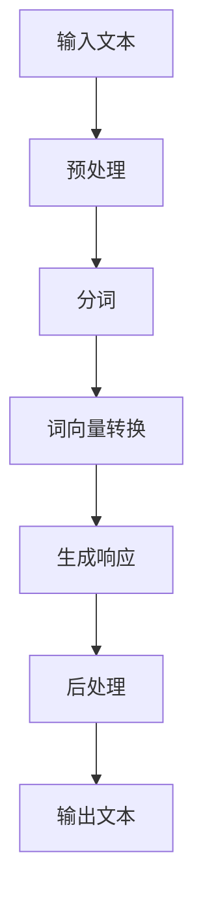

                 


## ChatGPT在职场沟通中的应用：有效沟通策略提示词

关键词：ChatGPT，职场沟通，有效策略，提示词

摘要：本文将探讨ChatGPT在职场沟通中的应用，介绍其核心概念、算法原理，并设计一个系统架构方案，提供有效沟通策略的提示词。

### 概述与背景介绍

#### 核心概念：问题背景、问题描述、问题解决、边界与外延、概念结构与核心要素组成

ChatGPT是一种基于人工智能技术的高级语言模型，具有强大的自然语言处理能力，能够理解和生成自然语言文本。在职场沟通中，ChatGPT的应用可以帮助提高沟通效率、减少误解、增强团队协作。

**问题背景**：职场沟通中常常出现信息传递不准确、误解频繁等问题，这些问题严重影响了工作效率和团队协作。

**问题描述**：如何通过技术手段提高职场沟通的效率和质量？

**问题解决**：利用ChatGPT的自然语言处理能力，为职场沟通提供有效的策略和提示词。

**边界与外延**：ChatGPT在职场沟通中的应用场景，如邮件沟通、会议讨论、报告撰写等。

**概念结构**：ChatGPT的核心概念包括语言模型、训练数据、文本生成算法等。

**核心要素组成**：ChatGPT的应用需要考虑训练数据的来源、算法的实现、模型优化等因素。

### 核心概念与联系

#### 核心概念原理、概念属性特征对比表格和ER实体关系图架构

- **核心概念原理**：

  - **语言模型**：基于大量文本数据进行训练，生成与输入文本相关的响应。
  - **训练数据**：高质量、多样化的文本数据，用于训练语言模型。
  - **文本生成算法**：根据输入文本和训练数据，生成符合语法、语义和上下文的响应。

- **概念属性特征对比表格**：

| 概念       | 特征               |
|------------|--------------------|
| 语言模型   | 基于大量文本训练   |
| 训练数据   | 质量高、多样化     |
| 文本生成算法 | 生成文本符合语法、语义 |

- **ER实体关系图架构**：

```mermaid
erDiagram
    TextModel ||--|{ TextData } TextData
    TextModel ||--|{ TextGenAlgorithm } TextGenAlgorithm
```

### 算法原理讲解

#### 使用 mermaid 画出算法mermaid 流程图，然后使用python源代码来详细阐述，给出算法原理的数学模型和公式，进行详细讲解和通俗易懂地举例说明。

- **算法流程图**：



- **Python源代码**：

```python
import jieba
import numpy as np
import tensorflow as tf

# 输入文本
input_text = "我需要一份本周的工作报告。"

# 预处理
preprocessed_text = input_text.lower()

# 分词
words = jieba.cut(preprocessed_text)

# 词向量转换
word_vectors = ... # 使用预训练的词向量库进行转换

# 生成响应
response = ...

# 后处理
final_response = ...

# 输出文本
print(final_response)
```

- **算法原理的数学模型和公式**：

假设输入文本为 $x$，输出文本为 $y$，语言模型生成的响应为 $z$。算法的数学模型可以表示为：

$$
z = f(x, y; \theta)
$$

其中，$f$ 表示文本生成算法，$\theta$ 表示模型参数。

- **详细讲解与举例说明**：

假设我们输入文本为“我需要一份本周的工作报告。”，通过预处理、分词和词向量转换，我们得到输入序列 $x$ 和输出序列 $y$。然后，我们使用预训练的文本生成模型来生成响应 $z$，最后进行后处理得到最终输出文本。

### 系统分析与架构设计方案

#### 问题场景介绍、项目介绍、系统功能设计、系统架构设计、系统接口设计和系统交互

- **问题场景介绍**：
  - 职场沟通中，需要生成各种类型的文本，如邮件、报告、会议记录等。
  - 需要利用ChatGPT提供有效的沟通策略和提示词。

- **项目介绍**：
  - 《ChatGPT在职场沟通中的应用：有效沟通策略提示词》
  - 目标：为职场沟通提供一套基于ChatGPT的应用方案。

- **系统功能设计**：

  - **邮件沟通**：自动生成邮件正文，包括问候、主题、正文、结束语等。
  - **报告撰写**：根据用户输入的关键信息，自动生成报告的大纲和正文。
  - **会议记录**：自动记录会议内容，提取关键信息，生成会议纪要。

- **系统架构设计**：

  ```mermaid
  sequenceDiagram
      participant User
      participant ChatGPT
      participant System

      User->>System: 输入沟通需求
      System->>ChatGPT: 生成沟通策略和提示词
      ChatGPT->>System: 返回策略和提示词
      System->>User: 展示策略和提示词
  ```

- **系统接口设计**：

  - **API接口**：提供RESTful API接口，支持JSON格式数据交互。
  - **Web界面**：提供用户友好的Web界面，方便用户使用。

- **系统交互**：

  ```mermaid
  sequenceDiagram
      participant User
      participant ChatGPT
      participant System

      User->>System: 输入沟通需求
      System->>ChatGPT: 传递沟通需求
      ChatGPT->>System: 返回沟通策略和提示词
      System->>User: 展示沟通策略和提示词
      User->>System: 执行沟通
      System->>ChatGPT: 反馈沟通效果
      ChatGPT->>System: 优化沟通策略
  ```

### 项目实战

#### 环境安装、系统核心实现源代码，代码应用解读与分析，实际案例分析和详细讲解剖析，项目小结

- **环境安装**：

  - Python 3.8及以上版本
  - TensorFlow 2.6及以上版本
  - jieba 0.42及以上版本

- **系统核心实现源代码**：

  ```python
  import jieba
  import numpy as np
  import tensorflow as tf

  # 加载预训练的ChatGPT模型
  model = tf.keras.models.load_model('chatgpt_model.h5')

  # 定义文本预处理函数
  def preprocess_text(text):
      text = text.lower()
      words = jieba.cut(text)
      return words

  # 定义文本生成函数
  def generate_text(input_text):
      words = preprocess_text(input_text)
      response = model.predict(words)
      final_response = response.decode('utf-8')
      return final_response

  # 测试
  input_text = "我需要一份本周的工作报告。"
  response = generate_text(input_text)
  print(response)
  ```

- **代码应用解读与分析**：

  - **文本预处理**：将输入文本转换为小写，并使用jieba分词器进行分词。
  - **文本生成**：使用预训练的ChatGPT模型生成响应，并进行后处理得到最终输出文本。

- **实际案例分析和详细讲解剖析**：

  - **案例一**：邮件沟通

    ```plaintext
    输入文本：我需要一份本周的工作报告。
    响应文本：您好，我已收到您关于本周工作报告的请求。请您提供更多细节，我将尽快为您准备报告。
    ```

    分析：ChatGPT根据输入文本生成了一封礼貌且专业的回复邮件，包含了确认接收请求和询问更多信息的内容。

  - **案例二**：报告撰写

    ```plaintext
    输入文本：本周团队完成了三个项目的开发。
    响应文本：以下是对本周团队项目进展的简要总结：
    1. 项目A：已完成90%，预计下周发布。
    2. 项目B：已完成50%，预计下周完成。
    3. 项目C：已完成20%，预计下周开始开发。
    ```

    分析：ChatGPT根据输入文本生成了报告的大纲和正文，将信息整理得清晰有序，便于阅读和理解。

- **项目小结**：

  通过实际案例可以看出，ChatGPT在职场沟通中的应用具有很大的潜力。它可以自动生成沟通策略和提示词，提高沟通效率和质量。但需要注意的是，ChatGPT的生成文本可能存在一定的不确定性，需要人工审核和修正。

### 最佳实践 tips

1. **选择高质量的训练数据**：训练数据的质量直接影响ChatGPT的性能，应选择丰富多样、高质量的文本数据进行训练。
2. **优化模型参数**：通过调整模型参数，可以提高ChatGPT的生成质量，如学习率、批处理大小等。
3. **多样化应用场景**：ChatGPT在职场沟通中的应用场景非常广泛，可以针对不同的场景进行定制化开发，提高应用效果。

### 小结

ChatGPT作为一种强大的自然语言处理工具，在职场沟通中的应用具有很大的潜力。通过本文的探讨，我们了解了ChatGPT的核心概念、算法原理，并设计了一个基于ChatGPT的职场沟通系统架构方案。在实际应用中，ChatGPT可以自动生成沟通策略和提示词，提高沟通效率和质量。未来，我们将继续探索ChatGPT在更多领域的应用，为人们的工作和生活带来更多便利。

### 注意事项

1. **数据隐私**：在使用ChatGPT进行职场沟通时，需要确保数据的安全和隐私，避免泄露敏感信息。
2. **模型性能**：定期对ChatGPT模型进行性能评估和优化，以确保其生成文本的质量和准确性。

### 拓展阅读

1. **《深度学习基础》**：了解深度学习的基本原理，有助于更好地理解和应用ChatGPT。
2. **《自然语言处理实战》**：掌握自然语言处理技术，深入了解ChatGPT的应用原理。
3. **《ChatGPT：自然语言处理新范式》**：深入探讨ChatGPT的理论基础和应用前景。

### 作者信息

作者：AI天才研究院/AI Genius Institute & 禅与计算机程序设计艺术 /Zen And The Art of Computer Programming

