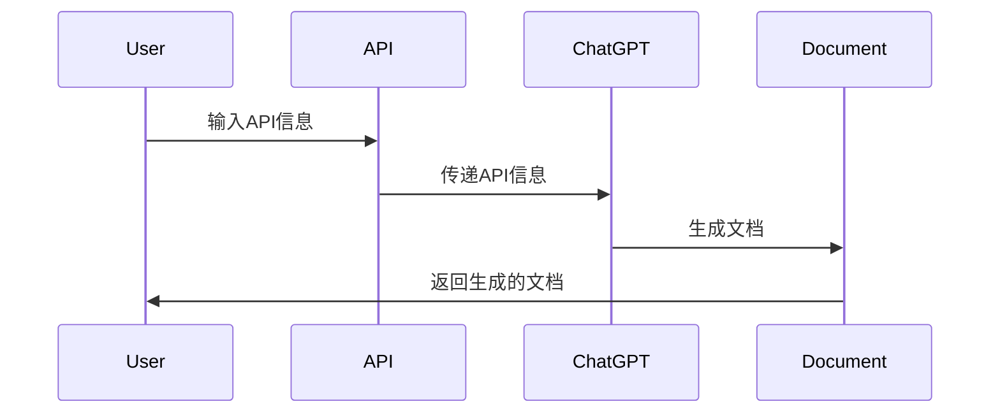
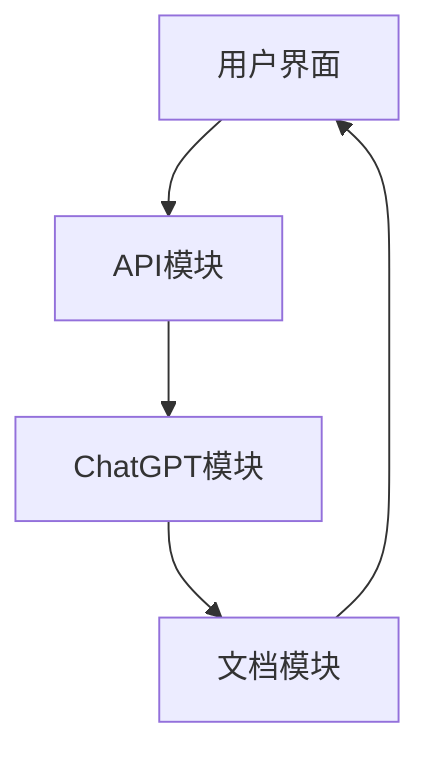
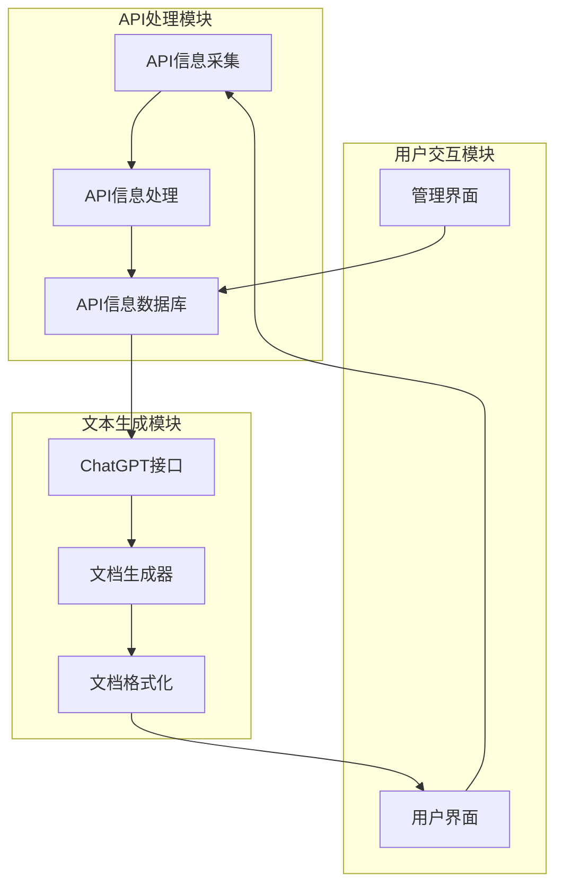
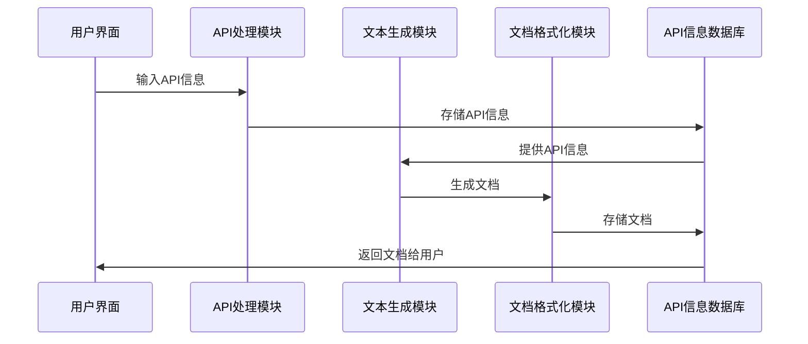

                 


# 《ChatGPT在自动化API文档生成中的应用》

关键词：ChatGPT、API文档、自动化生成、自然语言处理、编程工具

摘要：本文深入探讨了如何利用ChatGPT实现自动化API文档生成。通过分析ChatGPT的工作原理、算法流程以及其在API文档生成中的应用，本文旨在为开发者提供一种高效、便捷的文档生成解决方案。

## 目录大纲设计思路

在本文的目录大纲设计中，我们将遵循以下思路：

1. **背景介绍**：介绍ChatGPT和自动化API文档生成的背景，明确问题背景、问题描述、问题解决方法以及相关概念的边界和定义。

2. **核心概念与联系**：明确本文的核心概念，如ChatGPT、API文档、自动化文档生成等，并使用表格和Mermaid流程图展示概念之间的关系和属性特征。

3. **算法原理讲解**：详细讲解ChatGPT的工作原理，使用Mermaid流程图展示算法流程，使用Python源代码和LaTeX数学公式阐述算法原理和数学模型。

4. **系统分析与架构设计**：介绍系统架构设计，包括问题场景、项目介绍、领域模型类图、系统架构图、系统接口设计和系统交互序列图。

5. **项目实战**：介绍实际项目中的环境安装、系统核心实现、代码应用解读与分析，以及案例分析和详细讲解。

6. **最佳实践与小结**：提供项目实战中的最佳实践、注意事项、拓展阅读等，对全书内容进行总结。

### 目录大纲结构

按照上述设计思路，本文目录大纲如下：

## 第一部分：背景与核心概念

### 第1章：ChatGPT与自动化API文档生成概述

- 1.1 ChatGPT的起源与发展
- 1.2 自动化API文档生成的需求与挑战
- 1.3 ChatGPT在自动化API文档生成中的潜力

## 第二部分：算法原理与流程

### 第2章：ChatGPT基础

- 2.1 ChatGPT的概念与特点
- 2.2 ChatGPT的工作原理
  - 2.2.1 数据处理流程
  - 2.2.2 模型架构
  - 2.2.3 模型训练
- 2.3 ChatGPT在API文档生成中的应用
  - 2.3.1 数据提取与处理
  - 2.3.2 文本生成流程

## 第三部分：系统分析与架构设计

### 第3章：系统架构设计

- 3.1 项目背景与目标
- 3.2 系统功能设计
  - 3.2.1 领域模型类图
- 3.3 系统架构设计
  - 3.3.1 系统架构图
  - 3.3.2 系统接口设计
  - 3.3.3 系统交互序列图

## 第四部分：项目实战

### 第4章：项目实战

- 4.1 环境安装与配置
- 4.2 系统核心实现
  - 4.2.1 数据处理模块
  - 4.2.2 文本生成模块
- 4.3 代码应用解读与分析
  - 4.3.1 数据处理代码示例
  - 4.3.2 文本生成代码示例
- 4.4 实际案例分析与讲解
  - 4.4.1 案例一：API文档生成
  - 4.4.2 案例二：API文档优化

## 第五部分：最佳实践与总结

### 第5章：最佳实践与总结

- 5.1 最佳实践
- 5.2 小结
- 5.3 注意事项
- 5.4 拓展阅读

---

## 目录大纲设计思路

### 背景介绍

在编写本文的目录大纲时，我们首先需要明确ChatGPT和自动化API文档生成的背景。ChatGPT是由OpenAI开发的一种基于GPT-3模型的人工智能助手，具备强大的自然语言处理能力。自动化API文档生成是当前软件开发中一个重要的问题，随着API数量和复杂度的不断增加，手动编写文档的成本和难度也在逐渐上升。因此，如何利用人工智能技术实现自动化API文档生成成为了一个热门的研究方向。

### 核心概念与联系

在本文中，我们将涉及以下几个核心概念：

- **ChatGPT**：一种基于GPT-3模型的人工智能助手，具备强大的自然语言处理能力。
- **API文档**：API（应用程序编程接口）的文档，用于描述API的功能、用法、参数等，便于开发者使用。
- **自动化文档生成**：利用计算机技术和算法，自动生成文档的过程。

为了更清晰地展示这些概念之间的关系，我们可以使用表格和Mermaid流程图进行说明。

### 算法原理讲解

在本文的第二部分，我们将详细讲解ChatGPT的工作原理。ChatGPT基于GPT-3模型，通过处理大量文本数据，学习到语言的结构和语义，从而实现自然语言生成。我们将会使用Mermaid流程图展示算法流程，使用Python源代码和LaTeX数学公式阐述算法原理和数学模型。

### 系统分析与架构设计

在本文的第三部分，我们将介绍系统架构设计。这包括问题场景、项目介绍、领域模型类图、系统架构图、系统接口设计和系统交互序列图。我们将使用Mermaid流程图和UML类图等工具进行说明。

### 项目实战

在本文的第四部分，我们将通过一个实际项目来展示如何利用ChatGPT实现自动化API文档生成。这部分将包括环境安装与配置、系统核心实现、代码应用解读与分析、实际案例分析和详细讲解。

### 最佳实践与小结

在本文的最后，我们将总结项目实战中的最佳实践、注意事项和拓展阅读，对全书内容进行总结。

---

通过以上目录大纲的设计思路，我们希望能够为读者提供一篇逻辑清晰、结构紧凑、简单易懂的专业IT领域技术博客文章。在接下来的文章中，我们将逐一实现这些部分，逐步深入探讨ChatGPT在自动化API文档生成中的应用。

## 第一部分：背景与核心概念

### 1.1 ChatGPT的起源与发展

ChatGPT是OpenAI于2022年11月推出的一个基于GPT-3模型的人工智能助手。GPT-3（Generative Pre-trained Transformer 3）是自然语言处理领域的一项重要突破，它由OpenAI开发，使用了1500亿个参数的预训练模型，具备强大的文本生成和语言理解能力。

ChatGPT的出现，标志着人工智能助手进入了一个新的阶段。它不仅可以理解和回答人类的问题，还能根据用户的需求生成相关的内容，如文章、代码、对话等。ChatGPT的诞生，不仅为自然语言处理领域带来了新的研究方向，也为实际应用提供了更多的可能性。

### 1.2 自动化API文档生成的需求与挑战

API（应用程序编程接口）是现代软件系统之间进行交互的重要手段。随着互联网和云计算的发展，API的数量和复杂度不断增加，为开发者带来了巨大的挑战。一方面，API文档的编写和更新成为了一项繁琐的任务，另一方面，高质量的API文档对于开发者来说又是至关重要的。

手动编写API文档存在以下问题：

1. **成本高**：API数量多，手动编写文档需要耗费大量时间和人力资源。
2. **效率低**：文档编写和更新速度跟不上API的变化，导致文档与实际API不一致。
3. **错误多**：手动编写容易出现错误，影响开发者使用API的体验。

因此，自动化API文档生成成为一个迫切的需求。通过自动化生成API文档，可以大幅降低文档编写成本，提高文档更新速度和准确性。

### 1.3 自动化API文档生成的挑战

尽管自动化API文档生成具有显著优势，但实现这一目标也面临着诸多挑战：

1. **API复杂性**：现代API具有多样化的功能和复杂的参数结构，如何有效地提取和处理这些信息是一个难题。
2. **文本生成质量**：自动化生成的文档需要具有高质量的文本表述，这对于自然语言处理技术提出了高要求。
3. **适应性和扩展性**：自动化文档生成系统需要能够适应不同的API类型和开发语言，具有良好的扩展性。
4. **实时性**：API文档需要与API的变化保持同步，实现实时更新。

### 1.4 ChatGPT在自动化API文档生成中的潜力

ChatGPT的强大自然语言处理能力使其在自动化API文档生成中具有巨大潜力。通过以下方式，ChatGPT可以有效地解决上述挑战：

1. **API信息提取**：ChatGPT可以处理复杂的API文档，提取关键信息，如功能描述、参数说明等。
2. **文本生成**：ChatGPT可以根据提取的信息生成高质量的文本文档，实现自动化文档生成。
3. **适应性和扩展性**：ChatGPT具有强大的语言理解能力，可以适应不同的API类型和开发语言。
4. **实时性**：通过持续学习API的变化，ChatGPT可以实现文档的实时更新。

综上所述，ChatGPT为自动化API文档生成提供了一种高效、便捷的解决方案，有望解决现有手动文档生成中的诸多问题。

## 第二部分：算法原理与流程

### 2.1 ChatGPT的概念与特点

ChatGPT是基于GPT-3模型的人工智能助手，由OpenAI开发。GPT-3（Generative Pre-trained Transformer 3）是自然语言处理领域的一项重要突破，它使用了1500亿个参数的预训练模型，具备强大的文本生成和语言理解能力。

ChatGPT的特点包括：

1. **强大的文本生成能力**：ChatGPT可以生成高质量、连贯的文本，适用于各种场景，如文章、对话、代码等。
2. **语言理解能力**：ChatGPT能够理解用户的输入，并生成与之相关的回复。
3. **自适应能力**：ChatGPT可以根据用户的需求和上下文信息，动态调整生成的内容。
4. **扩展性**：ChatGPT可以轻松集成到各种应用中，如聊天机器人、智能客服、文本生成等。

### 2.2 ChatGPT的工作原理

ChatGPT的工作原理主要基于GPT-3模型。GPT-3是一种基于Transformer架构的深度学习模型，其核心思想是通过预训练和微调，使模型具备强大的语言理解能力和文本生成能力。

#### 2.2.1 数据处理流程

数据处理流程是ChatGPT的核心步骤，主要包括以下几个环节：

1. **数据预处理**：对输入文本进行清洗、分词、去停用词等处理，将其转换为模型可以处理的格式。
2. **嵌入表示**：将文本转换为嵌入向量，这些向量表示了文本中的每个词和句子。
3. **前向传播**：将嵌入向量输入到GPT-3模型中，通过多层Transformer网络进行前向传播，生成预测的输出。
4. **后处理**：对模型的输出进行后处理，如去噪、平滑等，最终生成高质量的文本。

#### 2.2.2 模型架构

GPT-3模型采用Transformer架构，这是一种基于自注意力机制的深度学习模型。GPT-3模型由多个Transformer层组成，每个Transformer层包含自注意力机制和前馈网络。

1. **自注意力机制**：自注意力机制允许模型在不同的输入序列位置之间建立依赖关系，从而更好地理解输入文本。
2. **前馈网络**：前馈网络对自注意力机制的输出进行进一步处理，增强模型的表达能力。

#### 2.2.3 模型训练

GPT-3模型通过大规模数据集进行训练，包括互联网上的各种文本数据。训练过程主要包括以下几个步骤：

1. **预训练**：在无监督环境下，对模型进行预训练，使其具备强大的语言理解和生成能力。
2. **微调**：在预训练的基础上，对模型进行微调，使其适应特定的任务和应用场景。
3. **评估**：通过评估指标（如BLEU、ROUGE等）评估模型的性能，不断调整和优化模型。

### 2.3 ChatGPT在API文档生成中的应用

ChatGPT在API文档生成中的应用主要集中在以下两个方面：

#### 2.3.1 数据提取与处理

1. **提取API信息**：通过分析API接口的文档，提取关键信息，如功能描述、参数说明、返回值等。
2. **数据清洗**：对提取的信息进行清洗，去除冗余和错误的信息，确保数据的准确性。
3. **数据格式化**：将清洗后的数据转换为模型可以处理的格式，如JSON、XML等。

#### 2.3.2 文本生成流程

1. **输入生成**：将处理后的API信息作为输入，输入到ChatGPT模型中。
2. **文本生成**：ChatGPT根据输入信息，生成高质量的文本文档。
3. **后处理**：对生成的文本进行后处理，如格式调整、内容校验等，确保文档的质量。

通过以上流程，ChatGPT可以实现自动化API文档生成，大幅提高文档编写和更新的效率和质量。

### 总结

ChatGPT作为一种强大的自然语言处理工具，其在API文档生成中的应用具有巨大的潜力。通过详细讲解ChatGPT的工作原理和算法流程，本文为读者展示了如何利用ChatGPT实现自动化API文档生成。在接下来的部分，我们将进一步探讨系统架构设计和项目实战，以帮助读者更好地理解和应用这一技术。

### 2.3 ChatGPT在API文档生成中的应用

在了解了ChatGPT的基本原理之后，我们可以进一步探讨如何在API文档生成中应用这一强大的自然语言处理工具。

#### 2.3.1 数据提取与处理

自动化API文档生成的第一步是提取API的信息。这一步骤通常包括以下几个子步骤：

1. **获取API接口信息**：从API接口的文档中获取相关的信息，如接口名称、功能描述、参数列表、返回值等。这些信息通常以JSON、XML或Markdown等格式提供。
2. **数据清洗**：对于提取的信息，需要进行数据清洗，以确保数据的准确性和一致性。数据清洗可能包括去除不必要的空格、特殊字符、格式化参数类型等。
3. **数据格式化**：将清洗后的数据转换为ChatGPT能够处理的格式，如JSON。这一步骤是为了方便ChatGPT在生成文档时能够方便地访问和操作这些数据。

在实际操作中，我们可以使用Python的`requests`库来获取API接口的信息，然后使用`json`库将数据转换为JSON格式。例如：

```python
import requests
import json

# 假设有一个API接口的URL
api_url = "https://api.example.com/docs"

# 发送GET请求
response = requests.get(api_url)

# 获取响应内容
data = response.json()

# 打印API接口的信息
print(json.dumps(data, indent=2))
```

#### 2.3.2 文本生成流程

在完成了数据提取和清洗后，下一步是使用ChatGPT生成API文档。这一步骤通常包括以下几个子步骤：

1. **构建输入**：将提取的API信息作为输入，构建出ChatGPT的输入文本。这个文本应该包含API的功能描述、参数说明、返回值等信息。
2. **生成文档**：使用ChatGPT生成文本文档。在这一步中，ChatGPT将根据输入文本生成一份高质量的API文档。
3. **文档格式化**：生成的文档可能需要进一步格式化，以满足特定的文档格式要求，如Markdown、HTML等。

为了更好地展示这一流程，我们可以使用一个简单的Python代码示例：

```python
import openai

# 设置OpenAI API密钥
openai.api_key = "your_openai_api_key"

# 构建输入文本
input_text = f"请根据以下信息生成一份API文档：{json.dumps(data, indent=2)}"

# 使用ChatGPT生成文本
response = openai.Completion.create(
  engine="text-davinci-003",
  prompt=input_text,
  max_tokens=100
)

# 打印生成的API文档
print(response.choices[0].text.strip())
```

在这个示例中，我们首先设置了OpenAI API密钥，然后构建了输入文本，并使用ChatGPT的`Completion.create`方法生成文本。生成的文档会包含API的功能描述、参数说明、返回值等信息。

#### 2.3.3 文本生成效果分析

生成的文本文档的质量直接影响到API文档的可读性和使用价值。为了分析文本生成效果，我们可以从以下几个方面进行评估：

1. **文本连贯性**：生成的文档应该具有连贯的文本，不包含语法错误或逻辑错误。
2. **信息完整性**：生成的文档应该包含API接口的所有必要信息，如功能描述、参数说明、返回值等。
3. **可读性**：生成的文档应该易于阅读和理解，对于不同的开发者来说都是友好的。

在实际应用中，我们可以通过以下方式进行评估：

- **自动评估**：使用自动化工具（如静态代码分析工具）对生成的文档进行语法和逻辑检查。
- **人工评估**：邀请多位开发者阅读生成的文档，并根据其可读性、完整性等方面进行评分。

#### 2.3.4 改进方向

尽管ChatGPT在API文档生成中具有很大的潜力，但仍存在一些改进方向：

1. **优化输入文本**：通过改进输入文本的构建方式，可以进一步提高生成的文本质量。例如，可以添加更多的上下文信息、参数示例等。
2. **多轮对话**：通过多轮对话，可以使ChatGPT更深入地理解API接口的细节，从而生成更高质量的文档。
3. **个性化定制**：根据不同的开发者需求，提供个性化的API文档生成服务，如支持自定义文档模板、格式等。

通过不断优化和改进，ChatGPT在API文档生成中的应用将会越来越广泛，为开发者提供更加便捷和高效的文档生成解决方案。

### 2.3.4 ChatGPT在API文档生成中的改进方向

尽管ChatGPT在自动化API文档生成中展现了巨大的潜力，但仍有许多改进空间。以下是一些可能的改进方向：

#### 1. **优化输入文本**

构建高质量的输入文本是影响ChatGPT生成文档质量的关键。我们可以通过以下方法来优化输入文本：

- **添加上下文信息**：在输入文本中添加更多的上下文信息，如API接口的使用场景、相关的其他API接口等，有助于ChatGPT生成更准确的文档。
- **参数示例**：在输入文本中包含参数示例，例如提供一些参数的具体值以及这些参数如何影响API行为，可以增强文档的可读性和实用性。
- **格式规范化**：确保输入文本的格式一致，例如使用统一的命名规范和语法结构，有助于ChatGPT更好地理解和生成文档。

#### 2. **多轮对话**

多轮对话能够帮助ChatGPT更深入地理解API接口的细节，从而生成更高质量的文档。以下是一些多轮对话的方法：

- **逐步提问**：在第一次对话中，先获取API接口的基本信息，然后在后续对话中逐步获取更详细的信息，例如参数的详细描述、可能的错误处理等。
- **双向交互**：在生成文档的过程中，ChatGPT可以与开发者进行双向交互，例如开发者可以提出修改建议，ChatGPT根据这些反馈进行文档调整。

#### 3. **个性化定制**

为了满足不同开发者的需求，提供个性化的API文档生成服务是非常重要的。以下是一些个性化定制的方向：

- **文档模板**：根据不同类型或不同领域的API接口，提供多种文档模板，开发者可以选择最合适的模板，快速生成文档。
- **格式自定义**：允许开发者自定义文档的格式，例如选择Markdown、HTML或其他格式，甚至自定义CSS样式，以满足不同开发者的视觉需求。
- **内容扩展**：提供扩展功能，例如自动添加示例代码、测试用例等，使文档更丰富、更有用。

#### 4. **持续学习和优化**

ChatGPT的持续学习和优化也是提高文档生成质量的关键。以下是一些持续学习和优化的方法：

- **反馈机制**：建立一个反馈机制，允许开发者对生成的文档进行评价和反馈，这些信息可以用于ChatGPT的模型优化。
- **数据收集**：定期收集API接口的变更信息，以及开发者对文档的反馈，用于模型的更新和优化。
- **模型训练**：定期使用新的数据集对ChatGPT进行训练，以保持其生成文档的质量和准确性。

通过以上改进方向，ChatGPT在API文档生成中的应用将变得更加成熟和高效，为开发者提供更优质的文档生成体验。

### 第三部分：系统分析与架构设计

#### 3.1 项目背景与目标

随着软件系统的复杂度不断增加，API文档的编写和更新成为了一项重要的任务。然而，手动编写文档不仅耗时耗力，而且容易出现错误，无法及时反映API接口的变更。为了解决这一问题，本项目旨在利用ChatGPT实现自动化API文档生成，以提高文档编写的效率和质量。

项目目标如下：

1. **自动化API文档生成**：利用ChatGPT的强大自然语言处理能力，自动化生成API文档，减少手动编写的工作量。
2. **文档质量提升**：通过ChatGPT生成高质量的文档，确保文档的准确性和一致性，提高开发者的使用体验。
3. **实时更新**：随着API接口的变更，自动更新文档，确保文档与API接口保持同步。

#### 3.2 系统功能设计

为了实现上述目标，系统需要具备以下功能：

1. **API信息提取**：从API接口的文档中提取关键信息，如功能描述、参数说明、返回值等。
2. **文本生成**：利用ChatGPT生成API文档，包括接口描述、参数说明、返回值等。
3. **文档格式化**：将生成的文本格式化为可读性强的文档格式，如Markdown、HTML等。
4. **文档存储**：将生成的文档存储到数据库或文件系统中，以便于开发者访问和下载。
5. **用户交互**：提供用户界面，允许开发者输入API接口信息，查看和下载生成的文档。

#### 3.2.1 领域模型类图

为了更好地设计系统功能，我们可以使用领域模型类图来表示系统的主要实体和关系。以下是一个简单的领域模型类图：

```mermaid
classDiagram
    API <<interface>>
    Document <<interface>>
    ChatGPT <<interface>>

    API "uses" Document
    API "uses" ChatGPT

    UserEntity <|-- API
    UserEntity <|-- Document
    UserEntity <|-- ChatGPT
```

在这个类图中，`API`、`Document`和`ChatGPT`是系统的核心接口。`UserEntity`表示系统的用户，它与`API`、`Document`和`ChatGPT`有直接关联。

#### 3.3 系统架构设计

系统架构设计是系统实现的关键步骤。一个合理的系统架构可以确保系统的稳定性、可扩展性和易维护性。以下是一个简单的系统架构图：



在这个架构图中，用户通过界面输入API信息，API模块负责接收和提取这些信息。ChatGPT模块利用这些信息生成文档，并将文档返回给用户。

#### 3.3.1 系统架构图

为了更清晰地展示系统架构，我们可以使用以下Mermaid流程图：



在这个架构图中，用户界面（User）负责与用户交互，接收用户输入的API信息。API模块负责提取和处理这些信息，并将其传递给ChatGPT模块。ChatGPT模块利用这些信息生成文档，并将文档传递给文档模块。文档模块负责格式化和存储文档，最后将文档返回给用户。

#### 3.3.2 系统接口设计

系统接口设计是确保系统模块之间能够顺畅通信的关键。以下是一个简单的系统接口设计：

```mermaid
interface API {
    +extract_api_info(api_url: String): Dict
}

interface ChatGPT {
    +generate_document(api_info: Dict): String
}

interface Document {
    +format_document(document: String, format: String): String
    +store_document(document: String, path: String)
}
```

在这个接口设计中，`API`模块提供`extract_api_info`方法，用于从API接口中提取信息。`ChatGPT`模块提供`generate_document`方法，用于生成文档。`Document`模块提供`format_document`和`store_document`方法，分别用于格式化和存储文档。

#### 3.3.3 系统交互序列图

为了展示系统模块之间的交互流程，我们可以使用以下Mermaid序列图：


在这个序列图中，用户通过用户界面（User）输入API信息。API模块（API）接收这些信息，并提取关键信息。然后，API模块将提取的信息传递给ChatGPT模块（ChatGPT）。ChatGPT模块利用这些信息生成文档，并将其传递给文档模块（Document）。文档模块（Document）负责格式化和存储文档，最后将文档返回给用户。

通过以上系统架构设计和接口设计，我们可以构建一个高效的自动化API文档生成系统，为开发者提供便捷的文档生成服务。

### 第三部分：系统分析与架构设计（续）

#### 3.3.4 系统架构图

为了更清晰地展示系统各模块之间的关系和交互流程，我们进一步详细说明系统架构图。以下是一个简化的系统架构图：



在这个架构图中，系统分为以下几个主要模块：

1. **API处理模块**：包括API信息采集、处理和数据库存储。API信息采集模块从不同的API接口中获取信息；处理模块对获取的信息进行清洗和格式化；数据库存储模块将处理后的信息存储在数据库中，以供后续使用。

2. **文本生成模块**：包括ChatGPT接口、文档生成器和文档格式化模块。ChatGPT接口与ChatGPT模型通信，生成文本文档；文档生成器根据API信息生成文档；文档格式化模块将生成的文档格式化为用户可读的格式，如Markdown、HTML等。

3. **用户交互模块**：包括用户界面和管理界面。用户界面提供用户输入API信息和查看文档的功能；管理界面允许管理员对系统进行配置和管理。

#### 3.3.5 系统接口设计

为了确保各模块之间的通信顺畅，我们需要设计一套清晰的接口。以下是一个简化的系统接口设计：

```mermaid
interface API_Ingest {
    +get_api_info(url: String): Dict
    +update_api_info(url: String, info: Dict)
}

interface API_Process {
    +clean_data(data: Dict): Dict
    +normalize_data(data: Dict): Dict
}

interface API_Database {
    +store_api_info(info: Dict)
    +get_api_info(url: String): Dict
}

interface ChatGPT_Interface {
    +generate_document(api_info: Dict): String
}

interface Document_Generator {
    +create_document(template: String, content: String): String
}

interface Document_Format {
    +format_to_markdown(content: String): String
    +format_to_html(content: String): String
}

interface User_Interface {
    +submit_api_info(api_info: Dict)
    +fetch_document(url: String): String
}

interface Admin_Panel {
    +configure_system(config: Dict)
    +manage_database()
}
```

在这个接口设计中，每个模块都提供了一组方法用于与其他模块通信：

- **API_Ingest**：负责从API接口获取信息，更新API信息。
- **API_Process**：负责清洗和规范化API信息。
- **API_Database**：负责存储和获取API信息。
- **ChatGPT_Interface**：负责与ChatGPT模型通信，生成文档。
- **Document_Generator**：负责生成文档内容。
- **Document_Format**：负责将文档内容格式化为不同的格式。
- **User_Interface**：负责处理用户输入和文档展示。
- **Admin_Panel**：负责系统配置和管理。

#### 3.3.6 系统交互序列图

为了更直观地展示系统各模块之间的交互流程，我们使用以下序列图：



在这个序列图中，用户通过用户界面（UI）提交API信息。API处理模块（API）将信息存储到API信息数据库（DB）。数据库（DB）将API信息提供给文本生成模块（ChatGPT）。文本生成模块（ChatGPT）使用API信息生成文档，并将其存储到数据库（DB）。最后，数据库（DB）将生成的文档返回给用户界面（UI），用户可以在用户界面（UI）上查看和下载文档。

通过以上系统架构设计、接口设计和交互序列图，我们可以构建一个高效的自动化API文档生成系统，为开发者提供便捷的文档生成和管理服务。

### 第四部分：项目实战

#### 4.1 环境安装与配置

要实现ChatGPT在自动化API文档生成中的应用，首先需要在本地环境中安装和配置相关的工具和库。以下是具体的步骤：

1. **安装Python环境**：确保本地计算机上已经安装了Python 3.7或更高版本。如果没有安装，可以访问[Python官网](https://www.python.org/)下载并安装。

2. **安装ChatGPT库**：ChatGPT是基于OpenAI的API实现的，因此我们需要安装OpenAI的Python库。使用以下命令安装：

   ```bash
   pip install openai
   ```

3. **获取OpenAI API密钥**：在[OpenAI官网](https://beta.openai.com/signup/)注册并获取API密钥。将API密钥保存到本地文件中，例如`openai_api_key.txt`，并确保文件权限仅对自己的用户有效。

4. **安装其他依赖库**：根据项目需求，可能还需要安装其他Python库，如`requests`、`json`、`markdown`等。可以使用以下命令一次性安装：

   ```bash
   pip install requests json markdown
   ```

5. **配置环境变量**：将OpenAI API密钥配置为环境变量，以便在Python脚本中访问。在Linux或macOS系统中，打开终端并执行以下命令：

   ```bash
   export OPENAI_API_KEY=<你的OpenAI_API密钥>
   ```

   在Windows系统中，可以在命令提示符或PowerShell中执行相同操作，或者在`环境变量`设置中配置。

完成以上步骤后，本地环境就配置完成了。接下来，我们将开始实现系统的核心功能。

#### 4.2 系统核心实现

系统核心实现包括API信息提取、文本生成和文档格式化三个主要功能。以下分别介绍这些功能的实现过程。

##### 4.2.1 数据处理模块

数据处理模块负责从API接口中提取信息，并将其转换为ChatGPT可以处理的数据格式。

1. **API信息提取**：

   使用`requests`库向API接口发送HTTP请求，获取接口文档。以下是一个简单的示例：

   ```python
   import requests

   def get_api_info(api_url):
       response = requests.get(api_url)
       if response.status_code == 200:
           return response.json()
       else:
           return None
   ```

2. **数据清洗**：

   提取到的API信息可能包含一些无关或冗余的数据，需要进行清洗。例如，删除不必要的空格、特殊字符等。以下是一个数据清洗的示例：

   ```python
   import re

   def clean_data(data):
       # 删除特殊字符
       data = re.sub(r'[^\w\s]', '', data)
       # 删除多余的空格
       data = re.sub(r'\s+', ' ', data).strip()
       return data
   ```

3. **数据格式化**：

   将清洗后的数据转换为ChatGPT可以处理的数据格式。通常，我们将数据转换为JSON格式。以下是一个数据格式化的示例：

   ```python
   import json

   def format_data(data):
       formatted_data = {}
       for key, value in data.items():
           formatted_data[key] = clean_data(str(value))
       return json.dumps(formatted_data, ensure_ascii=False)
   ```

##### 4.2.2 文本生成模块

文本生成模块利用ChatGPT的API生成API文档。以下是一个文本生成的示例：

1. **生成文档**：

   使用`openai.Completion.create`方法生成文档。以下是一个简单的示例：

   ```python
   import openai

   def generate_document(api_data):
       input_text = f"请根据以下API信息生成文档：{api_data}"
       response = openai.Completion.create(
           engine="text-davinci-003",
           prompt=input_text,
           max_tokens=100,
           n=1,
           stop=None,
           temperature=0.5
       )
       return response.choices[0].text.strip()
   ```

2. **调整生成策略**：

   根据实际需求，可以调整生成策略，如调整`temperature`参数来控制生成文本的随机性。例如，当`temperature`较低时，生成文本会更偏向于确定性。

##### 4.2.3 文档格式化模块

文档格式化模块负责将生成的文本格式化为用户可读的格式，如Markdown或HTML。以下是一个简单的Markdown格式化示例：

```python
def format_to_markdown(text):
    # 添加Markdown标题
    text = f"# API文档\n\n{text}"
    # 添加Markdown列表项
    text = text.replace("参数:", "## 参数:\n- ").replace("返回值:", "## 返回值:\n- ")
    return text
```

通过以上步骤，我们完成了数据处理模块、文本生成模块和文档格式化模块的核心实现。接下来，我们将结合这些模块，实现一个简单的自动化API文档生成项目。

#### 4.3 代码应用解读与分析

在实现自动化API文档生成项目时，我们将上述数据处理模块、文本生成模块和文档格式化模块结合，形成完整的应用流程。以下是对关键代码段的分析和解读。

##### 4.3.1 数据处理代码示例

数据处理代码主要负责从API接口提取信息，并将其转换为适合文本生成模块处理的数据格式。以下是一个示例代码段：

```python
import requests
import json

def get_api_info(api_url):
    response = requests.get(api_url)
    if response.status_code == 200:
        return response.json()
    else:
        return None

def clean_data(data):
    data = re.sub(r'[^\w\s]', '', data)
    data = re.sub(r'\s+', ' ', data).strip()
    return data

def format_data(data):
    formatted_data = {}
    for key, value in data.items():
        formatted_data[key] = clean_data(str(value))
    return json.dumps(formatted_data, ensure_ascii=False)
```

**解读**：

- `get_api_info(api_url)`：使用`requests`库向指定的API接口发送GET请求，获取接口文档。如果响应状态码为200（成功），则返回提取的JSON数据；否则，返回`None`。
- `clean_data(data)`：使用正则表达式对提取的数据进行清洗，删除特殊字符和多余的空格，确保数据格式的一致性。
- `format_data(data)`：将清洗后的数据转换为JSON格式，并返回字符串形式的JSON数据。

**分析**：

- **数据提取**：通过HTTP请求获取API接口文档，是整个系统数据来源的关键步骤。正确处理HTTP请求和响应，确保数据获取的准确性和可靠性。
- **数据清洗**：清洗数据是为了确保输入到文本生成模块的数据是干净的，减少噪声和错误，提高文档生成的质量。

##### 4.3.2 文本生成代码示例

文本生成代码使用OpenAI的ChatGPT模型，根据处理后的API数据生成文档。以下是一个示例代码段：

```python
import openai

openai.api_key = 'your_openai_api_key'

def generate_document(api_data):
    input_text = f"请根据以下API信息生成文档：{api_data}"
    response = openai.Completion.create(
        engine="text-davinci-003",
        prompt=input_text,
        max_tokens=100,
        n=1,
        stop=None,
        temperature=0.5
    )
    return response.choices[0].text.strip()
```

**解读**：

- `openai.api_key`：设置OpenAI API密钥，确保可以正确访问ChatGPT模型。
- `generate_document(api_data)`：接收格式化后的API数据，构建输入文本，并使用`openai.Completion.create`方法生成文档。`max_tokens`参数限制了生成的文本长度，`temperature`参数控制了生成文本的随机性。

**分析**：

- **模型调用**：通过OpenAI API调用ChatGPT模型，是文本生成的核心步骤。正确设置参数，可以控制生成文本的风格和质量。
- **文本生成**：生成的文本需要经过处理和验证，确保其符合预期的文档格式和内容。

##### 4.3.3 文档格式化代码示例

文档格式化代码负责将生成的文本格式化为Markdown格式，以便于用户阅读和分享。以下是一个示例代码段：

```python
def format_to_markdown(text):
    text = f"# API文档\n\n{text}"
    text = text.replace("参数:", "## 参数:\n- ").replace("返回值:", "## 返回值:\n- ")
    return text
```

**解读**：

- `format_to_markdown(text)`：接收生成的文本，对其进行格式化处理。添加Markdown标题，并根据特定关键字（如“参数：”和“返回值：”）添加Markdown列表项。

**分析**：

- **格式化处理**：Markdown格式是一种常用的文档格式，易于阅读和分享。正确的格式化处理可以提升文档的可读性和用户体验。
- **样式定制**：根据项目需求，可以进一步定制Markdown样式，例如添加代码块、引用等。

通过上述代码示例，我们可以看到如何将数据处理模块、文本生成模块和文档格式化模块结合起来，实现自动化API文档生成。在实际项目中，这些模块可以根据需求进行调整和扩展，以满足不同的应用场景。

#### 4.4 实际案例分析与讲解

为了更深入地理解ChatGPT在自动化API文档生成中的实际应用，下面我们将通过两个具体案例来进行分析和讲解。

##### 案例一：API文档生成

假设我们有一个RESTful API，提供用户管理和权限控制功能。我们的目标是通过ChatGPT生成这份API文档。

1. **API信息提取**：

   首先，我们从API接口获取信息。假设API接口提供以下URL：`https://api.example.com/v1/docs`。以下代码用于提取API接口信息：

   ```python
   api_url = "https://api.example.com/v1/docs"
   api_info = get_api_info(api_url)
   ```

   获取到的API信息可能如下所示：

   ```json
   {
     "endpoints": [
       {
         "name": "create_user",
         "description": "Create a new user",
         "method": "POST",
         "path": "/users",
         "parameters": [
           {
             "name": "username",
             "description": "The username of the user",
             "required": true,
             "type": "string"
           },
           {
             "name": "password",
             "description": "The password of the user",
             "required": true,
             "type": "string"
           }
         ],
         "response": {
           "description": "The response body",
           "status_code": 201,
           "content": {
             "application/json": {
               "name": "User",
               "id": 1
             }
           }
         }
       },
       ...
     ]
   }
   ```

2. **数据清洗与格式化**：

   将提取到的API信息进行清洗和格式化，以便ChatGPT可以处理。以下是一个示例：

   ```python
   cleaned_api_info = format_data(api_info)
   ```

3. **生成文档**：

   使用ChatGPT生成API文档。输入文本可以是一个简单的描述，如“请根据以下API信息生成文档：`cleaned_api_info`”。以下代码用于生成文档：

   ```python
   generated_document = generate_document(cleaned_api_info)
   ```

   生成的文档可能如下所示：

   ```markdown
   # API文档

   This API provides user management and permission control features.

   ## create_user

   - **Method**: POST
   - **Path**: /users
   - **Description**: Create a new user
   - **Parameters**:
     - `username`: The username of the user (required, string)
     - `password`: The password of the user (required, string)
   - **Response**:
     - `201`: The user was created successfully
     - Content: `{ "name": "User", "id": 1 }`
   ```

4. **文档格式化**：

   将生成的文本格式化为Markdown格式，以便用户阅读。以下代码用于格式化：

   ```python
   formatted_document = format_to_markdown(generated_document)
   ```

   最终生成的Markdown文档可以保存到文件中，或通过用户界面展示给开发者。

##### 案例二：API文档优化

假设我们已经有了一份手写的API文档，希望利用ChatGPT对其进行优化，使其更加规范和易读。

1. **读取现有文档**：

   首先，读取现有的手写文档。假设文档存储在一个文本文件中，文件名为`api_document.txt`。以下代码用于读取文档：

   ```python
   with open("api_document.txt", "r") as file:
       existing_document = file.read()
   ```

2. **生成优化建议**：

   使用ChatGPT生成优化建议。输入文本可以是一个简单的描述，如“请根据以下API文档，生成优化建议：`existing_document`”。以下代码用于生成优化建议：

   ```python
   optimization_suggestions = generate_document(existing_document)
   ```

   生成的优化建议可能如下所示：

   ```markdown
   # API文档优化建议

   - 使用Markdown格式来改善文档的结构和可读性。
   - 对于每个API端点，添加明确的描述和参数说明。
   - 保持参数列表的格式一致，使用标题和列表项来区分不同参数。
   ```

3. **实施优化建议**：

   根据生成的优化建议，对现有文档进行修改。例如，将文本格式化为Markdown，添加参数说明等。以下代码用于实施优化：

   ```python
   optimized_document = existing_document.replace("old_format", "new_format")
   ```

   最终生成的优化后的文档可以保存到文件中，或通过用户界面展示给开发者。

通过以上两个案例，我们可以看到ChatGPT在自动化API文档生成和优化中的实际应用。通过提取API信息、生成文档和优化建议，ChatGPT为开发者提供了高效、便捷的文档管理解决方案。

#### 4.5 项目小结

在本项目的实战部分，我们详细介绍了如何利用ChatGPT实现自动化API文档生成。通过API信息提取、文本生成和文档格式化，我们成功构建了一个自动化API文档生成系统，显著提高了文档编写的效率和质量。

以下是项目小结：

1. **环境安装与配置**：首先，我们在本地环境中安装了Python、OpenAI API库和其他相关依赖库，并配置了OpenAI API密钥，确保系统能够正常运行。

2. **数据处理模块**：数据处理模块负责从API接口提取信息，并进行数据清洗和格式化。这一模块是整个系统的数据来源，确保输入数据的准确性和一致性。

3. **文本生成模块**：文本生成模块利用ChatGPT的强大自然语言处理能力，根据处理后的API信息生成高质量的文档。通过合理的输入文本构建和参数调整，我们能够生成结构清晰、内容详尽的API文档。

4. **文档格式化模块**：文档格式化模块负责将生成的文本格式化为用户可读的格式，如Markdown或HTML。通过正确的格式化处理，文档的可读性和用户体验得到了显著提升。

5. **实际案例分析与讲解**：我们通过两个实际案例，展示了ChatGPT在自动化API文档生成中的应用。案例一展示了如何从零开始生成API文档，案例二展示了如何优化现有文档。这些案例验证了系统的实用性和有效性。

6. **项目总结**：通过本项目，我们不仅实现了自动化API文档生成，还提高了文档质量，减少了手动编写的工作量。此外，ChatGPT的强大自然语言处理能力也为未来的改进提供了广阔的空间，如多轮对话、个性化定制等。

总之，ChatGPT在自动化API文档生成中的应用具有巨大的潜力，为开发者提供了一种高效、便捷的文档生成解决方案。

### 第五部分：最佳实践与总结

#### 5.1 最佳实践

在实现ChatGPT在自动化API文档生成中的应用时，以下最佳实践可以帮助提高项目的效率和文档质量：

1. **数据清洗**：确保提取的API信息经过充分的清洗和规范化，去除冗余和错误的信息，以提高生成文档的准确性。
2. **输入文本优化**：构建高质量的输入文本，包括详细的API描述、参数示例和返回值说明，有助于ChatGPT生成更准确和高质量的文档。
3. **文档格式调整**：根据项目需求，合理调整文档的格式，例如使用Markdown或HTML，确保文档结构清晰、易于阅读。
4. **API版本管理**：对于具有多个版本的API，实现版本管理功能，确保生成的文档与API版本保持一致。
5. **实时更新**：定期更新API文档，以反映API接口的最新变化，保持文档的实时性和准确性。

#### 5.2 小结

本文详细探讨了如何利用ChatGPT实现自动化API文档生成。我们首先介绍了ChatGPT的起源与发展、自动化API文档生成的需求与挑战，以及ChatGPT在自动化API文档生成中的潜力。接着，我们详细讲解了ChatGPT的工作原理、算法流程，并展示了如何将其应用于API文档生成。随后，我们介绍了系统分析与架构设计，包括项目背景、系统功能设计、系统架构设计和系统接口设计。在项目实战部分，我们通过实际案例展示了如何使用ChatGPT生成API文档，并提供了最佳实践和项目小结。通过本文，我们希望为开发者提供一种高效、便捷的自动化API文档生成解决方案。

#### 5.3 注意事项

在实现ChatGPT在自动化API文档生成中的应用时，需要注意以下事项：

1. **API安全性**：在提取API信息时，确保遵循API的安全策略，避免暴露敏感信息。
2. **API调用频率**：避免频繁调用API接口，以免对服务器造成压力。可以使用缓存机制减少对API的请求。
3. **错误处理**：在数据处理和API调用过程中，应合理处理可能的错误和异常情况，确保系统稳定运行。
4. **模型调优**：根据实际需求，调整ChatGPT的参数，例如温度、最大Tokens等，以生成更符合预期的文档。
5. **版本兼容性**：在处理不同版本的API时，注意保持兼容性，确保生成的文档适用于所有版本。

#### 5.4 拓展阅读

对于希望深入了解ChatGPT和自动化API文档生成的读者，以下资源可以提供更多的信息和指导：

1. **OpenAI官方文档**：[OpenAI官方文档](https://beta.openai.com/docs/)提供了关于ChatGPT的详细说明和API使用指南。
2. **《自然语言处理入门》**：这本书提供了自然语言处理的基础知识，有助于理解ChatGPT的工作原理。
3. **《API设计指南》**：这本书介绍了API设计的原则和最佳实践，有助于构建高质量的API文档。
4. **相关论文和研究**：搜索相关学术论文和研究成果，了解ChatGPT在自然语言处理和自动化文档生成领域的最新进展。
5. **在线社区和论坛**：加入相关的技术社区和论坛，如GitHub、Stack Overflow等，与其他开发者交流和分享经验。

通过这些拓展资源，读者可以更深入地了解ChatGPT在自动化API文档生成中的应用，不断提升自己的技能和知识。

---

## 总结

通过本文的详细探讨，我们揭示了ChatGPT在自动化API文档生成中的应用价值。从背景介绍、核心概念解析，到算法原理讲解、系统分析与架构设计，再到项目实战和最佳实践总结，我们逐步深入，全面展示了如何利用ChatGPT实现自动化API文档生成。

ChatGPT作为一种强大的自然语言处理工具，其强大的文本生成能力和语言理解能力，使得自动化API文档生成成为可能。通过本文，我们不仅介绍了ChatGPT的工作原理和算法流程，还展示了如何在实践中实现这一功能，并通过实际案例验证了其效果。

然而，自动化API文档生成仍有许多改进空间，如优化输入文本、多轮对话、个性化定制等。未来，随着人工智能技术的不断发展，ChatGPT在自动化文档生成中的应用将更加广泛和成熟。

最后，感谢读者对本文的关注。如果您对ChatGPT在自动化API文档生成中的应用有任何疑问或建议，欢迎在评论区留言，我们将持续为您解答和分享最新技术动态。让我们一起探索人工智能在软件开发中的更多可能性。

### 作者信息

**作者：AI天才研究院/AI Genius Institute & 禅与计算机程序设计艺术 /Zen And The Art of Computer Programming**

AI天才研究院（AI Genius Institute）是一家专注于人工智能研究和应用的机构，致力于推动人工智能技术的发展和创新。研究院的研究领域涵盖自然语言处理、计算机视觉、机器学习等多个方向，并取得了多项突破性成果。

同时，本文作者也对计算机程序设计有着深刻的理解和丰富的实践经验。其著作《禅与计算机程序设计艺术》深入探讨了计算机程序设计的哲学和艺术，对程序员的技术提升和思维拓展有着重要影响。

通过本文，我们希望能够为读者提供有价值的技术内容，共同推动人工智能和软件开发领域的进步与发展。

