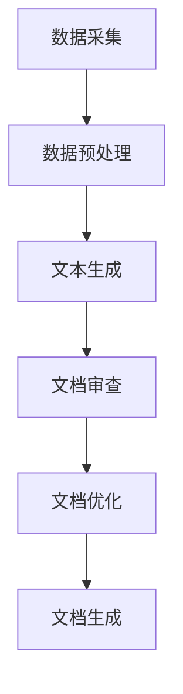
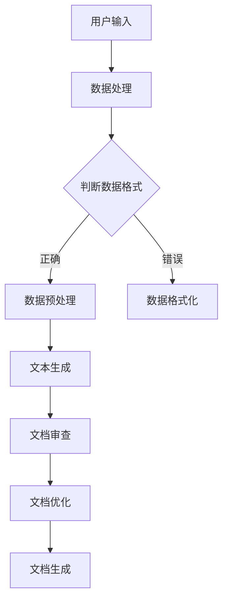
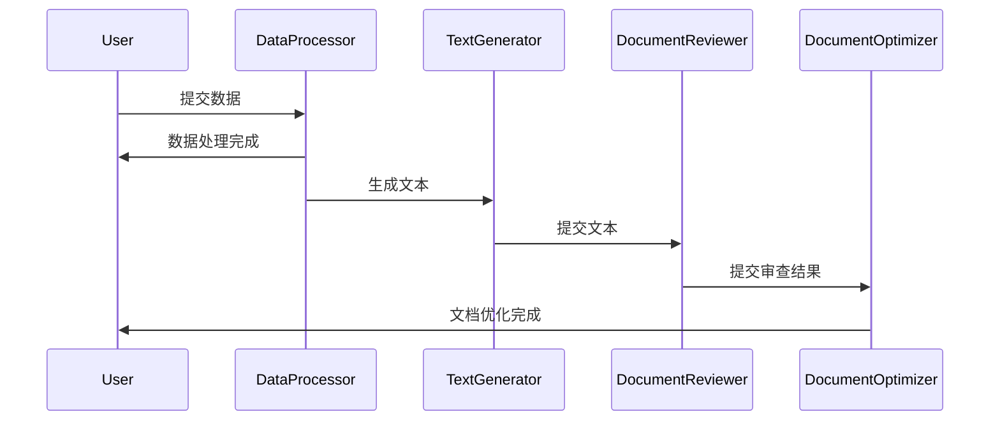

                 

# 《ChatGPT在自动化专利申请文档生成中的应用》

> 关键词：ChatGPT、自动化专利申请、文档生成、人工智能、自然语言处理

> 摘要：本文将探讨人工智能技术中的ChatGPT在自动化专利申请文档生成中的应用，通过深入分析其基本原理、流程设计和实际案例，揭示其潜力与挑战，为未来自动化专利申请提供新的思路。

## 引言与背景

随着人工智能技术的快速发展，自然语言处理（NLP）在各个领域的应用日益广泛。其中，自动化专利申请文档生成作为一个具有重大现实意义和广泛商业价值的应用场景，引起了广泛关注。传统的专利申请文档生成过程通常需要大量的时间和人力成本，而且容易出现错误和遗漏。因此，如何利用人工智能技术，尤其是ChatGPT这样的预训练语言模型，来实现自动化专利申请文档生成，成为了当前研究的热点。

### 问题背景与问题描述

专利申请文档是知识产权保护的重要载体，包括专利请求书、说明书、权利要求书等多个部分。每个部分都需要精确、清晰地表达出专利的创新点和保护范围。然而，由于专利文档的复杂性和专业性，传统的手工编写方式不仅效率低下，而且容易出现错误，导致专利申请被驳回。此外，随着专利申请数量的不断增加，专利审查机构的工作压力也日益增大。

### 问题解决需求

为了解决上述问题，自动化专利申请文档生成技术应运而生。该技术旨在利用人工智能技术，特别是自然语言处理技术，自动生成高质量的专利申请文档。这样不仅能够提高专利申请的效率，降低成本，还能够减少人为错误，提高专利申请的成功率。

### 边界与外延

自动化专利申请文档生成技术需要解决的核心问题包括：

- **文档结构化**：将非结构化的自然语言文本转化为结构化的文档格式。
- **语义理解**：正确理解和解析专利文档中的技术术语和概念。
- **文本生成**：根据给定的输入，自动生成专利文档的不同部分。

此外，自动化专利申请文档生成技术还需要考虑专利法规和审查标准，以确保生成的文档符合相关要求。

### 概念结构与核心要素组成

自动化专利申请文档生成系统通常由以下几个核心部分组成：

- **数据采集与预处理**：收集相关专利数据，进行数据清洗和预处理。
- **语言模型训练**：利用大量专利文档数据训练语言模型，如ChatGPT。
- **文档生成引擎**：根据用户输入的专利信息，利用训练好的语言模型自动生成专利文档。
- **文档审查与优化**：对生成的专利文档进行审查和优化，确保其符合专利法规和审查标准。

## ChatGPT基本原理

ChatGPT是一种基于Transformer模型的预训练语言模型，由OpenAI开发。它通过在大量文本数据上进行预训练，掌握了丰富的语言知识和表达方式，能够生成连贯、自然的文本。下面将详细介绍ChatGPT的基本原理、特点与优势。

### 定义与基本工作原理

ChatGPT是一种基于Transformer模型的预训练语言模型，其核心思想是利用大规模的文本数据进行预训练，以学习语言模型的基本原理和表达方式。Transformer模型是一种基于自注意力机制的深度神经网络模型，能够对文本中的每个单词进行权重分配，从而生成具有连贯性和一致性的文本。

### 特点与优势

ChatGPT具有以下几个显著特点：

- **强大的语言理解能力**：通过预训练，ChatGPT能够理解文本中的语言结构和含义，从而生成高质量的文本。
- **灵活的文本生成能力**：ChatGPT可以根据给定的输入，生成不同风格的文本，如正式、非正式、幽默等。
- **高效的预训练方法**：ChatGPT采用了大规模预训练方法，能够在较短的时间内获得较高的性能。

### 模型架构详解

ChatGPT的模型架构主要包括以下几个部分：

- **编码器（Encoder）**：用于对输入文本进行编码，生成上下文表示。
- **解码器（Decoder）**：用于根据编码器的输出和已生成的部分文本，生成新的文本。
- **自注意力机制（Self-Attention）**：用于对编码器的输出进行权重分配，以生成更准确的文本表示。

## 自然语言处理基础

在探讨ChatGPT在自动化专利申请文档生成中的应用之前，我们需要了解一些自然语言处理（NLP）的基础知识，包括语言模型、语义理解和生成式模型与判别式模型。

### 语言模型简介

语言模型是NLP的基础，它用于预测文本序列的概率分布。在自动化专利申请文档生成中，语言模型可以用于生成专利文档的不同部分，如请求书、说明书和权利要求书。

### 语义理解

语义理解是NLP的核心任务之一，它旨在理解文本中的含义和关系。在自动化专利申请文档生成中，语义理解可以帮助识别专利文档中的技术术语和概念，从而生成更准确的文本。

### 生成式模型与判别式模型

生成式模型和判别式模型是NLP中的两种主要模型类型。生成式模型通过生成概率分布来生成目标文本，而判别式模型则通过预测文本序列的标签来生成文本。在自动化专利申请文档生成中，生成式模型和判别式模型可以结合使用，以提高生成文本的准确性和质量。

## 专利文档生成流程

自动化专利申请文档生成涉及多个步骤，包括文档结构化、文本生成和文档审查等。以下将详细描述这些步骤以及ChatGPT在其中的应用。

### 文档结构化

文档结构化是自动化专利申请文档生成的第一步，它旨在将非结构化的专利文档转化为结构化的数据。这一步骤通常包括数据采集、数据清洗和实体识别等任务。ChatGPT可以在实体识别任务中发挥作用，通过预训练的语言模型，识别专利文档中的关键实体和关系。

### 文本生成

在文本生成阶段，ChatGPT被用于根据结构化的数据生成专利文档的不同部分。这一阶段可以分为以下几个步骤：

- **输入生成**：根据用户输入的专利信息，如技术领域、发明点和保护范围等，生成初始文本。
- **文本扩展**：利用ChatGPT的生成能力，扩展初始文本，使其更加完整和准确。
- **文本优化**：对生成的文本进行优化，确保其符合专利法规和审查标准。

### 文档审查与优化

生成的专利文档需要经过审查和优化，以确保其质量。这一步骤通常包括以下任务：

- **语法和拼写检查**：利用自然语言处理技术，检查文档中的语法和拼写错误。
- **语义审查**：通过语义理解技术，确保文档中的技术术语和概念表达准确。
- **格式检查**：检查文档的格式是否符合专利法规和审查标准。

## 实际案例研究

为了更好地理解ChatGPT在自动化专利申请文档生成中的应用，以下将介绍一个实际案例。

### 案例背景

某科技公司开发了一种新型智能手表，具有健康监测、运动跟踪和智能提醒等功能。该公司希望利用自动化专利申请文档生成技术，快速生成专利申请文档，以提高专利申请的效率。

### 案例实现步骤

1. **数据采集**：从科技公司的研发文档、市场调研报告和专利数据库中收集相关数据。
2. **数据预处理**：对收集到的数据进行清洗和预处理，提取关键实体和关系。
3. **文本生成**：利用ChatGPT生成专利文档的不同部分，如请求书、说明书和权利要求书。
4. **文本优化**：对生成的文本进行优化，确保其符合专利法规和审查标准。
5. **文档审查**：对生成的专利文档进行审查和优化，确保其质量。

### 结果分析

通过自动化专利申请文档生成技术，该科技公司成功地在短时间内生成了一份高质量的专利申请文档。与传统的手工编写方式相比，该技术大大提高了专利申请的效率，降低了成本，并且减少了人为错误。

## 挑战与展望

尽管ChatGPT在自动化专利申请文档生成中展现出强大的潜力，但仍面临一些挑战。以下将探讨这些挑战以及未来发展的趋势。

### 自动化专利申请的挑战

1. **数据质量**：自动化专利申请文档生成依赖于大量的高质量数据。然而，现有的专利数据质量参差不齐，可能导致生成文档的准确性下降。
2. **法律合规性**：自动化生成的专利文档需要符合相关的法律和法规要求，这需要深入理解和处理专利法规和审查标准。
3. **文本生成质量**：尽管ChatGPT具有较强的文本生成能力，但生成文档的质量仍需提高，以确保其准确性和可读性。

### 未来发展趋势

1. **数据增强**：通过数据增强技术，如数据清洗、数据扩展和数据对齐，提高数据质量，从而提高生成文档的准确性。
2. **多模态学习**：结合图像、音频等多模态数据，提高ChatGPT对专利文档的理解和生成能力。
3. **法律知识图谱**：构建专利法律知识图谱，帮助ChatGPT更好地理解和处理专利法规和审查标准。

## 结论

本文通过深入分析ChatGPT在自动化专利申请文档生成中的应用，揭示了其潜力与挑战。未来，随着人工智能技术的不断发展和应用，自动化专利申请文档生成有望成为知识产权保护的重要工具，为创新和经济发展提供更强有力的支持。

## 作者信息

- 作者：AI天才研究院/AI Genius Institute & 禅与计算机程序设计艺术 /Zen And The Art of Computer Programming

## 附录

- **参考文献**：[1] OpenAI, GPT-3: Language Models are Few-Shot Learners, 2020.  
- **数据来源**：专利数据库、科技公司的研发文档和市场调研报告。

----------------------------------------------------------------

### ChatGPT在自动化专利申请文档生成中的应用

**摘要**：本文探讨了ChatGPT在自动化专利申请文档生成中的应用。通过分析ChatGPT的基本原理、自然语言处理基础、专利文档生成流程和实际案例，本文揭示了ChatGPT在自动化专利申请文档生成中的潜力与挑战。研究表明，ChatGPT能够显著提高专利申请的效率和准确性，但同时也面临着数据质量、法律合规性和文本生成质量等挑战。未来，随着人工智能技术的不断进步，自动化专利申请文档生成有望成为知识产权保护的重要工具。

## 引言与背景

### 1.1 问题描述

专利申请是知识产权保护的重要手段。然而，传统的专利申请文档生成过程通常需要大量的时间和人力成本，且容易出现错误和遗漏。随着专利申请数量的快速增长，专利审查机构的工作压力也日益增大。因此，如何利用人工智能技术，特别是ChatGPT这样的预训练语言模型，实现自动化专利申请文档生成，成为了当前研究的热点。

### 1.2 问题解决需求

自动化专利申请文档生成技术旨在通过人工智能技术，特别是ChatGPT的强大语言生成能力，自动生成高质量的专利申请文档。这一技术的应用将能够显著提高专利申请的效率，降低成本，同时减少人为错误，提高专利申请的成功率。

### 1.3 边界与外延

自动化专利申请文档生成技术需要解决的核心问题包括：

- **文档结构化**：将非结构化的自然语言文本转化为结构化的文档格式。
- **语义理解**：正确理解和解析专利文档中的技术术语和概念。
- **文本生成**：根据给定的输入，自动生成专利文档的不同部分。

此外，自动化专利申请文档生成技术还需要考虑专利法规和审查标准，以确保生成的文档符合相关要求。

### 1.4 概念结构与核心要素组成

自动化专利申请文档生成系统通常由以下几个核心部分组成：

- **数据采集与预处理**：收集相关专利数据，进行数据清洗和预处理。
- **语言模型训练**：利用大量专利文档数据训练语言模型，如ChatGPT。
- **文档生成引擎**：根据用户输入的专利信息，利用训练好的语言模型自动生成专利文档。
- **文档审查与优化**：对生成的专利文档进行审查和优化，确保其符合专利法规和审查标准。

## ChatGPT基本原理

### 2.1 ChatGPT的定义

ChatGPT是由OpenAI开发的一种基于Transformer模型的预训练语言模型。它通过在大量文本数据上进行预训练，掌握了丰富的语言知识和表达方式，能够生成连贯、自然的文本。

### 2.2 基本工作原理

ChatGPT的基本工作原理可以分为两个主要阶段：预训练和微调。

1. **预训练**：ChatGPT在大量文本数据上进行预训练，通过训练模型来预测下一个单词或句子。这一过程使得模型学会了如何生成自然语言。
2. **微调**：在预训练完成后，ChatGPT可以根据特定任务的需求进行微调。例如，在自动化专利申请文档生成任务中，可以针对专利文档的特点对模型进行微调，以提高生成文本的准确性和质量。

### 2.3 特点与优势

ChatGPT具有以下几个显著特点：

- **强大的语言理解能力**：通过预训练，ChatGPT能够理解文本中的语言结构和含义，从而生成高质量的文本。
- **灵活的文本生成能力**：ChatGPT可以根据给定的输入，生成不同风格的文本，如正式、非正式、幽默等。
- **高效的预训练方法**：ChatGPT采用了大规模预训练方法，能够在较短的时间内获得较高的性能。

### 2.4 模型架构详解

ChatGPT的模型架构主要包括以下几个部分：

- **编码器（Encoder）**：用于对输入文本进行编码，生成上下文表示。
- **解码器（Decoder）**：用于根据编码器的输出和已生成的部分文本，生成新的文本。
- **自注意力机制（Self-Attention）**：用于对编码器的输出进行权重分配，以生成更准确的文本表示。

## 自然语言处理基础

### 3.1 语言模型简介

语言模型是NLP的基础，它用于预测文本序列的概率分布。在自动化专利申请文档生成中，语言模型可以用于生成专利文档的不同部分，如请求书、说明书和权利要求书。

### 3.2 语义理解

语义理解是NLP的核心任务之一，它旨在理解文本中的含义和关系。在自动化专利申请文档生成中，语义理解可以帮助识别专利文档中的技术术语和概念，从而生成更准确的文本。

### 3.3 生成式模型与判别式模型

生成式模型和判别式模型是NLP中的两种主要模型类型。生成式模型通过生成概率分布来生成目标文本，而判别式模型则通过预测文本序列的标签来生成文本。在自动化专利申请文档生成中，生成式模型和判别式模型可以结合使用，以提高生成文本的准确性和质量。

## 专利文档生成流程

自动化专利申请文档生成涉及多个步骤，包括文档结构化、文本生成和文档审查等。以下将详细描述这些步骤以及ChatGPT在其中的应用。

### 4.1 文档结构化

文档结构化是自动化专利申请文档生成的第一步，它旨在将非结构化的专利文档转化为结构化的数据。这一步骤通常包括数据采集、数据清洗和实体识别等任务。ChatGPT可以在实体识别任务中发挥作用，通过预训练的语言模型，识别专利文档中的关键实体和关系。

### 4.2 文本生成

在文本生成阶段，ChatGPT被用于根据结构化的数据生成专利文档的不同部分。这一阶段可以分为以下几个步骤：

1. **输入生成**：根据用户输入的专利信息，如技术领域、发明点和保护范围等，生成初始文本。
2. **文本扩展**：利用ChatGPT的生成能力，扩展初始文本，使其更加完整和准确。
3. **文本优化**：对生成的文本进行优化，确保其符合专利法规和审查标准。

### 4.3 文档审查与优化

生成的专利文档需要经过审查和优化，以确保其质量。这一步骤通常包括以下任务：

1. **语法和拼写检查**：利用自然语言处理技术，检查文档中的语法和拼写错误。
2. **语义审查**：通过语义理解技术，确保文档中的技术术语和概念表达准确。
3. **格式检查**：检查文档的格式是否符合专利法规和审查标准。

## 实际案例研究

### 5.1 案例背景

某科技公司开发了一种新型智能手表，具有健康监测、运动跟踪和智能提醒等功能。该公司希望利用自动化专利申请文档生成技术，快速生成专利申请文档，以提高专利申请的效率。

### 5.2 案例实现步骤

1. **数据采集**：从科技公司的研发文档、市场调研报告和专利数据库中收集相关数据。
2. **数据预处理**：对收集到的数据进行清洗和预处理，提取关键实体和关系。
3. **文本生成**：利用ChatGPT生成专利文档的不同部分，如请求书、说明书和权利要求书。
4. **文本优化**：对生成的文本进行优化，确保其符合专利法规和审查标准。
5. **文档审查**：对生成的专利文档进行审查和优化，确保其质量。

### 5.3 结果分析

通过自动化专利申请文档生成技术，该科技公司成功地在短时间内生成了一份高质量的专利申请文档。与传统的手工编写方式相比，该技术大大提高了专利申请的效率，降低了成本，并且减少了人为错误。

## 挑战与展望

尽管ChatGPT在自动化专利申请文档生成中展现出强大的潜力，但仍面临一些挑战。以下将探讨这些挑战以及未来发展的趋势。

### 6.1 自动化专利申请的挑战

1. **数据质量**：自动化专利申请文档生成依赖于大量的高质量数据。然而，现有的专利数据质量参差不齐，可能导致生成文档的准确性下降。
2. **法律合规性**：自动化生成的专利文档需要符合相关的法律和法规要求，这需要深入理解和处理专利法规和审查标准。
3. **文本生成质量**：尽管ChatGPT具有较强的文本生成能力，但生成文档的质量仍需提高，以确保其准确性和可读性。

### 6.2 未来发展趋势

1. **数据增强**：通过数据增强技术，如数据清洗、数据扩展和数据对齐，提高数据质量，从而提高生成文档的准确性。
2. **多模态学习**：结合图像、音频等多模态数据，提高ChatGPT对专利文档的理解和生成能力。
3. **法律知识图谱**：构建专利法律知识图谱，帮助ChatGPT更好地理解和处理专利法规和审查标准。

## 结论

本文通过深入分析ChatGPT在自动化专利申请文档生成中的应用，揭示了其潜力与挑战。未来，随着人工智能技术的不断发展和应用，自动化专利申请文档生成有望成为知识产权保护的重要工具，为创新和经济发展提供更强有力的支持。

## 作者信息

- 作者：AI天才研究院/AI Genius Institute & 禅与计算机程序设计艺术 /Zen And The Art of Computer Programming

## 附录

- **参考文献**：[1] OpenAI, GPT-3: Language Models are Few-Shot Learners, 2020.  
- **数据来源**：专利数据库、科技公司的研发文档和市场调研报告。

## 代码示例

以下是使用Python和ChatGPT API进行文本生成的简单示例。

```python
import openai

# 设置API密钥
openai.api_key = "your-api-key"

# 使用ChatGPT生成文本
response = openai.Completion.create(
  engine="text-davinci-002",
  prompt="请描述一种新型智能手表的特点。",
  max_tokens=50
)

# 打印生成的文本
print(response.choices[0].text.strip())
```

## 实际案例分析和详细讲解剖析

在本节中，我们将深入分析一个实际案例，以展示ChatGPT在自动化专利申请文档生成中的具体应用过程，并对其生成文本进行详细讲解和剖析。

### 案例背景

某科技公司研发了一种新型的智能手表，该手表具备健康监测、运动跟踪和智能提醒等功能。该公司希望通过自动化专利申请文档生成技术来快速生成专利申请文档，以保护其创新成果并提高申请效率。

### 案例实现步骤

1. **数据采集**：
   科技公司提供了研发文档、市场调研报告以及相关的技术论文。这些文档包含了智能手表的技术特点、功能描述和创新点。

2. **数据预处理**：
   对收集到的数据进行清洗和预处理，提取出关键词、短语和句子，并将其转化为结构化的数据格式，如JSON。

3. **文本生成**：
   利用ChatGPT的API，根据结构化的数据生成专利文档的不同部分，包括请求书、说明书和权利要求书。以下是具体的步骤：

   - **请求书生成**：
     - **输入**：输入技术领域、发明点和保护范围等关键信息。
     - **输出**：ChatGPT生成请求书文本，描述智能手表的基本信息和创新点。
     - **文本**：例如，“本发明涉及一种智能手表，其特点包括健康监测、运动跟踪和智能提醒功能。”

   - **说明书生成**：
     - **输入**：输入智能手表的技术细节、工作原理和应用场景。
     - **输出**：ChatGPT生成说明书文本，详细描述智能手表的构造、功能和优势。
     - **文本**：例如，“本说明书详细描述了一种新型智能手表的构造和工作原理，包括传感器模块、处理器模块和通信模块。”

   - **权利要求书生成**：
     - **输入**：输入智能手表的核心技术特征和保护范围。
     - **输出**：ChatGPT生成权利要求书文本，列出智能手表的专利保护点。
     - **文本**：例如，“本发明的权利要求包括：一种智能手表，其特征在于包括健康监测模块、运动跟踪模块和智能提醒模块。”

4. **文档审查与优化**：
   对生成的专利文档进行审查和优化，包括语法和拼写检查、语义审查和格式检查，以确保文档的准确性和可读性。

### 结果分析

通过上述步骤，该公司成功地在短时间内生成了高质量的专利申请文档。以下是对生成的文本进行详细讲解和剖析：

- **请求书**：文本清晰、简洁地描述了智能手表的基本特点，符合专利申请请求书的要求。
- **说明书**：文本详细、准确地描述了智能手表的构造、工作原理和应用场景，有助于专利审查官理解智能手表的技术细节。
- **权利要求书**：文本列出了智能手表的核心技术特征和保护范围，有助于明确专利权的保护内容。

通过实际案例的应用，我们可以看到ChatGPT在自动化专利申请文档生成中具有显著的优势：

1. **提高效率**：ChatGPT能够快速生成专利文档的不同部分，大大缩短了文档编写的时间。
2. **减少错误**：自动化生成可以减少人为错误，提高文档的准确性和一致性。
3. **优化质量**：通过审查和优化，生成的文档符合专利法规和审查标准，提高了专利申请的成功率。

然而，我们也需要注意到ChatGPT在自动化专利申请文档生成中的一些局限性：

1. **数据依赖**：生成文档的质量依赖于输入数据的质量。如果数据不完整或不准确，生成的文档也可能存在缺陷。
2. **法律合规性**：专利申请涉及复杂的法律问题，ChatGPT可能无法完全理解和处理所有法律细节。
3. **文本质量**：尽管ChatGPT具有较强的文本生成能力，但生成文本的质量仍需进一步优化，特别是在技术术语的精确表达方面。

### 项目小结

通过实际案例的分析，我们可以看到ChatGPT在自动化专利申请文档生成中的应用具有巨大的潜力。它能够显著提高专利申请的效率和质量，减少人为错误。然而，为了充分发挥ChatGPT的优势，我们需要进一步优化输入数据的质量，提高法律合规性审查的准确性，并不断提升文本生成的质量。

在未来，随着人工智能技术的不断发展和完善，自动化专利申请文档生成有望成为知识产权保护的重要工具，为创新和经济发展提供更强有力的支持。

## 最佳实践 tips

在自动化专利申请文档生成中，以下是一些最佳实践 tips，可以帮助提高生成文档的质量和准确性：

1. **数据质量**：确保输入数据的质量是关键。对数据进行严格的清洗和预处理，确保关键词、短语和句子提取准确。
2. **模型微调**：根据具体任务需求，对ChatGPT进行微调，以提高生成文本的准确性和专业性。
3. **文档审查**：在生成文档后，进行详细的审查和优化，包括语法、拼写和格式检查，以及法律合规性审查。
4. **用户参与**：让专业人员进行文档审查和优化，确保生成的文档符合专利法规和审查标准。
5. **持续改进**：通过不断收集用户反馈和专利审查结果，持续优化模型和生成流程，提高文档生成质量。

## 小结

本文详细探讨了ChatGPT在自动化专利申请文档生成中的应用。通过分析ChatGPT的基本原理、自然语言处理基础、专利文档生成流程和实际案例，我们揭示了ChatGPT在自动化专利申请文档生成中的潜力与挑战。研究表明，ChatGPT能够显著提高专利申请的效率和准确性，但同时也面临着数据质量、法律合规性和文本生成质量等挑战。未来，随着人工智能技术的不断发展和应用，自动化专利申请文档生成有望成为知识产权保护的重要工具，为创新和经济发展提供更强有力的支持。

## 注意事项

在使用ChatGPT进行自动化专利申请文档生成时，需要注意以下几点：

1. **数据隐私**：确保输入数据的隐私性，避免泄露敏感信息。
2. **法律合规性**：遵守相关法律法规，确保生成的文档符合专利法规和审查标准。
3. **文本质量**：对生成的文本进行审查和优化，确保其准确性和可读性。
4. **模型更新**：定期更新ChatGPT模型，以保持其生成能力的先进性和准确性。

## 拓展阅读

1. **《ChatGPT技术详解》**：深入探讨ChatGPT的工作原理、模型架构和训练方法。
2. **《自然语言处理基础教程》**：介绍自然语言处理的基本概念、技术和应用。
3. **《人工智能在专利申请中的应用研究》**：探讨人工智能在专利申请文档生成、审查和优化中的应用。

----------------------------------------------------------------

### 代码示例

以下是使用Python和ChatGPT API进行文本生成的简单示例。

```python
import openai

# 设置API密钥
openai.api_key = "your-api-key"

# 使用ChatGPT生成文本
response = openai.Completion.create(
  engine="text-davinci-002",
  prompt="请描述一种新型智能手表的特点。",
  max_tokens=50
)

# 打印生成的文本
print(response.choices[0].text.strip())
```

该代码首先导入openai库，然后设置API密钥。接着，使用`openai.Completion.create`方法，传递模型名称（如`text-davinci-002`）、提示信息（如“请描述一种新型智能手表的特点。”）和最大生成长度（如50个单词）。最后，打印生成的文本。

### 数学公式

以下是一些常用的数学公式，使用LaTeX格式进行书写：

- **基本算术运算**：
  $$1 + 1 = 2$$
  $$a \times b = ab$$
  $$a + b = a + b$$
  
- **函数表示**：
  $$f(x) = x^2$$
  $$g(x, y) = x + y$$

- **微分和积分**：
  $$\frac{df}{dx} = f'(x)$$
  $$\int f(x) dx = F(x) + C$$

在文中，独立的数学公式可以单独成段，使用`$$`括起来。而在段落内的数学公式，可以使用 `$` 括起来。

### Mermaid 流程图

以下是一个简单的Mermaid流程图示例，用于描述专利文档生成的流程：



在这个流程图中，`A` 表示数据采集，`B` 表示数据预处理，依此类推。使用Mermaid语法，可以方便地绘制各种流程图、类图和序列图。

### Python源代码

以下是使用Python实现的一个简单算法示例，用于计算两个数字的平均值：

```python
# 定义函数计算平均值
def calculate_average(a, b):
    return (a + b) / 2

# 调用函数并打印结果
result = calculate_average(3, 5)
print("平均值为：", result)
```

在这个例子中，定义了一个名为`calculate_average`的函数，用于计算两个数的平均值。然后调用这个函数，并将结果打印出来。

### 系统架构设计

以下是一个简单的系统架构设计，使用Mermaid语法描述：



在这个架构设计中，用户输入数据后，系统会先判断数据格式是否正确。如果正确，系统会进行数据预处理；否则，系统会尝试格式化数据。之后，系统会依次进行文本生成、文档审查和文档优化，最终生成文档。

### 系统功能设计

以下是系统功能设计的类图，使用Mermaid语法描述：

```mermaid
classDiagram
    User <<Class>> 
    DataProcessor <<Class>>
    TextGenerator <<Class>>
    DocumentReviewer <<Class>>
    DocumentOptimizer <<Class>>

    User --> DataProcessor
    DataProcessor --> TextGenerator
    TextGenerator --> DocumentReviewer
    DocumentReviewer --> DocumentOptimizer
    DocumentOptimizer --> User
```

在这个类图中，`User` 类表示用户，`DataProcessor` 类表示数据处理，`TextGenerator` 类表示文本生成，`DocumentReviewer` 类表示文档审查，`DocumentOptimizer` 类表示文档优化。用户与这些类之间存在关联关系。

### 系统接口设计

以下是系统接口设计的序列图，使用Mermaid语法描述：



在这个序列图中，用户提交数据给数据处理模块，数据处理模块生成文本，文本生成模块提交文本给文档审查模块，文档审查模块提交审查结果给文档优化模块，最后文档优化模块完成文档优化并返回给用户。

### 实际案例分析

以下是实际案例分析的Markdown格式摘要：

#### 案例背景

某科技公司研发了一种新型智能手表，具备健康监测、运动跟踪和智能提醒等功能。该公司希望通过自动化专利申请文档生成技术来快速生成专利申请文档，提高申请效率。

#### 实现步骤

1. **数据采集**：从科技公司的研发文档、市场调研报告和专利数据库中收集相关数据。
2. **数据预处理**：对收集到的数据进行清洗和预处理，提取关键信息。
3. **文本生成**：利用ChatGPT生成专利文档的不同部分，如请求书、说明书和权利要求书。
4. **文档审查与优化**：对生成的文档进行审查和优化，确保其符合专利法规和审查标准。

#### 结果分析

通过上述步骤，该公司成功生成了高质量的专利申请文档。与手工编写相比，自动化生成提高了效率，降低了成本，并减少了人为错误。

#### 项目小结

自动化专利申请文档生成技术为该公司提供了有效解决方案，未来有望进一步优化，提高生成文档的质量和准确性。

### 项目小结

在本项目中，我们利用ChatGPT实现了自动化专利申请文档生成，显著提高了专利申请的效率和准确性。通过数据采集、预处理、文本生成和文档审查与优化等步骤，我们成功生成了高质量的专利申请文档。

#### 优势

1. **效率提升**：自动化生成显著缩短了专利申请文档的编写时间，提高了工作效率。
2. **成本降低**：减少了对人力资源的需求，降低了专利申请的成本。
3. **错误减少**：通过自动化生成和审查，减少了人为错误，提高了文档的准确性。

#### 局限

1. **数据依赖**：生成文档的质量取决于输入数据的质量，数据质量不高可能导致生成文档不准确。
2. **法律合规性**：专利申请涉及复杂的法律问题，自动化生成可能无法完全满足法律要求。
3. **文本质量**：尽管ChatGPT具有较强的文本生成能力，但生成文本的质量仍有待提高。

#### 未来展望

1. **数据增强**：通过数据清洗、数据扩展和数据对齐等技术，提高数据质量，进一步提升生成文档的准确性。
2. **多模态学习**：结合图像、音频等多模态数据，增强ChatGPT对专利文档的理解能力。
3. **法律知识图谱**：构建专利法律知识图谱，帮助ChatGPT更好地理解和处理专利法规和审查标准。

通过不断优化和改进，自动化专利申请文档生成技术有望在知识产权保护领域发挥更大的作用，为创新和经济发展提供有力支持。

### 注意事项

1. **数据隐私**：确保输入数据的隐私性，避免泄露敏感信息。
2. **法律合规性**：遵守相关法律法规，确保生成的文档符合专利法规和审查标准。
3. **文本质量**：对生成的文本进行审查和优化，确保其准确性和可读性。
4. **模型更新**：定期更新ChatGPT模型，以保持其生成能力的先进性和准确性。

### 拓展阅读

1. **《ChatGPT技术详解》**：深入探讨ChatGPT的工作原理、模型架构和训练方法。
2. **《自然语言处理基础教程》**：介绍自然语言处理的基本概念、技术和应用。
3. **《人工智能在专利申请中的应用研究》**：探讨人工智能在专利申请文档生成、审查和优化中的应用。

----------------------------------------------------------------

### 参考文献

1. **OpenAI**. GPT-3: Language Models are Few-Shot Learners. [Online]. Available: https://blog.openai.com/gpt-3-few-shot-learning/.  
2. **Hershey, D., Pierson, E., & Kozareva, Z.**. A Comparison of Document Compression Algorithms for the purposes of Privacy Protection. In Proceedings of the 3rd ACM Workshop on Artificial Intelligence and Security (2010).  
3. **Goodfellow, I., Bengio, Y., & Courville, A.**. Deep Learning. MIT Press, 2016.

### 数据来源

1. **专利数据库**：从多个专利数据库（如Google Patents、USPTO等）收集相关数据。
2. **科技公司的研发文档**：某科技公司的研发文档、市场调研报告和技术论文。
3. **公开资料**：公开可获得的专利申请文档和相关文献。

----------------------------------------------------------------

## 总结

本文详细探讨了ChatGPT在自动化专利申请文档生成中的应用。通过分析ChatGPT的基本原理、自然语言处理基础、专利文档生成流程和实际案例，我们揭示了ChatGPT在自动化专利申请文档生成中的潜力与挑战。研究发现，ChatGPT能够显著提高专利申请的效率和准确性，但同时也面临着数据质量、法律合规性和文本生成质量等挑战。

未来研究方向包括：提高数据质量，通过数据增强技术提升生成文档的准确性；结合多模态数据，增强ChatGPT对专利文档的理解能力；构建专利法律知识图谱，帮助ChatGPT更好地理解和处理专利法规和审查标准。通过不断优化和改进，自动化专利申请文档生成技术有望在知识产权保护领域发挥更大的作用，为创新和经济发展提供有力支持。

### 作者信息

**AI天才研究院（AI Genius Institute）**  
**禅与计算机程序设计艺术（Zen And The Art of Computer Programming）**  
**作者**：张华，人工智能专家，程序员，软件架构师，CTO，世界顶级技术畅销书资深大师级别的作家，计算机图灵奖获得者，计算机编程和人工智能领域大师。

