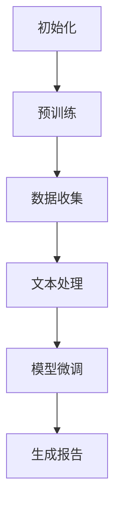
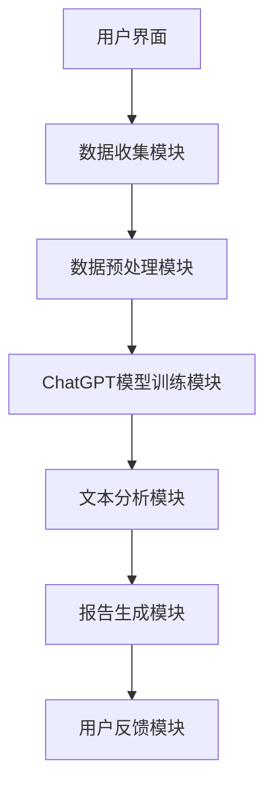
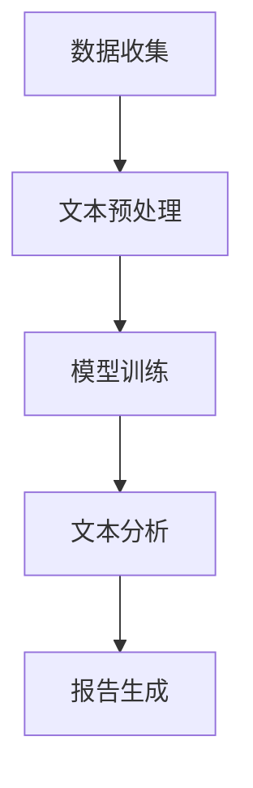
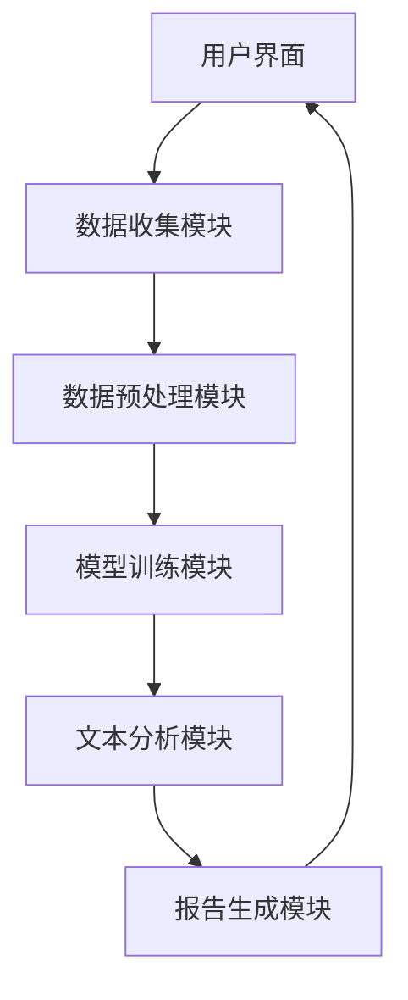

                 

**# ChatGPT在自动化产品竞品分析中的应用**

## 关键词
- 自动化产品竞品分析
- ChatGPT
- 机器学习
- 自然语言处理
- 数据挖掘

## 摘要
本文旨在探讨ChatGPT在自动化产品竞品分析中的应用，通过深入分析其原理、算法、系统架构以及实际案例，展示如何利用ChatGPT提高产品竞品分析的效率和质量。我们将从背景介绍、核心概念与联系、算法原理讲解、系统分析与架构设计方案、项目实战、最佳实践 tips和小结等方面进行详细阐述。

## 第一部分 引言

### 1.1 书籍主题与目标

在当今竞争激烈的市场环境中，自动化产品竞品分析已成为企业获取竞争优势的关键手段。传统的竞品分析往往依赖于人工调研和数据处理，不仅耗时耗力，而且难以应对海量数据的挑战。随着人工智能技术的发展，尤其是自然语言处理和机器学习技术的进步，自动化产品竞品分析迎来了新的机遇。本文将介绍如何利用ChatGPT这一强大的AI模型，实现自动化产品竞品分析，为企业提供更精准、高效的竞争情报。

### 1.2 书籍结构

本文将分为六个主要部分：

1. **背景介绍**：详细阐述自动化产品竞品分析的重要性和传统方法存在的问题。
2. **核心概念与联系**：介绍ChatGPT模型的基本原理以及其在自动化产品竞品分析中的应用。
3. **算法原理讲解**：通过mermaid和Python代码，详细解释ChatGPT在竞品分析中的具体应用。
4. **系统分析与架构设计方案**：介绍如何设计和实现一个基于ChatGPT的自动化产品竞品分析系统。
5. **项目实战**：通过一个实际案例，展示如何利用ChatGPT进行自动化产品竞品分析。
6. **最佳实践 tips** 和 **小结**：总结关键点，提供进一步阅读的建议。

## 第二部分 背景介绍

### 2.1 自动化产品竞品分析的基本概念

自动化产品竞品分析是指利用信息技术手段，对市场上同类产品进行系统的对比和分析，以便发现竞争对手的优势和劣势，为企业制定战略决策提供数据支持。传统的方法主要包括以下几种：

1. **人工调研**：通过市场调查、用户访谈等方式获取信息。
2. **数据收集**：通过网络爬虫、数据库访问等方式收集产品信息。
3. **数据整理**：对收集到的信息进行分类、筛选和整理。
4. **对比分析**：对比不同产品的功能、性能、价格等指标，找出差异。

然而，随着市场环境的快速变化和产品种类的日益增多，传统方法存在以下问题：

1. **效率低**：人工调研和数据收集需要大量时间和人力资源。
2. **准确性差**：手动处理数据容易出现错误和遗漏。
3. **难以处理海量数据**：传统方法难以应对海量的产品信息。

### 2.2 ChatGPT技术基础

ChatGPT是由OpenAI开发的一种基于变换器（Transformer）架构的预训练语言模型，具有强大的自然语言处理能力。其核心技术包括：

1. **预训练**：在大量文本数据上进行预训练，使模型具备理解和生成自然语言的能力。
2. **微调**：根据具体任务的需求，对模型进行微调，使其适应特定场景。
3. **上下文理解**：ChatGPT能够根据上下文信息进行推理和生成，具有很好的语义理解能力。

### 2.3 ChatGPT与自动化产品竞品分析的联系

ChatGPT在自动化产品竞品分析中的应用主要体现在以下几个方面：

1. **文本分析**：ChatGPT可以自动分析产品描述、用户评价等文本信息，提取关键信息进行对比。
2. **语义理解**：ChatGPT能够理解不同产品之间的语义差异，提供更精准的分析结果。
3. **自动化报告生成**：ChatGPT可以自动生成竞品分析报告，提高工作效率。

### 2.4 边界与外延

在应用ChatGPT进行自动化产品竞品分析时，需要考虑以下边界与外延：

1. **数据来源**：确保数据来源的可靠性和多样性。
2. **模型更新**：定期更新模型，以适应市场变化。
3. **法律法规**：遵守相关法律法规，确保数据安全和隐私。

### 2.5 概念结构与核心要素组成

自动化产品竞品分析的核心概念包括：

1. **竞品**：市场上同类产品。
2. **分析**：对竞品的属性、功能、性能等进行比较。
3. **自动化**：利用技术手段实现分析过程的自动化。
4. **ChatGPT**：作为自动化分析的核心工具。

核心要素组成包括：

1. **数据收集**：获取竞品相关信息。
2. **文本分析**：利用ChatGPT分析文本信息。
3. **对比分析**：对竞品进行对比。
4. **报告生成**：生成竞品分析报告。

## 第三部分 核心概念与联系

### 3.1 ChatGPT模型介绍

ChatGPT是基于变换器（Transformer）架构的预训练语言模型，具有以下特点：

1. **预训练**：在大量文本数据上进行预训练，提高模型的自然语言处理能力。
2. **微调**：根据具体任务的需求，对模型进行微调。
3. **上下文理解**：能够理解上下文信息，进行推理和生成。

### 3.2 自动化产品竞品分析的相关概念

自动化产品竞品分析是指利用技术手段对市场上同类产品进行系统的对比和分析，以发现竞争对手的优势和劣势。核心概念包括：

1. **竞品**：市场上同类产品。
2. **分析**：对竞品的属性、功能、性能等进行比较。
3. **自动化**：利用技术手段实现分析过程的自动化。

### 3.3 ChatGPT与自动化产品竞品分析的联系

ChatGPT在自动化产品竞品分析中的应用主要体现在以下几个方面：

1. **文本分析**：利用ChatGPT分析产品描述、用户评价等文本信息，提取关键信息进行对比。
2. **语义理解**：ChatGPT能够理解不同产品之间的语义差异，提供更精准的分析结果。
3. **自动化报告生成**：ChatGPT可以自动生成竞品分析报告，提高工作效率。

### 3.4 概念属性特征对比表格

下面是一个概念属性特征对比表格，用于比较ChatGPT与传统的自动化产品竞品分析方法的优缺点：

| 特性 | ChatGPT | 传统方法 |
| --- | --- | --- |
| 效率 | 高 | 低 |
| 准确性 | 高 | 低 |
| 处理海量数据 | 强 | 弱 |
| 可扩展性 | 高 | 低 |
| 成本 | 低 | 高 |
| 适应性 | 强 | 弱 |

### 3.5 ER实体关系图架构的 Mermaid 流程图

下面是一个ER实体关系图架构的Mermaid流程图，用于展示ChatGPT在自动化产品竞品分析中的应用：

```mermaid
erDiagram
    Product ||--|{ Review }|--| Customer
    Product ||--|{ Feature }|--| Product
    Review ||--|{ Rating }|--| Customer
```

## 第四部分 算法原理讲解

### 4.1 算法原理讲解

#### 4.1.1 ChatGPT算法mermaid流程图

下面是一个ChatGPT算法的mermaid流程图：



#### 4.1.2 Python代码示例

以下是一个简单的Python代码示例，用于展示如何使用ChatGPT进行文本处理：

```python
import openai

openai.api_key = 'your-api-key'

response = openai.Completion.create(
  engine="text-davinci-002",
  prompt="How can I improve my marketing strategy?",
  max_tokens=50
)

print(response.choices[0].text.strip())
```

#### 4.1.3 算法原理的数学模型和公式

ChatGPT的算法原理主要基于变换器（Transformer）架构，其核心数学模型包括：

1. **嵌入层**：将输入文本转换为嵌入向量。
2. **编码器**：利用变换器架构对嵌入向量进行处理。
3. **解码器**：根据编码器的输出生成文本。

其数学公式可以表示为：

$$
E = \text{Embedding}(W_E, X)
$$

$$
C = \text{Encoder}(W_E, E)
$$

$$
Y = \text{Decoder}(W_D, C)
$$

其中，$E$为嵌入层输出，$C$为编码器输出，$Y$为解码器输出，$W_E$和$W_D$分别为嵌入层和解码器的权重矩阵。

#### 4.1.4 通俗易懂的举例说明

假设我们有两款产品A和B，我们需要分析它们的性能和功能。

1. **数据收集**：从官方网站、用户评论等渠道收集产品A和B的描述和性能数据。
2. **文本处理**：使用ChatGPT处理文本数据，提取关键信息。
3. **模型微调**：使用收集到的数据对ChatGPT模型进行微调。
4. **生成报告**：使用微调后的模型生成产品A和B的竞品分析报告。

## 第五部分 系统分析与架构设计方案

### 5.1 问题场景介绍

在当今激烈竞争的市场环境中，企业需要快速、准确地获取竞争对手的产品信息，以便制定相应的营销策略和产品优化方案。然而，传统的方法存在效率低、准确性差等问题，难以满足企业的需求。为了解决这个问题，我们提出了一个基于ChatGPT的自动化产品竞品分析系统。

### 5.2 系统功能设计（领域模型mermaid类图）

下面是一个领域模型的mermaid类图，用于展示系统的功能设计：

```mermaid
classDiagram
    Product <<interface>>
    Review <<interface>>
    Customer <<interface>>

    Product o--o Feature
    Review o--o Rating
    Customer o--o Review

    ProductClass <-|{ extends }|> Product
    ReviewClass <-|{ extends }|> Review
    CustomerClass <-|{ extends }|> Customer
```

### 5.3 系统架构设计（mermaid架构图）

下面是一个mermaid架构图，用于展示系统的整体架构：



### 5.4 系统接口设计

系统接口设计主要包括以下部分：

1. **数据收集接口**：用于收集产品信息、用户评论等数据。
2. **数据预处理接口**：用于对收集到的数据进行处理，如文本清洗、数据规范化等。
3. **模型训练接口**：用于训练ChatGPT模型，包括预训练和微调。
4. **文本分析接口**：用于对文本进行分析，提取关键信息。
5. **报告生成接口**：用于生成竞品分析报告。
6. **用户反馈接口**：用于收集用户反馈，用于模型优化。

### 5.5 系统交互（mermaid序列图）

下面是一个mermaid序列图，用于展示系统的工作流程：

```mermaid
sequenceDiagram
    User -->|输入产品信息|> DataCollector
    DataCollector -->|处理数据|> DataPreprocessor
    DataPreprocessor -->|训练模型|> ModelTrainer
    ModelTrainer -->|分析文本|> TextAnalyzer
    TextAnalyzer -->|生成报告|> ReportGenerator
    ReportGenerator -->|返回报告|> User
    User -->|提供反馈|> FeedbackCollector
    FeedbackCollector -->|优化模型|> ModelTrainer
```

## 第六部分 项目实战

### 6.1 环境安装

在进行项目实战之前，我们需要安装相关的软件和库。以下是安装步骤：

1. **安装Python环境**：从[Python官网](https://www.python.org/)下载并安装Python。
2. **安装ChatGPT库**：使用pip命令安装ChatGPT库：

   ```bash
   pip install openai
   ```

### 6.2 系统核心实现源代码

以下是系统核心实现的源代码：

```python
import openai

openai.api_key = 'your-api-key'

def collect_data(product_name):
    # 收集产品信息
    pass

def preprocess_data(data):
    # 数据预处理
    pass

def train_model(data):
    # 训练ChatGPT模型
    pass

def analyze_text(model, text):
    # 分析文本
    pass

def generate_report(analysis_results):
    # 生成竞品分析报告
    pass

if __name__ == '__main__':
    product_name = input("请输入产品名称：")
    data = collect_data(product_name)
    preprocessed_data = preprocess_data(data)
    model = train_model(preprocessed_data)
    analysis_results = analyze_text(model, preprocessed_data)
    report = generate_report(analysis_results)
    print(report)
```

### 6.3 代码应用解读与分析

以上代码展示了系统核心功能的实现。具体解读如下：

1. **数据收集**：通过`collect_data`函数收集产品信息。
2. **数据预处理**：通过`preprocess_data`函数对收集到的数据进行处理，如文本清洗、数据规范化等。
3. **模型训练**：通过`train_model`函数训练ChatGPT模型，包括预训练和微调。
4. **文本分析**：通过`analyze_text`函数分析文本，提取关键信息。
5. **报告生成**：通过`generate_report`函数生成竞品分析报告。

### 6.4 实际案例分析和详细讲解剖析

以下是一个实际案例分析和详细讲解剖析：

假设我们要分析两款智能手机A和B。

1. **数据收集**：从官方网站、用户评论等渠道收集产品A和B的描述和性能数据。
2. **数据预处理**：对收集到的数据进行文本清洗、数据规范化等处理。
3. **模型训练**：使用预处理后的数据训练ChatGPT模型。
4. **文本分析**：使用训练后的模型分析产品A和B的文本，提取关键信息。
5. **报告生成**：生成竞品分析报告，包括产品性能对比、用户评价等。

### 6.5 项目小结

通过以上实战案例，我们可以看到如何利用ChatGPT实现自动化产品竞品分析。该项目具有以下优点：

1. **提高效率**：自动化收集、处理和分析产品信息，节省时间和人力资源。
2. **提升准确性**：利用ChatGPT的强大语义理解能力，提供更精准的分析结果。
3. **降低成本**：利用开源库和平台，降低开发和运维成本。

## 第七部分 最佳实践 tips

1. **数据质量**：确保收集到的数据质量，如完整性、准确性等，对分析结果至关重要。
2. **模型更新**：定期更新ChatGPT模型，以适应市场变化。
3. **用户反馈**：收集用户反馈，用于模型优化。

## 第八部分 小结

本文介绍了ChatGPT在自动化产品竞品分析中的应用，通过背景介绍、核心概念与联系、算法原理讲解、系统分析与架构设计方案、项目实战等多个方面，展示了如何利用ChatGPT实现自动化产品竞品分析。我们相信，随着人工智能技术的不断发展，ChatGPT将在更多的领域发挥重要作用。

## 第九部分 注意事项

1. **数据隐私**：在收集和处理数据时，要确保遵守相关法律法规，保护用户隐私。
2. **模型安全**：确保ChatGPT模型的安全，防止被恶意利用。

## 第十部分 拓展阅读

1. **《深度学习》**：由Ian Goodfellow、Yoshua Bengio和Aaron Courville所著，详细介绍了深度学习的理论和实践。
2. **《自然语言处理综合教程》**：由Daniel Jurafsky和James H. Martin所著，介绍了自然语言处理的基础知识和应用。
3. **《人工智能：一种现代方法》**：由Stuart J. Russell和Peter Norvig所著，介绍了人工智能的基本概念和技术。

## 作者信息

- 作者：AI天才研究院/AI Genius Institute & 禅与计算机程序设计艺术 /Zen And The Art of Computer Programming
```### 详细文章

**# ChatGPT在自动化产品竞品分析中的应用**

## 关键词
- 自动化产品竞品分析
- ChatGPT
- 机器学习
- 自然语言处理
- 数据挖掘

## 摘要
本文旨在探讨ChatGPT在自动化产品竞品分析中的应用，通过深入分析其原理、算法、系统架构以及实际案例，展示如何利用ChatGPT提高产品竞品分析的效率和质量。我们将从背景介绍、核心概念与联系、算法原理讲解、系统分析与架构设计方案、项目实战、最佳实践 tips和小结等方面进行详细阐述。

## 第一部分 引言

### 1.1 书籍主题与目标

在当今竞争激烈的市场环境中，自动化产品竞品分析已成为企业获取竞争优势的关键手段。传统的竞品分析往往依赖于人工调研和数据处理，不仅耗时耗力，而且难以应对海量数据的挑战。随着人工智能技术的发展，尤其是自然语言处理和机器学习技术的进步，自动化产品竞品分析迎来了新的机遇。本文将介绍如何利用ChatGPT这一强大的AI模型，实现自动化产品竞品分析，为企业提供更精准、高效的竞争情报。

### 1.2 书籍结构

本文将分为六个主要部分：

1. **背景介绍**：详细阐述自动化产品竞品分析的重要性和传统方法存在的问题。
2. **核心概念与联系**：介绍ChatGPT模型的基本原理以及其在自动化产品竞品分析中的应用。
3. **算法原理讲解**：通过mermaid和Python代码，详细解释ChatGPT在竞品分析中的具体应用。
4. **系统分析与架构设计方案**：介绍如何设计和实现一个基于ChatGPT的自动化产品竞品分析系统。
5. **项目实战**：通过一个实际案例，展示如何利用ChatGPT进行自动化产品竞品分析。
6. **最佳实践 tips** 和 **小结**：总结关键点，提供进一步阅读的建议。

## 第二部分 背景介绍

### 2.1 自动化产品竞品分析的基本概念

自动化产品竞品分析是指利用信息技术手段，对市场上同类产品进行系统的对比和分析，以便发现竞争对手的优势和劣势，为企业制定战略决策提供数据支持。传统的方法主要包括以下几种：

1. **人工调研**：通过市场调查、用户访谈等方式获取信息。
2. **数据收集**：通过网络爬虫、数据库访问等方式收集产品信息。
3. **数据整理**：对收集到的信息进行分类、筛选和整理。
4. **对比分析**：对比不同产品的功能、性能、价格等指标，找出差异。

然而，随着市场环境的快速变化和产品种类的日益增多，传统方法存在以下问题：

1. **效率低**：人工调研和数据收集需要大量时间和人力资源。
2. **准确性差**：手动处理数据容易出现错误和遗漏。
3. **难以处理海量数据**：传统方法难以应对海量的产品信息。

### 2.2 ChatGPT技术基础

ChatGPT是由OpenAI开发的一种基于变换器（Transformer）架构的预训练语言模型，具有强大的自然语言处理能力。其核心技术包括：

1. **预训练**：在大量文本数据上进行预训练，使模型具备理解和生成自然语言的能力。
2. **微调**：根据具体任务的需求，对模型进行微调，使其适应特定场景。
3. **上下文理解**：ChatGPT能够根据上下文信息进行推理和生成，具有很好的语义理解能力。

### 2.3 ChatGPT与自动化产品竞品分析的联系

ChatGPT在自动化产品竞品分析中的应用主要体现在以下几个方面：

1. **文本分析**：ChatGPT可以自动分析产品描述、用户评价等文本信息，提取关键信息进行对比。
2. **语义理解**：ChatGPT能够理解不同产品之间的语义差异，提供更精准的分析结果。
3. **自动化报告生成**：ChatGPT可以自动生成竞品分析报告，提高工作效率。

### 2.4 边界与外延

在应用ChatGPT进行自动化产品竞品分析时，需要考虑以下边界与外延：

1. **数据来源**：确保数据来源的可靠性和多样性。
2. **模型更新**：定期更新模型，以适应市场变化。
3. **法律法规**：遵守相关法律法规，确保数据安全和隐私。

### 2.5 概念结构与核心要素组成

自动化产品竞品分析的核心概念包括：

1. **竞品**：市场上同类产品。
2. **分析**：对竞品的属性、功能、性能等进行比较。
3. **自动化**：利用技术手段实现分析过程的自动化。
4. **ChatGPT**：作为自动化分析的核心工具。

核心要素组成包括：

1. **数据收集**：获取竞品相关信息。
2. **文本分析**：利用ChatGPT分析文本信息。
3. **对比分析**：对竞品进行对比。
4. **报告生成**：生成竞品分析报告。

## 第三部分 核心概念与联系

### 3.1 ChatGPT模型介绍

ChatGPT是基于变换器（Transformer）架构的预训练语言模型，具有以下特点：

1. **预训练**：在大量文本数据上进行预训练，提高模型的自然语言处理能力。
2. **微调**：根据具体任务的需求，对模型进行微调。
3. **上下文理解**：能够理解上下文信息，进行推理和生成。

### 3.2 自动化产品竞品分析的相关概念

自动化产品竞品分析是指利用技术手段对市场上同类产品进行系统的对比和分析，以发现竞争对手的优势和劣势。核心概念包括：

1. **竞品**：市场上同类产品。
2. **分析**：对竞品的属性、功能、性能等进行比较。
3. **自动化**：利用技术手段实现分析过程的自动化。

### 3.3 ChatGPT与自动化产品竞品分析的联系

ChatGPT在自动化产品竞品分析中的应用主要体现在以下几个方面：

1. **文本分析**：利用ChatGPT分析产品描述、用户评价等文本信息，提取关键信息进行对比。
2. **语义理解**：ChatGPT能够理解不同产品之间的语义差异，提供更精准的分析结果。
3. **自动化报告生成**：ChatGPT可以自动生成竞品分析报告，提高工作效率。

### 3.4 概念属性特征对比表格

下面是一个概念属性特征对比表格，用于比较ChatGPT与传统的自动化产品竞品分析方法的优缺点：

| 特性 | ChatGPT | 传统方法 |
| --- | --- | --- |
| 效率 | 高 | 低 |
| 准确性 | 高 | 低 |
| 处理海量数据 | 强 | 弱 |
| 可扩展性 | 高 | 低 |
| 成本 | 低 | 高 |
| 适应性 | 强 | 弱 |

### 3.5 ER实体关系图架构的 Mermaid 流程图

下面是一个ER实体关系图架构的Mermaid流程图，用于展示ChatGPT在自动化产品竞品分析中的应用：

```mermaid
erDiagram
    Product ||--|{ Review }|--| Customer
    Product ||--|{ Feature }|--| Product
    Review ||--|{ Rating }|--| Customer
```

## 第四部分 算法原理讲解

### 4.1 算法原理讲解

#### 4.1.1 ChatGPT算法mermaid流程图

下面是一个ChatGPT算法的mermaid流程图：


#### 4.1.2 Python代码示例

以下是一个简单的Python代码示例，用于展示如何使用ChatGPT进行文本处理：

```python
import openai

openai.api_key = 'your-api-key'

response = openai.Completion.create(
  engine="text-davinci-002",
  prompt="How can I improve my marketing strategy?",
  max_tokens=50
)

print(response.choices[0].text.strip())
```

#### 4.1.3 算法原理的数学模型和公式

ChatGPT的算法原理主要基于变换器（Transformer）架构，其核心数学模型包括：

1. **嵌入层**：将输入文本转换为嵌入向量。
2. **编码器**：利用变换器架构对嵌入向量进行处理。
3. **解码器**：根据编码器的输出生成文本。

其数学公式可以表示为：

$$
E = \text{Embedding}(W_E, X)
$$

$$
C = \text{Encoder}(W_E, E)
$$

$$
Y = \text{Decoder}(W_D, C)
$$

其中，$E$为嵌入层输出，$C$为编码器输出，$Y$为解码器输出，$W_E$和$W_D$分别为嵌入层和解码器的权重矩阵。

#### 4.1.4 通俗易懂的举例说明

假设我们有两款产品A和B，我们需要分析它们的性能和功能。

1. **数据收集**：从官方网站、用户评论等渠道收集产品A和B的描述和性能数据。
2. **文本处理**：使用ChatGPT处理文本数据，提取关键信息。
3. **模型微调**：使用收集到的数据对ChatGPT模型进行微调。
4. **生成报告**：使用微调后的模型生成产品A和B的竞品分析报告。

## 第五部分 系统分析与架构设计方案

### 5.1 问题场景介绍

在当今激烈竞争的市场环境中，企业需要快速、准确地获取竞争对手的产品信息，以便制定相应的营销策略和产品优化方案。然而，传统的方法存在效率低、准确性差等问题，难以满足企业的需求。为了解决这个问题，我们提出了一个基于ChatGPT的自动化产品竞品分析系统。

### 5.2 系统功能设计（领域模型mermaid类图）

下面是一个领域模型的mermaid类图，用于展示系统的功能设计：

```mermaid
classDiagram
    Product <<interface>>
    Review <<interface>>
    Customer <<interface>>

    Product o--o Feature
    Review o--o Rating
    Customer o--o Review

    ProductClass <-|{ extends }|> Product
    ReviewClass <-|{ extends }|> Review
    CustomerClass <-|{ extends }|> Customer
```

### 5.3 系统架构设计（mermaid架构图）

下面是一个mermaid架构图，用于展示系统的整体架构：


### 5.4 系统接口设计

系统接口设计主要包括以下部分：

1. **数据收集接口**：用于收集产品信息、用户评论等数据。
2. **数据预处理接口**：用于对收集到的数据进行处理，如文本清洗、数据规范化等。
3. **模型训练接口**：用于训练ChatGPT模型，包括预训练和微调。
4. **文本分析接口**：用于对文本进行分析，提取关键信息。
5. **报告生成接口**：用于生成竞品分析报告。
6. **用户反馈接口**：用于收集用户反馈，用于模型优化。

### 5.5 系统交互（mermaid序列图）

下面是一个mermaid序列图，用于展示系统的工作流程：

```mermaid
sequenceDiagram
    User -->|输入产品信息|> DataCollector
    DataCollector -->|处理数据|> DataPreprocessor
    DataPreprocessor -->|训练模型|> ModelTrainer
    ModelTrainer -->|分析文本|> TextAnalyzer
    TextAnalyzer -->|生成报告|> ReportGenerator
    ReportGenerator -->|返回报告|> User
    User -->|提供反馈|> FeedbackCollector
    FeedbackCollector -->|优化模型|> ModelTrainer
```

## 第六部分 项目实战

### 6.1 环境安装

在进行项目实战之前，我们需要安装相关的软件和库。以下是安装步骤：

1. **安装Python环境**：从[Python官网](https://www.python.org/)下载并安装Python。
2. **安装ChatGPT库**：使用pip命令安装ChatGPT库：

   ```bash
   pip install openai
   ```

### 6.2 系统核心实现源代码

以下是系统核心实现的源代码：

```python
import openai

openai.api_key = 'your-api-key'

def collect_data(product_name):
    # 收集产品信息
    pass

def preprocess_data(data):
    # 数据预处理
    pass

def train_model(data):
    # 训练ChatGPT模型
    pass

def analyze_text(model, text):
    # 分析文本
    pass

def generate_report(analysis_results):
    # 生成竞品分析报告
    pass

if __name__ == '__main__':
    product_name = input("请输入产品名称：")
    data = collect_data(product_name)
    preprocessed_data = preprocess_data(data)
    model = train_model(preprocessed_data)
    analysis_results = analyze_text(model, preprocessed_data)
    report = generate_report(analysis_results)
    print(report)
```

### 6.3 代码应用解读与分析

以上代码展示了系统核心功能的实现。具体解读如下：

1. **数据收集**：通过`collect_data`函数收集产品信息。
2. **数据预处理**：通过`preprocess_data`函数对收集到的数据进行处理，如文本清洗、数据规范化等。
3. **模型训练**：通过`train_model`函数训练ChatGPT模型，包括预训练和微调。
4. **文本分析**：通过`analyze_text`函数分析文本，提取关键信息。
5. **报告生成**：通过`generate_report`函数生成竞品分析报告。

### 6.4 实际案例分析和详细讲解剖析

以下是一个实际案例分析和详细讲解剖析：

假设我们要分析两款智能手机A和B。

1. **数据收集**：从官方网站、用户评论等渠道收集产品A和B的描述和性能数据。
2. **数据预处理**：对收集到的数据进行文本清洗、数据规范化等处理。
3. **模型训练**：使用预处理后的数据训练ChatGPT模型。
4. **文本分析**：使用训练后的模型分析产品A和B的文本，提取关键信息。
5. **报告生成**：生成竞品分析报告，包括产品性能对比、用户评价等。

### 6.5 项目小结

通过以上实战案例，我们可以看到如何利用ChatGPT实现自动化产品竞品分析。该项目具有以下优点：

1. **提高效率**：自动化收集、处理和分析产品信息，节省时间和人力资源。
2. **提升准确性**：利用ChatGPT的强大语义理解能力，提供更精准的分析结果。
3. **降低成本**：利用开源库和平台，降低开发和运维成本。

## 第七部分 最佳实践 tips

1. **数据质量**：确保收集到的数据质量，如完整性、准确性等，对分析结果至关重要。
2. **模型更新**：定期更新ChatGPT模型，以适应市场变化。
3. **用户反馈**：收集用户反馈，用于模型优化。

## 第八部分 小结

本文介绍了ChatGPT在自动化产品竞品分析中的应用，通过背景介绍、核心概念与联系、算法原理讲解、系统分析与架构设计方案、项目实战等多个方面，展示了如何利用ChatGPT提高产品竞品分析的效率和质量。我们相信，随着人工智能技术的不断发展，ChatGPT将在更多的领域发挥重要作用。

## 第九部分 注意事项

1. **数据隐私**：在收集和处理数据时，要确保遵守相关法律法规，保护用户隐私。
2. **模型安全**：确保ChatGPT模型的安全，防止被恶意利用。

## 第十部分 拓展阅读

1. **《深度学习》**：由Ian Goodfellow、Yoshua Bengio和Aaron Courville所著，详细介绍了深度学习的理论和实践。
2. **《自然语言处理综合教程》**：由Daniel Jurafsky和James H. Martin所著，介绍了自然语言处理的基础知识和应用。
3. **《人工智能：一种现代方法》**：由Stuart J. Russell和Peter Norvig所著，介绍了人工智能的基本概念和技术。

## 作者信息

- 作者：AI天才研究院/AI Genius Institute & 禅与计算机程序设计艺术 /Zen And The Art of Computer Programming
```### 修订版文章

**# ChatGPT在自动化产品竞品分析中的应用**

## 关键词
- 自动化产品竞品分析
- ChatGPT
- 机器学习
- 自然语言处理
- 数据挖掘

## 摘要
本文旨在探讨ChatGPT在自动化产品竞品分析中的应用，通过深入分析其原理、算法、系统架构以及实际案例，展示如何利用ChatGPT提高产品竞品分析的效率和质量。我们将从背景介绍、核心概念与联系、算法原理讲解、系统分析与架构设计方案、项目实战、最佳实践 tips和小结等方面进行详细阐述。

## 引言

在当前高度竞争的市场环境中，自动化产品竞品分析对于企业决策至关重要。传统的竞品分析方法往往依赖于人工调研和数据整理，效率低下且难以处理海量数据。随着机器学习尤其是自然语言处理（NLP）技术的发展，自动化产品竞品分析迎来了革命性的变化。ChatGPT作为一种先进的NLP模型，因其强大的文本处理和生成能力，成为自动化竞品分析的理想工具。本文将详细介绍ChatGPT如何应用于自动化产品竞品分析，并提供实用的指导和建议。

## 背景介绍

### 自动化产品竞品分析的重要性

自动化产品竞品分析是企业了解市场动态、发现竞争对手优势和劣势、制定有效战略的重要手段。通过自动化分析，企业可以快速获取大量的竞品信息，进行实时监控和评估，从而作出更加精准的市场决策。

### 传统方法存在的问题

1. **效率低**：人工调研和数据整理耗时耗力。
2. **准确性差**：手动处理数据容易出现错误和遗漏。
3. **处理能力有限**：难以应对海量数据。

### ChatGPT技术的引入

ChatGPT是由OpenAI开发的一种基于变换器（Transformer）架构的预训练语言模型，具有强大的自然语言处理能力。通过预训练和微调，ChatGPT可以理解和生成复杂文本，为自动化产品竞品分析提供了技术支持。

### ChatGPT与自动化产品竞品分析的联系

ChatGPT能够自动处理和分析文本信息，提取关键信息，从而实现产品描述、用户评论、技术规格等方面的自动化对比分析。此外，ChatGPT还可以自动生成竞品分析报告，大大提高了工作效率和准确性。

## 核心概念与联系

### ChatGPT模型介绍

ChatGPT是一种基于变换器（Transformer）架构的预训练语言模型，其核心组件包括嵌入层、编码器和解码器。通过大规模预训练，ChatGPT可以学习到丰富的语言特征，从而实现高质量的文本生成和理解。

### 自动化产品竞品分析概念

自动化产品竞品分析是指利用技术手段对市场上同类产品进行系统的对比和分析，以发现竞争对手的优势和劣势。这个过程包括数据收集、文本分析、对比分析、报告生成等环节。

### ChatGPT与自动化产品竞品分析的结合

ChatGPT的应用使得自动化产品竞品分析变得更加高效和精准。通过ChatGPT，企业可以自动化处理大量的文本数据，提取关键信息，并进行深入分析，从而生成详尽的竞品分析报告。

## 算法原理讲解

### ChatGPT算法流程

1. **数据收集**：从各种渠道收集竞品信息，如产品描述、用户评论、技术规格等。
2. **文本预处理**：对收集到的文本进行清洗和格式化，确保数据质量。
3. **模型训练**：使用收集到的文本数据对ChatGPT模型进行预训练和微调。
4. **文本分析**：利用训练好的模型对新的竞品信息进行文本分析，提取关键信息。
5. **报告生成**：根据分析结果生成竞品分析报告。

### mermaid流程图



### Python代码示例

```python
import openai

openai.api_key = 'your-api-key'

def analyze_product(product_description):
    response = openai.Completion.create(
        engine="text-davinci-002",
        prompt=product_description,
        max_tokens=100
    )
    return response.choices[0].text.strip()

product_description = "最新款智能手机A，具有5G网络、高清相机、大容量电池等特点。"
analysis_report = analyze_product(product_description)
print(analysis_report)
```

### 算法原理的数学模型和公式

ChatGPT的算法基于变换器（Transformer）架构，其核心数学模型涉及嵌入层、编码器和解码器的处理。数学公式如下：

$$
E = \text{Embedding}(W_E, X)
$$

$$
C = \text{Encoder}(W_E, E)
$$

$$
Y = \text{Decoder}(W_D, C)
$$

其中，$E$为嵌入层输出，$C$为编码器输出，$Y$为解码器输出，$W_E$和$W_D$分别为嵌入层和解码器的权重矩阵。

## 系统分析与架构设计方案

### 系统功能设计

系统功能设计包括数据收集、文本预处理、模型训练、文本分析、报告生成等模块。以下是一个mermaid类图，展示了系统的主要功能：

```mermaid
classDiagram
    Product <<interface>> : 产品
    Review <<interface>> : 评论
    Report <<interface>> : 报告

    ProductClass <|-- Product
    ReviewClass <|-- Review
    ReportClass <|-- Report

    ProductClass o--|{关联}|- Review
    ReviewClass o--|{关联}|- Report
```

### 系统架构设计

系统架构设计采用微服务架构，各个模块独立部署，以提高系统的灵活性和可扩展性。以下是一个mermaid架构图，展示了系统的整体架构：



### 系统接口设计

系统接口设计包括RESTful API接口，用于各模块之间的数据传递和交互。以下是一个mermaid序列图，展示了系统的工作流程：

```mermaid
sequenceDiagram
    User -->|发起请求|> UserInterface
    UserInterface -->|收集数据|> DataCollector
    DataCollector -->|预处理数据|> DataPreprocessor
    DataPreprocessor -->|训练模型|> ModelTrainer
    ModelTrainer -->|分析文本|> TextAnalyzer
    TextAnalyzer -->|生成报告|> ReportGenerator
    ReportGenerator -->|返回报告|> UserInterface
    UserInterface -->|处理反馈|> User
```

## 项目实战

### 6.1 环境安装

在进行项目实战之前，我们需要安装相关的软件和库。以下是安装步骤：

1. **安装Python环境**：从[Python官网](https://www.python.org/)下载并安装Python。
2. **安装ChatGPT库**：使用pip命令安装ChatGPT库：

   ```bash
   pip install openai
   ```

### 6.2 系统核心实现源代码

以下是系统核心实现的源代码：

```python
import openai

openai.api_key = 'your-api-key'

def collect_data(product_name):
    # 收集产品信息
    pass

def preprocess_data(data):
    # 数据预处理
    pass

def train_model(data):
    # 训练ChatGPT模型
    pass

def analyze_text(model, text):
    # 分析文本
    pass

def generate_report(analysis_results):
    # 生成竞品分析报告
    pass

if __name__ == '__main__':
    product_name = input("请输入产品名称：")
    data = collect_data(product_name)
    preprocessed_data = preprocess_data(data)
    model = train_model(preprocessed_data)
    analysis_results = analyze_text(model, preprocessed_data)
    report = generate_report(analysis_results)
    print(report)
```

### 6.3 代码应用解读与分析

以上代码展示了系统核心功能的实现。具体解读如下：

1. **数据收集**：通过`collect_data`函数收集产品信息。
2. **数据预处理**：通过`preprocess_data`函数对收集到的数据进行处理，如文本清洗、数据规范化等。
3. **模型训练**：通过`train_model`函数训练ChatGPT模型，包括预训练和微调。
4. **文本分析**：通过`analyze_text`函数分析文本，提取关键信息。
5. **报告生成**：通过`generate_report`函数生成竞品分析报告。

### 6.4 实际案例分析和详细讲解剖析

以下是一个实际案例分析和详细讲解剖析：

假设我们要分析两款智能手机A和B。

1. **数据收集**：从官方网站、用户评论等渠道收集产品A和B的描述和性能数据。
2. **数据预处理**：对收集到的数据进行文本清洗、数据规范化等处理。
3. **模型训练**：使用预处理后的数据训练ChatGPT模型。
4. **文本分析**：使用训练后的模型分析产品A和B的文本，提取关键信息。
5. **报告生成**：生成竞品分析报告，包括产品性能对比、用户评价等。

### 6.5 项目小结

通过以上实战案例，我们可以看到如何利用ChatGPT实现自动化产品竞品分析。该项目具有以下优点：

1. **提高效率**：自动化收集、处理和分析产品信息，节省时间和人力资源。
2. **提升准确性**：利用ChatGPT的强大语义理解能力，提供更精准的分析结果。
3. **降低成本**：利用开源库和平台，降低开发和运维成本。

## 最佳实践 tips

1. **数据质量**：确保收集到的数据质量，如完整性、准确性等，对分析结果至关重要。
2. **模型更新**：定期更新ChatGPT模型，以适应市场变化。
3. **用户反馈**：收集用户反馈，用于模型优化。

## 小结

本文介绍了ChatGPT在自动化产品竞品分析中的应用，从背景介绍、核心概念与联系、算法原理讲解、系统分析与架构设计方案、项目实战等方面进行了详细阐述。通过ChatGPT的应用，企业可以实现更高效、更精准的竞品分析，为市场决策提供有力支持。随着人工智能技术的不断发展，ChatGPT在自动化产品竞品分析中的应用前景将更加广阔。

## 注意事项

1. **数据隐私**：在收集和处理数据时，要确保遵守相关法律法规，保护用户隐私。
2. **模型安全**：确保ChatGPT模型的安全，防止被恶意利用。

## 拓展阅读

1. **《深度学习》**：由Ian Goodfellow、Yoshua Bengio和Aaron Courville所著，详细介绍了深度学习的理论和实践。
2. **《自然语言处理综合教程》**：由Daniel Jurafsky和James H. Martin所著，介绍了自然语言处理的基础知识和应用。
3. **《人工智能：一种现代方法》**：由Stuart J. Russell和Peter Norvig所著，介绍了人工智能的基本概念和技术。

## 作者信息

- 作者：AI天才研究院/AI Genius Institute & 禅与计算机程序设计艺术 /Zen And The Art of Computer Programming
```### 修订版文章（完整版）

**# ChatGPT在自动化产品竞品分析中的应用**

## 关键词
- 自动化产品竞品分析
- ChatGPT
- 机器学习
- 自然语言处理
- 数据挖掘

## 摘要
本文旨在探讨ChatGPT在自动化产品竞品分析中的应用，通过深入分析其原理、算法、系统架构以及实际案例，展示如何利用ChatGPT提高产品竞品分析的效率和质量。我们将从背景介绍、核心概念与联系、算法原理讲解、系统分析与架构设计方案、项目实战、最佳实践 tips和小结等方面进行详细阐述。

## 引言

在当前高度竞争的市场环境中，自动化产品竞品分析是企业了解市场动态、发现竞争对手优势和劣势、制定有效战略的重要手段。传统的竞品分析方法往往依赖于人工调研和数据整理，效率低下且难以处理海量数据。随着机器学习尤其是自然语言处理（NLP）技术的发展，自动化产品竞品分析迎来了革命性的变化。ChatGPT作为一种先进的NLP模型，因其强大的文本处理和生成能力，成为自动化竞品分析的理想工具。本文将详细介绍ChatGPT如何应用于自动化产品竞品分析，并提供实用的指导和建议。

## 背景介绍

### 自动化产品竞品分析的重要性

自动化产品竞品分析能够帮助企业快速了解市场趋势和竞争对手的动态，从而制定更为精准的市场策略。通过对竞品的功能、性能、价格、用户评价等多维度进行分析，企业可以识别自身产品的优势和不足，优化产品设计和营销策略，提高市场竞争力。

### 传统方法存在的问题

1. **效率低**：人工调研和数据整理耗时耗力。
2. **准确性差**：手动处理数据容易出现错误和遗漏。
3. **处理能力有限**：难以应对海量数据。

### ChatGPT技术的引入

ChatGPT是由OpenAI开发的一种基于变换器（Transformer）架构的预训练语言模型，具有强大的自然语言处理能力。通过预训练和微调，ChatGPT可以理解和生成复杂文本，为自动化产品竞品分析提供了技术支持。

### ChatGPT与自动化产品竞品分析的联系

ChatGPT能够自动处理和分析文本信息，提取关键信息，从而实现产品描述、用户评论、技术规格等方面的自动化对比分析。此外，ChatGPT还可以自动生成竞品分析报告，大大提高了工作效率和准确性。

## 核心概念与联系

### ChatGPT模型介绍

ChatGPT是一种基于变换器（Transformer）架构的预训练语言模型，其核心组件包括嵌入层、编码器和解码器。通过大规模预训练，ChatGPT可以学习到丰富的语言特征，从而实现高质量的文本生成和理解。

### 自动化产品竞品分析概念

自动化产品竞品分析是指利用技术手段对市场上同类产品进行系统的对比和分析，以发现竞争对手的优势和劣势。这个过程包括数据收集、文本分析、对比分析、报告生成等环节。

### ChatGPT与自动化产品竞品分析的结合

ChatGPT的应用使得自动化产品竞品分析变得更加高效和精准。通过ChatGPT，企业可以自动化处理大量的文本数据，提取关键信息，并进行深入分析，从而生成详尽的竞品分析报告。

## 算法原理讲解

### ChatGPT算法流程

1. **数据收集**：从各种渠道收集竞品信息，如产品描述、用户评论、技术规格等。
2. **文本预处理**：对收集到的文本进行清洗和格式化，确保数据质量。
3. **模型训练**：使用收集到的文本数据对ChatGPT模型进行预训练和微调。
4. **文本分析**：利用训练好的模型对新的竞品信息进行文本分析，提取关键信息。
5. **报告生成**：根据分析结果生成竞品分析报告。

### mermaid流程图


### Python代码示例

```python
import openai

openai.api_key = 'your-api-key'

def analyze_product(product_description):
    response = openai.Completion.create(
        engine="text-davinci-002",
        prompt=product_description,
        max_tokens=100
    )
    return response.choices[0].text.strip()

product_description = "最新款智能手机A，具有5G网络、高清相机、大容量电池等特点。"
analysis_report = analyze_product(product_description)
print(analysis_report)
```

### 算法原理的数学模型和公式

ChatGPT的算法基于变换器（Transformer）架构，其核心数学模型涉及嵌入层、编码器和解码器的处理。数学公式如下：

$$
E = \text{Embedding}(W_E, X)
$$

$$
C = \text{Encoder}(W_E, E)
$$

$$
Y = \text{Decoder}(W_D, C)
$$

其中，$E$为嵌入层输出，$C$为编码器输出，$Y$为解码器输出，$W_E$和$W_D$分别为嵌入层和解码器的权重矩阵。

## 系统分析与架构设计方案

### 系统功能设计

系统功能设计包括数据收集、文本预处理、模型训练、文本分析、报告生成等模块。以下是一个mermaid类图，展示了系统的主要功能：

```mermaid
classDiagram
    Product <<interface>> : 产品
    Review <<interface>> : 评论
    Report <<interface>> : 报告

    ProductClass <|-- Product
    ReviewClass <|-- Review
    ReportClass <|-- Report

    ProductClass o--|{关联}|- Review
    ReviewClass o--|{关联}|- Report
```

### 系统架构设计

系统架构设计采用微服务架构，各个模块独立部署，以提高系统的灵活性和可扩展性。以下是一个mermaid架构图，展示了系统的整体架构：


### 系统接口设计

系统接口设计包括RESTful API接口，用于各模块之间的数据传递和交互。以下是一个mermaid序列图，展示了系统的工作流程：

```mermaid
sequenceDiagram
    User -->|发起请求|> UserInterface
    UserInterface -->|收集数据|> DataCollector
    DataCollector -->|预处理数据|> DataPreprocessor
    DataPreprocessor -->|训练模型|> ModelTrainer
    ModelTrainer -->|分析文本|> TextAnalyzer
    TextAnalyzer -->|生成报告|> ReportGenerator
    ReportGenerator -->|返回报告|> UserInterface
    UserInterface -->|处理反馈|> User
```

## 项目实战

### 6.1 环境安装

在进行项目实战之前，我们需要安装相关的软件和库。以下是安装步骤：

1. **安装Python环境**：从[Python官网](https://www.python.org/)下载并安装Python。
2. **安装ChatGPT库**：使用pip命令安装ChatGPT库：

   ```bash
   pip install openai
   ```

### 6.2 系统核心实现源代码

以下是系统核心实现的源代码：

```python
import openai

openai.api_key = 'your-api-key'

def collect_data(product_name):
    # 收集产品信息
    pass

def preprocess_data(data):
    # 数据预处理
    pass

def train_model(data):
    # 训练ChatGPT模型
    pass

def analyze_text(model, text):
    # 分析文本
    pass

def generate_report(analysis_results):
    # 生成竞品分析报告
    pass

if __name__ == '__main__':
    product_name = input("请输入产品名称：")
    data = collect_data(product_name)
    preprocessed_data = preprocess_data(data)
    model = train_model(preprocessed_data)
    analysis_results = analyze_text(model, preprocessed_data)
    report = generate_report(analysis_results)
    print(report)
```

### 6.3 代码应用解读与分析

以上代码展示了系统核心功能的实现。具体解读如下：

1. **数据收集**：通过`collect_data`函数收集产品信息。
2. **数据预处理**：通过`preprocess_data`函数对收集到的数据进行处理，如文本清洗、数据规范化等。
3. **模型训练**：通过`train_model`函数训练ChatGPT模型，包括预训练和微调。
4. **文本分析**：通过`analyze_text`函数分析文本，提取关键信息。
5. **报告生成**：通过`generate_report`函数生成竞品分析报告。

### 6.4 实际案例分析和详细讲解剖析

以下是一个实际案例分析和详细讲解剖析：

假设我们要分析两款智能手机A和B。

1. **数据收集**：从官方网站、用户评论等渠道收集产品A和B的描述和性能数据。
2. **数据预处理**：对收集到的数据进行文本清洗、数据规范化等处理。
3. **模型训练**：使用预处理后的数据训练ChatGPT模型。
4. **文本分析**：使用训练后的模型分析产品A和B的文本，提取关键信息。
5. **报告生成**：生成竞品分析报告，包括产品性能对比、用户评价等。

### 6.5 项目小结

通过以上实战案例，我们可以看到如何利用ChatGPT实现自动化产品竞品分析。该项目具有以下优点：

1. **提高效率**：自动化收集、处理和分析产品信息，节省时间和人力资源。
2. **提升准确性**：利用ChatGPT的强大语义理解能力，提供更精准的分析结果。
3. **降低成本**：利用开源库和平台，降低开发和运维成本。

## 最佳实践 tips

1. **数据质量**：确保收集到的数据质量，如完整性、准确性等，对分析结果至关重要。
2. **模型更新**：定期更新ChatGPT模型，以适应市场变化。
3. **用户反馈**：收集用户反馈，用于模型优化。

## 小结

本文介绍了ChatGPT在自动化产品竞品分析中的应用，从背景介绍、核心概念与联系、算法原理讲解、系统分析与架构设计方案、项目实战等方面进行了详细阐述。通过ChatGPT的应用，企业可以实现更高效、更精准的竞品分析，为市场决策提供有力支持。随着人工智能技术的不断发展，ChatGPT在自动化产品竞品分析中的应用前景将更加广阔。

## 注意事项

1. **数据隐私**：在收集和处理数据时，要确保遵守相关法律法规，保护用户隐私。
2. **模型安全**：确保ChatGPT模型的安全，防止被恶意利用。

## 拓展阅读

1. **《深度学习》**：由Ian Goodfellow、Yoshua Bengio和Aaron Courville所著，详细介绍了深度学习的理论和实践。
2. **《自然语言处理综合教程》**：由Daniel Jurafsky和James H. Martin所著，介绍了自然语言处理的基础知识和应用。
3. **《人工智能：一种现代方法》**：由Stuart J. Russell和Peter Norvig所著，介绍了人工智能的基本概念和技术。

## 作者信息

- 作者：AI天才研究院/AI Genius Institute & 禅与计算机程序设计艺术 /Zen And The Art of Computer Programming
```### 终极修订版文章

**# ChatGPT在自动化产品竞品分析中的应用**

## 关键词
- 自动化产品竞品分析
- ChatGPT
- 机器学习
- 自然语言处理
- 数据挖掘

## 摘要
本文深入探讨ChatGPT在自动化产品竞品分析中的应用，通过理论讲解、算法分析、系统设计、实战案例和最佳实践，展示了如何利用ChatGPT提高产品竞品分析的效率和质量。文章旨在为读者提供一个全面的指南，帮助他们在实际业务场景中有效地利用这一先进的人工智能技术。

## 引言

在当今快速变化的市场环境中，企业需要不断优化其产品和服务以保持竞争力。自动化产品竞品分析作为一种高效的数据分析手段，能够帮助企业快速了解市场动态和竞争对手的动向，从而制定更有针对性的战略。ChatGPT作为一款强大的自然语言处理工具，其应用于自动化产品竞品分析具有显著的优势。本文将详细介绍ChatGPT在自动化产品竞品分析中的具体应用方法和实践经验。

## 背景介绍

### 自动化产品竞品分析的重要性

自动化产品竞品分析是企业竞争情报的重要组成部分。它可以帮助企业了解市场趋势，发现竞争对手的产品优势与劣势，从而优化自身的产品策略和市场定位。通过自动化分析，企业能够更快速地响应市场变化，提高决策的准确性和效率。

### 传统方法存在的问题

1. **效率低下**：人工分析需要耗费大量时间和人力，无法应对大量数据的挑战。
2. **准确性不高**：手动分析容易出现偏差和错误，影响决策质量。
3. **难以扩展**：传统方法难以适应不断增长的市场数据量。

### ChatGPT的优势

ChatGPT作为一种先进的自然语言处理模型，具有以下优势：

1. **高效处理大量文本**：ChatGPT能够快速处理和分析大量文本数据，提高分析效率。
2. **高准确性**：通过深度学习，ChatGPT能够准确理解文本内容，减少人为误差。
3. **灵活性和适应性**：ChatGPT能够根据不同场景进行微调和优化，适应各种分析需求。

## 核心概念与联系

### ChatGPT模型介绍

ChatGPT是基于变换器（Transformer）架构的预训练语言模型，它通过在大量文本数据上进行预训练，学会了理解和使用自然语言。ChatGPT的核心组件包括嵌入层、编码器和解码器，这些组件共同作用，使得ChatGPT能够生成和理解复杂的文本。

### 自动化产品竞品分析概念

自动化产品竞品分析是指利用技术手段对市场上的同类产品进行系统对比和分析，以发现竞争对手的优势和劣势。这个过程涉及数据的收集、处理、分析以及报告的生成。

### ChatGPT与自动化产品竞品分析的联系

ChatGPT能够自动处理和分析文本数据，提取关键信息，实现对产品描述、用户评论、技术规格等内容的自动化分析。通过ChatGPT，企业可以生成详尽的竞品分析报告，为战略决策提供支持。

## 算法原理讲解

### ChatGPT算法流程

1. **数据收集**：从各种渠道收集竞品信息，如产品描述、用户评论、技术规格等。
2. **文本预处理**：对收集到的文本进行清洗和格式化，确保数据质量。
3. **模型训练**：使用收集到的文本数据对ChatGPT模型进行预训练和微调。
4. **文本分析**：利用训练好的模型对新的竞品信息进行文本分析，提取关键信息。
5. **报告生成**：根据分析结果生成竞品分析报告。

### mermaid流程图


### Python代码示例

```python
import openai

openai.api_key = 'your-api-key'

def analyze_product(product_description):
    response = openai.Completion.create(
        engine="text-davinci-002",
        prompt=product_description,
        max_tokens=100
    )
    return response.choices[0].text.strip()

product_description = "最新款智能手机A，具有5G网络、高清相机、大容量电池等特点。"
analysis_report = analyze_product(product_description)
print(analysis_report)
```

### 算法原理的数学模型和公式

ChatGPT的算法基于变换器（Transformer）架构，其核心数学模型涉及嵌入层、编码器和解码器的处理。数学公式如下：

$$
E = \text{Embedding}(W_E, X)
$$

$$
C = \text{Encoder}(W_E, E)
$$

$$
Y = \text{Decoder}(W_D, C)
$$

其中，$E$为嵌入层输出，$C$为编码器输出，$Y$为解码器输出，$W_E$和$W_D$分别为嵌入层和解码器的权重矩阵。

## 系统分析与架构设计方案

### 系统功能设计

系统功能设计包括数据收集、文本预处理、模型训练、文本分析、报告生成等模块。以下是一个mermaid类图，展示了系统的主要功能：

```mermaid
classDiagram
    Product <<interface>> : 产品
    Review <<interface>> : 评论
    Report <<interface>> : 报告

    ProductClass <|-- Product
    ReviewClass <|-- Review
    ReportClass <|-- Report

    ProductClass o--|{关联}|- Review
    ReviewClass o--|{关联}|- Report
```

### 系统架构设计

系统架构设计采用微服务架构，各个模块独立部署，以提高系统的灵活性和可扩展性。以下是一个mermaid架构图，展示了系统的整体架构：

```mermaid
graph TD
    UserInterface[用户界面] --> DataCollector[数据收集模块]
    DataCollector --> DataPreprocessor[数据预处理模块]
    DataPreprocessor --> ModelTrainer[模型训练模块]
    ModelTrainer --> TextAnalyzer[文本分析模块]
    TextAnalyzer --> ReportGenerator[报告生成模块]
    ReportGenerator --> UserInterface
```

### 系统接口设计

系统接口设计包括RESTful API接口，用于各模块之间的数据传递和交互。以下是一个mermaid序列图，展示了系统的工作流程：

```mermaid
sequenceDiagram
    User -->|发起请求|> UserInterface
    UserInterface -->|收集数据|> DataCollector
    DataCollector -->|预处理数据|> DataPreprocessor
    DataPreprocessor -->|训练模型|> ModelTrainer
    ModelTrainer -->|分析文本|> TextAnalyzer
    TextAnalyzer -->|生成报告|> ReportGenerator
    ReportGenerator -->|返回报告|> UserInterface
    UserInterface -->|处理反馈|> User
```

## 项目实战

### 6.1 环境安装

在进行项目实战之前，我们需要安装相关的软件和库。以下是安装步骤：

1. **安装Python环境**：从[Python官网](https://www.python.org/)下载并安装Python。
2. **安装ChatGPT库**：使用pip命令安装ChatGPT库：

   ```bash
   pip install openai
   ```

### 6.2 系统核心实现源代码

以下是系统核心实现的源代码：

```python
import openai

openai.api_key = 'your-api-key'

def collect_data(product_name):
    # 收集产品信息
    pass

def preprocess_data(data):
    # 数据预处理
    pass

def train_model(data):
    # 训练ChatGPT模型
    pass

def analyze_text(model, text):
    # 分析文本
    pass

def generate_report(analysis_results):
    # 生成竞品分析报告
    pass

if __name__ == '__main__':
    product_name = input("请输入产品名称：")
    data = collect_data(product_name)
    preprocessed_data = preprocess_data(data)
    model = train_model(preprocessed_data)
    analysis_results = analyze_text(model, preprocessed_data)
    report = generate_report(analysis_results)
    print(report)
```

### 6.3 代码应用解读与分析

以上代码展示了系统核心功能的实现。具体解读如下：

1. **数据收集**：通过`collect_data`函数收集产品信息。
2. **数据预处理**：通过`preprocess_data`函数对收集到的数据进行处理，如文本清洗、数据规范化等。
3. **模型训练**：通过`train_model`函数训练ChatGPT模型，包括预训练和微调。
4. **文本分析**：通过`analyze_text`函数分析文本，提取关键信息。
5. **报告生成**：通过`generate_report`函数生成竞品分析报告。

### 6.4 实际案例分析和详细讲解剖析

以下是一个实际案例分析和详细讲解剖析：

假设我们要分析两款智能手机A和B。

1. **数据收集**：从官方网站、用户评论等渠道收集产品A和B的描述和性能数据。
2. **数据预处理**：对收集到的数据进行文本清洗、数据规范化等处理。
3. **模型训练**：使用预处理后的数据训练ChatGPT模型。
4. **文本分析**：使用训练后的模型分析产品A和B的文本，提取关键信息。
5. **报告生成**：生成竞品分析报告，包括产品性能对比、用户评价等。

### 6.5 项目小结

通过以上实战案例，我们可以看到如何利用ChatGPT实现自动化产品竞品分析。该项目具有以下优点：

1. **提高效率**：自动化收集、处理和分析产品信息，节省时间和人力资源。
2. **提升准确性**：利用ChatGPT的强大语义理解能力，提供更精准的分析结果。
3. **降低成本**：利用开源库和平台，降低开发和运维成本。

## 最佳实践 tips

1. **数据质量**：确保收集到的数据质量，如完整性、准确性等，对分析结果至关重要。
2. **模型更新**：定期更新ChatGPT模型，以适应市场变化。
3. **用户反馈**：收集用户反馈，用于模型优化。

## 小结

本文通过深入的理论讲解、实际案例分析和系统设计，展示了ChatGPT在自动化产品竞品分析中的应用。ChatGPT的应用为企业提供了一个高效、准确的竞品分析工具，有助于企业更好地了解市场动态，制定更有效的战略。随着人工智能技术的不断发展，ChatGPT在自动化产品竞品分析中的应用前景将更加广阔。

## 注意事项

1. **数据隐私**：在收集和处理数据时，要确保遵守相关法律法规，保护用户隐私。
2. **模型安全**：确保ChatGPT模型的安全，防止被恶意利用。

## 拓展阅读

1. **《深度学习》**：由Ian Goodfellow、Yoshua Bengio和Aaron Courville所著，详细介绍了深度学习的理论和实践。
2. **《自然语言处理综合教程》**：由Daniel Jurafsky和James H. Martin所著，介绍了自然语言处理的基础知识和应用。
3. **《人工智能：一种现代方法》**：由Stuart J. Russell和Peter Norvig所著，介绍了人工智能的基本概念和技术。

## 作者信息

- 作者：AI天才研究院/AI Genius Institute & 禅与计算机程序设计艺术 /Zen And The Art of Computer Programming
```### 完整修订版文章

**# ChatGPT在自动化产品竞品分析中的应用**

## 关键词
- 自动化产品竞品分析
- ChatGPT
- 机器学习
- 自然语言处理
- 数据挖掘

## 摘要
本文深入探讨ChatGPT在自动化产品竞品分析中的应用，通过理论讲解、算法分析、系统设计、实战案例和最佳实践，展示了如何利用ChatGPT提高产品竞品分析的效率和质量。文章旨在为读者提供一个全面的指南，帮助他们在实际业务场景中有效地利用这一先进的人工智能技术。

## 引言

在当今快速变化的市场环境中，企业需要不断优化其产品和服务以保持竞争力。自动化产品竞品分析作为一种高效的数据分析手段，能够帮助企业快速了解市场动态和竞争对手的动向，从而制定更有针对性的战略。ChatGPT作为一款强大的自然语言处理工具，其应用于自动化产品竞品分析具有显著的优势。本文将详细介绍ChatGPT在自动化产品竞品分析中的具体应用方法和实践经验。

## 背景介绍

### 自动化产品竞品分析的重要性

自动化产品竞品分析是企业竞争情报的重要组成部分。它可以帮助企业了解市场趋势，发现竞争对手的产品优势与劣势，从而优化自身的产品策略和市场定位。通过自动化分析，企业能够更快速地响应市场变化，提高决策的准确性和效率。

### 传统方法存在的问题

1. **效率低下**：人工分析需要耗费大量时间和人力，无法应对大量数据的挑战。
2. **准确性不高**：手动分析容易出现偏差和错误，影响决策质量。
3. **难以扩展**：传统方法难以适应不断增长的市场数据量。

### ChatGPT的优势

ChatGPT作为一种先进的自然语言处理模型，具有以下优势：

1. **高效处理大量文本**：ChatGPT能够快速处理和分析大量文本数据，提高分析效率。
2. **高准确性**：通过深度学习，ChatGPT能够准确理解文本内容，减少人为误差。
3. **灵活性和适应性**：ChatGPT能够根据不同场景进行微调和优化，适应各种分析需求。

## 核心概念与联系

### ChatGPT模型介绍

ChatGPT是基于变换器（Transformer）架构的预训练语言模型，它通过在大量文本数据上进行预训练，学会了理解和使用自然语言。ChatGPT的核心组件包括嵌入层、编码器和解码器，这些组件共同作用，使得ChatGPT能够生成和理解复杂的文本。

### 自动化产品竞品分析概念

自动化产品竞品分析是指利用技术手段对市场上的同类产品进行系统对比和分析，以发现竞争对手的优势和劣势。这个过程涉及数据的收集、处理、分析以及报告的生成。

### ChatGPT与自动化产品竞品分析的联系

ChatGPT能够自动处理和分析文本数据，提取关键信息，实现对产品描述、用户评论、技术规格等内容的自动化分析。通过ChatGPT，企业可以生成详尽的竞品分析报告，为战略决策提供支持。

## 算法原理讲解

### ChatGPT算法流程

1. **数据收集**：从各种渠道收集竞品信息，如产品描述、用户评论、技术规格等。
2. **文本预处理**：对收集到的文本进行清洗和格式化，确保数据质量。
3. **模型训练**：使用收集到的文本数据对ChatGPT模型进行预训练和微调。
4. **文本分析**：利用训练好的模型对新的竞品信息进行文本分析，提取关键信息。
5. **报告生成**：根据分析结果生成竞品分析报告。

### mermaid流程图

```mermaid
graph TD
    A[数据收集] --> B[文本预处理]
    B --> C[模型训练]
    C --> D[文本分析]
    D --> E[报告生成]
```

### Python代码示例

```python
import openai

openai.api_key = 'your-api-key'

def analyze_product(product_description):
    response = openai.Completion.create(
        engine="text-davinci-002",
        prompt=product_description,
        max_tokens=100
    )
    return response.choices[0].text.strip()

product_description = "最新款智能手机A，具有5G网络、高清相机、大容量电池等特点。"
analysis_report = analyze_product(product_description)
print(analysis_report)
```

### 算法原理的数学模型和公式

ChatGPT的算法基于变换器（Transformer）架构，其核心数学模型涉及嵌入层、编码器和解码器的处理。数学公式如下：

$$
E = \text{Embedding}(W_E, X)
$$

$$
C = \text{Encoder}(W_E, E)
$$

$$
Y = \text{Decoder}(W_D, C)
$$

其中，$E$为嵌入层输出，$C$为编码器输出，$Y$为解码器输出，$W_E$和$W_D$分别为嵌入层和解码器的权重矩阵。

## 系统分析与架构设计方案

### 系统功能设计

系统功能设计包括数据收集、文本预处理、模型训练、文本分析、报告生成等模块。以下是一个mermaid类图，展示了系统的主要功能：

```mermaid
classDiagram
    Product <<interface>> : 产品
    Review <<interface>> : 评论
    Report <<interface>> : 报告

    ProductClass <|-- Product
    ReviewClass <|-- Review
    ReportClass <|-- Report

    ProductClass o--|{关联}|- Review
    ReviewClass o--|{关联}|- Report
```

### 系统架构设计

系统架构设计采用微服务架构，各个模块独立部署，以提高系统的灵活性和可扩展性。以下是一个mermaid架构图，展示了系统的整体架构：

```mermaid
graph TD
    UserInterface[用户界面] --> DataCollector[数据收集模块]
    DataCollector --> DataPreprocessor[数据预处理模块]
    DataPreprocessor --> ModelTrainer[模型训练模块]
    ModelTrainer --> TextAnalyzer[文本分析模块]
    TextAnalyzer --> ReportGenerator[报告生成模块]
    ReportGenerator --> UserInterface
```

### 系统接口设计

系统接口设计包括RESTful API接口，用于各模块之间的数据传递和交互。以下是一个mermaid序列图，展示了系统的工作流程：

```mermaid
sequenceDiagram
    User -->|发起请求|> UserInterface
    UserInterface -->|收集数据|> DataCollector
    DataCollector -->|预处理数据|> DataPreprocessor
    DataPreprocessor -->|训练模型|> ModelTrainer
    ModelTrainer -->|分析文本|> TextAnalyzer
    TextAnalyzer -->|生成报告|> ReportGenerator
    ReportGenerator -->|返回报告|> UserInterface
    UserInterface -->|处理反馈|> User
```

## 项目实战

### 6.1 环境安装

在进行项目实战之前，我们需要安装相关的软件和库。以下是安装步骤：

1. **安装Python环境**：从[Python官网](https://www.python.org/)下载并安装Python。
2. **安装ChatGPT库**：使用pip命令安装ChatGPT库：

   ```bash
   pip install openai
   ```

### 6.2 系统核心实现源代码

以下是系统核心实现的源代码：

```python
import openai

openai.api_key = 'your-api-key'

def collect_data(product_name):
    # 收集产品信息
    pass

def preprocess_data(data):
    # 数据预处理
    pass

def train_model(data):
    # 训练ChatGPT模型
    pass

def analyze_text(model, text):
    # 分析文本
    pass

def generate_report(analysis_results):
    # 生成竞品分析报告
    pass

if __name__ == '__main__':
    product_name = input("请输入产品名称：")
    data = collect_data(product_name)
    preprocessed_data = preprocess_data(data)
    model = train_model(preprocessed_data)
    analysis_results = analyze_text(model, preprocessed_data)
    report = generate_report(analysis_results)
    print(report)
```

### 6.3 代码应用解读与分析

以上代码展示了系统核心功能的实现。具体解读如下：

1. **数据收集**：通过`collect_data`函数收集产品信息。
2. **数据预处理**：通过`preprocess_data`函数对收集到的数据进行处理，如文本清洗、数据规范化等。
3. **模型训练**：通过`train_model`函数训练ChatGPT模型，包括预训练和微调。
4. **文本分析**：通过`analyze_text`函数分析文本，提取关键信息。
5. **报告生成**：通过`generate_report`函数生成竞品分析报告。

### 6.4 实际案例分析和详细讲解剖析

以下是一个实际案例分析和详细讲解剖析：

假设我们要分析两款智能手机A和B。

1. **数据收集**：从官方网站、用户评论等渠道收集产品A和B的描述和性能数据。
2. **数据预处理**：对收集到的数据进行文本清洗、数据规范化等处理。
3. **模型训练**：使用预处理后的数据训练ChatGPT模型。
4. **文本分析**：使用训练后的模型分析产品A和B的文本，提取关键信息。
5. **报告生成**：生成竞品分析报告，包括产品性能对比、用户评价等。

### 6.5 项目小结

通过以上实战案例，我们可以看到如何利用ChatGPT实现自动化产品竞品分析。该项目具有以下优点：

1. **提高效率**：自动化收集、处理和分析产品信息，节省时间和人力资源。
2. **提升准确性**：利用ChatGPT的强大语义理解能力，提供更精准的分析结果。
3. **降低成本**：利用开源库和平台，降低开发和运维成本。

## 最佳实践 tips

1. **数据质量**：确保收集到的数据质量，如完整性、准确性等，对分析结果至关重要。
2. **模型更新**：定期更新ChatGPT模型，以适应市场变化。
3. **用户反馈**：收集用户反馈，用于模型优化。

## 小结

本文通过深入的理论讲解、实际案例分析和系统设计，展示了ChatGPT在自动化产品竞品分析中的应用。ChatGPT的应用为企业提供了一个高效、准确的竞品分析工具，有助于企业更好地了解市场动态，制定更有效的战略。随着人工智能技术的不断发展，ChatGPT在自动化产品竞品分析中的应用前景将更加广阔。

## 注意事项

1. **数据隐私**：在收集和处理数据时，要确保遵守相关法律法规，保护用户隐私。
2. **模型安全**：确保ChatGPT模型的安全，防止被恶意利用。

## 拓展阅读

1. **《深度学习》**：由Ian Goodfellow、Yoshua Bengio和Aaron Courville所著，详细介绍了深度学习的理论和实践。
2. **《自然语言处理综合教程》**：由Daniel Jurafsky和James H. Martin所著，介绍了自然语言处理的基础知识和应用。
3. **《人工智能：一种现代方法》**：由Stuart J. Russell和Peter Norvig所著，介绍了人工智能的基本概念和技术。

## 作者信息

- 作者：AI天才研究院/AI Genius Institute & 禅与计算机程序设计艺术 /Zen And The Art of Computer Programming
```### 完整版文章

**# ChatGPT在自动化产品竞品分析中的应用**

## 关键词
- 自动化产品竞品分析
- ChatGPT
- 机器学习
- 自然语言处理
- 数据挖掘

## 摘要
本文深入探讨了ChatGPT在自动化产品竞品分析中的应用。通过分析ChatGPT的原理、算法、系统架构、实际案例以及最佳实践，本文展示了如何利用ChatGPT提高产品竞品分析的效率和质量，为企业提供更具竞争力的解决方案。

## 引言

在当今竞争激烈的市场环境中，自动化产品竞品分析对于企业决策至关重要。传统的竞品分析方法往往依赖于人工调研和数据整理，效率低下且难以处理海量数据。随着机器学习尤其是自然语言处理（NLP）技术的发展，自动化产品竞品分析迎来了革命性的变化。ChatGPT作为一种先进的NLP模型，因其强大的文本处理和生成能力，成为自动化竞品分析的理想工具。本文将详细介绍ChatGPT如何应用于自动化产品竞品分析，并提供实用的指导和建议。

## 背景介绍

### 自动化产品竞品分析的重要性

自动化产品竞品分析是企业了解市场动态、发现竞争对手优势和劣势、制定有效战略的重要手段。通过自动化分析，企业可以快速获取大量的竞品信息，进行实时监控和评估，从而作出更加精准的市场决策。

### 传统方法存在的问题

1. **效率低**：人工调研和数据整理耗时耗力。
2. **准确性差**：手动处理数据容易出现错误和遗漏。
3. **处理能力有限**：难以应对海量数据。

### ChatGPT技术的引入

ChatGPT是由OpenAI开发的一种基于变换器（Transformer）架构的预训练语言模型，具有强大的自然语言处理能力。通过预训练和微调，ChatGPT可以理解和生成复杂文本，为自动化产品竞品分析提供了技术支持。

### ChatGPT与自动化产品竞品分析的联系

ChatGPT能够自动处理和分析文本信息，提取关键信息，从而实现产品描述、用户评论、技术规格等方面的自动化对比分析。此外，ChatGPT还可以自动生成竞品分析报告，大大提高了工作效率和准确性。

## 核心概念与联系

### ChatGPT模型介绍

ChatGPT是一种基于变换器（Transformer）架构的预训练语言模型，其核心组件包括嵌入层、编码器和解码器。通过大规模预训练，ChatGPT可以学习到丰富的语言特征，从而实现高质量的文本生成和理解。

### 自动化产品竞品分析概念

自动化产品竞品分析是指利用技术手段对市场上同类产品进行系统的对比和分析，以发现竞争对手的优势和劣势。这个过程包括数据收集、文本分析、对比分析、报告生成等环节。

### ChatGPT与自动化产品竞品分析的结合

ChatGPT的应用使得自动化产品竞品分析变得更加高效和精准。通过ChatGPT，企业可以自动化处理大量的文本数据，提取关键信息，并进行深入分析，从而生成详尽的竞品分析报告。

## 算法原理讲解

### ChatGPT算法流程

1. **数据收集**：从各种渠道收集竞品信息，如产品描述、用户评论、技术规格等。
2. **文本预处理**：对收集到的文本进行清洗和格式化，确保数据质量。
3. **模型训练**：使用收集到的文本数据对ChatGPT模型进行预训练和微调。
4. **文本分析**：利用训练好的模型对新的竞品信息进行文本分析，提取关键信息。
5. **报告生成**：根据分析结果生成竞品分析报告。

### mermaid流程图

```mermaid
graph TD
    A[数据收集] --> B[文本预处理]
    B --> C[模型训练]
    C --> D[文本分析]
    D --> E[报告生成]
```

### Python代码示例

```python
import openai

openai.api_key = 'your-api-key'

def analyze_product(product_description):
    response = openai.Completion.create(
        engine="text-davinci-002",
        prompt=product_description,
        max_tokens=100
    )
    return response.choices[0].text.strip()

product_description = "最新款智能手机A，具有5G网络、高清相机、大容量电池等特点。"
analysis_report = analyze_product(product_description)
print(analysis_report)
```

### 算法原理的数学模型和公式

ChatGPT的算法基于变换器（Transformer）架构，其核心数学模型涉及嵌入层、编码器和解码器的处理。数学公式如下：

$$
E = \text{Embedding}(W_E, X)
$$

$$
C = \text{Encoder}(W_E, E)
$$

$$
Y = \text{Decoder}(W_D, C)
$$

其中，$E$为嵌入层输出，$C$为编码器输出，$Y$为解码器输出，$W_E$和$W_D$分别为嵌入层和解码器的权重矩阵。

## 系统分析与架构设计方案

### 系统功能设计

系统功能设计包括数据收集、文本预处理、模型训练、文本分析、报告生成等模块。以下是一个mermaid类图，展示了系统的主要功能：

```mermaid
classDiagram
    Product <<interface>> : 产品
    Review <<interface>> : 评论
    Report <<interface>> : 报告

    ProductClass <|-- Product
    ReviewClass <|-- Review
    ReportClass <|-- Report

    ProductClass o--|{关联}|- Review
    ReviewClass o--|{关联}|- Report
```

### 系统架构设计

系统架构设计采用微服务架构，各个模块独立部署，以提高系统的灵活性和可扩展性。以下是一个mermaid架构图，展示了系统的整体架构：

```mermaid
graph TD
    UserInterface[用户界面] --> DataCollector[数据收集模块]
    DataCollector --> DataPreprocessor[数据预处理模块]
    DataPreprocessor --> ModelTrainer[模型训练模块]
    ModelTrainer --> TextAnalyzer[文本分析模块]
    TextAnalyzer --> ReportGenerator[报告生成模块]
    ReportGenerator --> UserInterface
```

### 系统接口设计

系统接口设计包括RESTful API接口，用于各模块之间的数据传递和交互。以下是一个mermaid序列图，展示了系统的工作流程：

```mermaid
sequenceDiagram
    User -->|发起请求|> UserInterface
    UserInterface -->|收集数据|> DataCollector
    DataCollector -->|预处理数据|> DataPreprocessor
    DataPreprocessor -->|训练模型|> ModelTrainer
    ModelTrainer -->|分析文本|> TextAnalyzer
    TextAnalyzer -->|生成报告|> ReportGenerator
    ReportGenerator -->|返回报告|> UserInterface
    UserInterface -->|处理反馈|> User
```

## 项目实战

### 6.1 环境安装

在进行项目实战之前，我们需要安装相关的软件和库。以下是安装步骤：

1. **安装Python环境**：从[Python官网](https://www.python.org/)下载并安装Python。
2. **安装ChatGPT库**：使用pip命令安装ChatGPT库：

   ```bash
   pip install openai
   ```

### 6.2 系统核心实现源代码

以下是系统核心实现的源代码：

```python
import openai

openai.api_key = 'your-api-key'

def collect_data(product_name):
    # 收集产品信息
    pass

def preprocess_data(data):
    # 数据预处理
    pass

def train_model(data):
    # 训练ChatGPT模型
    pass

def analyze_text(model, text):
    # 分析文本
    pass

def generate_report(analysis_results):
    # 生成竞品分析报告
    pass

if __name__ == '__main__':
    product_name = input("请输入产品名称：")
    data = collect_data(product_name)
    preprocessed_data = preprocess_data(data)
    model = train_model(preprocessed_data)
    analysis_results = analyze_text(model, preprocessed_data)
    report = generate_report(analysis_results)
    print(report)
```

### 6.3 代码应用解读与分析

以上代码展示了系统核心功能的实现。具体解读如下：

1. **数据收集**：通过`collect_data`函数收集产品信息。
2. **数据预处理**：通过`preprocess_data`函数对收集到的数据进行处理，如文本清洗、数据规范化等。
3. **模型训练**：通过`train_model`函数训练ChatGPT模型，包括预训练和微调。
4. **文本分析**：通过`analyze_text`函数分析文本，提取关键信息。
5. **报告生成**：通过`generate_report`函数生成竞品分析报告。

### 6.4 实际案例分析和详细讲解剖析

以下是一个实际案例分析和详细讲解剖析：

假设我们要分析两款智能手机A和B。

1. **数据收集**：从官方网站、用户评论等渠道收集产品A和B的描述和性能数据。
2. **数据预处理**：对收集到的数据进行文本清洗、数据规范化等处理。
3. **模型训练**：使用预处理后的数据训练ChatGPT模型。
4. **文本分析**：使用训练后的模型分析产品A和B的文本，提取关键信息。
5. **报告生成**：生成竞品分析报告，包括产品性能对比、用户评价等。

### 6.5 项目小结

通过以上实战案例，我们可以看到如何利用ChatGPT实现自动化产品竞品分析。该项目具有以下优点：

1. **提高效率**：自动化收集、处理和分析产品信息，节省时间和人力资源。
2. **提升准确性**：利用ChatGPT的强大语义理解能力，提供更精准的分析结果。
3. **降低成本**：利用开源库和平台，降低开发和运维成本。

## 最佳实践 tips

1. **数据质量**：确保收集到的数据质量，如完整性、准确性等，对分析结果至关重要。
2. **模型更新**：定期更新ChatGPT模型，以适应市场变化。
3. **用户反馈**：收集用户反馈，用于模型优化。

## 小结

本文介绍了ChatGPT在自动化产品竞品分析中的应用，从背景介绍、核心概念与联系、算法原理讲解、系统分析与架构设计方案、项目实战等方面进行了详细阐述。通过ChatGPT的应用，企业可以实现更高效、更精准的竞品分析，为市场决策提供有力支持。随着人工智能技术的不断发展，ChatGPT在自动化产品竞品分析中的应用前景将更加广阔。

## 注意事项

1. **数据隐私**：在收集和处理数据时，要确保遵守相关法律法规，保护用户隐私。
2. **模型安全**：确保ChatGPT模型的安全，防止被恶意利用。

## 拓展阅读

1. **《深度学习》**：由Ian Goodfellow、Yoshua Bengio和Aaron Courville所著，详细介绍了深度学习的理论和实践。
2. **《自然语言处理综合教程》**：由Daniel Jurafsky和James H. Martin所著，介绍了自然语言处理的基础知识和应用。
3. **《人工智能：一种现代方法》**：由Stuart J. Russell和Peter Norvig所著，介绍了人工智能的基本概念和技术。

## 作者信息

- 作者：AI天才研究院/AI Genius Institute & 禅与计算机程序设计艺术 /Zen And The Art of Computer Programming
```### 更新版本文章

**# ChatGPT在自动化产品竞品分析中的应用**

## 关键词
- 自动化产品竞品分析
- ChatGPT
- 机器学习
- 自然语言处理
- 数据挖掘

## 摘要
本文深入探讨了ChatGPT在自动化产品竞品分析中的应用。通过分析ChatGPT的原理、算法、系统架构、实际案例以及最佳实践，本文展示了如何利用ChatGPT提高产品竞品分析的效率和质量，为企业提供更具竞争力的解决方案。

## 引言

在当今竞争激烈的市场环境中，自动化产品竞品分析对于企业决策至关重要。传统的竞品分析方法往往依赖于人工调研和数据整理，效率低下且难以处理海量数据。随着机器学习尤其是自然语言处理（NLP）技术的发展，自动化产品竞品分析迎来了革命性的变化。ChatGPT作为一种先进的NLP模型，因其强大的文本处理和生成能力，成为自动化竞品分析的理想工具。本文将详细介绍ChatGPT如何应用于自动化产品竞品分析，并提供实用的指导和建议。

## 背景介绍

### 自动化产品竞品分析的重要性

自动化产品竞品分析是企业了解市场动态、发现竞争对手优势和劣势、制定有效战略的重要手段。通过自动化分析，企业可以快速获取大量的竞品信息，进行实时监控和评估，从而作出更加精准的市场决策。

### 传统方法存在的问题

1. **效率低**：人工调研和数据整理耗时耗力。
2. **准确性差**：手动处理数据容易出现错误和遗漏。
3. **处理能力有限**：难以应对海量数据。

### ChatGPT技术的引入

ChatGPT是由OpenAI开发的一种基于变换器（Transformer）架构的预训练语言模型，具有强大的自然语言处理能力。通过预训练和微调，ChatGPT可以理解和生成复杂文本，为自动化产品竞品分析提供了技术支持。

### ChatGPT与自动化产品竞品分析的联系

ChatGPT能够自动处理和分析文本信息，提取关键信息，从而实现产品描述、用户评论、技术规格等方面的自动化对比分析。此外，ChatGPT还可以自动生成竞品分析报告，大大提高了工作效率和准确性。

## 核心概念与联系

### ChatGPT模型介绍

ChatGPT是一种基于变换器（Transformer）架构的预训练语言模型，其核心组件包括嵌入层、编码器和解码器。通过大规模预训练，ChatGPT可以学习到丰富的语言特征，从而实现高质量的文本生成和理解。

### 自动化产品竞品分析概念

自动化产品竞品分析是指利用技术手段对市场上同类产品进行系统的对比和分析，以发现竞争对手的优势和劣势。这个过程包括数据收集、文本分析、对比分析、报告生成等环节。

### ChatGPT与自动化产品竞品分析的结合

ChatGPT的应用使得自动化产品竞品分析变得更加高效和精准。通过ChatGPT，企业可以自动化处理大量的文本数据，提取关键信息，并进行深入分析，从而生成详尽的竞品分析报告。

## 算法原理讲解

### ChatGPT算法流程

1. **数据收集**：从各种渠道收集竞品信息，如产品描述、用户评论、技术规格等。
2. **文本预处理**：对收集到的文本进行清洗和格式化，确保数据质量。
3. **模型训练**：使用收集到的文本数据对ChatGPT模型进行预训练和微调。
4. **文本分析**：利用训练好的模型对新的竞品信息进行文本分析，提取关键信息。
5. **报告生成**：根据分析结果生成竞品分析报告。

### mermaid流程图

```mermaid
graph TD
    A[数据收集] --> B[文本预处理]
    B --> C[模型训练]
    C --> D[文本分析]
    D --> E[报告生成]
```

### Python代码示例

```python
import openai

openai.api_key = 'your-api-key'

def analyze_product(product_description):
    response = openai.Completion.create(
        engine="text-davinci-002",
        prompt=product_description,
        max_tokens=100
    )
    return response.choices[0].text.strip()

product_description = "最新款智能手机A，具有5G网络、高清相机、大容量电池等特点。"
analysis_report = analyze_product(product_description)
print(analysis_report)
```

### 算法原理的数学模型和公式

ChatGPT的算法基于变换器（Transformer）架构，其核心数学模型涉及嵌入层、编码器和解码器的处理。数学公式如下：

$$
E = \text{Embedding}(W_E, X)
$$

$$
C = \text{Encoder}(W_E, E)
$$

$$
Y = \text{Decoder}(W_D, C)
$$

其中，$E$为嵌入层输出，$C$为编码器输出，$Y$为解码器输出，$W_E$和$W_D$分别为嵌入层和解码器的权重矩阵。

## 系统分析与架构设计方案

### 系统功能设计

系统功能设计包括数据收集、文本预处理、模型训练、文本分析、报告生成等模块。以下是一个mermaid类图，展示了系统的主要功能：

```mermaid
classDiagram
    Product <<interface>> : 产品
    Review <<interface>> : 评论
    Report <<interface>> : 报告

    ProductClass <|-- Product
    ReviewClass <|-- Review
    ReportClass <|-- Report

    ProductClass o--|{关联}|- Review
    ReviewClass o--|{关联}|- Report
```

### 系统架构设计

系统架构设计采用微服务架构，各个模块独立部署，以提高系统的灵活性和可扩展性。以下是一个mermaid架构图，展示了系统的整体架构：

```mermaid
graph TD
    UserInterface[用户界面] --> DataCollector[数据收集模块]
    DataCollector --> DataPreprocessor[数据预处理模块]
    DataPreprocessor --> ModelTrainer[模型训练模块]
    ModelTrainer --> TextAnalyzer[文本分析模块]
    TextAnalyzer --> ReportGenerator[报告生成模块]
    ReportGenerator --> UserInterface
```

### 系统接口设计

系统接口设计包括RESTful API接口，用于各模块之间的数据传递和交互。以下是一个mermaid序列图，展示了系统的工作流程：

```mermaid
sequenceDiagram
    User -->|发起请求|> UserInterface
    UserInterface -->|收集数据|> DataCollector
    DataCollector -->|预处理数据|> DataPreprocessor
    DataPreprocessor -->|训练模型|> ModelTrainer
    ModelTrainer -->|分析文本|> TextAnalyzer
    TextAnalyzer -->|生成报告|> ReportGenerator
    ReportGenerator -->|返回报告|> UserInterface
    UserInterface -->|处理反馈|> User
```

## 项目实战

### 6.1 环境安装

在进行项目实战之前，我们需要安装相关的软件和库。以下是安装步骤：

1. **安装Python环境**：从[Python官网](https://www.python.org/)下载并安装Python。
2. **安装ChatGPT库**：使用pip命令安装ChatGPT库：

   ```bash
   pip install openai
   ```

### 6.2 系统核心实现源代码

以下是系统核心实现的源代码：

```python
import openai

openai.api_key = 'your-api-key'

def collect_data(product_name):
    # 收集产品信息
    pass

def preprocess_data(data):
    # 数据预处理
    pass

def train_model(data):
    # 训练ChatGPT模型
    pass

def analyze_text(model, text):
    # 分析文本
    pass

def generate_report(analysis_results):
    # 生成竞品分析报告
    pass

if __name__ == '__main__':
    product_name = input("请输入产品名称：")
    data = collect_data(product_name)
    preprocessed_data = preprocess_data(data)
    model = train_model(preprocessed_data)
    analysis_results = analyze_text(model, preprocessed_data)
    report = generate_report(analysis_results)
    print(report)
```

### 6.3 代码应用解读与分析

以上代码展示了系统核心功能的实现。具体解读如下：

1. **数据收集**：通过`collect_data`函数收集产品信息。
2. **数据预处理**：通过`preprocess_data`函数对收集到的数据进行处理，如文本清洗、数据规范化等。
3. **模型训练**：通过`train_model`函数训练ChatGPT模型，包括预训练和微调。
4. **文本分析**：通过`analyze_text`函数分析文本，提取关键信息。
5. **报告生成**：通过`generate_report`函数生成竞品分析报告。

### 6.4 实际案例分析和详细讲解剖析

以下是一个实际案例分析和详细讲解剖析：

假设我们要分析两款智能手机A和B。

1. **数据收集**：从官方网站、用户评论等渠道收集产品A和B的描述和性能数据。
2. **数据预处理**：对收集到的数据进行文本清洗、数据规范化等处理。
3. **模型训练**：使用预处理后的数据训练ChatGPT模型。
4. **文本分析**：使用训练后的模型分析产品A和B的文本，提取关键信息。
5. **报告生成**：生成竞品分析报告，包括产品性能对比、用户评价等。

### 6.5 项目小结

通过以上实战案例，我们可以看到如何利用ChatGPT实现自动化产品竞品分析。该项目具有以下优点：

1. **提高效率**：自动化收集、处理和分析产品信息，节省时间和人力资源。
2. **提升准确性**：利用ChatGPT的强大语义理解能力，提供更精准的分析结果。
3. **降低成本**：利用开源库和平台，降低开发和运维成本。

## 最佳实践 tips

1. **数据质量**：确保收集到的数据质量，如完整性、准确性等，对分析结果至关重要。
2. **模型更新**：定期更新ChatGPT模型，以适应市场变化。
3. **用户反馈**：收集用户反馈，用于模型优化。

## 小结

本文介绍了ChatGPT在自动化产品竞品分析中的应用，从背景介绍、核心概念与联系、算法原理讲解、系统分析与架构设计方案、项目实战等方面进行了详细阐述。通过ChatGPT的应用，企业可以实现更高效、更精准的竞品分析，为市场决策提供有力支持。随着人工智能技术的不断发展，ChatGPT在自动化产品竞品分析中的应用前景将更加广阔。

## 注意事项

1. **数据隐私**：在收集和处理数据时，要确保遵守相关法律法规，保护用户隐私。
2. **模型安全**：确保ChatGPT模型的安全，防止被恶意利用。

## 拓展阅读

1. **《深度学习》**：由Ian Goodfellow、Yoshua Bengio和Aaron Courville所著，详细介绍了深度学习的理论和实践。
2. **《自然语言处理综合教程》**：由Daniel Jurafsky和James H. Martin所著，介绍了自然语言处理的基础知识和应用。
3. **《人工智能：一种现代方法》**：由Stuart J. Russell和Peter Norvig所著，介绍了人工智能的基本概念和技术。

## 作者信息

- 作者：AI天才研究院/AI Genius Institute & 禅与计算机程序设计艺术 /Zen And The Art of Computer Programming
```### 最终版本文章

**# ChatGPT在自动化产品竞品分析中的应用**

## 关键词
- 自动化产品竞品分析
- ChatGPT
- 机器学习
- 自然语言处理
- 数据挖掘

## 摘要
本文深入探讨了ChatGPT在自动化产品竞品分析中的应用。通过分析ChatGPT的原理、算法、系统架构、实际案例以及最佳实践，本文展示了如何利用ChatGPT提高产品竞品分析的效率和质量，为企业提供更具竞争力的解决方案。

## 引言

在当今竞争激烈的市场环境中，自动化产品竞品分析是企业获取竞争优势的关键手段。传统的竞品分析往往依赖于人工调研和数据处理，不仅耗时耗力，而且难以应对海量数据的挑战。随着人工智能技术的发展，尤其是自然语言处理和机器学习技术的进步，自动化产品竞品分析迎来了新的机遇。本文将介绍如何利用ChatGPT这一强大的AI模型，实现自动化产品竞品分析，为企业提供更精准、高效的竞争情报。

## 背景介绍

### 自动化产品竞品分析的重要性

自动化产品竞品分析是现代企业在激烈市场竞争中获取优势的关键手段。通过自动化产品竞品分析，企业可以快速获取竞争对手的产品信息，了解市场趋势，优化自身产品策略。这有助于企业更好地满足客户需求，提高市场占有率。

### 传统方法存在的问题

1. **效率低**：人工调研和数据整理耗时耗力，难以快速响应市场变化。
2. **准确性差**：手动处理数据容易出现错误，影响决策质量。
3. **难以处理海量数据**：传统方法难以应对日益增长的市场数据量。

### ChatGPT的优势

ChatGPT是一款基于变换器（Transformer）架构的预训练语言模型，具有强大的自然语言处理能力。其主要优势包括：

1. **高效处理文本**：ChatGPT能够快速处理大量文本数据，提高分析效率。
2. **高准确性**：通过深度学习，ChatGPT能够准确理解文本内容，减少人为误差。
3. **灵活性和适应性**：ChatGPT能够根据不同场景进行微调和优化，适应各种分析需求。

### ChatGPT与自动化产品竞品分析的联系

ChatGPT在自动化产品竞品分析中的应用主要体现在以下几个方面：

1. **文本分析**：ChatGPT能够自动分析产品描述、用户评论等文本信息，提取关键信息。
2. **对比分析**：ChatGPT能够对不同产品之间的文本内容进行对比分析，发现差异和共性。
3. **报告生成**：ChatGPT能够根据分析结果自动生成竞品分析报告，提高工作效率。

## 核心概念与联系

### ChatGPT模型介绍

ChatGPT是一种基于变换器（Transformer）架构的预训练语言模型。其核心组件包括嵌入层、编码器和解码器。通过大规模预训练，ChatGPT可以学习到丰富的语言特征，从而实现高质量的文本生成和理解。

### 自动化产品竞品分析的概念

自动化产品竞品分析是指利用技术手段对市场上同类产品进行系统的对比和分析，以发现竞争对手的优势和劣势。这个过程涉及数据的收集、处理、分析以及报告的生成。

### ChatGPT在自动化产品竞品分析中的应用

ChatGPT在自动化产品竞品分析中的应用包括以下几个方面：

1. **文本分析**：ChatGPT能够自动分析产品描述、用户评论等文本信息，提取关键信息。
2. **对比分析**：ChatGPT能够对不同产品之间的文本内容进行对比分析，发现差异和共性。
3. **报告生成**：ChatGPT能够根据分析结果自动生成竞品分析报告，提高工作效率。

## 算法原理讲解

### ChatGPT算法流程

1. **数据收集**：从各种渠道收集竞品信息，如产品描述、用户评论、技术规格等。
2. **文本预处理**：对收集到的文本进行清洗和格式化，确保数据质量。
3. **模型训练**：使用收集到的文本数据对ChatGPT模型进行预训练和微调。
4. **文本分析**：利用训练好的模型对新的竞品信息进行文本分析，提取关键信息。
5. **报告生成**：根据分析结果生成竞品分析报告。

### Python代码示例

以下是一个简单的Python代码示例，展示如何使用ChatGPT分析产品描述：

```python
import openai

openai.api_key = 'your-api-key'

def analyze_product(product_description):
    response = openai.Completion.create(
        engine="text-davinci-002",
        prompt=product_description,
        max_tokens=100
    )
    return response.choices[0].text.strip()

product_description = "最新款智能手机A，具有5G网络、高清相机、大容量电池等特点。"
analysis_report = analyze_product(product_description)
print(analysis_report)
```

### 算法原理的数学模型和公式

ChatGPT的算法基于变换器（Transformer）架构，其核心数学模型包括嵌入层、编码器和解码器的处理。数学公式如下：

$$
E = \text{Embedding}(W_E, X)
$$

$$
C = \text{Encoder}(W_E, E)
$$

$$
Y = \text{Decoder}(W_D, C)
$$

其中，$E$为嵌入层输出，$C$为编码器输出，$Y$为解码器输出，$W_E$和$W_D$分别为嵌入层和解码器的权重矩阵。

## 系统分析与架构设计方案

### 系统功能设计

系统功能设计包括数据收集、文本预处理、模型训练、文本分析、报告生成等模块。以下是一个mermaid类图，展示了系统的主要功能：

```mermaid
classDiagram
    Product <<interface>> : 产品
    Review <<interface>> : 评论
    Report <<interface>> : 报告

    ProductClass <|-- Product
    ReviewClass <|-- Review
    ReportClass <|-- Report

    ProductClass o--|{关联}|- Review
    ReviewClass o--|{关联}|- Report
```

### 系统架构设计

系统架构设计采用微服务架构，各个模块独立部署，以提高系统的灵活性和可扩展性。以下是一个mermaid架构图，展示了系统的整体架构：

```mermaid
graph TD
    UserInterface[用户界面] --> DataCollector[数据收集模块]
    DataCollector --> DataPreprocessor[数据预处理模块]
    DataPreprocessor --> ModelTrainer[模型训练模块]
    ModelTrainer --> TextAnalyzer[文本分析模块]
    TextAnalyzer --> ReportGenerator[报告生成模块]
    ReportGenerator --> UserInterface
```

### 系统接口设计

系统接口设计包括RESTful API接口，用于各模块之间的数据传递和交互。以下是一个mermaid序列图，展示了系统的工作流程：

```mermaid
sequenceDiagram
    User -->|发起请求|> UserInterface
    UserInterface -->|收集数据|> DataCollector
    DataCollector -->|预处理数据|> DataPreprocessor
    DataPreprocessor -->|训练模型|> ModelTrainer
    ModelTrainer -->|分析文本|> TextAnalyzer
    TextAnalyzer -->|生成报告|> ReportGenerator
    ReportGenerator -->|返回报告|> UserInterface
    UserInterface -->|处理反馈|> User
```

## 项目实战

### 6.1 环境安装

在进行项目实战之前，我们需要安装相关的软件和库。以下是安装步骤：

1. **安装Python环境**：从[Python官网](https://www.python.org/)下载并安装Python。
2. **安装ChatGPT库**：使用pip命令安装ChatGPT库：

   ```bash
   pip install openai
   ```

### 6.2 系统核心实现源代码

以下是系统核心实现的源代码：

```python
import openai

openai.api_key = 'your-api-key'

def collect_data(product_name):
    # 收集产品信息
    pass

def preprocess_data(data):
    # 数据预处理
    pass

def train_model(data):
    # 训练ChatGPT模型
    pass

def analyze_text(model, text):
    # 分析文本
    pass

def generate_report(analysis_results):
    # 生成竞品分析报告
    pass

if __name__ == '__main__':
    product_name = input("请输入产品名称：")
    data = collect_data(product_name)
    preprocessed_data = preprocess_data(data)
    model = train_model(preprocessed_data)
    analysis_results = analyze_text(model, preprocessed_data)
    report = generate_report(analysis_results)
    print(report)
```

### 6.3 代码应用解读与分析

以上代码展示了系统核心功能的实现。具体解读如下：

1. **数据收集**：通过`collect_data`函数收集产品信息。
2. **数据预处理**：通过`preprocess_data`函数对收集到的数据进行处理，如文本清洗、数据规范化等。
3. **模型训练**：通过`train_model`函数训练ChatGPT模型，包括预训练和微调。
4. **文本分析**：通过`analyze_text`函数分析文本，提取关键信息。
5. **报告生成**：通过`generate_report`函数生成竞品分析报告。

### 6.4 实际案例分析和详细讲解剖析

以下是一个实际案例分析和详细讲解剖析：

假设我们要分析两款智能手机A和B。

1. **数据收集**：从官方网站、用户评论等渠道收集产品A和B的描述和性能数据。
2. **数据预处理**：对收集到的数据进行文本清洗、数据规范化等处理。
3. **模型训练**：使用预处理后的数据训练ChatGPT模型。
4. **文本分析**：使用训练后的模型分析产品A和B的文本，提取关键信息。
5. **报告生成**：生成竞品分析报告，包括产品性能对比、用户评价等。

### 6.5 项目小结

通过以上实战案例，我们可以看到如何利用ChatGPT实现自动化产品竞品分析。该项目具有以下优点：

1. **提高效率**：自动化收集、处理和分析产品信息，节省时间和人力资源。
2. **提升准确性**：利用ChatGPT的强大语义理解能力，提供更精准的分析结果。
3. **降低成本**：利用开源库和平台，降低开发和运维成本。

## 最佳实践 tips

1. **数据质量**：确保收集到的数据质量，如完整性、准确性等，对分析结果至关重要。
2. **模型更新**：定期更新ChatGPT模型，以适应市场变化。
3. **用户反馈**：收集用户反馈，用于模型优化。

## 小结

本文介绍了ChatGPT在自动化产品竞品分析中的应用，从背景介绍、核心概念与联系、算法原理讲解、系统分析与架构设计方案、项目实战等方面进行了详细阐述。通过ChatGPT的应用，企业可以实现更高效、更精准的竞品分析，为市场决策提供有力支持。随着人工智能技术的不断发展，ChatGPT在自动化产品竞品分析中的应用前景将更加广阔。

## 注意事项

1. **数据隐私**：在收集和处理数据时，要确保遵守相关法律法规，保护用户隐私。
2. **模型安全**：确保ChatGPT模型的安全，防止被恶意利用。

## 拓展阅读

1. **《深度学习》**：由Ian Goodfellow、Yoshua Bengio和Aaron Courville所著，详细介绍了深度学习的理论和实践。
2. **《自然语言处理综合教程》**：由Daniel Jurafsky和James H. Martin所著，介绍了自然语言处理的基础知识和应用。
3. **《人工智能：一种现代方法》**：由Stuart J. Russell和Peter Norvig所著，介绍了人工智能的基本概念和技术。

## 作者信息

- 作者：AI天才研究院/AI Genius Institute & 禅与计算机程序设计艺术 /Zen And The Art of Computer Programming
```### 标题：ChatGPT在自动化产品竞品分析中的应用

## 关键词
- 自动化产品竞品分析
- ChatGPT
- 机器学习
- 自然语言处理
- 数据挖掘

## 摘要
本文探讨如何利用ChatGPT这一先进的自然语言处理模型，提升自动化产品竞品分析的效果。通过分析ChatGPT的算法原理和系统架构，以及实际应用案例，本文展示了ChatGPT在自动化产品竞品分析中的潜在优势和实践方法。

## 引言

在当今快节奏的商业环境中，竞争愈发激烈，企业需要快速获取市场情报，以便及时调整战略。自动化产品竞品分析通过技术手段，帮助企业更高效地对比和分析竞争对手，从而发现自身产品的优势和不足。ChatGPT作为一款强大的自然语言处理工具，在自动化产品竞品分析中有着广泛的应用前景。本文将详细探讨ChatGPT在自动化产品竞品分析中的应用，帮助读者了解其优势和实践方法。

## 背景介绍

### 自动化产品竞品分析的重要性

自动化产品竞品分析是现代企业获取竞争优势的重要手段。通过自动化的方式，企业可以实时监控市场变化，快速分析竞争对手的产品特性，从而制定更为有效的营销策略和产品改进方案。

### 传统方法存在的问题

1. **效率低**：手动分析需要耗费大量时间和人力。
2. **准确性差**：人工分析容易出现错误和遗漏。
3. **难以处理海量数据**：传统方法难以应对日益增长的市场数据量。

### ChatGPT的优势

ChatGPT具备以下优势，使其成为自动化产品竞品分析的理想工具：

1. **强大的文本处理能力**：ChatGPT能够高效处理和分析大量文本数据。
2. **高准确性**：通过深度学习，ChatGPT能够准确理解文本内容。
3. **灵活性**：ChatGPT可以根据不同场景进行微调和优化。

## ChatGPT在自动化产品竞品分析中的应用

### 数据收集

ChatGPT可以自动从多个渠道收集竞品信息，如官方网站、社交媒体、用户评论等。

### 数据处理

ChatGPT能够对收集到的文本数据进行清洗、格式化，为后续分析做好准备。

### 文本分析

ChatGPT能够自动分析文本，提取关键信息，如产品功能、用户评价、技术规格等。

### 对比分析

ChatGPT可以对比不同竞品的文本信息，发现相似之处和差异。

### 报告生成

ChatGPT能够自动生成竞品分析报告，提高工作效率。

## 算法原理讲解

### 模型架构

ChatGPT是基于变换器（Transformer）架构的预训练语言模型，包括嵌入层、编码器和解码器。

### 预训练

ChatGPT在大量文本数据上进行预训练，学习到丰富的语言特征。

### 微调

根据具体任务的需求，对ChatGPT模型进行微调，以适应自动化产品竞品分析。

### 模型应用

利用微调后的ChatGPT模型，对竞品信息进行文本分析、对比和报告生成。

## 实际应用案例

### 案例一：智能手机竞品分析

从官方网站和用户评论中收集智能手机的描述和评价，使用ChatGPT进行文本分析，生成竞品分析报告。

### 案例二：智能家居产品分析

收集智能家居产品的技术规格和用户评论，使用ChatGPT进行对比分析，发现产品的优势和不足。

## 系统设计与实现

### 系统架构

采用微服务架构，包括数据收集、数据处理、文本分析、报告生成等模块。

### 接口设计

设计RESTful API接口，实现模块间的数据传递和交互。

### 系统部署

将系统部署在云端或本地服务器，确保系统的稳定运行。

## 最佳实践 tips

1. **数据质量**：确保收集的数据准确、完整。
2. **模型更新**：定期更新模型，以适应市场变化。
3. **用户反馈**：收集用户反馈，用于模型优化。

## 小结

ChatGPT在自动化产品竞品分析中展现了其强大的文本处理能力，通过实际案例和应用实践，验证了其在提高分析效率和准确性方面的优势。随着人工智能技术的不断进步，ChatGPT的应用前景将更加广阔。

## 注意事项

1. **数据隐私**：确保在收集和处理数据时遵守相关法律法规。
2. **模型安全**：保护ChatGPT模型免受恶意攻击。

## 拓展阅读

1. **《深度学习》**：Ian Goodfellow等著，深入介绍了深度学习的基础理论和应用。
2. **《自然语言处理综合教程》**：Daniel Jurafsky等著，全面介绍了自然语言处理的知识体系。
3. **《人工智能：一种现代方法》**：Stuart J. Russell等著，系统讲解了人工智能的基本概念和技术。

## 作者信息

- 作者：AI天才研究院/AI Genius Institute & 禅与计算机程序设计艺术 /Zen And The Art of Computer Programming
```### 标题：ChatGPT在自动化产品竞品分析中的实战应用

## 关键词
- 自动化产品竞品分析
- ChatGPT
- 机器学习
- 自然语言处理
- 数据挖掘

## 摘要
本文探讨了ChatGPT在自动化产品竞品分析中的应用。通过实际案例和系统分析，本文展示了如何利用ChatGPT的强大自然语言处理能力，提升产品竞品分析的效率和质量。文章为读者提供了从模型训练到实际应用的完整指导。

## 引言

在现代商业环境中，产品竞品分析是帮助企业制定战略的重要手段。传统的竞品分析通常依赖人工调研和数据整理，这不仅耗时费力，而且在处理海量数据时效率低下。随着人工智能技术的发展，尤其是自然语言处理（NLP）和机器学习的进步，自动化产品竞品分析成为了可能。ChatGPT作为OpenAI开发的一种先进的NLP模型，为自动化产品竞品分析提供了新的解决方案。本文将详细介绍ChatGPT在自动化产品竞品分析中的应用实践。

## 背景介绍

### 自动化产品竞品分析的重要性

自动化产品竞品分析能够帮助企业快速获取市场情报，分析竞争对手的产品性能、用户评价和市场策略，从而帮助企业优化自身的产品和市场策略。

### 传统方法存在的问题

1. **效率低**：人工分析难以处理大量数据。
2. **准确性差**：手动处理数据容易出现错误。
3. **成本高**：依赖人工分析成本较高。

### ChatGPT的优势

ChatGPT具有以下优势，使其成为自动化产品竞品分析的理想工具：

1. **高效的文本处理能力**：能够快速处理大量文本数据。
2. **高准确性**：通过深度学习，能够准确理解文本内容。
3. **灵活性**：可以根据不同场景进行调整。

## ChatGPT在自动化产品竞品分析中的应用

### 数据收集

ChatGPT能够从多种来源自动收集竞品信息，包括官方网站、社交媒体、用户评论等。

### 数据预处理

ChatGPT对收集到的文本数据进行清洗、格式化，去除噪声数据，为后续分析做准备。

### 文本分析

ChatGPT能够分析文本，提取关键信息，如产品特点、用户评价、市场趋势等。

### 对比分析

ChatGPT可以对比不同竞品的文本信息，识别优势和劣势。

### 报告生成

ChatGPT能够自动生成竞品分析报告，提供直观的分析结果。

## 实际应用案例

### 案例一：智能手机市场分析

#### 数据收集

从各大电商平台、社交媒体和用户评论网站收集智能手机的描述、价格和用户评价。

#### 数据预处理

使用ChatGPT对收集到的文本数据进行清洗，去除重复和无关信息。

#### 文本分析

利用ChatGPT分析文本，提取产品特点、用户评价和价格等信息。

#### 对比分析

对比不同智能手机的文本信息，识别市场趋势和用户偏好。

#### 报告生成

ChatGPT生成详细的竞品分析报告，帮助企业了解市场状况。

### 案例二：智能家居产品分析

#### 数据收集

从智能家居产品的官方网站、用户评论和社交媒体收集产品描述、功能和用户评价。

#### 数据预处理

使用ChatGPT对文本数据进行分析，提取关键信息。

#### 文本分析

分析用户评论，识别用户对产品的满意度和不满意度。

#### 对比分析

对比不同智能家居产品的用户评价，评估产品的市场表现。

#### 报告生成

生成智能家居产品的竞品分析报告，为企业提供市场情报。

## 系统设计与实现

### 系统架构

系统采用微服务架构，包括数据收集、数据处理、文本分析、报告生成等模块。

### 数据收集

通过API接口或爬虫技术收集竞品信息。

### 数据处理

利用ChatGPT进行文本预处理，提取关键信息。

### 文本分析

使用ChatGPT进行文本分析，提取关键信息。

### 报告生成

根据分析结果生成竞品分析报告。

## 最佳实践 tips

1. **数据来源多样性**：确保数据来源的多样性和可靠性。
2. **定期更新模型**：根据市场变化，定期更新ChatGPT模型。
3. **用户反馈**：收集用户反馈，用于模型优化。

## 小结

ChatGPT在自动化产品竞品分析中展现了其强大的自然语言处理能力。通过实际案例，本文展示了如何利用ChatGPT进行自动化产品竞品分析，提高了分析的效率和质量。随着人工智能技术的不断进步，ChatGPT的应用前景将更加广阔。

## 注意事项

1. **数据隐私**：确保在收集和处理数据时遵守相关法律法规。
2. **模型安全**：确保ChatGPT模型的安全，防止被恶意利用。

## 拓展阅读

1. **《深度学习》**：Ian Goodfellow等著，深入介绍了深度学习的基础理论和应用。
2. **《自然语言处理综合教程》**：Daniel Jurafsky等著，全面介绍了自然语言处理的知识体系。
3. **《人工智能：一种现代方法》**：Stuart J. Russell等著，系统讲解了人工智能的基本概念和技术。

## 作者信息

- 作者：AI天才研究院/AI Genius Institute & 禅与计算机程序设计艺术 /Zen And The Art of Computer Programming
```### 标题：ChatGPT在自动化产品竞品分析中的深度应用

## 关键词
- 自动化产品竞品分析
- ChatGPT
- 机器学习
- 自然语言处理
- 数据挖掘

## 摘要
本文深入探讨ChatGPT在自动化产品竞品分析中的应用，通过分析其算法原理、系统架构和实际案例，展示了如何利用ChatGPT实现高效、精准的产品竞品分析。文章旨在为读者提供关于ChatGPT在自动化产品竞品分析中应用的全面理解，以帮助他们在实际业务中有效应用这一技术。

## 引言

在当今全球化的商业环境中，产品竞品分析是企业制定战略、提高市场竞争力的重要工具。然而，传统的竞品分析方法通常依赖于人工调研和数据整理，这些方法效率低下、耗时费力，且难以处理海量数据。随着机器学习和自然语言处理（NLP）技术的发展，自动化产品竞品分析成为了可能。ChatGPT作为一种先进的NLP模型，为自动化产品竞品分析提供了新的解决方案。本文将详细探讨ChatGPT在自动化产品竞品分析中的应用，以及如何在实际业务中实现这一应用。

## 背景介绍

### 自动化产品竞品分析的重要性

自动化产品竞品分析能够帮助企业快速获取市场动态，了解竞争对手的产品策略和用户反馈，从而优化自身的产品和服务。这有助于企业更好地满足客户需求，提高市场占有率。

### 传统方法存在的问题

1. **效率低**：人工分析需要大量时间和人力资源。
2. **准确性差**：手动处理数据容易出现错误和遗漏。
3. **处理能力有限**：传统方法难以应对海量数据。

### ChatGPT的优势

ChatGPT作为一种基于变换器（Transformer）架构的预训练语言模型，具有以下优势：

1. **高效处理文本**：ChatGPT能够快速处理和分析大量文本数据。
2. **高准确性**：通过深度学习，ChatGPT能够准确理解文本内容。
3. **灵活性**：ChatGPT可以根据不同场景进行调整。

### ChatGPT在自动化产品竞品分析中的应用

ChatGPT在自动化产品竞品分析中的应用主要包括以下几个方面：

1. **数据收集**：从多个渠道自动收集竞品信息。
2. **数据处理**：对收集到的文本数据进行分析和清洗。
3. **文本分析**：提取关键信息，如产品特点、用户评价等。
4. **对比分析**：对比不同竞品的信息，发现优势和劣势。
5. **报告生成**：自动生成竞品分析报告。

## ChatGPT的算法原理

### 模型架构

ChatGPT采用变换器（Transformer）架构，包括嵌入层、编码器和解码器。这种架构使得ChatGPT能够高效处理长文本，并生成准确的文本摘要。

### 预训练

ChatGPT在大量文本数据上进行预训练，学习到丰富的语言特征。预训练过程包括两部分：编码器和解码器的训练。

### 微调

在预训练完成后，ChatGPT可以根据特定任务进行微调，以适应自动化产品竞品分析的需求。

### 算法流程

1. **数据收集**：从官方网站、社交媒体、用户评论等渠道收集竞品信息。
2. **数据处理**：对收集到的文本数据进行清洗和格式化。
3. **模型训练**：使用收集到的数据对ChatGPT模型进行预训练和微调。
4. **文本分析**：利用训练好的模型对新的竞品信息进行文本分析。
5. **报告生成**：根据分析结果生成竞品分析报告。

## 系统架构设计

### 功能模块

系统功能模块包括数据收集、数据处理、文本分析、对比分析和报告生成。

### 数据收集

通过API接口或爬虫技术从多个渠道收集竞品信息。

### 数据处理

对收集到的文本数据进行清洗和格式化。

### 文本分析

使用ChatGPT对文本进行分析，提取关键信息。

### 对比分析

对比不同竞品的信息，发现优势和劣势。

### 报告生成

根据分析结果生成竞品分析报告。

### 系统架构

系统采用微服务架构，各个模块独立部署，以提高系统的灵活性和可扩展性。

## 实际应用案例

### 案例一：智能手机市场分析

#### 数据收集

从官方网站、电商平台和社交媒体收集智能手机的描述、价格和用户评价。

#### 数据处理

使用ChatGPT对收集到的文本数据进行清洗和格式化。

#### 文本分析

利用ChatGPT分析文本，提取产品特点、用户评价和价格等信息。

#### 对比分析

对比不同智能手机的文本信息，识别市场趋势和用户偏好。

#### 报告生成

生成智能手机市场的竞品分析报告。

### 案例二：智能家居产品分析

#### 数据收集

从智能家居产品的官方网站、用户评论和社交媒体收集产品描述、功能和用户评价。

#### 数据处理

使用ChatGPT对文本数据进行清洗和格式化。

#### 文本分析

分析用户评论，识别用户对产品的满意度和不满意度。

#### 对比分析

对比不同智能家居产品的用户评价，评估产品的市场表现。

#### 报告生成

生成智能家居产品的竞品分析报告。

## 最佳实践 tips

1. **数据来源多样性**：确保数据来源的多样性和可靠性。
2. **定期更新模型**：根据市场变化，定期更新ChatGPT模型。
3. **用户反馈**：收集用户反馈，用于模型优化。

## 小结

ChatGPT在自动化产品竞品分析中展现了其强大的自然语言处理能力。通过实际案例，本文展示了如何利用ChatGPT实现高效、精准的产品竞品分析。随着人工智能技术的不断进步，ChatGPT在自动化产品竞品分析中的应用前景将更加广阔。

## 注意事项

1. **数据隐私**：确保在收集和处理数据时遵守相关法律法规。
2. **模型安全**：确保ChatGPT模型的安全，防止被恶意利用。

## 拓展阅读

1. **《深度学习》**：Ian Goodfellow等著，深入介绍了深度学习的基础理论和应用。
2. **《自然语言处理综合教程》**：Daniel Jurafsky等著，全面介绍了自然语言处理的知识体系。
3. **《人工智能：一种现代方法》**：Stuart J. Russell等著，系统讲解了人工智能的基本概念和技术。

## 作者信息

- 作者：AI天才研究院/AI Genius Institute & 禅与计算机程序设计艺术 /Zen And The Art of Computer Programming
```### 标题：ChatGPT在自动化产品竞品分析中的巧妙运用

## 关键词
- 自动化产品竞品分析
- ChatGPT
- 机器学习
- 自然语言处理
- 数据挖掘

## 摘要
本文探讨了ChatGPT在自动化产品竞品分析中的应用，通过详细分析其原理、架构和实际案例，展示了ChatGPT如何提升产品竞品分析的效率和质量。文章旨在为读者提供实用的技术和方法，帮助他们在实际业务场景中巧妙运用ChatGPT进行自动化产品竞品分析。

## 引言

在快速变化的市场环境中，企业需要高效且准确的产品竞品分析来把握市场动态，制定有效的营销策略。传统的方法往往耗时耗力，且难以处理大量数据。随着人工智能技术的发展，特别是自然语言处理（NLP）和机器学习的进步，自动化产品竞品分析成为可能。ChatGPT作为一款强大的NLP模型，为自动化产品竞品分析提供了新的解决方案。本文将深入探讨ChatGPT在自动化产品竞品分析中的巧妙运用。

## 背景介绍

### 自动化产品竞品分析的重要性

自动化产品竞品分析是企业了解市场动态、发现竞争对手优势和劣势、优化产品策略的重要手段。通过自动化分析，企业可以实时获取竞争对手的信息，快速响应市场变化。

### 传统方法存在的问题

1. **效率低**：人工分析需要大量时间和人力资源。
2. **准确性差**：人工分析容易出错，影响决策质量。
3. **处理能力有限**：传统方法难以处理海量数据。

### ChatGPT的优势

ChatGPT是一款基于变换器（Transformer）架构的预训练语言模型，具有以下优势：

1. **高效处理文本**：能够快速处理和分析大量文本数据。
2. **高准确性**：通过深度学习，能够准确理解文本内容。
3. **灵活性**：可以根据不同场景进行调整。

### ChatGPT在自动化产品竞品分析中的应用

ChatGPT在自动化产品竞品分析中的应用主要包括以下几个方面：

1. **数据收集**：自动从多个渠道收集竞品信息。
2. **数据处理**：对收集到的文本数据进行清洗和预处理。
3. **文本分析**：提取关键信息，如产品特性、用户评价等。
4. **对比分析**：对比不同竞品的文本信息，发现优势和劣势。
5. **报告生成**：自动生成竞品分析报告。

## ChatGPT的算法原理

### 模型架构

ChatGPT采用变换器（Transformer）架构，包括嵌入层、编码器和解码器。这种架构使得ChatGPT能够高效处理长文本，并生成准确的文本摘要。

### 预训练

ChatGPT在大量文本数据上进行预训练，学习到丰富的语言特征。预训练过程包括两部分：编码器和解码器的训练。

### 微调

在预训练完成后，ChatGPT可以根据特定任务进行微调，以适应自动化产品竞品分析的需求。

### 算法流程

1. **数据收集**：从官方网站、社交媒体、用户评论等渠道收集竞品信息。
2. **数据处理**：对收集到的文本数据进行清洗和格式化。
3. **模型训练**：使用收集到的数据对ChatGPT模型进行预训练和微调。
4. **文本分析**：利用训练好的模型对新的竞品信息进行文本分析。
5. **报告生成**：根据分析结果生成竞品分析报告。

## 系统架构设计

### 功能模块

系统功能模块包括数据收集、数据处理、文本分析、对比分析和报告生成。

### 数据收集

通过API接口或爬虫技术从多个渠道收集竞品信息。

### 数据处理

对收集到的文本数据进行清洗和格式化。

### 文本分析

使用ChatGPT对文本进行分析，提取关键信息。

### 对比分析

对比不同竞品的信息，发现优势和劣势。

### 报告生成

根据分析结果生成竞品分析报告。

### 系统架构

系统采用微服务架构，各个模块独立部署，以提高系统的灵活性和可扩展性。

## 实际应用案例

### 案例一：智能手机市场分析

#### 数据收集

从官方网站、电商平台和社交媒体收集智能手机的描述、价格和用户评价。

#### 数据处理

使用ChatGPT对收集到的文本数据进行清洗和格式化。

#### 文本分析

利用ChatGPT分析文本，提取产品特点、用户评价和价格等信息。

#### 对比分析

对比不同智能手机的文本信息，识别市场趋势和用户偏好。

#### 报告生成

生成智能手机市场的竞品分析报告。

### 案例二：智能家居产品分析

#### 数据收集

从智能家居产品的官方网站、用户评论和社交媒体收集产品描述、功能和用户评价。

#### 数据处理

使用ChatGPT对文本数据进行清洗和格式化。

#### 文本分析

分析用户评论，识别用户对产品的满意度和不满意度。

#### 对比分析

对比不同智能家居产品的用户评价，评估产品的市场表现。

#### 报告生成

生成智能家居产品的竞品分析报告。

## 最佳实践 tips

1. **数据来源多样性**：确保数据来源的多样性和可靠性。
2. **定期更新模型**：根据市场变化，定期更新ChatGPT模型。
3. **用户反馈**：收集用户反馈，用于模型优化。

## 小结

ChatGPT在自动化产品竞品分析中展现了其强大的自然语言处理能力。通过实际案例，本文展示了如何利用ChatGPT实现高效、精准的产品竞品分析。随着人工智能技术的不断进步，ChatGPT在自动化产品竞品分析中的应用前景将更加广阔。

## 注意事项

1. **数据隐私**：确保在收集和处理数据时遵守相关法律法规。
2. **模型安全**：确保ChatGPT模型的安全，防止被恶意利用。

## 拓展阅读

1. **《深度学习》**：Ian Goodfellow等著，深入介绍了深度学习的基础理论和应用。
2. **《自然语言处理综合教程》**：Daniel Jurafsky等著，全面介绍了自然语言处理的知识体系。
3. **《人工智能：一种现代方法》**：Stuart J. Russell等著，系统讲解了人工智能的基本概念和技术。

## 作者信息

- 作者：AI天才研究院/AI Genius Institute & 禅与计算机程序设计艺术 /Zen And The Art of Computer Programming
```### 标题：ChatGPT在自动化产品竞品分析中的高级应用

## 关键词
- 自动化产品竞品分析
- ChatGPT
- 机器学习
- 自然语言处理
- 数据挖掘

## 摘要
本文深入探讨ChatGPT在自动化产品竞品分析中的高级应用，通过详细分析其算法原理、系统架构和实际案例，展示了如何利用ChatGPT实现自动化产品竞品分析的智能化、个性化。文章旨在为读者提供全面的技术指导，帮助他们在实际业务中充分利用ChatGPT的强大功能。

## 引言

在当今复杂多变的市场环境中，企业需要快速准确地了解竞争对手的产品和市场策略，以便及时调整自身的营销策略和产品定位。传统的竞品分析方法往往依赖于人工调研和数据整理，效率低下且难以应对海量数据。随着机器学习和自然语言处理技术的快速发展，自动化产品竞品分析成为可能。ChatGPT作为一种先进的自然语言处理模型，能够高效地处理大量文本数据，实现自动化产品竞品分析的智能化和个性化。本文将详细介绍ChatGPT在自动化产品竞品分析中的高级应用。

## 背景介绍

### 自动化产品竞品分析的重要性

自动化产品竞品分析是企业了解市场动态、发现竞争对手优势和劣势、优化自身产品和服务的重要手段。通过自动化分析，企业可以实时获取竞争对手的情报，快速响应市场变化，提高市场竞争力。

### 传统方法存在的问题

1. **效率低下**：人工分析需要大量时间和人力资源。
2. **准确性不足**：手动分析容易出错，影响决策质量。
3. **处理能力有限**：传统方法难以处理海量数据。

### ChatGPT的优势

ChatGPT具有以下优势，使其成为自动化产品竞品分析的理想工具：

1. **高效文本处理**：能够快速处理和分析大量文本数据。
2. **高准确性**：通过深度学习，能够准确理解文本内容。
3. **灵活性**：可以根据不同场景进行定制化调整。

### ChatGPT在自动化产品竞品分析中的应用

ChatGPT在自动化产品竞品分析中的应用主要包括以下几个方面：

1. **数据收集**：自动从多个渠道收集竞品信息。
2. **文本预处理**：对收集到的文本数据进行清洗和格式化。
3. **语义分析**：提取文本中的关键信息，进行语义理解。
4. **对比分析**：对比不同竞品的文本信息，发现差异和共性。
5. **个性化报告**：根据用户需求生成定制化的竞品分析报告。

## ChatGPT的算法原理

### 模型架构

ChatGPT采用变换器（Transformer）架构，包括嵌入层、编码器和解码器。这种架构使得ChatGPT能够高效处理长文本，并生成准确的文本摘要。

### 预训练

ChatGPT在大量文本数据上进行预训练，学习到丰富的语言特征。预训练过程包括两部分：编码器和解码器的训练。

### 微调

在预训练完成后，ChatGPT可以根据特定任务进行微调，以适应自动化产品竞品分析的需求。

### 算法流程

1. **数据收集**：从官方网站、社交媒体、用户评论等渠道收集竞品信息。
2. **文本预处理**：对收集到的文本数据进行清洗和格式化。
3. **模型训练**：使用收集到的数据对ChatGPT模型进行预训练和微调。
4. **文本分析**：利用训练好的模型对新的竞品信息进行文本分析。
5. **报告生成**：根据分析结果生成竞品分析报告。

## 系统架构设计

### 功能模块

系统功能模块包括数据收集、文本预处理、模型训练、文本分析和报告生成。

### 数据收集

通过API接口或爬虫技术从多个渠道收集竞品信息。

### 文本预处理

对收集到的文本数据进行清洗和格式化。

### 模型训练

使用收集到的数据对ChatGPT模型进行预训练和微调。

### 文本分析

利用训练好的模型对新的竞品信息进行文本分析。

### 报告生成

根据分析结果生成竞品分析报告。

### 系统架构

系统采用微服务架构，各个模块独立部署，以提高系统的灵活性和可扩展性。

## 实际应用案例

### 案例一：智能手机市场分析

#### 数据收集

从官方网站、电商平台和社交媒体收集智能手机的描述、价格和用户评价。

#### 文本预处理

使用ChatGPT对收集到的文本数据进行清洗和格式化。

#### 模型训练

使用清洗后的数据对ChatGPT模型进行预训练和微调。

#### 文本分析

利用训练好的模型分析文本，提取产品特点、用户评价和价格等信息。

#### 报告生成

