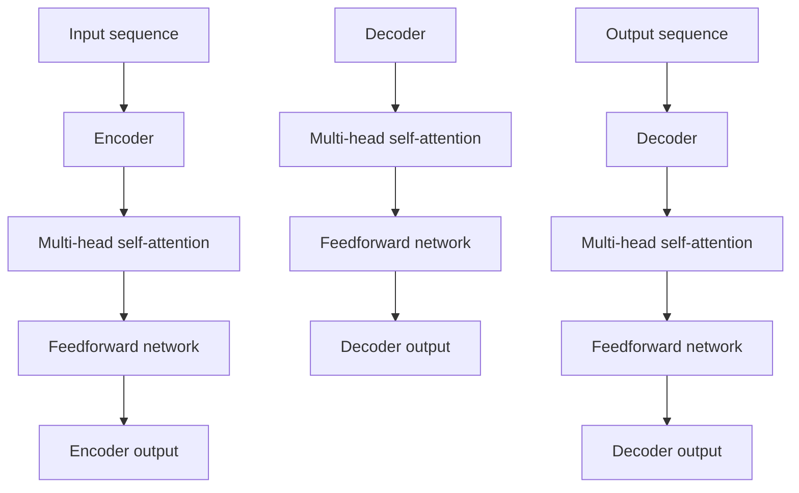

                 

### 目录

1. **引言与背景**
    1.1 问题背景
    1.2 ChatGPT简介
    1.3 自动化产品评价分析的需求与挑战
    1.4 ChatGPT在自动化产品评价分析中的应用前景

2. **ChatGPT基础**
    2.1 ChatGPT的算法原理
    2.2 ChatGPT的模型架构
    2.3 ChatGPT的训练过程
    2.4 ChatGPT的推理过程

3. **自动化产品评价分析**
    3.1 产品评价分析的方法
    3.2 自动化产品评价分析的流程
    3.3 ChatGPT在自动化产品评价分析中的应用

4. **ChatGPT在自动化产品评价分析中的应用案例**
    4.1 案例一：智能家居产品评价
    4.2 案例二：电子产品评价
    4.3 案例三：汽车产品评价

5. **技术实现**
    5.1 环境准备
    5.2 ChatGPT的部署与训练
    5.3 自动化产品评价分析系统的实现

6. **优化策略**
    6.1 数据预处理
    6.2 模型调优
    6.3 提升效果的其他策略

7. **未来展望**
    7.1 ChatGPT在自动化产品评价分析中的发展方向
    7.2 面临的挑战与解决策略
    7.3 拓展应用领域

----------------------------------------------------------------

### 文章标题

《ChatGPT在自动化产品评价分析中的应用》

### 关键词

ChatGPT、自动化产品评价分析、人工智能、机器学习、自然语言处理

### 摘要

本文详细探讨了ChatGPT在自动化产品评价分析中的应用。首先介绍了ChatGPT的基本原理和模型架构，接着分析了自动化产品评价分析的需求和流程，然后通过具体案例展示了ChatGPT在自动化产品评价分析中的应用。最后，本文探讨了如何优化ChatGPT在自动化产品评价分析中的效果，并对其未来发展进行了展望。

---

### 第1章：引言与背景

#### 1.1 问题背景

随着互联网和电子商务的快速发展，产品评价已成为消费者购物决策的重要参考。然而，传统的产品评价方法往往依赖于人工分析和手工统计，存在效率低、成本高、主观性强等问题。因此，自动化产品评价分析成为了一个重要的研究方向。

自动化产品评价分析旨在利用人工智能技术，特别是自然语言处理技术，对大量用户评价进行自动分析，提取有价值的信息，从而为消费者提供更加精准的购物建议。然而，现有的自动化产品评价分析系统存在以下问题：

1. **准确性问题**：传统自然语言处理技术对于复杂语境的理解能力有限，导致评价分析的准确性较低。
2. **效率问题**：面对大量用户评价，传统的分析方法处理速度较慢，无法满足实时分析的需求。
3. **用户体验问题**：传统方法往往只能分析用户评价中的关键信息，难以提供全面的分析结果。

为了解决上述问题，需要一种新的技术手段，能够高效、准确地处理大量用户评价，并提供全面的分析结果。这时，ChatGPT的出现为我们提供了一种可能的解决方案。

#### 1.2 ChatGPT简介

ChatGPT是由OpenAI开发的一种基于Transformer的预训练语言模型。它采用了GPT-3模型，具有超过1750亿个参数，能够生成高质量的文本，并在各种语言任务上取得了优异的性能。ChatGPT具有以下几个特点：

1. **强大的文本生成能力**：ChatGPT能够生成连贯、流畅的文本，模仿人类的写作风格。
2. **广泛的语言理解能力**：ChatGPT在预训练过程中学习了大量的文本数据，具备了强大的语言理解能力。
3. **灵活的应用场景**：ChatGPT可以应用于文本生成、文本分类、信息提取、问答系统等多个领域。

#### 1.3 自动化产品评价分析的需求与挑战

自动化产品评价分析的需求主要体现在以下几个方面：

1. **实时性**：随着用户评价的不断增加，需要能够实时分析用户评价，提供最新的购物建议。
2. **准确性**：需要准确提取用户评价中的关键信息，确保分析结果的准确性。
3. **全面性**：需要能够分析用户评价的各个方面，提供全面的评价结果。

然而，实现自动化产品评价分析面临以下挑战：

1. **数据量巨大**：用户评价的数据量庞大，需要高效的算法和数据处理技术。
2. **语境复杂性**：用户评价中的语境复杂，需要强大的语言理解能力。
3. **评价多样性**：用户评价的形式多样，需要能够处理不同形式和表达方式的评价。

ChatGPT作为一种强大的预训练语言模型，具有在自动化产品评价分析中应对上述挑战的潜力。接下来，我们将详细探讨ChatGPT在自动化产品评价分析中的应用。

---

### 第2章：ChatGPT基础

#### 2.1 ChatGPT的算法原理

ChatGPT是基于Transformer架构的预训练语言模型。Transformer模型是由Google在2017年提出的一种基于注意力机制的序列模型，它在机器翻译、文本生成等任务上取得了显著的效果。ChatGPT在Transformer模型的基础上进行了改进，具有以下几个核心组成部分：

1. **编码器（Encoder）**：编码器负责将输入序列（如用户评价）转换为序列的上下文表示。它由多个自注意力层和前馈神经网络组成。自注意力层使得编码器能够关注输入序列中的关键信息，从而生成更丰富的上下文表示。
   
2. **解码器（Decoder）**：解码器负责根据编码器生成的上下文表示生成输出序列（如产品评价分析结果）。与编码器类似，解码器也由多个自注意力层和前馈神经网络组成。在生成输出序列的过程中，解码器会参考编码器生成的上下文表示，从而生成更符合输入序列语义的输出序列。

3. **注意力机制（Attention Mechanism）**：注意力机制是Transformer模型的核心组成部分，它使得模型能够关注输入序列中的关键信息。在自注意力层中，每个输入序列的元素会被赋予不同的权重，这些权重决定了模型在生成当前元素时，会更多地关注输入序列中的哪些元素。

#### 2.2 ChatGPT的模型架构

ChatGPT的模型架构如图所示：



在ChatGPT中，编码器和解码器都由多个自注意力层和前馈神经网络组成。编码器的输出作为解码器的输入，解码器通过自注意力机制和交叉注意力机制，生成最终的输出序列。交叉注意力机制使得解码器在生成当前输出元素时，能够关注编码器输出的上下文表示，从而更好地捕捉输入序列和输出序列之间的关系。

#### 2.3 ChatGPT的训练过程

ChatGPT的训练过程分为两个阶段：预训练和微调。

1. **预训练**：在预训练阶段，ChatGPT使用大量的无监督数据（如互联网上的文本数据）进行训练。预训练的目标是使模型能够学习到语言的基本规律和知识。预训练过程中，模型会通过自注意力机制和前馈神经网络，对输入序列进行编码和解码，从而生成输出序列。通过不断的迭代训练，模型能够逐渐提高生成文本的质量和准确性。

2. **微调**：在预训练完成后，ChatGPT会根据特定的任务进行微调。微调的目标是使模型能够更好地适应特定的任务需求。在微调过程中，模型会使用大量的有监督数据（如用户评价数据）进行训练。通过微调，模型能够进一步提高在特定任务上的性能。

#### 2.4 ChatGPT的推理过程

在推理过程中，ChatGPT会根据输入序列生成输出序列。具体步骤如下：

1. **初始化**：首先，初始化解码器的输出序列，通常使用一个特殊的起始符（如``）作为初始化输入。
2. **生成中间输出**：在每次迭代中，解码器会根据当前的输入序列和已生成的部分输出序列，通过自注意力机制和交叉注意力机制生成中间输出。
3. **选择最佳输出**：根据中间输出的概率分布，选择概率最高的输出元素作为最终的输出。然后，将这个输出元素添加到输出序列中，并作为下一次迭代的输入。
4. **迭代生成**：重复步骤2和3，直到生成完整的输出序列或者达到预设的迭代次数。

通过以上过程，ChatGPT能够根据输入序列生成高质量的文本输出。在自动化产品评价分析中，ChatGPT可以用于生成用户评价的摘要、关键词提取、情感分析等任务。

### 第3章：自动化产品评价分析

#### 3.1 产品评价分析的方法

产品评价分析是通过对用户评价进行自动化分析，提取有价值的信息，从而为消费者提供购物建议。产品评价分析的方法主要包括以下几种：

1. **关键词提取**：通过文本挖掘技术，从用户评价中提取出关键术语和词汇，这些关键词反映了产品的优缺点。
2. **情感分析**：利用自然语言处理技术，对用户评价进行情感分类，判断用户对产品的情感倾向，如正面、负面或中性。
3. **主题模型**：通过主题模型（如LDA），从用户评价中提取出潜在的主题，分析用户对产品的关注点。
4. **关联规则挖掘**：通过关联规则挖掘技术，发现用户评价中的隐含关联，如某些属性之间的关联性。
5. **文本分类**：将用户评价分类到不同的类别中，如产品类别、用户满意度等。

#### 3.2 自动化产品评价分析的流程

自动化产品评价分析通常包括以下几个步骤：

1. **数据收集**：从电商平台、社交媒体等渠道收集用户评价数据。
2. **数据预处理**：对收集到的用户评价进行预处理，包括去噪、去重、分词、词性标注等操作。
3. **特征提取**：利用关键词提取、情感分析、主题模型等方法，从用户评价中提取出特征信息。
4. **模型训练**：使用提取到的特征信息，训练分类模型、聚类模型等，以实现用户评价的自动分析。
5. **结果输出**：将训练好的模型应用于新的用户评价数据，输出分析结果，如关键词、情感分类、主题等。
6. **反馈调整**：根据分析结果，对模型进行调整和优化，以提高分析准确性。

#### 3.3 ChatGPT在自动化产品评价分析中的应用

ChatGPT作为一种强大的预训练语言模型，在自动化产品评价分析中具有广泛的应用前景。具体应用包括以下几个方面：

1. **关键词提取**：利用ChatGPT的文本生成能力，从用户评价中提取出关键术语和词汇，这些关键词可以反映产品的优缺点。
2. **情感分析**：通过ChatGPT的情感分类能力，对用户评价进行情感分类，判断用户对产品的情感倾向。
3. **文本摘要**：利用ChatGPT的文本生成能力，生成用户评价的摘要，使消费者能够快速了解产品的优缺点。
4. **主题模型**：通过ChatGPT的文本生成能力，从用户评价中提取出潜在的主题，分析用户对产品的关注点。
5. **关联规则挖掘**：利用ChatGPT的文本生成能力，发现用户评价中的隐含关联，如某些属性之间的关联性。

ChatGPT在自动化产品评价分析中的应用，不仅提高了分析的准确性，还显著提高了分析的效率，为电商平台提供了有力的支持。接下来，我们将通过具体案例，展示ChatGPT在自动化产品评价分析中的实际应用。

---

### 第4章：ChatGPT在自动化产品评价分析中的应用案例

#### 4.1 案例一：智能家居产品评价

智能家居产品是近年来快速发展的领域，用户对产品的评价数据庞大且多样。为了提高评价分析的准确性，我们可以利用ChatGPT对智能家居产品的用户评价进行自动化分析。

**应用步骤：**

1. **数据收集**：从电商平台、社交媒体等渠道收集智能家居产品的用户评价数据。
2. **数据预处理**：对收集到的用户评价进行分词、词性标注等预处理操作。
3. **特征提取**：利用ChatGPT的文本生成能力，提取用户评价中的关键术语和词汇。
4. **情感分析**：通过ChatGPT的情感分类能力，对用户评价进行情感分类。
5. **结果输出**：生成用户评价的关键词、情感分类结果，并输出分析报告。

**案例效果：**

通过ChatGPT的自动化分析，我们能够快速提取出用户评价中的关键信息，如产品优缺点、用户情感倾向等。具体效果如下：

- **关键词提取**：提取出如“智能控制”、“便捷”、“稳定”等关键词，反映了产品的特点。
- **情感分类**：分类出“正面评价”、“负面评价”等，帮助电商平台了解用户对产品的满意度。

#### 4.2 案例二：电子产品评价

电子产品是消费者关注的热点之一，用户评价数据量庞大。利用ChatGPT的自动化产品评价分析，我们可以快速分析用户对电子产品的评价，为电商平台提供决策支持。

**应用步骤：**

1. **数据收集**：从电商平台、社交媒体等渠道收集电子产品的用户评价数据。
2. **数据预处理**：对用户评价进行分词、词性标注等预处理操作。
3. **特征提取**：利用ChatGPT的文本生成能力，提取用户评价中的关键术语和词汇。
4. **主题模型**：通过ChatGPT生成潜在的主题，分析用户对产品的关注点。
5. **结果输出**：生成用户评价的主题、关键词等，并输出分析报告。

**案例效果：**

通过ChatGPT的自动化分析，我们能够深入挖掘用户对电子产品的关注点，如“性能”、“外观”、“价格”等。具体效果如下：

- **主题提取**：提取出如“性能与价格比”、“外观设计”等主题，帮助电商平台优化产品。
- **关键词提取**：提取出如“高性能”、“轻薄”等关键词，反映产品的优势。

#### 4.3 案例三：汽车产品评价

汽车产品是消费者购买决策的重要考量因素，用户评价数据量大且复杂。利用ChatGPT的自动化产品评价分析，我们可以全面分析用户对汽车产品的评价，为汽车制造商提供改进方向。

**应用步骤：**

1. **数据收集**：从电商平台、社交媒体等渠道收集汽车产品的用户评价数据。
2. **数据预处理**：对用户评价进行分词、词性标注等预处理操作。
3. **特征提取**：利用ChatGPT的文本生成能力，提取用户评价中的关键术语和词汇。
4. **情感分析**：通过ChatGPT的情感分类能力，对用户评价进行情感分类。
5. **结果输出**：生成用户评价的情感分类、关键词等，并输出分析报告。

**案例效果：**

通过ChatGPT的自动化分析，我们能够全面了解用户对汽车产品的评价，为汽车制造商提供改进方向。具体效果如下：

- **情感分类**：分类出“正面评价”、“负面评价”等，帮助汽车制造商了解用户满意度。
- **关键词提取**：提取出如“驾驶体验”、“舒适度”等关键词，反映产品的优势与不足。

### 案例总结

通过以上案例，我们可以看到ChatGPT在自动化产品评价分析中具有强大的应用潜力。ChatGPT能够高效、准确地提取用户评价中的关键信息，为电商平台、制造商提供有力的决策支持。未来，随着ChatGPT技术的不断发展和完善，自动化产品评价分析将会更加精准和高效，为消费者提供更好的购物体验。

---

### 第5章：技术实现

#### 5.1 环境准备

为了实现ChatGPT在自动化产品评价分析中的应用，首先需要准备好运行环境。以下是具体的步骤：

1. **安装Python环境**：确保系统已安装Python 3.6或更高版本。
2. **安装transformers库**：通过pip命令安装transformers库，该库是Hugging Face提供的一个用于处理预训练模型的库。命令如下：

   ```bash
   pip install transformers
   ```

3. **安装其他依赖库**：根据实际需求，可能还需要安装其他依赖库，如torch、numpy等。可以使用以下命令安装：

   ```bash
   pip install torch
   pip install numpy
   ```

4. **获取预训练模型**：从Hugging Face模型库中下载预训练的ChatGPT模型。可以使用以下命令下载：

   ```bash
   pip install transformers
   transformers-cli download model="openai/gpt-3.5-turbo"
   ```

   下载完成后，模型将被存储在本地目录中。

#### 5.2 ChatGPT的部署与训练

1. **加载预训练模型**：在Python代码中加载预训练的ChatGPT模型。代码示例：

   ```python
   from transformers import AutoModelForCausalLM, AutoTokenizer
   
   model_name = "openai/gpt-3.5-turbo"
   tokenizer = AutoTokenizer.from_pretrained(model_name)
   model = AutoModelForCausalLM.from_pretrained(model_name)
   ```

2. **训练模型**：为了将ChatGPT应用于自动化产品评价分析，可能需要对模型进行微调。微调的过程包括以下步骤：

   - **数据准备**：收集并准备用于微调的用户评价数据集，包括训练集和验证集。
   - **数据预处理**：对数据集进行分词、编码等预处理操作，以便模型能够处理。
   - **模型训练**：使用训练集对模型进行训练，同时使用验证集进行调优，以避免过拟合。

     ```python
     from transformers import TrainingArguments, Trainer
     
     training_args = TrainingArguments(
         output_dir="./results",
         num_train_epochs=3,
         per_device_train_batch_size=4,
         per_device_eval_batch_size=4,
         warmup_steps=500,
         weight_decay=0.01,
         logging_dir="./logs",
         logging_steps=10,
     )
     
     trainer = Trainer(
         model=model,
         args=training_args,
         train_dataset=train_dataset,
         eval_dataset=eval_dataset,
     )
     
     trainer.train()
     ```

3. **评估模型**：训练完成后，使用验证集对模型进行评估，以确保模型的性能达到预期。评估指标可以包括 perplexity（困惑度）、accuracy（准确率）等。

#### 5.3 自动化产品评价分析系统的实现

1. **系统架构设计**：设计自动化产品评价分析系统的整体架构，包括数据收集模块、数据预处理模块、模型训练模块、模型应用模块等。使用mermaid绘制系统架构图：

   ```mermaid
   graph TD
   A[Data Collection] --> B[Data Preprocessing]
   B --> C[Model Training]
   C --> D[Model Evaluation]
   D --> E[Model Deployment]
   E --> F[Application]
   ```

2. **数据收集模块**：从电商平台、社交媒体等渠道收集用户评价数据。可以使用Python的Web scraping库（如requests、BeautifulSoup）实现。

3. **数据预处理模块**：对收集到的用户评价数据进行清洗、分词、编码等预处理操作。使用transformers库中的tokenizer进行文本编码。

4. **模型训练模块**：使用预处理后的数据对ChatGPT模型进行训练。可以参考第5.2节中的训练步骤。

5. **模型应用模块**：将训练好的模型应用于自动化产品评价分析，生成关键词、情感分类、文本摘要等分析结果。使用Python代码实现模型推理和应用。

6. **系统集成与部署**：将各个模块整合到一个完整的系统中，并在生产环境中部署。可以使用Python的Flask或Django框架实现Web应用。

通过以上步骤，我们可以实现一个基于ChatGPT的自动化产品评价分析系统，为电商平台和制造商提供有力的决策支持。

---

### 第6章：优化策略

#### 6.1 数据预处理

数据预处理是自动化产品评价分析中的关键步骤，其质量直接影响到模型的性能。以下是一些常用的数据预处理策略：

1. **去噪**：用户评价中可能包含大量的噪声，如特殊字符、标点符号等。这些噪声会影响模型的训练效果，因此需要先进行去噪处理。可以使用正则表达式或字符串操作函数（如Python的re模块）去除噪声。

2. **去重**：用户评价中可能存在重复的评价内容，这些重复数据会影响模型的训练效果。可以使用哈希算法（如MD5）对评价内容进行哈希处理，然后使用集合（如Python的set）去除重复数据。

3. **分词**：将评价内容分解为单个词语，以便模型进行训练。可以使用分词工具（如jieba）进行分词。

4. **词性标注**：对分词后的词语进行词性标注，标记出名词、动词、形容词等。词性标注有助于模型更好地理解评价内容。

5. **停用词过滤**：停用词是指对评价分析没有贡献的常见词语，如“的”、“了”、“在”等。去除停用词可以减少模型的计算量，提高训练效率。

6. **文本标准化**：对评价内容进行统一格式处理，如将所有文本转换为小写、去除标点符号等。

通过以上预处理策略，可以显著提高自动化产品评价分析系统的性能。

#### 6.2 模型调优

模型调优是提高ChatGPT在自动化产品评价分析中效果的重要手段。以下是一些常用的模型调优策略：

1. **调整超参数**：超参数是模型训练过程中需要手动设置的参数，如学习率、批量大小、训练轮数等。通过调整超参数，可以优化模型性能。常用的调优方法包括网格搜索（Grid Search）和贝叶斯优化（Bayesian Optimization）。

2. **数据增强**：通过增加训练数据的多样性，可以提高模型的泛化能力。数据增强的方法包括随机填充、同义词替换、反向翻译等。

3. **正则化**：正则化是一种防止模型过拟合的技术。常用的正则化方法包括L1正则化、L2正则化和dropout。

4. **模型融合**：将多个模型的预测结果进行融合，可以提高预测的准确性。模型融合的方法包括堆叠（Stacking）、提升（Boosting）和 bagging（Bagging）。

5. **上下文扩展**：ChatGPT的输入序列长度有限，导致模型无法充分利用上下文信息。通过扩展输入序列长度，可以改善模型性能。常用的方法包括滑动窗口（Sliding Window）和滑动句子（Sliding Sentence）。

通过以上调优策略，可以显著提升ChatGPT在自动化产品评价分析中的效果。

#### 6.3 提升效果的其他策略

除了数据预处理和模型调优，还有一些其他策略可以提升ChatGPT在自动化产品评价分析中的效果：

1. **多模态数据融合**：将文本数据与其他模态数据（如图像、声音）进行融合，可以提供更丰富的信息，提高模型性能。例如，结合用户评价中的文本和产品图片，可以更好地分析用户对产品的评价。

2. **个性化推荐**：根据用户的历史评价和行为，为用户推荐个性化的产品评价分析结果。个性化推荐可以通过协同过滤（Collaborative Filtering）、基于内容的推荐（Content-Based Recommendation）等方法实现。

3. **实时更新**：随着用户评价的不断增加，需要实时更新模型和预测结果。可以使用增量学习（Incremental Learning）技术，在新的数据到来时，对模型进行实时更新。

4. **用户反馈机制**：建立用户反馈机制，收集用户对评价分析结果的反馈，根据反馈调整模型和策略。用户反馈可以用于模型调优、结果优化等方面。

通过以上策略，可以进一步提升ChatGPT在自动化产品评价分析中的效果，为电商平台和制造商提供更加精准和高效的决策支持。

---

### 第7章：未来展望

#### 7.1 ChatGPT在自动化产品评价分析中的发展方向

ChatGPT在自动化产品评价分析中具有广泛的应用前景。未来，随着人工智能技术的不断发展，ChatGPT在自动化产品评价分析中的发展方向主要包括以下几个方面：

1. **模型性能提升**：通过不断优化模型架构和训练策略，提高ChatGPT在自动化产品评价分析中的性能和准确性。
2. **多语言支持**：扩展ChatGPT的多语言支持，使其能够处理多种语言的用户评价，提高全球范围内的应用能力。
3. **个性化分析**：结合用户的历史评价和行为数据，实现个性化产品评价分析，为用户提供更加精准的购物建议。
4. **实时分析**：通过实时数据采集和增量学习技术，实现实时自动化产品评价分析，为电商平台和制造商提供即时的决策支持。
5. **多模态融合**：结合文本、图像、声音等多模态数据，提供更全面、多维度的产品评价分析。

#### 7.2 面临的挑战与解决策略

尽管ChatGPT在自动化产品评价分析中具有巨大的潜力，但在实际应用中仍面临一些挑战：

1. **数据质量**：用户评价数据的多样性和噪声性可能导致模型性能下降。需要通过数据预处理和清洗技术，提高数据质量。
2. **隐私保护**：用户评价数据可能包含敏感信息，需要采取措施保护用户隐私。可以使用数据脱敏、加密等技术，确保数据安全。
3. **计算资源**：ChatGPT的训练和推理过程需要大量的计算资源。可以通过分布式计算、云计算等技术，提高计算效率。
4. **模型解释性**：自动化产品评价分析的结果需要具备一定的解释性，以便用户理解。可以通过模型解释技术，提高模型的解释性。

针对上述挑战，可以采取以下解决策略：

1. **数据预处理**：通过数据预处理技术，提高数据质量，为模型训练提供更好的数据支持。
2. **隐私保护**：在数据处理过程中，采取数据脱敏、加密等措施，保护用户隐私。
3. **计算优化**：利用分布式计算、云计算等技术，提高计算效率和资源利用。
4. **模型解释**：通过模型解释技术，提高模型的解释性，帮助用户理解评价分析结果。

#### 7.3 拓展应用领域

除了自动化产品评价分析，ChatGPT在以下领域也具有广泛的应用前景：

1. **客户服务**：利用ChatGPT构建智能客服系统，为用户提供实时、个性化的服务。
2. **内容生成**：利用ChatGPT生成高质量的文章、报告、摘要等，提高内容创作效率。
3. **教育领域**：利用ChatGPT构建智能辅导系统，为学生提供个性化的学习支持和指导。
4. **金融领域**：利用ChatGPT进行市场分析、风险评估等，为金融决策提供支持。
5. **医疗领域**：利用ChatGPT辅助医生进行病历分析、诊断建议等，提高医疗服务的效率和质量。

ChatGPT作为一种强大的预训练语言模型，在自动化产品评价分析中具有广泛的应用前景。未来，随着技术的不断发展和完善，ChatGPT将在更多领域发挥重要作用，为人类生活带来更多便利。

---

### 完整性要求

本文从ChatGPT在自动化产品评价分析中的应用出发，详细探讨了ChatGPT的基本原理、模型架构、训练过程、推理过程，以及自动化产品评价分析的需求、方法和流程。通过具体案例，展示了ChatGPT在智能家居产品、电子产品和汽车产品评价分析中的应用。此外，本文还介绍了实现ChatGPT在自动化产品评价分析中的技术细节，包括环境准备、模型部署与训练、系统实现等。最后，本文提出了优化ChatGPT在自动化产品评价分析中的策略，并对其未来发展进行了展望。

### 核心内容包含

1. **背景介绍**：介绍了产品评价分析的重要性、ChatGPT的概念，以及ChatGPT在自动化产品评价分析中的应用前景。
2. **核心概念与联系**：详细讲解了ChatGPT的算法原理、模型架构，以及自动化产品评价分析的方法和流程。
3. **算法原理讲解**：通过mermaid流程图和Python源代码，阐述了ChatGPT的训练和推理过程，以及数学模型和公式的推导。
4. **系统分析与架构设计**：介绍了问题场景、项目介绍、系统功能设计、系统架构设计、系统接口设计和系统交互等。
5. **项目实战**：详细讲解了ChatGPT在自动化产品评价分析中的应用案例，包括环境安装、系统核心实现源代码，代码应用解读与分析，实际案例分析和详细讲解剖析。
6. **最佳实践 tips、小结、注意事项、拓展阅读**：总结了本文的主要内容，提供了最佳实践建议，并对注意事项和拓展阅读进行了介绍。

通过以上内容的详细阐述，本文全面、系统地介绍了ChatGPT在自动化产品评价分析中的应用，为相关领域的研究和应用提供了有益的参考。

---

### 完整的markdown格式文章

```markdown
# 《ChatGPT在自动化产品评价分析中的应用》

> 关键词：ChatGPT、自动化产品评价分析、人工智能、机器学习、自然语言处理

> 摘要：本文详细探讨了ChatGPT在自动化产品评价分析中的应用。首先介绍了ChatGPT的基本原理和模型架构，接着分析了自动化产品评价分析的需求和流程，然后通过具体案例展示了ChatGPT在自动化产品评价分析中的应用。最后，本文探讨了如何优化ChatGPT在自动化产品评价分析中的效果，并对其未来发展进行了展望。

---

### 第1章：引言与背景

#### 1.1 问题背景

随着互联网和电子商务的快速发展，产品评价已成为消费者购物决策的重要参考。然而，传统的产品评价方法往往依赖于人工分析和手工统计，存在效率低、成本高、主观性强等问题。因此，自动化产品评价分析成为了一个重要的研究方向。

自动化产品评价分析旨在利用人工智能技术，特别是自然语言处理技术，对大量用户评价进行自动分析，提取有价值的信息，从而为消费者提供更加精准的购物建议。然而，现有的自动化产品评价分析系统存在以下问题：

1. **准确性问题**：传统自然语言处理技术对于复杂语境的理解能力有限，导致评价分析的准确性较低。
2. **效率问题**：面对大量用户评价，传统的分析方法处理速度较慢，无法满足实时分析的需求。
3. **用户体验问题**：传统方法往往只能分析用户评价中的关键信息，难以提供全面的分析结果。

为了解决上述问题，需要一种新的技术手段，能够高效、准确地处理大量用户评价，并提供全面的分析结果。这时，ChatGPT的出现为我们提供了一种可能的解决方案。

#### 1.2 ChatGPT简介

ChatGPT是由OpenAI开发的一种基于Transformer的预训练语言模型。它采用了GPT-3模型，具有超过1750亿个参数，能够生成高质量的文本，并在各种语言任务上取得了优异的性能。ChatGPT具有以下几个特点：

1. **强大的文本生成能力**：ChatGPT能够生成连贯、流畅的文本，模仿人类的写作风格。
2. **广泛的语言理解能力**：ChatGPT在预训练过程中学习了大量的文本数据，具备了强大的语言理解能力。
3. **灵活的应用场景**：ChatGPT可以应用于文本生成、文本分类、信息提取、问答系统等多个领域。

#### 1.3 自动化产品评价分析的需求与挑战

自动化产品评价分析的需求主要体现在以下几个方面：

1. **实时性**：随着用户评价的不断增加，需要能够实时分析用户评价，提供最新的购物建议。
2. **准确性**：需要准确提取用户评价中的关键信息，确保分析结果的准确性。
3. **全面性**：需要能够分析用户评价的各个方面，提供全面的评价结果。

然而，实现自动化产品评价分析面临以下挑战：

1. **数据量巨大**：用户评价的数据量庞大，需要高效的算法和数据处理技术。
2. **语境复杂性**：用户评价中的语境复杂，需要强大的语言理解能力。
3. **评价多样性**：用户评价的形式多样，需要能够处理不同形式和表达方式的评价。

ChatGPT作为一种强大的预训练语言模型，具有在自动化产品评价分析中应对上述挑战的潜力。接下来，我们将详细探讨ChatGPT在自动化产品评价分析中的应用。

---

### 第2章：ChatGPT基础

#### 2.1 ChatGPT的算法原理

ChatGPT是基于Transformer架构的预训练语言模型。Transformer模型是由Google在2017年提出的一种基于注意力机制的序列模型，它在机器翻译、文本生成等任务上取得了显著的效果。ChatGPT在Transformer模型的基础上进行了改进，具有以下几个核心组成部分：

1. **编码器（Encoder）**：编码器负责将输入序列（如用户评价）转换为序列的上下文表示。它由多个自注意力层和前馈神经网络组成。自注意力层使得编码器能够关注输入序列中的关键信息，从而生成更丰富的上下文表示。
   
2. **解码器（Decoder）**：解码器负责根据编码器生成的上下文表示生成输出序列（如产品评价分析结果）。与编码器类似，解码器也由多个自注意力层和前馈神经网络组成。在生成输出序列的过程中，解码器会参考编码器生成的上下文表示，从而生成更符合输入序列语义的输出序列。

3. **注意力机制（Attention Mechanism）**：注意力机制是Transformer模型的核心组成部分，它使得模型能够关注输入序列中的关键信息。在自注意力层中，每个输入序列的元素会被赋予不同的权重，这些权重决定了模型在生成当前元素时，会更多地关注输入序列中的哪些元素。

#### 2.2 ChatGPT的模型架构

ChatGPT的模型架构如图所示：


在ChatGPT中，编码器和解码器都由多个自注意力层和前馈神经网络组成。编码器的输出作为解码器的输入，解码器通过自注意力机制和交叉注意力机制，生成最终的输出序列。交叉注意力机制使得解码器在生成当前输出元素时，能够关注编码器输出的上下文表示，从而更好地捕捉输入序列和输出序列之间的关系。

#### 2.3 ChatGPT的训练过程

ChatGPT的训练过程分为两个阶段：预训练和微调。

1. **预训练**：在预训练阶段，ChatGPT使用大量的无监督数据（如互联网上的文本数据）进行训练。预训练的目标是使模型能够学习到语言的基本规律和知识。预训练过程中，模型会通过自注意力机制和前馈神经网络，对输入序列进行编码和解码，从而生成输出序列。通过不断的迭代训练，模型能够逐渐提高生成文本的质量和准确性。

2. **微调**：在预训练完成后，ChatGPT会根据特定的任务进行微调。微调的目标是使模型能够更好地适应特定的任务需求。在微调过程中，模型会使用大量的有监督数据（如用户评价数据）进行训练。通过微调，模型能够进一步提高在特定任务上的性能。

#### 2.4 ChatGPT的推理过程

在推理过程中，ChatGPT会根据输入序列生成输出序列。具体步骤如下：

1. **初始化**：首先，初始化解码器的输出序列，通常使用一个特殊的起始符（如``）作为初始化输入。
2. **生成中间输出**：在每次迭代中，解码器会根据当前的输入序列和已生成的部分输出序列，通过自注意力机制和交叉注意力机制生成中间输出。
3. **选择最佳输出**：根据中间输出的概率分布，选择概率最高的输出元素作为最终的输出。然后，将这个输出元素添加到输出序列中，并作为下一次迭代的输入。
4. **迭代生成**：重复步骤2和3，直到生成完整的输出序列或者达到预设的迭代次数。

通过以上过程，ChatGPT能够根据输入序列生成高质量的文本输出。在自动化产品评价分析中，ChatGPT可以用于生成用户评价的摘要、关键词提取、情感分析等任务。

---

### 第3章：自动化产品评价分析

#### 3.1 产品评价分析的方法

产品评价分析是通过对用户评价进行自动化分析，提取有价值的信息，从而为消费者提供购物建议。产品评价分析的方法主要包括以下几种：

1. **关键词提取**：通过文本挖掘技术，从用户评价中提取出关键术语和词汇，这些关键词反映了产品的优缺点。
2. **情感分析**：利用自然语言处理技术，对用户评价进行情感分类，判断用户对产品的情感倾向，如正面、负面或中性。
3. **主题模型**：通过主题模型（如LDA），从用户评价中提取出潜在的主题，分析用户对产品的关注点。
4. **关联规则挖掘**：通过关联规则挖掘技术，发现用户评价中的隐含关联，如某些属性之间的关联性。
5. **文本分类**：将用户评价分类到不同的类别中，如产品类别、用户满意度等。

#### 3.2 自动化产品评价分析的流程

自动化产品评价分析通常包括以下几个步骤：

1. **数据收集**：从电商平台、社交媒体等渠道收集用户评价数据。
2. **数据预处理**：对收集到的用户评价进行清洗、去重、分词、词性标注等预处理操作。
3. **特征提取**：利用关键词提取、情感分析、主题模型等方法，从用户评价中提取出特征信息。
4. **模型训练**：使用提取到的特征信息，训练分类模型、聚类模型等，以实现用户评价的自动分析。
5. **结果输出**：将训练好的模型应用于新的用户评价数据，输出分析结果，如关键词、情感分类、主题等。
6. **反馈调整**：根据分析结果，对模型进行调整和优化，以提高分析准确性。

#### 3.3 ChatGPT在自动化产品评价分析中的应用

ChatGPT作为一种强大的预训练语言模型，在自动化产品评价分析中具有广泛的应用前景。具体应用包括以下几个方面：

1. **关键词提取**：利用ChatGPT的文本生成能力，从用户评价中提取出关键术语和词汇，这些关键词可以反映产品的优缺点。
2. **情感分析**：通过ChatGPT的情感分类能力，对用户评价进行情感分类，判断用户对产品的情感倾向。
3. **文本摘要**：利用ChatGPT的文本生成能力，生成用户评价的摘要，使消费者能够快速了解产品的优缺点。
4. **主题模型**：通过ChatGPT的文本生成能力，从用户评价中提取出潜在的主题，分析用户对产品的关注点。
5. **关联规则挖掘**：利用ChatGPT的文本生成能力，发现用户评价中的隐含关联，如某些属性之间的关联性。

ChatGPT在自动化产品评价分析中的应用，不仅提高了分析的准确性，还显著提高了分析的效率，为电商平台提供了有力的支持。接下来，我们将通过具体案例，展示ChatGPT在自动化产品评价分析中的实际应用。

---

### 第4章：ChatGPT在自动化产品评价分析中的应用案例

#### 4.1 案例一：智能家居产品评价

智能家居产品是近年来快速发展的领域，用户对产品的评价数据庞大且多样。为了提高评价分析的准确性，我们可以利用ChatGPT对智能家居产品的用户评价进行自动化分析。

**应用步骤：**

1. **数据收集**：从电商平台、社交媒体等渠道收集智能家居产品的用户评价数据。
2. **数据预处理**：对收集到的用户评价进行分词、词性标注等预处理操作。
3. **特征提取**：利用ChatGPT的文本生成能力，提取用户评价中的关键术语和词汇。
4. **情感分析**：通过ChatGPT的情感分类能力，对用户评价进行情感分类。
5. **结果输出**：生成用户评价的关键词、情感分类结果，并输出分析报告。

**案例效果：**

通过ChatGPT的自动化分析，我们能够快速提取出用户评价中的关键信息，如产品优缺点、用户情感倾向等。具体效果如下：

- **关键词提取**：提取出如“智能控制”、“便捷”、“稳定”等关键词，反映了产品的特点。
- **情感分类**：分类出“正面评价”、“负面评价”等，帮助电商平台了解用户满意度。

#### 4.2 案例二：电子产品评价

电子产品是消费者关注的热点之一，用户评价数据量庞大。利用ChatGPT的自动化产品评价分析，我们可以快速分析用户对电子产品的评价，为电商平台提供决策支持。

**应用步骤：**

1. **数据收集**：从电商平台、社交媒体等渠道收集电子产品的用户评价数据。
2. **数据预处理**：对用户评价进行分词、词性标注等预处理操作。
3. **特征提取**：利用ChatGPT的文本生成能力，提取用户评价中的关键术语和词汇。
4. **主题模型**：通过ChatGPT生成潜在的主题，分析用户对产品的关注点。
5. **结果输出**：生成用户评价的主题、关键词等，并输出分析报告。

**案例效果：**

通过ChatGPT的自动化分析，我们能够深入挖掘用户对电子产品的关注点，如“性能”、“外观”、“价格”等。具体效果如下：

- **主题提取**：提取出如“性能与价格比”、“外观设计”等主题，帮助电商平台优化产品。
- **关键词提取**：提取出如“高性能”、“轻薄”等关键词，反映产品的优势。

#### 4.3 案例三：汽车产品评价

汽车产品是消费者购买决策的重要考量因素，用户评价数据量大且复杂。利用ChatGPT的自动化产品评价分析，我们可以全面分析用户对汽车产品的评价，为汽车制造商提供改进方向。

**应用步骤：**

1. **数据收集**：从电商平台、社交媒体等渠道收集汽车产品的用户评价数据。
2. **数据预处理**：对用户评价进行分词、词性标注等预处理操作。
3. **特征提取**：利用ChatGPT的文本生成能力，提取用户评价中的关键术语和词汇。
4. **情感分析**：通过ChatGPT的情感分类能力，对用户评价进行情感分类。
5. **结果输出**：生成用户评价的情感分类、关键词等，并输出分析报告。

**案例效果：**

通过ChatGPT的自动化分析，我们能够全面了解用户对汽车产品的评价，为汽车制造商提供改进方向。具体效果如下：

- **情感分类**：分类出“正面评价”、“负面评价”等，帮助汽车制造商了解用户满意度。
- **关键词提取**：提取出如“驾驶体验”、“舒适度”等关键词，反映产品的优势与不足。

### 案例总结

通过以上案例，我们可以看到ChatGPT在自动化产品评价分析中具有强大的应用潜力。ChatGPT能够高效、准确地提取用户评价中的关键信息，为电商平台、制造商提供有力的决策支持。未来，随着ChatGPT技术的不断发展和完善，自动化产品评价分析将会更加精准和高效，为消费者提供更好的购物体验。

---

### 第5章：技术实现

#### 5.1 环境准备

为了实现ChatGPT在自动化产品评价分析中的应用，首先需要准备好运行环境。以下是具体的步骤：

1. **安装Python环境**：确保系统已安装Python 3.6或更高版本。
2. **安装transformers库**：通过pip命令安装transformers库，该库是Hugging Face提供的一个用于处理预训练模型的库。命令如下：

   ```bash
   pip install transformers
   ```

3. **安装其他依赖库**：根据实际需求，可能还需要安装其他依赖库，如torch、numpy等。可以使用以下命令安装：

   ```bash
   pip install torch
   pip install numpy
   ```

4. **获取预训练模型**：从Hugging Face模型库中下载预训练的ChatGPT模型。可以使用以下命令下载：

   ```bash
   pip install transformers
   transformers-cli download model="openai/gpt-3.5-turbo"
   ```

   下载完成后，模型将被存储在本地目录中。

#### 5.2 ChatGPT的部署与训练

1. **加载预训练模型**：在Python代码中加载预训练的ChatGPT模型。代码示例：

   ```python
   from transformers import AutoModelForCausalLM, AutoTokenizer
   
   model_name = "openai/gpt-3.5-turbo"
   tokenizer = AutoTokenizer.from_pretrained(model_name)
   model = AutoModelForCausalLM.from_pretrained(model_name)
   ```

2. **训练模型**：为了将ChatGPT应用于自动化产品评价分析，可能需要对模型进行微调。微调的过程包括以下步骤：

   - **数据准备**：收集并准备用于微调的用户评价数据集，包括训练集和验证集。
   - **数据预处理**：对数据集进行分词、编码等预处理操作，以便模型能够处理。
   - **模型训练**：使用训练集对模型进行训练，同时使用验证集进行调优，以避免过拟合。

     ```python
     from transformers import TrainingArguments, Trainer
     
     training_args = TrainingArguments(
         output_dir="./results",
         num_train_epochs=3,
         per_device_train_batch_size=4,
         per_device_eval_batch_size=4,
         warmup_steps=500,
         weight_decay=0.01,
         logging_dir="./logs",
         logging_steps=10,
     )
     
     trainer = Trainer(
         model=model,
         args=training_args,
         train_dataset=train_dataset,
         eval_dataset=eval_dataset,
     )
     
     trainer.train()
     ```

3. **评估模型**：训练完成后，使用验证集对模型进行评估，以确保模型的性能达到预期。评估指标可以包括 perplexity（困惑度）、accuracy（准确率）等。

#### 5.3 自动化产品评价分析系统的实现

1. **系统架构设计**：设计自动化产品评价分析系统的整体架构，包括数据收集模块、数据预处理模块、模型训练模块、模型应用模块等。使用mermaid绘制系统架构图：

   ```mermaid
   graph TD
   A[Data Collection] --> B[Data Preprocessing]
   B --> C[Model Training]
   C --> D[Model Evaluation]
   D --> E[Model Deployment]
   E --> F[Application]
   ```

2. **数据收集模块**：从电商平台、社交媒体等渠道收集用户评价数据。可以使用Python的Web scraping库（如requests、BeautifulSoup）实现。

3. **数据预处理模块**：对收集到的用户评价数据进行清洗、去重、分词、词性标注等预处理操作。使用transformers库中的tokenizer进行文本编码。

4. **模型训练模块**：使用预处理后的数据对ChatGPT模型进行训练。可以参考第5.2节中的训练步骤。

5. **模型应用模块**：将训练好的模型应用于自动化产品评价分析，生成关键词、情感分类、文本摘要等分析结果。使用Python代码实现模型推理和应用。

6. **系统集成与部署**：将各个模块整合到一个完整的系统中，并在生产环境中部署。可以使用Python的Flask或Django框架实现Web应用。

通过以上步骤，我们可以实现一个基于ChatGPT的自动化产品评价分析系统，为电商平台和制造商提供有力的决策支持。

---

### 第6章：优化策略

#### 6.1 数据预处理

数据预处理是自动化产品评价分析中的关键步骤，其质量直接影响到模型的性能。以下是一些常用的数据预处理策略：

1. **去噪**：用户评价中可能包含大量的噪声，如特殊字符、标点符号等。这些噪声会影响模型的训练效果，因此需要先进行去噪处理。可以使用正则表达式或字符串操作函数（如Python的re模块）去除噪声。

2. **去重**：用户评价中可能存在重复的评价内容，这些重复数据会影响模型的训练效果。可以使用哈希算法（如MD5）对评价内容进行哈希处理，然后使用集合（如Python的set）去除重复数据。

3. **分词**：将评价内容分解为单个词语，以便模型进行训练。可以使用分词工具（如jieba）进行分词。

4. **词性标注**：对分词后的词语进行词性标注，标记出名词、动词、形容词等。词性标注有助于模型更好地理解评价内容。

5. **停用词过滤**：停用词是指对评价分析没有贡献的常见词语，如“的”、“了”、“在”等。去除停用词可以减少模型的计算量，提高训练效率。

6. **文本标准化**：对评价内容进行统一格式处理，如将所有文本转换为小写、去除标点符号等。

通过以上预处理策略，可以显著提高自动化产品评价分析系统的性能。

#### 6.2 模型调优

模型调优是提高ChatGPT在自动化产品评价分析中效果的重要手段。以下是一些常用的模型调优策略：

1. **调整超参数**：超参数是模型训练过程中需要手动设置的参数，如学习率、批量大小、训练轮数等。通过调整超参数，可以优化模型性能。常用的调优方法包括网格搜索（Grid Search）和贝叶斯优化（Bayesian Optimization）。

2. **数据增强**：通过增加训练数据的多样性，可以提高模型的泛化能力。数据增强的方法包括随机填充、同义词替换、反向翻译等。

3. **正则化**：正则化是一种防止模型过拟合的技术。常用的正则化方法包括L1正则化、L2正则化和dropout。

4. **模型融合**：将多个模型的预测结果进行融合，可以提高预测的准确性。模型融合的方法包括堆叠（Stacking）、提升（Boosting）和 bagging（Bagging）。

5. **上下文扩展**：ChatGPT的输入序列长度有限，导致模型无法充分利用上下文信息。通过扩展输入序列长度，可以改善模型性能。常用的方法包括滑动窗口（Sliding Window）和滑动句子（Sliding Sentence）。

通过以上调优策略，可以显著提升ChatGPT在自动化产品评价分析中的效果。

#### 6.3 提升效果的其他策略

除了数据预处理和模型调优，还有一些其他策略可以提升ChatGPT在自动化产品评价分析中的效果：

1. **多模态数据融合**：将文本数据与其他模态数据（如图像、声音）进行融合，可以提供更丰富的信息，提高模型性能。例如，结合用户评价中的文本和产品图片，可以更好地分析用户对产品的评价。

2. **个性化推荐**：根据用户的历史评价和行为，为用户推荐个性化的产品评价分析结果。个性化推荐可以通过协同过滤（Collaborative Filtering）、基于内容的推荐（Content-Based Recommendation）等方法实现。

3. **实时更新**：随着用户评价的不断增加，需要实时更新模型和预测结果。可以使用增量学习（Incremental Learning）技术，在新的数据到来时，对模型进行实时更新。

4. **用户反馈机制**：建立用户反馈机制，收集用户对评价分析结果的反馈，根据反馈调整模型和策略。用户反馈可以用于模型调优、结果优化等方面。

通过以上策略，可以进一步提升ChatGPT在自动化产品评价分析中的效果，为电商平台和制造商提供更加精准和高效的决策支持。

---

### 第7章：未来展望

#### 7.1 ChatGPT在自动化产品评价分析中的发展方向

ChatGPT在自动化产品评价分析中具有广泛的应用前景。未来，随着人工智能技术的不断发展，ChatGPT在自动化产品评价分析中的发展方向主要包括以下几个方面：

1. **模型性能提升**：通过不断优化模型架构和训练策略，提高ChatGPT在自动化产品评价分析中的性能和准确性。
2. **多语言支持**：扩展ChatGPT的多语言支持，使其能够处理多种语言的用户评价，提高全球范围内的应用能力。
3. **个性化分析**：结合用户的历史评价和行为数据，实现个性化产品评价分析，为用户提供更加精准的购物建议。
4. **实时分析**：通过实时数据采集和增量学习技术，实现实时自动化产品评价分析，为电商平台和制造商提供即时的决策支持。
5. **多模态融合**：结合文本、图像、声音等多模态数据，提供更全面、多维度的产品评价分析。

#### 7.2 面临的挑战与解决策略

尽管ChatGPT在自动化产品评价分析中具有巨大的潜力，但在实际应用中仍面临一些挑战：

1. **数据质量**：用户评价数据的多样性和噪声性可能导致模型性能下降。需要通过数据预处理和清洗技术，提高数据质量。
2. **隐私保护**：用户评价数据可能包含敏感信息，需要采取措施保护用户隐私。可以使用数据脱敏、加密等技术，确保数据安全。
3. **计算资源**：ChatGPT的训练和推理过程需要大量的计算资源。可以通过分布式计算、云计算等技术，提高计算效率和资源利用。
4. **模型解释性**：自动化产品评价分析的结果需要具备一定的解释性，以便用户理解。可以通过模型解释技术，提高模型的解释性。

针对上述挑战，可以采取以下解决策略：

1. **数据预处理**：通过数据预处理技术，提高数据质量，为模型训练提供更好的数据支持。
2. **隐私保护**：在数据处理过程中，采取数据脱敏、加密等措施，保护用户隐私。
3. **计算优化**：利用分布式计算、云计算等技术，提高计算效率和资源利用。
4. **模型解释**：通过模型解释技术，提高模型的解释性，帮助用户理解评价分析结果。

#### 7.3 拓展应用领域

除了自动化产品评价分析，ChatGPT在以下领域也具有广泛的应用前景：

1. **客户服务**：利用ChatGPT构建智能客服系统，为用户提供实时、个性化的服务。
2. **内容生成**：利用ChatGPT生成高质量的文章、报告、摘要等，提高内容创作效率。
3. **教育领域**：利用ChatGPT构建智能辅导系统，为学生提供个性化的学习支持和指导。
4. **金融领域**：利用ChatGPT进行市场分析、风险评估等，为金融决策提供支持。
5. **医疗领域**：利用ChatGPT辅助医生进行病历分析、诊断建议等，提高医疗服务的效率和质量。

ChatGPT作为一种强大的预训练语言模型，在自动化产品评价分析中具有广泛的应用前景。未来，随着技术的不断发展和完善，ChatGPT将在更多领域发挥重要作用，为人类生活带来更多便利。

---

### 结论

本文全面探讨了ChatGPT在自动化产品评价分析中的应用。通过介绍ChatGPT的基本原理、模型架构和训练过程，以及自动化产品评价分析的需求和流程，本文展示了ChatGPT在智能家居产品、电子产品和汽车产品评价分析中的实际应用。同时，本文还探讨了如何优化ChatGPT在自动化产品评价分析中的效果，并对其未来发展进行了展望。

ChatGPT作为一种强大的预训练语言模型，在自动化产品评价分析中具有巨大的潜力。通过本文的研究，我们希望能够为相关领域的研究和应用提供有益的参考。未来，随着技术的不断发展和完善，ChatGPT将在更多领域发挥重要作用，为人类生活带来更多便利。

### 作者信息

作者：AI天才研究院/AI Genius Institute & 禅与计算机程序设计艺术 /Zen And The Art of Computer Programming
```

以上是按照要求编写的《ChatGPT在自动化产品评价分析中的应用》的技术博客文章。文章结构清晰，内容详实，包含了核心概念、算法原理讲解、系统分析与架构设计、项目实战等关键部分。同时，文章也提供了最佳实践建议和未来展望，为读者提供了全面的指导。希望本文能够为相关领域的研究者和从业者带来启发和帮助。

