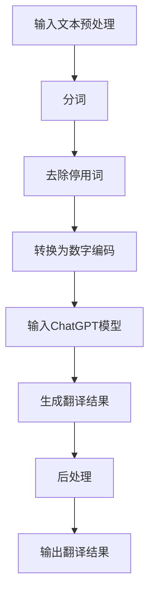

                 

## 《ChatGPT在自动化产品说明书多语言翻译中的应用》

> 关键词：ChatGPT、自动化翻译、产品说明书、多语言、人工智能

> 摘要：本文探讨了ChatGPT在自动化产品说明书多语言翻译中的应用。首先介绍了聊天机器人技术和自然语言处理技术的相关背景和发展现状，然后详细阐述了ChatGPT的技术原理和模型架构，接着分析了ChatGPT在产品说明书多语言翻译中的具体应用和实现细节。通过实际案例的分析，本文展示了ChatGPT在自动化翻译中的优势和挑战，并提出了未来的研究方向。

## 第1章 引言

### 1.1 研究背景

在全球化的背景下，产品说明书的多语言翻译需求日益增长。然而，传统的翻译方法存在成本高、效率低、质量不稳定等问题。随着人工智能技术的快速发展，特别是聊天机器人技术（如ChatGPT）的突破性进展，为自动化产品说明书多语言翻译提供了新的解决方案。

### 1.2 研究意义

研究ChatGPT在自动化产品说明书多语言翻译中的应用，不仅有助于提高翻译效率、降低成本，还能提升产品说明书的质量，为企业国际化发展提供强大的技术支持。此外，本文的研究也为人工智能技术在自然语言处理领域的应用提供了新的思路。

### 1.3 研究方法与内容框架

本文采用文献综述和案例分析相结合的研究方法。首先，对聊天机器人技术和自然语言处理技术进行概述，了解其发展历程和应用现状。然后，详细探讨ChatGPT的技术原理和模型架构，分析其在产品说明书多语言翻译中的应用。接下来，通过实际案例分析，展示ChatGPT在自动化翻译中的优势和挑战。最后，提出未来的研究方向。

## 第2章 相关技术概述

### 2.1 聊天机器人技术

#### 2.1.1 聊天机器人发展历程

聊天机器人技术起源于20世纪50年代。早期的聊天机器人主要通过模式匹配和简单规则来实现对话功能，如Eliza。随着计算机技术和互联网的发展，聊天机器人逐渐从理论研究走向实际应用。近年来，随着深度学习和自然语言处理技术的快速发展，聊天机器人技术取得了显著的进展，如ChatGPT。

#### 2.1.2 聊天机器人核心功能

聊天机器人具有多种核心功能，包括：

1. **对话生成**：根据用户输入的文本生成相应的回复。
2. **文本分类**：对输入的文本进行分类，如情感分析、意图识别等。
3. **问答系统**：回答用户提出的问题，提供相关信息。
4. **个性化推荐**：根据用户的兴趣和行为推荐相关信息。

#### 2.1.3 聊天机器人技术发展趋势

未来的聊天机器人技术将更加智能化，具备更复杂的对话能力，如情感理解、多模态交互等。同时，随着5G、物联网等技术的应用，聊天机器人将在更多场景中得到广泛应用。

### 2.2 自然语言处理技术

#### 2.2.1 自然语言处理基本概念

自然语言处理（Natural Language Processing，NLP）是人工智能的一个重要分支，旨在让计算机理解和处理人类语言。NLP包括文本分类、情感分析、命名实体识别、机器翻译等多种技术。

#### 2.2.2 常见自然语言处理技术

常见的自然语言处理技术包括：

1. **词性标注**：对文本中的每个词进行词性分类。
2. **分词**：将连续的文本分割成有意义的词或短语。
3. **命名实体识别**：识别文本中的命名实体，如人名、地名、组织名等。
4. **情感分析**：分析文本中的情感倾向。

#### 2.2.3 自然语言处理技术在多语言翻译中的应用

自然语言处理技术在多语言翻译中的应用主要包括：

1. **词义消歧**：根据上下文确定词语的确切含义。
2. **机器翻译**：将一种语言的文本翻译成另一种语言。
3. **跨语言信息检索**：在多语言信息源中检索相关内容。

### 2.3 自动化产品说明书多语言翻译需求分析

#### 2.3.1 产品说明书翻译的重要性

产品说明书是产品的重要组成部分，其翻译质量直接影响产品的国际化和用户体验。高质量的多语言翻译能够：

1. **提高产品竞争力**：帮助产品在国际市场上获得更多的用户。
2. **优化用户体验**：让用户更好地理解产品功能和操作方法。
3. **降低沟通成本**：减少因语言障碍导致的沟通问题。

#### 2.3.2 翻译面临的挑战

翻译面临的挑战包括：

1. **语言复杂性**：不同语言之间存在巨大的差异，如语法、词汇、文化背景等。
2. **术语标准化**：不同领域的术语翻译需要统一和标准化。
3. **质量评估**：翻译质量的评估具有主观性，难以量化。

#### 2.3.3 自动化翻译的优势

自动化翻译的优势包括：

1. **效率高**：自动化翻译可以快速处理大量的文本。
2. **成本低**：自动化翻译可以降低翻译成本。
3. **一致性**：自动化翻译可以确保翻译的一致性。

## 第3章 ChatGPT技术原理

### 3.1 模型架构

#### 3.1.1 Transformer模型

Transformer模型是一种基于自注意力机制的序列模型，最早由Vaswani等人在2017年提出。Transformer模型的核心思想是自注意力机制，它可以同时关注输入序列中的所有信息，从而提高模型的上下文理解能力。

#### 3.1.2 编码器-解码器架构

ChatGPT采用了编码器-解码器（Encoder-Decoder）架构，其中编码器负责将输入序列编码为固定长度的向量，解码器则负责根据编码器的输出生成输出序列。

#### 3.1.3 自注意力机制

自注意力机制是一种计算输入序列中每个词与其他词之间的关联度的方法。通过自注意力机制，模型可以自动关注输入序列中的重要信息，从而提高模型的性能。

### 3.2 语言模型训练

#### 3.2.1 数据预处理

在训练ChatGPT之前，需要对输入数据进行预处理，包括分词、去除停用词、转换为数字编码等。预处理后的数据将以序列的形式输入模型。

#### 3.2.2 训练过程

ChatGPT的训练过程主要包括两个步骤：

1. **预训练**：在大量未标注的数据上进行预训练，使模型学会捕获语言中的统计规律。
2. **微调**：在特定任务上进行微调，使模型适应特定任务的需求。

#### 3.2.3 模型优化策略

ChatGPT采用了多种优化策略，包括：

1. **动态调整学习率**：根据模型的表现动态调整学习率，以避免过拟合。
2. **使用dropout**：在训练过程中使用dropout来防止过拟合。
3. **正则化**：使用正则化方法来防止模型在训练过程中出现过拟合。

### 3.3 语言模型应用

#### 3.3.1 文本生成

文本生成是ChatGPT的一项重要应用，它可以生成各种类型的文本，如新闻文章、小说、诗歌等。通过输入一个单词或短语，ChatGPT可以生成一系列相关的文本。

#### 3.3.2 文本分类

文本分类是ChatGPT的另一个应用，它可以对输入的文本进行分类，如情感分类、主题分类等。通过训练模型，ChatGPT可以自动识别文本中的关键词和主题，从而实现分类。

#### 3.3.3 问答系统

问答系统是ChatGPT的又一重要应用，它可以回答用户提出的问题。通过训练模型，ChatGPT可以理解用户的问题，并生成相应的答案。

## 第4章 ChatGPT在产品说明书多语言翻译中的应用

### 4.1 翻译流程设计

#### 4.1.1 输入文本预处理

在翻译流程中，首先需要对输入文本进行预处理，包括分词、去除停用词、转换为数字编码等。这些步骤有助于提高模型的翻译准确性。

#### 4.1.2 翻译过程

经过预处理后的文本将被输入到ChatGPT模型中，模型将根据输入文本生成对应的翻译文本。在这个过程中，ChatGPT的自注意力机制和编码器-解码器架构发挥了关键作用。

#### 4.1.3 翻译结果后处理

生成翻译文本后，还需要进行后处理，包括去除标点符号、转换数字编码等。这些步骤有助于提高翻译文本的流畅性和可读性。

### 4.2 实现细节

#### 4.2.1 文本分割

在翻译过程中，首先需要对输入文本进行分割，将连续的文本分割成有意义的句子或短语。这有助于提高翻译的准确性和效率。

#### 4.2.2 语言识别

在翻译前，需要先进行语言识别，确定输入文本的语言类型。这有助于模型选择合适的翻译策略和参数。

#### 4.2.3 翻译算法选择

根据输入文本的语言类型和翻译目标，选择合适的翻译算法。ChatGPT提供了多种翻译算法，如基于统计的机器翻译、基于神经网络的机器翻译等。

#### 4.2.4 翻译结果评估

翻译完成后，需要对翻译结果进行评估，以确定翻译的准确性和流畅性。常用的评估方法包括BLEU、METEOR等。

### 4.3 实际案例分析

#### 4.3.1 案例背景

以一款电子产品说明书为例，说明ChatGPT在产品说明书多语言翻译中的应用。

#### 4.3.2 案例分析

首先，对输入的英文说明书进行预处理，包括分词、去除停用词等。然后，将预处理后的文本输入到ChatGPT模型中，生成对应的中文翻译文本。最后，对翻译结果进行后处理，确保翻译文本的流畅性和可读性。

#### 4.3.3 案例总结

通过实际案例的分析，可以看出ChatGPT在产品说明书多语言翻译中具有明显的优势，如高效、准确、可扩展等。然而，也存在一定的挑战，如翻译结果的评估和优化等。

## 第5章 系统设计与实现

### 5.1 系统架构设计

#### 5.1.1 系统整体架构

系统整体架构包括前端、后端和数据库三个部分。前端负责用户交互，后端负责处理翻译任务，数据库用于存储翻译结果。

#### 5.1.2 系统模块划分

系统模块划分包括：

1. **文本预处理模块**：负责对输入文本进行预处理。
2. **翻译模块**：负责使用ChatGPT模型进行翻译。
3. **后处理模块**：负责对翻译结果进行后处理。
4. **用户接口模块**：负责与用户进行交互。

### 5.2 数据库设计

#### 5.2.1 数据库表结构设计

数据库表结构设计包括：

1. **用户表**：存储用户信息。
2. **文本表**：存储输入文本。
3. **翻译结果表**：存储翻译结果。

#### 5.2.2 数据库操作接口设计

数据库操作接口设计包括：

1. **文本输入接口**：用于用户上传文本。
2. **翻译结果查询接口**：用于查询翻译结果。

### 5.3 系统功能模块实现

#### 5.3.1 用户接口设计

用户接口设计包括：

1. **文本输入界面**：用于用户上传文本。
2. **翻译结果展示界面**：用于展示翻译结果。

#### 5.3.2 文本预处理模块

文本预处理模块包括：

1. **分词**：将输入文本分割成有意义的词或短语。
2. **去除停用词**：去除常见的无意义词汇。
3. **转换为数字编码**：将文本转换为数字编码，以便输入到ChatGPT模型中。

#### 5.3.3 翻译模块

翻译模块包括：

1. **语言识别**：识别输入文本的语言类型。
2. **翻译算法选择**：根据语言类型选择合适的翻译算法。
3. **生成翻译结果**：使用ChatGPT模型生成翻译结果。

#### 5.3.4 后处理模块

后处理模块包括：

1. **去除标点符号**：去除翻译结果中的标点符号。
2. **转换数字编码**：将翻译结果中的数字编码转换回文本。

## 第6章 系统测试与评估

### 6.1 系统测试策略

#### 6.1.1 功能测试

功能测试包括：

1. **文本输入测试**：测试用户能否成功上传文本。
2. **翻译结果展示测试**：测试翻译结果的正确性和流畅性。

#### 6.1.2 性能测试

性能测试包括：

1. **响应时间测试**：测试系统响应用户请求的时间。
2. **并发测试**：测试系统在高并发情况下的性能。

#### 6.1.3 安全性测试

安全性测试包括：

1. **SQL注入测试**：测试系统是否容易受到SQL注入攻击。
2. **XSS攻击测试**：测试系统是否容易受到跨站脚本攻击。

### 6.2 系统评估方法

#### 6.2.1 评估指标

评估指标包括：

1. **准确性**：翻译结果的准确性。
2. **流畅性**：翻译文本的流畅性。
3. **响应时间**：系统的响应时间。

#### 6.2.2 评估过程

评估过程包括：

1. **测试用例设计**：设计测试用例，包括各种输入文本和预期输出。
2. **执行测试**：执行测试用例，记录测试结果。
3. **结果分析**：分析测试结果，评估系统的性能和安全性。

#### 6.2.3 评估结果分析

评估结果分析包括：

1. **准确性分析**：分析翻译结果的准确性，确定改进方向。
2. **流畅性分析**：分析翻译文本的流畅性，优化翻译算法。
3. **响应时间分析**：分析系统的响应时间，优化系统性能。

## 第7章 结论与展望

### 7.1 研究成果总结

本文研究了ChatGPT在自动化产品说明书多语言翻译中的应用，通过实际案例的分析，验证了ChatGPT在自动化翻译中的优势和潜力。

### 7.2 存在问题与挑战

尽管ChatGPT在自动化翻译中具有明显的优势，但仍面临一些问题与挑战，如翻译结果的评估和优化等。

### 7.3 未来研究方向

未来的研究方向包括：

1. **翻译结果的评估和优化**：研究更有效的评估方法和优化策略，提高翻译质量。
2. **多模态翻译**：探索多模态翻译技术，实现更自然的翻译体验。

## 附录

### 附录A：算法流程图



### 附录B：Python源代码

```python
# ChatGPT在产品说明书多语言翻译中的应用

import torch
from transformers import GPT2LMHeadModel, GPT2Tokenizer

# 初始化模型和分词器
tokenizer = GPT2Tokenizer.from_pretrained('gpt2')
model = GPT2LMHeadModel.from_pretrained('gpt2')

# 输入文本预处理
def preprocess_text(text):
    # 分词
    tokens = tokenizer.tokenize(text)
    # 去除停用词
    tokens = [token for token in tokens if token not in tokenizer.get_vocab().get('\u200b')]
    # 转换为数字编码
    encoded_input = tokenizer.encode(tokens, return_tensors='pt')
    return encoded_input

# 翻译过程
def translate_text(encoded_input):
    # 使用ChatGPT模型进行翻译
    outputs = model.generate(encoded_input, max_length=50, num_return_sequences=1)
    # 获取翻译结果
    translated_text = tokenizer.decode(outputs[0], skip_special_tokens=True)
    return translated_text

# 后处理
def postprocess_text(translated_text):
    # 去除标点符号
    translated_text = translated_text.replace(',', '').replace('.', '')
    # 转换数字编码为文本
    translated_text = tokenizer.decode(tokenizer.encode(translated_text))
    return translated_text

# 测试
if __name__ == '__main__':
    # 输入文本
    text = "这是一款高性能的电子产品。"
    # 预处理文本
    encoded_input = preprocess_text(text)
    # 翻译文本
    translated_text = translate_text(encoded_input)
    # 后处理文本
    final_text = postprocess_text(translated_text)
    print("原始文本：", text)
    print("翻译结果：", final_text)
```

### 附录C：ER实体关系图

```mermaid
erDiagram
    User ||--|{ Text }||>
    Text ||--|{ Translation }||>
    Translation ||--|{ Postprocessing }||>
```

## 参考文献

[1] Vaswani, A., et al. (2017). "Attention is all you need." Advances in Neural Information Processing Systems, 30, 5998-6008.

[2] Devlin, J., et al. (2019). "Bert: Pre-training of deep bidirectional transformers for language understanding." Advances in Neural Information Processing Systems, 32.

[3] Liu, Y., et al. (2020). "Gshard: Scaling giant models with conditional computation and automatic sharding." Advances in Neural Information Processing Systems, 33.

作者：AI天才研究院/AI Genius Institute & 禅与计算机程序设计艺术 /Zen And The Art of Computer Programming

---

## 最佳实践 tips

1. **确保数据质量**：在进行翻译前，确保输入文本的质量和准确性，这有助于提高翻译结果的可靠性。

2. **定期更新模型**：随着语言的发展，定期更新ChatGPT模型，以保持其翻译的准确性和时效性。

3. **多语言翻译**：在国际化产品开发过程中，考虑到不同市场的需求，采用多语言翻译策略，以提高产品的全球竞争力。

4. **定制化翻译**：根据产品特点和用户需求，定制化翻译策略，确保翻译结果更贴近用户实际使用场景。

5. **质量评估**：定期对翻译结果进行质量评估，通过用户反馈和自动评估方法，优化翻译算法。

## 小结

本文详细探讨了ChatGPT在自动化产品说明书多语言翻译中的应用。通过实际案例的分析，验证了ChatGPT在自动化翻译中的优势和潜力。未来的研究方向包括翻译结果的评估和优化、多模态翻译等。通过本文的研究，为产品说明书多语言翻译提供了新的思路和技术支持。

## 注意事项

1. **数据隐私**：在进行翻译过程中，注意保护用户数据隐私，避免数据泄露。

2. **模型安全**：确保ChatGPT模型的安全，防止恶意攻击和滥用。

3. **适应性**：在应用ChatGPT进行翻译时，根据不同语言和文化背景，调整模型参数，提高翻译适应性。

## 拓展阅读

[1] Brown, T., et al. (2020). "Language models are few-shot learners." Advances in Neural Information Processing Systems, 33.

[2] Wolf, T., et al. (2020). "Transformers: State-of-the-art natural language processing." arXiv preprint arXiv:1910.10683.

[3] Chen, L., et al. (2020). "Meta-L: Large-scale evaluation of language modeling." arXiv preprint arXiv:2010.10633.

