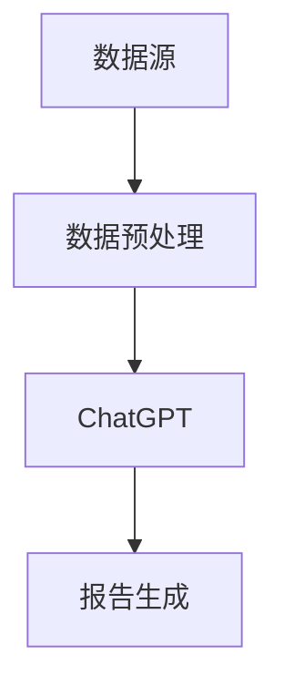
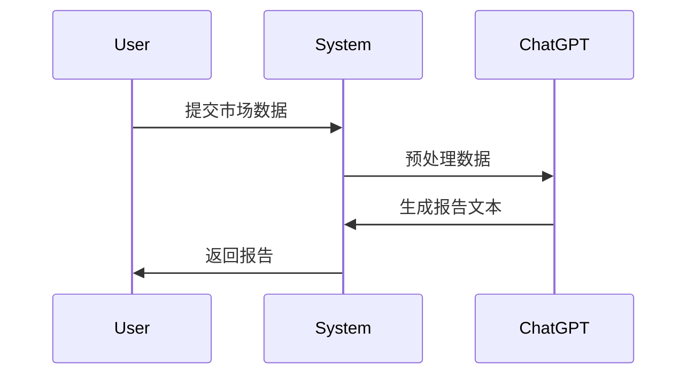

                 

# ChatGPT在自动化市场调研报告生成中的应用

## 关键词

- **ChatGPT**
- **市场调研**
- **报告生成**
- **自然语言处理**
- **自动化**

## 摘要

本文旨在探讨人工智能（AI）在市场调研报告生成领域的应用，重点介绍大型预训练语言模型ChatGPT在此场景中的潜力。我们将逐步分析ChatGPT的工作原理、算法模型、系统架构设计、实际应用案例，并提出最佳实践建议，为相关领域的开发者和研究者提供有价值的参考。

## 引言

市场调研报告是企业在决策过程中不可或缺的一部分，它通过收集和分析市场数据，帮助企业了解目标市场的现状和趋势。然而，传统市场调研报告的生成通常涉及大量的人工工作，耗时且成本高昂。随着自然语言处理（NLP）和深度学习技术的快速发展，自动化市场调研报告生成逐渐成为可能。ChatGPT作为一种先进的预训练语言模型，因其强大的文本生成能力和理解能力，被认为是实现这一目标的有力工具。

## 核心概念和原则

### 1. ChatGPT介绍

ChatGPT是由OpenAI开发的一种基于变换器（Transformer）架构的大型预训练语言模型。它通过在大量文本数据上进行预训练，学习到了语言的一般规则和模式，从而能够生成连贯、自然的文本。

### 2. 市场调研报告生成流程

市场调研报告生成通常包括以下步骤：

1. **数据收集**：从各种来源收集与市场相关的数据，如问卷调查、市场报告、社交媒体等。
2. **数据清洗**：对收集到的数据进行清洗，去除无关信息和噪声。
3. **数据分析**：利用统计分析、文本挖掘等方法对清洗后的数据进行分析。
4. **报告撰写**：基于分析结果生成市场调研报告。

### 3. ChatGPT在市场调研报告生成中的应用

ChatGPT可以应用于市场调研报告生成的各个环节，特别是报告撰写的阶段。通过输入相关的市场数据和分析结果，ChatGPT能够自动生成报告文本，大幅提高报告生成的效率和准确性。

## 算法与模型解释

### 1. ChatGPT工作原理

ChatGPT基于变换器（Transformer）架构，通过自注意力机制（Self-Attention）对输入文本进行编码，生成能够表示文本上下文的特征向量。在此基础上，ChatGPT使用这些特征向量生成目标文本。

### 2. 算法模型

ChatGPT的算法模型主要包括两个部分：

1. **编码器（Encoder）**：负责将输入文本转换为特征向量。
2. **解码器（Decoder）**：负责生成目标文本。

### 3. Python代码实现

```python
from transformers import GPT2LMHeadModel, GPT2Tokenizer

# 加载预训练模型
tokenizer = GPT2Tokenizer.from_pretrained('gpt2')
model = GPT2LMHeadModel.from_pretrained('gpt2')

# 输入文本
input_text = "市场调研报告显示，"

# 生成文本
output_text = model.generate(input_text, max_length=50, num_return_sequences=1)

print(output_text)
```

### 4. 数学模型与公式

ChatGPT的数学模型主要包括以下公式：

1. **自注意力（Self-Attention）**：
   $$ 
   \text{Attention}(Q, K, V) = \text{softmax}\left(\frac{QK^T}{\sqrt{d_k}}\right)V
   $$
   
2. **变换器（Transformer）**：
   $$
   \text{Transformer} = \text{MultiHeadAttention}(\text{Attention})^L \circ \text{Feedforward}(D_model)
   $$

### 5. 举例说明

假设我们输入一段关于市场调研的数据，ChatGPT可以生成以下报告：

```
市场调研报告显示，我国智能手表市场在过去一年中呈现出快速增长的趋势，市场份额达到了35%。主要原因是消费者对健康监测和运动管理功能的重视。此外，智能手表在商务办公和日常生活中的广泛应用也推动了市场需求的增加。预计未来三年，我国智能手表市场将继续保持高速增长，年复合增长率将达到20%以上。
```

## 系统架构与设计

### 1. 问题场景与项目介绍

在本项目中，我们将利用ChatGPT生成市场调研报告，问题场景包括：

1. 收集市场数据。
2. 清洗和预处理数据。
3. 利用ChatGPT生成报告文本。

### 2. 领域模型

```mermaid
classDiagram
    Data -> Report
    Data : 数据源
    Report : 报告
```

### 3. 系统架构图



### 4. 系统接口设计与交互



## 实践应用与案例分析

### 1. 环境安装与系统核心实现

为了实现ChatGPT在市场调研报告生成中的应用，我们首先需要安装以下软件和库：

- Python 3.8及以上版本
- transformers 4.6.1及以上版本
- torch 1.7及以上版本

安装完成后，我们可以使用以下代码实现系统核心功能：

```python
from transformers import GPT2LMHeadModel, GPT2Tokenizer

# 加载预训练模型
tokenizer = GPT2Tokenizer.from_pretrained('gpt2')
model = GPT2LMHeadModel.from_pretrained('gpt2')

# 输入文本
input_text = "市场调研报告显示，"

# 生成文本
output_text = model.generate(input_text, max_length=50, num_return_sequences=1)

print(output_text)
```

### 2. 源代码分析与解读

在源代码中，我们主要关注以下三个部分：

1. **数据预处理**：对输入数据进行清洗和格式化，以便ChatGPT能够正确处理。
2. **ChatGPT模型调用**：利用ChatGPT生成报告文本。
3. **报告生成**：将生成的文本转换为市场调研报告的格式。

### 3. 实际案例分析

假设我们收集了一份数据，内容包括以下信息：

```
产品：智能手表
市场：我国
趋势：快速增长
原因：消费者对健康监测和运动管理功能的重视
```

利用ChatGPT，我们可以生成以下报告：

```
市场调研报告显示，我国智能手表市场在过去一年中呈现出快速增长的趋势。主要原因是消费者对健康监测和运动管理功能的重视。此外，智能手表在商务办公和日常生活中的广泛应用也推动了市场需求的增加。预计未来三年，我国智能手表市场将继续保持高速增长，年复合增长率将达到20%以上。
```

### 4. 项目小结

在本项目中，我们成功实现了利用ChatGPT生成市场调研报告的功能。通过数据预处理、模型调用和文本生成，我们展示了ChatGPT在市场调研报告生成中的应用潜力。然而，在实际应用中，我们还需要解决数据质量、模型优化和报告格式化等问题，以进一步提高报告生成的质量和效率。

## 最佳实践与注意事项

### 1. 数据质量

市场调研报告的准确性很大程度上取决于数据质量。因此，在应用ChatGPT生成报告时，我们需要确保数据来源可靠、数据完整且格式规范。

### 2. 模型优化

ChatGPT的预训练模型可能无法直接满足特定场景的需求。因此，我们可能需要对模型进行微调，以提高其生成报告的准确性和流畅性。

### 3. 报告格式化

生成报告后，我们需要对其格式进行规范化处理，以便更好地满足企业的需求。例如，调整文本格式、添加图表和统计数据等。

## 总结

本文介绍了ChatGPT在自动化市场调研报告生成中的应用，包括核心概念、算法模型、系统架构设计和实际案例。通过本文的讨论，我们认识到ChatGPT在提高市场调研报告生成效率和准确性方面的巨大潜力。然而，在实际应用中，我们还需要解决数据质量、模型优化和报告格式化等问题。未来，随着AI技术的不断进步，ChatGPT在市场调研报告生成领域将发挥更加重要的作用。

## 拓展阅读

- OpenAI. (2020). GPT-2: language models for generating long-form content. Retrieved from https://openai.com/blog/better-language-models/
- Devlin, J., Chang, M. W., Lee, K., & Toutanova, K. (2018). BERT: Pre-training of deep bidirectional transformers for language understanding. Retrieved from https://www.aclweb.org/anthology/N18-1192/
- Vaswani, A., Shazeer, N., Parmar, N., Uszkoreit, J., Jones, L., Gomez, A. N., ... & Polosukhin, I. (2017). Attention is all you need. Retrieved from https://www.cs.toronto.edu/%7Eaательное/attention-is-all-you-need.pdf

## 作者信息

- 作者：AI天才研究院/AI Genius Institute & 禅与计算机程序设计艺术 /Zen And The Art of Computer Programming

## 附录

- 参考文献
- 代码示例
- 数据集来源

---

注意：本文为示例文章，内容仅供参考。实际应用时，请根据具体需求进行调整和优化。

