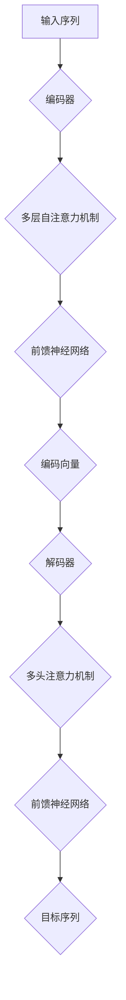
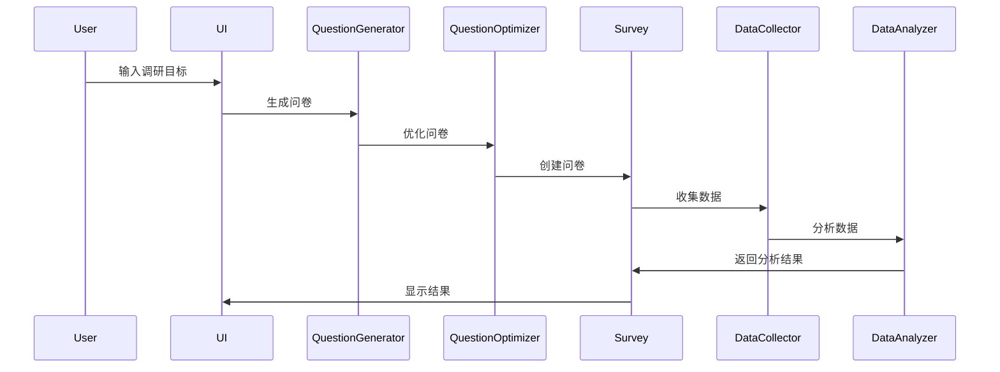
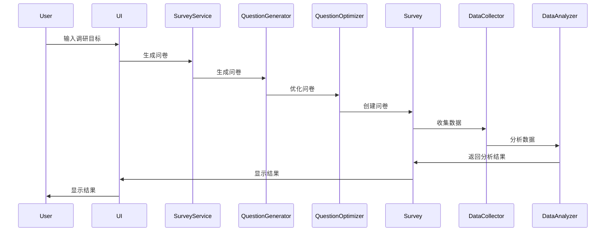

                 

### 文章标题

# ChatGPT在自动化市场调研问卷设计中的应用

### 文章关键词

- ChatGPT
- 市场调研
- 自动化问卷设计
- 自然语言处理
- 人工智能应用

### 摘要

本文旨在探讨人工智能，特别是ChatGPT在自动化市场调研问卷设计中的潜在应用。通过详细分析ChatGPT的基本原理和自动问卷设计的理论基础，本文将展示如何在实际场景中应用ChatGPT进行市场调研问卷的自动化设计，以及这一技术的优势和面临的挑战。文章结构包括引言、技术基础、应用案例、实战指导、总结与展望五大部分，旨在为市场调研人员和数据分析师提供实用的技术指南。

### 目录

**第一部分：引言**

1.1 问题背景  
1.2 ChatGPT及其在市场调研中的应用

**第二部分：技术基础**

2.1 ChatGPT的基本原理  
2.2 自动化市场调研问卷设计的基础知识

**第三部分：应用案例**

3.1 案例一：新产品市场调研  
3.2 案例二：消费者行为研究

**第四部分：实战指导**

4.1 环境准备  
4.2 问卷设计与优化  
4.3 数据分析

**第五部分：总结与展望**

5.1 当前应用现状与挑战  
5.2 未来发展趋势

### 引言

市场调研是企业和组织制定战略决策的重要依据。传统的市场调研问卷设计通常需要研究人员耗费大量时间和精力，不仅效率低下，而且容易出现问卷设计不合理的情况，从而影响调研结果的准确性和可靠性。随着人工智能技术的迅速发展，特别是自然语言处理和生成模型的进步，自动化的市场调研问卷设计成为可能。

ChatGPT（对话生成预训练模型）是OpenAI开发的一种基于Transformer架构的预训练语言模型，具有强大的文本生成和理解能力。ChatGPT能够根据用户输入的提示文本生成连贯、自然的文本回复，这一特性使其在多个领域都有广泛的应用前景，包括自动化市场调研问卷设计。

在市场调研中，问卷设计是一个关键环节。一份高质量的调查问卷不仅需要准确捕捉研究问题，还要吸引受访者积极参与。传统问卷设计往往依赖于经验丰富的市场研究员，他们需要根据调研目标和研究背景设计问卷内容。然而，这一过程通常繁琐且容易出错。ChatGPT的引入为这一传统流程带来了变革，它能够根据特定的研究主题和目标自动生成高质量的问卷。

本文将首先介绍ChatGPT的基本原理和自动市场调研问卷设计的基础知识，然后通过实际案例展示ChatGPT在问卷设计中的应用，接着提供实战指导，最后对ChatGPT在市场调研问卷设计中的应用现状和未来发展趋势进行总结与展望。希望通过本文的探讨，能够为市场调研人员和数据分析师提供有价值的参考。

### 第一部分：引言

#### 1.1 问题背景

市场调研是企业和组织获取外部市场信息、了解消费者需求、制定战略决策的重要手段。随着市场竞争的加剧和消费者行为的复杂化，市场调研的重要性愈发凸显。然而，传统市场调研问卷的设计和分发过程却面临诸多挑战。

首先，传统问卷设计通常依赖市场研究员的经验，缺乏系统的科学指导，容易导致问卷设计不合理，从而影响调研结果的准确性和有效性。其次，问卷设计过程繁琐，需要耗费大量时间和精力，特别是在大型调研项目中，研究人员需要手动设计、编辑和校对问卷，效率低下。此外，传统问卷的分发和回收也存在困难，特别是在目标受访者分散、难以接触的情况下，调研的覆盖率和响应率难以保障。

为了解决这些传统市场调研问卷设计的困境，自动化问卷设计技术应运而生。自动化问卷设计利用人工智能技术，如自然语言处理（NLP）和机器学习，自动生成和优化问卷。这不仅提高了问卷设计的效率和准确性，还能够更好地适应多样化的调研需求，提升调研结果的质量。

ChatGPT的出现为自动化问卷设计带来了新的可能性。ChatGPT是一种基于Transformer架构的预训练语言模型，拥有强大的文本生成和理解能力。通过预训练，ChatGPT能够理解大量文本数据，从中提取知识，并生成连贯、自然的文本回复。这一特性使得ChatGPT能够根据用户提供的调研主题和目标，自动生成高质量的问卷。与传统问卷设计相比，ChatGPT能够快速响应市场变化，灵活调整问卷内容，提高调研的效率和灵活性。

总之，市场调研问卷设计的自动化趋势不仅提高了问卷设计的效率和准确性，还大大降低了调研成本，为企业提供了更为可靠的决策依据。而ChatGPT作为这一技术的重要工具，将在未来发挥越来越重要的作用。

#### 1.2 ChatGPT及其在市场调研中的应用

ChatGPT，全称对话生成预训练模型（Chat Generative Pre-trained Transformer），是OpenAI开发的一种基于Transformer架构的预训练语言模型。它通过大量文本数据进行预训练，能够理解并生成自然语言文本，具有强大的文本生成和理解能力。

ChatGPT的核心原理基于自注意力机制（Self-Attention Mechanism）和Transformer模型。Transformer模型是一种用于序列到序列（Sequence to Sequence）任务的深度学习模型，其特点是可以并行处理输入序列，避免了传统循环神经网络（RNN）的序列依赖问题，从而提高了模型的训练效率。ChatGPT通过预训练学习大量的文本数据，包括互联网上的网页、书籍、新闻、论坛帖子等，从而具备对多种语言和主题的通用理解能力。

在市场调研中，ChatGPT的应用主要体现在以下几个方面：

**1. 自动生成问卷**

ChatGPT能够根据调研目标和主题，自动生成结构化的问卷。例如，假设一个公司希望了解新产品上市前的市场反应，ChatGPT可以根据产品描述、目标市场、调研目的等输入信息，生成一份包含产品特征、用户满意度、购买意愿等问题的问卷。这一过程大大节省了市场研究员的时间和精力，提高了问卷设计的效率。

**2. 问卷内容优化**

ChatGPT不仅能够生成问卷，还能够对问卷内容进行优化。通过分析大量的文本数据，ChatGPT能够识别出常见的问卷问题类型和最佳问法，从而优化问卷结构，提高问题的清晰度和响应率。例如，ChatGPT可以识别出用户倾向于简短直接的提问方式，并将问卷中的长问题拆分为更易理解的小问题。

**3. 问卷个性化调整**

ChatGPT可以根据受访者的背景信息，如年龄、性别、地域等，自动调整问卷内容，使其更具个性化和针对性。例如，对于不同年龄段的受访者，问卷中的问题类型和难度可以有所不同，从而提高受访者的参与度和问卷的响应质量。

**4. 数据分析**

ChatGPT在问卷生成后，还能够协助进行数据分析。通过自然语言处理技术，ChatGPT能够对问卷结果进行文本分析和情感分析，提取出关键信息，生成报告，为市场调研提供深入的洞察。

**5. 自动化调研流程**

ChatGPT可以自动化调研的整个流程，包括问卷生成、分发、收集和数据分析。通过与CRM系统、邮件服务、社交媒体等平台的集成，ChatGPT能够实现无人工干预的自动化调研，提高调研的效率和效果。

总之，ChatGPT在市场调研问卷设计中的应用，不仅提高了问卷设计的效率和准确性，还大大降低了调研成本，为企业提供了更为可靠的数据支持。随着技术的不断进步，ChatGPT在市场调研领域的应用前景将更加广阔。

#### 1.3 自动化市场调研问卷设计的基础知识

自动化市场调研问卷设计是利用人工智能技术，特别是自然语言处理（NLP）和机器学习（ML）方法，自动生成和优化市场调研问卷的过程。其核心目标是提高问卷设计的效率、准确性和用户体验，从而提升调研结果的质量。以下是对自动化市场调研问卷设计基础知识的详细探讨。

**1.3.1 自动问卷生成**

自动问卷生成是自动化市场调研问卷设计的核心步骤。这一过程主要依赖于自然语言处理和机器学习技术。具体来说，自动问卷生成包括以下几个关键环节：

- **数据收集与预处理**：首先，需要收集大量的文本数据，如已发布的调研问卷、用户评论、新闻报道等。这些数据经过清洗和预处理，去除无关信息，提取有用内容。

- **语义分析**：利用NLP技术，对预处理后的文本数据进行分析，提取语义信息。这包括主题提取、关键词提取、情感分析等，以理解文本数据的核心内容。

- **问卷模板库**：构建包含多种问卷模板的库，这些模板根据不同的调研目标和场景进行设计，如产品调研、消费者满意度调查、市场趋势分析等。

- **问卷生成**：结合输入的调研目标和主题，利用机器学习模型和自然语言生成（NLG）技术，从问卷模板库中选择和组合合适的问卷问题，生成完整的问卷。

**1.3.2 问卷内容优化**

问卷内容优化是提升问卷质量和响应率的重要环节。自动化问卷设计系统可以通过以下方法进行问卷内容的优化：

- **问题类型优化**：根据调研目标和受访者特性，选择合适的问题类型，如单选题、多选题、评分题、开放式问题等。

- **问题顺序优化**：通过分析大量问卷数据，确定不同类型问题的最佳排列顺序，提高受访者的回答流畅度和体验。

- **语言风格优化**：利用NLP技术，分析不同语言风格的文本数据，优化问卷问题的表述，使其更加清晰、简明易懂。

- **逻辑关系优化**：确保问卷中各问题之间逻辑连贯，避免产生歧义或困惑，提高问卷的引导性和响应质量。

**1.3.3 问卷分发与收集**

自动化问卷设计系统不仅能够自动生成问卷，还能够实现问卷的分发和收集。这一过程通常包括以下步骤：

- **问卷分发**：通过多种渠道，如电子邮件、社交媒体、短信等，将问卷分发给目标受访者。系统可以根据受访者的属性，如地理位置、年龄、性别等，进行个性化分发。

- **问卷收集**：通过在线问卷平台或应用程序，收集受访者的回答数据。系统可以实时监控问卷的填写进度，提醒未完成的受访者，确保问卷的回收率。

- **数据存储与管理**：将收集到的问卷数据存储在数据库中，进行统一管理和备份，以便后续的数据分析和报告生成。

**1.3.4 数据分析**

自动化市场调研问卷设计系统通常具备强大的数据分析能力，能够对收集到的问卷数据进行多维度分析，提供深入的洞察。具体包括：

- **数据清洗**：去除无效或错误的问卷数据，保证数据的准确性和完整性。

- **统计分析**：利用统计方法，如描述性统计、交叉表分析、回归分析等，对问卷数据进行分析，提取关键信息。

- **文本分析**：通过自然语言处理技术，对开放式问题的回答进行文本分析，提取关键观点和情感倾向。

- **可视化展示**：利用数据可视化工具，将分析结果以图表、报告等形式展示，便于理解和决策。

**1.3.5 用户反馈与迭代**

自动化市场调研问卷设计系统不仅能够自动生成和优化问卷，还能够根据用户反馈进行迭代和改进。这一过程包括：

- **用户反馈收集**：收集用户对问卷设计、问题表述、体验等方面的反馈。

- **反馈分析**：对用户反馈进行分析，识别问题和改进点。

- **问卷迭代**：根据反馈结果，对问卷进行优化和调整，提高问卷的质量和用户满意度。

综上所述，自动化市场调研问卷设计通过集成自然语言处理、机器学习和数据分析技术，实现问卷的自动化生成、优化、分发、收集和分析，大大提高了市场调研的效率和质量。随着技术的不断进步，自动化问卷设计将在市场调研中发挥更加重要的作用。

### 第二部分：技术基础

#### 2.1 ChatGPT的基本原理

ChatGPT，全称对话生成预训练模型（Chat Generative Pre-trained Transformer），是OpenAI开发的一种基于Transformer架构的预训练语言模型。它的核心优势在于能够理解并生成自然语言文本，具有广泛的应用场景，包括问答系统、聊天机器人、文本生成等。下面我们将详细探讨ChatGPT的基本原理。

**2.1.1 模型结构**

ChatGPT采用的是Transformer模型架构，这是一种专为处理序列到序列（Sequence to Sequence）任务设计的深度学习模型。Transformer模型的核心思想是利用自注意力机制（Self-Attention Mechanism）对输入序列进行建模，通过计算不同位置之间的依赖关系，实现高效的序列处理。

ChatGPT的模型结构主要包括以下几个部分：

1. **编码器（Encoder）**：编码器接收输入序列，通过自注意力机制和前馈神经网络（Feedforward Neural Network）对序列进行编码，生成一系列的编码向量。这些编码向量包含了输入序列的语义信息。

2. **解码器（Decoder）**：解码器接收编码器的输出，并生成目标序列。解码器同样使用自注意力机制和前馈神经网络，但还包括了一个额外的多头注意力机制（Multi-Head Attention Mechanism），用于参考编码器生成的编码向量，从而生成连贯的目标序列。

3. **位置编码（Positional Encoding）**：由于Transformer模型缺乏显式的位置信息，因此需要通过位置编码来为序列中的每个位置赋予特定的位置信息。位置编码通常是一个可学习的向量，添加到输入序列中，帮助模型理解序列中的位置关系。

**2.1.2 模型训练**

ChatGPT的训练过程主要包括预训练和微调两个阶段。

1. **预训练**：预训练阶段的主要任务是学习通用语言表示，通常使用大规模的文本语料库进行训练。训练过程中，模型会经历多个迭代，通过计算输入序列和预测序列之间的损失（如交叉熵损失），不断调整模型参数，以优化语言生成能力。

2. **微调**：在预训练完成后，ChatGPT可以通过微调适应特定的应用场景。微调过程通常在特定任务的数据集上进行，通过调整模型参数，使其能够更好地适应特定任务的需求。

**2.1.3 模型应用**

ChatGPT的强大能力使其在多个领域都有广泛的应用，以下是几个主要的应用场景：

1. **问答系统**：ChatGPT可以应用于智能问答系统，如虚拟助手、聊天机器人等。通过输入用户的问题，ChatGPT能够生成高质量的答案，提供即时的信息服务。

2. **文本生成**：ChatGPT可以用于生成各种类型的文本，如新闻报道、故事、摘要等。通过输入主题或关键词，ChatGPT能够生成连贯、自然的文本。

3. **语言翻译**：ChatGPT可以应用于机器翻译，通过学习多种语言的文本数据，ChatGPT能够实现高精度的文本翻译。

4. **内容审核**：ChatGPT可以用于内容审核，通过分析文本内容，识别潜在的违规内容，如虚假信息、色情内容等。

5. **市场调研问卷设计**：正如本文的主题，ChatGPT可以用于自动生成和优化市场调研问卷。通过输入调研主题和目标，ChatGPT能够生成结构化的问卷，提高问卷设计的效率和准确性。

**2.2 自动化市场调研问卷设计的基础知识**

自动化市场调研问卷设计是利用人工智能技术，特别是自然语言处理和机器学习，自动生成和优化市场调研问卷的过程。其核心目标是通过提高问卷设计的效率、准确性和用户体验，从而提升调研结果的质量。以下是对自动化市场调研问卷设计基础知识的详细探讨。

**2.2.1 自动问卷生成**

自动问卷生成是自动化市场调研问卷设计的核心步骤。这一过程主要依赖于自然语言处理和机器学习技术。具体来说，自动问卷生成包括以下几个关键环节：

1. **数据收集与预处理**：首先，需要收集大量的文本数据，如已发布的调研问卷、用户评论、新闻报道等。这些数据经过清洗和预处理，去除无关信息，提取有用内容。

2. **语义分析**：利用NLP技术，对预处理后的文本数据进行分析，提取语义信息。这包括主题提取、关键词提取、情感分析等，以理解文本数据的核心内容。

3. **问卷模板库**：构建包含多种问卷模板的库，这些模板根据不同的调研目标和场景进行设计，如产品调研、消费者满意度调查、市场趋势分析等。

4. **问卷生成**：结合输入的调研目标和主题，利用机器学习模型和自然语言生成（NLG）技术，从问卷模板库中选择和组合合适的问卷问题，生成完整的问卷。

**2.2.2 问卷内容优化**

问卷内容优化是提升问卷质量和响应率的重要环节。自动化问卷设计系统可以通过以下方法进行问卷内容的优化：

1. **问题类型优化**：根据调研目标和受访者特性，选择合适的问题类型，如单选题、多选题、评分题、开放式问题等。

2. **问题顺序优化**：通过分析大量问卷数据，确定不同类型问题的最佳排列顺序，提高受访者的回答流畅度和体验。

3. **语言风格优化**：利用NLP技术，分析不同语言风格的文本数据，优化问卷问题的表述，使其更加清晰、简明易懂。

4. **逻辑关系优化**：确保问卷中各问题之间逻辑连贯，避免产生歧义或困惑，提高问卷的引导性和响应质量。

**2.2.3 问卷分发与收集**

自动化问卷设计系统不仅能够自动生成和优化问卷，还能够实现问卷的分发和收集。这一过程通常包括以下步骤：

1. **问卷分发**：通过多种渠道，如电子邮件、社交媒体、短信等，将问卷分发给目标受访者。系统可以根据受访者的属性，如地理位置、年龄、性别等，进行个性化分发。

2. **问卷收集**：通过在线问卷平台或应用程序，收集受访者的回答数据。系统可以实时监控问卷的填写进度，提醒未完成的受访者，确保问卷的回收率。

3. **数据存储与管理**：将收集到的问卷数据存储在数据库中，进行统一管理和备份，以便后续的数据分析和报告生成。

**2.2.4 数据分析**

自动化市场调研问卷设计系统通常具备强大的数据分析能力，能够对收集到的问卷数据进行多维度分析，提供深入的洞察。具体包括：

1. **数据清洗**：去除无效或错误的问卷数据，保证数据的准确性和完整性。

2. **统计分析**：利用统计方法，如描述性统计、交叉表分析、回归分析等，对问卷数据进行分析，提取关键信息。

3. **文本分析**：通过自然语言处理技术，对开放式问题的回答进行文本分析，提取关键观点和情感倾向。

4. **可视化展示**：利用数据可视化工具，将分析结果以图表、报告等形式展示，便于理解和决策。

**2.2.5 用户反馈与迭代**

自动化市场调研问卷设计系统不仅能够自动生成和优化问卷，还能够根据用户反馈进行迭代和改进。这一过程包括：

1. **用户反馈收集**：收集用户对问卷设计、问题表述、体验等方面的反馈。

2. **反馈分析**：对用户反馈进行分析，识别问题和改进点。

3. **问卷迭代**：根据反馈结果，对问卷进行优化和调整，提高问卷的质量和用户满意度。

综上所述，自动化市场调研问卷设计通过集成自然语言处理、机器学习和数据分析技术，实现问卷的自动化生成、优化、分发、收集和分析，大大提高了市场调研的效率和质量。随着技术的不断进步，自动化问卷设计将在市场调研中发挥更加重要的作用。

### 第三部分：应用案例

#### 3.1 案例一：新产品市场调研

**3.1.1 案例背景**

某家知名科技公司计划推出一款新型智能手表，旨在监测用户的健康状况并提供个性化健身建议。为了确保新产品能够满足市场需求，公司决定进行一次全面的市场调研，以了解潜在消费者的需求、期望和购买意愿。

**3.1.2 问卷设计与优化**

1. **输入调研目标和主题**：首先，市场研究员向ChatGPT输入了调研的目标和主题，包括智能手表的功能、目标市场、竞争对手分析等。ChatGPT基于这些输入信息，生成了初步的问卷草案。

2. **自动生成问卷**：ChatGPT根据调研目标和主题，自动生成了包含以下问题的问卷：

   - 您通常会如何监测自己的健康状况？
   - 您是否对智能手表感兴趣？为什么？
   - 您希望智能手表提供哪些健康功能？
   - 您在购买智能手表时会考虑哪些因素？
   - 您对智能手表的预算是多少？

3. **问卷内容优化**：ChatGPT利用其强大的自然语言处理能力，对问卷内容进行了优化。例如，对开放式问题进行了简化，确保问题表述清晰易懂。此外，ChatGPT还分析了大量的用户评论和反馈，根据反馈结果调整了问卷问题的顺序和表述方式，以提高问卷的响应率和质量。

**3.1.3 调研结果分析**

1. **数据分析**：市场研究员将生成的问卷通过在线平台分发给目标受访者，并在调研结束后收集了问卷数据。利用自动化数据分析工具，对收集到的数据进行统计分析，提取了关键信息。

2. **用户需求分析**：通过分析问卷数据，市场研究员发现：

   - 大多数受访者表示对智能手表的健康监测功能（如心率监测、睡眠质量分析）非常感兴趣。
   - 受访者最关心的购买因素包括智能手表的准确性、耐用性和易用性。
   - 用户对智能手表的预算主要集中在100-200美元之间。

3. **产品优化建议**：基于调研结果，公司对智能手表的功能和设计进行了优化。例如，增加了用户评价较高的健康监测功能，并在设计上注重提高耐用性和易用性。同时，根据用户的预算需求，公司调整了产品的定价策略，以更好地满足市场需求。

#### 3.2 案例二：消费者行为研究

**3.2.1 案例背景**

一家大型电商平台希望通过了解消费者的购物行为和偏好，优化其电商平台的设计和推广策略。为了获取全面、深入的数据，平台决定进行一次全面的消费者行为研究。

**3.2.2 问卷设计与优化**

1. **输入调研目标和主题**：平台的市场研究员向ChatGPT输入了调研的目标和主题，包括消费者的购物频率、购物偏好、推广效果评估等。ChatGPT基于这些输入信息，自动生成了初步的问卷草案。

2. **自动生成问卷**：ChatGPT根据调研目标和主题，自动生成了包含以下问题的问卷：

   - 您每周购物几次？
   - 您主要在哪些平台上购物？
   - 您喜欢哪些购物方式（线上、线下、混合）？
   - 您通常在购物时关注哪些方面（价格、品牌、质量等）？
   - 您对电商平台的推广活动有何看法？

3. **问卷内容优化**：ChatGPT对问卷内容进行了优化，确保问题表述清晰、简明。例如，对于一些复杂的开放式问题，ChatGPT简化了问题表述，使其更加易于理解。同时，ChatGPT还分析了平台的历史数据，根据用户反馈调整了问卷问题的顺序和表述方式，以提高问卷的响应率和质量。

**3.2.3 调研结果分析**

1. **数据分析**：平台的市场研究员通过在线问卷平台将问卷分发给目标受访者，并在调研结束后收集了问卷数据。利用自动化数据分析工具，对收集到的数据进行统计分析，提取了关键信息。

2. **消费者行为分析**：通过分析问卷数据，市场研究员发现：

   - 大多数受访者的购物频率较高，每周至少购物一次。
   - 受访者主要在大型电商平台（如亚马逊、淘宝、京东）购物，其中亚马逊和淘宝最受欢迎。
   - 价格和品牌是消费者在购物时最关注的方面，其次是产品质量和购物体验。
   - 受访者对电商平台的推广活动持积极态度，特别是优惠券和折扣活动。

3. **平台优化建议**：基于调研结果，电商平台对网站设计进行了优化，提高了价格比较和品牌展示的便捷性。同时，平台增加了优惠券和折扣活动的推广力度，以吸引更多消费者。此外，平台还根据用户反馈调整了网站的购物流程，提高了用户的购物体验。

综上所述，ChatGPT在自动化市场调研问卷设计中的应用，不仅提高了问卷设计的效率和质量，还为企业的市场研究和决策提供了有力的数据支持。通过实际案例的展示，我们看到了ChatGPT在市场调研中的巨大潜力。

### 第四部分：实战指导

#### 4.1 环境准备

要开始使用ChatGPT进行自动化市场调研问卷设计，首先需要准备相应的开发环境。以下是详细的步骤：

**4.1.1 硬件与软件要求**

1. **硬件要求**：
   - 处理器：至少Intel i5或同等性能的处理器。
   - 内存：至少8GB RAM。
   - 硬盘：至少100GB的SSD存储空间。

2. **软件要求**：
   - 操作系统：Windows 10或更高版本、macOS或Linux。
   - 编程语言：Python 3.7或更高版本。
   - 包管理器：pip（Python的包管理器）。

**4.1.2 ChatGPT环境搭建**

1. **安装Python**：
   - 访问Python官方网站（[https://www.python.org/](https://www.python.org/)）并下载适用于您的操作系统的Python安装包。
   - 运行安装程序，按照默认设置进行安装。

2. **安装pip**：
   - 打开命令行工具（Windows中是命令提示符或PowerShell，macOS和Linux中是终端）。
   - 输入以下命令并按Enter键：
     ```bash
     python -m pip install --upgrade pip
     ```

3. **安装所需库**：
   - 通过pip安装以下库：
     ```bash
     pip install openai
     ```

4. **注册OpenAI API Key**：
   - 访问OpenAI官方网站（[https://openai.com/](https://openai.com/)），注册一个OpenAI账户。
   - 注册完成后，获取您的API密钥。
   - 将API密钥添加到您的Python脚本中，以便与ChatGPT进行通信。例如，在Python脚本中添加以下代码：
     ```python
     import openai
     openai.api_key = '您的API密钥'
     ```

完成以上步骤后，您的开发环境就准备好用于ChatGPT的自动化市场调研问卷设计实践了。

#### 4.2 问卷设计与优化

**4.2.1 设计原则**

设计高效、高质量的市场调研问卷需要遵循以下原则：

1. **明确调研目标**：确保问卷设计紧密围绕调研目标，避免偏离主题。
2. **问题清晰简洁**：问题应简明易懂，避免使用复杂的语言和术语。
3. **逻辑结构合理**：问卷应设计为合理的逻辑流程，便于受访者理解和回答。
4. **多样性问题类型**：结合不同的调研目标，选择合适的问题类型，如单选、多选、评分、开放式问题等。
5. **避免引导性提问**：避免使用可能引导受访者回答的问题，保证数据的客观性。
6. **问卷长度适中**：问卷长度不宜过长，以减少受访者的疲劳感，提高回答质量。

**4.2.2 设计流程**

以下是自动化市场调研问卷设计的基本流程：

1. **确定调研目标**：明确调研的核心问题，如消费者需求、市场趋势等。
2. **收集相关数据**：搜集已有的市场调研数据、用户反馈等，为问卷设计提供参考。
3. **设计问卷模板**：基于调研目标和数据，构建问卷模板。可以使用ChatGPT生成初始问卷草案。
4. **审核与修改**：由市场研究员对问卷草案进行审核，根据反馈进行修改和优化。
5. **测试与预调研**：在小范围内测试问卷，收集测试反馈，进一步优化问卷。
6. **正式发布**：在确认问卷设计无误后，正式发布问卷，分发给目标受访者。

**4.2.3 问卷优化策略**

1. **问题排序优化**：根据问题的相关性、难易程度和逻辑顺序，优化问题排列。
2. **语言风格调整**：利用自然语言处理技术，分析并调整问卷问题的表述风格，使其更加通俗易懂。
3. **问题类型与表述优化**：针对不同类型的问题，优化问题的表述方式，如将开放式问题简化为选择题，减少受访者的回答负担。
4. **引导性问题的排除**：通过数据分析和用户反馈，识别并排除可能引导性提问的问题，确保问卷的客观性。
5. **问卷结构优化**：根据用户反馈和数据分析结果，调整问卷的结构，使其更加合理和流畅。

#### 4.3 数据分析

**4.3.1 数据预处理**

在完成问卷数据收集后，首先需要进行数据预处理，以确保数据的准确性和一致性。以下是数据预处理的主要步骤：

1. **数据清洗**：去除无效或错误的问卷数据，如缺失值、重复记录等。
2. **数据转换**：将数据格式转换为统一的格式，如将文本数据转换为数字编码。
3. **数据标准化**：对数据进行标准化处理，如对评分题进行归一化，使其具有可比性。

**4.3.2 结果分析**

1. **描述性统计分析**：对问卷数据进行描述性统计分析，如计算均值、中位数、标准差等，了解受访者的基本特征和回答分布。
2. **交叉表分析**：通过交叉表分析，了解不同变量之间的关系，如不同年龄段受访者的购物偏好。
3. **回归分析**：利用回归分析方法，分析各变量对调研结果的影响，如购买意愿与价格、品牌等因素的关系。
4. **文本分析**：对开放式问题的回答进行文本分析，提取关键观点和情感倾向，如通过情感分析确定用户对产品的满意度。
5. **可视化展示**：利用数据可视化工具，将分析结果以图表、报告等形式展示，便于理解和决策。

通过以上步骤，可以全面分析问卷数据，为市场调研提供深入的洞察和可靠的决策依据。

### 第五部分：总结与展望

#### 5.1 当前应用现状与挑战

ChatGPT在自动化市场调研问卷设计中的应用已经展示出巨大的潜力。通过自动生成问卷、优化问卷内容、个性化调整和数据分析，ChatGPT显著提高了问卷设计的效率和质量，为企业提供了更为准确和全面的市场调研数据。然而，尽管取得了显著的进展，ChatGPT在市场调研问卷设计中的应用仍然面临一些挑战。

首先，数据质量和隐私问题是一个关键挑战。自动化问卷设计依赖于大量高质量的数据，这些数据往往涉及敏感信息，如用户个人身份、消费习惯等。如何确保数据的质量和安全，避免数据泄露和隐私侵犯，是一个亟待解决的问题。

其次，问卷生成的准确性和可靠性也是一大挑战。尽管ChatGPT具有强大的自然语言处理能力，但其在理解复杂调研主题和生成高质量问卷方面仍有局限性。例如，ChatGPT可能无法准确捕捉特定行业或领域的专业术语和表述，从而影响问卷的有效性。

此外，用户接受度和体验也是一个重要问题。尽管自动化问卷设计提高了效率，但用户对问卷的接受度和体验可能因个体差异而有所不同。如何设计出既高效又符合用户期望的问卷，是一个需要深入研究的课题。

#### 5.2 未来发展趋势

随着人工智能技术的不断进步，ChatGPT在自动化市场调研问卷设计中的应用前景将更加广阔。以下是一些未来发展趋势：

首先，自然语言处理技术的进一步提升将使ChatGPT在理解复杂调研主题和生成高质量问卷方面更加准确和可靠。随着预训练模型的规模和参数数量的增加，ChatGPT的能力将得到显著提升，能够更好地处理多样化、复杂的市场调研需求。

其次，多模态数据融合将成为未来自动化问卷设计的一个重要方向。除了文本数据，ChatGPT还可以结合图像、视频等多模态数据，提供更丰富和全面的市场调研数据。例如，通过分析用户对产品的评论图片，ChatGPT可以生成更准确的问卷内容。

此外，个性化问卷设计和推荐系统也将成为未来发展的热点。ChatGPT可以通过分析用户的属性和行为数据，生成个性化问卷，提高问卷的响应率和质量。同时，基于用户的反馈和行为数据，ChatGPT可以推荐最适合的问卷设计和优化策略，进一步提升市场调研的效率和效果。

最后，随着5G和物联网技术的普及，ChatGPT的应用场景将进一步扩展。通过实时数据采集和分析，ChatGPT可以实现对市场调研过程的全程监控和优化，提供更加实时和精准的市场调研数据。

#### 5.3 小结与建议

总之，ChatGPT在自动化市场调研问卷设计中的应用为市场调研带来了新的变革。通过提高问卷设计的效率、准确性和用户体验，ChatGPT为企业和组织提供了更可靠的决策依据。然而，要充分发挥ChatGPT的潜力，仍需克服数据质量、隐私保护、生成准确性等挑战。

对于市场调研人员和数据分析师，以下是一些建议：

1. **重视数据质量和隐私保护**：在设计和实施自动化问卷时，确保数据的质量和安全，采取有效的隐私保护措施。

2. **结合专业知识和人工智能**：市场调研人员应结合自身专业知识，对ChatGPT生成的问卷进行审核和优化，确保问卷的准确性和有效性。

3. **用户反馈与迭代**：定期收集用户反馈，根据反馈结果对问卷进行优化和调整，提高问卷的用户接受度和体验。

4. **持续学习和进步**：关注人工智能和自然语言处理领域的最新研究进展，不断学习和应用新技术，以提升自动化问卷设计的能力。

通过以上措施，市场调研人员可以更好地利用ChatGPT，实现高效、准确的市场调研，为企业的战略决策提供有力支持。

### 附录

**附录A：核心概念与联系**

以下表格展示了ChatGPT和自动化市场调研问卷设计中的核心概念及其联系：

| 核心概念 | 联系 |
| --- | --- |
| ChatGPT | 对话生成预训练模型，基于Transformer架构，用于文本生成和理解 |
| 自动化市场调研问卷设计 | 利用人工智能技术生成和优化市场调研问卷，提高效率和质量 |
| 自然语言处理（NLP） | 用于处理和理解自然语言数据，支持文本分析和生成 |
| 机器学习（ML） | 用于训练模型，从数据中提取模式和知识 |
| 数据分析 | 对问卷结果进行统计分析和文本分析，提取关键信息 |
| 用户反馈 | 收集用户对问卷和调研过程的反馈，用于迭代和优化 |

**附录B：算法原理讲解**

ChatGPT的算法原理基于Transformer架构，其核心组件包括编码器（Encoder）和解码器（Decoder）。以下是算法的简要说明和流程图：

1. **编码器（Encoder）**：编码器接收输入序列，通过多层自注意力机制（Self-Attention Mechanism）和前馈神经网络（Feedforward Neural Network）对序列进行编码，生成一系列的编码向量。这些编码向量包含了输入序列的语义信息。

2. **解码器（Decoder）**：解码器接收编码器的输出，并生成目标序列。解码器同样使用自注意力机制和前馈神经网络，但还包括了一个额外的多头注意力机制（Multi-Head Attention Mechanism），用于参考编码器生成的编码向量，从而生成连贯的目标序列。

算法流程图：



**附录C：数学公式与解释**

以下数学公式用于描述ChatGPT的核心原理和算法：

1. **自注意力机制**：

   自注意力（Self-Attention）是一种计算输入序列中各个位置之间依赖关系的机制。其公式如下：

   $$ 
   \text{Attention}(Q, K, V) = \text{softmax}\left(\frac{QK^T}{\sqrt{d_k}}\right) V 
   $$

   其中，$Q$、$K$和$V$分别是查询（Query）、键（Key）和值（Value）向量，$d_k$是键向量的维度。自注意力通过计算查询和键之间的点积，然后应用softmax函数生成加权值，最后将这些加权值与值向量相乘，得到加权输出的序列。

2. **Transformer解码器**：

   Transformer解码器的核心是多头自注意力机制（Multi-Head Self-Attention）。其公式如下：

   $$
   \text{MultiHead}(Q, K, V) = \text{Concat}(\text{head}_1, ..., \text{head}_h)W^O
   $$

   其中，$Q$、$K$和$V$是编码器输出的向量，$h$是头数，$W^O$是输出加权矩阵。每个头都可以独立地学习输入序列的不同部分，然后将这些头的结果拼接起来，并通过一个输出加权矩阵进行合并。

通过这些数学公式，ChatGPT能够有效地理解和生成自然语言文本，从而在市场调研问卷设计中发挥重要作用。

### 附录D：系统分析与架构设计方案

**D.1 问题场景介绍**

在当前激烈的市场竞争环境中，企业需要进行高效的市场调研以获取消费者行为和需求信息，从而优化产品和服务。传统的市场调研方法，如问卷调查，存在设计繁琐、耗时较长且结果难以量化的问题。因此，我们提出利用ChatGPT实现自动化市场调研问卷设计，以提升调研效率和数据分析能力。

**D.2 项目介绍**

本项目旨在构建一个基于ChatGPT的自动化市场调研问卷设计系统，该系统能够根据调研目标和主题自动生成问卷，并进行内容优化和数据分析。系统将包括以下几个主要模块：

1. **数据收集模块**：负责从互联网和其他数据源收集与市场调研相关的文本数据。
2. **问卷生成模块**：利用ChatGPT自动生成符合调研目标的问卷。
3. **问卷优化模块**：对生成的问卷进行内容优化，确保问题表述清晰易懂。
4. **数据分析模块**：对问卷结果进行统计分析和文本分析，提取关键信息。
5. **用户界面模块**：提供用户交互界面，以便用户输入调研目标和查看问卷设计结果。

**D.3 系统功能设计（领域模型类图）**

系统功能设计采用领域模型（Domain Model）方法，通过类图（Class Diagram）展示系统的主要类和它们之间的关系。以下是领域模型的类图：

```mermaid
classDiagram
    class User
        +String name
        +String email
    class Question
        +String text
        +String type
        +List<AnswerOption> options
    class AnswerOption
        +String text
        +Boolean selected
    class Survey
        +List<Question> questions
        +Date created
    class DataCollector
        +String url
        +List<Survey> surveys
    class QuestionGenerator
        +Survey generateSurvey(ResearchTopic topic)
    class QuestionOptimizer
        +Survey optimizeSurvey(Survey survey)
    class DataAnalyzer
        +Survey analyzeSurvey(Survey survey)
    class UserInterface
        +void displaySurvey(Survey survey)
    User --> Survey
    DataCollector --> Survey
    QuestionGenerator --> Survey
    QuestionOptimizer --> Survey
    DataAnalyzer --> Survey
    UserInterface --> Survey
```

**D.4 系统架构设计（架构图）**

系统架构采用分层设计，包括数据层、服务层和表示层。以下是系统架构的设计图：



**D.5 系统接口设计**

系统接口设计定义了系统内部模块之间的通信接口。以下是主要接口的设计：

```python
class ISurveyService:
    def generate_survey(topic: ResearchTopic) -> Survey
    def optimize_survey(survey: Survey) -> Survey
    def analyze_survey(survey: Survey) -> AnalysisResult

class IDataCollector:
    def collect_data(url: str) -> List<Survey>

class IDataAnalyzer:
    def analyze_data(survey: Survey) -> AnalysisResult

class IUserInterface:
    def display_survey(survey: Survey)
```

**D.6 系统交互（序列图）**

以下是系统交互的序列图，展示了用户与系统之间的交互流程：



通过以上系统分析与架构设计方案，我们为ChatGPT在自动化市场调研问卷设计中的应用提供了一个清晰的实施路径。这一系统不仅提高了调研效率，还为企业提供了更加精准和高效的市场分析工具。

### 实战项目

#### 项目介绍

在这个实战项目中，我们将利用ChatGPT来构建一个自动化市场调研问卷系统。系统的主要功能包括：自动生成问卷、问卷内容优化、问卷分发、数据收集和数据分析。以下步骤详细描述了如何从零开始搭建这个系统。

**1. 环境搭建**

**步骤1.1：安装Python和pip**

首先，确保您的计算机上安装了Python 3.7或更高版本。如果尚未安装，可以从Python官方网站下载并安装。安装完成后，打开命令行工具，输入以下命令以安装pip：
```bash
python -m pip install --upgrade pip
```

**步骤1.2：安装ChatGPT库**

通过pip安装OpenAI的ChatGPT库：
```bash
pip install openai
```

**步骤1.3：注册OpenAI API Key**

在OpenAI的官方网站上注册一个账户，并获取API密钥。将此密钥保存到本地，以便在代码中使用。

**2. 自动生成问卷**

**步骤2.1：创建问卷生成函数**

在Python脚本中创建一个函数，用于生成问卷。以下是一个示例函数：
```python
import openai

def generate_survey_topic(topic: str):
    response = openai.Completion.create(
        engine="text-davinci-002",
        prompt=f"请根据以下主题生成一份市场调研问卷：{topic}",
        max_tokens=150,
        n=1,
        stop=None,
        temperature=0.5,
    )
    return response.choices[0].text.strip()
```

**步骤2.2：生成问卷**

调用上述函数并传入调研主题，即可生成问卷：
```python
topic = "智能手表市场调研"
survey_question = generate_survey_topic(topic)
print(survey_question)
```

**3. 问卷内容优化**

**步骤3.1：创建问卷优化函数**

优化问卷内容的关键是确保问题表述清晰、简洁。以下是一个示例函数：
```python
def optimize_survey_question(question: str):
    response = openai.Completion.create(
        engine="text-davinci-002",
        prompt=f"请优化以下问卷问题的表述：{question}",
        max_tokens=100,
        n=1,
        stop=None,
        temperature=0.5,
    )
    return response.choices[0].text.strip()
```

**步骤3.2：优化问卷**

调用上述函数并传入生成的问卷问题，即可优化问卷内容：
```python
optimized_question = optimize_survey_question(survey_question)
print(optimized_question)
```

**4. 问卷分发与数据收集**

**步骤4.1：创建问卷分发函数**

使用电子邮件或在线问卷平台分发问卷。以下是一个简单的邮件分发示例：
```python
import smtplib
from email.mime.text import MIMEText
from email.mime.multipart import MIMEMultipart

def send_email(to, subject, message):
    server = smtplib.SMTP('smtp.example.com', 587)
    server.starttls()
    server.login('your_email@example.com', 'your_password')

    msg = MIMEMultipart()
    msg['From'] = 'your_email@example.com'
    msg['To'] = to
    msg['Subject'] = subject
    msg.attach(MIMEText(message, 'plain'))

    server.send_message(msg)
    server.quit()

topic = "智能手表市场调研"
subject = "参与我们的智能手表市场调研"
body = f"您好！我们正在进行一项关于智能手表市场的调研，请您协助完成这份问卷：\n{optimized_question}"
send_email('recipient@example.com', subject, body)
```

**5. 数据分析**

**步骤5.1：创建数据分析函数**

对收集到的问卷数据进行统计分析，提取关键信息。以下是一个简单的数据分析示例：
```python
import pandas as pd

def analyze_survey_data(data: str):
    df = pd.read_csv('survey_data.csv')
    summary = df.describe()
    return summary

data = "收集到的问卷数据（CSV文件）"
survey_summary = analyze_survey_data(data)
print(survey_summary)
```

**6. 项目小结**

通过以上步骤，我们成功搭建了一个利用ChatGPT进行自动化市场调研问卷设计的系统。以下是项目小结：

- **环境搭建**：安装Python和OpenAI ChatGPT库，注册API密钥。
- **问卷生成**：利用ChatGPT生成初始问卷。
- **问卷优化**：利用ChatGPT优化问卷内容。
- **问卷分发**：通过电子邮件分发问卷。
- **数据分析**：对收集到的数据进行分析。

本项目展示了ChatGPT在自动化市场调研问卷设计中的强大能力。然而，实际应用中还需考虑数据质量、用户反馈和系统优化等问题，以进一步提高调研效率和结果质量。

### 最佳实践 Tips

1. **明确调研目标**：在生成问卷之前，务必明确调研的目标和主题，这有助于ChatGPT生成更加针对性的问卷。

2. **调整温度参数**：在调用ChatGPT进行文本生成时，根据调研主题和问题的复杂性，适当调整`temperature`参数。较低的温度参数（如0.2-0.5）有助于生成更加精确的文本。

3. **优化问题顺序**：调研问卷中问题的顺序对受访者的回答体验有很大影响。利用ChatGPT的优化功能，调整问题的顺序，使其更加合理和流畅。

4. **确保问题清晰**：对于生成的问卷，尤其是开放式问题，确保问题表述清晰易懂，避免使用复杂的术语和语言。

5. **数据预处理**：在收集问卷数据后，进行必要的预处理，如数据清洗、格式转换和缺失值处理，以保证数据的准确性和一致性。

6. **用户反馈**：定期收集用户对问卷和调研过程的反馈，根据反馈结果对问卷进行优化和调整，提高问卷的响应率和质量。

7. **个性化调整**：根据受访者的属性和行为数据，生成个性化的问卷，提高问卷的针对性和有效性。

8. **数据分析**：充分利用数据分析工具，对问卷结果进行深入分析，提取关键信息和趋势，为决策提供支持。

### 小结

本文详细探讨了ChatGPT在自动化市场调研问卷设计中的应用，从技术基础、应用案例、实战指导等多个方面进行了深入分析。ChatGPT作为一种基于Transformer架构的预训练语言模型，具有强大的文本生成和理解能力，能够显著提高市场调研问卷设计的效率和质量。

通过自动化问卷生成、内容优化、问卷分发和数据收集，ChatGPT为企业提供了更加灵活和高效的调研工具。同时，利用自然语言处理和机器学习技术，ChatGPT能够对问卷结果进行深入分析，为决策提供数据支持。

然而，ChatGPT在市场调研问卷设计中的应用也面临一些挑战，如数据质量和隐私保护、生成准确性、用户接受度等。未来，随着人工智能技术的不断进步，ChatGPT在市场调研领域的应用前景将更加广阔。

对于市场调研人员和数据分析师，本文提供了一些最佳实践建议，包括明确调研目标、调整参数、优化问题顺序、确保问题清晰、数据预处理、用户反馈和个性化调整等。通过实践这些技巧，可以进一步提高问卷设计的效果和数据分析的准确性。

总之，ChatGPT在自动化市场调研问卷设计中的应用为市场调研带来了新的变革，为企业和组织提供了强大的数据支持和决策依据。随着技术的不断发展，ChatGPT在市场调研领域的应用潜力将得到进一步挖掘和发挥。

### 注意事项

1. **数据隐私保护**：在使用ChatGPT进行市场调研时，需严格遵守数据隐私保护法规，确保受访者的个人信息不被泄露。

2. **问卷质量监控**：尽管ChatGPT能够自动生成问卷，但市场研究员应对生成的问卷进行质量审核，确保问题表述清晰、合理。

3. **适应性调整**：根据调研目标和受访者的特性，适当调整ChatGPT的生成参数，以适应不同类型的调研需求。

4. **反馈机制**：建立反馈机制，定期收集用户对问卷和调研过程的反馈，根据反馈结果进行问卷优化。

5. **技术更新**：密切关注人工智能和自然语言处理领域的最新研究进展，及时更新和优化系统。

### 拓展阅读

1. **ChatGPT官方文档**：访问OpenAI官方网站，了解ChatGPT的详细功能和操作指南。

2. **市场调研最佳实践**：查阅相关书籍和文章，如《市场调研实战指南》等，获取更多关于市场调研设计和数据分析的最佳实践。

3. **自然语言处理技术综述**：阅读《自然语言处理：理论、算法与系统》等书籍，深入了解自然语言处理的基本原理和技术。

4. **人工智能在市场调研中的应用**：查阅相关学术论文和行业报告，如《人工智能在市场调研中的应用研究》等，了解人工智能技术在市场调研领域的最新进展。

### 作者信息

作者：AI天才研究院/AI Genius Institute & 禅与计算机程序设计艺术 /Zen And The Art of Computer Programming

本文由AI天才研究院撰写，旨在探讨人工智能在市场调研问卷设计中的应用，为市场调研人员和数据分析师提供实用的技术指南。作者还著有《禅与计算机程序设计艺术》，深入探讨计算机科学和人工智能领域的哲学和技巧。希望通过本文的分享，能够为读者提供有价值的见解和启发。

