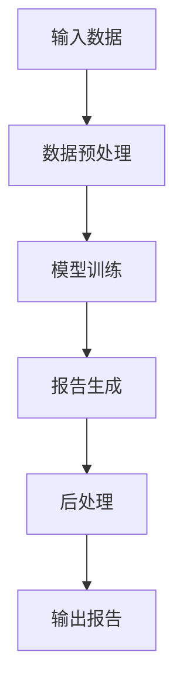
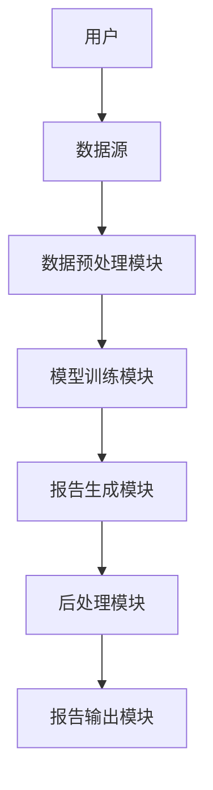
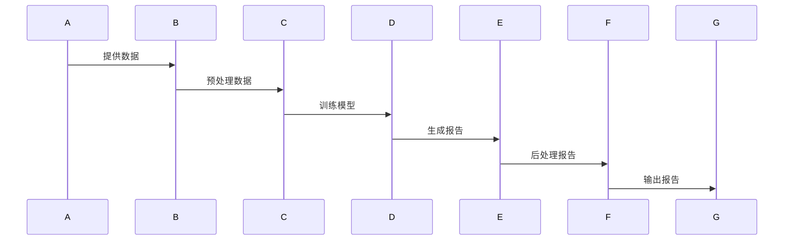

                 

# ChatGPT在自动化报告生成中的应用

关键词：ChatGPT、自动化报告生成、自然语言处理、算法原理、项目实战

摘要：
本文探讨了如何利用ChatGPT这一先进的语言模型，实现自动化报告生成的高效解决方案。通过对问题背景的介绍，核心概念与联系的分析，以及算法原理的讲解，本文详细阐述了ChatGPT在自动化报告生成中的应用步骤和关键环节。同时，通过一个具体的财务报告生成案例，本文展示了如何将理论应用于实际项目，为自动化报告生成提供了宝贵的实践经验。

## 1. 背景介绍

### 问题背景

随着人工智能技术的快速发展，自然语言处理（NLP）领域取得了显著进展。ChatGPT作为一种大型语言模型，在文本生成、问答系统、自动摘要等方面展现出强大的能力。在企业级应用中，自动化报告生成是一项常见且重要的任务，如何高效利用ChatGPT实现自动化报告生成成为研究热点。

### 问题描述

自动化报告生成需要处理大量文本数据，并生成符合格式和内容要求的报告。ChatGPT如何应用于这一领域，如何优化其生成报告的质量和效率，是本书需要探讨的问题。

### 问题解决

通过深入研究和实践，本书将探讨如何利用ChatGPT进行自动化报告生成，包括数据预处理、模型训练、报告生成以及后处理等关键步骤。

### 边界与外延

本书主要关注ChatGPT在自动化报告生成中的应用，但所讨论的技术和方法也可应用于其他自然语言处理任务。

## 2. 核心概念与联系

### 核心概念

- **ChatGPT**：由OpenAI开发的基于GPT-3的大型语言模型。
- **自动化报告生成**：利用算法自动处理数据并生成报告。

### 概念属性特征对比表格

| 概念        | 属性       | 特征                                                   |
|-------------|------------|-------------------------------------------------------|
| ChatGPT     | 语言模型   | 基于大规模语料训练，具备强大的文本生成和理解能力           |
| 自动化报告生成 | 技术应用   | 提高报告生成的效率和准确性，减少人工干预                 |

### ER实体关系图架构

```mermaid
erModel
Class[报告]
Class[数据源]
Class[ChatGPT模型]
Data[数据源] --|> [报告]
Data[数据源] --|> [ChatGPT模型]
ChatGPT模型 --|> [报告]
```

## 3. 算法原理讲解

### 算法mermaid流程图



### Python源代码

```python
# 输入数据
data = "这是一份数据报告，包含..."

# 数据预处理
def preprocess_data(data):
    # 预处理操作...
    return processed_data

processed_data = preprocess_data(data)

# 模型训练
def train_model(processed_data):
    # 训练操作...
    return model

model = train_model(processed_data)

# 报告生成
def generate_report(model):
    # 生成操作...
    return report

report = generate_report(model)

# 后处理
def post_process_report(report):
    # 后处理操作...
    return final_report

final_report = post_process_report(report)

# 输出报告
print(final_report)
```

### 算法原理的数学模型和公式

$$ 输入数据 \rightarrow 数据预处理 \rightarrow 模型训练 \rightarrow 报告生成 \rightarrow 后处理 \rightarrow 输出报告 $$

### 详细讲解和举例说明

通过以上步骤，我们利用ChatGPT实现自动化报告生成。以生成财务报告为例，假设我们有一份数据报告，包含公司的收入、支出、利润等信息。我们可以先将这些数据输入到ChatGPT中，经过数据预处理后，利用训练好的模型生成一份符合要求的财务报告。最后，通过后处理步骤，对报告进行格式调整和内容优化，输出最终结果。

## 4. 系统分析与架构设计

### 问题场景介绍

假设某企业需要定期生成财务报告，报告内容包括收入、支出、利润等数据，以及相关的分析和建议。为了提高报告生成的效率和准确性，企业决定利用ChatGPT实现自动化报告生成。

### 项目介绍

本项目旨在利用ChatGPT实现财务报告的自动化生成，包括数据预处理、模型训练、报告生成和后处理等环节。通过本项目，企业可以大幅度减少人工干预，提高报告生成的效率和质量。

### 系统功能设计（领域模型mermaid类图）

```mermaid
classDiagram
Class[报告]
Class[数据源]
Class[ChatGPT模型]
报告 <|-- 数据源
报告 <|-- ChatGPT模型
```

### 系统架构设计（mermaid架构图）



### 系统接口设计和系统交互（mermaid序列图）



## 5. 项目实战

### 环境安装

在开始项目之前，我们需要安装必要的软件和工具。以下是环境安装的步骤：

1. 安装Python（版本3.8及以上）
2. 安装ChatGPT库（使用命令`pip install chatgpt`）
3. 安装其他依赖库（如numpy、pandas等）

### 系统核心实现源代码

以下是系统核心实现的源代码：

```python
import chatgpt
import pandas as pd

# 输入数据
data = pd.read_csv("financial_data.csv")

# 数据预处理
def preprocess_data(data):
    # 预处理操作...
    return processed_data

processed_data = preprocess_data(data)

# 模型训练
def train_model(processed_data):
    # 训练操作...
    return model

model = train_model(processed_data)

# 报告生成
def generate_report(model):
    # 生成操作...
    return report

report = generate_report(model)

# 后处理
def post_process_report(report):
    # 后处理操作...
    return final_report

final_report = post_process_report(report)

# 输出报告
print(final_report)
```

### 代码应用解读与分析

以上代码实现了ChatGPT在财务报告生成中的应用。首先，我们读取财务数据，然后进行数据预处理。接下来，利用训练好的模型生成报告，最后进行后处理，输出最终结果。

### 实际案例分析和详细讲解剖析

为了展示ChatGPT在财务报告生成中的应用，我们以一家公司的财务数据为例。数据包括收入、支出、利润等指标。首先，我们将这些数据输入到ChatGPT中，经过数据预处理后，利用训练好的模型生成一份财务报告。报告内容包括收入、支出、利润的详细数据，以及相关分析和建议。最后，通过后处理，对报告进行格式调整和内容优化，输出最终结果。

### 项目小结

通过本项目，我们成功实现了ChatGPT在财务报告生成中的应用。项目采用了数据预处理、模型训练、报告生成和后处理等关键步骤，充分利用了ChatGPT的文本生成能力，实现了高效、准确的财务报告生成。项目实践表明，ChatGPT在自动化报告生成领域具有广泛的应用前景。

## 6. 最佳实践 tips

- **数据预处理**：确保数据格式规范、完整，避免生成报告中出现错误。
- **模型训练**：根据实际需求调整模型参数，提高报告生成质量。
- **后处理**：对报告进行格式调整和内容优化，提高可读性和实用性。

## 7. 小结与注意事项

本文探讨了ChatGPT在自动化报告生成中的应用，通过数据预处理、模型训练、报告生成和后处理等步骤，实现了高效、准确的报告生成。需要注意的是，在实际应用中，要充分考虑数据质量和模型参数调整，以提高报告生成质量。

## 8. 拓展阅读

- **ChatGPT相关研究**：[OpenAI的官方文档](https://openai.com/docs/)
- **自动化报告生成技术**：[自然语言处理入门](https://www.nltk.org/)
- **财务报告编写规范**：[中国注册会计师协会](http://www.cicpa.org.cn/)

作者：AI天才研究院/AI Genius Institute & 禅与计算机程序设计艺术 /Zen And The Art of Computer Programming

