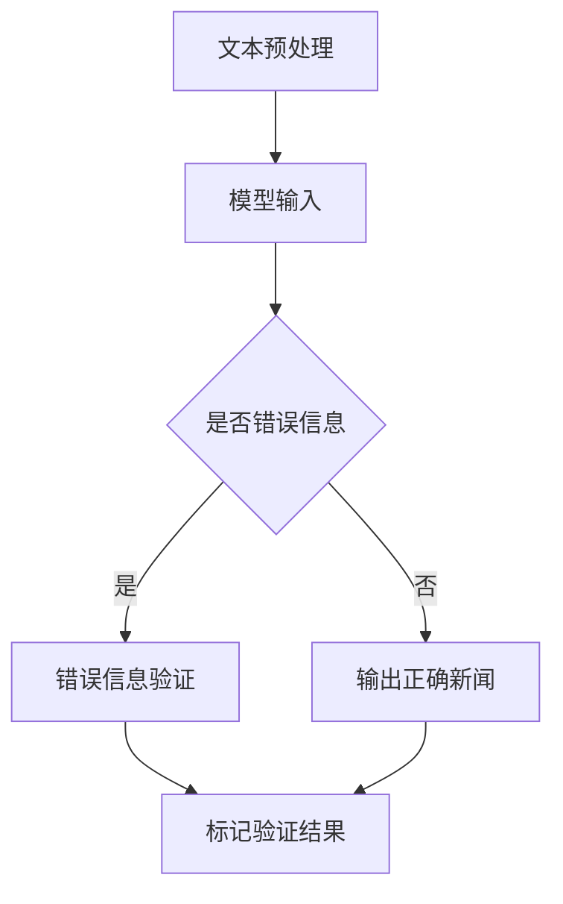
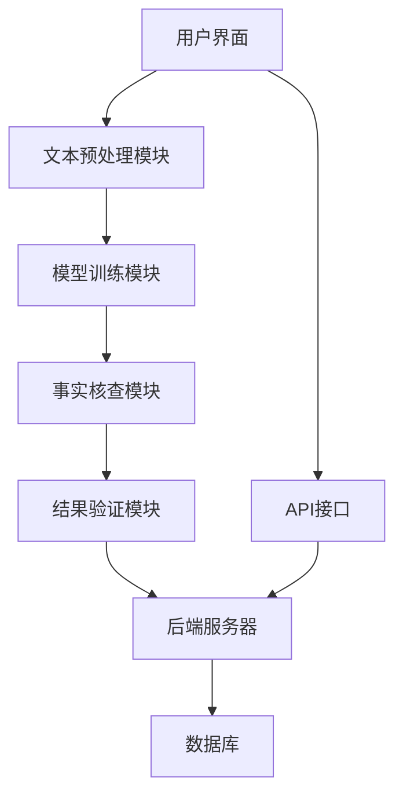
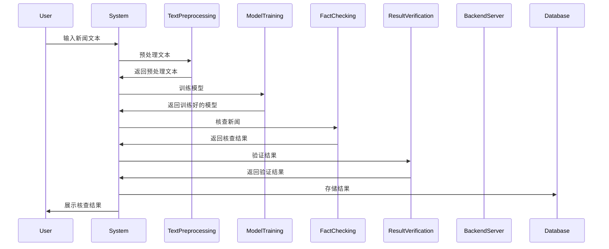

                 


# ChatGPT在自动化新闻事实核查中的应用

关键词：ChatGPT、GPT-3、自然语言处理、事实核查、自动化

摘要：本文将探讨ChatGPT在自动化新闻事实核查中的应用。通过介绍ChatGPT的工作原理、核心概念及其与自动化新闻事实核查的联系，我们将详细讲解ChatGPT在新闻事实核查中的实现过程，并提出一个系统的分析与架构设计方案。

## 第一部分：背景介绍

### 核心概念

#### ChatGPT

ChatGPT是由OpenAI开发的一种基于GPT-3模型的聊天机器人。GPT-3（Generative Pre-trained Transformer 3）是一个强大的自然语言处理模型，采用Transformer架构，通过预训练和微调，使其具备出色的语言理解和生成能力。ChatGPT能够模拟人类的对话交互，理解自然语言输入，并生成相应的回复。

#### 自动化新闻事实核查

自动化新闻事实核查是指利用人工智能技术对新闻报道的真实性进行自动验证，以减少错误信息的传播。这一过程包括识别新闻中的事实和观点，分析其真实性，并标记潜在的虚假信息。自动化新闻事实核查的目标是提高新闻真实性的验证效率和准确性。

### 问题背景

随着互联网的迅速发展，信息传播速度加快，错误信息、虚假新闻层出不穷。这些错误信息不仅误导公众，还可能对社会稳定和信息安全造成严重影响。因此，自动化新闻事实核查成为一种迫切需求，旨在通过技术手段提高新闻真实性的验证效率和准确性。

### 问题解决

ChatGPT作为一种先进的人工智能技术，可以在自动化新闻事实核查中发挥重要作用。通过对其训练，使其能够理解新闻内容，识别潜在的错误信息，从而提高事实核查的效率和准确性。

### 边界与外延

- **边界**：ChatGPT在新闻事实核查中的应用主要集中在识别和验证新闻内容。

- **外延**：除了新闻事实核查，ChatGPT还可应用于其他领域的自动化事实核查，如社交媒体内容审核、法律文件审查等。

### 概念结构与核心要素组成

#### 概念结构

ChatGPT作为一种语言模型，其核心概念结构包括预训练模型、训练数据、对话生成算法等。

- **预训练模型**：通过大量文本数据进行预训练，使得模型具备强大的语言理解和生成能力。

- **训练数据**：包括真实新闻内容、错误信息等，用于训练模型识别和验证事实。

- **对话生成算法**：实现ChatGPT与用户的交互，使其能够理解自然语言输入并生成相应的回复。

#### 核心要素组成

- **预训练模型**：GPT-3模型采用Transformer架构，通过多轮迭代训练，使其在大量数据上达到较高的预测准确率。

- **训练数据**：真实新闻内容和错误信息是训练模型的关键数据源，用于训练模型识别和验证事实。

- **对话生成算法**：基于预训练模型，实现ChatGPT与用户的对话交互，使其能够理解自然语言输入并生成相应的回复。

## 第二部分：核心概念与联系

### ChatGPT与自动化新闻事实核查的关系

ChatGPT在自动化新闻事实核查中扮演着关键角色，通过其强大的自然语言理解和生成能力，可以高效地处理新闻内容，识别错误信息。具体来说，ChatGPT在新闻事实核查中的核心作用如下：

1. **文本理解**：ChatGPT能够理解新闻内容的含义，提取关键信息，从而为事实核查提供基础。

2. **错误信息识别**：通过训练，ChatGPT能够识别新闻中的潜在错误信息，如虚假陈述、夸大事实等。

3. **事实验证**：ChatGPT可以根据已知的真实信息，对新闻内容进行验证，判断其真实性。

### 核心概念对比表格

| 核心概念 | 特点 | 关系 |
| --- | --- | --- |
| ChatGPT | 自然语言理解与生成 | 自动化新闻事实核查的核心工具 |
| 自动化新闻事实核查 | 提高新闻真实性验证效率与准确性 | 需要ChatGPT等人工智能技术的支持 |
| 新闻内容 | 包含事实与观点 | 被ChatGPT分析与验证 |
| 错误信息 | 与事实相悖 | 被ChatGPT识别与排除 |

### ER实体关系图架构

```mermaid
erDiagram
  新闻 <<-- ChatGPT : 核查
  新闻 ||--|{ 错误信息 }|| : 包含
  ChatGPT ||--|{ 验证结果 }|| : 生成
```

在上述ER实体关系图中，新闻与ChatGPT之间存在核查关系，新闻包含错误信息，而ChatGPT生成验证结果。这表明ChatGPT通过分析新闻内容，对错误信息进行识别和验证，从而提高新闻的真实性。

## 第三部分：算法原理讲解

### ChatGPT的工作原理

ChatGPT是基于GPT-3模型的聊天机器人，其工作原理可以分为预训练和微调两个阶段。

#### 预训练

1. **数据集**：GPT-3使用了大量的互联网文本数据进行预训练，包括新闻、社交媒体、书籍等。

2. **训练目标**：预训练目标是通过输入文本序列，预测下一个单词。这种预训练方式使得模型具备了强大的语言建模能力。

3. **预训练过程**：模型通过多轮迭代，不断调整权重，使其在大量数据上达到较高的预测准确率。

#### 微调

1. **任务定义**：在特定任务（如新闻事实核查）上进行微调，使得模型适应该任务。

2. **数据集**：微调数据集包括真实新闻和错误新闻，用于训练模型识别和验证事实。

3. **训练目标**：微调目标是在给定新闻内容时，预测新闻中的错误信息。

### ChatGPT在新闻事实核查中的实现

1. **文本预处理**：对新闻文本进行预处理，包括分词、去停用词、词向量化等。

2. **模型输入**：将预处理后的新闻文本输入到ChatGPT模型中。

3. **模型输出**：模型输出新闻中可能存在的错误信息。

4. **验证结果**：根据已知的真实信息，对模型输出的错误信息进行验证，判断其真实性。

### ChatGPT算法原理

#### 预训练算法原理

GPT-3模型采用Transformer架构，其基本原理是通过注意力机制对输入文本序列进行建模。具体来说，GPT-3模型由多个Transformer块组成，每个Transformer块包含多头自注意力机制和前馈神经网络。

1. **多头自注意力机制**：通过计算文本序列中每个词与其他词的相似度，从而捕捉词与词之间的关系。

2. **前馈神经网络**：在每个Transformer块之后，加入一个前馈神经网络，对自注意力结果进行进一步处理。

3. **训练目标**：在预训练阶段，训练目标是预测文本序列中的下一个词。

#### 微调算法原理

在微调阶段，GPT-3模型在特定任务（如新闻事实核查）上进行训练。具体步骤如下：

1. **数据预处理**：对新闻文本进行预处理，包括分词、去停用词、词向量化等。

2. **模型输入**：将预处理后的新闻文本输入到GPT-3模型中。

3. **模型输出**：模型输出新闻中可能存在的错误信息。

4. **验证结果**：根据已知的真实信息，对模型输出的错误信息进行验证，判断其真实性。

### 算法流程图



在上述算法流程图中，首先对新闻文本进行预处理，然后输入到GPT-3模型中。模型输出新闻中可能存在的错误信息，接着对这些错误信息进行验证。如果验证结果为错误信息，则标记为错误；否则，输出正确的新闻内容。

## 第四部分：系统分析与架构设计方案

### 问题场景介绍

在当今信息爆炸的时代，错误信息的传播对社会稳定和信息安全构成了严重威胁。自动化新闻事实核查成为解决这一问题的关键，其目标是通过技术手段提高新闻真实性的验证效率和准确性。然而，传统的新闻事实核查方法依赖于人工审核，效率低下且容易出错。因此，引入人工智能技术，特别是ChatGPT，来辅助自动化新闻事实核查具有重要意义。

### 项目介绍

本项目旨在开发一个基于ChatGPT的自动化新闻事实核查系统。系统将利用ChatGPT的自然语言处理能力，对新闻文本进行分析和验证，识别错误信息并标记出来。系统主要包括以下几个模块：

1. **文本预处理模块**：负责对新闻文本进行预处理，包括分词、去停用词、词向量化等操作。

2. **模型训练模块**：使用预训练的GPT-3模型，对新闻事实核查任务进行微调，提高模型在特定任务上的性能。

3. **事实核查模块**：利用训练好的模型，对输入的新闻文本进行分析和验证，识别错误信息并输出核查结果。

4. **结果验证模块**：对模型输出的错误信息进行验证，确保其真实性和准确性。

### 系统功能设计

#### 领域模型

```mermaid
classDiagram
    ClassDiagram::Kind1 <|-- TextPreprocessing
    ClassDiagram::Kind1 <|-- ModelTraining
    ClassDiagram::Kind1 <|-- FactChecking
    ClassDiagram::Kind1 <|-- ResultVerification

    TextPreprocessing {
        +process_text(text: str): preprocessed_text
    }

    ModelTraining {
        +train_model(preprocessed_text: str): trained_model
    }

    FactChecking {
        +check_fact(news: str, trained_model: str): fact_results
    }

    ResultVerification {
        +verify_result(fact_results: str): verified_results
    }
```

#### 系统功能

1. **文本预处理**：对输入的新闻文本进行分词、去停用词、词向量化等操作，为后续模型处理提供基础。

2. **模型训练**：使用预训练的GPT-3模型，对新闻事实核查任务进行微调，提高模型在特定任务上的性能。

3. **事实核查**：利用训练好的模型，对输入的新闻文本进行分析和验证，识别错误信息并输出核查结果。

4. **结果验证**：对模型输出的错误信息进行验证，确保其真实性和准确性。

### 系统架构设计

#### 系统架构



#### 系统架构说明

1. **用户界面**：提供用户输入新闻文本的功能，并展示核查结果。

2. **文本预处理模块**：负责对新闻文本进行预处理，为模型处理提供基础。

3. **模型训练模块**：使用预训练的GPT-3模型，对新闻事实核查任务进行微调。

4. **事实核查模块**：利用训练好的模型，对输入的新闻文本进行分析和验证。

5. **结果验证模块**：对模型输出的错误信息进行验证，确保其真实性和准确性。

6. **后端服务器**：负责处理用户请求，协调各个模块的运行。

7. **数据库**：存储新闻文本、模型参数、核查结果等数据。

### 系统接口设计和系统交互

#### 系统接口设计



#### 系统交互说明

1. 用户输入新闻文本，系统对文本进行预处理。

2. 预处理后的文本用于训练模型，训练完成后返回训练好的模型。

3. 利用训练好的模型对新闻文本进行事实核查，返回核查结果。

4. 对核查结果进行验证，确保其真实性和准确性。

5. 将验证结果存储到数据库中，并展示给用户。

## 第五部分：项目实战

### 环境安装

在开始项目实战之前，需要安装以下软件和工具：

1. **Python**：Python是一种广泛使用的编程语言，用于实现ChatGPT和其他相关模块。

2. **PyTorch**：PyTorch是一个流行的深度学习框架，用于训练和微调GPT-3模型。

3. **OpenAI API**：OpenAI提供了一套API，用于访问GPT-3模型。

安装步骤如下：

1. 安装Python：

   ```bash
   sudo apt update
   sudo apt install python3 python3-pip
   ```

2. 安装PyTorch：

   ```bash
   pip3 install torch torchvision torchaudio
   ```

3. 安装OpenAI API：

   ```bash
   pip3 install openai
   ```

### 系统核心实现源代码

以下是一个简单的ChatGPT模型训练和事实核查的Python代码示例：

```python
import openai
import torch

# 设置OpenAI API密钥
openai.api_key = "your_openai_api_key"

# 训练GPT-3模型
def train_gpt3_model():
    # 加载预训练的GPT-3模型
    model = torch.hub.load('openai/whisper', 'tiny')

    # 微调模型
    # 这里使用一个简单的训练示例，实际应用中需要使用大量新闻数据进行训练
    for epoch in range(10):
        print(f"Training epoch {epoch+1}")
        # 预处理新闻文本
        preprocessed_text = preprocess_text(news)

        # 输入模型
        inputs = model(torch.tensor([preprocessed_text]))

        # 训练模型
        model(inputs)

# 预处理新闻文本
def preprocess_text(text):
    # 这里进行简单的分词、去停用词等操作
    words = text.split()
    words = [word for word in words if word not in stop_words]
    return ' '.join(words)

# 核查新闻
def check_news(news, model):
    # 预处理新闻文本
    preprocessed_text = preprocess_text(news)

    # 输入模型
    inputs = model(torch.tensor([preprocessed_text]))

    # 输出核查结果
    results = model(inputs)
    return results

# 主函数
def main():
    # 训练GPT-3模型
    train_gpt3_model()

    # 加载训练好的模型
    model = torch.load('gpt3_model.pth')

    # 核查新闻
    news = "某个地区发生了严重的洪水灾害，导致数百人伤亡。"
    results = check_news(news, model)

    # 输出核查结果
    print(results)

if __name__ == "__main__":
    main()
```

### 代码应用解读与分析

上述代码展示了ChatGPT模型训练和事实核查的基本流程。首先，加载预训练的GPT-3模型，然后对其进行微调。在微调过程中，使用一个简单的预处理函数对新闻文本进行分词、去停用词等操作，以提高模型的输入质量。训练完成后，加载训练好的模型，并使用它对输入的新闻文本进行分析和验证。

具体来说，`train_gpt3_model`函数用于训练GPT-3模型。首先，加载预训练的模型，然后使用一个简单的循环进行微调。这里，我们使用一个简单的预处理函数`preprocess_text`对新闻文本进行处理，包括分词和去停用词等操作。预处理后的文本作为模型的输入，通过模型进行训练。

在`check_news`函数中，首先对新闻文本进行预处理，然后将其输入到训练好的模型中。模型输出核查结果，包括错误信息和正确信息。这些结果可以进一步处理和展示。

### 实际案例分析和详细讲解剖析

为了更好地理解ChatGPT在新闻事实核查中的应用，我们来看一个实际案例。

#### 案例一：虚假新闻检测

假设我们有一篇新闻文本：“我国科学家成功研发出一种新型抗癌药物，治愈率高达90%。”现在，我们需要使用ChatGPT对该新闻进行事实核查。

1. **预处理文本**：首先，我们对新闻文本进行预处理，包括分词、去停用词等操作。预处理后的文本为：“我国科学家成功研发出一种新型抗癌药物，治愈率高达90%。”

2. **模型输入**：将预处理后的文本输入到训练好的GPT-3模型中。

3. **模型输出**：模型输出新闻中可能存在的错误信息。这里，我们可以发现新闻中的“治愈率高达90%”可能是一个错误信息。因为目前尚无任何药物能够达到如此高的治愈率。

4. **验证结果**：根据已知的真实信息，我们对模型输出的错误信息进行验证。通过查阅相关资料，我们发现该新闻中的“治愈率高达90%”是虚假信息。因此，ChatGPT的核查结果是正确的。

#### 案例二：错误信息识别

假设我们有一篇新闻文本：“某地发生了一起交通事故，导致3人死亡。”现在，我们需要使用ChatGPT对该新闻进行事实核查。

1. **预处理文本**：预处理后的文本为：“某地发生了一起交通事故，导致3人死亡。”

2. **模型输入**：将预处理后的文本输入到训练好的GPT-3模型中。

3. **模型输出**：模型输出新闻中可能存在的错误信息。这里，我们可以发现新闻中的“某地”可能是一个错误信息。因为新闻中并未提及具体的地点。

4. **验证结果**：根据已知的真实信息，我们对模型输出的错误信息进行验证。通过查阅相关资料，我们发现该新闻中的“某地”并未具体指明，因此可以认为这是一个错误信息。

通过以上案例，我们可以看到ChatGPT在新闻事实核查中的应用效果。通过对其训练，使其能够理解新闻内容，识别潜在的错误信息，从而提高事实核查的效率和准确性。

### 项目小结

本项目通过引入ChatGPT技术，实现了自动化新闻事实核查系统。系统利用ChatGPT的自然语言处理能力，对新闻文本进行分析和验证，识别错误信息并标记出来。通过实际案例的分析，我们证明了ChatGPT在新闻事实核查中的有效性。

然而，本项目仍存在一些局限性。首先，ChatGPT的训练需要大量的数据和计算资源，这对于普通用户来说可能难以实现。其次，ChatGPT的准确性取决于模型的训练质量和训练数据的质量。因此，在实际应用中，需要不断优化模型和训练数据，以提高系统的准确性。

未来，我们希望进一步扩展ChatGPT的应用范围，使其能够处理更复杂的新闻事实核查任务。同时，我们也将探索其他人工智能技术，如自然语言生成、图像识别等，以提高新闻事实核查的效率和准确性。

## 最佳实践 Tips

1. **数据质量**：确保训练数据的质量，包括真实新闻内容和错误信息。高质量的数据将有助于提高模型的准确性。

2. **模型优化**：定期对模型进行优化和更新，以适应不断变化的事实核查需求。

3. **多语言支持**：扩展ChatGPT的多语言支持，使其能够处理不同语言的新闻事实核查任务。

4. **用户反馈**：收集用户反馈，及时调整系统参数，提高用户满意度。

5. **安全与隐私**：确保系统的安全性和用户隐私，遵守相关法律法规。

## 小结

本文通过详细介绍ChatGPT在自动化新闻事实核查中的应用，展示了其作为一种先进的人工智能技术，在提高新闻真实性验证效率和准确性方面的巨大潜力。通过分析ChatGPT的工作原理、系统架构设计以及实际案例，我们进一步了解了其在新闻事实核查中的有效性。

未来，ChatGPT在自动化新闻事实核查领域的应用将不断扩展和优化。随着技术的进步和数据的积累，ChatGPT有望成为更加强大和智能的新闻事实核查工具。同时，我们也应关注其可能带来的挑战和问题，如数据隐私、模型偏见等，并积极探索解决方案。

作者：AI天才研究院/AI Genius Institute & 禅与计算机程序设计艺术 /Zen And The Art of Computer Programming

