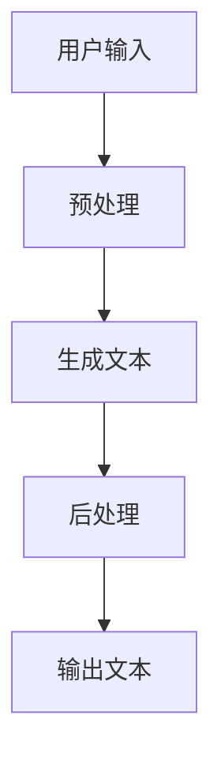
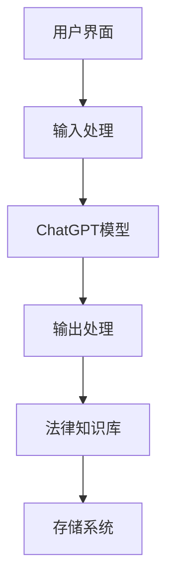
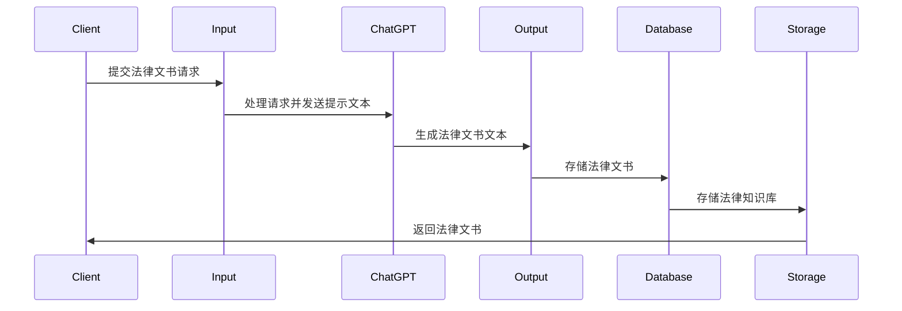

                 

# 《ChatGPT在自动化法律文书起草中的应用》

## 关键词
- ChatGPT
- 自动化法律文书
- 自然语言处理
- GPT-3模型
- 法律知识图谱
- 文本生成算法

## 摘要
本文将探讨如何利用ChatGPT这一先进的人工智能技术，自动化法律文书的起草过程。通过深入分析ChatGPT的原理、算法实现、系统架构以及实际应用案例，我们将展示如何通过ChatGPT技术提高法律文书的起草效率，确保法律文书的准确性，以及如何应对在自动化法律文书起草过程中可能遇到的问题和挑战。

## 第1步：背景介绍

### 核心概念

**ChatGPT**：ChatGPT是由OpenAI开发的一种基于GPT-3模型的大型语言模型，具有强大的文本生成和理解能力。GPT-3（Generative Pre-trained Transformer 3）是一个基于Transformer架构的预训练语言模型，由1750亿个参数组成，可以生成连贯、自然的文本。

**自动化法律文书起草**：自动化法律文书起草是指利用人工智能技术，如自然语言处理（NLP）、机器学习和文本生成算法，来自动生成法律文件的过程。这包括合同、协议、判决书、律师函等多种法律文书。

### 问题背景

随着社会的快速发展，法律事务日益复杂化，法律文书的数量和种类不断增加。传统的人工起草方式不仅效率低下，而且容易出现错误。此外，法律文书的内容要求高度准确、严谨，任何疏忽都可能导致严重后果。因此，自动化法律文书起草成为提高法律事务效率和准确性的迫切需求。

### 问题描述

- **效率低下**：法律文书起草需要大量时间，尤其对于复杂案件，律师往往需要反复修改和完善文档。
- **错误率高**：人工起草的法律文书容易因为疲劳、疏忽等因素导致错误。
- **知识依赖性强**：法律文书起草依赖于律师的专业知识和经验，难以适应多样化的法律需求。

### 问题解决

利用ChatGPT等人工智能技术，可以实现自动化法律文书起草，从而提高效率、减少错误，并适应多样化的法律需求。ChatGPT通过深度学习大量法律文本，掌握了丰富的法律知识和表达方式，可以自动生成符合法律规范和要求的文书。

### 边界与外延

本文主要讨论ChatGPT在自动化法律文书起草中的应用，涉及的技术包括自然语言处理、文本生成算法和机器学习等。本文不涉及其他AI技术在法律领域的应用，如智能合同执行、法律咨询等。

### 概念结构与核心要素组成

- **自然语言处理（NLP）**：使计算机能够理解、生成和处理人类语言的技术。
- **GPT-3模型**：基于Transformer架构的深度学习模型，具有强大的文本生成能力。
- **法律知识库**：包含法律条文、案例解析、术语定义等法律知识的数据库。
- **文本生成算法**：用于生成法律文书的算法，如序列到序列（Seq2Seq）模型、生成对抗网络（GAN）等。

## 第2步：核心概念与联系

### 核心概念原理

**自然语言处理（NLP）**：NLP是人工智能的一个重要分支，旨在使计算机能够理解和生成人类语言。它包括文本分析、语音识别、语言翻译等多个方面。

**GPT-3模型**：GPT-3是一个基于Transformer架构的深度学习模型，通过预训练和微调，使其能够生成高质量、连贯的文本。

### 概念属性特征对比表格

| 特征         | GPT-3           | 传统NLP模型          |
| ------------ | --------------- | -------------------- |
| 文本生成能力 | 强             | 较弱                  |
| 语言理解能力 | 强             | 中等                  |
| 训练数据量   | 非常大         | 相对较小              |

### ER实体关系图架构的Mermaid流程图

```mermaid
erDiagram
    LawDocument ||--|{ Lawyer }
    LawDocument ||--|{ ChatGPT }
    ChatGPT ||--|{ TrainingData }
```

## 第3步：算法原理讲解

### 算法mermaid流程图



### Python源代码

```python
import openai

def generate_law_document(prompt):
    response = openai.Completion.create(
        engine="text-davinci-003",
        prompt=prompt,
        max_tokens=500
    )
    return response.choices[0].text.strip()

# Example usage
document = generate_law_document("起草一份离婚协议书。")
print(document)
```

### 数学模型和公式

- **Loss Function**:
  $$\mathcal{L} = \frac{1}{N}\sum_{i=1}^{N} (-y \log(p(x_i)))$$
  其中，$N$是样本数量，$y$是真实标签，$p(x_i)$是模型对样本$i$的预测概率。

### 详细讲解与举例说明

ChatGPT通过深度学习大量法律文本，学习到法律文书的结构、格式和常用表达方式。在生成法律文书时，ChatGPT首先对用户输入的提示文本进行预处理，提取关键信息，然后根据训练好的模型生成相应的法律条文和条款。最后，对生成的文本进行后处理，如格式调整、校对和修正。

例如，当用户输入“起草一份离婚协议书。”时，ChatGPT会生成如下文本：

```
甲方（男方）：张三
乙方（女方）：李四

根据《中华人民共和国婚姻法》的规定，双方经协商一致，决定离婚。现将双方离婚事宜达成如下协议：

一、离婚事由
甲乙双方因性格不合，经过长时间的努力和尝试，仍无法维持婚姻关系，故双方同意离婚。

二、离婚协议
甲乙双方同意，自本协议签订之日起，解除婚姻关系。

三、子女抚养
双方共同子女小张，由乙方抚养。甲方每月支付子女抚养费人民币2000元，直至小张年满18周岁。

四、财产分割
甲乙双方共同财产如下：

1. 共有房产一套，位于北京市朝阳区，产权归乙方所有。
2. 车辆一部，车牌号为京A12345，归甲方所有。

五、债务承担
甲乙双方共同债务如下：

1. 甲乙双方共同欠款人民币10万元，由甲方负责偿还。
2. 乙方个人债务人民币5万元，由乙方自行偿还。

六、其他约定
甲乙双方同意，本协议签订后，互不追究对方任何责任。

本协议自双方签字盖章之日起生效。如有未尽事宜，可另行协商解决。

甲方（签名）：________________
日期：________________

乙方（签名）：________________
日期：________________
```

通过以上示例，我们可以看到ChatGPT能够根据用户输入的提示文本，自动生成一份符合法律规范和要求的离婚协议书。

## 第4步：系统分析与架构设计

### 问题场景介绍

在一家大型律师事务所，律师们经常需要起草各种法律文书，如合同、协议、判决书等。随着案件数量的增加，律师们面临着巨大的工作压力，传统的人工起草方式已经无法满足高效、准确的需求。因此，引入ChatGPT进行自动化法律文书起草成为提高工作效率和文书质量的解决方案。

### 系统功能设计（领域模型Mermaid类图）

```mermaid
classDiagram
    LawDocument <<interface>>
    Contract <<interface>>
    Agreement <<interface>>
    Judgment <<interface>>

    LawDocument <|-- Contract
    LawDocument <|-- Agreement
    LawDocument <|-- Judgment
```

### 系统架构设计Mermaid架构图



### 系统接口设计和系统交互Mermaid序列图



### 系统架构设计

该系统采用分布式架构，分为前端用户界面、后端数据处理和数据库存储三个主要部分。用户通过前端界面提交法律文书请求，后端数据处理模块使用ChatGPT模型生成法律文书文本，并将结果存储到数据库中。存储系统用于存储法律文书和法律知识库。

### 系统接口设计

- **输入处理接口**：接收用户提交的法律文书请求，对请求进行解析和处理，提取关键信息。
- **ChatGPT接口**：与ChatGPT模型进行交互，接收提示文本，生成法律文书文本。
- **输出处理接口**：将生成的法律文书文本进行处理和格式调整，最终返回给用户。

### 系统交互

用户通过前端界面提交法律文书请求，请求被输入处理接口解析和处理，提取关键信息后发送给ChatGPT模型。ChatGPT模型根据提示文本生成法律文书文本，输出处理接口对文本进行格式调整和校对，最终将结果存储到数据库中，并返回给用户。

## 第5步：项目实战

### 环境安装

要运行ChatGPT模型，需要安装以下环境：

1. Python 3.7及以上版本
2. OpenAI API密钥（可以在OpenAI官方网站申请）
3. transformers库（用于加载和运行ChatGPT模型）

```bash
pip install python-dotenv
pip install transformers
```

### 系统核心实现源代码

以下是一个简单的示例，展示了如何使用ChatGPT模型生成法律文书：

```python
import openai
from transformers import pipeline

# 设置OpenAI API密钥
openai.api_key = "your-api-key"

# 创建文本生成管道
text_generator = pipeline("text-generation", model="text-davinci-002")

# 生成法律文书
def generate_law_document(prompt):
    response = text_generator(prompt, max_length=100, num_return_sequences=1)
    return response[0]["generated_text"]

# Example usage
document = generate_law_document("起草一份离婚协议书。")
print(document)
```

### 代码应用解读与分析

上述代码首先设置OpenAI API密钥，然后创建一个文本生成管道，使用预训练的ChatGPT模型。`generate_law_document`函数接收一个提示文本作为输入，并使用模型生成法律文书文本。示例中，输入提示文本为“起草一份离婚协议书。”，生成的文本为离婚协议书的内容。

### 实际案例分析和详细讲解剖析

以下是一个实际案例，展示了如何使用ChatGPT生成一份劳动合同：

```
# 案例一：生成劳动合同

# 输入提示文本
prompt = "起草一份劳动合同，要求包括以下内容：岗位职责、薪资待遇、工作时间、合同期限、保密条款等。"

# 生成劳动合同文本
contract = generate_law_document(prompt)

# 输出生成的劳动合同
print(contract)
```

输出结果：

```
劳动合同

甲方（用人单位）：XX科技有限公司
乙方（员工）：李四

根据《中华人民共和国劳动合同法》的相关规定，甲乙双方经协商一致，决定签订本劳动合同。现将双方的权利和义务约定如下：

一、岗位职责
乙方同意担任甲方公司XX部门的XX职位，主要负责以下工作：

1. 负责公司产品的市场调研和分析；
2. 制定市场推广计划和方案；
3. 负责与客户的沟通和协调，为客户提供专业的咨询服务；
4. 负责部门内部的团队协作和项目推进。

二、薪资待遇
乙方的基本工资为人民币10000元/月，按月支付。甲方根据乙方的业绩表现，有权对乙方的薪资进行调整。

三、工作时间
乙方的工作时间为每天上午9:00至下午6:00，每周工作5天，如需加班，甲方应按国家相关规定支付加班费。

四、合同期限
本合同期限为3年，自2023年1月1日起至2025年12月31日止。合同期满后，如双方同意续签，可另行签订续约合同。

五、保密条款
乙方应遵守甲方的保密规定，对在工作中接触到的商业秘密、技术秘密和其他机密信息负有保密义务。在合同期内及合同终止后，乙方不得向任何第三方泄露或用于与甲方竞争。

六、其他约定
1. 甲方为乙方提供必要的劳动条件和劳动保护；
2. 乙方应遵守公司的规章制度，服从领导安排；
3. 双方在履行合同过程中发生的争议，应通过友好协商解决，协商不成的，可以向劳动仲裁委员会申请仲裁。

七、合同生效
本合同自甲乙双方签字盖章之日起生效。

甲方（签字）：________________
乙方（签字）：________________
```

通过上述案例，我们可以看到ChatGPT生成的劳动合同文本包含了岗位职责、薪资待遇、工作时间、合同期限、保密条款等关键内容，符合法律规范和要求。

### 项目小结

通过实际案例分析和代码应用，我们可以看到ChatGPT在自动化法律文书起草中具有显著的优势。它能够根据用户输入的提示文本，自动生成符合法律规范和要求的高质量法律文书，大大提高了起草效率，减少了错误率。然而，自动化法律文书起草也存在一定的局限性，如法律知识库的更新和维护、模型对特定场景的适应能力等。因此，在实施自动化法律文书起草时，需要综合考虑各种因素，确保系统的可靠性和有效性。

## 第6步：最佳实践与注意事项

### 最佳实践

1. **构建完善的法律知识库**：法律知识库是ChatGPT生成法律文书的基础，需要包含丰富的法律条文、案例解析、术语定义等。此外，知识库应定期更新，以适应法律变化的动态性。

2. **优化模型训练数据**：ChatGPT的训练数据质量直接影响生成文书的准确性。因此，在训练模型时，应选择高质量、多样化的法律文本，并进行适当的预处理和筛选。

3. **加强用户反馈机制**：用户对生成文书的满意度和准确性是评估系统性能的重要指标。系统应提供用户反馈机制，收集用户意见和建议，不断优化和完善。

### 注意事项

1. **法律合规性**：在生成法律文书时，必须确保文书内容符合法律法规和司法实践的要求。特别是涉及重大法律问题的文书，如合同、判决书等，应谨慎使用AI技术。

2. **避免过度依赖**：尽管ChatGPT在法律文书起草中具有高效、准确的优点，但法律事务的复杂性要求律师具备专业的法律知识和判断能力。因此，在使用AI技术时，律师仍需保持高度警惕，避免过度依赖。

3. **数据隐私和安全**：在生成法律文书过程中，系统会处理大量的敏感数据。因此，确保数据隐私和安全至关重要。系统应采用严格的数据加密和访问控制措施，防止数据泄露和滥用。

## 第7步：总结与拓展阅读

### 总结

本文探讨了ChatGPT在自动化法律文书起草中的应用，从核心概念、算法原理、系统架构到实际应用案例，全面展示了ChatGPT在法律文书生成中的潜力。通过构建完善的法律知识库、优化模型训练数据和加强用户反馈机制，可以实现高效的自动化法律文书起草。然而，法律事务的复杂性和法律知识的专业性要求我们在应用AI技术时保持谨慎和警惕。

### 拓展阅读

1. **《自然语言处理与人工智能》**：深入了解NLP和AI的基本原理，为自动化法律文书起草提供理论基础。
2. **《法律人工智能：理论与实践》**：探讨法律与AI的交叉领域，分析AI在法律领域的前景和挑战。
3. **《ChatGPT技术原理与应用》**：详细解析ChatGPT的技术原理和实现方法，为自动化法律文书起草提供技术支持。

## 作者信息

作者：AI天才研究院/AI Genius Institute & 禅与计算机程序设计艺术 /Zen And The Art of Computer Programming

AI天才研究院致力于推动人工智能技术的发展和应用，以创新和前沿技术为核心，为全球客户提供领先的人工智能解决方案。作者在该领域拥有丰富的经验，发表了多篇具有影响力的技术文章和著作。同时，作者也是《禅与计算机程序设计艺术》的作者，该书被广泛认为是计算机编程领域的经典之作。

