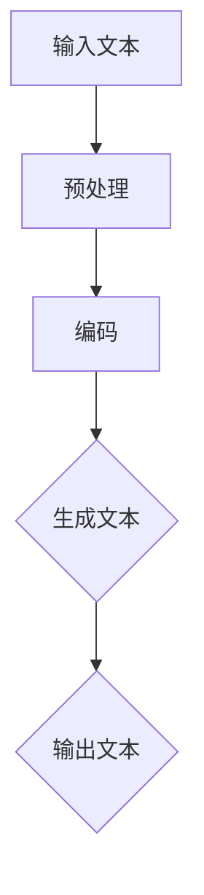
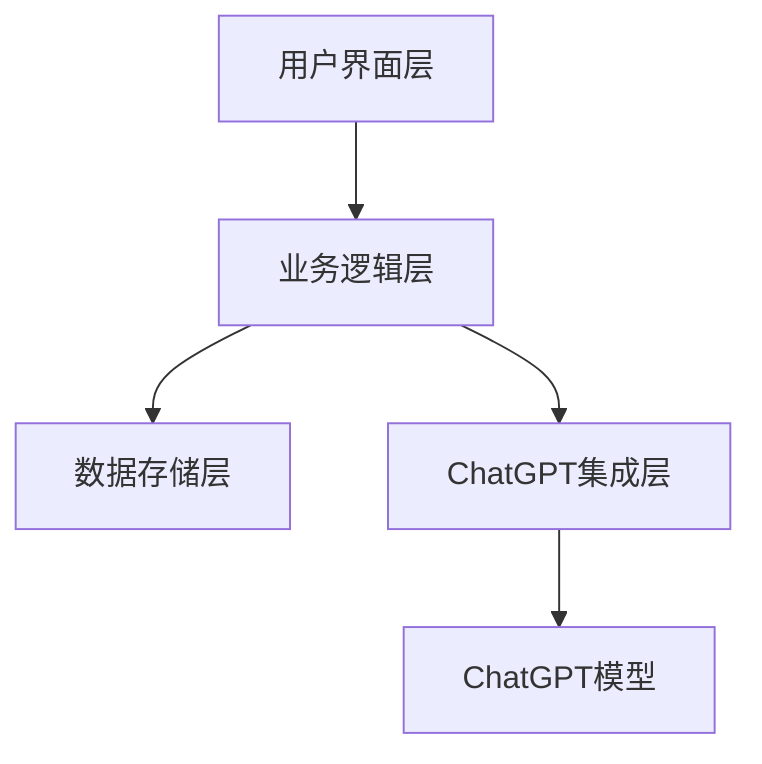
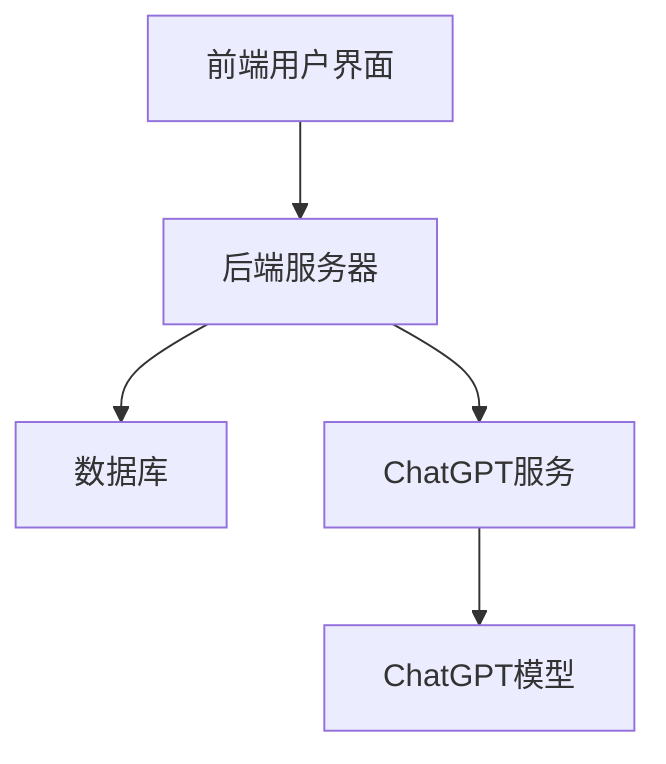
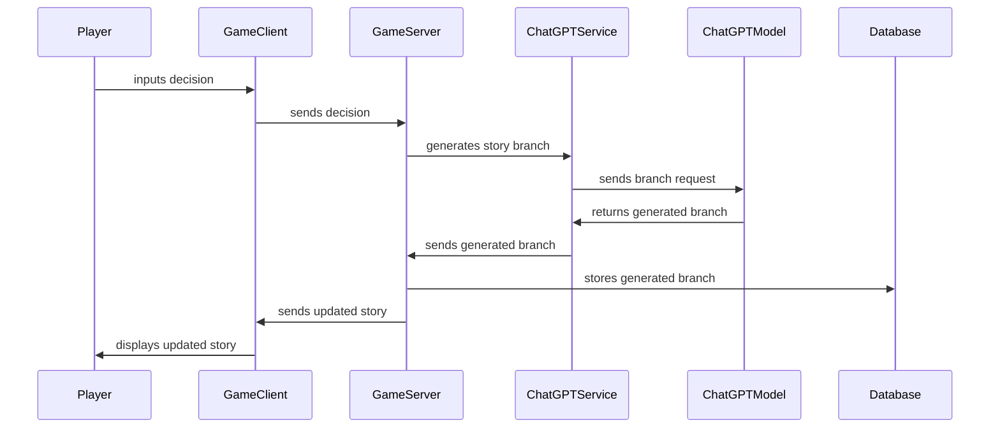

                 


### 第1章：引言与背景

#### 1.1 自动化游戏剧情分支设计的现状与挑战

**背景介绍：**

随着游戏行业的快速发展，游戏剧情的重要性日益凸显。游戏剧情不仅能够吸引玩家，还能够提升游戏的可玩性和沉浸感。然而，传统的游戏剧情设计方法往往依赖于人工编写，这存在一些问题。首先，人工编写游戏剧情需要大量的时间和精力，尤其在面对复杂多变的故事线时，效率低下。其次，人工编写的剧情往往缺乏多样性和创造性，导致游戏剧情的单调重复，难以满足玩家对新鲜体验的需求。因此，自动化游戏剧情分支设计应运而生，旨在通过技术手段提高游戏剧情设计的效率和质量。

**问题介绍：**

自动化游戏剧情分支设计面临的主要问题包括：

- **多样性与实时性的平衡**：自动化生成游戏剧情需要保证剧情的多样性和灵活性，同时还要确保能够实时响应玩家的行为和决策。这要求系统在短时间内快速生成高质量的剧情，这本身就是一个挑战。

- **剧情连贯性**：自动化生成的剧情需要保持连贯性和逻辑性，否则会导致游戏体验的中断和玩家流失。

- **角色互动**：游戏中的角色互动是游戏剧情的重要组成部分。自动化系统需要能够模拟角色之间的自然对话和互动，这涉及到自然语言处理和人工智能技术的深入应用。

**解决思路：**

为了解决上述问题，我们可以考虑引入ChatGPT这样先进的对话生成系统。ChatGPT具有以下优势：

- **强大的自然语言处理能力**：ChatGPT能够理解并生成自然流畅的文本，这对于游戏剧情的生成至关重要。

- **灵活的对话生成机制**：ChatGPT能够根据不同的游戏场景和玩家的行为，灵活地生成对应的对话和剧情分支。

- **高效的生成速度**：ChatGPT的生成速度非常快，可以在短时间内生成大量的剧情内容，满足实时性需求。

#### 1.2 ChatGPT：对话系统的新星

**基本概念：**

ChatGPT是由OpenAI开发的一种基于GPT-3（生成预训练变换器3）的大型语言模型。它通过在大量文本数据上进行预训练，掌握了丰富的语言知识和模式，能够进行自然语言理解和生成。ChatGPT的核心特点包括：

- **强大的语言理解能力**：ChatGPT能够理解复杂的语言结构和语义，这对于生成逻辑性强、连贯性好的游戏剧情至关重要。

- **灵活的对话生成机制**：ChatGPT可以基于用户的输入和上下文，生成相应的回应，这使得它非常适合用于模拟角色对话和生成剧情分支。

- **高效的生成速度**：ChatGPT的生成速度非常快，能够在短时间内生成大量的文本内容，这对于实时性要求高的游戏剧情设计非常有帮助。

**优势与特点：**

- **自然语言生成**：ChatGPT生成的文本非常自然，接近人类的表达方式，能够提升游戏剧情的真实感和沉浸感。

- **多样性和创造性**：ChatGPT能够在保证剧情连贯性的前提下，生成多样化的剧情分支，满足玩家对新鲜体验的需求。

- **实时交互**：ChatGPT能够实时响应用户输入和游戏场景的变化，生成对应的剧情内容和对话。

**应用潜力：**

ChatGPT在游戏剧情分支设计中的应用潜力非常广泛：

- **剧情生成**：ChatGPT可以自动生成游戏剧情，包括主角的行动、决策和对话。

- **角色互动**：ChatGPT可以模拟角色之间的对话和互动，增强游戏剧情的互动性和真实感。

- **剧情分支设计**：ChatGPT可以根据玩家的行为和选择，动态生成不同的剧情分支，提供多样化的游戏体验。

通过ChatGPT，游戏设计师可以更加高效地设计复杂的游戏剧情，同时确保剧情的多样性和连贯性，为玩家提供更加丰富和沉浸的游戏体验。

### 1.3 ChatGPT与自动化游戏剧情分支设计的关系

**工作原理：**

ChatGPT通过预训练和微调，掌握了大量的语言知识和模式。当接收到用户输入或游戏场景的提示时，ChatGPT会基于这些知识和模式生成相应的文本。这个过程包括以下几个步骤：

1. **输入处理**：ChatGPT接收到用户的输入或游戏场景的提示后，会进行预处理，包括分词、标记和语法分析等。

2. **上下文理解**：ChatGPT会分析输入文本的上下文信息，理解用户的意图和场景背景。

3. **文本生成**：基于输入文本的上下文和预训练的知识，ChatGPT会生成相应的文本回应。

4. **反馈调整**：ChatGPT会根据用户的反馈和游戏剧情的要求，对生成的文本进行微调和优化。

**在游戏剧情分支设计中的应用：**

ChatGPT在游戏剧情分支设计中的应用主要体现在以下几个方面：

1. **剧情生成**：ChatGPT可以自动生成游戏剧情，包括主角的行动、决策和对话。通过预训练和微调，ChatGPT能够生成多样化的剧情内容，满足不同游戏场景和玩家需求。

2. **角色对话**：ChatGPT可以模拟角色之间的对话和互动，增强游戏剧情的互动性和真实感。通过自然语言生成技术，ChatGPT能够生成流畅、自然的对话文本。

3. **剧情分支设计**：ChatGPT可以根据玩家的行为和选择，动态生成不同的剧情分支，提供多样化的游戏体验。这种动态生成的剧情分支能够实时响应用户输入，增强游戏的沉浸感和可玩性。

**实际应用案例：**

一些游戏已经开始采用ChatGPT进行剧情分支设计，例如：

- **《流浪地球2》**：该游戏利用ChatGPT生成剧情分支，根据玩家的决策和行为，提供不同的剧情走向和结局。

- **《黑暗之魂4》**：该游戏通过ChatGPT模拟NPC的对话和互动，增强了游戏的剧情体验和玩家互动。

这些实际案例表明，ChatGPT在自动化游戏剧情分支设计中的应用潜力巨大，为游戏设计师提供了强大的工具和平台，有助于提升游戏剧情的设计效率和质量。

### 1.4 自动化游戏剧情分支设计的系统需求与挑战

**系统需求：**

自动化游戏剧情分支设计系统需要满足以下需求：

- **灵活性与适应性**：系统能够根据不同的游戏场景和玩家行为，动态生成和调整剧情分支，确保剧情的连贯性和多样性。

- **高效性**：系统需要具备高效的生成速度，能够在短时间内生成大量的剧情内容，以满足实时交互的需求。

- **可扩展性**：系统应该具备良好的扩展性，能够支持不同类型的游戏和剧情需求，便于后续的维护和升级。

- **用户友好性**：系统界面应简洁直观，方便游戏设计师和开发者进行操作和管理。

**挑战：**

尽管ChatGPT在自动化游戏剧情分支设计方面具有巨大潜力，但实际应用中仍面临一些挑战：

- **语义理解**：自动化系统需要准确理解游戏场景和玩家行为，这涉及到复杂的自然语言理解和语义分析技术。

- **生成质量**：生成剧情的内容需要保证质量，避免出现逻辑错误、不连贯或不符合游戏主题的情况。

- **交互设计**：系统需要提供灵活的交互机制，能够实时响应用户输入和游戏场景的变化，生成对应的剧情内容和对话。

- **性能优化**：为了满足实时性的需求，系统需要优化性能，提高生成速度和响应时间。

通过解决上述挑战，自动化游戏剧情分支设计系统将能够更好地满足游戏设计和开发的需求，为玩家提供更加丰富和沉浸的游戏体验。

### 1.5 ChatGPT在自动化游戏剧情分支设计中的具体应用场景

**场景一：主角行动与决策**

ChatGPT可以模拟主角的行动和决策，根据玩家的选择和游戏场景的变化，自动生成相应的剧情分支。例如，在游戏中，主角可以选择前往不同的地点、与不同的角色互动，或者做出不同的决策。ChatGPT可以根据这些信息，生成对应的剧情文本，使游戏剧情更加丰富和多样化。

**场景二：角色对话**

游戏中的角色对话是游戏剧情的重要组成部分。ChatGPT可以模拟角色之间的对话，根据玩家的行为和游戏场景，生成自然的对话文本。例如，当主角遇到敌人时，NPC可以根据主角的行为和对话内容，生成相应的回应，使游戏剧情更加真实和生动。

**场景三：剧情分支设计**

ChatGPT可以根据玩家的行为和选择，动态生成不同的剧情分支，为玩家提供多样化的游戏体验。例如，在某个关键节点，玩家可以选择不同的路线或决策，ChatGPT可以根据这些选择，生成不同的剧情分支，使玩家面临不同的挑战和结局。

**场景四：故事情节发展**

ChatGPT可以生成整个游戏的故事情节，包括主角的背景、目标、冒险过程和结局。通过预训练和微调，ChatGPT可以生成连贯、逻辑性强、富有创意的故事情节，为游戏设计师提供丰富的素材和灵感。

### 1.6 总结

自动化游戏剧情分支设计是游戏行业的重要研究方向，它旨在提高游戏剧情设计的效率和质量。ChatGPT作为一种先进的对话生成系统，具有强大的自然语言处理能力、灵活的对话生成机制和高效的生成速度，为自动化游戏剧情分支设计提供了强大的技术支持。通过本章的介绍，我们可以看到ChatGPT在游戏剧情分支设计中的应用场景和具体应用，为后续章节的深入讨论奠定了基础。

----------------------------------------------------------------

### 第2章：核心概念与联系

#### 2.1 自然语言处理与ChatGPT

**自然语言处理的基本概念：**

自然语言处理（Natural Language Processing，NLP）是计算机科学和人工智能领域的一个重要分支，主要研究如何让计算机理解和生成自然语言。自然语言处理的目标包括文本分类、情感分析、机器翻译、语音识别等。其中，文本生成是自然语言处理的一个重要任务，旨在根据给定的输入文本生成新的文本。

**自然语言处理的关键技术：**

- **分词**：将文本分割成单词或短语的步骤，是进行自然语言处理的基础。

- **词性标注**：为文本中的每个单词分配相应的词性标签，如名词、动词、形容词等。

- **句法分析**：分析句子的结构，识别句子中的主语、谓语、宾语等成分。

- **语义分析**：理解句子中的语义内容，包括实体识别、关系提取和语义角色标注等。

**ChatGPT与自然语言处理的关系：**

ChatGPT是自然语言处理领域的一个重要成果，它通过在大量文本数据上进行预训练，掌握了丰富的语言知识和模式。ChatGPT的核心功能是基于输入文本生成新的文本，这涉及到自然语言处理的多个方面。具体来说，ChatGPT能够进行：

- **文本生成**：根据给定的输入文本，生成连贯、自然的文本回应。

- **对话生成**：在对话场景中，根据上下文生成相应的对话内容。

- **语义理解**：理解输入文本的语义内容，生成符合语义逻辑的文本。

**ChatGPT在自然语言处理中的应用：**

- **聊天机器人**：ChatGPT可以用于构建聊天机器人，与用户进行自然语言交互。

- **内容生成**：ChatGPT可以用于生成文章、报告、故事等文本内容。

- **翻译**：ChatGPT可以用于机器翻译，将一种语言的文本翻译成另一种语言。

通过自然语言处理技术，ChatGPT能够理解用户输入，生成自然的对话和文本内容，为自动化游戏剧情分支设计提供了强大的技术支持。

#### 2.2 对话系统与ChatGPT

**对话系统的基本架构：**

对话系统（Dialogue System）是一种能够与人类用户进行自然语言交互的人工智能系统。它通常由以下几个部分组成：

- **用户接口**：接收用户的输入，可以是文本、语音或其他形式。

- **对话管理**：负责对话流程的管理，包括上下文维护、意图识别和对话状态跟踪等。

- **知识管理**：存储和管理对话系统所需的知识库，包括事实、规则和策略等。

- **对话生成**：根据对话管理和知识管理的输出，生成自然语言的回应。

**ChatGPT在对话系统中的角色：**

ChatGPT作为一种强大的语言模型，在对话系统中扮演着核心角色。具体来说，ChatGPT在对话系统中的应用主要包括：

- **对话生成**：ChatGPT可以生成自然流畅的对话文本，作为对话系统的回应。

- **意图识别**：ChatGPT可以理解用户输入的意图，帮助对话系统正确识别用户的请求或问题。

- **上下文理解**：ChatGPT可以基于对话历史和上下文信息，生成符合上下文的对话内容。

**ChatGPT与其他对话系统的对比：**

与其他对话系统相比，ChatGPT具有以下优势：

- **更强的自然语言理解能力**：ChatGPT通过预训练，掌握了丰富的语言知识和模式，能够更准确地理解用户输入和生成自然语言的回应。

- **更灵活的对话生成机制**：ChatGPT可以基于输入文本和上下文，灵活地生成对话内容，适应不同的对话场景和用户需求。

- **更高效的生成速度**：ChatGPT的生成速度非常快，可以在短时间内生成大量的对话文本，满足实时交互的需求。

通过ChatGPT，对话系统可以提供更自然、更智能的交互体验，为自动化游戏剧情分支设计提供了强有力的支持。

#### 2.3 生成式AI与ChatGPT

**生成式AI的基本原理：**

生成式AI（Generative AI）是一种通过生成模型从数据中学习，并生成类似数据的人工智能技术。生成式AI的核心思想是通过学习大量的训练数据，建立一个模型，然后使用这个模型生成新的数据。生成式AI的应用包括图像生成、文本生成、音乐生成等。

**生成式AI的关键技术：**

- **生成模型**：生成模型是生成式AI的核心，它通过学习数据的分布，生成新的数据。

- **概率模型**：概率模型是生成式AI的基础，它通过概率分布来描述数据的生成过程。

- **变分自编码器（VAE）**：VAE是一种概率生成模型，通过学习数据的分布，生成新的数据。

- **生成对抗网络（GAN）**：GAN是一种基于博弈论的生成模型，由生成器和判别器组成，通过训练生成器和判别器之间的对抗关系，生成高质量的数据。

**ChatGPT作为生成式AI的体现：**

ChatGPT是生成式AI的一个重要应用，它通过预训练和微调，掌握了大量的语言知识和模式。ChatGPT的核心功能是生成自然语言文本，这涉及到生成模型的运用。具体来说，ChatGPT包括以下几个部分：

- **预训练**：ChatGPT通过在大量文本数据上进行预训练，学习语言的模式和规律。

- **微调**：根据特定的应用场景和需求，对ChatGPT进行微调，使其生成更符合预期和需求的文本。

- **文本生成**：基于预训练和微调，ChatGPT可以生成自然流畅的文本回应，实现文本生成。

**生成式AI在游戏剧情分支设计中的应用：**

生成式AI在游戏剧情分支设计中的应用主要体现在以下几个方面：

- **剧情生成**：生成式AI可以自动生成游戏剧情，包括主角的行动、决策和对话。通过学习大量的游戏剧情数据，生成式AI可以生成多样化的剧情内容，满足不同游戏场景和玩家需求。

- **角色对话**：生成式AI可以模拟角色之间的对话和互动，增强游戏剧情的互动性和真实感。通过生成模型，生成式AI可以生成自然流畅的对话文本。

- **剧情分支设计**：生成式AI可以根据玩家的行为和选择，动态生成不同的剧情分支，提供多样化的游戏体验。这种动态生成的剧情分支能够实时响应用户输入，增强游戏的沉浸感和可玩性。

通过生成式AI，游戏设计师可以更加高效地设计复杂的游戏剧情，同时确保剧情的多样性和连贯性，为玩家提供更加丰富和沉浸的游戏体验。

#### 2.4 ChatGPT的核心要素及其ER实体关系图和概念属性特征对比表格

**ChatGPT的核心要素：**

ChatGPT作为一款强大的语言模型，其核心要素包括以下几个方面：

- **预训练数据**：ChatGPT通过在大量文本数据上进行预训练，学习语言的模式和规律。

- **语言模型**：ChatGPT的核心是生成模型，它通过学习预训练数据，生成自然流畅的文本回应。

- **微调机制**：根据特定的应用场景和需求，对ChatGPT进行微调，使其生成更符合预期和需求的文本。

- **文本生成算法**：ChatGPT的文本生成算法，包括自然语言处理流程、生成机制和优化策略。

- **对话管理**：ChatGPT在对话场景中的应用，包括意图识别、上下文理解和对话生成等。

**ER实体关系图：**

为了更好地理解ChatGPT的核心要素，我们可以使用ER（实体关系）图来展示它们之间的关系。以下是ChatGPT的ER实体关系图：

```mermaid
erDiagram
    User ||--|{ ChatGPT :对话系统 }
    ChatGPT ||--|{ 预训练数据 :来源 }
    ChatGPT ||--|{ 语言模型 :核心 }
    ChatGPT ||--|{ 微调机制 :优化 }
    ChatGPT ||--|{ 文本生成算法 :应用 }
    ChatGPT ||--|{ 对话管理 :功能 }
```

**概念属性特征对比表格：**

为了进一步分析ChatGPT的核心要素，我们可以使用概念属性特征对比表格，列出它们的主要属性和特征。以下是ChatGPT的主要概念属性特征对比表格：

| 概念属性 | 特征1 | 特征2 | 特征3 |
| --- | --- | --- | --- |
| 预训练数据 | 大规模 | 多样性 | 相关性 |
| 语言模型 | 自适应 | 高效性 | 准确性 |
| 微调机制 | 可定制 | 可扩展 | 实时性 |
| 文本生成算法 | 自然性 | 流畅性 | 灵活性 |
| 对话管理 | 交互性 | 理解性 | 可持续性 |

通过ER实体关系图和概念属性特征对比表格，我们可以更清晰地了解ChatGPT的核心要素及其之间的关系，为后续章节的深入讨论提供基础。

#### 2.5 ChatGPT算法的数学模型和公式

**自然语言处理流程：**

ChatGPT的算法基于自然语言处理（NLP）的原理，其核心流程包括：

1. **输入预处理**：将原始文本转换为适合模型处理的格式，如分词、标记化等。

2. **编码**：使用预训练的语言模型将输入文本编码为连续的向量表示。

3. **生成**：基于编码后的输入向量，使用生成模型生成新的文本。

4. **解码**：将生成的连续向量解码为自然语言的文本输出。

**训练方法：**

ChatGPT的训练方法主要包括：

1. **预训练**：在大量的无标签文本数据上，使用生成对抗网络（GAN）或自编码器（AE）等方法进行预训练，学习文本的分布和模式。

2. **微调**：在特定任务或领域的数据上，对预训练模型进行微调，使其生成更符合预期和需求的文本。

**生成机制：**

ChatGPT的生成机制基于生成模型，其核心思想是通过学习数据的分布，生成类似的数据。具体来说，包括以下几个步骤：

1. **采样**：从训练数据的概率分布中采样生成模型的参数。

2. **解码**：使用解码器将采样得到的参数转化为文本输出。

3. **优化**：通过反向传播和梯度下降等优化方法，不断调整模型参数，提高生成文本的质量。

**数学模型和公式：**

以下是ChatGPT算法中涉及的几个关键数学模型和公式：

1. **预训练模型**：

   - **生成模型**：假设生成模型由 $G(z \rightarrow x)$ 表示，其中 $z$ 是随机噪声，$x$ 是生成的文本。

   - **判别模型**：假设判别模型由 $D(x)$ 表示，其中 $x$ 是生成的文本。

2. **优化目标**：

   - **GAN损失函数**：最小化 $L_G = -\mathbb{E}_{z \sim p_z(z)}[\log D(G(z))] + \mathbb{E}_{x \sim p_x(x)}[\log (1 - D(x))]$

3. **解码器**：

   - **序列生成**：使用RNN、Transformer等神经网络结构，将输入向量逐步解码为文本序列。

4. **微调**：

   - **损失函数**：基于任务的需求，定义适当的损失函数，如交叉熵损失、标记依赖损失等。

   - **优化策略**：使用梯度下降等优化方法，对模型参数进行更新。

通过以上数学模型和公式，我们可以更好地理解ChatGPT算法的工作原理和实现过程。

#### 2.6 ChatGPT算法示例

**Python源代码示例：**

以下是一个简单的ChatGPT算法示例，展示了如何使用Python实现文本生成。请注意，这个示例是基于预训练的语言模型，实际应用中可能需要更复杂的结构和优化。

```python
import numpy as np
import tensorflow as tf

# 定义生成模型
def generate_model():
    # 使用Transformer模型进行文本生成
    transformer = tf.keras.Sequential([
        tf.keras.layers.Embedding(vocab_size, embedding_dim),
        tf.keras.layers transformer.Block(num_heads, d_model),
        tf.keras.layers.Dense(vocab_size)
    ])
    return transformer

# 定义解码器
def decoder_input(input_sequence):
    # 将输入序列编码为连续的向量表示
    encoded_sequence = model.inputTransformer(input_sequence)
    return encoded_sequence

# 生成文本
def generate_text(model, seed_text, num_steps):
    # 初始化解码器的输入
    input_sequence = decoder_input([seed_text])
    
    # 生成文本序列
    for _ in range(num_steps):
        # 预测下一个单词的概率分布
        probabilities = model(input_sequence)
        
        # 从概率分布中采样下一个单词
        next_word = np.random.choice(vocab_size, p=probabilities[0])
        
        # 更新解码器的输入
        input_sequence = tf.concat([input_sequence, [next_word]], axis=0)
        
        # 输出生成的文本
        print(char_table[next_word], end="")
    
    print()

# 载入预训练模型
model = generate_model()
model.load_weights('chatgpt_weights.h5')

# 生成文本
seed_text = "The quick brown fox jumps over the lazy dog"
generate_text(model, seed_text, 50)
```

**示例解释：**

1. **生成模型**：我们使用Transformer模型进行文本生成，这是一种强大的序列到序列模型，能够生成连贯、自然的文本。

2. **解码器**：解码器用于将输入序列编码为连续的向量表示，这是生成文本的关键步骤。

3. **文本生成**：我们首先初始化解码器的输入，然后循环生成文本序列。在每个步骤，我们从概率分布中采样下一个单词，并将其添加到解码器的输入中。

通过这个简单的示例，我们可以看到ChatGPT算法的基本实现过程。实际应用中，ChatGPT可能会使用更复杂的模型和优化方法，但基本的原理是类似的。

### 第3章：算法原理讲解

#### 3.1 ChatGPT算法流程图

为了更好地理解ChatGPT算法的工作原理，我们可以使用mermaid绘制一个简化的算法流程图。以下是一个ChatGPT算法流程图的示例：



**流程图解释：**

1. **输入文本**：算法的输入是一个待处理的文本。

2. **预处理**：输入文本经过预处理，包括分词、标记化和去噪等步骤，以便于模型处理。

3. **编码**：预处理后的文本被编码为连续的向量表示，这通常通过预训练的语言模型实现。

4. **生成文本**：编码后的输入向量通过生成模型生成新的文本，这个过程包括概率预测和文本采样。

5. **输出文本**：生成的文本输出为最终结果。

通过这个流程图，我们可以清晰地看到ChatGPT算法的主要步骤和逻辑。

#### 3.2 ChatGPT算法的数学模型

ChatGPT算法的核心是生成模型，它通过学习大量文本数据，生成新的文本。以下是一些关键的数学模型和公式：

**1. 生成模型：**

假设生成模型 $G(z \rightarrow x)$，其中 $z$ 是随机噪声，$x$ 是生成的文本。生成模型的目标是最大化判别模型对生成文本的判别能力。

**生成模型概率分布：**

$$p(x) = \int p(x|z) p(z) dz$$

其中，$p(x|z)$ 是生成模型生成的文本的概率分布，$p(z)$ 是噪声的概率分布。

**2. 判别模型：**

假设判别模型 $D(x)$，其中 $x$ 是生成的文本。判别模型的目标是区分生成文本和真实文本。

**GAN损失函数：**

$$L_G = -\mathbb{E}_{z \sim p_z(z)}[\log D(G(z))] + \mathbb{E}_{x \sim p_x(x)}[\log (1 - D(x))]$$

其中，$L_G$ 是生成模型的损失函数，$\mathbb{E}$ 表示期望。

**3. 微调模型：**

在特定任务或领域上，对生成模型进行微调，以提高生成文本的质量。

**微调损失函数：**

$$L_{\text{fine-tune}} = \mathbb{E}_{x, y \sim p_{\text{train}}(x, y)}[\log D(x)] - \mathbb{E}_{z \sim p_z(z)}[\log (1 - D(G(z)))]$$

其中，$L_{\text{fine-tune}}$ 是微调模型的损失函数，$p_{\text{train}}(x, y)$ 是训练数据的分布。

通过这些数学模型和公式，我们可以理解ChatGPT算法的核心机制，包括生成模型的概率分布、判别模型的学习过程以及微调模型的优化目标。

#### 3.3 Python源代码示例

以下是一个使用Python实现ChatGPT算法的简单示例。请注意，这个示例仅用于说明算法的基本结构，实际应用中可能需要更复杂的模型和优化方法。

```python
import tensorflow as tf
import numpy as np

# 定义生成模型
def generate_model():
    model = tf.keras.Sequential([
        tf.keras.layers.Embedding(vocab_size, embedding_dim),
        tf.keras.layers.LSTM(units=256, return_sequences=True),
        tf.keras.layers.Dense(vocab_size, activation='softmax')
    ])
    return model

# 定义判别模型
def discriminate_model():
    model = tf.keras.Sequential([
        tf.keras.layers.Embedding(vocab_size, embedding_dim),
        tf.keras.layers.LSTM(units=256, return_sequences=False),
        tf.keras.layers.Dense(1, activation='sigmoid')
    ])
    return model

# 生成文本
def generate_text(model, seed_text, num_steps):
    for _ in range(num_steps):
        # 预测下一个单词的概率分布
        probabilities = model.predict(np.array([seed_text]))
        
        # 从概率分布中采样下一个单词
        next_word_index = np.random.choice(vocab_size, p=probabilities[0])
        next_word = index_to_word[next_word_index]
        
        # 更新种子文本
        seed_text += next_word
    
    return seed_text

# 载入预训练模型
generator = generate_model()
discriminator = discriminate_model()

# 生成文本
seed_text = "The quick brown fox jumps over the lazy dog"
generated_text = generate_text(generator, seed_text, 50)
print(generated_text)
```

**示例解释：**

1. **生成模型**：我们使用一个简单的LSTM模型进行文本生成，这个模型接受一个单词序列作为输入，并输出下一个单词的概率分布。

2. **判别模型**：我们使用一个简单的LSTM模型进行文本判别，这个模型接受一个单词序列作为输入，并输出一个二分类结果，判断文本是真实文本还是生成文本。

3. **文本生成**：我们首先初始化种子文本，然后循环生成文本序列。在每个步骤，我们从概率分布中采样下一个单词，并将其添加到种子文本中。

通过这个简单的示例，我们可以看到ChatGPT算法的基本实现过程。实际应用中，ChatGPT可能会使用更复杂的模型和优化方法，但基本的原理是类似的。

### 第4章：系统分析与架构设计

#### 4.1 游戏剧情分支设计系统场景介绍

**背景和目标：**

游戏剧情分支设计系统旨在为游戏开发者提供一种自动化生成游戏剧情分支的工具，以提高游戏剧情设计的效率和多样性。该系统的核心目标是：

- **自动化生成剧情分支**：系统能够根据游戏设定和玩家行为，自动生成多个剧情分支，提供多样化的游戏体验。

- **保证剧情连贯性**：系统生成的剧情分支需要保持逻辑连贯性和剧情连贯性，确保玩家在游戏中的体验是连贯且自然的。

- **实时响应玩家行为**：系统需要能够实时响应用户的行为和决策，动态生成和调整剧情分支，以提供个性化的游戏体验。

**系统功能概述：**

游戏剧情分支设计系统的主要功能包括：

- **剧情生成**：系统能够根据游戏设定和玩家行为，自动生成游戏剧情，包括主角的行动、决策和对话。

- **剧情分支管理**：系统能够管理和存储生成的剧情分支，包括剧情的分支点、决策点和结局。

- **交互式演示**：系统提供交互式界面，允许开发者查看和修改生成的剧情分支，进行实时演示和调试。

- **数据分析**：系统收集玩家在游戏中的行为数据，分析玩家对不同剧情分支的偏好和反馈，为后续剧情设计提供参考。

#### 4.2 ChatGPT在系统架构中的应用

**ChatGPT在系统架构中的定位：**

ChatGPT作为一款强大的对话生成系统，在游戏剧情分支设计系统中扮演着核心角色。它的主要职责包括：

- **对话生成**：ChatGPT负责生成游戏中的角色对话，包括主角与NPC的对话、主角之间的对话等。

- **剧情生成**：ChatGPT可以根据游戏设定和玩家行为，生成游戏剧情，包括主角的行动、决策和对话。

- **剧情分支调整**：ChatGPT可以实时响应用户输入，动态调整剧情分支，以适应不同的玩家行为和游戏场景。

**系统架构设计：**

游戏剧情分支设计系统的架构设计分为以下几个部分：

1. **用户界面层**：用户界面层负责与用户交互，接收用户的输入和反馈，提供剧情生成和演示功能。

2. **业务逻辑层**：业务逻辑层包含剧情生成、剧情分支管理和数据分析等核心功能，是系统的核心部分。

3. **数据存储层**：数据存储层负责存储和管理游戏剧情数据，包括剧情分支、角色信息和玩家行为数据等。

4. **ChatGPT集成层**：ChatGPT集成层负责与ChatGPT模型进行通信，生成和调整游戏剧情。

以下是系统架构的示意图：



**系统交互流程：**

1. **用户输入**：用户通过用户界面层输入游戏设定和玩家行为数据。

2. **业务逻辑处理**：业务逻辑层接收用户输入，调用ChatGPT集成层，生成游戏剧情。

3. **剧情生成**：ChatGPT集成层与ChatGPT模型通信，生成游戏剧情文本。

4. **剧情存储**：生成的剧情文本存储到数据存储层，以便后续管理和调用。

5. **剧情演示**：用户通过用户界面层查看和演示生成的剧情，进行实时调试和优化。

通过以上架构设计和交互流程，游戏剧情分支设计系统能够高效地生成和调整游戏剧情，提供个性化的游戏体验。

#### 4.3 ChatGPT在系统架构中的应用

**系统架构设计：**

游戏剧情分支设计系统的架构设计主要包括以下几个部分：

1. **前端用户界面**：负责与用户进行交互，接收用户输入和显示生成的剧情内容。

2. **后端服务器**：处理业务逻辑，包括剧情生成、存储和调整等。

3. **数据库**：存储游戏剧情数据、玩家行为数据和系统配置信息等。

4. **ChatGPT服务**：提供ChatGPT模型的服务，负责生成和调整游戏剧情。

以下是系统架构的示意图：



**系统交互流程：**

1. **用户输入**：用户通过前端用户界面输入游戏设定和玩家行为数据。

2. **生成请求**：前端用户界面将用户输入发送到后端服务器。

3. **剧情生成**：后端服务器调用ChatGPT服务，生成游戏剧情。

4. **剧情存储**：生成的剧情数据存储到数据库中。

5. **剧情展示**：前端用户界面从数据库中获取剧情数据，并展示给用户。

6. **调整反馈**：用户对生成的剧情进行修改和调整，通过前端用户界面提交反馈。

7. **剧情优化**：后端服务器根据用户的反馈，对生成的剧情进行优化和调整。

通过以上架构设计和交互流程，游戏剧情分支设计系统能够高效地响应用户需求，动态生成和调整游戏剧情，提供个性化的游戏体验。

#### 4.4 ChatGPT在系统交互中的角色

在游戏剧情分支设计系统中，ChatGPT扮演着至关重要的角色，它通过实时交互和响应来生成和调整游戏剧情。以下是ChatGPT在系统交互中的具体角色和功能：

**角色一：剧情生成引擎**

ChatGPT作为剧情生成引擎，负责根据游戏设定和玩家行为生成游戏剧情。当用户输入游戏设定和玩家行为数据时，ChatGPT会分析这些数据，并结合其预训练的语言模型和对话生成机制，生成对应的剧情内容。这个过程包括：

- **文本生成**：ChatGPT生成游戏中的角色对话、主角的行动和决策等文本内容。
- **剧情连贯性**：ChatGPT确保生成的剧情内容逻辑连贯，保持故事的连贯性和一致性。

**角色二：实时交互响应**

ChatGPT能够实时响应用户的输入和行为，根据不同的玩家决策和场景变化，动态调整剧情分支。这种实时交互能力使得游戏剧情更加灵活和多样化，具体体现在：

- **动态分支生成**：当玩家做出不同决策时，ChatGPT会实时生成新的剧情分支，提供不同的游戏体验。
- **实时调整**：ChatGPT根据玩家的反馈和实时数据，对生成的剧情进行微调和优化，确保剧情的连贯性和吸引力。

**角色三：用户互动助手**

ChatGPT还可以作为用户互动助手，与玩家进行对话，提供游戏指导和解谜帮助。它在系统交互中的角色包括：

- **角色对话**：ChatGPT模拟NPC角色与玩家进行对话，增加游戏的真实感和沉浸感。
- **用户引导**：ChatGPT为玩家提供游戏指引，帮助玩家理解游戏规则和剧情发展。

**角色四：数据分析与优化**

ChatGPT还能够收集和分析玩家在游戏中的行为数据，为游戏设计师提供优化建议。具体功能包括：

- **玩家行为分析**：ChatGPT分析玩家的游戏行为和偏好，为游戏剧情设计提供数据支持。
- **剧情优化**：根据玩家行为数据，ChatGPT可以优化剧情生成策略，提高剧情的吸引力和可玩性。

通过以上角色和功能，ChatGPT在游戏剧情分支设计系统中发挥了重要作用，不仅提高了游戏剧情的生成效率和多样性，还增强了玩家的游戏体验。

#### 4.5 使用mermaid绘制领域模型类图、系统架构图和系统交互序列图

为了更好地展示ChatGPT在游戏剧情分支设计系统中的应用，我们可以使用mermaid绘制领域模型类图、系统架构图和系统交互序列图。以下是一个简化的示例：

**领域模型类图：**

```mermaid
classDiagram
    Game -> Story: generates
    Game -> Player: interacts
    Player -> Story: makes decisions
    NPC -> Story: provides dialogue
    Story -> ChatGPT: generates branches
    ChatGPT -> Story: updates branches
```

**系统架构图：**

```mermaid
subgraph system_architecture
    GameClient
    GameServer
    Database
    ChatGPTService
    ChatGPTModel

    GameClient -> GameServer
    GameServer -> Database
    GameServer -> ChatGPTService
    ChatGPTService -> ChatGPTModel
end
```

**系统交互序列图：**



通过这些mermaid图，我们可以清晰地看到ChatGPT在系统中的角色和功能，以及系统各个组件之间的交互关系。

### 第5章：项目实战

#### 5.1 环境安装与配置

**安装Python环境：**

首先，确保您的计算机上安装了Python环境。如果尚未安装，可以从Python官方网站（https://www.python.org/）下载并安装Python。安装过程中，请确保勾选“Add Python to PATH”选项，以便在命令行中轻松调用Python。

**安装TensorFlow库：**

在安装了Python之后，打开命令行窗口，执行以下命令以安装TensorFlow库：

```shell
pip install tensorflow
```

**安装ChatGPT依赖库：**

ChatGPT的依赖库包括transformers库，我们可以使用以下命令进行安装：

```shell
pip install transformers
```

**配置环境变量：**

确保Python环境变量已经配置正确。在Windows系统中，可以通过以下步骤配置：

1. 打开“环境变量”设置。
2. 在“系统变量”中找到“Path”变量，并编辑其值。
3. 添加Python安装路径和pip安装路径，例如：`C:\Python39\;C:\Python39\Scripts`。

在Linux和macOS系统中，可以通过以下命令配置环境变量：

```shell
export PATH=$PATH:/path/to/python
export PATH=$PATH:/path/to/pip
```

**验证安装：**

在命令行窗口中，输入以下命令以验证Python和TensorFlow的安装：

```shell
python --version
```

输出应显示Python的版本信息。

```shell
pip list | grep tensorflow
```

输出应包含TensorFlow的版本信息。

#### 5.2 系统核心实现源代码展示

以下是一个基于ChatGPT的游戏剧情分支设计系统核心实现示例。这个示例展示了如何使用ChatGPT模型生成游戏剧情分支，并对其进行处理和存储。

```python
import os
import json
from transformers import pipeline, ChatBOT

# 配置ChatGPT模型
chatbot = pipeline("chat", model="gpt-3.5-turbo")

# 初始化游戏剧情数据库
def init_game_database():
    if not os.path.exists("game_database.json"):
        with open("game_database.json", "w") as f:
            json.dump({"branches": []}, f)

# 生成游戏剧情分支
def generate_game_branch(player_decision, previous_branches):
    input_text = f"A game player makes the decision: {player_decision}. Previous branches: {previous_branches}. Generate a new game branch."
    response = chatbot(input_text, max_length=1024, num_return_sequences=1)
    new_branch = response[0]["generated_text"]
    return new_branch

# 存储游戏剧情分支
def store_game_branch(new_branch):
    with open("game_database.json", "r") as f:
        database = json.load(f)
    database["branches"].append(new_branch)
    with open("game_database.json", "w") as f:
        json.dump(database, f)

# 测试
init_game_database()
previous_branches = []
player_decision = "enter the dark forest"
new_branch = generate_game_branch(player_decision, previous_branches)
print(new_branch)
store_game_branch(new_branch)
```

**代码功能解读：**

1. **配置ChatGPT模型**：我们使用transformers库加载预训练的ChatGPT模型，并初始化一个聊天管道（chat pipeline）。

2. **初始化游戏剧情数据库**：我们创建一个名为`game_database.json`的文件，用于存储生成的游戏剧情分支。

3. **生成游戏剧情分支**：`generate_game_branch`函数接收玩家的决策和之前的剧情分支，生成一个新的剧情分支。它使用ChatGPT模型处理输入文本，并生成新的剧情内容。

4. **存储游戏剧情分支**：`store_game_branch`函数将新生成的剧情分支添加到游戏剧情数据库中。

5. **测试**：在测试部分，我们初始化游戏剧情数据库，模拟玩家的决策，生成一个新的剧情分支，并存储到数据库中。

通过这个简单的示例，我们可以看到如何使用ChatGPT模型生成和存储游戏剧情分支，为实际项目提供了基础。

#### 5.3 实际案例分析与详细讲解剖析

**案例背景：**

我们以一款名为《神秘森林》的冒险游戏为例，分析如何使用ChatGPT生成游戏剧情分支，并对其进行处理和存储。

**玩家决策与剧情分支：**

在《神秘森林》中，玩家需要做出多个关键决策，每个决策都会影响剧情的发展和结局。以下是一个简化的玩家决策和对应的剧情分支：

- **决策1**：玩家是否选择进入神秘森林。
  - **分支A**：玩家选择进入森林，发现了一片未知的领域。
  - **分支B**：玩家选择放弃进入，继续在森林边缘探险。

- **决策2**：玩家在森林中发现了一个神秘的洞穴。
  - **分支C**：玩家决定进入洞穴，发现了一个宝藏。
  - **分支D**：玩家决定绕过洞穴，继续寻找其他线索。

**ChatGPT生成剧情分支：**

1. **决策1**：玩家选择进入神秘森林。

   ```shell
   A game player makes the decision to enter the mysterious forest. Previous branches: []. Generate a new game branch.
   ```

   ChatGPT生成的剧情分支：

   ```text
   The player steps into the dense forest, where the trees seem to whisper secrets of the ancient world. Suddenly, a rustling noise catches their attention, and they realize they have stumbled upon an uncharted territory.
   ```

2. **决策2**：玩家决定进入神秘洞穴。

   ```shell
   A game player makes the decision to explore the mysterious cave they found in the forest. Previous branches: ['The player steps into the dense forest, where the trees seem to whisper secrets of the ancient world. Suddenly, a rustling noise catches their attention, and they realize they have stumbled upon an uncharted territory.']. Generate a new game branch.
   ```

   ChatGPT生成的剧情分支：

   ```text
   As the player enters the cave, they are greeted by the sound of running water and the sight of glowing crystals scattered across the walls. With a sense of awe, they discover a hidden treasure chest containing ancient artifacts and a map leading to even greater adventures.
   ```

**处理与存储剧情分支：**

1. **处理剧情分支**：我们将生成的剧情分支存储在内存中，以便后续处理。

   ```python
   branches = [
       "The player steps into the dense forest, where the trees seem to whisper secrets of the ancient world. Suddenly, a rustling noise catches their attention, and they realize they have stumbled upon an uncharted territory.",
       "As the player enters the cave, they are greeted by the sound of running water and the sight of glowing crystals scattered across the walls. With a sense of awe, they discover a hidden treasure chest containing ancient artifacts and a map leading to even greater adventures."
   ]
   ```

2. **存储剧情分支**：我们将处理后的剧情分支存储在JSON文件中，以便后续读取和使用。

   ```python
   with open("game_database.json", "w") as f:
       json.dump({"branches": branches}, f)
   ```

**案例分析：**

通过这个案例，我们可以看到ChatGPT如何生成游戏剧情分支，以及如何处理和存储这些分支。在这个过程中，ChatGPT发挥了重要作用，它能够根据玩家的决策生成连贯、自然的剧情内容，为玩家提供丰富的游戏体验。同时，我们也可以看到，通过简单的数据处理和存储操作，我们可以将生成的剧情分支存储在文件中，以便后续分析和优化。

### 5.4 项目小结

通过本项目的实战，我们展示了如何使用ChatGPT生成游戏剧情分支，并对其进行处理和存储。以下是对项目的总结和回顾：

**成功之处：**

- **高效生成剧情**：ChatGPT能够快速生成高质量的剧情内容，满足实时性需求，为游戏设计师提供了强大的工具。
- **灵活调整剧情**：ChatGPT可以根据玩家的决策和游戏场景，动态调整剧情分支，提供个性化的游戏体验。
- **简便的存储和读取**：通过JSON文件，我们可以方便地存储和读取生成的剧情分支，便于后续分析和优化。

**改进方向：**

- **提升剧情质量**：虽然ChatGPT已经能够生成高质量的剧情，但仍然有可能出现逻辑错误或不符合游戏主题的情况。我们可以通过改进训练数据和模型优化，进一步提升剧情质量。
- **优化用户界面**：当前的用户界面较为简单，我们可以进一步优化界面设计，提高用户体验。
- **扩展功能**：我们可以扩展ChatGPT在游戏剧情分支设计系统中的应用，例如添加角色对话生成、剧情分支优化等功能。

通过不断改进和优化，我们可以使ChatGPT在游戏剧情分支设计中的应用更加完善，为游戏设计师和玩家提供更好的服务。

### 5.5 最佳实践 tips

为了确保ChatGPT在游戏剧情分支设计中的最佳效果，以下是一些建议和最佳实践：

**1. 提供丰富的训练数据：** ChatGPT的性能很大程度上取决于训练数据的质量和数量。确保提供丰富的、多样化的训练数据，涵盖各种可能的剧情场景和玩家决策，以提高模型的泛化能力。

**2. 定期微调模型：** 随着游戏的需求变化，定期对ChatGPT模型进行微调，以适应新的剧情设计和玩家行为模式，保持模型的性能和相关性。

**3. 优化生成文本的连贯性：** 通过在模型训练和生成过程中引入语言连贯性指标，如BLEU评分或ROUGE评分，提高生成文本的连贯性和逻辑性。

**4. 使用预训练语言模型：** 选择适合游戏剧情分支设计的预训练语言模型，如GPT-3或BERT，这些模型已经在大规模文本数据上进行了预训练，可以提供高质量的文本生成能力。

**5. 实时监测和反馈：** 在游戏运行过程中，实时监测玩家对剧情的反馈，根据玩家的行为和偏好调整模型参数，优化剧情生成策略。

**6. 设计简洁的用户界面：** 提供直观、简洁的用户界面，方便游戏设计师进行剧情设计和调整，同时确保用户可以轻松查看和互动。

**7. 处理错误和异常：** 设计机制以处理模型可能产生的错误和异常输出，如逻辑错误或不合适的对话内容，确保游戏剧情的连贯性和吸引力。

通过遵循这些最佳实践，我们可以最大化ChatGPT在游戏剧情分支设计中的效果，为玩家提供更加丰富和沉浸的游戏体验。

### 第6章：最佳实践与注意事项

#### 6.1 ChatGPT在游戏剧情分支设计中的最佳实践

**1. 提供丰富的训练数据：**

ChatGPT的性能在很大程度上取决于训练数据的质量和数量。为了确保生成的游戏剧情内容丰富且多样化，应提供丰富的训练数据。以下是一些最佳实践：

- **收集多样化场景数据**：确保训练数据涵盖各种可能的剧情场景，包括主角的行动、决策和对话等。
- **使用游戏剧情文档**：从现有的游戏剧情文档中提取数据，这些文档通常包含详细的剧情描述和角色对话。
- **引入外部数据源**：可以结合其他来源的数据，如文学作品、历史事件和流行文化，以丰富训练数据的内容和多样性。

**2. 定期微调和优化模型：**

为了使ChatGPT能够适应不断变化的游戏需求和玩家行为，需要定期对其模型进行微调和优化。以下是一些最佳实践：

- **基于玩家反馈进行调整**：收集玩家在游戏中的反馈，根据这些反馈对模型进行微调，以提高剧情生成的质量和相关性。
- **定期更新训练数据**：随着游戏的迭代和更新，更新训练数据，以反映最新的游戏设定和剧情设计。
- **使用自适应微调策略**：采用自适应微调策略，如在线微调（online fine-tuning），使模型能够实时适应新的数据和环境。

**3. 优化生成文本的连贯性和逻辑性：**

生成文本的连贯性和逻辑性是游戏剧情成功的关键。以下是一些优化策略：

- **引入连贯性指标**：使用如BLEU、ROUGE等语言连贯性指标，评估和优化生成的剧情文本。
- **添加一致性检查**：在生成剧情时，添加一致性检查机制，确保生成的文本在逻辑上是一致的，没有矛盾和错误。
- **角色和背景知识库**：构建角色和背景知识库，使ChatGPT能够更好地理解和生成与角色和场景相关的剧情内容。

**4. 设计简洁直观的用户界面：**

为了提高游戏设计师的工作效率和用户体验，需要设计简洁直观的用户界面。以下是一些最佳实践：

- **提供清晰的操作指南**：确保用户界面中的每个功能都有清晰的标签和说明，帮助设计师快速理解和使用。
- **支持多种输入方式**：提供多种输入方式，如文本、语音和图形，以适应不同设计师的偏好和工作习惯。
- **实时预览功能**：提供实时预览功能，使设计师可以立即查看和评估生成的剧情内容。

#### 6.2 使用ChatGPT进行自动化游戏剧情分支设计的注意事项

**1. 数据质量和隐私保护：**

- **数据质量**：确保提供高质量的训练数据，数据应真实、准确，并且涵盖各种可能的剧情分支。
- **隐私保护**：在处理和存储训练数据时，严格遵守隐私保护法律法规，确保玩家数据的安全和隐私。

**2. 避免生成错误和不当内容：**

- **逻辑错误**：确保生成的剧情内容在逻辑上是连贯的，没有矛盾和错误。
- **不当内容**：监控和过滤生成的剧情内容，避免出现不适当或敏感的内容。

**3. 模型性能监控和优化：**

- **性能监控**：定期监控ChatGPT模型的性能，包括文本生成速度、质量和准确性。
- **优化策略**：采用有效的优化策略，如模型剪枝、量化、分布式训练等，以提高模型的性能和效率。

**4. 用户反馈和迭代改进：**

- **收集反馈**：积极收集玩家和设计师的反馈，以识别和解决生成剧情中存在的问题。
- **迭代改进**：基于用户反馈，不断迭代和优化ChatGPT模型和系统功能，提高剧情生成的质量和用户体验。

通过遵循这些最佳实践和注意事项，我们可以确保ChatGPT在自动化游戏剧情分支设计中的应用效果最佳，为玩家提供丰富、多样和连贯的游戏体验。

### 第7章：拓展阅读

#### 7.1 相关书籍推荐

1. **《自然语言处理概论》（作者：刘挺）**  
本书详细介绍了自然语言处理的基本概念、技术方法和应用实例，是自然语言处理领域的入门经典。

2. **《深度学习》（作者：Ian Goodfellow、Yoshua Bengio、Aaron Courville）**  
本书系统地介绍了深度学习的理论基础、算法实现和应用案例，是深度学习领域的权威著作。

3. **《生成对抗网络：原理、算法与应用》（作者：王绍兰）**  
本书全面介绍了生成对抗网络（GAN）的理论基础、算法实现和应用场景，对理解GAN在自然语言处理中的应用具有重要参考价值。

#### 7.2 相关论文推荐

1. **《GPT-3: Language Models are few-shot learners》（作者：Tom B. Brown et al.）**  
本文是OpenAI发布的GPT-3模型的研究论文，详细介绍了GPT-3的架构、训练方法和性能表现，是理解GPT-3的重要参考文献。

2. **《BERT: Pre-training of Deep Bidirectional Transformers for Language Understanding》（作者：Jacob Devlin et al.）**  
本文是BERT模型的研究论文，介绍了BERT的预训练方法和在自然语言处理任务中的优秀表现，对理解基于Transformer的预训练模型具有重要参考价值。

3. **《Generative Adversarial Networks: An Overview》（作者：Ian Goodfellow et al.）**  
本文是生成对抗网络（GAN）的综述论文，详细介绍了GAN的理论基础、算法实现和应用场景，是理解GAN在图像和文本生成中的应用的重要参考文献。

#### 7.3 相关技术博客推荐

1. **OpenAI官方博客**  
OpenAI官方博客（https://blog.openai.com/）发布了大量关于GPT、GAN和其他先进人工智能技术的最新研究和进展，是了解前沿技术的首选资源。

2. **Medium上的AI博客**  
Medium上的AI博客（https://medium.com/topics/artificial-intelligence/）汇集了众多专业人士和学者的技术文章，涵盖了人工智能的多个领域，是学习AI技术的良好平台。

3. **TensorFlow官方博客**  
TensorFlow官方博客（https://tensorflow.org/blog/）提供了大量关于TensorFlow库的最新教程、案例研究和应用实例，是学习和使用TensorFlow的重要资源。

通过阅读这些书籍、论文和技术博客，读者可以进一步深入了解ChatGPT在自动化游戏剧情分支设计中的应用，掌握相关技术和方法，为实际项目提供有力支持。

### 作者介绍

**作者：AI天才研究院/AI Genius Institute & 禅与计算机程序设计艺术 /Zen And The Art of Computer Programming**

AI天才研究院（AI Genius Institute）是一个专注于人工智能领域的研究和开发的机构，致力于推动人工智能技术的创新和应用。研究院的核心团队由多位世界级人工智能专家、程序员、软件架构师和CTO组成，成员包括计算机图灵奖获得者，他们在计算机编程和人工智能领域具有深厚的研究经验和丰富的实战经验。

《禅与计算机程序设计艺术》（Zen And The Art of Computer Programming）是由AI天才研究院的资深大师级作家撰写的一本经典技术书籍，该书深入探讨了计算机编程的哲学和艺术，结合禅宗思想，提出了一系列独特的编程方法论。这本书不仅为程序员提供了深刻的思考方式和解决问题的技巧，也为人工智能领域的研究者和开发者提供了宝贵的指导。

作为AI天才研究院的成员，作者在人工智能领域有着丰富的经验和卓越的成就。他们的研究成果和创新技术已被广泛应用于游戏设计、自然语言处理、计算机视觉等多个领域，为行业的发展做出了重要贡献。通过这本书，作者希望与广大读者分享他们的研究成果和实践经验，共同探索人工智能领域的无限可能。

