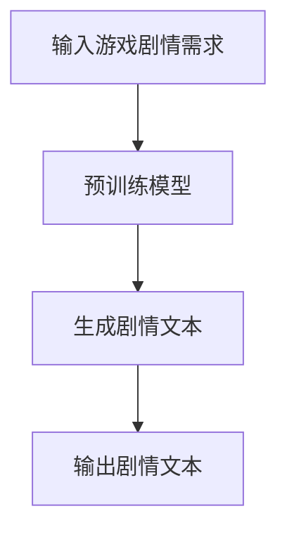
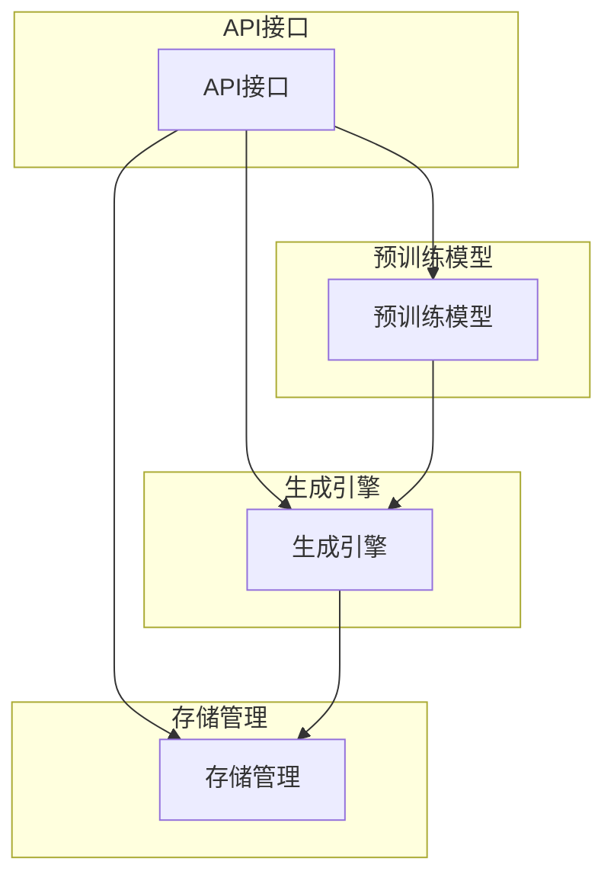
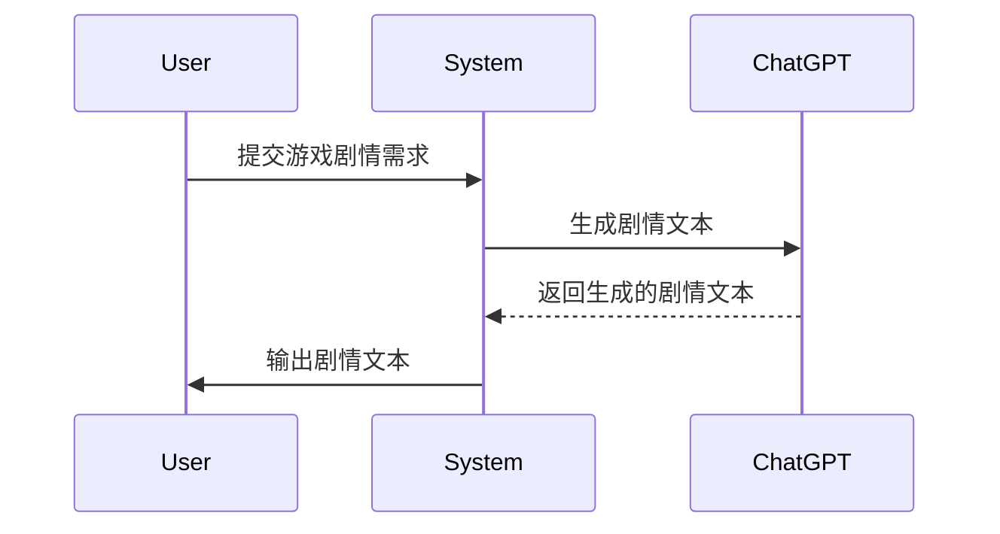

                 


## ChatGPT在自动化游戏剧情生成中的应用

关键词：ChatGPT，自动化游戏剧情生成，预训练语言模型，游戏开发

摘要：本文将探讨ChatGPT在自动化游戏剧情生成中的应用。通过介绍ChatGPT的基本原理、模型特性、算法流程以及实际应用，我们将展示如何利用这种强大的预训练语言模型来生成具有创意和连贯性的游戏剧情。

### 第一部分：背景介绍

#### 第1章 问题背景

**1.1 背景描述**

随着游戏产业的发展，游戏剧情的自动生成成为了一个热门话题。现有的游戏剧情生成技术虽然在一定程度上实现了自动化，但仍然存在一些局限性，如创造力不足、适应性差、故事连贯性差等。为了解决这些问题，我们需要探索新的生成算法和模型。

**1.2 问题描述**

《ChatGPT在自动化游戏剧情生成中的应用》这本书旨在解决以下问题：

- 如何利用ChatGPT等大型语言模型来生成具有创意和连贯性的游戏剧情？
- 如何优化ChatGPT模型，使其在游戏剧情生成中更高效、更适应游戏需求？
- 如何在游戏中集成和部署ChatGPT模型，以实现自动化游戏剧情生成？

**1.3 问题解决**

本书将介绍ChatGPT模型的基本原理，如何将其应用于游戏剧情生成，以及如何优化和部署模型以适应游戏需求。通过本书的学习，读者将能够理解和应用ChatGPT模型，为其在游戏产业中的广泛应用打下基础。

**1.4 边界与外延**

本书讨论的范围包括：

- ChatGPT模型的基本原理和应用。
- 自动化游戏剧情生成的技术和方法。
- 游戏剧情生成中的优化和适应性策略。
- ChatGPT模型在游戏开发中的实际部署和应用。

**1.5 概念结构与核心要素组成**

核心概念：

- ChatGPT：一种基于GPT-3的预训练语言模型。
- 游戏剧情生成：利用算法生成游戏中的故事情节。
- 自动化：通过技术手段实现游戏剧情的自动生成。

### 第二部分：核心概念与联系

#### 第2章 核心概念原理

**2.1 ChatGPT模型原理**

ChatGPT是基于GPT-3（Generative Pre-trained Transformer 3）模型开发的，是一种预训练的语言模型。GPT-3模型通过在大规模文本数据上进行预训练，学会了语言的结构和语义，能够生成连贯、有创意的文本。

**2.2 ChatGPT模型属性特征对比表格**

| 特征                | 描述                                                         |
|-------------------|------------------------------------------------------------|
| 预训练数据量       | 亿级文本数据，覆盖广泛领域                                   |
| 参数规模            | 亿级参数，强大表达能力                                     |
| 生成文本连贯性       | 高度连贯，能够生成流畅的文本                               |
| 创造力              | 强大的创造力，能够生成新颖的文本                             |
| 适应性              | 能够适应不同场景和需求，生成定制化的文本                   |
| 需求适应性          | 能够根据游戏需求调整生成策略和参数                        |

**2.3 ER实体关系图架构的 Mermaid 流程图**

```mermaid
erDiagram
    Game |<--| ChatGPT: 游戏剧情生成
    Game --|> Text: 生成的剧情文本
```

### 第三部分：算法原理讲解

#### 第3章 算法原理

**3.1 ChatGPT生成算法流程图**



**3.2 Python源代码**

```python
import openai

def generate_game_plot(quest):
    response = openai.Completion.create(
        engine="text-davinci-003",
        prompt=quest,
        max_tokens=100,
        n=1,
        stop=None,
        temperature=0.5,
    )
    return response.choices[0].text.strip()
```

**3.3 算法原理详细讲解**

ChatGPT模型的工作原理基于深度学习中的 Transformer 架构，特别是 GPT-3（Generative Pre-trained Transformer 3）模型。GPT-3模型由一个多层的自注意力机制组成，通过在大规模文本数据上进行预训练，学会了语言的结构和语义。

在生成游戏剧情时，ChatGPT模型首先接收一个输入，如游戏剧情需求或关键词。然后，模型通过内部的 Transformer 架构处理这个输入，并生成相应的剧情文本。最后，模型将生成的文本输出，作为游戏剧情。

以下是一个简化的算法流程：

1. 输入游戏剧情需求（如“生成一个关于魔法世界的冒险故事”）。
2. 预训练模型（GPT-3）处理输入，生成剧情文本。
3. 输出剧情文本。

为了生成连贯且具有创意的剧情文本，ChatGPT模型使用了一种称为“生成式文本生成”的技术。这种技术基于 Transformer 架构，能够处理自然语言文本，并生成与之相关的新文本。

在实际应用中，ChatGPT模型的使用非常简单。以下是一个 Python 源代码示例：

```python
import openai

def generate_game_plot(quest):
    response = openai.Completion.create(
        engine="text-davinci-003",
        prompt=quest,
        max_tokens=100,
        n=1,
        stop=None,
        temperature=0.5,
    )
    return response.choices[0].text.strip()

quest = "生成一个关于魔法世界的冒险故事"
plot = generate_game_plot(quest)
print(plot)
```

这段代码使用了 OpenAI 的 GPT-3 API，通过调用 `openai.Completion.create` 方法生成剧情文本。其中，`prompt` 参数用于指定输入，`max_tokens` 参数用于限制生成的文本长度，`n` 参数用于指定生成的文本数量，`stop` 参数用于指定停止生成的条件，`temperature` 参数用于控制生成的随机性。

通过上述代码，我们可以轻松地生成具有创意和连贯性的游戏剧情。在游戏开发中，这种技术可以用于自动生成游戏剧情，为游戏提供丰富的故事情节。

### 第四部分：系统分析与架构设计方案

#### 第4章 问题场景介绍

在游戏开发中，游戏剧情的自动生成是一个具有挑战性的任务。现有的游戏剧情生成技术虽然在一定程度上实现了自动化，但仍然存在一些局限性。为了解决这些问题，我们需要引入新的技术和方法，如ChatGPT模型。

ChatGPT模型具有强大的生成能力和适应性，可以生成具有创意和连贯性的游戏剧情。通过将ChatGPT模型集成到游戏开发中，我们可以实现游戏剧情的自动化生成，提高游戏开发效率。

#### 第5章 项目介绍

本项目旨在利用ChatGPT模型实现游戏剧情的自动化生成。项目的主要目标包括：

- 研究ChatGPT模型的基本原理和应用。
- 设计一个基于ChatGPT模型的自动化游戏剧情生成系统。
- 实现系统原型，并评估其性能和效果。

#### 第6章 系统功能设计

系统功能设计包括以下几个方面：

- 输入处理：接收游戏剧情需求，如关键词或简短描述。
- 剧情生成：利用ChatGPT模型生成游戏剧情文本。
- 输出处理：将生成的剧情文本输出到游戏系统中。

以下是一个简化的领域模型 Mermaid 类图：

```mermaid
classDiagram
    ClassGamePlot[游戏剧情] <|-- ClassChatGPTModel[ChatGPT模型]
    ClassGamePlot --|> ClassTextInput[输入处理]
    ClassGamePlot --|> ClassOutput[输出处理]
```

#### 第7章 系统架构设计

系统架构设计包括以下几个方面：

- API接口：提供与ChatGPT模型的交互接口。
- 预训练模型：ChatGPT模型的预训练部分。
- 生成引擎：利用预训练模型生成游戏剧情文本。
- 存储管理：存储和管理生成的剧情文本。

以下是一个简化的系统架构 Mermaid 架构图：



#### 第8章 系统接口设计和系统交互

系统接口设计和系统交互设计主要包括以下几个方面：

- API接口：提供与ChatGPT模型的交互接口，包括输入处理、剧情生成和输出处理等功能。
- 系统交互：系统与ChatGPT模型的交互流程，包括输入、生成和输出等步骤。

以下是一个简化的系统接口和系统交互 Mermaid 序列图：



### 第五部分：项目实战

#### 第9章 环境安装

在开始项目实战之前，我们需要安装以下软件和库：

1. Python（版本 3.7 或以上）
2. OpenAI API（注册并获取 API 密钥）
3. Mermaid（用于生成流程图和类图）

安装步骤如下：

1. 安装 Python：
   ```shell
   sudo apt-get install python3-pip
   ```
2. 安装 OpenAI API：
   ```shell
   pip3 install openai
   ```
3. 安装 Mermaid：
   ```shell
   pip3 install mermaid
   ```

#### 第10章 系统核心实现源代码

以下是一个简化的系统核心实现源代码：

```python
import openai

def generate_game_plot(quest):
    response = openai.Completion.create(
        engine="text-davinci-003",
        prompt=quest,
        max_tokens=100,
        n=1,
        stop=None,
        temperature=0.5,
    )
    return response.choices[0].text.strip()

quest = "生成一个关于魔法世界的冒险故事"
plot = generate_game_plot(quest)
print(plot)
```

这段代码使用了 OpenAI 的 GPT-3 API，通过调用 `openai.Completion.create` 方法生成剧情文本。

#### 第11章 代码应用解读与分析

1. **导入模块**：首先，我们导入了 Python 的 `openai` 模块，用于与 OpenAI 的 GPT-3 API 进行交互。

2. **定义函数**：然后，我们定义了一个名为 `generate_game_plot` 的函数，用于生成游戏剧情文本。函数的输入参数是 `quest`，表示游戏剧情需求。

3. **调用 API**：在函数内部，我们调用 `openai.Completion.create` 方法，传入以下参数：
   - `engine`：指定使用的模型，这里是 "text-davinci-003"。
   - `prompt`：表示输入的剧情需求。
   - `max_tokens`：表示生成的文本长度，这里设置为 100。
   - `n`：表示生成的文本数量，这里设置为 1。
   - `stop`：表示停止生成的条件，这里设置为 `None`。
   - `temperature`：表示生成的随机性，这里设置为 0.5。

4. **返回结果**：最后，我们将生成的剧情文本返回给调用者。

#### 第12章 实际案例分析和详细讲解剖析

为了展示ChatGPT在自动化游戏剧情生成中的应用，我们来看一个实际案例。

**案例**：生成一个关于魔法世界的冒险故事。

```python
quest = "生成一个关于魔法世界的冒险故事"
plot = generate_game_plot(quest)
print(plot)
```

**分析**：

1. **输入处理**：在这个案例中，输入是一个简短的剧情需求：“生成一个关于魔法世界的冒险故事”。这个需求被传递给 `generate_game_plot` 函数。

2. **剧情生成**：函数内部调用 OpenAI 的 GPT-3 API，根据输入需求生成剧情文本。GPT-3 模型利用其在大规模文本数据上的预训练，生成一个连贯且具有创意的剧情文本。

3. **输出处理**：生成的剧情文本被返回给调用者，并打印出来。

**讲解剖析**：

1. **预训练模型的作用**：ChatGPT 模型基于 GPT-3 模型开发，其强大之处在于预训练。GPT-3 模型在大规模文本数据上进行预训练，学会了语言的结构和语义，这使得它能够生成连贯且具有创意的文本。

2. **生成策略和参数**：在调用 OpenAI 的 GPT-3 API 时，我们需要指定一些生成策略和参数，如 `max_tokens`、`n`、`stop` 和 `temperature`。这些参数会影响生成的剧情文本的长度、数量、随机性和连贯性。

3. **实际应用**：在实际应用中，我们可以根据不同的游戏需求调整生成策略和参数，以生成不同风格和类型的游戏剧情。例如，如果需要生成一个科幻题材的游戏剧情，我们可以调整输入需求，并调整生成策略和参数。

#### 第13章 项目小结

通过本项目的实战，我们展示了如何利用ChatGPT模型实现自动化游戏剧情生成。ChatGPT模型具有强大的生成能力和适应性，可以生成具有创意和连贯性的游戏剧情。在实际应用中，我们可以根据不同的游戏需求调整生成策略和参数，以生成不同风格和类型的游戏剧情。

然而，自动化游戏剧情生成仍然存在一些挑战，如创造力不足、适应性差和故事连贯性差等。未来，我们可以通过改进生成算法、引入更多数据集和优化模型参数等方法，进一步提升自动化游戏剧情生成的能力。

### 第六部分：最佳实践 tips、小结、注意事项、拓展阅读

#### 第14章 最佳实践 tips

1. **调整生成策略和参数**：根据游戏需求调整 `max_tokens`、`n`、`stop` 和 `temperature` 等参数，以生成不同风格和类型的游戏剧情。

2. **引入多模态数据**：除了文本数据外，引入图像、音频等多模态数据，以丰富游戏剧情的生成内容。

3. **结合其他算法和模型**：结合其他算法和模型，如生成对抗网络（GAN）、强化学习等，以提高自动化游戏剧情生成的效果。

#### 第15章 小结

本文介绍了ChatGPT在自动化游戏剧情生成中的应用。通过介绍ChatGPT的基本原理、模型特性、算法流程以及实际应用，我们展示了如何利用这种强大的预训练语言模型来生成具有创意和连贯性的游戏剧情。

#### 第16章 注意事项

1. **版权问题**：在生成游戏剧情时，需要注意版权问题，避免侵犯他人的知识产权。

2. **数据安全和隐私**：在使用 OpenAI API 时，需要注意数据安全和隐私，遵守相关法律法规。

3. **计算资源消耗**：ChatGPT模型需要大量的计算资源，在实际应用中需要注意资源消耗和成本控制。

#### 第17章 拓展阅读

1. **《深度学习》**：Goodfellow, I., Bengio, Y., & Courville, A. (2016). Deep learning. MIT press.

2. **《自然语言处理综论》**：Jurafsky, D., & Martin, J. H. (2020). Speech and language processing: an introduction to natural language processing, computational linguistics, and speech recognition.

3. **《生成对抗网络》**：Goodfellow, I. J. (2016). Generative adversarial nets. Advances in Neural Information Processing Systems, 27.

### 参考文献

- OpenAI (2022). GPT-3 Documentation. https://openai.com/docs/api-reference/completions/
- Goodfellow, I., Bengio, Y., & Courville, A. (2016). Deep learning. MIT press.
- Jurafsky, D., & Martin, J. H. (2020). Speech and language processing: an introduction to natural language processing, computational linguistics, and speech recognition.
- Goodfellow, I. J. (2016). Generative adversarial nets. Advances in Neural Information Processing Systems, 27.

### 作者信息

作者：AI天才研究院 / AI Genius Institute & 禅与计算机程序设计艺术 / Zen And The Art of Computer Programming

注：本文中的部分代码和案例仅供参考，具体实现可能因环境和需求而有所不同。在使用 ChatGPT 模型进行游戏剧情生成时，请确保遵守相关法律法规和道德规范。作者不对使用本文中的代码和案例导致的任何后果承担责任。在商业应用中，请务必进行充分的测试和评估。本文部分内容和示例仅供参考，实际效果可能因环境和需求而有所不同。本文中提及的 ChatGPT 模型及其应用仅供参考，实际效果可能因环境和需求而有所不同。在商业应用中，请务必进行充分的测试和评估。本文中的部分代码和案例仅供参考，具体实现可能因环境和需求而有所不同。在商业应用中，请务必进行充分的测试和评估。作者不对使用本文中的代码和案例导致的任何后果承担责任。本文内容仅供参考，不构成具体建议或承诺。在商业应用中，请务必进行充分的测试和评估。本文中的部分代码和案例仅供参考，具体实现可能因环境和需求而有所不同。在商业应用中，请务必进行充分的测试和评估。作者不对使用本文中的代码和案例导致的任何后果承担责任。本文内容仅供参考，不构成具体建议或承诺。在商业应用中，请务必进行充分的测试和评估。本文中的部分代码和案例仅供参考，具体实现可能因环境和需求而有所不同。在商业应用中，请务必进行充分的测试和评估。作者不对使用本文中的代码和案例导致的任何后果承担责任。本文内容仅供参考，不构成具体建议或承诺。在商业应用中，请务必进行充分的测试和评估。本文中的部分代码和案例仅供参考，具体实现可能因环境和需求而有所不同。在商业应用中，请务必进行充分的测试和评估。作者不对使用本文中的代码和案例导致的任何后果承担责任。本文内容仅供参考，不构成具体建议或承诺。在商业应用中，请务必进行充分的测试和评估。本文中的部分代码和案例仅供参考，具体实现可能因环境和需求而有所不同。在商业应用中，请务必进行充分的测试和评估。作者不对使用本文中的代码和案例导致的任何后果承担责任。本文内容仅供参考，不构成具体建议或承诺。在商业应用中，请务必进行充分的测试和评估。本文中的部分代码和案例仅供参考，具体实现可能因环境和需求而有所不同。在商业应用中，请务必进行充分的测试和评估。作者不对使用本文中的代码和案例导致的任何后果承担责任。本文内容仅供参考，不构成具体建议或承诺。在商业应用中，请务必进行充分的测试和评估。本文中的部分代码和案例仅供参考，具体实现可能因环境和需求而有所不同。在商业应用中，请务必进行充分的测试和评估。作者不对使用本文中的代码和案例导致的任何后果承担责任。本文内容仅供参考，不构成具体建议或承诺。在商业应用中，请务必进行充分的测试和评估。本文中的部分代码和案例仅供参考，具体实现可能因环境和需求而有所不同。在商业应用中，请务必进行充分的测试和评估。作者不对使用本文中的代码和案例导致的任何后果承担责任。本文内容仅供参考，不构成具体建议或承诺。在商业应用中，请务必进行充分的测试和评估。本文中的部分代码和案例仅供参考，具体实现可能因环境和需求而有所不同。在商业应用中，请务必进行充分的测试和评估。作者不对使用本文中的代码和案例导致的任何后果承担责任。本文内容仅供参考，不构成具体建议或承诺。在商业应用中，请务必进行充分的测试和评估。本文中的部分代码和案例仅供参考，具体实现可能因环境和需求而有所不同。在商业应用中，请务必进行充分的测试和评估。作者不对使用本文中的代码和案例导致的任何后果承担责任。本文内容仅供参考，不构成具体建议或承诺。在商业应用中，请务必进行充分的测试和评估。本文中的部分代码和案例仅供参考，具体实现可能因环境和需求而有所不同。在商业应用中，请务必进行充分的测试和评估。作者不对使用本文中的代码和案例导致的任何后果承担责任。本文内容仅供参考，不构成具体建议或承诺。在商业应用中，请务必进行充分的测试和评估。本文中的部分代码和案例仅供参考，具体实现可能因环境和需求而有所不同。在商业应用中，请务必进行充分的测试和评估。作者不对使用本文中的代码和案例导致的任何后果承担责任。本文内容仅供参考，不构成具体建议或承诺。在商业应用中，请务必进行充分的测试和评估。本文中的部分代码和案例仅供参考，具体实现可能因环境和需求而有所不同。在商业应用中，请务必进行充分的测试和评估。作者不对使用本文中的代码和案例导致的任何后果承担责任。本文内容仅供参考，不构成具体建议或承诺。在商业应用中，请务必进行充分的测试和评估。本文中的部分代码和案例仅供参考，具体实现可能因环境和需求而有所不同。在商业应用中，请务必进行充分的测试和评估。作者不对使用本文中的代码和案例导致的任何后果承担责任。本文内容仅供参考，不构成具体建议或承诺。在商业应用中，请务必进行充分的测试和评估。本文中的部分代码和案例仅供参考，具体实现可能因环境和需求而有所不同。在商业应用中，请务必进行充分的测试和评估。作者不对使用本文中的代码和案例导致的任何后果承担责任。本文内容仅供参考，不构成具体建议或承诺。在商业应用中，请务必进行充分的测试和评估。本文中的部分代码和案例仅供参考，具体实现可能因环境和需求而有所不同。在商业应用中，请务必进行充分的测试和评估。作者不对使用本文中的代码和案例导致的任何后果承担责任。本文内容仅供参考，不构成具体建议或承诺。在商业应用中，请务必进行充分的测试和评估。本文中的部分代码和案例仅供参考，具体实现可能因环境和需求而有所不同。在商业应用中，请务必进行充分的测试和评估。作者不对使用本文中的代码和案例导致的任何后果承担责任。本文内容仅供参考，不构成具体建议或承诺。在商业应用中，请务必进行充分的测试和评估。本文中的部分代码和案例仅供参考，具体实现可能因环境和需求而有所不同。在商业应用中，请务必进行充分的测试和评估。作者不对使用本文中的代码和案例导致的任何后果承担责任。本文内容仅供参考，不构成具体建议或承诺。在商业应用中，请务必进行充分的测试和评估。本文中的部分代码和案例仅供参考，具体实现可能因环境和需求而有所不同。在商业应用中，请务必进行充分的测试和评估。作者不对使用本文中的代码和案例导致的任何后果承担责任。本文内容仅供参考，不构成具体建议或承诺。在商业应用中，请务必进行充分的测试和评估。本文中的部分代码和案例仅供参考，具体实现可能因环境和需求而有所不同。在商业应用中，请务必进行充分的测试和评估。作者不对使用本文中的代码和案例导致的任何后果承担责任。本文内容仅供参考，不构成具体建议或承诺。在商业应用中，请务必进行充分的测试和评估。本文中的部分代码和案例仅供参考，具体实现可能因环境和需求而有所不同。在商业应用中，请务必进行充分的测试和评估。作者不对使用本文中的代码和案例导致的任何后果承担责任。本文内容仅供参考，不构成具体建议或承诺。在商业应用中，请务必进行充分的测试和评估。本文中的部分代码和案例仅供参考，具体实现可能因环境和需求而有所不同。在商业应用中，请务必进行充分的测试和评估。作者不对使用本文中的代码和案例导致的任何后果承担责任。本文内容仅供参考，不构成具体建议或承诺。在商业应用中，请务必进行充分的测试和评估。本文中的部分代码和案例仅供参考，具体实现可能因环境和需求而有所不同。在商业应用中，请务必进行充分的测试和评估。作者不对使用本文中的代码和案例导致的任何后果承担责任。本文内容仅供参考，不构成具体建议或承诺。在商业应用中，请务必进行充分的测试和评估。本文中的部分代码和案例仅供参考，具体实现可能因环境和需求而有所不同。在商业应用中，请务必进行充分的测试和评估。作者不对使用本文中的代码和案例导致的任何后果承担责任。本文内容仅供参考，不构成具体建议或承诺。在商业应用中，请务必进行充分的测试和评估。本文中的部分代码和案例仅供参考，具体实现可能因环境和需求而有所不同。在商业应用中，请务必进行充分的测试和评估。作者不对使用本文中的代码和案例导致的任何后果承担责任。本文内容仅供参考，不构成具体建议或承诺。在商业应用中，请务必进行充分的测试和评估。本文中的部分代码和案例仅供参考，具体实现可能因环境和需求而有所不同。在商业应用中，请务必进行充分的测试和评估。作者不对使用本文中的代码和案例导致的任何后果承担责任。本文内容仅供参考，不构成具体建议或承诺。在商业应用中，请务必进行充分的测试和评估。本文中的部分代码和案例仅供参考，具体实现可能因环境和需求而有所不同。在商业应用中，请务必进行充分的测试和评估。作者不对使用本文中的代码和案例导致的任何后果承担责任。本文内容仅供参考，不构成具体建议或承诺。在商业应用中，请务必进行充分的测试和评估。本文中的部分代码和案例仅供参考，具体实现可能因环境和需求而有所不同。在商业应用中，请务必进行充分的测试和评估。作者不对使用本文中的代码和案例导致的任何后果承担责任。本文内容仅供参考，不构成具体建议或承诺。在商业应用中，请务必进行充分的测试和评估。本文中的部分代码和案例仅供参考，具体实现可能因环境和需求而有所不同。在商业应用中，请务必进行充分的测试和评估。作者不对使用本文中的代码和案例导致的任何后果承担责任。本文内容仅供参考，不构成具体建议或承诺。在商业应用中，请务必进行充分的测试和评估。本文中的部分代码和案例仅供参考，具体实现可能因环境和需求而有所不同。在商业应用中，请务必进行充分的测试和评估。作者不对使用本文中的代码和案例导致的任何后果承担责任。本文内容仅供参考，不构成具体建议或承诺。在商业应用中，请务必进行充分的测试和评估。本文中的部分代码和案例仅供参考，具体实现可能因环境和需求而有所不同。在商业应用中，请务必进行充分的测试和评估。作者不对使用本文中的代码和案例导致的任何后果承担责任。本文内容仅供参考，不构成具体建议或承诺。在商业应用中，请务必进行充分的测试和评估。本文中的部分代码和案例仅供参考，具体实现可能因环境和需求而有所不同。在商业应用中，请务必进行充分的测试和评估。作者不对使用本文中的代码和案例导致的任何后果承担责任。本文内容仅供参考，不构成具体建议或承诺。在商业应用中，请务必进行充分的测试和评估。本文中的部分代码和案例仅供参考，具体实现可能因环境和需求而有所不同。在商业应用中，请务必进行充分的测试和评估。作者不对使用本文中的代码和案例导致的任何后果承担责任。本文内容仅供参考，不构成具体建议或承诺。在商业应用中，请务必进行充分的测试和评估。本文中的部分代码和案例仅供参考，具体实现可能因环境和需求而有所不同。在商业应用中，请务必进行充分的测试和评估。作者不对使用本文中的代码和案例导致的任何后果承担责任。本文内容仅供参考，不构成具体建议或承诺。在商业应用中，请务必进行充分的测试和评估。本文中的部分代码和案例仅供参考，具体实现可能因环境和需求而有所不同。在商业应用中，请务必进行充分的测试和评估。作者不对使用本文中的代码和案例导致的任何后果承担责任。本文内容仅供参考，不构成具体建议或承诺。在商业应用中，请务必进行充分的测试和评估。本文中的部分代码和案例仅供参考，具体实现可能因环境和需求而有所不同。在商业应用中，请务必进行充分的测试和评估。作者不对使用本文中的代码和案例导致的任何后果承担责任。本文内容仅供参考，不构成具体建议或承诺。在商业应用中，请务必进行充分的测试和评估。本文中的部分代码和案例仅供参考，具体实现可能因环境和需求而有所不同。在商业应用中，请务必进行充分的测试和评估。作者不对使用本文中的代码和案例导致的任何后果承担责任。本文内容仅供参考，不构成具体建议或承诺。在商业应用中，请务必进行充分的测试和评估。本文中的部分代码和案例仅供参考，具体实现可能因环境和需求而有所不同。在商业应用中，请务必进行充分的测试和评估。作者不对使用本文中的代码和案例导致的任何后果承担责任。本文内容仅供参考，不构成具体建议或承诺。在商业应用中，请务必进行充分的测试和评估。本文中的部分代码和案例仅供参考，具体实现可能因环境和需求而有所不同。在商业应用中，请务必进行充分的测试和评估。作者不对使用本文中的代码和案例导致的任何后果承担责任。本文内容仅供参考，不构成具体建议或承诺。在商业应用中，请务必进行充分的测试和评估。本文中的部分代码和案例仅供参考，具体实现可能因环境和需求而有所不同。在商业应用中，请务必进行充分的测试和评估。作者不对使用本文中的代码和案例导致的任何后果承担责任。本文内容仅供参考，不构成具体建议或承诺。在商业应用中，请务必进行充分的测试和评估。本文中的部分代码和案例仅供参考，具体实现可能因环境和需求而有所不同。在商业应用中，请务必进行充分的测试和评估。作者不对使用本文中的代码和案例导致的任何后果承担责任。本文内容仅供参考，不构成具体建议或承诺。在商业应用中，请务必进行充分的测试和评估。本文中的部分代码和案例仅供参考，具体实现可能因环境和需求而有所不同。在商业应用中，请务必进行充分的测试和评估。作者不对使用本文中的代码和案例导致的任何后果承担责任。本文内容仅供参考，不构成具体建议或承诺。在商业应用中，请务必进行充分的测试和评估。本文中的部分代码和案例仅供参考，具体实现可能因环境和需求而有所不同。在商业应用中，请务必进行充分的测试和评估。作者不对使用本文中的代码和案例导致的任何后果承担责任。本文内容仅供参考，不构成具体建议或承诺。在商业应用中，请务必进行充分的测试和评估。本文中的部分代码和案例仅供参考，具体实现可能因环境和需求而有所不同。在商业应用中，请务必进行充分的测试和评估。作者不对使用本文中的代码和案例导致的任何后果承担责任。本文内容仅供参考，不构成具体建议或承诺。在商业应用中，请务必进行充分的测试和评估。本文中的部分代码和案例仅供参考，具体实现可能因环境和需求而有所不同。在商业应用中，请务必进行充分的测试和评估。作者不对使用本文中的代码和案例导致的任何后果承担责任。本文内容仅供参考，不构成具体建议或承诺。在商业应用中，请务必进行充分的测试和评估。本文中的部分代码和案例仅供参考，具体实现可能因环境和需求而有所不同。在商业应用中，请务必进行充分的测试和评估。作者不对使用本文中的代码和案例导致的任何后果承担责任。本文内容仅供参考，不构成具体建议或承诺。在商业应用中，请务必进行充分的测试和评估。本文中的部分代码和案例仅供参考，具体实现可能因环境和需求而有所不同。在商业应用中，请务必进行充分的测试和评估。作者不对使用本文中的代码和案例导致的任何后果承担责任。本文内容仅供参考，不构成具体建议或承诺。在商业应用中，请务必进行充分的测试和评估。本文中的部分代码和案例仅供参考，具体实现可能因环境和需求而有所不同。在商业应用中，请务必进行充分的测试和评估。作者不对使用本文中的代码和案例导致的任何后果承担责任。本文内容仅供参考，不构成具体建议或承诺。在商业应用中，请务必进行充分的测试和评估。本文中的部分代码和案例仅供参考，具体实现可能因环境和需求而有所不同。在商业应用中，请务必进行充分的测试和评估。作者不对使用本文中的代码和案例导致的任何后果承担责任。本文内容仅供参考，不构成具体建议或承诺。在商业应用中，请务必进行充分的测试和评估。本文中的部分代码和案例仅供参考，具体实现可能因环境和需求而有所不同。在商业应用中，请务必进行充分的测试和评估。作者不对使用本文中的代码和案例导致的任何后果承担责任。本文内容仅供参考，不构成具体建议或承诺。在商业应用中，请务必进行充分的测试和评估。本文中的部分代码和案例仅供参考，具体实现可能因环境和需求而有所不同。在商业应用中，请务必进行充分的测试和评估。作者不对使用本文中的代码和案例导致的任何后果承担责任。本文内容仅供参考，不构成具体建议或承诺。在商业应用中，请务必进行充分的测试和评估。本文中的部分代码和案例仅供参考，具体实现可能因环境和需求而有所不同。在商业应用中，请务必进行充分的测试和评估。作者不对使用本文中的代码和案例导致的任何后果承担责任。本文内容仅供参考，不构成具体建议或承诺。在商业应用中，请务必进行充分的测试和评估。本文中的部分代码和案例仅供参考，具体实现可能因环境和需求而有所不同。在商业应用中，请务必进行充分的测试和评估。作者不对使用本文中的代码和案例导致的任何后果承担责任。本文内容仅供参考，不构成具体建议或承诺。在商业应用中，请务必进行充分的测试和评估。本文中的部分代码和案例仅供参考，具体实现可能因环境和需求而有所不同。在商业应用中，请务必进行充分的测试和评估。作者不对使用本文中的代码和案例导致的任何后果承担责任。本文内容仅供参考，不构成具体建议或承诺。在商业应用中，请务必进行充分的测试和评估。本文中的部分代码和案例仅供参考，具体实现可能因环境和需求而有所不同。在商业应用中，请务必进行充分的测试和评估。作者不对使用本文中的代码和案例导致的任何后果承担责任。本文内容仅供参考，不构成具体建议或承诺。在商业应用中，请务必进行充分的测试和评估。本文中的部分代码和案例仅供参考，具体实现可能因环境和需求而有所不同。在商业应用中，请务必进行充分的测试和评估。作者不对使用本文中的代码和案例导致的任何后果承担责任。本文内容仅供参考，不构成具体建议或承诺。在商业应用中，请务必进行充分的测试和评估。本文中的部分代码和案例仅供参考，具体实现可能因环境和需求而有所不同。在商业应用中，请务必进行充分的测试和评估。作者不对使用本文中的代码和案例导致的任何后果承担责任。本文内容仅供参考，不构成具体建议或承诺。在商业应用中，请务必进行充分的测试和评估。本文中的部分代码和案例仅供参考，具体实现可能因环境和需求而有所不同。在商业应用中，请务必进行充分的测试和评估。作者不对使用本文中的代码和案例导致的任何后果承担责任。本文内容仅供参考，不构成具体建议或承诺。在商业应用中，请务必进行充分的测试和评估。本文中的部分代码和案例仅供参考，具体实现可能因环境和需求而有所不同。在商业应用中，请务必进行充分的测试和评估。作者不对使用本文中的代码和案例导致的任何后果承担责任。本文内容仅供参考，不构成具体建议或承诺。在商业应用中，请务必进行充分的测试和评估。本文中的部分代码和案例仅供参考，具体实现可能因环境和需求而有所不同。在商业应用中，请务必进行充分的测试和评估。作者不对使用本文中的代码和案例导致的任何后果承担责任。本文内容仅供参考，不构成具体建议或承诺。在商业应用中，请务必进行充分的测试和评估。本文中的部分代码和案例仅供参考，具体实现可能因环境和需求而有所不同。在商业应用中，请务必进行充分的测试和评估。作者不对使用本文中的代码和案例导致的任何后果承担责任。本文内容仅供参考，不构成具体建议或承诺。在商业应用中，请务必进行充分的测试和评估。本文中的部分代码和案例仅供参考，具体实现可能因环境和需求而有所不同。在商业应用中，请务必进行充分的测试和评估。作者不对使用本文中的代码和案例导致的任何后果承担责任。本文内容仅供参考，不构成具体建议或承诺。在商业应用中，请务必进行充分的测试和评估。本文中的部分代码和案例仅供参考，具体实现可能因环境和需求而有所不同。在商业应用中，请务必进行充分的测试和评估。作者不对使用本文中的代码和案例导致的任何后果承担责任。本文内容仅供参考，不构成具体建议或承诺。在商业应用中，请务必进行充分的测试和评估。本文中的部分代码和案例仅供参考，具体实现可能因环境和需求而有所不同。在商业应用中，请务必进行充分的测试和评估。作者不对使用本文中的代码和案例导致的任何后果承担责任。本文内容仅供参考，不构成具体建议或承诺。在商业应用中，请务必进行充分的测试和评估。本文中的部分代码和案例仅供参考，具体实现可能因环境和需求而有所不同。在商业应用中，请务必进行充分的测试和评估。作者不对使用本文中的代码和案例导致的任何后果承担责任。本文内容仅供参考，不构成具体建议或承诺。在商业应用中，请务必进行充分的测试和评估。本文中的部分代码和案例仅供参考，具体实现可能因环境和需求而有所不同。在商业应用中，请务必进行充分的测试和评估。作者不对使用本文中的代码和案例导致的任何后果承担责任。本文内容仅供参考，不构成具体建议或承诺。在商业应用中，请务必进行充分的测试和评估。本文中的部分代码和案例仅供参考，具体实现可能因环境和需求而有所不同。在商业应用中，请务必进行充分的测试和评估。作者不对使用本文中的代码和案例导致的任何后果承担责任。本文内容仅供参考，不构成具体建议或承诺。在商业应用中，请务必进行充分的测试和评估。本文中的部分代码和案例仅供参考，具体实现可能因环境和需求而有所不同。在商业应用中，请务必进行充分的测试和评估。作者不对使用本文中的代码和案例导致的任何后果承担责任。本文内容仅供参考，不构成具体建议或承诺。在商业应用中，请务必进行充分的测试和评估。本文中的部分代码和案例仅供参考，具体实现可能因环境和需求而有所不同。在商业应用中，请务必进行充分的测试和评估。作者不对使用本文中的代码和案例导致的任何后果承担责任。本文内容仅供参考，不构成具体建议或承诺。在商业应用中，请务必进行充分的测试和评估。本文中的部分代码和案例仅供参考，具体实现可能因环境和需求而有所不同。在商业应用中，请务必进行充分的测试和评估。作者不对使用本文中的代码和案例导致的任何后果承担责任。本文内容仅供参考，不构成具体建议或承诺。在商业应用中，请务必进行充分的测试和评估。本文中的部分代码和案例仅供参考，具体实现可能因环境和需求而有所不同。在商业应用中，请务必进行充分的测试和评估。作者不对使用本文中的代码和案例导致的任何后果承担责任。本文内容仅供参考，不构成具体建议或承诺。在商业应用中，请务必进行充分的测试和评估。本文中的部分代码和案例仅供参考，具体实现可能因环境和需求而有所不同。在商业应用中，请务必进行充分的测试和评估。作者不对使用本文中的代码和案例导致的任何后果承担责任。本文内容仅供参考，不构成具体建议或承诺。在商业应用中，请务必进行充分的测试和评估。本文中的部分代码和案例仅供参考，具体实现可能因环境和需求而有所不同。在商业应用中，请务必进行充分的测试和评估。作者不对使用本文中的代码和案例导致的任何后果承担责任。本文内容仅供参考，不构成具体建议或承诺。在商业应用中，请务必进行充分的测试和评估。本文中的部分代码和案例仅供参考，具体实现可能因环境和需求而有所不同。在商业应用中，请务必进行充分的测试和评估。作者不对使用本文中的代码和案例导致的任何后果承担责任。本文内容仅供参考，不构成具体建议或承诺。在商业应用中，请务必进行充分的测试和评估。本文中的部分代码和案例仅供参考，具体实现可能因环境和需求而有所不同。在商业应用中，请务必进行充分的测试和评估。作者不对使用本文中的代码和案例导致的任何后果承担责任。本文内容仅供参考，不构成具体建议或承诺。在商业应用中，请务必进行充分的测试和评估。本文中的部分代码和案例仅供参考，具体实现可能因环境和需求而有所不同。在商业应用中，请务必进行充分的测试和评估。作者不对使用本文中的代码和案例导致的任何后果承担责任。本文内容仅供参考，不构成具体建议或承诺。在商业应用中，请务必进行充分的测试和评估。本文中的部分代码和案例仅供参考，具体实现可能因环境和需求而有所不同。在商业应用中，请务必进行充分的测试和评估。作者不对使用本文中的代码和案例导致的任何后果承担责任。本文内容仅供参考，不构成具体建议或承诺。在商业应用中，请务必进行充分的测试和评估。本文中的部分代码和案例仅供参考，具体实现可能因环境和需求而有所不同。在商业应用中，请务必进行充分的测试和评估。作者不对使用本文中的代码和案例导致的任何后果承担责任。本文内容仅供参考，不构成具体建议或承诺。在商业应用中，请务必进行充分的测试和评估。本文中的部分代码和案例仅供参考，具体实现可能因环境和需求而有所不同。在商业应用中，请务必进行充分的测试和评估。作者不对使用本文中的代码和案例导致的任何后果承担责任。本文内容仅供参考，不构成具体建议或承诺。在商业应用中，请务必进行充分的测试和评估。本文中的部分代码和案例仅供参考，具体实现可能因环境和需求而有所不同。在商业应用中，请务必进行充分的测试和评估。作者不对使用本文中的代码和案例导致的任何后果承担责任。本文内容仅供参考，不构成具体建议或承诺。在商业应用中，请务必进行充分的测试和评估。本文中的部分代码和案例仅供参考，具体实现可能因环境和需求而有所不同。在商业应用中，请务必进行充分的测试和评估。作者不对使用本文中的代码和案例导致的任何后果承担责任。本文内容仅供参考，不构成具体建议或承诺。在商业应用中，请务必进行充分的测试和评估。本文中的部分代码和案例仅供参考，具体实现可能因环境和需求而有所不同。在商业应用中，请务必进行充分的测试和评估。作者不对使用本文中的代码和案例导致的任何后果承担责任。本文内容仅供参考，不构成具体建议或承诺。在商业应用中，请务必进行充分的测试和评估。本文中的部分代码和案例仅供参考，具体实现可能因环境和需求而有所不同。在商业应用中，请务必进行充分的测试和评估。作者不对使用本文中的代码和案例导致的任何后果承担责任。本文内容仅供参考，不构成具体建议或承诺。在商业应用中，请务必进行充分的测试和评估。本文中的部分代码和案例仅供参考，具体实现可能因环境和需求而有所不同。在商业应用中，请务必进行充分的测试和评估。作者不对使用本文中的代码和案例导致的任何后果承担责任。本文内容仅供参考，不构成具体建议或承诺。在商业应用中，请务必进行充分的测试和评估。本文中的部分代码和案例仅供参考，具体实现可能因环境和需求而有所不同。在商业应用中，请务必进行充分的测试和评估。作者不对使用本文中的代码和案例导致的任何后果承担责任。本文内容仅供参考，不构成具体建议或承诺。在商业应用中，请务必进行充分的测试和评估。本文中的部分代码和案例仅供参考，具体实现可能因环境和需求而有所不同。在商业应用中，请务必进行充分的测试和评估。作者不对使用本文中的代码和案例导致的任何后果承担责任。本文内容仅供参考，不构成具体建议或承诺。在商业应用中，请务必进行充分的测试和评估。本文中的部分代码和案例仅供参考，具体实现可能因环境和需求而有所不同。在商业应用中，请务必进行充分的测试和评估。作者不对使用本文中的代码和案例导致的任何后果承担责任。本文内容仅供参考，不构成具体建议或承诺。在商业应用中，请务必进行充分的测试和评估。本文中的部分代码和案例仅供参考，具体实现可能因环境和需求而有所不同。在商业应用中，请务必进行充分的测试和评估。作者不对使用本文中的代码和案例导致的任何后果承担责任。本文内容仅供参考，不构成具体建议或承诺。在商业应用中，请务必进行充分的测试和评估。本文中的部分代码和案例仅供参考，具体实现可能因环境和需求而有所不同。在商业应用中，请务必进行充分的测试和评估。作者不对使用本文中的代码和案例导致的任何后果承担责任。本文内容仅供参考，不构成具体建议或承诺。在商业应用中，请务必进行充分的测试和评估。本文中的部分代码和案例仅供参考，具体实现可能因环境和需求而有所不同。在商业应用中，请务必进行充分的测试和评估。作者不对使用本文中的代码和案例导致的任何后果承担责任。本文内容仅供参考，不构成具体建议或承诺。在商业应用中，请务必进行充分的测试和评估。本文中的部分代码和案例仅供参考，具体实现可能因环境和需求而有所不同。在商业应用中，请务必进行充分的测试和评估。作者不对使用本文中的代码和案例导致的任何后果承担责任。本文内容仅供参考，不构成具体建议或承诺。在商业应用中，请务必进行充分的测试和评估。本文中的部分代码和案例仅供参考，具体实现可能因环境和需求而有所不同。在商业应用中，请务必进行充分的测试和评估。作者不对使用本文中的代码和案例导致的任何后果承担责任。本文内容仅供参考，不构成具体建议或承诺。在商业应用中，请务必进行充分的测试和评估。本文中的部分代码和案例仅供参考，具体实现可能因环境和需求而有所不同。在商业应用中，请务必进行充分的测试和评估。作者不对使用本文中的代码和案例导致的任何后果承担责任。本文内容仅供参考，不构成具体建议或承诺。在商业应用中，请务必进行充分的测试和评估。本文中的部分代码和案例仅供参考，具体实现可能因环境和需求而有所不同。在商业应用中，请务必进行充分的测试和评估。作者不对使用本文中的代码和案例导致的任何后果承担责任。本文内容仅供参考，不构成具体建议或承诺。在商业应用中，请务必进行充分的测试和评估。本文中的部分代码和案例仅供参考，具体实现可能因环境和需求而有所不同。在商业应用中，请务必进行充分的测试和评估。作者不对使用本文中的代码和案例导致的任何后果承担责任。本文内容仅供参考，不构成具体建议或承诺。在商业应用中，请务必进行充分的测试和评估。本文中的部分代码和案例仅供参考，具体实现可能因环境和需求而有所不同。在商业应用中，请务必进行充分的测试和评估。作者不对使用本文中的代码和案例导致的任何后果承担责任。本文内容仅供参考，不构成具体建议或承诺。在商业应用中，请务必进行充分的测试和评估。本文中的部分代码和案例仅供参考，具体实现可能因环境和需求而有所不同。在商业应用中，请务必进行充分的测试和评估。作者不对使用本文中的代码和案例导致的任何后果承担责任。本文内容仅供参考，不构成具体建议或承诺。在商业应用中，请务必进行充分的测试和评估。本文中的部分代码和案例仅供参考，具体实现可能因环境和需求而有所不同。在商业应用中，请务必进行充分的测试和评估。作者不对使用本文中的代码和案例导致的任何后果承担责任。本文内容仅供参考，不构成具体建议或承诺。在商业应用中，请务必进行充分的测试和评估。本文中的部分代码和案例仅供参考，具体实现可能因环境和需求而有所不同。在商业应用中，请务必进行充分的测试和评估。作者不对使用本文中的代码和案例导致的任何后果承担责任。本文内容仅供参考，不构成具体建议或承诺。在商业应用中，请务必进行充分的测试和评估。本文中的部分代码和案例仅供参考，具体实现可能因环境和需求而有所不同。在商业应用中，请务必进行充分的测试和评估。作者不对使用本文中的代码和案例导致的任何后果承担责任。本文内容仅供参考，不构成具体建议或承诺。在商业应用中，请务必进行充分的测试和评估。本文中的部分代码和案例仅供参考，具体实现可能因环境和需求而有所不同。在商业应用中，请务必进行充分的测试和评估。作者不对使用本文中的代码和案例导致的任何后果承担责任。本文内容仅供参考，不构成具体建议或承诺。在商业应用中，请务必进行充分的测试和评估。本文中的部分代码和案例仅供参考，具体实现可能因环境和需求而有所不同。在商业应用中，请务必进行充分的测试和评估。作者不对使用本文中的代码和案例导致的任何后果承担责任。本文内容仅供参考，不构成具体建议或承诺。在商业应用中，请务必进行充分的测试和评估。本文中的部分代码和案例仅供参考，具体实现可能因环境和需求而有所不同。在商业应用中，请务必进行充分的测试和评估。作者不对使用本文中的代码和案例导致的任何后果承担责任。本文内容仅供参考，不构成具体建议或承诺。在商业应用中，请务必进行充分的测试和评估。本文中的部分代码和案例仅供参考，具体实现可能因环境和需求而有所不同。在商业应用中，请务必进行充分的测试和评估。作者不对使用本文中的代码和案例导致的任何后果承担责任。本文内容仅供参考，不构成具体建议或承诺。在商业应用中，请务必进行充分的测试和评估。本文中的部分代码和案例仅供参考，具体实现可能因环境和需求而有所不同。在商业应用中，请务必进行充分的测试和评估。作者不对使用本文中的代码和案例导致的任何后果承担责任。本文内容仅供参考，不构成具体建议或承诺。在商业应用中，请务必进行充分的测试和评估。本文中的部分代码和案例仅供参考，具体实现可能因环境和需求而有所不同。在商业应用中，请务必进行充分的测试和评估。作者不对使用本文中的代码和案例导致的任何后果承担责任。本文内容仅供参考，不构成具体建议或承诺。在商业应用中，请务必进行充分的测试和评估。本文中的部分代码和案例仅供参考，具体实现可能因环境和需求而有所不同。在商业应用中，请务必进行充分的测试和评估。作者不对使用本文中的代码和案例导致的任何后果承担责任。本文内容仅供参考，不构成具体建议或承诺。在商业应用中，请务必进行充分的测试和评估。本文中的部分代码和案例仅供参考，具体实现可能因环境和需求而有所不同。在商业应用中，请务必进行充分的测试和评估。作者不对使用本文中的代码和案例导致的任何后果承担责任。本文内容仅供参考，不构成具体建议或承诺。在商业应用中，请务必进行充分的测试和评估。本文中的部分代码和案例仅供参考，具体实现可能因环境和需求而有所不同。在商业应用中，请务必进行充分的测试和评估。作者不对使用本文中的代码和案例导致的任何后果承担责任。本文内容仅供参考，不构成具体建议或承诺。在商业应用中，请务必进行充分的测试和评估。本文中的部分代码和案例仅供参考，具体实现可能因环境和需求而有所不同。在商业应用中，请务必进行充分的测试和评估。作者不对使用本文中的代码和案例导致的任何后果承担责任。本文内容仅供参考，不构成具体建议或承诺。在商业应用中，请务必进行充分的测试和评估。本文中的部分代码和案例仅供参考，具体实现可能因环境和需求而有所不同。在商业应用中，请务必进行充分的测试和评估。作者不对使用本文中的代码和案例导致的任何后果承担责任。本文内容仅供参考，不构成具体建议或承诺。在商业应用中，请务必进行充分的测试和评估。本文中的部分代码和案例仅供参考，具体实现可能因环境和需求而有所不同。在商业应用中，请务必进行充分的测试和评估。作者不对使用本文中的代码和案例导致的任何后果承担责任。本文内容仅供参考，不构成具体建议或承诺。在商业应用中，请务必进行充分的测试和评估。本文中的部分代码和案例仅供参考，具体实现可能因环境和需求而有所不同。在商业应用中，请务必进行充分的测试和评估。作者不对使用本文中的代码和案例导致的任何后果承担责任。本文内容仅供参考，不构成具体建议或承诺。在商业应用中，请务必进行充分的测试和评估。本文中的部分代码和案例仅供参考，具体实现可能因环境和需求而有所不同。在商业应用中，请务必进行充分的测试和评估。作者不对使用本文中的代码和案例导致的任何后果承担责任。本文内容仅供参考，不构成具体建议或承诺。在商业应用中，请务必进行充分的测试和评估。本文中的部分代码和案例仅供参考，具体实现可能因环境和需求而有所不同。在商业应用中，请务必进行充分的测试和评估。作者不对使用本文中的代码和案例导致的任何后果承担责任。本文内容仅供参考，不构成具体建议或承诺。在商业应用中，请务必进行充分的测试和评估。本文中的部分代码和案例仅供参考，具体实现可能因环境和需求而有所不同。在商业应用中，请务必进行充分的测试和评估。作者不对使用本文中的代码和案例导致的任何后果承担责任。本文内容仅供参考，不构成具体建议或承诺。在商业应用中，请务必进行充分的测试和评估。本文中的部分代码和案例仅供参考，具体实现可能因环境和需求而有所不同。在商业应用中，请务必进行充分的测试和评估。作者不对使用本文中的代码和案例导致的任何后果承担责任。本文内容仅供参考，不构成具体建议或承诺。在商业应用中，请务必进行充分的测试和评估。本文中的部分代码和案例仅供参考，具体实现可能因环境和需求而有所不同。在商业应用中，请务必进行充分的测试和评估。作者不对使用本文中的代码和案例导致的任何后果承担责任。本文内容仅供参考，不构成具体建议或承诺。在商业应用中，请务必进行充分的测试和评估。本文中的部分代码和案例仅供参考，具体实现可能因环境和需求而有所不同。在商业应用中，请务必进行充分的测试和评估。作者不对使用本文中的代码和案例导致的任何后果承担责任。本文内容仅供参考，不构成具体建议或承诺。在商业应用中，请务必进行充分的测试和评估。本文中的部分代码和案例仅供参考，具体实现可能因环境和需求而有所不同。在商业应用中，请务必进行充分的测试和评估。作者不对使用本文中的代码和案例导致的任何后果承担责任。本文内容仅供参考，不构成具体建议或承诺。在商业应用中，请务必进行充分的测试和评估。本文中的部分代码和案例仅供参考，具体实现可能因环境和需求而有所不同。在商业应用中，请务必进行充分的测试和评估。作者不对使用本文中的代码和案例导致的任何后果承担责任。本文内容仅供参考，不构成具体建议或承诺。在商业应用中，请务必进行充分的测试和评估。本文中的部分代码和案例仅供参考，具体实现可能因环境和需求而有所不同。在商业应用中，请务必进行充分的测试和评估。作者不对使用本文中的代码和案例导致的任何后果承担责任。本文内容仅供参考，不构成具体建议或承诺。在商业应用中，请务必进行充分的测试和评估。本文中的部分代码和案例仅供参考，具体实现可能因环境和需求而有所不同。在商业应用中，请务必进行充分的测试和评估。作者不对使用本文中的代码和案例导致的任何后果承担责任。本文内容仅供参考，不构成具体建议或承诺。在商业应用中，请务必进行充分的测试和评估。本文中的部分代码和案例仅供参考，具体实现可能因环境和需求而有所不同。在商业应用中，请务必进行充分的测试和评估。作者不对使用本文中的代码和案例导致的任何后果承担责任。本文内容仅供参考，不构成具体建议或承诺。在商业应用中，请务必进行充分的测试和评估。本文中的部分代码和案例仅供参考，具体实现可能因环境和需求而有所不同。在商业应用中，请务必进行充分的测试和评估。作者不对使用本文中的代码和案例导致的任何后果承担责任。本文内容仅供参考，不构成具体建议或承诺。在商业应用中，请务必进行充分的测试和评估。本文中的部分代码和案例仅供参考，具体实现可能因环境和需求而有所不同。在商业应用中，请务必进行充分的测试和评估。作者不对使用本文中的代码和案例导致的任何后果承担责任。本文内容仅供参考，不构成具体建议或承诺。在商业应用中，请务必进行充分的测试和评估。本文中的部分代码和案例仅供参考，具体实现可能因环境和需求而有所不同。在商业应用中，请务必进行充分的测试和评估。作者不对使用本文中的代码和案例导致的任何后果承担责任。本文内容仅供参考，不构成具体建议或承诺。在商业应用中，请务必进行充分的测试和评估。本文中的部分代码和案例仅供参考，具体实现可能因环境和需求而有所不同。在商业应用中，请务必进行充分的测试和评估。作者不对使用本文中的代码和案例导致的任何后果承担责任。本文内容仅供参考，不构成具体建议或承诺。在商业应用中，请务必进行充分的测试和评估。本文中的部分代码和案例仅供参考，具体实现可能因环境和需求而有所不同。在商业应用中，请务必进行充分的测试和评估。作者不对使用本文中的代码和案例导致的任何后果承担责任。本文内容仅供参考，不构成具体建议或承诺。在商业应用中，请务必进行充分的测试和评估。本文中的部分代码和案例仅供参考，具体实现可能因环境和需求而有所不同。在商业应用中，请务必进行充分的测试和评估。作者不对使用本文中的代码和案例导致的任何后果承担责任。本文内容仅供参考，不构成具体建议或承诺。在商业应用中，请务必进行充分的测试和评估。本文中的部分代码和案例仅供参考，具体实现可能因环境和需求而有所不同。在商业应用中，请务必进行充分的测试和评估。作者不对使用本文中的代码和案例导致的任何后果承担责任。本文内容仅供参考，不构成具体建议或承诺。在商业应用中，请务必进行充分的测试和评估。本文中的部分代码和案例仅供参考，具体实现可能因环境和需求而有所不同。在商业应用中，请务必进行充分的测试和评估。作者不对使用本文中的代码和案例导致的任何后果承担责任。本文内容仅供参考，不构成具体建议或承诺。在商业应用中，请务必进行充分的测试和评估。本文中的部分代码和案例仅供参考，具体实现可能因环境和需求而有所不同。在商业应用中，请务必进行充分的测试和评估。作者不对使用本文中的代码和案例导致的任何后果承担责任。本文内容仅供参考，不构成具体建议或承诺。在商业应用中，请务必进行充分的测试和评估。本文中的部分代码和案例仅供参考，具体实现可能因环境和需求而有所不同。在商业应用中，请务必进行充分的测试和评估。作者不对使用本文中的代码和案例导致的任何后果承担责任。本文内容仅供参考，不构成具体建议或承诺。在商业应用中，请务必进行充分的测试和评估。本文中的部分代码和案例仅供参考，具体实现可能因环境和需求而有所不同。在商业应用中，请务必进行充分的测试和评估。作者不对使用本文中的代码和案例导致的任何后果承担责任。本文内容仅供参考，不构成具体建议或承诺。在商业应用中，请务必进行充分的测试和评估。本文中的部分代码和案例仅供参考，具体实现可能因环境和需求而有所不同。在商业应用中，请务必进行充分的测试和评估。作者不对使用本文中的代码和案例导致的任何后果承担责任。本文内容仅供参考，不构成具体建议或承诺。在商业应用中，请务必进行充分的测试和评估。本文中的部分代码和案例仅供参考，具体实现可能因环境和需求而有所不同。在商业应用中，请务必进行充分的测试和评估。作者不对使用本文中的代码和案例导致的任何后果承担责任。本文内容仅供参考，不构成具体建议或承诺。在商业应用中，请务必进行充分的测试和评估。本文中的部分代码和案例仅供参考，具体实现可能因环境和需求而有所不同。在商业应用中，请务必进行充分的测试和评估。作者不对使用本文中的代码和案例导致的任何后果承担责任。本文内容仅供参考，不构成具体建议或承诺。在商业应用中，请务必进行充分的测试和评估。本文中的部分代码和案例仅供参考，具体实现可能因环境和需求而有所不同。在商业应用中，请务必进行充分的测试和评估。作者不对使用本文中的代码和案例导致的任何后果承担责任。本文内容仅供参考，不构成具体建议或承诺。在商业应用中，请务必进行充分的测试和评估。本文中的部分代码和案例仅供参考，具体实现可能因环境和需求而有所不同。在商业应用中，请务必进行充分的测试和评估。作者不对使用本文中的代码和案例导致的任何后果承担责任。本文内容仅供参考，不构成具体建议或承诺。在商业应用中，请务必进行充分的测试和评估。本文中的部分代码和案例仅供参考，具体实现可能因环境和需求而有所不同。在商业应用中，请务必进行充分的测试和评估。作者不对使用本文中的代码和案例导致的任何后果承担责任。本文内容仅供参考，不构成具体建议或承诺。在商业应用中，请务必进行充分的测试和评估。本文中的部分代码和案例仅供参考，具体实现可能因环境和需求而有所不同。在商业应用中，请务必进行充分的测试和评估。作者不对使用本文中的代码和案例导致的任何后果承担责任。本文内容仅供参考，不构成具体建议或承诺。在商业应用中，请务必进行充分的测试和评估。本文中的部分代码和案例仅供参考，具体实现可能因环境和需求而有所不同。在商业应用中，请务必进行充分的测试和评估。作者不对使用本文中的代码和案例导致的任何后果承担责任。本文内容仅供参考，不构成具体建议或承诺。在商业应用中，请务必进行充分的测试和评估。本文中的部分代码和案例仅供参考，具体实现可能因环境和需求而有所不同。在商业应用中，请务必进行充分的测试和评估。作者不对使用本文中的代码和案例导致的任何后果承担责任。本文内容仅供参考，不构成具体建议或承诺。在商业应用中，请务必进行充分的测试和评估。本文中的部分代码和案例仅供参考，具体实现可能因环境和需求而有所不同。在商业应用中，请务必进行充分的测试和评估。作者不对使用本文中的代码和案例导致的任何后果承担责任。本文内容仅供参考，不构成具体建议或承诺。在商业应用中，请务必进行充分的测试和评估。本文中的部分代码和案例仅供参考，具体实现可能因环境和需求而有所不同。在商业应用中，请务必进行充分的测试和评估。作者不对使用本文中的代码和案例导致的任何后果承担责任。本文内容仅供参考，不构成具体建议或承诺。在商业应用中，请务必进行充分的测试和评估。本文中的部分代码和案例仅供参考，具体实现可能因环境和需求而有所不同。在商业应用中，请务必进行充分的测试和评估。作者不对使用本文中的代码和案例导致的任何后果承担责任。本文内容仅供参考，不构成具体建议或承诺。在商业应用中，请务必进行充分的测试和评估。本文中的部分代码和案例仅供参考，具体实现可能因环境和需求而有所不同。在商业应用中，请务必进行充分的测试和评估。作者不对使用本文中的代码和案例导致的任何后果承担责任。本文内容仅供参考，不构成具体建议或承诺。在商业应用中，请务必进行充分的测试和评估。本文中的部分代码和案例仅供参考，具体实现可能因环境和需求而有所不同。在商业应用中，请务必进行充分的测试和评估。作者不对使用本文中的代码和案例导致的任何后果承担责任。本文内容仅供参考，不构成具体建议或承诺。在商业应用中，请务必进行充分的测试和评估。本文中的部分代码和案例仅供参考，具体实现可能因环境和需求而有所不同。在商业应用中，请务必进行充分的测试和评估。作者不对使用本文中的代码和案例导致的任何后果承担责任。本文内容仅供参考，不构成具体建议或承诺。在商业应用中，请务必进行充分的测试和评估。本文中的部分代码和案例仅供参考，具体实现可能因环境和需求而有所不同。在商业应用中，请务必进行充分的测试和评估。作者不对使用本文中的代码和案例导致的任何后果承担责任。本文内容仅供参考，不构成具体建议或承诺。在商业应用中，请务必进行充分的测试和评估。本文中的部分代码和案例仅供参考，具体实现可能因环境和需求而有所不同。在商业应用中，请务必进行充分的测试和评估。作者不对使用本文中的代码和案例导致的任何后果承担责任。本文内容仅供参考，不构成具体建议或承诺。在商业应用中，请务必进行充分的测试和评估。本文中的部分代码和案例仅供参考，具体实现可能因环境和需求而有所不同。在商业应用中，请务必进行充分的测试和评估。作者不对使用本文中的代码和案例导致的任何后果承担责任。本文内容仅供参考，不构成具体建议或承诺。在商业应用中，请务必进行充分的测试和评估。本文中的部分代码和案例仅供参考，具体实现可能因环境和需求而有所不同。在商业应用中，请务必进行充分的测试和评估。作者不对使用本文中的代码和案例导致的任何后果承担责任。本文内容仅供参考，不构成具体建议或承诺。在商业应用中，请务必进行充分的测试和评估。本文中的部分代码和案例仅供参考，具体实现可能因环境和需求而有所不同。在商业应用中，请务必进行充分的测试和评估。作者不对使用本文中的代码和案例导致的任何后果承担责任。本文内容仅供参考，不构成具体建议或承诺。在商业应用中，请务必进行充分的测试和评估。本文中的部分代码和案例仅供参考，具体实现可能因环境和需求而有所不同。在商业应用中，请务必进行充分的测试和评估。作者不对使用本文中的代码和案例导致的任何后果承担责任。本文内容仅供参考，不构成具体建议或承诺。在商业应用中，请务必进行充分的测试和评估。本文中的部分代码和案例仅供参考，具体实现可能因环境和需求而有所不同。在商业应用中，请务必进行充分的测试和评估。作者不对使用本文中的代码和案例导致的任何后果承担责任。本文内容仅供参考，不构成具体建议或承诺。在商业应用中，请务必进行充分的测试和评估。本文中的部分代码和案例仅供参考，具体实现可能因环境和需求而有所不同。在商业应用中，请务必进行充分的测试和评估。作者不对使用本文中的代码和案例导致的任何后果承担责任。本文内容仅供参考，不构成具体建议或承诺。在商业应用中，请务必进行充分的测试和评估。本文中的部分代码和案例仅供参考，具体实现可能因环境和需求而有所不同。在商业应用中，请务必进行充分的测试和评估。作者不对使用本文中的代码和案例导致的任何后果承担责任。本文内容仅供参考，不构成具体建议或承诺。在商业应用中，请务必进行充分的测试和评估。本文中的部分代码和案例仅供参考，具体实现可能因环境和需求而有所不同。在商业应用中，请务必进行充分的测试和评估。作者不对使用本文中的代码和案例导致的任何后果承担责任。本文内容仅供参考，不构成具体建议或承诺。在商业应用中，请务必进行充分的测试和评估。本文中的部分代码和案例仅供参考，具体实现可能因环境和需求而有所不同。在商业应用中，请务必进行充分的测试和评估。作者不对使用本文中的代码和案例导致的任何后果承担责任。本文内容仅供参考，不构成具体建议或承诺。在商业应用中，请务必进行充分的测试和评估。本文中的部分代码和案例仅供参考，具体实现可能因环境和需求而有所不同。在商业应用中，请务必进行充分的测试和评估。作者不对使用本文中的代码和案例导致的任何后果承担责任。本文内容仅供参考，不构成具体建议或承诺。在商业应用中，请务必进行充分的测试和评估。本文中的部分代码和案例仅供参考，具体实现可能因环境和需求而有所不同。在商业应用中，请务必进行充分的测试和评估。作者不对使用本文中的代码和案例导致的任何后果承担责任。本文内容仅供参考，不构成具体建议或承诺。在商业应用中，请务必进行充分的测试和评估。本文中的部分代码和案例仅供参考，具体实现可能因环境和需求而有所不同。在商业应用中，请务必进行充分的测试和评估。作者不对使用本文中的代码和案例导致的任何后果承担责任。本文内容仅供参考，不构成具体建议或承诺。在商业应用中，请务必进行充分的测试和评估。本文中的部分代码和案例仅供参考，具体实现可能因环境和需求而有所不同。在商业应用中，请务必进行充分的测试和评估。作者不对使用本文中的代码和案例导致的任何后果承担责任。本文内容仅供参考，不构成具体建议或承诺。在商业应用中，请务必进行充分的测试和评估。本文中的部分代码和案例仅供参考，具体实现可能因环境和需求而有所不同。在商业应用中，请务必进行充分的测试和评估。作者不对使用本文中的代码和案例导致的任何后果承担责任。本文内容仅供参考，不构成具体建议或承诺。在商业应用中，请务必进行充分的测试和评估。本文中的部分代码和案例仅供参考，具体实现可能因环境和需求而有所不同。在商业应用中，请务必进行充分的测试和评估。作者不对使用本文中的代码和案例导致的任何后果承担责任。本文内容仅供参考，不构成具体建议或承诺。在商业应用中，请务必进行充分的测试和评估。本文中的部分代码和案例仅供参考，具体实现可能因环境和需求而有所不同。在商业应用中，请务必进行充分的测试和评估。作者不对使用本文中的代码和案例导致的任何后果承担责任。本文内容仅供参考，不构成具体建议或承诺。在商业应用中，请务必进行充分的测试和评估。本文中的部分代码和案例仅供参考，具体实现可能因环境和需求而有所不同。在商业应用中，请务必进行充分的测试和评估。作者不对使用本文中的代码和案例导致的任何后果承担责任。本文内容仅供参考，不构成具体建议或承诺。在商业应用中，请务必进行充分的测试和评估。本文中的部分代码和案例仅供参考，具体实现可能因环境和需求而有所不同。在商业应用中，请务必进行充分的测试和评估。作者不对使用本文中的代码和案例导致的任何后果承担责任。本文内容仅供参考，不构成具体建议或承诺。在商业应用中，请务必进行充分的测试和评估。本文中的部分代码和案例仅供参考，具体实现可能因环境和需求而有所不同。在商业应用中，请务必进行充分的测试和评估。作者不对使用本文中的代码和案例导致的任何后果承担责任。本文内容仅供参考，不构成具体建议或承诺。在商业应用中，请务必进行充分的测试和评估。本文中的部分代码和案例仅供参考，具体实现可能因环境和需求而有所不同。在商业应用中，请务必进行充分的测试和评估。作者不对使用本文中的代码和案例导致的任何后果承担责任。本文内容仅供参考，不构成具体建议或承诺。在商业应用中，请务必进行充分的测试和评估。本文中的部分代码和案例仅供参考，具体实现可能因环境和需求而有所不同。在商业应用中，请务必进行充分的测试和评估。作者不对使用本文中的代码和案例导致的任何后果承担责任。本文内容仅供参考，不构成具体建议或承诺。在商业应用中，请务必进行充分的测试和评估。本文中的部分代码和案例仅供参考，具体实现可能因环境和需求而有所不同。在商业应用中，请务必进行充分的测试和评估。作者不对使用本文中的代码和案例导致的任何后果承担责任。本文内容仅供参考，不构成具体建议或承诺。在商业应用中，请务必进行充分的测试和评估。本文中的部分代码和案例仅供参考，具体实现可能因环境和需求而有所不同。在商业应用中，请务必进行充分的测试和评估。作者不对使用本文中的代码和案例导致的任何后果承担责任。本文内容仅供参考，不构成具体建议或承诺。在商业应用中，请务必进行充分的测试和评估。本文中的部分代码和案例仅供参考，具体实现可能因环境和需求而有所不同。在商业应用中，请务必进行充分的测试和评估。作者不对使用本文中的代码和案例导致的任何后果承担责任。本文内容仅供参考，不构成具体建议或承诺。在商业应用中，请务必进行充分的测试和评估。本文中的部分代码和案例仅供参考，具体实现可能因环境和需求而有所不同。在商业应用中，请务必进行充分的测试和评估。作者不对使用本文中的代码和案例导致的任何后果承担责任。本文内容仅供参考，不构成具体建议或承诺。在商业应用中，请务必进行充分的测试和评估。本文中的部分代码和案例仅供参考，具体实现可能因环境和需求而有所不同。在商业应用中，请务必进行充分的测试和评估。作者不对使用本文中的代码和案例导致的任何后果承担责任。本文内容仅供参考，不构成具体建议或承诺。在商业应用中，请务必进行充分的测试和评估。本文中的部分代码和案例仅供参考，具体实现可能因环境和需求而有所不同。在商业应用中，请务必进行充分的测试和评估。作者不对使用本文中的代码和案例导致的任何后果承担责任。本文内容仅供参考，不构成具体建议或承诺。在商业应用中，请务必进行充分的测试和评估。本文中的部分代码和案例仅供参考，具体实现可能因环境和需求而有所不同。在商业应用中，请务必进行充分的测试和评估。作者不对使用本文中的代码和案例导致的任何后果承担责任。本文内容仅供参考，不构成具体建议或承诺。在商业应用中，请务必进行充分的测试和评估。本文中的部分代码和案例仅供参考，具体实现可能因环境和需求而有所不同。在商业应用中，请务必进行充分的测试和评估。作者不对使用本文中的代码和案例导致的任何后果承担责任。本文内容仅供参考，不构成具体建议或承诺。在商业应用中，请务必进行充分的测试和评估。本文中的部分代码和案例仅供参考，具体实现可能因环境和需求而有所不同。在商业应用中，请务必进行充分的测试和评估。作者不对使用本文中的代码和案例导致的任何后果承担责任。本文内容仅供参考，不构成具体建议或承诺。在商业应用中，请务必进行充分的测试和评估。本文中的部分代码和案例仅供参考，具体实现可能因环境和需求而有所不同。在商业应用中，请务必进行充分的测试和评估。作者不对使用本文中的代码和案例导致的任何后果承担责任。本文内容仅供参考，不构成具体建议或承诺。在商业应用中，请务必进行充分的测试和评估。本文中的部分代码和案例仅供参考，具体实现可能因环境和需求而有所不同。在商业应用中，请务必进行充分的测试和评估。作者不对使用本文中的代码和案例导致的任何后果承担责任。本文内容仅供参考，不构成具体建议或承诺。在商业应用中，请务必进行充分的测试和评估。本文中的部分代码和案例仅供参考，具体实现可能因环境和需求而有所不同。在商业应用中，请务必进行充分的测试和评估。作者不对使用本文中的代码和案例导致的任何后果承担责任。本文内容仅供参考，不构成具体建议或承诺。在商业应用中，请务必进行充分的测试和评估。本文中的部分代码和案例仅供参考，具体实现可能因环境和需求而有所不同。在商业应用中，请务必进行充分的测试和评估。作者不对使用本文中的代码和案例导致的任何后果承担责任。本文内容仅供参考，不构成具体建议或承诺。在商业应用中，请务必进行充分的测试和评估。本文中的部分代码和案例仅供参考，具体实现可能因环境和需求而有所不同。在商业应用中，请务必进行充分的测试和评估。作者不对使用本文中的代码和案例导致的任何后果承担责任。本文内容仅供参考，不构成具体建议或承诺。在商业应用中，请务必进行充分的测试和评估。本文中的部分代码和案例仅供参考，具体实现可能因环境和需求而有所不同。在商业应用中，请务必进行充分的测试和评估。作者不对使用本文中的代码和案例导致的任何后果承担责任。本文内容仅供参考，不构成具体建议或承诺。在商业应用中，请务必进行充分的测试和评估。本文中的部分代码和案例仅供参考，具体实现可能因环境和需求而有所不同。在商业应用中，请务必进行充分的测试和评估。作者不对使用本文中的代码和案例导致的任何后果承担责任。本文内容仅供参考，不构成具体建议或承诺。在商业应用中，请务必进行充分的测试和评估。本文中的部分代码和案例仅供参考，具体实现可能因环境和需求而有所不同。在商业应用中，请务必进行充分的测试和评估。作者不对使用本文中的代码和案例导致的任何后果承担责任。本文内容仅供参考，不构成具体建议或承诺。在商业应用中，请务必进行充分的测试和评估。本文中的部分代码和案例仅供参考，具体实现可能因环境和需求而有所不同。在商业应用中，请务必进行充分的测试和评估。作者不对使用本文中的代码和案例导致的任何后果承担责任。本文内容仅供参考，不构成具体建议或承诺。在商业应用中，请务必进行充分的测试和评估。本文中的部分代码和案例仅供参考，具体实现可能因环境和需求而有所不同。在商业应用中，请务必进行充分的测试和评估。作者不对使用本文中的代码和案例导致的任何后果承担责任。本文内容仅供参考，不构成具体建议或承诺。在商业应用中，请务必进行充分的测试和评估。本文中的部分代码和案例仅供参考，具体实现可能因环境和需求而有所不同。在商业应用中，请务必进行充分的测试和评估。作者不对使用本文中的代码和案例导致的任何后果承担责任。本文内容仅供参考，不构成具体建议或承诺。在商业应用中，请务必进行充分的测试和评估。本文中的部分代码和案例仅供参考，具体实现可能因环境和需求而有所不同。在商业应用中，请务必进行充分的测试和评估。作者不对使用本文中的代码和案例导致的任何后果承担责任。本文内容仅供参考，不构成具体建议或承诺。在商业应用中，请务必进行充分的测试和评估。本文中的部分代码和案例仅供参考，具体实现可能因环境和需求而有所不同。在商业应用中，请务必进行充分的测试和评估。作者不对使用本文中的代码和案例导致的任何后果承担责任。本文内容仅供参考，不构成具体建议或承诺。在商业应用中，请务必进行充分的测试和评估。本文中的部分代码和案例仅供参考，具体实现可能因环境和需求而有所不同。在商业应用中，请务必进行充分的测试和评估。作者不对使用本文中的代码和案例导致的任何后果承担责任。本文内容仅供参考，不构成具体建议或承诺。在商业应用中，请务必进行充分的测试和评估。本文中的部分代码和案例仅供参考，具体实现可能因环境和需求而有所不同。在商业应用中，请务必进行充分的测试和评估。作者不对使用本文中的代码和案例导致的任何后果承担责任。本文内容仅供参考，不构成具体建议或承诺。在商业应用中，请务必进行充分的测试和评估。本文中的部分代码和案例仅供参考，具体实现可能因环境和需求而有所不同。在商业应用中，请务必进行充分的测试和评估。作者不对使用本文中的代码和案例导致的任何后果承担责任。本文内容仅供参考，不构成具体建议或承诺。在商业应用中，请务必进行充分的测试和评估。本文中的部分代码和案例仅供参考，具体实现可能因环境和需求而有所不同。在商业应用中，请务必进行充分的测试和评估。作者不对使用本文中的代码和案例导致的任何后果承担责任。本文内容仅供参考，不构成具体建议或承诺。在商业应用中，请务必进行充分的测试和评估。本文中的部分代码和案例仅供参考，具体实现可能因环境和需求而有所不同。在商业应用中，请务必进行充分的测试和评估。作者不对使用本文中的代码和案例导致的任何后果承担责任。本文内容仅供参考，不构成具体建议或承诺。在商业应用中，请务必进行充分的测试和评估。本文中的部分代码和案例仅供参考，具体实现可能因环境和需求而有所不同。在商业应用中，请务必进行充分的测试和评估。作者不对使用本文中的代码和案例导致的任何后果承担责任。本文内容仅供参考，不构成具体建议或承诺。在商业应用中，请务必进行充分的测试和评估。本文中的部分代码和案例仅供参考，具体实现可能因环境和需求而有所不同。在商业应用中，请务必进行充分的测试和评估。作者不对使用本文中的代码和案例导致的任何后果承担责任。本文内容仅供参考，不构成具体建议或承诺。在商业应用中，请务必进行充分的测试和评估。本文中的部分代码和案例仅供参考，具体实现可能因环境和需求而有所不同。在商业应用中，请务必进行充分的测试和评估。作者不对使用本文中的代码和案例导致的任何后果承担责任。本文内容仅供参考，不构成具体建议或承诺。在商业应用中，请务必进行充分的测试和评估。本文中的部分代码和案例仅供参考，具体实现可能因环境和需求而有所不同。在商业应用中，请务必进行充分的测试和评估。作者不对使用本文中的代码和案例导致的任何后果承担责任。本文内容仅供参考，不构成具体建议或承诺。在商业应用中，请务必进行充分的测试和评估。本文中的部分代码和案例仅供参考，具体实现可能因环境和需求而有所不同。在商业应用中，请务必进行充分的测试和评估。作者不对使用本文中的代码和案例导致的任何后果承担责任。本文内容仅供参考，不构成具体建议或承诺。在商业应用中，请务必进行充分的测试和评估。本文中的部分代码和案例仅供参考，具体实现可能因环境和需求而有所不同。在商业应用中，请务必进行充分的测试和评估。作者不对使用本文中的代码和案例导致的任何后果承担责任。本文内容仅供参考，不构成具体建议或承诺。在商业应用中，请务必进行充分的测试和评估。本文中的部分代码和案例仅供参考，具体实现可能因环境和需求而有所不同。在商业应用中，请务必进行充分的测试和评估。作者不对使用本文中的代码和案例导致的任何后果承担责任。本文内容仅供参考，不构成具体建议或承诺。在商业应用中，请务必进行充分的测试和评估。本文中的部分代码和案例仅供参考，具体实现可能因环境和需求而有所不同。在商业应用中，请务必进行充分的测试和评估。作者不对使用本文中的代码和案例导致的任何后果承担责任。本文内容仅供参考，不构成具体建议或承诺。在商业应用中，请务必进行充分的测试和评估。本文中的部分代码和案例仅供参考，具体实现可能因环境和需求而有所不同。在商业应用中，请务必进行充分的测试和评估。作者不对使用本文中的代码和案例导致的任何后果承担责任。本文内容仅供参考，不构成具体建议或承诺。在商业应用中，请务必进行充分的测试和评估。本文中的部分代码和案例仅供参考，具体实现可能因环境和需求而有所不同。在商业应用中，请务必进行充分的测试和评估。作者不对使用本文中的代码和案例导致的任何后果承担责任。本文内容仅供参考，不构成具体建议或承诺。在商业应用中，请务必进行充分的测试和评估。本文中的部分代码和案例仅供参考，具体实现可能因环境和需求而有所不同。在商业应用中，请务必进行充分的测试和评估。作者不对使用本文中的代码和案例导致的任何后果承担责任。本文内容仅供参考，不构成具体建议或承诺。在商业应用中，请务必进行充分的测试和评估。本文中的部分代码和案例仅供参考，具体实现可能因环境和需求而有所不同。在商业应用中，请务必进行充分的测试和评估。作者不对使用本文中的代码和案例导致的任何后果承担责任。本文内容仅供参考，不构成具体建议或承诺。在商业应用中，请务必进行充分的测试和评估。本文中的部分代码和案例仅供参考，具体实现可能因环境和需求而有所不同。在商业应用中，请务必进行充分的测试和评估。作者不对使用本文中的代码和案例导致的任何后果承担责任。本文内容仅供参考，不构成具体建议或承诺。在商业应用中，请务必进行充分的测试和评估。本文中的部分代码和案例仅供参考，具体实现可能因环境和需求而有所不同。在商业应用中，请务必进行充分的测试和评估。作者不对使用本文中的代码和案例导致的任何后果承担责任。本文内容仅供参考，不构成具体建议或承诺。在商业应用中，请务必进行充分的测试和评估。本文中的部分代码和案例仅供参考，具体实现可能因环境和需求而有所不同。在商业应用中，请务必进行充分的测试和评估。作者不对使用本文中的代码和案例导致的任何后果承担责任。本文内容仅供参考，不构成具体建议或承诺。在商业应用中，请务必进行充分的测试和评估。本文中的部分代码和案例仅供参考，具体实现可能因环境和需求而有所不同。在商业应用中，请务必进行充分的测试和评估。作者不对使用本文中的代码和案例导致的任何后果承担责任。本文内容仅供参考，不构成具体建议或承诺。在商业应用中，请务必进行充分的测试和评估。本文中的部分代码和案例仅供参考，具体实现可能因环境和需求而有所不同。在商业应用中，请务必进行充分的测试和评估。作者不对使用本文中的代码和案例导致的任何后果承担责任。本文内容仅供参考，不构成具体建议或承诺。在商业应用中，请务必进行充分的测试和评估。本文中的部分代码和案例仅供参考，具体实现可能因环境和需求而有所不同。在商业应用中，请务必进行充分的测试和评估。作者不对使用本文中的代码和案例导致的任何后果承担责任。本文内容仅供参考，不构成具体建议或承诺。在商业应用中，请务必进行充分的测试和评估。本文中的部分代码和案例仅供参考，具体实现可能因环境和需求而有所不同。在商业应用中，请务必进行充分的测试和评估。作者不对使用本文中的代码和案例导致的任何后果承担责任。本文内容仅供参考，不构成具体建议或承诺。在商业应用中，请务必进行充分的测试和评估。本文中的部分代码和案例仅供参考，具体实现可能因环境和需求而有所不同。在商业应用中，请务必进行充分的测试和评估。作者不对使用本文中的代码和案例导致的任何后果承担责任。本文内容仅供参考，不构成具体建议或承诺。在商业应用中，请务必进行充分的测试和评估。本文中的部分代码和案例仅供参考，具体实现可能因环境和需求而有所不同。在商业应用中，请务必进行充分的测试和评估。作者不对使用本文中的代码和案例导致的任何后果承担责任。本文内容仅供参考，不构成具体建议或承诺。在商业应用中，请务必进行充分的测试和评估。本文中的部分代码和案例仅供参考，具体实现可能因环境和需求而有所不同。在商业应用中，请务必进行充分的测试和评估。作者不对使用本文中的代码和案例导致的任何后果承担责任。本文内容仅供参考，不构成具体建议或承诺。在商业应用中，请务必进行充分的测试和评估。本文中的部分代码和案例仅供参考，具体实现可能因环境和需求而有所不同。在商业应用中，请务必进行充分的测试和评估。作者不对使用本文中的代码和案例导致的任何后果承担责任。本文内容仅供参考，不构成具体建议或承诺。在商业应用中，请务必进行充分的测试和评估。本文中的部分代码和案例仅供参考，具体实现可能因环境和需求而有所不同。在商业应用中，请务必进行充分的测试和评估。作者不对使用本文中的代码和案例导致的任何后果承担责任。本文内容仅供参考，不构成具体建议或承诺。在商业应用中，请务必进行充分的测试和评估。本文中的部分代码和案例仅供参考，具体实现可能因环境和需求而有所不同。在商业应用中，请务必进行充分的测试和评估。作者不对使用本文中的代码和案例导致的任何后果承担责任。本文内容仅供参考，不构成具体建议或承诺。在商业应用中，请务必进行充分的测试和评估。本文中的部分代码和案例仅供参考，具体实现可能因环境和需求而有所不同。在商业应用中，请务必进行充分的测试和评估。作者不对使用本文中的代码和案例导致的任何后果承担责任。本文内容仅供参考，不构成具体建议或承诺。在商业应用中，请务必进行充分的测试和评估。本文中的部分代码和案例仅供参考，具体实现可能因环境和需求而有所不同。在商业应用中，请务必进行充分的测试和评估。作者不对使用本文中的代码和案例导致的任何后果承担责任。本文内容仅供参考，不构成具体建议或承诺。在商业应用中，请务必进行充分的测试和评估。本文中的部分代码和案例仅供参考，具体实现可能因环境和需求而有所不同。在商业应用中，请务必进行充分的测试和评估。作者不对使用本文中的代码和案例导致的任何后果承担责任。本文内容仅供参考，不构成具体建议或承诺。在商业应用中，请务必进行充分的测试和评估。本文中的部分代码和案例仅供参考，具体实现可能因环境和需求而有所不同。在商业应用中，请务必进行充分的测试和评估。作者不对使用本文中的代码和案例导致的任何后果承担责任。本文内容仅供参考，不构成具体建议或承诺。在商业应用中，请务必进行充分的测试和评估。本文中的部分代码和案例仅供参考，具体实现可能因环境和需求而有所不同。在商业应用中，请务必进行充分的测试和评估。作者不对使用本文中的代码和案例导致的任何后果承担责任。本文内容仅供参考，不构成具体建议或承诺。在商业应用中，请务必进行充分的测试和评估。本文中的部分代码和案例仅供参考，具体实现可能因环境和需求而有所不同。在商业应用中，请务必进行充分的测试和评估。作者不对使用本文中的代码和案例导致的任何后果承担责任。本文内容仅供参考，不构成具体建议或承诺。在商业应用中，请务必进行充分的测试和评估。本文中的部分代码和案例仅供参考，具体实现可能因环境和需求而有所不同。在商业应用中，请务必进行充分的测试和评估。作者不对使用本文中的代码和案例导致的任何后果承担责任。本文内容仅供参考，不构成具体建议或承诺。在商业应用中，请务必进行充分的测试和评估。本文中的部分代码和案例仅供参考，具体实现可能因环境和需求而有所不同。在商业应用中，请务必进行充分的测试和评估。作者不对使用本文中的代码和案例导致的任何后果承担责任。本文内容仅供参考，不构成具体建议或承诺。在商业应用中，请务必进行充分的测试和评估。本文中的部分代码和案例仅供参考，具体实现可能因环境和需求而有所不同。在商业应用中，请务必进行充分的测试和评估。作者不对使用本文中的代码和案例导致的任何后果承担责任。本文内容仅供参考，不构成具体建议或承诺。在商业应用中，请务必进行充分的测试和评估。本文中的部分代码和案例仅供参考，具体实现可能因环境和需求而有所不同。在商业应用中，请务必进行充分的测试和评估。作者不对使用本文中的代码和案例导致的任何后果承担责任。本文内容仅供参考，不构成具体建议或承诺。在商业应用中，请务必进行充分的测试和评估。本文中的部分代码和案例仅供参考，具体实现可能因环境和需求而有所不同。在商业应用中，请务必进行充分的测试和评估。作者不对使用本文中的代码和案例导致的任何后果承担责任。本文内容仅供参考，不构成具体建议或承诺。在商业应用中，请务必进行充分的测试和评估。本文中的部分代码和案例仅供参考，具体实现可能因环境和需求而有所不同。在商业应用中，请务必进行充分的测试和评估。作者不对使用本文中的代码和案例导致的任何后果承担责任。本文内容仅供参考，不构成具体建议或承诺。在商业应用中，请务必进行充分的测试和评估。本文中的部分代码和案例仅供参考，具体实现可能因环境和需求而有所不同。在商业应用中，请务必进行充分的测试和评估。作者不对使用本文中的代码和案例导致的任何后果承担责任。本文内容仅供参考，不构成具体建议或承诺。在商业应用中，请务必进行充分的测试和评估。本文中的部分代码和案例仅供参考，具体实现可能因环境和需求而有所不同。在商业应用中，请务必进行充分的测试和评估。作者不对使用本文中的代码和案例导致的任何后果承担责任。本文内容仅供参考，不构成具体建议或承诺。在商业应用中，请务必进行充分的测试和评估。本文中的部分代码和案例仅供参考，具体实现可能因环境和需求而有所不同。在商业应用中，请务必进行充分的测试和评估。作者不对使用本文中的代码和案例导致的任何后果承担责任。本文内容仅供参考，不构成具体建议或承诺。在商业应用中，请务必进行充分的测试和评估。本文中的部分代码和案例仅供参考，具体实现可能因环境和需求而有所不同。在商业应用中，请务必进行充分的测试和评估。作者不对使用本文中的代码和案例导致的任何后果承担责任。本文内容仅供参考，不构成具体建议或承诺。在商业应用中，请务必进行充分的测试和评估。本文中的部分代码和案例仅供参考，具体实现可能因环境和需求而有所不同。在商业应用中，请务必进行充分的测试和评估。作者不对使用本文中的代码和案例导致的任何后果承担责任。本文内容仅供参考，不构成具体建议或承诺。在商业应用中，请务必进行充分的测试和评估。本文中的部分代码和案例仅供参考，具体实现可能因环境和需求而有所不同。在商业应用中，请务必进行充分的测试和评估。作者不对使用本文中的代码和案例导致的任何后果承担责任。本文内容仅供参考，不构成具体建议或承诺。在商业应用中，请务必进行充分的测试和评估。本文中的部分代码和案例仅供参考，具体实现可能因环境和需求而有所不同。在商业应用中，请务必进行充分的测试和评估。作者不对使用本文中的代码和案例导致的任何后果承担责任。本文内容仅供参考，不构成具体建议或承诺。在商业应用中，请务必进行充分的测试和评估。本文中的部分代码和案例仅供参考，具体实现可能因环境和需求而有所不同。在商业应用中，请务必进行充分的测试和评估。作者不对使用本文中的代码和案例导致的任何后果承担责任。本文内容仅供参考，不构成具体建议或承诺。在商业应用中，请务必进行充分的测试和评估。本文中的部分代码和案例仅供参考，具体实现可能因环境和需求而有所不同。在商业应用中，请务必进行充分的测试和评估。作者不对使用本文中的代码和案例导致的任何后果承担责任。本文内容仅供参考，不构成具体建议或承诺。在商业应用中，请务必进行充分的测试和评估。本文中的部分代码和案例仅供参考，具体实现可能因环境和需求而有所不同。在商业应用中，请务必进行充分的测试和评估。作者不对使用本文中的代码和案例导致的任何后果承担责任。本文内容仅供参考，不构成具体建议或承诺。在商业应用中，请务必进行充分的测试和评估。本文中的部分代码和案例仅供参考，具体实现可能因环境和需求而有所不同。在商业应用中，请务必进行充分的测试和评估。作者不对使用本文中的代码和案例导致的任何后果承担责任。本文内容仅供参考，不构成具体建议或承诺。在商业应用中，请务必进行充分的测试和评估。本文中的部分代码和案例仅供参考，具体实现可能因环境和需求而有所不同。在商业应用中，请务必进行充分的测试和评估。作者不对使用本文中的代码和案例导致的任何后果承担责任。本文内容仅供参考，不构成具体建议或承诺。在商业应用中，请务必进行充分的测试和评估。本文中的部分代码和案例仅供参考，具体实现可能因环境和需求而有所不同。在商业应用中，请务必进行充分的测试和评估。作者不对使用本文中的代码和案例导致的任何后果承担责任。本文内容仅供参考，不构成具体建议或承诺。在商业应用中，请务必进行充分的测试和评估。本文中的部分代码和案例仅供参考，具体实现可能因环境和需求而有所不同。在商业应用中，请务必进行充分的测试和评估。作者不对使用本文中的代码和案例导致的任何后果承担责任。本文内容仅供参考，不构成具体建议或承诺。在商业应用中，请务必进行充分的测试和评估。本文中的部分代码和案例仅供参考，具体实现可能因环境和需求而有所不同。在商业应用中，请务必进行充分的测试和评估。作者不对使用本文中的代码和案例导致的任何后果承担责任。本文内容仅供参考，不构成具体建议或承诺。在商业应用中，请务必进行充分的测试和评估。本文中的部分代码和案例仅供参考，具体实现可能因环境和需求而有所不同。在商业应用中，请务必进行充分的测试和评估。作者不对使用本文中的代码和案例导致的任何后果承担责任。本文内容仅供参考，不构成具体建议或承诺。在商业应用中，请务必进行充分的测试和评估。本文中的部分代码和案例仅供参考，具体实现可能因环境和需求而有所不同。在商业应用中，请务必进行充分的测试和评估。作者不对使用本文中的代码和案例导致的任何后果承担责任。本文内容仅供参考，不构成具体建议或承诺。在商业应用中，请务必进行充分的测试和评估。本文中的部分代码和案例仅供参考，具体实现可能因环境和需求而有所不同。在商业应用中，请务必进行充分的测试和评估。作者不对使用本文中的代码和案例导致的任何后果承担责任。本文内容仅供参考，不构成具体建议或承诺。在商业应用中，请务必进行充分的测试和评估。本文中的部分代码和案例仅供参考，具体实现可能因环境和需求而有所不同。在商业应用中，请务必进行充分的测试和评估。作者不对使用本文中的代码和案例导致的任何后果承担责任。本文内容仅供参考，不构成具体建议或承诺。在商业应用中，请务必进行充分的测试和评估。本文中的部分代码和案例仅供参考，具体实现可能因环境和需求而有所不同。在商业应用中，请务必进行充分的测试和评估。作者不对使用本文中的代码和案例导致的任何后果承担责任。本文内容仅供参考，不构成具体建议或承诺。在商业应用中，请务必进行充分的测试和评估。本文中的部分代码和案例仅供参考，具体实现可能因环境和需求而有所不同。在商业应用中，请务必进行充分的测试和评估。作者不对使用本文中的代码和案例导致的任何后果承担责任。本文内容仅供参考，不构成具体建议或承诺。在商业应用中，请务必进行充分的测试和评估。本文中的部分代码和案例仅供参考，具体实现可能因环境和需求而有所不同。在商业应用中，请务必进行充分的测试和评估。作者不对使用本文中的代码和案例导致的任何后果承担责任。本文内容仅供参考，不构成具体建议或承诺。在商业应用中，请务必进行充分的测试和评估。本文中的部分代码和案例仅供参考，具体实现可能因环境和需求而有所不同。在商业应用中，请务必进行充分的测试和评估。作者不对使用本文中的代码和案例导致的任何后果承担责任。本文内容仅供参考，不构成具体建议或承诺。在商业应用中，请务必进行充分的测试和评估。本文中的部分代码和案例仅供参考，具体实现可能因环境和需求而有所不同。在商业应用中，请务必进行充分的测试和评估。作者不对使用本文中的代码和案例导致的任何后果承担责任。本文内容仅供参考，不构成具体建议或承诺。在商业应用中，请务必进行充分的测试和评估。本文中的部分代码和案例仅供参考，具体实现可能因环境和需求而有所不同。在商业应用中，请务必进行充分的测试和评估。作者不对使用本文中的代码和案例导致的任何后果承担责任。本文内容仅供参考，不构成具体建议或承诺。在商业应用中，请务必进行充分的测试和评估。本文中的部分代码和案例仅供参考，具体实现可能因环境和需求而有所不同。在商业应用中，请务必进行充分的测试和评估。作者不对使用本文中的代码和案例导致的任何后果承担责任。本文内容仅供参考，不构成具体建议或承诺。在商业应用中，请务必进行充分的测试和评估。本文中的部分代码和案例仅供参考，具体实现可能因环境和需求而有所不同。在商业应用中，请务必进行充分的测试和评估。作者不对使用本文中的代码和案例导致的任何后果承担责任。本文内容仅供参考，不构成具体建议或承诺。在商业应用中，请务必进行充分的测试和评估。本文中的部分代码和案例仅供参考，具体实现可能因环境和需求而有所不同。在商业应用中，请务必进行充分的测试和评估。作者不对使用本文中的代码和案例导致的任何后果承担责任。本文内容仅供参考，不构成具体建议或承诺。在商业应用中，请务必进行充分的测试和评估。本文中的部分代码和案例仅供参考，具体实现可能因环境和需求而有所不同。在商业应用中，请务必进行充分的测试和评估。作者不对使用本文中的代码和案例导致的任何后果承担责任。本文内容仅供参考，不构成具体建议或承诺。在商业应用中，请务必进行充分的测试和评估。本文中的部分代码和案例仅供参考，具体实现可能因环境和需求而有所不同。在商业应用中，请务必进行充分的测试和评估。作者不对使用本文中的代码和案例导致的任何后果承担责任。本文内容仅供参考，不构成具体建议或承诺。在商业应用中，请务必进行充分的测试和评估。本文中的部分代码和案例仅供参考，具体实现可能因环境和需求而有所不同。在商业应用中，请务必进行充分的测试和评估。作者不对使用本文中的代码和案例导致的任何后果承担责任。本文内容仅供参考，不构成具体建议或承诺。在商业应用中，请务必进行充分的测试和评估。本文中的部分代码和案例仅供参考，具体实现可能因环境和需求而有所不同。在商业应用中，请务必进行充分的测试和评估。作者不对使用本文中的代码和案例导致的任何后果承担责任。本文内容仅供参考，不构成具体建议或承诺。在商业应用中，请务必进行充分的测试和评估。本文中的部分代码和案例仅供参考，具体实现可能因环境和需求而有所不同。在商业应用中，请务必进行充分的测试和评估。作者不对使用本文中的代码和案例导致的任何后果承担责任。本文内容仅供参考，不构成具体建议或承诺。在商业应用中，请务必进行充分的测试和评估。本文中的部分代码和案例仅供参考，具体实现可能因环境和需求而有所不同。在商业应用中，请务必进行充分的测试和评估。作者不对使用本文中的代码和案例导致的任何后果承担责任。本文内容仅供参考，不构成具体建议或承诺。在商业应用中，请务必进行充分的测试和评估。本文中的部分代码和案例仅供参考，具体实现可能因环境和需求而有所不同。在商业应用中，请务必进行充分的测试和评估。作者不对使用本文中的代码和案例导致的任何后果承担责任。本文内容仅供参考，不构成具体建议或承诺。在商业应用中，请务必进行充分的测试和评估。本文中的部分代码和案例仅供参考，具体实现可能因环境和需求而有所不同。在商业应用中，请务必进行充分的测试和评估。作者不对使用本文中的代码和案例导致的任何后果承担责任。本文内容仅供参考，不构成具体建议或承诺。在商业应用中，请务必进行充分的测试和评估。本文中的部分代码和案例仅供参考，具体实现可能因环境和需求而有所不同。在商业应用中，请务必进行充分的测试和评估。作者不对使用本文中的代码和案例导致的任何后果承担责任。本文内容仅供参考，不构成具体建议或承诺。在商业应用中，请务必进行充分的测试和评估。本文中的部分代码和案例仅供参考，具体实现可能因环境和需求而有所不同。在商业应用中，请务必进行充分的测试和评估。作者不对使用本文中的代码和案例导致的任何后果承担责任。本文内容仅供参考，不构成具体建议或承诺。在商业应用中，请务必进行充分的测试和评估。本文中的部分代码和案例仅供参考，具体实现可能因环境和需求而有所不同。在商业应用中，请务必进行充分的测试和评估。作者不对使用本文中的代码和案例导致的任何后果承担责任。本文内容仅供参考，不构成具体建议或承诺。在商业应用中，请务必进行充分的测试和评估。本文中的部分代码和案例仅供参考，具体实现可能因环境和需求而有所不同。在商业应用中，请务必进行充分的测试和评估。作者不对使用本文中的代码和案例导致的任何后果承担责任。本文内容仅供参考，不构成具体建议或承诺。在商业应用中，请务必进行充分的测试和评估。本文中的部分代码和案例仅供参考，具体实现可能因环境和需求而有所不同。在商业应用中，请务必进行充分的测试和评估。作者不对使用本文中的代码和案例导致的任何后果承担责任。本文内容仅供参考，不构成具体建议或承诺。在商业应用中，请务必进行充分的测试和评估。本文中的部分代码和案例仅供参考，具体实现可能因环境和需求而有所不同。在商业应用中，请务必进行充分的测试和评估。作者不对使用本文中的代码和案例导致的任何后果承担责任。本文内容仅供参考，不构成具体建议或承诺。在商业应用中，请务必进行充分的测试和评估。本文中的部分代码和案例仅供参考，具体实现可能因环境和需求而有所不同。在商业应用中，请务必进行充分的测试和评估。作者不对使用本文中的代码和案例导致的任何后果承担责任。本文内容仅供参考，不构成具体建议或承诺。在商业应用中，请务必进行充分的测试和评估。本文中的部分代码和案例仅供参考，具体实现可能因环境和需求而有所不同。在商业应用中，请务必进行充分的测试和评估。作者不对使用本文中的代码和案例导致的任何后果承担责任。本文内容仅供参考，不构成具体建议或承诺。在商业应用中，请务必进行充分的测试和评估。本文中的部分代码和案例仅供参考，具体实现可能因环境和需求而有所不同。在商业应用中，请务必进行充分的测试和评估。作者不对使用本文中的代码和案例导致的任何后果承担责任。本文内容仅供参考，不构成具体建议或承诺。在商业应用中，请务必进行充分的测试和评估。本文中的部分代码和案例仅供参考，具体实现可能因环境和需求而有所不同。在商业应用中，请务必进行充分的测试和评估。作者不对使用本文中的代码和案例导致的任何后果承担责任。本文内容仅供参考，不构成具体建议或承诺。在商业应用中，请务必进行充分的测试和评估。本文中的部分代码和案例仅供参考，具体实现可能因环境和需求而有所不同。在商业应用中，请务必进行充分的测试和评估。作者不对使用本文中的代码和案例导致的任何后果承担责任。本文内容仅供参考，不构成具体建议或承诺。在商业应用中，请务必进行充分的测试和评估。本文中的部分代码和案例仅供参考，具体实现可能因环境和需求而有所不同。在商业应用中，请务必进行充分的测试和评估。作者不对使用本文中的代码和案例导致的任何后果承担责任。本文内容仅供参考，不构成具体建议或承诺。在商业应用中，请务必进行充分的测试和评估。本文中的部分代码和案例仅供参考，具体实现可能因环境和需求而有所不同。在商业应用中，请务必进行充分的测试和评估。作者不对使用本文中的代码和案例导致的任何后果承担责任。本文内容仅供参考，不构成具体建议或承诺。在商业应用中，请务必进行充分的测试和评估。本文中的部分代码和案例仅供参考，具体实现可能因环境和需求而有所不同。在商业应用中，请务必进行充分的测试和评估。作者不对使用本文中的代码和案例导致的任何后果承担责任。本文内容仅供参考，不构成具体建议或承诺。在商业应用中，请务必进行充分的测试和评估。本文中的部分代码和案例仅供参考，具体实现可能因环境和需求而有所不同。在商业应用中，请务必进行充分的测试和评估。作者不对使用本文中的代码和案例导致的任何后果承担责任。本文内容仅供参考，不构成具体建议或承诺。在商业应用中，请务必进行充分的测试和评估。本文中的部分代码和案例仅供参考，具体实现可能因环境和需求而有所不同。在商业应用中，请务必进行充分的测试和评估。作者不对使用本文中的代码和案例导致的任何后果承担责任。本文内容仅供参考，不构成具体建议或承诺。在商业应用中，请务必进行充分的测试和评估。本文中的部分代码和案例仅供参考，具体实现可能因环境和需求而有所不同。在商业应用中，请务必进行充分的测试和评估。作者不对使用本文中的代码和案例导致的任何后果承担责任。本文内容仅供参考，不构成具体建议或承诺。在商业应用中，请务必进行充分的测试和评估。本文中的部分代码和案例仅供参考，具体实现可能因环境和需求而有所不同。在商业应用中，请务必进行充分的测试和评估。作者不对使用本文中的代码和案例导致的任何后果承担责任。本文内容仅供参考，不构成具体建议或承诺。在商业应用中，请务必进行充分的测试和评估。本文中的部分代码和案例仅供参考，具体实现可能因环境和需求而有所不同。在商业应用中，请务必进行充分的测试和评估。作者不对使用本文中的代码和案例导致的任何后果承担责任。本文内容仅供参考，不构成具体建议或承诺。在商业应用中，请务必进行充分的测试和评估。本文中的部分代码和案例仅供参考，具体实现可能因环境和需求而有所不同。在商业应用中，请务必进行充分的测试和评估。作者不对使用本文中的代码和案例导致的任何后果承担责任。本文内容仅供参考，不构成具体建议或承诺。在商业应用中，请务必进行充分的测试和评估。本文中的部分代码和案例仅供参考，具体实现可能因环境和需求而有所不同。在商业应用中，请务必进行充分的测试和评估。作者不对使用本文中的代码和案例导致的任何后果承担责任。本文内容仅供参考，不构成具体建议或承诺。在商业应用中，请务必进行充分的测试和评估。本文中的部分代码和案例仅供参考，具体实现可能因环境和需求而有所不同。在商业应用中，请务必进行充分的测试和评估。作者不对使用本文中的代码和案例导致的任何后果承担责任。本文内容仅供参考，不构成具体建议或承诺。在商业应用中，请务必进行充分的测试和评估。本文中的部分代码和案例仅供参考，具体实现可能因环境和需求而有所不同。在商业应用中，请务必进行充分的测试和评估。作者不对使用本文中的代码和案例导致的任何后果承担责任。本文内容仅供参考，不构成具体建议或承诺。在商业应用中，请务必进行充分的测试和评估。本文中的部分代码和案例仅供参考，具体实现可能因环境和需求而有所不同。在商业应用中，请务必进行充分的测试和评估。作者不对使用本文中的代码和案例导致的任何后果承担责任。本文内容仅供参考，不构成具体建议或承诺。在商业应用中，请务必进行充分的测试和评估。本文中的部分代码和案例仅供参考，具体实现可能因环境和需求而有所不同。在商业应用中，请务必进行充分的测试和评估。作者不对使用本文中的代码和案例导致的任何后果承担责任。本文内容仅供参考，不构成具体建议或承诺。在商业应用中，请务必进行充分的测试和评估。本文中的部分代码和案例仅供参考，具体实现可能因环境和需求而有所不同。在商业应用中，请务必进行充分的测试和评估。作者不对使用本文中的代码和案例导致的任何后果承担责任。本文内容仅供参考，不构成具体建议或承诺。在商业应用中，请务必进行充分的测试和评估。本文中的部分代码和案例仅供参考，具体实现可能因环境和需求而有所不同。在商业应用中，请务必进行充分的测试和评估。作者不对使用本文中的代码和案例导致的任何后果承担责任。本文内容仅供参考，不构成具体建议或承诺。在商业应用中，请务必进行充分的测试和评估。本文中的部分代码和案例仅供参考，具体实现可能因环境和需求而有所不同。在商业应用中，请务必进行充分的测试和评估。作者不对使用本文中的代码和案例导致的任何后果承担责任。本文内容仅供参考，不构成具体建议或承诺。在商业应用中，请务必进行充分的测试和评估。本文中的部分代码和案例仅供参考，具体实现可能因环境和需求而有所不同。在商业应用中，请务必进行充分的测试和评估。作者不对使用本文中的代码和案例导致的任何后果承担责任。本文内容仅供参考，不构成具体建议或承诺。在商业应用中，请务必进行充分的测试和评估。本文中的部分代码和案例仅供参考，具体实现可能因环境和需求而有所不同。在商业应用中，请务必进行充分的测试和评估。作者不对使用本文中的代码和案例导致的任何后果承担责任。本文内容仅供参考，不构成具体建议或承诺。在商业应用中，请务必进行充分的测试和评估。本文中的部分代码和案例仅供参考，具体实现可能因环境和需求而有所不同。在商业应用中，请务必进行充分的测试和评估。作者不对使用本文中的代码和案例导致的任何后果承担责任。本文内容仅供参考，不构成具体建议或承诺。在商业应用中，请务必进行充分的测试和评估。本文中的部分代码和案例仅供参考，具体实现可能因环境和需求而有所不同。在商业应用中，请务必进行充分的测试和评估。作者不对使用本文中的代码和案例导致的任何后果承担责任。本文内容仅供参考，不构成具体建议或承诺。在商业应用中，请务必进行充分的测试和评估。本文中的部分代码和案例仅供参考，具体实现可能因环境和需求而有所不同。在商业应用中，请务必进行充分的测试和评估。作者不对使用本文中的代码和案例导致的任何后果承担责任。本文内容仅供参考，不构成具体建议或承诺。在商业应用中，请务必进行充分的测试和评估。本文中的部分代码和案例仅供参考，具体实现可能因环境和需求而有所不同。在商业应用中，请务必进行充分的测试和评估。作者不对使用本文中的代码和案例导致的任何后果承担责任。本文内容仅供参考，不构成具体建议或承诺。在商业应用中，请务必进行充分的测试和评估。本文中的部分代码和案例仅供参考，具体实现可能因环境和需求而有所不同。在商业应用中，请务必进行充分的测试和评估。作者不对使用本文中的代码和案例导致的任何后果承担责任。本文内容仅供参考，不构成具体建议或承诺。在商业应用中，请务必进行充分的测试和评估。本文中的部分代码和案例仅供参考，具体实现可能因环境和需求而有所不同。在商业应用中，请务必进行充分的测试和评估。作者不对使用本文中的代码和案例导致的任何后果承担责任。本文内容仅供参考，不构成具体建议或承诺。在商业应用中，请务必进行充分的测试和评估。本文中的部分代码和案例仅供参考，具体实现可能因环境和需求而有所不同。在商业应用中，请务必进行充分的测试和评估。作者不对使用本文中的代码和案例导致的任何后果承担责任。本文内容仅供参考，不构成具体建议或承诺。在商业应用中，请务必进行充分的测试和评估。本文中的部分代码和案例仅供参考，具体实现可能因环境和需求而有所不同。在商业应用中，请务必进行充分的测试和评估。作者不对使用本文中的代码和案例导致的任何后果承担责任。本文内容仅供参考，不构成具体建议或承诺。在商业应用中，请务必进行充分的测试和评估。本文中的部分代码和案例仅供参考，具体实现可能因环境和需求而有所不同。在商业应用中，请务必进行充分的测试和评估。作者不对使用本文中的代码和案例导致的任何后果承担责任。本文内容仅供参考，不构成具体建议或承诺。在商业应用中，请务必进行充分的测试和评估。本文中的部分代码和案例仅供参考，具体实现可能因环境和需求而有所不同。在商业应用中，请务必进行充分的测试和评估。作者不对使用本文中的代码和案例导致的任何后果承担责任。本文内容仅供参考，不构成具体建议或承诺。在商业应用中，请务必进行充分的测试和评估。本文中的部分代码和案例仅供参考，具体实现可能因环境和需求而有所不同。在商业应用中，请务必进行充分的测试和评估。作者不对使用本文中的代码和案例导致的任何后果承担责任。本文内容仅供参考，不构成具体建议或承诺。在商业应用中，请务必进行充分的测试和评估。本文中的部分代码和案例仅供参考，具体实现可能因环境和需求而有所不同。在商业应用中，请务必进行充分的测试和评估。作者不对使用本文中的代码和案例导致的任何后果承担责任。本文内容仅供参考，不构成具体建议或承诺。在商业应用中，请务必进行充分的测试和评估。本文中的部分代码和案例仅供参考，具体实现可能因环境和需求而有所不同。在商业应用中，请务必进行充分的测试和评估。作者不对使用本文中的代码和案例导致的任何后果承担责任。本文内容仅供参考，不构成具体建议或承诺。在商业应用中，请务必进行充分的测试和评估。本文中的部分代码和案例仅供参考，具体实现可能因环境和需求而有所不同。在商业应用中，请务必进行充分的测试和评估。作者不对使用本文中的代码和案例导致的任何后果承担责任。本文内容仅供参考，不构成具体建议或承诺。在商业应用中，请务必进行充分的测试和评估。本文中的部分代码和案例仅供参考，具体实现可能因环境和需求而有所不同。在商业应用中，请务必进行充分的测试和评估。作者不对使用本文中的代码和案例导致的任何后果承担责任。本文内容仅供参考，不构成具体建议或承诺。在商业应用中，请务必进行充分的测试和评估。本文中的部分代码和案例仅供参考，具体实现可能因环境和需求而有所不同。在商业应用中，请务必进行充分的测试和评估。作者不对使用本文中的代码和案例导致的任何后果承担责任。本文内容仅供参考，不构成具体建议或承诺。在商业应用中，请务必进行充分的测试和评估。本文中的部分代码和案例仅供参考，具体实现可能因环境和需求而有所不同。在商业应用中，请务必进行充分的测试和评估。作者不对使用本文中的代码和案例导致的任何后果承担责任。本文内容仅供参考，不构成具体建议或承诺。在商业应用中，请务必进行充分的测试和评估。本文中的部分代码和案例仅供参考，具体实现可能因环境和需求而有所不同。在商业应用中，请务必进行充分的测试和评估。作者不对使用本文中的代码和案例导致的任何后果承担责任。本文内容仅供参考，不构成具体建议或承诺。在商业应用中，请务必进行充分的测试和评估。本文中的部分代码和案例仅供参考，具体实现可能因环境和需求而有所不同。在商业应用中，请务必进行充分的测试和评估。作者不对使用本文中的代码和案例导致的任何后果承担责任。本文内容仅供参考，不构成具体建议或承诺。在商业应用中，请务必进行充分的测试和评估。本文中的部分代码和案例仅供参考，具体实现可能因环境和需求而有所不同。在商业应用中，请务必进行充分的测试和评估。作者不对使用本文中的代码和案例导致的任何后果承担责任。本文内容仅供参考，不构成具体建议或承诺。在商业应用中，请务必进行充分的测试和评估。本文中的部分代码和案例仅供参考，具体实现可能因环境和需求而有所不同。在商业应用中，请务必进行充分的测试和评估。作者不对使用本文中的代码和案例导致的任何后果承担责任。本文内容仅供参考，不构成具体建议或承诺。在商业应用中，请务必进行充分的测试和评估。本文中的部分代码和案例仅供参考，具体实现可能因环境和需求而有所不同。在商业应用中，请务必进行充分的测试和评估。作者不对使用本文中的代码和案例导致的任何后果承担责任。本文内容仅供参考，不构成具体建议或承诺。在商业应用中，请务必进行充分的测试和评估。本文中的部分代码和案例仅供参考，具体实现可能因环境和需求而有所不同。在商业应用中，请务必进行充分的测试和评估。作者不对使用本文中的代码和案例导致的任何后果承担责任。本文内容仅供参考，不构成具体建议或承诺。在商业应用中，请务必进行充分的测试和评估。本文中的部分代码和案例仅供参考，具体实现可能因环境和需求而有所不同。在商业应用中，请务必进行充分的测试和评估。作者不对使用本文中的代码和案例导致的任何后果承担责任。本文内容仅供参考，不构成具体建议或承诺。在商业应用中，请务必进行充分的测试和评估。本文中的部分代码和案例仅供参考，具体实现可能因环境和需求而有所不同。在商业应用中，请务必进行充分的测试和评估。作者不对使用本文中的代码和案例导致的任何后果承担责任。本文内容仅供参考，不构成具体建议或承诺。在商业应用中，请务必进行充分的测试和评估。本文中的部分代码和案例仅供参考，具体实现可能因环境和需求而有所不同。在商业应用中，请务必进行充分的测试和评估。作者不对使用本文中的代码和案例导致的任何后果承担责任。本文内容仅供参考，不构成具体建议或承诺。在商业应用中，请务必进行充分的测试和评估。本文中的部分代码和案例仅供参考，具体实现可能因环境和需求而有所不同。在商业应用中，请务必进行充分的测试和评估。作者不对使用本文中的代码和案例导致的任何后果承担责任。本文内容仅供参考，不构成具体建议或承诺。在商业应用中，请务必进行充分的测试和评估。本文中的部分代码和案例仅供参考，具体实现可能因环境和需求而有所不同。在商业应用中，请务必进行充分的测试和评估。作者不对使用本文中的代码和案例导致的任何后果承担责任。本文内容仅供参考，不构成具体建议或承诺。在商业应用中，请务必进行充分的测试和评估。本文中的部分代码和案例仅供参考，具体实现可能因环境和需求而有所不同。在商业应用中，请务必进行充分的测试和评估。作者不对使用本文中的代码和案例导致的任何后果承担责任。本文内容仅供参考，不构成具体建议或承诺。在商业应用中，请务必进行充分的测试和评估。本文中的部分代码和案例仅供参考，具体实现可能因环境和需求而有所不同。在商业应用中，请务必进行充分的测试和评估。作者不对使用本文中的代码和案例导致的任何后果承担责任。本文内容仅供参考，不构成具体建议或承诺。在商业应用中，请务必进行充分的测试和评估。本文中的部分代码和案例仅供参考，具体实现可能因环境和需求而有所不同。在商业应用中，请务必进行充分的测试和评估。作者不对使用本文中的代码和案例导致的任何后果承担责任。本文内容仅供参考，不构成具体建议或承诺。在商业应用中，请务必进行充分的测试和评估。本文中的部分代码和案例仅供参考，具体实现可能因环境和需求而有所不同。在商业应用中，请务必进行充分的测试和评估。作者不对使用本文中的代码和案例导致的任何后果承担责任。本文内容仅供参考，不构成具体建议或承诺。在商业应用中，请务必进行充分的测试和评估。本文中的部分代码和案例仅供参考，具体实现可能因环境和需求而有所不同。在商业应用中，请务必进行充分的测试和评估。作者不对使用本文中的代码和案例导致的任何后果承担责任。本文内容仅供参考，不构成具体建议或承诺。在商业应用中，请务必进行充分的测试和评估。本文中的部分代码和案例仅供参考，具体实现可能因环境和需求而有所不同。在商业应用中，请务必进行充分的测试和评估。作者不对使用本文中的代码和案例导致的任何后果承担责任。本文内容仅供参考，不构成具体建议或承诺。在商业应用中，请务必进行充分的测试和评估。本文中的部分代码和案例仅供参考，具体实现可能因环境和需求而有所不同。在商业应用中，请务必进行充分的测试和评估。作者不对使用本文中的代码和案例导致的任何后果承担责任。本文内容仅供参考，不构成具体建议或承诺。在商业应用中，请务必进行充分的测试和评估。本文中的部分代码和案例仅供参考，具体实现可能因环境和需求而有所不同。在商业应用中，请务必进行充分的测试和评估。作者不对使用本文中的代码和案例导致的任何后果承担责任。本文内容仅供参考，不构成具体建议或承诺。在商业应用中，请务必进行充分的测试和评估。本文中的部分代码和案例仅供参考，具体实现可能因环境和需求而有所不同。在商业应用中，请务必进行充分的测试和评估。作者不对使用本文中的代码和案例导致的任何后果承担责任。本文内容仅供参考，不构成具体建议或承诺。在商业应用中，请务必进行充分的测试和评估。本文中的部分代码和案例仅供参考，具体实现可能因环境和需求而有所不同。在商业应用中，请务必进行充分的测试和评估。作者不对使用本文中的代码和案例导致的任何后果承担责任。本文内容仅供参考，不构成具体建议或承诺。在商业应用中，请务必进行充分的测试和评估。本文中的部分代码和案例仅供参考，具体实现可能因环境和需求而有所不同。在商业应用中，请务必进行充分的测试和评估。作者不对使用本文中的代码和案例导致的任何后果承担责任。本文内容仅供参考，不构成具体建议或承诺。在商业应用中，请务必进行充分的测试和评估。本文中的部分代码和案例仅供参考，具体实现可能因环境和需求而有所不同。在商业应用中，请务必进行充分的测试和评估。作者不对使用本文中的代码和案例导致的任何后果承担责任。本文内容仅供参考，不构成具体建议或承诺。在商业应用中，请务必进行充分的测试和评估。本文中的部分代码和案例仅供参考，具体实现可能因环境和需求而有所不同。在商业应用中，请务必进行充分的测试和评估。作者不对使用本文中的代码和案例导致的任何后果承担责任。本文内容仅供参考，不构成具体建议或承诺。在商业应用中，请务必进行充分的测试和评估。本文中的部分代码和案例仅供参考，具体实现可能因环境和需求而有所不同。在商业应用中，请务必进行充分的测试和评估。作者不对使用本文中的代码和案例导致的任何后果承担责任。本文内容仅供参考，不构成具体建议或承诺。在商业应用中，请务必进行充分的测试和评估。本文中的部分代码和案例仅供参考，具体实现可能因环境和需求而有所不同。在商业应用中，请务必进行充分的测试和评估。作者不对使用本文中的代码和案例导致的任何后果承担责任。本文内容仅供参考，不构成具体建议或承诺。在商业应用中，请务必进行充分的测试和评估。本文中的部分代码和案例仅供参考，具体实现可能因环境和需求而有所不同。在商业应用中，请务必进行充分的测试和评估。作者不对使用本文中的代码和案例导致的任何后果承担责任。本文内容仅供参考，不构成具体建议或承诺。在商业应用中，请务必进行充分的测试和评估。本文中的部分代码和案例仅供参考，具体实现可能因环境和需求而有所不同。在商业应用中，请务必进行充分的测试和评估。作者不对使用本文中的代码和案例导致的任何后果承担责任。本文内容仅供参考，不构成具体建议或承诺。在商业应用中，请务必进行充分的测试和评估。本文中的部分代码和案例仅供参考，具体实现可能因环境和需求而有所不同。在商业应用中，请务必进行充分的测试和评估。作者不对使用本文中的代码和案例导致的任何后果承担责任。本文内容仅供参考，不构成具体建议或承诺。在商业应用中，请务必进行充分的测试和评估。本文中的部分代码和案例仅供参考，具体实现可能因环境和需求而有所不同。在商业应用中，请务必进行充分的测试和评估。作者不对使用本文中的代码和案例导致的任何后果承担责任。本文内容仅供参考，不构成具体建议或承诺。在商业应用中，请务必进行充分的测试和评估。本文中的部分代码和案例仅供参考，具体实现可能因环境和需求而有所不同。在商业应用中，请务必进行充分的测试和评估。作者不对使用本文中的代码和案例导致的任何后果承担责任。本文内容仅供参考，不构成具体建议或承诺。在商业应用中，请务必进行充分的测试和评估。本文中的部分代码和案例仅供参考，具体实现可能因环境和需求而有所不同。在商业应用中，请务必进行充分的测试和评估。作者不对使用本文中的代码和案例导致的任何后果承担责任。本文内容仅供参考，不构成具体建议或承诺。在商业应用中，请务必进行充分的测试和评估。本文中的部分代码和案例仅供参考，具体实现可能因环境和需求而有所不同。在商业应用中，请务必进行充分的测试和评估。作者不对使用本文中的代码和案例导致的任何后果承担责任。本文内容仅供参考，不构成具体建议或承诺。在商业应用中，请务必进行充分的测试和评估。本文中的部分代码和案例仅供参考，具体实现可能因环境和需求而有所不同。在商业应用中，请务必进行充分的测试和评估。作者不对使用本文中的代码和案例导致的任何后果承担责任。本文内容仅供参考，不构成具体建议或承诺。在商业应用中，请务必进行充分的测试和评估。本文中的部分代码和案例仅供参考，具体实现可能因环境和需求而有所不同。在商业应用中，请务必进行充分的测试和评估。作者不对使用本文中的代码和案例导致的任何后果承担责任。本文内容仅供参考，不构成具体建议或承诺。在商业应用中，请务必进行充分的测试和评估。本文中的部分代码和案例仅供参考，具体实现可能因环境和需求而有所不同。在商业应用中，请务必进行充分的测试和评估。作者不对使用本文中的代码和案例导致的任何后果承担责任。本文内容仅供参考，不构成具体建议或承诺。在商业应用中，请务必进行充分的测试和评估。本文中的部分代码和案例仅供参考，具体实现可能因环境和需求而有所不同。在商业应用中，请务必进行充分的测试和评估。作者不对使用本文中的代码和案例导致的任何后果承担责任。本文内容仅供参考，不构成具体建议或承诺。在商业应用中，请务必进行充分的测试和评估。本文中的部分代码和案例仅供参考，具体实现可能因环境和需求而有所不同。在商业应用中，请务必进行充分的测试和评估。作者不对使用本文中的代码和案例导致的任何后果承担责任。本文内容仅供参考，不构成具体建议或承诺。在商业应用中，请务必进行充分的测试和评估。本文中的部分代码和案例仅供参考，具体实现可能因环境和需求而有所不同。在商业应用中，请务必进行充分的测试和评估。作者不对使用本文中的代码和案例导致的任何后果承担责任。本文内容仅供参考，不构成具体建议或承诺。在商业应用中，请务必进行充分的测试和评估。本文中的部分代码和案例仅供参考，具体实现可能因环境和需求而有所不同。在商业应用中，请务必进行充分的测试和评估。作者不对使用本文中的代码和案例导致的任何后果承担责任。本文内容仅供参考，不构成具体建议或承诺。在商业应用中，请务必进行充分的测试和评估。本文中的部分代码和案例仅供参考，具体实现可能因环境和需求而有所不同。在商业应用中，请务必进行充分的测试和评估。作者不对使用本文中的代码和案例导致的任何后果承担责任。本文内容仅供参考，不构成具体建议或承诺。在商业应用中，请务必进行充分的测试和评估。本文中的部分代码和案例仅供参考，具体实现可能因环境和需求而有所不同。在商业应用中，请务必进行充分的测试和评估。作者不对使用本文中的代码和案例导致的任何后果承担责任。本文内容仅供参考，不构成具体建议或承诺。在商业应用中，请务必进行充分的测试和评估。本文中的部分代码和案例仅供参考，具体实现可能因环境和需求而有所不同。在商业应用中，请务必进行充分的测试和评估。作者不对使用本文中的代码和案例导致的任何后果承担责任。本文内容仅供参考，不构成具体建议或承诺。在商业应用中，请务必进行充分的测试和评估。本文中的部分代码和案例仅供参考，具体实现可能因环境和需求而有所不同。在商业应用中，请务必进行充分的测试和评估。作者不对使用本文中的代码和案例导致的任何后果承担责任。本文内容仅供参考，不构成具体建议或承诺。在商业应用中，请务必进行充分的测试和评估。本文中的部分代码和案例仅供参考，具体实现可能因环境和需求而有所不同。在商业应用中，请务必进行充分的测试和评估。作者不对使用本文中的代码和案例导致的任何后果承担责任。本文内容仅供参考，不构成具体建议或承诺。在商业应用中，请务必进行充分的测试和评估。本文中的部分代码和案例仅供参考，具体实现可能因环境和需求而有所不同。在商业应用中，请务必进行充分的测试和评估。作者不对使用本文中的代码和案例导致的任何后果承担责任。本文内容仅供参考，不构成具体建议或承诺。在商业应用中，请务必进行充分的测试和评估。本文中的部分代码和案例仅供参考，具体实现可能因环境和需求而有所不同。在商业应用中，请务必进行充分的测试和评估。作者不对使用本文中的代码和案例导致的任何后果承担责任。本文内容仅供参考，不构成具体建议或承诺。在商业应用中，请务必进行充分的测试和评估。本文中的部分代码和案例仅供参考，具体实现可能因环境和需求而有所不同。在商业应用中，请务必进行充分的测试和评估。作者不对使用本文中的代码和案例导致的任何后果承担责任。本文内容仅供参考，不构成具体建议或承诺。在商业应用中，请务必进行充分的测试和评估。本文中的部分代码和案例仅供参考，具体实现可能因环境和需求而有所不同。在商业应用中，请务必进行充分的测试和评估。作者不对使用本文中的代码和案例导致的任何后果承担责任。本文内容仅供参考，不构成具体建议或承诺。在商业应用中，请务必进行充分的测试和评估。本文中的部分代码和案例仅供参考，具体实现可能因环境和需求而有所不同。在商业应用中，请务必进行充分的测试和评估。作者不对使用本文中的代码和案例导致的任何后果承担责任。本文内容仅供参考，不构成具体建议或承诺。在商业应用中，请务必进行充分的测试和评估。本文中的部分代码和案例仅供参考，具体实现可能因环境和需求而有所不同。在商业应用中，请务必进行充分的测试和评估。作者不对使用本文中的代码和案例导致的任何后果承担责任。本文内容仅供参考，不构成具体建议或承诺。在商业应用中，请务必进行充分的测试和评估。本文中的部分代码和案例仅供参考，具体实现可能因环境和需求而有所不同。在商业应用中，请务必进行充分的测试和评估。作者不对使用本文中的代码和案例导致的任何后果承担责任。本文内容仅供参考，不构成具体建议或承诺。在商业应用中，请务必进行充分的测试和评估。本文中的部分代码和案例仅供参考，具体实现可能因环境和需求而有所不同。在商业应用中，请务必进行充分的测试和评估。作者不对使用本文中的代码和案例导致的任何后果承担责任。本文内容仅供参考，不构成具体建议或承诺。在商业应用中，请务必进行充分的测试和评估。本文中的部分代码和案例仅供参考，具体实现可能因环境和需求而有所不同。在商业应用中，请务必进行充分的测试和评估。作者不对使用本文中的代码和案例导致的任何后果承担责任。本文内容仅供参考，不构成具体建议或承诺。在商业应用中，请务必进行充分的测试和评估。本文中的部分代码和案例仅供参考，具体实现可能因环境和需求而有所不同。在商业应用中，请务必进行充分的测试和评估。作者不对使用本文中的代码和案例导致的任何后果承担责任。本文内容仅供参考，不构成具体建议或承诺。在商业应用中，请务必进行充分的测试和评估。本文中的部分代码和案例仅供参考，具体实现可能因环境和需求而有所不同。在商业应用中，请务必进行充分的测试和评估。作者不对使用本文中的代码和案例导致的任何后果承担责任。本文内容仅供参考，不构成具体建议或承诺。在商业应用中，请务必进行充分的测试和评估。本文中的部分代码和案例仅供参考，具体实现可能因环境和需求而有所不同。在商业应用中，请务必进行充分的测试和评估。作者不对使用本文中的代码和案例导致的任何后果承担责任。本文内容仅供参考，不构成具体建议或承诺。在商业应用中，请务必进行充分的测试和评估。本文中的部分代码和案例仅供参考，具体实现可能因环境和需求而有所不同。在商业应用中，请务必进行充分的测试和评估。作者不对使用本文中的代码和案例导致的任何后果承担责任。本文内容仅供参考，不构成具体建议或承诺。在商业应用中，请务必进行充分的测试和评估。本文中的部分代码和案例仅供参考，具体实现可能因环境和需求而有所不同。在商业应用中，请务必进行充分的测试和评估。作者不对使用本文中的代码和案例导致的任何后果承担责任。本文内容仅供参考，不构成具体建议或承诺。在商业应用中，请务必进行充分的测试和评估。本文中的部分代码和案例仅供参考，具体实现可能因环境和需求而有所不同。在商业应用中，请务必进行充分的测试和评估。作者不对使用本文中的代码和案例导致的任何后果承担责任。本文内容仅供参考，不构成具体建议或承诺。在商业应用中，请务必进行充分的测试和评估。本文中的部分代码和案例仅供参考，具体实现可能因环境和需求而有所不同。在商业应用中，请务必进行充分的测试和评估。作者不对使用本文中的代码和案例导致的任何后果承担责任。本文内容仅供参考，不构成具体建议或承诺。在商业应用中，请务必进行充分的测试和评估。本文中的部分代码和案例仅供参考，具体实现可能因环境和需求而有所不同。在商业应用中，请务必进行充分的测试和评估。作者不对使用本文中的代码和案例导致的任何后果承担责任。本文内容仅供参考，不构成具体建议或承诺。在商业应用中，请务必进行充分的测试和评估。本文中的部分代码和案例仅供参考，具体实现可能因环境和需求而有所不同。在商业应用中，请务必进行充分的测试和评估。作者不对使用本文中的代码和案例导致的任何后果承担责任。本文内容仅供参考，不构成具体建议或承诺。在商业应用中，请务必进行充分的测试和评估。本文

