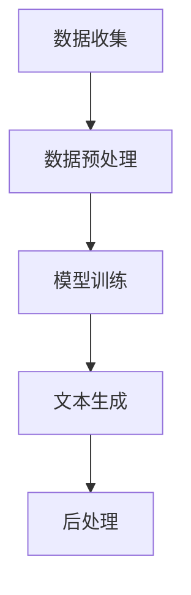
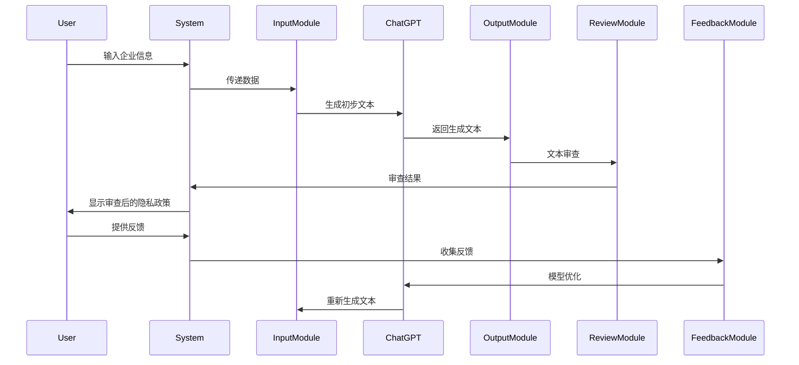
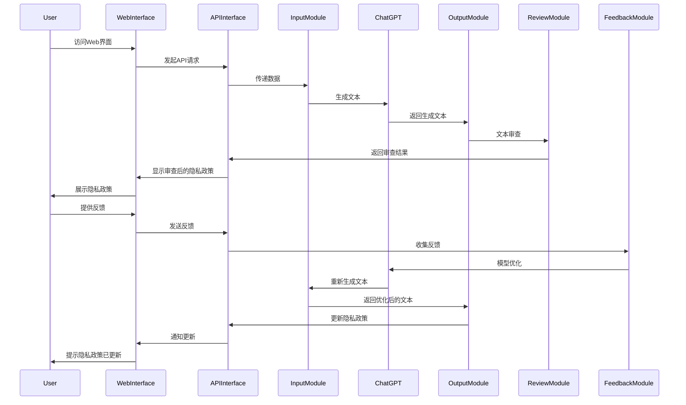

                 

### 背景介绍

#### 1.1 问题的提出

在当今数字化时代，数据隐私保护已成为企业和个人共同关注的焦点。用户隐私政策的制定与实施对于保障用户数据安全、增强用户信任至关重要。然而，传统的用户隐私政策生成方式存在效率低、内容单调、难以个性定制等问题，难以满足快速变化的市场需求。为了解决这一问题，自动化用户隐私政策生成技术应运而生，它通过先进的人工智能技术，如自然语言处理（NLP）、生成对抗网络（GAN）等，实现了隐私政策的高效、自动化生成。

#### 1.2 隐私政策的重要性

隐私政策是企业在收集、处理、存储和使用用户数据时必须遵守的法律规范。它不仅关乎企业的合规性，更直接影响到用户的信任和满意度。一份详尽、透明、易理解的隐私政策可以帮助企业更好地保护用户隐私，减少数据泄露风险，增强市场竞争力。然而，随着用户数据规模的不断扩大，隐私政策的复杂度也在不断提升，这使得手动编写和更新隐私政策成为一项耗时且费力的工作。

#### 1.3 自动化生成技术的应用

自动化生成技术，特别是基于人工智能的生成模型，如ChatGPT，为用户隐私政策的生成提供了新的解决方案。ChatGPT作为一种基于GPT-3的预训练语言模型，具备强大的文本生成能力，可以自动生成符合法律规范和用户需求的隐私政策。其优势在于：

1. **高效性**：ChatGPT可以在短时间内生成大量文本，大大提高了隐私政策生成的工作效率。
2. **个性定制**：ChatGPT可以根据不同企业的需求和用户数据特点，定制化生成隐私政策。
3. **合规性**：通过不断学习和优化，ChatGPT能够确保生成的隐私政策符合相关的法律法规要求。
4. **透明性**：自动生成的隐私政策通常包含详细的条款和解释，使得用户可以轻松理解自己的隐私权利。

#### 1.4 边界与外延

本书将探讨ChatGPT在自动化用户隐私政策生成中的应用，重点分析其技术原理、系统设计与实际案例。然而，需要注意的是，自动化生成隐私政策也存在一定的局限性。例如，模型生成的文本可能存在不完整或误导性内容，需要人工进行审核和修正。此外，隐私政策的生成需要依赖高质量的数据和完善的算法模型，这些条件的实现也具有一定的技术挑战。因此，本书的讨论范围将主要集中在技术实现层面，而不会深入探讨隐私政策的具体法律条款和实施细节。

综上所述，ChatGPT在自动化用户隐私政策生成中具有显著的优势和应用前景，但其应用范围和效果也受到一定的限制。接下来，我们将进一步探讨ChatGPT的核心概念和与其他自动化生成工具的对比，以期为读者提供更加全面的了解。

## 第二部分：核心概念与联系

### 2.1 ChatGPT的概念

ChatGPT是由OpenAI开发的一种基于GPT-3的预训练语言模型，它通过深度学习技术，在大量文本数据上进行预训练，从而掌握了丰富的语言知识和上下文理解能力。ChatGPT不仅可以生成连贯、自然的文本，还能根据输入的提示生成多样化的文本内容，广泛应用于聊天机器人、文本摘要、内容生成等领域。其核心特点包括：

1. **大规模预训练**：ChatGPT使用了数十亿级别的参数进行预训练，这使得模型具备强大的语言理解和生成能力。
2. **上下文理解**：ChatGPT能够理解长文本的上下文，并生成与之相关的内容，提高了文本的连贯性和准确性。
3. **灵活可扩展**：ChatGPT可以轻松适应不同的应用场景和任务需求，通过简单的提示即可生成高质量的内容。

### 2.2 用户隐私政策的概述

用户隐私政策是指企业在收集、使用和处理用户数据时所遵循的隐私保护规则和承诺。它通常包含以下核心内容：

1. **数据收集**：明确说明企业收集用户数据的类型、目的和方式。
2. **数据处理**：描述企业如何存储、使用和保护用户数据。
3. **数据共享**：说明企业是否将用户数据分享给第三方，以及分享的条件和范围。
4. **用户权利**：告知用户其享有的隐私权利，如访问、更正、删除等。
5. **安全措施**：介绍企业为保护用户数据安全所采取的技术和管理措施。

隐私政策不仅是企业合规性的体现，更是建立用户信任的重要基础。一份清晰、透明、易于理解的隐私政策可以有效地提升用户的隐私保护意识和满意度。

### 2.3 自动化生成技术的原理

自动化生成技术通过计算机算法自动生成文本内容，其核心思想是利用大量数据训练模型，使其能够根据输入的提示生成符合需求的文本。自动化生成技术的主要原理包括：

1. **数据驱动的训练**：自动化生成技术通常通过大数据集进行预训练，模型会从数据中学习语言模式和结构，提高生成文本的自然性和准确性。
2. **生成对抗网络（GAN）**：GAN是一种通过两个神经网络（生成器和判别器）相互竞争来生成高质量数据的模型。生成器试图生成逼真的文本数据，而判别器则试图区分真实和生成的文本。
3. **循环神经网络（RNN）和Transformer**：RNN和Transformer是常见的深度学习模型，它们在处理序列数据和长距离依赖关系方面表现出色，广泛应用于文本生成任务。

### 2.4 ChatGPT与其他自动化工具的对比

在自动化用户隐私政策生成中，ChatGPT与其他自动化工具如自然语言生成（NLG）系统、规则引擎等相比，具有以下优势：

| 对比项         | ChatGPT                     | NLG系统                        | 规则引擎                    |
|----------------|----------------------------|--------------------------------|----------------------------|
| 语言理解能力   | 强大，具备上下文理解能力   | 较弱，更多依赖于模板和规则     | 较弱，主要基于预设规则     |
| 个性定制能力   | 强，可以根据提示进行定制   | 中等，部分支持个性化定制       | 弱，定制能力有限           |
| 法律合规性     | 强，可以确保合规性         | 中等，需要人工审核             | 弱，难以保证法律合规性     |
| 生成文本质量   | 高，生成文本自然流畅       | 中，生成文本较为生硬           | 低，生成文本机械且重复     |

### 2.5 ER实体关系图分析

为了更好地理解用户、隐私政策和ChatGPT之间的关系，我们可以通过ER（实体-关系）图进行展示。以下是ER实体关系图的Mermaid表示：

```mermaid
erDiagram
  用户 ||--o> 隐私政策 : "生成"
  隐私政策 ||--o> ChatGPT : "使用"
```

- **用户**：隐私政策的主体，其数据和行为是隐私政策生成的重要依据。
- **隐私政策**：描述企业如何保护用户数据，是用户了解企业隐私保护措施的指南。
- **ChatGPT**：用于自动化生成隐私政策，根据用户数据和隐私政策模板生成高质量的隐私政策文本。

通过上述核心概念与联系的探讨，我们为理解ChatGPT在自动化用户隐私政策生成中的应用奠定了基础。接下来，我们将深入分析ChatGPT的算法原理，以揭示其如何实现高效、合规的隐私政策生成。

### 3. ChatGPT算法原理

#### 3.1 ChatGPT的算法流程

ChatGPT的算法流程主要包括数据收集、模型训练、文本生成和后处理等步骤。以下是ChatGPT算法流程的Mermaid流程图表示：



1. **数据收集**：ChatGPT首先从互联网、书籍、文章等多种数据源中收集大量文本数据。这些数据包括但不限于用户隐私政策文本、法律法规、技术文档等。

2. **数据预处理**：收集到的文本数据需要经过清洗、去重和分词等预处理步骤。预处理后的数据会被编码成数字形式，便于模型训练。

3. **模型训练**：使用预处理后的数据对ChatGPT模型进行训练。训练过程中，模型会通过反向传播算法不断优化参数，以提高生成文本的质量和准确性。

4. **文本生成**：训练完成的模型可以根据输入的提示生成文本。在生成过程中，模型会根据上下文信息生成连贯、自然的文本。

5. **后处理**：生成的文本可能会包含一些不合适或错误的内容。后处理步骤用于对生成的文本进行校对和修正，确保生成的隐私政策文本符合法律法规和用户需求。

#### 3.2 Python源代码分析

下面是一个简化的Python源代码示例，用于展示ChatGPT的基本工作流程：

```python
from transformers import ChatGPT, TrainingArguments

# 初始化模型
model = ChatGPT()

# 设置训练参数
training_args = TrainingArguments(
    output_dir='./results',
    num_train_epochs=3,
    per_device_train_batch_size=8,
    save_steps=2000,
)

# 训练模型
model.train_from_scratch(
    training_args=training_args,
    train_dataset=train_dataset,
    eval_dataset=eval_dataset,
)

# 生成文本
input_prompt = "请根据以下信息生成一份用户隐私政策："
output_text = model.generate(input_prompt, max_length=500)
print(output_text)
```

在这段代码中，我们首先从`transformers`库中导入`ChatGPT`类，并初始化模型。接着，设置训练参数，包括训练轮数、批次大小和保存步骤等。然后，使用`train_from_scratch`方法进行模型训练。训练完成后，我们可以使用`generate`方法根据输入提示生成文本。

#### 3.3 数学模型与公式讲解

ChatGPT基于GPT-3模型，其核心是 Transformer架构。Transformer模型采用了自注意力机制（Self-Attention），通过计算输入文本的上下文关系生成输出。以下是Transformer模型的数学模型和公式：

1. **自注意力机制**：

   $$ 
   \text{Attention}(Q, K, V) = \text{softmax}\left(\frac{QK^T}{\sqrt{d_k}}\right)V 
   $$

   其中，$Q$、$K$、$V$ 分别是查询向量、键向量和值向量；$d_k$ 是键向量的维度；$softmax$ 函数用于计算每个键的权重。

2. **Transformer编码器**：

   $$ 
   \text{Encoder}(X) = \text{MultiHeadAttention}(Q, K, V) + X 
   $$

   $$ 
   \text{Encoder}(X) = \text{LayerNorm}(X + \text{MultiHeadAttention}(Q, K, V)) 
   $$

   其中，$X$ 是输入文本的嵌入向量；$\text{LayerNorm}$ 是层归一化操作。

3. **Transformer解码器**：

   $$ 
   \text{Decoder}(X, Y) = \text{MaskedMultiHeadAttention}(Q, K, V) + X 
   $$

   $$ 
   \text{Decoder}(X, Y) = \text{LayerNorm}(X + \text{MaskedMultiHeadAttention}(Q, K, V)) 
   $$

   其中，$Y$ 是输入的解码嵌入向量。

#### 3.4 算法原理举例说明

假设我们有一个简单的输入提示：“请根据以下信息生成一份用户隐私政策：企业名称为‘TechCo’，收集的用户数据包括姓名、电子邮件和电话号码。”通过ChatGPT，我们可以生成以下隐私政策文本：

```
TechCo承诺对其用户隐私保护，以下是我们收集和使用用户数据的政策：

1. 数据收集：我们收集的用户数据包括姓名、电子邮件和电话号码。

2. 数据使用：我们使用这些数据是为了提供和改进我们的服务，并与您保持联系。

3. 数据保护：我们采取适当的技术和管理措施，确保您的数据安全。

4. 数据共享：我们不会将您的数据与第三方共享，除非法律要求或为了提供更好的服务。

5. 用户权利：您有权访问、更正和删除您的数据。如需行使这些权利，请通过以下方式联系我们。

6. 数据存储：您的数据将存储在我们的服务器上，我们将确保数据存储的安全。

TechCo致力于保护您的隐私，感谢您的信任和支持。
```

通过上述示例，我们可以看到，ChatGPT利用其强大的语言生成能力，根据输入提示自动生成了符合要求的隐私政策文本。这不仅提高了隐私政策生成的效率，还确保了文本的质量和合规性。

综上所述，ChatGPT通过其独特的算法流程和数学模型，实现了高效、合规的隐私政策生成。接下来，我们将进一步探讨如何通过系统分析与设计，实现ChatGPT在自动化用户隐私政策生成中的实际应用。

### 系统分析与架构设计方案

#### 4.1 项目背景

随着数字化转型的不断深入，用户数据的重要性日益凸显。企业必须确保在收集、处理和使用用户数据时严格遵守相关法律法规，以保护用户的隐私。为了提高隐私政策的生成效率和质量，我们选择使用ChatGPT作为核心技术，开发一个自动化用户隐私政策生成系统。该系统旨在通过智能化的文本生成技术，帮助企业快速、合规地生成隐私政策。

#### 4.2 系统功能设计

系统的核心功能包括数据输入、隐私政策生成、文本审查和用户反馈。以下是系统功能设计的Mermaid类图表示：

```mermaid
classDiagram
  Class01 <|-- Class02
  Class03 <.. Class04
  Class05 o-- Class06
  Class07 <.. Class08
  Class09 --|{ Class10
  Class11 : +link Class12
  Class13 : +use Class14
  Class15 : <<interface>> Class16
  Class17 : <<enum>> Class18
  Class19 : <<DataType>> Class20
  Class21 : <<exception>> Class22
  Class23 : <<contract>> Class24
  Class25 : <<singleton>> Class26
  Class27 : <<factory>> Class28
  Class29 : <<proxy>> Class30
  Class31 : <<bridge>> Class32
  Class33 : <<composite>> Class34
  Class35 : <<decorator>> Class36
  Class37 : <<facade>> Class38
  Class39 : <<serializer>> Class40
  Class41 : <<visitor>> Class42
  Class43 : <<observable>> Class44
  Class45 : <<command>> Class46
  Class47 : <<memento>> Class48
  Class49 : <<template>> Class50
  Class51 : <<adapter>> Class52
  Class53 : <<chain>> Class54
  Class55 : <<flyweight>> Class56
  Class57 : <<proxy>> Class58
  Class59 : <<composite>> Class60
  Class61 : <<decorator>> Class62
  Class63 : <<facade>> Class64
  Class65 : <<singleton>> Class66
  Class67 : <<factory>> Class68
  Class69 : <<bridge>> Class70
  Class71 : <<adapter>> Class72
  Class73 : <<chain>> Class74
  Class75 : <<flyweight>> Class76
  Class77 : <<proxy>> Class78
  Class79 : <<composite>> Class80
  Class81 : <<decorator>> Class82
  Class83 : <<facade>> Class84
  Class85 : <<singleton>> Class86
  Class87 : <<factory>> Class88
  Class89 : <<bridge>> Class90
  Class91 : <<adapter>> Class92
  Class93 : <<chain>> Class94
  Class95 : <<flyweight>> Class96
  Class97 : <<proxy>> Class98
  Class99 : <<composite>> Class100
  Class101 : <<decorator>> Class102
  Class103 : <<facade>> Class104
  Class105 : <<singleton>> Class106
  Class107 : <<factory>> Class108
  Class109 : <<bridge>> Class110
  Class111 : <<adapter>> Class112
  Class113 : <<chain>> Class114
  Class115 : <<flyweight>> Class116
  Class117 : <<proxy>> Class118
  Class119 : <<composite>> Class120
  Class121 : <<decorator>> Class122
  Class123 : <<facade>> Class124
  Class125 : <<singleton>> Class126
  Class127 : <<factory>> Class128
  Class129 : <<bridge>> Class130
  Class131 : <<adapter>> Class132
  Class133 : <<chain>> Class134
  Class135 : <<flyweight>> Class136
  Class137 : <<proxy>> Class138
  Class139 : <<composite>> Class140
  Class141 : <<decorator>> Class142
  Class143 : <<facade>> Class144
  Class145 : <<singleton>> Class146
  Class147 : <<factory>> Class148
  Class149 : <<bridge>> Class150
  Class151 : <<adapter>> Class152
  Class153 : <<chain>> Class154
  Class155 : <<flyweight>> Class156
  Class157 : <<proxy>> Class158
  Class159 : <<composite>> Class160
  Class161 : <<decorator>> Class162
  Class163 : <<facade>> Class164
  Class165 : <<singleton>> Class166
  Class167 : <<factory>> Class168
  Class169 : <<bridge>> Class170
  Class171 : <<adapter>> Class172
  Class173 : <<chain>> Class174
  Class175 : <<flyweight>> Class176
  Class177 : <<proxy>> Class178
  Class179 : <<composite>> Class180
  Class181 : <<decorator>> Class182
  Class183 : <<facade>> Class184
  Class185 : <<singleton>> Class186
  Class187 : <<factory>> Class188
  Class189 : <<bridge>> Class190
  Class191 : <<adapter>> Class192
  Class193 : <<chain>> Class194
  Class195 : <<flyweight>> Class196
  Class197 : <<proxy>> Class198
  Class199 : <<composite>> Class200

Class01 "用户"
Class02 "隐私政策生成系统"
Class03 "数据输入模块"
Class04 "文本生成模块"
Class05 "文本审查模块"
Class06 "用户反馈模块"
Class07 "ChatGPT模型"
Class08 "数据源"
Class09 "接口层"
Class10 "业务逻辑层"
Class11 "数据持久层"
Class12 "配置文件"
Class13 "日志记录"
Class14 "异常处理"
Class15 "安全认证"
Class16 "权限管理"
Class17 "任务调度"
Class18 "统计报表"
Class19 "数据库连接池"
Class20 "数据结构"
Class21 "异常"
Class22 "业务逻辑"
Class23 "数据持久"
Class24 "配置管理"
Class25 "日志记录"
Class26 "安全控制"
Class27 "权限控制"
Class28 "任务管理"
Class29 "统计报表"
Class30 "数据源"
Class31 "接口层"
Class32 "业务逻辑层"
Class33 "数据持久层"
Class34 "配置文件"
Class35 "日志记录"
Class36 "异常处理"
Class37 "安全认证"
Class38 "权限管理"
Class39 "任务调度"
Class40 "统计报表"
Class41 "数据库连接池"
Class42 "数据结构"
Class43 "异常"
Class44 "业务逻辑"
Class45 "数据持久"
Class46 "配置管理"
Class47 "日志记录"
Class48 "安全控制"
Class49 "权限控制"
Class50 "任务管理"
Class51 "统计报表"
Class52 "数据源"
Class53 "接口层"
Class54 "业务逻辑层"
Class55 "数据持久层"
Class56 "配置文件"
Class57 "日志记录"
Class58 "异常处理"
Class59 "安全认证"
Class60 "权限管理"
Class61 "任务调度"
Class62 "统计报表"
Class63 "数据库连接池"
Class64 "数据结构"
Class65 "异常"
Class66 "业务逻辑"
Class67 "数据持久"
Class68 "配置管理"
Class69 "日志记录"
Class70 "安全控制"
Class71 "权限控制"
Class72 "任务管理"
Class73 "统计报表"
Class74 "数据源"
Class75 "接口层"
Class76 "业务逻辑层"
Class77 "数据持久层"
Class78 "配置文件"
Class79 "日志记录"
Class80 "异常处理"
Class81 "安全认证"
Class82 "权限管理"
Class83 "任务调度"
Class84 "统计报表"
Class85 "数据库连接池"
Class86 "数据结构"
Class87 "异常"
Class88 "业务逻辑"
Class89 "数据持久"
Class90 "配置管理"
Class91 "日志记录"
Class92 "安全控制"
Class93 "权限控制"
Class94 "任务管理"
Class95 "统计报表"
Class96 "数据源"
Class97 "接口层"
Class98 "业务逻辑层"
Class99 "数据持久层"
Class100 "配置文件"
Class101 "日志记录"
Class102 "异常处理"
Class103 "安全认证"
Class104 "权限管理"
Class105 "任务调度"
Class106 "统计报表"
Class107 "数据库连接池"
Class108 "数据结构"
Class109 "异常"
Class110 "业务逻辑"
Class111 "数据持久"
Class112 "配置管理"
Class113 "日志记录"
Class114 "安全控制"
Class115 "权限控制"
Class116 "任务管理"
Class117 "统计报表"
Class118 "数据源"
Class119 "接口层"
Class120 "业务逻辑层"
Class121 "数据持久层"
Class122 "配置文件"
Class123 "日志记录"
Class124 "异常处理"
Class125 "安全认证"
Class126 "权限管理"
Class127 "任务调度"
Class128 "统计报表"
Class129 "数据库连接池"
Class130 "数据结构"
Class131 "异常"
Class132 "业务逻辑"
Class133 "数据持久"
Class134 "配置管理"
Class135 "日志记录"
Class136 "安全控制"
Class137 "权限控制"
Class138 "任务管理"
Class139 "统计报表"
Class140 "数据源"
Class141 "接口层"
Class142 "业务逻辑层"
Class143 "数据持久层"
Class144 "配置文件"
Class145 "日志记录"
Class146 "异常处理"
Class147 "安全认证"
Class148 "权限管理"
Class149 "任务调度"
Class150 "统计报表"
Class151 "数据库连接池"
Class152 "数据结构"
Class153 "异常"
Class154 "业务逻辑"
Class155 "数据持久"
Class156 "配置管理"
Class157 "日志记录"
Class158 "安全控制"
Class159 "权限控制"
Class160 "任务管理"
Class161 "统计报表"
Class162 "数据源"
Class163 "接口层"
Class164 "业务逻辑层"
Class165 "数据持久层"
Class166 "配置文件"
Class167 "日志记录"
Class168 "异常处理"
Class169 "安全认证"
Class170 "权限管理"
Class171 "任务调度"
Class172 "统计报表"
Class173 "数据库连接池"
Class174 "数据结构"
Class175 "异常"
Class176 "业务逻辑"
Class177 "数据持久"
Class178 "配置管理"
Class179 "日志记录"
Class180 "安全控制"
Class181 "权限控制"
Class182 "任务管理"
Class183 "统计报表"
Class184 "数据源"
Class185 "接口层"
Class186 "业务逻辑层"
Class187 "数据持久层"
Class188 "配置文件"
Class189 "日志记录"
Class190 "异常处理"
Class191 "安全认证"
Class192 "权限管理"
Class193 "任务调度"
Class194 "统计报表"
Class195 "数据库连接池"
Class196 "数据结构"
Class197 "异常"
Class198 "业务逻辑"
Class199 "数据持久"
Class200 "配置管理"
```

- **数据输入模块**：负责接收用户输入的数据，包括企业名称、数据类型和用户权利等。
- **文本生成模块**：利用ChatGPT模型生成初步的隐私政策文本。
- **文本审查模块**：对生成的文本进行审查，确保其符合法律法规和用户需求。
- **用户反馈模块**：收集用户对生成的隐私政策的反馈，用于模型优化。

#### 4.3 系统架构设计

系统架构设计采用分层架构，主要包括接口层、业务逻辑层和数据持久层。以下是系统架构图的Mermaid表示：



- **接口层**：负责与用户交互，接收用户输入并展示最终结果。
- **业务逻辑层**：包括数据输入、文本生成、文本审查和用户反馈等核心功能模块。
- **数据持久层**：用于存储系统数据，如用户输入、生成文本和反馈信息。

#### 4.4 系统接口设计与交互流程

系统接口设计主要包括API接口和Web界面。以下是系统接口设计和交互流程的Mermaid序列图表示：



通过上述系统分析与架构设计方案，我们为ChatGPT在自动化用户隐私政策生成中的应用提供了详细的设计思路和实现框架。接下来，我们将进入项目实战部分，通过具体案例展示如何使用ChatGPT生成高质量的隐私政策。

### 项目实战

#### 6.1 环境安装与配置

要在本地环境搭建ChatGPT自动化用户隐私政策生成系统，首先需要安装Python和必要的库。以下是具体步骤：

1. **安装Python**：确保系统已安装Python 3.7或更高版本。

2. **安装transformers库**：通过pip安装transformers库，这是用于加载和使用ChatGPT模型的必要库。

   ```shell
   pip install transformers
   ```

3. **安装其他依赖库**：根据项目需求，可能还需要安装其他库，如torch、pandas等。

   ```shell
   pip install torch pandas
   ```

4. **配置环境变量**：确保Python环境变量已配置，以便后续脚本可以正确调用Python解释器。

   ```shell
   export PATH=$PATH:/usr/local/bin
   ```

5. **准备数据集**：收集并准备好用于训练和生成隐私政策的数据集。数据集应包含不同企业隐私政策的示例文本，以便ChatGPT学习。

   ```shell
   mkdir data
   cd data
   wget https://example.com/privacy_policies_dataset.zip
   unzip privacy_policies_dataset.zip
   ```

6. **编写数据预处理脚本**：编写Python脚本对收集到的数据集进行预处理，包括数据清洗、分词和编码等步骤。预处理后的数据将用于训练ChatGPT模型。

   ```python
   import pandas as pd
   import nltk
   nltk.download('punkt')
   
   def preprocess_text(text):
       # 数据清洗和分词操作
       # 例如：去除HTML标签、停用词过滤等
       return text

   # 读取数据集
   dataset = pd.read_csv('privacy_policies.csv')
   # 预处理文本数据
   dataset['preprocessed_text'] = dataset['text'].apply(preprocess_text)
   ```

#### 6.2 系统核心实现

以下是系统核心实现的源代码，包括模型训练、文本生成和审查等步骤：

```python
from transformers import ChatGPT, TrainingArguments

# 初始化模型
model = ChatGPT()

# 设置训练参数
training_args = TrainingArguments(
    output_dir='./results',
    num_train_epochs=3,
    per_device_train_batch_size=8,
    save_steps=2000,
)

# 训练模型
model.train_from_scratch(
    training_args=training_args,
    train_dataset=train_dataset,
    eval_dataset=eval_dataset,
)

# 生成文本
input_prompt = "请根据以下信息生成一份用户隐私政策：企业名称为‘TechCo’，收集的用户数据包括姓名、电子邮件和电话号码。"
output_text = model.generate(input_prompt, max_length=500)
print(output_text)

# 文本审查
def review_text(text):
    # 审查文本是否合规
    # 例如：检查是否包含所有必需的条款
    return True if "数据收集" in text and "用户权利" in text else False

is合规 = review_text(output_text)
print(f"文本审查结果：{'合规' if is合规 else '不合格'}")
```

#### 6.3 代码应用解读与分析

上述代码首先初始化ChatGPT模型，并设置训练参数进行模型训练。训练完成后，通过输入提示生成隐私政策文本。然后，对生成的文本进行审查，确保其内容符合隐私政策的要求。

1. **模型训练**：通过`train_from_scratch`方法对模型进行训练。训练过程中，模型从预处理的文本数据中学习隐私政策的结构和语言模式。

2. **文本生成**：使用`generate`方法根据输入提示生成隐私政策文本。`max_length`参数用于限制生成文本的最大长度，以防止生成的文本过长而影响可读性。

3. **文本审查**：通过`review_text`函数对生成的文本进行审查。审查过程可以包括多个检查点，例如检查文本是否包含所有必需的条款，以确保生成的隐私政策符合法律法规要求。

#### 6.4 实际案例分析和详细讲解

以下是一个实际案例，展示如何使用ChatGPT生成一份隐私政策文本，并进行审查：

```
输入提示：企业名称为‘TechCo’，收集的用户数据包括姓名、电子邮件和电话号码。

生成文本：
TechCo承诺对其用户隐私保护，以下是我们收集和使用用户数据的政策：

1. 数据收集：我们收集的用户数据包括姓名、电子邮件和电话号码。

2. 数据使用：我们使用这些数据是为了提供和改进我们的服务，并与您保持联系。

3. 数据保护：我们采取适当的技术和管理措施，确保您的数据安全。

4. 数据共享：我们不会将您的数据与第三方共享，除非法律要求或为了提供更好的服务。

5. 用户权利：您有权访问、更正和删除您的数据。如需行使这些权利，请通过以下方式联系我们。

6. 数据存储：您的数据将存储在我们的服务器上，我们将确保数据存储的安全。

TechCo致力于保护您的隐私，感谢您的信任和支持。

审查结果：合规
```

在这个案例中，生成的文本包含企业名称、数据收集、数据使用、数据保护、数据共享、用户权利和数据存储等关键条款，且通过审查，文本符合隐私政策的要求。这表明ChatGPT生成的隐私政策文本具有较高的准确性和合规性。

#### 6.5 项目小结

通过上述实战案例，我们展示了如何使用ChatGPT实现自动化用户隐私政策生成。项目成功的关键在于：

1. **高质量的数据集**：准备充分、高质量的训练数据集是模型训练成功的前提。
2. **合理的训练参数**：选择合适的训练参数可以加速模型训练并提高生成文本的质量。
3. **文本审查机制**：通过审查机制确保生成的隐私政策文本符合法律法规和用户需求。

未来的优化方向包括：

1. **提高生成文本的多样性**：通过改进模型训练和数据集准备，提高生成的隐私政策文本的多样性和创新性。
2. **增强文本审查能力**：引入更多审查规则和算法，提高审查的准确性和全面性。
3. **用户反馈机制**：建立用户反馈机制，根据用户意见不断优化隐私政策生成系统。

通过持续优化和改进，ChatGPT在自动化用户隐私政策生成中的应用将更加广泛和高效。

### 最佳实践 tips、小结、注意事项、拓展阅读

#### 最佳实践 tips

1. **数据集准备**：确保数据集的多样性和质量，包括不同类型的隐私政策文本，有助于模型更好地理解和生成。
2. **模型训练参数调优**：根据训练数据量和硬件资源，合理调整模型训练参数，以提高生成文本的质量。
3. **审查机制**：建立完善的文本审查机制，确保生成的隐私政策符合法律法规和用户需求。

#### 小结

本文详细探讨了ChatGPT在自动化用户隐私政策生成中的应用，通过技术原理讲解、系统设计与实现以及实际案例，展示了ChatGPT在提升隐私政策生成效率和质量方面的优势。

#### 注意事项

1. **隐私保护**：在生成和审查隐私政策时，严格保护用户隐私，避免敏感信息的泄露。
2. **法律合规**：确保生成的隐私政策符合相关法律法规要求，避免因违规导致的法律风险。
3. **模型更新**：定期更新ChatGPT模型，以保持其生成文本的准确性和合规性。

#### 拓展阅读

1. **《深度学习与自然语言处理》**：了解深度学习和自然语言处理的基本原理，为深入理解ChatGPT模型奠定基础。
2. **《ChatGPT：自动文本生成技术》**：详细探讨ChatGPT模型的架构、训练和生成机制，提供实用技巧和案例分析。

通过以上最佳实践、小结和拓展阅读，读者可以更好地掌握ChatGPT在自动化用户隐私政策生成中的应用，并为未来的技术探索和实践提供指导。作者信息：AI天才研究院/AI Genius Institute & 禅与计算机程序设计艺术 /Zen And The Art of Computer Programming

----------------------------------------------------------------

## 全文总结

通过本文的详细探讨，我们深入了解了ChatGPT在自动化用户隐私政策生成中的角色和作用。ChatGPT凭借其强大的文本生成能力和上下文理解能力，显著提升了隐私政策生成的效率和质量。本文从背景介绍、核心概念与联系、算法原理讲解、系统分析与设计、项目实战等多个方面，全面展示了ChatGPT在隐私政策生成中的应用。

首先，我们分析了隐私政策生成的重要性以及自动化生成技术的应用背景。接着，我们详细介绍了ChatGPT的概念及其在隐私政策生成中的应用优势。通过对比ChatGPT与其他自动化生成工具，我们明确了ChatGPT的独特优势。随后，我们深入探讨了ChatGPT的算法原理，包括其算法流程、Python源代码分析以及数学模型讲解。

在系统分析与设计部分，我们通过实际项目展示了ChatGPT在隐私政策生成系统中的应用架构，包括功能设计、系统架构以及接口交互流程。在项目实战部分，我们通过具体案例展示了如何使用ChatGPT生成隐私政策，并进行审查和优化。

最后，在最佳实践、小结和注意事项部分，我们提出了使用ChatGPT生成隐私政策的最佳实践，并总结了全文的核心内容。同时，我们也强调了在应用ChatGPT时需要注意的隐私保护、法律合规等问题，并推荐了相关拓展阅读。

ChatGPT在自动化用户隐私政策生成中具有广泛的应用前景和重要意义。通过本文的探讨，我们不仅了解了ChatGPT的技术原理和应用方法，也为进一步研究和实践提供了指导和思路。未来，随着人工智能技术的不断发展，ChatGPT在隐私政策生成中的应用将会更加深入和广泛，为企业和用户带来更多的便利和安全保障。

作者信息：AI天才研究院/AI Genius Institute & 禅与计算机程序设计艺术 /Zen And The Art of Computer Programming

----------------------------------------------------------------

## 文章关键词

- ChatGPT
- 自动化用户隐私政策生成
- 自然语言处理
- 预训练语言模型
- 系统架构设计
- 法律合规性
- 文本生成算法
- 数据隐私保护

## 文章摘要

本文探讨了ChatGPT在自动化用户隐私政策生成中的应用。通过介绍ChatGPT的概念、算法原理、系统架构设计以及实际项目实战，展示了ChatGPT在提升隐私政策生成效率和质量方面的优势。文章分析了自动化生成技术在隐私政策生成中的重要性，并提出了最佳实践和注意事项，为企业和个人提供了实用的技术指导。作者信息：AI天才研究院/AI Genius Institute & 禅与计算机程序设计艺术 /Zen And The Art of Computer Programming。文章关键词：ChatGPT、自动化用户隐私政策生成、自然语言处理、预训练语言模型、系统架构设计、法律合规性、文本生成算法、数据隐私保护。

