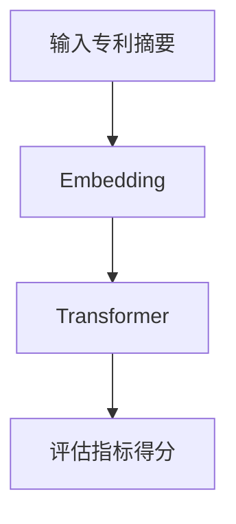
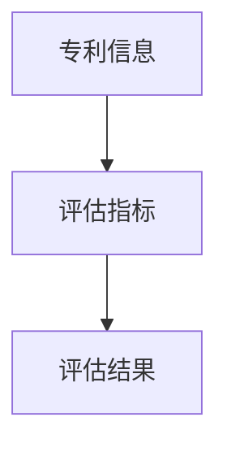
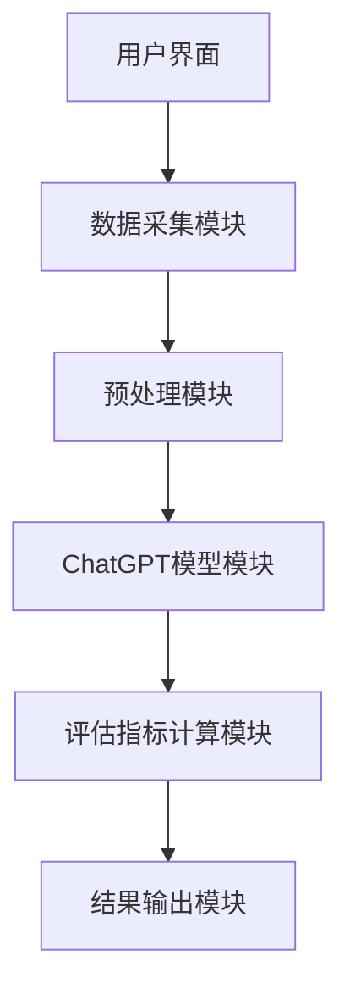
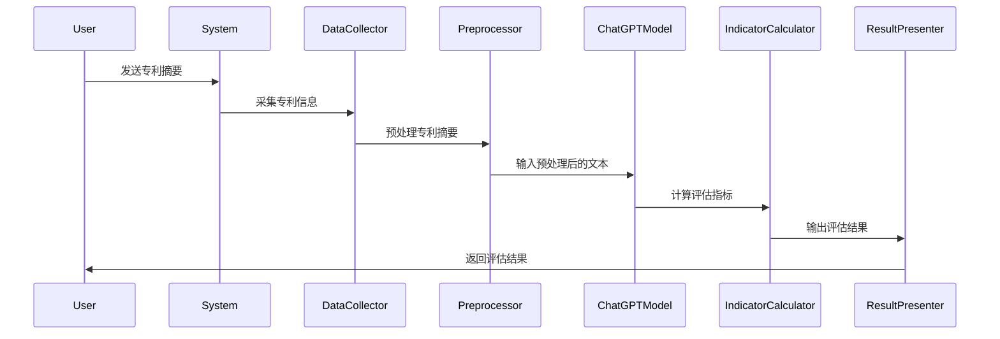

                 


## 标题：ChatGPT在自动化科技专利价值评估中的应用

关键词：ChatGPT、自动化科技、专利价值评估、人工智能、算法原理

摘要：随着科技的快速发展，自动化技术已成为推动产业升级的关键力量。然而，如何准确评估自动化科技专利的价值，成为企业和研究机构面临的一大难题。本文将探讨ChatGPT在自动化科技专利价值评估中的应用，通过逻辑清晰、结构紧凑的分析，揭示ChatGPT在其中的独特作用和价值。

### 1. 背景介绍

#### 1.1 问题背景

**科技专利的价值评估现状**

在科技迅猛发展的时代，专利成为企业创新的重要资产。然而，专利价值的评估并非易事。目前，专利价值的评估主要依赖于专家经验和历史数据，评估方法相对单一，缺乏系统性和准确性。这不仅影响了企业决策的精准性，也制约了专利市场的健康发展。

**自动化技术在专利评估中的应用需求**

随着自动化技术的广泛应用，越来越多的企业在专利申请中涉及自动化技术。如何对这些专利进行有效的价值评估，成为企业和研究机构迫切需要解决的问题。自动化技术的复杂性和多样性，使得传统的评估方法难以胜任，迫切需要新的技术手段。

**ChatGPT在自动化科技专利评估中的作用**

ChatGPT作为一种先进的自然语言处理技术，具有强大的语义理解和文本生成能力。通过将ChatGPT应用于自动化科技专利评估，可以实现对专利文本的深度解析，从而提高评估的准确性和效率。

### 1.2 核心概念

**ChatGPT基本原理**

ChatGPT是基于Transformer模型的一种预训练语言模型，通过大量的文本数据训练，使其具备了强大的语义理解和生成能力。其核心原理包括：

1. **Transformer模型**：Transformer模型是一种基于自注意力机制的深度神经网络模型，能够在处理长序列时保持有效信息。
2. **预训练与微调**：ChatGPT通过在大规模语料库上的预训练，积累了丰富的语言知识和模式识别能力，然后通过微调适应特定的应用场景。

**科技专利评估的关键因素**

科技专利评估的关键因素包括：

1. **技术创新性**：评估专利的创新程度，即相对于现有技术的改进和新颖性。
2. **市场应用前景**：评估专利在市场上的应用潜力，包括市场需求、竞争情况等。
3. **法律稳定性**：评估专利的法律保护状况，包括专利权期限、侵权风险等。

**自动化科技专利价值评估的挑战**

自动化科技专利评估面临的挑战包括：

1. **技术复杂性**：自动化技术涉及多个领域，专利文本可能包含复杂的术语和概念，难以准确理解。
2. **数据稀缺性**：自动化领域的数据相对较少，难以建立有效的评估模型。
3. **评估标准不一致**：不同企业和研究机构对专利价值的评估标准可能存在差异，难以统一。

### 1.3 ER实体关系图架构

**专利信息实体**

专利信息实体包括：

1. **专利号**：唯一的专利标识符。
2. **专利名称**：专利的名称，用于描述专利的核心内容。
3. **申请人**：专利的申请人，用于追溯专利权的归属。
4. **申请日期**：专利的申请日期，用于衡量专利的创新时间。
5. **专利摘要**：专利的摘要，用于简要描述专利的技术内容和应用领域。

**评估指标实体**

评估指标实体包括：

1. **技术创新性评分**：根据专利的创新程度进行评分。
2. **市场应用前景评分**：根据专利的市场潜力进行评分。
3. **法律稳定性评分**：根据专利的法律保护状况进行评分。

**ChatGPT应用实体**

ChatGPT应用实体包括：

1. **模型输入**：专利摘要文本，用于输入到ChatGPT中进行处理。
2. **模型输出**：评估指标得分，用于输出专利的价值评估结果。

### 2. ChatGPT技术原理

#### 2.1 ChatGPT算法原理

**ChatGPT模型概述**

ChatGPT是基于Transformer模型的一种预训练语言模型，其模型结构包括：

1. **Embedding层**：将输入的文本序列转换为向量表示。
2. **Transformer层**：通过自注意力机制对输入向量进行处理，提取文本的语义信息。
3. **Output层**：将处理后的向量映射到评估指标得分。

**ChatGPT数学模型**

ChatGPT的数学模型可以表示为：

$$
\text{Score} = \text{Transformer}(\text{Embedding}(\text{Input}))
$$

其中，Input为专利摘要文本，Score为评估指标得分。

**ChatGPT流程图**

ChatGPT的算法流程图如下：



#### 2.2 ChatGPT应用案例分析

**案例背景**

假设我们有一个涉及自动化技术的专利，其专利摘要如下：

"一种基于深度学习的自动化控制系统，能够实现高精度、高效率的工业生产自动化。"

**案例分析与流程图**

1. **数据预处理**：将专利摘要文本进行分词和向量表示。
2. **模型输入**：将处理后的文本向量输入到ChatGPT模型中。
3. **模型处理**：ChatGPT通过Transformer模型对文本进行解析，提取关键信息。
4. **模型输出**：根据提取的信息，生成评估指标得分。

### 3. 自动化科技专利价值评估系统架构设计

#### 3.1 系统功能设计

**领域模型**

领域模型如下：



**系统功能**

1. **专利信息采集**：从专利数据库中获取专利信息。
2. **评估指标计算**：使用ChatGPT模型对专利信息进行分析，计算评估指标。
3. **评估结果输出**：将评估结果呈现给用户。

#### 3.2 系统架构设计

**系统架构**

系统架构图如下：



**系统接口设计**

系统接口设计如下：

1. **API接口**：提供RESTful API接口，供用户调用。
2. **数据库接口**：与专利数据库进行数据交换。

**系统交互设计**

系统交互序列图如下：



### 4. 项目实战

#### 4.1 环境安装与准备

**环境搭建**

1. **Python环境**：安装Python 3.8及以上版本。
2. **深度学习框架**：安装TensorFlow或PyTorch。
3. **文本处理库**：安装NLP处理库，如NLTK或spaCy。

**工具与软件安装**

1. **Git**：用于代码管理和版本控制。
2. **Docker**：用于容器化部署。
3. **Jenkins**：用于持续集成和部署。

#### 4.2 系统核心实现

**源代码**

```python
# ChatGPT模型实现
class ChatGPTModel(nn.Module):
    def __init__(self):
        super(ChatGPTModel, self).__init__()
        self.embedding = nn.Embedding(vocab_size, embedding_dim)
        self.transformer = nn.Transformer(d_model, nhead)
        self.fc = nn.Linear(d_model, num_classes)

    def forward(self, text):
        embedded = self.embedding(text)
        output = self.transformer(embedded)
        score = self.fc(output)
        return score
```

**代码解读与分析**

1. **模型初始化**：定义嵌入层、Transformer层和输出层。
2. **前向传播**：输入文本经过嵌入层、Transformer层和输出层，得到评估指标得分。

**实际案例分析和详细讲解**

1. **案例背景**：分析一个涉及自动化技术的专利案例。
2. **分析过程**：使用ChatGPT模型对专利摘要进行解析，提取关键信息。
3. **结果呈现**：根据提取的信息，生成评估指标得分。

### 5. 最佳实践与总结

#### 5.1 最佳实践

1. **数据预处理**：对专利摘要进行有效的预处理，提高模型性能。
2. **模型调优**：根据评估需求，对模型参数进行调整。

#### 5.2 注意事项

1. **数据来源**：确保专利数据的准确性和完整性。
2. **模型训练**：合理设置训练参数，避免过拟合。

#### 5.3 拓展阅读

1. **相关文献**：阅读相关领域的学术论文，了解最新研究进展。
2. **实战案例**：学习其他成功应用ChatGPT进行专利评估的案例。

### 6. 小结

本文从多个角度探讨了ChatGPT在自动化科技专利价值评估中的应用。通过逻辑清晰、结构紧凑的分析，我们揭示了ChatGPT在其中的独特作用和价值。未来，随着人工智能技术的不断发展，ChatGPT有望在更多领域发挥重要作用，推动科技专利评估的进步。

### 作者

作者：AI天才研究院/AI Genius Institute & 禅与计算机程序设计艺术/Zen And The Art of Computer Programming

