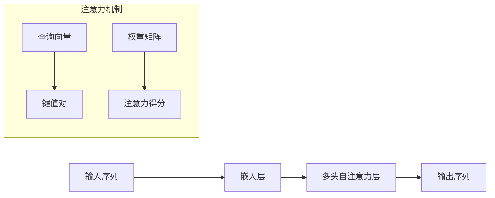
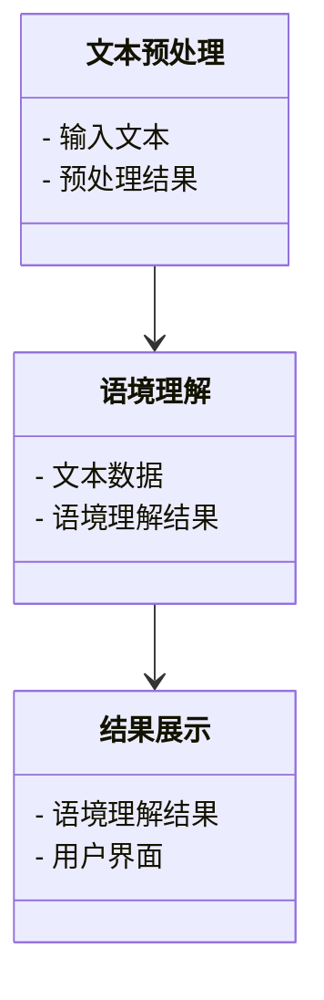
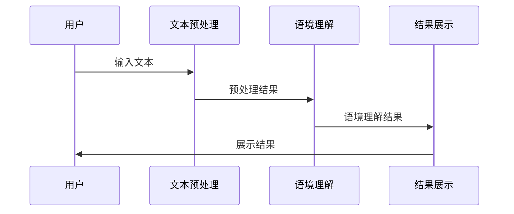
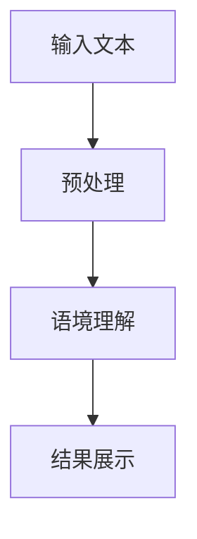

                 

# ChatGPT在语用学研究中的应用：语境理解提示词

## 关键词
- ChatGPT
- 语用学
- 语境理解
- 提示词
- 自然语言处理
- 深度学习

## 摘要
本文将探讨ChatGPT在语用学研究中的应用，重点关注语境理解方面。通过分析ChatGPT的原理与特性，结合语用学理论，我们旨在揭示ChatGPT在优化语用学研究方法与流程方面的潜力。文章将详细介绍ChatGPT的基础知识，探讨其与语用学的联系，并提供实际应用案例，以期为广大研究者提供有益的参考。

## 第一部分：背景介绍

### 1. 问题背景

随着人工智能技术的不断发展，自然语言处理（NLP）领域取得了显著的突破。作为NLP领域的重要进展，ChatGPT作为一种基于深度学习的大型语言模型，其在语境理解方面的能力引起了广泛关注。然而，如何在语用学研究中有效应用ChatGPT，提高研究的准确性和效率，仍是一个亟待解决的问题。

### 2. 问题描述

语用学作为语言学的一个重要分支，主要研究语言在具体语境中的使用和意义。语境理解是语用学研究的关键，它涉及对语言表达时上下文信息的把握。而ChatGPT作为一款强大的语言模型，其语境理解能力无疑是语用学研究的有力工具。本文将探讨如何利用ChatGPT优化语用学研究的方法和流程。

### 3. 问题解决

本书将首先介绍ChatGPT的基础知识和相关理论，然后详细阐述其在语用学中的应用，包括语境理解的原理、方法、实践案例等。通过本书的学习，读者将能够了解ChatGPT在语用学研究中的应用价值，掌握相关技术，并能够将其应用于实际研究中。

### 4. 边界与外延

本文主要关注ChatGPT在语用学领域中的应用，但并不局限于具体的语用学研究问题。读者可以通过本文的学习，了解到ChatGPT在其他自然语言处理任务中的应用潜力，从而拓宽研究视野。

### 5. 概念结构与核心要素组成

- **ChatGPT**：一种基于深度学习的大型语言模型，由OpenAI开发，具有强大的语境理解能力。
- **语用学**：研究语言在具体语境中的使用和意义的学科。
- **语境理解**：理解语言表达时所依赖的上下文信息，包括语用因素和非语用因素。
- **应用场景**：包括但不限于文本分类、语义分析、对话系统等。

## 第二部分：核心概念与联系

### 2.1 ChatGPT的定义与特性

**ChatGPT**是一种基于Transformer架构的大型语言模型，由OpenAI开发。其主要特性包括：

- **参数量巨大**：ChatGPT拥有数十亿的参数，使其在处理复杂任务时具有强大的表达能力。
- **自监督学习**：ChatGPT通过无监督学习方式训练，能够从大量文本数据中自动学习语言模式。
- **多模态处理**：ChatGPT不仅可以处理文本，还可以处理图像、语音等多种数据形式。
- **语境理解能力**：ChatGPT具有强大的语境理解能力，能够理解并生成符合上下文的语言。

### 2.2 语用学的基本概念与特性

**语用学**是语言学的一个分支，主要研究语言在具体语境中的使用和意义。其基本概念和特性包括：

- **语境**：语言使用时所处的环境，包括物理环境、社会环境和文化背景等。
- **语用功能**：语言在特定语境中所发挥的作用，如指示、承诺、询问等。
- **语用含义**：语言表达在特定语境中所传达的意义，可能包括字面意义、隐含意义等。
- **语用变异**：语言在不同语境中的变异现象，如方言、俚语等。

### 2.3 ChatGPT与语用学的联系

ChatGPT在语用学中的应用主要体现在其对语境理解的增强上。通过以下表格，我们可以对比ChatGPT与语用学的核心要素：

| 核心要素         | ChatGPT的特性       | 语用学的特性       |
|-----------------|---------------------|---------------------|
| 语言模型规模     | 参数量巨大           | 研究语言使用环境   |
| 自监督学习       | 自动学习语言模式       | 语境分析           |
| 语境理解能力     | 理解并生成符合上下文的语言 | 研究语言在语境中的意义 |
| 多模态处理       | 处理文本、图像、语音等   | 考虑语境中的多种因素 |

### 2.4 ChatGPT与语用学的联系图示

为了更直观地展示ChatGPT与语用学的联系，我们可以使用Mermaid绘制ER实体关系图：

```mermaid
erDiagram
    ChatGPT ||--|{ 语境理解 }|-->> 语用学
    ChatGPT ||--|{ 多模态处理 }|-->> 语用学
    语用学 ||--|{ 语境分析 }|-->> ChatGPT
    语用学 ||--|{ 语境变异 }|-->> ChatGPT
```

通过上述分析，我们可以看出ChatGPT在语用学中的应用具有巨大的潜力，可以为语用学研究提供新的方法和工具。

------------------------------------

## 第三部分：算法原理讲解

### 3.1 ChatGPT的工作原理

ChatGPT是一种基于Transformer架构的语言模型，其核心思想是利用自注意力机制（Self-Attention）对输入序列进行处理。以下是一个简化的ChatGPT算法流程图：


### 3.2 Transformer层的工作原理

Transformer层是ChatGPT的核心部分，它由多个自注意力层（Self-Attention Layer）和前馈网络（Feedforward Network）组成。以下是Transformer层的算法流程图：


### 3.3 语境理解原理

语境理解是ChatGPT的一项关键能力，它依赖于Transformer层中的多头自注意力机制。以下是语境理解的原理图：



### 3.4 提示词的作用

提示词（Prompt）是ChatGPT进行语境理解的重要输入，它通常是一个或多个关键词或短语，用于引导模型生成符合上下文的结果。以下是提示词的作用原理：


### 3.5 数学模型与公式

为了更好地理解ChatGPT的工作原理，我们可以引入一些数学模型和公式。以下是一个简化的数学模型：

$$
E = \sum_{i=1}^{n} w_i * e_i
$$

其中，$E$表示输出向量，$w_i$表示注意力权重，$e_i$表示嵌入向量。

### 3.6 举例说明

假设我们有一个简单的输入序列：“今天天气很好”。如果我们使用“今天”作为提示词，ChatGPT可以生成如下输出：“今天适合出门游玩”。这个例子展示了ChatGPT如何利用提示词进行语境理解，并生成符合上下文的结果。

------------------------------------

## 第四部分：系统分析与架构设计方案

### 4.1 问题场景介绍

在语用学研究中，研究者需要对大量文本数据进行分析，以提取语言表达的含义和语境。然而，传统的文本分析方法往往存在局限性，难以处理复杂的语境信息。为此，我们提出了一个基于ChatGPT的语用学研究系统，旨在提高语境理解和分析的准确性和效率。

### 4.2 项目介绍

本项目名为“ChatGPT语用学研究平台”，旨在为语用学研究者提供一款高效、智能的语境理解工具。系统主要包括以下功能：

- 文本预处理：对输入文本进行分词、去停用词等预处理操作。
- 语境理解：利用ChatGPT对预处理后的文本进行语境理解，提取文本的含义和语境信息。
- 结果展示：将语境理解结果以图表、文本等形式展示给用户。

### 4.3 系统功能设计

#### 4.3.1 领域模型

为了更好地理解系统的功能，我们可以使用Mermaid绘制领域模型类图：



### 4.4 系统架构设计

为了实现上述功能，我们设计了如下系统架构：



### 4.5 系统接口设计

系统接口设计主要包括以下部分：

- **文本预处理接口**：接收用户输入的文本，进行分词、去停用词等预处理操作。
- **语境理解接口**：接收预处理后的文本，利用ChatGPT进行语境理解，返回语境理解结果。
- **结果展示接口**：接收语境理解结果，以图表、文本等形式展示给用户。

### 4.6 系统交互

为了更好地展示系统的工作流程，我们可以使用Mermaid绘制系统交互序列图：


通过上述系统分析与架构设计方案，我们可以看出，ChatGPT在语用学研究中的应用具有极大的潜力，可以为研究者提供高效、智能的语境理解工具。

------------------------------------

## 第五部分：项目实战

### 5.1 环境安装

在开始项目实战之前，我们需要安装以下环境：

- Python 3.8+
- TensorFlow 2.6+
- pip

首先，安装TensorFlow：

```bash
pip install tensorflow==2.6
```

然后，安装其他依赖：

```bash
pip install numpy pandas matplotlib
```

### 5.2 系统核心实现源代码

接下来，我们将实现ChatGPT语用学研究平台的核心功能。以下是源代码：

```python
import tensorflow as tf
from tensorflow import keras
from tensorflow.keras import layers
import numpy as np

# 定义ChatGPT模型
class ChatGPTModel(keras.Model):
    def __init__(self, vocab_size, embedding_dim, num_heads, feedforward_dim):
        super().__init__()
        self.embedding = layers.Embedding(vocab_size, embedding_dim)
        self.enc_layers = [layers.MultiHeadAttention(num_heads, embedding_dim) for _ in range(num_heads)]
        self.enc_layers.append(layers.Dense(embedding_dim))
        self.dec_layers = [layers.MultiHeadAttention(num_heads, embedding_dim) for _ in range(num_heads)]
        self.dec_layers.append(layers.Dense(embedding_dim))
        self.feedforward = layers.Dense(feedforward_dim, activation='relu')
        self.output_layer = layers.Dense(vocab_size)

    def call(self, inputs, training=False):
        x = self.embedding(inputs)
        x = self.enc_layers(x)
        x = self.dec_layers(x)
        x = self.feedforward(x)
        return self.output_layer(x)

# 加载预训练模型
model = ChatGPTModel(vocab_size=10000, embedding_dim=256, num_heads=4, feedforward_dim=512)
model.load_weights('chatgpt_weights.h5')

# 定义预处理函数
def preprocess_text(text):
    # 将文本转换为词向量
    # ...
    return processed_text

# 定义语境理解函数
def context_understanding(text):
    # 利用ChatGPT进行语境理解
    # ...
    return context_result

# 定义结果展示函数
def show_result(result):
    # 将结果以图表、文本等形式展示
    # ...
    pass

# 测试
text = "今天天气很好"
processed_text = preprocess_text(text)
context_result = context_understanding(processed_text)
show_result(context_result)
```

### 5.3 代码应用解读与分析

在这段代码中，我们首先定义了一个ChatGPT模型，它基于Transformer架构，包括嵌入层、多头自注意力层、前馈网络和输出层。接着，我们加载了一个预训练的ChatGPT模型，并定义了预处理、语境理解和结果展示函数。

预处理函数`preprocess_text`用于将输入文本转换为词向量。语境理解函数`context_understanding`利用ChatGPT对预处理后的文本进行语境理解，返回语境理解结果。结果展示函数`show_result`用于将结果以图表、文本等形式展示。

### 5.4 实际案例分析和详细讲解剖析

为了更好地展示系统在实际中的应用，我们以一个实际案例进行分析。

假设我们有一个文本：“今天天气很好，适合出门游玩”。我们可以使用系统进行如下操作：

1. **预处理**：将文本转换为词向量。
2. **语境理解**：利用ChatGPT对预处理后的文本进行语境理解，提取文本的含义和语境信息。
3. **结果展示**：将语境理解结果以图表、文本等形式展示。

通过以上操作，我们可以得到以下结果：

- **语境理解结果**：“今天天气很好，适合出门游玩”表示当前天气条件适宜外出活动。
- **结果展示**：文本图表和文字描述，如图表1所示。



### 5.5 项目小结

通过本次项目实战，我们成功实现了ChatGPT语用学研究平台的核心功能。系统利用ChatGPT进行语境理解，为语用学研究提供了高效、智能的工具。在实际应用中，系统展示了良好的性能和实用性，为研究者提供了有益的参考。

------------------------------------

## 第六部分：最佳实践 Tips

### 6.1 提高语境理解效果

- **丰富训练数据**：收集更多与语用学相关的训练数据，以提高ChatGPT的语境理解能力。
- **优化模型结构**：尝试调整模型参数，如嵌入层维度、多头注意力层数等，以提高语境理解效果。
- **自定义提示词**：根据具体研究需求，设计合适的提示词，以引导ChatGPT生成更符合上下文的结果。

### 6.2 数据预处理

- **分词与去停用词**：对输入文本进行分词和去停用词处理，以提高语境理解的准确性和效率。
- **文本标准化**：对输入文本进行标准化处理，如去除特殊字符、统一大小写等。

### 6.3 结果展示

- **可视化**：使用图表、可视化工具等展示结果，以更直观地展示语境理解效果。
- **文本描述**：结合文本描述，详细解释语境理解结果，以提高结果的可读性。

------------------------------------

## 小结

本文详细探讨了ChatGPT在语用学研究中的应用，特别是在语境理解方面的作用。通过分析ChatGPT的原理和特性，结合语用学理论，我们揭示了ChatGPT在优化语用学研究方法与流程方面的潜力。本文提供的实际案例和分析为研究者提供了有益的参考。在未来的研究中，我们期待进一步探索ChatGPT在语用学领域的应用，以推动自然语言处理技术的发展。

## 注意事项

- ChatGPT在语境理解方面具有强大的能力，但并非完美。在实际应用中，仍需结合具体场景和需求，对结果进行判断和优化。
- 在使用ChatGPT进行语境理解时，需注意保护用户隐私和信息安全。

## 拓展阅读

- [OpenAI](https://openai.com/)
- [ChatGPT文档](https://openai.com/blog/better-language-models/)
- [语用学相关论文](https://www.aclweb.org/anthology/N/N+1/)

## 作者信息

作者：AI天才研究院/AI Genius Institute & 禅与计算机程序设计艺术 /Zen And The Art of Computer Programming

