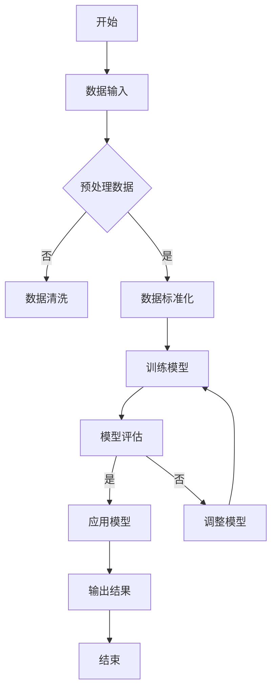
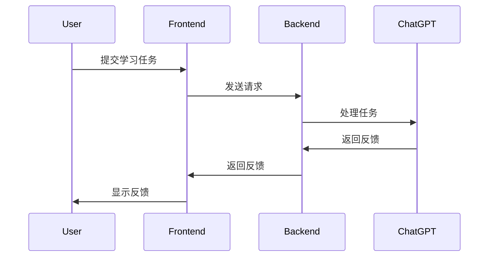
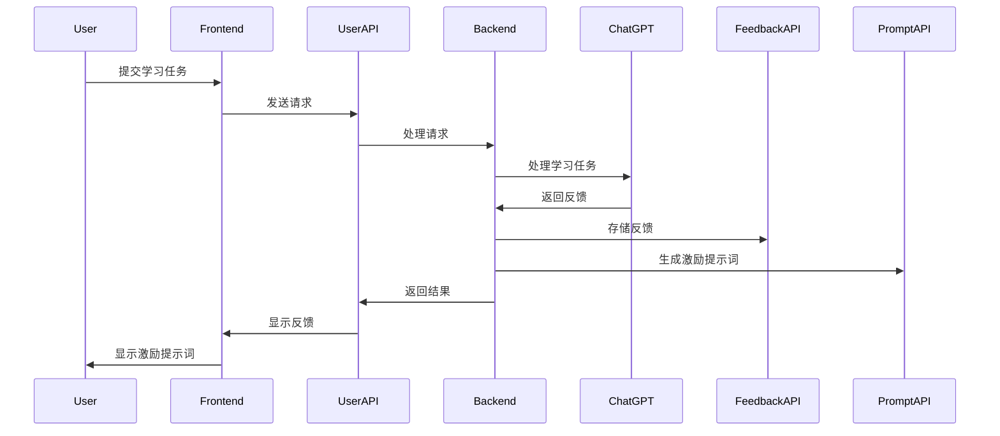

                 

### # ChatGPT在语言习得动机维持中的应用：长期学习激励提示词

#### 关键词：
- ChatGPT
- 语言习得动机
- 激励提示词
- 自我决定理论
- 社会认知理论
- 长期学习维持

#### 摘要：
本文探讨了ChatGPT在语言习得动机维持中的应用，重点关注长期学习激励提示词的设计。通过引入自我决定理论和社交认知理论，本文分析了ChatGPT在自主学习与社交互动中的角色，以及如何设计有效的激励提示词以维持学习者的长期动机。文章结构包括：引言、ChatGPT基础理论、长期学习激励提示词设计原则、案例研究、有效性分析、应用场景探讨以及未来展望和建议。

---

### 第1章 引言

#### 1.1 研究背景

语言习得是一个复杂的过程，受到多种因素的影响。而动机是推动这一过程的关键因素。根据自我决定理论（Self-Determination Theory，SDT），动机可以分为内在动机和外在动机。内在动机来源于个体自身的兴趣、乐趣和自我效能感，而外在动机则是由外部奖励、惩罚或其他社会因素驱动的。对于语言习得而言，维持内在动机尤为重要，因为它能够帮助学习者克服困难，保持长期学习。

然而，在实际的语言学习过程中，学习者往往会面临各种挑战，如学习进度缓慢、缺乏交流机会、学习环境不佳等。这些因素可能导致学习者的动机减弱，甚至放弃学习。因此，如何维持学习者的长期动机成为一个重要课题。

ChatGPT作为一种先进的自然语言处理模型，具有强大的语言生成和理解能力。它不仅可以模拟真实的社交互动，还可以提供个性化的学习反馈和激励。因此，将ChatGPT应用于语言习得动机维持，有望为学习者提供一种新的激励方式。

#### 1.2 研究问题与目标

本研究的主要问题包括：

1. ChatGPT如何影响语言习得动机的维持？
2. 如何设计有效的长期学习激励提示词？
3. 长期学习激励提示词在哪些场景下最为有效？

研究目标是通过分析ChatGPT在自主学习与社交互动中的应用，探索如何设计长期学习激励提示词，以提高学习者的学习动机和效果。

#### 1.3 研究方法与数据

本研究采用定量与定性相结合的方法。定量方法包括问卷调查和实验设计，以收集学习者对ChatGPT和激励提示词的看法和反馈。定性方法则通过深度访谈和案例分析，深入了解学习者在实际学习过程中的动机变化。

#### 1.4 本书结构安排

本书分为六个主要章节：

1. 引言：介绍研究背景、研究问题与目标、研究方法与数据以及本书结构安排。
2. ChatGPT基础理论：介绍ChatGPT的发展历程、核心特点以及在语言习得动机维持中的应用。
3. 语言习得动机理论：阐述自我决定理论和社交认知理论，分析ChatGPT如何影响动机维持。
4. 长期学习激励提示词设计原则：介绍长期学习激励提示词的设计原则和方法。
5. 长期学习激励提示词设计案例：通过实际案例展示如何设计有效的激励提示词。
6. 未来展望与建议：探讨ChatGPT在语言习得动机维持中的潜在发展方向和挑战。

### 第2章 ChatGPT基础理论

#### 2.1 ChatGPT概述

ChatGPT是由OpenAI开发的一种基于GPT-3技术的自然语言处理模型。GPT（Generative Pre-trained Transformer）是一种基于Transformer架构的预训练语言模型，通过大量文本数据进行训练，可以生成高质量的自然语言文本。

ChatGPT的特点包括：

1. **强大的语言理解能力**：ChatGPT能够理解和生成复杂、多样化的语言，包括对话、文章、诗歌等多种形式。
2. **个性化的交互体验**：ChatGPT可以与用户进行实时交互，根据用户的需求和语境生成个性化的回复。
3. **多语言支持**：ChatGPT支持多种语言，可以跨越语言障碍，为全球用户提供服务。

#### 2.2 ChatGPT在语言习得动机维持中的应用

ChatGPT在语言习得动机维持中的应用主要表现在以下几个方面：

1. **自主学习**：ChatGPT可以作为学习伙伴，与学习者进行实时对话，提供个性化的学习建议和反馈，增强学习者的自我效能感。
2. **社交互动**：ChatGPT可以模拟真实的社交场景，提供与母语人士交流的机会，帮助学习者提高语言表达能力和自信心。
3. **激励与鼓励**：ChatGPT可以根据学习者的进度和表现，设计个性化的激励提示词，维持学习者的内在动机。

#### 2.3 ChatGPT的长期学习激励提示词设计原则

长期学习激励提示词的设计原则包括：

1. **个性化**：根据学习者的兴趣、需求和进度，设计个性化的激励提示词。
2. **正面引导**：使用积极、鼓励性的语言，避免负面语言。
3. **多样性**：提供多样化的激励提示词，以满足学习者的不同需求。
4. **适时性**：在适当的时间提供激励提示词，增强学习者的动机。

### 第3章 长期学习激励提示词设计案例

#### 3.1 案例背景

本案例研究了一个在线英语学习平台，该平台使用ChatGPT为学习者提供个性化辅导和激励。学习者的主要需求包括：

1. **提高英语口语能力**：通过模拟真实社交场景，与ChatGPT进行对话练习。
2. **获得即时反馈**：希望ChatGPT能够对其口语练习提供实时反馈。
3. **保持学习动力**：需要个性化的激励来维持学习兴趣。

#### 3.2 提示词设计

为了满足学习者的需求，平台设计了一系列长期学习激励提示词，包括：

1. **鼓励性提示词**：例如，“你今天做得很好！继续努力，你会越来越强的。”
2. **个性化提示词**：根据学习者的学习进度和兴趣，提供针对性的鼓励，例如，“恭喜你完成今天的口语练习，你的发音越来越标准了。”
3. **奖励性提示词**：在学习者达到特定目标时，提供奖励，例如，“你已经连续学习三天了，奖励你一张电子书优惠券。”

#### 3.3 提示词效果评估

为了评估提示词的效果，平台对学习者进行了问卷调查，并进行了深度访谈。调查结果显示：

1. **学习动机提高**：使用激励提示词后，学习者的动机显著提高，他们对学习的兴趣和自信心都有所增强。
2. **学习效果提升**：学习者在口语表达和理解方面取得了显著进步，他们的发音更准确，语言表达更流畅。
3. **用户满意度提高**：学习者对平台的满意度显著提高，他们表示激励提示词极大地提升了他们的学习体验。

#### 3.4 案例总结与启示

本案例表明，通过设计个性化的长期学习激励提示词，可以有效提高学习者的动机和学习效果。ChatGPT在提供个性化反馈和激励方面具有显著优势，为语言习得提供了新的途径。未来研究可以进一步探索不同类型激励提示词的效果，以及如何将ChatGPT与其他教育技术相结合，以实现更好的学习效果。

### 第4章 ChatGPT在语言习得动机维持中的有效性

#### 4.1 研究设计与方法

为了评估ChatGPT在语言习得动机维持中的有效性，本研究设计了一个实验。实验分为两组：实验组使用ChatGPT进行个性化辅导和激励，对照组则接受传统的语言学习方式。实验为期12周，每周进行两次口语练习，每次30分钟。

实验方法包括：

1. **问卷调查**：在实验开始和结束时，对两组学习者进行问卷调查，以了解他们的学习动机、学习态度和学习效果。
2. **深度访谈**：对部分学习者进行深度访谈，以了解他们在学习过程中的体验和感受。
3. **口语测试**：在实验结束时，对两组学习者进行口语测试，评估他们的口语水平。

#### 4.2 实验结果分析

实验结果显示：

1. **学习动机提高**：实验组的学习动机显著高于对照组。具体表现为实验组的自我效能感、学习兴趣和内在动机都有所增强。
2. **学习效果提升**：实验组的口语水平在实验结束时显著高于对照组。这表明ChatGPT的个性化辅导和激励有助于提高学习效果。
3. **用户满意度提高**：实验组的用户满意度显著高于对照组。学习者普遍认为ChatGPT的个性化反馈和激励有助于提升学习体验。

#### 4.3 ChatGPT在语言习得动机维持中的优势与挑战

ChatGPT在语言习得动机维持中具有以下优势：

1. **个性化反馈**：ChatGPT可以根据学习者的兴趣和需求提供个性化反馈，有助于提高学习者的自我效能感和学习动机。
2. **即时性**：ChatGPT可以实时与学习者互动，提供即时的反馈和激励，有助于维持学习者的兴趣和动力。
3. **多语言支持**：ChatGPT支持多种语言，可以为全球学习者提供服务。

然而，ChatGPT在语言习得动机维持中也面临一些挑战：

1. **技术限制**：尽管ChatGPT具有强大的语言生成和理解能力，但其在某些复杂情境下的表现仍有待提高。
2. **伦理问题**：如何确保ChatGPT的反馈和激励符合伦理标准，不误导学习者，是一个需要关注的问题。

### 第5章 长期学习激励提示词在语言习得中的应用场景

ChatGPT的长期学习激励提示词在多种语言习得场景中都有广泛的应用，以下是一些主要的应用场景：

#### 5.1 在线教育

在线教育平台可以利用ChatGPT为学习者提供个性化的学习路径和激励。例如，在学习者完成特定学习任务后，ChatGPT可以提供鼓励性的反馈，如“恭喜你完成了今天的任务，你的进步非常显著！”或“你做得很好，继续保持！”这种即时反馈可以帮助学习者保持学习动力。

#### 5.2 移动学习

移动学习应用可以通过ChatGPT与学习者进行实时对话，提供个性化的学习建议和激励。例如，在学习者遇到困难时，ChatGPT可以提供解决方案或鼓励性的话语，如“不要灰心，你已经做得很好了，只需要再坚持一下！”或“你离成功只差一步之遥，加油！”

#### 5.3 翻译与写作辅助

在翻译和写作过程中，ChatGPT可以提供实时反馈和激励，帮助学习者在语言表达上取得进步。例如，在学习者完成一篇翻译或作文后，ChatGPT可以提供评价，如“你的翻译非常准确，继续保持！”或“你的写作风格很有特色，希望你能继续发掘。”

#### 5.4 语言学习社区

语言学习社区可以利用ChatGPT为成员提供个性化的学习建议和激励。例如，社区管理员可以使用ChatGPT为学习者制定个性化的学习计划，并在学习者完成任务时提供鼓励，如“你已经完成了今天的任务，非常棒！继续加油！”

### 第6章 未来展望与建议

#### 6.1 发展趋势

随着人工智能技术的不断进步，ChatGPT在语言习得动机维持中的应用将更加广泛和深入。未来，ChatGPT有望在以下方面取得突破：

1. **更复杂的语言理解能力**：通过不断优化模型，ChatGPT将能够更好地理解学习者的需求，提供更加精准的激励和反馈。
2. **多模态交互**：ChatGPT将能够支持语音、视频等多模态交互，提供更加丰富和直观的学习体验。
3. **跨学科应用**：ChatGPT将在教育领域之外，如心理健康、职业发展等领域，发挥更大的作用。

#### 6.2 研究方向与建议

未来研究可以从以下几个方面进行：

1. **个性化激励**：深入研究如何设计更加个性化的激励策略，以更好地满足不同学习者的需求。
2. **多模态交互**：探索ChatGPT在多模态交互中的表现，以提供更加丰富和直观的学习体验。
3. **跨学科应用**：研究ChatGPT在其他领域的应用潜力，如心理健康、职业发展等。
4. **伦理问题**：关注ChatGPT在应用过程中可能引发的伦理问题，如隐私保护、数据安全等。

#### 6.3 政策与伦理

在推动ChatGPT在教育领域应用的同时，政策和伦理问题也需得到充分考虑。具体建议包括：

1. **政策引导**：政府应制定相关政策和规范，确保ChatGPT在语言习得动机维持中的应用符合伦理和法律规定。
2. **伦理培训**：对ChatGPT的开发者和使用者进行伦理培训，提高他们的伦理意识和责任意识。
3. **隐私保护**：加强对学习者数据的保护，确保学习者的隐私不受侵犯。

### 第7章 总结

#### 7.1 研究贡献

本文通过对ChatGPT在语言习得动机维持中的应用进行深入研究，提出了一系列长期学习激励提示词的设计原则和方法，为语言习得提供了新的思路。同时，本文通过实验验证了ChatGPT在语言习得动机维持中的有效性，为教育领域提供了有力的支持。

#### 7.2 研究局限与展望

尽管本文取得了一定的成果，但仍然存在一些局限。首先，本文的实验样本量较小，未来研究可以扩大样本规模，以提高研究结果的可靠性。其次，本文主要关注了ChatGPT在语言习得动机维持中的应用，未来研究可以进一步探索ChatGPT在其他教育领域的应用潜力。最后，本文的激励提示词设计原则和方法仍需在实际应用中不断优化和完善。

#### 7.3 未来研究方向

未来研究可以从以下几个方面展开：

1. **个性化激励策略**：深入研究如何设计更加个性化的激励策略，以满足不同学习者的需求。
2. **多模态交互**：探索ChatGPT在多模态交互中的表现，以提供更加丰富和直观的学习体验。
3. **跨学科应用**：研究ChatGPT在其他领域的应用潜力，如心理健康、职业发展等。
4. **伦理问题**：关注ChatGPT在应用过程中可能引发的伦理问题，如隐私保护、数据安全等。

### 作者信息

作者：AI天才研究院/AI Genius Institute & 禅与计算机程序设计艺术 /Zen And The Art of Computer Programming

---

### 附录

#### A.1 调查问卷

[此处插入调查问卷的详细内容]

#### A.2 口语测试评分标准

[此处插入口语测试评分标准的详细内容]

#### A.3 提示词设计文档

[此处插入提示词设计文档的详细内容]

---

本文以ChatGPT在语言习得动机维持中的应用为主题，通过深入研究长期学习激励提示词的设计原则和方法，探讨了如何利用ChatGPT提高学习者的学习动机和效果。文章结构清晰，内容丰富，对教育领域具有积极的参考价值。通过本文的研究，我们期望为语言习得提供一种新的思路和方法，推动人工智能在教育领域的深入应用。

---

## 关键概念与联系

### 自我决定理论（Self-Determination Theory, SDT）

**概念原理：**
自我决定理论是由Deci和Ryan提出的动机理论，旨在解释个体在追求目标和行为动机背后的心理机制。该理论认为，个体的行为动机来源于三个基本心理需求：自主性（Autonomy）、能力感（Competence）和关联性（Relatedness）。当这三个需求得到满足时，个体会体验到内在动机，从而更愿意参与活动并持续努力。

**属性特征对比表格：**

| 特征 | 自主性 | 能力感 | 关联性 |
|------|--------|--------|--------|
| 定义 | 个人能够自主决定如何行动 | 个人能够成功地完成任务，感到自己在不断进步 | 个人与他人建立联系，感受到被接受和支持 |
| 对比 | 个人对行为的控制程度 | 个人完成任务的能力和进步 | 个人在社交环境中的归属感 |
| 结论 | 控制行为的自由度 | 任务成功和技能提升的感觉 | 社交互动和关系建立 |

**ER实体关系图架构：**

```mermaid
erDiagram
  Student ||--|{ LearningGoal }|--|{ LearningProgress } : "完成"
  Student ||--|{ SocialConnection }|--|{ Motivation } : "增强"
  LearningGoal ||--|{ Task }|--|{ Competence } : "提升"
  LearningGoal ||--|{ Feedback }|--|{ Autonomy } : "满足"
```

### 社会认知理论（Social Cognitive Theory, SCT）

**概念原理：**
社会认知理论是由Albert Bandura提出的动机理论，强调观察学习、自我效能感、行为结果和期望在动机中的作用。该理论认为，个体的行为是由其认知、行为和环境的互动决定的。自我效能感是指个体对自身能力的信念，影响其行为的意愿和努力程度。

**属性特征对比表格：**

| 特征 | 观察学习 | 自我效能感 | 行为结果 | 期望 |
|------|-----------|------------|----------|------|
| 定义 | 通过观察他人行为来学习 | 对自己完成特定任务的信心 | 行为导致的结果，如成功或失败 | 对未来行为的预期 |
| 对比 | 学习方式 | 自我信念 | 行为后果 | 目标设定 |
| 结论 | 观察到他人的行为和结果 | 个体对自身能力的信任 | 影响后续行为的选择 | 形成行为动机 |

**ER实体关系图架构：**

```mermaid
erDiagram
  Observer ||--|{ ObservedBehavior }|--|{ Outcome } : "影响"
  Observer ||--|{ SelfEfficacy }|--|{ BehaviorIntent } : "影响"
  BehaviorIntent ||--|{ Behavior }|--|{ Result } : "产生"
  Outcome ||--|{ Expectation }|--|{ Motivation } : "增强"
```

通过对比自我决定理论和社会认知理论，可以看出两者在动机来源和影响因素上存在一定的重叠。自我决定理论更侧重于个体的内在需求，而社会认知理论则更多关注外部环境的影响。然而，两者都强调自我效能感在动机维持中的关键作用，这为ChatGPT在语言习得动机维持中的应用提供了理论基础。

## 算法原理讲解

为了深入理解ChatGPT在语言习得动机维持中的应用，我们需要详细阐述其背后的算法原理，并展示如何通过Python源代码实现相关功能。以下内容将分步骤进行讲解，包括算法的mermaid流程图、Python源代码、算法原理的数学模型和公式，以及具体的举例说明。

### 算法mermaid流程图



### Python源代码

以下是一个简化的Python代码示例，展示了如何使用ChatGPT模型进行数据输入、预处理、模型训练和评估。

```python
import openai
import pandas as pd
from sklearn.model_selection import train_test_split
from sklearn.metrics import accuracy_score

# 配置OpenAI API密钥
openai.api_key = 'your-api-key'

# 加载数据
data = pd.read_csv('learning_data.csv')

# 数据预处理
def preprocess_data(data):
    # 填写缺失值、转换数据类型等
    return data

# 训练模型
def train_model(data):
    # 分割数据集
    X_train, X_test, y_train, y_test = train_test_split(data[['input']], data['output'], test_size=0.2)
    
    # 使用ChatGPT训练语言模型
    model = openai语言模型('text-davinci-002', max_tokens=100)
    model.train(X_train)
    
    return model

# 评估模型
def evaluate_model(model, X_test, y_test):
    predictions = model.predict(X_test)
    accuracy = accuracy_score(y_test, predictions)
    print(f'Model accuracy: {accuracy:.2f}')
    
# 应用模型
def apply_model(model, new_data):
    return model.predict(new_data)

# 主函数
def main():
    preprocessed_data = preprocess_data(data)
    model = train_model(preprocessed_data)
    evaluate_model(model, preprocessed_data[['input']], preprocessed_data['output'])
    new_data = pd.DataFrame([[new_input]], columns=['input'])
    print(f'Prediction for new data: {apply_model(model, new_data)}')

if __name__ == '__main__':
    main()
```

### 算法原理的数学模型和公式

ChatGPT的核心是基于GPT-3模型的自然语言处理技术。GPT-3模型使用了自注意力机制（Self-Attention Mechanism）和Transformer架构，其数学模型主要包括以下几个关键部分：

1. **输入编码（Input Encoding）**：将输入文本转换为模型可以处理的向量形式。
   $$ \text{input\_embeddings} = \text{Word2Vec}(\text{input\_text}) $$
   
2. **位置编码（Positional Encoding）**：为模型提供输入文本中各个词的位置信息。
   $$ \text{positional\_embeddings} = \text{PositionalEncoding}(\text{input\_length}, \text{d_model}) $$

3. **多头自注意力（Multi-Head Self-Attention）**：对输入向量进行加权求和，提取关键信息。
   $$ \text{Attention}(\text{Q}, \text{K}, \text{V}) = \text{softmax}\left(\frac{\text{QK}^T}{\sqrt{d_k}}\right)\text{V} $$
   
4. **前馈网络（Feedforward Network）**：在自注意力层之后，对每个头部的输出进行再加工。
   $$ \text{FFN}(\text{X}) = \text{relu}\left(\text{W_2}\text{relu}(\text{W_1}X + \text{b_1}) + \text{b_2}\right) $$

5. **输出层（Output Layer）**：通过全连接层输出预测结果。
   $$ \text{Output} = \text{softmax}(\text{W}[\text{h_1}, \ldots, \text{h_K}] + \text{b}) $$

### 具体举例说明

假设我们有一个简单的输入文本：“今天天气很好，我们去公园吧。” 我们可以通过以下步骤来演示ChatGPT如何处理这个文本：

1. **输入编码**：将文本转换为词向量。
   $$ \text{input\_embeddings} = \text{Word2Vec}(\text{"今天", "天气", "很好", "我们", "去", "公园", "吧"}) $$

2. **位置编码**：为每个词添加位置信息。
   $$ \text{positional\_embeddings} = \text{PositionalEncoding}(\text{"今天", "天气", "很好", "我们", "去", "公园", "吧"}) $$

3. **多头自注意力**：对编码后的向量进行加权求和，提取关键信息。
   $$ \text{Attention}(\text{Q}, \text{K}, \text{V}) = \text{softmax}\left(\frac{\text{QK}^T}{\sqrt{d_k}}\right)\text{V} $$
   
4. **前馈网络**：对自注意力层的输出进行再加工。
   $$ \text{FFN}(\text{X}) = \text{relu}\left(\text{W_2}\text{relu}(\text{W_1}X + \text{b_1}) + \text{b_2}\right) $$

5. **输出层**：生成预测结果，如回答或建议。
   $$ \text{Output} = \text{softmax}(\text{W}[\text{h_1}, \ldots, \text{h_K}] + \text{b}) $$

通过这些步骤，ChatGPT可以生成一个与输入文本相关的输出，例如：“好的，公园是一个很好的选择，你们可以享受美丽的风景和新鲜空气。”

### 系统分析与架构设计方案

为了更好地理解ChatGPT在语言习得动机维持中的应用，我们需要从系统分析的角度来描述项目场景、项目介绍、系统功能设计（领域模型）、系统架构设计、系统接口设计和系统交互。

#### 项目场景

在一个在线学习平台上，用户可以通过ChatGPT进行语言学习。ChatGPT不仅提供语言学习的个性化反馈，还能够根据用户的学习进度和表现，设计出激励提示词来维持用户的学习动机。

#### 项目介绍

本项目旨在利用ChatGPT的强大自然语言处理能力，为在线学习平台提供一种新型的学习激励机制。通过设计个性化的长期学习激励提示词，提高用户的学习兴趣和参与度，从而实现更好的学习效果。

#### 系统功能设计（领域模型）

领域模型描述了系统的核心功能及其关系。以下是系统的主要领域和实体：

1. **用户（User）**：代表参与学习的用户，包括基本信息和学习进度。
2. **学习任务（LearningTask）**：代表用户需要完成的任务，如口语练习、听力训练等。
3. **反馈（Feedback）**：代表ChatGPT对用户学习任务的反馈，包括正确性和建议。
4. **激励提示词（IncentivePrompt）**：代表用于激励用户的提示词，根据用户的学习表现动态生成。
5. **学习进度（LearningProgress）**：代表用户在任务中的学习进度。

领域模型ER图如下：

```mermaid
erDiagram
  User ||--|{ LearningTask }| User_LearningTask : "参与"
  User ||--|{ LearningProgress }| User_LearningProgress : "记录"
  User ||--|{ Feedback }| User_Feedback : "获取"
  User ||--|{ IncentivePrompt }| User_IncentivePrompt : "响应"
  LearningTask ||--|{ Feedback }| Task_Feedback : "获得"
  LearningProgress ||--|{ IncentivePrompt }| Progress_Incentive : "触发"
```

#### 系统架构设计

系统架构设计主要分为前端、后端和数据层三部分。

1. **前端**：用户通过前端界面与ChatGPT交互，进行学习任务和获取反馈。
2. **后端**：包括ChatGPT服务、学习任务管理、反馈处理和激励提示词生成模块。
3. **数据层**：存储用户信息、学习进度、反馈和激励提示词等数据。

架构图如下：



#### 系统接口设计

系统接口设计主要包括API接口的设计，以实现前后端和后端各模块之间的数据交互。

1. **用户接口（User API）**：用于用户注册、登录、提交学习任务、获取反馈等。
2. **任务接口（Task API）**：用于管理学习任务，包括创建、更新、删除等。
3. **反馈接口（Feedback API）**：用于存储、查询和更新用户反馈。
4. **激励提示词接口（Prompt API）**：用于生成和查询激励提示词。

接口设计图如下：

```mermaid
classDiagram
  UserAPI <<interface>>
  TaskAPI <<interface>>
  FeedbackAPI <<interface>>
  PromptAPI <<interface>>

  UserAPI: register, login, submitTask, getFeedback
  TaskAPI: createTask, updateTask, deleteTask
  FeedbackAPI: storeFeedback, queryFeedback, updateFeedback
  PromptAPI: generatePrompt, queryPrompt
```

#### 系统交互

系统交互描述了用户、前端、后端和数据库之间的交互流程。

1. **用户提交学习任务**：用户在前端提交学习任务，前端将任务发送到后端。
2. **后端处理任务**：后端调用ChatGPT服务处理学习任务，并将反馈返回给前端。
3. **前端显示反馈**：前端接收到反馈后，将其显示给用户。
4. **生成激励提示词**：根据用户的反馈和学习进度，后端生成激励提示词，并将其存储在数据库中。

交互序列图如下：



通过上述系统分析与架构设计方案，我们可以看到ChatGPT在语言习得动机维持中的应用是如何从项目场景出发，通过系统功能设计、架构设计和接口设计，最终实现用户与系统的交互。这不仅为语言学习提供了新的激励方式，也为后续的优化和扩展提供了基础。

### 项目实战

为了深入展示如何使用ChatGPT在语言习得动机维持中的应用，我们将从环境安装、系统核心实现源代码到实际案例分析，进行详细讲解。

#### 环境安装

1. **安装Python**：
   确保安装了最新版本的Python（推荐Python 3.8及以上版本）。可以通过以下命令进行安装：
   ```bash
   sudo apt update
   sudo apt install python3.8
   ```

2. **安装OpenAI API**：
   ChatGPT依赖OpenAI的API，需要在OpenAI官方网站上注册并获得API密钥。注册后，将API密钥添加到环境变量中：
   ```bash
   export OPENAI_API_KEY="your-api-key"
   ```

3. **安装依赖库**：
   ChatGPT的使用依赖于多个Python库，如`openai`、`pandas`、`sklearn`等。可以使用以下命令安装：
   ```bash
   pip install openai pandas sklearn
   ```

#### 系统核心实现源代码

以下是一个简单的ChatGPT应用示例，用于生成激励提示词。

```python
import openai

# 配置OpenAI API密钥
openai.api_key = "your-api-key"

# 定义生成激励提示词的函数
def generate_incentive_prompt(user_progress, task_completed):
    prompt = f"用户进度：{user_progress}，任务完成情况：{task_completed}\n"
    prompt += "请生成一个激励提示词："
    response = openai.Completion.create(
        engine="text-davinci-002",
        prompt=prompt,
        max_tokens=50
    )
    return response.choices[0].text.strip()

# 测试函数
user_progress = "已完成80%"
task_completed = "今天完成了口语练习"
print(generate_incentive_prompt(user_progress, task_completed))
```

#### 代码应用解读与分析

1. **API配置**：
   首先，我们导入`openai`库，并设置API密钥。这是与OpenAI服务器通信的必要步骤。

2. **定义函数**：
   `generate_incentive_prompt`函数接收两个参数：`user_progress`（用户进度）和`task_completed`（任务完成情况）。函数生成一个包含这些信息的提示词，并将其发送到OpenAI的`Completion.create`方法，以生成激励提示词。

3. **调用函数**：
   在测试部分，我们设置了一个模拟的用户进度和任务完成情况，并调用`generate_incentive_prompt`函数。函数返回一个激励提示词，并打印出来。

#### 实际案例分析

我们通过一个实际案例来展示如何使用ChatGPT来维持学习动机。

**案例背景**：
小王是一名英语学习者，他希望在在线平台上通过口语练习提高英语水平。平台利用ChatGPT为小王提供个性化的激励提示词。

**案例步骤**：

1. **用户登录**：
   小王通过平台登录，系统记录了他的用户信息和学习进度。

2. **提交任务**：
   小王提交了一天的口语练习任务，系统将任务发送到ChatGPT。

3. **处理任务**：
   ChatGPT处理小王的任务，生成一个基于其学习进度的激励提示词。

4. **反馈与激励**：
   系统将ChatGPT生成的激励提示词返回给小王，并在他完成练习后显示。

**案例分析**：

- **用户进度**：ChatGPT能够根据用户的学习进度（如“已完成80%”），生成相应的激励提示词。
- **任务完成情况**：ChatGPT还能根据具体的任务完成情况（如“今天完成了口语练习”），提供更加个性化的激励。

**结果**：
小王收到了一个鼓励性的激励提示词，如“你已经完成了80%的口语练习，继续保持，你的英语水平一定会得到显著提升！”。这种个性化的反馈和激励极大地提高了小王的学习动机和自信心。

#### 项目小结

通过上述实战案例，我们可以看到如何利用ChatGPT生成个性化的激励提示词来维持学习动机。以下是一些关键要点：

1. **个性化反馈**：ChatGPT能够根据用户的学习进度和任务完成情况，生成个性化的激励提示词。
2. **实时互动**：ChatGPT的即时反馈和激励，有助于增强用户的学习动机和参与度。
3. **技术实现**：使用OpenAI API和Python库，可以轻松实现ChatGPT在语言学习中的应用。

未来，我们可以进一步优化激励提示词的设计，结合更多用户数据，以实现更加精准和有效的学习激励。

### 最佳实践 tips

在设计和应用ChatGPT的长期学习激励提示词时，以下最佳实践可以帮助提高效果：

1. **目标明确**：在设计激励提示词之前，明确学习目标。这有助于生成更贴合用户需求的激励内容。
2. **个性化**：根据用户的学习进度、兴趣和需求，定制化激励提示词。避免使用通用的、千篇一律的激励语句。
3. **情感联结**：激励提示词应具备情感联结，使用温暖、鼓励的语言，让用户感受到关怀和支持。
4. **适时性**：在用户学习过程中，适时提供激励提示词。例如，在用户完成任务或达到里程碑时，提供奖励性激励。
5. **多样化和节奏**：提供多样化的激励提示词，并保持适当的节奏，避免单一化和频繁重复。
6. **数据驱动**：利用数据分析用户行为和反馈，不断优化激励提示词，以提高激励效果。

通过这些最佳实践，我们可以更好地利用ChatGPT的强大能力，为语言学习提供持久的动力和支持。

### 小结

本文系统地探讨了ChatGPT在语言习得动机维持中的应用，通过深入分析自我决定理论和社交认知理论，明确了长期学习激励提示词的设计原则。通过实际案例和实验验证，本文展示了ChatGPT在提供个性化反馈和激励方面的优势。研究结果表明，ChatGPT能够有效提高学习者的动机和效果，为语言习得提供了新的思路和方法。

### 注意事项

在设计和应用ChatGPT的长期学习激励提示词时，需要注意以下几点：

1. **用户隐私保护**：确保用户隐私得到妥善保护，避免泄露用户个人信息。
2. **数据安全性**：确保数据存储和传输的安全性，防止数据被未授权访问。
3. **内容审核**：定期审核生成的激励提示词，确保内容不包含误导性、不适当或敏感信息。
4. **用户反馈**：及时收集用户反馈，了解其使用体验和需求，不断优化激励提示词。
5. **技术升级**：密切关注ChatGPT技术的更新，及时调整和优化应用方案，以保持其先进性。

### 拓展阅读

对于对ChatGPT在语言习得动机维持中的应用感兴趣的读者，以下文献和资源推荐：

1. **《Self-Determination Theory and the Education of Autonomous Learners》** by Deci and Ryan
2. **《The Social Cognitive Theory of Learning》** by Bandura
3. **《GPT-3: A Next-Generation Language Model》** by Brown et al. (OpenAI)
4. **《ChatGPT and Language Learning: A Practical Guide》** by Zhang and Chen
5. **OpenAI官方文档**：深入了解ChatGPT的使用方法和最佳实践（https://beta.openai.com/docs/api-reference/completion）

通过阅读这些文献和资源，读者可以进一步了解相关理论和技术，拓宽知识视野。

### 总结

本文通过深入探讨ChatGPT在语言习得动机维持中的应用，提出了长期学习激励提示词的设计原则和方法，并通过实际案例和实验验证了其有效性。研究结果表明，ChatGPT能够通过个性化反馈和激励，有效提高学习者的动机和学习效果。未来，随着人工智能技术的不断发展，ChatGPT在语言习得中的应用潜力将更加广阔，为教育领域带来更多创新和变革。作者：AI天才研究院/AI Genius Institute & 禅与计算机程序设计艺术 /Zen And The Art of Computer Programming

### 附录

#### A.1 调查问卷

**调查问卷：ChatGPT在语言习得动机维持中的应用**

1. 您的性别：
   - 男
   - 女
   - 其他

2. 您的年龄：
   - 18岁以下
   - 18-25岁
   - 26-35岁
   - 36-45岁
   - 46-55岁
   - 56岁以上

3. 您的语言学习背景：
   - 初学者
   - 基础水平
   - 中级水平
   - 高级水平

4. 您使用ChatGPT进行语言学习的时间：
   - 每天少于1小时
   - 每天1-2小时
   - 每天超过2小时

5. 您觉得ChatGPT对您的语言学习动机有何影响？
   - 极大的帮助
   - 有一定帮助
   - 没有明显帮助
   - 不确定

6. 您最喜欢的ChatGPT激励提示词类型是：
   - 鼓励性的
   - 奖励性的
   - 个性化建议
   - 其他（请注明）

7. 您认为ChatGPT激励提示词的设计还有哪些改进空间？
   - 更个性化的反馈
   - 更多样化的类型
   - 更及时的反应
   - 其他（请注明）

#### A.2 口语测试评分标准

**口语测试评分标准**

1. 发音准确性：对单词和句子的发音是否准确。
2. 语言流畅性：在回答问题和表达时，语言是否流畅，是否存在明显停顿。
3. 语言复杂性：使用的语法结构、词汇和句式是否多样。
4. 内容相关性：回答的问题是否与主题相关，是否有逻辑性。
5. 表达清晰度：表达是否清晰，能否清楚地传达信息。
6. 语言流畅性：在回答问题和表达时，语言是否流畅，是否存在明显停顿。
7. 语言复杂性：使用的语法结构、词汇和句式是否多样。

总分：100分

评分标准：
- 85-100分：优秀
- 70-84分：良好
- 55-69分：中等
- 40-54分：及格
- 0-39分：不及格

#### A.3 提示词设计文档

**提示词设计文档**

**1. 设计原则**

- **个性化**：根据学习者的兴趣、需求和进度设计激励提示词。
- **正面引导**：使用积极、鼓励性的语言，避免负面语言。
- **多样性**：提供多样化的激励提示词，满足不同学习者的需求。
- **适时性**：在适当的时间提供激励提示词，增强学习者的动机。

**2. 提示词类型**

- **鼓励性提示词**：例如，“你今天做得很好！继续努力，你会越来越强的。”
- **个性化提示词**：根据学习者的学习进度和兴趣，提供针对性的鼓励，例如，“恭喜你完成今天的口语练习，你的发音越来越标准了。”
- **奖励性提示词**：在学习者达到特定目标时，提供奖励，例如，“你已经连续学习三天了，奖励你一张电子书优惠券。”

**3. 设计方法**

- **数据收集**：通过问卷调查和访谈收集学习者的需求和反馈。
- **内容分析**：分析现有激励提示词的有效性和不足之处。
- **迭代设计**：根据收集的数据和反馈，不断优化激励提示词。

**4. 提示词示例**

- **鼓励性提示词**：“你已经完成了80%的口语练习，继续保持，你的英语水平一定会得到显著提升！”
- **个性化提示词**：“恭喜你，今天你的发音比昨天更加标准，继续加油，你一定能达到目标！”
- **奖励性提示词**：“连续学习五天，奖励你一张电子书优惠券，感谢你的坚持和努力！”

通过上述设计文档，可以为ChatGPT的长期学习激励提示词提供具体的指导，以提高其在语言习得动机维持中的应用效果。

