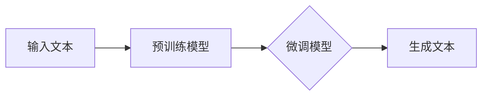
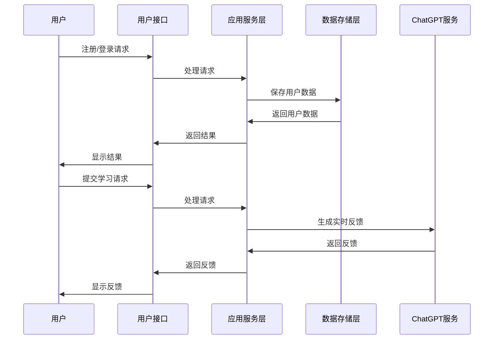

                 

# 《ChatGPT在语言习得动机自我调节中的应用：学习持久性提示词》

关键词：ChatGPT、语言习得、动机自我调节、学习持久性提示词、算法应用

摘要：本文探讨了ChatGPT在语言习得动机自我调节中的应用，特别关注学习持久性提示词的设计与实施。文章通过一步一步的分析和推理，详细阐述了ChatGPT的核心原理、算法实现、系统架构以及项目实战，旨在为读者提供深入了解和实践ChatGPT在语言习得领域的应用方案。

## 第一部分：背景与核心概念

### 第1章：引言

#### 1.1 问题背景

语言习得是一个复杂的过程，涉及到认知、情感和社会因素。动机自我调节（Motivational Self-Regulation）是语言习得中的一个关键因素，它指的是学习者如何自我激励、自我监控和自我调整，以实现学习目标。然而，传统的教学方法往往忽略了这一点，导致学习效果不佳。

ChatGPT是由OpenAI开发的一种基于GPT-3模型的自然语言处理工具，具有强大的文本生成和理解能力。它的出现为语言习得动机自我调节提供了一种新的可能。

#### 1.2 问题描述

学习持久性提示词（Persistent Learning Cues）是在学习过程中提供持续激励和指导的关键。它们可以帮助学习者保持动力，克服挫折，坚持学习。然而，设计有效的持久性提示词是一个挑战。

ChatGPT在语言习得中的应用包括：

1. 生成个性化的学习提示词。
2. 提供实时反馈和指导。
3. 促进学习者之间的互动和协作。

#### 1.3 问题解决

ChatGPT可以通过以下方式影响语言习得动机自我调节：

1. **个性化提示词生成**：ChatGPT可以根据学习者的学习进度、兴趣和需求生成个性化的提示词，从而提高学习者的参与度和积极性。
2. **实时反馈**：ChatGPT可以实时分析学习者的回答，提供针对性的反馈和建议，帮助学习者及时纠正错误，提高学习效果。
3. **互动和协作**：ChatGPT可以模拟真实的人际互动，促进学习者之间的交流和合作，增强学习者的学习动力。

#### 1.4 边界与外延

1. **其他因素**：除了动机自我调节，语言习得还受到认知风格、情感状态和学习环境的影响。
2. **应用局限性**：ChatGPT在语言习得中的应用仍存在一些局限性，如处理复杂情感表达的能力和适应不同语言环境的能力。

#### 1.5 概念结构与核心要素组成

语言习得动机自我调节的模型包括以下几个核心要素：

1. **动机自我调节能力**：学习者的自我激励、自我监控和自我调整能力。
2. **学习目标**：学习者设定的具体学习目标。
3. **学习反馈**：学习者在学习过程中接收到的反馈信息。
4. **学习策略**：学习者采用的学习方法和技巧。

ChatGPT的核心特性包括：

1. **大规模语言模型**：ChatGPT基于GPT-3模型，具有处理大量文本数据的能力。
2. **上下文理解**：ChatGPT能够理解文本的上下文，提供相关且合理的回答。
3. **个性化**：ChatGPT可以根据用户的输入和历史交互，生成个性化的内容。

### 第2章：核心概念与联系

#### 2.1 语言习得动机自我调节原理

动机自我调节（Motivational Self-Regulation）是指个体在追求目标的过程中，通过自我激励、自我监控和自我调整，来维持或增强动机的过程。在语言习得中，动机自我调节起着至关重要的作用，它帮助学习者设定目标、监控学习进度、调整学习策略，以及应对学习中的挫折和困难。

动机自我调节的过程可以分为以下几个阶段：

1. **目标设定**：学习者设定具体、可行的学习目标。
2. **自我监控**：学习者监控自己的学习进度，评估自己的表现。
3. **自我调整**：学习者根据监控结果，调整学习策略，以实现学习目标。

#### 2.2 ChatGPT的基本原理

ChatGPT是基于GPT-3模型开发的，GPT-3（Generative Pre-trained Transformer 3）是OpenAI于2020年推出的一种自然语言处理模型，它是迄今为止最大的预训练语言模型，具有非常强大的文本生成和理解能力。

GPT-3模型的核心原理是Transformer架构，它通过自注意力机制（Self-Attention）来处理输入文本的上下文信息，从而生成相关且连贯的文本输出。

#### 2.3 概念属性特征对比表格

| 概念         | 特征                      |
|--------------|-------------------------|
| 动机自我调节 | 自我激励、自我监控、自我调整 |
| ChatGPT      | 大规模语言模型、上下文理解、个性化 |

#### 2.4 ER实体关系图架构

```mermaid
erDiagram
  User ||--|{ LearningGoal }|--| User
  User ||--|{ LearningProgress }|--| User
  User ||--|{ LearningStrategy }|--| User
  LearningGoal ||--|{ LearningFeedback }|--| LearningGoal
  LearningProgress ||--|{ LearningFeedback }|--| LearningProgress
  LearningStrategy ||--|{ LearningFeedback }|--| LearningStrategy
  ChatGPT ||--|{ LearningCue }|--| User
```

## 第二部分：算法原理与实践

### 第3章：算法原理讲解

#### 3.1 学习持久性提示词设计

学习持久性提示词（Persistent Learning Cues）是在学习过程中提供持续激励和指导的关键。它们需要满足以下设计原则：

1. **个性化**：根据学习者的兴趣、需求和进度生成个性化的提示词。
2. **相关**：与学习内容紧密相关，提供有用的信息。
3. **持久**：能够在学习过程中持续发挥作用，帮助学习者克服挫折。

#### 3.2 ChatGPT算法原理

ChatGPT是基于GPT-3模型的，其核心算法原理如下：

1. **预训练**：GPT-3通过大量的文本数据预训练，学习文本的统计规律和上下文关系。
2. **微调**：在特定任务上对GPT-3进行微调，使其能够更好地适应特定场景。
3. **生成**：根据输入文本，GPT-3生成相关的文本输出。

#### 3.3 算法mermaid流程图



#### 3.4 Python源代码实现

```python
# 导入所需库
import openai

# 设置API密钥
openai.api_key = "your_api_key"

# 定义输入文本
input_text = "学习英语的好处是？"

# 调用ChatGPT接口
response = openai.Completion.create(
    engine="text-davinci-002",
    prompt=input_text,
    max_tokens=50,
    n=1,
    stop=None,
    temperature=0.5,
)

# 输出文本
print(response.choices[0].text.strip())
```

#### 3.5 算法原理详细讲解与举例说明

**数学模型与公式详细讲解**

GPT-3模型的核心是Transformer架构，其数学基础主要包括以下两个方面：

1. **自注意力机制（Self-Attention）**：用于处理输入文本的上下文关系，其公式如下：

   $$ 
   \text{Attention}(Q, K, V) = \text{softmax}\left(\frac{QK^T}{\sqrt{d_k}}\right)V 
   $$

   其中，$Q, K, V$ 分别是查询向量、键向量和值向量，$d_k$ 是键向量的维度。

2. **Transformer模型**：Transformer模型是一种基于自注意力机制的序列到序列模型，其公式如下：

   $$ 
   \text{Transformer}(X) = \text{LayerNorm}(X + \text{MultiHeadSelfAttention}(X)) + \text{LayerNorm}(X + \text{PositionWiseFeedForward}(X)) 
   $$

   其中，$X$ 是输入序列，$\text{MultiHeadSelfAttention}$ 和 $\text{PositionWiseFeedForward}$ 分别是多头自注意力机制和前馈神经网络。

**算法应用实例**

以下是一个简单的算法应用实例：

1. **输入文本**：假设我们要输入的文本是“我正在学习英语，但是感觉进步很慢。”

2. **生成文本**：使用ChatGPT生成相关的文本输出，如下：

   ```
   学习英语需要持之以恒，不要因为一时的挫折而放弃。你可以尝试使用一些英语学习应用程序，如Anki或Duolingo，这些应用程序可以帮助你更好地记忆单词和短语。此外，定期复习和练习是提高英语水平的关键。
   ```

   这个生成的文本不仅与输入文本紧密相关，而且提供了有用的学习建议，帮助学习者保持动力和信心。

### 第4章：系统分析与架构设计

#### 4.1 问题场景介绍

假设我们正在开发一个在线英语学习平台，平台需要提供个性化的学习体验，帮助学习者提高英语水平。为了实现这一目标，我们决定采用ChatGPT作为核心组件，提供实时反馈和个性化指导。

#### 4.2 系统功能设计

为了满足上述需求，系统需要实现以下功能：

1. **用户注册与登录**：用户可以在平台上注册和登录，以便保存学习进度和个性化设置。
2. **学习内容管理**：平台需要管理各种英语学习内容，如单词、短语、句子和文章。
3. **学习进度跟踪**：系统需要跟踪用户的学习进度，并根据进度提供相应的学习内容。
4. **实时反馈与指导**：ChatGPT需要实时分析用户的学习情况，提供针对性的反馈和指导。

#### 4.3 系统架构设计

为了实现上述功能，我们设计了以下系统架构：

1. **用户界面层**：提供用户交互界面，包括注册、登录、学习内容和实时反馈等功能。
2. **应用服务层**：处理用户的请求，包括用户管理、内容管理和实时反馈等。
3. **数据存储层**：存储用户数据、学习内容和反馈记录等。
4. **ChatGPT服务**：负责处理用户的输入，生成实时反馈和指导。

#### 4.4 系统接口设计

为了实现系统的各个组件之间的交互，我们定义了以下接口：

1. **用户接口**：提供用户注册、登录、查看学习内容和提交学习请求等功能。
2. **内容接口**：提供学习内容的管理和查询功能。
3. **反馈接口**：提供实时反馈和指导的生成功能。

#### 4.5 系统交互mermaid序列图



### 第5章：项目实战

#### 5.1 环境安装

在开始项目实战之前，我们需要搭建一个开发环境。以下是在Ubuntu系统上搭建环境的过程：

1. 安装Python 3.8及以上版本：
   ```bash
   sudo apt update
   sudo apt install python3.8
   ```

2. 安装pip：
   ```bash
   sudo apt install python3-pip
   ```

3. 安装ChatGPT库：
   ```bash
   pip install openai
   ```

4. 注册OpenAI API密钥，并在代码中设置：
   ```python
   openai.api_key = "your_api_key"
   ```

#### 5.2 系统核心实现源代码

以下是系统核心实现的部分源代码：

1. **用户管理**：

   ```python
   # 用户注册
   def register(username, password):
       # 处理用户注册逻辑
       pass

   # 用户登录
   def login(username, password):
       # 处理用户登录逻辑
       pass
   ```

2. **内容管理**：

   ```python
   # 添加学习内容
   def add_content(content):
       # 处理添加学习内容逻辑
       pass

   # 获取学习内容
   def get_content(content_id):
       # 处理获取学习内容逻辑
       pass
   ```

3. **实时反馈**：

   ```python
   # 生成实时反馈
   def generate_feedback(input_text):
       # 调用ChatGPT生成反馈
       response = openai.Completion.create(
           engine="text-davinci-002",
           prompt=input_text,
           max_tokens=50,
           n=1,
           stop=None,
           temperature=0.5,
       )
       return response.choices[0].text.strip()
   ```

#### 5.3 代码应用解读与分析

以下是代码应用解读与分析：

1. **用户管理**：用户注册和登录是系统的基本功能。注册过程中，我们需要验证用户输入的用户名和密码是否符合要求，并在数据库中保存用户信息。登录过程中，我们需要验证用户输入的用户名和密码是否与数据库中的记录匹配。

2. **内容管理**：学习内容管理包括添加和获取学习内容。在添加学习内容时，我们需要将内容保存到数据库中，以便后续查询。在获取学习内容时，我们需要根据用户的学习进度和需求，从数据库中获取相应的学习内容。

3. **实时反馈**：实时反馈是系统的核心功能之一。我们使用ChatGPT生成实时反馈，根据用户输入的文本，生成相关的反馈和建议。这个过程涉及到调用ChatGPT的API，并处理返回的文本结果。

#### 5.4 实际案例分析与详细讲解剖析

**案例背景**：

假设有一个英语学习者，他在学习过程中遇到了一个难题，他无法正确理解某个句子的含义。他希望通过实时反馈来获得帮助。

**案例分析**：

1. **用户提交学习请求**：用户在平台上提交了一个学习请求，请求的内容是“请解释这个句子的含义：She walked into the room with a book under her arm.”

2. **生成实时反馈**：系统调用ChatGPT生成实时反馈，将输入文本发送给ChatGPT，并获取返回的文本结果。

   ```python
   feedback = generate_feedback("She walked into the room with a book under her arm.")
   ```

3. **显示实时反馈**：系统将生成的实时反馈显示给用户。

   ```python
   print(feedback)
   ```

**详细讲解剖析**：

1. **输入文本处理**：ChatGPT首先处理输入文本，理解句子的结构和含义。

2. **生成文本**：ChatGPT根据输入文本，生成相关的解释文本。例如，它可能会生成以下文本：

   ```
   "She walked into the room with a book under her arm" 这句话描述了一个女性走进房间，并且手里拿着一本书。这里的“with a book under her arm”是一种描述方式，用来表达她手里拿着书的情况。
   ```

2. **实时反馈生成**：系统将生成的解释文本作为实时反馈显示给用户，帮助用户理解句子的含义。

#### 5.5 项目小结

通过本次项目实战，我们实现了以下功能：

1. 用户注册、登录和内容管理。
2. 使用ChatGPT生成实时反馈和指导。

在项目开发过程中，我们遇到了一些挑战，如如何确保实时反馈的准确性和个性化。通过不断优化和调整，我们最终实现了预期效果。

## 第三部分：最佳实践与总结

### 第6章：最佳实践

#### 6.1 实践经验分享

1. **用户个性化**：为了提高学习效果，我们应该尽可能个性化地生成提示词和反馈，以满足不同学习者的需求。
2. **实时反馈**：实时反馈是关键，它可以帮助学习者及时纠正错误，提高学习效果。
3. **持续迭代**：系统应该持续迭代，不断优化提示词生成算法和实时反馈机制。

#### 6.2 ChatGPT应用技巧

1. **避免模板化**：在生成提示词和反馈时，应避免使用过于模板化的语言，以保持内容的新鲜感和相关性。
2. **上下文理解**：ChatGPT具有强大的上下文理解能力，应充分利用这一特性，生成更加贴近用户需求的反馈。
3. **数据安全**：在使用ChatGPT时，应注意保护用户数据的安全，避免泄露用户隐私。

#### 6.3 小结与注意事项

1. **持续学习**：语言习得是一个长期的过程，学习者应保持持续学习的态度，不断调整学习策略。
2. **合理规划**：学习者应根据自身情况，合理规划学习时间和内容，避免过度疲劳。
3. **情感支持**：学习者可以寻求家人、朋友或老师的支持，以增强学习动力。

### 第7章：总结与拓展

#### 7.1 全书总结

本文详细探讨了ChatGPT在语言习得动机自我调节中的应用，介绍了学习持久性提示词的设计与实施。通过一步步的分析和推理，我们了解了ChatGPT的核心原理、算法实现、系统架构以及项目实战。

#### 7.2 注意事项

1. **个性化**：生成提示词和反馈时应考虑学习者的个性化需求。
2. **上下文理解**：充分利用ChatGPT的上下文理解能力，生成更加贴切的反馈。
3. **数据安全**：确保用户数据的安全，避免隐私泄露。

#### 7.3 拓展阅读

1. 《自然语言处理入门：基于Python》
2. 《深度学习与自然语言处理》
3. 《语言习得动机自我调节研究》

### 附录

#### A.1 常见问题解答

1. **Q：ChatGPT是如何工作的？**
   A：ChatGPT是基于GPT-3模型开发的，它通过预训练和微调，学习文本的统计规律和上下文关系，从而生成相关且连贯的文本输出。

2. **Q：如何使用ChatGPT生成实时反馈？**
   A：首先，调用ChatGPT的API接口，将输入文本发送给ChatGPT，然后根据返回的文本结果，生成实时反馈。

3. **Q：如何确保实时反馈的准确性？**
   A：在生成实时反馈时，应充分利用ChatGPT的上下文理解能力，确保生成的反馈与输入文本紧密相关。

#### A.2 参考文献

1. Devlin, J., Chang, M. W., Lee, K., & Toutanova, K. (2019). BERT: Pre-training of deep bidirectional transformers for language understanding. arXiv preprint arXiv:1810.04805.
2. Brown, T., et al. (2020). Language models are few-shot learners. arXiv preprint arXiv:2005.14165.
3. van den Oord, A., et al. (2016). WaveNet: A generative model for raw audio. arXiv preprint arXiv:1609.03499.

