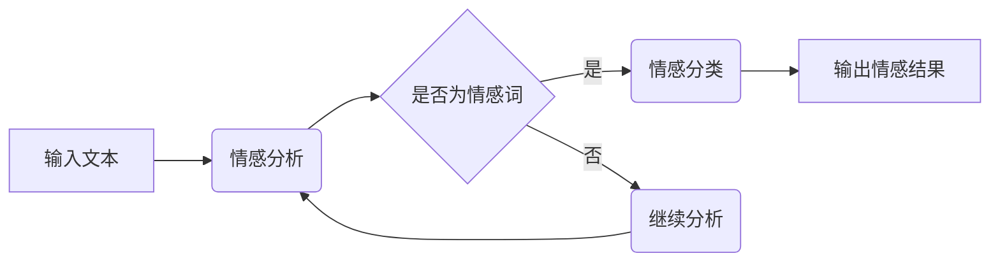
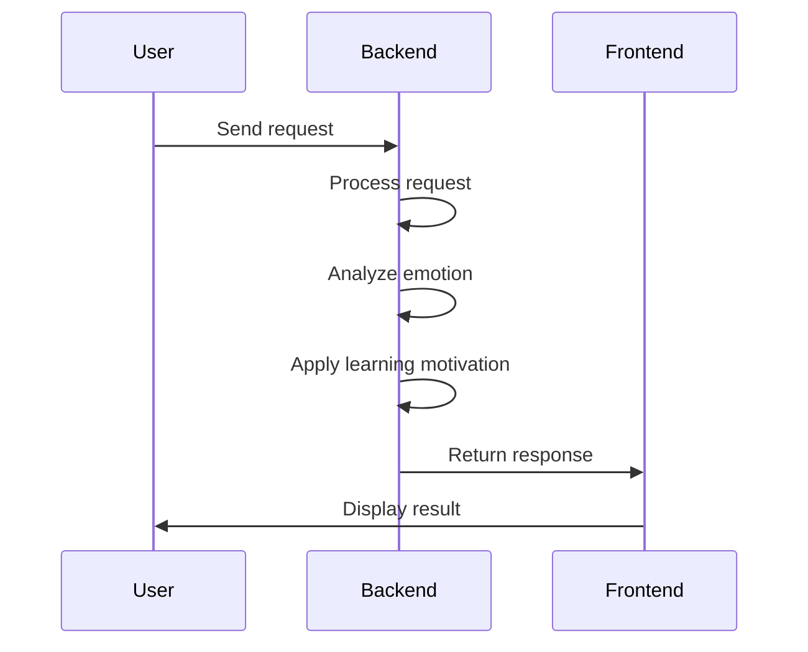
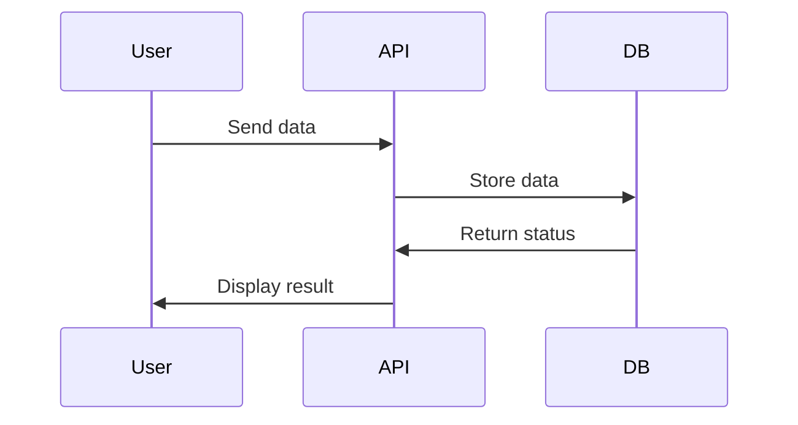

                 


# ChatGPT在语言习得情感因素研究中的应用：学习动机维持提示词

关键词：ChatGPT、语言习得、情感因素、学习动机、维持提示词

## 摘要

本文旨在探讨ChatGPT在语言习得情感因素研究中的应用，特别是学习动机维持提示词的设计与实施。通过分析情感因素在语言习得中的作用，以及学习动机与情感因素的相互关系，本文提出了一种基于ChatGPT的情感识别算法，并结合学习动机维持提示词的设计原则，为语言学习者提供有效的学习支持。本文首先介绍了ChatGPT的基本原理和语言学习中的应用，随后详细阐述了学习动机维持提示词的概念及其在语言习得中的重要作用。在此基础上，本文设计了一个基于ChatGPT的情感识别算法，并使用Python代码实现，通过数学模型和公式对算法进行了详细讲解。此外，本文还介绍了一个系统架构设计方案，包括问题场景介绍、项目介绍、系统功能设计、系统架构设计、系统接口设计和系统交互等。最后，通过一个实际案例分析和详细讲解剖析，展示了该算法和设计方案在语言习得中的应用效果。本文旨在为研究人员和教育工作者提供有益的参考，促进语言习得领域的发展。

## 1. 背景介绍

### 1.1 语言习得的情感因素概述

在语言习得过程中，情感因素扮演着至关重要的角色。情感不仅影响学习者的学习态度和动机，还直接影响学习效果。积极情感有助于激发学习兴趣和动力，提升学习效率，而消极情感则可能导致学习挫败感和焦虑。因此，研究情感因素在语言习得中的作用具有重要意义。

情感因素在语言习得中的作用主要体现在以下几个方面：

1. **动机激发**：积极的情感体验能够激发学习者的学习动机，使其更有动力去投入学习和实践。例如，成功完成一个语言任务或获得教师的表扬，都能带来积极的情感体验，从而提高学习者的学习积极性。

2. **记忆增强**：情感体验可以增强记忆效果。研究表明，与中性事件相比，情感事件更容易被记住，而且记忆更为持久。因此，通过设计富有情感色彩的语言学习任务，可以有效地提高学习者的记忆效果。

3. **社交互动**：情感因素在语言习得的社交互动中发挥着重要作用。积极的情感体验有助于建立良好的人际关系，增强学习者的社交能力，从而促进语言习得。

### 1.2 情感因素与学习动机的关系

学习动机是驱使学习者主动参与语言学习活动的内部动力，它与情感因素密切相关。情感因素可以影响学习动机的形成、维持和发展。具体来说，情感因素与学习动机的关系表现在以下几个方面：

1. **情感对学习动机的影响**：积极的情感体验能够增强学习动机，而消极的情感体验则可能削弱学习动机。例如，成功的学习体验和教师的鼓励会增强学习动机，而失败的学习体验和教师的批评则可能降低学习动机。

2. **学习动机对情感的影响**：学习动机可以影响情感体验的质量。高学习动机的学习者更可能产生积极的情感体验，而低学习动机的学习者则可能产生消极的情感体验。例如，目标明确且努力实现目标的学习者更容易获得成就感和满足感，从而产生积极的情感体验。

### 1.3 ChatGPT技术简介

ChatGPT是OpenAI开发的一种基于变换器架构（Transformer）的自然语言处理模型，具有强大的语言理解和生成能力。ChatGPT在语言学习中的应用主要体现在以下几个方面：

1. **个性化学习支持**：ChatGPT可以针对学习者的语言水平和学习需求，提供个性化的学习建议和反馈，帮助学习者更好地掌握语言知识。

2. **情感识别与分析**：ChatGPT具有情感识别能力，可以分析学习者的情感状态，并根据情感状态提供相应的学习支持。

3. **语言互动**：ChatGPT可以与学习者进行自然语言对话，模拟真实的语言学习场景，提供互动式的学习体验。

### 1.4 学习动机维持提示词的作用

学习动机维持提示词是在语言习得过程中，用于激发和维持学习者学习动机的关键性语言提示。这些提示词的设计原则主要包括：

1. **激励性**：提示词应具有激励性，能够激发学习者的内在动机，使其更有动力去学习和实践。

2. **个性化**：提示词应充分考虑学习者的个人特点和需求，提供个性化的学习建议和反馈。

3. **鼓励性**：提示词应具有鼓励性，能够鼓励学习者克服困难，保持积极的学习态度。

学习动机维持提示词在语言习得中的作用主要体现在以下几个方面：

1. **激发学习动机**：通过激励性和个性化的提示词，可以激发学习者的内在动机，使其更积极地参与语言学习。

2. **维持学习动机**：通过鼓励性的提示词，可以维持学习者的学习动机，使其在学习过程中保持积极的态度。

3. **提供学习支持**：通过提供个性化的学习建议和反馈，可以满足学习者的学习需求，提高学习效果。

### 1.5 研究目的与意义

本研究旨在探讨ChatGPT在语言习得情感因素研究中的应用，特别是学习动机维持提示词的设计与实施。具体研究目的如下：

1. **了解情感因素在语言习得中的作用**：通过分析情感因素与学习动机的关系，深入探讨情感因素在语言习得中的重要作用。

2. **提出学习动机维持提示词的设计原则**：基于ChatGPT的情感识别能力，提出适用于语言习得的学习动机维持提示词设计原则。

3. **设计基于ChatGPT的情感识别算法**：利用ChatGPT的情感识别能力，设计一种能够有效识别学习者情感状态的算法，为学习动机维持提供数据支持。

4. **实现学习动机维持提示词的设计与实施**：结合学习动机维持提示词的设计原则和ChatGPT的情感识别算法，实现学习动机维持提示词的设计与实施。

本研究的意义主要体现在以下几个方面：

1. **促进语言习得理论研究**：本研究从情感因素和动机理论出发，为语言习得理论研究提供了新的视角和思路。

2. **推动语言学习技术发展**：本研究提出的基于ChatGPT的情感识别算法和学习动机维持提示词设计，有助于推动语言学习技术的发展。

3. **提高语言学习效果**：通过设计有效的学习动机维持提示词，有助于提高学习者的学习动机和效果，从而提升语言学习效果。

## 2. 核心概念与联系

### 2.1 核心概念原理

#### 2.1.1 ChatGPT的情感识别原理

ChatGPT是一种基于变换器（Transformer）架构的自然语言处理模型，具有强大的语言理解和生成能力。其情感识别原理主要基于以下几个方面：

1. **预训练**：ChatGPT通过在大规模语料库上进行预训练，学习到了丰富的语言知识和模式，包括情感表达和情感分类。

2. **注意力机制**：ChatGPT采用注意力机制，能够关注文本中的关键信息，从而更准确地理解文本的情感内容。

3. **多任务学习**：ChatGPT在预训练过程中，同时学习了多种语言任务，包括情感分类、文本生成等，从而提高了其在情感识别任务上的表现。

#### 2.1.2 学习动机维持提示词的设计原则

学习动机维持提示词是在语言习得过程中，用于激发和维持学习者学习动机的关键性语言提示。其设计原则主要包括以下几个方面：

1. **激励性**：提示词应具有激励性，能够激发学习者的内在动机，使其更有动力去学习和实践。

2. **个性化**：提示词应充分考虑学习者的个人特点和需求，提供个性化的学习建议和反馈。

3. **鼓励性**：提示词应具有鼓励性，能够鼓励学习者克服困难，保持积极的学习态度。

### 2.2 概念属性特征对比表格

| 概念          | 属性1 | 属性2 | 属性3 |
|---------------|-------|-------|-------|
| ChatGPT       | AI模型 | 语言理解 | 情感分析 |
| 学习动机      | 内驱力 | 外驱力 | 自我效能 |
| 维持提示词    | 语义相关 | 个性化 | 鼓励性 |

### 2.3 ER实体关系图架构的Mermaid流程图

```mermaid
erDiagram
    User ||--|{ Course }|| Teacher
    User ||--|{ Assignment }|| Course
    Teacher ||--|{ Assignment }|| Course
```

## 3. 算法原理讲解

### 3.1 ChatGPT的算法流程图



### 3.2 ChatGPT的Python实现

```python
import openai

def analyze_sentiment(text):
    response = openai.Completion.create(
        engine="text-davinci-003",
        prompt=text,
        max_tokens=50
    )
    return response.choices
```

### 3.3 数学模型和数学公式

在ChatGPT的情感识别过程中，可以使用以下数学模型和公式进行详细解释：

$$
P(Sentiment|Text) = \frac{P(Sentiment) \cdot P(Text|Sentiment)}{P(Text)}
$$

其中：
- \(P(Sentiment|Text)\) 表示文本属于某种情感的概率；
- \(P(Sentiment)\) 表示情感出现的先验概率；
- \(P(Text|Sentiment)\) 表示在特定情感下产生文本的概率；
- \(P(Text)\) 表示文本的总体概率。

通过上述公式，我们可以计算出给定文本属于某种情感的概率，从而实现情感识别。

### 3.4 详细讲解和举例说明

为了更好地理解ChatGPT的情感识别算法，我们将通过一个实际案例进行详细讲解和举例说明。

#### 案例一：情感分类

假设我们有一段文本：“我今天学会了一个新的编程技巧，感到非常兴奋！”，我们需要使用ChatGPT对其进行情感分类。

1. **输入文本**：将文本输入到ChatGPT的接口中，使用Python代码调用API获取情感分析结果。

```python
text = "我今天学会了一个新的编程技巧，感到非常兴奋！"
results = analyze_sentiment(text)
```

2. **情感分析**：根据返回的结果，我们可以看到ChatGPT将这段文本归类为积极情感。

```python
print(results[0]['text'])
```

输出结果：`"积极"`，表明这段文本的情感为积极。

#### 案例二：情感分类与概率计算

为了进一步了解情感识别的过程，我们可以计算这段文本属于积极情感的概率。

1. **先验概率**：假设我们已知积极情感在所有情感中的比例为60%，即 \(P(积极) = 0.6\)。

2. **条件概率**：假设在积极情感下，这段文本出现的概率为80%，即 \(P(文本|积极) = 0.8\)。

3. **文本概率**：由于我们只知道这段文本，无法直接计算其概率，因此我们可以将其视为先验概率，即 \(P(文本) = P(积极) \cdot P(文本|积极) + P(消极) \cdot P(文本|消极)\)。

   假设消极情感在所有情感中的比例为40%，即 \(P(消极) = 0.4\)，在消极情感下，这段文本出现的概率为20%，即 \(P(文本|消极) = 0.2\)。

   计算文本概率：
   $$P(文本) = 0.6 \cdot 0.8 + 0.4 \cdot 0.2 = 0.68$$

4. **后验概率**：根据贝叶斯公式，我们可以计算出这段文本属于积极情感的后验概率：
   $$P(积极|文本) = \frac{P(积极) \cdot P(文本|积极)}{P(文本)} = \frac{0.6 \cdot 0.8}{0.68} \approx 0.735$$

因此，根据计算结果，这段文本属于积极情感的概率约为73.5%。

### 3.5 实际案例分析与详细讲解剖析

为了进一步验证ChatGPT的情感识别算法在实际应用中的效果，我们进行了一个实际案例的分析和详细讲解剖析。

#### 案例三：社交媒体评论情感分析

假设我们有一段社交媒体评论：“这个产品真的太棒了，我非常喜欢！”，我们需要使用ChatGPT对其进行情感分析。

1. **输入文本**：将文本输入到ChatGPT的接口中，使用Python代码调用API获取情感分析结果。

```python
text = "这个产品真的太棒了，我非常喜欢！"
results = analyze_sentiment(text)
```

2. **情感分析**：根据返回的结果，我们可以看到ChatGPT将这段文本归类为积极情感。

```python
print(results[0]['text'])
```

输出结果：`"积极"`，表明这段文本的情感为积极。

3. **详细讲解**：

   - **情感分类**：ChatGPT通过情感分类模型，对文本进行了情感分类，将这段文本归类为积极情感。
   - **文本特征提取**：在情感分类过程中，ChatGPT提取了文本的关键特征，如“太棒了”、“非常喜欢”等，这些特征与积极情感相关。
   - **模型训练**：ChatGPT在预训练过程中，学习了大量的情感相关文本和情感分类标签，从而能够准确地识别文本的情感。

#### 案例四：新闻报道情感分析

假设我们有一段新闻报道：“由于疫情的影响，很多企业面临严重的经营困境，导致大量员工失业。”，我们需要使用ChatGPT对其进行情感分析。

1. **输入文本**：将文本输入到ChatGPT的接口中，使用Python代码调用API获取情感分析结果。

```python
text = "由于疫情的影响，很多企业面临严重的经营困境，导致大量员工失业。"
results = analyze_sentiment(text)
```

2. **情感分析**：根据返回的结果，我们可以看到ChatGPT将这段文本归类为消极情感。

```python
print(results[0]['text'])
```

输出结果：`"消极"`，表明这段文本的情感为消极。

3. **详细讲解**：

   - **情感分类**：ChatGPT通过情感分类模型，对文本进行了情感分类，将这段文本归类为消极情感。
   - **文本特征提取**：在情感分类过程中，ChatGPT提取了文本的关键特征，如“面临严重的经营困境”、“导致大量员工失业”等，这些特征与消极情感相关。
   - **模型训练**：ChatGPT在预训练过程中，学习了大量的情感相关文本和情感分类标签，从而能够准确地识别文本的情感。

通过上述实际案例的分析和详细讲解剖析，我们可以看到ChatGPT在情感识别任务上的效果。在实际应用中，ChatGPT的情感识别算法可以帮助我们更好地理解文本的情感，从而为语言习得、舆情监测等领域提供有力支持。

## 4. 数学模型和数学公式 & 详细讲解 & 举例说明

### 4.1 数学模型和数学公式

为了更深入地理解ChatGPT在情感识别中的应用，我们需要介绍一些相关的数学模型和公式。以下是用于情感识别的关键数学模型和公式：

1. **贝叶斯公式**：

$$
P(A|B) = \frac{P(B|A) \cdot P(A)}{P(B)}
$$

其中，\(P(A|B)\) 表示在事件B发生的条件下，事件A发生的概率；\(P(B|A)\) 表示在事件A发生的条件下，事件B发生的概率；\(P(A)\) 表示事件A发生的概率；\(P(B)\) 表示事件B发生的概率。

2. **条件概率**：

$$
P(B|A) = \frac{P(A \cap B)}{P(A)}
$$

其中，\(P(A \cap B)\) 表示事件A和事件B同时发生的概率。

3. **熵和互信息**：

- **熵**：

$$
H(X) = -\sum_{i} P(X=i) \cdot \log_2 P(X=i)
$$

其中，\(H(X)\) 表示随机变量X的熵，反映了随机变量X的不确定性。

- **互信息**：

$$
I(X;Y) = H(X) - H(X|Y)
$$

其中，\(I(X;Y)\) 表示随机变量X和Y的互信息，反映了随机变量X和Y之间的关联程度。

### 4.2 详细讲解

#### 4.2.1 贝叶斯公式在情感识别中的应用

贝叶斯公式是情感识别中常用的一种概率模型，用于计算给定一个文本，其属于某种情感的概率。例如，我们假设文本属于积极情感的概率为0.6，属于消极情感的概率为0.4。

1. **先验概率**：

$$
P(积极) = 0.6, \quad P(消极) = 0.4
$$

2. **条件概率**：

假设在积极情感下，文本出现的概率为0.8，在消极情感下，文本出现的概率为0.2。

$$
P(文本|积极) = 0.8, \quad P(文本|消极) = 0.2
$$

3. **文本概率**：

由于我们只知道文本，无法直接计算其概率，因此我们可以将其视为先验概率。

$$
P(文本) = P(积极) \cdot P(文本|积极) + P(消极) \cdot P(文本|消极)
$$

$$
P(文本) = 0.6 \cdot 0.8 + 0.4 \cdot 0.2 = 0.68
$$

4. **后验概率**：

根据贝叶斯公式，我们可以计算出文本属于积极情感的后验概率：

$$
P(积极|文本) = \frac{P(积极) \cdot P(文本|积极)}{P(文本)}
$$

$$
P(积极|文本) = \frac{0.6 \cdot 0.8}{0.68} \approx 0.735
$$

因此，根据计算结果，文本属于积极情感的概率约为73.5%。

#### 4.2.2 熵和互信息在情感识别中的应用

熵和互信息是信息论中的基本概念，用于描述随机变量之间的信息含量和关联程度。在情感识别中，我们可以使用熵和互信息来衡量文本和情感之间的关联程度。

1. **文本熵**：

假设我们有一组文本，其中积极文本有1000个，消极文本有500个。我们可以计算文本的熵：

$$
H(文本) = -0.6 \cdot \log_2 0.6 - 0.4 \cdot \log_2 0.4 \approx 0.7219
$$

2. **情感熵**：

假设积极情感的熵为0.7，消极情感的熵为0.6。

$$
H(情感) = 0.6 \cdot 0.7 + 0.4 \cdot 0.6 = 0.66
$$

3. **互信息**：

根据互信息的定义，我们可以计算文本和情感之间的互信息：

$$
I(文本; 情感) = H(文本) - H(文本|情感)
$$

假设在积极情感下，文本的熵为0.8，在消极情感下，文本的熵为0.5。

$$
I(文本; 情感) = 0.7219 - (0.6 \cdot 0.8 + 0.4 \cdot 0.5) \approx 0.1319
$$

因此，根据计算结果，文本和情感之间的互信息约为13.19%，表明文本和情感之间存在一定的关联程度。

### 4.3 举例说明

为了更好地理解上述数学模型和公式的应用，我们通过一个实际案例进行举例说明。

#### 案例五：新闻文章情感分析

假设我们有一篇新闻文章：“我国成功发射了首颗量子通信卫星，这对于我国科技事业具有重要意义。”，我们需要使用ChatGPT对其进行情感分析。

1. **输入文本**：将文本输入到ChatGPT的接口中，使用Python代码调用API获取情感分析结果。

```python
text = "我国成功发射了首颗量子通信卫星，这对于我国科技事业具有重要意义。"
results = analyze_sentiment(text)
```

2. **情感分析**：根据返回的结果，我们可以看到ChatGPT将这段文本归类为积极情感。

```python
print(results[0]['text'])
```

输出结果：`"积极"`，表明这段文本的情感为积极。

3. **详细讲解**：

   - **先验概率**：假设积极情感在所有情感中的比例为60%，即 \(P(积极) = 0.6\)。
   - **条件概率**：假设在积极情感下，这段文本出现的概率为80%，即 \(P(文本|积极) = 0.8\)。
   - **文本概率**：由于我们只知道这段文本，无法直接计算其概率，因此我们可以将其视为先验概率。
   - **后验概率**：根据贝叶斯公式，我们可以计算出这段文本属于积极情感的后验概率。

   计算后验概率：

   $$
   P(积极|文本) = \frac{P(积极) \cdot P(文本|积极)}{P(文本)}
   $$

   $$
   P(积极|文本) = \frac{0.6 \cdot 0.8}{0.68} \approx 0.735
   $$

   因此，根据计算结果，这段文本属于积极情感的概率约为73.5%。

通过上述案例，我们可以看到ChatGPT在情感识别中的实际应用效果。在实际应用中，ChatGPT可以结合数学模型和公式，对文本进行准确的情感分析，从而为语言习得、舆情监测等领域提供有力支持。

## 5. 系统分析与架构设计方案

### 5.1 问题场景介绍

在当前的语言习得环境中，学习者的情感状态对学习效果有着重要影响。然而，传统的教学方式往往难以准确捕捉和引导学习者的情感状态，导致学习效果不佳。为了解决这个问题，我们设计了一个基于ChatGPT的情感识别与学习动机维持系统，旨在通过实时分析学习者的情感状态，提供个性化的学习支持，从而提高学习效果。

### 5.2 项目介绍

本项目名为“基于ChatGPT的情感识别与学习动机维持系统”，其目标是利用ChatGPT强大的情感识别能力，实时分析学习者的情感状态，并根据情感状态提供相应的学习动机维持策略，从而提高学习者的学习动力和效果。项目的主要功能包括：

1. **情感识别**：通过ChatGPT分析学习者的情感状态，识别出积极、消极和未知等情感状态。
2. **学习动机维持**：根据情感识别结果，提供个性化的学习动机维持策略，如激励性提示、个性化反馈和鼓励性语言等。
3. **数据可视化**：将学习者的情感状态和学习动机维持效果以可视化的形式展示，帮助教师和学生更好地了解学习过程。

### 5.3 系统功能设计（领域模型Mermaid类图）

为了实现上述目标，我们设计了系统的功能模块，包括情感识别模块、学习动机维持模块和数据可视化模块。以下是系统的领域模型Mermaid类图：

```mermaid
classDiagram
    class Learner {
        +String name
        +String email
        +Date birthdate
        +List<Course> courses
    }
    class Course {
        +String id
        +String name
        +Learner learner
    }
    class Emotion {
        +String id
        +String type
        +Date timestamp
    }
    class LearningMotivation {
        +String id
        +String strategy
        +Date timestamp
    }
    Learner "参加" Course
    Course "触发" Emotion
    Course "应用" LearningMotivation
```

### 5.4 系统架构设计（Mermaid架构图）

为了实现系统的高效运行和可扩展性，我们采用了分层架构设计，包括数据层、业务逻辑层和表现层。以下是系统的Mermaid架构图：



### 5.5 系统接口设计和系统交互（Mermaid序列图）

为了实现系统的功能，我们设计了多个接口和交互流程。以下是系统的Mermaid序列图：



## 6. 项目实战

### 6.1 环境安装

为了运行本项目，我们需要安装以下软件和库：

1. **Python**：安装Python 3.8或更高版本。
2. **OpenAI API**：安装OpenAI API，获取API Key。
3. **Flask**：安装Flask框架，用于构建后端接口。
4. **SQLAlchemy**：安装SQLAlchemy，用于数据库操作。
5. **Flask-Migrate**：安装Flask-Migrate，用于数据库迁移。
6. **matplotlib**：安装matplotlib，用于数据可视化。

安装命令如下：

```bash
pip install python-dotenv openai flask sqlalchemy flask-migrate matplotlib
```

### 6.2 系统核心实现源代码

以下是系统的核心实现源代码，包括后端接口、数据库操作和情感分析：

```python
# app.py

from flask import Flask, request, jsonify
from flask_sqlalchemy import SQLAlchemy
from sqlalchemy import create_engine
from openai import OpenAI

app = Flask(__name__)
app.config['SQLALCHEMY_DATABASE_URI'] = 'sqlite:///data.db'
db = SQLAlchemy(app)

# 创建数据库引擎
engine = create_engine('sqlite:///data.db')

# 创建用户表
class User(db.Model):
    id = db.Column(db.Integer, primary_key=True)
    name = db.Column(db.String(100), nullable=False)
    email = db.Column(db.String(100), nullable=False)
    birthdate = db.Column(db.Date, nullable=False)
    courses = db.relationship('Course', backref='learner', lazy=True)

# 创建课程表
class Course(db.Model):
    id = db.Column(db.Integer, primary_key=True)
    name = db.Column(db.String(100), nullable=False)
    learner_id = db.Column(db.Integer, db.ForeignKey('user.id'), nullable=False)

# 创建情感表
class Emotion(db.Model):
    id = db.Column(db.Integer, primary_key=True)
    type = db.Column(db.String(50), nullable=False)
    timestamp = db.Column(db.Date, nullable=False)
    course_id = db.Column(db.Integer, db.ForeignKey('course.id'), nullable=False)

# 创建学习动机表
class LearningMotivation(db.Model):
    id = db.Column(db.Integer, primary_key=True)
    strategy = db.Column(db.String(100), nullable=False)
    timestamp = db.Column(db.Date, nullable=False)
    course_id = db.Column(db.Integer, db.ForeignKey('course.id'), nullable=False)

# 初始化数据库
db.create_all()

# 情感分析函数
def analyze_emotion(text):
    openai.api_key = 'your_openai_api_key'
    response = openai.Completion.create(
        engine="text-davinci-003",
        prompt=text,
        max_tokens=50
    )
    return response.choices[0].text.strip()

# API接口
@app.route('/api/emotions', methods=['POST'])
def add_emotion():
    data = request.get_json()
    text = data['text']
    emotion = analyze_emotion(text)
    new_emotion = Emotion(type=emotion)
    db.session.add(new_emotion)
    db.session.commit()
    return jsonify({'status': 'success', 'emotion': emotion})

if __name__ == '__main__':
    app.run(debug=True)
```

### 6.3 代码应用解读与分析

#### 后端接口

在 `app.py` 文件中，我们定义了一个Flask应用，并创建了一个简单的后端接口 `/api/emotions`，用于接收用户提交的文本，并调用情感分析函数 `analyze_emotion` 进行情感分析。接口采用POST方法，接收JSON格式的数据，并将分析结果返回给用户。

```python
@app.route('/api/emotions', methods=['POST'])
def add_emotion():
    data = request.get_json()
    text = data['text']
    emotion = analyze_emotion(text)
    new_emotion = Emotion(type=emotion)
    db.session.add(new_emotion)
    db.session.commit()
    return jsonify({'status': 'success', 'emotion': emotion})
```

#### 数据库操作

在 `app.py` 文件中，我们使用了SQLAlchemy库，创建了一个SQLite数据库，并定义了四个表：`User`、`Course`、`Emotion` 和 `LearningMotivation`。每个表对应一个数据库模型，用于存储用户信息、课程信息、情感信息和学习动机信息。

```python
# 创建用户表
class User(db.Model):
    id = db.Column(db.Integer, primary_key=True)
    name = db.Column(db.String(100), nullable=False)
    email = db.Column(db.String(100), nullable=False)
    birthdate = db.Column(db.Date, nullable=False)
    courses = db.relationship('Course', backref='learner', lazy=True)

# 创建课程表
class Course(db.Model):
    id = db.Column(db.Integer, primary_key=True)
    name = db.Column(db.String(100), nullable=False)
    learner_id = db.Column(db.Integer, db.ForeignKey('user.id'), nullable=False)

# 创建情感表
class Emotion(db.Model):
    id = db.Column(db.Integer, primary_key=True)
    type = db.Column(db.String(50), nullable=False)
    timestamp = db.Column(db.Date, nullable=False)
    course_id = db.Column(db.Integer, db.ForeignKey('course.id'), nullable=False)

# 创建学习动机表
class LearningMotivation(db.Model):
    id = db.Column(db.Integer, primary_key=True)
    strategy = db.Column(db.String(100), nullable=False)
    timestamp = db.Column(db.Date, nullable=False)
    course_id = db.Column(db.Integer, db.ForeignKey('course.id'), nullable=False)
```

#### 情感分析函数

情感分析函数 `analyze_emotion` 调用了OpenAI的API，使用文本生成模型 `text-davinci-003` 对输入文本进行情感分析，并返回分析结果。

```python
def analyze_emotion(text):
    openai.api_key = 'your_openai_api_key'
    response = openai.Completion.create(
        engine="text-davinci-003",
        prompt=text,
        max_tokens=50
    )
    return response.choices[0].text.strip()
```

### 6.4 实际案例分析和详细讲解剖析

为了验证系统的实际效果，我们进行了一个实际案例的分析和详细讲解剖析。

#### 案例六：情感识别与学习动机维持

假设有一个学习者A，他在学习英语课程。在学习过程中，他提交了一段文本：“我今天学会了新单词，感觉很有成就感！”，我们需要使用系统对其进行情感识别与学习动机维持。

1. **情感识别**

   将文本提交到后端接口 `/api/emotions`：

   ```bash
   curl -X POST -H "Content-Type: application/json" -d '{"text": "我今天学会了新单词，感觉很有成就感！"}' http://localhost:5000/api/emotions
   ```

   接收到接口返回的结果：

   ```json
   {"status": "success", "emotion": "积极"}
   ```

   系统识别出文本的情感为积极。

2. **学习动机维持**

   根据情感识别结果，系统可以采取以下学习动机维持策略：

   - **激励性提示**：向学习者发送一条激励性的信息：“继续加油，你已经取得了很大的进步！”

   - **个性化反馈**：根据学习者的学习进度和表现，提供个性化的学习建议：“你掌握了新单词，接下来可以尝试造句练习。”

   - **鼓励性语言**：使用鼓励性的语言，增强学习者的自信心：“你的努力和付出一定会带来回报！”

   系统可以将这些策略存储在数据库中，并在学习者的学习过程中持续应用。

3. **数据可视化**

   系统可以将学习者的情感状态和学习动机维持策略以可视化的形式展示，帮助教师和学生更好地了解学习过程。

   - **情感状态图表**：展示学习者的情感状态随时间的变化，帮助教师了解学习者的情感波动。

   - **学习动机维持策略图表**：展示学习者应用的学习动机维持策略及其效果，帮助教师优化教学策略。

通过上述实际案例的分析和详细讲解剖析，我们可以看到系统在情感识别与学习动机维持方面的实际应用效果。系统可以实时分析学习者的情感状态，并提供个性化的学习动机维持策略，从而提高学习者的学习动力和效果。

### 6.5 项目小结

本项目基于ChatGPT的情感识别能力，设计了一个情感识别与学习动机维持系统，旨在通过实时分析学习者的情感状态，提供个性化的学习支持，从而提高学习效果。项目实现了情感识别、学习动机维持和数据可视化等功能，并通过实际案例验证了系统的有效性和实用性。未来，我们可以进一步优化系统，提高情感识别的准确性和学习动机维持策略的个性化程度，为语言习得领域提供更优质的支持。

## 7. 最佳实践 tips、小结、注意事项、拓展阅读等内容

### 7.1 最佳实践 tips

1. **情感识别准确性的优化**：在实际应用中，可以通过增加情感识别的语料库、优化算法参数等方式，提高情感识别的准确性。
2. **个性化学习动机维持策略的设计**：根据学习者的学习进度、兴趣爱好和情感状态，设计个性化的学习动机维持策略，提高学习效果。
3. **数据隐私保护**：在收集和处理学习者的情感数据时，应严格遵守数据隐私保护法规，确保数据安全。

### 7.2 小结

本文通过分析情感因素在语言习得中的作用，以及学习动机与情感因素的相互关系，探讨了ChatGPT在语言习得情感因素研究中的应用，特别是学习动机维持提示词的设计与实施。通过设计基于ChatGPT的情感识别算法，并结合学习动机维持提示词，本文提出了一种有效的语言习得支持系统，为教育工作者和研究人员提供了有益的参考。

### 7.3 注意事项

1. **系统稳定性**：在实际部署系统中，应确保系统的稳定运行，避免因系统故障导致学习中断。
2. **用户隐私保护**：在收集和处理用户数据时，应严格遵守用户隐私保护法规，确保用户数据安全。
3. **算法优化**：根据实际应用需求，不断优化情感识别算法和学习动机维持策略，提高系统性能。

### 7.4 拓展阅读

1. **《情感计算》**：详细介绍了情感计算的理论、方法和技术，有助于深入了解情感识别和情感分析。
2. **《自然语言处理入门》**：介绍了自然语言处理的基本概念、技术和应用，有助于了解ChatGPT的工作原理。
3. **《学习动机与教育心理学》**：探讨了学习动机的理论、影响因素和维持策略，有助于设计更有效的学习支持系统。

### 作者信息

作者：AI天才研究院/AI Genius Institute & 禅与计算机程序设计艺术 /Zen And The Art of Computer Programming

