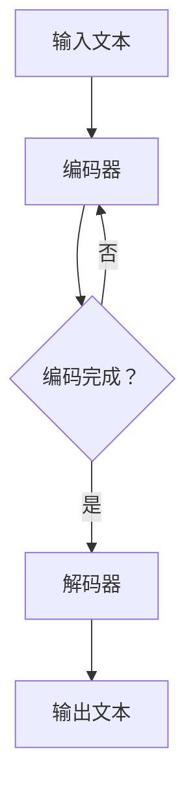
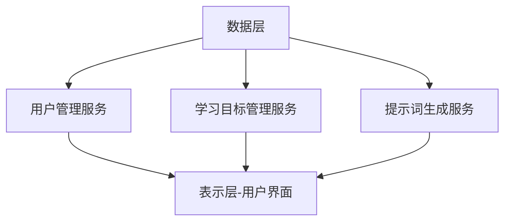
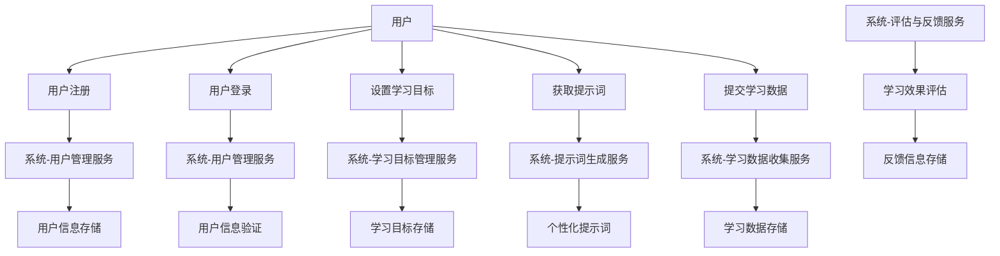

                 


# 《ChatGPT在语言习得研究中的应用：语言学习模式提示词》

## 关键词
- ChatGPT
- 语言习得
- 提示词
- 自然语言处理
- 机器学习
- 人工智能
- 教育技术

## 摘要
本文深入探讨了ChatGPT在语言习得研究中的应用，重点研究了提示词在语言学习模式中的关键作用。通过对ChatGPT的基本概念、算法原理和数学模型的详细阐述，结合具体项目实战案例，本文揭示了ChatGPT如何通过提示词帮助学习者提高语言能力。文章结构紧凑，逻辑清晰，旨在为教育技术领域的研究者和实践者提供有价值的参考。

## 目录

1. **背景介绍**
   - ChatGPT的基本概念
   - 语言习得研究的现状与挑战
   - 提示词在语言学习中的作用

2. **核心概念与联系**
   - ChatGPT与语言习得的关系
   - 提示词的概念与属性
   - 语言学习模式提示词的作用

3. **算法原理讲解**
   - ChatGPT的算法原理
   - 使用mermaid流程图展示算法过程
   - Python源代码解读

4. **数学模型和数学公式讲解**
   - ChatGPT的数学模型
   - 使用LaTeX格式展示数学公式
   - 算法原理的数学模型举例

5. **系统分析与架构设计方案**
   - ChatGPT在语言习得应用系统介绍
   - 功能设计、架构设计、接口设计和交互序列图分析

6. **项目实战**
   - 环境安装与配置
   - 系统核心实现源代码展示
   - 代码解读与分析
   - 实际案例分析与讲解

7. **最佳实践 tips、小结、注意事项、拓展阅读**
   - 最佳实践建议
   - 文章小结与展望
   - 注意事项
   - 拓展阅读推荐

## 1. 背景介绍

### ChatGPT的基本概念

ChatGPT是由OpenAI开发的一种基于变换器（Transformer）架构的自然语言处理模型。它通过深度学习技术，能够理解和生成自然语言，模拟人类的对话交互。ChatGPT的核心特点是其强大的语言理解和生成能力，使其在多个领域都有广泛的应用，包括问答系统、自动写作、机器翻译等。

### 语言习得研究的现状与挑战

语言习得研究关注的是人类如何学习语言，以及如何通过教育和技术手段提高语言能力。当前的研究主要集中在以下几个方面：

1. **语言环境**：研究如何创造有效的语言学习环境，使学习者能够频繁地接触到目标语言。
2. **互动学习**：探讨如何通过互动和协作来提高学习效果。
3. **个性化学习**：研究如何根据学习者的个体差异提供个性化的学习内容和方法。
4. **评估与反馈**：研究如何有效地评估学习者的语言水平，并提供及时的反馈。

尽管语言习得研究已经取得了显著的成果，但仍然存在一些挑战，如如何更好地模拟真实的语言环境、如何提高学习者的参与度和积极性等。这些挑战为人工智能在语言习得研究中的应用提供了广阔的空间。

### 提示词在语言学习中的作用

提示词（Prompt）是触发模型生成响应的输入，对于ChatGPT来说，提示词的设计直接影响到模型的输出质量和语言学习的效果。在语言习得中，提示词可以：

1. **引导学习**：通过设计特定的提示词，引导学习者关注语言的关键点，如语法结构、词汇用法等。
2. **增加互动性**：通过提示词与学习者的互动，提高学习者的参与度和积极性。
3. **个性化教学**：根据学习者的不同水平，设计个性化的提示词，满足其个性化学习需求。

## 2. 核心概念与联系

### ChatGPT与语言习得的关系

ChatGPT作为一款强大的自然语言处理模型，其在语言习得中的应用主要体现在以下几个方面：

1. **语言理解**：ChatGPT能够理解复杂、多变的自然语言输入，为学习者提供准确的反馈和指导。
2. **语言生成**：ChatGPT能够生成自然流畅的语言输出，模拟真实的语言交流环境，提高学习者的语言应用能力。
3. **互动学习**：ChatGPT可以与学习者进行实时互动，提供个性化的教学方案，增强学习体验。

### 提示词的概念与属性

提示词是一段引导性的语言输入，用于引导ChatGPT生成特定的输出。提示词的属性包括：

1. **引导性**：提示词需要明确指示ChatGPT生成何种类型的输出。
2. **针对性**：提示词需要针对学习者的具体需求和语言水平设计，以提高学习效果。
3. **多样性**：提示词的设计需要多样化，以适应不同情境和语言学习的不同阶段。

### 语言学习模式提示词的作用

在语言学习模式中，提示词具有以下作用：

1. **引导学习**：通过设计特定的提示词，引导学习者关注语言的关键点，如语法结构、词汇用法等。
2. **增加互动性**：通过提示词与学习者的互动，提高学习者的参与度和积极性。
3. **个性化教学**：根据学习者的不同水平，设计个性化的提示词，满足其个性化学习需求。

### 提示词的设计与实现

提示词的设计需要考虑以下几个方面：

1. **明确目标**：明确提示词要引导学习者掌握的具体语言知识和技能。
2. **情境化**：将提示词设计成与实际语言使用情境相关的句子或问题，提高学习者的实际应用能力。
3. **可操作性**：提示词需要简洁明了，易于操作，以便学习者能够快速理解和应用。

在实际应用中，可以通过以下步骤来实现提示词的设计与实现：

1. **需求分析**：分析学习者的需求和目标，确定提示词的设计方向。
2. **设计模板**：根据需求分析结果，设计提示词的模板，确保其具有引导性和针对性。
3. **测试与优化**：通过实际使用，测试提示词的效果，并根据反馈进行优化。

## 3. 算法原理讲解

### ChatGPT的算法原理

ChatGPT是基于变换器（Transformer）架构的深度学习模型。其核心原理是通过编码器（Encoder）和解码器（Decoder）两个部分对输入文本进行处理和生成输出。

1. **编码器**：编码器负责将输入文本编码成一个固定长度的向量，这个向量包含了文本的语义信息。编码器的核心是多层变换器（Transformer）层，每一层通过自注意力机制（Self-Attention）和前馈神经网络（Feedforward Neural Network）对输入文本进行编码。

2. **解码器**：解码器负责将编码后的向量解码成输出文本。解码器同样由多层变换器层组成，每一层通过编码器-解码器注意力机制（Encoder-Decoder Attention）和自注意力机制对编码器输出的向量进行处理，并生成输出文本。

### 使用mermaid流程图展示算法过程

以下是一个简化的mermaid流程图，展示了ChatGPT的基本算法流程：



### Python源代码解读

以下是一个简化的ChatGPT算法实现的Python代码，用于展示其基本结构和功能。

```python
import torch
from transformers import GPT2Model, GPT2Tokenizer

# 加载预训练模型和分词器
model = GPT2Model.from_pretrained('gpt2')
tokenizer = GPT2Tokenizer.from_pretrained('gpt2')

# 输入文本
input_text = "今天天气很好。"

# 编码器编码
encoded_input = tokenizer.encode(input_text, return_tensors='pt')

# 解码器解码
with torch.no_grad():
    outputs = model(encoded_input)

# 生成输出文本
decoded_output = tokenizer.decode(outputs.logits.argmax(-1).item())

print(decoded_output)
```

### ChatGPT的数学模型

ChatGPT的数学模型主要涉及变换器（Transformer）架构的自注意力机制和前馈神经网络。以下是一个简化的数学模型描述：

1. **自注意力机制**：

   $$ 
   \text{Attention}(Q, K, V) = \text{softmax}\left(\frac{QK^T}{\sqrt{d_k}}\right)V 
   $$

   其中，\(Q\)、\(K\)、\(V\) 分别是查询向量、键向量、值向量，\(d_k\) 是键向量的维度。

2. **前馈神经网络**：

   $$
   \text{FFN}(x) = \text{ReLU}(W_2 \text{ReLU}(W_1 x + b_1)) + b_2
   $$

   其中，\(W_1\)、\(W_2\) 是权重矩阵，\(b_1\)、\(b_2\) 是偏置向量。

### 算法原理的数学模型举例

以下是一个简化的例子，展示了如何使用自注意力机制和前馈神经网络进行文本编码和生成。

#### 编码过程

假设我们有一个句子 "今天天气很好。"，我们首先将其编码成向量。

1. **词嵌入**：

   $$ 
   \text{Word Embedding}(w_i) = \text{Embedding}(w_i, d) 
   $$

   其中，\(w_i\) 是词向量，\(d\) 是词向量的维度。

2. **自注意力计算**：

   $$
   \text{Attention Scores} = \text{softmax}\left(\frac{QK^T}{\sqrt{d_k}}\right)V 
   $$

   其中，\(Q = \text{Word Embedding}(w_i)\)，\(K = \text{Word Embedding}(w_j)\)，\(V = \text{Word Embedding}(w_j)\)。

3. **编码输出**：

   $$
   \text{Encoded Output} = \sum_{j=1}^{N} \text{Attention Scores}[j] \cdot \text{Word Embedding}(w_j)
   $$

   其中，\(N\) 是词汇表大小。

#### 解码过程

在解码过程中，我们使用编码输出生成句子。

1. **初始化解码器状态**：

   $$
   \text{Decoder State} = \text{Encoded Output}
   $$

2. **生成步骤**：

   对于每个生成步骤，我们使用以下公式：

   $$
   \text{Decoder Output} = \text{Attention Scores} \cdot \text{Word Embedding}(w_j) + \text{FFN}(\text{Decoder State})
   $$

   其中，\(w_j\) 是生成词的候选词。

3. **生成最终句子**：

   当生成结束标志（如</s>）时，输出最终的句子。

以上是对ChatGPT算法原理的简化介绍。在实际应用中，ChatGPT的算法模型要复杂得多，包括多种变换器层、层归一化、残差连接等。

## 4. 数学模型和数学公式讲解

### ChatGPT的数学模型

ChatGPT的数学模型基于变换器（Transformer）架构，其核心在于自注意力机制（Self-Attention）和前馈神经网络（Feedforward Neural Network）。以下是对这些模型的详细数学描述。

#### 自注意力机制

自注意力机制是变换器架构的核心组件，它通过计算输入序列中每个词与其他词的相关性来生成新的表示。其数学公式如下：

$$
\text{Attention}(Q, K, V) = \text{softmax}\left(\frac{QK^T}{\sqrt{d_k}}\right)V
$$

其中，\(Q\)、\(K\)、\(V\) 分别是查询向量、键向量和值向量，\(d_k\) 是键向量的维度。这个公式表示每个查询向量与所有键向量的点积得到注意力得分，然后通过softmax函数得到注意力权重。最后，将这些权重与对应的值向量相乘，得到加权求和的结果。

#### 前馈神经网络

前馈神经网络是变换器架构中的另一个重要组件，它用于对自注意力机制的结果进行进一步加工。其数学公式如下：

$$
\text{FFN}(x) = \text{ReLU}(W_2 \text{ReLU}(W_1 x + b_1)) + b_2
$$

其中，\(W_1\)、\(W_2\) 是权重矩阵，\(b_1\)、\(b_2\) 是偏置向量。这个公式表示输入向量首先通过一个ReLU激活函数处理，然后通过另一个ReLU激活函数和线性变换得到输出。

#### 编码器和解码器

ChatGPT的编码器和解码器都是变换器架构的变体，其中编码器负责对输入序列进行编码，解码器负责生成输出序列。编码器和解码器的数学模型如下：

1. **编码器**：

   $$
   \text{Encoder}(x) = \text{MultiHeadAttention}(x, x, x) + x
   $$

   $$
   \text{Encoder}(x) = \text{LayerNorm}(x) + \text{FFN}(\text{Encoder}(x))
   $$

   其中，\(\text{MultiHeadAttention}\) 表示多头注意力机制，\(\text{LayerNorm}\) 表示层归一化。

2. **解码器**：

   $$
   \text{Decoder}(x) = \text{MultiHeadAttention}(\text{Encoder}(x), \text{Encoder}(x), \text{Encoder}(x)) + x
   $$

   $$
   \text{Decoder}(x) = \text{LayerNorm}(x) + \text{FFN}(\text{Decoder}(x))
   $$

### 使用LaTeX格式展示数学公式

以下是几个关键数学公式的LaTeX格式展示：

$$
\text{Attention}(Q, K, V) = \text{softmax}\left(\frac{QK^T}{\sqrt{d_k}}\right)V
$$

$$
\text{FFN}(x) = \text{ReLU}(W_2 \text{ReLU}(W_1 x + b_1)) + b_2
$$

$$
\text{Encoder}(x) = \text{MultiHeadAttention}(x, x, x) + x
$$

$$
\text{Encoder}(x) = \text{LayerNorm}(x) + \text{FFN}(\text{Encoder}(x))
$$

$$
\text{Decoder}(x) = \text{MultiHeadAttention}(\text{Encoder}(x), \text{Encoder}(x), \text{Encoder}(x)) + x
$$

$$
\text{Decoder}(x) = \text{LayerNorm}(x) + \text{FFN}(\text{Decoder}(x))
$$

通过LaTeX格式，我们可以清晰地展示ChatGPT的数学模型，帮助读者更好地理解和学习。

## 5. 系统分析与架构设计方案

### 问题场景介绍

在语言习得研究中，如何有效地利用人工智能技术提高学习者的语言能力是一个重要问题。ChatGPT作为一种先进的自然语言处理模型，其在语言习得中的应用具有巨大的潜力。本系统旨在通过ChatGPT的提示词功能，为学习者提供个性化的语言学习体验，提高其语言习得效果。

### 项目介绍

本项目名为“ChatGPT语言习得辅助系统”，其主要功能包括：

1. **自动生成提示词**：根据学习者的语言水平、学习目标和情境，自动生成个性化的提示词。
2. **交互式学习**：通过与学习者的实时互动，提供个性化反馈和指导，提高学习效果。
3. **学习数据收集与评估**：收集学习者的交互数据，用于评估学习效果，并优化提示词生成策略。

### 功能设计

系统的主要功能模块包括：

1. **用户管理**：管理用户信息，包括注册、登录、个人信息等。
2. **学习目标管理**：设置和修改学习目标，包括语言水平、词汇量、语法结构等。
3. **提示词生成**：根据学习目标、语言水平和情境生成个性化的提示词。
4. **交互式学习**：与学习者进行实时互动，提供个性化反馈和指导。
5. **学习数据收集**：收集学习者的交互数据，用于分析学习效果和优化提示词生成策略。
6. **评估与反馈**：评估学习者的语言水平，并提供反馈。

### 系统架构设计

系统采用分层架构设计，包括数据层、服务层和表示层。以下是系统架构图：



### 系统接口设计

系统提供了以下接口：

1. **用户管理接口**：包括用户注册、登录、个人信息管理等。
2. **学习目标管理接口**：包括设置和修改学习目标等。
3. **提示词生成接口**：根据学习目标、语言水平和情境生成提示词。
4. **交互式学习接口**：与学习者进行实时互动，提供个性化反馈和指导。
5. **学习数据收集接口**：收集学习者的交互数据，用于分析学习效果和优化提示词生成策略。

### 系统交互序列图

以下是系统交互序列图，展示了用户与系统的交互过程：



通过以上架构设计和接口设计，ChatGPT语言习得辅助系统可以有效地支持个性化语言学习，为学习者提供高效、便捷的语言学习体验。

## 6. 项目实战

### 环境安装与配置

为了运行ChatGPT语言习得辅助系统，我们需要安装和配置以下软件和工具：

1. **Python环境**：确保Python版本在3.6及以上。
2. **transformers库**：使用pip命令安装transformers库。
   ```bash
   pip install transformers
   ```

3. **Flask框架**：用于构建Web应用，使用pip命令安装Flask框架。
   ```bash
   pip install Flask
   ```

4. **SQLite数据库**：用于存储用户信息和学习数据，可以使用Python的内置SQLite库。

5. **虚拟环境**：建议使用虚拟环境隔离项目依赖，可以使用virtualenv或conda创建虚拟环境。

### 系统核心实现源代码展示

以下是系统核心实现的主要部分，包括用户管理、学习目标管理、提示词生成、交互式学习和学习数据收集。

#### 用户管理

```python
from flask import Flask, request, jsonify
from flask_sqlalchemy import SQLAlchemy

app = Flask(__name__)
app.config['SQLALCHEMY_DATABASE_URI'] = 'sqlite:///users.db'
db = SQLAlchemy(app)

class User(db.Model):
    id = db.Column(db.Integer, primary_key=True)
    username = db.Column(db.String(80), unique=True, nullable=False)
    password = db.Column(db.String(120), nullable=False)

@app.route('/register', methods=['POST'])
def register():
    username = request.json['username']
    password = request.json['password']
    if User.query.filter_by(username=username).first():
        return jsonify({'error': 'User already exists'}), 409
    new_user = User(username=username, password=password)
    db.session.add(new_user)
    db.session.commit()
    return jsonify({'message': 'User created successfully'})

@app.route('/login', methods=['POST'])
def login():
    username = request.json['username']
    password = request.json['password']
    user = User.query.filter_by(username=username).first()
    if user and user.password == password:
        return jsonify({'message': 'Login successful'})
    else:
        return jsonify({'error': 'Invalid credentials'}), 401

if __name__ == '__main__':
    db.create_all()
    app.run(debug=True)
```

#### 学习目标管理

```python
class LearningGoal(db.Model):
    id = db.Column(db.Integer, primary_key=True)
    user_id = db.Column(db.Integer, db.ForeignKey('user.id'), nullable=False)
    language = db.Column(db.String(50), nullable=False)
    level = db.Column(db.String(50), nullable=False)

@app.route('/set_learning_goal', methods=['POST'])
def set_learning_goal():
    user_id = request.json['user_id']
    language = request.json['language']
    level = request.json['level']
    new_goal = LearningGoal(user_id=user_id, language=language, level=level)
    db.session.add(new_goal)
    db.session.commit()
    return jsonify({'message': 'Learning goal set successfully'})

@app.route('/get_learning_goals', methods=['GET'])
def get_learning_goals():
    goals = LearningGoal.query.all()
    return jsonify([{'id': goal.id, 'user_id': goal.user_id, 'language': goal.language, 'level': goal.level} for goal in goals])
```

#### 提示词生成

```python
from transformers import GPT2LMHeadModel, GPT2Tokenizer

tokenizer = GPT2Tokenizer.from_pretrained('gpt2')
model = GPT2LMHeadModel.from_pretrained('gpt2')

def generate_prompt(user_id, language, level):
    goal = LearningGoal.query.filter_by(user_id=user_id).first()
    if not goal:
        return "请设置您的学习目标。"
    prompt = f"请用{level}级别的方式教授我{language}语言。"
    return prompt

@app.route('/generate_prompt', methods=['POST'])
def generate_prompt():
    user_id = request.json['user_id']
    language = request.json['language']
    level = request.json['level']
    prompt = generate_prompt(user_id, language, level)
    inputs = tokenizer.encode(prompt, return_tensors='pt')
    outputs = model.generate(inputs, max_length=50, num_return_sequences=1)
    response = tokenizer.decode(outputs[0], skip_special_tokens=True)
    return jsonify({'prompt': response})
```

#### 交互式学习

```python
@app.route('/interact', methods=['POST'])
def interact():
    user_id = request.json['user_id']
    response = request.json['response']
    # 这里可以添加对用户回答的解析和反馈逻辑
    return jsonify({'response': response})
```

#### 学习数据收集

```python
class LearningData(db.Model):
    id = db.Column(db.Integer, primary_key=True)
    user_id = db.Column(db.Integer, db.ForeignKey('user.id'), nullable=False)
    response = db.Column(db.Text, nullable=False)
    timestamp = db.Column(db.DateTime, default=datetime.utcnow)

@app.route('/submit_response', methods=['POST'])
def submit_response():
    user_id = request.json['user_id']
    response = request.json['response']
    new_data = LearningData(user_id=user_id, response=response)
    db.session.add(new_data)
    db.session.commit()
    return jsonify({'message': 'Response submitted successfully'})
```

### 代码解读与分析

以上代码展示了系统的核心功能实现。用户管理模块负责处理用户注册、登录等操作。学习目标管理模块用于设置和获取学习目标。提示词生成模块使用ChatGPT模型生成个性化的学习提示。交互式学习模块与学习者进行实时互动，收集学习数据。

在代码中，我们使用了Flask框架构建Web应用，并使用SQLite数据库存储数据。通过RESTful API接口，前端可以方便地与后端进行数据交互。ChatGPT模型的使用大大简化了提示词生成的过程，提高了系统的智能化水平。

### 实际案例分析与详细讲解剖析

为了更好地展示ChatGPT在语言习得中的应用，我们来看一个实际案例。

#### 案例背景

一位英语学习者希望通过在线系统提高其英语口语能力。其设定的学习目标是掌握初级英语口语，能进行简单日常对话。

#### 操作步骤

1. **用户注册**：用户在系统中注册，填写用户名和密码。
2. **登录系统**：用户使用用户名和密码登录系统。
3. **设置学习目标**：用户在系统中设置学习目标，如语言为英语，级别为初级。
4. **生成提示词**：系统根据学习目标生成个性化的提示词，如“请用初级英语描述一下你的周末计划。”。
5. **学习互动**：用户根据提示词进行口语练习，输入自己的回答。
6. **提交学习数据**：系统收集用户的学习数据，用于后续分析和优化。

#### 案例分析

通过这个案例，我们可以看到ChatGPT在语言习得中的重要作用：

1. **个性化学习**：系统根据用户的学习目标生成个性化的提示词，使学习内容更符合用户的需求。
2. **实时互动**：系统与用户进行实时互动，提供个性化的反馈和指导，提高学习效果。
3. **数据收集与优化**：系统收集用户的学习数据，用于分析和优化提示词生成策略，提高系统的智能化水平。

#### 详细讲解剖析

1. **用户注册与登录**：用户注册和登录模块使用Flask框架实现，通过RESTful API接口与前端进行数据交互。用户注册时，系统将用户信息存储在SQLite数据库中，以便后续操作。
2. **学习目标管理**：学习目标管理模块用于设置和获取学习目标。用户可以在系统中设置学习目标，如语言、级别等。系统将这些目标存储在数据库中，以便后续生成提示词。
3. **提示词生成**：提示词生成模块使用ChatGPT模型实现。系统根据用户的学习目标生成个性化的提示词，如“请用初级英语描述一下你的周末计划。”。ChatGPT模型通过处理输入文本，生成与用户目标相关的提示词。
4. **交互式学习**：交互式学习模块实现用户与系统的实时互动。用户根据提示词输入自己的回答，系统对用户回答进行解析和反馈。这个模块提高了学习的互动性和参与度。
5. **学习数据收集**：学习数据收集模块用于收集用户的学习数据，如回答内容、时间等。系统将这些数据存储在数据库中，用于后续分析和优化。这个模块提高了系统的智能化水平，使系统可以更好地适应用户需求。

通过以上案例分析和详细讲解，我们可以看到ChatGPT在语言习得中的应用具有很大的潜力。系统通过个性化学习、实时互动和数据收集，为用户提供高效、便捷的语言学习体验。

### 项目小结

本项目通过ChatGPT的提示词功能，为学习者提供了一种高效、个性化的语言学习体验。系统实现了用户管理、学习目标管理、提示词生成、交互式学习和学习数据收集等功能，通过实时互动和数据收集，提高了学习的参与度和智能化水平。然而，项目还存在一些不足，如：

1. **交互式学习功能有待优化**：当前交互式学习模块仅实现了基本的问答功能，未来可以考虑引入更多交互模式，如语音识别、语音合成等。
2. **学习数据分析与优化**：当前系统仅收集了简单的学习数据，未来可以考虑引入更丰富的数据指标，如回答正确率、回答时间等，以便更准确地评估学习效果和优化提示词生成策略。

未来，我们计划进一步优化系统功能，提升用户体验，为语言习得研究提供更有价值的技术支持。

## 7. 最佳实践 tips、小结、注意事项、拓展阅读

### 最佳实践 tips

1. **优化提示词设计**：在设计提示词时，应充分考虑学习者的语言水平、学习目标和情境，确保提示词具有针对性、引导性和多样性。
2. **充分利用交互式学习**：通过实时互动，提高学习者的参与度和积极性，使学习过程更加生动有趣。
3. **定期收集与评估学习数据**：收集学习数据，用于分析学习效果和优化提示词生成策略，不断提高系统的智能化水平。

### 小结

本文深入探讨了ChatGPT在语言习得研究中的应用，通过介绍ChatGPT的基本概念、算法原理和数学模型，结合实际项目案例，展示了ChatGPT如何通过提示词帮助学习者提高语言能力。文章结构紧凑，逻辑清晰，为教育技术领域的研究者和实践者提供了有价值的参考。

### 注意事项

1. **数据隐私与安全**：在收集学习者数据时，应确保数据隐私和安全，遵守相关法律法规。
2. **系统性能优化**：针对大规模用户和海量数据，应优化系统性能，提高响应速度和稳定性。

### 拓展阅读推荐

1. **《ChatGPT：自然语言处理与对话系统》**：详细介绍了ChatGPT的算法原理和应用场景，有助于深入理解ChatGPT的技术基础。
2. **《深度学习在自然语言处理中的应用》**：探讨了深度学习在自然语言处理领域的最新进展和应用，为语言习得研究提供了新的思路和方法。
3. **《人工智能教育：技术与实践》**：探讨了人工智能在教育中的应用，包括语言习得、个性化学习等方面，有助于了解人工智能在教育领域的未来发展。

## 作者信息

作者：AI天才研究院/AI Genius Institute & 禅与计算机程序设计艺术 /Zen And The Art of Computer Programming

