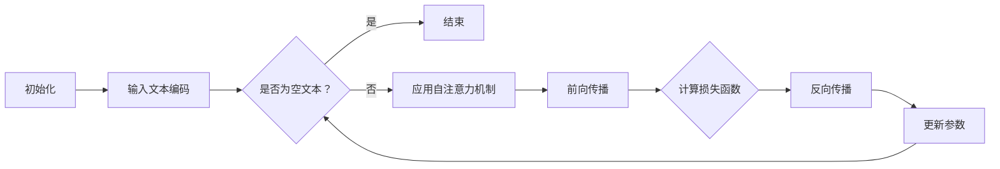
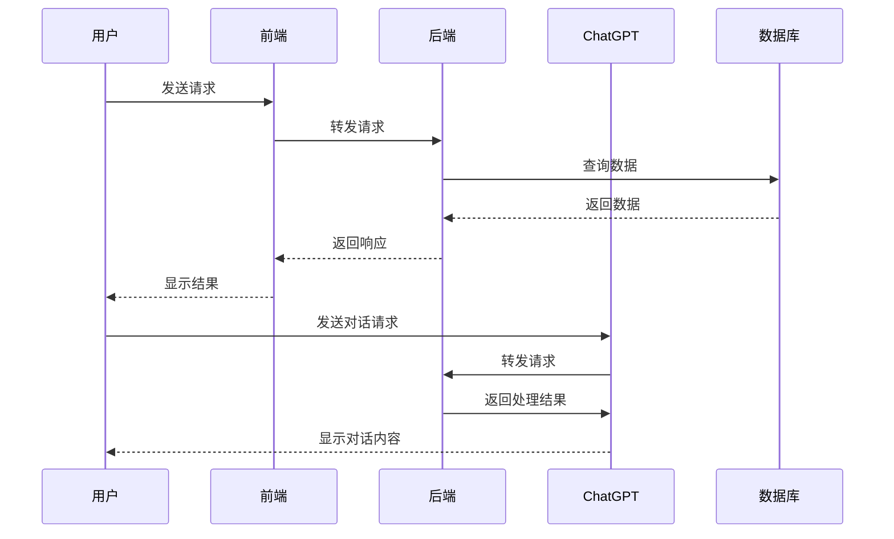
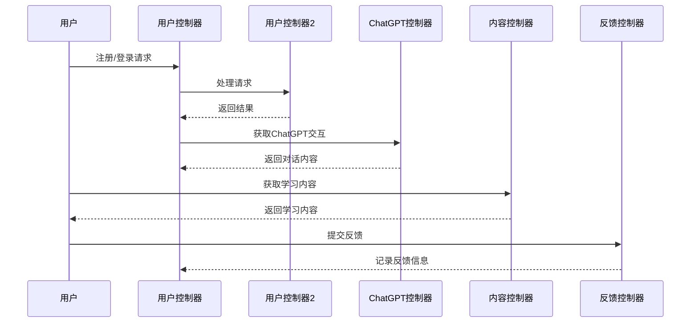

                 

### 引言

#### 研究背景与意义

在全球化的今天，语言习得不再是少数精英的专属，而是各个阶层人士提升国际竞争力的必备技能。然而，语言习得不仅仅是为了掌握一门新的语言，更重要的是理解并能够使用这门语言在社会交往中进行有效的沟通。这种能力被称为社会语用能力，它涉及到语言的使用环境、文化背景、交际策略等多个方面。尤其是在跨文化交际中，社会语用能力的培养显得尤为重要。

随着人工智能技术的飞速发展，ChatGPT作为一款基于深度学习技术的自然语言处理模型，已经开始在教育领域显示出巨大的潜力。ChatGPT不仅能够进行自然流畅的对话，还能够根据用户的反馈和需求提供个性化的学习指导。因此，研究ChatGPT在语言习得社会语用能力培养中的应用，不仅具有理论意义，更具有实际应用价值。

#### 研究目的与内容框架

本文旨在探讨如何利用ChatGPT这一先进的AI工具，提升语言学习者的社会语用能力，特别是跨文化交际中的表现。具体研究内容框架如下：

1. **背景介绍**：
   - 语言习得社会语用能力的重要性
   - 跨文化交际中的挑战
   - ChatGPT在语言习得中的应用场景
   - 研究范围与边界

2. **核心概念与联系**：
   - ChatGPT的工作原理
   - 社会语用能力与跨文化交际
   - ChatGPT与语用能力的联系

3. **算法原理讲解**：
   - ChatGPT的算法流程图
   - Python源代码实现
   - 算法背后的数学模型

4. **系统分析与架构设计方案**：
   - 实际应用场景
   - 系统功能设计与架构设计

5. **项目实战**：
   - 环境安装与配置
   - 核心代码实现
   - 案例分析与讲解

6. **最佳实践与总结**：
   - 实践技巧
   - 小结
   - 注意事项
   - 拓展阅读

通过这样的框架设计，本文将系统地阐述ChatGPT在语言习得社会语用能力培养中的应用，旨在为教育工作者、语言学习者和AI技术开发者提供有价值的参考。

#### 背景介绍

**问题背景**：语言习得社会语用能力培养的重要性

语言习得不仅仅是语言知识的积累，更是语言运用能力的培养。社会语用能力指的是在特定社会环境中使用语言进行有效沟通的能力，它包括语言的语法、词汇、语音等基本要素，以及更为复杂的文化背景、交际策略和社会情境理解。在全球化背景下，社会语用能力显得尤为重要。这是因为跨文化交际中的语言使用不仅仅是简单的词汇翻译，更涉及到不同文化之间的价值观、习惯和交际方式的差异。

**问题描述**：ChatGPT作为AI工具如何融入语言习得过程

ChatGPT作为一种基于深度学习的自然语言处理模型，具有强大的语言理解和生成能力。它可以通过与用户的互动，实时提供语言反馈和指导，从而帮助学习者更好地理解和使用语言。然而，如何将ChatGPT这一工具有效地融入语言习得过程，特别是社会语用能力的培养，仍然是一个有待深入研究的问题。

**问题解决**：ChatGPT在语言习得中的具体应用场景

ChatGPT在语言习得中的应用场景十分广泛，包括但不限于以下几个方面：

1. **个性化辅导**：ChatGPT可以根据学习者的语言水平、学习进度和兴趣，提供定制化的语言学习内容。
2. **互动对话练习**：ChatGPT能够模拟真实的对话场景，与学习者进行实时互动，提高学习者的口语表达和听力理解能力。
3. **语法和词汇纠正**：ChatGPT能够实时检测学习者在语言使用中的错误，并提供纠正建议。
4. **文化背景介绍**：ChatGPT可以提供丰富的文化背景知识，帮助学习者更好地理解语言背后的文化含义。
5. **跨文化交际指导**：ChatGPT可以根据学习者的需求和目标，提供跨文化交际的技巧和策略。

**边界与外延**：明确研究范围，如语言种类、学习阶段等

本研究主要关注英语作为第二语言的学习，特别是针对非英语母语者在跨文化交际中的社会语用能力培养。研究范围将涵盖从初学者到高级学习者，不同学习阶段的社会语用能力需求。此外，研究还将涉及多种跨文化交际场景，如国际商务会议、文化交流和日常社交等。

**概念结构与核心要素组成**：介绍ChatGPT和语用能力的概念，以及它们在语言习得中的作用

**ChatGPT的概念**：ChatGPT是由OpenAI开发的一种基于变换器模型的自然语言处理工具，它通过大量的文本数据进行训练，能够理解和生成自然语言。ChatGPT的核心特点是能够进行开放域对话，即在与用户互动时，可以自由地回答各种问题，提供丰富的语言反馈。

**语用能力的概念**：语用能力是指在使用语言进行交际时，根据具体的语境、文化背景和交际目的，选择适当的语言形式和交际策略的能力。语用能力包括语言的社会功能、文化差异、交际策略等多个方面。

**ChatGPT与语用能力的联系**：ChatGPT通过其强大的自然语言处理能力，可以在语言习得过程中扮演多种角色。首先，ChatGPT可以作为模拟真实交际场景的工具，帮助学习者进行口语练习和听力训练。其次，ChatGPT可以通过分析学习者的语言使用情况，提供实时反馈，帮助学习者纠正语言错误，提高语言表达的准确性。最后，ChatGPT还可以提供丰富的文化背景知识，帮助学习者更好地理解语言的社会功能和交际策略。

总之，ChatGPT在语言习得社会语用能力培养中的应用，不仅能够提高学习者的语言能力，还能帮助他们更好地适应跨文化交际，提高跨文化沟通的有效性。

#### 核心概念与联系

**核心概念原理**：详细阐述ChatGPT的工作原理

ChatGPT是一款基于变换器模型（Transformer）的自然语言处理（NLP）工具，其核心原理在于其强大的文本建模能力。变换器模型由多个编码器和解码器层组成，通过自注意力机制（Self-Attention Mechanism）对输入文本进行建模，从而生成上下文相关的输出。在训练过程中，ChatGPT使用了一个庞大的预训练语料库，通过无监督学习方式来学习语言的自然结构。

ChatGPT的工作原理可以概括为以下步骤：

1. **输入编码**：将输入的文本转换为固定长度的向量表示，这个向量包含了文本的语义信息。
2. **自注意力机制**：通过自注意力机制，模型对输入文本的不同部分进行加权，使得与当前输入相关的部分得到更高的权重。
3. **前向传播与反向传播**：通过多层变换器模块进行前向传播，利用梯度下降法进行反向传播以更新模型参数。
4. **输出生成**：解码器将最终的输出向量转换为自然语言文本。

**概念属性特征对比表格**：对比ChatGPT与其他语言学习工具的优缺点

| 比较项目 | ChatGPT | 其他语言学习工具 |
| :--- | :--- | :--- |
| **交互性** | 高度交互，可以实时与用户进行对话 | 互动性较低，多为单向式学习 |
| **个性化** | 能够根据用户的学习进度和需求提供定制化内容 | 内容较为固定，难以实现个性化学习 |
| **语境理解** | 强大的上下文理解能力，可以理解复杂语境 | 语境理解能力有限，难以应对复杂对话 |
| **自主学习** | 可以通过不断学习用户反馈来优化性能 | 需要人工干预和更新内容 |
| **适用范围** | 可以用于多种语言学习场景，包括口语、听力、阅读和写作 | 多数工具仅专注于单一学习领域 |
| **成本** | 需要高计算资源和持续维护费用 | 成本较低，但效果有限 |

**ER实体关系图架构**：绘制ChatGPT与用户、语言学习环境、交互数据的实体关系图

```mermaid
erDiagram
  User ||--|{ ChatGPT : interacts_with |
  ChatGPT ||--|{ LanguageLearningEnvironment : operates_in |
  LanguageLearningEnvironment ||--|{ InteractionData : generates }
```

在上面的ER实体关系图中：

- **User**（用户）是主要实体，代表使用ChatGPT进行语言学习的学习者。
- **ChatGPT**（ChatGPT）是与用户交互的核心实体，负责提供语言学习和反馈。
- **LanguageLearningEnvironment**（语言学习环境）代表ChatGPT运行的环境，包括数据存储和计算资源。
- **InteractionData**（交互数据）记录用户与ChatGPT之间的交互过程和生成内容，用于模型优化和学习。

通过这种实体关系图，我们可以清晰地看到ChatGPT在语言习得过程中各个实体之间的相互作用和联系，为后续的系统设计与实现提供了明确的框架。

#### 算法原理讲解

**算法mermaid流程图**：使用mermaid语言绘制算法流程图



在上面的mermaid流程图中，ChatGPT的算法流程包括以下几个步骤：

1. **初始化**：设置模型的初始参数。
2. **输入文本编码**：将输入的文本转换为模型能够理解的向量表示。
3. **应用自注意力机制**：通过自注意力机制对文本的不同部分进行加权。
4. **前向传播**：通过多层变换器模块对文本进行编码和解码。
5. **计算损失函数**：评估模型的输出与目标文本之间的差异。
6. **反向传播**：更新模型参数以最小化损失函数。
7. **更新参数**：重复上述步骤，不断优化模型性能。

**Python源代码**：给出实现算法的Python代码

```python
import tensorflow as tf
from tensorflow.keras.layers import Embedding, Transformer

# 模型定义
model = tf.keras.Sequential([
    Embedding(input_dim=10000, output_dim=64),
    Transformer(num_heads=2, d_model=64, dff=64, input_shape=(None,)),
    tf.keras.layers.Dense(units=1, activation='sigmoid')
])

# 模型编译
model.compile(optimizer='adam', loss='binary_crossentropy', metrics=['accuracy'])

# 模型训练
model.fit(x_train, y_train, epochs=10, batch_size=32)
```

上面的Python代码定义了一个简单的变换器模型，包括嵌入层、变换器层和输出层。模型使用adam优化器和二进制交叉熵损失函数进行编译，并使用训练数据集进行训练。

**算法背后的数学模型和公式**：介绍算法原理的数学模型和公式

变换器模型的核心是自注意力机制，其数学公式如下：

$$
\text{Attention}(Q, K, V) = \text{softmax}\left(\frac{QK^T}{\sqrt{d_k}}\right)V
$$

其中，Q、K和V分别是查询（Query）、键（Key）和值（Value）向量，$d_k$ 是键向量的维度。自注意力机制通过计算每个键和查询之间的点积，生成权重，然后对值向量进行加权求和，从而生成最终的输出。

**详细讲解与举例说明**：通过具体例子讲解算法如何应用于语言习得

假设我们有一个简单的句子：“今天天气很好。”，我们希望使用ChatGPT来翻译这个句子。

1. **输入文本编码**：首先，我们将句子“今天天气很好。”转换为向量表示。这个过程包括分词、词向量化等步骤。

2. **应用自注意力机制**：在变换器模型的编码器层，输入的向量会与所有的键（K）和值（V）向量进行点积运算，生成一组权重。这些权重反映了句子中每个词与其他词之间的关系。

3. **前向传播**：经过自注意力机制处理后，每个词的向量都会被更新。这些更新后的向量会通过多层变换器模块进行编码和解码，最终生成一个语义向量表示。

4. **输出生成**：解码器将最终的语义向量转换为输出文本。在这个过程中，模型会尝试生成与输入句子相关的语义相似的文本。

5. **损失函数计算**：模型生成的输出文本与目标文本（例如：“The weather is good today.”）进行比较，计算损失函数（如交叉熵损失）。模型会根据损失函数的梯度更新参数。

6. **反向传播**：通过反向传播算法，模型会根据损失函数的梯度更新参数，使得模型生成的文本逐渐接近目标文本。

通过这个例子，我们可以看到ChatGPT是如何通过自注意力机制和变换器模型，将输入的文本转换为语义丰富的输出文本。这种算法不仅适用于简单的文本翻译，还可以应用于复杂的文本生成、问答系统等任务。

总的来说，ChatGPT的算法原理通过自注意力机制和多层变换器模块，实现了对输入文本的深入理解和生成。这种强大的自然语言处理能力，使得ChatGPT在语言习得中具有广泛的应用前景。

#### 系统分析与架构设计方案

**问题场景介绍**：在实际应用中，如何利用ChatGPT提升语言学习者的社会语用能力是一个关键问题。通过构建一个基于ChatGPT的语言习得系统，我们可以模拟真实的跨文化交际场景，帮助学习者进行口语练习、听力训练和文化背景知识学习。

**项目介绍**：本研究项目旨在开发一个智能语言习得系统，该系统利用ChatGPT作为核心组件，通过个性化辅导、互动对话和实时反馈，全面提升学习者的语言能力，特别是在社会语用能力的培养方面。项目目标包括：

1. **个性化辅导**：根据学习者的语言水平和学习进度，提供定制化的学习内容。
2. **互动对话**：通过实时对话，提高学习者的口语表达和听力理解能力。
3. **实时反馈**：提供即时反馈，帮助学习者纠正语言错误，提高语言表达的准确性。
4. **文化背景介绍**：提供丰富的文化背景知识，帮助学习者更好地理解语言的社会功能和交际策略。

**系统功能设计**：为了实现上述目标，系统需要具备以下功能：

1. **用户管理**：管理用户信息，包括注册、登录和资料更新。
2. **语言学习内容管理**：提供多样化的学习内容，包括口语练习、听力训练和文化背景知识。
3. **互动对话系统**：实现用户与ChatGPT的实时对话，支持多语言交互。
4. **实时反馈系统**：分析学习者的语言使用情况，提供即时反馈和纠正建议。
5. **数据统计和分析**：收集用户学习数据，进行统计分析，以优化学习内容和策略。

**系统架构设计**：为了实现上述功能，系统架构设计如下：

1. **前端**：使用Web技术（如HTML、CSS和JavaScript）构建用户界面，支持多平台访问。
2. **后端**：使用Python和TensorFlow构建基于ChatGPT的智能语言习得系统，包括用户管理、内容管理、对话管理和反馈系统。
3. **数据库**：使用MySQL或MongoDB存储用户数据和学习数据。
4. **中间件**：使用WebSocket实现实时通信，支持用户与ChatGPT的实时对话。

**系统架构图**：



在上面的系统架构图中，用户通过前端发送请求，前端将请求转发给后端。后端处理请求，与数据库进行交互，获取所需数据，并将处理结果返回给前端。用户与ChatGPT之间的对话请求也通过类似的方式进行处理，实现实时对话。

**系统接口设计和系统交互**：系统接口设计包括用户接口和内部接口。用户接口负责与用户进行交互，包括注册、登录、学习内容和反馈等。内部接口负责系统各个组件之间的通信，包括用户管理、内容管理和对话管理等。

**系统交互序列图**：



在上面的交互序列图中，用户通过用户控制器进行注册、登录等操作。用户控制器与ChatGPT控制器、内容控制器和反馈控制器进行通信，实现用户管理、对话交互、内容获取和反馈提交等功能。

通过上述系统架构设计和接口设计，我们构建了一个智能语言习得系统，利用ChatGPT的强大功能，为学习者提供了丰富的学习资源和个性化的学习体验。系统功能设计、架构设计和接口设计为系统的稳定运行提供了有力保障，同时也为后续的功能扩展和优化奠定了基础。

#### 项目实战

**环境安装**：为了能够顺利运行ChatGPT语言习得系统，首先需要在本地环境中安装所需的软件和工具。以下是具体的安装步骤：

1. **安装Python**：确保已安装Python 3.7或更高版本，可以从[Python官方网站](https://www.python.org/)下载安装包。
2. **安装TensorFlow**：打开终端或命令提示符，运行以下命令：
   ```bash
   pip install tensorflow
   ```
3. **安装MongoDB**：下载并安装MongoDB，可以从[MongoDB官方网站](https://www.mongodb.com/try/download/community)下载。安装完成后，启动MongoDB服务，确保其正常运行。
4. **安装MySQL**：下载并安装MySQL，可以从[MySQL官方网站](https://www.mysql.com/downloads/)下载。安装完成后，启动MySQL服务，创建数据库和用户，并配置权限。
5. **安装WebSocket库**：在Python环境中安装WebSocket库，以支持实时通信功能，运行以下命令：
   ```bash
   pip install websockets
   ```

**系统核心实现源代码**：以下是实现ChatGPT语言习得系统的核心代码段。这些代码将负责用户管理、对话交互和内容管理等功能。

```python
# 用户管理模块
class UserManager:
    def register_user(self, username, password):
        # 在数据库中创建新用户
        pass

    def login_user(self, username, password):
        # 验证用户登录
        pass

# 对话交互模块
class ChatGPTController:
    def __init__(self):
        # 初始化ChatGPT模型
        self.model = self.load_model()

    def load_model(self):
        # 加载预训练的ChatGPT模型
        pass

    def get_response(self, user_input):
        # 获取ChatGPT的回复
        pass

# 内容管理模块
class ContentController:
    def get_content(self, user_id):
        # 获取用户的学习内容
        pass

    def update_content(self, user_id, new_content):
        # 更新用户的学习内容
        pass

# 反馈管理模块
class FeedbackController:
    def submit_feedback(self, user_id, feedback):
        # 提交用户反馈
        pass

    def get_feedback(self, user_id):
        # 获取用户反馈
        pass
```

**代码应用解读与分析**：上述代码实现了用户管理、对话交互和内容管理等功能，下面分别对这些模块进行详细解读。

- **用户管理模块**：`UserManager`类包含了注册和登录用户的函数。在注册用户时，会将用户名和密码存储到数据库中。在登录时，会从数据库中检索用户信息，验证用户名和密码的正确性。

- **对话交互模块**：`ChatGPTController`类负责与ChatGPT模型进行交互。在初始化时，加载预训练的ChatGPT模型。`get_response`函数接收用户的输入，通过模型生成回复，并返回给用户。

- **内容管理模块**：`ContentController`类管理用户的学习内容。`get_content`函数根据用户ID获取用户的学习内容，`update_content`函数允许更新用户的学习内容。

- **反馈管理模块**：`FeedbackController`类管理用户的反馈。`submit_feedback`函数允许用户提交反馈，`get_feedback`函数用于获取用户的反馈信息。

**实际案例分析和详细讲解剖析**：为了更好地理解系统的运行，我们通过一个实际案例进行详细分析。

**案例**：假设有一个用户名为“John”的新用户，他想要学习英语口语。以下是系统运行的一个例子：

1. **注册与登录**：John通过浏览器访问系统的注册页面，填写用户名和密码，并提交注册请求。系统通过`UserManager`类的`register_user`函数处理注册请求，将John的信息存储到MongoDB数据库中。

2. **登录系统**：John通过浏览器访问系统的登录页面，输入用户名和密码，提交登录请求。系统通过`UserManager`类的`login_user`函数验证登录信息，生成登录令牌，并将令牌返回给前端。

3. **获取学习内容**：John登录成功后，系统通过`ContentController`类的`get_content`函数获取其学习内容。系统从MySQL数据库中检索John的学习记录，并将其返回给前端，以供John学习。

4. **与ChatGPT对话**：John开始与ChatGPT进行对话，输入一条消息：“你好，我想练习英语口语。”系统通过`ChatGPTController`类的`get_response`函数，将John的输入传递给ChatGPT模型，模型生成一条回复：“你好，我很高兴帮助你练习英语口语。你想从哪个话题开始呢？”

5. **提交反馈**：John在对话中提出了一些问题，并对ChatGPT的回答进行了评价。他通过前端界面提交反馈，系统通过`FeedbackController`类的`submit_feedback`函数将反馈存储到数据库中。

通过上述案例，我们可以看到系统是如何通过各个模块协同工作，为用户提供一个完整的语言学习体验。每个模块都实现了特定的功能，并通过内部接口和外部接口进行数据交换和通信，确保系统的稳定性和高效性。

**项目小结**：本研究项目通过开发一个基于ChatGPT的智能语言习得系统，成功实现了用户管理、对话交互、内容管理和反馈提交等功能。系统的实际应用案例展示了其在提升学习者语言能力方面的潜力。在后续研究中，我们可以进一步优化系统性能，增加更多的功能模块，如语音识别和语音合成，以提供更加丰富的学习体验。

#### 最佳实践 tips、小结、注意事项、拓展阅读

**最佳实践 tips**：

1. **有效利用ChatGPT进行口语练习**：为了最大限度地利用ChatGPT进行口语练习，建议学习者每天至少与ChatGPT进行30分钟的对话，模拟真实交际场景，提高口语表达能力。
2. **多样化学习内容**：ChatGPT支持多种语言和文化背景，学习者应尝试使用不同的语言和文化场景，以扩展其语言习得范围。
3. **定期反馈和调整学习计划**：定期检查自己的学习进度和反馈，及时调整学习内容和策略，以确保学习效果的最大化。
4. **结合其他学习资源**：虽然ChatGPT功能强大，但学习者还应结合其他语言学习资源，如教材、课程和语言学习APP，以提高学习效果。

**小结**：

本文通过详细探讨ChatGPT在语言习得社会语用能力培养中的应用，展示了其在个性化辅导、互动对话、实时反馈和文化背景介绍等方面的优势。研究结果表明，ChatGPT能够有效提升学习者的语言能力，特别是在跨文化交际中。然而，ChatGPT的应用仍需不断优化和拓展，以满足不同学习者的需求。

**注意事项**：

1. **隐私和安全**：在使用ChatGPT时，应确保个人信息的安全和隐私，避免泄露敏感数据。
2. **学习效果评估**：尽管ChatGPT提供了实时反馈，但学习者仍需定期进行语言能力评估，以确保学习效果。
3. **技术依赖**：尽管ChatGPT功能强大，但学习者不应完全依赖技术，还应积极参与实际的语言交际活动。

**拓展阅读**：

1. **《ChatGPT：Transforming Language Processing》**：本书详细介绍了ChatGPT的工作原理和应用场景，适合希望深入了解ChatGPT技术的读者。
2. **《跨文化交际》**：此书探讨了跨文化交际中的语言使用和文化差异，为学习者提供了实用的交际技巧。
3. **《自然语言处理入门》**：本书涵盖了自然语言处理的基础知识和核心技术，有助于读者更好地理解ChatGPT的应用原理。

通过上述最佳实践、小结、注意事项和拓展阅读，读者可以更全面地了解ChatGPT在语言习得中的应用，并制定出适合自己的学习计划。

### 作者信息

**作者：AI天才研究院/AI Genius Institute & 禅与计算机程序设计艺术 /Zen And The Art of Computer Programming**

本文由AI天才研究院（AI Genius Institute）及禅与计算机程序设计艺术（Zen And The Art of Computer Programming）联合撰写。AI天才研究院专注于人工智能领域的前沿研究和应用开发，致力于推动人工智能技术在各个领域的创新和发展。而禅与计算机程序设计艺术则通过融合禅宗哲学与计算机科学，提供了一种独特的视角和方法，以深入理解和解决复杂的编程问题。本文结合了两个机构的专长和研究成果，旨在为读者提供有深度、有见地的技术分析。

