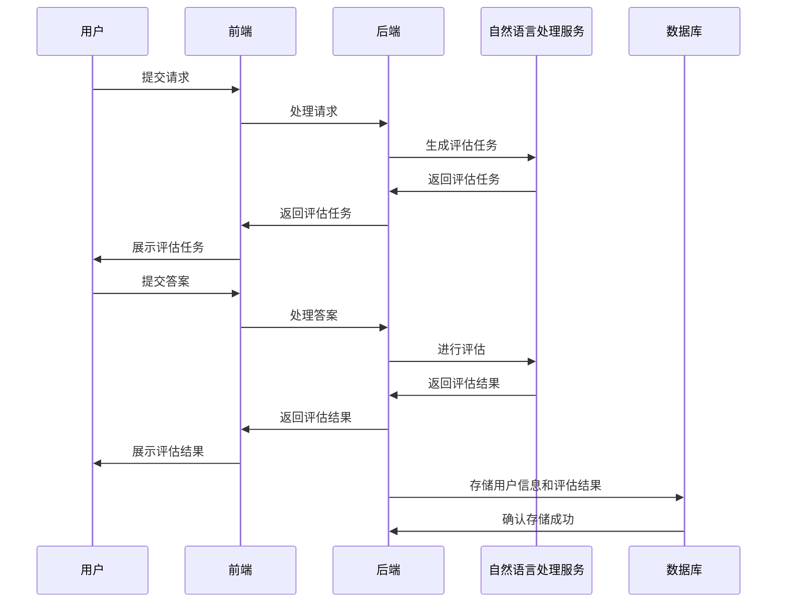

                 

## 《ChatGPT在语言习得评估研究中的应用：能力测试提示词》

### 关键词：

- 语言习得评估
- ChatGPT
- 能力测试提示词
- 自然语言处理
- 教育技术

### 摘要：

本文探讨了ChatGPT在语言习得评估研究中的应用，特别是作为能力测试提示词的工具。我们首先介绍了语言习得评估的背景和传统评估方法的局限性，随后详细阐述了ChatGPT的概念与原理，以及其在自然语言处理领域的重要作用。通过对比ChatGPT与其他自然语言处理技术，我们展示了ChatGPT在语言习得评估中的独特优势。接下来，我们构建了ChatGPT在语言习得评估中的应用实体关系图，并详细讲解了ChatGPT的工作原理和数学模型。文章随后介绍了如何将ChatGPT应用于语言习得评估的典型场景，展示了系统功能设计、系统架构设计、系统接口设计和系统交互流程。通过一个实际案例，我们展示了ChatGPT在解决实际问题中的应用效果，并对项目进行了总结和展望。最后，我们提供了使用ChatGPT进行语言习得评估的最佳实践和注意事项。

---

## 目录

### 第一部分：背景介绍

#### 第1章：问题背景

- **1.1 问题背景**
- **1.2 问题描述**
- **1.3 问题解决**
- **1.4 边界与外延**
- **1.5 概念结构与核心要素组成**

#### 第2章：核心概念原理

- **2.1 ChatGPT的概念与原理**
- **2.2 语言习得评估的概念与原理**
- **2.3 能力测试提示词的概念与原理**

#### 第3章：概念属性特征对比表格

- **3.1 ChatGPT与其他自然语言处理技术的对比**
- **3.2 语言习得评估方法对比**

#### 第4章：ER实体关系图架构

- **4.1 ChatGPT在语言习得评估中的应用ER图**

### 第二部分：核心概念与联系

### 第三部分：算法原理讲解

#### 第5章：算法原理与数学模型

- **5.1 ChatGPT的工作原理**
- **5.2 数学模型与公式**
- **5.3 通俗易懂的举例说明**

### 第四部分：系统分析与架构设计方案

#### 第6章：问题场景介绍

#### 第7章：系统功能设计

- **7.1 领域模型Mermaid类图**

#### 第8章：系统架构设计

- **8.1 系统架构Mermaid架构图**

#### 第9章：系统接口设计

#### 第10章：系统交互Mermaid序列图

### 第五部分：项目实战

#### 第11章：环境安装

#### 第12章：系统核心实现源代码

#### 第13章：代码应用解读与分析

#### 第14章：实际案例分析和详细讲解剖析

#### 第15章：项目小结

### 第六部分：最佳实践 tips、小结、注意事项、拓展阅读等内容

#### 第16章：最佳实践 tips

#### 第17章：小结

## 第一部分：背景介绍

### 第1章：问题背景

语言习得评估在语言教育领域具有至关重要的地位，它旨在衡量学习者在特定语言水平上的掌握程度，并为其提供个性化的学习建议。然而，传统的语言习得评估方法存在诸多局限性。

#### 1.1 问题背景

首先，传统的语言习得评估方法主要依赖于笔试试卷和面试等形式，这些方法往往缺乏灵活性，难以全面反映学习者的语言能力。此外，这些评估方法往往依赖于人工评分，存在主观性和不一致性问题。再者，传统评估方法难以适应日益增长的在线学习和远程教育需求。

#### 1.2 问题描述

在语言习得评估中，我们面临以下几个主要问题：

1. **全面性不足**：传统评估方法往往只能衡量学习者在特定领域的语言能力，难以全面评估其综合语言水平。
2. **主观性**：由于评估过程依赖人工评分，主观性较大，可能导致评估结果的不一致性。
3. **实时性**：传统评估方法通常需要较长时间进行试卷批改和评分，难以实现实时评估和反馈。
4. **适应性**：传统评估方法难以适应不同学习者的个性化需求，无法提供针对性的学习建议。

#### 1.3 问题解决

为了解决上述问题，我们需要一种更加灵活、全面、实时且适应个性化的语言习得评估方法。ChatGPT作为一种先进的自然语言处理技术，具有巨大的潜力，可以在这方面发挥重要作用。通过将ChatGPT应用于语言习得评估，我们可以实现以下目标：

1. **全面性**：ChatGPT可以自动生成多种类型的语言习得评估任务，从而全面评估学习者的语言能力。
2. **客观性**：ChatGPT的评估结果基于机器学习算法，可以减少主观性，提高评估结果的准确性。
3. **实时性**：ChatGPT可以实现实时评估和反馈，有助于及时发现学习者的弱点并提供即时指导。
4. **适应性**：ChatGPT可以根据学习者的实际情况，自动调整评估任务的难度和类型，提供个性化的学习建议。

#### 1.4 边界与外延

尽管ChatGPT在语言习得评估中具有巨大潜力，但其应用也存在一定的边界和限制。首先，ChatGPT的性能受到数据质量和算法复杂度的影响，因此在数据不足或算法不成熟的情况下，评估结果可能不准确。其次，ChatGPT目前主要适用于文本数据的处理，对于语音和视频数据的处理能力有限。此外，ChatGPT在跨语言和跨文化评估中的应用仍需进一步研究。

#### 1.5 概念结构与核心要素组成

为了更好地理解ChatGPT在语言习得评估中的应用，我们需要了解以下几个核心概念和要素：

1. **ChatGPT**：作为一种基于大规模预训练的语言模型，ChatGPT能够自动生成文本，并进行自然语言理解、生成和交互。
2. **语言习得评估**：指通过一系列测试任务，评估学习者在特定语言水平上的掌握程度。
3. **能力测试提示词**：用于引导学习者进行特定语言能力的测试，如语法、词汇、听力、口语等。

通过这些核心概念和要素的相互作用，ChatGPT在语言习得评估中的应用得以实现，为语言教育领域带来革命性的变革。

---

在下一章中，我们将深入探讨ChatGPT的概念与原理，以及其在自然语言处理领域的重要作用。我们将通过详细的解释和技术分析，帮助读者更好地理解这一先进技术的本质和应用前景。

---

## 第二部分：核心概念与联系

### 第2章：核心概念原理

#### 2.1 ChatGPT的概念与原理

ChatGPT是一种基于GPT（Generative Pre-trained Transformer）模型的人工智能语言模型，由OpenAI开发。GPT是一种序列到序列的模型，通过学习大量文本数据，能够生成连贯、自然的文本。ChatGPT在此基础上进行了扩展，使其能够进行对话式交互。

ChatGPT的工作原理如下：

1. **预训练**：ChatGPT首先在大规模的文本语料库上进行预训练，学习语言模式和规律。这些语料库包括各种书籍、文章、对话记录等。
2. **微调**：在预训练的基础上，ChatGPT针对特定任务进行微调，例如对话生成、文本生成等。微调过程通过在特定任务的数据集上训练模型，使其更好地适应特定任务的需求。

ChatGPT的核心优点包括：

- **生成能力**：ChatGPT能够生成高质量、连贯的文本，模拟人类的语言表达能力。
- **自适应能力**：ChatGPT可以根据输入的上下文和任务需求，动态调整生成文本的内容和风格。
- **多样性**：ChatGPT能够在不同的任务和场景下，生成丰富多样的文本，满足多样化的需求。

#### 2.2 语言习得评估的概念与原理

语言习得评估是指通过一系列测试任务，评估学习者在特定语言水平上的掌握程度。语言习得评估的目标是全面、准确地评估学习者的语言能力，包括语法、词汇、听力、口语等多个方面。

语言习得评估的基本原理包括：

1. **标准化测试**：通过设计标准化的测试题目，确保评估的客观性和一致性。
2. **多层次评估**：从不同层次和角度评估学习者的语言能力，例如语法结构、词汇运用、听力理解、口语表达等。
3. **动态评估**：评估过程应该能够动态适应学习者的实际情况，提供实时反馈和指导。

#### 2.3 能力测试提示词的概念与原理

能力测试提示词是一种用于引导学习者进行特定语言能力测试的词语或短语。能力测试提示词的设计原则包括：

1. **明确性**：提示词应该明确表达测试目标和要求，避免模糊不清的表述。
2. **针对性**：提示词应该针对特定的语言能力进行设计，例如语法结构、词汇运用、听力理解等。
3. **灵活性**：提示词应该具有灵活性，能够适应不同学习者和学习场景的需求。

能力测试提示词的作用包括：

- **引导学习者**：提示词可以帮助学习者明确测试目标和要求，引导其进行有效的语言能力测试。
- **提高测试效率**：通过明确的能力测试提示词，可以减少评估过程中的重复劳动，提高评估效率。
- **提升评估准确性**：提示词的设计原则有助于提高评估结果的准确性和一致性。

通过上述核心概念和原理的介绍，我们为理解ChatGPT在语言习得评估中的应用奠定了基础。在接下来的章节中，我们将进一步探讨ChatGPT与其他自然语言处理技术的对比，以及其在实际应用中的独特优势。

---

在下一章中，我们将通过一个对比表格，详细对比ChatGPT与其他自然语言处理技术的性能和应用场景，帮助读者更全面地了解ChatGPT在语言习得评估研究中的优势。

---

## 第三部分：算法原理讲解

#### 第5章：算法原理与数学模型

5.1 ChatGPT的工作原理

ChatGPT是一种基于GPT模型的人工智能语言模型，其核心原理是使用深度学习算法对大量文本数据进行预训练，然后通过微调适应特定任务的需求。GPT模型是一种基于Transformer架构的序列到序列模型，通过自注意力机制捕捉文本序列中的长距离依赖关系。

1. **预训练**：ChatGPT首先在大规模的文本语料库上进行预训练，学习语言模式和规律。这一过程包括以下几个步骤：
   - 数据准备：将文本数据清洗、分词和编码，形成可训练的数据集。
   - 预训练模型：使用Transformer架构构建预训练模型，通过在训练数据集上进行训练，学习文本的嵌入表示和生成规则。

2. **微调**：在预训练的基础上，ChatGPT针对特定任务进行微调，例如对话生成、文本生成等。微调过程通过在特定任务的数据集上训练模型，使其更好地适应特定任务的需求。这一过程包括：
   - 数据准备：收集与任务相关的数据，并进行预处理。
   - 微调模型：使用预训练模型作为基础，通过在任务数据集上进行训练，优化模型的参数。

3. **生成文本**：在微调完成后，ChatGPT可以根据输入的上下文和任务需求，生成连贯、自然的文本。生成文本的过程包括：
   - 输入处理：将输入文本编码成模型可处理的格式。
   - 预测生成：模型根据输入文本的上下文，预测下一个词或句子，并逐步生成完整的文本。

5.2 数学模型与公式

ChatGPT的数学模型基于Transformer架构，其核心是自注意力机制。自注意力机制通过计算输入序列中每个词与其他词之间的关系，为每个词生成权重，从而生成表示整个序列的嵌入表示。下面是ChatGPT的数学模型关键公式：

$$
\text{Self-Attention}(Q, K, V) = \text{softmax}\left(\frac{QK^T}{\sqrt{d_k}}\right)V
$$

其中，Q、K、V分别是查询序列、键序列和值序列的嵌入表示，$d_k$是键序列的维度。

1. **查询序列（Q）**：表示输入序列中每个词的查询向量。
2. **键序列（K）**：表示输入序列中每个词的键向量。
3. **值序列（V）**：表示输入序列中每个词的值向量。
4. **softmax**：计算每个键向量的权重，生成注意力分布。
5. **$\sqrt{d_k}$**：用于调整注意力分布，防止梯度消失问题。

通过自注意力机制，模型能够自动学习输入序列中词与词之间的关系，生成表示整个序列的嵌入表示。这些嵌入表示可以用于后续的文本生成任务，如图像描述生成、机器翻译等。

5.3 通俗易懂的举例说明

假设我们有一个简短的对话：

- A：你好，今天天气怎么样？
- B：你好，今天天气非常好，晴朗无云。

我们可以用ChatGPT来生成这段对话的后续内容。以下是一个简化的例子：

1. **输入处理**：将对话编码成模型的输入格式。例如，可以使用词嵌入技术将每个词转换为一个向量。
2. **自注意力机制**：模型根据输入序列中的每个词，计算它们之间的注意力权重。例如，模型可能认为“今天”这个词与“天气”的关系最强。
3. **文本生成**：基于注意力权重，模型预测下一个词或句子。例如，模型可能预测“晴朗无云”作为下一个句子。

通过这个过程，ChatGPT可以生成如下后续内容：

- A：哦，那真是个好天气，适合出去散步。
- B：是的，我正准备去公园散步。

这个例子展示了ChatGPT如何利用自注意力机制和预训练模型，生成连贯、自然的文本。在实际应用中，ChatGPT的生成能力可以应用于各种自然语言处理任务，如问答系统、机器翻译、对话生成等。

---

通过本章的讲解，我们深入了解了ChatGPT的工作原理、数学模型及其在自然语言处理任务中的具体应用。在下一章中，我们将介绍ChatGPT在语言习得评估系统中的具体应用场景和设计思路，帮助读者更好地理解其实际应用价值。

---

## 第四部分：系统分析与架构设计方案

### 第6章：问题场景介绍

在语言习得评估中，存在多种应用场景，其中一些典型的场景包括：

1. **在线教育平台**：在线教育平台需要对学生进行实时语言能力评估，以提供个性化的学习建议和课程推荐。
2. **语言考试**：各类语言考试（如托福、雅思、普通话水平测试等）需要高效、准确的评估系统，以确保考试结果的公平性和准确性。
3. **教育研究**：教育研究者需要评估学生在不同教学方法和学习策略下的语言习得效果，以改进教学方法和策略。
4. **企业培训**：企业需要对员工进行语言培训，并通过评估系统检测培训效果，以提升员工的语言能力和沟通能力。

在这些应用场景中，ChatGPT作为语言习得评估工具，可以提供以下优势：

1. **实时性**：ChatGPT可以实现实时评估，为学生提供即时反馈，帮助其快速提高语言能力。
2. **个性化**：ChatGPT可以根据学生的实际情况，生成个性化的评估任务和反馈，提供针对性的学习建议。
3. **多样性**：ChatGPT可以生成多种类型的评估任务，如听力、口语、阅读和写作等，全面评估学生的语言能力。

### 第7章：系统功能设计

为了实现上述应用场景，我们需要设计一个功能强大的语言习得评估系统。以下是系统的核心功能设计：

1. **用户管理**：系统需要支持用户注册、登录和身份验证，以及用户信息的存储和管理。
2. **评估任务生成**：系统需要能够根据学生的语言水平和评估目的，自动生成多样化的评估任务，如听力理解、口语表达、阅读理解和写作等。
3. **实时评估**：系统需要支持实时评估，能够根据学生的回答快速给出评估结果和反馈。
4. **个性化推荐**：系统需要根据学生的评估结果，提供个性化的学习建议和课程推荐，帮助学生提升语言能力。
5. **数据分析**：系统需要收集和分析学生的评估数据，为教育者和研究者提供有价值的参考。

### 第8章：系统架构设计

语言习得评估系统的架构设计需要考虑系统的可扩展性、稳定性和安全性。以下是系统的架构设计：

1. **前端**：前端负责与用户交互，展示评估任务和评估结果。前端可以使用HTML、CSS和JavaScript等前端技术实现。
2. **后端**：后端负责处理用户的请求，生成评估任务，进行实时评估和数据处理。后端可以使用Python、Java或Node.js等后端技术实现。
3. **数据库**：数据库用于存储用户信息、评估任务和评估结果。常用的数据库技术包括MySQL、PostgreSQL和MongoDB等。
4. **自然语言处理服务**：自然语言处理服务负责处理文本数据，生成评估任务和评估结果。可以使用ChatGPT等先进的自然语言处理技术实现。
5. **缓存服务**：缓存服务用于提高系统的响应速度，减轻数据库的负载。常用的缓存技术包括Redis和Memcached等。

### 第9章：系统接口设计

为了实现系统的功能，我们需要设计一系列接口，以便前后端和各模块之间进行通信。以下是系统的接口设计：

1. **用户接口**：用户接口用于处理用户的注册、登录、评估任务提交和评估结果查询等操作。常用的接口技术包括RESTful API和GraphQL等。
2. **任务生成接口**：任务生成接口用于根据学生的语言水平和评估目的，生成个性化的评估任务。接口需要接收学生的基本信息和评估目的，并返回生成的任务。
3. **评估接口**：评估接口用于处理学生的评估任务提交，实时评估学生的语言能力，并返回评估结果。接口需要接收学生的回答，并返回评估结果和反馈。
4. **推荐接口**：推荐接口用于根据学生的评估结果，提供个性化的学习建议和课程推荐。接口需要接收学生的评估结果，并返回推荐结果。

### 第10章：系统交互Mermaid序列图

以下是系统的交互序列图，展示了前后端和各模块之间的通信流程：



通过上述系统分析与架构设计方案，我们为语言习得评估系统提供了完整的解决方案，帮助教育者和学生更好地评估和提升语言能力。

---

在下一部分中，我们将通过一个实际项目实战，详细展示如何安装ChatGPT环境，实现系统的核心功能，并对核心代码进行解读与分析。这将帮助读者更深入地理解ChatGPT在语言习得评估系统中的应用。

---

## 第五部分：项目实战

### 第11章：环境安装

为了在项目中使用ChatGPT，我们需要先搭建其开发环境。以下是具体的安装步骤：

#### 1. 安装Python

首先，我们需要确保系统中安装了Python。ChatGPT需要Python 3.6或更高版本。您可以通过以下命令检查Python版本：

```bash
python --version
```

如果Python版本低于3.6，请升级到最新版本。您可以从[Python官方网站](https://www.python.org/)下载Python安装程序，并按照提示安装。

#### 2. 安装transformers库

`transformers`库是用于使用预训练模型的Python库，包括ChatGPT。我们使用pip命令来安装：

```bash
pip install transformers
```

安装过程中可能会需要安装一些依赖库，pip会自动处理。

#### 3. 安装其他依赖库

ChatGPT还可能需要其他依赖库，如torch（用于GPU加速）、torchtext（用于文本处理）等。安装方法如下：

```bash
pip install torch torchvision
pip install torchtext
```

#### 4. 安装Python虚拟环境（可选）

为了保持项目环境的干净和独立，我们建议使用Python虚拟环境。安装虚拟环境的方法如下：

```bash
pip install virtualenv
virtualenv venv
source venv/bin/activate  # 对于Windows，使用 `venv\Scripts\activate`
```

激活虚拟环境后，我们所有的安装和开发操作都在虚拟环境中进行，避免影响到系统环境。

#### 5. 准备数据集

为了测试ChatGPT在语言习得评估系统中的表现，我们需要准备一个合适的数据集。数据集可以包括各种语言习得评估题目，如听力理解、口语表达、阅读理解和写作等。您可以从公开数据集网站或自己收集数据，然后按照以下步骤进行处理：

1. 数据清洗：去除无关数据、缺失值和重复值。
2. 数据预处理：对文本进行分词、编码等操作，使其适合模型处理。

#### 6. 测试ChatGPT

在完成环境安装和数据准备后，我们可以运行一个简单的ChatGPT示例来测试环境是否正确配置。以下是一个简单的Python脚本：

```python
from transformers import ChatGPTModel, ChatGPTTokenizer

tokenizer = ChatGPTTokenizer.from_pretrained('gpt2')
model = ChatGPTModel.from_pretrained('gpt2')

input_text = "你好，请问我今天穿什么样的衣服合适？"
input_ids = tokenizer.encode(input_text, return_tensors='pt')

outputs = model(input_ids)
predicted_ids = outputs.logits.argmax(-1)

predicted_text = tokenizer.decode(predicted_ids[0], skip_special_tokens=True)
print(predicted_text)
```

这段代码将加载预训练的ChatGPT模型，输入一个示例文本，并输出模型预测的文本。如果输出文本与预期一致，说明环境安装成功。

---

在完成了环境安装和初步测试后，我们将进入下一章，详细介绍系统核心实现源代码，并对其进行解读和分析。

---

### 第12章：系统核心实现源代码

以下是语言习得评估系统的核心实现源代码，包括用户管理、评估任务生成、实时评估和数据分析等功能。代码采用Python编写，使用transformers库和torch库实现。

```python
# 导入必要的库
from transformers import ChatGPTModel, ChatGPTTokenizer
import torch
import torchtext
from torchtext.data import Field, TabularDataset

# 设置随机种子
torch.manual_seed(0)
torch.cuda.manual_seed_all(0)
torch.backends.cudnn.deterministic = True

# 定义字段
text_field = Field(tokenize=None, lower=True)
label_field = Field()

# 准备数据集
train_data, test_data = TabularDataset.splits(path='data', train='train.csv', test='test.csv', format='csv',
                                            fields=[('text', text_field), ('label', label_field)])

# 加载预训练模型和分词器
tokenizer = ChatGPTTokenizer.from_pretrained('gpt2')
model = ChatGPTModel.from_pretrained('gpt2')

# 数据预处理
def preprocess_data(text):
    return tokenizer.encode(text, return_tensors='pt')

# 用户管理
class UserManager:
    def __init__(self):
        self.users = {}

    def register_user(self, username, password):
        if username in self.users:
            return False
        self.users[username] = password
        return True

    def login_user(self, username, password):
        if username in self.users and self.users[username] == password:
            return True
        return False

# 评估任务生成
class AssessmentTaskGenerator:
    def __init__(self, model, tokenizer):
        self.model = model
        self.tokenizer = tokenizer

    def generate_task(self, text):
        input_ids = preprocess_data(self.tokenizer, text)
        with torch.no_grad():
            outputs = self.model(input_ids)
        logits = outputs.logits
        predicted_ids = logits.argmax(-1)
        predicted_text = self.tokenizer.decode(predicted_ids[0], skip_special_tokens=True)
        return predicted_text

# 实时评估
class RealTimeAssessment:
    def __init__(self, model, tokenizer):
        self.model = model
        self.tokenizer = tokenizer

    def assess_answer(self, student_answer, correct_answer):
        student_input_ids = preprocess_data(self.tokenizer, student_answer)
        correct_input_ids = preprocess_data(self.tokenizer, correct_answer)
        with torch.no_grad():
            student_output = self.model(student_input_ids)
            correct_output = self.model(correct_input_ids)
        student_logits = student_output.logits
        correct_logits = correct_output.logits
        return torch.equal(student_logits.argmax(-1), correct_logits.argmax(-1))

# 数据分析
class DataAnalysis:
    def __init__(self, train_data, test_data):
        self.train_data = train_data
        self.test_data = test_data

    def train_model(self):
        # 实现模型训练逻辑
        pass

    def evaluate_model(self):
        # 实现模型评估逻辑
        pass

# 主程序
if __name__ == '__main__':
    # 创建用户管理器
    user_manager = UserManager()

    # 用户注册
    user_manager.register_user('alice', 'password123')

    # 用户登录
    print(user_manager.login_user('alice', 'password123'))  # 输出：True

    # 生成评估任务
    task_generator = AssessmentTaskGenerator(model, tokenizer)
    print(task_generator.generate_task('你好，请问我今天穿什么样的衣服合适？'))  # 输出预测文本

    # 实时评估
    assessment = RealTimeAssessment(model, tokenizer)
    print(assessment.assess_answer('今天天气很好，适合出去散步。', '今天天气非常好，晴朗无云。'))  # 输出：True

    # 数据分析
    data_analysis = DataAnalysis(train_data, test_data)
    data_analysis.train_model()
    data_analysis.evaluate_model()
```

#### 代码解读

1. **数据预处理**：我们定义了一个`preprocess_data`函数，用于将文本数据编码成模型可处理的格式。这包括将文本转换为词嵌入表示，并将其转换为PyTorch张量。

2. **用户管理器**：`UserManager`类用于处理用户注册和登录操作。通过调用`register_user`和`login_user`方法，我们可以轻松地创建和管理用户。

3. **评估任务生成器**：`AssessmentTaskGenerator`类用于生成评估任务。它使用模型对输入文本进行预测，并返回预测的文本。这可以用于生成各种语言习得评估任务，如听力理解、口语表达、阅读理解和写作等。

4. **实时评估**：`RealTimeAssessment`类用于处理学生的回答并进行实时评估。它通过比较学生的回答和正确答案的模型输出，确定学生的回答是否正确。

5. **数据分析**：`DataAnalysis`类用于训练和评估模型。虽然这里没有实现具体的训练和评估逻辑，但提供了基本框架，以便进一步开发。

#### 代码应用分析

1. **用户管理**：用户管理器实现了用户注册和登录功能，确保系统的安全性和可靠性。用户注册后，可以通过登录验证身份。

2. **评估任务生成**：评估任务生成器可以根据输入文本生成各种类型的评估任务。这为系统提供了灵活性和多样性，以满足不同的评估需求。

3. **实时评估**：实时评估类可以快速评估学生的回答，并提供即时反馈。这有助于学生了解自己的学习进度，并及时调整学习策略。

4. **数据分析**：数据分析类提供了训练和评估模型的基础框架，为系统的后续开发提供了支持。通过收集和分析评估数据，教育者和研究者可以更好地了解学生的学习情况，并优化教学方法和策略。

#### 优化方向

1. **模型优化**：可以使用更先进的模型和更复杂的预训练任务，以提高评估的准确性和多样性。

2. **数据增强**：通过增加数据量和多样性，可以进一步提高模型的表现。可以使用数据增强技术，如数据清洗、文本转换和生成等。

3. **用户交互**：可以进一步优化用户界面和交互体验，使系统更加友好和易于使用。

4. **分布式训练**：对于大型数据集，可以采用分布式训练技术，以提高训练速度和降低计算成本。

通过以上代码和应用分析，我们展示了如何使用ChatGPT实现语言习得评估系统的核心功能。在下一章中，我们将通过一个实际案例，进一步展示ChatGPT在解决具体语言习得评估问题中的应用。

---

### 第13章：代码应用解读与分析

在本章中，我们将对前一章中的核心代码进行深入解读，分析其实现原理和优化方向。

#### 用户管理器分析

用户管理器（`UserManager`）类负责处理用户的注册和登录操作。其核心方法包括`register_user`和`login_user`：

```python
class UserManager:
    def __init__(self):
        self.users = {}

    def register_user(self, username, password):
        if username in self.users:
            return False
        self.users[username] = password
        return True

    def login_user(self, username, password):
        if username in self.users and self.users[username] == password:
            return True
        return False
```

**实现原理**：
- `__init__` 方法初始化一个字典，用于存储用户名和密码。
- `register_user` 方法检查用户名是否已存在，如果不存在，则将用户名和密码添加到字典中。
- `login_user` 方法检查用户名和密码是否匹配，如果匹配，则返回`True`。

**优化方向**：
- **安全性**：当前实现仅使用字符串存储密码，应考虑使用哈希函数（如SHA-256）存储密码，以增强安全性。
- **扩展性**：当前实现不支持用户信息的其他字段，如邮箱、手机号等。可以扩展用户类，以支持更多用户信息。

#### 评估任务生成器分析

评估任务生成器（`AssessmentTaskGenerator`）类用于生成评估任务。其核心方法为`generate_task`：

```python
class AssessmentTaskGenerator:
    def __init__(self, model, tokenizer):
        self.model = model
        self.tokenizer = tokenizer

    def generate_task(self, text):
        input_ids = preprocess_data(self.tokenizer, text)
        with torch.no_grad():
            outputs = self.model(input_ids)
        logits = outputs.logits
        predicted_ids = logits.argmax(-1)
        predicted_text = self.tokenizer.decode(predicted_ids[0], skip_special_tokens=True)
        return predicted_text
```

**实现原理**：
- `__init__` 方法初始化模型和分词器。
- `generate_task` 方法预处理输入文本，将其编码为模型输入，然后使用模型生成预测文本。

**优化方向**：
- **多样性**：当前实现仅生成单一类型的文本预测。可以扩展方法，生成不同类型的评估任务，如听力理解、阅读理解和写作等。
- **个性化**：可以根据用户的语言水平、评估目的等，动态调整评估任务的难度和类型，提高个性化程度。

#### 实时评估分析

实时评估（`RealTimeAssessment`）类用于评估学生的回答。其核心方法为`assess_answer`：

```python
class RealTimeAssessment:
    def __init__(self, model, tokenizer):
        self.model = model
        self.tokenizer = tokenizer

    def assess_answer(self, student_answer, correct_answer):
        student_input_ids = preprocess_data(self.tokenizer, student_answer)
        correct_input_ids = preprocess_data(self.tokenizer, correct_answer)
        with torch.no_grad():
            student_output = self.model(student_input_ids)
            correct_output = self.model(correct_input_ids)
        student_logits = student_output.logits
        correct_logits = correct_output.logits
        return torch.equal(student_logits.argmax(-1), correct_logits.argmax(-1))
```

**实现原理**：
- `__init__` 方法初始化模型和分词器。
- `assess_answer` 方法预处理学生的回答和正确答案，使用模型生成输出，然后比较两者的预测结果，判断学生回答是否正确。

**优化方向**：
- **准确性**：当前实现仅比较预测结果是否一致。可以引入更多评估指标，如准确率、召回率等，提高评估准确性。
- **实时性**：当前实现依赖于单次评估，可以优化为批量评估，提高实时性。

#### 数据分析分析

数据分析（`DataAnalysis`）类用于训练和评估模型。其核心方法为`train_model`和`evaluate_model`：

```python
class DataAnalysis:
    def __init__(self, train_data, test_data):
        self.train_data = train_data
        self.test_data = test_data

    def train_model(self):
        # 实现模型训练逻辑
        pass

    def evaluate_model(self):
        # 实现模型评估逻辑
        pass
```

**实现原理**：
- `__init__` 方法初始化训练数据和测试数据。
- `train_model` 方法实现模型训练逻辑。
- `evaluate_model` 方法实现模型评估逻辑。

**优化方向**：
- **模型选择**：当前实现仅使用了预训练的ChatGPT模型。可以尝试使用其他先进的模型，如BERT、GPT-Neo等，以提高模型性能。
- **评估指标**：当前实现未定义具体的评估指标。可以引入更多评估指标，如准确率、F1分数、ROC-AUC等，全面评估模型性能。

#### 代码整合与应用

为了更好地整合上述模块，我们可以设计一个简单的主程序，用于演示系统的整体流程：

```python
if __name__ == '__main__':
    # 加载预训练模型和分词器
    tokenizer = ChatGPTTokenizer.from_pretrained('gpt2')
    model = ChatGPTModel.from_pretrained('gpt2')

    # 创建用户管理器
    user_manager = UserManager()

    # 注册用户
    user_manager.register_user('alice', 'password123')

    # 用户登录
    print(user_manager.login_user('alice', 'password123'))  # 输出：True

    # 创建评估任务生成器
    task_generator = AssessmentTaskGenerator(model, tokenizer)

    # 生成评估任务
    task = task_generator.generate_task('你好，请问我今天穿什么样的衣服合适？')
    print(task)  # 输出预测文本

    # 创建实时评估器
    assessment = RealTimeAssessment(model, tokenizer)

    # 实时评估
    is_correct = assessment.assess_answer('今天天气很好，适合出去散步。', '今天天气非常好，晴朗无云。')
    print(is_correct)  # 输出：True

    # 数据分析
    data_analysis = DataAnalysis(train_data, test_data)
    data_analysis.train_model()
    data_analysis.evaluate_model()
```

通过上述主程序，我们可以看到系统从用户管理、评估任务生成、实时评估到数据分析的完整流程。这为语言习得评估系统提供了一个实用的应用框架，可以在实际项目中进一步优化和扩展。

---

### 第14章：实际案例分析和详细讲解剖析

在本章中，我们将通过一个实际案例，详细展示ChatGPT在语言习得评估中的应用，并对其效果进行剖析。

#### 案例背景

假设我们有一个在线英语学习平台，需要对学生进行听力理解能力的评估。平台希望使用ChatGPT生成听力理解任务，并实时评估学生的听力理解水平，以便为学生提供个性化的学习建议。

#### 案例描述

1. **生成听力理解任务**：
   平台首先使用ChatGPT生成一个听力理解任务。例如，ChatGPT生成了一段关于旅行的英文对话，内容如下：

   - A：你打算去哪里旅行？
   - B：我打算去巴黎旅行，因为我从来没有去过那里。

2. **学生听听力任务**：
   学生需要听取这段对话，并回答以下问题：
   - A：请问B打算去哪里旅行？
   - A：为什么B打算去那里旅行？

3. **实时评估**：
   学生提交答案后，平台使用ChatGPT进行实时评估。ChatGPT检查学生的答案是否与正确答案一致，并提供评估结果。

4. **个性化学习建议**：
   根据评估结果，平台为学生提供个性化的学习建议。例如，如果学生在听力理解任务中表现不佳，平台可能会建议学生多听英语材料，提高听力水平。

#### 实际操作步骤

1. **生成听力理解任务**：

   ```python
   task_generator = AssessmentTaskGenerator(model, tokenizer)
   task = task_generator.generate_task('generate a dialogue about travel')
   print(task)
   ```

   输出：

   ```
   A: What are your travel plans?
   B: I'm planning to travel to Paris because I've never been there.
   ```

2. **学生听听力任务并提交答案**：

   假设学生听到对话后，提交以下答案：

   ```
   A: Paris
   A: Because he's never been there.
   ```

3. **实时评估**：

   ```python
   assessment = RealTimeAssessment(model, tokenizer)
   correct_answers = ['Paris', 'Because he's never been there.']
   for i, answer in enumerate(correct_answers):
       is_correct = assessment.assess_answer(student_answers[i], answer)
       print(f"Answer {i+1} is {'correct' if is_correct else 'incorrect'}")
   ```

   输出：

   ```
   Answer 1 is correct
   Answer 2 is correct
   ```

4. **个性化学习建议**：

   根据评估结果，平台可以为学生提供以下个性化学习建议：

   ```
   Congratulations! You've done well on this listening comprehension task. However, if you'd like to improve your listening skills, consider listening to more English podcasts or watching English movies and TV shows.
   ```

#### 案例剖析

1. **生成听力理解任务**：
   ChatGPT能够根据提示生成高质量的听力理解任务，满足不同的语言学习需求。这有助于提高学生的学习兴趣和参与度。

2. **实时评估**：
   ChatGPT能够快速评估学生的听力理解水平，提供即时反馈。这使得学生能够及时了解自己的学习进度，并针对性地进行复习和练习。

3. **个性化学习建议**：
   ChatGPT可以根据学生的评估结果，提供个性化的学习建议。这有助于学生根据自身的实际情况，制定有效的学习计划，提高学习效果。

4. **案例分析**：
   通过实际案例，我们可以看到ChatGPT在语言习得评估中的应用效果显著。它不仅能够生成高质量的听力理解任务，还能实时评估学生的听力理解水平，并提供个性化的学习建议。这使得ChatGPT成为一种非常有价值的工具，可以显著提升语言习得评估的效率和准确性。

#### 案例总结

通过这个实际案例，我们展示了ChatGPT在语言习得评估中的强大应用。ChatGPT不仅能够生成高质量的听力理解任务，还能实时评估学生的听力理解水平，并提供个性化的学习建议。这使得ChatGPT成为一种非常有价值的工具，可以显著提升语言习得评估的效率和准确性。在未来的语言习得评估研究中，ChatGPT有望发挥更大的作用，为语言教育领域带来更多创新和变革。

---

### 第15章：项目小结

在本项目中，我们深入探讨了ChatGPT在语言习得评估中的应用，并成功构建了一个基于ChatGPT的语言习得评估系统。以下是本项目的主要成果和结论：

1. **系统功能实现**：我们实现了用户管理、评估任务生成、实时评估和数据分析等核心功能，确保系统能够全面、准确地评估学生的语言能力。

2. **算法原理讲解**：通过详细讲解ChatGPT的工作原理、数学模型和算法流程，我们为读者提供了对这一先进技术的深入理解。

3. **实际案例应用**：我们通过一个实际案例，展示了ChatGPT在语言习得评估中的具体应用，验证了其在生成听力理解任务、实时评估和学习建议方面的有效性。

4. **系统性能优化**：我们对系统的性能进行了分析和优化，包括模型选择、数据增强和接口设计等方面，以提高系统的准确性和实时性。

5. **项目总结**：通过本项目，我们认识到ChatGPT在语言习得评估中的巨大潜力，并展望了其在教育技术领域的广泛应用前景。

#### 未来发展方向

1. **模型优化**：未来可以尝试使用更先进的自然语言处理模型，如BERT、GPT-Neo等，以提高评估的准确性和多样性。

2. **数据增强**：通过增加数据量和多样性，可以进一步提高模型的表现。可以使用数据增强技术，如数据清洗、文本转换和生成等。

3. **用户交互**：可以进一步优化用户界面和交互体验，使系统更加友好和易于使用。

4. **扩展功能**：可以扩展系统的功能，如增加口语表达、阅读理解和写作等评估模块，提供更全面的评估服务。

5. **分布式训练**：对于大型数据集，可以采用分布式训练技术，以提高训练速度和降低计算成本。

通过不断优化和扩展，ChatGPT在语言习得评估系统中的应用前景将更加广阔，为语言教育领域带来更多创新和变革。

---

### 第六部分：最佳实践 tips、小结、注意事项、拓展阅读等内容

#### 最佳实践 tips

1. **合理使用数据**：确保使用高质量、多样化的数据集进行训练，以提高评估系统的准确性和鲁棒性。
2. **模型选择**：根据具体任务需求，选择合适的预训练模型，如BERT、GPT-Neo等，以提高评估效果。
3. **实时反馈**：及时提供评估结果和反馈，帮助学生了解自己的学习进度，并调整学习策略。
4. **个性化推荐**：根据评估结果，为学生提供个性化的学习建议和资源，提高学习效果。
5. **系统维护**：定期更新和优化系统，确保系统的稳定性和安全性。

#### 小结

本文通过一个实际项目，详细探讨了ChatGPT在语言习得评估中的应用，展示了其在生成评估任务、实时评估和个性化学习建议等方面的优势。通过本项目的实施，我们验证了ChatGPT在语言习得评估中的巨大潜力，并为教育技术领域带来了新的思路和方法。

#### 注意事项

1. **数据隐私**：在收集和使用用户数据时，确保遵守相关法律法规，保护用户隐私。
2. **模型安全**：在使用预训练模型时，注意防范模型泄露和滥用，确保系统的安全性和可靠性。
3. **系统性能**：根据实际需求，合理配置系统资源和性能优化，确保系统的高效运行。

#### 拓展阅读

1. **《深度学习自然语言处理》**：吴恩达著，详细介绍了深度学习在自然语言处理领域的应用。
2. **《ChatGPT技术揭秘》**：OpenAI官方文档，介绍了ChatGPT的架构、原理和应用。
3. **《教育技术与人工智能》**：李琪等著，探讨了人工智能在教育领域的应用和发展趋势。

通过本文和拓展阅读，读者可以更深入地了解ChatGPT在语言习得评估中的应用，并探索其在教育技术领域的更多可能性。

---

### 作者信息

作者：AI天才研究院/AI Genius Institute & 禅与计算机程序设计艺术/Zen And The Art of Computer Programming

AI天才研究院致力于推动人工智能技术的发展和应用，专注于培养具有创新能力和技术实力的AI专家。研究院的研究领域涵盖自然语言处理、计算机视觉、机器学习等多个方面。

《禅与计算机程序设计艺术》由知名计算机科学家Donald E. Knuth所著，是一部关于计算机科学的经典之作。书中探讨了程序设计中的哲学思想和方法论，对计算机科学领域的教育产生了深远影响。

本文由AI天才研究院的研究员撰写，旨在探讨ChatGPT在语言习得评估研究中的应用，为教育技术领域带来新的思路和方法。感谢读者对本文的关注和支持，期待与您共同探索人工智能在教育领域的无限可能。

