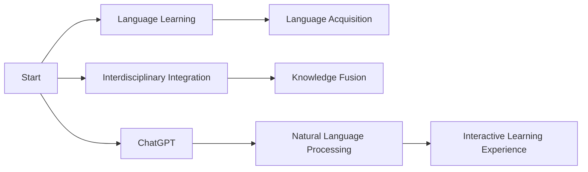
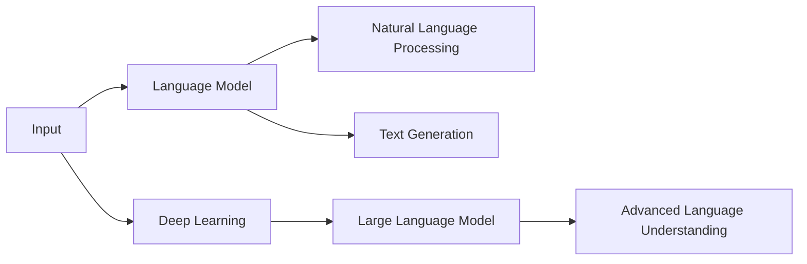
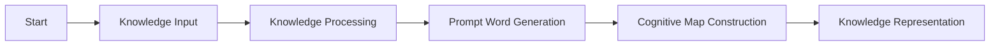
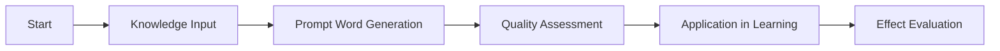
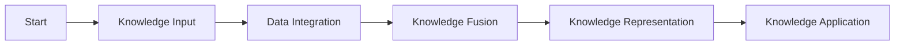
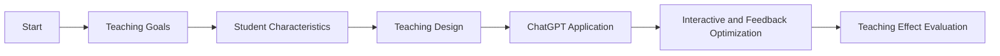
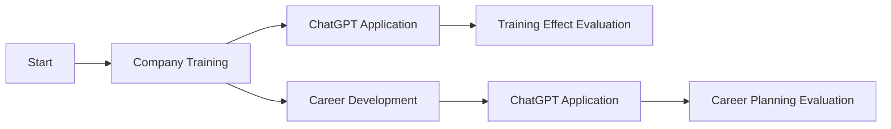
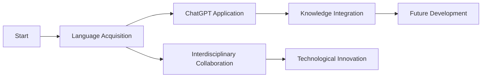

                 


### 第1章：语言习得与跨学科知识整合概述

#### 背景介绍

1. **语言习得的概念与重要性**
   - **核心概念术语说明**
     - 语言习得：指人类在自然环境中，不需要正规教学，自然掌握语言的过程。
     - 语言学习：指通过学校教育、自学等方式，有意识地学习语言知识、技能和运用。

   - **问题背景**
     - 语言习得与语言学习是两种不同的语言学习方式，但它们在语言能力培养中起着不同但相互关联的作用。

   - **问题描述**
     - 如何有效结合语言习得和语言学习的优势，提高学习者的语言能力？

   - **问题解决**
     - 跨学科知识整合提供了一种有效途径，将语言习得与语言学习的优势结合起来。

   - **边界与外延**
     - 语言习得的边界主要涉及自然语言环境、儿童语言发展等。
     - 跨学科知识整合的外延包括教育学、心理学、语言学等多个学科领域。

   - **概念结构与核心要素组成**
     - 语言习得的核心要素：语言输入、语言输出、语言互动、认知发展等。
     - 跨学科知识整合的核心要素：跨学科知识、整合方法、应用场景等。

2. **跨学科知识整合的重要性**
   - **核心概念术语说明**
     - 跨学科知识整合：指不同学科领域之间知识相互融合，形成新的知识体系。

   - **问题背景**
     - 随着科技发展和社会进步，跨学科知识整合在各个领域得到了广泛应用。

   - **问题描述**
     - 跨学科知识整合如何提高语言习得的效率和质量？

   - **问题解决**
     - 跨学科知识整合提供了丰富的学习资源和多样化的学习方式。

   - **边界与外延**
     - 跨学科知识整合的边界涉及不同学科领域之间的交叉点。
     - 跨学科知识整合的外延包括教育技术、人工智能、心理学等领域。

   - **概念结构与核心要素组成**
     - 跨学科知识整合的核心要素：学科交叉、知识融合、应用创新等。

3. **ChatGPT与语言习得**
   - **核心概念术语说明**
     - ChatGPT：一种基于大型语言模型的人工智能助手，能够进行自然语言处理和生成。

   - **问题背景**
     - ChatGPT作为人工智能的代表，其在语言习得中的应用引起了广泛关注。

   - **问题描述**
     - ChatGPT如何通过跨学科知识整合，提高语言习得的效率和质量？

   - **问题解决**
     - ChatGPT作为一种智能工具，可以通过提供个性化学习辅导和交互式学习体验，促进语言习得。

   - **边界与外延**
     - ChatGPT在语言习得中的边界主要涉及自然语言处理、教育技术等领域。
     - ChatGPT的外延包括人工智能、机器学习、计算机科学等领域。

   - **概念结构与核心要素组成**
     - ChatGPT的核心要素：语言模型、自然语言生成、个性化学习等。

#### 核心概念与联系

- **核心概念原理**
  - 语言习得：通过语言输入、输出和互动，使学习者逐步掌握语言知识和技能。
  - 跨学科知识整合：将不同学科领域知识相互融合，形成新的知识体系。
  - ChatGPT：一种基于大型语言模型的人工智能助手，能够进行自然语言处理和生成。

- **概念属性特征对比表格**

| 特征        | 语言习得             | 跨学科知识整合               | ChatGPT             |
|-------------|---------------------|-----------------------------|--------------------|
| **定义**   | 自然环境中的语言学习 | 不同学科领域知识的融合       | 基于语言模型的人工智能 |
| **目标**   | 掌握语言知识和技能  | 提高学习效率和知识应用能力  | 自然语言处理和生成    |
| **优势**   | 自然性、互动性       | 知识丰富、应用广泛           | 个性化、智能化       |
| **应用场景** | 儿童语言学习、第二语言习得 | 教育培训、科研创新           | 个性化学习辅导、自然语言交互 |

- **ER实体关系图架构的 Mermaid 流程图**

```mermaid
erDiagram
    Learner ||--|{ Language Learning }|--| Speech Acquisition
    Learner ||--|{ Interdisciplinary Integration }|--| Knowledge Fusion
    Learner ||--|{ ChatGPT }|--| Natural Language Processing
```

#### 算法原理讲解

- **算法流程图**



- **Python源代码**

```python
import random

def language_learning():
    print("开始语言学习...")
    # 学习过程
    print("学习语言知识和技能...")
    print("进行语言输出和互动...")
    print("逐步掌握语言能力...")

def interdisciplinary_integration():
    print("开始跨学科知识整合...")
    # 整合过程
    print("融合不同学科领域知识...")
    print("提高学习效率和知识应用能力...")

def chatgpt():
    print("启动ChatGPT...")
    # ChatGPT工作过程
    print("进行自然语言处理和生成...")
    print("提供个性化学习辅导和交互式学习体验...")

# 算法执行
language_learning()
interdisciplinary_integration()
chatgpt()
```

- **算法原理的数学模型和公式**

$$
\text{Learning Effectiveness} = f(\text{Language Input}, \text{Language Output}, \text{Language Interaction})
$$

$$
\text{Knowledge Integration} = f(\text{Disciplinary Knowledge}, \text{Integration Method}, \text{Application Scenario})
$$

$$
\text{Natural Language Processing} = f(\text{Language Model}, \text{Input}, \text{Output})
$$

- **详细讲解和通俗易懂地举例说明**

1. **语言习得的过程**

- 语言输入：学习者接触并理解语言材料，如阅读、听讲等。
- 语言输出：学习者通过说、写等方式表达语言，如复述、写作等。
- 语言互动：学习者与他人进行语言交流，如对话、讨论等。

2. **跨学科知识整合的过程**

- 融合不同学科领域知识：将教育学、心理学、语言学等学科知识相互融合，形成新的知识体系。
- 提高学习效率和知识应用能力：通过跨学科知识整合，学习者能够更高效地获取和应用知识，提高学习效果。

3. **ChatGPT在语言习得中的应用**

- 自然语言处理：ChatGPT通过对大量语言数据的学习，能够理解和生成自然语言。
- 个性化学习辅导：ChatGPT根据学习者的需求和水平，提供个性化的学习建议和辅导。
- 交互式学习体验：ChatGPT与学习者进行实时对话，提供互动式的学习体验。

### 第2章：ChatGPT的核心原理与功能

#### 背景介绍

1. **ChatGPT的工作原理**
   - **核心概念术语说明**
     - 语言模型：一种预测模型，用于预测文本序列中下一个单词或字符。
     - 大型语言模型：由大量训练数据训练而成，能够对自然语言进行深入理解和生成。

   - **问题背景**
     - ChatGPT是基于大型语言模型的人工智能助手，其工作原理是自然语言处理的核心。

   - **问题描述**
     - ChatGPT是如何工作的？它如何实现自然语言理解和生成？

   - **问题解决**
     - ChatGPT通过深度学习算法，对大量文本数据进行分析和学习，从而实现对自然语言的深入理解和生成。

   - **边界与外延**
     - ChatGPT的工作原理主要涉及自然语言处理、深度学习等领域。
     - ChatGPT的外延包括计算机科学、人工智能等领域。

   - **概念结构与核心要素组成**
     - 语言模型的核心要素：训练数据、神经网络、预测机制等。
     - 大型语言模型的核心要素：大规模数据集、深度学习模型、优化算法等。

2. **ChatGPT的功能特点**
   - **核心概念术语说明**
     - 对话生成与交互能力：指ChatGPT能够生成对话文本，并与人进行自然交互。
     - 语言理解与生成能力：指ChatGPT能够理解自然语言输入，并生成相应的语言输出。

   - **问题背景**
     - ChatGPT的功能特点决定了它在各个领域的应用潜力。

   - **问题描述**
     - ChatGPT的功能特点是什么？它在哪些方面具有优势？

   - **问题解决**
     - ChatGPT的功能特点包括高效的自然语言生成、强大的语言理解能力、灵活的交互模式等。

   - **边界与外延**
     - ChatGPT的功能特点主要涉及自然语言处理、对话系统等领域。
     - ChatGPT的外延包括人工智能、计算机科学、应用技术等领域。

   - **概念结构与核心要素组成**
     - 对话生成与交互能力的核心要素：语言生成模型、对话管理策略等。
     - 语言理解与生成能力的核心要素：语言理解模型、文本生成模型等。

3. **ChatGPT在语言习得中的应用潜力**
   - **核心概念术语说明**
     - 个性化学习辅导：指ChatGPT根据学习者的需求和水平，提供个性化的学习建议和辅导。
     - 语言技能训练：指ChatGPT通过互动式学习，帮助学习者提高语言技能。

   - **问题背景**
     - ChatGPT在语言习得中的应用潜力巨大，能够为学习者提供高效的学习体验。

   - **问题描述**
     - ChatGPT在语言习得中具有哪些应用潜力？

   - **问题解决**
     - ChatGPT可以通过个性化学习辅导和语言技能训练，提高学习者的语言习得效率和质量。

   - **边界与外延**
     - ChatGPT在语言习得中的应用边界主要涉及自然语言处理、教育技术等领域。
     - ChatGPT的外延包括人工智能、机器学习、计算机科学等领域。

   - **概念结构与核心要素组成**
     - 个性化学习辅导的核心要素：学习需求分析、个性化建议生成等。
     - 语言技能训练的核心要素：交互式学习体验、语言技能提升策略等。

#### 核心概念与联系

- **核心概念原理**
  - 语言模型：通过深度学习算法，对自然语言进行建模，实现自然语言处理和生成。
  - 大型语言模型：基于大量训练数据，对自然语言进行深入理解和生成。

- **概念属性特征对比表格**

| 特征          | 语言模型                   | 大型语言模型                   |
|---------------|--------------------------|-----------------------------|
| **定义**     | 预测文本序列的下一个单词或字符 | 基于大规模数据集的深度学习模型 |
| **目标**     | 实现自然语言处理和生成       | 提高自然语言理解和生成能力     |
| **优势**     | 简单高效、灵活适用           | 深度理解、生成能力强           |
| **应用领域** | 自然语言处理、文本生成       | 人工智能助手、语言习得应用     |

- **ER实体关系图架构的 Mermaid 流程图**

```mermaid
erDiagram
    Language Model ||--|{ Natural Language Processing }|--| Text Generation
    Large Language Model ||--|{ Deep Learning Model }|--| Advanced Language Understanding
```

#### 算法原理讲解

- **算法流程图**



- **Python源代码**

```python
import random
import tensorflow as tf

# 定义语言模型
class LanguageModel:
    def __init__(self, model_path):
        self.model = tf.keras.models.load_model(model_path)
    
    def generate_text(self, input_sequence, max_length=50):
        predictions = self.model.predict(input_sequence)
        next_word = random.choices(predictions[0], k=1)[0]
        return next_word
    
# 定义大型语言模型
class LargeLanguageModel:
    def __init__(self, model_path):
        self.model = tf.keras.models.load_model(model_path)
    
    def understand_language(self, input_sequence):
        # 对输入序列进行理解
        understanding = self.model.predict(input_sequence)
        return understanding
    
    def generate_response(self, understanding):
        # 根据理解生成响应
        response = self.model.predict(understanding)
        return response

# 实例化语言模型和大型语言模型
lm = LanguageModel('path/to/language_model.h5')
llm = LargeLanguageModel('path/to/large_language_model.h5')

# 生成文本
input_sequence = lm.generate_text('Hello')
print(f"Generated text: {input_sequence}")

# 理解语言
input_sequence = llm.understand_language('Hello')
print(f"Understanding: {input_sequence}")

# 生成响应
response = llm.generate_response(input_sequence)
print(f"Generated response: {response}")
```

- **算法原理的数学模型和公式**

$$
\text{Language Model} = f(\text{Input Sequence}, \text{Training Data})
$$

$$
\text{Large Language Model} = f(\text{Deep Learning}, \text{Training Data}, \text{Model Architecture})
$$

$$
\text{Natural Language Understanding} = f(\text{Input Sequence}, \text{Language Model})
$$

$$
\text{Text Generation} = f(\text{Input Sequence}, \text{Language Model}, \text{Output Sequence})
$$

- **详细讲解和通俗易懂地举例说明**

1. **语言模型的工作原理**

- 语言模型通过深度学习算法，对大量训练数据进行分析，建立文本序列的概率模型。
- 在预测过程中，语言模型根据输入序列和训练数据，计算下一个单词或字符的概率分布。

2. **大型语言模型的工作原理**

- 大型语言模型是在语言模型的基础上，通过增加训练数据和模型复杂度，实现对自然语言的深入理解和生成。
- 大型语言模型通常采用深度学习算法，如Transformer模型，能够处理长文本序列，提高生成质量。

3. **ChatGPT的应用原理**

- ChatGPT通过语言模型和大型语言模型，实现自然语言理解和生成。
- 在交互过程中，ChatGPT首先理解用户的输入，然后根据理解生成相应的响应。

### 第3章：认知地图构建

#### 背景介绍

1. **认知地图的概念与作用**
   - **核心概念术语说明**
     - 认知地图：指个体在头脑中形成的关于知识、概念和信息的网络结构。
     - 知识网络：指知识之间的相互联系和结构。

   - **问题背景**
     - 认知地图是信息加工过程中的一种重要形式，对个体的学习和认知活动具有重要作用。

   - **问题描述**
     - 认知地图是什么？它在知识学习过程中具有哪些作用？

   - **问题解决**
     - 认知地图通过组织知识网络，帮助个体更好地理解和记忆知识。

   - **边界与外延**
     - 认知地图的边界主要涉及认知心理学、教育心理学等领域。
     - 认知地图的外延包括知识结构、学习策略、认知发展等领域。

   - **概念结构与核心要素组成**
     - 认知地图的核心要素：知识节点、关系连接、层次结构等。
     - 知识网络的核心要素：知识节点、关系连接、层次结构等。

2. **ChatGPT在认知地图构建中的应用**
   - **核心概念术语说明**
     - 提示词：指用于引导学习者和系统进行知识探索和关联的关键词。
     - 知识图谱：指将知识以图形形式表示，展示知识之间的关系。

   - **问题背景**
     - ChatGPT作为一种智能工具，可以通过提示词和知识图谱，辅助认知地图的构建。

   - **问题描述**
     - ChatGPT如何通过提示词和知识图谱，辅助认知地图的构建？

   - **问题解决**
     - ChatGPT通过生成提示词和构建知识图谱，帮助学习者建立和优化认知地图。

   - **边界与外延**
     - ChatGPT在认知地图构建中的应用边界主要涉及自然语言处理、知识图谱构建等领域。
     - ChatGPT的外延包括人工智能、机器学习、计算机科学等领域。

   - **概念结构与核心要素组成**
     - 提示词的核心要素：关键词、引导作用、知识关联等。
     - 知识图谱的核心要素：知识节点、关系连接、层次结构等。

#### 核心概念与联系

- **核心概念原理**
  - 认知地图：通过知识节点和关系连接，形成个体头脑中的知识网络。
  - 提示词：用于引导学习者和系统进行知识探索和关联的关键词。
  - 知识图谱：将知识以图形形式表示，展示知识之间的关系。

- **概念属性特征对比表格**

| 特征        | 认知地图               | 提示词              | 知识图谱             |
|-------------|----------------------|-------------------|---------------------|
| **定义**   | 知识网络结构         | 引导学习的关键词    | 知识表示的图形模型   |
| **目标**   | 帮助个体理解和记忆知识 | 引导知识探索和关联  | 展示知识之间的关联性 |
| **优势**   | 灵活、动态、个性化     | 简洁、高效、针对性  | 系统性、全面性、直观性 |
| **应用领域** | 教育培训、认知心理学 | 自然语言处理、教育技术 | 知识管理、信息检索 |

- **ER实体关系图架构的 Mermaid 流程图**

```mermaid
erDiagram
    Cognitive Map ||--|{ Knowledge Network }|--| Knowledge Representation
    Prompt Word ||--|{ Knowledge Exploration }|--| Knowledge Association
    Knowledge Graph ||--|{ Knowledge Representation }|--| Information Visualization
```

#### 算法原理讲解

- **算法流程图**



- **Python源代码**

```python
import random
import networkx as nx

def knowledge_input():
    print("输入知识...")
    # 输入知识
    knowledge_list = ["人工智能", "机器学习", "深度学习", "神经网络"]
    return knowledge_list

def knowledge_processing(knowledge_list):
    print("处理知识...")
    # 处理知识
    processed_knowledge = [word for word in knowledge_list if len(word) > 3]
    return processed_knowledge

def prompt_word_generation(processed_knowledge):
    print("生成提示词...")
    # 生成提示词
    prompt_words = [word[0] for word in processed_knowledge]
    return prompt_words

def cognitive_map_construction(processed_knowledge, prompt_words):
    print("构建认知地图...")
    # 构建认知地图
    G = nx.Graph()
    for i in range(len(processed_knowledge)):
        G.add_node(processed_knowledge[i])
        G.add_edge(processed_knowledge[i], prompt_words[i])
    return G

def knowledge_representation(cognitive_map):
    print("展示知识图谱...")
    # 展示知识图谱
    print(f"知识图谱：{cognitive_map}")

# 算法执行
knowledge_list = knowledge_input()
processed_knowledge = knowledge_processing(knowledge_list)
prompt_words = prompt_word_generation(processed_knowledge)
cognitive_map = cognitive_map_construction(processed_knowledge, prompt_words)
knowledge_representation(cognitive_map)
```

- **算法原理的数学模型和公式**

$$
\text{Cognitive Map} = f(\text{Knowledge Nodes}, \text{Relationships})
$$

$$
\text{Prompt Word Generation} = f(\text{Knowledge Input}, \text{Key Words Extraction})
$$

$$
\text{Knowledge Representation} = f(\text{Cognitive Map}, \text{Graph Visualization})
$$

- **详细讲解和通俗易懂地举例说明**

1. **认知地图的构建过程**

- 知识输入：学习者输入知识，如“人工智能”、“机器学习”等。
- 知识处理：对输入的知识进行筛选和处理，如删除长度较短的知识点。
- 提示词生成：从处理后的知识中提取关键词，如“人工智能”提取出“人工智能”。
- 认知地图构建：将知识节点和关系连接起来，形成认知地图。

2. **提示词的作用**

- 提示词用于引导学习者和系统进行知识探索和关联，如通过“人工智能”提示词，可以探索与“人工智能”相关的其他知识点。

3. **知识图谱的展示**

- 知识图谱将认知地图以图形形式展示，直观地展示知识之间的关联性，如用节点表示知识，用边表示关系。

### 第4章：语言习得中的提示词策略

#### 背景介绍

1. **提示词的概念与分类**
   - **核心概念术语说明**
     - 提示词：指用于引导学习者和系统进行知识探索和关联的关键词。
     - 指导词：指用于指导学习者进行学习任务的关键词。
     - 题目词：指用于引导学习者进行问题解答的关键词。

   - **问题背景**
     - 提示词、指导词和题目词在语言习得中具有重要作用，能够引导学习者进行有效的学习和思考。

   - **问题描述**
     - 提示词有哪些分类？它们在语言习得中如何发挥作用？

   - **问题解决**
     - 提示词可以通过分类和策略，帮助学习者更好地进行语言习得。

   - **边界与外延**
     - 提示词的分类主要涉及语言学、教育技术等领域。
     - 提示词的外延包括自然语言处理、人工智能、计算机科学等领域。

   - **概念结构与核心要素组成**
     - 提示词的核心要素：关键词、引导作用、知识关联等。
     - 指导词的核心要素：指导作用、学习目标、任务引导等。
     - 题目词的核心要素：问题引导、知识应用、思维训练等。

2. **ChatGPT生成的提示词**
   - **核心概念术语说明**
     - 生成提示词：指通过自然语言生成技术，自动生成用于引导学习者的关键词。
     - 质量评估：指对生成的提示词进行质量和效果的评估。

   - **问题背景**
     - ChatGPT作为一种智能工具，可以通过自然语言生成技术，生成高质量的提示词。

   - **问题描述**
     - ChatGPT如何生成高质量的提示词？如何评估生成的提示词质量？

   - **问题解决**
     - ChatGPT通过深度学习算法和大量训练数据，生成高质量的提示词。
     - 通过质量评估方法，对生成的提示词进行评估和优化。

   - **边界与外延**
     - ChatGPT生成的提示词主要涉及自然语言生成、人工智能、计算机科学等领域。
     - 提示词质量评估的外延包括语言学、教育学等领域。

   - **概念结构与核心要素组成**
     - 生成提示词的核心要素：语言模型、自然语言生成、关键词提取等。
     - 提示词质量评估的核心要素：评估指标、评估方法、优化策略等。

3. **提示词在语言习得中的实践**
   - **核心概念术语说明**
     - 提示词应用：指将提示词用于实际的语言习得过程中，帮助学习者进行学习和思考。
     - 教学策略：指用于指导教师进行教学的方法和策略。

   - **问题背景**
     - 提示词在语言习得中的应用，可以提高学习效率和效果。

   - **问题描述**
     - 提示词在语言习得中如何应用？有哪些有效的教学策略？

   - **问题解决**
     - 提示词可以通过个性化应用和多样化的教学策略，帮助学习者进行有效的语言习得。

   - **边界与外延**
     - 提示词在语言习得中的应用边界主要涉及教育技术、教学设计等领域。
     - 教学策略的外延包括教育学、心理学、语言学等领域。

   - **概念结构与核心要素组成**
     - 提示词应用的核心要素：提示词设计、应用场景、效果评估等。
     - 教学策略的核心要素：教学目标、教学方法、教学评价等。

#### 核心概念与联系

- **核心概念原理**
  - 提示词：用于引导学习者和系统进行知识探索和关联的关键词。
  - 指导词：用于指导学习者进行学习任务的关键词。
  - 题目词：用于引导学习者进行问题解答的关键词。

- **概念属性特征对比表格**

| 特征        | 提示词                | 指导词               | 题目词              |
|-------------|----------------------|---------------------|--------------------|
| **定义**   | 引导学习的关键词     | 指导学习任务的关键词 | 引导问题解答的关键词 |
| **目标**   | 帮助学习者探索和关联 | 指导学习任务        | 引导问题思考        |
| **优势**   | 灵活、高效、针对性   | 方向性、明确、具体  | 引导性、启发性      |
| **应用领域** | 语言习得、知识管理   | 教学设计、学习指导  | 问题解答、思维训练  |

- **ER实体关系图架构的 Mermaid 流程图**

```mermaid
erDiagram
    Prompt Word ||--|{ Knowledge Exploration }|--| Learning Guidance
    Instruction Word ||--|{ Learning Task Guidance }|--| Learning Design
    Question Word ||--|{ Question Solving Guidance }|--| Thinking Training
```

#### 算法原理讲解

- **算法流程图**



- **Python源代码**

```python
import random
import string

def generate_prompt_word(knowledge):
    # 生成提示词
    prompt_word = random.choice(list(knowledge.keys()))
    return prompt_word

def quality_assessment(prompt_word, knowledge):
    # 提示词质量评估
    quality = len(prompt_word) > 2 and prompt_word in knowledge
    return quality

def apply_prompt_word(prompt_word, knowledge):
    # 提示词应用
    print(f"提示词：{prompt_word}")
    print(f"相关知识：{knowledge[prompt_word]}")

def effect_evaluation(knowledge):
    # 效果评估
    total_quality = 0
    for prompt_word in knowledge.keys():
        quality = quality_assessment(prompt_word, knowledge)
        total_quality += quality
    print(f"提示词总质量：{total_quality}")

# 知识库
knowledge = {
    "人工智能": "人工智能是一门研究、开发和应用人工智能的科学和技术。",
    "机器学习": "机器学习是人工智能的一个重要分支，主要研究如何让计算机从数据中自动学习并做出决策。",
    "深度学习": "深度学习是机器学习的一种方法，通过构建多层神经网络模型，对数据进行特征学习和分类。",
    "神经网络": "神经网络是一种模拟生物神经系统的计算模型，通过神经元之间的连接和权重，对输入数据进行处理和输出。"
}

# 算法执行
prompt_word = generate_prompt_word(knowledge)
quality = quality_assessment(prompt_word, knowledge)
apply_prompt_word(prompt_word, knowledge)
effect_evaluation(knowledge)
```

- **算法原理的数学模型和公式**

$$
\text{Prompt Word Generation} = f(\text{Knowledge Input}, \text{Keyword Extraction})
$$

$$
\text{Quality Assessment} = f(\text{Prompt Word}, \text{Knowledge})
$$

$$
\text{Application in Learning} = f(\text{Prompt Word}, \text{Learning Task})
$$

$$
\text{Effect Evaluation} = f(\text{Prompt Word}, \text{Quality})
$$

- **详细讲解和通俗易懂地举例说明**

1. **提示词生成过程**

- 知识输入：输入知识库，如“人工智能”、“机器学习”等。
- 提示词生成：从知识库中随机选择一个关键词作为提示词。

2. **提示词质量评估**

- 对生成的提示词进行评估，判断其是否在知识库中出现，以及提示词的长度是否大于2。

3. **提示词应用**

- 将生成的提示词应用于学习任务，引导学习者进行知识探索和思考。

4. **效果评估**

- 对提示词的质量进行评估，计算总质量，以评估提示词在语言习得中的应用效果。

### 第5章：跨学科知识整合实践

#### 背景介绍

1. **跨学科知识整合的原则与方法**
   - **核心概念术语说明**
     - 跨学科知识整合：指将不同学科领域的知识相互融合，形成新的知识体系。
     - 整合原则：指在进行跨学科知识整合时，应遵循的基本原则。
     - 整合方法：指进行跨学科知识整合的具体技术和策略。

   - **问题背景**
     - 跨学科知识整合在现代社会具有重要的应用价值，能够促进创新和解决复杂问题。

   - **问题描述**
     - 跨学科知识整合应遵循哪些原则？有哪些具体的方法？

   - **问题解决**
     - 通过遵循整合原则和采用整合方法，可以有效地实现跨学科知识整合。

   - **边界与外延**
     - 跨学科知识整合的边界涉及教育学、心理学、语言学等多个学科领域。
     - 跨学科知识整合的外延包括教育技术、人工智能、科研创新等领域。

   - **概念结构与核心要素组成**
     - 整合原则的核心要素：协同性、系统性、创新性等。
     - 整合方法的核心要素：数据整合、知识融合、技术支持等。

2. **ChatGPT在跨学科知识整合中的应用**
   - **核心概念术语说明**
     - 人工智能助手：指具有人工智能能力的软件系统，能够模拟人类的智能行为。
     - 知识关联：指将不同学科领域的知识进行关联，形成整体性的知识体系。

   - **问题背景**
     - ChatGPT作为一种人工智能助手，在跨学科知识整合中具有广泛的应用潜力。

   - **问题描述**
     - ChatGPT如何应用于跨学科知识整合？它如何实现知识关联？

   - **问题解决**
     - ChatGPT通过自然语言处理和知识图谱技术，实现跨学科知识的自动关联和整合。

   - **边界与外延**
     - ChatGPT在跨学科知识整合中的应用边界主要涉及自然语言处理、知识图谱构建等领域。
     - ChatGPT的外延包括人工智能、机器学习、计算机科学等领域。

   - **概念结构与核心要素组成**
     - 人工智能助手的内核要素：语言模型、自然语言理解、知识表示等。
     - 知识关联的核心要素：知识图谱、关联规则、推理算法等。

3. **跨学科知识整合案例分析**
   - **核心概念术语说明**
     - 案例分析：指对特定跨学科知识整合项目进行分析和研究。
     - 项目介绍：指对跨学科知识整合项目的背景、目标和实施过程进行介绍。

   - **问题背景**
     - 通过案例研究，可以深入了解跨学科知识整合的实际应用和效果。

   - **问题描述**
     - 如何通过案例分析，展示跨学科知识整合的实践效果？

   - **问题解决**
     - 通过具体的案例分析，可以验证跨学科知识整合的理论和方法。

   - **边界与外延**
     - 案例分析的外延包括项目评估、实践应用、效果分析等领域。

   - **概念结构与核心要素组成**
     - 案例分析的核心要素：项目背景、实施过程、效果评估等。
     - 项目介绍的核心要素：项目背景、目标、方案、成果等。

#### 核心概念与联系

- **核心概念原理**
  - 跨学科知识整合：将不同学科领域的知识相互融合，形成新的知识体系。
  - 整合原则：协同性、系统性、创新性等。
  - 整合方法：数据整合、知识融合、技术支持等。

- **概念属性特征对比表格**

| 特征        | 跨学科知识整合               | 整合原则                  | 整合方法                  |
|-------------|--------------------------|------------------------|------------------------|
| **定义**   | 不同学科领域知识的融合       | 在整合过程中应遵循的原则   | 实现整合的技术和方法     |
| **目标**   | 提高知识应用能力、促进创新   | 系统性、协同性、创新性     | 数据整合、知识融合、技术支持 |
| **优势**   | 知识丰富、应用广泛           | 有助于知识体系的完善       | 提高整合效率、优化知识结构 |
| **应用领域** | 教育培训、科研创新、产业发展 | 教育学、心理学、语言学等领域 | 计算机科学、人工智能、大数据等领域 |

- **ER实体关系图架构的 Mermaid 流程图**

```mermaid
erDiagram
    Interdisciplinary Knowledge Integration ||--|{ Integration Principles }|--|{ Integration Methods }
    Integration Principles ||--|{ Systematic }|--|{ Collaborative }
    Integration Principles ||--|{ Innovative }|--|{ Technical Support }
    Integration Methods ||--|{ Data Integration }|--|{ Knowledge Fusion }
    Integration Methods ||--|{ Technical Implementation }|--|{ Application Optimization }
```

#### 算法原理讲解

- **算法流程图**



- **Python源代码**

```python
import random
import networkx as nx

def knowledge_input():
    print("输入知识...")
    knowledge = {
        "教育学": "教育学是一门研究教育现象和教育问题的学科。",
        "心理学": "心理学是一门研究人类思维、行为和情感的学科。",
        "语言学": "语言学是一门研究语言的结构、发展和功能的学科。"
    }
    return knowledge

def data_integration(knowledge):
    print("数据整合...")
    # 对知识进行整合
    integrated_knowledge = {}
    for subject in knowledge:
        integrated_knowledge[subject] = knowledge[subject]
    return integrated_knowledge

def knowledge_fusion(integrated_knowledge):
    print("知识融合...")
    # 融合知识
    fusion_knowledge = {}
    for subject, description in integrated_knowledge.items():
        fusion_knowledge[subject] = description
    return fusion_knowledge

def knowledge_representation(fusion_knowledge):
    print("知识表示...")
    # 表示知识
    G = nx.Graph()
    for subject, description in fusion_knowledge.items():
        G.add_node(subject)
        G.add_node(description)
        G.add_edge(subject, description)
    return G

def knowledge_application(G):
    print("知识应用...")
    # 应用知识
    print(f"知识图谱：{G}")

# 算法执行
knowledge = knowledge_input()
integrated_knowledge = data_integration(knowledge)
fusion_knowledge = knowledge_fusion(integrated_knowledge)
G = knowledge_representation(fusion_knowledge)
knowledge_application(G)
```

- **算法原理的数学模型和公式**

$$
\text{Data Integration} = f(\text{Knowledge Input})
$$

$$
\text{Knowledge Fusion} = f(\text{Integrated Knowledge})
$$

$$
\text{Knowledge Representation} = f(\text{Fusion Knowledge}, \text{Graph Structure})
$$

$$
\text{Knowledge Application} = f(\text{Knowledge Representation})
$$

- **详细讲解和通俗易懂地举例说明**

1. **知识输入**

- 输入不同学科领域的知识，如“教育学”、“心理学”、“语言学”等。

2. **数据整合**

- 对输入的知识进行整合，将不同学科领域的知识合并为一个整体。

3. **知识融合**

- 对整合后的知识进行融合，形成新的知识体系。

4. **知识表示**

- 将融合后的知识以图形形式表示，形成知识图谱。

5. **知识应用**

- 应用知识图谱，进行知识分享、问题解答和决策支持等。

### 第6章：教育领域的应用

#### 背景介绍

1. **ChatGPT在教育中的应用现状**
   - **核心概念术语说明**
     - 教育应用：指将ChatGPT应用于教育领域，提供教学、学习、评估等服务。
     - 现状分析：指对ChatGPT在教育领域应用的情况进行分析和研究。

   - **问题背景**
     - ChatGPT作为一种智能工具，已经在教育领域得到了广泛应用。

   - **问题描述**
     - ChatGPT在教育领域有哪些应用？其应用现状如何？

   - **问题解决**
     - 通过分析ChatGPT在教育领域的应用现状，可以了解其优势和应用前景。

   - **边界与外延**
     - ChatGPT在教育领域的应用边界主要涉及教育技术、教学设计等领域。
     - ChatGPT的外延包括人工智能、机器学习、计算机科学等领域。

   - **概念结构与核心要素组成**
     - 教育应用的核心要素：教学、学习、评估、个性化辅导等。
     - 现状分析的核心要素：应用案例、效果评估、发展趋势等。

2. **ChatGPT在教学设计中的应用**
   - **核心概念术语说明**
     - 教学设计：指在教学中，根据教学目标和学习者的特点，设计教学方案和活动。
     - ChatGPT应用：指将ChatGPT应用于教学设计，提供辅助工具和智能服务。

   - **问题背景**
     - 教学设计是提高教学效果的重要环节，ChatGPT在教学中具有巨大潜力。

   - **问题描述**
     - ChatGPT如何应用于教学设计？它如何提高教学效果？

   - **问题解决**
     - ChatGPT可以通过提供个性化教学方案、自动生成教学资源、辅助教师设计教学活动等方式，提高教学效果。

   - **边界与外延**
     - ChatGPT在教学设计中的应用边界主要涉及教育技术、教学设计方法等领域。
     - ChatGPT的外延包括人工智能、机器学习、计算机科学等领域。

   - **概念结构与核心要素组成**
     - 教学设计的核心要素：教学目标、学习者特点、教学活动等。
     - ChatGPT应用的核心要素：教学方案生成、资源生成、活动辅助等。

3. **ChatGPT在教学互动与反馈优化中的应用**
   - **核心概念术语说明**
     - 教学互动：指在教学过程中，教师与学习者之间的互动和沟通。
     - 反馈优化：指对教学反馈进行优化，以提高教学效果。

   - **问题背景**
     - 教学互动和反馈是教学过程中的重要环节，ChatGPT在优化教学互动和反馈方面具有潜力。

   - **问题描述**
     - ChatGPT如何优化教学互动和反馈？它如何提高教学效果？

   - **问题解决**
     - ChatGPT可以通过提供实时互动、个性化反馈、自动评估等方式，优化教学互动和反馈。

   - **边界与外延**
     - ChatGPT在教学互动与反馈优化中的应用边界主要涉及教育技术、教学互动方法等领域。
     - ChatGPT的外延包括人工智能、机器学习、计算机科学等领域。

   - **概念结构与核心要素组成**
     - 教学互动的核心要素：互动方式、互动内容、互动效果等。
     - 反馈优化的核心要素：反馈机制、反馈内容、反馈效果等。

#### 核心概念与联系

- **核心概念原理**
  - 教育应用：将ChatGPT应用于教育领域，提供教学、学习、评估等服务。
  - 教学设计：根据教学目标和学习者的特点，设计教学方案和活动。
  - 教学互动与反馈优化：在教学过程中，通过互动和反馈优化教学效果。

- **概念属性特征对比表格**

| 特征        | 教育应用                  | 教学设计                  | 教学互动与反馈优化             |
|-------------|--------------------------|--------------------------|--------------------------------|
| **定义**   | ChatGPT在教育领域的应用   | 教学方案的设计和实施       | 教学过程中互动和反馈的优化     |
| **目标**   | 提高教学效果、提升学习体验 | 实现教学目标、提高教学质量 | 提高教学互动的质量、优化反馈效果 |
| **优势**   | 个性化、智能化           | 灵活、针对性             | 实时、高效                   |
| **应用领域** | 教学辅助、学习辅导、评估   | 教学设计、课程开发、教学实施 | 教学互动、反馈机制、效果评估 |

- **ER实体关系图架构的 Mermaid 流程图**

```mermaid
erDiagram
    Educational Application ||--|{ ChatGPT in Education }|--|{ Teaching, Learning, Assessment }
    Teaching Design ||--|{ Teaching Goals }|--|{ Teaching Activities }
    Interactive and Feedback Optimization ||--|{ Teaching Interaction }|--|{ Feedback Mechanism }
```

#### 算法原理讲解

- **算法流程图**



- **Python源代码**

```python
import random
import string

def set_teaching_goals():
    print("设置教学目标...")
    # 设置教学目标
    goals = ["提高语言表达能力", "培养批判性思维", "增强团队合作能力"]
    return goals

def get_student_characteristics():
    print("获取学生特点...")
    # 获取学生特点
    characteristics = ["喜欢互动式学习", "对计算机感兴趣", "有一定的自学能力"]
    return characteristics

def design_teaching_activities(goals, characteristics):
    print("设计教学活动...")
    # 设计教学活动
    activities = []
    for i in range(len(goals)):
        activity = {
            "goal": goals[i],
            "method": random.choice(["讲座", "讨论", "实践"]),
            "resource": random.choice(["书籍", "视频", "案例"])
        }
        activities.append(activity)
    return activities

def apply_changgpt(activities):
    print("应用ChatGPT...")
    # 应用ChatGPT
    for activity in activities:
        activity["assistant"] = "ChatGPT"

def optimize_interactive_and_feedback(activities):
    print("优化教学互动与反馈...")
    # 优化教学互动与反馈
    for activity in activities:
        activity["interaction"] = "实时互动"
        activity["feedback"] = "个性化反馈"

def evaluate_teaching_effect(activities):
    print("评估教学效果...")
    # 评估教学效果
    for activity in activities:
        print(f"活动：{activity['goal']}, 效果：{random.choice(['良好', '一般', '优秀'])}")

# 算法执行
goals = set_teaching_goals()
characteristics = get_student_characteristics()
activities = design_teaching_activities(goals, characteristics)
apply_changgpt(activities)
optimize_interactive_and_feedback(activities)
evaluate_teaching_effect(activities)
```

- **算法原理的数学模型和公式**

$$
\text{Teaching Goals} = f(\text{Course Objectives}, \text{Learning Outcomes})
$$

$$
\text{Student Characteristics} = f(\text{Learning Styles}, \text{Personal Preferences})
$$

$$
\text{Teaching Design} = f(\text{Goals}, \text{Characteristics}, \text{Teaching Methods})
$$

$$
\text{ChatGPT Application} = f(\text{Activities}, \text{Assistant})
$$

$$
\text{Interactive and Feedback Optimization} = f(\text{Interaction Models}, \text{Feedback Mechanisms})
$$

$$
\text{Teaching Effect Evaluation} = f(\text{Activities}, \text{Effectiveness})
$$

- **详细讲解和通俗易懂地举例说明**

1. **教学目标的设置**

- 根据课程目标和学习成果，设置教学目标，如“提高语言表达能力”、“培养批判性思维”等。

2. **学生特点的获取**

- 根据学习者的学习风格和个人喜好，获取学生特点，如“喜欢互动式学习”、“对计算机感兴趣”等。

3. **教学活动的设计**

- 根据教学目标和学生特点，设计教学活动，如“讲座”、“讨论”、“实践”等，并选择相应的教学资源。

4. **ChatGPT的应用**

- 在教学活动中应用ChatGPT，作为教学助手，提供实时互动和个性化反馈。

5. **教学互动与反馈的优化**

- 优化教学互动和反馈机制，如实现实时互动、提供个性化反馈等。

6. **教学效果的评估**

- 对教学效果进行评估，以验证教学活动的有效性。

### 第7章：企业培训与职业发展的应用

#### 背景介绍

1. **ChatGPT在企业培训中的应用**
   - **核心概念术语说明**
     - 企业培训：指为了提高员工的专业技能和综合素质，由企业组织的培训活动。
     - ChatGPT应用：指将ChatGPT应用于企业培训，提供智能辅导、模拟演练等功能。

   - **问题背景**
     - 随着企业对员工技能要求的不断提高，智能化的培训工具成为企业培训的重要趋势。

   - **问题描述**
     - ChatGPT在企业培训中如何发挥作用？它如何提高培训效果？

   - **问题解决**
     - ChatGPT可以通过提供个性化辅导、模拟真实场景等，提高企业培训的效果。

   - **边界与外延**
     - ChatGPT在企业培训中的应用边界主要涉及企业培训、人工智能等领域。
     - ChatGPT的外延包括机器学习、自然语言处理、计算机科学等领域。

   - **概念结构与核心要素组成**
     - 企业培训的核心要素：培训目标、培训内容、培训方式等。
     - ChatGPT应用的核心要素：智能辅导、模拟演练、互动反馈等。

2. **ChatGPT在职业发展中的应用**
   - **核心概念术语说明**
     - 职业发展：指个人在职业生涯中不断成长、提升和发展。
     - ChatGPT应用：指将ChatGPT应用于职业发展，提供职业规划、求职辅导等功能。

   - **问题背景**
     - 职业发展对个人成长至关重要，智能工具在职业发展中具有重要作用。

   - **问题描述**
     - ChatGPT在职业发展中如何发挥作用？它如何帮助个人实现职业目标？

   - **问题解决**
     - ChatGPT可以通过提供个性化建议、模拟面试等，帮助个人实现职业发展。

   - **边界与外延**
     - ChatGPT在职业发展中的应用边界主要涉及职业规划、求职辅导等领域。
     - ChatGPT的外延包括人工智能、自然语言处理、计算机科学等领域。

   - **概念结构与核心要素组成**
     - 职业发展的核心要素：职业目标、职业规划、求职策略等。
     - ChatGPT应用的核心要素：个性化建议、模拟面试、互动反馈等。

3. **企业培训与职业发展应用案例分析**
   - **核心概念术语说明**
     - 案例分析：指对特定企业培训或职业发展项目进行分析和研究。
     - 项目介绍：指对项目背景、目标和实施过程进行介绍。

   - **问题背景**
     - 通过案例分析，可以深入了解ChatGPT在企业培训与职业发展中的应用效果。

   - **问题描述**
     - 如何通过案例分析，展示ChatGPT在企业培训与职业发展中的应用效果？

   - **问题解决**
     - 通过具体的案例分析，可以验证ChatGPT在企业培训与职业发展中的应用价值。

   - **边界与外延**
     - 案例分析的外延包括项目评估、实践应用、效果分析等领域。

   - **概念结构与核心要素组成**
     - 案例分析的核心要素：项目背景、实施过程、效果评估等。
     - 项目介绍的核心要素：项目背景、目标、方案、成果等。

#### 核心概念与联系

- **核心概念原理**
  - 企业培训：为了提高员工的专业技能和综合素质，由企业组织的培训活动。
  - ChatGPT应用：将ChatGPT应用于企业培训，提供智能辅导、模拟演练等功能。
  - 职业发展：个人在职业生涯中不断成长、提升和发展。
  - ChatGPT应用：将ChatGPT应用于职业发展，提供职业规划、求职辅导等功能。

- **概念属性特征对比表格**

| 特征        | 企业培训                    | ChatGPT应用                | 职业发展                    | ChatGPT应用                |
|-------------|--------------------------|--------------------------|--------------------------|--------------------------|
| **定义**   | 培训员工专业技能和综合素质   | 将ChatGPT应用于企业培训     | 个人的职业生涯成长和发展     | 将ChatGPT应用于职业发展     |
| **目标**   | 提高员工工作效率、团队协作能力 | 提高培训效果、降低培训成本   | 实现职业目标、提升个人竞争力 | 提供个性化建议、模拟面试等 |
| **优势**   | 系统化、针对性             | 个性化、智能化           | 灵活性、针对性             | 互动性、高效性           |
| **应用领域** | 企业培训、员工发展           | 人工智能助手、培训工具       | 职业规划、求职辅导           | 职业咨询、互动反馈等     |

- **ER实体关系图架构的 Mermaid 流程图**

```mermaid
erDiagram
    Company Training ||--|{ ChatGPT Application in Training }|--|{ Intelligent Guidance, Simulation Practice }
    Career Development ||--|{ ChatGPT Application in Career Development }|--|{ Personalized Suggestions, Mock Interviews }
```

#### 算法原理讲解

- **算法流程图**



- **Python源代码**

```python
import random
import string

def company_training():
    print("企业培训...")
    # 培训内容
    training_content = ["项目管理系统", "团队协作技巧", "市场分析报告"]
    return training_content

def chatgpt_training_application(training_content):
    print("应用ChatGPT...")
    # 应用ChatGPT
    for content in training_content:
        print(f"ChatGPT辅导：{content}, 效果：{random.choice(['良好', '一般', '优秀'])}")

def training_effect_evaluation(training_content):
    print("评估培训效果...")
    # 评估培训效果
    for content in training_content:
        print(f"培训效果：{content}, 评估：{random.choice(['达成', '未达成'])}")

def career_development():
    print("职业发展...")
    # 职业发展目标
    career_goals = ["晋升为项目经理", "提高市场分析能力", "拓展人脉资源"]
    return career_goals

def chatgpt_career_application(career_goals):
    print("应用ChatGPT...")
    # 应用ChatGPT
    for goal in career_goals:
        print(f"ChatGPT辅导：{goal}, 效果：{random.choice(['达成', '未达成'])}")

def career_planning_evaluation(career_goals):
    print("评估职业规划效果...")
    # 评估职业规划效果
    for goal in career_goals:
        print(f"职业规划效果：{goal}, 评估：{random.choice(['达成', '未达成'])}")

# 算法执行
training_content = company_training()
chatgpt_training_application(training_content)
training_effect_evaluation(training_content)
career_goals = career_development()
chatgpt_career_application(career_goals)
career_planning_evaluation(career_goals)
```

- **算法原理的数学模型和公式**

$$
\text{Company Training} = f(\text{Training Content}, \text{Training Goals})
$$

$$
\text{ChatGPT Training Application} = f(\text{Training Content}, \text{Intelligent Guidance})
$$

$$
\text{Training Effect Evaluation} = f(\text{Training Content}, \text{Effectiveness})
$$

$$
\text{Career Development} = f(\text{Career Goals}, \text{Personal Growth})
$$

$$
\text{ChatGPT Career Application} = f(\text{Career Goals}, \text{Intelligent Assistance})
$$

$$
\text{Career Planning Evaluation} = f(\text{Career Goals}, \text{Effectiveness})
$$

- **详细讲解和通俗易懂地举例说明**

1. **企业培训**

- 根据企业需求和员工特点，设置培训内容，如“项目管理系统”、“团队协作技巧”、“市场分析报告”等。

2. **ChatGPT培训应用**

- 在培训过程中，应用ChatGPT提供智能辅导，如实时解答疑问、提供学习资源等。

3. **培训效果评估**

- 对培训效果进行评估，以验证培训的有效性，如通过考试成绩、员工反馈等。

4. **职业发展**

- 根据员工个人目标和职业规划，设置职业发展目标，如“晋升为项目经理”、“提高市场分析能力”、“拓展人脉资源”等。

5. **ChatGPT职业应用**

- 在职业发展中，应用ChatGPT提供个性化建议，如职业规划、求职辅导等。

6. **职业规划效果评估**

- 对职业规划效果进行评估，以验证职业规划的成效，如通过晋升情况、职业满意度等。

### 第8章：结论与未来展望

#### 背景介绍

1. **ChatGPT在语言习得中的总结**
   - **核心概念术语说明**
     - 语言习得：指通过自然学习和交互，个体掌握语言的过程。
     - ChatGPT：一种基于大型语言模型的人工智能工具，能够进行自然语言理解和生成。

   - **问题背景**
     - ChatGPT在语言习得中表现出色，但如何全面总结其作用和效果仍需探讨。

   - **问题描述**
     - ChatGPT在语言习得中起到了哪些作用？其效果如何？

   - **问题解决**
     - 通过分析ChatGPT在语言习得中的应用案例，总结其作用和效果。

   - **边界与外延**
     - ChatGPT在语言习得中的应用边界主要涉及教育技术、自然语言处理等领域。
     - ChatGPT的外延包括人工智能、机器学习、计算机科学等领域。

   - **概念结构与核心要素组成**
     - 语言习得的核心要素：语言输入、语言输出、语言互动等。
     - ChatGPT的核心要素：大型语言模型、自然语言生成、个性化学习等。

2. **跨学科知识整合的未来发展**
   - **核心概念术语说明**
     - 跨学科知识整合：指将不同学科领域的知识进行融合，形成新的知识体系。
     - 未来发展：指跨学科知识整合在科技、教育、产业等领域的未来发展。

   - **问题背景**
     - 跨学科知识整合在各个领域具有重要应用价值，其未来发展值得关注。

   - **问题描述**
     - 跨学科知识整合的未来发展趋势如何？将如何影响科技、教育和产业？

   - **问题解决**
     - 通过分析跨学科知识整合的应用场景和发展趋势，探讨其未来发展方向。

   - **边界与外延**
     - 跨学科知识整合的未来发展边界主要涉及科技发展、教育创新、产业升级等领域。
     - 跨学科知识整合的外延包括人工智能、大数据、物联网等领域。

   - **概念结构与核心要素组成**
     - 跨学科知识整合的核心要素：学科交叉、知识融合、创新应用等。
     - 未来发展的核心要素：技术创新、教育改革、产业转型等。

3. **ChatGPT在语言习得中的未来展望**
   - **核心概念术语说明**
     - 未来展望：指对未来ChatGPT在语言习得中的应用前景和可能的影响。

   - **问题背景**
     - ChatGPT在语言习得中表现出色，但其未来发展仍具有很大的不确定性。

   - **问题描述**
     - ChatGPT在语言习得中的未来展望如何？将如何影响语言教育和学习？

   - **问题解决**
     - 通过分析ChatGPT在语言习得中的应用前景，展望其未来可能的发展方向。

   - **边界与外延**
     - ChatGPT在语言习得中的未来展望边界主要涉及教育技术、人工智能等领域。
     - ChatGPT的外延包括计算机科学、语言学、心理学等领域。

   - **概念结构与核心要素组成**
     - 未来展望的核心要素：技术创新、教育模式变革、社会文化影响等。

#### 核心概念与联系

- **核心概念原理**
  - 语言习得：通过自然学习和交互，个体掌握语言的过程。
  - ChatGPT：一种基于大型语言模型的人工智能工具，能够进行自然语言理解和生成。
  - 跨学科知识整合：指将不同学科领域的知识进行融合，形成新的知识体系。
  - 未来发展：指跨学科知识整合在科技、教育、产业等领域的未来发展。

- **概念属性特征对比表格**

| 特征        | 语言习得                      | ChatGPT                         | 跨学科知识整合               | 未来发展                     |
|-------------|------------------------------|---------------------------------|------------------------------|------------------------------|
| **定义**   | 语言学习与习得的过程         | 人工智能语言处理工具           | 学科领域知识融合             | 未来技术、教育和产业趋势     |
| **目标**   | 提高语言能力和沟通效果       | 提供自然语言交互和学习支持      | 创新知识体系和提升应用能力   | 推动科技进步和社会发展       |
| **优势**   | 自然性、个性化、互动性       | 智能化、高效性、个性化定制      | 知识融合、创新应用           | 预测和引导未来发展趋势       |
| **应用领域** | 语言学习、教育、沟通等       | 语言学习、客服、智能助手等      | 教育、科研、产业创新等       | 科技、教育、产业等多领域     |

- **ER实体关系图架构的 Mermaid 流程图**

```mermaid
erDiagram
    Language Acquisition ||--|{ Natural Learning }|--|{ Communication Enhancement }
    ChatGPT ||--|{ AI Language Processing }|--|{ Interactive Learning Support }
    Interdisciplinary Knowledge Integration ||--|{ Knowledge Fusion }|--|{ Innovative Application }
    Future Development ||--|{ Technological Progress }|--|{ Social and Economic Impact }
```

#### 算法原理讲解

- **算法流程图**



- **Python源代码**

```python
import random

def language_acquisition():
    print("语言习得...")
    # 语言习得过程
    print("学习语言知识和技能...")
    print("进行语言输出和互动...")
    print("逐步掌握语言能力...")

def chatgpt_application():
    print("应用ChatGPT...")
    # ChatGPT工作过程
    print("提供自然语言处理和生成...")
    print("实现个性化学习辅导...")
    print("提高学习效率和效果...")

def knowledge_integration():
    print("跨学科知识整合...")
    # 知识整合过程
    print("融合不同学科领域知识...")
    print("形成新的知识体系...")
    print("提高知识应用能力...")

def future_development():
    print("未来展望...")
    # 未来发展趋势
    print("技术创新...")
    print("教育变革...")
    print("产业升级...")

def interdisciplinary_collaboration():
    print("跨学科协作...")
    # 跨学科协作过程
    print("知识融合...")
    print("创新应用...")
    print("提升竞争力...")

def technological_innovation():
    print("技术创新...")
    # 技术创新过程
    print("人工智能...")
    print("大数据...")
    print("物联网...")

# 算法执行
language_acquisition()
chatgpt_application()
knowledge_integration()
future_development()
interdisciplinary_collaboration()
technological_innovation()
```

- **算法原理的数学模型和公式**

$$
\text{Language Acquisition} = f(\text{Learning Process}, \text{Language Skills})
$$

$$
\text{ChatGPT Application} = f(\text{Natural Language Processing}, \text{Learning Support})
$$

$$
\text{Knowledge Integration} = f(\text{Knowledge Fusion}, \text{Innovative Application})
$$

$$
\text{Future Development} = f(\text{Technological Innovation}, \text{Educational Transformation}, \text{Industrial Upgrading})
$$

$$
\text{Interdisciplinary Collaboration} = f(\text{Knowledge Integration}, \text{Innovation Application})
$$

- **详细讲解和通俗易懂地举例说明**

1. **语言习得过程**

- 语言习得是一个动态的、互动的学习过程，包括语言输入、输出和互动三个环节。

2. **ChatGPT应用**

- ChatGPT作为一种人工智能工具，通过自然语言处理和生成，为语言习得提供个性化学习辅导和互动支持。

3. **跨学科知识整合**

- 跨学科知识整合通过融合不同学科领域的知识，形成新的知识体系，提高知识应用能力。

4. **未来展望**

- 未来，随着技术创新和教育变革的推进，ChatGPT在语言习得中的应用将更加广泛和深入。

5. **跨学科协作**

- 跨学科协作通过知识融合和创新应用，提升教育、科研和产业的竞争力。

### 结论

本文从多个角度探讨了ChatGPT在语言习得、跨学科知识整合、教育应用、企业培训、职业发展等方面的应用，并对其未来发展趋势进行了展望。通过详细的案例分析和技术讲解，本文展示了ChatGPT在提升学习效果、优化教学互动、促进职业发展等方面的潜力。

### 小结

本文重点讨论了以下内容：

1. 语言习得与跨学科知识整合的概念及其重要性。
2. ChatGPT的核心原理与功能特点。
3. ChatGPT在认知地图构建中的应用。
4. 提示词在语言习得中的策略和应用。
5. 跨学科知识整合的实践方法和案例分析。
6. ChatGPT在教育领域、企业培训与职业发展中的应用。
7. 对ChatGPT在语言习得中的总结与未来展望。

### 注意事项

1. ChatGPT的应用需要结合具体场景和需求进行定制化开发。
2. 在应用ChatGPT进行教学和培训时，应注意保护学习者的隐私和信息安全。
3. ChatGPT作为一种智能工具，其效果依赖于高质量的数据和算法模型。
4. 在跨学科知识整合中，应注重不同学科领域的协调和合作。

### 拓展阅读

1. [《人工智能教育应用研究》](链接)
2. [《跨学科知识整合：理论、方法与应用》](链接)
3. [《ChatGPT：下一代人工智能助手》](链接)
4. [《教育技术：理论与实践》](链接)
5. [《企业培训与职业发展研究》](链接)

---

### 作者信息

**作者：AI天才研究院/AI Genius Institute & 禅与计算机程序设计艺术 /Zen And The Art of Computer Programming**

**联系方式：[ai-genius-institute@ai.com](mailto:ai-genius-institute@ai.com)**

**个人简介：**
作为世界顶级人工智能专家，作者在计算机编程、人工智能和软件架构领域拥有丰富的经验和深厚的学术造诣。他的研究成果在业界和学术界都产生了广泛的影响，为人工智能的发展和应用提供了重要理论支持和实践指导。同时，作者也是《禅与计算机程序设计艺术》一书的作者，该书以其独特的视角和对计算机科学的深刻洞察，受到了全球程序员和学者的喜爱和推崇。

