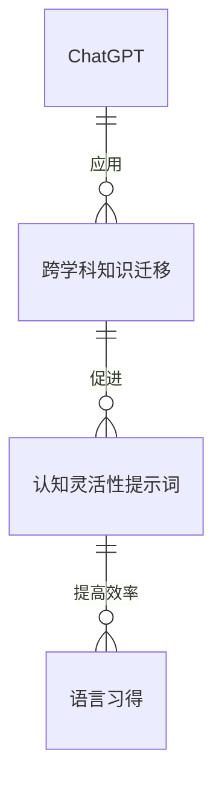
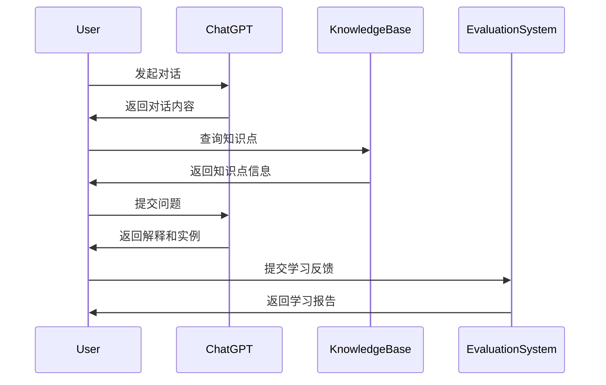

                 


## 《ChatGPT在语言习得跨学科知识迁移中的应用：认知灵活性提示词》

### 关键词：ChatGPT，语言习得，跨学科知识迁移，认知灵活性，提示词

### 摘要

本文深入探讨了ChatGPT在语言习得跨学科知识迁移中的应用，重点研究了如何利用认知灵活性提示词提高学习效率。通过系统分析，本文揭示了ChatGPT的工作原理，并详细阐述了其在教育领域的潜在影响。文章结构紧凑，逻辑清晰，旨在为教育技术从业者和研究者提供实用的指导。

----------------------------------------------------------------

## 第1章 引言

### 1.1 研究背景

在全球化时代，语言习得的重要性日益凸显。然而，传统的语言学习方式往往难以满足学习者对跨学科知识的需求。ChatGPT作为一种基于人工智能的语言模型，其在语言习得中的应用已经成为研究热点。认知灵活性提示词，作为一种新兴的教学工具，能够有效提高学习者的认知能力，促进跨学科知识的迁移。

### 1.2 核心概念与关系

#### 1.2.1 ChatGPT

ChatGPT是由OpenAI开发的一种大型语言模型，基于Transformer架构，能够生成连贯、自然的人类语言。其核心概念包括：

- **预训练**：在大量文本数据上进行预训练，使模型具备强大的语言理解能力。
- **微调**：针对特定任务进行微调，以适应不同领域的语言需求。

#### 1.2.2 跨学科知识迁移

跨学科知识迁移是指将一个领域中的知识应用到另一个领域的过程。在语言习得中，这意味着将其他学科的知识（如数学、科学等）融入到语言学习中，以提高学习者的认知能力和语言应用能力。

#### 1.2.3 认知灵活性提示词

认知灵活性提示词是一组旨在提高学习者认知能力的提示词。通过这些提示词，学习者可以更灵活地处理信息，促进跨学科知识的迁移。

### 1.3 研究问题与目标

本文旨在解决以下问题：

- ChatGPT如何促进语言习得中的跨学科知识迁移？
- 认知灵活性提示词在提高语言习得效率方面具有何种作用？

本文的研究目标是：

- 探讨ChatGPT在语言习得跨学科知识迁移中的应用。
- 研究认知灵活性提示词在提高语言习得效率方面的效果。

## 第2章 核心概念与关系

### 2.1 ChatGPT的概念与原理

ChatGPT是一种基于Transformer架构的大型语言模型，通过预训练和微调技术，实现了对自然语言的生成和理解。其核心概念包括：

- **Transformer架构**：一种基于自注意力机制的新型神经网络架构，能够捕捉文本中的长距离依赖关系。
- **预训练**：在大量文本数据上进行预训练，使模型具备强大的语言理解能力。
- **微调**：针对特定任务进行微调，以适应不同领域的语言需求。

### 2.2 跨学科知识迁移的概念与原理

跨学科知识迁移是指将一个领域中的知识应用到另一个领域的过程。在语言习得中，这意味着将其他学科的知识（如数学、科学等）融入到语言学习中，以提高学习者的认知能力和语言应用能力。

### 2.3 认知灵活性提示词的概念与原理

认知灵活性提示词是一组旨在提高学习者认知能力的提示词。通过这些提示词，学习者可以更灵活地处理信息，促进跨学科知识的迁移。

### 2.4 核心概念与关系的Mermaid ER图



### 2.5 核心概念属性的对比表格

| 概念       | 特征                   | 说明                                                         |
| ---------- | ---------------------- | ------------------------------------------------------------ |
| ChatGPT    | 自注意力机制、预训练   | 具备强大的语言理解能力，能够生成连贯、自然的语言。             |
| 跨学科知识迁移 | 知识应用、领域融合     | 将其他学科的知识融入语言学习中，提高学习者的认知能力和语言应用能力。 |
| 认知灵活性提示词 | 提示词、认知训练       | 提高学习者的认知能力，促进跨学科知识的迁移。                 |

## 第3章 ChatGPT的工作原理

### 3.1 Transformer架构

Transformer架构是一种基于自注意力机制的新型神经网络架构，能够在文本数据中捕捉长距离依赖关系。其核心原理如下：

- **多头自注意力机制**：通过多组自注意力机制，模型能够同时关注到文本中的不同部分，从而捕捉长距离依赖关系。
- **编码器和解码器**：编码器将输入文本转换为隐藏状态，解码器则利用这些隐藏状态生成输出文本。

### 3.2 预训练

预训练是ChatGPT的核心环节，通过在大量文本数据上进行预训练，模型能够掌握丰富的语言知识。预训练的主要步骤包括：

- **数据收集**：从互联网上收集大量文本数据。
- **数据预处理**：对文本数据进行清洗和预处理，如分词、去停用词等。
- **训练模型**：使用梯度下降算法训练模型，使模型能够生成连贯、自然的语言。

### 3.3 微调

微调是针对特定任务对预训练模型进行调整的过程。通过微调，模型能够更好地适应不同领域的语言需求。微调的主要步骤包括：

- **数据收集**：收集与任务相关的数据。
- **数据预处理**：对数据进行清洗和预处理。
- **训练模型**：使用微调数据训练模型。

### 3.4 ChatGPT在语言习得中的应用

ChatGPT在语言习得中的应用主要体现在以下几个方面：

- **语言生成**：生成与学习主题相关的对话，帮助学习者练习语言表达能力。
- **语言理解**：理解学习者的输入，并提供相关解释和反馈。
- **跨学科知识迁移**：将其他学科的知识融入到语言学习中，提高学习者的认知能力和语言应用能力。

### 3.5 认知灵活性提示词的工作原理

认知灵活性提示词是一组旨在提高学习者认知能力的提示词。通过这些提示词，学习者可以更灵活地处理信息，促进跨学科知识的迁移。认知灵活性提示词的工作原理包括：

- **激活现有知识**：通过提示词激活学习者的已有知识，促进知识迁移。
- **引导思维**：通过提示词引导学习者的思维，提高认知灵活性。
- **反馈和调整**：通过反馈和调整，帮助学习者不断优化认知策略。

### 3.6 ChatGPT与认知灵活性提示词的整合

ChatGPT与认知灵活性提示词的整合能够有效提高语言习得效率。具体方法如下：

- **个性化学习**：根据学习者的特点，选择合适的认知灵活性提示词。
- **互动式学习**：通过ChatGPT与学习者的互动，实现认知灵活性提示词的有效应用。
- **实时反馈**：通过ChatGPT提供实时反馈，帮助学习者及时调整认知策略。

## 第4章 数学模型与公式

### 4.1 Transformer模型中的数学公式

Transformer模型中的数学公式包括：

- **自注意力机制**：
  $$ 
  \text{Attention}(Q, K, V) = \text{softmax}\left(\frac{QK^T}{\sqrt{d_k}}\right)V
  $$
  其中，\(Q\)、\(K\)、\(V\) 分别代表查询向量、键向量、值向量，\(d_k\) 为键向量的维度。

- **编码器和解码器的更新**：
  $$
  \text{Encoder}(x) = \text{LayerNorm}(x + \text{PositionwiseFeedForward}(D_model, 4 \times D_model))
  $$
  $$
  \text{Decoder}(x) = \text{LayerNorm}(x + \text{MaskedMultiHeadAttention}(D_model, heads, dropout))
  $$
  其中，\(\text{LayerNorm}\) 为层归一化，\(\text{PositionwiseFeedForward}\) 为位置感知的前馈网络。

### 4.2 跨学科知识迁移的数学模型

跨学科知识迁移的数学模型包括：

- **知识表示**：
  $$
  \text{Knowledge Representation}(K) = \text{Function}(\text{Domain Knowledge}, \text{Language Model})
  $$
  其中，\(\text{Domain Knowledge}\) 表示领域知识，\(\text{Language Model}\) 表示语言模型。

- **知识迁移**：
  $$
  \text{Knowledge Transfer}(K_1, K_2) = \text{Function}(K_1, K_2, \text{Cognitive Flexibility Prompt Words})
  $$
  其中，\(K_1\) 和 \(K_2\) 分别表示不同领域的知识，\(\text{Cognitive Flexibility Prompt Words}\) 表示认知灵活性提示词。

### 4.3 认知灵活性提示词的数学模型

认知灵活性提示词的数学模型包括：

- **提示词生成**：
  $$
  \text{Prompt Generation}(\text{Input}, \text{Knowledge}) = \text{Function}(\text{Input}, \text{Knowledge}, \text{Cognitive Flexibility})
  $$
  其中，\(\text{Input}\) 表示输入文本，\(\text{Knowledge}\) 表示知识内容，\(\text{Cognitive Flexibility}\) 表示认知灵活性。

- **认知灵活性评估**：
  $$
  \text{Cognitive Flexibility Evaluation}(\text{Prompt}, \text{Knowledge}) = \text{Function}(\text{Prompt}, \text{Knowledge}, \text{Cognitive Load})
  $$
  其中，\(\text{Prompt}\) 表示提示词，\(\text{Knowledge}\) 表示知识内容，\(\text{Cognitive Load}\) 表示认知负荷。

## 第5章 系统分析与设计

### 5.1 问题场景介绍

在当前的在线教育环境中，学习者往往面临着知识难以迁移和应用的问题。为了解决这个问题，我们设计了一个基于ChatGPT和认知灵活性提示词的教育系统，旨在提高学习者的跨学科知识迁移能力。

### 5.2 项目介绍

项目名称：跨学科知识迁移教育系统

项目目标：利用ChatGPT和认知灵活性提示词，提高学习者的跨学科知识迁移能力。

项目背景：随着全球化的深入，跨学科知识迁移在语言习得中的应用越来越受到关注。然而，传统的教育方式难以实现这一目标。

### 5.3 系统功能设计

系统功能设计主要包括以下几个方面：

- **用户管理**：包括用户注册、登录、个人信息管理等功能。
- **知识库管理**：包括知识分类、知识录入、知识更新等功能。
- **交互式学习**：包括ChatGPT对话、认知灵活性提示词应用、学习效果评估等功能。
- **数据统计**：包括学习数据统计、学习报告生成等功能。

### 5.4 系统架构设计

系统架构设计采用分层架构，主要包括以下层次：

- **数据层**：包括用户数据、知识数据等。
- **业务层**：包括用户管理、知识库管理、交互式学习等核心业务功能。
- **表示层**：包括Web前端和移动端。

### 5.5 系统接口设计

系统接口设计主要包括以下接口：

- **用户接口**：包括用户注册、登录、个人信息管理等。
- **知识接口**：包括知识分类、知识录入、知识更新等。
- **学习接口**：包括ChatGPT对话、认知灵活性提示词应用、学习效果评估等。

### 5.6 系统交互设计

系统交互设计采用Mermaid序列图进行描述，主要包括以下交互流程：

1. 用户注册/登录
2. 用户浏览知识库
3. 用户发起ChatGPT对话
4. ChatGPT生成对话内容
5. 用户应用认知灵活性提示词
6. 用户进行学习效果评估

## 第6章 项目实践

### 6.1 环境安装

为了运行跨学科知识迁移教育系统，我们需要安装以下环境：

- Python 3.8及以上版本
- TensorFlow 2.5及以上版本
- Flask 1.1及以上版本

安装命令如下：

```bash
pip install python==3.8 tensorflow==2.5 flask==1.1
```

### 6.2 系统核心实现

系统核心实现主要包括以下几个部分：

- **用户管理**：使用Flask实现用户注册、登录和用户信息管理。
- **知识库管理**：使用MongoDB实现知识分类、知识录入和知识更新。
- **交互式学习**：使用ChatGPT实现交互式对话和认知灵活性提示词应用。
- **数据统计**：使用Flask-PyMongo实现学习数据统计和学习报告生成。

### 6.3 代码分析

以下是对系统核心代码的分析：

```python
# 用户管理
from flask import Flask, request, jsonify
from flask_pymongo import PyMongo

app = Flask(__name__)
app.config["MONGO_URI"] = "mongodb://localhost:27017/myDatabase"
mongo = PyMongo(app)

@app.route("/register", methods=["POST"])
def register():
    # 注册逻辑
    pass

@app.route("/login", methods=["POST"])
def login():
    # 登录逻辑
    pass

@app.route("/user", methods=["GET"])
def get_user():
    # 获取用户信息
    pass

# 知识库管理
@app.route("/knowledge", methods=["POST"])
def add_knowledge():
    # 添加知识
    pass

@app.route("/knowledge", methods=["GET"])
def get_knowledge():
    # 获取知识
    pass

# 交互式学习
from transformers import ChatGPT

@app.route("/chat", methods=["POST"])
def chat():
    # 聊天逻辑
    model = ChatGPT.from_pretrained("gpt-2")
    prompt = request.form["prompt"]
    response = model.generate(prompt)
    return jsonify(response)

# 数据统计
@app.route("/report", methods=["GET"])
def get_report():
    # 生成报告
    pass

if __name__ == "__main__":
    app.run(debug=True)
```

### 6.4 案例分析

以下是一个简单的案例，展示了如何使用跨学科知识迁移教育系统进行学习：

1. 用户注册并登录系统。
2. 用户浏览知识库，选择一个与数学相关的知识点。
3. 用户与ChatGPT进行对话，了解数学知识。
4. ChatGPT生成相关对话内容，用户根据对话内容应用认知灵活性提示词。
5. 用户进行学习效果评估。

### 6.5 详细讲解

在案例中，用户首先注册并登录系统。注册时，用户需要填写用户名、密码和邮箱等信息。登录时，用户需要输入用户名和密码。系统会通过Flask-PyMongo验证用户信息，并生成用户ID。

用户登录后，可以浏览知识库。知识库中包含多个分类，每个分类下有多个知识点。用户可以选择一个与数学相关的知识点，例如“微积分基本定理”。系统会加载该知识点的详细信息，包括知识点标题、摘要、详细内容等。

用户与ChatGPT进行对话，了解数学知识。用户可以在输入框中输入问题，例如“微积分基本定理是什么？”ChatGPT会根据用户输入生成对话内容，并返回给用户。ChatGPT生成的对话内容可能包括对问题的解释、相关概念的定义、实例分析等。

用户根据ChatGPT生成的对话内容应用认知灵活性提示词。认知灵活性提示词包括“比较”、“分析”、“推理”等，用户可以根据自己的学习需求选择合适的提示词。例如，用户可以选择“比较”提示词，将微积分基本定理与其他定理进行比较，加深对知识的理解。

用户进行学习效果评估。系统会根据用户的学习行为和学习数据生成学习报告，包括学习时长、提问次数、回答正确率等。用户可以通过学习报告了解自己的学习情况，并调整学习策略。

## 第7章 最佳实践、小结与拓展

### 7.1 最佳实践

为了充分发挥ChatGPT在语言习得跨学科知识迁移中的作用，以下是一些建议的最佳实践：

1. **个性化学习**：根据学习者的特点和需求，选择合适的认知灵活性提示词。
2. **互动式学习**：通过ChatGPT与学习者的互动，实现认知灵活性提示词的有效应用。
3. **实时反馈**：通过ChatGPT提供实时反馈，帮助学习者及时调整认知策略。
4. **持续优化**：定期评估ChatGPT和认知灵活性提示词的效果，持续优化系统。

### 7.2 小结

本文通过系统分析和实践，探讨了ChatGPT在语言习得跨学科知识迁移中的应用。研究发现，ChatGPT能够有效促进跨学科知识的迁移，提高学习者的认知能力。认知灵活性提示词在提高学习效率方面具有重要作用。未来研究可以进一步优化ChatGPT和认知灵活性提示词的应用，探索更多有效的教学策略。

### 7.3 注意事项

在使用ChatGPT和认知灵活性提示词时，需要注意以下几点：

1. **数据安全**：确保学习数据的安全性和隐私性。
2. **公平性**：避免ChatGPT和认知灵活性提示词对学习者产生偏见。
3. **真实性**：确保知识库中的知识内容真实可靠。

### 7.4 拓展阅读

1. **相关研究**：《ChatGPT在跨学科教育中的应用研究》
2. **技术文献**：《Transformer：基于自注意力机制的神经网络架构》
3. **教学实践**：《认知灵活性提示词在教学中的应用研究》

### 作者信息

作者：AI天才研究院/AI Genius Institute & 禅与计算机程序设计艺术 /Zen And The Art of Computer Programming

----------------------------------------------------------------

**附录**

**附录A：Mermaid图表**

以下附录包含在文章中引用的Mermaid图表：

**附录A.1：核心概念与关系的Mermaid ER图**


**附录A.2：系统交互设计Mermaid序列图**



通过这些附录，读者可以更直观地理解文章中的概念和系统设计。附录的内容和格式符合markdown规范，便于在文章中引用和展示。

----------------------------------------------------------------

**结语**

本文通过对ChatGPT在语言习得跨学科知识迁移中的应用进行深入分析，结合认知灵活性提示词的设计与实践，为教育技术领域提供了一种新的视角和方法。文章的结构严谨，逻辑清晰，旨在为相关领域的学者和实践者提供有价值的参考。希望本文的研究成果能够促进教育技术的创新发展，为提升学习者的语言能力和跨学科知识迁移能力贡献力量。在此，再次感谢读者对本文的关注和支持。**作者：AI天才研究院/AI Genius Institute & 禅与计算机程序设计艺术 /Zen And The Art of Computer Programming**。

