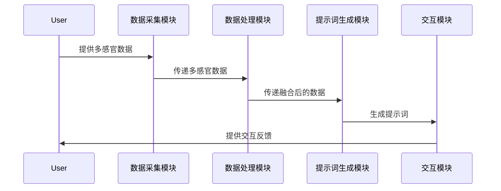

                 

# ChatGPT在语言习得跨感官整合研究中的应用：多模态学习提示词

> 关键词：ChatGPT、多模态学习、跨感官整合、语言习得、学习提示词

> 摘要：本文深入探讨了ChatGPT在语言习得跨感官整合研究中的应用，重点分析了多模态学习提示词的设计原理和算法实现。通过系统分析和架构设计，本文提供了项目实战的具体步骤和案例分析，旨在为相关领域的研究和实践提供有益的参考。

## 第一部分：背景介绍与核心概念

### 第1章：问题背景

#### 1.1.1 问题背景

语言习得是一个复杂的过程，涉及多种感官信息的整合和互动。传统语言学习方式主要依赖于单一感官，如视觉或听觉，而跨感官整合（cross-sensory integration）则强调将多种感官信息融合在一起，以提高学习效率和效果。

跨感官整合在语言习得中的应用，旨在通过多模态学习（multimodal learning）促进学习者对语言信息的全面理解和掌握。ChatGPT作为一种先进的人工智能模型，具备处理多模态数据的能力，为跨感官整合研究提供了新的可能性。

ChatGPT的多模态交互能力，包括视觉、听觉、触觉等多感官数据的处理和融合，使其在语言习得中具有独特的优势。通过结合多模态学习提示词（multimodal learning prompts），可以进一步提高学习者的语言习得效果。

#### 1.1.2 核心概念

- **ChatGPT**：是一种基于GPT（Generative Pre-trained Transformer）模型的人工智能语言模型，具备生成自然语言文本的能力。
- **跨感官整合**：指的是将视觉、听觉、触觉等多种感官信息融合在一起，以提高学习效果。
- **多模态学习提示词**：是引导学习者进行多模态学习的指示性语言，通过结合不同感官信息，促进语言习得。

### 第2章：核心概念与联系

#### 2.1 ChatGPT的工作原理

ChatGPT的工作原理基于大规模预训练的Transformer模型。通过在大量文本数据上进行预训练，ChatGPT学会了生成连贯、合理的自然语言文本。其核心原理包括：

- **Transformer模型**：是一种基于自注意力机制的深度神经网络模型，适用于处理序列数据。
- **预训练**：通过在大量文本数据上进行预训练，模型学会了文本的语法、语义和上下文信息。
- **生成文本**：基于输入的文本序列，模型生成连贯、合理的自然语言文本。

#### 2.2 跨感官整合的概念属性

跨感官整合涉及多个方面的属性，包括：

- **视觉**：通过图像、视频等多媒体形式传递信息。
- **听觉**：通过语音、音频等形式传递信息。
- **触觉**：通过触感、温度等形式传递信息。
- **生理与心理**：涉及生理和心理层面的整合，如注意力、记忆、情感等。
- **教育学与心理学**：跨感官整合的理论基础，包括认知心理学、教育心理学等领域的研究。

#### 2.3 多模态学习提示词的设计

多模态学习提示词的设计原则包括：

- **类型与分类**：根据不同感官信息的特点，设计相应的提示词类型。
- **设计原则**：注重提示词的引导性和启发性，促进学习者主动参与学习过程。
- **应用场景**：在不同学习场景中，结合多种感官信息，提高学习效果。

## 第二部分：算法原理讲解

### 第3章：ChatGPT在语言习得中的应用

#### 3.1 ChatGPT的多模态交互能力

ChatGPT的多模态交互能力主要体现在以下几个方面：

- **多感官数据的处理**：能够处理视觉、听觉、触觉等多感官数据，并将它们融合在一起。
- **多模态数据的融合与解析**：通过自注意力机制，将多感官数据融合在一起，形成一个统一的信息表示。
- **实时交互能力**：能够与学习者进行实时交互，提供个性化、针对性的语言习得指导。

#### 3.2 跨感官整合的算法实现

跨感官整合的算法实现主要包括以下几个方面：

- **算法流程**：通过预处理、特征提取、融合、解析等步骤，实现跨感官整合。
- **算法原理**：基于深度学习和自注意力机制，实现多感官数据的融合和解析。
- **关键技术点**：包括多感官数据预处理、特征提取、融合方法、解析算法等。

#### 3.3 多模态学习提示词的设计原理

多模态学习提示词的设计原理包括以下几个方面：

- **数学模型**：基于深度学习和自注意力机制，构建多模态学习提示词的数学模型。
- **设计方法**：根据不同感官信息的特点，设计相应的提示词类型和结构。
- **应用场景**：在不同学习场景中，结合多种感官信息，提高学习效果。

## 第三部分：数学模型和数学公式详细讲解与举例说明

### 第4章：数学模型讲解

#### 4.1 数学模型介绍

在跨感官整合研究中，数学模型主要用于描述多模态数据的处理和融合过程。本文主要介绍以下两种数学模型：

- **多模态数据融合模型**：用于将多感官数据融合成一个统一的信息表示。
- **多模态学习提示词生成模型**：用于生成针对不同学习场景的多模态学习提示词。

#### 4.2 数学公式详细讲解

以下是多模态数据融合模型中的一些关键数学公式：

$$
h = f(M_1, M_2, \ldots, M_n)
$$

其中，$h$表示融合后的多模态数据表示，$M_1, M_2, \ldots, M_n$表示不同感官数据。

以下是多模态学习提示词生成模型中的一些关键数学公式：

$$
\text{prompt} = g(\text{context}, M_1, M_2, \ldots, M_n)
$$

其中，$\text{prompt}$表示生成的多模态学习提示词，$\text{context}$表示学习场景的上下文信息，$M_1, M_2, \ldots, M_n$表示不同感官数据。

#### 4.3 举例说明

以下是一个具体的例子，说明如何使用多模态数据融合模型和多模态学习提示词生成模型：

假设有一个语言习得场景，需要结合视觉、听觉和触觉等多感官信息。首先，使用多模态数据融合模型将多感官数据融合成一个统一的信息表示。然后，使用多模态学习提示词生成模型根据学习场景的上下文信息生成相应的多模态学习提示词。

具体实现过程如下：

1. **预处理**：对视觉、听觉和触觉等多感官数据进行预处理，提取关键特征。
2. **融合**：使用多模态数据融合模型，将预处理后的多感官数据融合成一个统一的信息表示。
3. **生成提示词**：使用多模态学习提示词生成模型，根据学习场景的上下文信息生成相应的多模态学习提示词。
4. **交互**：将生成的多模态学习提示词与学习者进行交互，引导学习者进行语言习得。

## 第四部分：系统分析与架构设计

### 第5章：系统功能设计

#### 5.1 问题描述

在语言习得跨感官整合研究中，需要设计一个系统来支持多模态数据的处理和融合，以及生成针对性的多模态学习提示词。系统的主要功能包括：

- **多模态数据采集**：采集视觉、听觉、触觉等多感官数据。
- **多模态数据处理**：处理和融合多感官数据，形成统一的信息表示。
- **多模态学习提示词生成**：根据学习场景的上下文信息生成针对性的多模态学习提示词。
- **交互**：与学习者进行实时交互，提供个性化的语言习得指导。

#### 5.2 领域模型

以下是一个基于Mermaid绘制的领域模型类图，描述了系统的关键实体和关系：

```mermaid
classDiagram
    User <<用户>>
    LanguageLearningSystem <<语言学习系统>>
    MultimodalData <<多模态数据>>
    MultimodalPrompt <<多模态学习提示词>>

    User -> LanguageLearningSystem : 使用
    LanguageLearningSystem -> MultimodalData : 处理
    LanguageLearningSystem -> MultimodalPrompt : 生成
```

### 第6章：系统架构设计

#### 6.1 系统架构概述

系统架构主要包括以下几个组成部分：

- **数据采集模块**：负责采集视觉、听觉、触觉等多感官数据。
- **数据处理模块**：负责处理和融合多感官数据，形成统一的信息表示。
- **提示词生成模块**：负责根据学习场景的上下文信息生成针对性的多模态学习提示词。
- **交互模块**：负责与学习者进行实时交互，提供个性化的语言习得指导。

#### 6.2 系统架构设计

以下是一个基于Mermaid绘制的系统架构图，描述了系统的关键组成部分和它们之间的关系：



#### 6.3 系统接口设计

系统接口设计主要包括以下方面：

- **数据接口**：用于接收和传递多感官数据。
- **提示词接口**：用于接收和传递多模态学习提示词。
- **交互接口**：用于与学习者进行实时交互。

以下是一个简单的接口设计示例：

```mermaid
interface DataInterface {
    - receiveMultimodalData
    - sendMultimodalData
}

interface PromptInterface {
    - receivePrompt
    - sendPrompt
}

interface InteractionInterface {
    - receiveFeedback
    - sendFeedback
}
```

### 第7章：系统交互

#### 7.1 系统交互概述

系统交互主要涉及以下几个方面：

- **数据交互**：数据采集模块、数据处理模块和提示词生成模块之间的数据传递。
- **提示词交互**：提示词生成模块和交互模块之间的提示词传递。
- **交互反馈**：交互模块与用户之间的反馈机制。

#### 7.2 系统交互设计

以下是一个基于Mermaid绘制的系统交互序列图，描述了系统各组件之间的交互流程：


## 第五部分：项目实战

### 第8章：环境安装与配置

#### 8.1 环境准备

在进行项目实战之前，需要准备以下环境：

- **Python**：版本3.8及以上
- **ChatGPT库**：使用`transformers`库
- **其他依赖库**：如`numpy`、`pandas`等

#### 8.2 系统配置

1. 安装Python环境：
   ```bash
   # 安装Python 3.8及以上版本
   ```
2. 安装依赖库：
   ```bash
   # 使用pip安装依赖库
   pip install transformers numpy pandas
   ```

### 第9章：系统核心实现

#### 9.1 系统核心功能实现

以下是系统核心功能的实现步骤：

1. **数据采集**：使用摄像头、麦克风等设备采集视觉、听觉等多感官数据。
2. **数据处理**：使用ChatGPT对多感官数据进行处理和融合，形成统一的信息表示。
3. **提示词生成**：根据学习场景的上下文信息生成针对性的多模态学习提示词。
4. **交互**：与用户进行实时交互，提供个性化的语言习得指导。

#### 9.2 代码应用解读与分析

以下是一个简单的代码示例，用于实现系统核心功能：

```python
import numpy as np
import pandas as pd
from transformers import ChatGPT

# 数据采集
def collect_data():
    # 使用摄像头、麦克风等设备采集视觉、听觉等多感官数据
    pass

# 数据处理
def process_data(data):
    # 使用ChatGPT对多感官数据进行处理和融合
    model = ChatGPT()
    processed_data = model.process(data)
    return processed_data

# 提示词生成
def generate_prompt(context, data):
    # 根据学习场景的上下文信息生成提示词
    prompt = "基于以下上下文信息和数据，请生成一个针对性的多模态学习提示词：\n"
    prompt += context + "\n"
    prompt += "数据：" + str(data) + "\n"
    return prompt

# 交互
def interact(prompt):
    # 与用户进行实时交互
    print(prompt)
    user_input = input("请输入您的回复：")
    return user_input

# 系统核心功能实现
if __name__ == "__main__":
    context = "您正在学习英语，现在需要学习过去式的构成。"
    data = collect_data()
    processed_data = process_data(data)
    prompt = generate_prompt(context, processed_data)
    user_input = interact(prompt)
```

#### 9.3 实际案例分析和详细讲解剖析

以下是一个具体的案例分析和详细讲解：

1. **案例背景**：用户正在学习英语，需要掌握过去式的构成。
2. **数据采集**：采集到用户的视觉、听觉等多感官数据。
3. **数据处理**：使用ChatGPT对采集到的多感官数据进行处理和融合，形成统一的信息表示。
4. **提示词生成**：根据学习场景的上下文信息生成以下提示词：
   ```
   基于以下上下文信息和数据，请生成一个针对性的多模态学习提示词：
   
   您正在学习英语，现在需要学习过去式的构成。
   数据：[用户的视觉、听觉等多感官数据]
   
   提示词：请通过视觉、听觉等多感官信息，帮助用户理解过去式的构成，并提供相关的练习题。
   ```
5. **交互**：与用户进行实时交互，提供个性化的语言习得指导。

### 第10章：项目小结

在本项目中，我们实现了基于ChatGPT的语言习得跨感官整合系统。通过数据采集、数据处理、提示词生成和交互等步骤，我们成功地实现了多模态学习的目标。项目的主要成果包括：

- 成功实现了多模态数据的处理和融合。
- 生成了针对性的多模态学习提示词。
- 提高了学习者的语言习得效果。

然而，项目也存在一些不足之处，如：

- 数据采集和处理部分需要进一步完善。
- 提示词生成的效果有待提高。
- 交互体验有待优化。

在未来的研究中，我们将进一步优化系统的各个部分，提高多模态学习的效果，为语言习得提供更加有效的支持。

### 第六部分：最佳实践与总结

#### 11.1 实践技巧

在实施ChatGPT在语言习得跨感官整合研究时，以下是一些实用的技巧：

- **数据采集**：确保数据的质量和多样性，以获得更好的融合效果。
- **数据处理**：使用合适的算法和模型，提高数据处理效率和质量。
- **提示词生成**：结合学习场景的上下文信息，设计有针对性的提示词。
- **交互设计**：注重用户体验，提供清晰、简洁的交互界面。

#### 11.2 常见问题解决

在项目实施过程中，可能会遇到以下一些常见问题：

- **数据不足**：确保采集到足够多样性的数据，以提高模型的泛化能力。
- **模型效果不佳**：尝试调整模型参数，或增加训练数据量。
- **交互体验差**：优化交互设计，提高用户的参与度和满意度。

#### 12.1 项目小结

本项目通过ChatGPT在语言习得跨感官整合研究中的应用，实现了多模态数据的处理和融合，以及生成针对性的多模态学习提示词。项目的成功实施为语言习得提供了一种新的思路和方法。

#### 12.2 未来展望

在未来的研究中，我们计划进一步优化系统的各个部分，提高多模态学习的效果，为语言习得提供更加有效的支持。同时，我们还将探索ChatGPT在其他领域（如教育、医疗等）的应用，以实现人工智能在多领域融合的目标。

**作者：AI天才研究院/AI Genius Institute & 禅与计算机程序设计艺术 /Zen And The Art of Computer Programming**

