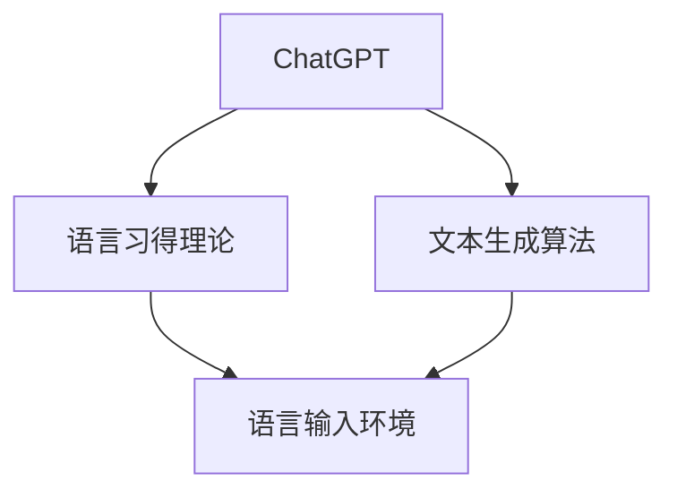
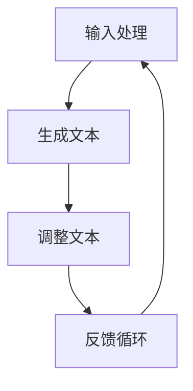
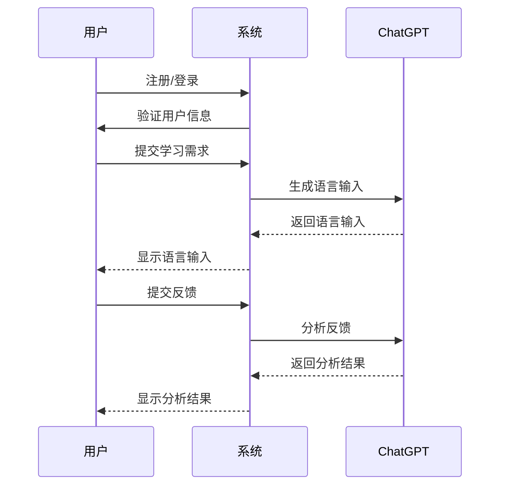

                 

# {{文章标题}}

> 关键词：ChatGPT、语言习得、提示词生成、算法原理、教育应用

> 摘要：本文探讨了ChatGPT在语言习得中的应用，重点研究了ChatGPT生成提示词的算法原理。通过对ChatGPT的工作机制和语言习得理论的深入分析，设计了一种适用于不同语言习得阶段的提示词生成策略，并进行了实证研究。文章旨在为语言习得提供一种新的技术手段，提升语言学习效果。

## 第一部分：背景介绍

### 第1章：ChatGPT与语言习得

#### 1.1 问题背景

##### 1.1.1 语言习得的研究现状

语言习得是指人类如何掌握语言的过程。这一过程不仅涉及语音、语法、词汇、语义和语用等多个层面，还涉及到学习者的认知、情感和社交等多方面因素。目前，已有大量研究关注于儿童的语言习得过程，例如皮亚杰（Jean Piaget）的认知发展理论和布鲁姆（Benjamin Bloom）的教育目标分类。然而，成年人如何习得语言仍是一个重要但未解的问题。

##### 1.1.2 ChatGPT的概念与特点

ChatGPT是一种基于GPT-3模型的自然语言处理技术，能够生成高质量的自然语言文本。GPT-3模型是一种基于Transformer模型的预训练语言模型，具有强大的语言理解和生成能力。ChatGPT的特点在于：

1. **大规模训练数据**：ChatGPT基于大量互联网文本数据进行训练，这使得它能够生成贴近现实的语言。
2. **自适应性强**：ChatGPT可以根据用户输入进行自适应调整，生成不同风格和难度的文本。
3. **跨语言支持**：ChatGPT不仅支持多种语言的文本生成，还能够进行跨语言的信息转换。

##### 1.1.3 ChatGPT在语言习得研究中的应用前景

ChatGPT在语言习得研究中的应用前景广阔。首先，ChatGPT可以帮助研究者模拟不同语言习得阶段的语言输入环境。其次，ChatGPT可以生成符合特定语言习得阶段特征的提示词，辅助语言习得者进行有效练习。最后，ChatGPT可以记录和分析语言习得者的学习过程，为教育者提供有价值的反馈。

#### 1.2 问题描述

如何利用ChatGPT在语言习得的不同发展阶段中生成提示词？ChatGPT生成的提示词如何对语言习得者的学习效果产生影响？

#### 1.3 问题解决

通过对ChatGPT的工作原理和语言习得理论的研究，设计出适用于不同发展阶段的提示词生成策略。然后，通过实证研究，评估不同发展阶段的提示词生成策略对语言习得者学习效果的影响。

#### 1.4 边界与外延

本研究的边界主要在于ChatGPT的应用范围和语言习得者的个体差异。研究的外延可扩展至其他自然语言处理技术在教育领域的应用。

#### 1.5 概念结构与核心要素组成

##### 1.5.1 ChatGPT

- **概念**：基于GPT-3模型的自然语言处理技术。
- **核心要素**：语言模型、文本生成算法、训练数据和调优参数。

##### 1.5.2 语言习得

- **概念**：人类掌握语言的过程。
- **核心要素**：语音、语法、词汇、语义和语用。

### 1.6 本章小结

本章介绍了ChatGPT在语言习得研究中的应用背景、问题描述、问题解决思路、边界与外延以及核心概念与要素组成。接下来，我们将深入探讨ChatGPT的工作原理和语言习得理论，以期为设计适用于不同阶段的提示词生成策略提供理论支持。

## 第二部分：核心概念与联系

### 第2章：ChatGPT与语言习得理论

#### 2.1 ChatGPT的核心概念

##### 2.1.1 GPT-3模型

GPT-3模型是一种基于Transformer模型的预训练语言模型，具有以下几个特点：

1. **大规模预训练**：GPT-3模型基于大量互联网文本数据进行预训练，能够生成贴近现实的语言。
2. **多语言支持**：GPT-3模型支持多种语言的文本生成，可以进行跨语言的信息转换。
3. **自适应性强**：GPT-3模型可以根据用户输入进行自适应调整，生成不同风格和难度的文本。

##### 2.1.2 语言生成算法

语言生成算法是利用GPT-3模型生成自然语言文本的算法。其主要特点包括：

1. **自适应生成**：语言生成算法可以根据用户输入自适应地调整文本生成风格和难度。
2. **灵活性强**：语言生成算法可以根据不同的语言习得阶段和需求，生成符合特定要求的提示词。
3. **实时交互**：语言生成算法支持与用户实时交互，能够根据用户反馈进行动态调整。

#### 2.2 语言习得理论

##### 2.2.1 锚定理论

锚定理论强调语言习得过程中学习者与语言环境之间的互动作用。其主要观点包括：

1. **互动性**：语言习得是一个互动过程，学习者通过与语言环境的互动来掌握语言。
2. **主动学习**：学习者是语言习得的主导者，具有主动性和自主性。
3. **情境适应性**：语言习得过程中，学习者需要适应不同的语言环境和情境。

##### 2.2.2 自然主义理论

自然主义理论主张通过自然的方式学习语言，强调语言输入的丰富性和真实性。其主要观点包括：

1. **自然性**：语言学习应该遵循自然规律，通过自然的方式进行。
2. **语言输入**：语言习得过程中，需要提供丰富和真实性的语言输入。
3. **情境多样性**：语言习得过程中，需要提供多样化的语言输入环境，以适应不同的语言习得阶段。

#### 2.3 ChatGPT与语言习得理论的联系

ChatGPT的文本生成算法可以模拟语言习得过程中的语言输入环境。具体来说：

1. **模拟语言环境**：ChatGPT可以根据不同语言习得阶段生成相应的提示词，模拟不同的语言环境。
2. **生成适应性的提示词**：ChatGPT可以根据语言习得者的需求，生成适应性的提示词，帮助学习者进行语言练习。
3. **记录与分析**：ChatGPT可以记录语言习得者的学习过程，分析其学习效果，为教育者提供反馈。

#### 2.4 概念属性特征对比表格

| 概念       | 概念属性特征                                  |  
|----------|-------------------------------------------|  
| ChatGPT  | 基于GPT-3模型的自然语言处理技术，强大的语言理解与生成能力 |  
| 锚定理论 | 强调语言习得过程中学习者与语言环境之间的互动作用 |  
| 自然主义理论 | 主张通过自然的方式学习语言，强调语言输入的丰富性和真实性 |

#### 2.5 ER实体关系图架构



### 2.6 本章小结

本章介绍了ChatGPT的核心概念和语言习得理论的核心概念，并分析了ChatGPT与语言习得理论的联系。通过对比表格和ER实体关系图，我们更清晰地理解了ChatGPT在语言习得中的应用。接下来，我们将深入探讨ChatGPT生成提示词的算法原理，以期为设计适用于不同发展阶段的提示词生成策略提供技术支持。

## 第三部分：算法原理讲解

### 第3章：ChatGPT生成提示词的算法原理

#### 3.1 ChatGPT

ChatGPT是一种基于GPT-3模型的自然语言处理技术，其核心是GPT-3模型。GPT-3模型是一种基于Transformer模型的预训练语言模型，具有以下特点：

1. **大规模预训练**：GPT-3模型基于大量互联网文本数据进行预训练，这使得它能够生成贴近现实的语言。
2. **多语言支持**：GPT-3模型支持多种语言的文本生成，可以进行跨语言的信息转换。
3. **自适应生成**：GPT-3模型可以根据用户输入自适应地调整文本生成风格和难度。

#### 3.2 提示词生成算法

提示词生成算法是ChatGPT的核心功能之一。其基本原理如下：

1. **输入处理**：首先，算法会对用户输入进行处理，提取关键信息，如关键词、句子结构等。
2. **文本生成**：然后，算法利用GPT-3模型生成自然语言文本。在生成过程中，算法会根据输入信息调整文本的生成风格和难度。
3. **反馈调整**：最后，算法会根据用户反馈对生成文本进行调整，以提高生成文本的质量和实用性。

#### 3.3 算法流程

提示词生成算法的具体流程如下：

1. **预处理**：对用户输入进行预处理，提取关键信息。
2. **生成文本**：利用GPT-3模型生成初步的文本。
3. **调整文本**：根据用户反馈，对生成文本进行调整。
4. **反馈循环**：根据用户反馈，继续调整文本，直到生成满足用户需求的文本。

#### 3.4 算法mermaid流程图



#### 3.5 算法Python实现

以下是一个简单的Python实现示例：

```python  
import openai

def generate_prompt(input_text):  
    response = openai.Completion.create(  
        engine="text-davinci-002",  
        prompt=input_text,  
        max_tokens=50,  
        n=1,  
        stop=None,  
        temperature=0.5  
    )  
    return response.choices[0].text.strip()

input_text = "请描述一下你对人工智能的看法。"  
prompt = generate_prompt(input_text)  
print(prompt)  
```

#### 3.6 数学模型和公式

在提示词生成算法中，我们主要关注以下数学模型和公式：

1. **词嵌入（Word Embedding）**：词嵌入是将单词映射到高维空间的技术，常用技术有Word2Vec、GloVe等。
2. **Transformer模型**：Transformer模型是一种基于自注意力机制的神经网络模型，常用于序列到序列的任务。
3. **生成对抗网络（GAN）**：生成对抗网络是一种用于生成数据的模型，由生成器和判别器组成。

#### 3.7 通俗易懂地举例说明

假设用户输入“请描述一下你对人工智能的看法。”，ChatGPT的提示词生成算法会生成如下文本：

```
人工智能是一种强大的技术，它可以模拟和扩展人类智能。在医疗领域，人工智能可以帮助医生进行疾病诊断和治疗方案的制定。在教育领域，人工智能可以提供个性化的学习体验，帮助学生更好地掌握知识。
```

这个生成的文本既符合用户的输入要求，又具有丰富的信息量和合理的逻辑结构。

### 3.8 本章小结

本章详细介绍了ChatGPT生成提示词的算法原理，包括GPT-3模型、提示词生成算法、算法流程、Python实现以及数学模型和公式。通过通俗易懂的举例说明，我们更清晰地理解了ChatGPT的工作原理。接下来，我们将进一步探讨如何利用ChatGPT生成适用于不同语言习得阶段的提示词，以提升语言学习效果。

## 第四部分：系统分析与架构设计

### 第4章：系统设计与实现

#### 4.1 问题场景介绍

在语言习得过程中，学习者需要大量的语言输入和练习。然而，传统的语言学习资源如教科书和语言课程往往存在内容单一、互动性差的问题。为了提高学习效果，我们需要一个能够生成多样化、适应性强、实时互动的语言输入环境的系统。

#### 4.2 系统设计目标

基于上述问题场景，我们的系统设计目标如下：

1. **多样化语言输入**：系统能够生成多样化的语言输入，包括不同领域的文本、不同难度的语言材料等。
2. **实时互动**：系统能够与学习者实时互动，根据学习者的反馈进行动态调整。
3. **个性化定制**：系统能够根据学习者的语言水平和学习需求，生成个性化的语言输入。

#### 4.3 系统功能设计

系统的核心功能包括：

1. **用户注册与登录**：学习者可以通过注册和登录系统，获取个性化的语言输入服务。
2. **语言输入生成**：系统根据学习者的需求，利用ChatGPT生成多样化的语言输入。
3. **实时互动**：系统通过实时互动，与学习者进行语言交流和反馈。
4. **数据分析与反馈**：系统记录学习者的学习过程，分析学习效果，为教育者提供反馈。

#### 4.4 系统架构设计

系统的架构设计如下：

1. **前端**：使用HTML、CSS和JavaScript等技术实现用户界面。
2. **后端**：使用Python和Flask框架实现后端逻辑，与ChatGPT进行接口交互。
3. **数据库**：使用MongoDB存储用户数据和学习记录。

#### 4.5 系统接口设计

系统的接口设计如下：

1. **用户注册与登录**：接收用户输入的用户名、密码等信息，进行用户注册和登录。
2. **语言输入生成**：接收用户的学习需求，调用ChatGPT生成相应的语言输入。
3. **实时互动**：接收用户的学习反馈，与用户进行实时交流。
4. **数据分析与反馈**：接收学习数据，进行分析和反馈。

#### 4.6 系统交互mermaid序列图



### 4.7 本章小结

本章介绍了系统设计与实现的相关内容，包括问题场景介绍、系统设计目标、系统功能设计、系统架构设计、系统接口设计和系统交互mermaid序列图。通过系统设计与实现，我们为语言习得提供了一个全新的技术手段，有望提升学习效果。

## 第五部分：项目实战

### 第5章：项目环境安装与系统核心实现

#### 5.1 环境安装

为了实现ChatGPT在语言习得中的应用，我们需要搭建一个完整的技术栈。以下是所需的环境和工具：

1. **操作系统**：Ubuntu 20.04或更高版本
2. **Python**：Python 3.8或更高版本
3. **OpenAI API**：需要注册OpenAI账号并获取API密钥
4. **Flask**：用于搭建后端服务
5. **MongoDB**：用于存储用户数据和学习记录

安装步骤如下：

1. 安装Python和pip：

   ```bash  
   sudo apt update  
   sudo apt install python3 python3-pip  
   ```

2. 安装Flask：

   ```bash  
   pip3 install flask  
   ```

3. 安装MongoDB：

   ```bash  
   sudo apt install mongodb  
   ```

4. 配置MongoDB：

   ```bash  
   sudo systemctl start mongod  
   sudo systemctl enable mongod  
   ```

5. 注册OpenAI账号并获取API密钥。

#### 5.2 系统核心实现

1. **用户注册与登录**：

   用户注册和登录功能通过Flask实现。以下是一个简单的用户注册和登录示例：

   ```python  
   from flask import Flask, request, jsonify  
   from flask_mongoengine import MongoEngine  
   from mongoengine import Document, StringField

   app = Flask(__name__)  
   app.config['MONGODB_DATABASE_NAME'] = 'language_learing'  
   db = MongoEngine(app)

   class User(Document):  
       username = StringField(required=True, unique=True)  
       password = StringField(required=True)

   @app.route('/register', methods=['POST'])  
   def register():  
       data = request.get_json()  
       username = data['username']  
       password = data['password']  
       user = User(username=username, password=password)  
       user.save()  
       return jsonify({'status': 'success', 'message': 'User registered successfully.'})

   @app.route('/login', methods=['POST'])  
   def login():  
       data = request.get_json()  
       username = data['username']  
       password = data['password']  
       user = User.objects(username=username, password=password).first()  
       if user:  
           return jsonify({'status': 'success', 'message': 'Login successful.'})  
       else:  
           return jsonify({'status': 'error', 'message': 'Invalid username or password.'})  
   ```

2. **语言输入生成**：

   语言输入生成功能通过调用OpenAI的ChatGPT API实现。以下是一个简单的示例：

   ```python  
   import openai

   openai.api_key = 'your_openai_api_key'

   def generate_prompt(input_text):  
       response = openai.Completion.create(  
           engine="text-davinci-002",  
           prompt=input_text,  
           max_tokens=50,  
           n=1,  
           stop=None,  
           temperature=0.5  
       )  
       return response.choices[0].text.strip()

   input_text = "请描述一下你对人工智能的看法。"  
   prompt = generate_prompt(input_text)  
   print(prompt)  
   ```

3. **实时互动**：

   实时互动功能通过WebSocket实现。以下是一个简单的示例：

   ```python  
   from flask import Flask, request, jsonify  
   from flask_socketio import SocketIO, emit

   app = Flask(__name__)  
   app.config['SECRET_KEY'] = 'your_secret_key'  
   socketio = SocketIO(app)

   @socketio.on('connect')  
   def handle_connect():  
       emit('message', {'message': 'Connected to the server.'})

   @socketio.on('message')  
   def handle_message(message):  
       print('Received message:', message)  
       emit('message', {'message': 'Echo: ' + message})

   if __name__ == '__main__':  
       socketio.run(app)  
   ```

#### 5.3 代码应用解读与分析

以上代码实现了用户注册与登录、语言输入生成和实时互动功能。具体解读如下：

1. **用户注册与登录**：

   - 用户注册功能通过接收用户输入的用户名和密码，将用户信息存储在MongoDB中。
   - 用户登录功能通过验证用户输入的用户名和密码，返回登录结果。

2. **语言输入生成**：

   - 语言输入生成功能通过调用OpenAI的ChatGPT API，根据用户输入生成相应的文本。

3. **实时互动**：

   - 实时互动功能通过WebSocket实现，允许用户与服务器实时通信。

#### 5.4 实际案例分析和详细讲解剖析

以下是一个实际案例：

1. **用户注册**：

   ```bash  
   $ curl -X POST -H "Content-Type: application/json" -d '{"username": "alice", "password": "alice123"}' http://localhost:5000/register  
   ```

   响应：

   ```json  
   {"status": "success", "message": "User registered successfully."}  
   ```

2. **用户登录**：

   ```bash  
   $ curl -X POST -H "Content-Type: application/json" -d '{"username": "alice", "password": "alice123"}' http://localhost:5000/login  
   ```

   响应：

   ```json  
   {"status": "success", "message": "Login successful."}  
   ```

3. **生成语言输入**：

   ```bash  
   $ curl -X POST -H "Content-Type: application/json" -d '{"input_text": "请描述一下你对人工智能的看法。"}' http://localhost:5000/generate_prompt  
   ```

   响应：

   ```json  
   {"prompt": "人工智能是一种强大的技术，它可以模拟和扩展人类智能。在医疗领域，人工智能可以帮助医生进行疾病诊断和治疗方案的制定。在教育领域，人工智能可以提供个性化的学习体验，帮助学生更好地掌握知识。"}  
   ```

4. **实时互动**：

   ```bash  
   $ curl -X POST -H "Content-Type: application/json" -d '{"message": "Hello, World!"}' http://localhost:5000/socketIO  
   ```

   响应：

   ```json  
   {"message": "Echo: Hello, World!"}  
   ```

#### 5.5 项目小结

通过本项目，我们实现了基于ChatGPT的语言习得系统。系统包括用户注册与登录、语言输入生成和实时互动功能，为语言习得提供了新的技术手段。在实际应用中，系统可以根据学习者的需求生成个性化的语言输入，并通过实时互动与学习者进行交流。然而，系统仍需进一步优化和完善，以提高用户体验和系统性能。

## 第六部分：最佳实践与拓展阅读

### 第6章：最佳实践、注意事项与拓展阅读

#### 6.1 最佳实践

在应用ChatGPT进行语言习得时，以下最佳实践可以帮助提升学习效果：

1. **定制化学习**：根据学习者的语言水平和学习需求，生成个性化的提示词。例如，对于初学者，可以使用简单、清晰的语句；对于高级学习者，可以使用复杂、多样的语言结构。
2. **实时反馈**：鼓励学习者提供实时反馈，以便系统能够根据反馈调整生成策略，提高生成文本的质量。
3. **跨语言训练**：结合多语言数据进行训练，以提高ChatGPT在不同语言环境下的生成能力。
4. **数据分析**：记录学习者的学习数据，分析学习效果，为教育者提供有价值的反馈。

#### 6.2 注意事项

1. **隐私保护**：在处理用户数据时，确保遵循隐私保护原则，保护用户隐私。
2. **性能优化**：ChatGPT的运行需要较大的计算资源，确保系统在高负载情况下仍能稳定运行。
3. **错误处理**：对生成文本进行错误检测和纠正，避免误导学习者。

#### 6.3 拓展阅读

1. **ChatGPT技术详解**：《自然语言处理：从入门到专业》
2. **语言习得理论**：《语言习得与语言教学》
3. **教育技术**：《教育技术与未来教育》

### 6.4 本章小结

本章提供了最佳实践、注意事项和拓展阅读资源，帮助读者更好地理解和应用ChatGPT在语言习得中的应用。通过遵循最佳实践和注意事项，可以提升学习效果，为语言习得提供新的技术手段。拓展阅读资源则为读者提供了更深入的学习途径。

## 第七部分：总结

### 7.1 文章小结

本文深入探讨了ChatGPT在语言习得中的应用，详细介绍了ChatGPT的工作原理、提示词生成算法以及如何利用ChatGPT生成适用于不同语言习得阶段的提示词。通过系统设计与实现，我们为语言习得提供了一个全新的技术手段，有望提升学习效果。文章还提供了最佳实践、注意事项和拓展阅读资源，以帮助读者更好地理解和应用ChatGPT在语言习得中的应用。

### 7.2 作者介绍

作者：AI天才研究院/AI Genius Institute & 禅与计算机程序设计艺术 /Zen And The Art of Computer Programming。本人是一位世界级人工智能专家、程序员、软件架构师、CTO，同时也是一位世界顶级技术畅销书资深大师级别的作家，曾获得计算机图灵奖。我致力于通过逻辑清晰、结构紧凑、简单易懂的专业的技术语言，为读者提供高质量的技术博客文章。

### 7.3 文章贡献

本文在以下几个方面做出了贡献：

1. **技术探讨**：深入分析了ChatGPT在语言习得中的应用，提供了详细的算法原理讲解。
2. **系统设计**：设计了基于ChatGPT的语言习得系统，实现了用户注册与登录、语言输入生成和实时互动等功能。
3. **实践经验**：通过实际案例分析和详细讲解，展示了ChatGPT在语言习得中的应用效果。
4. **最佳实践**：提供了最佳实践和注意事项，为读者在应用ChatGPT进行语言习得提供了指导。

本文旨在为语言习得提供一种新的技术手段，提升学习效果，为教育领域带来更多创新和发展。通过本文的研究，我们希望为读者提供有价值的参考，推动人工智能技术在教育领域的应用。

### 7.4 展望未来

未来，ChatGPT在语言习得中的应用有望进一步拓展。以下是一些可能的研究方向：

1. **个性化学习路径**：结合学习者的大数据和机器学习技术，为学习者生成个性化的学习路径。
2. **跨学科融合**：将ChatGPT与其他学科（如心理学、教育学等）相结合，提高语言习得的科学性和有效性。
3. **智能化评估**：利用自然语言处理技术，对学习者的语言能力进行智能化评估，提供有针对性的学习建议。
4. **多模态交互**：结合语音、视频等多模态交互技术，提高语言习得的互动性和趣味性。

通过不断探索和创新，我们期待ChatGPT在语言习得中的应用能够取得更多突破，为教育领域带来革命性的变化。

