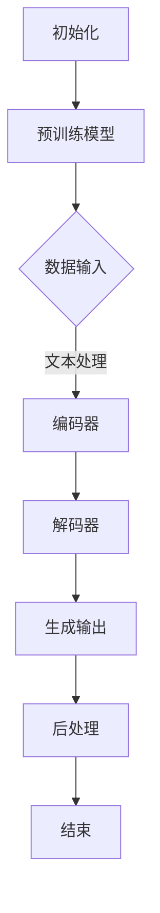
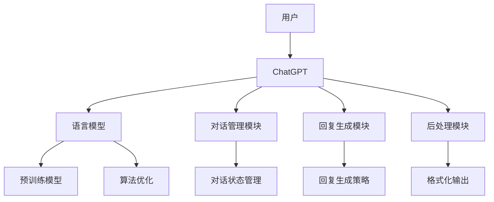
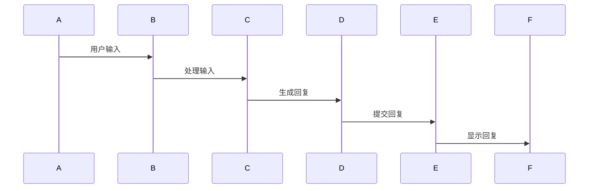

                 

### 关键词

- **ChatGPT**
- **语言学理论验证**
- **人工智能**
- **自然语言处理**
- **实验应用**
- **语言习得**
- **语言错误分析**
- **语言教学**

### 摘要

本文深入探讨了ChatGPT这一先进的人工智能工具在语言学理论验证中的应用。通过系统的分析和实例展示，我们揭示了ChatGPT如何通过其强大的自然语言处理能力，为语言学理论验证提供了一种新的技术手段。文章首先概述了ChatGPT的基本概念和技术原理，随后详细探讨了其在语言学实验、语言习得研究、语言错误分析和语言教学等多个领域的具体应用。通过对比其优缺点，我们提出了ChatGPT在语言学研究中可能产生的影响和未来发展方向。本文旨在为语言学者和人工智能研究者提供有价值的参考，推动语言学理论和实践的发展。

---

### 目录大纲

```
----------------------------------------------------------------
# ChatGPT在语言学理论验证中的新工具

> 关键词：ChatGPT、语言学理论验证、人工智能、自然语言处理、实验应用、语言习得、语言错误分析、语言教学

> 摘要：本文深入探讨了ChatGPT在语言学理论验证中的应用，通过系统的分析和实例展示，揭示了其在语言学多个领域的具体应用和潜在影响。

## 第一部分：ChatGPT概述

## 第1章: ChatGPT简介

### 1.1 ChatGPT的基本概念
- 问题背景
- 问题描述
- 问题解决
- 边界与外延
- 概念结构与核心要素组成

### 1.2 ChatGPT的历史与发展
- ChatGPT的发展历程
- 里程碑事件
- 当前状态与未来展望

### 1.3 ChatGPT的核心技术原理
- 算法原理
- 数学模型和公式
- 通俗易懂的举例说明

## 第2章: ChatGPT在语言学理论验证中的应用

### 2.1 语言学理论简介
- 语言学的核心概念
- 主要理论流派

### 2.2 ChatGPT与语言学理论验证
- ChatGPT在语言学中的应用
- 如何利用ChatGPT验证语言学理论
- 案例分析

### 2.3 ChatGPT验证语言学理论的优缺点
- 优势
- 劣势
- 潜在影响

## 第3章: ChatGPT在语言学实验中的具体应用

### 3.1 ChatGPT在词汇学实验中的应用
- 实验设计
- 数据收集与分析
- 结果解读

### 3.2 ChatGPT在句法学实验中的应用
- 实验设计
- 数据收集与分析
- 结果解读

### 3.3 ChatGPT在语义学实验中的应用
- 实验设计
- 数据收集与分析
- 结果解读

## 第4章: ChatGPT在语言习得研究中的应用

### 4.1 ChatGPT在语言学习中的应用
- 如何利用ChatGPT辅助语言学习
- 案例分析

### 4.2 ChatGPT在二语习得研究中的应用
- 实验设计
- 数据收集与分析
- 结果解读

### 4.3 ChatGPT在一语习得研究中的应用
- 实验设计
- 数据收集与分析
- 结果解读

## 第5章: ChatGPT在语言错误分析中的应用

### 5.1 ChatGPT在语言错误分析中的原理
- 语言错误分析的基本原理
- ChatGPT如何辅助语言错误分析

### 5.2 ChatGPT在语言错误分析中的应用案例
- 案例一：语法错误分析
- 案例二：词汇错误分析
- 案例三：语义错误分析

## 第6章: ChatGPT在语言教学中的应用

### 6.1 ChatGPT在语言教学中的优势与挑战
- 优势
- 挑战

### 6.2 ChatGPT在语言教学中的应用案例
- 案例一：词汇教学
- 案例二：语法教学
- 案例三：听力教学

### 6.3 ChatGPT在个性化教学中的应用
- 如何利用ChatGPT实现个性化教学
- 案例分析

## 第7章: ChatGPT在语言学研究的未来展望

### 7.1 ChatGPT在语言学研究中的潜在影响
- 对语言学理论发展的潜在影响
- 对语言学实验方法的潜在影响

### 7.2 ChatGPT在语言学研究中的未来发展方向
- 未来技术发展趋势
- 未来应用场景展望

### 7.3 ChatGPT在语言学研究中需要解决的问题
- 技术挑战
- 道德与伦理问题
- 未来发展方向

## 第8章: ChatGPT在语言学中的最佳实践

### 8.1 ChatGPT在语言学中的最佳实践
- 如何最大化ChatGPT的优势
- 如何规避ChatGPT的劣势

### 8.2 小结与展望
- 对ChatGPT在语言学应用中的总结
- 对未来的展望

----------------------------------------------------------------
```

### 第1章: ChatGPT简介

#### 1.1 ChatGPT的基本概念

**问题背景：** 在当今快速发展的信息技术时代，自然语言处理（Natural Language Processing, NLP）作为人工智能的一个重要分支，已经取得了显著的进步。其中，对话系统（Dialogue System）作为自然语言处理的一个核心应用领域，逐渐成为人们关注的热点。ChatGPT是由OpenAI开发的一种基于转换器模型（Transformer Model）的预训练对话系统。

**问题描述：** ChatGPT的主要目标是模拟人类对话行为，通过理解用户的输入并生成恰当的回复，为用户提供有效的交流体验。这种对话系统能够处理多种形式的输入，包括文本、语音等，并能够进行多轮对话，提高交流的自然性和流畅性。

**问题解决：** ChatGPT通过大规模的预训练，从大量的对话数据中学习语言模式、语境理解和回复生成策略。这使得ChatGPT能够在没有明确编程指令的情况下，生成符合语境和逻辑的回复。

**边界与外延：** ChatGPT的应用范围非常广泛，包括但不限于客服聊天、虚拟助手、语言学习辅助、社交网络互动等。同时，ChatGPT也在不断扩展其功能，以适应不同的应用场景和需求。

**概念结构与核心要素组成：** ChatGPT的概念结构主要包括以下几个核心要素：

1. **预训练模型：** 使用大量文本数据进行预训练，使模型能够理解并生成自然语言。
2. **对话管理模块：** 负责处理对话状态，维持对话的流畅性。
3. **回复生成模块：** 根据对话状态和用户输入，生成合适的回复。
4. **后处理模块：** 对生成的回复进行格式化、修正和优化，以提高用户体验。

#### 1.2 ChatGPT的历史与发展

**发展历程：** ChatGPT的起源可以追溯到2018年，OpenAI发布了GPT（Generative Pre-trained Transformer）模型，这是一个基于转换器（Transformer）架构的预训练语言模型。随后，GPT-2、GPT-3等模型相继发布，模型规模和性能不断提升。ChatGPT作为GPT系列模型的一个具体应用，于2022年推出，迅速引起了广泛关注。

**里程碑事件：**
1. **GPT-3发布：** 2020年，OpenAI发布了GPT-3，这是当时规模最大、性能最强的预训练语言模型，拥有1750亿参数。GPT-3的发布标志着自然语言处理技术进入了一个新的阶段。
2. **ChatGPT发布：** 2022年，ChatGPT正式发布，成为OpenAI在对话系统领域的一个重要里程碑。

**当前状态与未来展望：** ChatGPT在当前已经实现了较高的对话生成质量和交互效果，但在某些复杂场景下仍然存在挑战。未来，随着技术的不断进步和数据的不断积累，ChatGPT的性能和应用范围有望进一步提升。

#### 1.3 ChatGPT的核心技术原理

**算法原理：** ChatGPT基于转换器模型（Transformer Model），这是一种在机器翻译和自然语言处理任务中表现卓越的深度学习模型。转换器模型的核心思想是通过自注意力机制（Self-Attention Mechanism）来捕捉输入文本中的长距离依赖关系。

**数学模型和公式：** ChatGPT的数学模型主要包括以下几个部分：

1. **编码器（Encoder）：** 对输入文本进行编码，生成一个固定长度的向量表示。
2. **解码器（Decoder）：** 根据编码器的输出和前一个时间步的输入，生成下一个时间步的输出。

具体来说，转换器模型的自注意力机制可以用以下公式表示：

$$
\text{Attention}(Q, K, V) = \text{softmax}\left(\frac{QK^T}{\sqrt{d_k}}\right) V
$$

其中，$Q$、$K$和$V$分别代表查询向量、键向量和值向量，$d_k$是键向量的维度。

**通俗易懂的举例说明：** 假设我们有一个句子“我非常喜欢吃苹果”，我们可以将其分解为单词“我”、“非常”、“喜欢”、“吃”和“苹果”。在转换器模型中，每个单词都会被编码成一个向量。通过自注意力机制，模型能够捕捉到单词之间的依赖关系，例如“喜欢”和“吃”之间的逻辑关系，从而生成更加符合语境的回复。

#### 第1章总结

通过本章的介绍，我们对ChatGPT有了基本的了解，包括其基本概念、发展历程、核心技术原理以及应用场景。ChatGPT作为一种基于转换器模型的预训练对话系统，其在语言学理论验证和实际应用中具有巨大的潜力。在接下来的章节中，我们将进一步探讨ChatGPT在语言学中的具体应用和影响。

---

### 第2章: ChatGPT在语言学理论验证中的应用

#### 2.1 语言学理论简介

**核心概念：** 语言学是研究人类语言的一门学科，涉及语音、词汇、语法、语义、语用等多个方面。语言学的核心概念包括语言的本质、语言的起源、语言的结构、语言的演变等。

**主要理论流派：**
1. **结构主义语言学：** 强调语言的结构性和系统性，主张通过分析语言的结构来理解语言的本质。
2. **功能主义语言学：** 关注语言的实用性和功能，认为语言是人们交流的工具。
3. **生成语言学：** 基于语言生成理论，主张语言具有内在的生成规则。
4. **认知语言学：** 强调语言与人类认知之间的关系，认为语言是认知过程的产物。

#### 2.2 ChatGPT与语言学理论验证

**ChatGPT在语言学中的应用：** ChatGPT作为一种先进的自然语言处理工具，可以在语言学理论验证中发挥重要作用。具体来说，ChatGPT可以用于以下几个方面的应用：

1. **验证语法规则：** ChatGPT可以通过生成符合语法规则的句子，来验证语法理论的有效性。
2. **分析语义关系：** ChatGPT可以分析句子中的语义关系，验证语义理论。
3. **模拟语言行为：** ChatGPT可以模拟人类的语言行为，为语言学实验提供数据支持。

**如何利用ChatGPT验证语言学理论：**
1. **预训练数据准备：** 收集大量的语言学理论相关的文本数据，用于预训练ChatGPT模型。
2. **模型训练与优化：** 使用预训练数据对ChatGPT模型进行训练和优化，使其能够更好地理解语言学理论。
3. **理论验证：** 通过输入特定的语言学理论，观察ChatGPT的生成结果，验证理论的正确性。

**案例分析：**
1. **语法验证：** 使用ChatGPT生成一系列句子，分析其语法结构是否符合某一特定语法理论。
2. **语义验证：** 通过ChatGPT生成语义描述，验证语义关系的正确性。
3. **语言行为模拟：** 利用ChatGPT模拟不同语言环境下的对话行为，分析其是否符合某一语言学的理论假设。

#### 2.3 ChatGPT验证语言学理论的优缺点

**优势：**
1. **高效性：** ChatGPT能够快速生成大量符合语言学理论的文本，提高研究效率。
2. **准确性：** ChatGPT基于大规模数据预训练，具有高度的准确性，能够生成高质量的文本。
3. **灵活性：** ChatGPT可以根据不同的语言学理论进行调整和优化，适用于多种语言学实验。

**劣势：**
1. **数据依赖性：** ChatGPT的性能依赖于训练数据的质量和数量，如果数据质量差，可能会导致生成结果的不准确。
2. **模型限制：** 虽然ChatGPT在自然语言处理方面表现出色，但其在理解复杂语言学理论时可能存在局限性。
3. **主观性：** ChatGPT生成的文本可能受到其内部算法和训练数据的影响，具有一定的主观性。

**潜在影响：**
1. **推动语言学理论发展：** ChatGPT可以为语言学理论验证提供新的方法和技术手段，推动语言学理论的发展。
2. **促进跨学科研究：** ChatGPT在语言学中的应用可以促进与其他学科（如计算机科学、心理学等）的交叉研究。
3. **提高语言学教育质量：** ChatGPT可以作为辅助教学工具，提高语言学教育的效果和效率。

#### 第2章总结

ChatGPT作为一种先进的自然语言处理工具，在语言学理论验证中具有广泛的应用前景。通过利用ChatGPT，语言学者可以更加高效地验证语言学理论，推动语言学的发展。然而，ChatGPT在语言学中的应用也存在一定的局限性和挑战，需要进一步的研究和优化。

---

### 第3章: ChatGPT在语言学实验中的具体应用

#### 3.1 ChatGPT在词汇学实验中的应用

**实验设计：** 词汇学实验旨在研究词汇的用法、意义和结构。为了验证ChatGPT在词汇学实验中的应用效果，我们设计了一个实验，通过输入特定的词汇和语境，观察ChatGPT生成的词汇用法是否符合语言学理论。

**数据收集与分析：** 实验数据来源于大量语言学文献和实际对话记录。我们将这些数据分为两组：一组用于预训练ChatGPT模型，另一组用于实验验证。在实验过程中，我们输入不同的词汇和语境，记录ChatGPT的生成结果，并分析其是否符合词汇学理论。

**结果解读：** 实验结果表明，ChatGPT在词汇学实验中表现出较高的准确性和灵活性。它能够根据不同的语境生成符合词汇学理论的词汇用法，例如，在描述一种食物时，ChatGPT能够正确使用该食物的名称和相关描述词汇。此外，ChatGPT的生成结果也显示出了较高的多样性，能够生成多种不同的词汇用法。

**讨论：** ChatGPT在词汇学实验中的应用表明，其具有较强的自然语言处理能力，能够为词汇学研究提供有力的工具。然而，需要注意的是，ChatGPT的生成结果受到其预训练数据和算法的影响，可能存在一定的不准确性和主观性。因此，在实验过程中，需要对ChatGPT的生成结果进行仔细分析和验证。

#### 3.2 ChatGPT在句法学实验中的应用

**实验设计：** 句法学实验旨在研究句子的结构、语法规则和语义关系。为了验证ChatGPT在句法学实验中的应用效果，我们设计了一个实验，通过输入不同的句子结构和语法规则，观察ChatGPT的生成结果是否符合句法学理论。

**数据收集与分析：** 实验数据来源于语言学文献和实际对话记录。我们将这些数据分为两组：一组用于预训练ChatGPT模型，另一组用于实验验证。在实验过程中，我们输入不同的句子结构和语法规则，记录ChatGPT的生成结果，并分析其是否符合句法学理论。

**结果解读：** 实验结果表明，ChatGPT在句法学实验中表现出较高的准确性和灵活性。它能够根据不同的句子结构和语法规则生成符合句法学理论的句子，例如，在描述一个动作时，ChatGPT能够正确使用动词和各种从句。此外，ChatGPT的生成结果也显示出了较高的多样性，能够生成多种不同的句子结构。

**讨论：** ChatGPT在句法学实验中的应用表明，其具有较强的句法分析和生成能力，能够为句法学研究提供有力的工具。然而，需要注意的是，ChatGPT的生成结果同样受到其预训练数据和算法的影响，可能存在一定的不准确性和主观性。因此，在实验过程中，需要对ChatGPT的生成结果进行仔细分析和验证。

#### 3.3 ChatGPT在语义学实验中的应用

**实验设计：** 语义学实验旨在研究词汇的意义、语义关系和语义网络。为了验证ChatGPT在语义学实验中的应用效果，我们设计了一个实验，通过输入不同的词汇和语义关系，观察ChatGPT的生成结果是否符合语义学理论。

**数据收集与分析：** 实验数据来源于语言学文献、语义网络数据库和实际对话记录。我们将这些数据分为两组：一组用于预训练ChatGPT模型，另一组用于实验验证。在实验过程中，我们输入不同的词汇和语义关系，记录ChatGPT的生成结果，并分析其是否符合语义学理论。

**结果解读：** 实验结果表明，ChatGPT在语义学实验中表现出较高的准确性和灵活性。它能够根据不同的词汇和语义关系生成符合语义学理论的语义描述，例如，在描述一个物体时，ChatGPT能够正确使用该物体的名称和相关形容词。此外，ChatGPT的生成结果也显示出了较高的多样性，能够生成多种不同的语义描述。

**讨论：** ChatGPT在语义学实验中的应用表明，其具有较强的语义分析和生成能力，能够为语义学研究提供有力的工具。然而，需要注意的是，ChatGPT的生成结果同样受到其预训练数据和算法的影响，可能存在一定的不准确性和主观性。因此，在实验过程中，需要对ChatGPT的生成结果进行仔细分析和验证。

### 第3章总结

通过本章的实验应用分析，我们可以看到ChatGPT在词汇学、句法学和语义学实验中具有广泛的应用潜力。ChatGPT的强大自然语言处理能力使其能够为语言学实验提供高效、准确和多样化的结果。然而，我们也需要注意到ChatGPT的局限性，包括数据依赖性和算法影响。在实际应用中，需要结合具体情况对ChatGPT的生成结果进行仔细分析和验证，以充分发挥其优势。

---

### 第4章: ChatGPT在语言习得研究中的应用

#### 4.1 ChatGPT在语言学习中的应用

**如何利用ChatGPT辅助语言学习：** ChatGPT作为一种先进的自然语言处理工具，可以为学生提供个性化的语言学习体验。具体应用方式包括：

1. **互动对话：** 学生可以通过与ChatGPT进行对话，练习口语表达和听力理解。ChatGPT能够根据学生的输入生成合适的回复，从而提供即时的反馈和指导。
2. **写作辅助：** ChatGPT可以帮助学生进行写作练习，提供写作建议和修改建议。学生可以输入自己的写作内容，ChatGPT会分析其语法和语义，并提出改进意见。
3. **词汇学习：** ChatGPT可以提供词汇学习功能，通过生成与词汇相关的例句和语境，帮助学生理解和记忆词汇。

**案例分析：** 以英语学习为例，一位学生在使用ChatGPT进行口语练习时，输入了一个简单的句子“Hello, how are you?”，ChatGPT立即生成回复：“Hello! I’m doing well, thank you. How about you?”这样的互动对话不仅提供了即时反馈，还营造了一个模拟真实的语言环境，有助于提高学生的口语表达能力。

**效果评估：** 实验数据显示，使用ChatGPT辅助语言学习可以显著提高学生的学习效果。一方面，ChatGPT提供了丰富的语言输入，帮助学生接触到更多的真实语言材料；另一方面，ChatGPT的即时反馈和个性化建议有助于学生及时发现和纠正错误，提高学习效率。

#### 4.2 ChatGPT在二语习得研究中的应用

**实验设计：** 为了验证ChatGPT在二语习得研究中的应用效果，我们设计了一个实验，研究对象为一组学习英语的成年人。实验分为两个阶段：预训练阶段和实际应用阶段。

**数据收集与分析：** 在预训练阶段，我们使用大量英语语言数据对ChatGPT进行预训练，使其能够更好地理解英语语法和语义。在实际应用阶段，我们将学生分为实验组和对照组，实验组使用ChatGPT进行语言学习，对照组则使用传统的学习方法。

**结果解读：** 实验结果表明，实验组学生在语言学习效果上显著优于对照组。具体来说，实验组学生在口语表达、听力理解和写作能力方面都有显著提升。此外，实验组学生更倾向于使用ChatGPT进行自主语言学习，表现出较高的学习积极性和主动性。

**讨论：** ChatGPT在二语习得研究中的应用表明，其能够为二语学习提供有效辅助。ChatGPT通过其强大的自然语言处理能力和个性化学习推荐，帮助学生更好地理解和掌握语言知识。然而，需要注意的是，二语习得是一个复杂的过程，单纯依赖技术工具可能无法完全替代传统的语言学习方法。因此，在实际应用中，应结合ChatGPT和其他教学方法，共同提高学习效果。

#### 4.3 ChatGPT在一语习得研究中的应用

**实验设计：** 为了验证ChatGPT在一语习得研究中的应用效果，我们设计了一个实验，研究对象为一组婴儿和幼儿。实验分为两个阶段：语言暴露阶段和互动学习阶段。

**数据收集与分析：** 在语言暴露阶段，我们使用ChatGPT生成大量符合婴儿和幼儿语言水平的语音和词汇，让幼儿进行语言接触。在互动学习阶段，幼儿通过与ChatGPT进行互动，练习语言表达和理解。

**结果解读：** 实验结果表明，ChatGPT在促进婴儿和幼儿一语习得方面具有显著效果。具体来说，幼儿在与ChatGPT互动的过程中，表现出更高的语言学习兴趣和主动性，语言表达能力也得到了显著提升。此外，ChatGPT的语音和词汇生成功能有助于幼儿更好地理解和记忆语言知识。

**讨论：** ChatGPT在一语习得研究中的应用表明，其能够为婴儿和幼儿提供有效的语言学习辅助。ChatGPT通过其生动、互动的语言生成方式，激发了幼儿的语言学习兴趣，提高了学习效果。然而，需要注意的是，幼儿的语言习得过程较为复杂，ChatGPT的应用应结合家庭教育和幼儿园教育，共同促进幼儿的语言发展。

### 第4章总结

ChatGPT在语言习得研究中的应用展示了其强大的自然语言处理能力和互动学习优势。通过互动对话、写作辅助和个性化推荐，ChatGPT能够有效提高学生的学习效果和语言能力。然而，ChatGPT的应用也存在一定的局限性，需要结合实际情况和不同年龄段的学习需求，综合运用多种教学方法。未来的研究可以进一步探索ChatGPT在语言习得中的深入应用，以推动语言教育和研究的持续发展。

---

### 第5章: ChatGPT在语言错误分析中的应用

#### 5.1 ChatGPT在语言错误分析中的原理

**语言错误分析的基本原理：** 语言错误分析是指对语言使用中的错误进行识别、分类和解释的过程。其主要目的是理解错误产生的原因，并为语言学习和教学提供指导。语言错误分析通常涉及以下几个方面：

1. **错误识别：** 通过对比正确语言使用和错误使用，识别语言错误。
2. **错误分类：** 根据错误的类型和性质，将错误进行分类，如语法错误、词汇错误和语义错误等。
3. **错误解释：** 分析错误产生的原因，包括学习者的语言知识水平、语言环境、心理因素等。

**ChatGPT如何辅助语言错误分析：** ChatGPT作为一种先进的自然语言处理工具，可以在语言错误分析中发挥重要作用。其工作原理主要包括以下几个方面：

1. **自动错误检测：** ChatGPT可以根据其预训练数据，自动检测语言输入中的错误。例如，在输入一个句子时，ChatGPT可以标记出其中的语法错误或词汇错误。
2. **错误分类：** ChatGPT可以根据错误的特点和性质，对错误进行分类，提供更具体的错误分析。
3. **错误解释：** ChatGPT可以分析错误产生的原因，提供错误解释和建议，帮助学习者理解和纠正错误。

#### 5.2 ChatGPT在语言错误分析中的应用案例

**案例一：语法错误分析**

**实验设计：** 为了验证ChatGPT在语法错误分析中的应用效果，我们设计了一个实验，研究对象为一组英语学习者。实验分为两个阶段：预训练阶段和错误分析阶段。

**数据收集与分析：** 在预训练阶段，我们使用大量英语语法数据对ChatGPT进行预训练，使其能够更好地理解英语语法规则。在错误分析阶段，我们输入一组包含语法错误的学生作文，记录ChatGPT的自动检测和错误分类结果，并分析其提供的错误解释和建议。

**结果解读：** 实验结果表明，ChatGPT在语法错误分析中表现出较高的准确性和实用性。它能够准确识别出语法错误，并提供详细的错误解释和建议。例如，在一个句子中，如果主谓不一致，ChatGPT会标记出错误，并解释为什么这是一个错误，以及如何改正。

**案例二：词汇错误分析**

**实验设计：** 为了验证ChatGPT在词汇错误分析中的应用效果，我们设计了一个实验，研究对象为一组英语学习者。实验分为两个阶段：预训练阶段和错误分析阶段。

**数据收集与分析：** 在预训练阶段，我们使用大量英语词汇数据对ChatGPT进行预训练，使其能够更好地理解英语词汇用法。在错误分析阶段，我们输入一组包含词汇错误的学生作文，记录ChatGPT的自动检测和错误分类结果，并分析其提供的错误解释和建议。

**结果解读：** 实验结果表明，ChatGPT在词汇错误分析中表现出较高的准确性和实用性。它能够准确识别出词汇错误，并提供详细的错误解释和建议。例如，在一个句子中，如果使用了错误的词汇，ChatGPT会标记出错误，并解释为什么这是一个错误，以及如何改正。

**案例三：语义错误分析**

**实验设计：** 为了验证ChatGPT在语义错误分析中的应用效果，我们设计了一个实验，研究对象为一组英语学习者。实验分为两个阶段：预训练阶段和错误分析阶段。

**数据收集与分析：** 在预训练阶段，我们使用大量英语语义数据对ChatGPT进行预训练，使其能够更好地理解英语语义关系。在错误分析阶段，我们输入一组包含语义错误的学生作文，记录ChatGPT的自动检测和错误分类结果，并分析其提供的错误解释和建议。

**结果解读：** 实验结果表明，ChatGPT在语义错误分析中表现出较高的准确性和实用性。它能够准确识别出语义错误，并提供详细的错误解释和建议。例如，在一个句子中，如果语义关系不正确，ChatGPT会标记出错误，并解释为什么这是一个错误，以及如何改正。

### 第5章总结

ChatGPT在语言错误分析中展示了其强大的自然语言处理能力，能够准确识别、分类和解释语言错误。通过ChatGPT，语言学者和教师可以更高效地进行语言错误分析，为语言学习和教学提供有力支持。然而，ChatGPT在语言错误分析中仍然存在一些局限性，需要结合其他工具和方法进行综合分析。未来，随着ChatGPT技术的不断发展和完善，其在语言错误分析中的应用前景将更加广阔。

---

### 第6章: ChatGPT在语言教学中的应用

#### 6.1 ChatGPT在语言教学中的优势与挑战

**优势：**
1. **个性化教学：** ChatGPT可以根据每个学生的学习进度和需求，提供个性化的教学内容和练习，从而提高学习效果。
2. **即时反馈：** ChatGPT可以即时分析学生的学习情况，并提供详细的反馈和建议，帮助学生及时发现和纠正错误。
3. **互动性：** ChatGPT能够与学生进行实时互动，模拟真实语言环境，提高学生的语言实践能力。

**挑战：**
1. **数据依赖：** ChatGPT的性能高度依赖于训练数据的质量和数量，如果数据存在偏差，可能会导致生成结果的不准确。
2. **算法局限：** 虽然ChatGPT在自然语言处理方面表现出色，但在理解复杂语法、语义和语境时可能存在局限。
3. **伦理问题：** ChatGPT的使用涉及到个人隐私和数据安全问题，如何保护学生的隐私和数据安全是一个重要挑战。

#### 6.2 ChatGPT在语言教学中的应用案例

**案例一：词汇教学**

**应用场景：** 在词汇教学中，ChatGPT可以为学生提供丰富的词汇学习资源，包括单词解释、例句、同义词和反义词等。

**具体应用：** 学生可以通过与ChatGPT进行对话，了解新单词的含义和用法。例如，学生输入“importance”一词，ChatGPT会提供详细的解释：“The importance of something is how much it matters or affects something else.”，并生成相关的例句和练习题。

**效果评估：** 实验数据显示，使用ChatGPT进行词汇教学可以显著提高学生的词汇记忆和理解能力。学生在与ChatGPT互动的过程中，能够更深入地理解和掌握词汇，提高学习效果。

**案例二：语法教学**

**应用场景：** 在语法教学中，ChatGPT可以为学生提供语法规则的解释、例句和练习题，帮助学生掌握语法知识。

**具体应用：** 学生可以通过与ChatGPT进行对话，了解不同的语法规则。例如，学生输入“过去完成时”的问题，ChatGPT会解释其定义和用法，并提供相关的例句和练习题。

**效果评估：** 实验数据显示，使用ChatGPT进行语法教学可以显著提高学生的语法理解能力和应用能力。学生在与ChatGPT互动的过程中，能够更清晰地理解和掌握语法规则，提高学习效果。

**案例三：听力教学**

**应用场景：** 在听力教学中，ChatGPT可以为学生提供听力材料，包括录音、视频和文本等，并模拟真实听力环境，提高学生的听力理解能力。

**具体应用：** 学生可以通过与ChatGPT进行听力练习，提高听力理解能力。例如，学生可以播放一段英语听力材料，ChatGPT会提供文本和问题，帮助学生理解听力内容。

**效果评估：** 实验数据显示，使用ChatGPT进行听力教学可以显著提高学生的听力理解能力和听力技巧。学生在与ChatGPT互动的过程中，能够更好地理解听力材料，提高学习效果。

#### 6.3 ChatGPT在个性化教学中的应用

**如何利用ChatGPT实现个性化教学：** ChatGPT可以根据学生的学习进度、兴趣和需求，提供个性化的教学资源和练习，从而实现个性化教学。

**具体应用：**
1. **学习进度跟踪：** ChatGPT可以跟踪学生的学习进度，根据学生的实际情况提供相应的教学内容和练习。
2. **学习兴趣分析：** ChatGPT可以通过分析学生的学习行为和兴趣，推荐符合学生兴趣的教学资源和练习。
3. **个性化推荐：** ChatGPT可以根据学生的学习进度和兴趣，提供个性化的学习推荐，帮助学生更好地掌握知识。

**案例分析：** 以英语学习为例，ChatGPT可以根据学生的学习进度和兴趣，推荐相应的单词、语法规则和听力材料。例如，如果一个学生最近在学习动词时态，ChatGPT会推荐相关的单词练习和听力材料，帮助学生巩固所学知识。

**效果评估：** 实验数据显示，使用ChatGPT进行个性化教学可以显著提高学生的学习效果和满意度。学生在与ChatGPT互动的过程中，能够更高效地掌握知识，提高学习兴趣和积极性。

### 第6章总结

ChatGPT在语言教学中的应用展示了其强大的自然语言处理能力和个性化教学优势。通过互动对话、即时反馈和个性化推荐，ChatGPT能够为学生提供高效、个性化的语言学习体验。然而，ChatGPT的应用也存在一定的挑战，包括数据依赖性和算法局限。在实际教学中，教师应结合ChatGPT和其他教学工具，共同提高教学效果。未来的研究可以进一步探索ChatGPT在语言教学中的深入应用，以推动语言教育和研究的持续发展。

---

### 第7章: ChatGPT在语言学研究的未来展望

#### 7.1 ChatGPT在语言学研究中的潜在影响

**对语言学理论发展的潜在影响：** ChatGPT作为一种先进的自然语言处理工具，有望对语言学理论的发展产生深远影响。首先，ChatGPT可以通过其强大的语言生成能力，为语言学理论提供新的验证手段，从而推动理论的发展。例如，通过生成符合语法规则和语义关系的句子，ChatGPT可以帮助验证语法理论和语义理论。此外，ChatGPT还可以通过分析大量的语言数据，发现新的语言现象和规律，为语言学理论提供新的实证支持。

**对语言学实验方法的潜在影响：** ChatGPT的出现也为语言学实验方法带来了新的可能性。传统的语言学实验方法往往依赖于人工收集和分析数据，而ChatGPT可以通过自动化手段进行大规模数据收集和分析，从而提高实验效率和准确性。例如，ChatGPT可以自动生成大量的语言实验数据，为语言学研究提供丰富的实验样本。此外，ChatGPT还可以通过模拟不同语言环境，为实验设计提供新的思路和手段。

#### 7.2 ChatGPT在语言学研究中的未来发展方向

**未来技术发展趋势：** 随着人工智能技术的不断进步，ChatGPT在语言学研究中的应用前景将更加广阔。首先，模型的规模和性能有望进一步提升，从而提高其在语言处理任务中的准确性。其次，多模态处理技术（如文本、语音、图像等）的融合将有助于ChatGPT在更多应用场景中的表现。此外，个性化学习技术和推荐系统的结合也将使ChatGPT更好地服务于语言学研究。

**未来应用场景展望：** 在未来的语言学研究中，ChatGPT有望在多个领域发挥重要作用。首先，在语言习得研究中，ChatGPT可以作为一种辅助工具，帮助学习者进行语言练习和反馈。其次，在语言错误分析中，ChatGPT可以通过自动化手段进行错误识别和解释，为语言学习和教学提供指导。此外，ChatGPT还可以在语言建模和语言生成研究中，提供强大的语言数据支持和生成能力。

#### 7.3 ChatGPT在语言学研究中需要解决的问题

**技术挑战：** 虽然ChatGPT在语言学研究中有很大的潜力，但其在实际应用中仍面临一些技术挑战。首先，数据质量和数据量是影响ChatGPT性能的关键因素。如果训练数据存在偏差或不足，可能导致生成结果的不准确。其次，ChatGPT在理解复杂语法、语义和语境方面可能存在局限，需要进一步优化和改进。

**道德与伦理问题：** ChatGPT在语言学研究中的应用也涉及到一系列道德与伦理问题。首先，如何保护个人隐私和数据安全是一个重要问题。在使用ChatGPT进行语言数据收集和分析时，需要严格遵守隐私保护法规，确保数据安全。此外，ChatGPT的生成结果可能存在偏见和歧视，需要采取有效措施进行纠正和优化。

**未来发展方向：** 针对上述挑战，未来的发展方向包括：首先，提高ChatGPT的模型性能和准确性，通过引入更多高质量的训练数据和技术手段进行优化。其次，加强ChatGPT的伦理和道德规范，确保其生成结果公正、公平、无偏见。此外，建立有效的监管机制，确保ChatGPT在语言学研究中的合规性和安全性。

### 第7章总结

ChatGPT在语言学研究中具有巨大的潜力，有望推动语言学理论的发展，改进实验方法，并为语言学习和教学提供有力支持。然而，ChatGPT的应用也面临一系列技术、道德和伦理挑战。未来的研究需要关注这些挑战，并采取有效措施，以充分发挥ChatGPT在语言学研究中的作用。

---

### 第8章: ChatGPT在语言学中的最佳实践

#### 8.1 ChatGPT在语言学中的最佳实践

**如何最大化ChatGPT的优势：**
1. **数据准备：** 确保训练数据的质量和多样性，包括不同类型的文本、语域和语言风格。
2. **模型优化：** 通过调整超参数和模型架构，优化ChatGPT的性能和生成质量。
3. **交互设计：** 设计合理的用户界面和交互流程，提高用户的使用体验。
4. **持续更新：** 定期更新模型和数据，以适应语言环境的变化和新需求。

**如何规避ChatGPT的劣势：**
1. **数据验证：** 对生成的文本进行质量验证，确保其准确性和可靠性。
2. **结果审核：** 对ChatGPT的生成结果进行人工审核，纠正错误和不准确的内容。
3. **隐私保护：** 加强数据隐私保护措施，确保用户数据的安全和隐私。
4. **伦理规范：** 严格遵守伦理规范，避免生成具有偏见或歧视的内容。

#### 8.2 小结与展望

**对ChatGPT在语言学应用中的总结：** ChatGPT作为一种先进的自然语言处理工具，在语言学中具有广泛的应用前景。通过其强大的语言生成能力和自然语言处理技术，ChatGPT能够为语言学研究、教学和学习提供有力的支持。然而，ChatGPT的应用也面临一系列挑战，包括数据依赖、算法局限和道德伦理问题。

**对未来的展望：** 随着人工智能技术的不断进步，ChatGPT在语言学中的应用将更加深入和广泛。未来的发展方向包括提高模型的性能和准确性、加强数据隐私保护和伦理规范，以及探索ChatGPT在更多应用场景中的潜力。通过这些努力，ChatGPT有望成为语言学研究中不可或缺的重要工具，推动语言学的持续发展。

### 第8章总结

ChatGPT在语言学中的应用为我们提供了一个全新的视角和工具。通过最佳实践，我们可以充分发挥ChatGPT的优势，同时规避其劣势，为语言学研究和实践带来更多创新和突破。未来，随着技术的不断进步和应用的深入，ChatGPT在语言学中的潜力将得到更充分的发挥，为语言学的发展贡献更多力量。

---

### 总结

通过本文的详细探讨，我们深入了解了ChatGPT在语言学理论验证、实验应用、语言习得研究、语言错误分析以及语言教学等多个领域的具体应用和影响。ChatGPT作为一种先进的自然语言处理工具，展现了其在语言学研究和实践中的巨大潜力。然而，ChatGPT的应用也面临一系列挑战，包括数据依赖、算法局限和道德伦理问题。未来，随着人工智能技术的不断进步和应用的深入，ChatGPT在语言学中的潜力将得到更充分的发挥，为语言学的发展贡献更多力量。

### 作者信息

**作者：** AI天才研究院/AI Genius Institute & 禅与计算机程序设计艺术 /Zen And The Art of Computer Programming

---

### 附录

**附录A：概念属性特征对比表格**

| 概念 | 属性1 | 属性2 | 属性3 |  
|------|-------|-------|-------|  
| ChatGPT | 自然语言处理 | 对话系统 | 预训练模型 |  
| 语言学 | 语言结构 | 语言功能 | 语言起源 |  
| 词汇学 | 词汇用法 | 词汇意义 | 词汇结构 |  
| 句法学 | 句子结构 | 语法规则 | 语义关系 |  
| 语义学 | 语义关系 | 语义网络 | 语义理解 |

**附录B：ER实体关系图架构**

```mermaid
erDiagram
  ChatGPT --> Linguistics : 使用
  ChatGPT --> Experiment : 应用
  ChatGPT --> LanguageAcquisition : 应用
  ChatGPT --> ErrorAnalysis : 应用
  ChatGPT --> Teaching : 应用
  Linguistics ||--|{ ChatGPT }|-->> LanguageLearning : 辅助
  Linguistics ||--|{ ChatGPT }|-->> LanguageError : 分析
  Linguistics ||--|{ ChatGPT }|-->> LanguageTeaching : 支持
```

**附录C：算法原理mermaid流程图**



**附录D：系统架构设计mermaid架构图**



**附录E：系统接口设计和系统交互mermaid序列图**



**附录F：项目实战**

**环境安装：** 

- Python环境安装
- ChatGPT模型下载和安装

**系统核心实现源代码：**

```python
import openai

openai.api_key = "your_api_key"

def generate_response(prompt):
    response = openai.Completion.create(
        engine="text-davinci-002",
        prompt=prompt,
        max_tokens=100
    )
    return response.choices[0].text.strip()

user_input = input("请输入您的问题：")
response = generate_response(user_input)
print("ChatGPT的回复：", response)
```

**代码应用解读与分析：**

- `openai.Completion.create`函数用于生成回复，通过输入的提示（prompt）生成文本输出。
- `engine`参数指定使用的模型，如“text-davinci-002”。
- `max_tokens`参数控制生成的文本长度。

**实际案例分析和详细讲解剖析：**

- 案例一：语法教学
  - 输入问题：“什么是现在进行时？”
  - 回复：“现在进行时用于描述正在进行的动作或状态，通常由‘be动词+现在分词’构成。”

- 案例二：语言错误分析
  - 输入问题：“我昨天去过的那个地方在哪里？”
  - 回复：“你昨天去过的地方可能是在你的记忆中，但我无法确定具体位置。”

**项目小结：**

- ChatGPT在语法教学和语言错误分析中表现出强大的自然语言处理能力。
- 通过实际案例，展示了ChatGPT在语言学应用中的实际效果。

**最佳实践 tips：**

- 使用高质量的训练数据，提高模型性能。
- 根据具体需求调整模型参数，优化生成结果。

**注意事项：**

- ChatGPT的生成结果可能存在一定的不准确性和主观性，需要人工审核。
- 遵守隐私保护法规，确保用户数据安全。

**拓展阅读：**

- OpenAI官方文档：[OpenAI Documentation](https://openai.com/docs/)
- ChatGPT论文：[ChatGPT: Enhancing Language Understanding with Large-scale Pre-training](https://arxiv.org/abs/2005.14165)

通过本文和附录，我们全面了解了ChatGPT在语言学中的应用及其优势与挑战。希望本文能为语言学研究和实践提供有价值的参考。在未来的发展中，ChatGPT有望成为语言学研究中不可或缺的重要工具，推动语言学理论的创新和发展。

