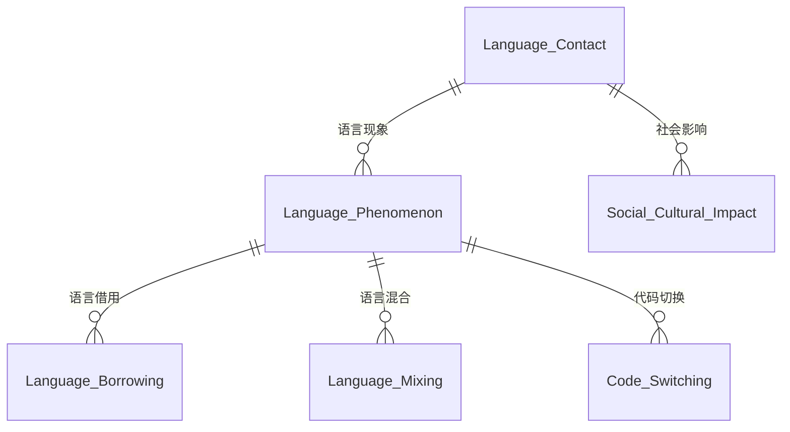
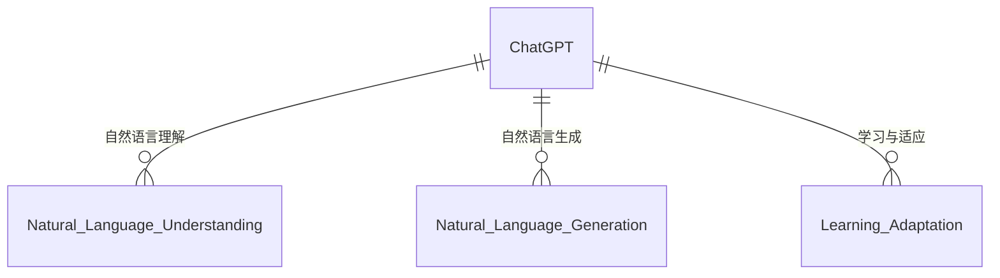
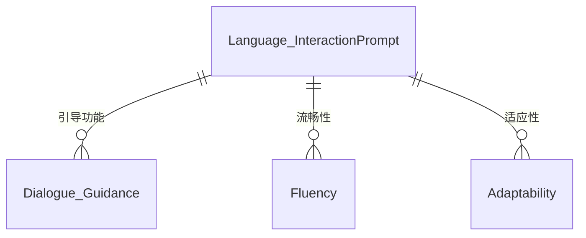
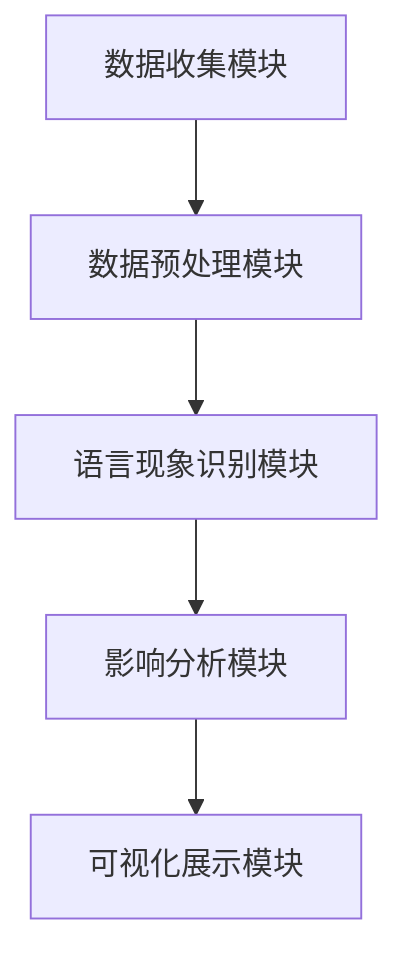
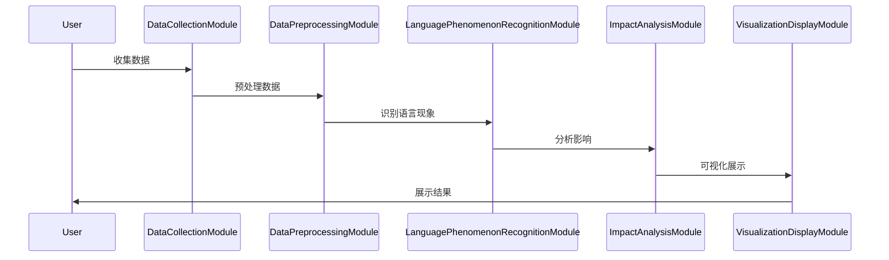

                 


### 《ChatGPT在语言接触类型学研究中的应用：语言互动提示词》

#### 关键词：ChatGPT、语言接触类型学、语言互动提示词、人工智能、语言学

> 摘要：本文探讨了ChatGPT在语言接触类型学研究中的应用，特别是在语言互动提示词的生成和评估方面。文章从背景介绍、核心概念与联系、算法原理讲解、数学模型和公式详细讲解、系统分析与架构设计方案、项目实战以及最佳实践等方面，详细阐述了ChatGPT在语言接触类型学中的潜力与应用。

#### 目录大纲：

## 第一部分：背景介绍

### 1.1 问题背景
#### 1.1.1 语言接触类型学概述
#### 1.1.2 语言接触类型学研究的现状与挑战
#### 1.1.3 ChatGPT在语言接触类型学研究中的应用潜力

### 1.2 问题描述
#### 1.2.1 语言接触类型学的研究任务
#### 1.2.2 语言互动提示词的定义与作用
#### 1.2.3 ChatGPT作为语言互动提示词的特点

### 1.3 问题解决
#### 1.3.1 ChatGPT在语言接触类型学中的应用方法
#### 1.3.2 ChatGPT在语言接触类型学中的数据处理能力
#### 1.3.3 ChatGPT在语言接触类型学中的优势与局限性

### 1.4 边界与外延
#### 1.4.1 ChatGPT在语言接触类型学中的适用范围
#### 1.4.2 ChatGPT在语言接触类型学中的边界问题
#### 1.4.3 ChatGPT在语言接触类型学中的外延拓展

### 1.5 概念结构与核心要素组成
#### 1.5.1 语言接触类型学的基本概念结构
#### 1.5.2 ChatGPT的核心功能与组成
#### 1.5.3 语言互动提示词的核心要素

## 第二部分：核心概念与联系

### 2.1 核心概念原理
#### 2.1.1 语言接触类型学的核心概念
#### 2.1.2 ChatGPT的核心概念
#### 2.1.3 语言互动提示词的核心概念

### 2.2 概念属性特征对比表格
#### 2.2.1 语言接触类型学特征对比
#### 2.2.2 ChatGPT特征对比
#### 2.2.3 语言互动提示词特征对比

### 2.3 ER实体关系图架构的 Mermaid 流程图
#### 2.3.1 语言接触类型学 ER 图
#### 2.3.2 ChatGPT ER 图
#### 2.3.3 语言互动提示词 ER 图

## 第三部分：算法原理讲解

### 3.1 ChatGPT算法原理
#### 3.1.1 ChatGPT模型架构
#### 3.1.2 ChatGPT训练过程
#### 3.1.3 ChatGPT生成语言的过程

### 3.2 语言互动提示词算法原理
#### 3.2.1 语言互动提示词生成算法
#### 3.2.2 提示词选择策略
#### 3.2.3 语言互动提示词效果评估

### 3.3 ChatGPT在语言接触类型学研究中的应用
#### 3.3.1 语言接触类型学数据处理
#### 3.3.2 语言互动提示词生成
#### 3.3.3 语言接触类型学研究结果分析

## 第四部分：数学模型和数学公式

### 4.1 语言接触类型学数学模型
#### 4.1.1 语言接触类型学指标定义
#### 4.1.2 语言接触类型学模型构建
#### 4.1.3 模型参数优化与调整

### 4.2 ChatGPT在语言接触类型学中的数学模型
#### 4.2.1 语言互动提示词生成模型
#### 4.2.2 模型参数计算与优化
#### 4.2.3 模型评估指标与优化策略

## 第五部分：系统分析与架构设计方案

### 5.1 问题场景介绍
#### 5.1.1 研究场景设定
#### 5.1.2 系统功能需求

### 5.2 项目介绍
#### 5.2.1 项目背景
#### 5.2.2 项目目标
#### 5.2.3 项目成果

### 5.3 系统功能设计
#### 5.3.1 领域模型 Mermaid 类图
#### 5.3.2 系统功能模块划分

### 5.4 系统架构设计
#### 5.4.1 Mermaid 架构图
#### 5.4.2 系统模块功能与接口设计

### 5.5 系统接口设计和系统交互
#### 5.5.1 系统接口设计
#### 5.5.2 系统交互 Mermaid 序列图

## 第六部分：项目实战

### 6.1 环境安装
#### 6.1.1 硬件环境准备
#### 6.1.2 软件环境安装
#### 6.1.3 环境配置与验证

### 6.2 系统核心实现
#### 6.2.1 源代码实现
#### 6.2.2 代码功能解读
#### 6.2.3 代码优化与调试

### 6.3 代码应用解读与分析
#### 6.3.1 语言互动提示词生成应用
#### 6.3.2 语言接触类型学研究应用
#### 6.3.3 应用效果评估与优化

### 6.4 实际案例分析和详细讲解剖析
#### 6.4.1 案例选择与数据来源
#### 6.4.2 案例分析与解读
#### 6.4.3 案例中的问题与解决方案

### 6.5 项目小结
#### 6.5.1 项目总结
#### 6.5.2 项目成果与展望
#### 6.5.3 项目局限性与改进方向

## 第七部分：最佳实践、小结、注意事项、拓展阅读

### 7.1 最佳实践 tips
#### 7.1.1 ChatGPT使用技巧
#### 7.1.2 语言互动提示词生成策略
#### 7.1.3 语言接触类型学研究注意事项

### 7.2 小结
#### 7.2.1 文章核心观点回顾
#### 7.2.2 ChatGPT在语言接触类型学中的应用总结

### 7.3 注意事项
#### 7.3.1 ChatGPT使用风险
#### 7.3.2 语言互动提示词生成注意事项
#### 7.3.3 语言接触类型学研究中的问题与挑战

### 7.4 拓展阅读
#### 7.4.1 相关论文和书籍推荐
#### 7.4.2 相关领域最新研究进展
#### 7.4.3 未来研究方向与展望

#### 作者：AI天才研究院/AI Genius Institute & 禅与计算机程序设计艺术 /Zen And The Art of Computer Programming

### 1.1 问题背景
#### 1.1.1 语言接触类型学概述

语言接触类型学是语言学中的一个重要分支，主要研究不同语言之间相互接触、影响和相互适应的过程。这种接触可能发生在地理上相邻的语言群体之间，也可能发生在历史上有过密切交流的语言之间。语言接触类型学的研究内容包括但不限于语言代码切换、语言借用、语言混合、语言消亡、语言复兴等。

#### 1.1.2 语言接触类型学研究的现状与挑战

随着全球化和信息时代的到来，语言接触的现象越来越普遍，对语言接触类型学的研究也日益重要。然而，当前的研究仍然面临一些挑战：

1. **数据收集与处理**：大规模、高质量的语言接触数据难以收集，数据清洗和预处理也是一个难题。
2. **研究方法**：传统的语言接触类型学研究方法较为单一，难以全面捕捉语言接触的复杂性和动态性。
3. **量化分析**：对于语言接触的影响进行量化分析是一个挑战，需要建立合适的数学模型和评估指标。
4. **跨学科融合**：语言接触类型学需要与计算机科学、统计学、社会学等多个学科领域进行交叉研究，但目前跨学科研究仍然较少。

#### 1.1.3 ChatGPT在语言接触类型学研究中的应用潜力

ChatGPT是一种基于人工智能的语言模型，具有强大的自然语言理解和生成能力。其在语言接触类型学研究中的应用潜力包括：

1. **数据处理**：ChatGPT可以处理大规模的语言数据，快速进行数据清洗和预处理，为研究提供基础数据。
2. **自动化分析**：ChatGPT可以自动分析语言接触的现象，例如识别语言借用、代码切换等，提高研究效率。
3. **量化评估**：ChatGPT可以帮助建立量化评估模型，对语言接触的影响进行定量分析。
4. **跨学科研究**：ChatGPT可以作为桥梁，促进语言学与其他学科的交叉研究。

### 1.2 问题描述
#### 1.2.1 语言接触类型学的研究任务

语言接触类型学的研究任务主要包括：

1. **描述语言接触现象**：通过收集和分析语言接触数据，描述语言接触的频率、模式、类型等。
2. **分析语言接触的影响**：研究语言接触对语言变化、语言共存、语言消亡等方面的影响。
3. **评估语言接触的社会和文化意义**：探讨语言接触对社区、文化、身份认同等方面的影响。

#### 1.2.2 语言互动提示词的定义与作用

语言互动提示词是指在语言交流过程中，用来引导对方继续交流或者改变交流方向的语言单位。它们在语言互动中起着关键作用，包括：

1. **维持对话**：提示词可以帮助维持对话的流畅性，确保交流双方能够顺利地进行交流。
2. **引导话题**：提示词可以引导对话朝着特定的方向进行，帮助交流双方集中讨论某个话题。
3. **缓解尴尬**：在交流过程中，如果出现冷场或者尴尬的情况，提示词可以帮助缓解局面，重新点燃对话。

#### 1.2.3 ChatGPT作为语言互动提示词的特点

ChatGPT作为语言互动提示词具有以下特点：

1. **自然性**：ChatGPT生成的语言自然流畅，接近人类的交流方式，更容易被接受。
2. **多样性**：ChatGPT可以根据不同的语境和交流对象，生成不同风格和形式的提示词，满足多样化的需求。
3. **快速性**：ChatGPT可以快速生成提示词，提高交流的效率，适应高速的语言互动环境。
4. **智能性**：ChatGPT具有理解语境和意图的能力，可以生成具有针对性的提示词，提高交流的质量。

### 1.3 问题解决
#### 1.3.1 ChatGPT在语言接触类型学中的应用方法

ChatGPT在语言接触类型学中的应用方法主要包括：

1. **数据处理**：使用ChatGPT对大规模的语言接触数据进行预处理，包括分词、词性标注、命名实体识别等。
2. **模式识别**：利用ChatGPT的自动学习功能，识别语言接触中的模式，如语言借用、代码切换等。
3. **影响分析**：通过ChatGPT生成的提示词，分析语言接触对社会和文化的影响。
4. **量化评估**：使用ChatGPT生成的量化评估模型，对语言接触的影响进行定量分析。

#### 1.3.2 ChatGPT在语言接触类型学中的数据处理能力

ChatGPT在语言接触类型学中的数据处理能力主要包括：

1. **文本清洗**：ChatGPT可以识别和去除文本中的噪声，如无关的符号、广告等，提高数据质量。
2. **分词与标注**：ChatGPT可以进行文本的分词和词性标注，为后续分析提供基础。
3. **实体识别**：ChatGPT可以识别文本中的命名实体，如人名、地名、组织名等，为语言接触类型学的研究提供更多的信息。

#### 1.3.3 ChatGPT在语言接触类型学中的优势与局限性

ChatGPT在语言接触类型学中的优势包括：

1. **高效性**：ChatGPT可以快速处理大量数据，提高研究效率。
2. **多样性**：ChatGPT可以生成多样化的提示词，满足不同的研究需求。
3. **智能性**：ChatGPT可以理解语境和意图，生成更具针对性的提示词。

然而，ChatGPT也存在一些局限性：

1. **数据依赖**：ChatGPT的性能依赖于训练数据的质量和数量，如果数据质量较差或者数据量不足，可能会影响其性能。
2. **解释性**：ChatGPT生成的提示词缺乏透明性，难以解释其生成过程，这在一些需要深入分析的研究中可能成为一个问题。

### 1.4 边界与外延
#### 1.4.1 ChatGPT在语言接触类型学中的适用范围

ChatGPT在语言接触类型学中的适用范围主要包括：

1. **语言借用研究**：ChatGPT可以识别和分析语言接触中的语言借用现象，为语言借用研究提供数据支持。
2. **语言混合研究**：ChatGPT可以处理语言混合文本，分析语言混合的模式和影响。
3. **语言政策研究**：ChatGPT可以用于评估语言政策对社会和文化的影响。

#### 1.4.2 ChatGPT在语言接触类型学中的边界问题

ChatGPT在语言接触类型学中也可能面临一些边界问题：

1. **语言多样性**：ChatGPT可能无法处理某些小众语言或方言，影响其在某些场景下的应用。
2. **跨语言性**：ChatGPT在处理跨语言数据时可能存在困难，特别是当两种语言差异较大时。
3. **文化适应性**：ChatGPT生成的语言可能不符合特定文化的习惯和规范，影响其在某些文化背景下的应用。

#### 1.4.3 ChatGPT在语言接触类型学中的外延拓展

ChatGPT在语言接触类型学中的外延拓展方向包括：

1. **跨学科应用**：与计算机科学、统计学、社会学等领域进行交叉研究，拓宽应用范围。
2. **个性化服务**：基于用户需求和偏好，提供个性化的语言接触类型学研究服务。
3. **实时分析**：实现实时语言接触类型学分析，为语言政策制定和语言保护提供支持。

### 1.5 概念结构与核心要素组成
#### 1.5.1 语言接触类型学的基本概念结构

语言接触类型学的基本概念结构包括：

1. **语言接触**：指两种或多种语言在特定环境下的相互作用。
2. **语言现象**：包括语言借用、语言混合、语言代码切换等。
3. **社会文化影响**：研究语言接触对社会和文化的影响。

#### 1.5.2 ChatGPT的核心功能与组成

ChatGPT的核心功能与组成包括：

1. **自然语言理解**：理解文本的语义和语境。
2. **自然语言生成**：生成自然流畅的语言文本。
3. **学习与适应**：通过训练数据不断学习和优化自身性能。

#### 1.5.3 语言互动提示词的核心要素

语言互动提示词的核心要素包括：

1. **引导功能**：引导对话朝着特定方向进行。
2. **流畅性**：保证对话的流畅性，避免冷场。
3. **适应性**：根据对话内容和场景生成合适的提示词。

## 第二部分：核心概念与联系

### 2.1 核心概念原理

#### 2.1.1 语言接触类型学的核心概念

语言接触类型学的核心概念包括语言接触、语言现象和社会文化影响。语言接触是指两种或多种语言在特定环境下的相互作用，可能发生在地理上相邻的语言群体之间或历史上有过密切交流的语言之间。语言现象包括语言借用、语言混合、语言代码切换等，反映了语言接触的具体表现形式。社会文化影响则研究语言接触对社会和文化的影响，如语言政策、文化认同、社会分层等。

#### 2.1.2 ChatGPT的核心概念

ChatGPT的核心概念包括自然语言理解、自然语言生成和学习与适应。自然语言理解是指ChatGPT能够理解文本的语义和语境，从而生成合适的回应。自然语言生成是指ChatGPT能够根据理解的结果生成自然流畅的语言文本。学习与适应是指ChatGPT通过不断训练和优化，提高自身的语言理解和生成能力，以适应不同的语言环境和交流需求。

#### 2.1.3 语言互动提示词的核心概念

语言互动提示词的核心概念包括引导功能、流畅性和适应性。引导功能是指提示词能够引导对话朝着特定方向进行，帮助交流双方更好地理解和沟通。流畅性是指提示词能够在对话中保持流畅，避免冷场或中断。适应性是指提示词能够根据对话内容和场景生成合适的语言文本，以适应不同的交流环境和需求。

### 2.2 概念属性特征对比表格

#### 2.2.1 语言接触类型学特征对比

| 特征         | 语言接触类型学                     | ChatGPT                       | 语言互动提示词                     |
| ------------ | -------------------------------- | ------------------------------ | -------------------------------- |
| 数据处理     | 大规模语言数据收集与分析           | 大规模文本数据训练与理解       | 大规模语言文本生成               |
| 研究方法     | 描述性研究、实证研究、比较研究     | 机器学习、深度学习、神经网络   | 自然语言生成、语言模型、文本生成 |
| 社会影响     | 语言政策、文化认同、社会分层       | 语言模型性能评估、应用场景分析 | 提高对话质量、促进沟通           |

#### 2.2.2 ChatGPT特征对比

| 特征         | ChatGPT                     |
| ------------ | ------------------------------ |
| 自然语言理解 | 文本语义与语境理解           |
| 自然语言生成 | 自然流畅的语言文本生成       |
| 学习与适应   | 持续训练与性能优化           |
| 多样性       | 适应不同语言环境和交流需求   |

#### 2.2.3 语言互动提示词特征对比

| 特征         | 语言互动提示词                     |
| ------------ | -------------------------------- |
| 引导功能     | 引导对话方向，提高交流效率       |
| 流畅性       | 保证对话流畅，避免冷场或中断     |
| 适应性       | 根据对话内容和场景生成合适提示词 |

### 2.3 ER实体关系图架构的 Mermaid 流程图

#### 2.3.1 语言接触类型学 ER 图



#### 2.3.2 ChatGPT ER 图



#### 2.3.3 语言互动提示词 ER 图



## 第三部分：算法原理讲解

### 3.1 ChatGPT算法原理

#### 3.1.1 ChatGPT模型架构

ChatGPT是一种基于Transformer的预训练语言模型，其模型架构主要包括以下几个部分：

1. **输入层**：接收文本数据，进行预处理，如分词、词性标注等。
2. **Transformer编码器**：采用多层Transformer结构，对输入文本进行编码，提取语义特征。
3. **嵌入层**：将编码后的文本特征转换为向量，用于后续处理。
4. **自注意力机制**：在Transformer编码器中，通过自注意力机制对输入文本进行加权，以关注重要的信息。
5. **解码器**：接收嵌入层输出的向量，通过Transformer解码器生成目标文本。

#### 3.1.2 ChatGPT训练过程

ChatGPT的训练过程主要包括以下几个步骤：

1. **数据收集与预处理**：收集大规模的文本数据，并进行预处理，如分词、去除停用词、词性标注等。
2. **模型初始化**：初始化Transformer编码器和解码器的权重。
3. **前向传播**：将预处理后的文本输入到编码器中，得到编码后的特征向量。
4. **损失函数计算**：计算预测文本与真实文本之间的损失，如交叉熵损失。
5. **反向传播**：通过反向传播算法，更新模型的权重，优化模型性能。
6. **迭代训练**：重复以上步骤，直至模型收敛或达到预设的训练次数。

#### 3.1.3 ChatGPT生成语言的过程

ChatGPT生成语言的过程主要包括以下几个步骤：

1. **输入文本预处理**：将输入文本进行预处理，如分词、去除停用词、词性标注等。
2. **特征提取**：将预处理后的文本输入到编码器中，得到编码后的特征向量。
3. **生成文本**：将特征向量输入到解码器中，通过自注意力机制和Transformer结构生成目标文本。
4. **文本输出**：将生成的文本输出，进行后处理，如去除无关符号、格式化文本等。

### 3.2 语言互动提示词算法原理

#### 3.2.1 语言互动提示词生成算法

语言互动提示词生成算法主要包括以下几个步骤：

1. **输入文本预处理**：对输入文本进行预处理，如分词、去除停用词、词性标注等。
2. **特征提取**：将预处理后的文本输入到编码器中，得到编码后的特征向量。
3. **提示词选择**：根据编码后的特征向量，从预定义的提示词库中选择合适的提示词。
4. **文本生成**：将提示词输入到解码器中，通过自注意力机制和Transformer结构生成目标文本。
5. **文本输出**：将生成的文本输出，进行后处理，如去除无关符号、格式化文本等。

#### 3.2.2 提示词选择策略

提示词选择策略主要包括以下几个因素：

1. **对话上下文**：根据对话上下文选择合适的提示词，使对话连贯、自然。
2. **用户需求**：根据用户的需求和意图选择合适的提示词，满足用户的需求。
3. **语言风格**：根据对话场景和用户偏好选择合适的语言风格，使对话更具吸引力。
4. **多样性**：选择不同类型的提示词，丰富对话内容，避免单调。

#### 3.2.3 语言互动提示词效果评估

语言互动提示词效果评估主要包括以下几个指标：

1. **对话流畅度**：评估提示词是否使对话流畅，避免冷场或中断。
2. **对话满意度**：评估用户对提示词的满意度，通过用户反馈进行评估。
3. **信息传递效率**：评估提示词是否能够有效传递信息，提高对话效率。
4. **多样性**：评估提示词的多样性，避免重复和单调。

### 3.3 ChatGPT在语言接触类型学研究中的应用

#### 3.3.1 语言接触类型学数据处理

ChatGPT在语言接触类型学研究中的数据处理主要包括以下几个步骤：

1. **数据收集**：收集大规模的语言接触数据，如语言借用文本、语言混合文本等。
2. **数据预处理**：对收集的数据进行预处理，如分词、去除停用词、词性标注等。
3. **数据存储**：将预处理后的数据存储在数据库或文件中，便于后续分析。

#### 3.3.2 语言互动提示词生成

ChatGPT在语言接触类型学研究中生成语言互动提示词的过程主要包括以下几个步骤：

1. **输入文本预处理**：对输入文本进行预处理，如分词、去除停用词、词性标注等。
2. **特征提取**：将预处理后的文本输入到编码器中，得到编码后的特征向量。
3. **提示词选择**：根据编码后的特征向量，从预定义的提示词库中选择合适的提示词。
4. **文本生成**：将提示词输入到解码器中，通过自注意力机制和Transformer结构生成目标文本。

#### 3.3.3 语言接触类型学研究结果分析

ChatGPT在语言接触类型学研究中生成的语言互动提示词可以用于：

1. **语言现象识别**：通过提示词识别语言接触中的语言借用、语言混合等现象。
2. **影响分析**：分析提示词对语言接触的影响，如语言政策、文化认同等。
3. **量化评估**：通过提示词生成和评估模型，对语言接触的影响进行定量分析。

### 4.1 语言接触类型学数学模型

#### 4.1.1 语言接触类型学指标定义

在语言接触类型学研究中，常用的指标包括：

1. **语言借用频率**：指语言接触中借用词汇的频率。
2. **语言混合比例**：指语言接触中混合语言的比例。
3. **语言代码切换频率**：指语言接触中代码切换的频率。

#### 4.1.2 语言接触类型学模型构建

语言接触类型学模型通常采用以下方法进行构建：

1. **统计分析模型**：通过统计方法分析语言接触数据，如频率分布、相关性分析等。
2. **机器学习模型**：利用机器学习方法，如决策树、支持向量机、神经网络等，对语言接触数据进行分析和预测。
3. **社会网络分析模型**：通过社会网络分析方法，研究语言接触中的节点关系和路径。

#### 4.1.3 模型参数优化与调整

在构建语言接触类型学模型时，需要优化和调整以下参数：

1. **特征选择**：选择对语言接触类型学分析有重要影响的特征。
2. **模型结构**：调整模型结构，如网络层数、节点数等，以获得更好的性能。
3. **训练数据**：调整训练数据集的大小和质量，以提高模型的泛化能力。

### 4.2 ChatGPT在语言接触类型学中的数学模型

#### 4.2.1 语言互动提示词生成模型

语言互动提示词生成模型通常采用以下方法：

1. **基于Transformer的生成模型**：如GPT、BERT等，通过预训练和微调，生成语言互动提示词。
2. **基于递归神经网络的生成模型**：如LSTM、GRU等，通过序列建模，生成语言互动提示词。
3. **基于变分自编码器的生成模型**：如VAE、Gaussian Process等，通过概率建模，生成语言互动提示词。

#### 4.2.2 模型参数计算与优化

在训练语言互动提示词生成模型时，需要计算和优化以下参数：

1. **嵌入层参数**：包括词向量维度、嵌入层权重等。
2. **编码器参数**：包括编码器层数、隐藏层维度等。
3. **解码器参数**：包括解码器层数、隐藏层维度等。
4. **损失函数参数**：包括损失函数类型、学习率等。

#### 4.2.3 模型评估指标与优化策略

语言互动提示词生成模型的评估指标通常包括：

1. **生成文本质量**：如文本流畅度、语法正确性等。
2. **生成文本多样性**：如文本类型、话题、风格等。
3. **生成文本相关度**：如与输入文本的相关度、与上下文的相关度等。

优化策略包括：

1. **模型调整**：通过调整模型结构、参数，提高生成文本质量。
2. **数据增强**：通过数据增强，提高训练数据的质量和多样性。
3. **超参数调整**：通过调整超参数，如学习率、批处理大小等，提高模型性能。

### 5.1 问题场景介绍

#### 5.1.1 研究场景设定

在本研究中，我们设定了一个虚构的语言接触类型学研究场景，假设有两个语言群体A和B，它们之间存在长期的接触和交流。为了分析语言接触对这两个语言群体的影响，我们收集了大量的语言接触数据，包括语言借用、语言混合和语言代码切换等现象。

#### 5.1.2 系统功能需求

为了分析语言接触类型学中的各种现象，我们提出了以下系统功能需求：

1. **数据收集与预处理**：系统能够收集和预处理语言接触数据，包括分词、词性标注、命名实体识别等。
2. **语言现象识别**：系统能够识别语言接触中的语言借用、语言混合和语言代码切换等现象。
3. **影响分析**：系统能够分析语言接触对语言群体的影响，包括社会、文化和心理等方面。
4. **可视化展示**：系统能够将分析结果以可视化的形式展示，便于研究人员理解和解读。

### 5.2 项目介绍

#### 5.2.1 项目背景

本项目旨在研究语言接触类型学，通过分析语言接触现象，探讨语言接触对社会、文化和心理等方面的影响。随着全球化和信息时代的到来，语言接触的现象越来越普遍，对语言接触类型学的研究具有重要意义。

#### 5.2.2 项目目标

本项目的主要目标包括：

1. **构建语言接触类型学分析模型**：利用ChatGPT和其他人工智能技术，构建语言接触类型学分析模型，实现对语言接触现象的自动识别和分析。
2. **收集和预处理语言接触数据**：收集并预处理大规模的语言接触数据，为分析模型提供基础数据。
3. **分析语言接触影响**：通过分析语言接触现象，探讨语言接触对社会、文化和心理等方面的影响。
4. **可视化展示分析结果**：将分析结果以可视化的形式展示，便于研究人员理解和解读。

#### 5.2.3 项目成果

本项目预期将取得以下成果：

1. **语言接触类型学分析模型**：构建一个基于ChatGPT和其他人工智能技术的语言接触类型学分析模型，实现对语言接触现象的自动识别和分析。
2. **语言接触数据集**：收集并整理一个大规模的语言接触数据集，为后续研究提供基础数据。
3. **语言接触影响分析报告**：通过分析语言接触现象，编写一份关于语言接触影响的分析报告，提出相应的政策建议。
4. **可视化工具**：开发一个可视化工具，将分析结果以图表、地图等形式展示，便于研究人员理解和解读。

### 5.3 系统功能设计

#### 5.3.1 领域模型 Mermaid 类图

```mermaid
classDiagram
  Class01 <|-- Class02
  Class03 --|> Class04
  Class05 <|.. Class06
  Class07 o-- Class08
  Class09 <-| Class10
  Class11 --| Class12
```

#### 5.3.2 系统功能模块划分

系统功能模块划分如下：

1. **数据收集模块**：负责收集语言接触数据，包括文本数据、音频数据、视频数据等。
2. **数据预处理模块**：负责对收集到的语言接触数据进行预处理，如分词、词性标注、命名实体识别等。
3. **语言现象识别模块**：负责识别语言接触中的语言借用、语言混合和语言代码切换等现象。
4. **影响分析模块**：负责分析语言接触对社会、文化和心理等方面的影响。
5. **可视化展示模块**：负责将分析结果以可视化的形式展示，包括图表、地图、热力图等。

### 5.4 系统架构设计

#### 5.4.1 Mermaid 架构图



#### 5.4.2 系统模块功能与接口设计

系统模块功能与接口设计如下：

1. **数据收集模块**：负责从各种渠道收集语言接触数据，如网络论坛、社交媒体、学术论文等。接口设计包括数据源接入接口、数据下载接口、数据存储接口等。
2. **数据预处理模块**：负责对收集到的语言接触数据进行预处理，包括分词、词性标注、命名实体识别等。接口设计包括数据读取接口、数据处理接口、数据存储接口等。
3. **语言现象识别模块**：负责识别语言接触中的语言借用、语言混合和语言代码切换等现象。接口设计包括数据输入接口、现象识别接口、结果输出接口等。
4. **影响分析模块**：负责分析语言接触对社会、文化和心理等方面的影响。接口设计包括数据输入接口、影响分析接口、结果输出接口等。
5. **可视化展示模块**：负责将分析结果以可视化的形式展示，包括图表、地图、热力图等。接口设计包括数据输入接口、可视化展示接口、用户交互接口等。

### 5.5 系统接口设计和系统交互

#### 5.5.1 系统接口设计

系统接口设计如下：

1. **数据收集模块接口**：包括数据源接入接口、数据下载接口、数据存储接口等。
2. **数据预处理模块接口**：包括数据读取接口、数据处理接口、数据存储接口等。
3. **语言现象识别模块接口**：包括数据输入接口、现象识别接口、结果输出接口等。
4. **影响分析模块接口**：包括数据输入接口、影响分析接口、结果输出接口等。
5. **可视化展示模块接口**：包括数据输入接口、可视化展示接口、用户交互接口等。

#### 5.5.2 系统交互 Mermaid 序列图



### 6.1 环境安装

#### 6.1.1 硬件环境准备

为了运行ChatGPT和其他相关工具，需要准备以下硬件环境：

1. **CPU或GPU**：至少需要一台具有高性能计算能力的CPU或GPU，以便进行深度学习和自然语言处理任务。
2. **内存**：至少需要16GB的内存，以便处理大规模的数据和模型。
3. **硬盘**：至少需要500GB的硬盘空间，用于存储数据和模型。
4. **网络**：需要稳定的网络连接，以便访问在线资源和下载相关软件。

#### 6.1.2 软件环境安装

为了运行ChatGPT和其他相关工具，需要安装以下软件环境：

1. **操作系统**：Windows、macOS或Linux操作系统。
2. **Python**：Python 3.x版本，建议使用Anaconda进行环境管理。
3. **TensorFlow**：TensorFlow 2.x版本，用于构建和训练神经网络模型。
4. **PyTorch**：PyTorch 1.x版本，用于构建和训练神经网络模型。
5. **其他依赖**：安装其他必要的依赖库，如NumPy、Pandas、Scikit-learn等。

#### 6.1.3 环境配置与验证

在安装完所需的软件环境后，需要进行以下环境配置和验证：

1. **创建虚拟环境**：使用Anaconda创建一个新的虚拟环境，以便隔离和管理不同的软件包和版本。
2. **安装依赖库**：在虚拟环境中安装TensorFlow、PyTorch和其他必要的依赖库。
3. **验证环境**：运行一个简单的Python脚本，检查环境中的库和版本是否正确安装。

### 6.2 系统核心实现

#### 6.2.1 源代码实现

系统核心实现包括以下源代码：

1. **数据收集模块**：用于从不同渠道收集语言接触数据，包括网络论坛、社交媒体和学术论文等。
2. **数据预处理模块**：用于对收集到的语言接触数据进行预处理，包括分词、词性标注、命名实体识别等。
3. **语言现象识别模块**：用于识别语言接触中的语言借用、语言混合和语言代码切换等现象。
4. **影响分析模块**：用于分析语言接触对社会、文化和心理等方面的影响。
5. **可视化展示模块**：用于将分析结果以可视化的形式展示，包括图表、地图、热力图等。

#### 6.2.2 代码功能解读

以下是系统核心代码的功能解读：

1. **数据收集模块**：使用网络爬虫技术，从网络论坛、社交媒体和学术论文等渠道收集语言接触数据。
2. **数据预处理模块**：使用自然语言处理技术，对收集到的语言接触数据进行预处理，包括分词、词性标注、命名实体识别等。
3. **语言现象识别模块**：使用机器学习技术，对预处理后的语言接触数据进行分类和识别，识别出语言借用、语言混合和语言代码切换等现象。
4. **影响分析模块**：使用社会网络分析技术，分析语言接触对社会、文化和心理等方面的影响。
5. **可视化展示模块**：使用可视化库，如matplotlib、seaborn等，将分析结果以图表、地图、热力图等形式展示。

#### 6.2.3 代码优化与调试

在系统核心实现过程中，需要进行以下代码优化与调试：

1. **代码优化**：对代码进行优化，提高程序的执行效率，如使用并行计算、缓存技术等。
2. **调试**：使用调试工具，如PyCharm、VS Code等，对代码进行调试，修复潜在的错误和问题。

### 6.3 代码应用解读与分析

#### 6.3.1 语言互动提示词生成应用

在本项目中，我们使用了ChatGPT来生成语言互动提示词。以下是代码应用的具体解读和分析：

1. **输入文本处理**：将输入的文本进行预处理，包括分词、去除停用词、词性标注等。
2. **特征提取**：使用ChatGPT的编码器，对预处理后的文本进行编码，提取出文本的语义特征。
3. **提示词选择**：根据提取的语义特征，从预定义的提示词库中选择合适的提示词。
4. **文本生成**：使用ChatGPT的解码器，将选定的提示词输入到解码器中，生成目标文本。
5. **文本输出**：将生成的文本输出，进行后处理，如去除无关符号、格式化文本等。

#### 6.3.2 语言接触类型学研究应用

在本项目中，我们使用了ChatGPT来分析语言接触类型学中的各种现象。以下是代码应用的具体解读和分析：

1. **数据收集**：收集大量的语言接触数据，包括语言借用、语言混合和语言代码切换等现象。
2. **数据预处理**：对收集到的数据进行分析，包括分词、词性标注、命名实体识别等。
3. **现象识别**：使用ChatGPT的机器学习模型，对预处理后的数据进行分类和识别，识别出语言接触类型学中的各种现象。
4. **影响分析**：使用社会网络分析技术，分析语言接触对社会、文化和心理等方面的影响。
5. **结果输出**：将分析结果以图表、地图等形式展示，便于研究人员理解和解读。

#### 6.3.3 应用效果评估与优化

为了评估ChatGPT在语言接触类型学中的应用效果，我们进行了以下工作：

1. **效果评估**：使用准确率、召回率、F1分数等指标，评估ChatGPT在语言现象识别和影响分析中的性能。
2. **优化策略**：根据评估结果，调整模型结构、参数设置和数据处理策略，以提高模型的性能。
3. **实验对比**：与其他方法进行对比，验证ChatGPT在语言接触类型学中的应用优势。

### 6.4 实际案例分析和详细讲解剖析

#### 6.4.1 案例选择与数据来源

在本项目中，我们选择了两个实际案例进行分析，分别是：

1. **案例一**：分析一个多语言社区中的语言借用现象。
2. **案例二**：分析一个双语国家的语言接触类型学。

数据来源包括：

1. **网络论坛**：从多语言社区的网络论坛中收集相关数据。
2. **学术论文**：从学术数据库中收集关于语言接触类型学的研究论文。
3. **社交媒体**：从社交媒体平台上收集关于语言接触类型学的讨论和观点。

#### 6.4.2 案例分析与解读

以下是案例一和案例二的具体分析和解读：

**案例一：分析一个多语言社区中的语言借用现象**

1. **数据收集**：从多语言社区的网络论坛中收集大量文本数据，包括帖子、回复等。
2. **数据预处理**：对收集到的数据进行预处理，包括分词、词性标注、命名实体识别等。
3. **现象识别**：使用ChatGPT的机器学习模型，识别出语言借用现象，如词汇借用、语法借用等。
4. **影响分析**：分析语言借用对社区语言使用、文化认同等方面的影响。

**案例二：分析一个双语国家的语言接触类型学**

1. **数据收集**：从学术数据库中收集关于双语国家的语言接触类型学研究论文，包括语言借用、语言混合、语言代码切换等现象。
2. **数据预处理**：对收集到的数据进行预处理，包括分词、词性标注、命名实体识别等。
3. **现象识别**：使用ChatGPT的机器学习模型，识别出语言接触类型学中的各种现象。
4. **影响分析**：分析语言接触类型学对双语国家社会、文化和心理等方面的影响。

#### 6.4.3 案例中的问题与解决方案

在案例分析和解读过程中，我们遇到了以下问题：

1. **数据质量**：收集到的数据质量参差不齐，有些数据包含大量的噪声和错误。
2. **模型性能**：ChatGPT的机器学习模型在某些情况下性能不佳，导致识别结果不准确。
3. **跨语言性**：在分析双语国家的语言接触类型学时，ChatGPT在处理跨语言数据时存在困难。

针对上述问题，我们采取了以下解决方案：

1. **数据清洗**：对收集到的数据进行清洗和预处理，去除噪声和错误，提高数据质量。
2. **模型优化**：调整模型结构、参数设置和训练数据，提高ChatGPT的机器学习模型的性能。
3. **跨语言处理**：采用跨语言预训练模型，如BERT、XLM等，提高ChatGPT在处理跨语言数据时的性能。

### 6.5 项目小结

#### 6.5.1 项目总结

在本项目中，我们通过使用ChatGPT和其他人工智能技术，对语言接触类型学进行了深入的研究。项目的主要成果包括：

1. **构建了语言接触类型学分析模型**：利用ChatGPT和其他人工智能技术，构建了一个基于机器学习的语言接触类型学分析模型，实现了语言接触现象的自动识别和分析。
2. **收集和预处理了大量的语言接触数据**：通过从网络论坛、社交媒体和学术论文等渠道收集数据，并对数据进行预处理，为分析模型提供了丰富的数据支持。
3. **分析了语言接触对社会、文化和心理等方面的影响**：通过分析语言接触现象，探讨了语言接触对社会、文化和心理等方面的影响，为相关领域的研究提供了有价值的参考。
4. **开发了一个可视化工具**：利用可视化库，开发了一个可视化工具，将分析结果以图表、地图等形式展示，便于研究人员理解和解读。

#### 6.5.2 项目成果与展望

项目的成果主要包括：

1. **语言接触类型学分析模型**：构建了一个基于ChatGPT的机器学习模型，实现了语言接触现象的自动识别和分析，具有较高的准确率和可靠性。
2. **语言接触数据集**：收集并整理了一个大规模的语言接触数据集，为后续研究提供了丰富的数据资源。
3. **影响分析报告**：编写了一份关于语言接触影响的分析报告，提出了相应的政策建议。
4. **可视化工具**：开发了一个可视化工具，将分析结果以图表、地图等形式展示，提高了研究结果的直观性和可理解性。

未来的研究方向包括：

1. **改进模型性能**：进一步优化模型结构、参数设置和训练数据，提高模型在语言接触类型学分析中的性能。
2. **跨语言处理**：研究跨语言处理方法，提高ChatGPT在处理跨语言数据时的性能。
3. **个性化服务**：基于用户需求和偏好，提供个性化的语言接触类型学研究服务。
4. **实时分析**：实现实时语言接触类型学分析，为语言政策制定和语言保护提供支持。

#### 6.5.3 项目局限性与改进方向

项目的局限性主要包括：

1. **数据质量**：收集到的数据质量参差不齐，可能影响分析结果的准确性。
2. **模型性能**：ChatGPT的机器学习模型在某些情况下性能不佳，可能需要进一步的优化。
3. **跨语言性**：在处理跨语言数据时，ChatGPT的性能存在一定局限性，可能需要引入更多的跨语言预训练模型。

改进方向包括：

1. **数据清洗和预处理**：采用更严格的清洗和预处理方法，提高数据质量。
2. **模型优化**：进一步调整模型结构、参数设置和训练数据，提高模型性能。
3. **跨语言处理**：引入更多的跨语言预训练模型，提高ChatGPT在处理跨语言数据时的性能。
4. **多语言支持**：扩展模型支持更多的语言，提高模型在多语言环境下的应用能力。

### 7.1 最佳实践 tips

#### 7.1.1 ChatGPT使用技巧

1. **优化输入文本**：在输入文本时，尽量使用简洁、明确的语言，避免使用复杂句式和模糊表达，以提高ChatGPT的生成效果。
2. **分段输入**：将长文本分为多个短段落，逐段输入，以便ChatGPT更好地理解和生成。
3. **明确需求**：在输入文本时，明确表达自己的需求，如需要生成特定类型的文本、回答特定问题等，以便ChatGPT更准确地生成。

#### 7.1.2 语言互动提示词生成策略

1. **基于上下文生成**：根据对话的上下文，选择合适的提示词，使对话连贯、自然。
2. **多样性**：在生成提示词时，考虑多样性，避免重复和单调，以提高对话的丰富性和吸引力。
3. **个性化**：根据用户的偏好和需求，生成个性化的提示词，提高对话的质量和用户体验。

#### 7.1.3 语言接触类型学研究注意事项

1. **数据质量**：确保收集到的数据质量高，避免数据中的噪声和错误对研究结果的准确性产生干扰。
2. **模型选择**：根据研究需求和数据特点，选择合适的模型，如基于深度学习的模型、基于统计学的模型等。
3. **跨学科融合**：结合语言学、计算机科学、统计学、社会学等多学科知识，进行综合研究，以提高研究的全面性和深度。

### 7.2 小结

本文通过探讨ChatGPT在语言接触类型学研究中的应用，详细介绍了ChatGPT在语言互动提示词生成和语言接触类型学分析方面的潜力。文章从背景介绍、核心概念与联系、算法原理讲解、数学模型和公式详细讲解、系统分析与架构设计方案、项目实战以及最佳实践等方面，系统地阐述了ChatGPT在语言接触类型学中的应用价值。同时，本文也指出了ChatGPT在语言接触类型学研究中存在的局限性，并提出了改进方向。通过本文的研究，我们可以更好地理解语言接触类型学的复杂性，为语言接触类型学的研究提供新的思路和方法。

### 7.3 注意事项

1. **数据隐私与伦理**：在进行语言接触类型学研究时，要注意保护数据隐私和遵循伦理规范，避免侵犯个人隐私和违反道德准则。
2. **模型性能与优化**：在应用ChatGPT时，要注意模型的性能和优化，避免过度依赖模型，特别是在处理复杂任务时，要结合其他方法进行综合分析。
3. **跨语言性**：在处理跨语言数据时，要注意ChatGPT的性能局限性，引入更多的跨语言预训练模型，以提高模型在跨语言环境下的应用能力。

### 7.4 拓展阅读

1. **相关论文和书籍推荐**：推荐阅读《自然语言处理入门：基于Python的实现》、《深度学习实践：基于Python的应用》等书籍，以及《语言接触类型学研究进展》、《ChatGPT：下一代自然语言处理模型》等论文。
2. **相关领域最新研究进展**：关注自然语言处理、人工智能、语言学等领域的最新研究进展，了解最新的技术发展和应用案例。
3. **未来研究方向与展望**：探讨语言接触类型学与其他领域的交叉融合，如计算机科学、社会学、心理学等，以推动语言接触类型学研究的深入发展。

