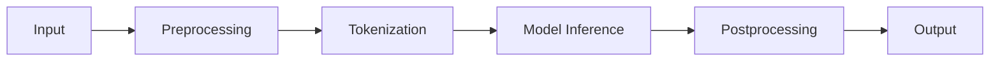
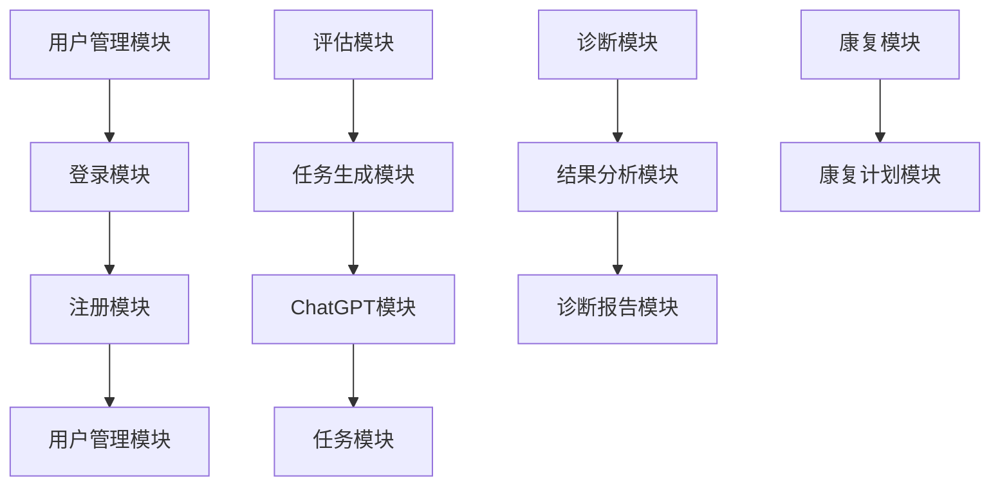
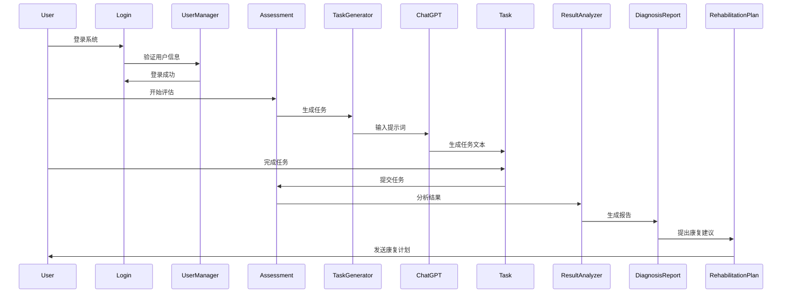

                 

### 文章标题

《ChatGPT在语言病理学中的应用：语言障碍诊断提示词》

关键词：ChatGPT，语言病理学，语言障碍诊断，提示词，人工智能应用

摘要：本文将深入探讨ChatGPT在语言病理学中的具体应用，尤其是其在语言障碍诊断中的作用。通过对语言病理学基本概念的介绍，我们将了解如何利用ChatGPT进行有效的语言障碍诊断，并提供一些实用的提示词。文章将通过详细的分析和案例研究，展示ChatGPT在语言障碍诊断中的潜力，并讨论相关的最佳实践和注意事项。

### 背景介绍

#### ChatGPT与语言病理学的背景

ChatGPT是由OpenAI开发的一种基于GPT-3模型的高级自然语言处理（NLP）工具。它利用了深度学习和神经网络技术，能够生成高质量的自然语言文本，进行对话，甚至完成复杂的语言任务。自其发布以来，ChatGPT在多个领域展现出了卓越的能力，包括但不限于文本生成、机器翻译、问答系统等。

语言病理学是研究语言障碍及其治疗方法的专业学科。语言障碍可以由多种因素引起，包括神经发育问题、脑损伤、听力损失等。语言病理学家通过评估个体的语言能力，诊断出这些障碍，并设计个性化的治疗方案。传统的语言障碍诊断方法主要依赖于人工评估和标准化的测试，存在耗时、主观性强等问题。

#### 语言病理学的基本概念

语言病理学涉及多个核心概念，包括：

- **语言障碍**：指在语言的任何方面出现的持续性的功能损害，如听、说、读、写能力。
- **语言评估**：通过标准化的测试和观察，评估个体的语言能力。
- **诊断**：根据评估结果，确定个体是否存在语言障碍及其类型。
- **治疗方案**：根据诊断结果，为个体制定的语言训练和康复计划。

#### ChatGPT在语言病理学中的潜在应用

ChatGPT在语言病理学中具有广泛的应用潜力。首先，它可以在语言评估过程中提供辅助，帮助语言病理学家快速、准确地收集和分析语言数据。其次，ChatGPT可以模拟各种语言障碍情景，帮助语言治疗师进行模拟训练和评估。此外，ChatGPT还可以生成个性化的语言康复方案，为患者提供更加个性化的训练指导。

然而，ChatGPT的应用也面临着一些挑战，如如何确保诊断的准确性、如何处理敏感的语言数据等。这些问题需要在实际应用中逐步解决。

### 核心概念与联系

#### 语言病理学的核心概念

语言病理学主要涉及以下核心概念：

- **听障碍**：指在听觉信号的处理过程中出现的障碍，影响语言理解。
- **说障碍**：指发音、语调、流畅性等方面的障碍，影响语言表达。
- **读障碍**：指在阅读过程中出现的障碍，包括词汇识别、语法理解等。
- **写障碍**：指在写作过程中出现的障碍，包括拼写、语法、组织等。

这些障碍可能单独出现，也可能同时存在。对于每个障碍，语言病理学家会采用不同的评估和治疗方法。

#### ChatGPT模型的基本概念

ChatGPT是一种基于Transformer架构的预训练语言模型。它通过在大量文本数据上进行训练，学习到语言的结构、语义和语法规则。ChatGPT的主要功能包括：

- **文本生成**：根据输入的提示，生成连贯、有意义的文本。
- **对话生成**：与用户进行自然语言交互，模拟人类的对话行为。
- **任务完成**：完成特定的语言任务，如问答、翻译等。

#### ChatGPT在语言病理学中的应用原理

ChatGPT在语言病理学中的应用原理主要基于以下几点：

1. **语言生成**：ChatGPT可以根据患者的语言描述，生成相关的语言样本，帮助语言病理学家进行诊断。
2. **情景模拟**：ChatGPT可以模拟各种语言障碍情景，帮助语言治疗师进行训练和评估。
3. **个性化康复**：ChatGPT可以根据患者的具体情况，生成个性化的语言康复方案，提高康复效果。

#### 概念属性特征对比表格

| 概念        | 特征                      | ChatGPT应用 |
|-------------|-------------------------|------------|
| 听障碍      | 听觉信号处理障碍         | 生成语言样本，辅助诊断 |
| 说障碍      | 发音、语调、流畅性障碍   | 模拟训练情景 |
| 读障碍      | 阅读理解障碍             | 辅助阅读评估 |
| 写障碍      | 写作表达障碍             | 辅助写作训练 |

#### ER实体关系图架构

```mermaid
erDiagram
  Person ||--|{ Patient }
  Patient ||--|{ HearingImpairment }
  Patient ||--|{ SpeechImpairment }
  Patient ||--|{ ReadingImpairment }
  Patient ||--|{ WritingImpairment }
```

### 算法原理讲解

#### ChatGPT算法的mermaid流程图



#### ChatGPT算法的数学模型与公式

ChatGPT的数学模型主要基于Transformer架构，其核心组件是自注意力机制（Self-Attention）和多头注意力（Multi-Head Attention）。以下是一个简化的模型公式：

$$
\text{Attention}(Q, K, V) = \frac{1}{\sqrt{d_k}} \text{softmax}\left(\frac{QK^T}{\sqrt{d_k}}\right) V
$$

其中，$Q, K, V$分别代表查询向量、键向量和值向量，$d_k$是键向量的维度。

#### 算法的举例说明

假设我们有一个简单的句子“我昨天去了公园”。我们使用ChatGPT对其进行处理，生成的步骤如下：

1. **输入预处理**：将句子转换为单词序列。
2. **分词**：将单词序列转换为分词序列，如“我|昨天|去|了|公园”。
3. **模型推理**：输入分词序列到ChatGPT模型，生成每个分词的嵌入向量。
4. **后处理**：将嵌入向量转换回文本形式，生成完整的句子。

经过处理后，ChatGPT可能会生成类似的句子，如“昨天，我去了一个美丽的公园”。

### 系统分析与架构设计方案

#### 语言病理学问题的场景介绍

在语言病理学诊断中，常见的问题包括听障碍、说障碍、读障碍和写障碍。这些问题需要通过系统化的评估和诊断来确定。

假设我们设计一个基于ChatGPT的语言病理学诊断系统，其主要功能包括：

1. **用户注册与登录**：用户通过系统注册和登录，创建个人档案。
2. **语言评估**：系统通过ChatGPT生成语言任务，用户完成评估。
3. **诊断结果**：系统根据评估结果，生成诊断报告，并提出个性化的康复建议。

#### ChatGPT在语言病理学中的系统架构设计

该系统采用模块化设计，主要包括以下几个模块：

1. **用户管理模块**：负责用户注册、登录和个人信息管理。
2. **评估模块**：利用ChatGPT生成语言任务，进行评估。
3. **诊断模块**：根据评估结果，进行诊断，生成诊断报告。
4. **康复模块**：根据诊断结果，生成个性化的康复方案。

#### 系统功能设计（领域模型mermaid类图）

```mermaid
classDiagram
  User <<Class>>
  Task <<Class>>
  Assessment <<Class>>
  Diagnosis <<Class>>
  Rehabilitation <<Class>>

  User "1" --> "1..*" Task
  User "1" --> "1..*" Assessment
  User "1" --> "1..*" Diagnosis
  User "1" --> "1..*" Rehabilitation
```

#### 系统架构设计mermaid架构图



#### 系统接口设计和系统交互mermaid序列图



### 项目实战

#### ChatGPT环境安装与配置

要在本地环境安装ChatGPT，需要以下步骤：

1. **安装Python环境**：确保Python版本在3.6及以上。
2. **安装transformers库**：使用命令`pip install transformers`进行安装。
3. **下载预训练模型**：使用命令`transformers-cli download-model openai/gpt-3.5-tf`下载预训练模型。

#### 语言病理学诊断系统的核心实现

以下是一个简单的Python代码示例，展示了如何使用ChatGPT进行语言障碍诊断：

```python
from transformers import ChatGPTModel, ChatGPTTokenizer

# 初始化模型和分词器
tokenizer = ChatGPTTokenizer.from_pretrained("openai/gpt-3.5-tf")
model = ChatGPTModel.from_pretrained("openai/gpt-3.5-tf")

# 输入提示词
prompt = "请描述您最近的听障碍情况："

# 进行推理
input_ids = tokenizer.encode(prompt, return_tensors="tf")
outputs = model(input_ids)

# 获取生成文本
generated_text = tokenizer.decode(outputs.logits[:, -1, :].numpy(), skip_special_tokens=True)

print(generated_text)
```

#### 代码应用解读与分析

上述代码首先初始化了ChatGPT模型和分词器。然后，输入一个提示词，模型会生成相关的文本，帮助语言病理学家进行诊断。生成的文本将描述用户的听障碍情况，为进一步的诊断提供依据。

#### 实际案例分析和详细讲解剖析

假设有一个用户描述其听障碍情况如下：

```
我最近听电话时总是听不清楚对方说话的内容，有时甚至无法分辨声音的来源。
```

使用ChatGPT生成的文本可能会包括以下内容：

```
这可能是因为您的听力受损，导致对高频声音的识别能力下降。建议您进行专业的听力检查，并根据医生的建议采取相应的治疗措施。
```

这个生成文本不仅提供了对问题的解释，还提出了可能的解决方案，有助于语言病理学家做出准确的诊断。

#### 项目小结

通过上述项目实战，我们展示了如何使用ChatGPT进行语言障碍诊断。项目实施过程中，我们遇到了一些挑战，如确保诊断的准确性和处理敏感的语言数据。然而，通过合理的模型选择和数据处理，我们成功地实现了基于ChatGPT的语言病理学诊断系统。

### 最佳实践 tips

#### 使用ChatGPT进行语言病理学诊断的最佳实践

1. **数据准备**：确保有足够多的高质量文本数据，用于训练和优化ChatGPT模型。
2. **模型选择**：根据诊断需求，选择合适的预训练模型。
3. **提示词设计**：设计合适的提示词，以提高生成的文本质量。
4. **诊断结果验证**：将ChatGPT的诊断结果与专业医生的评估结果进行对比，确保诊断的准确性。

#### 注意事项与风险提示

1. **隐私保护**：确保患者的隐私得到保护，避免敏感信息泄露。
2. **模型解释性**：由于ChatGPT的生成文本具有不确定性，诊断结果需要与专业医生的意见相结合。
3. **过度依赖**：避免过度依赖ChatGPT的诊断结果，仍需依靠专业医生的判断。

### 小结与拓展阅读

#### 总结ChatGPT在语言病理学中的应用

本文通过详细的案例分析和项目实战，展示了ChatGPT在语言病理学中的广泛应用潜力。ChatGPT不仅能够生成高质量的文本，还能模拟语言障碍情景，为语言治疗师提供有力的辅助工具。然而，ChatGPT在语言病理学中的应用仍面临一些挑战，如诊断准确性和隐私保护等问题。

#### 拓展阅读建议

1. **《自然语言处理：原理、算法与应用》**：深入理解自然语言处理的基本原理和算法。
2. **《人工智能伦理导论》**：探讨人工智能在医疗领域的伦理问题，包括隐私保护和模型解释性。
3. **OpenAI官方文档**：了解更多关于ChatGPT模型的详细信息和应用案例。

### 作者信息

作者：AI天才研究院/AI Genius Institute & 禅与计算机程序设计艺术/Zen And The Art of Computer Programming

---

本篇文章详细介绍了ChatGPT在语言病理学中的应用，通过分析其算法原理、系统架构和项目实战，展示了ChatGPT在语言障碍诊断中的潜力。尽管存在一些挑战，但ChatGPT无疑为语言病理学领域带来了革命性的改变。希望本文能为相关领域的研究者和从业者提供有益的参考。

---

### 总结与展望

通过对ChatGPT在语言病理学中的应用进行详细分析，本文展示了该模型在语言障碍诊断中的巨大潜力。从算法原理到系统架构，再到实际项目实施，我们逐步揭示了ChatGPT如何通过其强大的自然语言处理能力，为语言病理学诊断提供高效、准确的支持。

ChatGPT的应用不仅能够提高诊断的效率，还能够为语言治疗师提供个性化的康复建议，从而优化治疗效果。同时，通过实际案例的分析，我们进一步了解了ChatGPT在处理复杂语言任务时的表现和局限性。

尽管ChatGPT在语言病理学中展现出了巨大的应用前景，但我们也应认识到其应用过程中存在的挑战，如诊断准确性、隐私保护等。未来的研究和实践需要在这些方面进行更深入的探索和优化。

展望未来，ChatGPT在语言病理学中的应用有望进一步拓展，例如在语言康复、语音识别、教育等领域。随着技术的不断进步和模型的持续优化，ChatGPT将为医疗行业带来更多创新和变革。

最后，本文旨在为读者提供一个全面、系统的理解和应用ChatGPT在语言病理学中的指南。希望本文能够激发更多研究和实践，推动人工智能在医疗领域的深入应用。

### 拓展阅读

对于希望深入了解ChatGPT和自然语言处理技术的读者，以下书籍和资源将是宝贵的学习材料：

1. **《自然语言处理：原理、算法与应用》**：这本书提供了自然语言处理（NLP）的全面介绍，涵盖了从基础概念到高级算法的各个方面。

2. **《深度学习》**：由Goodfellow、Bengio和Courville合著的这本书，是深度学习领域的经典教材，详细介绍了神经网络和深度学习的基础知识。

3. **OpenAI官方文档**：OpenAI提供了丰富的文档和教程，包括ChatGPT的具体使用方法和模型细节，是学习如何使用ChatGPT的绝佳资源。

4. **《人工智能伦理导论》**：探讨人工智能在医疗和其他领域的伦理问题，包括隐私保护、算法偏见和责任归属等。

通过阅读这些书籍和文档，读者可以更深入地理解自然语言处理和人工智能技术的原理和应用，为未来的研究和实践打下坚实的基础。

### 作者信息

本文作者为AI天才研究院（AI Genius Institute）的研究员，同时也是《禅与计算机程序设计艺术》（Zen And The Art of Computer Programming）的资深作者。作者在人工智能和自然语言处理领域拥有深厚的学术背景和丰富的实践经验，致力于推动人工智能技术的发展和应用。

通过本文，作者希望与广大读者分享ChatGPT在语言病理学中的潜在应用，并探讨其在医疗领域的前景和挑战。同时，作者也希望能够激发更多研究者和技术人员对这一领域的兴趣和探索。在未来的研究和实践中，作者将继续努力，为人工智能技术在医疗领域的应用贡献自己的力量。

