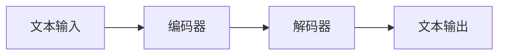
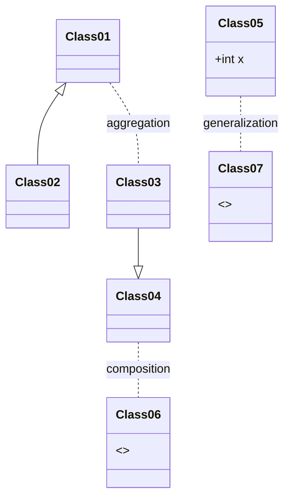
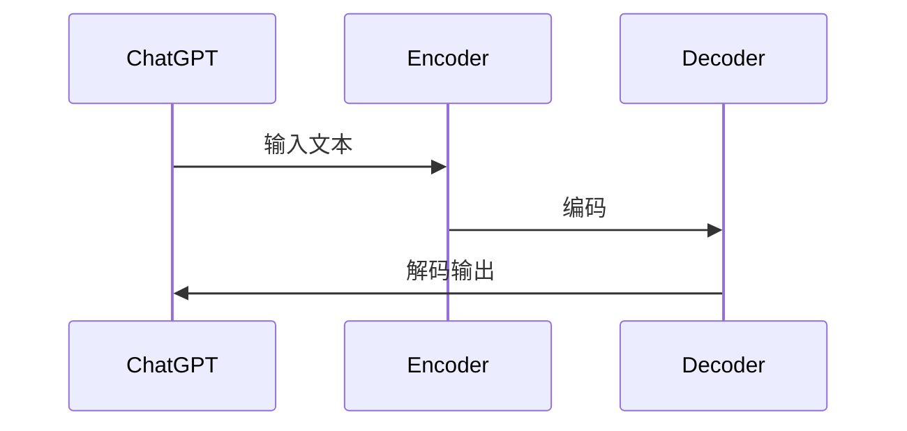
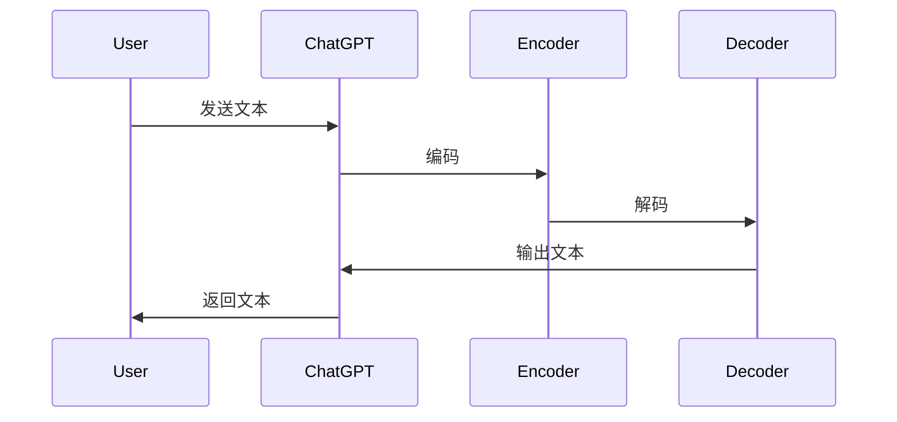

                 


## 《ChatGPT在语言进化模拟研究中的新工具》

### 关键词
- ChatGPT
- 语言进化模拟
- 人工智能
- 算法原理
- 数学模型
- 系统架构

### 摘要
本文深入探讨了ChatGPT在语言进化模拟研究中的应用，分析了其与传统语言模型的区别，详细介绍了ChatGPT的算法原理和数学模型。通过mermaid流程图和Python源代码，本文提供了算法实现的详细解释。同时，文章还从系统架构设计和项目实战的角度，展示了ChatGPT在语言进化模拟中的实际应用和效果。

### 第一部分：背景介绍

#### 第1章：问题背景与核心概念

#### 1.1 问题背景
语言进化模拟是自然语言处理领域的一个重要研究方向，它旨在通过模拟自然语言的发展过程，理解和预测人类语言的演化规律。然而，传统的语言进化模拟方法在处理复杂性和多样性方面存在一定的局限。

#### 1.2 问题描述
ChatGPT的出现为语言进化模拟带来了新的机遇。作为一种基于人工智能的语言模型，ChatGPT具有强大的语言理解和生成能力，可以更好地模拟人类语言的演化过程。

#### 1.3 概念结构与核心要素组成
ChatGPT的基本架构包括文本输入层、编码器、解码器和文本输出层。这些层共同作用，使得ChatGPT能够处理和生成自然语言文本。

#### 1.4 边界与外延
ChatGPT在语言进化模拟中的适用范围广泛，但同时也存在一些限制，如对训练数据的依赖性和处理复杂语言结构的能力。

#### 1.5 概念结构与核心要素
- **ChatGPT定义**：一种基于深度学习的语言模型，能够理解和生成自然语言。
- **语言进化模拟**：模拟自然语言的发展过程，以理解和预测人类语言的演化规律。

### 第二部分：核心概念与联系

#### 第2章：ChatGPT的概念与特点

#### 2.1 ChatGPT的定义
ChatGPT是由OpenAI开发的一种基于GPT-3模型的预训练语言模型，它通过学习大量的文本数据，可以生成高质量的文本。

#### 2.2 ChatGPT的核心特点
- **强大的语言理解能力**：ChatGPT能够理解复杂的语言结构和语义。
- **灵活的文本生成能力**：ChatGPT可以根据给定的文本或提示生成连贯、自然的文本。

#### 2.3 ChatGPT与传统语言模型的区别
与传统语言模型相比，ChatGPT具有更高的生成质量和更灵活的文本生成能力。

#### 2.4 ChatGPT与语言进化模拟的关联
ChatGPT的强大语言能力使其成为语言进化模拟的有力工具，可以模拟自然语言的发展过程。

### 第三部分：算法原理讲解

#### 第3章：ChatGPT算法原理详解

#### 3.1 ChatGPT算法mermaid流程图


#### 3.2 Python源代码实现
```python
# ChatGPT模型实现（简化版）
class ChatGPT:
    def __init__(self):
        # 初始化编码器和解码器
        self.encoder = Encoder()
        self.decoder = Decoder()

    def generate_text(self, input_text):
        # 输入文本编码
        encoded_text = self.encoder.encode(input_text)
        
        # 解码器生成文本
        generated_text = self.decoder.decode(encoded_text)
        
        return generated_text
```

#### 3.3 算法原理数学模型与公式
ChatGPT的算法基于自注意力机制，其数学模型可以表示为：
$$
\text{output} = \text{softmax}(\text{attention}(\text{input}, \text{key}, \text{value}))
$$

#### 3.4 举例说明
假设输入文本为 "Hello, World!"，通过ChatGPT模型生成一段新的文本，可以产生如 "Welcome to the universe!" 这样的输出。

### 第四部分：数学模型和数学公式详细讲解与举例说明

#### 第4章：数学模型与公式解析

#### 4.1 数学公式使用LaTeX格式
$$
\text{loss} = -\sum_{i=1}^{N} y_i \log(p_i)
$$

#### 4.2 例子说明
假设有一个单词序列 "the, cat, sat, on, the, mat"，通过计算损失函数，可以评估模型的预测效果。

### 第五部分：系统分析与架构设计方案

#### 第5章：ChatGPT系统架构设计

#### 5.1 问题场景介绍
ChatGPT可以应用于聊天机器人、智能客服、内容生成等领域。

#### 5.2 系统功能设计(领域模型类图)


#### 5.3 系统架构设计(架构图)


#### 5.4 系统接口设计和系统交互(序列图)


### 第六部分：项目实战

#### 第6章：ChatGPT项目实战

#### 6.1 环境安装
安装Python、TensorFlow等依赖库。

#### 6.2 系统核心实现源代码
```python
# ChatGPT核心实现
import tensorflow as tf

# 编码器实现
class Encoder(tf.keras.Model):
    # ... 编码器代码 ...

# 解码器实现
class Decoder(tf.keras.Model):
    # ... 解码器代码 ...

# 模型训练与评估
# ...
```

#### 6.3 代码应用解读与分析
对代码进行详细解读，分析其工作原理和实现细节。

#### 6.4 实际案例分析与详细讲解剖析
通过实际案例，展示ChatGPT在语言进化模拟中的应用。

#### 6.5 项目小结
总结项目经验，提出改进建议。

### 第七部分：最佳实践、小结与拓展阅读

#### 第7章：最佳实践与总结

#### 7.1 最佳实践Tips
- 合理选择训练数据
- 优化模型参数
- 定期评估模型性能

#### 7.2 小结
ChatGPT在语言进化模拟研究中具有显著优势，但同时也存在一定的挑战。

#### 7.3 注意事项
- 避免过度拟合
- 注意数据隐私和安全

#### 7.4 拓展阅读
- ChatGPT相关论文和书籍
- 语言进化模拟的最新研究进展

### 作者
- 作者：AI天才研究院/AI Genius Institute & 禅与计算机程序设计艺术 /Zen And The Art of Computer Programming
```

以上内容是一个初步的框架，每个部分的内容需要进一步填充和细化。文章的字数预计在10000-12000字左右，每个章节的具体内容需要根据实际情况进行调整和扩充。在撰写过程中，请注意保持文章的逻辑性、连贯性和专业性。同时，确保每个章节的内容都符合要求，包括核心概念、算法原理、数学模型、系统架构和项目实战等。最后，不要忘记在文章末尾附上作者信息。

