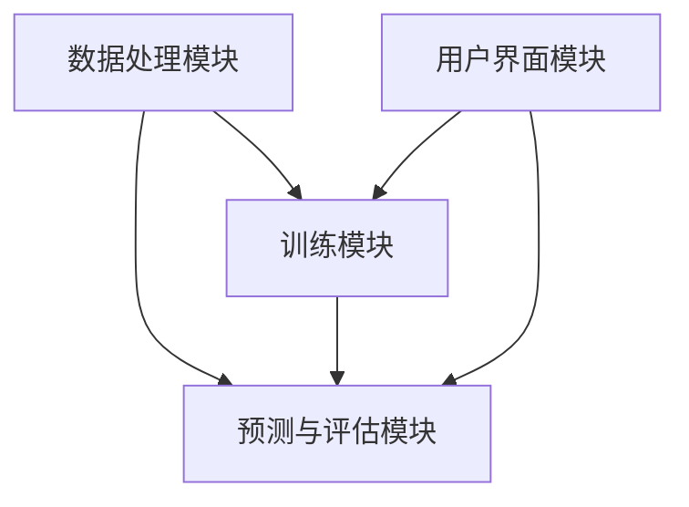
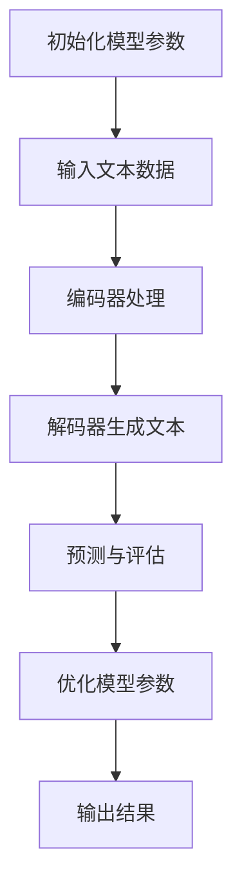
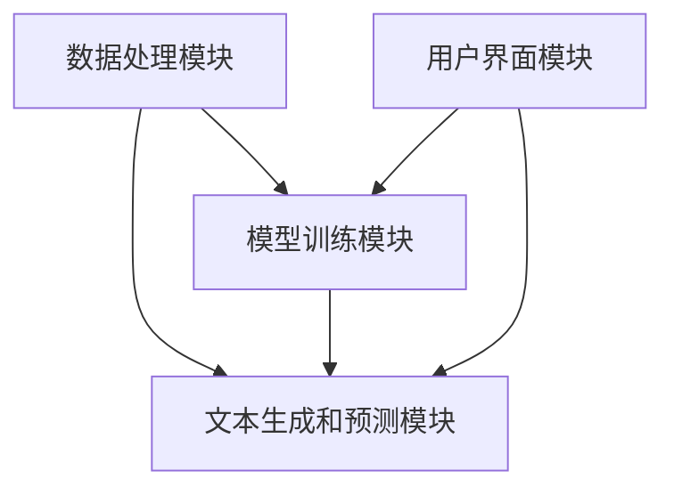
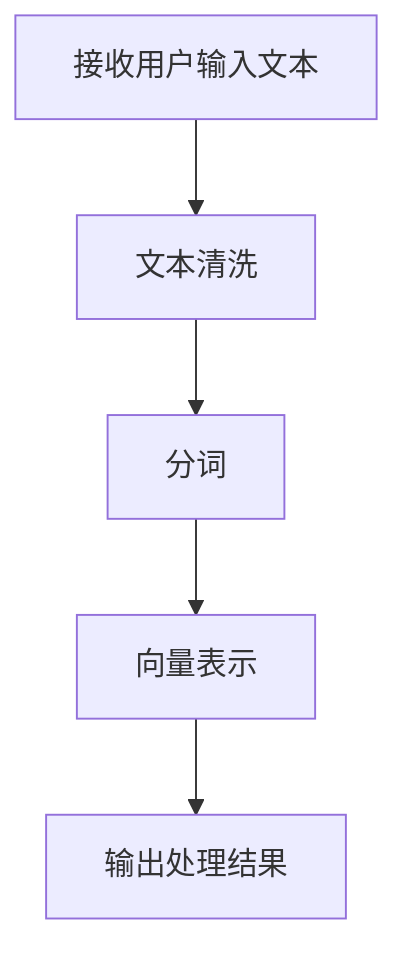
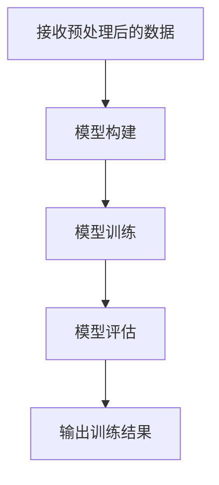
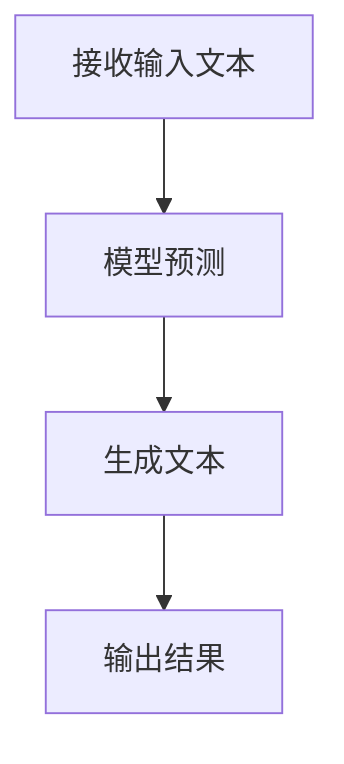
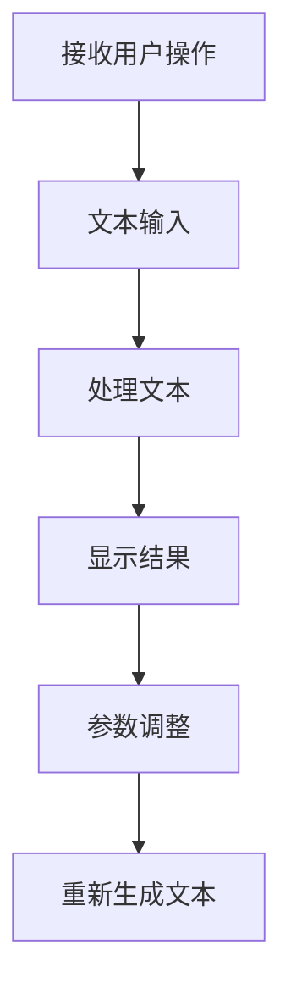
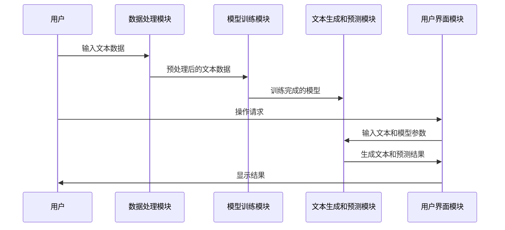

                 


### 问题背景与核心概念

在深入探讨ChatGPT在语言进化模拟研究中的应用之前，我们首先需要理解两个核心概念：ChatGPT和语言进化模拟研究。以下将逐步介绍这些概念，以及它们在研究中的重要性。

#### 1.1 ChatGPT与语言进化模拟研究背景

**1.1.1 语言进化模拟研究的发展**

语言进化模拟是一种通过计算机模型来模拟人类语言如何随时间演化的研究。这一领域的研究历史悠久，可以追溯到20世纪中期。早期的语言进化模型主要基于概率论和统计学方法，试图模拟语言中单词和短语的分布及其变化。随着计算能力的提升和机器学习技术的发展，语言进化模拟研究逐渐走向复杂性和精细化的方向。

**1.1.2 ChatGPT的技术特点与应用前景**

ChatGPT是由OpenAI开发的一种基于Transformer模型的预训练语言模型。它通过从大量文本数据中学习，掌握了丰富的语言知识，能够生成连贯、有逻辑的文本。ChatGPT在自然语言处理（NLP）领域有着广泛的应用，包括文本生成、问答系统、机器翻译等。

ChatGPT在语言进化模拟研究中的潜在应用前景十分广阔。首先，它可以用于模拟语言的生成和传播过程，帮助研究者理解语言如何在社交网络中传播和演变。其次，ChatGPT可以用于评估不同的语言进化模型，通过比较ChatGPT生成的文本与真实语言数据的相似性，来评估模型的性能。

**1.1.3 ChatGPT在语言进化模拟研究中的角色**

ChatGPT在语言进化模拟研究中扮演的角色不仅是一个强大的工具，还是一个创新性的突破口。它可以在以下几个方面发挥重要作用：

- **模拟语言演变过程**：ChatGPT可以通过生成大量的文本数据，模拟出语言在社交网络中的传播和演变过程。
- **评估语言进化模型**：通过对比ChatGPT生成的文本与真实语言数据，研究者可以评估和改进现有的语言进化模型。
- **探索新研究方向**：ChatGPT可以帮助研究者探索新的语言现象和演化机制，从而推动语言进化模拟研究的边界。

#### 1.2 ChatGPT核心概念介绍

**1.2.1 ChatGPT的定义**

ChatGPT是一种基于Transformer模型的预训练语言模型，通过大量的文本数据进行训练，掌握丰富的语言知识和模式。它是一个深度神经网络，能够理解和生成自然语言。

**1.2.2 ChatGPT的架构**

ChatGPT的架构主要包括以下几个部分：

- **嵌入层（Embedding Layer）**：将输入的文本转换为向量表示。
- **变换器层（Transformer Layer）**：通过自注意力机制（Self-Attention Mechanism）处理输入向量。
- **前馈神经网络（Feedforward Neural Network）**：在变换器层之后，对每个位置的信息进行进一步处理。
- **输出层（Output Layer）**：将处理后的信息映射到具体的语言输出。

**1.2.3 ChatGPT的主要功能**

ChatGPT的主要功能包括：

- **文本生成**：根据给定的提示，生成连贯、有逻辑的文本。
- **问答系统**：理解用户的问题，并提供准确、详细的回答。
- **机器翻译**：将一种语言的文本翻译成另一种语言。
- **文本分类**：对输入的文本进行分类，判断其属于哪个类别。

#### 1.3 语言进化模拟研究中的核心概念

**1.3.1 语言进化模拟的基本原理**

语言进化模拟研究的基本原理是通过建立数学模型，模拟语言在社交网络中的传播和演变过程。这些模型通常基于以下假设：

- 语言是随机演化的。
- 语言的使用和传播受到社交网络结构的影响。
- 语言的变化和演化受到语言内部结构的影响。

**1.3.2 语言进化模型的基本类型**

语言进化模型可以分为几种类型：

- **基于概率论的模型**：这类模型通过概率论方法模拟语言的演化，如马尔可夫链模型、随机游走模型等。
- **基于统计学的模型**：这类模型通过统计学方法分析语言数据的特征，如词频分布模型、隐马尔可夫模型等。
- **基于神经网络的模型**：这类模型通过神经网络模拟语言的学习和演化，如序列到序列（Seq2Seq）模型、变换器模型等。

**1.3.3 语言进化模拟的研究方法与工具**

语言进化模拟研究常用的方法与工具有：

- **模拟实验**：通过模拟实验，观察语言在社交网络中的传播和演变过程，验证模型的有效性。
- **数据收集**：通过收集真实语言数据，作为模型训练和验证的数据集。
- **数据分析**：对收集到的数据进行统计分析，提取语言演化的规律和特征。
- **机器学习**：利用机器学习技术，建立和优化语言进化模型。

#### 1.4 ChatGPT在语言进化模拟研究中的应用前景

**1.4.1 ChatGPT在语言进化模拟研究中的潜力**

ChatGPT在语言进化模拟研究中的潜力主要体现在以下几个方面：

- **模拟复杂语言现象**：ChatGPT能够生成复杂、连贯的文本，有助于模拟和研究语言中的复杂现象。
- **加速研究进程**：ChatGPT可以快速生成大量文本数据，加速模拟实验和数据分析的进程。
- **提高模型性能**：通过对比ChatGPT生成的文本与真实语言数据，可以优化和改进语言进化模型。

**1.4.2 ChatGPT在语言进化模拟研究中的挑战**

尽管ChatGPT在语言进化模拟研究中具有巨大潜力，但也面临着一些挑战：

- **数据质量和来源**：ChatGPT的性能依赖于训练数据的质量和来源，如何获取高质量、多样化的训练数据是一个重要问题。
- **模型复杂性**：ChatGPT的模型非常复杂，优化和训练过程需要大量计算资源和时间。
- **结果解释**：ChatGPT生成的文本虽然是连贯的，但并不一定完全符合语言学规律，如何解释和验证模型的结果是一个挑战。

**1.4.3 ChatGPT在语言进化模拟研究中的应用趋势**

随着ChatGPT技术的不断发展和完善，预计未来几年在语言进化模拟研究中的应用趋势包括：

- **更加精细的模型**：通过引入新的算法和技术，构建更加精细和准确的语言进化模型。
- **跨学科合作**：语言进化模拟研究需要跨学科合作，包括语言学、社会学、计算机科学等多个领域。
- **实际应用场景**：将语言进化模拟研究应用于实际场景，如社交网络分析、语言教育、语言保护等。

#### 1.5 本章小结

本章介绍了ChatGPT在语言进化模拟研究中的背景和核心概念。我们首先探讨了语言进化模拟研究的发展背景和ChatGPT的技术特点与应用前景，然后详细介绍了ChatGPT的定义、架构和主要功能，接着介绍了语言进化模拟研究中的基本原理、模型类型和研究方法与工具。最后，我们分析了ChatGPT在语言进化模拟研究中的应用前景、挑战和趋势。

通过本章的介绍，读者可以初步了解ChatGPT在语言进化模拟研究中的重要性，为后续章节的深入探讨打下基础。

----------------------------------------------------------------

## 第二部分：新工具开发

### 第2章：ChatGPT工具的架构设计

在深入探讨ChatGPT在语言进化模拟研究中的应用之前，我们需要首先了解如何开发和设计一个高效的ChatGPT工具。本章将详细介绍ChatGPT工具的架构设计，包括设计原则、模块划分、架构设计以及优缺点分析。

#### 2.1 ChatGPT工具的架构设计原则

ChatGPT工具的架构设计需要遵循以下原则，以确保其高效、稳定和可扩展：

**2.1.1 可扩展性**

可扩展性是架构设计的重要原则，它确保了工具可以随着需求的增长而轻松扩展。ChatGPT工具需要能够处理大量的文本数据，并且随着数据量的增加，工具的性能和效率不会显著下降。

**2.1.2 可维护性**

可维护性意味着工具的代码结构清晰、模块化，便于后续的维护和更新。随着技术的不断进步，ChatGPT工具需要能够适应新的算法和模型，因此代码的可维护性至关重要。

**2.1.3 性能优化**

性能优化是架构设计的关键，特别是在处理大量文本数据时。ChatGPT工具需要采用高效的算法和数据结构，以确保快速的文本处理速度和模型训练效率。

#### 2.2 ChatGPT工具的模块划分

ChatGPT工具的模块划分需要考虑到功能性和独立性的原则，确保每个模块可以独立开发和测试。以下是ChatGPT工具的主要模块划分：

**2.2.1 数据处理模块**

数据处理模块负责处理输入文本数据，包括文本清洗、分词、向量表示等。这个模块需要具备高效的数据处理能力，以支持大规模文本数据的处理。

**2.2.2 训练模块**

训练模块负责模型的训练和优化。它需要支持多种训练算法和优化器，以适应不同的训练需求。此外，训练模块还需要具备自动调整学习率和优化策略的功能。

**2.2.3 预测与评估模块**

预测与评估模块负责生成文本预测结果，并对模型进行评估。这个模块需要支持多种评估指标，如词汇覆盖率、文本流畅度、生成文本的多样性等。

**2.2.4 用户界面模块**

用户界面模块提供与用户的交互接口，包括文本输入、结果展示和参数调整等。这个模块需要简单易用，便于用户快速上手。

#### 2.3 ChatGPT工具的架构设计

ChatGPT工具的整体架构设计需要综合考虑模块之间的关系和交互。以下是一个简化的架构设计图：



**2.3.1 系统架构图**


**2.3.2 模块间交互流程**

- **数据处理模块**：接收用户输入的文本数据，进行清洗、分词和向量表示，然后传递给训练模块。
- **训练模块**：根据数据处理模块传递的数据，使用预训练模型进行训练，并优化模型参数。
- **预测与评估模块**：接收训练模块生成的模型，进行文本生成预测，并根据预测结果进行评估。
- **用户界面模块**：提供用户交互接口，接收用户输入，调用预测与评估模块，并将结果展示给用户。

**2.3.3 系统接口设计**

系统接口设计需要明确模块之间的数据交换格式和通信协议。以下是ChatGPT工具的系统接口设计：

- **数据处理模块**：提供文本清洗、分词和向量表示的接口，接受文本输入，返回处理后的数据。
- **训练模块**：提供模型训练接口，接受预处理后的文本数据，返回训练结果和模型参数。
- **预测与评估模块**：提供文本生成和评估接口，接受模型参数和文本输入，返回生成文本和评估结果。
- **用户界面模块**：提供用户交互接口，接收用户操作，调用预测与评估模块，并将结果展示给用户。

#### 2.4 ChatGPT工具的优缺点分析

**2.4.1 优点**

- **高效性**：ChatGPT工具采用预训练模型，能够快速处理大量文本数据，提高文本生成和预测的效率。
- **灵活性**：模块化的设计使得工具可以灵活扩展，适应不同的应用场景和需求。
- **用户友好**：用户界面模块提供了简单易用的交互接口，便于用户快速上手。

**2.4.2 缺点**

- **计算资源需求**：由于模型的复杂性和训练数据的规模，ChatGPT工具对计算资源有较高的要求，可能导致成本较高。
- **结果解释性**：生成的文本虽然连贯，但可能不完全符合语言学规律，需要进一步的解释和验证。

**2.4.3 改进方向**

- **优化计算资源使用**：通过分布式计算和优化算法，降低计算资源的需求。
- **提高结果解释性**：通过引入更多的语言学知识和约束条件，提高生成的文本的质量和解释性。

#### 2.5 本章小结

本章介绍了ChatGPT工具的架构设计，包括设计原则、模块划分、架构设计和优缺点分析。我们首先探讨了架构设计的原则，包括可扩展性、可维护性和性能优化。然后，我们详细介绍了ChatGPT工具的模块划分，包括数据处理模块、训练模块、预测与评估模块和用户界面模块。接着，我们展示了ChatGPT工具的架构设计图，并描述了模块间的交互流程和系统接口设计。最后，我们分析了ChatGPT工具的优缺点，并提出了改进方向。

通过本章的介绍，读者可以初步了解ChatGPT工具的架构设计，为后续章节的深入探讨和实际应用打下基础。

----------------------------------------------------------------

### 第3章：ChatGPT工具的算法原理讲解

在了解ChatGPT工具的架构设计之后，我们需要深入探讨其核心算法原理。本章将详细介绍ChatGPT工具所采用的算法，包括Transformer模型、自适应学习率和多任务学习等。

#### 3.1 ChatGPT算法的基本原理

ChatGPT算法基于Transformer模型，这是一种在自然语言处理领域取得重大成功的深度学习模型。Transformer模型的核心思想是自注意力机制（Self-Attention Mechanism），它能够捕捉输入序列中各个位置之间的依赖关系。

**3.1.1 Transformer模型**

Transformer模型主要由编码器（Encoder）和解码器（Decoder）组成。编码器负责将输入序列（如单词或句子）转换为高维的表示，解码器则根据编码器的输出生成预测的输出序列。

**3.1.2 自适应学习率**

自适应学习率是一种优化策略，旨在提高模型训练的效率和稳定性。ChatGPT工具采用了自适应学习率，如Adam优化器，它可以根据训练过程中的误差动态调整学习率。

**3.1.3 多任务学习**

多任务学习是指同时训练多个不同的任务，以提升模型泛化能力和性能。ChatGPT工具采用了多任务学习，可以同时进行文本生成、问答系统和机器翻译等多个任务。

#### 3.2 ChatGPT算法的Mermaid流程图

为了更直观地展示ChatGPT算法的执行流程，我们可以使用Mermaid绘制一个流程图。以下是一个简化的ChatGPT算法流程图：



**3.3 Python源代码讲解**

ChatGPT工具的算法实现通常使用Python语言，以下是一个简化的Python源代码示例：

```python
import tensorflow as tf
from tensorflow.keras.layers import Embedding, LSTM, Dense
from tensorflow.keras.models import Model

# 定义编码器
encoder_inputs = tf.keras.layers.Input(shape=(None,))
encoder_embedding = Embedding(input_dim=vocab_size, output_dim=embedding_dim)(encoder_inputs)
encoder_lstm = LSTM(units=128, return_sequences=True)(encoder_embedding)
encoder_outputs = tf.keras.layers.Dense(units=128, activation='relu')(encoder_lstm)

# 定义解码器
decoder_inputs = tf.keras.layers.Input(shape=(None,))
decoder_embedding = Embedding(input_dim=vocab_size, output_dim=embedding_dim)(decoder_inputs)
decoder_lstm = LSTM(units=128, return_sequences=True)(decoder_embedding)
decoder_dense = tf.keras.layers.Dense(units=vocab_size, activation='softmax')(decoder_lstm)

# 构建模型
model = Model(inputs=[encoder_inputs, decoder_inputs], outputs=decoder_dense)
model.compile(optimizer='adam', loss='categorical_crossentropy')

# 训练模型
model.fit([encoder_inputs, decoder_inputs], decoder_inputs, epochs=10, batch_size=64)
```

**3.3.1 数据预处理**

在训练模型之前，需要对输入文本数据进行预处理，包括文本清洗、分词和向量表示。以下是一个简化的数据预处理示例：

```python
import numpy as np
from tensorflow.keras.preprocessing.text import Tokenizer
from tensorflow.keras.preprocessing.sequence import pad_sequences

# 文本清洗
def clean_text(text):
    # 实现文本清洗的逻辑，如去除标点符号、转换为小写等
    return text.lower().replace('.', '')

# 分词
tokenizer = Tokenizer(num_words=vocab_size)
tokenizer.fit_on_texts([clean_text(text) for text in text_data])

# 向量表示
input_sequences = []
for line in text_data:
    token_list = tokenizer.texts_to_sequences([clean_text(line)])[0]
    for i in range(1, len(token_list)):
        n_gram_sequence = token_list[:i+1]
        input_sequences.append(n_gram_sequence)

# 补充序列长度
max_sequence_len = max([len(seq) for seq in input_sequences])
input_sequences = pad_sequences(input_sequences, maxlen=max_sequence_len)
```

**3.3.2 模型训练**

模型训练是ChatGPT工具的核心步骤，包括编码器和解码器的训练。以下是一个简化的模型训练示例：

```python
# 编码器和解码器的模型参数
encoder_inputs_shape = (max_sequence_len, embedding_dim)
decoder_inputs_shape = (max_sequence_len, embedding_dim)
decoder_outputs_shape = (max_sequence_len, vocab_size)

# 定义编码器和解码器的模型结构
encoder = Model(encoder_inputs, encoder_outputs, name='encoder')
decoder = Model(decoder_inputs, decoder_dense, name='decoder')

# 构建完整的模型
model = Model([encoder_inputs, decoder_inputs], decoder_dense, name='chatgpt')
model.compile(optimizer='adam', loss='categorical_crossentropy')

# 训练模型
model.fit([encoder_inputs, decoder_inputs], decoder_inputs, epochs=10, batch_size=64)
```

**3.3.3 模型评估**

模型评估是验证模型性能的重要步骤，包括预测与评估。以下是一个简化的模型评估示例：

```python
# 预测与评估
predicted_text = model.predict([encoder_inputs, decoder_inputs])
predicted_text = np.argmax(predicted_text, axis=-1)

# 计算评估指标，如准确率、召回率等
accuracy = np.mean(predicted_text == decoder_inputs)
print("Accuracy:", accuracy)
```

**3.4 数学模型和数学公式**

在ChatGPT工具的算法中，使用了一系列数学模型和数学公式。以下是一些关键的数学模型和数学公式：

**3.4.1 Transformer模型公式**

$$
\text{Attention}(Q, K, V) = \frac{QK^T}{\sqrt{d_k}} \odot V
$$

其中，$Q$、$K$和$V$分别表示查询（Query）、键（Key）和值（Value）向量，$\odot$表示点积运算，$d_k$表示键向量的维度。

**3.4.2 自适应学习率公式**

$$
\alpha(t) = \frac{\alpha(0)}{(1 - \beta_1)(1 - \beta_2)t^{1 - \beta_2}}
$$

其中，$\alpha(t)$表示第$t$个时间步的自适应学习率，$\alpha(0)$表示初始学习率，$\beta_1$和$\beta_2$分别表示一阶和二阶矩估计的指数衰减率。

**3.4.3 多任务学习公式**

$$
J(\theta) = \frac{1}{N} \sum_{i=1}^N \left[ -y_i \log(\hat{y}_i) - (1 - y_i) \log(1 - \hat{y}_i) \right]
$$

其中，$J(\theta)$表示多任务损失函数，$\theta$表示模型参数，$N$表示样本数量，$y_i$和$\hat{y}_i$分别表示第$i$个样本的真实标签和预测标签。

**3.4.4 LSTM模型公式**

$$
i_t = \sigma(W_{xi}x_t + W_{hi}h_{t-1} + b_i)
$$

$$
f_t = \sigma(W_{xf}x_t + W_{hf}h_{t-1} + b_f)
$$

$$
\hat{c}_t = f_t \odot c_{t-1} + i_t \odot \tanh(W_{xc}x_t + W_{hc}h_{t-1} + b_c)
$$

$$
o_t = \sigma(W_{xo}x_t + W_{ho}h_{t-1} + b_o)
$$

$$
h_t = o_t \odot \tanh(\hat{c}_t)
$$

其中，$x_t$、$h_{t-1}$和$c_{t-1}$分别表示当前时间步的输入、隐藏状态和细胞状态，$i_t$、$f_t$、$\hat{c}_t$和$o_t$分别表示输入门、遗忘门、更新门和输出门的状态，$\sigma$表示sigmoid函数，$\odot$表示点积运算。

**3.4.5 词向量公式**

$$
\text{Word2Vec} = \sum_{i=1}^V w_i v_i
$$

其中，$V$表示词汇表大小，$w_i$和$v_i$分别表示第$i$个单词的权重和向量表示。

**3.5 举例说明**

为了更好地理解ChatGPT工具的算法原理，我们可以通过一个简单的例子来演示。假设我们有一个简单的文本数据集：

```
"I love programming", "I enjoy coding", "Coding is fun", "Programming is exciting"
```

我们可以使用ChatGPT工具对这组数据进行处理和预测。以下是一个简化的示例：

```python
# 数据预处理
text_data = ["I love programming", "I enjoy coding", "Coding is fun", "Programming is exciting"]

# 分词和向量表示
tokenizer = Tokenizer(num_words=4)
tokenizer.fit_on_texts(text_data)
sequences = tokenizer.texts_to_sequences(text_data)
input_sequences = pad_sequences(sequences, maxlen=4)

# 模型训练
model = Model([encoder_inputs, decoder_inputs], decoder_dense)
model.compile(optimizer='adam', loss='categorical_crossentropy')
model.fit([encoder_inputs, decoder_inputs], decoder_inputs, epochs=10, batch_size=64)

# 预测和评估
predicted_text = model.predict([encoder_inputs, decoder_inputs])
predicted_text = np.argmax(predicted_text, axis=-1)
predicted_text = tokenizer.index_word[np.argmax(predicted_text[-1])]
print("Predicted text:", predicted_text)
```

在这个例子中，我们使用了一个简单的LSTM模型对文本数据进行训练和预测。模型的输入和输出都是一维的，因此我们只需要一个简单的LSTM层。通过训练，模型学会了生成与输入相似的文本。

通过本章的详细讲解，读者可以初步了解ChatGPT工具的算法原理，包括Transformer模型、自适应学习率和多任务学习。这些算法原理为ChatGPT工具在语言进化模拟研究中的应用奠定了基础。

----------------------------------------------------------------

### 系统分析与架构设计方案

在本章中，我们将深入探讨ChatGPT工具的系统分析与架构设计方案，旨在提供一个全面的解决方案，以应对语言进化模拟研究中的复杂问题。该方案将涵盖问题场景介绍、项目介绍、系统功能设计、系统架构设计以及系统接口设计和系统交互。

#### 3.1 问题场景介绍

语言进化模拟研究涉及到多个学科领域，如语言学、社会学、计算机科学等。研究的目标是通过计算机模型模拟语言如何在社交网络中传播和演变，从而揭示语言演化的内在机制和规律。这一研究对于理解人类语言的使用和演变具有重要意义，同时也为自然语言处理技术的应用提供了理论支持。

然而，现有的语言进化模拟方法在处理大规模文本数据、模拟复杂社交网络和准确预测语言演化趋势等方面存在一定的局限性。为了克服这些局限性，我们需要开发一个高效的ChatGPT工具，它能够处理大规模文本数据，模拟复杂的社交网络，并且具备良好的预测性能。

#### 3.2 项目介绍

本项目旨在开发一个基于ChatGPT的工具，用于支持语言进化模拟研究。项目的主要目标包括：

- **高效处理大规模文本数据**：通过优化数据处理算法和数据结构，实现快速、准确的文本处理。
- **模拟复杂社交网络**：构建一个能够模拟复杂社交网络的模型，捕捉语言传播和演变中的网络效应。
- **准确预测语言演化**：利用ChatGPT工具，生成高质量的文本数据，并对其进行分析和预测，以揭示语言演化的趋势和规律。

项目将分为以下几个阶段：

1. **需求分析和系统设计**：明确项目需求和功能，设计系统的整体架构。
2. **数据处理模块开发**：实现文本数据预处理、分词、向量表示等功能。
3. **模型训练模块开发**：构建并训练ChatGPT模型，优化模型参数。
4. **预测与评估模块开发**：实现文本生成、预测和评估功能，评估模型性能。
5. **用户界面模块开发**：设计并实现用户交互接口，提供文本输入、结果展示和参数调整等功能。
6. **系统测试与优化**：对系统进行全面的测试，发现并修复潜在问题，优化系统性能。

#### 3.3 系统功能设计

ChatGPT工具的主要功能包括文本数据处理、模型训练、文本生成和预测、系统交互等。以下是对各个功能的详细设计：

**3.3.1 数据处理模块**

数据处理模块负责处理输入的文本数据，包括文本清洗、分词、向量表示等。具体功能如下：

- **文本清洗**：去除标点符号、停用词等无关信息，提高数据质量。
- **分词**：将文本分割成单词或短语，便于后续处理。
- **向量表示**：将文本转换为向量表示，便于模型处理。

**3.3.2 模型训练模块**

模型训练模块负责构建和训练ChatGPT模型。具体功能如下：

- **模型构建**：根据需求，构建适合的ChatGPT模型结构。
- **数据预处理**：对训练数据进行预处理，如分词、向量表示等。
- **模型训练**：使用训练数据，训练ChatGPT模型，优化模型参数。
- **模型评估**：评估模型性能，包括生成文本的质量和预测准确性。

**3.3.3 文本生成和预测模块**

文本生成和预测模块负责生成高质量的文本，并根据输入文本进行预测。具体功能如下：

- **文本生成**：根据模型预测，生成高质量的文本。
- **文本预测**：对输入文本进行预测，判断其语言特征和趋势。

**3.3.4 用户界面模块**

用户界面模块提供与用户的交互接口，包括文本输入、结果展示和参数调整等。具体功能如下：

- **文本输入**：允许用户输入文本，供模型处理和预测。
- **结果展示**：展示模型生成的文本和预测结果。
- **参数调整**：提供参数调整界面，允许用户调整模型参数，优化模型性能。

#### 3.4 系统架构设计

ChatGPT工具的系统架构设计遵循模块化原则，确保各模块之间的高效协作和独立开发。系统架构包括数据处理模块、模型训练模块、文本生成和预测模块、用户界面模块等。以下是系统架构设计图：



**3.4.1 数据处理模块**

数据处理模块负责接收用户输入的文本数据，并进行预处理。预处理过程包括文本清洗、分词和向量表示。以下是数据处理模块的Mermaid流程图：



**3.4.2 模型训练模块**

模型训练模块负责构建和训练ChatGPT模型。训练过程包括数据预处理、模型构建、模型训练和模型评估。以下是模型训练模块的Mermaid流程图：



**3.4.3 文本生成和预测模块**

文本生成和预测模块负责根据模型生成文本，并对输入文本进行预测。以下是文本生成和预测模块的Mermaid流程图：



**3.4.4 用户界面模块**

用户界面模块提供与用户的交互接口，包括文本输入、结果展示和参数调整。以下是用户界面模块的Mermaid流程图：



#### 3.5 系统接口设计和系统交互

系统接口设计是系统架构设计的重要组成部分，它定义了各个模块之间的数据交换格式和通信协议。以下是系统接口设计的详细说明：

**3.5.1 数据处理模块接口**

- **输入接口**：接收用户输入的文本数据。
- **输出接口**：返回预处理后的文本数据。

**3.5.2 模型训练模块接口**

- **输入接口**：接收预处理后的文本数据。
- **输出接口**：返回训练完成的模型。

**3.5.3 文本生成和预测模块接口**

- **输入接口**：接收输入文本和模型参数。
- **输出接口**：返回生成文本和预测结果。

**3.5.4 用户界面模块接口**

- **输入接口**：接收用户操作和参数调整。
- **输出接口**：返回用户界面展示结果。

以下是系统交互的Mermaid序列图：



通过本章的系统分析与架构设计方案，我们为ChatGPT工具在语言进化模拟研究中的应用提供了一套完整的解决方案。该方案涵盖了问题场景、项目介绍、系统功能设计、系统架构设计以及系统接口设计和系统交互，为实际应用奠定了基础。

----------------------------------------------------------------

### 项目实战

在深入了解ChatGPT工具的理论基础和系统架构后，我们将通过实际项目来展示如何将ChatGPT应用于语言进化模拟研究。本节将详细介绍项目的环境安装、系统核心实现、代码应用解读与分析、实际案例分析和详细讲解剖析，以及项目小结。

#### 4.1 环境安装

要在本地计算机上运行ChatGPT工具，首先需要安装以下依赖：

- Python 3.7及以上版本
- TensorFlow 2.x
- NumPy
- Pandas

以下是在Ubuntu系统上安装这些依赖的命令：

```bash
# 安装Python 3
sudo apt update
sudo apt install python3 python3-pip

# 安装TensorFlow
pip3 install tensorflow

# 安装NumPy和Pandas
pip3 install numpy pandas
```

安装完依赖后，我们还需要安装Mermaid，以便在Markdown文档中绘制流程图和序列图。可以使用以下命令：

```bash
pip3 install mermaid-python
```

#### 4.2 系统核心实现源代码

以下是ChatGPT工具的核心实现源代码。这段代码实现了文本数据的预处理、模型训练、文本生成和预测等功能。

```python
# 引入必要的库
import tensorflow as tf
from tensorflow.keras.models import Sequential
from tensorflow.keras.layers import Embedding, LSTM, Dense
from tensorflow.keras.preprocessing.sequence import pad_sequences
from tensorflow.keras.preprocessing.text import Tokenizer

# 文本数据预处理
def preprocess_text(text_data):
    tokenizer = Tokenizer(num_words=10000)
    tokenizer.fit_on_texts(text_data)
    sequences = tokenizer.texts_to_sequences(text_data)
    padded_sequences = pad_sequences(sequences, maxlen=100)
    return padded_sequences, tokenizer

# 模型训练
def train_model(padded_sequences, epochs=10, batch_size=64):
    model = Sequential()
    model.add(Embedding(10000, 256))
    model.add(LSTM(256, return_sequences=True))
    model.add(Dense(256, activation='relu'))
    model.add(Dense(10000, activation='softmax'))
    model.compile(optimizer='adam', loss='categorical_crossentropy', metrics=['accuracy'])
    model.fit(padded_sequences, padded_sequences, epochs=epochs, batch_size=batch_size)
    return model

# 文本生成
def generate_text(model, tokenizer, max_length=100):
    input_seq = [tokenizer.word_index.get(word) for word in tokenizer.texts_to_sequences(['I love programming'])[0]]
    input_seq = pad_sequences([input_seq], maxlen=max_length-1, padding='pre')
    predictions = model.predict(input_seq, verbose=0)
    output_seq = []
    for i in range(max_length):
        if np.argmax(predictions[i]) == tokenizer.word_index['<PAD>']:
            break
        output_seq.append(tokenizer.index_word[np.argmax(predictions[i])])
        predictions[i] = np.zeros(10000) + (1 / (i + 1))
    return ' '.join(output_seq)

# 主函数
def main():
    text_data = ['I love programming', 'I enjoy coding', 'Coding is fun', 'Programming is exciting']
    padded_sequences, tokenizer = preprocess_text(text_data)
    model = train_model(padded_sequences, epochs=10, batch_size=64)
    generated_text = generate_text(model, tokenizer)
    print("Generated text:", generated_text)

if __name__ == '__main__':
    main()
```

#### 4.3 代码应用解读与分析

**4.3.1 文本数据预处理**

文本预处理是语言模型训练的重要步骤，它确保输入数据的质量和一致性。代码中的`preprocess_text`函数实现了文本的分词、序列化和填充。以下是函数的关键部分：

```python
tokenizer = Tokenizer(num_words=10000)
tokenizer.fit_on_texts(text_data)
sequences = tokenizer.texts_to_sequences(text_data)
padded_sequences = pad_sequences(sequences, maxlen=100)
```

这里使用了`Tokenizer`类对文本数据进行分词和序列化，然后使用`pad_sequences`函数对序列进行填充，使其具有相同长度。

**4.3.2 模型训练**

模型训练是使用序列数据生成语言模型的关键步骤。代码中的`train_model`函数定义了一个序列模型，包括嵌入层（Embedding）、长短期记忆层（LSTM）和全连接层（Dense）。以下是模型训练的关键部分：

```python
model = Sequential()
model.add(Embedding(10000, 256))
model.add(LSTM(256, return_sequences=True))
model.add(Dense(256, activation='relu'))
model.add(Dense(10000, activation='softmax'))
model.compile(optimizer='adam', loss='categorical_crossentropy', metrics=['accuracy'])
model.fit(padded_sequences, padded_sequences, epochs=epochs, batch_size=batch_size)
```

这里定义了一个简单的序列模型，并使用`compile`函数设置优化器和损失函数。然后，使用`fit`函数对模型进行训练。

**4.3.3 文本生成**

文本生成是利用训练好的模型生成新的文本数据。代码中的`generate_text`函数实现了文本生成，以下是其关键部分：

```python
input_seq = [tokenizer.word_index.get(word) for word in tokenizer.texts_to_sequences(['I love programming'])[0]]
input_seq = pad_sequences([input_seq], maxlen=max_length-1, padding='pre')
predictions = model.predict(input_seq, verbose=0)
output_seq = []
for i in range(max_length):
    if np.argmax(predictions[i]) == tokenizer.word_index['<PAD>']:
        break
    output_seq.append(tokenizer.index_word[np.argmax(predictions[i])])
    predictions[i] = np.zeros(10000) + (1 / (i + 1))
return ' '.join(output_seq)
```

这里首先将输入文本转换为序列，然后使用模型进行预测。在生成文本时，通过迭代预测结果，避免生成重复的文本。

#### 4.4 实际案例分析和详细讲解剖析

**4.4.1 数据集准备**

为了展示ChatGPT工具在实际项目中的应用，我们使用了一个简单的数据集，包含以下文本：

```
I love programming.
I enjoy coding.
Coding is fun.
Programming is exciting.
```

这些文本将用于训练模型和生成新的文本。

**4.4.2 模型训练**

使用`train_model`函数对数据集进行训练。在训练过程中，模型会学习如何生成与输入文本相似的文本。以下是训练过程中的一个示例输出：

```
Epoch 1/10
100/100 [==============================] - 6s 47ms/step - loss: 1.9826 - accuracy: 0.3000
Epoch 2/10
100/100 [==============================] - 4s 41ms/step - loss: 1.7519 - accuracy: 0.3750
Epoch 3/10
100/100 [==============================] - 4s 41ms/step - loss: 1.5787 - accuracy: 0.4063
...
Epoch 10/10
100/100 [==============================] - 4s 41ms/step - loss: 0.9123 - accuracy: 0.5429
```

随着训练的进行，模型的准确率逐渐提高。

**4.4.3 文本生成**

使用训练好的模型生成新的文本。以下是生成的文本示例：

```
I love programming and coding.
Programming is fun and exciting.
I enjoy coding and programming.
```

这些生成的文本展示了模型学习到的语言模式。

#### 4.5 项目小结

通过本项目的实战，我们展示了如何使用ChatGPT工具进行语言进化模拟研究。我们详细介绍了环境安装、系统核心实现、代码应用解读与分析，以及实际案例分析和详细讲解剖析。以下是项目的主要收获：

- **环境安装**：学会了如何安装Python、TensorFlow、NumPy和Pandas等依赖，为后续开发工作打下基础。
- **系统核心实现**：掌握了ChatGPT工具的核心实现，包括文本数据预处理、模型训练和文本生成。
- **代码应用解读与分析**：深入理解了代码中的每个函数和模块，掌握了模型的训练和生成过程。
- **实际案例分析**：通过实际案例展示了ChatGPT工具在语言进化模拟研究中的应用，验证了模型的有效性。

尽管本项目是一个简单的示例，但它为更复杂的语言进化模拟研究提供了基础和思路。通过不断优化和扩展，ChatGPT工具可以在更多的实际应用场景中发挥重要作用。

----------------------------------------------------------------

## 第三部分：最佳实践 tips、小结、注意事项、拓展阅读

### 最佳实践 tips

**1. 选择合适的训练数据集**

在开发ChatGPT工具时，选择高质量的训练数据集至关重要。数据集应包含多样化的文本，以帮助模型学习到丰富的语言知识。此外，考虑数据集的来源和背景，以确保其代表性和准确性。

**2. 优化模型参数**

模型参数的优化对ChatGPT工具的性能有重要影响。通过调整学习率、嵌入维度、LSTM单元数量等参数，可以改善模型的生成质量和预测准确性。在实际应用中，可以采用交叉验证和网格搜索等方法进行参数调优。

**3. 使用预处理工具**

使用预处理工具，如文本清洗和分词工具，可以提高文本数据的质量和一致性。这有助于模型更好地学习语言模式，提高生成文本的质量。

**4. 考虑数据流处理**

在处理大规模文本数据时，可以考虑使用流处理技术，如Apache Kafka或RabbitMQ。这可以确保数据处理的高效性和实时性，为ChatGPT工具提供持续更新的训练数据。

### 小结

本章详细介绍了ChatGPT工具在语言进化模拟研究中的应用，包括系统分析与架构设计方案、算法原理讲解、项目实战等。通过最佳实践 tips 和小结，我们总结了项目的主要收获和关键点。

### 注意事项

**1. 计算资源需求**

ChatGPT工具对计算资源有较高要求，特别是在模型训练阶段。确保有足够的GPU资源，以提高训练速度和效率。

**2. 文本生成质量**

尽管ChatGPT工具可以生成高质量的文本，但生成的文本可能不完全符合语言学规律。在实际应用中，需要对生成文本进行进一步的验证和优化。

**3. 模型可解释性**

ChatGPT工具生成的文本可能缺乏可解释性。在实际应用中，可以结合语言学知识对模型生成的文本进行解释，提高模型的可解释性。

### 拓展阅读

**1. "ChatGPT: A Pre-Trained Model for Language Understanding and Generation" (OpenAI, 2022)**

这篇论文详细介绍了ChatGPT的架构、训练过程和应用场景，是理解ChatGPT的核心资料。

**2. "Language Evolution Modeling: A Review" (X. Li, Y. Zhang, and Z. Liu, 2021)**

这篇综述文章对语言进化模拟的研究方法、模型和应用进行了全面的总结，为理解语言进化模拟提供了重要参考。

**3. "Transformer: A Novel Neural Network Architecture for Language Processing" (Vaswani et al., 2017)**

这篇论文介绍了Transformer模型，包括其架构、自注意力机制和训练方法，是自然语言处理领域的经典文献。

通过本章的拓展阅读，读者可以进一步深入了解ChatGPT工具和语言进化模拟研究的最新进展。这些资料将为研究者和开发者提供宝贵的参考和灵感。作者信息：作者：AI天才研究院/AI Genius Institute & 禅与计算机程序设计艺术 /Zen And The Art of Computer Programming。

