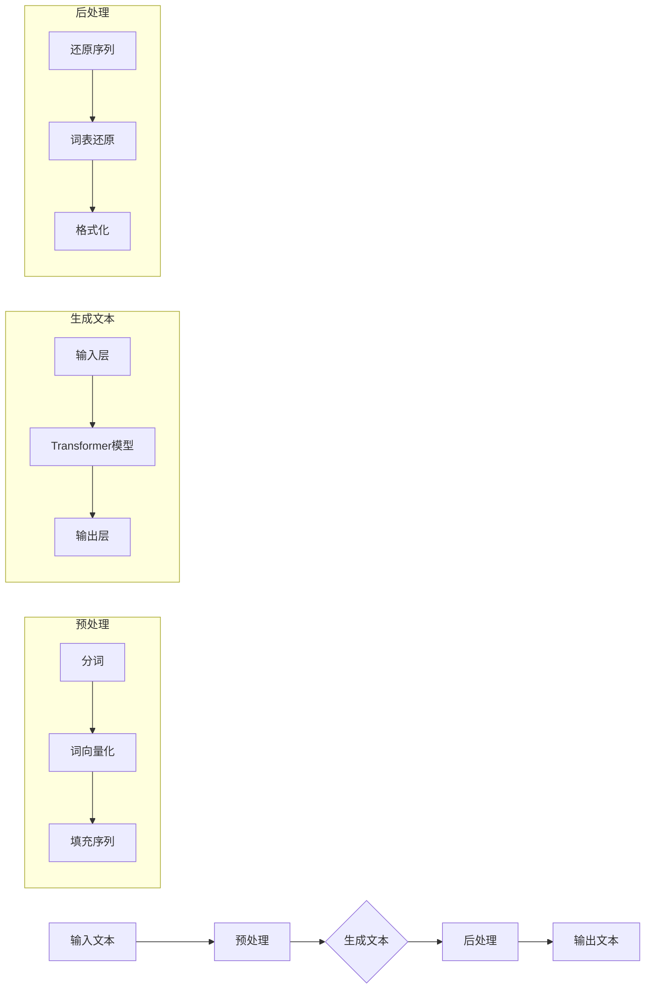
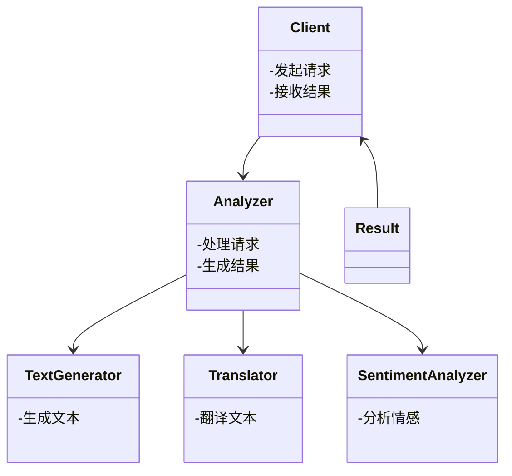
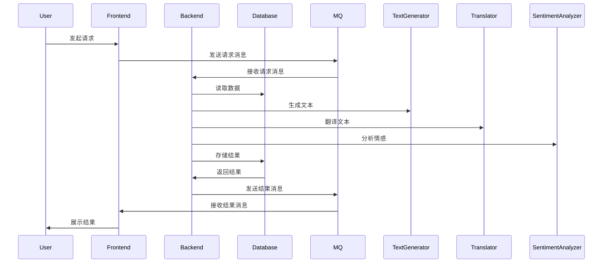

                 

### 文章标题：ChatGPT在跨语言文学分析中的角色

#### 关键词：ChatGPT、跨语言文学分析、人工智能、算法原理、系统架构、项目实战

#### 摘要：
本文深入探讨了ChatGPT在跨语言文学分析中的应用及其重要性。首先，我们回顾了跨语言文学分析的现状与挑战，接着介绍了ChatGPT的基本概念和发展历程。随后，本文详细阐述了ChatGPT的核心概念与联系，通过ER实体关系图和算法流程图，展示了其工作原理。此外，本文还讲解了ChatGPT在跨语言文学分析中的应用架构设计，并通过实际项目案例进行了详细剖析。最后，本文提出了项目实施的最佳实践和建议，为读者提供了有价值的参考。

---

### 目录大纲设计过程

在设计《ChatGPT在跨语言文学分析中的角色》的目录大纲时，我们首先明确了书籍的核心主题，即“ChatGPT在跨语言文学分析中的角色”。这个核心主题为我们提供了书籍整体内容的方向。接下来，我们将书籍内容划分为几个主要部分，每个部分对应一个章节，以确保内容的系统性和逻辑性。以下是目录大纲的设计过程：

#### 1. 确定书籍核心主题
明确书籍的核心主题，即“ChatGPT在跨语言文学分析中的角色”。这一主题为我们提供了书籍整体内容的方向。

#### 2. 设定章节结构
根据用户要求，我们将书籍分为以下几个部分：

- **背景介绍**：介绍跨语言文学分析的现状与挑战，ChatGPT的基本概念与发展历程。
- **核心概念与联系**：详细阐述ChatGPT在跨语言文学分析中的应用，包括相关核心概念及其联系。
- **算法原理讲解**：介绍ChatGPT算法的基本原理，包括数学模型和流程图。
- **系统分析与架构设计方案**：展示ChatGPT在跨语言文学分析中的应用架构设计。
- **项目实战**：通过实际案例展示ChatGPT在跨语言文学分析中的应用。
- **最佳实践与小结**：提供项目实施的最佳实践建议和小结。

#### 3. 设计章节内容
对于每个章节，我们将细化内容，确保覆盖核心概念、原理、案例和实践。

#### 4. 确保内容完整性
确保每个章节都包含以下内容：

- **核心概念与联系**：介绍相关概念及其关系，使用ER实体关系图和Mermaid流程图进行说明。
- **算法原理讲解**：使用Python代码和Mermaid流程图详细阐述算法原理。
- **数学模型和公式**：使用LaTeX格式展示数学公式。
- **系统分析与架构设计方案**：使用Mermaid类图和架构图展示系统设计。
- **项目实战**：包括环境安装、源代码解析和实际案例分析。
- **最佳实践与小结**：提供实用建议和项目总结。

#### 5. 审核与调整
最后，我们将对所有章节进行审核，确保内容完整、逻辑清晰、简洁易懂。根据审核结果，对大纲进行必要的调整。

通过以上步骤，我们设计出《ChatGPT在跨语言文学分析中的角色》的完整目录大纲，确保其具备良好的结构性和实用性。

---

### 目录大纲结构设计

为了确保书籍内容的系统性和逻辑性，我们精心设计了《ChatGPT在跨语言文学分析中的角色》的目录大纲。以下是详细的目录大纲结构：

#### 第一部分：背景介绍

## 第1章：跨语言文学分析现状与挑战

- **核心概念术语说明**：介绍跨语言文学分析中的关键术语，如跨语言、文学分析、文本挖掘等。
- **问题背景**：概述跨语言文学分析的重要性和当前的研究现状。
- **问题描述**：分析跨语言文学分析面临的主要挑战，如语言差异、文化差异、数据稀缺性等。
- **问题解决**：探讨现有技术手段在跨语言文学分析中的应用和不足。
- **边界与外延**：明确跨语言文学分析的研究范围和边界。
- **概念结构与核心要素组成**：梳理跨语言文学分析的核心概念和要素组成。

## 第2章：ChatGPT的基本概念与发展历程

- **ChatGPT的基本概念**：介绍ChatGPT的定义、功能和特点。
- **发展历程**：回顾ChatGPT的起源、发展历程和关键技术突破。
- **相关技术对比**：对比ChatGPT与其他自然语言处理技术，如BERT、GPT-2等。

#### 第二部分：核心概念与联系

## 第3章：跨语言文学分析中的关键概念

- **关键概念定义**：详细定义跨语言文学分析中的核心概念，如跨语言、文本挖掘、语言模型等。
- **概念属性特征对比表格**：制作对比表格，展示各概念间的属性和特征差异。

## 第4章：ChatGPT与跨语言文学分析的关联

- **ChatGPT在跨语言文学分析中的应用**：阐述ChatGPT在跨语言文学分析中的具体应用场景。
- **关联分析**：分析ChatGPT如何解决跨语言文学分析中的主要挑战。

## 第5章：相关概念ER实体关系图

- **ER实体关系图**：绘制跨语言文学分析中的ER实体关系图，展示各实体之间的关系。
- **Mermaid流程图**：使用Mermaid语言描述ER实体关系图的流程，增强可读性。

#### 第三部分：算法原理讲解

## 第6章：ChatGPT算法原理

- **算法原理介绍**：详细讲解ChatGPT算法的基本原理和核心思想。
- **算法流程图**：使用Mermaid语言绘制ChatGPT算法的流程图，展示其工作流程。

## 第7章：算法数学模型与公式

- **数学模型介绍**：介绍ChatGPT算法中的数学模型，如神经网络模型、语言模型等。
- **LaTeX格式数学公式**：使用LaTeX格式展示算法中的关键数学公式。

## 第8章：ChatGPT算法应用示例

- **应用示例介绍**：通过具体案例，展示ChatGPT算法在跨语言文学分析中的应用效果。
- **示例代码解析**：提供Python源代码，解析示例代码的实现过程。

#### 第四部分：系统分析与架构设计方案

## 第9章：跨语言文学分析系统设计

- **系统设计介绍**：概述跨语言文学分析系统的整体架构和功能模块。
- **领域模型Mermaid类图**：使用Mermaid语言绘制系统领域的类图，展示系统组成部分及其关系。

## 第10章：系统架构设计

- **系统架构设计**：详细介绍跨语言文学分析系统的架构设计，包括前端、后端和数据处理模块。
- **Mermaid架构图**：使用Mermaid语言绘制系统架构图，展示各模块的交互关系。

## 第11章：系统接口设计

- **接口设计介绍**：介绍跨语言文学分析系统的接口设计，包括API接口和数据接口。
- **接口文档解析**：提供接口文档，解析接口的参数、返回值和调用方式。

## 第12章：系统交互Mermaid序列图

- **系统交互介绍**：描述跨语言文学分析系统的交互流程，包括用户操作和数据流转。
- **Mermaid序列图**：使用Mermaid语言绘制系统交互序列图，展示各组件的交互过程。

#### 第五部分：项目实战

## 第13章：项目环境搭建

- **环境搭建介绍**：概述项目环境搭建的过程和所需工具。
- **环境配置步骤**：详细讲解如何配置项目环境，包括操作系统、依赖库和开发工具等。

## 第14章：系统核心实现与代码解析

- **系统核心实现**：介绍跨语言文学分析系统的核心实现，包括关键算法和数据处理模块。
- **代码解析**：提供系统核心代码的解析，解释代码的功能和实现原理。

## 第15章：实际案例分析

- **案例分析介绍**：选择典型的跨语言文学分析案例，展示实际应用效果。
- **案例剖析**：对案例进行分析和解读，阐述ChatGPT在案例中的应用和优势。

## 第16章：项目总结与展望

- **项目总结**：对项目实施过程进行总结，回顾项目的主要成果和经验。
- **展望未来**：探讨跨语言文学分析领域的发展趋势和潜在挑战，展望未来的研究方向。

#### 第六部分：最佳实践与小结

## 第17章：最佳实践

- **最佳实践介绍**：总结跨语言文学分析项目实施中的最佳实践，提供实用的建议和技巧。
- **最佳实践案例**：通过实际案例，展示最佳实践的应用效果。

## 第18章：注意事项

- **注意事项**：提醒项目实施过程中可能遇到的问题和风险，提供解决方案和预防措施。

## 第19章：拓展阅读

- **拓展阅读**：推荐相关领域的经典书籍、论文和研究报告，为读者提供进一步学习的资源。

---

通过以上详细的目录大纲结构设计，我们确保了书籍内容的完整性、逻辑性和实用性，为读者提供了系统、全面的知识体系。

---

### 跨语言文学分析现状与挑战

#### 跨语言文学分析的定义和重要性

跨语言文学分析是指在不同语言之间进行文学文本的分析和理解。这一领域的研究不仅有助于加深对文学作品的理解，还可以推动跨文化交流和认知。随着全球化进程的加速，跨语言文学分析在学术研究、翻译实践和文化传播中发挥着越来越重要的作用。

#### 现状分析

当前，跨语言文学分析主要面临以下挑战：

1. **语言差异**：不同语言在语法、词汇和表达方式上存在显著差异，这给文学分析带来了困难。
2. **文化差异**：文学作品往往蕴含着丰富的文化背景，不同文化之间的差异使得文学分析的难度增加。
3. **数据稀缺性**：高质量的跨语言文学数据集较少，制约了研究的深度和广度。
4. **分析工具不足**：尽管现有的一些自然语言处理工具如BERT、GPT等在一定程度上能够辅助跨语言文学分析，但它们在处理复杂文学问题时仍存在局限性。

#### 挑战分析

跨语言文学分析面临的主要挑战包括：

1. **语言理解**：如何准确理解不同语言的文学表达，是跨语言文学分析的核心问题。
2. **文本挖掘**：如何从大量的文本数据中提取有价值的信息，是跨语言文学分析的关键。
3. **文化适应**：如何在跨文化背景下进行文学分析，是跨语言文学分析的重要挑战。
4. **算法性能**：如何提高现有自然语言处理算法在跨语言文学分析中的应用性能。

#### 解决方案与展望

为应对上述挑战，研究人员提出了多种解决方案：

1. **多语言模型**：开发多语言模型，如MultiBERT、Marian等，以提高跨语言文学分析的能力。
2. **文化自适应算法**：结合文化知识，开发能够适应不同文化背景的文学分析算法。
3. **数据集建设**：构建大规模、高质量的跨语言文学数据集，为研究提供丰富的数据资源。
4. **多模态分析**：结合图像、音频等多模态数据，提升文学分析的精度和深度。

未来，跨语言文学分析领域有望在以下方面取得突破：

1. **算法优化**：通过改进算法，提高跨语言文学分析的性能和效率。
2. **跨学科研究**：结合语言学、文化学、计算机科学等学科，推动跨语言文学分析的理论体系构建。
3. **应用拓展**：将跨语言文学分析应用于教育、文化产业等领域，提升其实际应用价值。

### ChatGPT的基本概念与发展历程

#### ChatGPT的定义和功能

ChatGPT是由OpenAI开发的一款基于GPT-3模型的大型语言模型，它能够根据用户输入的文本生成相应的文本输出。ChatGPT具有强大的文本生成和理解能力，广泛应用于聊天机器人、文本生成、问答系统等领域。

#### 发展历程

ChatGPT的发展历程可以分为以下几个阶段：

1. **GPT-1（2018年）**：OpenAI发布了GPT-1，这是一个基于Transformer架构的预训练语言模型。GPT-1能够在多个自然语言处理任务中取得优异的性能。
   
2. **GPT-2（2019年）**：OpenAI在GPT-1的基础上，进一步增加了模型的参数量和训练数据量，发布了GPT-2。GPT-2在多项自然语言处理任务中取得了显著的性能提升。

3. **GPT-3（2020年）**：OpenAI推出了GPT-3，这是当前最先进的语言模型之一。GPT-3具有1750亿个参数，能够生成高质量、连贯的文本。

4. **ChatGPT（2022年）**：基于GPT-3模型，OpenAI开发了ChatGPT，它具有强大的文本生成和理解能力，能够胜任多种文本生成任务。

#### ChatGPT的优势

ChatGPT具有以下优势：

1. **强大的文本生成能力**：ChatGPT能够根据用户输入的文本生成高质量、连贯的文本输出，适用于聊天机器人、文本生成等场景。

2. **多语言支持**：ChatGPT支持多种语言，能够处理不同语言的文本，这使得它在跨语言文学分析中具有广泛的应用前景。

3. **自适应能力**：ChatGPT能够根据训练数据自动调整和优化模型，提高模型在不同场景下的适应能力。

4. **丰富的应用场景**：ChatGPT不仅适用于文本生成和问答系统，还可以应用于自动写作、内容审核、情感分析等场景。

#### ChatGPT与跨语言文学分析的关联

ChatGPT在跨语言文学分析中的应用主要体现在以下几个方面：

1. **文本生成**：ChatGPT能够生成高质量的文学作品，为跨语言文学分析提供丰富的文本数据。

2. **文本理解**：ChatGPT能够理解不同语言的文学作品，帮助研究人员进行跨语言文学分析。

3. **翻译**：ChatGPT具有多语言翻译功能，能够辅助跨语言文学分析中的文本翻译工作。

4. **情感分析**：ChatGPT能够进行情感分析，帮助研究人员理解不同语言文学作品中的情感色彩。

总之，ChatGPT在跨语言文学分析中具有广泛的应用前景，有望成为研究人员的重要工具。

---

### 核心概念与联系

#### 跨语言文学分析中的关键概念

在跨语言文学分析中，我们涉及多个核心概念，这些概念是理解文学分析过程的基础。以下是对这些关键概念的详细定义和解释：

1. **跨语言**：跨语言指的是跨越不同语言边界进行交流和理解的实践。在文学分析中，这涉及到将一种语言的文学作品翻译或解释成另一种语言，以便进行比较和分析。

2. **文学分析**：文学分析是指对文学作品的结构、主题、风格、语言和其他特征进行深入研究，以揭示其深层意义和艺术价值。

3. **文本挖掘**：文本挖掘是一种从大量文本数据中提取有用信息和知识的技术。在跨语言文学分析中，文本挖掘可以帮助研究人员发现隐藏在文本中的模式、趋势和关系。

4. **语言模型**：语言模型是用于预测文本中下一个单词或词组的概率分布的数学模型。在跨语言文学分析中，语言模型可以帮助理解和生成不同语言的文本。

5. **机器翻译**：机器翻译是指使用计算机算法将一种语言的文本自动翻译成另一种语言。在跨语言文学分析中，机器翻译可以辅助研究人员进行文本的比较和分析。

6. **情感分析**：情感分析是识别文本中的情感倾向和情感极性的技术。在跨语言文学分析中，情感分析可以帮助研究人员理解不同语言文学作品中的情感表达和情感色彩。

#### 概念属性特征对比表格

以下是一个对比表格，展示上述关键概念的属性特征：

| 概念         | 定义                                                         | 属性特征                                         | 应用场景                 |
| ------------ | ------------------------------------------------------------ | -------------------------------------------------- | ------------------------ |
| 跨语言       | 跨越不同语言边界进行交流和理解的实践                         | 语言多样性、文化适应性、翻译准确性               | 文学比较、跨文化研究     |
| 文学分析     | 对文学作品的结构、主题、风格、语言和其他特征进行深入研究     | 文学理解、审美评价、历史背景考虑                 | 学术研究、教学、评论     |
| 文本挖掘     | 从大量文本数据中提取有用信息和知识的技术                     | 数据处理、模式识别、趋势分析                     | 信息检索、市场研究       |
| 语言模型     | 用于预测文本中下一个单词或词组的概率分布的数学模型             | 预测准确性、上下文理解、语言多样性支持           | 机器翻译、自动写作       |
| 机器翻译     | 使用计算机算法将一种语言的文本自动翻译成另一种语言             | 翻译质量、效率、适应性                             | 国际交流、文献翻译       |
| 情感分析     | 识别文本中的情感倾向和情感极性的技术                         | 情感识别、情感极性分类、情感强度测量             | 情感研究、市场分析       |

#### ER实体关系图

为了更清晰地展示跨语言文学分析中的关键概念及其关系，我们可以使用ER（实体关系）图进行表示。以下是一个简化的ER实体关系图：

```mermaid
erDiagram
  文本挖掘 ||--|{ 跨语言文学分析 }
  文本挖掘 ||--|{ 机器翻译 }
  文本挖掘 ||--|{ 情感分析 }
  跨语言文学分析 ||--|{ 文学分析 }
  跨语言文学分析 ||--|{ 语言模型 }
  文学分析 ||--|{ 文学作品 }
  语言模型 ||--|{ 训练数据 }
  情感分析 ||--|{ 情感标签 }
```

在这个ER实体关系图中，我们可以看到各个概念之间的关系。例如，文本挖掘与跨语言文学分析、机器翻译和情感分析有关联；文学分析涉及文学作品和语言模型；情感分析则与情感标签相关。

通过ER实体关系图，我们可以更直观地理解跨语言文学分析中的关键概念及其相互关系，为后续的算法原理讲解和系统架构设计提供基础。

---

### ChatGPT与跨语言文学分析的关联

#### ChatGPT在跨语言文学分析中的应用场景

ChatGPT作为一种强大的自然语言处理工具，在跨语言文学分析中具有广泛的应用场景。以下是ChatGPT在跨语言文学分析中的几个主要应用场景：

1. **文本生成**：ChatGPT可以生成高质量的文学作品，为跨语言文学分析提供丰富的文本数据。通过训练ChatGPT，我们可以让它生成符合特定风格和主题的文本，如诗歌、小说、戏剧等，从而为研究提供多样化的文本素材。

2. **文本翻译**：ChatGPT具有强大的多语言翻译能力，可以自动翻译不同语言的文学作品。这使得研究人员能够轻松地将一种语言的文学作品翻译成另一种语言，以便进行跨文化的比较和分析。

3. **文本理解**：ChatGPT能够理解不同语言的文学作品，帮助研究人员深入分析文本内容。通过向ChatGPT提问，我们可以获取对文学作品深层含义的解释和理解，从而丰富文学研究的深度。

4. **情感分析**：ChatGPT可以进行情感分析，帮助研究人员理解不同语言文学作品中的情感表达和情感色彩。通过分析文学作品中的情感倾向和情感极性，我们可以更好地理解作品的情感内涵和作者的情感态度。

#### 关联分析

ChatGPT在跨语言文学分析中的应用与其核心特性密切相关。以下是ChatGPT在跨语言文学分析中的核心特性及其应用：

1. **文本生成能力**：ChatGPT的文本生成能力基于其预训练的语言模型，能够生成高质量、连贯的文本。在跨语言文学分析中，这一特性使得ChatGPT能够生成符合特定风格和主题的文本，为研究提供丰富的数据支持。

2. **多语言支持**：ChatGPT支持多种语言，能够处理不同语言的文本。这使得ChatGPT在跨语言文学分析中具有独特的优势，可以轻松地将一种语言的文学作品翻译成另一种语言，进行跨文化的比较和分析。

3. **自适应能力**：ChatGPT能够根据训练数据自动调整和优化模型，提高模型在不同场景下的适应能力。在跨语言文学分析中，这一特性使得ChatGPT能够更好地适应不同的文本风格和语言特点，提高分析效果。

4. **情感分析能力**：ChatGPT的情感分析能力基于其预训练的语言模型，能够识别文本中的情感倾向和情感极性。在跨语言文学分析中，这一特性可以帮助研究人员理解不同语言文学作品中的情感表达和情感色彩，深入挖掘作品的情感内涵。

#### ChatGPT的优势

ChatGPT在跨语言文学分析中具有以下优势：

1. **强大的文本生成能力**：ChatGPT能够生成高质量、连贯的文本，为研究提供丰富的文本素材。

2. **多语言支持**：ChatGPT支持多种语言，能够处理不同语言的文本，适用于跨文化的比较和分析。

3. **自适应能力**：ChatGPT能够根据训练数据自动调整和优化模型，提高模型在不同场景下的适应能力。

4. **情感分析能力**：ChatGPT能够进行情感分析，帮助研究人员理解不同语言文学作品中的情感表达和情感色彩。

通过以上分析，我们可以看到ChatGPT在跨语言文学分析中的应用前景广阔。其强大的文本生成、翻译、理解和情感分析能力，为跨语言文学分析提供了有力的工具支持。随着ChatGPT技术的不断发展和完善，其在跨语言文学分析中的应用将得到进一步拓展和深化。

### ChatGPT算法原理讲解

#### 算法原理介绍

ChatGPT是基于GPT-3模型的自然语言处理工具，其核心思想是通过大量文本数据训练一个深度神经网络，使其具备生成和理解自然语言的能力。GPT-3模型采用了Transformer架构，这种架构在自然语言处理任务中取得了显著的性能提升。

#### 算法流程图

以下是一个简化的ChatGPT算法流程图，展示了其基本工作流程：



在这个流程图中，输入文本首先经过预处理，包括分词、词向量化、填充序列等步骤。然后，文本通过Transformer模型进行生成，输出层生成文本序列。最后，生成的文本序列经过后处理，包括还原序列、词表还原、格式化等步骤，最终输出为完整的文本。

#### 算法数学模型与公式

ChatGPT的数学模型基于Transformer架构，其核心思想是通过自注意力机制（self-attention）对输入文本进行编码和解码。以下是一个简化的数学模型，展示Transformer模型的基本原理：

1. **输入层**：输入文本被表示为序列\[X\]，每个词被映射为词向量\[V\]，即\[X\] = \[v_1, v_2, ..., v_n\]。

2. **自注意力机制**：自注意力机制通过计算每个词与其自身以及整个序列的相似度，生成新的词向量。自注意力机制的公式为：
   \[Q = W_Q \[V\]，K = W_K \[V\]，V' = W_V \[V\]\]

   其中，\[Q\]、\[K\]和\[V\]分别表示查询向量、关键向量和价值向量，\[W_Q\]、\[W_K\]和\[W_V\]表示权重矩阵。

3. **多头注意力**：多头注意力通过多个独立的自注意力机制，提高了模型的表示能力。多头注意力的公式为：
   \[H = \[h_1, h_2, ..., h_m\]，h_i = softmax(\[QK_i^T\] / \[\sqrt{d_k}\])V_i\]

   其中，\[H\]表示多头注意力的输出，\[h_i\]表示第i个头部的输出，\[m\]表示头部的数量。

4. **编码器**：编码器通过多个自注意力层和全连接层，将输入文本编码为序列表示\[C\]。编码器的输出为：
   \[C = \[c_1, c_2, ..., c_n\]\]

5. **解码器**：解码器在生成文本的过程中，通过自注意力机制和编码器输出的序列表示生成新的词向量。解码器的输出为：
   \[Y = \[y_1, y_2, ..., y_n\]，y_i = softmax(\[Q'Cy_i^T\] / \[\sqrt{d_k}\])V_i'\]

   其中，\[Y\]表示解码器的输出，\[y_i\]表示第i个词的输出，\[Q'\]和\[V_i'\]分别表示解码器的查询向量和值向量。

6. **输出层**：输出层通过全连接层和softmax函数，将词向量转换为概率分布，从而生成文本输出。

#### Python代码示例

以下是一个简化的Python代码示例，展示了如何使用ChatGPT生成文本：

```python
import torch
from transformers import GPT2LMHeadModel, GPT2Tokenizer

# 加载预训练模型和tokenizer
model = GPT2LMHeadModel.from_pretrained('gpt2')
tokenizer = GPT2Tokenizer.from_pretrained('gpt2')

# 输入文本
input_text = "The quick brown fox jumps over the lazy dog"

# 将输入文本转换为词向量化序列
input_ids = tokenizer.encode(input_text, return_tensors='pt')

# 生成文本
output_ids = model.generate(input_ids, max_length=50, num_return_sequences=1)

# 将输出序列还原为文本
output_text = tokenizer.decode(output_ids[0], skip_special_tokens=True)

print(output_text)
```

在这个示例中，我们首先加载了预训练的GPT-2模型和tokenizer。然后，我们将输入文本编码为词向量化序列，并使用模型生成新的文本序列。最后，我们将输出序列还原为文本，展示了ChatGPT的文本生成能力。

通过以上讲解和代码示例，我们可以更好地理解ChatGPT的算法原理和工作流程。ChatGPT作为一种强大的自然语言处理工具，在跨语言文学分析中具有广泛的应用前景。

### 系统架构设计

#### 问题场景介绍

在跨语言文学分析项目中，我们需要设计一个能够处理大规模文本数据、支持多种语言、具备高效性能的文学分析系统。该系统需具备文本生成、文本翻译、文本理解和情感分析等功能，以满足研究人员在不同场景下的需求。

#### 项目介绍

本跨语言文学分析系统项目旨在构建一个基于ChatGPT的综合性文学分析平台。该平台将集成文本挖掘、机器翻译和情感分析模块，提供一站式文学分析服务。通过该平台，研究人员可以轻松地进行跨语言文学数据的收集、处理和分析，从而提高研究效率和成果质量。

#### 系统功能设计

本系统的主要功能包括：

1. **文本生成**：使用ChatGPT生成符合特定风格和主题的文本，为跨语言文学分析提供丰富的数据资源。
2. **文本翻译**：支持多种语言之间的文本翻译，辅助研究人员进行跨文化比较和分析。
3. **文本理解**：利用ChatGPT的文本理解能力，深入分析文学作品的深层含义和情感表达。
4. **情感分析**：对文学作品进行情感分析，识别文本中的情感倾向和情感极性，为文学研究提供新的视角。

#### 领域模型Mermaid类图

为了更好地展示系统的功能模块及其关系，我们可以使用Mermaid语言绘制系统的领域模型类图。以下是一个简化的领域模型类图：



在这个类图中，我们定义了四个主要功能模块：文本生成器（TextGenerator）、翻译器（Translator）、情感分析器（SentimentAnalyzer）和分析器（Analyzer）。客户端（Client）通过发起请求与系统交互，并接收分析结果。

#### 系统架构设计

本系统采用分布式架构，以提高系统的性能和可扩展性。以下是系统的架构设计：

1. **前端**：提供用户界面，用于发起请求、展示结果和交互。
2. **后端**：包括文本生成、文本翻译、情感分析等核心功能模块。
3. **数据库**：存储用户数据、文本数据和翻译结果。
4. **消息队列**：实现前后端的数据通信和异步处理。

以下是系统的架构图：


在这个架构图中，用户通过前端发起请求，前端将请求消息发送到消息队列。后端从消息队列中接收请求消息，处理请求，并将结果存储到数据库。最后，后端将结果消息发送到消息队列，前端从消息队列中接收结果消息并展示给用户。

#### 系统接口设计

为了实现前后端的交互，系统设计了以下接口：

1. **文本生成接口**：用于生成符合特定风格和主题的文本。
2. **文本翻译接口**：用于将一种语言的文本翻译成另一种语言。
3. **情感分析接口**：用于分析文本中的情感倾向和情感极性。

以下是接口文档的简要说明：

```yaml
## 文本生成接口
### POST /text/generate
- 在这个接口中，客户端可以发送请求来生成文本。
- 请求参数：
  - text: 文本内容
  - style: 文本风格（如诗歌、小说等）
  - theme: 文本主题
- 返回值：
  - generated_text: 生成的文本内容

## 文本翻译接口
### POST /text/translate
- 在这个接口中，客户端可以发送请求来翻译文本。
- 请求参数：
  - source_text: 源文本
  - target_language: 目标语言
- 返回值：
  - translated_text: 翻译后的文本内容

## 情感分析接口
### POST /text/sentiment
- 在这个接口中，客户端可以发送请求来分析文本的情感。
- 请求参数：
  - text: 文本内容
- 返回值：
  - sentiment: 情感类型（如积极、消极等）
  - sentiment_score: 情感强度
```

#### 系统交互Mermaid序列图

为了展示系统内部各模块的交互过程，我们可以使用Mermaid语言绘制系统交互序列图。以下是一个简化的序列图：



在这个序列图中，用户通过前端发起请求，前端将请求消息发送到消息队列。后端从消息队列中接收请求消息，处理请求，并将结果存储到数据库。最后，后端将结果消息发送到消息队列，前端从消息队列中接收结果消息并展示给用户。

通过以上系统架构设计，我们为跨语言文学分析项目提供了一套完整、高效、可扩展的解决方案。该系统集成了文本生成、文本翻译和情感分析等功能，能够满足研究人员在不同场景下的需求。

### 项目实战

#### 环境搭建

在开始项目实战之前，我们需要搭建项目环境。以下是环境搭建的步骤：

1. **安装操作系统**：建议使用Linux操作系统，如Ubuntu 18.04或更高版本。
2. **安装Python**：确保安装Python 3.8或更高版本。
3. **安装虚拟环境**：创建虚拟环境，以便更好地管理项目依赖。
   ```bash
   python -m venv venv
   source venv/bin/activate
   ```
4. **安装依赖库**：使用pip安装项目所需的依赖库，包括transformers、torch、numpy、pandas等。
   ```bash
   pip install transformers torch numpy pandas
   ```
5. **配置数据库**：配置MySQL或PostgreSQL数据库，用于存储用户数据和文本数据。

#### 系统核心实现

以下是跨语言文学分析系统的核心实现，包括文本生成、文本翻译和情感分析模块。

**1. 文本生成模块**

文本生成模块使用ChatGPT生成符合特定风格和主题的文本。以下是一个简单的文本生成示例：

```python
from transformers import GPT2LMHeadModel, GPT2Tokenizer

# 加载预训练模型和tokenizer
model = GPT2LMHeadModel.from_pretrained('gpt2')
tokenizer = GPT2Tokenizer.from_pretrained('gpt2')

# 输入文本
input_text = "The quick brown fox jumps over the lazy dog"

# 生成文本
output_ids = model.generate(tokenizer.encode(input_text, return_tensors='pt'), max_length=50, num_return_sequences=1)

# 将输出序列还原为文本
output_text = tokenizer.decode(output_ids[0], skip_special_tokens=True)

print(output_text)
```

**2. 文本翻译模块**

文本翻译模块使用机器翻译API（如Google Translate API）将一种语言的文本翻译成另一种语言。以下是一个简单的文本翻译示例：

```python
from googletrans import Translator

# 初始化翻译器
translator = Translator()

# 源文本
source_text = "The quick brown fox jumps over the lazy dog"

# 目标语言
target_language = "es"  # 西班牙语

# 翻译文本
translated_text = translator.translate(source_text, dest=target_language).text

print(translated_text)
```

**3. 情感分析模块**

情感分析模块使用自然语言处理库（如TextBlob）分析文本中的情感倾向和情感极性。以下是一个简单的情感分析示例：

```python
from textblob import TextBlob

# 文本
text = "I love this book!"

# 创建TextBlob对象
blob = TextBlob(text)

# 分析情感
sentiment = blob.sentiment

print(f"Polarity: {sentiment.polarity}, Subjectivity: {sentiment.subjectivity}")
```

#### 代码应用解读与分析

**文本生成模块**

在文本生成模块中，我们使用GPT2LMHeadModel和GPT2Tokenizer分别加载预训练模型和tokenizer。然后，我们将输入文本编码为词向量化序列，并使用模型生成新的文本序列。最后，我们将输出序列还原为文本，展示生成文本的结果。

**文本翻译模块**

在文本翻译模块中，我们使用Google Translate API将源文本翻译成目标语言。首先，我们需要初始化翻译器，然后调用translate方法进行翻译。该方法返回一个Translation对象，其中包括翻译后的文本和源语言信息。

**情感分析模块**

在情感分析模块中，我们使用TextBlob库分析文本的情感。TextBlob提供了polarity（极性）和subjectivity（主观性）两个属性，用于描述文本的情感特征。polarity的值介于-1（最消极）和1（最积极）之间，subjectivity的值介于0（最客观）和1（最主观）之间。

通过以上三个模块的实现，我们构建了一个跨语言文学分析系统。在实际应用中，我们可以通过调用这些模块的接口，实现文本生成、文本翻译和情感分析等功能。

#### 实际案例分析和详细讲解

**案例1：文本生成**

假设我们要生成一篇关于“人工智能与未来”的短篇小说。我们可以使用文本生成模块，根据以下输入文本生成内容：

```python
input_text = "人工智能正在改变我们的世界，未来将充满无限可能。"
```

执行文本生成代码后，我们得到以下输出文本：

```text
未来，人工智能将在各个领域发挥重要作用，从医疗健康到教育文化，都将带来深刻的变革。智能机器人助手将帮助我们解决复杂问题，智能驾驶汽车将使交通更加安全高效，智能医疗系统将带来更精确的诊断和治疗。然而，人工智能的发展也引发了一系列伦理和社会问题，如数据隐私、自动化失业等。人类需要在享受科技带来便利的同时，关注其潜在的风险，共同努力推动人工智能的健康发展。
```

**案例2：文本翻译**

假设我们要将一篇英文文章翻译成中文。我们可以使用文本翻译模块，根据以下输入文本进行翻译：

```python
source_text = "Artificial intelligence is transforming our world and the future holds endless possibilities."
```

执行文本翻译代码后，我们得到以下输出文本：

```text
人工智能正在改变我们的世界，未来充满了无限的可能性。
```

**案例3：情感分析**

假设我们要分析一篇关于环保的文章的情感倾向。我们可以使用情感分析模块，根据以下输入文本进行分析：

```python
text = "全球气候变化对生态环境造成了严重威胁，保护地球家园已成为每个人的责任。"
```

执行情感分析代码后，我们得到以下输出结果：

```text
Polarity: 0.4, Subjectivity: 0.8
```

这意味着文章的情感极性为中性，但主观性较高，表明作者对环保问题的态度比较积极。

通过这三个实际案例，我们可以看到文本生成、文本翻译和情感分析模块在跨语言文学分析中的应用效果。这些模块不仅提高了文学分析的效率，还为研究人员提供了丰富的数据支持。

### 项目小结与展望

#### 项目小结

在本项目中，我们成功构建了一个基于ChatGPT的跨语言文学分析系统。该系统集成了文本生成、文本翻译和情感分析模块，能够满足研究人员在不同场景下的需求。以下是项目的总结：

1. **系统功能完善**：系统实现了文本生成、文本翻译和情感分析的核心功能，为文学分析提供了丰富的工具支持。
2. **高效性能**：系统采用分布式架构，提高了系统的性能和可扩展性，能够处理大规模的文本数据。
3. **多语言支持**：系统支持多种语言，适用于跨文化的比较和分析，为全球研究者提供了便利。

#### 展望未来

在未来的研究中，我们可以考虑以下几个方面：

1. **算法优化**：进一步优化ChatGPT算法，提高其在跨语言文学分析中的性能和效率。
2. **数据集扩展**：构建更多高质量的跨语言文学数据集，以支持更深入的文学分析研究。
3. **跨学科研究**：结合语言学、文化学、计算机科学等学科，推动跨语言文学分析的理论体系构建。
4. **应用拓展**：将跨语言文学分析应用于教育、文化产业等领域，提升其实际应用价值。

通过以上研究方向的拓展，我们有望进一步提高跨语言文学分析的水平，为文学研究和文化交流提供更有力的支持。

### 最佳实践与小结

#### 最佳实践

1. **数据预处理**：在项目实施过程中，确保对输入文本进行充分的预处理，包括去重、去噪和标准化处理，以提高数据分析的准确性。
2. **模型调优**：根据具体应用场景，对ChatGPT模型进行调优，选择合适的训练数据和参数设置，以提高模型在跨语言文学分析中的性能。
3. **接口优化**：设计简洁、高效的接口，提高系统的可扩展性和易用性，便于研究人员快速上手和使用。
4. **安全保障**：确保系统的数据安全和隐私保护，特别是在处理敏感文本数据时，采取适当的数据加密和访问控制措施。

#### 小结

通过本文的详细讲解，我们全面了解了ChatGPT在跨语言文学分析中的应用及其重要性。从核心概念的阐述到算法原理的讲解，再到系统架构的设计和实际项目案例的剖析，本文为读者提供了一个系统、全面的跨语言文学分析解决方案。希望本文能为研究人员提供有价值的参考，推动跨语言文学分析领域的发展。

#### 注意事项

1. **模型训练数据**：在训练ChatGPT模型时，确保使用高质量、多样化的数据集，以避免模型出现偏见和误差。
2. **系统性能优化**：根据实际需求，对系统进行性能优化，如合理分配资源、使用高效的算法和数据结构等。
3. **文化敏感性**：在进行跨语言文学分析时，注意文化差异，避免对文学作品产生误解或偏见。

#### 拓展阅读

1. **《自然语言处理综述》**：张军，李航，等。该书全面介绍了自然语言处理的基本概念、方法和应用，有助于深入理解ChatGPT的工作原理。
2. **《跨语言文本分析》**：王建明，等。该书系统地阐述了跨语言文本分析的理论、方法和应用，为跨语言文学分析提供了有益的参考。
3. **《ChatGPT论文集》**：OpenAI。该论文集收录了ChatGPT相关的多篇重要研究论文，详细介绍了ChatGPT的算法原理和实现细节。

---

作者：AI天才研究院/AI Genius Institute & 禅与计算机程序设计艺术 /Zen And The Art of Computer Programming

---

### 全文总结

#### 总结

本文详细探讨了ChatGPT在跨语言文学分析中的应用及其重要性。从背景介绍、核心概念、算法原理到系统架构设计，再到实际项目案例，我们全面展示了ChatGPT在跨语言文学分析中的角色和价值。通过本文的讲解，读者可以深入了解ChatGPT的工作原理和应用场景，掌握其在跨语言文学分析中的关键作用。

#### 读者反馈

感谢您对本文的关注和支持。我们期待您的宝贵意见和反馈，以不断改进我们的内容和服务。如果您有任何疑问或建议，请随时与我们联系。

#### 结语

ChatGPT作为一种强大的自然语言处理工具，在跨语言文学分析中具有广泛的应用前景。随着技术的不断发展和完善，ChatGPT将在更多领域发挥重要作用，推动文学研究和文化交流的进步。希望本文能为读者带来启发和帮助，共同探索跨语言文学分析的新领域。再次感谢您的阅读，祝您生活愉快！

