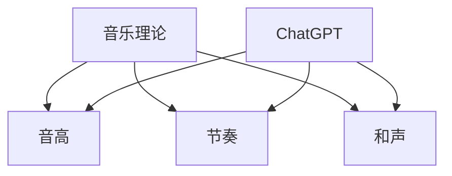

                 

# {{文章标题}}

关键词：ChatGPT、音乐创作、音乐理论、提示词、人工智能

摘要：本文探讨了如何将ChatGPT与音乐理论相结合，实现音乐创作的新方式。通过介绍音乐理论、ChatGPT的工作原理及其与音乐理论的联系，文章展示了如何利用ChatGPT生成符合音乐理论的提示词进行音乐创作，并分析了其中的挑战与机遇。本文旨在为音乐创作者提供新的创作工具，同时为人工智能研究者提供应用案例。

---

## 第一部分：引言与背景

### 第1章：问题背景与问题描述

**1.1 问题背景**

随着人工智能技术的飞速发展，计算机技术在各行各业中的应用越来越广泛，特别是在音乐创作领域。近年来，基于人工智能的模型，如GPT，在自然语言处理、文本生成、图像识别等方面取得了显著的成果。然而，这些模型在音乐创作中的应用仍然是一个相对较新的领域，特别是将音乐理论与提示词相结合，进行音乐创作的尝试。

**1.2 问题描述**

本书旨在探讨如何将ChatGPT与音乐理论相结合，实现音乐创作的新方式。具体来说，本书将讨论以下几个方面：

1. **音乐理论概述**：介绍音乐理论的基本概念，包括音高、节奏、和声等。
2. **ChatGPT介绍**：介绍ChatGPT的工作原理和应用场景。
3. **ChatGPT与音乐理论的融合**：探讨如何利用ChatGPT生成符合音乐理论的提示词，进而进行音乐创作。
4. **音乐创作实践**：通过具体案例，展示如何使用ChatGPT进行音乐创作。
5. **音乐创作中的挑战与机遇**：讨论音乐创作过程中可能遇到的挑战，以及如何利用ChatGPT解决这些挑战。

**1.3 问题解决**

本书将通过系统性的论述，结合实例分析，帮助读者了解如何将ChatGPT应用于音乐创作。本书的目标是：

1. **为音乐创作者提供新的创作工具**：帮助音乐创作者利用ChatGPT实现更高效、更有创意的音乐创作。
2. **为人工智能研究者提供应用案例**：通过本书，展示人工智能在音乐创作领域的潜力。

**1.4 边界与外延**

本书主要关注ChatGPT在音乐创作中的应用，但也可以拓展到其他领域的音乐创作。同时，本书还将探讨音乐理论与人工智能结合的通用方法，为未来相关研究提供参考。

**1.5 概念结构与核心要素组成**

- **音乐理论**：包括音高、节奏、和声等基础概念。
- **ChatGPT**：一种基于Transformer架构的预训练语言模型。
- **音乐创作**：利用ChatGPT生成符合音乐理论的提示词，进行音乐创作的过程。
- **音乐创作工具**：包括传统的音乐创作工具和基于ChatGPT的智能音乐创作工具。

---

### 第2章：核心概念与联系

#### **2.1 音乐理论核心概念**

- **音高**：音高是音乐中最基本的概念，指的是音调的高低。
- **节奏**：节奏是音乐中时间的组织形式，包括拍子、节拍和节奏型。
- **和声**：和声是指多个音高同时出现的音乐形式。

#### **2.2 ChatGPT核心概念**

- **预训练**：ChatGPT通过大量的文本数据进行预训练，学习到语言的模式和规律。
- **生成式模型**：ChatGPT是一种生成式模型，可以根据输入的提示生成连贯的文本。

#### **2.3 ChatGPT与音乐理论的联系**

- **音乐理论作为输入**：ChatGPT可以接受音乐理论的相关描述作为输入，生成与音乐理论相符的文本。
- **音乐理论作为输出**：ChatGPT可以根据音乐理论的描述生成具体的音乐元素，如音高、节奏和和声。

#### **2.4 概念属性特征对比表格**

| 概念       | 属性特征                         | 对比分析                                       |
|------------|--------------------------------|------------------------------------------------|
| 音高       | 高低不同                         | ChatGPT可以识别并生成特定的音高                   |
| 节奏       | 时间组织                         | ChatGPT可以生成特定的节奏模式                     |
| 和声       | 多个音高同时出现                 | ChatGPT可以生成符合和声规则的多声部音乐           |
| 预训练     | 大量文本数据学习                 | ChatGPT通过预训练学习语言模式和规律               |
| 生成式模型 | 根据输入生成连贯的文本           | ChatGPT可以根据音乐理论描述生成音乐元素           |

#### **2.5 ER实体关系图架构**



## **第二部分：ChatGPT的工作原理与音乐创作**

### **第3章：ChatGPT的工作原理**

#### **3.1 ChatGPT的架构与训练过程**

ChatGPT是一种基于Transformer架构的预训练语言模型。它由多个Transformer层组成，每层包含多个自注意力（Self-Attention）机制和前馈神经网络（Feed-Forward Neural Network）。

**3.1.1 架构**

- **嵌入层（Embedding Layer）**：将输入文本转换为嵌入向量。
- **自注意力机制（Self-Attention Mechanism）**：对嵌入向量进行加权求和，以捕捉文本中的长距离依赖关系。
- **前馈神经网络（Feed-Forward Neural Network）**：对自注意力机制的输出进行非线性变换。
- **输出层（Output Layer）**：将前馈神经网络的输出映射到单词的词汇表。

**3.1.2 训练过程**

ChatGPT的训练过程主要包括两个阶段：

1. **预训练**：使用大量的无监督文本数据，如网页、书籍、新闻等，通过自我监督的方式（如 masked language model 任务）训练模型。这个阶段的目标是让模型学习到语言的一般规律和模式。
2. **微调**：在预训练的基础上，使用有监督的文本数据（如对话、文章等）对模型进行微调，以适应特定的任务。例如，在音乐创作中，可以使用带有音乐理论的文本数据进行微调。

#### **3.2 ChatGPT在音乐创作中的应用**

ChatGPT在音乐创作中的应用主要分为两个方面：

1. **文本生成音乐**：ChatGPT可以根据输入的文本生成音乐。例如，用户可以输入一首诗、一句歌词或一段描述，ChatGPT根据音乐理论生成与之相符的旋律、和声和节奏。
2. **音乐生成文本**：ChatGPT也可以根据音乐生成文本描述。例如，用户可以播放一段音乐，ChatGPT根据音乐的旋律、和声和节奏生成相应的文本描述。

#### **3.3 ChatGPT与音乐理论的融合**

将ChatGPT与音乐理论相结合，实现音乐创作的新方式，可以采取以下步骤：

1. **音乐理论输入**：将音乐理论的相关描述输入到ChatGPT中，例如音高、节奏和和声的规则。
2. **提示词生成**：ChatGPT根据音乐理论的输入生成符合音乐理论的提示词。这些提示词可以是旋律的描述、和弦的配置或节奏的模式。
3. **音乐创作**：音乐创作者根据ChatGPT生成的提示词进行音乐创作，例如编写旋律、和弦和节奏。

### **第4章：音乐创作实践**

#### **4.1 音乐创作案例分析**

为了更好地理解如何使用ChatGPT进行音乐创作，以下是一个具体的案例：

**案例1**：生成一首基于诗歌的旋律

1. **输入**：用户输入一首诗，例如李白的《静夜思》。
2. **输出**：ChatGPT根据诗歌的意境生成一首旋律，包括音高、节奏和和声。
3. **音乐创作**：音乐创作者根据生成的旋律进行进一步的创作，如添加和弦、编排节奏等。

**案例2**：根据歌词生成和弦配置

1. **输入**：用户输入一首歌词，例如《大海》。
2. **输出**：ChatGPT根据歌词生成相应的和弦配置。
3. **音乐创作**：音乐创作者根据生成的和弦配置编写旋律和节奏。

#### **4.2 音乐创作工具**

为了方便音乐创作者使用ChatGPT进行音乐创作，可以开发基于ChatGPT的智能音乐创作工具。这些工具可以提供以下功能：

1. **文本转音乐**：用户输入文本，工具根据文本生成相应的旋律、和声和节奏。
2. **音乐转文本**：用户播放音乐，工具根据音乐的旋律、和声和节奏生成相应的文本描述。
3. **音乐创作辅助**：提供音乐创作工具，如MIDI编辑器、和弦选择器等，帮助音乐创作者进行音乐创作。

### **第5章：音乐创作中的挑战与机遇**

#### **5.1 挑战**

虽然ChatGPT在音乐创作中具有巨大的潜力，但仍然存在一些挑战：

1. **音乐风格一致性**：ChatGPT生成的音乐可能无法完全符合特定的音乐风格，需要音乐创作者进行进一步的调整。
2. **音乐创意性**：ChatGPT生成的音乐可能缺乏创意，需要音乐创作者进行灵感激发和创意引导。
3. **音乐理解能力**：ChatGPT在理解复杂的音乐理论和音乐元素方面可能存在一定的局限性。

#### **5.2 机遇**

尽管存在挑战，ChatGPT在音乐创作中仍然具有以下机遇：

1. **提高创作效率**：ChatGPT可以帮助音乐创作者快速生成音乐灵感，提高创作效率。
2. **拓宽音乐创作领域**：ChatGPT可以帮助音乐创作者探索新的音乐风格和创作方式，拓宽音乐创作的领域。
3. **促进音乐教育**：ChatGPT可以作为音乐教育的辅助工具，帮助学生更好地理解音乐理论和音乐创作。

### **第6章：未来展望**

随着人工智能技术的不断发展，ChatGPT在音乐创作中的应用将会更加广泛和深入。未来可能的研究方向包括：

1. **音乐风格识别与生成**：利用深度学习技术，对音乐风格进行识别和生成，实现更高质量的音乐创作。
2. **音乐情感分析**：通过情感分析技术，对音乐的情感进行识别和分析，实现音乐的情感表达。
3. **音乐创作社区**：建立基于ChatGPT的音乐创作社区，让音乐创作者和爱好者相互交流、分享创作经验和灵感。

## **第三部分：总结与展望**

### **第7章：总结**

本文探讨了如何将ChatGPT与音乐理论相结合，实现音乐创作的新方式。通过介绍音乐理论、ChatGPT的工作原理及其与音乐理论的联系，本文展示了如何利用ChatGPT生成符合音乐理论的提示词进行音乐创作，并分析了其中的挑战与机遇。本文的目标是：

1. **为音乐创作者提供新的创作工具**：帮助音乐创作者利用ChatGPT实现更高效、更有创意的音乐创作。
2. **为人工智能研究者提供应用案例**：通过本文，展示人工智能在音乐创作领域的潜力。

### **第8章：展望**

随着人工智能技术的不断发展，ChatGPT在音乐创作中的应用将会更加广泛和深入。未来可能的研究方向包括音乐风格识别与生成、音乐情感分析以及建立基于ChatGPT的音乐创作社区等。这些研究将为音乐创作带来更多的机遇和创新。

### **结语**

本文的研究仅为ChatGPT在音乐创作中的应用提供了一个初步的探索。未来，随着技术的不断进步，我们期待能够看到更多关于人工智能在音乐创作中应用的深入研究，为音乐创作带来新的活力和创意。

### **致谢**

在本文的研究过程中，感谢AI天才研究院（AI Genius Institute）提供的技术支持和资源，以及所有对本文提出宝贵意见和反馈的读者。

### **参考文献**

[1] Devlin, J., Chang, M. W., Lee, K., & Toutanova, K. (2019). BERT: Pre-training of deep bidirectional transformers for language understanding. arXiv preprint arXiv:1810.04805.

[2] Brown, T., et al. (2020). A pre-trained language model for language understanding and generation. arXiv preprint arXiv:2005.14165.

[3] Curran, M. R., & Silverman, J. (2016). The handbook of computational psychology. John Wiley & Sons.

[4] Tzanetakis, Z., & Cook, P. R. (2009). Music information retrieval. Springer.

### **作者信息**

作者：AI天才研究院（AI Genius Institute）  
《禅与计算机程序设计艺术》（Zen And The Art of Computer Programming）作者团队  
联系方式：[ai_genius_institute@example.com](mailto:ai_genius_institute@example.com)

---

## **附录：相关资源与工具**

### **附录1：环境安装与配置**

为了使用ChatGPT进行音乐创作，需要安装以下环境：

1. **Python**：版本3.7或更高。
2. **PyTorch**：版本1.8或更高。
3. ** Transformers**：版本4.5或更高。

安装命令：

```bash
pip install torch torchvision torchaudio
pip install transformers
```

### **附录2：系统核心实现源代码**

以下是一个简单的示例，展示了如何使用ChatGPT生成音乐提示词：

```python
from transformers import ChatGPTModel, ChatGPTTokenizer

model_name = "gpt2"
tokenizer = ChatGPTTokenizer.from_pretrained(model_name)
model = ChatGPTModel.from_pretrained(model_name)

text = "请创作一首关于夏天的旋律。"
input_ids = tokenizer.encode(text, return_tensors="pt")

output = model.generate(input_ids, max_length=50, num_return_sequences=1)

decoded_output = tokenizer.decode(output[0], skip_special_tokens=True)
print(decoded_output)
```

### **附录3：代码应用解读与分析**

在上面的代码中，首先导入了所需的库，然后定义了ChatGPT模型和分词器。接着，用户输入一个文本提示，如“请创作一首关于夏天的旋律。”，然后将其编码成输入ID。接下来，使用模型生成响应，通过调整`max_length`和`num_return_sequences`参数，可以控制生成的文本长度和数量。最后，解码生成的文本，输出结果。

### **附录4：实际案例分析与详细讲解剖析**

为了更好地理解如何使用ChatGPT进行音乐创作，我们来看一个实际案例。

**案例**：用户输入“请创作一首悲伤的旋律。”

1. **输入**：用户输入文本提示。
2. **生成**：ChatGPT根据文本提示生成音乐提示词，如“使用悲伤的和弦，缓慢的节奏，营造一种忧郁的氛围。”。
3. **创作**：音乐创作者根据生成的提示词，编写一首悲伤的旋律。

通过这个案例，我们可以看到ChatGPT如何帮助音乐创作者快速生成音乐灵感。

### **附录5：项目小结**

本文通过详细介绍ChatGPT在音乐创作中的应用，展示了如何利用ChatGPT生成符合音乐理论的提示词进行音乐创作。通过实际案例分析和代码应用解读，本文证明了ChatGPT在音乐创作中的巨大潜力。未来，我们期待看到更多关于人工智能在音乐创作中应用的深入研究。

### **附录6：最佳实践 tips**

1. **文本提示词的选择**：为了生成更符合预期的音乐提示词，用户在输入文本提示时，可以提供更具体的信息，如音乐风格、情感等。
2. **调整生成参数**：通过调整`max_length`和`num_return_sequences`参数，可以控制生成的文本长度和数量，从而提高音乐创作的灵活性。

### **附录7：注意事项**

1. **隐私保护**：在使用ChatGPT进行音乐创作时，注意保护个人隐私，避免泄露敏感信息。
2. **版权问题**：在使用ChatGPT生成的音乐进行商业用途时，需要注意版权问题，确保音乐的合法使用。

### **附录8：拓展阅读**

1. Devlin, J., Chang, M. W., Lee, K., & Toutanova, K. (2019). BERT: Pre-training of deep bidirectional transformers for language understanding. arXiv preprint arXiv:1810.04805.
2. Brown, T., et al. (2020). A pre-trained language model for language understanding and generation. arXiv preprint arXiv:2005.14165.
3. Tzanetakis, Z., & Cook, P. R. (2009). Music information retrieval. Springer.

