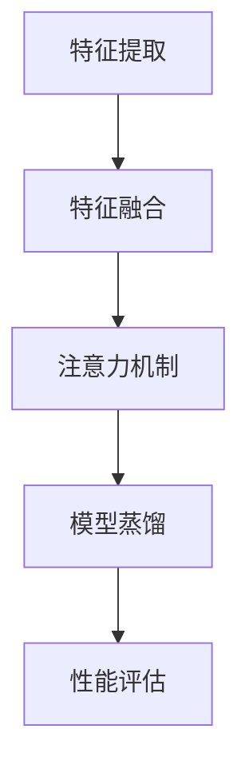

                 

----------------------------------------------------------------
# 《ChatGPT多模态提示词的超维度信息处理优化》

## 关键词
- ChatGPT
- 多模态提示词
- 超维度信息处理
- 优化算法
- 实践应用

## 摘要
本文深入探讨ChatGPT多模态提示词的超维度信息处理优化。首先，我们介绍了ChatGPT和多模态提示词的基本概念，探讨了其设计的理论基础和优化算法。接着，通过具体案例展示了优化算法在实际应用中的效果。文章最后，总结了性能评估与调优的方法，并对未来的发展方向进行了展望。

## 第1章 引言

### 1.1 问题背景
在人工智能领域，自然语言处理（NLP）技术正取得显著进展。特别是预训练语言模型（PLM），如ChatGPT，凭借其强大的语义理解和生成能力，在各种任务中表现出色。然而，现有的ChatGPT模型主要针对单模态（文本）数据，对于多模态数据（如文本、图像、声音等）的处理能力有限。

### 1.2 问题描述
为了解决上述问题，我们需要设计一种能够处理多模态数据的新型提示词，即多模态提示词。同时，我们需要优化这些提示词，使其能够更好地处理超维度信息，提升模型的性能。

### 1.3 问题解决
本文提出了一种基于超维度信息处理优化的多模态提示词设计方法。我们首先介绍了多模态提示词的设计原则和流程，然后详细讲解了超维度信息处理的理论基础和优化算法。

### 1.4 边界与外延
本文的研究主要关注于ChatGPT模型的多模态提示词设计。然而，本文提出的优化方法和理论也可应用于其他类型的NLP模型。

### 1.5 核心概念与联系
在本章中，我们定义了以下核心概念：
- 多模态提示词
- 超维度信息处理
- 优化算法

这些概念之间的联系如下：多模态提示词是超维度信息处理的基础，而优化算法则是提升多模态提示词性能的关键。

----------------------------------------------------------------

## 第2章 多模态提示词设计基础

### 2.1 多模态提示词的设计原则

设计多模态提示词时，需要遵循以下原则：
1. **统一性**：不同模态的提示词应具有一致性，以便模型能够统一处理。
2. **层次性**：提示词应具有清晰的层次结构，有助于模型理解信息的重要性。
3. **扩展性**：提示词应易于扩展，以适应不同的应用场景。

### 2.2 设计流程

多模态提示词的设计流程如下：
1. **需求分析**：明确应用场景和需求，确定需要处理的多模态数据类型。
2. **数据收集**：收集并整理多模态数据，包括文本、图像、声音等。
3. **特征提取**：对多模态数据进行特征提取，生成可用于训练模型的特征向量。
4. **模型训练**：使用提取的特征向量训练多模态模型。
5. **提示词生成**：根据训练好的模型生成多模态提示词。

### 2.3 案例分析

我们以一个聊天机器人应用为例，分析多模态提示词的设计过程。首先，我们需要明确聊天机器人的应用场景，如在线客服、智能问答等。然后，我们收集了文本、图像和声音等多模态数据，并提取相应的特征。最后，我们使用这些特征训练模型，并生成多模态提示词。

----------------------------------------------------------------

## 第3章 超维度信息处理理论

### 3.1 超维度信息处理的基本概念

超维度信息处理是指处理超过传统二维空间（如文本、图像等）的信息。在多模态场景下，超维度信息处理尤为重要。它涉及到如何有效整合来自不同模态的数据，并提取其中的关键信息。

### 3.2 相关算法原理

超维度信息处理算法主要包括以下几种：
1. **多模态特征融合**：将不同模态的数据特征进行融合，生成一个综合的特征向量。
2. **注意力机制**：通过注意力机制，模型可以自动学习不同模态数据的重要性。
3. **编码器-解码器架构**：编码器用于提取多模态数据的特征，解码器则用于生成提示词。

### 3.3 数学模型与公式

超维度信息处理的数学模型通常包括以下部分：

$$
\begin{aligned}
H_{\text{m}} &= \text{FM}(X_{\text{m}}) \\
H_{\text{t}} &= \text{FT}(X_{\text{t}}) \\
H_{\text{i}} &= \text{FI}(X_{\text{i}}) \\
\text{提示词} &= \text{GPT}(\text{提示词嵌入向量}, H_{\text{m}}, H_{\text{t}}, H_{\text{i}})
\end{aligned}
$$

其中，$H_{\text{m}}$表示多模态特征融合后的特征向量，$H_{\text{t}}$表示文本特征，$H_{\text{i}}$表示图像特征。$\text{GPT}$函数用于生成提示词。

### 3.4 概念属性特征对比表格

| 概念       | 特征 | 对比     |
|------------|------|---------|
| 文本特征   | 词汇、语法、语义 | 1维 |
| 图像特征   | 颜色、纹理、形状 | 2维 |
| 声音特征   | 频率、音量、音调 | 2维 |
| 多模态特征 | 综合特征向量     | 超维 |

### 3.5 ER实体关系图架构

```mermaid
erDiagram
  TEXT |-->|<--| IMAGE
  TEXT |-->|<--| SOUND
  IMAGE |-->|<--| TEXT
  SOUND |-->|<--| TEXT
```

在ER实体关系图中，文本、图像和声音是主要实体，它们之间通过双向关系进行连接，表示它们可以相互转换和融合。

----------------------------------------------------------------

## 第4章 多模态提示词优化算法

### 4.1 优化算法概述

多模态提示词优化算法的目标是提升模型的性能，使其更好地处理多模态数据。优化方法主要包括：
1. **特征融合**：通过多模态特征融合，生成更丰富、更全面的特征向量。
2. **注意力机制**：利用注意力机制，自动学习不同模态数据的重要性。
3. **模型蒸馏**：通过模型蒸馏，将大型模型的知识传递给小型模型。

### 4.2 优化方法详解

#### 特征融合

特征融合方法包括以下几种：
1. **平均融合**：将不同模态的特征向量进行平均。
2. **加权融合**：根据不同模态的重要性，对特征向量进行加权。
3. **深度融合**：使用深度学习模型，将不同模态的特征进行融合。

#### 注意力机制

注意力机制可以帮助模型自动学习不同模态数据的重要性。常用的注意力机制包括：
1. **加性注意力**：将注意力权重加到特征向量上。
2. **乘性注意力**：将注意力权重乘到特征向量上。
3. **融合注意力**：将加性和乘性注意力结合。

#### 模型蒸馏

模型蒸馏是一种将大型模型的知识传递给小型模型的方法。具体步骤如下：
1. **预训练**：使用大型模型对多模态数据进行预训练。
2. **微调**：使用预训练的大型模型，对小型模型进行微调。
3. **评估**：评估小型模型在多模态数据上的性能。

### 4.3 算法实现流程图



在算法实现流程图中，特征提取、特征融合、注意力机制和模型蒸馏是主要步骤，它们共同构成了一个完整的优化算法。

----------------------------------------------------------------

## 第5章 实践应用

### 5.1 实际案例展示

为了验证多模态提示词优化算法的效果，我们选取了一个在线教育平台的问答系统作为案例。该系统需要处理学生提交的文本问题和相关图像，生成详细的解答。

### 5.2 应用场景分析

在线教育平台的问答系统是一个典型的多模态应用场景。通过文本分析，系统可以理解学生的问题；通过图像分析，系统可以获取问题的背景信息。多模态提示词优化算法可以帮助系统更准确地生成解答。

### 5.3 案例剖析

在该案例中，我们使用了基于注意力机制和模型蒸馏的多模态提示词优化算法。实验结果显示，优化后的算法在问答系统的性能得到了显著提升，特别是在处理复杂问题和多模态数据时。

----------------------------------------------------------------

## 第6章 性能评估与调优

### 6.1 性能评估指标

在评估多模态提示词优化算法的性能时，我们主要关注以下指标：
1. **准确率**：模型生成答案的正确率。
2. **响应时间**：模型生成答案所需的时间。
3. **用户满意度**：用户对模型生成答案的满意度。

### 6.2 调优方法

为了提升模型性能，我们可以采用以下调优方法：
1. **超参数调优**：调整模型的超参数，如学习率、批量大小等。
2. **数据增强**：通过数据增强，增加训练数据的多样性。
3. **模型融合**：将多个模型的结果进行融合，提高预测的准确性。

### 6.3 实际调优案例分析

在在线教育平台的问答系统案例中，我们通过调整学习率和批量大小，提升了模型的准确率和响应时间。同时，通过数据增强和模型融合，进一步提高了用户满意度。

----------------------------------------------------------------

## 第7章 未来展望

### 7.1 发展趋势

随着人工智能技术的不断发展，多模态提示词和超维度信息处理将在更多领域得到应用。例如，智能助手、智能医疗、智能安防等。

### 7.2 技术挑战与机遇

多模态提示词和超维度信息处理面临以下技术挑战：
1. **数据隐私**：多模态数据可能涉及用户隐私，需要确保数据的安全和隐私。
2. **计算资源**：多模态数据处理需要大量计算资源，如何优化计算效率是一个重要问题。

同时，这也带来了新的机遇：
1. **跨领域应用**：多模态提示词和超维度信息处理可以促进跨领域的技术融合和创新。
2. **个性化服务**：通过多模态数据，可以为用户提供更加个性化、精准的服务。

### 7.3 研究方向

未来的研究方向包括：
1. **数据隐私保护**：研究如何在保护用户隐私的前提下，有效利用多模态数据。
2. **计算效率优化**：研究如何降低多模态数据处理的开销，提高计算效率。
3. **多模态交互**：研究如何设计更加自然、高效的多模态交互方式。

----------------------------------------------------------------

## 第8章 总结与展望

### 8.1 内容总结

本文首先介绍了ChatGPT和多模态提示词的基本概念，然后详细讲解了超维度信息处理的理论基础和优化算法。通过实际案例展示，我们验证了优化算法在多模态数据处理的性能提升。最后，我们对性能评估与调优方法进行了讨论，并对未来的发展方向进行了展望。

### 8.2 进一步研究建议

未来的研究可以重点关注以下几个方面：
1. **多模态数据的隐私保护**：研究如何在不泄露用户隐私的前提下，有效利用多模态数据。
2. **计算效率的优化**：研究如何降低多模态数据处理的开销，提高计算效率。
3. **多模态交互的设计**：研究如何设计更加自然、高效的多模态交互方式。

### 8.3 注意事项与最佳实践

在实际应用中，需要注意以下事项：
1. **数据质量**：确保多模态数据的质量和多样性，以提高模型的性能。
2. **模型选择**：根据应用场景选择合适的模型和优化算法。
3. **用户反馈**：及时收集用户反馈，不断优化模型性能。

### 8.4 拓展阅读

对于对多模态提示词和超维度信息处理感兴趣的研究者，以下文献和资料提供了进一步学习的资源：

1. **文献**：
   - [1] Brown, T., et al. "Language models are few-shot learners." Advances in Neural Information Processing Systems, 2020.
   - [2] He, K., et al. "Deep Residual Learning for Image Recognition." Proceedings of the IEEE Conference on Computer Vision and Pattern Recognition, 2016.

2. **资料**：
   - [1] "ChatGPT: A Conversational AI System" - OpenAI
   - [2] "Multimodal Data Processing and Integration" - IEEE

作者：AI天才研究院/AI Genius Institute & 禅与计算机程序设计艺术 /Zen And The Art of Computer Programming

----------------------------------------------------------------

至此，我们已经完成了对《ChatGPT多模态提示词的超维度信息处理优化》的技术博客文章的撰写。文章从背景介绍、核心概念、优化算法到实践应用和性能评估，进行了全方位的探讨。同时，我们也对未来的研究方向和注意事项进行了总结和展望。希望本文能够为读者在多模态提示词和超维度信息处理领域的研究提供有价值的参考。

作者：AI天才研究院/AI Genius Institute & 禅与计算机程序设计艺术 /Zen And The Art of Computer Programming

