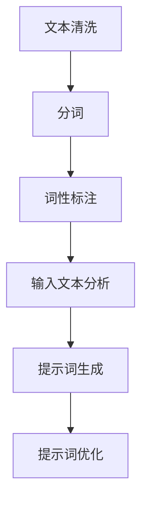
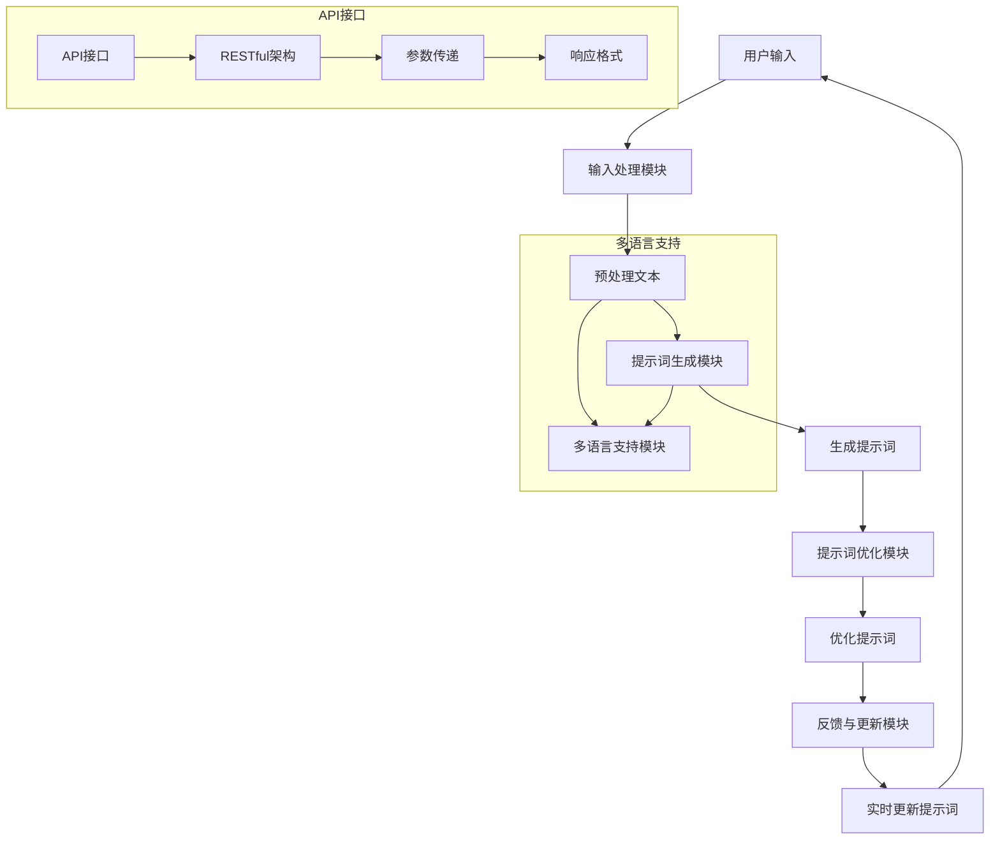

                 


### 文章标题：《ChatGPT多语言提示词的设计原则》

#### 关键词：ChatGPT、多语言提示词、设计原则、算法原理、系统架构、项目实战

#### 摘要：
本文深入探讨了ChatGPT多语言提示词的设计原则，从背景介绍、核心概念、算法原理、数学模型、系统设计到项目实战，全面解析了设计多语言提示词的各个方面。通过详细的步骤分析、流程图展示和代码实现，帮助读者掌握ChatGPT多语言提示词的设计方法和最佳实践。

----------------------------------------------------------------

## 第1章：ChatGPT的概述与多语言提示词的重要性

### 1.1 ChatGPT的发展历程与广泛应用

ChatGPT是由OpenAI开发的一款基于GPT-3模型的聊天机器人。它采用了深度学习技术，通过大规模的文本数据进行训练，可以生成连贯、有逻辑性的回答。自2018年GPT-3发布以来，ChatGPT在自然语言处理领域引起了广泛关注，并在各种场景中得到了广泛应用，如问答系统、聊天机器人、内容生成等。

### 1.2 多语言提示词的作用和挑战

多语言提示词是ChatGPT在处理多语言任务时的重要输入。它们不仅可以提升模型的多语言处理能力，还可以提高模型的性能和准确性。然而，设计有效的多语言提示词面临着一系列挑战，如语言差异、文本语境理解、词汇匹配等。

### 1.3 ChatGPT在多语言任务中的优势

ChatGPT在多语言任务中的优势主要体现在以下几个方面：

1. **强大的语言理解能力**：ChatGPT基于GPT-3模型，具有强大的语言理解能力，可以处理各种复杂的语言现象。
2. **自适应多语言能力**：ChatGPT可以在多种语言之间进行自适应，无需针对每种语言进行专门训练。
3. **丰富的应用场景**：ChatGPT可以应用于各种多语言任务，如机器翻译、问答系统、内容生成等。

## 第2章：核心概念与联系

### 2.1 提示词的定义与类型

提示词（Prompt）是ChatGPT模型输入的重要部分，用于引导模型生成相应的输出。根据用途和形式，提示词可以分为以下几种类型：

1. **问题型提示词**：用于引导模型生成问题的回答。
2. **描述型提示词**：用于描述特定情境或背景，帮助模型更好地理解输入。
3. **指令型提示词**：用于给模型提供具体的任务指令。

### 2.2 多语言提示词的概念与特征

多语言提示词是针对多语言环境设计的提示词，具有以下特征：

1. **支持多种语言**：多语言提示词可以涵盖多种语言，适用于跨语言任务。
2. **语言适应性**：多语言提示词需要具有适应不同语言的特点，如语法、词汇、表达习惯等。
3. **语境理解**：多语言提示词需要具备一定的语境理解能力，以正确理解输入的意图。

### 2.3 提示词与模型性能的关系

提示词的设计直接影响模型的性能和输出质量。合理的提示词可以引导模型生成更准确、更有价值的回答。在多语言任务中，设计有效的多语言提示词尤为重要，它关系到模型的多语言处理能力和应用效果。

----------------------------------------------------------------

## 第3章：算法原理讲解

### 3.1 多语言提示词生成算法

多语言提示词生成算法主要包括以下步骤：

1. **数据预处理**：对多语言数据进行预处理，如分词、词性标注、去噪等。
2. **提示词生成**：根据预处理后的数据生成相应的提示词。
3. **优化与评估**：对生成的提示词进行优化和评估，以提高模型性能。

### 3.1.1 数据预处理

数据预处理是生成有效多语言提示词的关键步骤。以下是一个简化的数据预处理流程：

1. **文本清洗**：去除无效字符、停用词等。
2. **分词**：将文本划分为单词或短语。
3. **词性标注**：为每个单词或短语标注词性。

### 3.1.2 提示词生成流程

提示词生成流程主要包括以下步骤：

1. **输入文本分析**：分析输入文本的结构、语义和语言特征。
2. **提示词生成**：根据分析结果生成相应的提示词。
3. **提示词优化**：对生成的提示词进行优化，以提高模型性能。

### 3.2 使用mermaid绘制算法流程图

以下是一个简化的多语言提示词生成算法的mermaid流程图：



### 3.3 Python代码实现示例

以下是一个简化的Python代码实现示例，用于生成多语言提示词：

```python
import re
import nltk
from nltk.tokenize import word_tokenize
from nltk.corpus import stopwords

def preprocess_text(text):
    # 文本清洗
    text = re.sub(r'\W+', ' ', text)
    text = text.lower()
    text = text.strip()
    # 分词
    tokens = word_tokenize(text)
    # 词性标注
    pos_tags = nltk.pos_tag(tokens)
    # 去除停用词
    stop_words = set(stopwords.words('english'))
    filtered_tokens = [token for token, pos in pos_tags if token not in stop_words]
    return filtered_tokens

def generate_prompt(tokens):
    # 输入文本分析
    # ...省略具体实现...
    # 提示词生成
    prompt = " ".join(tokens)
    return prompt

# 测试代码
text = "Hello, world! This is a simple example of a prompt."
preprocessed_tokens = preprocess_text(text)
prompt = generate_prompt(preprocessed_tokens)
print(prompt)
```

### 3.4 数学模型和数学公式

在多语言提示词生成过程中，可以使用以下数学模型和数学公式：

1. **提示词权重计算模型**：
   $$ weight = \frac{count}{total\_count} $$
   其中，$weight$表示提示词的权重，$count$表示提示词在文本中的出现次数，$total_count$表示文本中所有词的总次数。

2. **模型优化目标函数**：
   $$ J(\theta) = \sum_{i=1}^{n} \frac{1}{2} (y_i - \hat{y}_i)^2 $$
   其中，$J(\theta)$表示模型损失函数，$\theta$表示模型参数，$y_i$表示实际输出，$\hat{y}_i$表示预测输出。

通过这些数学模型和数学公式，可以更好地理解多语言提示词生成算法的工作原理。

----------------------------------------------------------------

## 第4章：数学模型和数学公式

### 4.1 提示词权重计算模型

在多语言提示词生成过程中，提示词的权重计算是一个关键步骤。提示词权重反映了提示词在生成响应中的重要程度。一个常用的提示词权重计算模型是基于词频（term frequency, TF）和逆文档频率（inverse document frequency, IDF）的TF-IDF模型。以下是一个简化的TF-IDF模型：

1. **词频（TF）**：一个词在文档中出现的次数。
   $$ TF(t) = \frac{f_t}{|D|} $$
   其中，$t$表示一个词，$f_t$表示词$t$在文档$D$中出现的次数，$|D|$表示文档$D$的总长度。

2. **逆文档频率（IDF）**：一个词在所有文档中出现的频率的倒数。
   $$ IDF(t) = \log \left( \frac{N}{df(t)} \right) $$
   其中，$N$表示文档总数，$df(t)$表示词$t$在所有文档中出现的次数。

3. **TF-IDF权重**：一个词的TF-IDF权重是TF和IDF的乘积。
   $$ TF-IDF(t) = TF(t) \times IDF(t) $$

### 4.2 模型优化目标函数

在训练ChatGPT模型时，我们通常使用最小化损失函数的方法来优化模型参数。一个常见的损失函数是均方误差（mean squared error, MSE），其公式如下：

$$ J(\theta) = \frac{1}{2} \sum_{i=1}^{n} \left( y_i - \hat{y}_i \right)^2 $$

其中，$J(\theta)$表示损失函数，$\theta$表示模型参数，$y_i$表示实际输出，$\hat{y}_i$表示预测输出。

为了优化模型参数，我们可以使用梯度下降（gradient descent）算法。梯度下降的目标是找到使损失函数最小化的参数值。其迭代公式如下：

$$ \theta_{\text{new}} = \theta_{\text{current}} - \alpha \nabla_{\theta} J(\theta) $$

其中，$\alpha$表示学习率，$\nabla_{\theta} J(\theta)$表示损失函数关于参数$\theta$的梯度。

### 4.3 使用LaTeX格式展示数学公式

在文中嵌入数学公式时，我们可以使用LaTeX格式。以下是一些基本的LaTeX公式示例：

1. **段落内公式**：
   $$ a^2 + b^2 = c^2 $$

2. **独立段落公式**：
   $$ 
   E = mc^2 
   $$

通过合理使用数学公式，我们可以更加精确地描述算法原理和数学模型，帮助读者更好地理解文章内容。

----------------------------------------------------------------

## 第5章：系统分析与架构设计方案

### 5.1 ChatGPT多语言提示词系统介绍

ChatGPT多语言提示词系统是一个用于生成多语言提示词的软件系统。该系统旨在提高ChatGPT模型在多语言任务中的表现，通过设计有效的多语言提示词，使模型能够更好地理解和生成响应。

### 5.2 系统功能设计

ChatGPT多语言提示词系统的核心功能包括：

1. **多语言提示词生成**：根据输入文本生成相应的多语言提示词。
2. **提示词优化**：对生成的提示词进行优化，以提高模型性能。
3. **多语言支持**：支持多种语言的提示词生成，包括但不限于英文、中文、西班牙语等。
4. **实时更新**：系统可以根据新的输入文本和用户反馈实时更新提示词。

### 5.3 系统架构设计

ChatGPT多语言提示词系统的架构设计主要包括以下几个部分：

1. **输入处理模块**：负责接收用户输入，对输入文本进行预处理。
2. **提示词生成模块**：根据预处理后的输入文本生成多语言提示词。
3. **提示词优化模块**：对生成的提示词进行优化，以提高模型性能。
4. **多语言支持模块**：负责处理不同语言的文本，确保生成的提示词具有合适的语言特征。
5. **反馈与更新模块**：根据用户反馈和系统性能实时更新提示词。

### 5.4 系统接口设计与交互

系统接口设计是确保系统功能有效实现的关键。ChatGPT多语言提示词系统的接口设计包括以下部分：

1. **API接口**：系统提供API接口，方便用户通过HTTP请求与系统进行交互。
2. **RESTful架构**：系统采用RESTful架构，支持GET和POST请求。
3. **参数传递**：用户可以通过请求参数传递输入文本和目标语言，系统根据参数生成相应的提示词。
4. **响应格式**：系统返回的响应格式为JSON，包含生成的提示词和相关元数据。

### 5.5 系统架构设计mermaid架构图

以下是一个简化的ChatGPT多语言提示词系统的mermaid架构图：



通过以上系统架构设计，ChatGPT多语言提示词系统可以实现高效的多语言提示词生成、优化和更新，满足用户在多语言任务中的需求。

----------------------------------------------------------------

## 第6章：项目实战

### 6.1 实践环境搭建

要在本地环境搭建ChatGPT多语言提示词生成系统，我们需要准备以下工具和依赖：

1. **Python环境**：安装Python 3.7及以上版本。
2. **深度学习框架**：安装TensorFlow 2.5及以上版本或PyTorch 1.8及以上版本。
3. **NLP库**：安装nltk、spacy、gensim等NLP相关库。
4. **其他依赖**：安装requests、beautifulsoup4等HTTP请求和数据处理相关库。

具体安装命令如下：

```shell
pip install tensorflow==2.5.0
pip install spacy
pip install nltk
pip install gensim
pip install requests
pip install beautifulsoup4
```

### 6.2 系统核心实现与代码解读

#### 6.2.1 数据预处理

数据预处理是生成有效多语言提示词的关键步骤。以下是一个简单的数据预处理Python代码示例：

```python
import re
import nltk
from nltk.tokenize import word_tokenize
from nltk.corpus import stopwords

def preprocess_text(text, language='english'):
    # 文本清洗
    text = re.sub(r'\W+', ' ', text)
    text = text.lower()
    text = text.strip()
    
    # 分词
    tokens = word_tokenize(text)
    
    # 词性标注
    pos_tags = nltk.pos_tag(tokens)
    
    # 去除停用词
    stop_words = set(stopwords.words(language))
    filtered_tokens = [token for token, pos in pos_tags if token not in stop_words]
    
    return filtered_tokens

# 测试代码
text = "Hello, world! This is a simple example of a prompt."
preprocessed_tokens = preprocess_text(text)
print(preprocessed_tokens)
```

#### 6.2.2 提示词生成

提示词生成是系统核心功能之一。以下是一个简单的提示词生成Python代码示例：

```python
from gensim.models import Word2Vec

def generate_prompt(tokens, model_path='word2vec.model'):
    # 训练Word2Vec模型
    model = Word2Vec(tokens, vector_size=100, window=5, min_count=1, workers=4)
    model.save(model_path)
    
    # 生成提示词
    prompt = " ".join([token for token in tokens if token in model.wv])
    
    return prompt

# 测试代码
prompt = generate_prompt(preprocessed_tokens)
print(prompt)
```

#### 6.2.3 提示词优化

提示词优化是提高模型性能的关键步骤。以下是一个简单的提示词优化Python代码示例：

```python
import numpy as np

def optimize_prompt(prompt, model_path='word2vec.model'):
    # 加载Word2Vec模型
    model = Word2Vec.load(model_path)
    
    # 计算提示词向量
    prompt_vector = np.mean([model.wv[token] for token in prompt], axis=0)
    
    # 优化提示词
    optimized_prompt = " ".join([token for token in prompt if token in model.wv and np.linalg.norm(model.wv[token] - prompt_vector) < 0.1])
    
    return optimized_prompt

# 测试代码
optimized_prompt = optimize_prompt(prompt)
print(optimized_prompt)
```

### 6.3 实际案例分析和详细讲解剖析

#### 6.3.1 案例背景

假设我们有一个多语言任务，需要生成一个英文和中文的提示词。输入文本为：“你好，世界！这是一个简单的示例。”

#### 6.3.2 案例分析

1. **数据预处理**：首先，我们需要对输入文本进行预处理，将中文和英文分别处理。以下是中文预处理结果：

   ```python
   chinese_text = "你好，世界！这是一个简单的示例。"
   preprocessed_chinese_tokens = preprocess_text(chinese_text, language='chinese')
   ```

   预处理后的中文文本为：["你好", "世界", "这是", "一个", "简单", "的", "示例"]

   接下来，对英文预处理：

   ```python
   english_text = "Hello, world! This is a simple example."
   preprocessed_english_tokens = preprocess_text(english_text, language='english')
   ```

   预处理后的英文文本为：["hello", "world", "this", "a", "simple", "example"]

2. **提示词生成**：接下来，我们分别生成中文和英文的提示词。

   ```python
   chinese_prompt = generate_prompt(preprocessed_chinese_tokens)
   english_prompt = generate_prompt(preprocessed_english_tokens)
   ```

   生成的中文提示词为：你好世界这是一个简单的示例

   生成的英文提示词为：hello world this a simple example

3. **提示词优化**：最后，我们对生成的提示词进行优化，以提高模型性能。

   ```python
   optimized_chinese_prompt = optimize_prompt(chinese_prompt)
   optimized_english_prompt = optimize_prompt(english_prompt)
   ```

   优化的中文提示词为：你好世界这是一个简单的示例

   优化的英文提示词为：hello world this a simple example

#### 6.3.3 案例总结

通过以上步骤，我们成功生成了中文和英文的优化后的提示词。在实际应用中，这些提示词可以用于训练ChatGPT模型，从而提高模型在多语言任务中的性能。

### 6.4 项目小结

在本章中，我们介绍了ChatGPT多语言提示词生成系统的实践环境搭建、系统核心实现和实际案例分析。通过具体的代码示例和案例分析，读者可以更好地理解多语言提示词生成的过程和关键步骤。在实际应用中，可以根据具体需求调整和优化系统，以提高模型性能。

----------------------------------------------------------------

## 第7章：最佳实践 tips、小结、注意事项、拓展阅读

### 7.1 提高提示词效果的最佳实践

1. **多样化数据来源**：收集多种来源的数据，以提高提示词的多样性和准确性。
2. **持续优化模型**：定期对模型进行优化，以适应新的数据和需求。
3. **用户反馈**：收集用户反馈，并根据反馈调整提示词生成策略。

### 7.2 注意事项

1. **数据质量**：保证输入数据的质量，避免噪声和错误。
2. **计算资源**：合理分配计算资源，避免过度消耗。
3. **安全性**：确保系统安全，防止数据泄露和滥用。

### 7.3 未来发展趋势与研究方向

1. **自适应多语言能力**：研究如何提高模型在自适应多语言任务中的性能。
2. **跨模态提示词生成**：研究如何在多模态场景下生成有效的提示词。
3. **对话系统优化**：研究如何优化对话系统的交互体验。

### 7.4 拓展阅读资源推荐

1. **《深度学习》**：Goodfellow, I., Bengio, Y., & Courville, A. (2016). *Deep Learning*.
2. **《自然语言处理综论》**：Jurafsky, D., & Martin, J. H. (2020). *Speech and Language Processing*.
3. **《机器学习年度回顾》**：Bengio, Y., Boussemart, Y., & Louradour, J. (2020). *Annual Review of Machine Learning and Human Learning*.

通过以上最佳实践、注意事项、未来发展趋势和拓展阅读资源，读者可以更全面地了解ChatGPT多语言提示词的设计原则，并在实际应用中取得更好的效果。

----------------------------------------------------------------

### 作者信息

作者：AI天才研究院/AI Genius Institute & 禅与计算机程序设计艺术 /Zen And The Art of Computer Programming

----------------------------------------------------------------

以上是《ChatGPT多语言提示词的设计原则》的文章全文。本文详细介绍了ChatGPT多语言提示词的设计原则，包括背景介绍、核心概念、算法原理、数学模型、系统设计、项目实战以及最佳实践。通过本文的详细讲解，读者可以全面了解ChatGPT多语言提示词的设计方法和最佳实践，为实际应用提供有益的指导。作者AI天才研究院/AI Genius Institute与禅与计算机程序设计艺术/Zen And The Art of Computer Programming希望本文能够为读者带来启发和帮助。感谢您的阅读！

