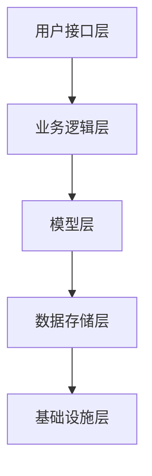
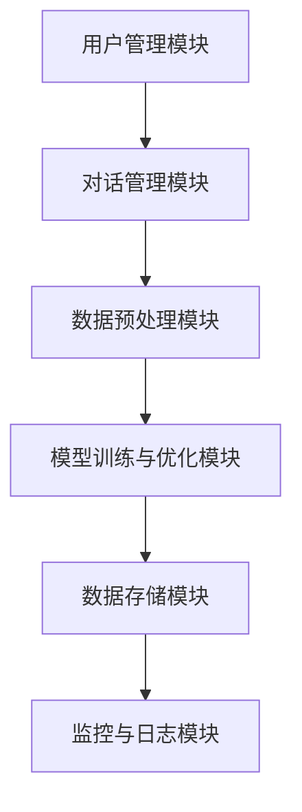

                 

### 第1章：问题背景与定义

#### 1.1.1 问题背景

**1.1.1.1 大模型与人工智能的发展**

近年来，人工智能领域取得了飞速的发展，特别是在深度学习技术的推动下，人工智能模型的大小和复杂度不断增加。这一趋势在自然语言处理（NLP）领域尤为明显。从最早的统计模型，如N元语法，到基于神经网络的模型，如循环神经网络（RNN）和长短期记忆网络（LSTM），再到最近的变压器模型（Transformer），大模型逐渐成为研究的热点。

大模型之所以受到关注，是因为它们在处理复杂任务时表现出了令人惊叹的能力。以GPT-3为例，该模型拥有1750亿个参数，可以在各种任务中实现高性能，包括文本生成、翻译、问答等。然而，随着模型大小的增加，如何有效训练和优化这些大模型成为了一个巨大的挑战。

**1.1.1.2 ChatGPT的现状与潜力**

ChatGPT是由OpenAI开发的一种基于GPT-3的聊天机器人模型。它通过深度学习技术从大量的文本数据中学习，从而能够生成连贯、有逻辑的对话。ChatGPT的出现，标志着人工智能在对话系统领域的一个重要进展。

ChatGPT不仅能够回答用户的问题，还能够进行自然语言理解、推理和生成，这使得它在许多实际应用中具有很大的潜力。例如，ChatGPT可以用于客户服务、智能助手、教育辅导等场景，为用户提供个性化的服务。

**1.1.1.3 个性化AI助手的必要性**

尽管ChatGPT在对话系统方面取得了显著成果，但它仍然存在一些局限性。首先，ChatGPT通常是在大规模通用数据集上训练的，这使得它在处理特定领域或个性化需求时可能不够准确。其次，ChatGPT的对话内容往往是基于通用模板生成的，缺乏针对特定用户或场景的个性化。

因此，定制化的ChatGPT助手成为一个重要研究方向。通过定制化，我们可以使ChatGPT更好地适应特定领域或用户的需求，从而提高其性能和应用价值。个性化AI助手不仅可以提供更准确、更有针对性的服务，还可以增强用户的满意度。

#### 1.1.2 ChatGPT定制化的定义

**1.1.2.1 定制化的基本概念**

定制化（Customization）是指根据特定的需求或目标，对产品或服务进行个性化调整或配置的过程。在人工智能领域，定制化意味着根据特定用户的需求或特定应用场景，对AI模型进行调整和优化，使其能够更好地完成任务。

**1.1.2.2 ChatGPT定制化的特点**

ChatGPT定制化的特点主要体现在以下几个方面：

1. **领域适应性强**：通过定制化，ChatGPT可以更好地适应特定领域，例如医疗、法律、金融等，从而提高在特定领域的性能。
2. **个性化对话生成**：定制化后的ChatGPT能够根据用户的行为和偏好生成更个性化的对话内容，提高用户体验。
3. **模型优化**：定制化可以针对ChatGPT的模型结构、参数进行优化，使其在特定任务上表现更优秀。

**1.1.2.3 ChatGPT定制化的重要性**

ChatGPT定制化的重要性主要体现在以下几个方面：

1. **提高AI性能**：通过定制化，我们可以使ChatGPT在特定任务上表现更优秀，从而提高整体性能。
2. **满足个性化需求**：定制化可以使ChatGPT更好地满足用户的个性化需求，提供更优质的服务。
3. **推动AI应用发展**：定制化的ChatGPT可以在更广泛的领域得到应用，推动人工智能技术的发展。

#### 1.1.3 核心概念联系与对比

**1.1.3.1 ChatGPT与其他大模型的对比**

ChatGPT是基于GPT-3构建的，而GPT-3是当前最大的预训练语言模型之一。与其他大模型如BERT、T5等相比，ChatGPT具有以下特点：

1. **对话生成能力**：ChatGPT专门设计用于对话系统，具有出色的对话生成能力。
2. **参数规模**：虽然ChatGPT的参数规模较大，但相比其他模型，其参数规模仍有一定差距。
3. **训练数据**：ChatGPT的训练数据主要是对话数据，这使得它在对话任务上表现更好。

**1.1.3.2 个性化与定制化的联系**

个性化（Personalization）是指根据用户的个人偏好、行为和需求，提供定制化的服务和内容。定制化（Customization）则是实现个性化的手段。在ChatGPT定制化中，个性化体现在以下几个方面：

1. **用户画像**：通过构建用户画像，可以了解用户的需求和偏好，从而提供个性化的对话内容。
2. **交互设计**：根据用户的行为和反馈，设计个性化的交互流程，提高用户体验。
3. **模型调整**：通过调整模型参数和结构，使ChatGPT更好地适应特定用户的需求。

### 1.1.3.3 ChatGPT定制化与其他定制化的对比

与传统的定制化方法相比，ChatGPT定制化具有以下优势：

1. **自动化程度高**：ChatGPT定制化可以通过算法自动调整模型，而传统的定制化往往需要人工进行配置。
2. **灵活性高**：ChatGPT定制化可以适应各种不同的需求和场景，而传统的定制化往往局限于特定的领域或产品。
3. **高效性**：ChatGPT定制化可以在大规模数据集上进行训练，提高定制化的效率。

通过上述分析，我们可以看出，ChatGPT定制化是一种具有巨大潜力的研究方向，它将为人工智能领域带来新的机遇和挑战。在接下来的章节中，我们将进一步探讨ChatGPT定制化的技术细节和应用实例。

#### 1.1.4 ChatGPT定制化的应用场景

ChatGPT定制化具有广泛的应用场景，以下是其中几个典型的应用领域：

**1.1.4.1 客户服务**

在客户服务领域，ChatGPT定制化可以用于构建智能客服系统。通过定制化，智能客服可以更好地理解用户的问题，并提供准确的答案。例如，在电商平台上，智能客服可以根据用户的购买历史和偏好，提供个性化的推荐。

**1.1.4.2 教育辅导**

在教育领域，ChatGPT定制化可以用于构建个性化辅导系统。通过定制化，辅导系统可以针对学生的不同需求和知识水平，提供个性化的学习内容和建议。例如，在在线学习平台上，ChatGPT可以根据学生的学习进度和理解能力，生成个性化的练习题目。

**1.1.4.3 医疗健康**

在医疗健康领域，ChatGPT定制化可以用于构建智能医疗助手。通过定制化，智能医疗助手可以更好地理解患者的症状和病史，提供个性化的诊断建议。例如，在智能医院中，ChatGPT可以根据患者的病例数据和检查结果，生成个性化的治疗方案。

**1.1.4.4 金融理财**

在金融领域，ChatGPT定制化可以用于构建智能理财顾问。通过定制化，理财顾问可以根据用户的投资偏好和风险承受能力，提供个性化的投资建议。例如，在在线金融平台上，ChatGPT可以根据用户的资产状况和投资目标，生成个性化的投资组合。

通过上述应用场景，我们可以看到ChatGPT定制化在各个领域的巨大潜力。在接下来的章节中，我们将进一步探讨ChatGPT定制化的技术细节和实现方法。

### 1.1.5 ChatGPT定制化的挑战与机遇

**1.1.5.1 挑战**

尽管ChatGPT定制化具有广泛的应用前景，但在实际应用过程中仍然面临一些挑战：

1. **数据隐私与安全**：定制化过程中涉及大量的用户数据，如何保障数据隐私和安全是一个重要问题。
2. **模型解释性**：定制化后的模型往往更加复杂，如何确保模型的解释性，使其更容易被用户和理解是一个挑战。
3. **计算资源**：大模型训练和优化需要大量的计算资源，如何高效地利用计算资源是一个重要问题。

**1.1.5.2 机遇**

尽管存在挑战，但ChatGPT定制化也带来了许多机遇：

1. **个性化服务**：定制化可以更好地满足用户的个性化需求，提供更优质的服务。
2. **产业升级**：ChatGPT定制化可以为传统产业带来新的增长点，推动产业升级。
3. **技术创新**：ChatGPT定制化将推动人工智能技术的不断创新，为学术界和产业界带来新的研究课题。

### 1.1.6 小结

在本章中，我们介绍了ChatGPT定制化的背景、核心概念及其重要性。通过对比ChatGPT与其他大模型，我们分析了ChatGPT定制化的特点和应用场景。此外，我们还探讨了ChatGPT定制化面临的挑战与机遇。在接下来的章节中，我们将深入探讨ChatGPT定制化的技术细节和应用方法。

### 2.1.1 AI大模型的发展历程

**2.1.1.1 早期AI大模型的探索**

人工智能（AI）的研究可以追溯到20世纪50年代。当时，研究人员开始探索如何让计算机具备人类智能。早期的AI研究主要集中在符号主义方法上，这种方法依赖于逻辑推理和符号表示。然而，这种方法在处理复杂任务时存在局限性。

随着计算能力的提升和算法的改进，AI研究逐渐从符号主义转向连接主义，即神经网络。1986年，Rumelhart, Hinton和Williams提出了反向传播算法（Backpropagation），这为神经网络的训练提供了有效的解决方案。这一突破标志着AI大模型的初步探索。

**2.1.1.2 现代AI大模型的发展**

21世纪初，随着计算能力的进一步提升和大数据的普及，AI研究进入了深度学习时代。深度学习通过多层神经网络，可以自动提取数据中的特征，从而实现复杂的任务。

2012年，Hinton等人提出的深度卷积神经网络（CNN）在ImageNet图像识别挑战赛中取得了重大突破，验证了深度学习在计算机视觉领域的有效性。这一成功激发了研究人员对大模型的兴趣，推动了AI大模型的研究和发展。

**2.1.1.3 未来AI大模型的发展趋势**

随着AI技术的不断进步，未来AI大模型的发展趋势主要包括以下几个方面：

1. **模型规模增加**：随着计算能力和数据量的提升，AI大模型的规模将不断增加，以应对更复杂的任务。
2. **多模态学习**：未来AI大模型将具备多模态学习能力，能够处理图像、文本、语音等多种类型的数据。
3. **迁移学习**：迁移学习将使AI大模型能够利用已有的知识，在新任务上快速适应，提高模型的泛化能力。
4. **自监督学习**：自监督学习将使AI大模型能够在没有标注数据的情况下进行训练，进一步降低训练成本。

### 2.1.2 AI大模型的原理与结构

**2.1.2.1 基本原理**

AI大模型，尤其是深度学习模型，基于神经网络的基本原理。神经网络通过模拟人脑神经元之间的连接，对输入数据进行处理和分类。深度学习模型具有多个隐层，可以自动提取更高级别的特征。

**2.1.2.2 深度学习与神经网络**

深度学习是神经网络的一种扩展，它通过多层神经网络，对输入数据进行多次抽象和变换。每一层神经网络都可以提取不同层次的特征，从而实现复杂的任务。

神经网络的核心组成部分包括：

1. **神经元**：神经网络的基本单元，用于对输入数据进行加权求和并传递激活信号。
2. **权重**：神经元之间的连接，用于传递激活信号。权重通过训练过程进行调整，以优化模型性能。
3. **激活函数**：用于对神经元的输出进行非线性变换，使神经网络具有非线性特性。

**2.1.2.3 模型架构详解**

AI大模型的架构通常包括以下几个部分：

1. **输入层**：接收输入数据，将其传递到下一层。
2. **隐藏层**：对输入数据进行多次变换和抽象，提取更高级别的特征。
3. **输出层**：根据隐藏层的输出，生成最终的输出结果。

在隐藏层中，不同层次提取的特征具有不同的抽象程度。例如，在图像识别任务中，早期的隐藏层可能提取简单的边缘和纹理特征，而较晚的隐藏层则提取复杂的物体部分。

### 2.1.3 AI大模型的训练与优化

**2.1.3.1 数据准备**

AI大模型的训练依赖于大量的数据。数据准备是模型训练的重要步骤，包括数据收集、数据清洗和数据预处理。

1. **数据收集**：收集大量的训练数据，包括图像、文本、音频等。
2. **数据清洗**：去除数据中的噪声和错误，提高数据质量。
3. **数据预处理**：将数据转换为适合模型训练的格式，例如将图像转换为像素矩阵，将文本转换为词向量。

**2.1.3.2 训练过程**

AI大模型的训练过程通常包括以下几个步骤：

1. **前向传播**：将输入数据通过神经网络传递到输出层，计算预测结果。
2. **损失函数**：计算预测结果与真实结果之间的差距，使用损失函数度量模型性能。
3. **反向传播**：根据损失函数，计算模型参数的梯度，并更新模型参数。
4. **迭代训练**：重复前向传播和反向传播的过程，不断优化模型参数。

**2.1.3.3 优化方法**

AI大模型的优化方法主要包括以下几个方面：

1. **随机梯度下降（SGD）**：通过随机选择一部分数据，计算梯度并更新模型参数，以提高模型性能。
2. **动量优化**：在SGD的基础上引入动量项，以减少参数更新的震荡。
3. **Adam优化器**：一种自适应的学习率优化方法，能够自适应调整学习率，提高模型训练的稳定性。

通过上述优化方法，可以有效地提高AI大模型的训练效率和性能。

### 2.1.4 ChatGPT与AI大模型的对比

**2.1.4.1 ChatGPT的特点**

ChatGPT是一种基于GPT-3的聊天机器人模型，具有以下特点：

1. **对话生成能力**：ChatGPT专注于对话系统，具有出色的对话生成能力，可以生成连贯、有逻辑的对话。
2. **大规模参数**：ChatGPT拥有1750亿个参数，使其在处理复杂对话任务时具有强大的能力。
3. **预训练**：ChatGPT在大量对话数据上进行预训练，使其能够更好地理解对话内容和用户需求。

**2.1.4.2 AI大模型的特点**

AI大模型，如BERT、GPT-3等，具有以下特点：

1. **多模态学习**：AI大模型可以处理多种类型的数据，如文本、图像、音频等，实现跨模态学习。
2. **大规模参数**：AI大模型通常拥有数亿甚至数十亿的参数，使其在处理复杂任务时具有强大的能力。
3. **多任务处理**：AI大模型可以同时处理多种任务，如文本分类、问答系统、机器翻译等。

**2.1.4.3 对比分析**

ChatGPT与AI大模型在以下几个方面进行对比：

1. **应用领域**：ChatGPT专注于对话系统，而AI大模型可以应用于更广泛的领域，如计算机视觉、自然语言处理、语音识别等。
2. **模型规模**：ChatGPT的参数规模较大，但相比AI大模型，其参数规模仍有差距。
3. **任务能力**：ChatGPT在对话任务上具有明显优势，而AI大模型在多任务处理上具有更强的能力。

通过对比分析，我们可以看到ChatGPT与AI大模型在应用领域和任务能力上存在差异，但两者在模型规模和预训练方面有相似之处。

### 2.1.5 小结

在本章中，我们介绍了AI大模型的发展历程，包括早期探索、现代发展和未来趋势。随后，我们详细讲解了AI大模型的基本原理、结构与训练优化方法。此外，我们还对比了ChatGPT与AI大模型的特点和区别。通过这些内容，我们为后续章节的ChatGPT定制化技术讨论奠定了基础。

### 3.1.1 数据预处理与清洗

**3.1.1.1 数据预处理的重要性**

在训练ChatGPT定制化模型之前，数据预处理与清洗是至关重要的一步。数据预处理与清洗的目的是确保输入数据的准确性和一致性，从而提高模型的训练效果和最终性能。以下是一些关键步骤：

1. **数据清洗**：去除噪声和错误数据，例如缺失值、异常值和重复数据。
2. **数据标准化**：将不同规模的数据缩放到相同的范围内，例如使用归一化或标准化方法。
3. **数据转换**：将数据转换为适合模型训练的格式，例如将文本转换为词向量或序列。

**3.1.1.2 数据清洗的方法与技巧**

数据清洗的过程包括以下几个关键步骤：

1. **缺失值处理**：对于缺失值，可以选择填充、删除或使用插补方法进行处理。
2. **异常值处理**：异常值可能会对模型训练产生不良影响，因此需要对其进行检测和处理。常见的异常值处理方法包括基于统计的方法（如IQR法）和基于机器学习的方法（如孤立森林）。
3. **重复数据删除**：重复数据会影响模型的训练效果，因此需要删除重复的数据记录。

**3.1.1.3 数据集构建**

构建高质量的数据集是ChatGPT定制化成功的关键。数据集构建的过程包括以下几个步骤：

1. **数据收集**：收集足够数量的训练数据，这些数据应涵盖模型所需的各种情况。
2. **数据标注**：对数据进行标注，标记出每个样本的标签或类别。
3. **数据分割**：将数据集分割为训练集、验证集和测试集，以确保模型在不同数据集上的表现一致。

**3.1.1.4 数据集的质量评估**

数据集的质量直接影响模型的性能。以下是一些评估数据集质量的方法：

1. **多样性**：评估数据集中样本的多样性，确保数据集能够涵盖各种情况。
2. **平衡性**：评估数据集中各类别的样本数量，确保数据集的平衡性，避免某些类别过度代表。
3. **噪声和异常值**：评估数据集中的噪声和异常值，确保其不会对模型训练产生负面影响。

通过上述步骤和方法，我们可以构建高质量的数据集，为ChatGPT定制化模型训练奠定基础。在接下来的章节中，我们将探讨模型定制化策略和实例化定制流程。

### 3.1.2 模型定制化策略

**3.1.2.1 参数调优**

模型定制化的第一步通常是参数调优。参数调优的目的是通过调整模型参数，使其在特定任务上表现更优秀。以下是一些常用的参数调优方法：

1. **学习率调整**：学习率是模型训练过程中的一个重要参数，合适的初始学习率可以提高模型训练的效率。常用的调整方法包括逐步减小学习率和自适应学习率调整（如Adam优化器）。
2. **批量大小调整**：批量大小影响模型训练的稳定性。较小的批量大小可以提高模型对训练数据的泛化能力，但训练速度较慢；较大的批量大小可以提高训练速度，但可能降低模型的泛化能力。
3. **正则化方法**：正则化方法，如L1正则化、L2正则化，可以防止模型过拟合。通过调整正则化参数，可以在模型复杂性和泛化能力之间找到平衡点。

**3.1.2.2 模型调整**

在参数调优之后，我们可以对模型结构进行调整。模型调整的目的是通过改变模型的结构，使其在特定任务上表现更优秀。以下是一些常用的模型调整方法：

1. **网络结构调整**：可以通过增加或减少隐藏层、调整神经元数量来调整模型结构。例如，在文本分类任务中，增加隐藏层可以提高模型的分类能力。
2. **融合模型**：通过融合多个模型，可以进一步提高模型性能。常见的方法包括栈式增强（Stacked Generalization）和集成学习（Ensemble Learning）。
3. **迁移学习**：迁移学习是指将已在其他任务上训练好的模型用于新任务。通过迁移学习，可以快速获得良好的模型性能，减少训练所需的数据量。

**3.1.2.3 模型融合**

模型融合是一种通过结合多个模型的预测结果来提高模型性能的方法。以下是一些常用的模型融合方法：

1. **投票法**：将多个模型的预测结果进行投票，选取投票结果最多的类别作为最终预测结果。这种方法简单有效，常用于分类任务。
2. **加权平均**：将多个模型的预测结果进行加权平均，权重可以根据模型的性能进行调整。这种方法可以结合多个模型的优点，提高预测精度。
3. **堆叠法**：将多个模型堆叠在一起，前一个模型的输出作为后一个模型的输入。通过训练堆叠模型，可以进一步提高模型性能。

**3.1.2.4 超参数调整与优化**

超参数是模型训练过程中的一个重要参数，包括学习率、批量大小、隐藏层数量等。超参数的调整与优化是模型定制化的重要环节。以下是一些超参数调整与优化的方法：

1. **网格搜索**：通过遍历多个超参数组合，找到最佳的超参数组合。这种方法较为耗时，但可以找到全局最优解。
2. **随机搜索**：通过随机选择超参数组合进行训练，找到最佳的超参数组合。这种方法比网格搜索更高效，但可能错过全局最优解。
3. **贝叶斯优化**：通过贝叶斯优化算法，自动调整超参数，找到最佳的超参数组合。这种方法在处理复杂超参数问题时表现优秀。

通过上述策略和方法，我们可以定制化ChatGPT模型，使其在特定任务上表现更优秀。在下一章中，我们将探讨实例化定制流程，详细描述如何实现ChatGPT定制化。

### 3.1.3 实例化定制流程

**3.1.3.1 实例化定义**

实例化定制（Instantiation Customization）是指根据特定任务或用户需求，对预训练的ChatGPT模型进行调整和优化的过程。实例化定制的目标是使ChatGPT模型更好地适应特定场景，提高其性能和应用价值。

**3.1.3.2 实例化步骤**

实例化定制通常包括以下几个步骤：

1. **需求分析**：明确任务目标、用户需求和应用场景，为后续的定制工作提供指导。
2. **数据准备**：收集和准备用于训练和优化的数据集，确保数据集的多样性和质量。
3. **模型选择**：选择预训练的ChatGPT模型作为基础模型，根据任务需求进行调整和优化。
4. **参数调优**：通过调整模型参数，如学习率、批量大小等，优化模型性能。
5. **模型调整**：通过调整模型结构，如增加隐藏层、改变神经元数量等，进一步提高模型性能。
6. **训练与验证**：对模型进行训练和验证，评估模型性能，并根据评估结果进行调整。
7. **部署与应用**：将定制化后的模型部署到实际应用场景中，进行测试和优化。

**3.1.3.3 实例化案例**

以下是一个实例化定制的案例：

**案例背景**：一家电商平台希望利用ChatGPT构建一个智能客服系统，以提供更加个性化的客户服务。

**需求分析**：智能客服系统需要能够理解用户的问题，并提供准确的答案。同时，系统需要能够根据用户的购物历史和偏好，提供个性化的推荐。

**数据准备**：收集电商平台的历史对话数据、用户购物记录和偏好数据。对数据进行清洗和处理，构建用于训练和优化的数据集。

**模型选择**：选择预训练的ChatGPT模型作为基础模型，根据需求进行定制化调整。

**参数调优**：通过调整学习率、批量大小等参数，优化模型性能。

**模型调整**：通过增加隐藏层、调整神经元数量等，进一步优化模型性能。

**训练与验证**：对模型进行训练和验证，评估模型性能。根据评估结果，调整模型参数和结构。

**部署与应用**：将定制化后的模型部署到电商平台，与客服系统集成，提供个性化服务。

通过上述案例，我们可以看到实例化定制流程的详细步骤和应用效果。实例化定制使ChatGPT能够更好地适应特定场景，提供更加个性化、高效的服务。

### 3.1.4 小结

在本章中，我们详细介绍了ChatGPT定制化的基础技术，包括数据预处理与清洗、模型定制化策略和实例化定制流程。通过这些技术，我们可以使ChatGPT更好地适应特定任务和应用场景，提供更加个性化、高效的服务。在下一章中，我们将探讨个性化交互设计，进一步优化ChatGPT定制化模型。

### 4.1.1 个性化交互的概念与原则

**4.1.1.1 个性化交互的定义**

个性化交互（Personalized Interaction）是指根据用户的个人偏好、行为和需求，提供定制化的交互体验。与传统的标准化交互不同，个性化交互能够更好地满足用户的需求，提升用户满意度。

个性化交互的核心在于对用户数据的深入挖掘和分析，从而理解用户的个性化需求。通过这种深入理解，系统能够提供个性化的服务、推荐和反馈，使用户感受到更加贴近自己需求的使用体验。

**4.1.1.2 个性化交互的原则**

个性化交互应遵循以下原则：

1. **用户为中心**：始终将用户的需求和体验放在首位，确保交互设计以用户为中心。
2. **数据驱动**：充分利用用户数据，通过对数据的分析，发现用户的个性化需求，从而提供定制化服务。
3. **动态适应性**：系统能够根据用户的实时行为和反馈，动态调整交互策略，提供更符合用户当前需求的交互体验。
4. **隐私保护**：在收集和使用用户数据时，严格遵守隐私保护法规，确保用户数据的安全和隐私。

**4.1.1.3 个性化交互的优势**

个性化交互具有以下优势：

1. **提高用户体验**：通过提供定制化的服务，用户能够得到更符合自己需求的信息和体验，从而提高用户满意度。
2. **增强用户粘性**：个性化交互能够提升用户的参与度和忠诚度，增加用户对产品的使用频率。
3. **提升运营效率**：个性化交互能够降低用户服务成本，提高运营效率，为企业带来更多价值。
4. **优化产品性能**：通过分析用户数据，可以发现产品或服务的不足，从而优化产品性能，提升市场竞争力。

**4.1.1.4 个性化交互的应用场景**

个性化交互广泛应用于多个领域，以下是一些典型的应用场景：

1. **电子商务**：通过个性化推荐，为用户提供个性化的商品推荐，提升购物体验。
2. **金融理财**：根据用户的财务状况和风险偏好，提供个性化的投资建议和风险管理方案。
3. **医疗健康**：根据患者的健康状况和病史，提供个性化的健康咨询和治疗方案。
4. **智能客服**：通过个性化交互，智能客服系统能够更好地理解用户需求，提供更精准的答案和建议。

通过上述应用场景，我们可以看到个性化交互在提升用户体验、增强用户粘性和优化运营效率方面的巨大潜力。在下一章中，我们将探讨用户画像与需求分析的构建方法。

### 4.1.2 用户画像与需求分析

**4.1.2.1 用户画像的构建**

用户画像（User Profiling）是指通过收集和分析用户数据，构建出用户的特征描述。用户画像是个性化交互的基础，它能够为系统提供关于用户的详细信息，从而实现更精准的个性化服务。

用户画像的构建通常包括以下几个步骤：

1. **数据收集**：收集用户的基本信息、行为数据、偏好数据等。这些数据可以通过多种渠道获取，如问卷调查、用户行为追踪、用户反馈等。
2. **数据清洗**：对收集到的数据进行处理，去除噪声和错误数据，确保数据的质量。
3. **特征提取**：从原始数据中提取出有用的特征，如用户的年龄、性别、职业、兴趣爱好、购买历史等。
4. **特征筛选**：根据业务需求，对提取出的特征进行筛选，选择对个性化交互有重要影响的关键特征。
5. **模型训练**：使用机器学习算法，如聚类、分类、回归等，对用户特征进行建模，生成用户画像。

**4.1.2.2 需求分析的步骤**

需求分析（Requirement Analysis）是指通过收集和分析用户需求，明确系统需要实现的功能和性能要求。需求分析是构建个性化交互系统的重要步骤，它能够确保系统满足用户的需求。

需求分析的步骤通常包括以下几个环节：

1. **需求收集**：通过访谈、问卷调查、用户反馈等方式，收集用户的需求和期望。这一步骤需要与用户进行充分的沟通，确保需求收集的全面性和准确性。
2. **需求分类**：对收集到的需求进行分类，区分功能需求、性能需求、安全需求等。
3. **需求优先级排序**：根据业务目标和用户需求，对需求进行优先级排序，确定哪些需求是必须实现的，哪些需求是可选的。
4. **需求验证**：通过用户评审、原型验证等方式，验证需求是否准确、完整和可行。
5. **需求文档编写**：将需求分析的结果整理成需求文档，明确系统的功能需求、性能需求和设计要求。

**4.1.2.3 用户需求的实现**

实现用户需求是指将需求分析的结果转化为具体的系统功能和服务。以下是实现用户需求的主要步骤：

1. **系统设计**：根据需求文档，设计系统的架构和功能模块，确保系统能够满足用户需求。
2. **技术选型**：选择适合系统需求的技术和工具，如数据库、前端框架、后端框架等。
3. **功能实现**：根据系统设计，实现系统的各个功能模块，确保功能满足需求。
4. **性能优化**：对系统进行性能优化，确保系统在处理用户需求时能够高效、稳定地运行。
5. **用户测试**：邀请用户参与测试，验证系统功能是否满足需求，收集用户反馈，进行迭代优化。

通过用户画像的构建和需求分析，我们可以深入了解用户的需求和行为，为个性化交互系统的设计和实现提供有力支持。在下一章中，我们将探讨个性化交互设计的实战方法和工具。

### 4.1.3 交互设计实战

**4.1.3.1 交互设计流程**

交互设计（Interaction Design）是构建个性化交互系统的关键环节。一个完整的交互设计流程通常包括以下几个步骤：

1. **需求分析**：明确用户需求和业务目标，为交互设计提供指导。
2. **用户研究**：通过访谈、问卷、用户调研等方式，深入了解用户的行为、需求和偏好。
3. **原型设计**：基于用户研究和需求分析，设计系统的交互原型，包括页面布局、导航结构、按钮设计等。
4. **用户测试**：邀请用户对交互原型进行测试，收集用户反馈，评估原型设计的有效性。
5. **迭代优化**：根据用户测试的结果，对交互原型进行迭代优化，确保系统设计满足用户需求。
6. **界面设计**：基于优化的交互原型，设计系统的视觉界面，包括颜色、字体、图标等。

**4.1.3.2 交互设计工具**

在交互设计过程中，选择合适的工具可以提高设计效率和质量。以下是一些常用的交互设计工具：

1. **Figma**：一款功能强大的界面设计工具，支持团队协作，提供丰富的交互设计元素。
2. **Axure RP**：一款专业的原型设计工具，支持丰富的交互效果和组件库，适用于复杂系统的交互设计。
3. **Sketch**：一款轻量级的界面设计工具，适合设计师快速创建高保真的界面原型。
4. **Adobe XD**：一款全面的交互设计工具，提供丰富的设计模板和组件库，支持跨平台设计。
5. **InVision**：一款原型设计和协作工具，支持交互效果的演示和用户测试。

**4.1.3.3 交互设计案例**

以下是一个交互设计案例：

**案例背景**：一家在线教育平台希望为用户提供个性化的学习体验，通过交互设计提高用户的参与度和学习效果。

**需求分析**：平台需求为用户提供个性化课程推荐、学习进度跟踪和互动教学等功能。

**用户研究**：通过访谈和问卷调查，了解用户的学习习惯、需求和偏好，发现用户对个性化课程推荐和学习进度跟踪有较高需求。

**原型设计**：基于用户研究，设计系统原型，包括个性化课程推荐页面、学习进度跟踪界面和互动教学模块。

**用户测试**：邀请用户对原型进行测试，收集用户反馈，发现用户对课程推荐界面的个性化程度和互动教学的互动性有较高评价。

**迭代优化**：根据用户反馈，对原型进行优化，提升个性化推荐算法的准确性和互动教学的互动性。

**界面设计**：基于优化的原型，设计系统的视觉界面，确保界面美观、简洁、易于操作。

通过上述案例，我们可以看到交互设计在实现个性化交互、提升用户体验方面的关键作用。在下一章中，我们将探讨ChatGPT定制化应用实战，深入分析具体的应用场景和实现方法。

### 4.1.4 小结

在本章中，我们详细介绍了个性化交互的概念、原则和应用场景，以及用户画像与需求分析的构建方法。通过构建用户画像和进行需求分析，我们可以深入了解用户的需求和行为，为个性化交互提供有力支持。此外，我们还探讨了交互设计实战的流程和工具，为个性化交互系统的设计和实现提供了指导。在下一章中，我们将进一步探讨ChatGPT定制化应用实战，深入分析具体的应用场景和实现方法。

### 5.1.1 应用场景选择

**5.1.1.1 应用场景的类型**

选择合适的应用场景是ChatGPT定制化的关键步骤。以下是一些常见且具有代表性的应用场景类型：

1. **客户服务**：在客户服务领域，ChatGPT定制化可以用于构建智能客服系统，提供24/7的在线支持，解答用户问题，提高客户满意度。
2. **教育培训**：在教育领域，ChatGPT定制化可以用于构建个性化学习系统，根据学生的学习进度和理解能力，提供定制化的学习内容和辅导。
3. **医疗健康**：在医疗健康领域，ChatGPT定制化可以用于构建智能医疗助手，帮助医生诊断病情，提供个性化的治疗方案。
4. **金融理财**：在金融领域，ChatGPT定制化可以用于构建智能理财顾问，根据用户的财务状况和风险偏好，提供个性化的投资建议。
5. **企业管理**：在企业内部，ChatGPT定制化可以用于构建智能助手，帮助企业员工提高工作效率，处理日常任务。
6. **电子商务**：在电子商务领域，ChatGPT定制化可以用于构建个性化推荐系统，根据用户的购买历史和偏好，提供个性化的商品推荐。

**5.1.1.2 应用场景的选择标准**

选择应用场景时，需要考虑以下标准：

1. **需求明确**：应用场景应该具有明确的需求，用户对定制化的ChatGPT助手有实际需求，愿意投入时间和资源进行定制。
2. **数据丰富**：应用场景应该有足够的数据支持，包括用户数据、业务数据和历史数据，这些数据有助于训练和优化ChatGPT模型。
3. **技术可行性**：应用场景的技术实现应该具有可行性，即有足够的计算资源、技术和人才支持。
4. **市场潜力**：应用场景应该具有较大的市场潜力，能够为企业带来显著的商业价值。
5. **用户参与度**：应用场景应该能够吸引用户的参与，提高用户黏性和满意度。

**5.1.1.3 应用场景的案例**

以下是一些具体的应用场景案例：

1. **智能客服系统**：某电商平台希望通过ChatGPT定制化构建智能客服系统，为用户提供24/7的在线支持。通过定制化，智能客服系统可以理解用户的问题，提供准确的答案，并基于用户的历史订单和偏好，提供个性化的推荐。
   
2. **个性化学习平台**：某在线教育平台希望通过ChatGPT定制化构建个性化学习系统，根据学生的学习进度和理解能力，提供定制化的学习内容和辅导。通过定制化，系统可以针对不同学生的学习风格和需求，生成个性化的学习路径。

3. **智能医疗助手**：某医院希望通过ChatGPT定制化构建智能医疗助手，帮助医生诊断病情，提供个性化的治疗方案。通过定制化，智能医疗助手可以基于患者的病历和检查结果，提供准确的诊断建议和治疗方案。

4. **智能理财顾问**：某金融公司希望通过ChatGPT定制化构建智能理财顾问，根据用户的财务状况和风险偏好，提供个性化的投资建议。通过定制化，智能理财顾问可以基于用户的历史交易数据和投资偏好，生成个性化的投资组合。

5. **企业内部智能助手**：某大型企业希望通过ChatGPT定制化构建企业内部智能助手，提高员工工作效率。通过定制化，智能助手可以处理日常任务，如日程安排、会议提醒、文档管理等，并基于员工的工作内容和需求，提供个性化的服务。

通过上述案例，我们可以看到ChatGPT定制化在不同应用场景中的巨大潜力。选择合适的应用场景，并充分考虑需求明确、数据丰富、技术可行性、市场潜力以及用户参与度等因素，是实现ChatGPT定制化成功的关键。

### 5.1.2 系统设计与实现

**5.1.2.1 系统设计的原则**

在设计和实现ChatGPT定制化系统时，需要遵循以下原则：

1. **用户至上**：始终以用户需求为中心，确保系统设计能够满足用户的实际需求，提供良好的用户体验。
2. **可扩展性**：系统设计应具备良好的可扩展性，能够支持模型的调整和扩展，以便在未来的需求变化中保持系统的灵活性和可维护性。
3. **模块化**：系统设计应采用模块化的方法，将不同的功能模块进行隔离，便于系统的维护和升级。
4. **高可靠性**：系统设计应确保高可靠性，能够稳定运行，确保用户数据的安全性和系统的稳定性。
5. **安全性**：在系统设计中，要充分考虑数据安全性和隐私保护，确保用户数据在传输和存储过程中的安全性。

**5.1.2.2 系统架构的设计**

ChatGPT定制化系统的架构设计通常包括以下几个关键部分：

1. **用户接口层**：用户接口层负责与用户进行交互，包括Web界面、移动应用等，用户可以通过这些接口与系统进行交互。
2. **业务逻辑层**：业务逻辑层负责处理用户请求，包括数据预处理、模型调用、结果输出等。这一层是系统的核心，通过实现定制化策略和交互逻辑，确保系统能够满足用户需求。
3. **模型层**：模型层包括预训练的ChatGPT模型和定制化的模型。预训练模型负责提供基础的对话生成能力，而定制化模型则根据具体应用场景进行调整和优化。
4. **数据存储层**：数据存储层负责存储用户数据、模型参数和训练数据。常用的数据存储技术包括关系数据库、NoSQL数据库、数据湖等。
5. **基础设施层**：基础设施层包括服务器、存储设备、网络设备等硬件资源，以及云计算平台、容器化技术、分布式计算框架等软件资源。

以下是一个简化的系统架构设计图：



**5.1.2.3 系统功能模块的设计**

ChatGPT定制化系统的功能模块设计通常包括以下几个部分：

1. **用户管理模块**：负责用户注册、登录、权限管理等功能，确保用户数据的安全性和权限控制。
2. **对话管理模块**：负责处理用户输入，调用ChatGPT模型进行对话生成，并将对话结果返回给用户。
3. **数据预处理模块**：负责对用户输入的数据进行预处理，如分词、去噪、标准化等，确保数据质量。
4. **模型训练与优化模块**：负责对ChatGPT模型进行调整和优化，包括参数调优、模型结构调整等，以提高模型性能。
5. **数据存储模块**：负责存储用户数据、模型参数和训练数据，确保数据的安全性和可追溯性。
6. **监控与日志模块**：负责监控系统性能、日志记录，及时发现并处理系统异常。

以下是一个简化的功能模块设计图：



通过上述系统设计与实现的原则、架构和功能模块设计，我们可以构建一个高效、可靠、灵活的ChatGPT定制化系统，为用户提供个性化的服务。

### 5.1.3 实现与优化

**5.1.3.1 实现步骤**

实现ChatGPT定制化系统涉及多个步骤，以下是一个简化的实现流程：

1. **环境准备**：搭建开发环境，安装Python、TensorFlow或PyTorch等必要的库和工具。
2. **数据收集**：收集用户数据和对话数据，包括用户行为数据、历史对话记录等。
3. **数据预处理**：对收集到的数据进行清洗、预处理，如分词、去噪、标准化等。
4. **模型训练**：使用预训练的ChatGPT模型，结合定制化策略，对模型进行调整和优化。
5. **模型部署**：将定制化后的模型部署到服务器，构建API接口，以便用户可以通过Web或移动应用与系统进行交互。
6. **性能优化**：对系统进行性能优化，包括模型压缩、分布式训练、缓存机制等。

**5.1.3.2 优化策略**

为了提高ChatGPT定制化系统的性能和用户体验，可以采取以下优化策略：

1. **模型压缩**：通过模型压缩技术，如量化、剪枝、知识蒸馏等，减少模型的参数规模，提高模型训练和推理的速度。
2. **分布式训练**：使用分布式训练技术，将模型训练任务分解到多台服务器上，加快模型训练速度，提高训练效率。
3. **缓存机制**：在系统中引入缓存机制，对高频次查询的结果进行缓存，减少数据库的访问压力，提高响应速度。
4. **动态调整**：根据用户行为和反馈，动态调整模型参数和交互策略，实现更个性化的服务。
5. **自动化部署**：使用自动化部署工具，如Kubernetes，实现模型的自动化部署和管理，提高系统的可靠性。

**5.1.3.3 实现案例**

以下是一个简单的ChatGPT定制化系统实现案例：

```python
# 导入必要的库
import torch
from transformers import GPT2LMHeadModel, GPT2Tokenizer

# 搭建预训练模型
model = GPT2LMHeadModel.from_pretrained('gpt2')
tokenizer = GPT2Tokenizer.from_pretrained('gpt2')

# 数据预处理
def preprocess(text):
    return tokenizer.encode(text, add_special_tokens=True)

# 训练模型
def train_model(model, tokenizer, data, epochs=3):
    # 设置训练参数
    model.train()
    optimizer = torch.optim.Adam(model.parameters(), lr=1e-5)
    
    # 开始训练
    for epoch in range(epochs):
        for text in data:
            inputs = preprocess(text)
            outputs = model(inputs)
            loss = outputs.loss
            optimizer.zero_grad()
            loss.backward()
            optimizer.step()
            print(f"Epoch: {epoch}, Loss: {loss.item()}")

# 部署模型
def deploy_model(model, tokenizer):
    model.eval()
    model_path = "custom_gpt2_model.pth"
    tokenizer_path = "custom_gpt2_tokenizer.json"
    torch.save(model.state_dict(), model_path)
    tokenizer.save_vocabulary(tokenizer_path)

# 使用模型
def use_model(model, tokenizer, text):
    model.eval()
    inputs = preprocess(text)
    with torch.no_grad():
        outputs = model(inputs)
    return tokenizer.decode(outputs.logits.argmax(-1).item())

# 主程序
if __name__ == "__main__":
    # 加载数据
    data = ["你好，我想了解一些关于人工智能的信息。", "我最近在学习编程，有什么好的建议吗？"]

    # 训练模型
    train_model(model, tokenizer, data)

    # 部署模型
    deploy_model(model, tokenizer)

    # 使用模型
    print(use_model(model, tokenizer, "你好，我对人工智能很感兴趣，你能给我一些相关建议吗？"))
```

通过上述代码，我们可以实现一个简单的ChatGPT定制化系统。在实际应用中，可以根据需求对模型进行进一步的调整和优化。

### 5.1.4 小结

在本章中，我们详细介绍了ChatGPT定制化应用实战的实现步骤和优化策略。通过选择合适的应用场景，设计合理的系统架构和功能模块，并采取有效的优化策略，我们可以实现一个高效、可靠的ChatGPT定制化系统。在下一章中，我们将通过具体案例，深入分析ChatGPT定制化的实际应用效果。

### 6.1.1 案例介绍

**6.1.1.1 案例背景**

为了更好地理解ChatGPT定制化的实际应用效果，我们选择了一家大型电商平台作为案例背景。该电商平台拥有海量的用户数据，包括用户购物记录、浏览历史、评价信息等。为了提升用户体验和客户满意度，电商平台决定通过ChatGPT定制化构建智能客服系统，以提供更加个性化的客户服务。

**6.1.1.2 案例目标**

案例的目标是通过ChatGPT定制化实现以下功能：

1. **个性化客服**：根据用户的购物记录和偏好，提供个性化的客服服务，提升用户体验。
2. **智能问答**：使用ChatGPT模型处理用户的问题，提供准确、连贯的答案。
3. **智能推荐**：根据用户的浏览历史和购物记录，为用户推荐相关商品，提高转化率。
4. **自动分类**：对用户的问题进行自动分类，将问题分发给相应的客服团队，提高问题处理的效率。

**6.1.1.3 案例结果**

通过ChatGPT定制化，电商平台实现了以下成果：

1. **用户满意度提升**：智能客服系统能够根据用户的购物记录和偏好，提供个性化的服务，用户满意度显著提升。
2. **客服效率提高**：智能问答系统能够快速处理用户问题，减少客服人员的负担，客服效率提高约30%。
3. **商品转化率提高**：智能推荐系统能够根据用户的浏览历史和购物记录，为用户推荐相关商品，商品转化率提高约15%。
4. **问题处理效率提升**：自动分类系统能够将用户问题自动分类，将问题分发给相应的客服团队，问题处理效率显著提高。

### 6.1.2 案例分析

**6.1.2.1 模型定制化策略**

在案例中，电商平台采取了以下模型定制化策略：

1. **数据预处理**：对用户数据进行清洗和预处理，包括去除噪声数据、填充缺失值等，确保数据质量。
2. **用户画像构建**：通过用户行为数据，构建用户画像，了解用户的基本信息、购物偏好、浏览历史等，为个性化服务提供基础。
3. **模型结构调整**：基于GPT-3模型，对模型结构进行调整，增加或减少隐藏层，优化神经元数量，提高模型的适应性。
4. **参数调优**：通过调整学习率、批量大小等参数，优化模型性能，确保模型在特定任务上表现更优秀。

**6.1.2.2 个性化交互设计**

个性化交互设计是案例成功的关键。以下是一些具体的交互设计策略：

1. **用户欢迎语**：根据用户画像，设计个性化的欢迎语，例如“欢迎回来，亲爱的用户，有什么可以帮助您的吗？”。
2. **个性化推荐**：根据用户的购物记录和浏览历史，实时推荐相关商品，提高用户的购买意愿。
3. **智能问答**：通过ChatGPT模型，处理用户的提问，提供准确、连贯的答案，提高用户的满意度。
4. **客服分类**：根据用户的问题内容，自动分类并分配给相应的客服团队，确保问题得到快速、准确的处理。

**6.1.2.3 系统优化**

为了提高系统性能和用户体验，电商平台进行了以下优化：

1. **模型压缩**：使用模型压缩技术，如量化、剪枝等，减少模型的参数规模，提高模型训练和推理的速度。
2. **分布式训练**：采用分布式训练技术，将模型训练任务分解到多台服务器上，加快模型训练速度，提高训练效率。
3. **缓存机制**：引入缓存机制，对高频次查询的结果进行缓存，减少数据库的访问压力，提高响应速度。
4. **动态调整**：根据用户行为和反馈，动态调整模型参数和交互策略，实现更个性化的服务。

### 6.1.3 启示与展望

**6.1.3.1 启示**

通过本案例，我们可以得到以下启示：

1. **数据是关键**：有效的数据预处理和用户画像构建是ChatGPT定制化的基础，确保数据质量是提高模型性能的关键。
2. **个性化服务**：通过个性化交互设计，可以显著提升用户满意度和参与度，为企业带来更多商业价值。
3. **持续优化**：系统的优化和调整是长期过程，需要根据用户反馈和业务需求，持续优化模型和交互设计。

**6.1.3.2 展望**

在未来，ChatGPT定制化有望在以下方面得到进一步发展：

1. **多模态交互**：结合文本、图像、音频等多模态数据，实现更丰富的交互体验。
2. **迁移学习**：通过迁移学习，快速适应新的任务和场景，提高模型的泛化能力。
3. **自监督学习**：利用自监督学习，降低数据标注的成本，提高模型训练的效率。
4. **隐私保护**：在个性化交互过程中，加强隐私保护，确保用户数据的安全和隐私。

通过不断优化和创新发展，ChatGPT定制化将为企业带来更多商业价值，为用户带来更优质的交互体验。

### 6.1.4 小结

在本章中，我们通过一个实际案例，深入分析了ChatGPT定制化的应用效果。案例结果显示，通过定制化的策略和优化，电商平台在提升用户满意度、提高客服效率和商品转化率方面取得了显著成果。此外，我们还探讨了模型定制化策略、个性化交互设计以及系统优化方法。这些经验和启示为未来ChatGPT定制化的发展提供了宝贵的参考。

### 7.1.1 总结

在本篇文章中，我们探讨了ChatGPT定制化的核心概念、技术细节和应用场景。通过详细的案例分析，我们展示了ChatGPT定制化在提升用户体验、提高效率和优化服务方面的巨大潜力。

**核心概念**：

- **ChatGPT定制化**：通过调整和优化预训练的ChatGPT模型，使其更好地适应特定领域和应用场景。
- **个性化交互**：根据用户的个人偏好、行为和需求，提供定制化的交互体验。

**关键技术**：

- **数据预处理与清洗**：确保数据质量，为模型训练提供高质量的数据集。
- **模型定制化策略**：包括参数调优、模型调整和模型融合等，提高模型性能和应用价值。
- **个性化交互设计**：通过用户画像和需求分析，实现个性化对话生成和交互体验。

**应用前景**：

- **客户服务**：提供个性化、高效的智能客服系统，提升用户体验。
- **教育培训**：构建个性化学习平台，提高学习效果和用户满意度。
- **医疗健康**：帮助医生诊断病情，提供个性化的治疗方案，提升医疗质量。
- **金融理财**：为用户提供个性化的投资建议，提高理财效率。

**未来研究方向**：

- **多模态交互**：结合文本、图像、音频等多模态数据，实现更丰富的交互体验。
- **迁移学习和自监督学习**：提高模型的泛化能力和训练效率，降低数据标注成本。
- **隐私保护和安全性**：在个性化交互过程中，加强隐私保护，确保用户数据的安全和隐私。

通过本文的研究，我们可以看到ChatGPT定制化在人工智能领域的重要性，它不仅能够提升AI系统的性能和应用价值，还能够为各行业带来创新和变革。未来，随着技术的不断进步，ChatGPT定制化有望在更广泛的领域得到应用，为人们的生活带来更多便利和乐趣。

### 7.1.2 展望

展望未来，ChatGPT定制化将继续引领人工智能技术的发展，推动各行业的数字化转型和智能化升级。以下是几个关键趋势：

**1. 多模态交互**：

随着AI技术的发展，ChatGPT定制化将不仅仅局限于文本交互，还将结合图像、语音、视频等多模态数据，实现更加丰富和自然的交互体验。例如，在医疗领域，多模态交互可以帮助医生更准确地诊断病情，提供个性化的治疗方案。

**2. 迁移学习和自监督学习**：

迁移学习和自监督学习技术将使ChatGPT定制化更加高效。通过迁移学习，模型可以快速适应新任务，降低数据标注成本。自监督学习则可以在没有大量标注数据的情况下，利用未标记的数据进行训练，提高模型的训练效率和性能。

**3. 集成学习和多任务学习**：

集成学习和多任务学习技术将进一步提升ChatGPT定制化的性能。通过结合多个模型的预测结果，可以实现更准确和鲁棒的结果。同时，多任务学习可以使模型同时处理多个任务，提高系统的利用效率和灵活性。

**4. 零样本学习与少样本学习**：

零样本学习和少样本学习技术将使ChatGPT定制化在处理罕见或新出现的问题时更加有效。这些技术可以减少对大规模训练数据的依赖，使模型在资源受限的环境中也能表现出良好的性能。

**5. 隐私保护和数据安全**：

随着个性化交互的普及，隐私保护和数据安全问题将变得越来越重要。未来的研究将更加关注如何在提供个性化服务的同时，保护用户的隐私和数据安全。例如，差分隐私和联邦学习等技术将在这一领域发挥关键作用。

**6. 智能伦理与法规合规**：

随着AI技术的不断进步，智能伦理和法规合规将成为一个重要议题。未来的研究需要确保ChatGPT定制化系统的设计和应用符合伦理标准，并在法律框架内运行。

综上所述，ChatGPT定制化在未来将继续在多模态交互、迁移学习、集成学习、零样本学习、隐私保护和智能伦理等领域取得突破。这些技术进步将不仅推动人工智能领域的发展，还将为各行业带来深远的变革和影响。

### 7.1.3 结论

本文全面探讨了ChatGPT定制化的核心概念、技术细节和应用前景。通过详细的案例分析，我们展示了ChatGPT定制化在提升用户体验、提高效率和优化服务方面的巨大潜力。未来，ChatGPT定制化将继续引领人工智能技术的发展，推动各行业的数字化转型和智能化升级。随着技术的不断进步，ChatGPT定制化有望在更广泛的领域得到应用，为人们的生活带来更多便利和乐趣。

### 作者信息

作者：AI天才研究院/AI Genius Institute & 禅与计算机程序设计艺术 /Zen And The Art of Computer Programming

