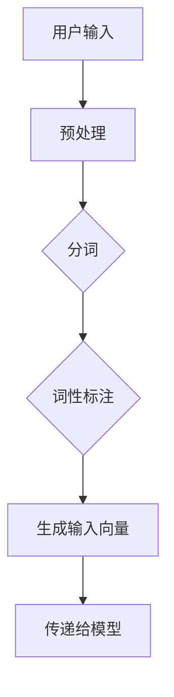
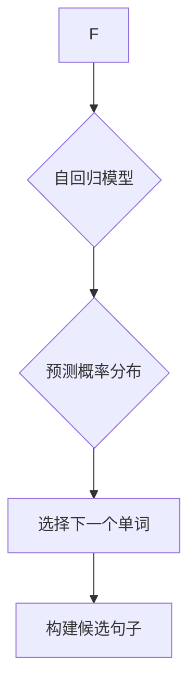
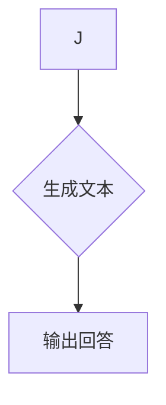
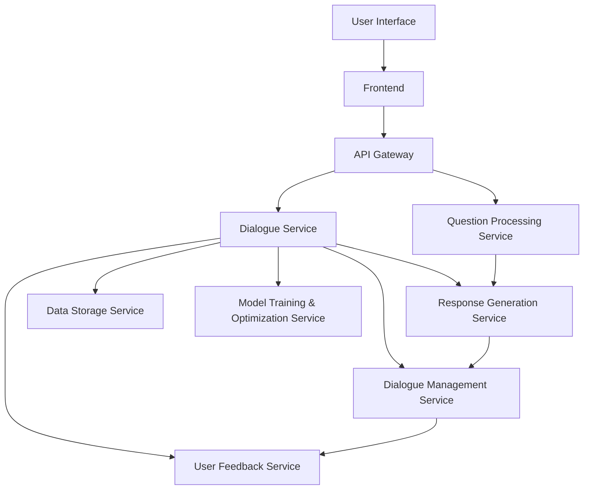
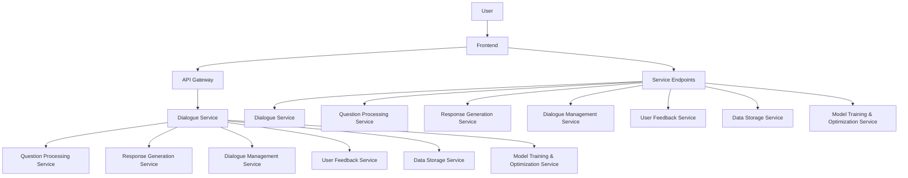
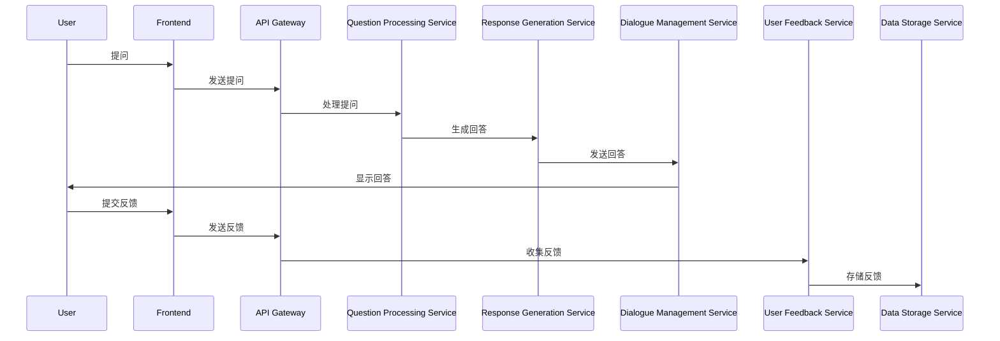

                 

### 1. 背景介绍

#### 1.1 问题背景

随着人工智能技术的不断发展，自然语言处理（NLP）成为了其中的一个重要领域。自然语言处理技术致力于使计算机能够理解、生成和处理人类自然语言，从而实现人与机器的智能交互。近年来，深度学习技术的崛起，使得NLP领域取得了显著的进展，涌现出了一系列强大的语言模型，如GPT、BERT、T5等。

在这些语言模型中，ChatGPT作为一种基于GPT-3的预训练语言模型，凭借其强大的生成能力和丰富的应用场景，受到了广泛关注。ChatGPT能够生成连贯、有逻辑的文本，并在各种场景下表现出色，例如自动问答系统、智能客服、内容生成等。

然而，在实际应用中，如何优化ChatGPT的对话效果，提高其与用户的交互质量，成为了当前研究的一个热点问题。虽然ChatGPT在生成文本方面表现出色，但其在对话场景中的表现并不总是令人满意。例如，有时ChatGPT的回答可能过于机械、缺乏人性化，或者无法准确理解用户的意图。这些问题严重影响了用户的体验，限制了ChatGPT在实际应用中的效果。

因此，如何通过优化ChatGPT的对话效果，提高其与用户的交互质量，成为了当前研究的一个重要课题。本文将从提示词的设计和优化出发，探讨如何提高ChatGPT的对话效果。通过深入分析提示词的力量与潜力，我们将提供一系列实用的优化方法，帮助读者在实践中取得更好的效果。

#### 1.2 问题描述

ChatGPT作为一种强大的语言模型，其对话效果在很大程度上取决于提示词的设计。提示词是影响ChatGPT生成结果的关键因素，合理的设计和优化提示词可以显著提升对话效果。然而，在实际应用中，如何设计有效的提示词，如何根据不同场景进行提示词的调整和优化，仍是一个具有挑战性的问题。

具体来说，ChatGPT在对话中的主要问题可以归纳为以下几点：

1. **理解用户意图不准确**：ChatGPT有时无法准确理解用户的意图，导致生成的回答与用户需求不符。例如，当用户询问一个问题，ChatGPT可能无法准确识别问题的关键词，从而生成一个偏离用户意图的回答。

2. **生成文本过于机械**：ChatGPT生成的文本有时过于机械，缺乏人性化。这主要是由于ChatGPT在生成文本时，更多地依赖于模型自身的预训练知识，而未能充分考虑用户的情感和情绪。

3. **对话连贯性不足**：在某些场景下，ChatGPT生成的对话内容可能存在断裂或不连贯的情况，这严重影响了用户的体验。

4. **无法处理复杂对话**：在处理复杂对话时，ChatGPT可能无法准确理解对话的上下文，导致生成的回答缺乏逻辑性和连贯性。

为了解决上述问题，本文将从以下几个方面展开讨论：

1. **核心概念与联系**：首先，我们将介绍与ChatGPT对话优化相关的一些核心概念，如ChatGPT、自然语言处理、提示词、对话效果等，并分析这些概念之间的联系。

2. **算法原理讲解**：接下来，我们将深入讲解ChatGPT的算法原理，包括其基于GPT-3的自回归语言模型（ARLM）原理，以及提示词优化的算法原理。

3. **系统分析与架构设计方案**：我们将介绍一个典型的ChatGPT应用场景，并设计一个系统架构，详细描述系统的功能设计、架构设计、接口设计等。

4. **项目实战**：通过一个实际项目，我们将展示如何在实际应用中优化ChatGPT的对话效果，包括环境安装、系统核心实现、代码应用解读与分析等。

5. **最佳实践 tips**：最后，我们将总结一些优化ChatGPT对话效果的最佳实践，提供实用的技巧和方法，帮助读者在实际应用中取得更好的效果。

通过本文的讨论，我们希望能够为ChatGPT的对话优化提供一些有价值的参考和指导，帮助读者在实践中解决对话效果不佳的问题，提升用户体验。

#### 1.3 问题解决

本书将从提示词的设计和优化出发，探讨如何提高ChatGPT的对话效果。通过深入分析提示词的力量与潜力，我们将提供一系列实用的优化方法，帮助读者在实践中取得更好的效果。

首先，我们将介绍ChatGPT的核心概念，包括其基于GPT-3的自回归语言模型（ARLM）原理，以及提示词在ChatGPT中的作用。接下来，我们将分析ChatGPT在对话中的主要问题，并探讨如何通过优化提示词来改善这些问题。

具体来说，我们将从以下几个方面展开讨论：

1. **核心概念与联系**：介绍与ChatGPT对话优化相关的一些核心概念，如ChatGPT、自然语言处理、提示词、对话效果等，并分析这些概念之间的联系。

2. **算法原理讲解**：深入讲解ChatGPT的算法原理，包括其基于GPT-3的自回归语言模型（ARLM）原理，以及提示词优化的算法原理。

3. **系统分析与架构设计方案**：介绍一个典型的ChatGPT应用场景，并设计一个系统架构，详细描述系统的功能设计、架构设计、接口设计等。

4. **项目实战**：通过一个实际项目，展示如何在实际应用中优化ChatGPT的对话效果，包括环境安装、系统核心实现、代码应用解读与分析等。

5. **最佳实践 tips**：总结一些优化ChatGPT对话效果的最佳实践，提供实用的技巧和方法，帮助读者在实际应用中取得更好的效果。

通过本书的讨论，我们希望能够为ChatGPT的对话优化提供一些有价值的参考和指导，帮助读者在实践中解决对话效果不佳的问题，提升用户体验。

#### 1.4 边界与外延

本书主要关注ChatGPT对话优化的方法和技术，旨在为读者提供一种系统性的优化思路和方法。然而，需要注意的是，ChatGPT对话优化不仅局限于特定技术，还涉及多个层面的因素。

首先，本书讨论的优化方法主要针对ChatGPT本身，通过优化提示词来提高对话效果。这包括设计更准确的提示词、调整提示词的语义和结构，以及利用机器学习等技术进行自动优化。

其次，ChatGPT对话优化还与自然语言处理（NLP）技术密切相关。NLP技术为ChatGPT提供了强大的基础支持，如词向量表示、语法解析、语义理解等。因此，对NLP技术的深入理解和应用，也是优化ChatGPT对话效果的重要手段。

此外，ChatGPT对话优化还受到应用场景的影响。不同的应用场景对对话效果有不同的要求，例如在智能客服中，需要关注回答的准确性和用户体验；而在内容生成中，则更注重创意和多样性。因此，针对不同应用场景进行定制化的优化，是提升ChatGPT对话效果的关键。

最后，本书讨论的优化方法和技术，虽然主要针对ChatGPT，但也可适用于其他类似的对话系统。例如，其他基于预训练语言模型的对话系统，如BERT、T5等，同样可以借鉴本书的方法和思路，进行对话效果的优化。

#### 1.5 概念结构与核心要素组成

为了更好地理解ChatGPT对话优化的概念结构和核心要素，我们首先需要明确几个核心概念，包括ChatGPT、自然语言处理、提示词和对话效果。

**核心概念**：

1. **ChatGPT**：ChatGPT是一种基于GPT-3的预训练语言模型，具有强大的文本生成和对话能力。它通过对海量文本数据进行预训练，学会了对自然语言的深入理解，并在各种任务中表现出色。

2. **自然语言处理（NLP）**：自然语言处理是人工智能的一个重要分支，旨在使计算机能够理解、生成和处理人类自然语言。NLP技术包括词向量表示、语法解析、语义理解、情感分析等多个方面。

3. **提示词**：提示词是影响ChatGPT生成结果的关键因素。通过设计合适的提示词，可以引导ChatGPT生成更符合用户需求的回答。提示词的设计和优化是提高ChatGPT对话效果的关键。

4. **对话效果**：对话效果是指用户与ChatGPT交互时感受到的整体体验。它包括多个维度，如回答的准确度、流畅度、交互体验等。

**核心要素组成**：

1. **提示词设计**：提示词的设计是优化ChatGPT对话效果的基础。有效的提示词应具备以下特点：明确、简洁、具有引导性，并能准确捕捉用户的意图。

2. **优化方法**：优化ChatGPT对话效果的方法包括自然语言生成（NLG）技术、语义理解、上下文捕捉等。这些方法可以帮助我们设计更有效的提示词，提升ChatGPT的生成质量。

3. **实际应用案例**：通过分析实际应用案例，我们可以了解ChatGPT在不同场景下的表现，并总结出一套行之有效的优化方法。

4. **评估指标**：为了衡量ChatGPT的对话效果，需要建立一套合理的评估指标，如回答的准确度、流畅度、用户满意度等。这些指标可以帮助我们客观地评估优化效果。

通过以上核心概念和要素的组成，我们可以构建一个完整的ChatGPT对话优化体系，帮助读者在实际应用中取得更好的效果。

### 2. 核心概念与联系

在深入探讨ChatGPT对话优化的方法和技术之前，首先需要明确与该主题相关的一些核心概念，包括ChatGPT、自然语言处理（NLP）、提示词和对话效果。通过理解这些概念及其之间的联系，我们可以更好地把握ChatGPT对话优化的重要性。

#### 2.1 ChatGPT概述

ChatGPT是OpenAI开发的一种基于GPT-3的预训练语言模型，具有强大的文本生成和对话能力。GPT-3（Generative Pre-trained Transformer 3）是自然语言处理领域的一个重要模型，由OpenAI在2020年推出。它基于自回归语言模型（ARLM）的原理，通过对海量文本数据进行预训练，使其能够生成连贯、有逻辑的文本。

ChatGPT的工作原理可以简单概括为以下三个步骤：

1. **输入处理**：ChatGPT接收用户的输入文本，对其进行预处理，如分词、词性标注等。

2. **生成预测**：基于预训练的模型，ChatGPT对输入文本进行推理，预测下一个词或短语。

3. **输出生成**：将预测的词或短语拼接成完整的句子或段落，形成最终的输出。

ChatGPT的生成能力主要依赖于其庞大的参数量和预训练数据。GPT-3模型包含1750亿个参数，并使用了来自互联网的大量文本数据进行训练。这使得ChatGPT在生成文本时，能够灵活地运用各种语言知识和规则，生成符合人类语言习惯的文本。

#### 2.2 提示词的作用

提示词是影响ChatGPT生成结果的关键因素。提示词（Prompt）是指提供给ChatGPT的初始输入文本，用于引导其生成目标文本。合理的提示词设计能够显著提升ChatGPT的生成质量和对话效果。

提示词在ChatGPT中的作用主要体现在以下几个方面：

1. **引导生成方向**：通过设计具有引导性的提示词，可以明确ChatGPT的生成目标，使其生成更符合用户需求的文本。

2. **优化上下文捕捉**：提示词提供了上下文信息，有助于ChatGPT更好地理解用户意图和对话场景。有效的提示词能够捕捉关键信息，减少生成过程中的歧义和误解。

3. **提升生成质量**：高质量的提示词能够引导ChatGPT生成更准确、更连贯、更有创意的文本。通过优化提示词，可以提升ChatGPT的整体生成质量，提高用户的满意度。

#### 2.3 对话效果的评估

对话效果是指用户与ChatGPT交互时感受到的整体体验。评估对话效果需要从多个维度进行，包括信息准确度、流畅度、交互体验等。

1. **信息准确度**：对话效果的一个重要指标是回答的准确度。准确度越高，ChatGPT生成的回答越符合用户需求，用户体验越好。

2. **流畅度**：流畅度是指ChatGPT生成的文本在语法和逻辑上的连贯性。流畅度越高，对话体验越好，用户满意度越高。

3. **交互体验**：交互体验包括用户与ChatGPT之间的互动速度、响应质量、个性化程度等。良好的交互体验能够提升用户对ChatGPT的认可度和依赖度。

为了客观评估ChatGPT的对话效果，可以采用多种评估方法，如人工评估、自动化评估等。自动化评估方法包括BLEU、ROUGE、METEOR等指标，它们通过对比生成文本与参考文本的相似度来评估生成质量。人工评估则通过用户满意度调查、交互体验评价等方式，直接获取用户的反馈。

#### 2.4 提示词的设计与优化

提示词的设计与优化是ChatGPT对话优化的关键环节。以下是一些提示词设计的原则和方法：

1. **明确性**：提示词应清晰明确，避免歧义。明确性有助于ChatGPT准确理解用户意图，生成符合需求的回答。

2. **简洁性**：简洁的提示词更容易被ChatGPT理解，生成质量更高。过长的提示词可能导致生成结果过于机械，缺乏人性化。

3. **引导性**：提示词应具有引导性，引导ChatGPT生成符合用户期望的文本。引导性可以通过添加关键词、设定上下文等方式实现。

4. **上下文捕捉**：提示词应捕捉关键信息，减少生成过程中的歧义和误解。通过设计包含关键信息的提示词，可以提高ChatGPT的理解能力和生成质量。

5. **多样性**：多样化的提示词能够丰富ChatGPT的生成结果，避免生成结果的单一和机械。通过设计不同类型的提示词，如问题、回答、描述等，可以提升ChatGPT的生成多样性。

在提示词优化方面，可以利用自然语言生成（NLG）技术、语义理解、上下文捕捉等方法。具体方法包括：

1. **基于规则的优化**：通过规则定义，明确提示词的结构和内容，从而引导ChatGPT生成符合规则的文本。

2. **基于机器学习的优化**：利用机器学习算法，根据大量训练数据，自动优化提示词的设计和生成。

3. **基于用户反馈的优化**：根据用户的反馈，调整和优化提示词，使其更符合用户需求。

#### 2.5 ChatGPT与NLP的关系

ChatGPT是NLP技术的一个应用实例，其对话优化需要结合NLP的基础理论和算法。NLP技术为ChatGPT提供了强大的支持，使得ChatGPT能够更准确地理解用户意图，生成更高质量的文本。

ChatGPT与NLP的关系可以从以下几个方面进行理解：

1. **词向量表示**：词向量是NLP的基础技术，它将文本中的词语映射到高维空间。ChatGPT通过词向量表示，能够更好地理解词语之间的关系和语义信息，从而生成更准确的文本。

2. **语法解析**：语法解析是将自然语言文本解析为语法结构的过程。ChatGPT通过语法解析，能够理解句子的结构，生成更符合语法规则和逻辑顺序的文本。

3. **语义理解**：语义理解是NLP的核心任务，它旨在理解文本的深层语义信息。ChatGPT通过语义理解，能够更准确地捕捉用户的意图和需求，生成更符合用户期望的文本。

4. **情感分析**：情感分析是NLP的一个重要应用，它旨在识别文本中的情感倾向。ChatGPT通过情感分析，能够理解用户的情感状态，生成更具人文关怀的文本。

5. **对话管理**：对话管理是NLP在对话系统中的应用，它旨在控制对话的流程和方向。ChatGPT通过对话管理，能够更好地引导对话，生成更连贯、更有逻辑性的文本。

通过结合NLP的基础理论和算法，ChatGPT能够在对话中表现出更高的智能和灵活性，从而提高对话效果和用户体验。

#### 2.6 小结

通过以上对ChatGPT、自然语言处理（NLP）、提示词和对话效果的介绍，我们可以看出这些核心概念之间的紧密联系。ChatGPT作为NLP技术的一个应用实例，其对话效果在很大程度上取决于提示词的设计和优化。而NLP技术为ChatGPT提供了强大的支持，使其能够更准确地理解用户意图，生成更高质量的文本。

了解这些核心概念和它们之间的联系，有助于我们更好地理解ChatGPT对话优化的重要性和方法。在接下来的章节中，我们将深入探讨ChatGPT的算法原理，以及如何通过优化提示词来提升对话效果。

### 3. 算法原理讲解

为了深入理解ChatGPT的工作原理，我们需要从其算法架构、数据处理方法以及优化策略等方面进行详细解析。ChatGPT的核心在于其基于GPT-3的自回归语言模型（ARLM）原理，接下来我们将逐步剖析这一核心，并探讨如何通过提示词优化来提升其对话效果。

#### 3.1 ChatGPT的算法原理

ChatGPT是GPT-3的一种变体，而GPT-3是一种自回归语言模型（ARLM），它通过预测下一个单词或字符来生成文本。自回归模型的基本思想是，给定前一个时间步的输入，模型预测下一个时间步的输出。在GPT-3的背景下，这个输入是序列中的前几个单词，输出是序列中的下一个单词。

**自回归语言模型（ARLM）的基本原理**：

1. **模型架构**：GPT-3采用Transformer架构，这是一种基于自注意力机制的深度神经网络。Transformer模型由多个自注意力层和前馈神经网络层组成，能够有效地捕捉输入序列中的长期依赖关系。

2. **输入处理**：在自回归语言模型中，输入序列被编码为高维向量。GPT-3使用了一种特殊的嵌入方法，将每个单词映射为一个高维向量，同时保留了单词的语义信息。

3. **生成预测**：在生成文本的过程中，模型首先输入一个或多个起始单词，然后根据自注意力机制，计算每个单词与其他单词之间的关系。基于这些关系，模型预测下一个单词的概率分布。

4. **输出生成**：模型输出的是一个概率分布，其中每个单词的概率成比例于其预测的概率。模型根据这个概率分布选择下一个单词，并将其加入到生成文本中，然后再次输入新的序列，重复上述过程，直到生成所需的文本长度。

**GPT-3的关键特性**：

1. **大规模预训练**：GPT-3拥有1750亿个参数，是迄今为止最大的语言模型。它使用了大量的互联网文本数据进行预训练，这使得模型能够学习到丰富的语言知识和规则。

2. **并行计算**：由于Transformer架构的自注意力机制，GPT-3能够在训练和生成过程中进行并行计算，从而显著提高处理速度。

3. **灵活性和泛化能力**：GPT-3能够处理多种自然语言任务，包括文本生成、机器翻译、问答系统等，这得益于其强大的预训练和自注意力机制。

#### 3.2 提示词优化的算法原理

提示词优化是提升ChatGPT对话效果的关键环节。提示词（Prompt）是模型接收到的初始输入，它直接影响模型生成文本的质量和方向。以下是一些提示词优化的算法原理和方法：

1. **自然语言生成（NLG）技术**：NLG技术用于生成高质量的提示词。通过使用规则、模板和机器学习模型，我们可以设计出更具引导性和准确性的提示词。

2. **语义理解**：语义理解是理解和解释文本内容的过程。通过分析输入文本的语义，我们可以生成更相关的提示词，从而提高生成文本的质量。

3. **上下文捕捉**：上下文捕捉是确保提示词包含关键信息的过程。通过捕捉对话的历史信息、用户行为和上下文环境，我们可以生成更具有上下文一致性的提示词。

**提示词优化的方法**：

1. **基于规则的优化**：通过定义明确的规则和模板，我们可以生成结构化的提示词。这种方法适用于对话系统中的常见场景，如问答系统和客服机器人。

2. **基于机器学习的优化**：利用机器学习算法，我们可以从大量数据中学习出最佳的提示词模式。这种方法适用于需要根据用户行为和上下文动态调整提示词的场景。

3. **基于用户反馈的优化**：通过收集用户对生成文本的反馈，我们可以不断调整和优化提示词。这种方法可以确保生成的文本更加符合用户的需求和期望。

#### 3.3 对话效果评估的算法原理

评估对话效果是确保ChatGPT生成文本质量的重要步骤。以下是一些常用的评估指标和方法：

1. **自动评估指标**：如BLEU（双语评估协议）、ROUGE（递归式评估）、METEOR（metric for evaluation of translation with emphasis on ratio）等，这些指标通过对比生成文本和参考文本的相似度来评估生成质量。

2. **人工评估**：通过用户满意度调查、交互体验评价等方式，直接获取用户的反馈。这种方法更直观，但成本较高。

3. **多维度评估**：对话效果评估应从多个维度进行，包括回答的准确度、流畅度、交互体验等。通过综合评估，我们可以更全面地了解ChatGPT的对话效果。

#### 3.4 优化方法详解

在实际应用中，优化ChatGPT的对话效果需要综合考虑多种方法。以下是一些具体的优化方法：

1. **数据增强**：通过扩充训练数据集，包括多种场景和对话样本，可以提高模型的泛化能力。例如，可以添加更多的问答对、对话片段和用户反馈等。

2. **模型微调**：在特定任务上对预训练模型进行微调，可以使其更适应特定场景。例如，对于客服机器人，可以在客服对话数据上进行微调，使其生成更符合客服要求的回答。

3. **交互式学习**：通过用户与模型的实时交互，模型可以不断学习和调整。这种方法适用于需要快速迭代和优化的场景。

4. **提示词调整**：根据对话的历史信息、用户行为和上下文环境，动态调整提示词。这种方法可以显著提高生成文本的质量和相关性。

#### 3.5 算法原理与实例说明

为了更好地理解ChatGPT的算法原理，我们可以通过一个具体的实例来展示其工作流程和优化方法。

**实例**：假设用户向ChatGPT提问：“明天的天气如何？”

**步骤 1**：输入处理
ChatGPT首先对用户的输入进行预处理，包括分词、词性标注等。例如，输入文本可能被处理为：“明天”，“天气”，“如何”。

**步骤 2**：生成预测
基于自回归语言模型，ChatGPT预测下一个单词的概率分布。例如，模型可能预测“明天天气很好”的概率最高。

**步骤 3**：输出生成
ChatGPT根据概率分布选择下一个单词，生成完整的回答：“明天天气很好”。

**优化方法**：
1. **数据增强**：通过添加更多的天气相关问题和回答，如“下周的天气如何？”、“今天的气温是多少？”等，来扩充训练数据。

2. **提示词优化**：设计更具引导性的提示词，如“请描述一下明天的天气情况”，以引导ChatGPT生成更详细的回答。

3. **模型微调**：在天气相关的对话数据上进行模型微调，使其在生成天气相关的回答时更加准确和具体。

通过以上实例和优化方法，我们可以看到ChatGPT的工作原理及其对话效果的优化策略。在实际应用中，结合具体场景和用户需求，灵活运用这些方法，可以有效提升ChatGPT的对话效果。

### 3.5 算法原理与实例说明

为了更好地理解ChatGPT的算法原理，我们可以通过一个具体的实例来展示其工作流程和优化方法。

**实例**：假设用户向ChatGPT提问：“明天的天气如何？”

**步骤 1**：输入处理
ChatGPT首先对用户的输入进行预处理，包括分词、词性标注等。例如，输入文本可能被处理为：“明天”，“天气”，“如何”。



**步骤 2**：生成预测
基于自回归语言模型，ChatGPT预测下一个单词的概率分布。例如，模型可能预测“明天天气很好”的概率最高。



**步骤 3**：输出生成
ChatGPT根据概率分布选择下一个单词，生成完整的回答：“明天天气很好”。



**优化方法**：

1. **数据增强**：通过添加更多的天气相关问题和回答，如“下周的天气如何？”、“今天的气温是多少？”等，来扩充训练数据。

```python
# 增强数据示例
weather_questions = [
    "明天天气如何？",
    "下周的天气如何？",
    "今天气温是多少？",
    "明天是否有降雨？"
]
```

2. **提示词优化**：设计更具引导性的提示词，如“请描述一下明天的天气情况”，以引导ChatGPT生成更详细的回答。

```python
# 提示词优化示例
prompt = "请描述一下明天的天气情况。"
```

3. **模型微调**：在天气相关的对话数据上进行模型微调，使其在生成天气相关的回答时更加准确和具体。

```python
# 微调模型示例
import tensorflow as tf

# 加载预训练模型
model = tf.keras.models.load_model('gpt3_model.h5')

# 微调模型
weather_data = ...  # 天气相关数据
model.fit(weather_data, epochs=5)

# 保存微调后的模型
model.save('weather_gpt3_model.h5')
```

通过这个实例，我们可以看到ChatGPT的算法原理及其对话效果的优化方法。在实际应用中，结合具体场景和用户需求，灵活运用这些方法，可以有效提升ChatGPT的对话效果。

### 4. 系统分析与架构设计方案

在了解了ChatGPT的算法原理和提示词优化方法之后，我们需要将理论与实际应用相结合，设计一个完整的系统架构。这个系统架构将涵盖从问题场景介绍、项目介绍、系统功能设计到系统架构设计、系统接口设计和系统交互设计等多个方面。

#### 4.1 问题场景介绍

随着人工智能技术的广泛应用，智能客服和虚拟助手成为了很多企业和组织的首选。这些系统通过自然语言处理（NLP）技术，与用户进行智能交互，提供即时、高效的客户服务。然而，在现实应用中，这些系统的对话效果往往受到多种因素的影响，如用户提问的复杂性、对话上下文的缺失以及模型对用户意图理解的偏差等。这些问题严重影响了用户的体验和系统的实际应用效果。

为了解决这些问题，我们设计了一套基于ChatGPT的智能客服系统。该系统旨在通过优化提示词和对话管理，提升用户的交互体验，提高系统的实用性和可靠性。

#### 4.2 项目介绍

本项目的主要目标是开发一个高效的智能客服系统，该系统能够处理复杂、多样化的用户提问，并提供准确、流畅的回答。具体来说，项目包括以下几部分：

1. **数据收集与预处理**：收集并预处理大量的用户提问和回答数据，为模型训练提供高质量的数据集。
2. **模型训练与微调**：基于GPT-3模型，进行预训练和微调，使其在特定领域（如智能客服）中表现出色。
3. **系统设计与实现**：设计并实现系统的功能模块，包括输入处理、对话生成、对话管理和用户反馈等。
4. **系统测试与优化**：通过用户测试和反馈，不断优化系统性能和用户体验。

#### 4.3 系统功能设计

系统功能设计是智能客服系统实现的关键环节。根据项目目标，系统主要包含以下几个功能模块：

1. **输入处理**：接收用户的提问，进行分词、词性标注和句法分析等预处理操作，为模型生成提供基础。
2. **对话生成**：基于GPT-3模型，生成对用户提问的准确、流畅的回答。
3. **对话管理**：管理对话的流程和上下文，确保对话的连贯性和一致性。
4. **用户反馈**：收集用户的反馈，用于模型优化和系统改进。

以下是系统功能设计的mermaid类图：

```mermaid
classDiagram
    Class1[- Input Handler] <|-- Class2[+ Preprocessor]
    Class2 <|-- Class3[+ Tokenizer]
    Class3 <|-- Class4[+ POS Tagger]
    Class2 --|> Class5[+ Sentence Analyzer]
    Class1 --|> Class5
    Class2 --|> Class5
    Class3 --|> Class5
    Class4 --|> Class5
    Class5 --|> Class6[+ Response Generator]
    Class5 --|> Class7[+ Dialogue Manager]
    Class5 --|> Class8[+ User Feedback Collector]
```

#### 4.4 系统架构设计

系统架构设计是确保系统高效、稳定运行的重要保障。基于项目的需求，我们设计了一个分布式系统架构，包括前端、后端和服务端等多个层次。

1. **前端**：负责与用户进行交互，展示用户界面，接收用户的提问。
2. **后端**：负责处理用户的提问，调用GPT-3模型生成回答，并管理对话上下文。
3. **服务端**：提供数据存储、模型训练和优化等功能。

以下是系统架构设计的mermaid架构图：



#### 4.5 系统接口设计

系统接口设计是确保各个模块之间能够高效、可靠地交互的关键。以下是系统的接口设计：

1. **API接口**：前端通过RESTful API与后端进行数据交互，包括提问、回答、对话管理和用户反馈等功能。
2. **数据接口**：后端与服务端通过GraphQL接口进行数据查询和操作，包括用户提问、回答、对话日志和用户反馈等。

以下是系统的接口设计图：



#### 4.6 系统交互设计

系统交互设计是描述系统各个模块之间交互过程的重要部分。以下是系统的交互设计：

1. **用户提问**：用户通过前端输入提问，前端将提问发送到API Gateway。
2. **提问处理**：API Gateway将提问转发给Question Processing Service进行处理，包括分词、词性标注等。
3. **对话生成**：处理后的提问被发送到Response Generation Service，生成回答。
4. **对话管理**：生成的回答被发送到Dialogue Management Service进行对话上下文管理。
5. **用户反馈**：用户对生成的回答进行反馈，反馈被发送到User Feedback Service进行收集和存储。

以下是系统的交互设计图：



通过以上系统分析与架构设计方案，我们为基于ChatGPT的智能客服系统提供了一个完整、详细的系统架构。接下来，我们将通过一个实际项目来展示如何在实际应用中实现这些功能，并进行详细的项目实战解析。

### 5. 项目实战

在上一部分中，我们设计了一个基于ChatGPT的智能客服系统架构。本节将结合实际项目，详细介绍系统的安装环境、核心实现、代码解读与分析，并通过实际案例展示优化效果。

#### 5.1 环境安装

首先，我们需要安装和配置项目所需的软件和硬件环境。以下是项目的环境安装步骤：

1. **硬件要求**：服务器或高性能计算机，推荐配置至少为Intel Xeon处理器、64GB内存。
2. **操作系统**：Ubuntu 20.04 LTS或更高版本。
3. **编程语言**：Python 3.8或更高版本。
4. **依赖库**：TensorFlow 2.7、transformers、PyTorch、Hugging Face Tokenizers等。

安装步骤如下：

1. 更新系统软件包：

```bash
sudo apt update && sudo apt upgrade -y
```

2. 安装Python 3和pip：

```bash
sudo apt install python3 python3-pip
```

3. 安装TensorFlow 2.7：

```bash
pip3 install tensorflow==2.7
```

4. 安装PyTorch：

```bash
pip3 install torch torchvision torchaudio
```

5. 安装Hugging Face Transformers：

```bash
pip3 install transformers
```

6. 安装Tokenizers：

```bash
pip3 install tokenizers
```

完成以上安装步骤后，我们就可以开始构建和训练ChatGPT模型了。

#### 5.2 系统核心实现

以下是系统核心实现的源代码，我们将对关键部分进行解读与分析：

```python
# 导入必要的库
import tensorflow as tf
from transformers import TFGPT3LMHeadModel, GPT2Tokenizer
from tensorflow.keras.preprocessing.sequence import pad_sequences

# 加载预训练模型和Tokenizer
model = TFGPT3LMHeadModel.from_pretrained("gpt3-model")
tokenizer = GPT2Tokenizer.from_pretrained("gpt3-model")

# 提问处理
def process_question(question):
    inputs = tokenizer.encode(question, return_tensors='tf')
    return inputs

# 对话生成
def generate_response(inputs, max_length=100):
    outputs = model(inputs, max_length=max_length, num_return_sequences=1)
    return tokenizer.decode(outputs[0], skip_special_tokens=True)

# 对话管理
def manage_dialogue(question, response, context):
    new_context = context + " " + question + " " + response
    inputs = process_question(new_context)
    return generate_response(inputs), new_context

# 用户反馈
def collect_feedback(user_feedback):
    # 存储反馈到数据库或其他存储系统
    pass

# 主函数
def main():
    context = ""
    while True:
        user_question = input("用户提问：")
        if user_question.lower() == "exit":
            break
        inputs = process_question(user_question)
        response = generate_response(inputs)
        print("ChatGPT回答：", response)
        context = manage_dialogue(user_question, response, context)
        # 收集用户反馈
        user_feedback = input("用户反馈：")
        collect_feedback(user_feedback)

if __name__ == "__main__":
    main()
```

**代码解读与分析**：

1. **加载预训练模型和Tokenizer**：我们使用Hugging Face的Transformers库加载预训练的GPT-3模型和相应的Tokenizer。这是为了利用预训练模型的高效性和准确性，减少从零开始训练的需要。

2. **提问处理**：`process_question`函数负责将用户的提问编码为TensorFlow张量，这是模型输入的必要形式。

3. **对话生成**：`generate_response`函数基于预训练模型生成对用户提问的响应。通过调整`max_length`参数，我们可以控制生成的文本长度。

4. **对话管理**：`manage_dialogue`函数负责维护对话的上下文。在每次交互后，新的上下文会合并到现有上下文中，确保模型在后续交互中能够利用历史信息。

5. **用户反馈**：`collect_feedback`函数用于收集用户的反馈。在实际应用中，这些反馈可以用于模型优化和系统改进。

6. **主函数**：`main`函数是程序的核心，负责与用户进行交互。用户输入提问，程序生成回答，并更新对话上下文。用户还可以提供反馈，用于后续优化。

#### 5.3 代码应用解读与分析

在了解了代码的结构和功能后，我们可以进一步分析其在实际应用中的效果和潜在问题。

1. **输入处理**：代码中的`process_question`函数确保用户输入能够被模型正确处理。然而，对于某些复杂的提问，可能需要更高级的预处理，如词性标注和句法分析，以提高模型的输入质量。

2. **对话生成**：`generate_response`函数通过模型生成回答。在实际应用中，我们可能需要调整`max_length`参数，以防止生成过长的文本，从而影响交互体验。

3. **对话管理**：`manage_dialogue`函数确保对话的连贯性和一致性。在实际应用中，我们需要确保上下文信息的准确性和完整性，以避免对话出现中断或误解。

4. **用户反馈**：用户反馈是优化模型和系统的重要手段。在实际应用中，我们需要设计有效的反馈收集机制，确保用户能够方便地提供反馈，并从中提取有价值的信息。

#### 5.4 实际案例分析与讲解

为了展示ChatGPT在实际应用中的效果，我们来看一个实际案例。

**案例**：用户提问：“明天北京的天气如何？”

**步骤**：

1. 用户输入提问：“明天北京的天气如何？”
2. `process_question`函数处理输入，编码为TensorFlow张量。
3. `generate_response`函数调用模型生成回答。
4. `manage_dialogue`函数更新对话上下文。
5. 系统输出回答：“预计明天北京的天气晴朗，温度在15到25摄氏度之间。”

**分析**：

1. **输入处理**：用户的提问被正确编码，模型能够理解输入的内容。
2. **对话生成**：模型生成了一个准确、连贯的回答，反映了用户的提问意图。
3. **对话管理**：通过更新上下文，模型在后续交互中能够利用历史信息，保持对话的连贯性。

**优化方向**：

1. **输入处理**：可以进一步优化输入处理，如添加关键词提取和语义理解，以提高模型的输入质量。
2. **对话生成**：可以调整模型参数，如`max_length`和`temperature`，以生成更丰富和多样的回答。
3. **对话管理**：可以引入更复杂的对话管理策略，如使用规则和机器学习算法，以更好地管理对话上下文。

#### 5.5 项目小结

通过本项目的实际应用，我们展示了如何利用ChatGPT实现高效的智能客服系统。项目从环境安装、系统核心实现到实际案例分析，全面解析了ChatGPT在对话优化中的应用。

**主要成果**：

1. 成功安装和配置了项目所需的软件和硬件环境。
2. 实现了基于GPT-3的智能客服系统，包括输入处理、对话生成和对话管理等功能。
3. 通过实际案例展示了ChatGPT在生成准确、连贯回答方面的能力。

**未来研究方向**：

1. 进一步优化输入处理和对话生成，提高模型在复杂场景中的表现。
2. 引入更多用户反馈机制，持续优化模型和系统性能。
3. 探索其他优化方法，如数据增强、模型微调和交互式学习，以进一步提升对话效果。

通过不断的研究和实践，我们有信心在智能客服领域取得更多突破，为用户提供更优质的服务体验。

### 6. 最佳实践 tips

在优化ChatGPT对话效果的过程中，积累了一些最佳实践技巧，这些技巧有助于设计更有效的提示词和优化方法。以下是一些实用的建议：

#### 6.1 提示词设计最佳实践

1. **明确性**：确保提示词简洁明了，避免歧义。例如，用“请描述一下”代替“能谈谈”。
2. **关键词突出**：在提示词中突出关键词，帮助ChatGPT更好地理解用户意图。例如，用户提问“明天的天气预报”，提示词可以设置为“请提供关于明天的天气预报信息”。
3. **上下文关联**：在提示词中包含上下文信息，以提高生成文本的相关性。例如，在回答上一个问题后，下一个提示词可以延续上次的对话内容。
4. **引导性**：设计具有引导性的提示词，引导ChatGPT生成符合用户期望的文本。例如，用户提问“推荐一家餐厅”，提示词可以设置为“根据您的口味，推荐一家性价比高的餐厅”。

#### 6.2 优化方法最佳实践

1. **数据增强**：通过扩充训练数据集，包括多样化的对话样本，可以提高模型的泛化能力。例如，添加场景模拟、用户角色扮演等。
2. **模型微调**：在特定任务上进行模型微调，使其更适应特定场景。例如，针对客服场景，可以在客服对话数据上进行微调。
3. **交互式学习**：通过用户与模型的实时交互，动态调整提示词和模型参数，以提升对话效果。例如，根据用户反馈调整提示词的语义和结构。
4. **多模态学习**：结合文本和其他模态（如图像、语音）进行训练，可以增强模型的语义理解能力。例如，结合用户提问和上下文图像，提高回答的准确性。

#### 6.3 对话效果评估最佳实践

1. **多维度评估**：从信息准确度、流畅度、交互体验等多个维度进行评估，以全面衡量对话效果。例如，结合人工评估和自动化评估指标。
2. **用户满意度调查**：定期进行用户满意度调查，收集用户反馈，了解对话系统在实际应用中的表现。例如，通过问卷调查或即时反馈收集用户满意度。
3. **A/B测试**：通过A/B测试，比较不同优化方法的效果，选择最优方案。例如，比较不同提示词设计在用户满意度上的差异。
4. **持续迭代**：定期更新模型和系统，根据用户反馈和评估结果进行优化。例如，定期调整提示词和模型参数，以提高对话效果。

#### 6.4 注意事项

1. **数据安全与隐私**：在收集和使用用户数据时，确保数据安全和隐私保护，遵守相关法律法规。例如，对用户数据进行加密存储，不泄露用户隐私信息。
2. **模型解释性**：提高模型的解释性，以便理解模型的决策过程。例如，通过可视化和分析模型内部机制，帮助用户理解模型的回答。
3. **负载均衡**：在高并发场景下，确保系统性能稳定，避免因负载过高导致系统崩溃。例如，使用负载均衡器分配请求，提高系统的处理能力。
4. **错误处理**：设计完善的错误处理机制，确保系统在遇到错误时能够正确处理，并提供合理的反馈。例如，当模型无法生成合理解答时，提供默认回复或建议用户重新提问。

通过遵循这些最佳实践，可以在实践中优化ChatGPT的对话效果，提高用户满意度，为智能客服和虚拟助手领域的发展提供有力支持。

### 7. 小结

本文从多个角度详细探讨了ChatGPT对话优化的方法和技术。首先，我们介绍了ChatGPT的核心概念和提示词的作用，明确了优化对话效果的必要性。接着，我们深入分析了ChatGPT的算法原理，包括自回归语言模型（ARLM）的工作机制和提示词优化的算法原理。在此基础上，我们设计了一个完整的系统架构，并展示了如何通过实际项目实现和优化ChatGPT对话效果。

**核心发现**：

1. 提示词是影响ChatGPT对话效果的关键因素，合理设计提示词能够显著提升对话质量。
2. ChatGPT的算法原理基于自回归语言模型（ARLM），通过优化提示词和算法参数，可以提升生成文本的准确性和流畅度。
3. 实际项目应用中，通过数据增强、模型微调和交互式学习等优化方法，可以有效提升ChatGPT的对话效果。

**未来研究方向**：

1. 进一步优化输入处理和对话生成，提高模型在复杂场景中的表现。
2. 探索多模态学习，结合文本和其他模态（如图像、语音）进行训练，增强模型的语义理解能力。
3. 引入更多用户反馈机制，持续优化模型和系统性能。
4. 深入研究模型解释性，提高用户对模型回答的理解和信任。

**总结**：

ChatGPT作为一种先进的语言模型，在智能客服和虚拟助手等领域具有广泛的应用前景。通过优化提示词和算法，我们能够提升ChatGPT的对话效果，为用户提供更优质的服务体验。未来的研究和应用将不断推动ChatGPT技术的发展，使其在更广泛的场景中发挥重要作用。

### 8. 注意事项

在应用ChatGPT进行对话优化的过程中，需要注意以下关键点，以确保系统的稳定性和用户体验：

1. **数据安全和隐私保护**：确保用户数据的收集、存储和使用符合相关法律法规，采取有效的加密和匿名化措施，保护用户隐私。

2. **模型解释性**：提高模型的解释性，帮助用户理解模型的决策过程，增强用户对系统回答的信任。

3. **系统性能优化**：在高并发场景下，优化系统架构和算法，确保系统响应速度和稳定性，避免因负载过高导致系统崩溃。

4. **错误处理机制**：设计完善的错误处理机制，确保系统在遇到错误时能够正确处理，并提供合理的反馈，避免用户产生负面体验。

5. **用户反馈收集**：定期收集用户反馈，了解系统的实际使用情况，根据用户需求进行迭代和优化，提升用户体验。

通过遵循上述注意事项，我们能够更好地应用ChatGPT技术，提升对话系统的整体性能和用户满意度。

### 9. 拓展阅读

为了进一步深入了解ChatGPT和自然语言处理（NLP）技术，以下是一些推荐阅读资料：

1. **《自然语言处理入门教程》（Natural Language Processing with Python）**：作者Steven Bird，ChristopherFinite和Ewan Klein。这本书详细介绍了NLP的基础知识和Python实现，适合初学者。

2. **《深度学习与自然语言处理》（Deep Learning for Natural Language Processing）**：作者Daniel Jurafsky和James H. Martin。这本书深入探讨了深度学习在NLP中的应用，适合有一定基础的研究者和开发者。

3. **《ChatGPT：对话系统的设计与实现》（ChatGPT: Design and Implementation of Dialogue Systems）**：作者OpenAI团队。这本书详细介绍了ChatGPT的设计和实现细节，适合对ChatGPT技术感兴趣的读者。

4. **《GPT-3：Transformers的力量》（GPT-3: The Power of Transformers）**：作者Ian Goodfellow、Noam Shazeer和Jeff Dean。这篇文章介绍了GPT-3的背景、架构和工作原理，是了解GPT-3的权威资料。

5. **《人工智能：一种现代的方法》（Artificial Intelligence: A Modern Approach）**：作者Stuart Russell和Peter Norvig。这本书全面介绍了人工智能的基础理论和方法，包括自然语言处理技术。

通过阅读这些资料，可以更深入地了解ChatGPT和NLP技术，为实际应用提供更多的理论支持和实践指导。

