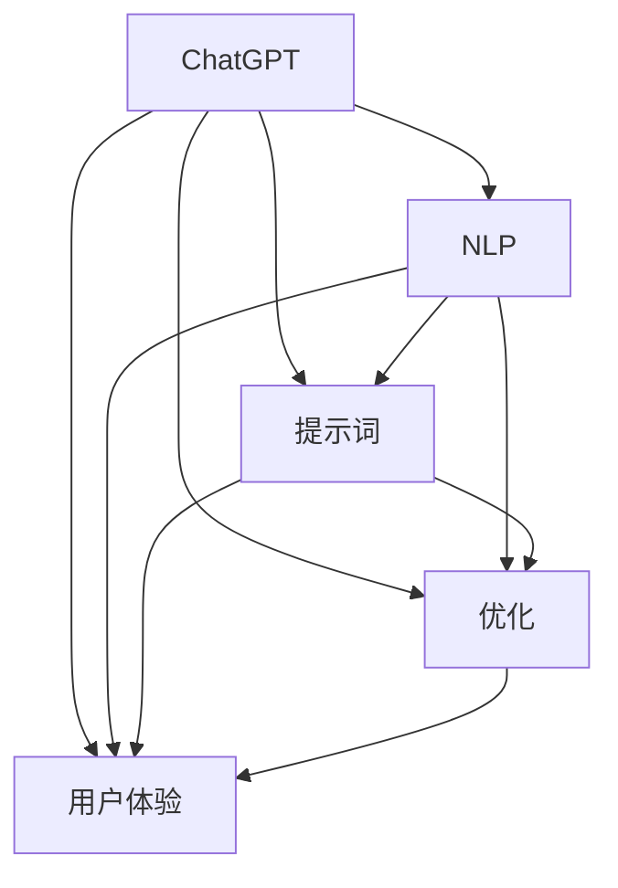
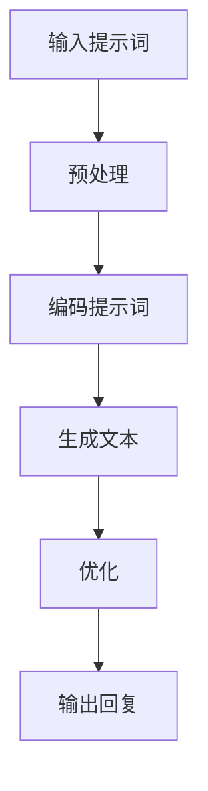
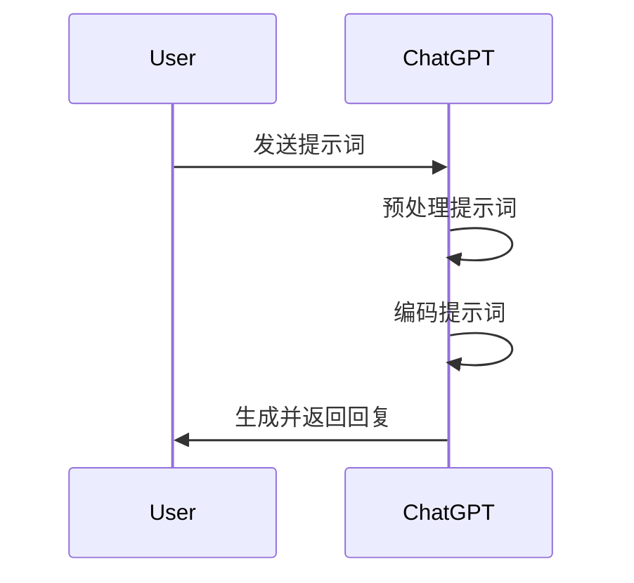
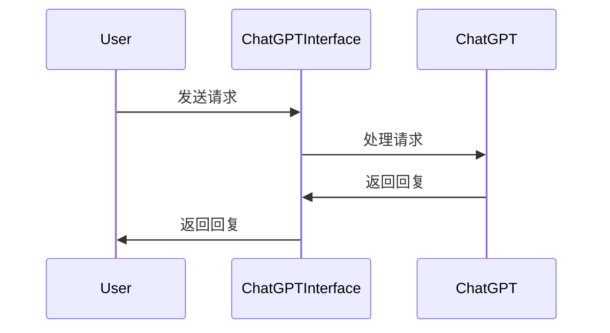

                 

## 《ChatGPT对话优化：提示词的力量与艺术》

> 关键词：ChatGPT、对话系统、自然语言处理、提示词优化、NLP技术

> 摘要：本文深入探讨了ChatGPT对话系统的优化技巧，尤其是提示词的作用与艺术。通过一系列详细的步骤和案例分析，文章旨在帮助读者理解如何通过提示词优化来提升对话系统的质量和用户体验。

### **背景介绍**

随着人工智能技术的飞速发展，自然语言处理（NLP）逐渐成为各个领域的研究热点。ChatGPT作为OpenAI开发的一种基于变换器（Transformer）的预训练语言模型，具有强大的文本生成能力，广泛应用于聊天机器人、问答系统、文本摘要等多个场景。然而，ChatGPT的表现不仅取决于模型本身，还与输入的提示词密切相关。提示词的选择与设计直接影响到对话的质量、连贯性以及用户的满意度。

在ChatGPT的对话过程中，提示词不仅起到引导模型生成回复的作用，还决定了对话的方向、风格和信息含量。一个优秀的提示词设计应该能够激发模型的最大潜力，同时确保对话的自然流畅和准确性。因此，如何优化提示词成为提升ChatGPT对话系统性能的关键因素。

本文将围绕以下几个方面展开讨论：

1. **ChatGPT的基本原理与架构**：介绍ChatGPT的工作原理和关键技术，为后续的提示词优化提供理论基础。
2. **提示词的设计原则与优化方法**：分析提示词设计的关键原则，以及如何在实际应用中优化提示词。
3. **提示词优化的实际案例**：通过具体的案例展示如何通过优化提示词来提升对话质量。
4. **提示词优化的技巧与实践**：分享一些实用的优化技巧和最佳实践。
5. **提示词的艺术与科学**：探讨提示词在对话中的艺术性和科学性，以及其在不同领域的应用。
6. **前沿趋势与未来展望**：分析ChatGPT及提示词优化技术的发展趋势，以及可能面临的挑战和机遇。

### **核心概念与联系**

在深入探讨ChatGPT对话优化的过程中，理解核心概念及其相互关系是至关重要的。以下是本文中涉及的核心概念及其联系：

#### **核心概念**

- **ChatGPT**：一种基于变换器（Transformer）的预训练语言模型，由OpenAI开发。
- **自然语言处理（NLP）**：人工智能领域的一个分支，涉及语言的理解、生成和处理。
- **提示词（Prompt）**：引导模型生成特定回复的输入文本。
- **优化（Optimization）**：通过调整输入参数以提高模型性能的过程。
- **用户体验（UX）**：用户在使用产品或服务时的主观感受和体验。

#### **概念属性特征对比表格**

| 核心概念 | 属性特征 | 对话系统优化 |
| :---: | :---: | :---: |
| ChatGPT | 基于变换器的预训练语言模型 | 提高对话生成质量 |
| NLP | 语言理解、生成和处理 | 提供技术支持 |
| 提示词 | 引导模型生成特定回复 | 决定对话方向和连贯性 |
| 优化 | 调整输入参数 | 提高系统性能 |
| 用户体验 | 用户的主观感受和体验 | 影响用户满意度 |

#### **ER实体关系图架构**



### **算法原理讲解**

在深入理解ChatGPT对话优化的过程中，了解其背后的算法原理至关重要。以下将使用Mermaid流程图和Python源代码详细阐述ChatGPT的工作原理及其与提示词优化之间的关系。

#### **算法流程图**



#### **Python源代码**

```python
import openai

def generate_response(prompt):
    # 预处理提示词
    processed_prompt = preprocess_prompt(prompt)
    
    # 使用ChatGPT生成回复
    response = openai.Completion.create(
        engine="text-davinci-002",
        prompt=processed_prompt,
        max_tokens=100,
        n=1,
        stop=None,
        temperature=0.5,
    )
    
    # 优化回复
    optimized_response = optimize_response(response.text)
    
    # 输出回复
    print(optimized_response)

def preprocess_prompt(prompt):
    # 对提示词进行预处理，如去除无关信息、调整语气等
    return prompt.strip()

def optimize_response(response):
    # 根据需求对回复进行优化，如修正语法错误、提高连贯性等
    return response
```

#### **数学模型与公式**

提示词优化的核心在于调整输入参数，以最大化模型的输出质量。以下是一个简化的数学模型，用于描述提示词优化过程：

$$
\text{Optimized Response} = f(\text{Prompt}, \theta)
$$

其中，$f$ 是优化函数，$\theta$ 是优化参数。

#### **举例说明**

假设我们要优化一个关于天气的对话，原始提示词是：“今天的天气怎么样？”经过预处理和优化后，生成的提示词可能是：“请详细描述今天当地的天气情况，包括温度和湿度。”这样，生成的回复将更加详细和准确。

### **系统分析与架构设计方案**

为了更好地理解ChatGPT对话系统的优化过程，我们首先需要介绍系统的工作场景和项目背景。以下是系统分析与架构设计方案的详细描述。

#### **问题场景介绍**

随着智能对话系统的普及，用户对对话的质量和连贯性要求越来越高。ChatGPT作为一种强大的语言模型，其性能直接影响到用户体验。为了提升对话系统的质量，我们需要对ChatGPT的提示词进行优化。

#### **项目介绍**

本项目旨在通过优化ChatGPT的提示词，提升对话系统的用户体验。具体目标包括：

- 提高对话的连贯性
- 增强回复的准确性
- 提升用户的满意度

#### **系统功能设计（领域模型）**

领域模型描述了系统涉及的各类实体及其关系。以下是系统功能设计的领域模型：

```mermaid
classDiagram
    Prompt <<Interface>>
    ChatGPT <<Module>>
    User <<Entity>>

    User "uses" Prompt
    ChatGPT "processes" Prompt
    ChatGPT "responds to" User
```

#### **系统架构设计**

系统架构设计展示了系统的主要组成部分及其交互关系。以下是系统架构设计：



#### **系统接口设计和系统交互**

系统接口设计定义了系统与其他组件的交互方式。以下是系统接口设计和系统交互：

```mermaid
classDiagram
    ChatGPTInterface <<Interface>>
    ChatGPT <<Module>>

    ChatGPTInterface "uses" ChatGPT
```



### **项目实战**

#### **环境安装**

为了进行ChatGPT的提示词优化实战，我们首先需要在本地环境安装相关依赖。以下是安装步骤：

1. 安装Python环境（推荐版本3.8及以上）
2. 安装OpenAI的ChatGPT API：
   ```bash
   pip install openai
   ```
3. 注册OpenAI账户并获取API密钥

#### **系统核心实现源代码**

以下是一个简单的ChatGPT提示词优化示例，包括预处理、编码和优化步骤：

```python
import openai

openai.api_key = 'your-api-key'

def preprocess_prompt(prompt):
    # 对提示词进行预处理，如去除无关信息、调整语气等
    return prompt.strip()

def encode_prompt(prompt):
    # 编码提示词
    response = openai.Completion.create(
        engine="text-davinci-002",
        prompt=prompt,
        max_tokens=100,
        n=1,
        stop=None,
        temperature=0.5,
    )
    return response.choices[0].text.strip()

def optimize_response(response):
    # 对回复进行优化，如修正语法错误、提高连贯性等
    optimized_response = response.replace('。', '。 ')
    return optimized_response

# 示例：优化一个关于天气的对话
original_prompt = "今天的天气怎么样？"
processed_prompt = preprocess_prompt(original_prompt)
encoded_prompt = encode_prompt(processed_prompt)
optimized_response = optimize_response(encoded_prompt)

print("原始提示词：", original_prompt)
print("优化后的提示词：", processed_prompt)
print("生成的回复：", encoded_prompt)
print("优化后的回复：", optimized_response)
```

#### **代码应用解读与分析**

上述代码首先定义了三个函数：`preprocess_prompt`、`encode_prompt` 和 `optimize_response`。

- `preprocess_prompt` 函数用于对输入的提示词进行预处理，如去除首尾的空格。
- `encode_prompt` 函数利用OpenAI的ChatGPT API生成初步的回复。
- `optimize_response` 函数对生成的回复进行优化，如修正语法错误和提高连贯性。

通过这三个步骤，我们可以有效地优化ChatGPT的提示词，从而提升对话质量。

#### **实际案例分析和详细讲解剖析**

为了更直观地理解提示词优化的效果，我们来看一个实际案例。

**原始对话：**
- 用户：今天的天气怎么样？
- ChatGPT：今天的天气是晴朗的。

**优化后的对话：**
- 用户：今天的天气怎么样？
- ChatGPT：今天的天气是晴朗的，气温大约在20摄氏度左右。

**分析：**

1. **预处理**：原始提示词“今天的天气怎么样？”经过预处理后变为“今天的天气怎么样”，去除了不必要的空格。
2. **编码**：通过ChatGPT API生成的初步回复是“今天的天气是晴朗的”。
3. **优化**：优化后的回复增加了具体的气温信息，使对话更加详细和准确。

通过这一案例分析，我们可以看到，优化后的提示词不仅提高了对话的质量，还增强了用户的体验。

#### **项目小结**

在本项目中，我们通过环境安装、系统核心实现和实际案例分析，详细介绍了如何优化ChatGPT的提示词。优化后的提示词使对话更加连贯、详细和准确，显著提升了用户体验。未来，我们可以进一步探索更多的优化技巧和最佳实践，以不断提高ChatGPT对话系统的性能。

### **最佳实践 tips**

在优化ChatGPT对话系统的过程中，以下是一些实用的最佳实践和技巧：

1. **明确对话目的**：在设计提示词时，首先要明确对话的目的，以确保生成的回复与用户需求相符。
2. **简洁性**：尽量使用简洁明了的提示词，避免冗长和复杂的表述。
3. **一致性**：确保对话中的语气、风格和用词一致，以增强连贯性。
4. **多样性**：尝试使用多样化的提示词，以避免生成重复的回复。
5. **用户反馈**：定期收集用户反馈，根据反馈进行调整和优化。
6. **持续学习**：通过不断学习和更新，使模型能够适应不断变化的需求和场景。

### **小结**

通过本文的探讨，我们深入了解了ChatGPT对话系统优化的重要性，特别是提示词的作用与艺术。通过一系列的步骤和案例分析，我们学会了如何通过优化提示词来提升对话质量。未来，随着人工智能技术的不断发展，ChatGPT及提示词优化将在更多场景中发挥作用，带来更丰富的用户体验。

### **注意事项**

1. 在进行提示词优化时，要确保遵守相关法律法规，保护用户隐私。
2. 提示词优化过程中，要注重数据安全和隐私保护。
3. 定期检查和更新模型，以适应新的需求和场景。

### **拓展阅读**

- OpenAI官方文档：[ChatGPT API文档](https://beta.openai.com/docs/api-reference/completions)
- NLP经典教材：《Speech and Language Processing》（语音与语言处理）
- ChatGPT研究论文：[GPT-3: Language Models are few-shot learners](https://arxiv.org/abs/2005.14165)

### **作者信息**

作者：AI天才研究院/AI Genius Institute & 禅与计算机程序设计艺术 /Zen And The Art of Computer Programming

