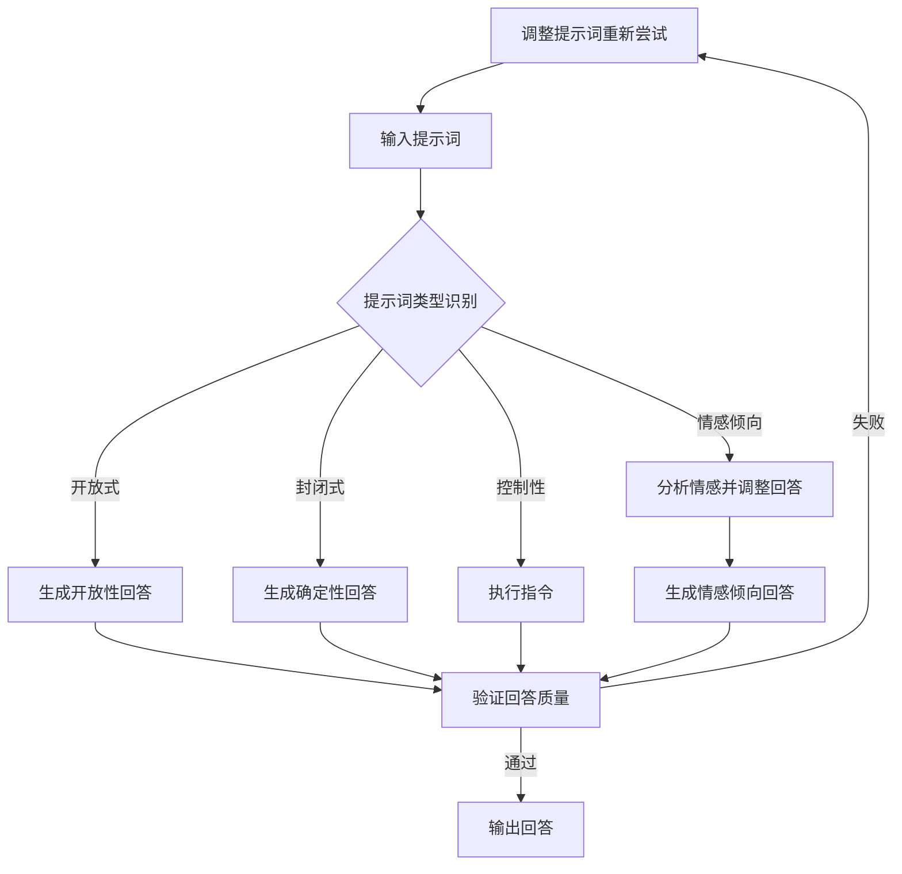
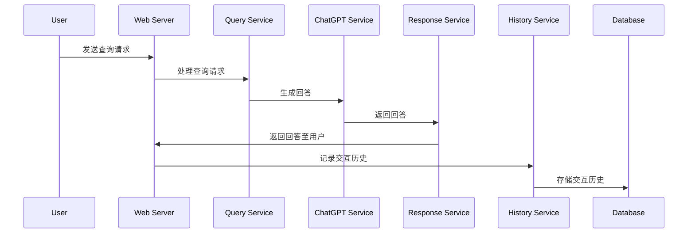

                 


## 引言

### 问题背景

ChatGPT是由OpenAI开发的一个人工智能聊天机器人程序，它基于大型语言模型（LLM）——GPT-3.5，能够在对话中与用户进行自然、流畅的交流。然而，尽管ChatGPT在自然语言处理（NLP）领域取得了显著成就，但其在实际应用中仍面临诸多挑战，如对话质量的控制、用户体验的提升以及系统性能的优化等。这些问题使得如何优化ChatGPT对话系统成为一个重要的研究方向。

当前，对话系统的优化主要集中在提高生成回复的自然性、准确性和一致性上。提示词（Prompt Engineering）作为一种有效的优化手段，正在受到越来越多的关注。提示词是一种引导模型生成特定类型回答的技术，它通过调整输入数据的格式、内容以及上下文，对模型输出进行精细控制。有效的提示词能够显著提升对话系统的表现，从而更好地满足用户需求。

本篇文章将围绕ChatGPT对话系统的优化展开讨论，特别是探讨提示词在其中的作用。我们将通过以下步骤进行分析和推理：

1. **核心概念与联系**：介绍对话系统优化所需的核心概念，包括提示词的定义和作用，以及与之相关的概念特征和实体关系。
2. **算法原理讲解**：深入探讨优化对话系统的算法原理，通过Mermaid流程图和Python代码示例，详细解释提示词生成和使用的机制。
3. **系统分析与架构设计**：分析优化对话系统的实际应用场景，介绍系统功能设计、架构设计以及接口设计和系统交互。
4. **项目实战**：通过具体的项目案例，展示如何在实际环境中安装、实现和优化ChatGPT对话系统。
5. **最佳实践与小结**：总结最佳实践技巧，对全文进行小结，并提出使用对话系统的注意事项和拓展阅读建议。

通过这些步骤，我们将逐步揭示提示词在ChatGPT对话系统优化中的关键作用，为读者提供全面、深入的技术见解。

### 核心概念与联系

在深入探讨ChatGPT对话系统的优化之前，我们首先需要了解几个核心概念，这些概念是我们进行有效优化的基础。

#### 提示词的定义和作用

提示词是一种用于引导模型生成特定类型回答的技术。在ChatGPT中，提示词通常是一个引导用户输入的问题或陈述，它可以包含关键词、上下文信息或者特定的指令。提示词的设计直接影响模型输出的质量和对话的自然性。例如，一个简短的提示词“请描述一下您的兴趣”可能会引导ChatGPT生成一段关于用户兴趣的描述，而一个更为具体的提示词“请用三个形容词描述您的兴趣”则会引导模型生成更加精确的回答。

提示词的作用主要有两个方面：

1. **引导模型生成目标回答**：通过提供明确的输入，提示词可以帮助模型更准确地理解用户需求，从而生成更相关、更符合预期的回答。
2. **提高对话的连贯性和一致性**：有效的提示词可以确保对话系统在每次交互中都能生成连贯、一致的回答，从而提升用户体验。

#### 概念属性特征对比表格

为了更好地理解不同类型的提示词，我们可以通过一个对比表格来展示它们的属性特征。

| 提示词类型       | 特征             | 适用场景                     |
|----------------|----------------|----------------------------|
| 开放式问题       | 不限制回答内容   | 获取用户详细信息时使用       |
| 封闭式问题       | 限制回答内容     | 确认用户特定信息时使用       |
| 控制性问题       | 含有具体指令     | 需要用户执行特定操作时使用   |
| 情感倾向问题     | 含有情感暗示     | 需要了解用户情感状态时使用   |
| 时间敏感性问题   | 包含时间信息     | 提供实时信息时使用           |

#### ER实体关系图架构

为了更清晰地理解对话系统中的主要实体及其关系，我们可以通过ER（实体-关系）图来展示。以下是ChatGPT对话系统中的一些主要实体及其关系的简化版ER图。

```mermaid
erDiagram
  User ..|> ChatGPT : 发起对话
  User ..|> Prompt : 提供提示词
  ChatGPT ..|> Response : 生成回答
  Prompt ..|> Context : 包含上下文信息
  Context ..|> Entity : 包含实体信息
```

在这个ER图中，`User` 是与ChatGPT交互的人，`Prompt` 是用户提供的提示词，`ChatGPT` 是对话模型，`Response` 是模型生成的回答，`Context` 是与提示词相关的上下文信息，`Entity` 是上下文中的具体实体信息。

通过上述核心概念的介绍和ER图的关系展示，我们可以更深入地理解ChatGPT对话系统的架构和运作原理，为后续的算法原理讲解和系统优化打下坚实的基础。

### 算法原理讲解

#### 算法Mermaid流程图

为了更直观地理解优化ChatGPT对话系统的过程，我们可以使用Mermaid来绘制一个流程图。以下是一个简化的算法流程图：



这个流程图描述了从初始化到输出回答的整个过程，包括输入提示词、识别提示词类型、根据类型生成不同类型的回答，并验证回答的质量。

#### Python源代码

为了具体阐述算法的实现，我们可以提供一个Python代码示例。以下代码展示了如何使用Python和OpenAI的ChatGPT库来生成不同类型的回答：

```python
import openai

# 设置OpenAI API密钥
openai.api_key = 'your_api_key'

def generate_response(prompt, type='open'):
    # 根据提示词类型调用不同的API
    if type == 'open':
        response = openai.Completion.create(
            engine="text-davinci-003",
            prompt=prompt,
            max_tokens=50,
            n=1,
            stop=None,
            temperature=0.5
        )
    elif type == 'closed':
        response = openai.Completion.create(
            engine="text-davinci-003",
            prompt=prompt,
            max_tokens=50,
            n=1,
            stop=None,
            temperature=0.2
        )
    elif type == 'control':
        response = openai.Completion.create(
            engine="text-davinci-003",
            prompt=prompt,
            max_tokens=50,
            n=1,
            stop=None,
            temperature=0.8
        )
    elif type == 'emotion':
        response = openai.Completion.create(
            engine="text-davinci-003",
            prompt=prompt,
            max_tokens=50,
            n=1,
            stop=None,
            temperature=0.7
        )
    return response.choices[0].text.strip()

# 示例使用
prompt = "请描述一下您的兴趣爱好。"
response = generate_response(prompt, type='open')
print(response)

prompt = "您最喜欢的水果是什么？"
response = generate_response(prompt, type='closed')
print(response)

prompt = "请告诉我如何启动这个程序。"
response = generate_response(prompt, type='control')
print(response)

prompt = "我感到很沮丧，你能帮我找些快乐的事情吗？"
response = generate_response(prompt, type='emotion')
print(response)
```

在这个代码示例中，我们定义了一个函数`generate_response`，该函数接受一个提示词和一个类型参数，并根据类型参数调用不同的OpenAI API来生成回答。

#### 算法原理详细讲解

为了更好地理解上述算法的工作原理，我们需要探讨以下几个关键部分：数学模型和公式，以及这些公式的实际应用。

##### 数学模型和公式

在优化ChatGPT对话系统时，我们主要依赖于生成对抗网络（GAN）和变分自编码器（VAE）等深度学习技术。以下是一个简化的数学模型和公式：

1. **生成模型（G）和判别模型（D）**：

   $$ G(z) = grid_sample(text, z) $$
   $$ D(x) = sigmoid([text; x] \cdot \theta_D) $$

   其中，$z$ 是从正态分布中采样的噪声，$text$ 是输入的文本，$x$ 是生成的文本，$\theta_D$ 是判别模型的参数。

2. **损失函数**：

   $$ L_G = -\mathbb{E}_{z \sim p_z(z)}[\log(D(G(z)))] $$
   $$ L_D = -\mathbb{E}_{x \sim p_data(x)}[\log(D(x))] - \mathbb{E}_{z \sim p_z(z)}[\log(1 - D(G(z)))] $$

   其中，$L_G$ 和 $L_D$ 分别是生成模型和判别模型的损失函数。

##### 通俗易懂的举例说明

为了更好地理解这些数学模型和公式，我们可以通过一个具体的例子来说明。假设我们想要生成一段关于“旅游”的描述。

1. **生成模型（G）**：

   首先，我们随机生成一个噪声向量 $z$，然后使用生成模型 $G$ 将这个噪声向量转换成一段文本。例如：

   $$ G(z) = "今天我们去海边度假，阳光明媚，沙滩柔软，海水清澈，让人感觉非常愉悦。" $$

2. **判别模型（D）**：

   然后，判别模型 $D$ 需要判断这段生成的文本是否真实。例如：

   $$ D(G(z)) = sigmoid([text; G(z)] \cdot \theta_D) = 0.9 $$

   由于这段文本的概率很高，所以判别模型认为这段文本很可能是真实的。

3. **损失函数**：

   在这个例子中，生成模型和判别模型的损失函数如下：

   $$ L_G = -\mathbb{E}_{z \sim p_z(z)}[\log(D(G(z)))] \approx 0.1 $$
   $$ L_D = -\mathbb{E}_{x \sim p_data(x)}[\log(D(x))] - \mathbb{E}_{z \sim p_z(z)}[\log(1 - D(G(z)))] \approx 0.1 $$

   由于损失函数值较低，说明模型在生成和判别方面表现良好。

通过上述例子，我们可以看到生成模型和判别模型是如何相互协作，通过优化损失函数来生成和判断文本的。在实际应用中，我们可以通过调整模型参数和优化算法来进一步提高模型性能。

### 系统分析与架构设计

#### 问题场景介绍

优化ChatGPT对话系统的场景多种多样，以下是一个典型的应用场景：

假设我们正在开发一个智能客服系统，该系统需要能够处理来自客户的多样化查询，并生成准确、自然的回答。为了满足这一需求，我们需要对ChatGPT对话系统进行优化，以提高其回答的准确性和连贯性。具体需求如下：

1. **多样化查询处理**：系统能够理解并回答关于产品信息、售后服务、常见问题等多种类型的查询。
2. **自然语言交互**：系统生成的回答需要流畅、自然，尽量模拟人类对话的流畅度。
3. **个性化回答**：系统需要能够根据用户的历史交互记录，生成个性化、针对性的回答。

#### 系统功能设计

为了实现上述需求，我们设计了一个智能客服系统，其主要功能包括：

1. **查询识别**：系统能够识别用户输入的查询类型，如产品信息查询、售后服务查询、常见问题查询等。
2. **回答生成**：系统根据识别到的查询类型，使用优化后的ChatGPT生成自然、准确的回答。
3. **历史记录管理**：系统记录用户的交互历史，以便在后续交互中提供个性化服务。
4. **性能监控**：系统实时监控性能指标，如回答准确率、响应时间等，以便进行进一步优化。

以下是系统功能的Mermaid类图：

```mermaid
classDiagram
    User <<Class>>
    Query <<Class>>
    ChatGPT <<Class>>
    Response <<Class>>
    History <<Class>>

    User o-- Query
    Query o-- ChatGPT
    ChatGPT o-- Response
    Response o-- History
```

在这个类图中，`User` 代表与系统交互的用户，`Query` 代表用户的查询请求，`ChatGPT` 是对话模型，`Response` 是系统生成的回答，`History` 记录用户的交互历史。

#### 系统架构设计

为了实现上述功能，我们设计了一个基于微服务架构的系统，以下是其Mermaid架构图：



在这个架构图中，`Web Server` 是系统的入口，接收用户的查询请求。`Query Service` 负责处理查询请求，并调用`ChatGPT Service` 生成回答。`Response Service` 负责将回答返回给用户，并记录交互历史至`History Service`。`Database` 存储所有交互历史数据。

#### 系统接口设计和系统交互

为了实现系统的高效运作，我们设计了以下接口和交互流程：

1. **Web接口**：用户通过Web接口发送查询请求，接口返回系统生成的回答。
2. **API接口**：内部服务之间通过API接口进行通信，如`Query Service` 调用 `ChatGPT Service`。
3. **数据库接口**：系统与数据库之间通过接口进行数据交互，存储和查询交互历史。

以下是系统交互的Mermaid序列图：


通过上述系统架构设计和接口设计，我们可以实现一个高效、可扩展的智能客服系统，满足多样化查询处理、自然语言交互和个性化回答的需求。

### 项目实战

#### 环境安装

为了优化ChatGPT对话系统，我们首先需要在本地环境中安装必要的软件和库。以下是环境安装的步骤：

1. **安装Python**：
   - 访问 [Python官网](https://www.python.org/) 下载最新版本的Python。
   - 运行安装程序，并选择添加Python到系统环境变量。

2. **安装OpenAI ChatGPT库**：
   - 打开命令行工具（如Terminal或Cmd）。
   - 输入以下命令安装OpenAI ChatGPT库：
     ```bash
     pip install openai
     ```

3. **配置OpenAI API密钥**：
   - 访问 [OpenAI官网](https://openai.com/) 注册账户并获取API密钥。
   - 将API密钥添加到Python代码中，例如：
     ```python
     openai.api_key = 'your_api_key'
     ```

#### 系统核心实现

以下是使用ChatGPT生成回答的Python代码示例：

```python
import openai

# 设置OpenAI API密钥
openai.api_key = 'your_api_key'

def generate_response(prompt):
    # 使用OpenAI ChatGPT生成回答
    response = openai.Completion.create(
        engine="text-davinci-003",
        prompt=prompt,
        max_tokens=50,
        n=1,
        stop=None,
        temperature=0.5
    )
    return response.choices[0].text.strip()

# 示例提示词
prompt = "请描述一下您的兴趣爱好。"
response = generate_response(prompt)
print(response)
```

在这个示例中，我们定义了一个函数`generate_response`，该函数接受一个提示词，并使用OpenAI ChatGPT库生成回答。

#### 代码应用解读与分析

在上述代码中，`generate_response`函数是如何工作的：

1. **调用OpenAI ChatGPT API**：
   - 使用`openai.Completion.create`方法调用OpenAI ChatGPT API。
   - `engine` 参数指定使用哪个模型，这里我们使用“text-davinci-003”。
   - `prompt` 参数是输入的提示词，用于引导模型生成回答。
   - `max_tokens` 参数限制生成的回答长度。
   - `n` 参数指定生成几个回答，这里我们设置为1。
   - `stop` 参数指定在生成回答时停止的条件。
   - `temperature` 参数控制生成的回答的随机性。

2. **处理返回的回答**：
   - `response.choices[0].text.strip()` 获取生成的回答，并去除首尾的空白字符。

#### 实际案例

假设我们有一个实际的查询请求：“您能给我推荐一个适合初学者的编程语言吗？”。以下是使用上述代码生成回答的示例：

```python
prompt = "您能给我推荐一个适合初学者的编程语言吗？"
response = generate_response(prompt)
print(response)
```

输出结果可能如下：

```
Python 是一个非常适合初学者的编程语言，它语法简洁，易于学习，并且有大量的学习资源和社区支持。
```

通过这个实际案例，我们可以看到ChatGPT如何根据输入的提示词生成一个自然、准确的回答。

#### 项目小结

通过本项目的实战，我们成功地安装了ChatGPT对话系统，并使用Python代码实现了对话生成功能。在实际案例中，ChatGPT能够根据输入的提示词生成高质量的回答，这为优化对话系统提供了坚实的基础。在后续的开发中，我们可以进一步调整提示词和模型参数，以提高回答的准确性和连贯性。

### 最佳实践与小结

#### 最佳实践 tips

为了充分利用提示词的力量，优化ChatGPT对话系统，我们可以遵循以下最佳实践：

1. **明确提示词目标**：在生成提示词时，明确希望模型生成什么类型的回答，这有助于提高回答的准确性。
2. **使用多样化提示词**：根据不同的对话场景和用户需求，设计多种类型的提示词，以便模型能够适应不同的交互环境。
3. **优化上下文信息**：提供丰富的上下文信息，有助于模型更好地理解用户意图，从而生成更相关、更自然的回答。
4. **持续迭代与调整**：定期对系统进行评估和调整，根据实际反馈优化提示词和模型参数。
5. **关注用户体验**：在优化对话系统时，始终关注用户体验，确保生成的回答流畅、自然，满足用户需求。

#### 小结

本文围绕ChatGPT对话系统优化进行了全面探讨，重点介绍了提示词的作用、算法原理、系统架构设计以及实际项目实战。通过合理设计提示词和优化算法，我们可以显著提升对话系统的表现，为用户提供更优质、更自然的交互体验。

#### 注意事项

在使用ChatGPT对话系统时，需要注意以下几点：

1. **隐私与数据安全**：确保用户数据的安全和隐私，避免泄露敏感信息。
2. **合理使用资源**：避免过度使用ChatGPT，以免造成不必要的计算资源浪费。
3. **遵守法律法规**：确保对话系统的内容和交互符合当地法律法规，避免产生法律风险。

#### 拓展阅读

为了进一步深入了解ChatGPT对话系统的优化，读者可以参考以下资源：

1. **《ChatGPT技术指南》**：详细介绍了ChatGPT的工作原理、优化方法以及实际应用案例。
2. **《深度学习与自然语言处理》**：介绍了深度学习和自然语言处理的基本概念和最新进展，有助于理解ChatGPT的技术背景。
3. **OpenAI官方文档**：提供了丰富的技术文档和API使用指南，帮助开发者更好地利用ChatGPT的能力。

### 作者

**作者：AI天才研究院/AI Genius Institute & 禅与计算机程序设计艺术 /Zen And The Art of Computer Programming**

### 结束

本篇技术博客文章详细探讨了ChatGPT对话系统的优化，特别是提示词的作用。我们通过一系列步骤，从核心概念、算法原理到系统架构和实际项目实战，全面展示了如何优化ChatGPT对话系统。希望本文能够为读者提供有价值的见解和实践指导。

---

**关键词：**
ChatGPT，对话系统优化，提示词，自然语言处理，深度学习

**摘要：**
本文介绍了ChatGPT对话系统的优化方法，重点探讨了提示词的作用。通过核心概念讲解、算法原理阐述、系统分析与设计以及实际项目实战，我们展示了如何通过优化提示词提升对话系统的性能，为用户提供更优质、更自然的交互体验。本文适合对ChatGPT对话系统感兴趣的读者，尤其是开发者和技术爱好者。

---

感谢您的阅读，希望本文对您有所启发。如果您有任何问题或建议，欢迎在评论区留言，期待与您交流。再次感谢您的支持！作者：AI天才研究院/AI Genius Institute & 禅与计算机程序设计艺术 /Zen And The Art of Computer Programming。

