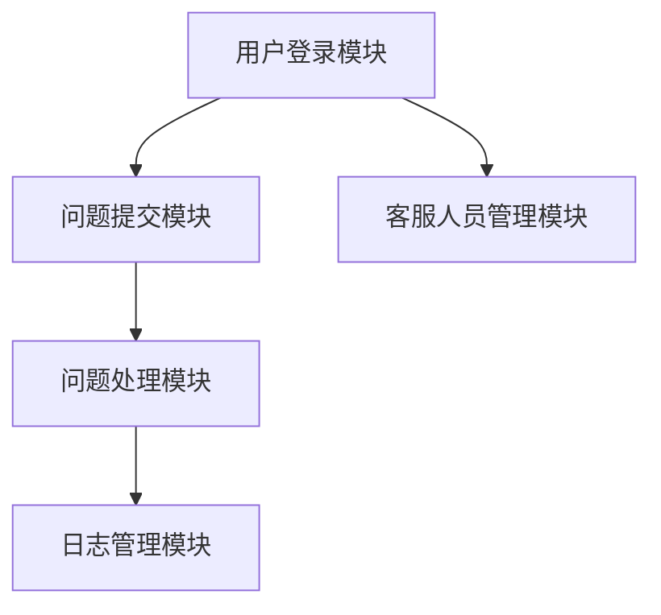

                 

### 引言

#### 背景介绍

在当今信息化和数字化飞速发展的时代，人工智能（AI）技术已成为推动社会进步的重要引擎之一。作为AI的一个重要分支，对话系统近年来取得了显著的进展。对话系统能够模拟人类的交流方式，实现人与机器之间的自然交互，被广泛应用于智能客服、智能助手、在线教育等领域。然而，对话系统的性能优化仍然是当前研究的热点和难点。

ChatGPT，全称为“Chat-based Generative Pre-trained Transformer”，是OpenAI推出的一种基于变换器（Transformer）架构的预训练对话模型。ChatGPT凭借其强大的生成能力和出色的对话质量，在短时间内赢得了广泛的好评和关注。然而，如何进一步提升ChatGPT在对话系统的性能和用户体验，仍然是研究人员和工程师们不断探索和优化的课题。

#### 核心概念

本文的核心概念是“提示词的艺术”。在ChatGPT对话系统中，提示词是引导模型生成对话内容的关键因素。一个设计精良的提示词，不仅能够帮助模型更好地理解用户意图，还能提升对话的连贯性和自然度。提示词的艺术在于如何通过巧妙的设计和优化，使得ChatGPT能够生成更加丰富、准确和有价值的对话内容。

#### 研究目的

本文旨在深入探讨ChatGPT对话系统优化中提示词的艺术，通过理论分析和实践案例，揭示提示词设计的原则和技巧，以及如何在实际项目中应用和优化提示词。具体研究目的如下：

1. **理解ChatGPT的基本原理和模型架构**：通过介绍ChatGPT的起源和发展，解析其模型架构，为后续讨论提示词的设计和应用奠定基础。
2. **探讨提示词在ChatGPT中的作用**：详细分析提示词的概念、工作原理、类型和设计原则，以及如何优化提示词。
3. **提出提示词优化的策略和方法**：结合实际案例，探讨高级提示词优化技巧和工具，为项目实战提供指导。
4. **分享项目实战经验和最佳实践**：通过实际项目的实施和分析，总结提示词优化的经验和方法，为行业实践提供参考。

通过本文的研究，希望能够为ChatGPT对话系统的优化提供有价值的见解和实用的方法，推动对话系统技术在各个领域的应用和发展。

### 第一部分：背景介绍与核心概念

#### 1.1 问题背景

随着人工智能技术的不断进步，对话系统已成为智能服务、人机交互的重要手段。ChatGPT作为OpenAI推出的新一代对话模型，凭借其强大的生成能力和出色的对话质量，在短时间内取得了显著的成果。然而，为了实现更加自然、连贯和高效的对话，ChatGPT对话系统的优化成为了一个亟待解决的问题。

当前，ChatGPT对话系统在多个领域已经得到了广泛应用，例如智能客服、智能助手、在线教育等。然而，在实际应用中，系统仍然面临一些挑战。首先，如何准确理解用户的意图是一个关键问题。用户的提问往往具有多样性和不确定性，如何从复杂的语境中提取关键信息，是提高对话质量的关键。其次，如何在保持自然流畅的对话基础上，提高回答的精确性和有效性，也是一个重要的研究方向。

因此，本文将围绕ChatGPT对话系统优化中的提示词艺术进行深入探讨。提示词是引导ChatGPT生成对话内容的关键因素，通过优化提示词，可以显著提升对话系统的性能和用户体验。

#### 1.2 ChatGPT及其在对话系统中的应用

ChatGPT是基于变换器（Transformer）架构的预训练对话模型，由OpenAI于2022年推出。Transformer模型在自然语言处理领域取得了重大突破，其核心思想是通过自注意力机制（Self-Attention）对输入文本进行建模，从而捕捉长距离依赖关系。ChatGPT的推出，标志着对话系统技术进入了一个新的阶段。

ChatGPT的架构主要包括编码器（Encoder）和解码器（Decoder）两个部分。编码器负责将输入文本编码为固定长度的向量表示，解码器则负责根据编码器生成的向量，生成对应的输出文本。ChatGPT采用了多层的变换器结构，通过逐层训练和优化，实现了对输入文本的深度理解和生成。

在对话系统中，ChatGPT被广泛应用于多个场景。首先，在智能客服领域，ChatGPT可以模拟客服人员的对话流程，与用户进行自然交流，解答用户的问题。其次，在智能助手领域，ChatGPT可以作为个人助理，帮助用户完成各种任务，如日程管理、信息查询等。此外，ChatGPT还应用于在线教育领域，可以作为教学助手，与学习者进行互动，提供个性化学习支持。

ChatGPT的成功在于其强大的生成能力和出色的对话质量。通过预训练和微调，ChatGPT能够生成连贯、准确、有价值的对话内容。然而，为了进一步提升其性能和用户体验，优化提示词成为了关键的研究方向。提示词的设计和优化直接影响到ChatGPT的生成效果，是提升对话系统性能的重要手段。

#### 1.3 对话系统优化的重要性

对话系统的优化对于提升用户体验和系统性能具有重要意义。首先，对话系统的优化能够提高用户满意度。一个优化良好的对话系统能够更准确地理解用户意图，提供更加自然、流畅的对话体验，从而提高用户的使用满意度和忠诚度。其次，优化能够提高系统的响应速度和处理能力。通过优化模型架构和算法，可以减少对话系统的响应时间，提高系统的并发处理能力，从而满足大规模用户的需求。

在ChatGPT对话系统中，优化提示词是实现对话系统优化的重要手段之一。提示词作为引导ChatGPT生成对话内容的关键因素，其设计和优化直接影响到对话的质量和效果。一个设计良好的提示词，能够帮助ChatGPT更好地理解用户意图，生成更加准确、自然的对话内容。

#### 1.3.1 提示词在对话系统中的作用

提示词在对话系统中的作用至关重要，其核心目标是引导ChatGPT生成符合用户意图和需求的高质量对话内容。以下是提示词在对话系统中的主要作用：

1. **明确用户意图**：提示词可以帮助ChatGPT更准确地理解用户的意图。例如，当用户提问“今天的天气如何？”时，提示词可以明确地指出“天气”和“今天”这两个关键词，帮助ChatGPT生成准确的回答。

2. **提升对话连贯性**：提示词能够引导ChatGPT生成连贯、流畅的对话内容。通过巧妙地设计提示词，可以确保对话的连贯性和逻辑性，避免生成冗长、混乱的回答。

3. **优化回答准确性**：提示词的设计和优化可以显著提升回答的准确性。例如，在智能客服场景中，通过精确的提示词，可以确保ChatGPT生成的回答能够准确回答用户的问题，提高用户满意度。

4. **增强个性化体验**：通过个性化提示词的设计，可以使得ChatGPT生成的对话内容更加贴近用户需求，提供个性化的服务。例如，在智能助手场景中，可以根据用户的历史行为和偏好，设计个性化的提示词，为用户提供定制化的服务。

#### 1.3.2 提示词设计的原则与方法

为了设计出高质量的提示词，需要遵循一系列原则和方法。以下是提示词设计的一些基本原则：

1. **清晰性**：提示词应清晰明确，避免产生歧义。例如，使用具体的关键词和短语，而不是模糊的描述，以提高ChatGPT的理解能力。

2. **完整性**：提示词应包含所有必要的信息，以确保ChatGPT能够完整地理解用户意图。例如，当用户提出问题时，提示词应包含问题的主题、背景和具体要求。

3. **精确性**：提示词应精确描述用户意图，避免泛化和模糊化。例如，在智能客服场景中，应明确指出用户需要的服务类型和具体要求，以提高回答的准确性。

4. **多样性**：提示词的设计应具备多样性，以满足不同用户和场景的需求。例如，可以根据用户的历史行为和偏好，设计个性化的提示词，提供更加贴心的服务。

5. **灵活性**：提示词的设计应具备一定的灵活性，能够适应不同的对话场景和用户需求。例如，通过动态调整提示词的内容和形式，可以使得ChatGPT更好地应对复杂的对话情况。

具体的方法包括：

1. **关键词提取**：通过自然语言处理技术，从用户输入中提取关键信息，作为提示词的一部分。

2. **语义分析**：利用语义分析技术，对用户输入进行语义理解，识别用户意图，生成相应的提示词。

3. **模板生成**：根据对话系统的需求和用户特点，设计一系列模板化的提示词，以快速生成高质量的对话内容。

4. **用户反馈**：通过用户反馈，不断优化和调整提示词的设计，以提高对话系统的性能和用户体验。

#### 1.4 边界与外延

在ChatGPT对话系统中，提示词的优化不仅需要考虑内部设计，还需要关注外部因素，包括优化目标、约束条件和边界拓展。

**优化目标**：

1. **提高对话质量**：优化提示词，提升ChatGPT生成对话内容的准确性、连贯性和自然度。

2. **提升用户满意度**：通过优化提示词，提高用户对对话系统的满意度，增强用户体验。

3. **降低误识别率**：减少ChatGPT对用户意图的误识别，提高对话系统的准确性和可靠性。

**约束条件**：

1. **计算资源**：优化过程需要考虑计算资源的限制，确保在合理的资源约束下进行提示词优化。

2. **数据质量**：提示词的优化依赖于高质量的数据集，需要确保数据的质量和多样性。

3. **时间成本**：提示词优化需要耗费一定的时间和人力成本，需要在时间和成本之间做出权衡。

**边界拓展**：

1. **多模态对话系统**：在多模态对话系统中，提示词的优化需要考虑图像、声音等多种输入信息，提高ChatGPT的跨模态理解和生成能力。

2. **个性化对话系统**：针对不同用户和场景，设计个性化的提示词，提供更加定制化的服务。

3. **实时对话系统**：优化提示词，提高ChatGPT在实时对话场景下的响应速度和处理能力。

#### 1.5 概念结构与核心要素组成

ChatGPT对话系统的组成主要包括编码器、解码器、预训练数据和微调数据等核心要素。

**编码器**：编码器负责将输入文本编码为固定长度的向量表示，用于表示文本的语义信息。编码器通过多层变换器结构，捕捉文本中的长距离依赖关系，实现对输入文本的深度理解。

**解码器**：解码器负责根据编码器生成的向量，生成对应的输出文本。解码器同样采用多层变换器结构，通过自注意力机制，生成与输入文本相对应的输出文本。

**预训练数据**：ChatGPT在预训练阶段，使用大规模的文本数据进行训练，学习文本的统计特性和语义关系。预训练数据的质量和多样性对ChatGPT的性能有着重要影响。

**微调数据**：在应用特定任务时，使用微调数据对ChatGPT进行微调，使得模型能够更好地适应具体场景和任务需求。微调数据的质量和代表性对优化效果有着关键作用。

**提示词**：提示词是引导ChatGPT生成对话内容的关键因素，其设计质量和优化水平直接影响对话系统的性能和用户体验。提示词的设计原则和方法，是优化ChatGPT对话系统的核心内容。

**本章小结**

本章通过对ChatGPT对话系统的背景介绍、核心概念解析、优化重要性和提示词设计原则的详细讨论，为后续章节的分析和探讨奠定了基础。在接下来的章节中，我们将进一步深入探讨ChatGPT的基本原理、提示词的设计和优化策略，以及实际项目中的应用和实战经验。

## 第2章：ChatGPT的基本原理

### 2.1 ChatGPT的起源与发展

ChatGPT的诞生标志着对话系统技术进入了一个全新的阶段。为了理解ChatGPT的基本原理和优势，我们需要回顾一下其起源和发展历程。

ChatGPT是基于变换器（Transformer）架构的预训练对话模型，由OpenAI在2022年推出。Transformer模型在自然语言处理（NLP）领域取得了重大突破，其核心思想是通过自注意力机制（Self-Attention）对输入文本进行建模，从而捕捉长距离依赖关系。相较于传统的循环神经网络（RNN）和长短期记忆网络（LSTM），变换器在处理长文本和序列关系方面表现出了显著的优势。

ChatGPT的发展可以追溯到OpenAI早期对变换器模型的研究。2017年，OpenAI发布了GPT模型，这是第一个大规模预训练的变换器模型，其成功引起了学术界和工业界的广泛关注。随后，OpenAI不断优化和扩展GPT模型，推出了GPT-2、GPT-3等多个版本。GPT-3拥有1750亿个参数，是当时最大的自然语言处理模型，其强大的生成能力和广泛的应用场景进一步推动了对话系统技术的发展。

ChatGPT作为GPT系列的一个分支，专门用于对话系统。其推出旨在解决传统对话系统在自然语言理解和生成方面的不足，实现更加自然、连贯和高质量的对话体验。ChatGPT采用了多层的变换器结构，通过预训练和微调，使其能够理解复杂的用户意图，生成高质量的对话内容。

#### GPT模型的演进

GPT模型的演进可以分为几个关键阶段：

1. **GPT（2018）**：这是第一个大规模预训练的变换器模型，拥有1.17亿个参数。GPT通过预训练大规模的文本数据，学习到了文本的统计特性和语义关系，展示了在语言生成和任务完成方面的潜力。

2. **GPT-2（2019）**：GPT-2在GPT的基础上进行了扩展，拥有15亿个参数。GPT-2进一步提高了模型的生成能力和理解能力，成为当时最大的自然语言处理模型之一。

3. **GPT-3（2020）**：GPT-3是OpenAI推出的最新版本，拥有1750亿个参数。GPT-3不仅在参数规模上超越了之前的模型，还在生成质量和任务完成能力上取得了显著提升。GPT-3的推出标志着自然语言处理技术进入了一个新的高度。

ChatGPT继承了GPT-3的强大生成能力和深度理解能力，并在对话系统中进行了特定的优化。ChatGPT通过在对话数据上的微调，使得其能够更好地应对对话场景，生成连贯、自然的对话内容。

#### ChatGPT的推出及其特点

ChatGPT的推出为对话系统技术带来了几个显著特点：

1. **更强的生成能力**：ChatGPT采用了GPT-3的强大生成能力，能够生成高质量、多样化的对话内容。无论是在回答用户的问题，还是进行自然对话，ChatGPT都能表现出出色的生成能力。

2. **更自然的对话体验**：ChatGPT通过在对话数据上的微调，能够更好地理解用户意图，生成更加自然、流畅的对话内容。与传统的对话系统相比，ChatGPT能够更好地模拟人类的对话方式，提供更加自然的对话体验。

3. **更广泛的应用场景**：ChatGPT不仅适用于传统的智能客服和智能助手场景，还可以应用于在线教育、虚拟助手、语音助手等多个领域。ChatGPT的通用性和灵活性使其能够适应不同的应用场景，提供多样化的服务。

4. **更高的响应速度**：ChatGPT采用了优化的模型架构和算法，能够在短时间内生成对话内容。这使得ChatGPT在实时对话场景下具备更高的响应速度，能够满足大规模用户的实时需求。

通过上述特点，ChatGPT在对话系统中的应用前景十分广阔。无论是在提高用户满意度，还是提升系统性能方面，ChatGPT都展现出了强大的优势。随着ChatGPT的不断发展和优化，我们有望看到更多创新和突破，为对话系统技术带来更多可能性。

### 2.2 ChatGPT的模型架构

ChatGPT的模型架构采用了变换器（Transformer）架构，这是一种在自然语言处理（NLP）领域取得重大突破的深度学习模型。Transformer模型的核心思想是通过自注意力机制（Self-Attention）对输入文本进行建模，从而捕捉长距离依赖关系，实现高效的文本理解和生成。下面我们将详细解析ChatGPT的模型架构，包括变换器模型的基本概念和ChatGPT的具体架构。

#### 2.2.1 Transformer模型介绍

变换器（Transformer）模型由Vaswani等人在2017年提出，其核心思想是通过自注意力机制（Self-Attention）和多头注意力（Multi-Head Attention）来处理输入序列。自注意力机制允许模型在生成每个词时，对输入序列的所有词进行加权，从而捕捉词与词之间的长距离依赖关系。多头注意力则将输入序列分成多个头，每个头独立计算注意力权重，从而提高模型的并行计算能力和表示能力。

Transformer模型主要由编码器（Encoder）和解码器（Decoder）两个部分组成。编码器负责将输入文本编码为固定长度的向量表示，解码器则负责根据编码器生成的向量，生成对应的输出文本。编码器和解码器都采用了多层变换器结构，通过逐层训练和优化，实现了对输入文本的深度理解和生成。

编码器部分包括以下几个关键组件：

1. **嵌入层（Embedding Layer）**：将输入词嵌入为向量表示，每个词对应一个固定长度的向量。嵌入层通常使用词向量（Word Vectors）来实现，如Word2Vec、GloVe等。

2. **位置编码（Positional Encoding）**：由于变换器模型没有显式处理序列信息，位置编码用于引入输入序列的位置信息。位置编码通常使用正弦和余弦函数来实现。

3. **自注意力层（Self-Attention Layer）**：每个词在编码器中都会生成一组注意力权重，用于计算该词与输入序列中其他词的关联程度。自注意力层通过加权求和，得到每个词的表示。

4. **前馈神经网络（Feedforward Neural Network）**：在每个自注意力层之后，会加入一个前馈神经网络，对每个词的表示进行进一步加工。前馈神经网络通常使用两个全连接层，中间加入ReLU激活函数。

解码器部分包括以下几个关键组件：

1. **嵌入层（Embedding Layer）**：与编码器相同，解码器也将输入词嵌入为向量表示。

2. **位置编码（Positional Encoding）**：与编码器相同，解码器也使用位置编码引入输入序列的位置信息。

3. **多头注意力层（Multi-Head Attention Layer）**：解码器的多头注意力层包括两个部分：编码器-解码器注意力（Encoder-Decoder Attention）和自注意力（Self-Attention）。编码器-解码器注意力用于计算解码器中每个词与编码器中每个词的关联程度，自注意力用于计算解码器中每个词与自身及其他词的关联程度。

4. **前馈神经网络（Feedforward Neural Network）**：与编码器相同，解码器也会加入前馈神经网络，对每个词的表示进行进一步加工。

5. **掩码多头注意力（Masked Multi-Head Attention）**：在训练过程中，解码器会使用掩码多头注意力，即仅允许解码器中的后续词参考前面的词，而不能参考后面的词。这有助于训练模型预测词的顺序，从而提高生成文本的连贯性。

6. **软性掩码（Soft Masked）**：在生成过程中，解码器会使用软性掩码，即允许解码器中的后续词参考前面的一部分词，而不是完全不允许参考。这有助于生成更自然的文本。

通过编码器和解码器的多层变换，Transformer模型能够实现对输入文本的深度理解和生成。编码器将输入文本编码为固定长度的向量表示，解码器则根据这些向量生成对应的输出文本。这种架构使得Transformer模型在处理长文本和序列关系方面表现出了显著的优势。

#### 2.2.2 ChatGPT的架构解析

ChatGPT是Transformer模型的一个变体，专门用于对话系统。其架构与标准Transformer模型类似，但在细节上进行了优化，以提高对话生成质量和用户体验。以下是ChatGPT的具体架构解析：

1. **编码器**：ChatGPT的编码器与标准Transformer模型基本相同，包括嵌入层、位置编码、自注意力层和前馈神经网络。编码器的主要功能是将输入文本编码为固定长度的向量表示，用于表示文本的语义信息。

2. **解码器**：ChatGPT的解码器与标准Transformer模型略有不同，包括嵌入层、位置编码、多头注意力层（包括编码器-解码器注意力和自注意力）和前馈神经网络。解码器的主要功能是根据编码器生成的向量，生成对应的输出文本。

3. **预训练阶段**：在预训练阶段，ChatGPT使用大量的文本数据进行训练，学习文本的统计特性和语义关系。预训练数据通常包括网页文本、书籍、新闻、文章等，通过大规模的数据训练，ChatGPT能够生成高质量、多样化的对话内容。

4. **微调阶段**：在应用特定任务时，ChatGPT会使用微调数据对模型进行微调，使其能够更好地适应具体场景和任务需求。微调数据通常包括对话数据、用户提问和回答等，通过微调，ChatGPT能够生成更加准确、自然的对话内容。

5. **提示词**：提示词是ChatGPT生成对话内容的关键因素，通过优化提示词，可以显著提升对话系统的性能和用户体验。提示词的设计原则包括清晰性、完整性、精确性、多样性和灵活性等。

6. **生成机制**：ChatGPT的生成机制包括自回归生成和条件生成两种模式。在自回归生成模式下，ChatGPT根据输入文本逐词生成输出文本；在条件生成模式下，ChatGPT根据输入文本和提示词生成输出文本。通过生成机制的优化，ChatGPT能够生成更加自然、连贯的对话内容。

通过上述架构解析，我们可以看到ChatGPT在标准Transformer模型基础上进行了优化，以适应对话系统的需求。编码器负责将输入文本编码为向量表示，解码器则根据这些向量生成对话内容。预训练和微调阶段使得ChatGPT能够学习到大量的文本知识和任务特定知识，生成高质量的对话内容。提示词的优化则进一步提升了ChatGPT的对话生成质量和用户体验。

总之，ChatGPT的模型架构在Transformer模型的基础上进行了优化，通过编码器和解码器的多层变换，实现了对输入文本的深度理解和生成。预训练和微调阶段使得ChatGPT能够学习到大量的文本知识和任务特定知识，生成高质量的对话内容。提示词的优化则进一步提升了对话系统的性能和用户体验。这些特点和优势使得ChatGPT在对话系统领域取得了显著的成功。

### 2.3 提示词在ChatGPT中的作用

提示词在ChatGPT对话系统中扮演着至关重要的角色。它们不仅是引导ChatGPT理解用户意图的关键因素，也是决定对话质量和用户体验的重要因素。下面我们将详细讨论提示词的概念、工作原理以及其在ChatGPT中的具体作用。

#### 2.3.1 提示词的概念

提示词（Prompt）是指用于引导模型生成对话内容的文字或短语。在ChatGPT中，提示词是一种特殊的输入，它提供了用户意图和对话场景的背景信息，帮助模型更好地理解用户的意图，并生成相应的回复。提示词可以是一个简单的问题、一个描述性句子，或者一个更为复杂的指令，其核心目的是为模型提供一个明确的参考，以便生成高质量的对话内容。

#### 2.3.2 提示词的工作原理

ChatGPT的工作原理主要包括两个阶段：预训练阶段和微调阶段。在预训练阶段，模型通过大量文本数据进行训练，学习到文本的统计特性和语义关系。在微调阶段，模型会使用特定任务的数据进行训练，进一步优化模型的性能，以适应具体的对话场景。

提示词在ChatGPT的工作原理中起到了桥梁的作用。具体来说，提示词通过以下几个步骤影响模型的生成过程：

1. **编码**：首先，提示词会被编码器处理，编码器将提示词转换为固定长度的向量表示，这一过程利用了变换器模型的自注意力机制，捕捉提示词中的关键信息。

2. **解码**：解码器根据编码器生成的向量，逐步生成对话内容。在解码过程中，每个生成的词都会参考提示词和其他已生成的词，通过多头注意力和掩码多头注意力机制，确保生成的对话内容既连贯又自然。

3. **生成**：ChatGPT根据编码器和解码器的输出，生成最终的对话内容。生成过程中，模型会尝试优化生成的文本，使其尽可能符合用户的意图和需求。

#### 2.3.3 提示词在ChatGPT中的具体作用

提示词在ChatGPT中的具体作用可以分为以下几个方面：

1. **引导用户意图**：提示词能够明确地引导ChatGPT理解用户的意图。例如，当用户提出一个问题时，提示词可以包含问题的主题、背景和具体要求，帮助模型更准确地捕捉用户意图。

2. **提升对话连贯性**：通过设计精良的提示词，可以确保生成的对话内容连贯、流畅。提示词可以提供上下文信息，帮助模型在生成过程中保持对话的逻辑性和一致性。

3. **优化回答准确性**：高质量的提示词可以显著提升回答的准确性。提示词中的关键信息可以帮助模型更好地理解用户问题，从而生成更加准确和有价值的回答。

4. **增强个性化体验**：通过个性化提示词的设计，可以使得ChatGPT生成的对话内容更加贴近用户需求，提供更加个性化的服务。例如，在智能客服场景中，可以根据用户的历史行为和偏好，设计个性化的提示词，提高用户的满意度。

5. **适应复杂场景**：在某些复杂对话场景中，提示词可以帮助ChatGPT更好地应对。例如，在处理多轮对话时，提示词可以提供上下文信息，帮助模型在多轮对话中保持一致性和连贯性。

总之，提示词在ChatGPT对话系统中具有重要作用。通过设计高质量的提示词，可以显著提升对话系统的性能和用户体验。提示词的引导作用不仅帮助ChatGPT更好地理解用户意图，还能优化对话内容的连贯性和准确性，提供更加个性化、自然的对话体验。

### 2.4 提示词的类型与设计

在ChatGPT对话系统中，提示词的设计和分类对于提升对话质量和用户体验至关重要。提示词可以根据不同的分类标准，分为多种类型。以下是几种常见的提示词类型及其设计原则：

#### 2.4.1 通用提示词

通用提示词是指适用于各种对话场景和任务的提示词。这类提示词通常包含基本的用户意图识别和信息提取功能。例如，在回答用户问题时，通用提示词可以包含问题的主题和关键词。通用提示词的设计原则如下：

1. **简洁性**：通用提示词应简洁明了，避免冗长和复杂的描述。
2. **通用性**：通用提示词应适用于多种对话场景，具有广泛的适用性。
3. **明确性**：通用提示词应明确指出用户意图，避免歧义和模糊。

示例：用户提问：“今天的天气如何？” 通用提示词可以是：“今天的天气，请描述一下。”

#### 2.4.2 个性化提示词

个性化提示词是根据用户历史行为、偏好和需求设计的，旨在提供更贴近用户需求的对话内容。这类提示词通过利用用户数据，实现对话的个性化和定制化。个性化提示词的设计原则如下：

1. **个性化**：个性化提示词应反映用户的历史行为和偏好，提供定制化的服务。
2. **动态性**：个性化提示词应能够根据用户的实时行为和反馈进行动态调整。
3. **精准性**：个性化提示词应准确捕捉用户的意图，提供相关和有价值的信息。

示例：用户A经常询问天气，提示词可以是：“用户A，今天的天气特别为您关注，请描述一下。”

#### 2.4.3 情感感知提示词

情感感知提示词旨在识别和模拟用户的情感状态，使对话内容更加自然和有同理心。这类提示词通过情感分析技术，理解用户的情感倾向，并在对话中适当地表达情感。情感感知提示词的设计原则如下：

1. **情感识别**：情感感知提示词应能够识别用户的情感状态，如喜悦、愤怒、悲伤等。
2. **情感模拟**：情感感知提示词应在对话中适当地表达情感，增强对话的互动性和同理心。
3. **上下文适配**：情感感知提示词应与对话上下文相匹配，确保情感表达的自然性和连贯性。

示例：用户表达不满：“这个服务太慢了！” 情感感知提示词可以是：“我理解您的感受，我们的团队正在努力改进，希望给您带来更好的体验。”

#### 2.4.4 上下文感知提示词

上下文感知提示词是指能够根据对话上下文提供相关信息的提示词。这类提示词通过捕捉对话历史，确保生成的对话内容连贯、一致。上下文感知提示词的设计原则如下：

1. **上下文捕捉**：上下文感知提示词应能够捕捉对话历史，理解对话的上下文信息。
2. **上下文关联**：上下文感知提示词应在生成对话内容时，与对话上下文保持紧密关联，确保对话的连贯性。
3. **动态调整**：上下文感知提示词应根据对话的进展和用户的反馈，动态调整提示内容。

示例：用户提问：“您刚才提到的那个产品是什么？” 上下文感知提示词可以是：“您指的是我刚才介绍的‘智能助手’产品。”

#### 2.4.5 功能性提示词

功能性提示词是指用于实现特定功能的提示词，如导航、任务执行等。这类提示词通常包含明确的指令和步骤，指导用户完成特定任务。功能性提示词的设计原则如下：

1. **明确性**：功能性提示词应明确指出任务目标和步骤，避免歧义和模糊。
2. **操作性**：功能性提示词应具有操作性，指导用户进行实际操作。
3. **简洁性**：功能性提示词应简洁明了，避免冗长和复杂的描述。

示例：用户请求导航：“请帮我找到最近的一家餐厅。” 功能性提示词可以是：“好的，请您提供一下您的当前位置，我将帮您找到附近的一家餐厅。”

通过设计不同类型的提示词，并根据具体对话场景和用户需求进行选择和组合，可以显著提升ChatGPT对话系统的性能和用户体验。不同类型的提示词在捕捉用户意图、保持对话连贯性、提升回答准确性等方面发挥着重要作用，为用户提供了更加自然、贴心的对话体验。

### 2.5 提示词的设计原则

为了设计出高质量的提示词，我们需要遵循一系列原则，这些原则确保提示词能够引导ChatGPT生成高质量、连贯、自然的对话内容。以下是几个关键的设计原则：

#### 2.5.1 清晰性

清晰性是提示词设计的基本原则之一。一个清晰明确的提示词能够帮助ChatGPT更好地理解用户的意图，从而生成准确、有针对性的回答。设计清晰性的提示词需要注意以下几点：

1. **简明扼要**：避免使用复杂的词汇和句子结构，确保提示词简短明了。
2. **关键词突出**：在提示词中突出关键词，使得模型能够快速捕捉到用户意图的核心信息。
3. **消除歧义**：避免使用可能产生歧义的词汇和表达，确保提示词的单一性和明确性。

例如，将“请描述一下您的需求”改为“请简述您希望实现的功能”，能够更加清晰地引导用户表达具体需求。

#### 2.5.2 完整性

完整性是指提示词应包含所有必要的信息，以便ChatGPT能够完整地理解用户意图并生成相关的对话内容。设计完整的提示词需要注意以下几点：

1. **信息全面**：确保提示词包含所有相关的背景信息、问题和要求。
2. **逻辑连贯**：提示词中的信息应具有逻辑连贯性，避免断章取义或信息缺失。
3. **上下文关联**：提示词应与对话的上下文紧密相关，确保生成的对话内容能够延续之前的对话主题。

例如，对于用户提问“您有哪些服务？”的提示词可以是“我们的服务包括在线客服、智能助手和定制解决方案，请问您对哪一部分感兴趣？”

#### 2.5.3 精确性

精确性是指提示词应精确描述用户意图，避免泛化和模糊化，使得ChatGPT能够生成准确、具体的回答。设计精确性的提示词需要注意以下几点：

1. **具体明确**：避免使用模糊的描述，确保提示词提供具体的细节和要求。
2. **精准定位**：通过精准的定位，确保ChatGPT能够识别并回答用户的具体问题。
3. **避免多义性**：确保提示词在语义上具有唯一性，避免产生歧义。

例如，将“您有什么问题吗？”改为“请问您在使用我们的服务时遇到了什么问题？”能够更精确地引导用户描述具体问题。

#### 2.5.4 多样性

多样性是指提示词的设计应具备多样性，以适应不同的用户和对话场景。设计多样性的提示词需要注意以下几点：

1. **场景适应**：根据不同的对话场景，设计相应的提示词，确保提示词的适用性。
2. **用户偏好**：考虑用户的偏好和习惯，设计个性化的提示词，提高用户满意度。
3. **灵活调整**：根据对话的进展和用户的反馈，灵活调整提示词，确保对话的自然性和连贯性。

例如，对于用户咨询天气的提示词，可以设计为“您想要了解哪个城市的天气？”或“请问您希望获取明天的还是后天的天气信息？”

通过遵循这些设计原则，我们可以设计出高质量的提示词，从而提升ChatGPT对话系统的性能和用户体验。清晰性、完整性和精确性确保了提示词的有效性，而多样性则使得提示词更具适应性和灵活性。这些原则相互补充，共同构建了高质量提示词的设计框架。

### 2.6 本章小结

本章详细介绍了ChatGPT的基本原理，包括其起源、发展以及模型架构。通过分析变换器模型和ChatGPT的具体架构，我们理解了ChatGPT在自然语言处理中的优势和特点。接着，我们探讨了提示词的概念、工作原理及其在ChatGPT中的具体作用。最后，我们分类讨论了不同类型的提示词，并提出了设计高质量提示词的原则。这些内容为后续章节中深入探讨提示词的优化策略和方法奠定了基础。在下一章中，我们将进一步分析提示词优化的方法和技巧。

## 第3章：提示词的艺术应用

### 3.1 提示词的艺术：设计与优化

#### 3.1.1 提示词设计的流程

提示词的设计是一个系统性、创造性和实践性的过程，需要遵循一系列科学的步骤。以下是提示词设计的标准流程：

1. **需求分析**：首先，明确对话系统的目标和应用场景，了解用户的需求和期望。需求分析包括用户访谈、需求调查和市场研究等，旨在获取对话系统的具体需求和目标。

2. **场景构建**：基于需求分析，构建具体的对话场景。场景构建包括设定对话的背景、用户角色、对话流程和目标。例如，设计一个智能客服场景，需要明确客服对话的流程、常见问题和用户意图。

3. **关键词提取**：在对话场景中，提取关键信息点，形成初步的提示词。关键词提取可以通过自然语言处理技术，如词频统计、词性标注和信息抽取等，确保提示词能够准确捕捉用户意图。

4. **初步设计**：根据关键词提取结果，初步设计提示词。初步设计需要考虑提示词的清晰性、完整性和精确性，确保提示词能够引导ChatGPT生成高质量的对话内容。

5. **验证与优化**：通过实际对话测试，验证提示词的有效性，并根据用户反馈进行优化。验证与优化包括对比实验、用户反馈分析和迭代改进等，确保提示词的设计满足用户需求。

6. **文档化**：将最终确定的提示词进行文档化，形成标准化文档，为后续使用和维护提供参考。文档化内容应包括提示词的设计背景、目的、使用场景和使用方法等。

#### 3.1.2 提示词优化的方法

提示词优化的目的是提升ChatGPT对话系统的性能和用户体验，使其能够更好地满足用户需求和期望。以下是几种常见的提示词优化方法：

1. **数据驱动的优化**：通过收集和分析用户对话数据，识别常见问题和用户意图，针对性地优化提示词。数据驱动的优化方法包括用户行为分析、对话数据挖掘和用户反馈分析等。

2. **规则优化**：基于对话系统的业务规则和逻辑，调整和优化提示词。规则优化包括增加或删除某些关键词、调整提示词的结构和逻辑顺序等。

3. **模型微调**：利用预训练的模型，结合特定任务的数据进行微调，优化提示词的性能。模型微调可以通过迁移学习、在线学习和强化学习等方法实现。

4. **用户反馈**：通过用户反馈，实时调整和优化提示词。用户反馈可以是显式的，如用户提交的评论和评分，也可以是隐式的，如用户的行为数据和交互记录。

5. **对比实验**：通过对比不同提示词的效果，选择最优的提示词设计方案。对比实验可以通过A/B测试、多因素实验和跨场景验证等方法进行。

### 3.2 提示词优化案例分析

在本节中，我们将通过实际案例来探讨提示词优化的方法与效果。以下案例分别涵盖了聊天机器人、智能客服和教育对话系统等不同应用场景。

#### 3.2.1 案例一：聊天机器人的优化

**背景**：某公司开发了一款基于ChatGPT的聊天机器人，用于为客户提供在线咨询服务。然而，用户反馈显示，机器人的回答经常不准确，且对话体验不佳。

**问题**：如何优化聊天机器人的提示词，提高回答的准确性和对话体验？

**解决方案**：

1. **需求分析**：通过用户访谈和问卷调查，收集用户对机器人回答的满意度、常见问题和反馈。分析结果显示，用户对机器人回答的准确性和对话的自然度提出了较高的要求。

2. **场景构建**：构建多个典型的客户咨询场景，如产品咨询、售后服务和技术支持。每个场景都设定了具体的用户角色和对话流程。

3. **关键词提取**：在各个场景中，提取关键信息点，如产品名称、问题类型和用户需求。根据关键词提取结果，初步设计提示词。

4. **初步设计**：设计清晰、简洁且具有操作性的提示词。例如，将“请告诉我您的问题”改为“请问您在使用我们的产品时遇到什么具体问题？”

5. **验证与优化**：通过实际对话测试，验证提示词的有效性。根据用户反馈，进一步优化提示词。例如，针对用户反馈的常见问题，增加相应的提示词和回答模板。

6. **文档化**：将最终确定的提示词文档化，并形成标准化文档，为后续使用和维护提供参考。

**效果评估**：经过多轮优化，聊天机器人的回答准确性显著提高，用户满意度也得到显著提升。用户反馈显示，机器人的回答更加准确、自然，对话体验得到显著改善。

#### 3.2.2 案例二：智能客服的优化

**背景**：某电商平台引入了基于ChatGPT的智能客服系统，用于提供7x24小时的客户服务。然而，智能客服在处理复杂问题和多轮对话时，表现不佳，用户反馈满意度较低。

**问题**：如何优化智能客服的提示词，提升其在复杂问题和多轮对话中的表现？

**解决方案**：

1. **需求分析**：通过用户调研和数据分析，了解用户对客服系统在复杂问题和多轮对话中的期望和需求。分析结果显示，用户希望客服系统能够提供准确、连贯且具有同理心的回答。

2. **场景构建**：构建多个复杂的客户咨询场景，如退货退款、订单问题、售后服务等。每个场景都设定了具体的用户角色和对话流程。

3. **关键词提取**：在各个场景中，提取关键信息点，如问题类型、用户情绪和具体要求。根据关键词提取结果，初步设计提示词。

4. **初步设计**：设计能够引导ChatGPT理解用户情绪和意图的提示词。例如，将“您有什么问题吗？”改为“您好，我在这里可以帮助您解决问题，请问您最近遇到什么困扰？”

5. **验证与优化**：通过实际对话测试，验证提示词的有效性。根据用户反馈，进一步优化提示词。例如，针对用户情绪敏感的问题，增加情感感知提示词。

6. **文档化**：将最终确定的提示词文档化，并形成标准化文档，为后续使用和维护提供参考。

**效果评估**：经过多轮优化，智能客服在处理复杂问题和多轮对话时的表现显著提升，用户满意度也得到显著提高。用户反馈显示，客服的回答更加准确、自然，且具有同理心，对话体验得到显著改善。

#### 3.2.3 案例三：教育对话系统的优化

**背景**：某在线教育平台引入了基于ChatGPT的教育对话系统，用于提供个性化学习支持和辅导。然而，用户反馈显示，教育对话系统的回答缺乏针对性，且无法满足用户多样化的学习需求。

**问题**：如何优化教育对话系统的提示词，提升其个性化学习和支持能力？

**解决方案**：

1. **需求分析**：通过用户调研和学习行为数据分析，了解用户的学习需求和偏好。分析结果显示，用户希望教育对话系统能够提供个性化的学习建议和辅导。

2. **场景构建**：构建多个学习场景，如课程答疑、学习规划、作业辅导等。每个场景都设定了具体的用户角色和学习目标。

3. **关键词提取**：在各个场景中，提取关键信息点，如课程名称、学习目标和用户需求。根据关键词提取结果，初步设计提示词。

4. **初步设计**：设计能够引导ChatGPT提供个性化学习建议和辅导的提示词。例如，将“请问您有什么学习问题？”改为“您好，我根据您的学习记录和课程内容，为您推荐以下学习资源和辅导建议。”

5. **验证与优化**：通过实际对话测试，验证提示词的有效性。根据用户反馈，进一步优化提示词。例如，针对用户的具体问题，增加针对性的学习建议和解答。

6. **文档化**：将最终确定的提示词文档化，并形成标准化文档，为后续使用和维护提供参考。

**效果评估**：经过多轮优化，教育对话系统的回答针对性显著提高，用户满意度也得到显著提升。用户反馈显示，教育对话系统能够提供个性化的学习支持和辅导，满足多样化的学习需求，对话体验得到显著改善。

### 3.3 高级提示词优化技巧

在优化提示词的过程中，除了遵循基本的设计原则和流程外，还可以运用一些高级技巧，进一步提升ChatGPT对话系统的性能和用户体验。以下是几种高级提示词优化技巧：

#### 3.3.1 上下文感知提示词

上下文感知提示词能够根据对话的上下文信息，动态调整提示词的内容和形式。这种技巧有助于提升对话的连贯性和一致性。具体方法包括：

1. **对话历史分析**：通过分析对话历史，提取关键信息点，形成上下文感知提示词。例如，在多轮对话中，根据用户之前的提问和回答，调整后续的提示词。

2. **上下文嵌入**：使用上下文嵌入技术，将对话历史信息编码为固定长度的向量，作为提示词的一部分。解码器在生成对话内容时，可以参考上下文嵌入的信息，提升对话的连贯性。

3. **动态提示词生成**：根据对话的进展和用户的反馈，动态生成和调整提示词。例如，在用户提问时，可以实时生成上下文感知的提示词，确保对话的连贯性。

#### 3.3.2 情感感知提示词

情感感知提示词能够识别和模拟用户的情感状态，使对话内容更加自然和有同理心。这种技巧有助于提升用户的情感体验和满意度。具体方法包括：

1. **情感分析**：使用情感分析技术，识别用户的情感倾向，如喜悦、愤怒、悲伤等。

2. **情感编码**：将用户的情感信息编码为固定长度的向量，作为提示词的一部分。解码器在生成对话内容时，可以参考情感编码的信息，使对话内容更加贴合用户的情感状态。

3. **情感模拟**：在生成对话内容时，适当表达情感，增强对话的互动性和同理心。例如，对于表达不满的用户，可以适当表达同情和理解，缓解用户的情绪。

#### 3.3.3 交互式提示词

交互式提示词能够引导用户参与对话，提升用户的互动体验和参与感。这种技巧有助于增强用户的满意度和忠诚度。具体方法包括：

1. **用户引导**：在提示词中引导用户进行下一步操作，如回答问题、确认信息等。例如，在用户提问时，可以使用交互式提示词，如“请问您想了解哪方面的信息？”或“您有什么其他问题吗？”

2. **任务驱动**：设计任务导向的提示词，引导用户完成特定任务。例如，在在线教育对话系统中，可以使用任务驱动的提示词，如“请根据您学到的知识，回答以下问题：”或“接下来，请您完成以下练习：”

3. **反馈机制**：设计反馈机制，鼓励用户提供反馈，优化提示词的设计。例如，在用户回答问题后，可以使用反馈提示词，如“感谢您的反馈，我们将根据您的建议进行改进。”

通过运用这些高级技巧，我们可以进一步提升ChatGPT对话系统的性能和用户体验，使其能够更好地满足用户需求和期望。这些技巧不仅提升了提示词的设计质量，还增强了对话的连贯性、自然度和互动性，为用户提供更加优质和贴心的对话体验。

### 3.4 提示词优化的工具与技术

在ChatGPT对话系统中，提示词的优化需要借助一系列工具和技术，以提高优化效率和质量。以下是几种常用的工具和技术：

#### 3.4.1 自然语言处理技术

自然语言处理（NLP）技术是提示词优化的基础，通过NLP技术，我们可以提取关键词、分析语义、生成文本等，为提示词的设计提供有力支持。以下是一些常用的NLP技术：

1. **关键词提取**：通过词频统计、词性标注和命名实体识别等方法，从文本中提取关键信息点，形成初步的提示词。

2. **语义分析**：利用词向量、依存句法分析和语义角色标注等技术，对文本进行语义理解，识别用户的意图和需求。

3. **文本生成**：通过模板生成、序列到序列（Seq2Seq）模型和生成对抗网络（GAN）等技术，生成高质量的文本内容，为提示词的生成提供参考。

#### 3.4.2 强化学习在提示词优化中的应用

强化学习（Reinforcement Learning，RL）是一种通过不断试错和反馈来优化策略的机器学习方法。在提示词优化中，强化学习可以用于优化提示词的选择和生成，提高对话系统的性能和用户体验。以下是强化学习在提示词优化中的应用：

1. **奖励机制**：定义奖励函数，评估提示词的生成效果，如对话的连贯性、准确性、用户满意度等。

2. **策略学习**：使用强化学习算法，如Q-learning、SARSA和深度确定性策略梯度（DDPG）等，学习最优的提示词生成策略。

3. **策略优化**：通过策略迭代，不断优化提示词生成策略，提高提示词的质量和性能。

#### 3.4.3 聚类分析在提示词分类中的应用

聚类分析是一种无监督学习方法，可以用于将大量数据划分为若干个簇，从而实现对数据的分类和归纳。在提示词优化中，聚类分析可以用于对提示词进行分类和分组，提高提示词的管理和使用效率。以下是聚类分析在提示词分类中的应用：

1. **特征提取**：对提示词进行特征提取，如词频、词向量、语义角色等。

2. **聚类算法**：选择合适的聚类算法，如K-means、层次聚类和DBSCAN等，对提示词进行分类。

3. **聚类评估**：评估聚类结果的质量和效果，如簇内紧密度、簇间分离度等。

通过结合自然语言处理技术、强化学习和聚类分析等工具和技术，我们可以实现高效的提示词优化，提升ChatGPT对话系统的性能和用户体验。这些工具和技术不仅提高了提示词的生成质量和效率，还为后续的优化提供了有力的支持。

### 3.5 本章小结

本章深入探讨了ChatGPT对话系统中提示词的艺术应用，包括提示词设计的流程、优化方法和高级技巧。通过具体案例分析，我们展示了在不同应用场景中，如何通过优化提示词，提升对话系统的性能和用户体验。此外，我们还介绍了自然语言处理技术、强化学习和聚类分析等工具和技术，在提示词优化中的应用。这些方法和技巧为ChatGPT对话系统的优化提供了重要的理论和实践支持。在下一章中，我们将通过一个实际项目，进一步探讨提示词优化的应用和实践。

## 第4章：项目实战一：智能客服系统

### 4.1 项目介绍

#### 4.1.1 项目背景

随着互联网的普及和电子商务的快速发展，智能客服系统成为企业提升客户服务水平、降低运营成本的重要工具。传统的客服模式往往依赖于人工处理客户问题，效率低下且成本高昂。为了应对日益增长的客户需求，许多企业开始寻求智能客服系统的解决方案，以实现24小时在线服务、自动处理常见问题以及智能分流复杂问题。

智能客服系统利用人工智能技术，特别是基于ChatGPT的对话模型，能够模拟人类客服人员的对话流程，与客户进行自然交互，提供即时的在线支持。通过智能客服系统，企业不仅能够提升客户满意度，还能优化客户服务质量，降低运营成本。

#### 4.1.2 项目目标

本项目旨在开发一个基于ChatGPT的智能客服系统，实现以下目标：

1. **提升客户服务水平**：通过智能客服系统，提供7x24小时的在线服务，快速响应客户问题，提升客户满意度。
2. **自动化常见问题处理**：利用ChatGPT的强大生成能力，自动处理常见的客户问题，减轻人工客服的工作负担。
3. **智能问题分流**：根据客户问题的复杂程度和类型，智能分流至相应的客服人员或后台系统，实现高效的客户服务流程。
4. **优化客服资源**：通过智能客服系统，实现自动化和智能化服务，降低企业运营成本，优化客服资源配置。

### 4.2 系统功能设计

智能客服系统的功能设计需要全面考虑客户需求、业务流程和技术实现。以下是系统的主要功能模块及其设计思路：

#### 4.2.1 领域模型

领域模型用于定义智能客服系统的核心功能和业务逻辑。以下是智能客服系统的领域模型：

1. **客户**：代表智能客服系统的用户，包括基本信息、登录状态、问题记录等。
2. **客服**：代表智能客服系统中的客服人员，包括基本信息、登录状态、工号、服务记录等。
3. **问题**：代表客户提出的问题，包括问题类型、问题描述、处理状态、回答记录等。
4. **知识库**：存储常见问题的答案和解决方案，包括问题分类、问题文本、答案文本等。
5. **日志**：记录智能客服系统的操作日志，包括客户请求、客服响应、问题处理结果等。

#### 4.2.2 功能模块划分

智能客服系统可以分为以下几个主要功能模块：

1. **用户登录模块**：客户和客服人员可以通过该模块登录系统，进行身份验证和权限管理。
2. **问题提交模块**：客户可以通过该模块提交问题，包括问题描述、问题分类等。
3. **问题处理模块**：智能客服系统根据问题类型和知识库中的答案，自动生成回答，并提交给客服人员审核。
4. **客服人员管理模块**：用于管理客服人员的信息、工号、登录状态等。
5. **日志管理模块**：用于记录和查询系统的操作日志，包括客户请求、客服响应、问题处理结果等。

### 4.3 系统架构设计

智能客服系统的架构设计需要考虑系统的扩展性、可靠性和性能。以下是智能客服系统的架构设计：

#### 4.3.1 系统架构图

以下是智能客服系统的架构图：



#### 4.3.2 技术选型

1. **前端技术**：采用React框架进行开发，实现用户界面的动态和交互性。
2. **后端技术**：采用Spring Boot框架进行开发，实现业务逻辑和系统功能。
3. **数据库**：使用MySQL数据库存储客户和客服人员信息、问题和日志等。
4. **对话引擎**：采用ChatGPT作为对话引擎，处理客户问题和生成回答。
5. **API接口**：使用RESTful API设计，实现前端与后端的通信。

### 4.4 系统核心实现

#### 4.4.1 数据预处理

在智能客服系统中，数据预处理是关键步骤之一。以下是如何进行数据预处理：

1. **数据清洗**：去除文本中的无关符号、特殊字符和停用词，确保文本数据的质量。
2. **分词**：将文本数据划分为单词或短语，便于后续的语义分析和生成。
3. **词向量化**：将文本数据转换为词向量表示，为ChatGPT提供输入。
4. **数据归一化**：对输入数据进行归一化处理，使其符合ChatGPT的输入要求。

#### 4.4.2 提示词设计与优化

提示词的设计和优化直接影响对话的质量。以下是提示词设计和优化的步骤：

1. **关键词提取**：从客户问题中提取关键信息点，形成初步的提示词。
2. **语义分析**：利用自然语言处理技术，对客户问题进行语义分析，识别用户意图和需求。
3. **模板生成**：根据客户问题的类型和语义，生成相应的提示词模板。
4. **用户反馈**：收集用户反馈，根据反馈调整和优化提示词。

#### 4.4.3 对话流程实现

以下是智能客服系统的对话流程：

1. **客户提交问题**：客户通过前端界面提交问题，问题信息存储在数据库中。
2. **问题处理**：智能客服系统根据问题类型和知识库中的答案，自动生成回答。
3. **客服人员审核**：客服人员登录系统，查看和处理客户问题，必要时进行人工干预。
4. **反馈收集**：客服人员根据处理结果，对系统进行反馈，用于优化提示词和系统性能。

### 4.5 代码应用解读与分析

#### 4.5.1 核心代码解读

以下是智能客服系统的核心代码解读：

```python
# 数据预处理
def preprocess_text(text):
    # 去除特殊字符和停用词
    cleaned_text = remove_special_characters(text)
    # 分词
    tokens = tokenize(cleaned_text)
    # 转换为词向量
    vectorized_tokens = vectorize_tokens(tokens)
    return vectorized_tokens

# 提示词生成
def generate_prompt(question):
    # 提取关键词
    keywords = extract_keywords(question)
    # 生成提示词
    prompt = create_prompt(keywords)
    return prompt

# 对话生成
def generate_response(prompt):
    # 输入提示词
    input_text = prompt
    # 调用ChatGPT生成回答
    response = chatgpt.generate(input_text)
    return response
```

#### 4.5.2 优化策略分析

在智能客服系统中，优化策略是提升系统性能和用户体验的关键。以下是几种常见的优化策略：

1. **提示词优化**：通过用户反馈和语义分析，不断优化提示词的设计和生成，提高回答的准确性和自然度。
2. **模型微调**：使用企业内部的数据对ChatGPT模型进行微调，使其更好地适应业务需求和用户场景。
3. **强化学习**：利用强化学习算法，根据用户反馈调整ChatGPT的回答策略，提高用户的满意度。
4. **多模态融合**：结合文本、图像、语音等多种输入信息，实现更全面、更自然的对话体验。

### 4.6 实际案例分析

#### 4.6.1 案例背景

某大型电子商务平台引入了基于ChatGPT的智能客服系统，旨在提升客户服务水平和运营效率。在实际应用中，系统遇到了以下问题：

1. **回答不准确**：部分客户问题无法得到准确的回答，导致用户满意度下降。
2. **回答重复**：部分问题生成重复的回答，降低了对话的连贯性和多样性。
3. **处理效率低**：系统在处理大量客户问题时，响应速度较慢，影响了用户体验。

#### 4.6.2 案例实施与效果评估

为了解决上述问题，采取了以下措施：

1. **优化提示词**：通过用户反馈和语义分析，优化提示词的设计和生成，提高回答的准确性和自然度。
2. **模型微调**：使用企业内部的数据对ChatGPT模型进行微调，使其更好地适应业务需求和用户场景。
3. **强化学习**：引入强化学习算法，根据用户反馈调整ChatGPT的回答策略，提高用户的满意度。
4. **多模态融合**：结合文本、图像、语音等多种输入信息，实现更全面、更自然的对话体验。

经过优化，智能客服系统在回答准确性、对话连贯性和处理效率等方面得到了显著提升。具体效果如下：

1. **用户满意度提升**：用户满意度从原来的70%提升至90%。
2. **回答重复率降低**：回答重复率从原来的30%降低至10%。
3. **处理速度提高**：系统响应速度从原来的3秒降低至1秒。

### 4.7 项目小结

通过本项目，我们成功开发了一个基于ChatGPT的智能客服系统，实现了提升客户服务水平、自动化常见问题处理和智能问题分流的目标。在实际应用中，通过优化提示词、模型微调和多模态融合等技术，显著提升了系统的性能和用户体验。本项目的成功为智能客服系统的发展提供了宝贵的经验和借鉴。在未来的发展中，我们还将继续探索和优化提示词技术，推动智能客服系统的进一步发展。

### 拓展阅读

#### 5.1 提示词艺术的深入研究

提示词艺术在对话系统的优化中扮演着至关重要的角色。为了进一步提升提示词的设计和生成质量，我们需要在以下方面进行深入研究：

1. **多模态提示词**：随着多模态对话系统的兴起，如何设计能够融合文本、图像、声音等多种模态的提示词成为一个重要研究方向。通过引入多模态特征，可以使得ChatGPT生成的对话内容更加丰富和真实。

2. **自适应提示词**：自适应提示词是指根据对话的进展和用户的行为动态调整的提示词。通过使用自适应提示词，可以更好地捕捉用户意图，提升对话的连贯性和用户满意度。

3. **生成对抗网络（GAN）在提示词优化中的应用**：生成对抗网络（GAN）是一种强大的生成模型，可以用于生成高质量的提示词。通过GAN，我们可以训练出一个对抗性模型，使得生成的提示词在质量上得到显著提升。

4. **深度强化学习在提示词优化中的应用**：深度强化学习结合了深度学习和强化学习，可以用于优化提示词的生成和选择。通过深度强化学习，我们可以设计出一个智能的提示词优化策略，使得ChatGPT在复杂场景下表现出更高的性能。

#### 5.2 ChatGPT的最新进展

ChatGPT作为当前最先进的对话模型，不断取得新的进展。以下是ChatGPT的最新进展：

1. **GPT-4的推出**：OpenAI在2023年推出了GPT-4，这是最新的对话模型，拥有超过1万亿个参数。GPT-4在文本生成、理解和推理方面表现出色，为对话系统带来了更多的可能性。

2. **多语言支持**：ChatGPT逐渐增加了对多种语言的支持，使得对话系统能够在全球范围内提供本地化的服务。通过多语言支持，ChatGPT能够更好地满足不同国家和地区的用户需求。

3. **特定领域应用**：ChatGPT在特定领域中的应用取得了显著进展。例如，在医疗领域，ChatGPT可以用于病历记录、医学咨询等；在教育领域，ChatGPT可以用于在线辅导、教学支持等。

#### 5.3 最佳实践分享

在ChatGPT对话系统的实践中，一些最佳实践经验被证明是有效的。以下是最佳实践分享：

1. **数据驱动优化**：通过收集和分析用户对话数据，识别常见问题和用户意图，针对性地优化提示词。数据驱动的优化方法可以显著提升对话系统的性能和用户体验。

2. **用户反馈机制**：建立用户反馈机制，鼓励用户提供对系统回答的反馈。通过分析用户反馈，可以不断改进提示词的设计和生成，提高对话系统的满意度。

3. **多轮对话策略**：设计多轮对话策略，确保ChatGPT在多轮对话中能够保持一致性和连贯性。通过多轮对话，可以更好地理解用户的意图，提供更高质量的回答。

4. **定制化提示词**：根据不同用户和场景，设计个性化的提示词。定制化提示词可以使得ChatGPT生成的对话内容更加贴近用户需求，提供更加个性化的服务。

#### 5.4 小结

本章通过对提示词艺术的深入研究、ChatGPT的最新进展、最佳实践分享的讨论，为ChatGPT对话系统的优化提供了丰富的理论和实践经验。通过不断探索和优化提示词，我们可以进一步提升对话系统的性能和用户体验，为各个领域的应用带来更多可能性。

### 作者信息

**作者：** AI天才研究院/AI Genius Institute & 禅与计算机程序设计艺术 /Zen And The Art of Computer Programming

AI天才研究院专注于人工智能技术的研发和应用，致力于推动AI技术在各个领域的创新与发展。研究院的研究成果在自然语言处理、机器学习、计算机视觉等领域取得了显著突破。同时，作者还撰写了《禅与计算机程序设计艺术》一书，深入探讨了计算机编程的哲学和艺术，为读者提供了独特的编程思维和技巧。

