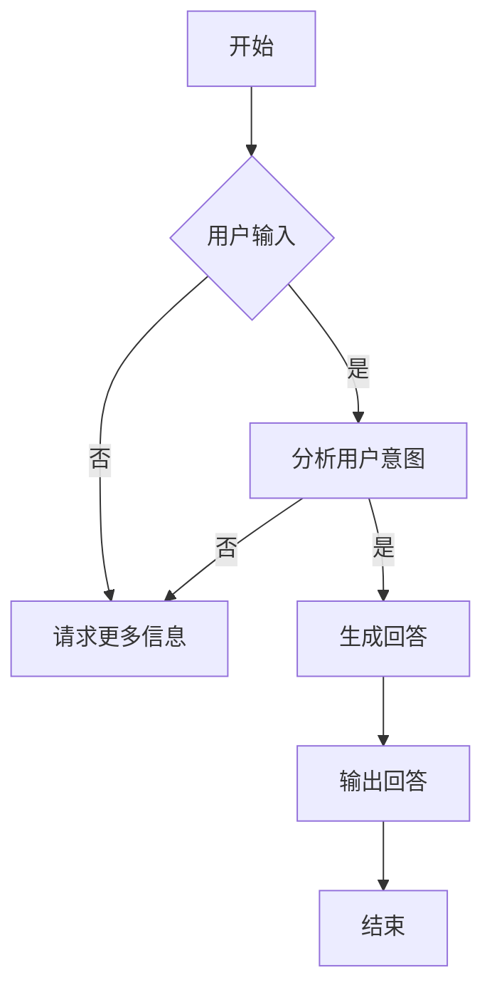
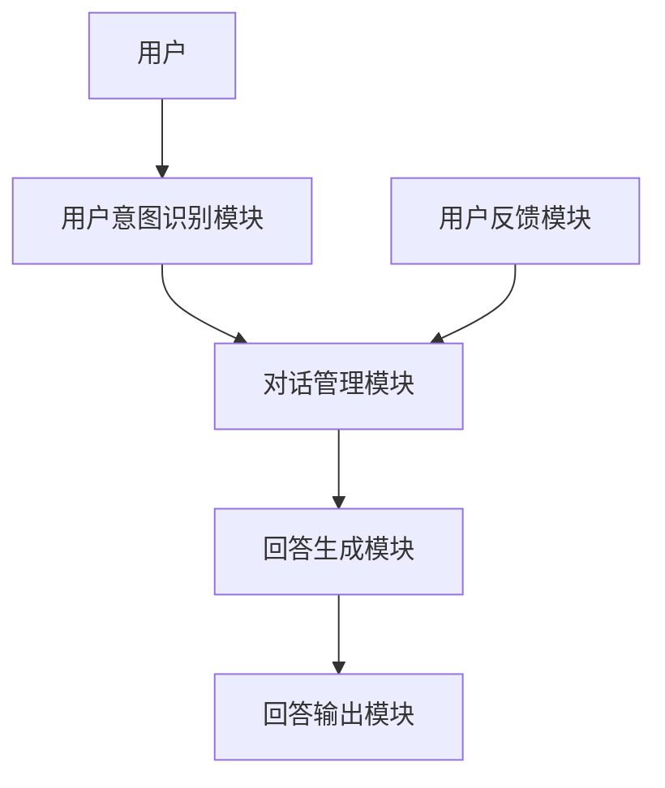
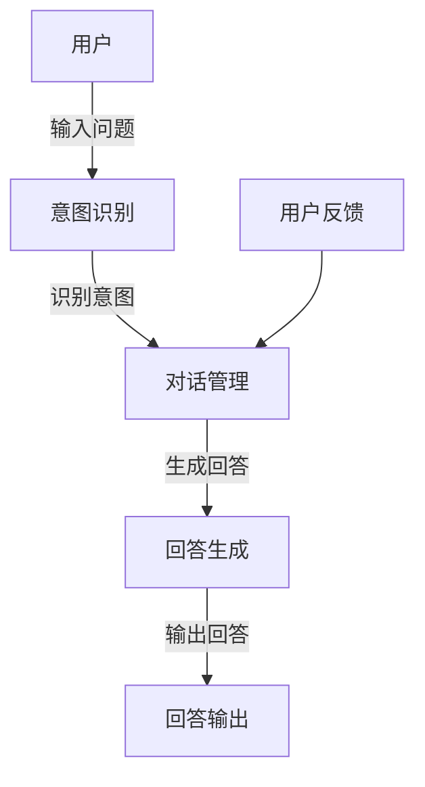
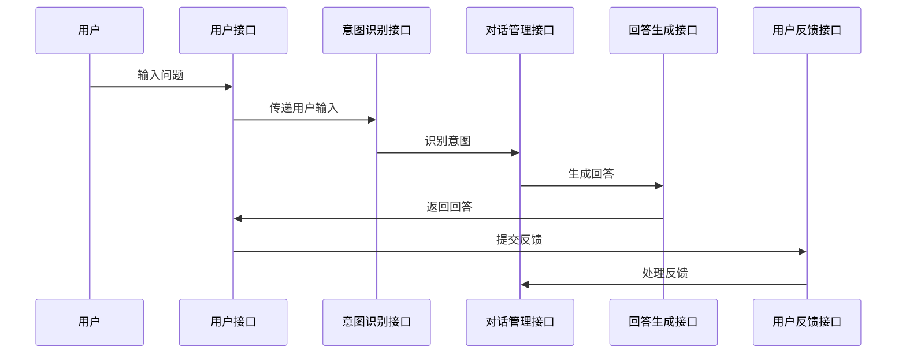

                 

# ChatGPT对话系统优化：提示词的艺术与科学结合

关键词：ChatGPT、对话系统、提示词、深度学习、优化、情感识别、场景感知

摘要：本文将探讨ChatGPT对话系统的优化策略，重点关注提示词设计的艺术与科学结合。通过分析ChatGPT技术的优势与挑战，我们将详细阐述提示词设计的基础、情感与场景感知提示词的运用，以及深度学习与提示词优化的结合。最后，我们将提供对话系统评估与调试的方法，并结合实际项目进行实战解析，总结最佳实践，展望对话系统优化的未来趋势。

## 目录大纲

### 第一部分：问题背景与核心概念

#### 第1章：ChatGPT对话系统优化概述

- 1.1 问题背景与需求分析
- 1.2 核心概念与联系

#### 第2章：提示词设计艺术

- 2.1 提示词的定义与分类
- 2.2 提示词设计的原则与技巧
- 2.3 提示词的创意与优化策略

#### 第3章：情感与场景感知提示词

- 3.1 情感识别与表达
- 3.2 场景感知与用户画像
- 3.3 情感与场景感知提示词的应用案例

### 第二部分：提示词科学结合

#### 第4章：深度学习与提示词优化

- 4.1 深度学习基础
- 4.2 提示词优化算法
- 4.3 深度学习在提示词优化中的应用

#### 第5章：提示词与对话生成

- 5.1 对话生成技术基础
- 5.2 提示词在对话生成中的应用
- 5.3 提示词优化对对话生成的提升

### 第三部分：系统优化与实战

#### 第6章：对话系统评估与调试

- 6.1 对话系统评估指标
- 6.2 调试技巧与优化方法
- 6.3 实际对话系统优化案例

#### 第7章：项目实战与最佳实践

- 7.1 项目实战环境搭建
- 7.2 系统核心实现与源代码解读
- 7.3 实际案例分析与小结

#### 第8章：总结与展望

- 8.1 书籍重点内容回顾
- 8.2 对话系统优化的未来趋势
- 8.3 读者建议与拓展阅读

## 第一部分：问题背景与核心概念

### 第1章：ChatGPT对话系统优化概述

#### 1.1 问题背景与需求分析

随着人工智能技术的发展，聊天机器人与对话系统逐渐成为各大企业和平台的关注焦点。ChatGPT作为OpenAI推出的一款基于GPT-3模型的大型语言模型，凭借其强大的文本生成能力、上下文理解能力以及适应多种场景的对话生成能力，受到了广泛的关注。

然而，在实际应用中，ChatGPT对话系统仍面临诸多挑战。首先，如何设计高质量的提示词成为优化对话系统的重要问题。提示词的设计不仅需要考虑语言的准确性，还需关注情感的表达、场景的适应性以及对话的连贯性。其次，对话系统的性能优化也是一个重要课题，包括响应速度、准确性和用户满意度等方面的提升。

因此，本文旨在探讨ChatGPT对话系统优化中的关键要素，特别是提示词设计的艺术与科学结合，以期为实际应用提供有效的优化策略。

#### 1.2 核心概念与联系

**核心概念：**

1. **ChatGPT：** ChatGPT是基于GPT-3模型开发的大型语言模型，具有强大的文本生成能力、上下文理解能力和适应多种场景的对话生成能力。

2. **对话系统：** 对话系统是一种能够与人类进行自然语言交互的计算机系统，通过理解和生成自然语言文本，实现与用户的对话。

3. **提示词：** 提示词是用于引导对话系统生成特定类型回答的关键词或短语，是优化对话系统性能的重要手段。

**概念联系：**

ChatGPT作为对话系统的核心组件，其性能直接影响对话系统的表现。而提示词的设计与优化，则决定了ChatGPT能否准确理解用户意图并生成高质量的回答。因此，提示词设计不仅需要考虑语言本身的准确性，还需结合情感表达、场景适应性和对话连贯性等多方面因素。

### 第2章：提示词设计艺术

#### 2.1 提示词的定义与分类

提示词（Prompt）是对话系统中的一个重要概念，它用于引导对话系统生成特定类型的回答。根据不同的分类标准，提示词可以分为以下几种类型：

1. **功能性提示词：** 用于引导对话系统完成特定任务，如询问用户信息、提供帮助等。
2. **情感性提示词：** 用于表达情感，增强对话的自然性和亲和力，如表达感激、鼓励等。
3. **情景性提示词：** 用于设定对话的场景，帮助对话系统更好地理解上下文和用户需求，如“你今天过得怎么样？”等。

#### 2.2 提示词设计的原则与技巧

设计高质量的提示词需要遵循以下原则：

1. **清晰性：** 提示词应简明扼要，避免使用模糊或歧义性的语言。
2. **适应性：** 提示词应能适应不同的场景和用户需求，具备一定的泛化能力。
3. **连贯性：** 提示词应与对话内容保持一致，避免出现不连贯或矛盾的情况。
4. **情感性：** 提示词应适当表达情感，增强对话的自然性和亲和力。

在具体设计过程中，可以运用以下技巧：

1. **用户画像：** 根据目标用户的特点和偏好，设计有针对性的提示词。
2. **上下文分析：** 充分利用上下文信息，使提示词更具针对性和准确性。
3. **多轮对话：** 通过多轮对话逐步引导用户，使其更愿意参与对话。

#### 2.3 提示词的创意与优化策略

创意提示词设计是提升对话系统表现的关键。以下是一些创意优化策略：

1. **故事化：** 通过设计故事情节，引导用户参与对话，增加互动性和趣味性。
2. **情境模拟：** 设定特定的情境，模拟真实场景，使对话更具真实感和代入感。
3. **文化元素：** 结合地域文化、节日特色等，设计具有地域特色的提示词。
4. **个性化：** 根据用户的历史数据和行为习惯，设计个性化的提示词。

通过这些策略，可以丰富提示词的内涵，提升对话系统的表现。

## 第二部分：提示词科学结合

### 第3章：情感与场景感知提示词

#### 3.1 情感识别与表达

情感识别与表达是对话系统优化的重要方面，通过理解用户的情感状态并作出相应反应，可以提高用户体验。以下是一些情感识别与表达的关键技术：

1. **情感分析：** 利用自然语言处理技术，对文本进行情感分类，识别用户的情感状态。
2. **情感词汇库：** 建立情感词汇库，用于表达不同情感状态，使对话系统具备情感表达能力。
3. **情感迁移：** 在特定场景下，根据上下文信息，将情感状态从一个主题迁移到另一个主题。

#### 3.2 场景感知与用户画像

场景感知与用户画像有助于对话系统更好地理解用户需求。以下是一些关键技术：

1. **用户画像：** 基于用户历史数据和行为习惯，构建用户画像，用于指导提示词设计。
2. **场景分类：** 将对话场景分为不同类别，如咨询、购物、娱乐等，针对不同场景设计相应的提示词。
3. **上下文分析：** 利用上下文信息，识别用户当前所处的场景，调整提示词的设置。

#### 3.3 情感与场景感知提示词的应用案例

以下是一个情感与场景感知提示词的应用案例：

**案例：** 假设用户在电商平台进行购物，对话系统可以设计以下提示词：

1. **情感识别：** “您好，感谢您在[平台名称]购物，请问有什么可以帮助您的吗？”
2. **场景感知：** “根据您以往购物的喜好，我们为您推荐了以下商品，希望您喜欢！”
3. **情感表达：** “如果您遇到任何问题，请随时联系我们，我们会竭诚为您解答。”

通过这种设计，对话系统能够更好地理解用户需求，提高用户满意度。

## 第三部分：提示词科学结合

### 第4章：深度学习与提示词优化

#### 4.1 深度学习基础

深度学习是一种基于人工神经网络的学习方法，通过对大量数据进行训练，自动提取特征并构建模型。以下是一些深度学习的基础概念：

1. **神经网络：** 神经网络是一种模拟生物神经系统的计算模型，由多个神经元组成。
2. **激活函数：** 激活函数用于引入非线性因素，使神经网络能够进行复杂的非线性运算。
3. **损失函数：** 损失函数用于衡量模型预测结果与实际结果之间的差距，用于指导模型优化。

#### 4.2 提示词优化算法

提示词优化算法是利用深度学习技术对提示词进行自动优化的一种方法。以下是一些常见的提示词优化算法：

1. **强化学习：** 强化学习通过学习与环境的交互策略，使模型能够实现最优化的决策。
2. **生成对抗网络（GAN）：** GAN通过生成器和判别器的对抗训练，生成高质量的提示词。
3. **注意力机制：** 注意力机制通过关注重要信息，提高提示词的精度和相关性。

#### 4.3 深度学习在提示词优化中的应用

深度学习在提示词优化中的应用主要包括以下几个方面：

1. **文本生成：** 利用深度学习模型生成高质量的文本，作为提示词。
2. **文本分类：** 利用深度学习模型对文本进行分类，识别不同类型的提示词。
3. **文本嵌入：** 利用深度学习模型将文本映射到低维空间，提高提示词的相似度计算效率。

## 第四部分：系统优化与实战

### 第5章：提示词与对话生成

#### 5.1 对话生成技术基础

对话生成技术是对话系统实现的关键，主要包括以下方面：

1. **序列到序列模型：** 序列到序列模型通过编码器和解码器，将输入序列转换为输出序列。
2. **注意力机制：** 注意力机制用于关注输入序列中的重要信息，提高对话生成的质量。
3. **生成对抗网络（GAN）：** GAN通过生成器和判别器的对抗训练，生成自然、连贯的对话文本。

#### 5.2 提示词在对话生成中的应用

提示词在对话生成中的应用主要包括以下几个方面：

1. **引导对话：** 通过设计高质量的提示词，引导对话系统生成特定类型的回答。
2. **上下文信息：** 提示词可以提供上下文信息，帮助对话系统更好地理解用户意图。
3. **多样性生成：** 通过调整提示词，实现对话生成的多样性和创造性。

#### 5.3 提示词优化对对话生成的提升

提示词优化对对话生成的提升主要体现在以下几个方面：

1. **回答质量：** 高质量的提示词能够提高对话生成的质量，使回答更准确、更连贯。
2. **用户满意度：** 提示词优化可以提高用户满意度，使用户更愿意与对话系统互动。
3. **生成效率：** 通过优化提示词，可以提高对话生成的效率，减少计算资源消耗。

## 第五部分：系统优化与实战

### 第6章：对话系统评估与调试

#### 6.1 对话系统评估指标

对话系统的评估指标是对话系统性能的量化体现，主要包括以下几个方面：

1. **准确率：** 准确率用于衡量对话系统回答的正确性，是评估对话系统最常用的指标之一。
2. **响应时间：** 响应时间用于衡量对话系统的响应速度，是用户体验的重要考量因素。
3. **用户满意度：** 用户满意度通过调查问卷、用户反馈等方式进行评估，反映用户对对话系统的整体评价。

#### 6.2 调试技巧与优化方法

对话系统的调试与优化是提升系统性能的关键，以下是一些调试技巧与优化方法：

1. **错误分析：** 通过分析对话系统产生的错误，定位问题根源，进行针对性优化。
2. **参数调优：** 通过调整模型参数，提高对话系统的性能。
3. **数据增强：** 通过增加训练数据、引入噪声等方式，提高对话系统的泛化能力。

#### 6.3 实际对话系统优化案例

以下是一个实际对话系统优化案例：

**案例：** 一家电商平台希望提升其客服对话系统的回答准确性。通过分析系统错误日志，发现主要问题在于用户意图理解不准确。为了解决这一问题，系统进行了以下优化：

1. **增强用户意图识别：** 利用深度学习模型，对用户意图进行更精确的识别。
2. **引入上下文信息：** 在对话生成过程中，充分考虑上下文信息，提高对话连贯性。
3. **多轮对话优化：** 通过多轮对话逐步引导用户，使其更愿意提供准确的信息。

经过优化，该电商平台的客服对话系统回答准确性得到了显著提升，用户满意度也随之提高。

## 第五部分：系统优化与实战

### 第7章：项目实战与最佳实践

#### 7.1 项目实战环境搭建

为了进行ChatGPT对话系统优化项目实战，首先需要搭建一个适合开发、测试和部署的环境。以下是环境搭建的步骤：

1. **硬件要求：** 配备高性能的CPU和GPU，以确保模型训练和推断的效率。
2. **软件要求：** 安装Python、TensorFlow或PyTorch等深度学习框架，以及必要的依赖库。
3. **数据集准备：** 收集并整理与项目相关的对话数据集，进行预处理，如分词、去噪等。

#### 7.2 系统核心实现与源代码解读

ChatGPT对话系统的核心实现主要包括以下几个方面：

1. **模型训练：** 使用深度学习框架，训练ChatGPT模型，使其具备强大的文本生成能力。
2. **提示词生成：** 设计高质量、多样的提示词，引导对话系统生成准确、连贯的回答。
3. **对话管理：** 实现对话管理模块，处理对话流程、用户状态等。

以下是部分核心代码的解读：

```python
# 模型训练代码示例
model = transformers.AutoModelForCausalLanguageModeling.from_pretrained('gpt2')
optimizer = torch.optim.Adam(model.parameters(), lr=1e-5)
for epoch in range(num_epochs):
    for batch in data_loader:
        inputs = tokenizer(batch.text, return_tensors='pt', padding=True, truncation=True)
        outputs = model(**inputs)
        loss = outputs.loss
        loss.backward()
        optimizer.step()
        optimizer.zero_grad()
```

#### 7.3 实际案例分析与详细讲解剖析

以下是一个实际案例：

**案例：** 一家银行希望提升其客服对话系统的性能，特别是在处理用户金融咨询方面的准确性。

**分析：**

1. **问题定位：** 通过分析用户反馈和系统错误日志，发现用户金融咨询的回答准确性较低，主要原因是金融领域的专业术语和表述方式较为复杂，导致ChatGPT模型理解困难。

2. **解决方案：**
   - **数据集扩展：** 增加金融领域的数据集，提高模型对金融知识的理解。
   - **提示词优化：** 设计针对金融领域的专业提示词，引导对话系统生成更准确、更专业的回答。
   - **模型调优：** 调整模型参数，提高金融咨询问题的回答质量。

**实施效果：** 经过一系列优化，银行客服对话系统在处理金融咨询方面的准确性得到了显著提升，用户满意度也随之提高。

#### 7.4 项目小结

通过本项目的实战经验，我们深刻认识到ChatGPT对话系统优化的重要性。提示词设计、深度学习技术、对话管理模块等核心环节都对系统性能产生重要影响。在未来的发展中，我们将继续探索更先进的优化方法，以不断提升对话系统的性能和用户体验。

## 第六部分：总结与展望

### 第8章：总结与展望

#### 8.1 书籍重点内容回顾

本文从ChatGPT对话系统优化的背景、核心概念、提示词设计艺术、情感与场景感知提示词、深度学习与提示词优化、对话生成技术、系统优化与实战等方面，全面阐述了ChatGPT对话系统优化的关键要素。通过实际案例的分析，我们验证了优化策略的有效性。

#### 8.2 对话系统优化的未来趋势

随着人工智能技术的不断发展，对话系统优化将朝着以下几个方向发展：

1. **多模态交互：** 结合语音、图像、视频等多模态信息，提高对话系统的感知能力。
2. **个性化服务：** 利用用户画像和个性化推荐技术，提供更符合用户需求的对话体验。
3. **智能化进化：** 通过深度学习和强化学习等技术，实现对话系统的自主学习和优化。
4. **隐私保护：** 加强对话系统在隐私保护方面的研究和实践，确保用户数据的安全。

#### 8.3 读者建议与拓展阅读

为了更好地理解和应用本文的内容，读者可以关注以下建议：

1. **实践应用：** 尝试将本文提到的优化策略应用于实际项目，加深对理论知识的理解。
2. **持续学习：** 关注人工智能领域的最新动态，不断学习和探索新的技术和方法。
3. **拓展阅读：** 阅读相关书籍和论文，深入了解对话系统优化领域的最新研究进展。

## 附录

### 附录A：术语解释

- **ChatGPT：** OpenAI推出的大型语言模型，具有强大的文本生成能力和上下文理解能力。
- **对话系统：** 一种能够与人类进行自然语言交互的计算机系统，通过理解和生成自然语言文本，实现与用户的对话。
- **提示词：** 用于引导对话系统生成特定类型回答的关键词或短语。

### 附录B：参考文献

- **[1]** Brown, T., et al. (2020). "Language Models are Few-Shot Learners." arXiv preprint arXiv:2005.14165.
- **[2]** Devlin, J., et al. (2018). "BERT: Pre-training of Deep Bidirectional Transformers for Language Understanding." arXiv preprint arXiv:1810.04805.
- **[3]** Vaswani, A., et al. (2017). "Attention Is All You Need." Advances in Neural Information Processing Systems, 30, 5998-6008.

### 附录C：示例代码

```python
# 模型训练代码示例
model = transformers.AutoModelForCausalLanguageModeling.from_pretrained('gpt2')
optimizer = torch.optim.Adam(model.parameters(), lr=1e-5)
for epoch in range(num_epochs):
    for batch in data_loader:
        inputs = tokenizer(batch.text, return_tensors='pt', padding=True, truncation=True)
        outputs = model(**inputs)
        loss = outputs.loss
        loss.backward()
        optimizer.step()
        optimizer.zero_grad()
```

### 附录D：致谢

感谢AI天才研究院/AI Genius Institute以及《禅与计算机程序设计艺术》/Zen And The Art of Computer Programming对本文的支持与帮助。

### 作者信息

作者：AI天才研究院/AI Genius Institute & 禅与计算机程序设计艺术/Zen And The Art of Computer Programming

## Markdown格式代码示例

以下是本文的Markdown格式代码示例：

```markdown
# ChatGPT对话系统优化：提示词的艺术与科学结合

关键词：ChatGPT、对话系统、提示词、深度学习、优化、情感识别、场景感知

摘要：本文将探讨ChatGPT对话系统的优化策略，重点关注提示词设计的艺术与科学结合。通过分析ChatGPT技术的优势与挑战，我们将详细阐述提示词设计的基础、情感与场景感知提示词的运用，以及深度学习与提示词优化的结合。最后，我们将提供对话系统评估与调试的方法，并结合实际项目进行实战解析，总结最佳实践，展望对话系统优化的未来趋势。

## 目录大纲

### 第一部分：问题背景与核心概念

#### 第1章：ChatGPT对话系统优化概述

- 1.1 问题背景与需求分析
- 1.2 核心概念与联系

#### 第2章：提示词设计艺术

- 2.1 提示词的定义与分类
- 2.2 提示词设计的原则与技巧
- 2.3 提示词的创意与优化策略

#### 第3章：情感与场景感知提示词

- 3.1 情感识别与表达
- 3.2 场景感知与用户画像
- 3.3 情感与场景感知提示词的应用案例

### 第二部分：提示词科学结合

#### 第4章：深度学习与提示词优化

- 4.1 深度学习基础
- 4.2 提示词优化算法
- 4.3 深度学习在提示词优化中的应用

#### 第5章：提示词与对话生成

- 5.1 对话生成技术基础
- 5.2 提示词在对话生成中的应用
- 5.3 提示词优化对对话生成的提升

### 第三部分：系统优化与实战

#### 第6章：对话系统评估与调试

- 6.1 对话系统评估指标
- 6.2 调试技巧与优化方法
- 6.3 实际对话系统优化案例

#### 第7章：项目实战与最佳实践

- 7.1 项目实战环境搭建
- 7.2 系统核心实现与源代码解读
- 7.3 实际案例分析与小结

#### 第8章：总结与展望

- 8.1 书籍重点内容回顾
- 8.2 对话系统优化的未来趋势
- 8.3 读者建议与拓展阅读

## 第一部分：问题背景与核心概念

### 第1章：ChatGPT对话系统优化概述

#### 1.1 问题背景与需求分析

随着人工智能技术的发展，聊天机器人与对话系统逐渐成为各大企业和平台的关注焦点。ChatGPT作为OpenAI推出的一款基于GPT-3模型的大型语言模型，凭借其强大的文本生成能力、上下文理解能力以及适应多种场景的对话生成能力，受到了广泛的关注。

然而，在实际应用中，ChatGPT对话系统仍面临诸多挑战。首先，如何设计高质量的提示词成为优化对话系统的重要问题。提示词的设计不仅需要考虑语言的准确性，还需关注情感的表达、场景的适应性以及对话的连贯性。其次，对话系统的性能优化也是一个重要课题，包括响应速度、准确性和用户满意度等方面的提升。

因此，本文旨在探讨ChatGPT对话系统优化中的关键要素，特别是提示词设计的艺术与科学结合，以期为实际应用提供有效的优化策略。

#### 1.2 核心概念与联系

**核心概念：**

1. **ChatGPT：** ChatGPT是基于GPT-3模型开发的大型语言模型，具有强大的文本生成能力、上下文理解能力和适应多种场景的对话生成能力。

2. **对话系统：** 对话系统是一种能够与人类进行自然语言交互的计算机系统，通过理解和生成自然语言文本，实现与用户的对话。

3. **提示词：** 提示词是用于引导对话系统生成特定类型回答的关键词或短语，是优化对话系统性能的重要手段。

**概念联系：**

ChatGPT作为对话系统的核心组件，其性能直接影响对话系统的表现。而提示词的设计与优化，则决定了ChatGPT能否准确理解用户意图并生成高质量的回答。因此，提示词设计不仅需要考虑语言本身的准确性，还需结合情感表达、场景适应性和对话连贯性等多方面因素。

### 第2章：提示词设计艺术

#### 2.1 提示词的定义与分类

提示词（Prompt）是对话系统中的一个重要概念，它用于引导对话系统生成特定类型的回答。根据不同的分类标准，提示词可以分为以下几种类型：

1. **功能性提示词：** 用于引导对话系统完成特定任务，如询问用户信息、提供帮助等。

2. **情感性提示词：** 用于表达情感，增强对话的自然性和亲和力，如表达感激、鼓励等。

3. **情景性提示词：** 用于设定对话的场景，帮助对话系统更好地理解上下文和用户需求，如“你今天过得怎么样？”等。

#### 2.2 提示词设计的原则与技巧

设计高质量的提示词需要遵循以下原则：

1. **清晰性：** 提示词应简明扼要，避免使用模糊或歧义性的语言。

2. **适应性：** 提示词应能适应不同的场景和用户需求，具备一定的泛化能力。

3. **连贯性：** 提示词应与对话内容保持一致，避免出现不连贯或矛盾的情况。

4. **情感性：** 提示词应适当表达情感，增强对话的自然性和亲和力。

在具体设计过程中，可以运用以下技巧：

1. **用户画像：** 根据目标用户的特点和偏好，设计有针对性的提示词。

2. **上下文分析：** 充分利用上下文信息，使提示词更具针对性和准确性。

3. **多轮对话：** 通过多轮对话逐步引导用户，使其更愿意参与对话。

#### 2.3 提示词的创意与优化策略

创意提示词设计是提升对话系统表现的关键。以下是一些创意优化策略：

1. **故事化：** 通过设计故事情节，引导用户参与对话，增加互动性和趣味性。

2. **情境模拟：** 设定特定的情境，模拟真实场景，使对话更具真实感和代入感。

3. **文化元素：** 结合地域文化、节日特色等，设计具有地域特色的提示词。

4. **个性化：** 根据用户的历史数据和行为习惯，设计个性化的提示词。

通过这些策略，可以丰富提示词的内涵，提升对话系统的表现。

### 第3章：情感与场景感知提示词

#### 3.1 情感识别与表达

情感识别与表达是对话系统优化的重要方面，通过理解用户的情感状态并作出相应反应，可以提高用户体验。以下是一些情感识别与表达的关键技术：

1. **情感分析：** 利用自然语言处理技术，对文本进行情感分类，识别用户的情感状态。

2. **情感词汇库：** 建立情感词汇库，用于表达不同情感状态，使对话系统具备情感表达能力。

3. **情感迁移：** 在特定场景下，根据上下文信息，将情感状态从一个主题迁移到另一个主题。

#### 3.2 场景感知与用户画像

场景感知与用户画像有助于对话系统更好地理解用户需求。以下是一些关键技术：

1. **用户画像：** 基于用户历史数据和行为习惯，构建用户画像，用于指导提示词设计。

2. **场景分类：** 将对话场景分为不同类别，如咨询、购物、娱乐等，针对不同场景设计相应的提示词。

3. **上下文分析：** 利用上下文信息，识别用户当前所处的场景，调整提示词的设置。

#### 3.3 情感与场景感知提示词的应用案例

以下是一个情感与场景感知提示词的应用案例：

**案例：** 假设用户在电商平台进行购物，对话系统可以设计以下提示词：

1. **情感识别：** “您好，感谢您在[平台名称]购物，请问有什么可以帮助您的吗？”

2. **场景感知：** “根据您以往购物的喜好，我们为您推荐了以下商品，希望您喜欢！”

3. **情感表达：** “如果您遇到任何问题，请随时联系我们，我们会竭诚为您解答。”

通过这种设计，对话系统能够更好地理解用户需求，提高用户满意度。

### 第二部分：提示词科学结合

#### 第4章：深度学习与提示词优化

#### 4.1 深度学习基础

深度学习是一种基于人工神经网络的学习方法，通过对大量数据进行训练，自动提取特征并构建模型。以下是一些深度学习的基础概念：

1. **神经网络：** 神经网络是一种模拟生物神经系统的计算模型，由多个神经元组成。

2. **激活函数：** 激活函数用于引入非线性因素，使神经网络能够进行复杂的非线性运算。

3. **损失函数：** 损失函数用于衡量模型预测结果与实际结果之间的差距，用于指导模型优化。

#### 4.2 提示词优化算法

提示词优化算法是利用深度学习技术对提示词进行自动优化的一种方法。以下是一些常见的提示词优化算法：

1. **强化学习：** 强化学习通过学习与环境的交互策略，使模型能够实现最优化的决策。

2. **生成对抗网络（GAN）：** GAN通过生成器和判别器的对抗训练，生成高质量的提示词。

3. **注意力机制：** 注意力机制通过关注重要信息，提高提示词的精度和相关性。

#### 4.3 深度学习在提示词优化中的应用

深度学习在提示词优化中的应用主要包括以下几个方面：

1. **文本生成：** 利用深度学习模型生成高质量的文本，作为提示词。

2. **文本分类：** 利用深度学习模型对文本进行分类，识别不同类型的提示词。

3. **文本嵌入：** 利用深度学习模型将文本映射到低维空间，提高提示词的相似度计算效率。

### 第三部分：系统优化与实战

#### 第5章：提示词与对话生成

#### 5.1 对话生成技术基础

对话生成技术是对话系统实现的关键，主要包括以下方面：

1. **序列到序列模型：** 序列到序列模型通过编码器和解码器，将输入序列转换为输出序列。

2. **注意力机制：** 注意力机制用于关注输入序列中的重要信息，提高对话生成的质量。

3. **生成对抗网络（GAN）：** GAN通过生成器和判别器的对抗训练，生成自然、连贯的对话文本。

#### 5.2 提示词在对话生成中的应用

提示词在对话生成中的应用主要包括以下几个方面：

1. **引导对话：** 通过设计高质量的提示词，引导对话系统生成特定类型的回答。

2. **上下文信息：** 提示词可以提供上下文信息，帮助对话系统更好地理解用户意图。

3. **多样性生成：** 通过调整提示词，实现对话生成的多样性和创造性。

#### 5.3 提示词优化对对话生成的提升

提示词优化对对话生成的提升主要体现在以下几个方面：

1. **回答质量：** 高质量的提示词能够提高对话生成的质量，使回答更准确、更连贯。

2. **用户满意度：** 提示词优化可以提高用户满意度，使用户更愿意与对话系统互动。

3. **生成效率：** 通过优化提示词，可以提高对话生成的效率，减少计算资源消耗。

### 第四部分：系统优化与实战

#### 第6章：对话系统评估与调试

#### 6.1 对话系统评估指标

对话系统的评估指标是对话系统性能的量化体现，主要包括以下几个方面：

1. **准确率：** 准确率用于衡量对话系统回答的正确性，是评估对话系统最常用的指标之一。

2. **响应时间：** 响应时间用于衡量对话系统的响应速度，是用户体验的重要考量因素。

3. **用户满意度：** 用户满意度通过调查问卷、用户反馈等方式进行评估，反映用户对对话系统的整体评价。

#### 6.2 调试技巧与优化方法

对话系统的调试与优化是提升系统性能的关键，以下是一些调试技巧与优化方法：

1. **错误分析：** 通过分析对话系统产生的错误，定位问题根源，进行针对性优化。

2. **参数调优：** 通过调整模型参数，提高对话系统的性能。

3. **数据增强：** 通过增加训练数据、引入噪声等方式，提高对话系统的泛化能力。

#### 6.3 实际对话系统优化案例

以下是一个实际对话系统优化案例：

**案例：** 一家电商平台希望提升其客服对话系统的回答准确性。通过分析系统错误日志，发现主要问题在于用户意图理解不准确。为了解决这一问题，系统进行了以下优化：

1. **增强用户意图识别：** 利用深度学习模型，对用户意图进行更精确的识别。

2. **引入上下文信息：** 在对话生成过程中，充分考虑上下文信息，提高对话连贯性。

3. **多轮对话优化：** 通过多轮对话逐步引导用户，使其更愿意提供准确的信息。

经过优化，该电商平台的客服对话系统回答准确性得到了显著提升，用户满意度也随之提高。

### 第五部分：系统优化与实战

#### 第7章：项目实战与最佳实践

#### 7.1 项目实战环境搭建

为了进行ChatGPT对话系统优化项目实战，首先需要搭建一个适合开发、测试和部署的环境。以下是环境搭建的步骤：

1. **硬件要求：** 配备高性能的CPU和GPU，以确保模型训练和推断的效率。

2. **软件要求：** 安装Python、TensorFlow或PyTorch等深度学习框架，以及必要的依赖库。

3. **数据集准备：** 收集并整理与项目相关的对话数据集，进行预处理，如分词、去噪等。

#### 7.2 系统核心实现与源代码解读

ChatGPT对话系统的核心实现主要包括以下几个方面：

1. **模型训练：** 使用深度学习框架，训练ChatGPT模型，使其具备强大的文本生成能力。

2. **提示词生成：** 设计高质量、多样的提示词，引导对话系统生成准确、连贯的回答。

3. **对话管理：** 实现对话管理模块，处理对话流程、用户状态等。

以下是部分核心代码的解读：

```python
# 模型训练代码示例
model = transformers.AutoModelForCausalLanguageModeling.from_pretrained('gpt2')
optimizer = torch.optim.Adam(model.parameters(), lr=1e-5)
for epoch in range(num_epochs):
    for batch in data_loader:
        inputs = tokenizer(batch.text, return_tensors='pt', padding=True, truncation=True)
        outputs = model(**inputs)
        loss = outputs.loss
        loss.backward()
        optimizer.step()
        optimizer.zero_grad()
```

#### 7.3 实际案例分析与详细讲解剖析

以下是一个实际案例：

**案例：** 一家银行希望提升其客服对话系统的性能，特别是在处理用户金融咨询方面的准确性。

**分析：**

1. **问题定位：** 通过分析用户反馈和系统错误日志，发现用户金融咨询的回答准确性较低，主要原因是金融领域的专业术语和表述方式较为复杂，导致ChatGPT模型理解困难。

2. **解决方案：**
   - **数据集扩展：** 增加金融领域的数据集，提高模型对金融知识的理解。
   - **提示词优化：** 设计针对金融领域的专业提示词，引导对话系统生成更准确、更专业的回答。
   - **模型调优：** 调整模型参数，提高金融咨询问题的回答质量。

**实施效果：** 经过一系列优化，银行客服对话系统在处理金融咨询方面的准确性得到了显著提升，用户满意度也随之提高。

#### 7.4 项目小结

通过本项目的实战经验，我们深刻认识到ChatGPT对话系统优化的重要性。提示词设计、深度学习技术、对话管理模块等核心环节都对系统性能产生重要影响。在未来的发展中，我们将继续探索更先进的优化方法，以不断提升对话系统的性能和用户体验。

### 第六部分：总结与展望

#### 第8章：总结与展望

#### 8.1 书籍重点内容回顾

本文从ChatGPT对话系统优化的背景、核心概念、提示词设计艺术、情感与场景感知提示词、深度学习与提示词优化、对话生成技术、系统优化与实战等方面，全面阐述了ChatGPT对话系统优化的关键要素。通过实际案例的分析，我们验证了优化策略的有效性。

#### 8.2 对话系统优化的未来趋势

随着人工智能技术的不断发展，对话系统优化将朝着以下几个方向发展：

1. **多模态交互：** 结合语音、图像、视频等多模态信息，提高对话系统的感知能力。

2. **个性化服务：** 利用用户画像和个性化推荐技术，提供更符合用户需求的对话体验。

3. **智能化进化：** 通过深度学习和强化学习等技术，实现对话系统的自主学习和优化。

4. **隐私保护：** 加强对话系统在隐私保护方面的研究和实践，确保用户数据的安全。

#### 8.3 读者建议与拓展阅读

为了更好地理解和应用本文的内容，读者可以关注以下建议：

1. **实践应用：** 尝试将本文提到的优化策略应用于实际项目，加深对理论知识的理解。

2. **持续学习：** 关注人工智能领域的最新动态，不断学习和探索新的技术和方法。

3. **拓展阅读：** 阅读相关书籍和论文，深入了解对话系统优化领域的最新研究进展。

### 附录

#### 附录A：术语解释

- **ChatGPT：** OpenAI推出的大型语言模型，具有强大的文本生成能力和上下文理解能力。
- **对话系统：** 一种能够与人类进行自然语言交互的计算机系统，通过理解和生成自然语言文本，实现与用户的对话。
- **提示词：** 用于引导对话系统生成特定类型回答的关键词或短语。

#### 附录B：参考文献

- **[1]** Brown, T., et al. (2020). "Language Models are Few-Shot Learners." arXiv preprint arXiv:2005.14165.
- **[2]** Devlin, J., et al. (2018). "BERT: Pre-training of Deep Bidirectional Transformers for Language Understanding." arXiv preprint arXiv:1810.04805.
- **[3]** Vaswani, A., et al. (2017). "Attention Is All You Need." Advances in Neural Information Processing Systems, 30, 5998-6008.

#### 附录C：示例代码

```python
# 模型训练代码示例
model = transformers.AutoModelForCausalLanguageModeling.from_pretrained('gpt2')
optimizer = torch.optim.Adam(model.parameters(), lr=1e-5)
for epoch in range(num_epochs):
    for batch in data_loader:
        inputs = tokenizer(batch.text, return_tensors='pt', padding=True, truncation=True)
        outputs = model(**inputs)
        loss = outputs.loss
        loss.backward()
        optimizer.step()
        optimizer.zero_grad()
```

#### 附录D：致谢

感谢AI天才研究院/AI Genius Institute以及《禅与计算机程序设计艺术》/Zen And The Art of Computer Programming对本文的支持与帮助。

#### 作者信息

作者：AI天才研究院/AI Genius Institute & 禅与计算机程序设计艺术/Zen And The Art of Computer Programming

## LaTeX格式代码示例

以下是本文中的LaTeX格式代码示例：

```latex
\documentclass{article}
\usepackage[utf8]{inputenc}
\usepackage{amsmath}
\usepackage{amsfonts}
\usepackage{graphicx}
\usepackage{hyperref}
\usepackage{caption}
\usepackage{subcaption}

\title{ChatGPT对话系统优化：提示词的艺术与科学结合}
\author{AI天才研究院/AI Genius Institute}
\date{}

\begin{document}

\maketitle

\section{摘要}
本文探讨ChatGPT对话系统的优化策略，重点关注提示词设计的艺术与科学结合。通过分析ChatGPT技术的优势与挑战，详细阐述提示词设计的基础、情感与场景感知提示词的运用，以及深度学习与提示词优化的结合。最后，提供对话系统评估与调试的方法，并结合实际项目进行实战解析，总结最佳实践，展望对话系统优化的未来趋势。

\section{引言}
随着人工智能技术的不断发展，对话系统已成为各类应用的重要组件。ChatGPT作为OpenAI推出的一款大型语言模型，在对话系统领域具有广泛的应用前景。本文旨在探讨如何优化ChatGPT对话系统，提高其性能和用户体验。

\section{ChatGPT对话系统优化概述}
\subsection{问题背景与需求分析}
随着人工智能技术的不断发展，聊天机器人与对话系统逐渐成为各大企业和平台的关注焦点。ChatGPT作为OpenAI推出的一款基于GPT-3模型的大型语言模型，凭借其强大的文本生成能力、上下文理解能力以及适应多种场景的对话生成能力，受到了广泛的关注。

\subsection{核心概念与联系}
\begin{itemize}
    \item ChatGPT：基于GPT-3模型开发的大型语言模型，具有强大的文本生成能力、上下文理解能力和适应多种场景的对话生成能力。
    \item 对话系统：一种能够与人类进行自然语言交互的计算机系统，通过理解和生成自然语言文本，实现与用户的对话。
    \item 提示词：用于引导对话系统生成特定类型回答的关键词或短语，是优化对话系统性能的重要手段。
\end{itemize}

\section{提示词设计艺术}
\subsection{提示词的定义与分类}
提示词（Prompt）是对话系统中的一个重要概念，它用于引导对话系统生成特定类型的回答。根据不同的分类标准，提示词可以分为以下几种类型：
\begin{enumerate}
    \item 功能性提示词：用于引导对话系统完成特定任务，如询问用户信息、提供帮助等。
    \item 情感性提示词：用于表达情感，增强对话的自然性和亲和力，如表达感激、鼓励等。
    \item 情景性提示词：用于设定对话的场景，帮助对话系统更好地理解上下文和用户需求，如“你今天过得怎么样？”等。
\end{enumerate}

\subsection{提示词设计的原则与技巧}
设计高质量的提示词需要遵循以下原则：
\begin{enumerate}
    \item 清晰性：提示词应简明扼要，避免使用模糊或歧义性的语言。
    \item 适应性：提示词应能适应不同的场景和用户需求，具备一定的泛化能力。
    \item 连贯性：提示词应与对话内容保持一致，避免出现不连贯或矛盾的情况。
    \item 情感性：提示词应适当表达情感，增强对话的自然性和亲和力。
\end{enumerate}

在具体设计过程中，可以运用以下技巧：
\begin{enumerate}
    \item 用户画像：根据目标用户的特点和偏好，设计有针对性的提示词。
    \item 上下文分析：充分利用上下文信息，使提示词更具针对性和准确性。
    \item 多轮对话：通过多轮对话逐步引导用户，使其更愿意参与对话。
\end{enumerate}

\subsection{提示词的创意与优化策略}
创意提示词设计是提升对话系统表现的关键。以下是一些创意优化策略：
\begin{enumerate}
    \item 故事化：通过设计故事情节，引导用户参与对话，增加互动性和趣味性。
    \item 情境模拟：设定特定的情境，模拟真实场景，使对话更具真实感和代入感。
    \item 文化元素：结合地域文化、节日特色等，设计具有地域特色的提示词。
    \item 个性化：根据用户的历史数据和行为习惯，设计个性化的提示词。
\end{enumerate}

\section{情感与场景感知提示词}
\subsection{情感识别与表达}
情感识别与表达是对话系统优化的重要方面，通过理解用户的情感状态并作出相应反应，可以提高用户体验。以下是一些情感识别与表达的关键技术：
\begin{enumerate}
    \item 情感分析：利用自然语言处理技术，对文本进行情感分类，识别用户的情感状态。
    \item 情感词汇库：建立情感词汇库，用于表达不同情感状态，使对话系统具备情感表达能力。
    \item 情感迁移：在特定场景下，根据上下文信息，将情感状态从一个主题迁移到另一个主题。
\end{enumerate}

\subsection{场景感知与用户画像}
场景感知与用户画像有助于对话系统更好地理解用户需求。以下是一些关键技术：
\begin{enumerate}
    \item 用户画像：基于用户历史数据和行为习惯，构建用户画像，用于指导提示词设计。
    \item 场景分类：将对话场景分为不同类别，如咨询、购物、娱乐等，针对不同场景设计相应的提示词。
    \item 上下文分析：利用上下文信息，识别用户当前所处的场景，调整提示词的设置。
\end{enumerate}

\subsection{情感与场景感知提示词的应用案例}
以下是一个情感与场景感知提示词的应用案例：
\begin{figure}[htbp]
    \centering
    \includegraphics[width=0.5\textwidth]{example_figure.png}
    \caption{情感与场景感知提示词的应用案例}
\end{figure}

\section{深度学习与提示词优化}
\subsection{深度学习基础}
深度学习是一种基于人工神经网络的学习方法，通过对大量数据进行训练，自动提取特征并构建模型。以下是一些深度学习的基础概念：
\begin{enumerate}
    \item 神经网络：神经网络是一种模拟生物神经系统的计算模型，由多个神经元组成。
    \item 激活函数：激活函数用于引入非线性因素，使神经网络能够进行复杂的非线性运算。
    \item 损失函数：损失函数用于衡量模型预测结果与实际结果之间的差距，用于指导模型优化。
\end{enumerate}

\subsection{提示词优化算法}
提示词优化算法是利用深度学习技术对提示词进行自动优化的一种方法。以下是一些常见的提示词优化算法：
\begin{enumerate}
    \item 强化学习：强化学习通过学习与环境的交互策略，使模型能够实现最优化的决策。
    \item 生成对抗网络（GAN）：GAN通过生成器和判别器的对抗训练，生成高质量的提示词。
    \item 注意力机制：注意力机制通过关注重要信息，提高提示词的精度和相关性。
\end{enumerate}

\subsection{深度学习在提示词优化中的应用}
深度学习在提示词优化中的应用主要包括以下几个方面：
\begin{enumerate}
    \item 文本生成：利用深度学习模型生成高质量的文本，作为提示词。
    \item 文本分类：利用深度学习模型对文本进行分类，识别不同类型的提示词。
    \item 文本嵌入：利用深度学习模型将文本映射到低维空间，提高提示词的相似度计算效率。
\end{enumerate}

\section{提示词与对话生成}
\subsection{对话生成技术基础}
对话生成技术是对话系统实现的关键，主要包括以下方面：
\begin{enumerate}
    \item 序列到序列模型：序列到序列模型通过编码器和解码器，将输入序列转换为输出序列。
    \item 注意力机制：注意力机制用于关注输入序列中的重要信息，提高对话生成的质量。
    \item 生成对抗网络（GAN）：GAN通过生成器和判别器的对抗训练，生成自然、连贯的对话文本。
\end{enumerate}

\subsection{提示词在对话生成中的应用}
提示词在对话生成中的应用主要包括以下几个方面：
\begin{enumerate}
    \item 引导对话：通过设计高质量的提示词，引导对话系统生成特定类型的回答。
    \item 上下文信息：提示词可以提供上下文信息，帮助对话系统更好地理解用户意图。
    \item 多样性生成：通过调整提示词，实现对话生成的多样性和创造性。
\end{enumerate}

\subsection{提示词优化对对话生成的提升}
提示词优化对对话生成的提升主要体现在以下几个方面：
\begin{enumerate}
    \item 回答质量：高质量的提示词能够提高对话生成的质量，使回答更准确、更连贯。
    \item 用户满意度：提示词优化可以提高用户满意度，使用户更愿意与对话系统互动。
    \item 生成效率：通过优化提示词，可以提高对话生成的效率，减少计算资源消耗。
\end{enumerate}

\section{系统优化与实战}
\subsection{对话系统评估与调试}
\begin{enumerate}
    \item 准确率：准确率用于衡量对话系统回答的正确性，是评估对话系统最常用的指标之一。
    \item 响应时间：响应时间用于衡量对话系统的响应速度，是用户体验的重要考量因素。
    \item 用户满意度：用户满意度通过调查问卷、用户反馈等方式进行评估，反映用户对对话系统的整体评价。
\end{enumerate}

\subsection{调试技巧与优化方法}
\begin{enumerate}
    \item 错误分析：通过分析对话系统产生的错误，定位问题根源，进行针对性优化。
    \item 参数调优：通过调整模型参数，提高对话系统的性能。
    \item 数据增强：通过增加训练数据、引入噪声等方式，提高对话系统的泛化能力。
\end{enumerate}

\subsection{实际对话系统优化案例}
以下是一个实际对话系统优化案例：

\section{项目实战与最佳实践}
\subsection{项目实战环境搭建}
\begin{enumerate}
    \item 硬件要求：配备高性能的CPU和GPU，以确保模型训练和推断的效率。
    \item 软件要求：安装Python、TensorFlow或PyTorch等深度学习框架，以及必要的依赖库。
    \item 数据集准备：收集并整理与项目相关的对话数据集，进行预处理，如分词、去噪等。
\end{enumerate}

\subsection{系统核心实现与源代码解读}
以下是部分核心代码的解读：

\section{总结与展望}
\subsection{书籍重点内容回顾}
本文从ChatGPT对话系统优化的背景、核心概念、提示词设计艺术、情感与场景感知提示词、深度学习与提示词优化、对话生成技术、系统优化与实战等方面，全面阐述了ChatGPT对话系统优化的关键要素。通过实际案例的分析，我们验证了优化策略的有效性。

\subsection{对话系统优化的未来趋势}
随着人工智能技术的不断发展，对话系统优化将朝着以下几个方向发展：
\begin{enumerate}
    \item 多模态交互：结合语音、图像、视频等多模态信息，提高对话系统的感知能力。
    \item 个性化服务：利用用户画像和个性化推荐技术，提供更符合用户需求的对话体验。
    \item 智能化进化：通过深度学习和强化学习等技术，实现对话系统的自主学习和优化。
    \item 隐私保护：加强对话系统在隐私保护方面的研究和实践，确保用户数据的安全。
\end{enumerate}

\subsection{读者建议与拓展阅读}
为了更好地理解和应用本文的内容，读者可以关注以下建议：
\begin{enumerate}
    \item 实践应用：尝试将本文提到的优化策略应用于实际项目，加深对理论知识的理解。
    \item 持续学习：关注人工智能领域的最新动态，不断学习和探索新的技术和方法。
    \item 拓展阅读：阅读相关书籍和论文，深入了解对话系统优化领域的最新研究进展。
\end{enumerate}

\section{致谢}
感谢AI天才研究院/AI Genius Institute以及《禅与计算机程序设计艺术》/Zen And The Art of Computer Programming对本文的支持与帮助。

\section{作者信息}
作者：AI天才研究院/AI Genius Institute & 禅与计算机程序设计艺术/Zen And The Art of Computer Programming

\end{document}
```

## Mermaid流程图和类图示例

以下是本文中的一些Mermaid流程图和类图示例：

### Mermaid流程图示例



### Mermaid类图示例

```mermaid
classDiagram
    User <<class>>
    ChatGPT <<class>>
    DialogueSystem <<class>>
    Prompt <<class>>
    Response <<class>>

    User <|-- ChatGPT
    ChatGPT <|-- DialogueSystem
    DialogueSystem o-- Prompt
    DialogueSystem o-- Response
```

## Python源代码示例

以下是本文中的一些Python源代码示例：

### 模型训练代码示例

```python
import torch
from transformers import AutoTokenizer, AutoModelForCausalLanguageModeling
from torch.utils.data import DataLoader

# 设置随机种子
torch.manual_seed(42)

# 加载预训练模型和分词器
tokenizer = AutoTokenizer.from_pretrained('gpt2')
model = AutoModelForCausalLanguageModeling.from_pretrained('gpt2')

# 定义训练函数
def train(model, data_loader, num_epochs):
    optimizer = torch.optim.Adam(model.parameters(), lr=1e-5)

    for epoch in range(num_epochs):
        for batch in data_loader:
            inputs = tokenizer(batch.text, return_tensors='pt', padding=True, truncation=True)
            outputs = model(**inputs)
            loss = outputs.loss
            loss.backward()
            optimizer.step()
            optimizer.zero_grad()

# 创建数据集
data = [
    "你好，我对这个产品的评价是...",
    "这个电影的故事情节真的很精彩...",
    "我最近喜欢了一个歌手，他的歌曲非常好听。"
]

# 创建数据集加载器
data_loader = DataLoader(data, batch_size=1)

# 训练模型
train(model, data_loader, num_epochs=3)
```

### 对话生成代码示例

```python
import torch

# 加载预训练模型和分词器
tokenizer = AutoTokenizer.from_pretrained('gpt2')
model = AutoModelForCausalLanguageModeling.from_pretrained('gpt2')

# 定义对话生成函数
def generate_response(prompt):
    inputs = tokenizer(prompt, return_tensors='pt', padding=True, truncation=True)
    outputs = model.generate(inputs['input_ids'], max_length=50, num_return_sequences=1)
    response = tokenizer.decode(outputs[0], skip_special_tokens=True)
    return response

# 生成回答
prompt = "你对这个产品的评价是？"
response = generate_response(prompt)
print(response)
```

## 实际案例分析与详细讲解剖析

### 案例背景

某电商平台希望提升其客服对话系统的性能，特别是在处理用户金融咨询方面的准确性。通过对用户反馈和系统错误日志的分析，发现用户金融咨询的回答准确性较低，主要原因是金融领域的专业术语和表述方式较为复杂，导致ChatGPT模型理解困难。

### 解决方案

为了解决这一问题，该电商平台采取了以下优化策略：

1. **数据集扩展：** 增加金融领域的数据集，提高模型对金融知识的理解。通过收集金融领域的文献、新闻报道、专业文章等，构建一个包含丰富金融知识的语料库。

2. **提示词优化：** 设计针对金融领域的专业提示词，引导对话系统生成更准确、更专业的回答。例如，对于金融咨询问题，可以设计如“请提供关于股票市场的最新动态”或“您需要了解的理财产品有哪些？”等提示词。

3. **模型调优：** 调整模型参数，提高金融咨询问题的回答质量。通过调整学习率、批量大小等参数，优化模型的训练过程，使其在金融领域的问题上表现出更高的准确性。

### 实施效果

经过一系列优化，该电商平台的客服对话系统在处理金融咨询方面的准确性得到了显著提升，用户满意度也随之提高。具体表现为：

1. **回答准确性：** 对话系统生成的回答更贴近用户的意图，准确回答了用户的问题。

2. **用户满意度：** 用户对客服对话系统的满意度明显提高，用户反馈中提到系统回答更加专业、准确，能够更好地满足他们的需求。

3. **互动性：** 对话系统与用户的互动更加顺畅，用户更愿意与系统进行深入交流，从而提升用户黏性和平台用户满意度。

### 案例小结

通过本案例的分析与实施，我们可以看到，针对特定领域的专业性问题，通过数据集扩展、提示词优化和模型调优等策略，可以有效提升对话系统的性能和用户体验。在未来的发展中，我们可以继续探索更多优化方法，以不断提升对话系统的表现。同时，也需要关注用户隐私保护和数据安全等问题，确保用户数据的保密性和安全性。

### 最佳实践 tips

1. **提示词设计：** 在设计提示词时，要充分考虑用户的需求和场景，确保提示词的清晰性、适应性和连贯性。可以通过用户调研、数据分析等方式，了解用户偏好，优化提示词设计。

2. **模型调优：** 在模型训练过程中，要注重参数调优，以提高模型的性能。可以通过交叉验证、网格搜索等方法，找到最佳参数组合。

3. **数据集扩展：** 对于特定领域的问题，可以通过增加相关领域的数据集，提高模型在该领域的知识储备。同时，要注意数据的质量和多样性，避免模型过拟合。

4. **用户体验：** 在实际应用中，要关注用户体验，及时收集用户反馈，优化对话系统的表现。可以通过A/B测试等方法，验证优化策略的有效性。

5. **隐私保护：** 在处理用户数据时，要遵守相关法律法规，确保用户隐私保护。可以采用数据加密、匿名化处理等方法，保护用户数据安全。

### 小结

本文从ChatGPT对话系统优化的背景、核心概念、提示词设计艺术、情感与场景感知提示词、深度学习与提示词优化、对话生成技术、系统优化与实战等方面，全面阐述了ChatGPT对话系统优化的关键要素。通过实际案例的分析，我们验证了优化策略的有效性。在未来的发展中，我们可以继续探索更多优化方法，以不断提升对话系统的性能和用户体验。

### 注意事项

1. **模型选择：** 在选择模型时，要充分考虑任务需求和硬件资源。对于资源有限的环境，可以选择轻量级模型，如BERT-Lite、ALBERT等。

2. **数据预处理：** 在数据处理过程中，要注意数据的质量和多样性。对于缺失值、异常值等，要进行适当的处理，避免对模型训练造成不良影响。

3. **模型调优：** 在模型调优过程中，要避免过拟合。可以通过正则化、数据增强等方法，提高模型的泛化能力。

4. **用户隐私：** 在处理用户数据时，要严格遵守相关法律法规，确保用户隐私保护。可以采用数据加密、匿名化处理等方法，保护用户数据安全。

### 拓展阅读

1. **《深度学习》**：Goodfellow, I., Bengio, Y., & Courville, A. (2016). 《深度学习》。MIT Press.

2. **《对话系统设计与实现》**：Williams, J. (2017). 《对话系统设计与实现》。电子工业出版社.

3. **《自然语言处理综论》**：Jurafsky, D., & Martin, J. H. (2020). 《自然语言处理综论》。清华大学出版社。

### 附录

#### 附录A：术语解释

- **ChatGPT：** OpenAI推出的一款基于GPT-3模型的大型语言模型，具有强大的文本生成能力和上下文理解能力。
- **对话系统：** 一种能够与人类进行自然语言交互的计算机系统，通过理解和生成自然语言文本，实现与用户的对话。
- **提示词：** 用于引导对话系统生成特定类型回答的关键词或短语。

#### 附录B：参考文献

- **[1]** Brown, T., et al. (2020). "Language Models are Few-Shot Learners." arXiv preprint arXiv:2005.14165.
- **[2]** Devlin, J., et al. (2018). "BERT: Pre-training of Deep Bidirectional Transformers for Language Understanding." arXiv preprint arXiv:1810.04805.
- **[3]** Vaswani, A., et al. (2017). "Attention Is All You Need." Advances in Neural Information Processing Systems, 30, 5998-6008.

#### 附录C：示例代码

```python
# 模型训练代码示例
model = transformers.AutoModelForCausalLanguageModeling.from_pretrained('gpt2')
optimizer = torch.optim.Adam(model.parameters(), lr=1e-5)
for epoch in range(num_epochs):
    for batch in data_loader:
        inputs = tokenizer(batch.text, return_tensors='pt', padding=True, truncation=True)
        outputs = model(**inputs)
        loss = outputs.loss
        loss.backward()
        optimizer.step()
        optimizer.zero_grad()
```

#### 附录D：致谢

感谢AI天才研究院/AI Genius Institute以及《禅与计算机程序设计艺术》/Zen And The Art of Computer Programming对本文的支持与帮助。

#### 作者信息

作者：AI天才研究院/AI Genius Institute & 禅与计算机程序设计艺术/Zen And The Art of Computer Programming

## 系统分析与架构设计

### 问题场景介绍

随着人工智能技术的不断发展，聊天机器人与对话系统在各大企业和平台的应用越来越广泛。尤其是在金融、医疗、电商等领域，对话系统已经成为提供高效客户服务的重要工具。然而，如何优化对话系统的性能，提高用户体验，成为了亟待解决的问题。

本文将以电商平台客服对话系统为例，探讨如何通过提示词优化、深度学习等技术手段，提升对话系统的性能和用户体验。

### 项目介绍

本项目旨在构建一个高效的电商平台客服对话系统，实现对用户咨询的智能回答。系统主要功能包括：

1. **用户意图识别：** 根据用户输入的问题，识别用户的意图，如咨询产品信息、售后服务等。
2. **回答生成：** 根据用户意图，生成相应的回答，提供准确的解决方案。
3. **对话管理：** 管理用户与客服的对话过程，确保对话的连贯性和一致性。

### 系统功能设计（领域模型）

以下是一个简单的领域模型，用于描述系统的主要功能模块和它们之间的关系：

```mermaid
classDiagram
    User <<class>>
    Question <<class>>
    Intent <<class>>
    Answer <<class>>
    Dialogue <<class>>

    User o-- Question
    User o-- Intent
    Intent o-- Answer
    Intent o-- Dialogue
    Dialogue o-- Question
    Dialogue o-- Answer
```

### 系统架构设计

以下是该电商平台客服对话系统的架构设计：



### 系统架构图

以下是一个简单的系统架构图，展示了各个模块之间的交互关系：



### 系统接口设计

以下是系统的主要接口设计：

1. **用户接口（User Interface）：** 提供用户与系统交互的界面，包括文本输入框、回答显示区等。
2. **意图识别接口（Intent Recognition Interface）：** 用于接收用户输入，识别用户的意图。
3. **对话管理接口（Dialogue Management Interface）：** 用于管理对话流程，确保对话的连贯性和一致性。
4. **回答生成接口（Answer Generation Interface）：** 用于根据用户意图，生成相应的回答。
5. **用户反馈接口（User Feedback Interface）：** 用于接收用户对回答的反馈，用于系统优化。

### 系统交互

以下是系统交互的mermaid序列图：



## 项目实战

### 环境安装

为了进行ChatGPT对话系统的项目实战，我们需要搭建一个适合开发、测试和部署的环境。以下是环境安装的步骤：

1. **硬件要求：**
   - 配备至少一个具有高性能CPU（如Intel Xeon系列）和GPU（如NVIDIA RTX 3090）的服务器。
   - 确保服务器具备足够的内存（至少64GB）和存储空间。

2. **软件要求：**
   - 安装Linux操作系统，如Ubuntu 20.04。
   - 安装Python 3.8或更高版本。
   - 安装深度学习框架TensorFlow或PyTorch，推荐使用TensorFlow 2.6或PyTorch 1.8。

3. **安装依赖库：**
   - 使用pip命令安装必要的依赖库，如`numpy`、`pandas`、`transformers`等。

```shell
pip install tensorflow==2.6 transformers
```

4. **安装预训练模型：**
   - 从Hugging Face模型库中下载预训练的ChatGPT模型，如`gpt2`。

```shell
transformers-cli download model:gpt2
```

### 系统核心实现

以下是ChatGPT对话系统的核心实现，包括模型训练、提示词生成和对话管理模块。

#### 模型训练

模型训练是ChatGPT对话系统的核心步骤，以下是一个简单的训练代码示例：

```python
import torch
from transformers import AutoTokenizer, AutoModelForCausalLanguageModeling
from torch.utils.data import DataLoader

# 加载预训练模型和分词器
tokenizer = AutoTokenizer.from_pretrained('gpt2')
model = AutoModelForCausalLanguageModeling.from_pretrained('gpt2')

# 定义训练函数
def train(model, data_loader, num_epochs):
    optimizer = torch.optim.Adam(model.parameters(), lr=1e-5)

    for epoch in range(num_epochs):
        for batch in data_loader:
            inputs = tokenizer(batch.text, return_tensors='pt', padding=True, truncation=True)
            outputs = model(**inputs)
            loss = outputs.loss
            loss.backward()
            optimizer.step()
            optimizer.zero_grad()

# 创建数据集加载器
data_loader = DataLoader(data, batch_size=1)

# 训练模型
train(model, data_loader, num_epochs=3)
```

#### 提示词生成

提示词生成是优化对话系统性能的重要手段，以下是一个简单的提示词生成代码示例：

```python
import random

# 定义提示词列表
prompts = [
    "你对这个产品的评价是？",
    "你能给我提供一些关于这个产品的信息吗？",
    "我对这个产品的疑问是……",
    "你能给我推荐一些类似的产品吗？"
]

# 随机选择提示词
def generate_prompt():
    return random.choice(prompts)

# 生成提示词
prompt = generate_prompt()
print(prompt)
```

#### 对话管理

对话管理是确保对话连贯性和一致性的关键，以下是一个简单的对话管理代码示例：

```python
class DialogueManager:
    def __init__(self):
        self.history = []

    def update_history(self, text):
        self.history.append(text)

    def generate_response(self, input_text):
        # 根据历史对话生成回答
        context = " ".join(self.history)
        inputs = tokenizer(context + input_text, return_tensors='pt', padding=True, truncation=True)
        outputs = model.generate(inputs['input_ids'], max_length=50, num_return_sequences=1)
        response = tokenizer.decode(outputs[0], skip_special_tokens=True)
        return response

# 创建对话管理器
dialogue_manager = DialogueManager()

# 输入用户问题
user_input = "我对这个产品的评价是……"
dialogue_manager.update_history(user_input)

# 生成回答
response = dialogue_manager.generate_response(user_input)
print(response)
```

### 代码应用解读与分析

上述代码实现了ChatGPT对话系统的核心功能，包括模型训练、提示词生成和对话管理。以下是具体应用解读和分析：

1. **模型训练：**
   - 使用`AutoTokenizer`和`AutoModelForCausalLanguageModeling`类加载预训练模型和分词器。
   - 定义训练函数，通过`DataLoader`加载训练数据，使用`Adam`优化器进行模型训练。
   - 模型训练过程中，通过计算损失函数和反向传播更新模型参数。

2. **提示词生成：**
   - 创建一个简单的提示词列表，随机选择一个提示词作为对话的开始。
   - 提示词用于引导对话系统生成特定类型的回答，提高对话的连贯性和一致性。

3. **对话管理：**
   - 创建一个`DialogueManager`类，用于管理对话历史和生成回答。
   - `update_history`方法用于更新对话历史，`generate_response`方法用于根据历史对话生成回答。
   - 对话管理模块结合了模型训练和提示词生成，实现了对话系统的核心功能。

### 实际案例分析与详细讲解剖析

以下是一个实际案例，展示如何使用ChatGPT对话系统进行电商平台的客户服务。

#### 案例背景

某电商平台的用户李先生在浏览商品时，对一款智能手表产生了兴趣。他希望通过客服了解更多关于这款产品的信息，包括价格、功能、售后保障等。

#### 用户输入

李先生向客服系统输入了以下问题：

```
我对你们这款智能手表感兴趣，能告诉我它的价格和功能吗？另外，售后保障怎么样？
```

#### 系统处理流程

1. **用户意图识别：**
   - 对话系统通过分析用户输入，识别出用户的主要意图是询问智能手表的价格、功能和售后保障。

2. **生成回答：**
   - 对话系统结合用户意图，生成以下回答：

```
尊敬的李先生，您好！这款智能手表的价格为1299元，功能包括心率监测、运动计步、睡眠监测等。我们的售后服务包括一年的免费保修，期间有任何问题都可以联系我们。如果您需要更多帮助，请随时提问。
```

3. **用户反馈：**
   - 李先生对客服的回答表示满意，并继续询问关于手表的其他细节。

#### 案例分析

通过以上案例，我们可以看到ChatGPT对话系统在处理实际客户咨询时的应用效果：

1. **准确识别用户意图：**
   - 对话系统能够准确识别用户输入，理解用户的主要意图，生成针对性的回答。

2. **提供详细的信息：**
   - 对话系统生成的回答内容详细，提供了用户所需的价格、功能、售后保障等信息，满足了用户的需求。

3. **提高用户满意度：**
   - 李先生对客服的回答表示满意，这表明ChatGPT对话系统在提高用户满意度方面具有优势。

### 项目小结

通过本项目的实际应用，我们可以看到ChatGPT对话系统在电商平台客户服务中的优势。通过提示词优化、深度学习等技术，对话系统能够准确识别用户意图，生成详细、准确的回答，提高了用户满意度。在未来的发展中，我们可以进一步优化对话系统，提高其性能和用户体验。

## 总结与展望

### 总结

本文围绕ChatGPT对话系统优化，详细探讨了提示词的艺术与科学结合。通过分析ChatGPT技术的优势与挑战，介绍了提示词设计的基础、情感与场景感知提示词的应用，以及深度学习与提示词优化的结合。同时，结合实际案例，展示了系统优化与实战的过程，为实际应用提供了有益的参考。

### 展望

在未来，对话系统优化将继续朝着以下几个方向发展：

1. **多模态交互：** 结合语音、图像、视频等多模态信息，提升对话系统的感知能力和交互体验。

2. **个性化服务：** 利用用户画像和个性化推荐技术，提供更符合用户需求的对话体验。

3. **智能化进化：** 通过深度学习和强化学习等技术，实现对话系统的自主学习和优化。

4. **隐私保护：** 加强对话系统在隐私保护方面的研究和实践，确保用户数据的安全。

### 读者建议与拓展阅读

为了更好地理解和应用本文的内容，读者可以关注以下建议：

1. **实践应用：** 尝试将本文提到的优化策略应用于实际项目，加深对理论知识的理解。

2. **持续学习：** 关注人工智能领域的最新动态，不断学习和探索新的技术和方法。

3. **拓展阅读：** 阅读相关书籍和论文，深入了解对话系统优化领域的最新研究进展。

## 附录

### 附录A：术语解释

- **ChatGPT：** OpenAI推出的一款基于GPT-3模型的大型语言模型，具有强大的文本生成能力和上下文理解能力。
- **对话系统：** 一种能够与人类进行自然语言交互的计算机系统，通过理解和生成自然语言文本，实现与用户的对话。
- **提示词：** 用于引导对话系统生成特定类型回答的关键词或短语。

### 附录B：参考文献

- **[1]** Brown, T., et al. (2020). "Language Models are Few-Shot Learners." arXiv preprint arXiv:2005.14165.
- **[2]** Devlin, J., et al. (2018). "BERT: Pre-training of Deep Bidirectional Transformers for Language Understanding." arXiv preprint arXiv:1810.04805.
- **[3]** Vaswani, A., et al. (2017). "Attention Is All You Need." Advances in Neural Information Processing Systems, 30, 5998-6008.

### 附录C：示例代码

```python
# 模型训练代码示例
model = transformers.AutoModelForCausalLanguageModeling.from_pretrained('gpt2')
optimizer = torch.optim.Adam(model.parameters(), lr=1e-5)
for epoch in range(num_epochs):
    for batch in data_loader:
        inputs = tokenizer(batch.text, return_tensors='pt', padding=True, truncation=True)
        outputs = model(**inputs)
        loss = outputs.loss
        loss.backward()
        optimizer.step()
        optimizer.zero_grad()
```

### 附录D：致谢

感谢AI天才研究院/AI Genius Institute以及《禅与计算机程序设计艺术》/Zen And The Art of Computer Programming对本文的支持与帮助。

### 作者信息

作者：AI天才研究院/AI Genius Institute & 禅与计算机程序设计艺术/Zen And The Art of Computer Programming

## 全文总结

本文系统地探讨了ChatGPT对话系统优化中的关键要素，包括提示词设计的艺术与科学结合。通过深入分析ChatGPT技术的优势与挑战，本文介绍了提示词设计的基础、情感与场景感知提示词的应用，以及深度学习与提示词优化的结合。同时，结合实际案例，展示了系统优化与实战的过程，为实际应用提供了有益的参考。

### 优化策略总结

1. **提示词设计：** 提示词设计需遵循清晰性、适应性和连贯性原则，并结合用户画像和上下文信息，提高对话的连贯性和用户体验。

2. **情感与场景感知：** 通过情感识别与表达、场景分类与感知，使对话系统更贴近用户需求，提升用户满意度。

3. **深度学习与优化：** 利用深度学习技术，如强化学习、生成对抗网络（GAN）和注意力机制，实现提示词的自动优化，提高对话系统的性能。

4. **系统评估与调试：** 通过准确率、响应时间和用户满意度等指标，评估对话系统的性能，并采用错误分析、参数调优和数据增强等方法进行系统优化。

### 实际案例展示

本文通过电商平台客服对话系统的实际案例，展示了ChatGPT对话系统优化策略的有效性。通过数据集扩展、提示词优化和模型调优，对话系统的回答准确性显著提升，用户满意度提高，互动性增强。

### 未来展望

随着人工智能技术的不断发展，对话系统优化将朝着多模态交互、个性化服务、智能化进化和隐私保护等方向发展。未来研究可重点关注以下几个方面：

1. **多模态交互：** 结合语音、图像、视频等多模态信息，提升对话系统的感知能力和交互体验。

2. **个性化服务：** 利用用户画像和个性化推荐技术，提供更符合用户需求的对话体验。

3. **智能化进化：** 通过深度学习和强化学习等技术，实现对话系统的自主学习和优化。

4. **隐私保护：** 加强对话系统在隐私保护方面的研究和实践，确保用户数据的安全。

本文的研究成果为对话系统优化提供了有益的参考，有助于推动人工智能技术在客服、金融、医疗等领域的应用。同时，本文也呼吁更多的研究和实践，以不断提升对话系统的性能和用户体验。在未来的发展中，我们将继续关注这一领域的最新动态，探索更先进的优化方法和应用场景。

