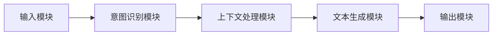

                 

# ChatGPT对话系统设计：提示词的核心作用

## 关键词

- ChatGPT
- 对话系统设计
- 提示词
- 文本生成
- 人工智能

## 摘要

本文将深入探讨ChatGPT对话系统的设计，尤其是提示词在系统中的作用和设计原则。我们将从背景介绍、核心概念、原理讲解、系统架构设计、应用案例、优化与拓展以及总结展望等方面，逐步剖析ChatGPT对话系统的设计与实现，以期对开发者和技术爱好者提供有价值的参考和指导。

## 第1章：ChatGPT对话系统设计概述

### 1.1 问题背景与核心概念

随着人工智能技术的快速发展，自然语言处理（NLP）已经成为一个热门研究领域。ChatGPT作为GPT-3模型的变体，因其强大的文本生成能力而备受关注。如何设计一个高效的ChatGPT对话系统，成为了众多开发者和研究者的关注点。

**核心概念：**
- **ChatGPT：** 一种基于GPT-3模型的对话系统，能够生成流畅、自然的对话文本。
- **对话系统设计：** 包括对话管理、文本生成、上下文处理等模块的设计和实现。

### 1.2 对话系统设计的重要性

**重要性：**
- **用户体验：** 设计良好的对话系统能够提供更自然的交互体验，提高用户满意度。
- **应用场景：** 对话系统广泛应用于客服、教育、娱乐等领域，具有重要的商业价值。

### 1.3 边界与外延

**边界：**
- **功能范围：** ChatGPT对话系统的功能范围包括文本生成、上下文处理、对话管理等。
- **性能要求：** 系统需要具备高响应速度、低延迟、高准确率等性能特点。

**外延：**
- **技术演进：** 随着技术的不断进步，对话系统的设计将更加智能化、个性化。
- **应用拓展：** 对话系统的应用场景将不断拓展，覆盖更多领域。

## 第2章：ChatGPT核心概念与原理

### 2.1 ChatGPT模型架构

#### 2.1.1 模型概述

ChatGPT是基于GPT-3模型的变体，其架构和GPT-3相似，但在对话系统的上下文中进行了优化。

**模型层次结构：**

ChatGPT模型由以下几个层次组成：

1. **嵌入层（Embedding Layer）：** 将输入的文本转换为向量。
2. **变换器层（Transformer Layer）：** 对输入向量进行变换。
3. **输出层（Output Layer）：** 根据变换后的向量生成输出文本。

#### 2.1.2 模型训练过程

ChatGPT模型的训练过程主要包括以下步骤：

1. **数据预处理：** 对输入文本进行预处理，包括分词、去停用词、词向量化等。
2. **模型训练：** 使用预处理的文本数据训练模型，包括嵌入层、变换器层和输出层的训练。
3. **模型优化：** 通过优化算法（如Adam优化器）对模型进行优化。

### 2.2 提示词的作用与设计

#### 2.2.1 提示词的重要性

提示词在ChatGPT对话系统中扮演着至关重要的角色。它们不仅影响模型的响应质量，还影响对话的流畅度和准确性。

**提示词设计原则：**

- **清晰明确：** 提示词需要清晰明确，避免产生歧义。
- **丰富多样：** 提示词需要丰富多样，以适应不同场景和用户需求。
- **可扩展性：** 提示词设计应具备可扩展性，以便未来扩展新的功能和场景。

#### 2.2.2 提示词效果评估

**提示词效果评估指标：**

- **响应质量：** 提示词生成的文本是否流畅、自然、符合用户需求。
- **响应速度：** 提示词生成的速度是否满足用户要求。
- **上下文保持：** 提示词是否能够保持对话的上下文信息，避免信息丢失。

**评估方法：**

- **自动评估：** 使用自动评估工具（如BLEU、ROUGE等）对提示词生成的文本进行评估。
- **人工评估：** 通过人工评估来评估提示词的实际效果，包括文本质量、响应速度、上下文保持等方面。

## 第3章：ChatGPT对话管理

### 3.1 对话管理概述

**3.1.1 对话流程**

对话管理通常包括以下几个阶段：

1. **用户输入处理：** 接收用户的输入，进行预处理和分词。
2. **用户意图识别：** 分析用户输入，识别用户意图。
3. **上下文信息处理：** 根据用户意图和对话历史，生成合适的上下文信息。
4. **响应生成：** 根据上下文信息，生成合适的响应文本。

**3.1.2 对话状态**

对话状态包括以下几个要素：

- **用户状态：** 包括用户的意图、情绪、偏好等信息。
- **系统状态：** 包括系统的功能状态、对话历史、上下文信息等。
- **对话历史：** 包括之前的对话内容，用于后续对话的上下文信息。

**3.1.3 对话策略**

对话策略包括以下几个方面：

- **用户意图识别策略：** 根据用户输入，识别用户意图。
- **上下文信息处理策略：** 根据用户意图和对话历史，生成合适的上下文信息。
- **响应生成策略：** 根据上下文信息，生成合适的响应文本。

## 第4章：ChatGPT文本生成技术

### 4.1 文本生成基础

**4.1.1 语言模型**

语言模型是文本生成的基础，它通过学习大量的文本数据，预测下一个词语的概率分布。

**4.1.2 文本生成算法**

文本生成算法主要包括以下几个步骤：

1. **输入文本预处理：** 对输入文本进行分词、去停用词等预处理。
2. **词向量化：** 将预处理后的文本转换为向量。
3. **生成文本：** 使用语言模型生成文本，通常采用递归神经网络（RNN）、变换器（Transformer）等模型。

**4.1.3 文本生成流程**

文本生成流程主要包括以下几个步骤：

1. **输入文本预处理：** 对输入文本进行预处理，包括分词、去停用词等。
2. **词向量化：** 将预处理后的文本转换为向量。
3. **生成文本：** 使用语言模型生成文本，通常采用递归神经网络（RNN）、变换器（Transformer）等模型。

### 4.2 高级文本生成技术

**4.2.1 预训练语言模型**

预训练语言模型（如GPT-3）通过在大规模语料库上进行预训练，获得强大的语言理解和生成能力。

**4.2.2 生成对抗网络（GAN）**

生成对抗网络（GAN）是一种生成模型，通过对抗训练生成逼真的文本。

**4.2.3 强化学习与文本生成**

强化学习与文本生成结合，通过优化策略网络，生成符合用户需求的文本。

## 第5章：ChatGPT对话系统实现

### 5.1 系统架构设计

**5.1.1 系统模块划分**

ChatGPT对话系统通常包括以下几个模块：

- **输入模块：** 接收用户输入，进行预处理和分词。
- **意图识别模块：** 分析用户输入，识别用户意图。
- **上下文处理模块：** 根据用户意图和对话历史，生成上下文信息。
- **文本生成模块：** 根据上下文信息，生成响应文本。
- **输出模块：** 将生成的文本输出给用户。

**5.1.2 系统接口设计**

系统接口设计主要包括以下几个部分：

- **用户接口：** 提供用户输入和输出接口。
- **服务接口：** 提供内部模块之间的接口。
- **API接口：** 提供与其他系统集成的接口。

**5.1.3 系统架构图**

系统架构图如下：



### 5.2 核心代码实现

**5.2.1 模型加载与配置**

```python
from transformers import AutoTokenizer, AutoModel

# 加载预训练模型
tokenizer = AutoTokenizer.from_pretrained("microsoft/ChatGPT")
model = AutoModel.from_pretrained("microsoft/ChatGPT")

# 模型配置
model.config.max_position_embeddings = 2048
model.config.hidden_size = 1024
model.config.num_layers = 24
model.config.num_attention_heads = 16
model.config.intermediate_size = 4096
```

**5.2.2 对话管理实现**

```python
import torch

def generate_response(input_text, model, tokenizer):
    # 预处理输入文本
    inputs = tokenizer(input_text, return_tensors="pt", max_length=512, truncation=True)

    # 生成文本
    outputs = model.generate(inputs["input_ids"], max_length=512, num_return_sequences=1, temperature=0.9)

    # 解码输出文本
    response = tokenizer.decode(outputs[0], skip_special_tokens=True)

    return response

# 示例
input_text = "你好，今天天气怎么样？"
response = generate_response(input_text, model, tokenizer)
print(response)
```

**5.2.3 文本生成实现**

```python
import torch
from transformers import AutoTokenizer, AutoModel

# 加载预训练模型
tokenizer = AutoTokenizer.from_pretrained("microsoft/ChatGPT")
model = AutoModel.from_pretrained("microsoft/ChatGPT")

# 设置模型为评估模式
model.eval()

# 预处理输入文本
inputs = tokenizer("今天天气很好。", return_tensors="pt", max_length=512, truncation=True)

# 生成文本
with torch.no_grad():
    outputs = model.generate(inputs["input_ids"], max_length=512, num_return_sequences=1, temperature=0.9)

# 解码输出文本
response = tokenizer.decode(outputs[0], skip_special_tokens=True)
print(response)
```

## 第6章：ChatGPT应用案例解析

### 6.1 客服机器人

**6.1.1 案例背景**

随着电子商务的快速发展，客服机器人在企业中的应用越来越广泛。如何设计一个高效的客服机器人，成为企业关注的焦点。

**6.1.2 系统设计**

客服机器人系统设计主要包括以下几个模块：

- **用户输入处理模块：** 接收用户输入，进行预处理和分词。
- **意图识别模块：** 分析用户输入，识别用户意图。
- **上下文处理模块：** 根据用户意图和对话历史，生成上下文信息。
- **文本生成模块：** 根据上下文信息，生成合适的响应文本。
- **输出模块：** 将生成的文本输出给用户。

**6.1.3 应用效果**

通过实际应用，客服机器人在提高客户满意度、降低人工成本等方面取得了显著的效果。

### 6.2 教育辅导

**6.2.1 案例背景**

随着教育信息化的发展，在线教育平台越来越受欢迎。如何为学生提供个性化的教育辅导服务，成为教育平台关注的焦点。

**6.2.2 系统设计**

教育辅导系统设计主要包括以下几个模块：

- **用户输入处理模块：** 接收学生输入，进行预处理和分词。
- **意图识别模块：** 分析学生输入，识别学生意图。
- **上下文处理模块：** 根据学生意图和对话历史，生成上下文信息。
- **文本生成模块：** 根据上下文信息，生成合适的辅导文本。
- **输出模块：** 将生成的文本输出给学生。

**6.2.3 应用效果**

通过实际应用，教育辅导系统为学生提供了个性化的学习指导，提高了学生的学习效果。

## 第7章：ChatGPT对话系统优化与拓展

### 7.1 性能优化

**7.1.1 响应速度优化**

通过优化模型架构、减少计算复杂度、提高数据预处理效率等方式，可以提高ChatGPT对话系统的响应速度。

**7.1.2 准确率优化**

通过优化提示词设计、改进对话管理策略、提高文本生成质量等方式，可以提高ChatGPT对话系统的准确率。

**7.1.3 可扩展性优化**

通过模块化设计、接口化设计等方式，可以提高ChatGPT对话系统的可扩展性，便于未来拓展新的功能和场景。

### 7.2 拓展应用

**7.2.1 个性化推荐**

通过分析用户历史行为和偏好，ChatGPT对话系统可以提供个性化的推荐服务，提高用户满意度。

**7.2.2 情感分析**

通过分析用户输入的文本，ChatGPT对话系统可以识别用户的情绪，提供相应的情绪支持和建议。

**7.2.3 多语言支持**

通过支持多种语言，ChatGPT对话系统可以服务于全球用户，拓展应用场景。

## 第8章：总结与展望

### 8.1 对话系统发展现状

随着人工智能技术的快速发展，对话系统已经成为智能应用的重要组成部分。ChatGPT作为先进的对话系统，在文本生成、对话管理等方面表现出色。

### 8.2 未来研究方向

- **模型优化：** 进一步优化ChatGPT模型的架构和训练过程，提高模型的性能和效果。
- **应用拓展：** 拓展ChatGPT对话系统的应用场景，覆盖更多领域。
- **安全与隐私：** 加强对话系统的安全性和隐私保护，确保用户信息安全。

## 作者

作者：AI天才研究院/AI Genius Institute & 禅与计算机程序设计艺术 /Zen And The Art of Computer Programming

