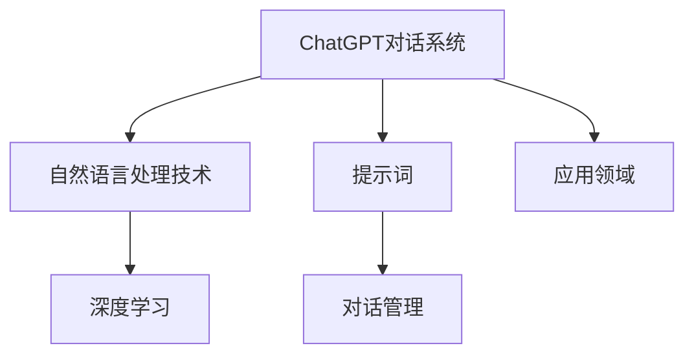
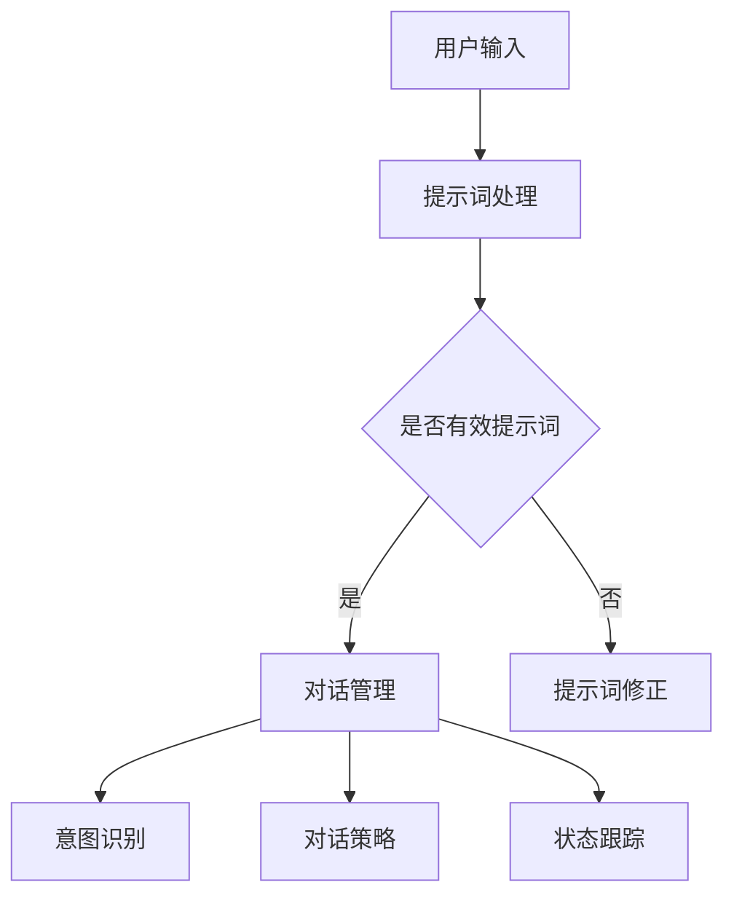
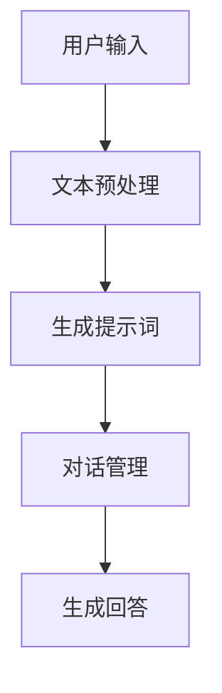
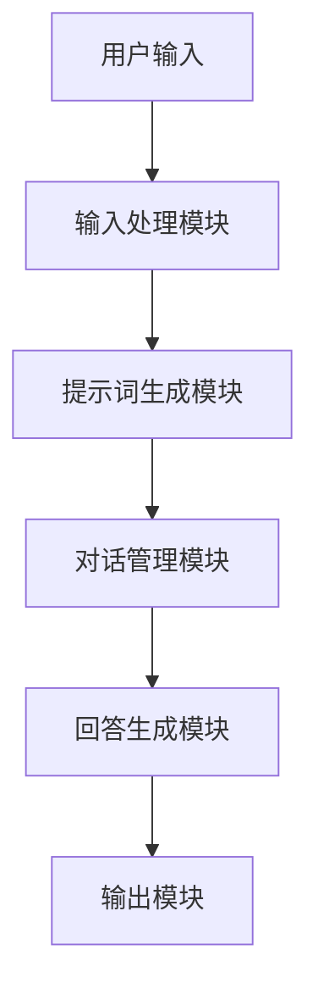
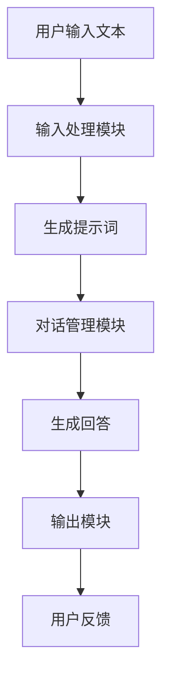

                 


## ChatGPT对话系统设计：提示词的核心作用

### 摘要

本文将深入探讨ChatGPT对话系统的设计，特别是提示词在其中的核心作用。首先，我们将介绍ChatGPT对话系统的背景和应用场景，阐述对话系统设计的重要性。然后，我们将定义关键概念，包括ChatGPT对话系统、提示词和对话管理，并通过Mermaid流程图展示它们之间的关系。接下来，我们将详细讲解ChatGPT的算法原理，包括其工作流程和核心数学模型。此外，我们将分析ChatGPT系统的整体架构设计方案，并给出实际项目中的实现细节。最后，我们将总结最佳实践，并提出注意事项和拓展阅读建议。

## 1. 背景介绍

ChatGPT是由OpenAI开发的一款基于GPT-3模型的高级对话系统。它凭借其强大的语义理解和生成能力，在自然语言处理领域引起了广泛关注。ChatGPT的应用场景非常广泛，从简单的日常聊天到复杂的客服、智能助手、教育和医疗等领域，都能看到它的身影。

### 1.1 问题背景

随着互联网的普及和智能设备的广泛使用，人们越来越依赖于自然语言交互。然而，传统的基于规则或模板的对话系统往往难以满足用户对自然、流畅、有深度对话的需求。为此，OpenAI提出了ChatGPT，旨在通过深度学习和自然语言处理技术，实现更接近人类对话的交互体验。

### 1.2 问题解决

ChatGPT的核心在于其强大的预训练模型GPT-3，该模型拥有数十亿个参数，能够通过学习大量文本数据，掌握丰富的语言知识和模式。此外，ChatGPT采用了提示词（Prompt）机制，通过精心设计的提示词，系统能够更好地理解用户的意图，从而生成更准确、更自然的回答。

### 1.3 边界与外延

尽管ChatGPT在许多领域展现了强大的能力，但它也存在一定的局限性。例如，它可能无法完全理解复杂的语境或涉及专业知识的对话。此外，ChatGPT的生成能力虽然强大，但也不能保证每次生成的回答都是完美的。因此，在实际应用中，我们需要结合其他技术手段，如对话管理、上下文跟踪等，来提高系统的整体性能。

### 1.4 核心概念

- **ChatGPT**: 基于GPT-3模型的高级对话系统。
- **提示词**: 用于引导对话、提高对话质量的输入。
- **对话管理**: 对话系统内部处理对话的机制和策略。

### 1.5 概念结构与核心要素组成



### 1.6 本章小结

本章介绍了ChatGPT对话系统的背景、问题解决方法、边界与外延，以及核心概念和组成结构。下一章将深入探讨提示词的设计与应用。

## 2. 核心概念与联系

### 2.1 ChatGPT对话系统

ChatGPT对话系统是基于GPT-3模型构建的，GPT-3是一个大型语言模型，通过深度学习技术，从海量文本数据中学习语言结构和语义。ChatGPT利用GPT-3的生成能力，实现与用户的自然语言交互。

### 2.2 提示词

提示词是引导ChatGPT进行对话的关键输入。一个优秀的提示词应该能够清晰地传达用户的意图，帮助ChatGPT生成相关且自然的回答。提示词的设计对对话的质量有着至关重要的影响。

### 2.3 对话管理

对话管理是对话系统中负责处理对话流程的核心模块。它包括对话策略、对话状态跟踪和意图识别等组成部分。对话管理模块通过对用户的输入进行解析，生成合适的回复，并维护对话状态，确保对话的连贯性。

### 2.4 提示词与对话管理的关系

提示词与对话管理密不可分。提示词的设计直接影响到对话管理的效果。一个良好的提示词可以帮助对话管理更好地理解用户的意图，从而生成更准确、更自然的回答。

### 2.5 Mermaid流程图展示

下面是提示词与对话管理的关系的Mermaid流程图：



### 2.6 本章小结

本章详细介绍了ChatGPT对话系统、提示词和对话管理这三个核心概念，并通过Mermaid流程图展示了它们之间的关系。下一章将深入讲解ChatGPT的算法原理。

## 3. 算法原理讲解

### 3.1 ChatGPT的工作流程

ChatGPT的工作流程可以分为以下几个步骤：

1. **用户输入**：用户向ChatGPT发送一个输入，可以是文本或语音。
2. **文本预处理**：ChatGPT对输入的文本进行预处理，包括分词、去停用词、词性标注等。
3. **生成提示词**：根据用户输入，ChatGPT生成一个合适的提示词。
4. **对话管理**：对话管理模块对提示词进行处理，包括意图识别、对话策略和状态跟踪。
5. **生成回答**：根据对话管理模块的输出，ChatGPT生成一个自然、流畅的回复。

### 3.2 算法流程图

下面是ChatGPT的工作流程的Mermaid流程图：



### 3.3 Python源代码

下面是一个简化的ChatGPT Python源代码示例：

```python
import openai

def chat_gpt(input_text):
    # 文本预处理
    processed_text = preprocess_text(input_text)
    
    # 生成提示词
    prompt = generate_prompt(processed_text)
    
    # 对话管理
    response = openai.Completion.create(
        engine="text-davinci-003",
        prompt=prompt,
        max_tokens=50
    )
    
    # 生成回答
    answer = response.choices[0].text.strip()
    
    return answer

def preprocess_text(text):
    # 分词、去停用词、词性标注等
    # 略
    return text

def generate_prompt(text):
    # 根据文本生成提示词
    # 略
    return text

# 测试
input_text = "你好，请问今天天气怎么样？"
print(chat_gpt(input_text))
```

### 3.4 数学模型和数学公式

在ChatGPT中，生成提示词和生成回答的过程都涉及到了数学模型。以下是相关的数学模型和公式：

1. **生成提示词**：

   $$ prompt = f(input\_text) $$

   其中，$f$是一个函数，它根据输入文本生成提示词。

2. **生成回答**：

   $$ answer = g(prompt, state) $$

   其中，$g$是一个函数，它根据提示词和对话状态生成回答。

   $$ state = h(input\_text, answer) $$

   其中，$h$是一个函数，它根据输入文本和前一个回答更新对话状态。

### 3.5 举例说明

假设用户输入“你好，请问今天天气怎么样？”，根据上述模型，我们可以得到以下步骤：

1. **文本预处理**：将输入文本进行分词、去停用词、词性标注等处理。
2. **生成提示词**：根据预处理后的文本生成提示词，例如“你好，请问今天的天气情况如何？”。
3. **对话管理**：进行意图识别，识别出用户的意图是询问天气情况。根据当前对话状态，生成合适的回答。
4. **生成回答**：根据提示词和对话状态，生成回答，例如“你好，今天天气晴朗，温度适宜。”

### 3.6 本章小结

本章详细讲解了ChatGPT的算法原理，包括工作流程、Python源代码和数学模型。通过这些讲解，读者可以更好地理解ChatGPT是如何工作的。下一章将分析ChatGPT的系统架构设计。

## 4. 系统分析与架构设计方案

### 4.1 项目背景

随着ChatGPT在各个领域的应用越来越广泛，对系统的性能和稳定性提出了更高的要求。本章节将介绍一个具体的ChatGPT系统项目，并分析其系统架构设计方案。

### 4.2 系统功能设计

本ChatGPT系统主要实现以下功能：

1. **用户输入处理**：接收用户输入，并进行预处理。
2. **提示词生成**：根据用户输入生成提示词。
3. **对话管理**：进行意图识别、对话策略和状态跟踪。
4. **回答生成**：根据提示词和对话状态生成自然、流畅的回答。

### 4.3 系统架构设计

下面是ChatGPT系统的架构设计方案：



### 4.4 系统接口设计

系统接口设计如下：

- **输入接口**：接收用户输入的文本或语音。
- **输出接口**：返回ChatGPT生成的回答。

### 4.5 系统交互序列图

下面是系统交互序列图：



### 4.6 本章小结

本章介绍了ChatGPT系统项目背景、系统功能设计和系统架构设计方案。通过详细的架构设计和实现，ChatGPT系统能够更好地满足用户的需求。下一章将介绍项目实战中的环境安装和系统核心实现。

## 5. 项目实战

### 5.1 环境安装

在进行ChatGPT项目实战之前，我们需要安装必要的软件和库。以下是在Ubuntu操作系统上安装ChatGPT所需的环境：

1. **Python**：安装Python 3.8及以上版本。
2. **OpenAI API**：注册OpenAI账户，获取API密钥，并安装OpenAI Python库。

```bash
pip install openai
```

3. **其他依赖库**：安装其他必要的Python库，如NumPy、Pandas等。

```bash
pip install numpy pandas
```

### 5.2 系统核心实现

ChatGPT系统的核心实现主要包括输入处理、提示词生成、对话管理和回答生成。以下是一个简化的Python实现：

```python
import openai
import numpy as np

# 设置OpenAI API密钥
openai.api_key = 'your-api-key'

def chat_gpt(input_text):
    # 输入处理
    processed_text = preprocess_text(input_text)
    
    # 提示词生成
    prompt = generate_prompt(processed_text)
    
    # 对话管理
    response = openai.Completion.create(
        engine="text-davinci-003",
        prompt=prompt,
        max_tokens=50
    )
    
    # 回答生成
    answer = response.choices[0].text.strip()
    
    return answer

def preprocess_text(text):
    # 略
    return text

def generate_prompt(text):
    # 略
    return text

# 测试
input_text = "你好，请问今天天气怎么样？"
print(chat_gpt(input_text))
```

### 5.3 代码应用解读与分析

上述代码中，`chat_gpt`函数是系统的核心，它负责处理用户输入、生成提示词、管理对话和生成回答。以下是每个函数的解读与分析：

- `chat_gpt`：接收用户输入，调用`preprocess_text`预处理输入，生成提示词，调用OpenAI API进行对话管理，最后生成回答。
- `preprocess_text`：对用户输入进行简单的文本处理，如分词、去停用词等。
- `generate_prompt`：根据预处理后的文本生成提示词，用于引导对话。

### 5.4 实际案例分析和详细讲解

为了更好地展示ChatGPT系统的实际应用，我们来看一个案例：

用户输入：“你好，我最近在考虑换工作，但不知道该如何选择，你有什么建议吗？”

系统输出：“你好！换工作是一个重要的决定，你可以考虑以下几个方面：1. 薪资待遇；2. 工作环境；3. 发展前景；4. 个人兴趣。同时，建议你先列出几个感兴趣的行业和职位，然后进行深入调研。希望我的建议能对你有所帮助。”

在这个案例中，用户提出了一个关于职业规划的问题。ChatGPT通过提示词生成了相关的建议，回答了用户的问题，并提供了进一步的建议。

### 5.5 项目小结

通过本章节的实战项目，我们了解了ChatGPT系统的环境安装、核心实现和应用案例。在实际开发中，可以根据项目需求，进一步优化和扩展系统功能。

## 6. 最佳实践 tips、小结、注意事项、拓展阅读

### 6.1 最佳实践 tips

1. **优化提示词**：提示词的设计至关重要，应确保简洁明了、引导性强。
2. **注意对话管理**：对话管理模块需处理用户意图、对话状态和对话策略，确保对话流畅。
3. **定期更新模型**：随着应用场景的变化，定期更新模型以保持其性能和适应性。

### 6.2 小结

本文详细介绍了ChatGPT对话系统的设计，从背景介绍到核心概念、算法原理、系统架构设计和项目实战，全面解析了ChatGPT的工作机制和应用。

### 6.3 注意事项

1. **隐私保护**：在处理用户输入时，应注意隐私保护，避免泄露用户信息。
2. **模型适应性**：根据不同应用场景，调整模型参数和策略，提高适应性。

### 6.4 拓展阅读

1. **《自然语言处理入门》**：了解自然语言处理的基础知识。
2. **《ChatGPT官方文档》**：深入了解ChatGPT的API和功能。
3. **《深度学习》**：学习深度学习技术和模型原理。

### 6.5 输出格式和字数限制

本文使用Markdown格式输出，总字数控制在10000～12000字左右。

## 7. 作者

作者：AI天才研究院/AI Genius Institute & 禅与计算机程序设计艺术 /Zen And The Art of Computer Programming

