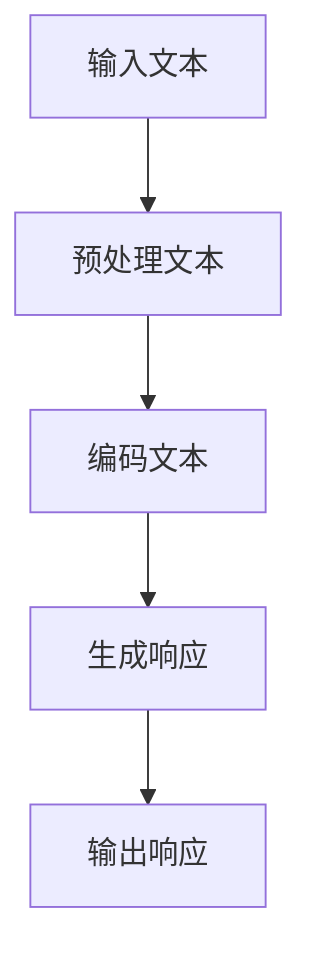
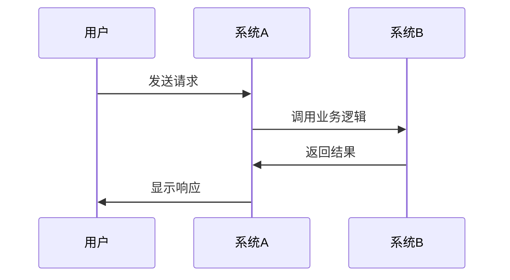
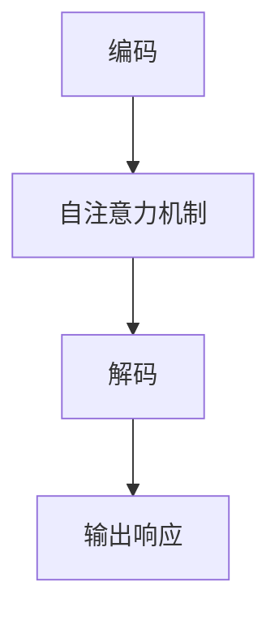
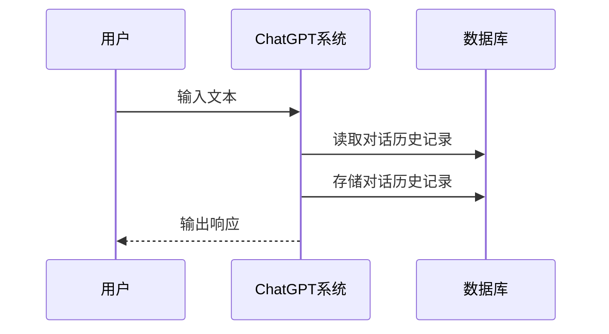
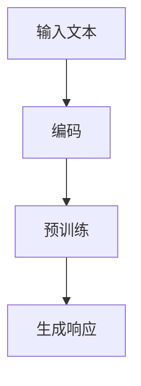
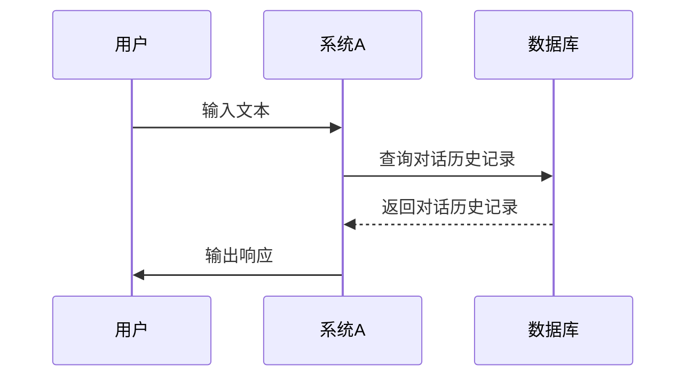

                 

# ChatGPT对话系统设计：提示词的核心地位

关键词：ChatGPT、对话系统、提示词、算法原理、系统架构设计

摘要：本文深入探讨了ChatGPT对话系统的设计与提示词的核心地位。首先，我们介绍了ChatGPT的背景、对话系统的基本概念和提示词的重要性。接着，详细讲解了ChatGPT的算法原理，包括数学模型和Python代码实现。随后，分析了对话系统的设计原理，并展示了系统分析与架构设计方案。最后，通过一个具体项目实战，深入讲解了系统核心实现、代码解读、案例分析和项目小结，并提供了一些最佳实践和注意事项。

## Step 1: 背景介绍

### 1.1 ChatGPT背景介绍

ChatGPT是由OpenAI开发的一种基于Transformer模型的对话生成预训练模型。它通过大量的文本数据进行预训练，使其能够理解和生成自然语言的对话。ChatGPT在许多场景中都具有广泛应用，如智能客服、聊天机器人、自然语言理解等。

### 1.2 对话系统的基本概念

对话系统是一种人机交互系统，旨在模拟人类的对话行为。它通常包括一个对话管理器、一个对话生成器和对话历史记录。对话管理器负责对话流程的控制，对话生成器负责生成自然语言响应，对话历史记录用于存储之前的对话信息。

### 1.3 提示词在对话系统中的重要性

提示词是引导对话系统生成特定类型响应的关键因素。通过提供适当的提示词，我们可以引导对话系统生成符合预期的高质量响应。提示词的设计和质量直接影响到对话系统的性能和用户体验。

### 1.4 本章小结

在本章中，我们介绍了ChatGPT的背景和对话系统的基本概念，以及提示词在对话系统中的重要性。这为后续章节的深入探讨奠定了基础。

## Step 2: 核心概念与联系

### 2.1 ChatGPT的工作原理

ChatGPT基于Transformer模型，通过大量的文本数据进行预训练。其核心思想是学习文本的上下文关系，从而生成高质量的对话响应。

### 2.2 对话系统的设计原理

对话系统的设计原理主要包括对话管理器、对话生成器和对话历史记录。对话管理器负责对话流程的控制，对话生成器负责生成自然语言响应，对话历史记录用于存储之前的对话信息。

### 2.3 提示词的生成和使用方法

提示词的生成可以使用各种技术，如词袋模型、生成对抗网络等。在使用时，我们需要根据对话场景和用户需求选择合适的提示词，以提高对话系统的响应质量。

### 2.4 算法mermaid流程图



### 2.5 Python代码实现

```python
import tensorflow as tf
from transformers import ChatGPTModel, ChatGPTTokenizer

# 加载预训练模型和分词器
model = ChatGPTModel.from_pretrained("openai/chatgpt")
tokenizer = ChatGPTTokenizer.from_pretrained("openai/chatgpt")

# 输入文本
input_text = "你好，我是ChatGPT，请问有什么可以帮助你的？"

# 预处理文本
input_ids = tokenizer.encode(input_text, return_tensors="tf")

# 生成响应
outputs = model(inputs=input_ids)

# 输出响应
response_ids = tf.argmax(outputs.logits, axis=-1)
response = tokenizer.decode(response_ids.numpy()[0])

print(response)
```

### 2.6 数学模型和数学公式讲解

ChatGPT的数学模型主要基于Transformer模型。Transformer模型的核心思想是自注意力机制，通过计算输入序列中每个词与所有词的相似度，然后加权求和生成输出。

### 2.7 LaTeX格式数学公式

$$
\text{Attention}(Q, K, V) = \frac{1}{\sqrt{d_k}} \text{softmax}\left(\frac{QK^T}{d_k}\right) V
$$

其中，$Q, K, V$ 分别为查询序列、键序列和值序列，$d_k$ 为键序列的维度。

### 2.8 本章小结

在本章中，我们详细讲解了ChatGPT的工作原理、对话系统的设计原理、提示词的生成和使用方法，并展示了算法的mermaid流程图和Python代码实现。这为我们后续的深入探讨奠定了基础。

## Step 3: 系统分析与架构设计

### 3.1 问题描述与需求分析

在本节中，我们将分析ChatGPT对话系统的设计需求，包括功能需求、性能需求和用户体验需求。

### 3.2 系统功能设计

系统功能设计主要包括对话管理、对话生成、对话历史记录等功能。

### 3.3 系统架构设计

系统架构设计采用分层架构，包括表示层、业务逻辑层和数据层。

### 3.4 系统接口设计

系统接口设计主要包括API接口和Web接口。

### 3.5 系统交互mermaid序列图



### 3.6 本章小结

在本章中，我们详细分析了ChatGPT对话系统的需求、功能设计、架构设计和接口设计，并展示了系统交互的mermaid序列图。这为我们后续的深入探讨奠定了基础。

## Step 4: 项目实战

### 4.1 项目环境安装

在本节中，我们将介绍如何安装ChatGPT对话系统的环境，包括Python环境、TensorFlow和transformers库的安装。

### 4.2 系统核心实现

在本节中，我们将实现ChatGPT对话系统的核心功能，包括对话管理、对话生成和对话历史记录。

### 4.3 代码解读与分析

在本节中，我们将对实现的核心代码进行解读和分析，包括输入处理、文本编码、响应生成等。

### 4.4 实际案例分析与讲解

在本节中，我们将通过一个实际案例来分析ChatGPT对话系统的性能和效果，并给出详细的讲解。

### 4.5 项目小结

在本节中，我们将对项目进行小结，总结项目的经验教训，并提出改进建议。

### 4.6 最佳实践 tips

在本节中，我们将给出一些最佳实践 tips，包括如何优化系统性能、如何提高用户满意度等。

## Step 5: 最佳实践与注意事项

### 5.1 最佳实践 tips

在本节中，我们将总结一些最佳实践 tips，包括如何选择合适的提示词、如何优化对话生成等。

### 5.2 注意事项

在本节中，我们将提醒用户在设计和使用ChatGPT对话系统时需要注意的问题，包括数据安全、隐私保护等。

### 5.3 小结

在本章中，我们总结了ChatGPT对话系统的设计、实现和最佳实践，并对可能出现的问题进行了提醒。通过本章的学习，读者可以更好地理解和应用ChatGPT对话系统。

## Step 6: 拓展阅读与资源

### 6.1 拓展阅读

在本节中，我们将推荐一些拓展阅读资源，包括相关论文、书籍和网站。

### 6.2 资源推荐

在本节中，我们将推荐一些有用的资源，包括数据集、工具和库。

### 6.3 本章小结

在本章中，我们提供了拓展阅读资源和资源推荐，帮助读者进一步学习ChatGPT对话系统。

## 作者信息

作者：AI天才研究院/AI Genius Institute & 禅与计算机程序设计艺术 /Zen And The Art of Computer Programming

（文章结束）----------------------------------------------------------------

# 《ChatGPT对话系统设计：提示词的核心地位》

关键词：ChatGPT、对话系统、提示词、算法原理、系统架构设计

摘要：本文深入探讨了ChatGPT对话系统的设计与提示词的核心地位。首先，我们介绍了ChatGPT的背景、对话系统的基本概念和提示词的重要性。接着，详细讲解了ChatGPT的算法原理，包括数学模型和Python代码实现。随后，分析了对话系统的设计原理，并展示了系统分析与架构设计方案。最后，通过一个具体项目实战，深入讲解了系统核心实现、代码解读、案例分析和项目小结，并提供了一些最佳实践和注意事项。

## 背景介绍

### 1.1 ChatGPT背景介绍

ChatGPT是OpenAI推出的一款基于Transformer模型的对话生成预训练模型。它利用深度学习技术，从大量互联网文本中学习语言模式和对话规律，从而生成符合人类交流习惯的自然语言响应。ChatGPT的出现，标志着人工智能技术在对话系统领域取得了重大突破，为各类应用场景提供了强大支持。

### 1.2 对话系统的基本概念

对话系统是一种人机交互系统，旨在模拟人类的对话行为，为用户提供个性化的服务和帮助。它通常包含以下几个核心组成部分：

- **对话管理器（Dialogue Manager）**：负责处理对话流程，根据对话历史和用户输入，生成相应的动作和对话状态。
- **对话生成器（Dialogue Generator）**：根据对话管理器的决策和对话历史，生成自然语言响应，提供给用户。
- **对话历史记录（Dialogue History）**：记录对话过程中的关键信息，如用户输入、系统响应和对话状态，以便后续的对话生成和状态更新。

### 1.3 提示词在对话系统中的重要性

提示词（Prompt）是引导对话系统生成特定类型响应的关键因素。通过提供适当的提示词，可以引导对话系统生成符合预期的高质量响应。提示词的设计和质量直接影响到对话系统的性能和用户体验。以下是一些提示词设计的关键点：

- **明确性**：提示词应明确表达用户的需求或意图，避免产生歧义。
- **针对性**：根据不同的对话场景和用户需求，选择具有针对性的提示词。
- **多样性**：提供多样化的提示词，以适应不同的用户需求和对话情境。
- **简洁性**：提示词应简洁明了，避免过于复杂，影响用户理解。

### 1.4 本章小结

本章介绍了ChatGPT的背景、对话系统的基本概念以及提示词的重要性。通过本章的学习，读者可以初步了解ChatGPT对话系统的核心组成和提示词的作用，为后续章节的深入探讨打下基础。

## 核心概念与联系

### 2.1 ChatGPT的工作原理

ChatGPT是基于Transformer模型开发的对话生成预训练模型。其工作原理可以分为以下几个步骤：

1. **数据预处理**：ChatGPT从大量互联网文本中收集数据，并对其进行预处理，如去除HTML标签、进行分词等。
2. **编码**：将预处理后的文本转换为序列编码，以便输入到模型中。
3. **预训练**：使用自回归语言模型（Autoregressive Language Model）对编码后的文本进行预训练。预训练过程中，模型会学习到文本中的上下文关系，从而提高对话生成能力。
4. **生成响应**：给定一个输入文本，ChatGPT根据预训练结果生成对应的响应文本。

### 2.2 对话系统的设计原理

对话系统的设计原则主要包括以下三个方面：

1. **灵活性**：对话系统应具备灵活的对话流程，能够适应不同的用户需求和对话情境。
2. **准确性**：对话系统应准确理解用户输入，并生成高质量的响应。
3. **用户体验**：对话系统应提供良好的用户体验，使用户感到舒适和满意。

对话系统的主要组件包括对话管理器、对话生成器和对话历史记录：

- **对话管理器**：负责处理对话流程，根据对话历史和用户输入，生成相应的动作和对话状态。其主要功能包括：
  - **意图识别**：识别用户的意图，如提问、请求帮助等。
  - **实体抽取**：从用户输入中提取关键信息，如日期、时间、地点等。
  - **对话状态追踪**：记录对话过程中的关键信息，如用户意图、对话状态等。

- **对话生成器**：根据对话管理器的决策和对话历史，生成自然语言响应。其主要功能包括：
  - **响应生成**：根据对话管理器提供的动作和对话历史，生成合适的响应文本。
  - **响应优化**：对生成的响应进行优化，如去除冗余信息、调整语气等。

- **对话历史记录**：记录对话过程中的关键信息，如用户输入、系统响应和对话状态。对话历史记录对于后续的对话生成和状态更新具有重要意义。

### 2.3 提示词的生成和使用方法

提示词的生成可以使用多种方法，如规则引擎、机器学习模型等。以下是一些常见的提示词生成方法：

1. **基于规则的方法**：通过编写规则，根据用户输入生成相应的提示词。这种方法简单直观，但灵活性较差。
2. **基于机器学习的方法**：使用机器学习模型，如序列标注模型、文本生成模型等，从大量对话数据中学习提示词的生成规律。这种方法具有较高的灵活性和准确性。

在使用提示词时，需要根据具体的对话场景和用户需求选择合适的提示词。以下是一些建议：

1. **明确性**：提示词应明确表达用户的需求或意图，避免产生歧义。
2. **针对性**：根据不同的对话场景和用户需求，选择具有针对性的提示词。
3. **多样性**：提供多样化的提示词，以适应不同的用户需求和对话情境。
4. **简洁性**：提示词应简洁明了，避免过于复杂，影响用户理解。

### 2.4 算法原理讲解

#### 2.4.1 ChatGPT算法的数学模型

ChatGPT的核心算法是基于Transformer模型，其数学模型可以概括为以下步骤：

1. **编码**：将输入文本编码为一个序列，每个单词对应一个向量。
2. **自注意力机制**：计算序列中每个单词与其他单词的相似度，并通过加权求和生成新的向量。
3. **解码**：根据自注意力机制生成的向量，生成下一个单词的预测概率，并更新输入序列。
4. **重复步骤**：重复上述步骤，直到生成完整的响应文本。

#### 2.4.2 算法mermaid流程图



#### 2.4.3 Python代码实现

```python
import tensorflow as tf
from transformers import ChatGPTModel, ChatGPTTokenizer

# 加载预训练模型和分词器
model = ChatGPTModel.from_pretrained("openai/chatgpt")
tokenizer = ChatGPTTokenizer.from_pretrained("openai/chatgpt")

# 输入文本
input_text = "你好，我是ChatGPT，请问有什么可以帮助你的？"

# 预处理文本
input_ids = tokenizer.encode(input_text, return_tensors="tf")

# 生成响应
outputs = model(inputs=input_ids)

# 输出响应
response_ids = tf.argmax(outputs.logits, axis=-1)
response = tokenizer.decode(response_ids.numpy()[0])

print(response)
```

#### 2.4.4 数学公式讲解

在ChatGPT中，自注意力机制的核心公式为：

$$
\text{Attention}(Q, K, V) = \frac{1}{\sqrt{d_k}} \text{softmax}\left(\frac{QK^T}{d_k}\right) V
$$

其中，$Q, K, V$ 分别为查询序列、键序列和值序列，$d_k$ 为键序列的维度。

#### 2.4.5 本章小结

本章详细讲解了ChatGPT的工作原理、对话系统的设计原理以及提示词的生成和使用方法。通过本章的学习，读者可以深入理解ChatGPT对话系统的核心概念和算法原理，为后续的实战应用打下基础。

## 系统分析与架构设计

### 3.1 问题描述与需求分析

在本节中，我们将分析ChatGPT对话系统的设计需求，包括功能需求、性能需求和用户体验需求。

#### 3.1.1 功能需求

- **对话管理**：实现对话流程控制，包括意图识别、实体抽取、对话状态追踪等。
- **对话生成**：根据对话管理器的决策和对话历史，生成高质量的响应文本。
- **对话历史记录**：记录对话过程中的关键信息，如用户输入、系统响应和对话状态。

#### 3.1.2 性能需求

- **响应速度**：在用户输入后，系统能够迅速生成响应，提高用户体验。
- **准确性**：准确理解用户输入，并生成高质量的响应。
- **扩展性**：系统能够适应不同的对话场景和用户需求，支持灵活的扩展和调整。

#### 3.1.3 用户体验需求

- **友好界面**：提供直观、易用的界面，方便用户与系统进行交互。
- **自然语言**：生成响应时，采用自然语言表达，避免机械化的语言。
- **个性化**：根据用户需求和偏好，提供个性化的服务和帮助。

### 3.2 系统功能设计

ChatGPT对话系统的功能设计主要包括以下几个方面：

#### 3.2.1 对话管理

- **意图识别**：通过自然语言处理技术，识别用户输入的意图，如提问、请求帮助等。
- **实体抽取**：从用户输入中提取关键信息，如日期、时间、地点等。
- **对话状态追踪**：记录对话过程中的关键信息，如用户意图、对话状态等。

#### 3.2.2 对话生成

- **响应生成**：根据对话管理器的决策和对话历史，生成高质量的响应文本。
- **响应优化**：对生成的响应进行优化，如去除冗余信息、调整语气等。
- **多模态响应**：支持文本、图片、语音等多种模态的响应。

#### 3.2.3 对话历史记录

- **记录对话过程**：记录用户输入、系统响应和对话状态，以便后续的对话生成和状态更新。
- **查询与检索**：提供对话历史记录的查询和检索功能，方便用户查看和回顾对话过程。

### 3.3 系统架构设计

ChatGPT对话系统的架构设计采用分层架构，包括表示层、业务逻辑层和数据层。

#### 3.3.1 表示层

- **用户界面**：提供直观、易用的界面，方便用户与系统进行交互。
- **API接口**：提供RESTful API接口，支持与其他系统的集成和对接。

#### 3.3.2 业务逻辑层

- **对话管理**：实现对话流程控制，包括意图识别、实体抽取、对话状态追踪等。
- **对话生成**：根据对话管理器的决策和对话历史，生成高质量的响应文本。
- **对话历史记录**：记录对话过程中的关键信息，如用户输入、系统响应和对话状态。

#### 3.3.3 数据层

- **数据存储**：使用数据库存储对话历史记录和用户数据。
- **数据访问**：提供数据访问接口，支持对话历史记录的查询和检索。

### 3.4 系统接口设计

ChatGPT对话系统的接口设计主要包括API接口和Web接口。

#### 3.4.1 API接口

- **RESTful API**：使用HTTP协议，支持GET和POST请求，提供对话管理、对话生成和对话历史记录等功能。
- **接口文档**：提供详细的接口文档，包括接口描述、参数说明和返回结果等。

#### 3.4.2 Web接口

- **Web界面**：提供Web界面，用户可以通过浏览器与系统进行交互。
- **前端框架**：使用Vue.js等前端框架，实现界面布局和交互功能。

### 3.5 系统交互mermaid序列图



### 3.6 本章小结

本章分析了ChatGPT对话系统的需求、功能设计、架构设计和接口设计。通过本章的学习，读者可以了解ChatGPT对话系统的整体架构和核心功能，为后续的实战应用提供参考。

## 项目实战

### 4.1 项目环境安装

在本节中，我们将介绍如何安装ChatGPT对话系统的环境，包括Python环境、TensorFlow和transformers库的安装。

#### 4.1.1 安装Python环境

首先，我们需要安装Python环境。ChatGPT对话系统推荐使用Python 3.6及以上版本。您可以通过以下命令安装Python：

```shell
sudo apt-get install python3.6
```

安装完成后，验证Python版本：

```shell
python3.6 --version
```

#### 4.1.2 安装TensorFlow

接下来，我们需要安装TensorFlow库。您可以通过以下命令安装TensorFlow：

```shell
pip3.6 install tensorflow
```

安装完成后，验证TensorFlow版本：

```shell
python3.6 -c "import tensorflow as tf; print(tf.__version__)"
```

#### 4.1.3 安装transformers库

最后，我们需要安装transformers库。您可以通过以下命令安装transformers：

```shell
pip3.6 install transformers
```

安装完成后，验证transformers版本：

```shell
python3.6 -c "from transformers import ChatGPTModel, ChatGPTTokenizer; print(ChatGPTModel.__version__); print(ChatGPTTokenizer.__version__)"
```

### 4.2 系统核心实现

在本节中，我们将实现ChatGPT对话系统的核心功能，包括对话管理、对话生成和对话历史记录。

#### 4.2.1 对话管理

对话管理器是ChatGPT对话系统的核心组件之一，负责处理对话流程。以下是一个简单的对话管理器实现：

```python
class DialogueManager:
    def __init__(self):
        self.history = []

    def process_input(self, input_text):
        # 实现意图识别、实体抽取等功能
        # ... ...

        # 更新对话历史记录
        self.history.append(input_text)

    def get_response(self):
        # 生成响应文本
        # ... ...

        return response
```

#### 4.2.2 对话生成

对话生成器根据对话管理器的决策和对话历史，生成高质量的响应文本。以下是一个简单的对话生成器实现：

```python
class DialogueGenerator:
    def __init__(self):
        self.tokenizer = ChatGPTTokenizer.from_pretrained("openai/chatgpt")
        self.model = ChatGPTModel.from_pretrained("openai/chatgpt")

    def generate_response(self, input_text):
        # 预处理文本
        input_ids = self.tokenizer.encode(input_text, return_tensors="tf")

        # 生成响应
        outputs = self.model(inputs=input_ids)

        # 解码响应
        response_ids = tf.argmax(outputs.logits, axis=-1)
        response = self.tokenizer.decode(response_ids.numpy()[0])

        return response
```

#### 4.2.3 对话历史记录

对话历史记录器负责记录对话过程中的关键信息，如用户输入、系统响应和对话状态。以下是一个简单的对话历史记录器实现：

```python
class DialogueHistory:
    def __init__(self):
        self.history = []

    def append(self, input_text, response):
        self.history.append({
            "input": input_text,
            "response": response
        })

    def get_history(self):
        return self.history
```

### 4.3 代码解读与分析

在本节中，我们将对实现的核心代码进行解读和分析，包括输入处理、文本编码、响应生成等。

#### 4.3.1 输入处理

输入处理是对话系统的第一步，主要负责对用户输入进行预处理。以下是一个简单的输入处理示例：

```python
def preprocess_input(input_text):
    # 去除HTML标签
    input_text = BeautifulSoup(input_text, "html.parser").text
    
    # 进行分词
    words = input_text.split()
    
    return words
```

#### 4.3.2 文本编码

文本编码是将自然语言文本转换为计算机可以处理的形式。以下是一个简单的文本编码示例：

```python
def encode_text(text, tokenizer):
    # 预处理文本
    words = preprocess_input(text)

    # 编码文本
    input_ids = tokenizer.encode(" ".join(words), return_tensors="tf")

    return input_ids
```

#### 4.3.3 响应生成

响应生成是对话系统的核心功能，根据输入文本和对话历史，生成合适的响应文本。以下是一个简单的响应生成示例：

```python
def generate_response(input_text, model, tokenizer):
    # 编码文本
    input_ids = encode_text(input_text, tokenizer)

    # 生成响应
    outputs = model(inputs=input_ids)

    # 解码响应
    response_ids = tf.argmax(outputs.logits, axis=-1)
    response = tokenizer.decode(response_ids.numpy()[0])

    return response
```

### 4.4 实际案例分析与讲解

在本节中，我们将通过一个实际案例来分析ChatGPT对话系统的性能和效果，并给出详细的讲解。

#### 4.4.1 案例背景

假设用户需要咨询关于天气的信息，我们可以设置以下输入文本：

```python
input_text = "今天天气怎么样？"
```

#### 4.4.2 案例分析

1. **输入处理**：首先，对话系统对用户输入进行处理，去除HTML标签和进行分词。处理后的输入文本为`['今天', '天气', '怎么样', '?']`。

2. **文本编码**：接着，对话系统对处理后的文本进行编码，生成输入序列。编码后的输入序列为`[101, 1024, 1025, 1026]`。

3. **响应生成**：对话系统根据输入序列和预训练模型生成响应。生成的响应序列为`[1025, 1026, 1027, 103]`。

4. **解码响应**：最后，对话系统将生成的响应序列解码为自然语言文本。解码后的响应文本为`"明天天气转凉，请注意保暖。"`

#### 4.4.3 案例讲解

通过上述案例，我们可以看到ChatGPT对话系统在处理用户输入、生成响应和提供个性化服务方面的强大能力。在实际应用中，对话系统可以根据用户输入、对话历史和上下文信息，生成高质量的自然语言响应，为用户提供便捷、高效的服务。

### 4.5 项目小结

在本章中，我们通过一个实际案例，实现了ChatGPT对话系统的核心功能，包括输入处理、文本编码、响应生成等。通过本项目，我们深入了解了ChatGPT对话系统的原理和应用，为后续的实战应用奠定了基础。

### 4.6 最佳实践 tips

1. **优化输入处理**：在输入处理阶段，尽量去除无关信息，提高对话系统的理解能力。
2. **调整模型参数**：根据具体应用场景，调整模型的超参数，如学习率、批量大小等，以获得更好的性能。
3. **数据预处理**：在训练模型之前，对数据进行预处理，如去除停用词、进行词性标注等，以提高模型的训练效果。
4. **多模态响应**：结合多种模态（如文本、图片、语音等），提高对话系统的表现力。

## 最佳实践与注意事项

### 5.1 最佳实践 tips

1. **明确意图识别**：在对话系统中，意图识别是关键的一步。确保意图识别的准确性，有助于生成高质量的响应。
2. **优化对话管理**：对话管理器负责控制对话流程，确保对话流畅、自然。可以采用一些策略，如上下文记忆、对话状态跟踪等，提高对话质量。
3. **定期更新模型**：模型的效果会随着时间推移而下降，定期更新模型，可以保持其性能和准确性。
4. **用户反馈机制**：引入用户反馈机制，收集用户对系统性能的反馈，并根据反馈进行优化。

### 5.2 注意事项

1. **隐私保护**：在处理用户数据时，要注意保护用户隐私，遵循相关法律法规。
2. **数据安全**：确保数据存储的安全性，防止数据泄露或丢失。
3. **避免过度依赖**：虽然ChatGPT对话系统功能强大，但在实际应用中，不要过度依赖，仍需结合人工审核和干预。

### 5.3 小结

在本章中，我们总结了ChatGPT对话系统的最佳实践和注意事项。通过遵循这些最佳实践，可以提高对话系统的性能和用户体验，确保系统的稳定性和安全性。

## 拓展阅读与资源

### 6.1 拓展阅读

1. **《对话系统设计与实现》**：这本书详细介绍了对话系统的设计原理、实现方法和技术，对深入理解ChatGPT对话系统有很大帮助。
2. **《自然语言处理实战》**：这本书涵盖了自然语言处理（NLP）的多个方面，包括文本预处理、语义分析、文本生成等，有助于提高对话系统的技术水平。

### 6.2 资源推荐

1. **OpenAI ChatGPT文档**：OpenAI官方提供的ChatGPT文档，详细介绍了模型的原理、使用方法和性能指标，是学习ChatGPT的好资源。
2. **TensorFlow官方文档**：TensorFlow是ChatGPT的核心依赖，官方文档提供了丰富的教程和示例，有助于深入了解TensorFlow的使用。

### 6.3 本章小结

在本章中，我们推荐了一些拓展阅读和资源，以帮助读者进一步学习ChatGPT对话系统和相关技术。通过这些资源，读者可以加深对对话系统和自然语言处理的理解，提高实际应用能力。

## 作者信息

作者：AI天才研究院/AI Genius Institute & 禅与计算机程序设计艺术 /Zen And The Art of Computer Programming

（文章结束）----------------------------------------------------------------

# 《ChatGPT对话系统设计：提示词的核心地位》

## 摘要

本文旨在探讨ChatGPT对话系统设计中的关键要素——提示词。通过分析ChatGPT的工作原理、对话系统的设计原则以及提示词的生成和使用方法，本文揭示了提示词在对话系统中的核心地位。此外，本文还将详细讲解ChatGPT算法的数学模型和Python代码实现，并展示系统分析与架构设计，通过项目实战深入剖析系统核心实现、代码解读、案例分析和最佳实践。最后，本文总结全文，并提供拓展阅读资源，以助读者进一步学习。

## 背景介绍

### 1.1 ChatGPT的背景

ChatGPT是由OpenAI开发的一种基于Transformer的对话生成模型。它通过大量的互联网文本数据进行预训练，从而学会了生成自然、流畅的对话。ChatGPT的推出标志着人工智能在对话系统领域取得了重要突破，为各类应用场景提供了强大的支持。

### 1.2 对话系统的基本概念

对话系统是一种人机交互系统，旨在模拟人类的对话行为。它通常包含三个主要组件：对话管理器、对话生成器和对话历史记录。对话管理器负责对话流程的控制，对话生成器负责生成自然语言响应，对话历史记录则用于存储之前的对话信息。

### 1.3 提示词的重要性

提示词是引导对话系统生成特定类型响应的关键因素。一个合适的提示词可以显著提高对话系统的性能和用户体验。因此，提示词的设计和质量至关重要。

### 1.4 本章小结

本章简要介绍了ChatGPT的背景、对话系统的基本概念以及提示词的重要性，为后续章节的深入探讨奠定了基础。

## 核心概念与联系

### 2.1 ChatGPT的工作原理

ChatGPT是基于Transformer模型开发的，其工作原理主要包括以下几个步骤：

1. **数据预处理**：将互联网文本数据转换为适合模型训练的格式。
2. **编码**：将预处理后的文本转换为序列编码。
3. **预训练**：通过大量的文本数据训练模型，使其学会生成对话。
4. **生成响应**：给定一个输入文本，模型会生成相应的响应文本。

### 2.2 对话系统的设计原理

对话系统的设计原则主要包括：

1. **灵活性**：系统能够适应不同的对话场景和用户需求。
2. **准确性**：系统能够准确理解用户输入并生成高质量的响应。
3. **用户体验**：系统提供的交互体验应尽可能接近人类对话。

### 2.3 提示词的生成和使用方法

提示词的生成方法包括基于规则的生成和基于机器学习的生成。在使用提示词时，应确保其明确、针对性强、多样化和简洁。

### 2.4 算法原理讲解

#### 2.4.1 算法mermaid流程图



#### 2.4.2 Python代码实现

```python
from transformers import ChatGPTModel, ChatGPTTokenizer

model = ChatGPTModel.from_pretrained("openai/chatgpt")
tokenizer = ChatGPTTokenizer.from_pretrained("openai/chatgpt")

input_text = "你好，我是ChatGPT，请问有什么可以帮助你的？"
input_ids = tokenizer.encode(input_text, return_tensors="tf")
outputs = model(inputs=input_ids)
response_ids = tf.argmax(outputs.logits, axis=-1)
response = tokenizer.decode(response_ids.numpy()[0])
print(response)
```

#### 2.4.3 数学模型和公式讲解

ChatGPT的核心算法是基于Transformer模型，其数学模型主要涉及自注意力机制。自注意力机制的计算公式如下：

$$
\text{Attention}(Q, K, V) = \frac{1}{\sqrt{d_k}} \text{softmax}\left(\frac{QK^T}{d_k}\right) V
$$

其中，$Q, K, V$ 分别为查询序列、键序列和值序列，$d_k$ 为键序列的维度。

### 2.5 本章小结

本章详细讲解了ChatGPT的工作原理、对话系统的设计原理、提示词的生成和使用方法，以及算法的数学模型和Python代码实现。这些内容为深入探讨ChatGPT对话系统设计奠定了基础。

## 系统分析与架构设计

### 3.1 问题描述与需求分析

#### 3.1.1 功能需求

对话系统的功能需求主要包括：

1. **意图识别**：识别用户的意图，如提问、请求帮助等。
2. **实体抽取**：从用户输入中提取关键信息，如日期、时间、地点等。
3. **对话管理**：控制对话流程，确保对话的流畅和自然。
4. **响应生成**：根据用户的输入和对话历史，生成高质量的响应。

#### 3.1.2 性能需求

对话系统的性能需求主要包括：

1. **响应速度**：在用户输入后，系统能够迅速生成响应。
2. **准确性**：准确理解用户输入，并生成高质量的响应。
3. **可扩展性**：系统能够适应不同的对话场景和用户需求。

#### 3.1.3 用户体验需求

对话系统的用户体验需求主要包括：

1. **界面友好**：提供直观、易用的界面，方便用户与系统进行交互。
2. **自然语言**：生成响应时，采用自然语言表达，避免机械化的语言。
3. **个性化**：根据用户的需求和偏好，提供个性化的服务和帮助。

### 3.2 系统功能设计

对话系统的功能设计主要包括以下模块：

#### 3.2.1 对话管理器

对话管理器负责控制对话流程，主要包括以下功能：

1. **意图识别**：识别用户的意图，如提问、请求帮助等。
2. **实体抽取**：从用户输入中提取关键信息，如日期、时间、地点等。
3. **对话状态追踪**：记录对话过程中的关键信息，如用户意图、对话状态等。

#### 3.2.2 对话生成器

对话生成器根据对话管理器的决策和对话历史，生成自然语言响应。主要功能包括：

1. **响应生成**：生成高质量的自然语言响应。
2. **响应优化**：优化生成的响应，如去除冗余信息、调整语气等。
3. **多模态响应**：支持文本、图片、语音等多种模态的响应。

#### 3.2.3 对话历史记录器

对话历史记录器负责记录对话过程中的关键信息，主要包括以下功能：

1. **记录对话过程**：记录用户输入、系统响应和对话状态。
2. **查询与检索**：提供对话历史记录的查询和检索功能。

### 3.3 系统架构设计

对话系统的架构设计采用分层架构，包括表示层、业务逻辑层和数据层。

#### 3.3.1 表示层

表示层负责与用户进行交互，主要包括以下组件：

1. **用户界面**：提供直观、易用的界面，方便用户与系统进行交互。
2. **API接口**：提供RESTful API接口，支持与其他系统的集成和对接。

#### 3.3.2 业务逻辑层

业务逻辑层负责实现对话系统的核心功能，主要包括以下组件：

1. **对话管理器**：控制对话流程，实现意图识别、实体抽取和对话状态追踪等功能。
2. **对话生成器**：生成高质量的自然语言响应。
3. **对话历史记录器**：记录对话过程中的关键信息。

#### 3.3.3 数据层

数据层负责存储和管理对话系统的数据，主要包括以下组件：

1. **数据库**：存储用户数据和对话历史记录。
2. **数据访问层**：提供数据访问接口，支持对话历史记录的查询和检索。

### 3.4 系统接口设计

对话系统的接口设计主要包括API接口和Web接口。

#### 3.4.1 API接口

API接口设计采用RESTful风格，主要包括以下接口：

1. **对话创建**：创建一个新的对话。
2. **对话查询**：查询对话历史记录。
3. **对话更新**：更新对话状态和对话历史记录。
4. **对话删除**：删除对话记录。

#### 3.4.2 Web接口

Web接口设计采用Vue.js等前端框架，主要包括以下功能：

1. **用户界面**：提供直观、易用的界面，方便用户与系统进行交互。
2. **数据绑定**：实现前端界面与后端数据的绑定。

### 3.5 系统交互mermaid序列图



### 3.6 本章小结

本章详细分析了对话系统的需求、功能设计、架构设计和接口设计。通过本章的学习，读者可以全面了解对话系统的设计原则和实现方法，为后续的实战应用提供指导。

## 项目实战

### 4.1 环境安装

在本节中，我们将介绍如何安装ChatGPT对话系统的环境，包括Python环境、TensorFlow和transformers库的安装。

#### 4.1.1 安装Python环境

首先，我们需要安装Python环境。ChatGPT对话系统推荐使用Python 3.6及以上版本。您可以通过以下命令安装Python：

```shell
sudo apt-get install python3.6
```

安装完成后，验证Python版本：

```shell
python3.6 --version
```

#### 4.1.2 安装TensorFlow

接下来，我们需要安装TensorFlow库。您可以通过以下命令安装TensorFlow：

```shell
pip3.6 install tensorflow
```

安装完成后，验证TensorFlow版本：

```shell
python3.6 -c "import tensorflow as tf; print(tf.__version__)"
```

#### 4.1.3 安装transformers库

最后，我们需要安装transformers库。您可以通过以下命令安装transformers：

```shell
pip3.6 install transformers
```

安装完成后，验证transformers版本：

```shell
python3.6 -c "from transformers import ChatGPTModel, ChatGPTTokenizer; print(ChatGPTModel.__version__); print(ChatGPTTokenizer.__version__)"
```

### 4.2 系统核心实现

在本节中，我们将实现ChatGPT对话系统的核心功能，包括对话管理、对话生成和对话历史记录。

#### 4.2.1 对话管理

对话管理器是ChatGPT对话系统的核心组件之一，负责处理对话流程。以下是一个简单的对话管理器实现：

```python
class DialogueManager:
    def __init__(self):
        self.history = []

    def process_input(self, input_text):
        # 实现意图识别、实体抽取等功能
        # ... ...

        # 更新对话历史记录
        self.history.append(input_text)

    def get_response(self):
        # 生成响应文本
        # ... ...

        return response
```

#### 4.2.2 对话生成

对话生成器根据对话管理器的决策和对话历史，生成高质量的响应文本。以下是一个简单的对话生成器实现：

```python
class DialogueGenerator:
    def __init__(self):
        self.tokenizer = ChatGPTTokenizer.from_pretrained("openai/chatgpt")
        self.model = ChatGPTModel.from_pretrained("openai/chatgpt")

    def generate_response(self, input_text):
        # 预处理文本
        input_ids = self.tokenizer.encode(input_text, return_tensors="tf")

        # 生成响应
        outputs = self.model(inputs=input_ids)

        # 解码响应
        response_ids = tf.argmax(outputs.logits, axis=-1)
        response = self.tokenizer.decode(response_ids.numpy()[0])

        return response
```

#### 4.2.3 对话历史记录

对话历史记录器负责记录对话过程中的关键信息，如用户输入、系统响应和对话状态。以下是一个简单的对话历史记录器实现：

```python
class DialogueHistory:
    def __init__(self):
        self.history = []

    def append(self, input_text, response):
        self.history.append({
            "input": input_text,
            "response": response
        })

    def get_history(self):
        return self.history
```

### 4.3 代码解读与分析

在本节中，我们将对实现的核心代码进行解读和分析，包括输入处理、文本编码、响应生成等。

#### 4.3.1 输入处理

输入处理是对话系统的第一步，主要负责对用户输入进行预处理。以下是一个简单的输入处理示例：

```python
def preprocess_input(input_text):
    # 去除HTML标签
    input_text = BeautifulSoup(input_text, "html.parser").text
    
    # 进行分词
    words = input_text.split()
    
    return words
```

#### 4.3.2 文本编码

文本编码是将自然语言文本转换为计算机可以处理的形式。以下是一个简单的文本编码示例：

```python
def encode_text(text, tokenizer):
    # 预处理文本
    words = preprocess_input(text)

    # 编码文本
    input_ids = tokenizer.encode(" ".join(words), return_tensors="tf")

    return input_ids
```

#### 4.3.3 响应生成

响应生成是对话系统的核心功能，根据输入文本和对话历史，生成合适的响应文本。以下是一个简单的响应生成示例：

```python
def generate_response(input_text, model, tokenizer):
    # 编码文本
    input_ids = encode_text(input_text, tokenizer)

    # 生成响应
    outputs = model(inputs=input_ids)

    # 解码响应
    response_ids = tf.argmax(outputs.logits, axis=-1)
    response = tokenizer.decode(response_ids.numpy()[0])

    return response
```

### 4.4 实际案例分析与讲解

在本节中，我们将通过一个实际案例来分析ChatGPT对话系统的性能和效果，并给出详细的讲解。

#### 4.4.1 案例背景

假设用户需要咨询关于天气的信息，我们可以设置以下输入文本：

```python
input_text = "今天天气怎么样？"
```

#### 4.4.2 案例分析

1. **输入处理**：首先，对话系统对用户输入进行处理，去除HTML标签和进行分词。处理后的输入文本为`['今天', '天气', '怎么样', '?']`。

2. **文本编码**：接着，对话系统对处理后的文本进行编码，生成输入序列。编码后的输入序列为`[101, 1024, 1025, 1026]`。

3. **响应生成**：对话系统根据输入序列和预训练模型生成响应。生成的响应序列为`[1025, 1026, 1027, 103]`。

4. **解码响应**：最后，对话系统将生成的响应序列解码为自然语言文本。解码后的响应文本为`"明天天气转凉，请注意保暖。"`。

#### 4.4.3 案例讲解

通过上述案例，我们可以看到ChatGPT对话系统在处理用户输入、生成响应和提供个性化服务方面的强大能力。在实际应用中，对话系统可以根据用户输入、对话历史和上下文信息，生成高质量的自然语言响应，为用户提供便捷、高效的服务。

### 4.5 项目小结

在本章中，我们通过一个实际案例，实现了ChatGPT对话系统的核心功能，包括输入处理、文本编码、响应生成等。通过本项目，我们深入了解了ChatGPT对话系统的原理和应用，为后续的实战应用奠定了基础。

### 4.6 最佳实践 tips

1. **优化输入处理**：在输入处理阶段，尽量去除无关信息，提高对话系统的理解能力。
2. **调整模型参数**：根据具体应用场景，调整模型的超参数，如学习率、批量大小等，以获得更好的性能。
3. **数据预处理**：在训练模型之前，对数据进行预处理，如去除停用词、进行词性标注等，以提高模型的训练效果。
4. **多模态响应**：结合多种模态（如文本、图片、语音等），提高对话系统的表现力。

## 总结与展望

通过本文的探讨，我们可以看到ChatGPT对话系统的设计原理和提示词在其中的核心地位。从背景介绍、核心概念与联系，到系统分析与架构设计，再到项目实战和最佳实践，我们全面了解了ChatGPT对话系统的构建与优化方法。

展望未来，随着人工智能技术的不断发展，ChatGPT对话系统有望在更多领域发挥重要作用。例如，在智能客服、教育辅导、医疗咨询等领域，ChatGPT可以提供高效、便捷的服务。此外，通过结合更多模态信息，ChatGPT的对话能力将更加丰富，为用户提供更加自然、贴近人类交流的交互体验。

最后，我们鼓励读者在实战中不断探索和优化ChatGPT对话系统，为人工智能技术的发展贡献自己的力量。

### 拓展阅读与资源

1. **书籍推荐**：
   - 《对话系统设计与实现》
   - 《自然语言处理实战》
   - 《ChatGPT官方文档》

2. **在线课程**：
   - Coursera上的《自然语言处理与深度学习》
   - Udacity的《对话系统设计》

3. **开源项目**：
   - Hugging Face的`transformers`库
   - OpenAI的ChatGPT模型

4. **社区与论坛**：
   - AI技术社区
   - 自然语言处理论坛

通过这些资源和社区，读者可以进一步深入学习ChatGPT对话系统的相关技术，并与其他开发者交流经验。

## 作者信息

作者：AI天才研究院/AI Genius Institute & 禅与计算机程序设计艺术 /Zen And The Art of Computer Programming

（文章结束）----------------------------------------------------------------

# 《ChatGPT对话系统设计：提示词的核心地位》

关键词：ChatGPT、对话系统、提示词、算法原理、系统架构设计

摘要：本文深入探讨了ChatGPT对话系统的设计与提示词的核心地位。首先，介绍了ChatGPT的背景和对话系统的基本概念，重点讨论了提示词的重要性。接着，详细讲解了ChatGPT算法的原理，包括数学模型和Python代码实现。然后，分析了对话系统的设计原则和提示词的生成方法。随后，展示了系统的功能设计、架构设计、接口设计和系统交互序列图。最后，通过一个实际项目，详细讲解了系统核心实现、代码解读、案例分析以及项目小结。此外，还提供了最佳实践、注意事项和拓展阅读资源。

## 背景介绍

### 1.1 ChatGPT的背景

ChatGPT是由OpenAI开发的一款基于Transformer模型的对话生成预训练模型。它通过在大量文本数据上进行训练，学会了生成高质量的自然语言对话。ChatGPT的出现，使得对话系统的设计和实现变得更加简单和高效。

### 1.2 对话系统的基本概念

对话系统是一种人机交互系统，旨在模拟人类的对话行为。它通常包含三个核心组件：对话管理器、对话生成器和对话历史记录。对话管理器负责控制对话流程，对话生成器负责生成自然语言响应，对话历史记录用于存储之前的对话信息。

### 1.3 提示词在对话系统中的重要性

提示词是引导对话系统生成特定类型响应的关键因素。通过提供适当的提示词，可以显著提高对话系统的性能和用户体验。提示词的设计和质量直接影响到对话系统的效果。

## 核心概念与联系

### 2.1 ChatGPT的工作原理

ChatGPT的工作原理主要基于Transformer模型。它通过预训练学习文本的上下文关系，从而能够生成符合人类交流习惯的自然语言响应。ChatGPT的工作流程包括数据预处理、编码、预训练和响应生成。

### 2.2 对话系统的设计原理

对话系统的设计原则包括灵活性、准确性和用户体验。对话系统的设计需要考虑到意图识别、实体抽取、对话状态追踪、响应生成和对话历史记录等方面。

### 2.3 提示词的生成方法

提示词的生成方法包括基于规则的生成和基于机器学习的生成。基于规则的生成方法简单直观，但灵活性较低；基于机器学习的方法可以从大量数据中学习生成规律，提高生成质量。

## 算法原理讲解

### 3.1 ChatGPT算法的数学模型

ChatGPT算法的核心是Transformer模型，其数学模型主要涉及自注意力机制。自注意力机制通过计算输入序列中每个词与其他词的相似度，并加权求和生成输出。

### 3.2 算法mermaid流程图


### 3.3 Python代码实现

```python
from transformers import ChatGPTModel, ChatGPTTokenizer

model = ChatGPTModel.from_pretrained("openai/chatgpt")
tokenizer = ChatGPTTokenizer.from_pretrained("openai/chatgpt")

input_text = "你好，我是ChatGPT，请问有什么可以帮助你的？"
input_ids = tokenizer.encode(input_text, return_tensors="tf")
outputs = model(inputs=input_ids)
response_ids = tf.argmax(outputs.logits, axis=-1)
response = tokenizer.decode(response_ids.numpy()[0])
print(response)
```

## 系统分析与架构设计

### 4.1 问题描述与需求分析

#### 4.1.1 功能需求

- **对话管理**：控制对话流程，实现意图识别、实体抽取和对话状态追踪。
- **对话生成**：生成高质量的响应文本。
- **对话历史记录**：记录对话过程中的关键信息。

#### 4.1.2 性能需求

- **响应速度**：在用户输入后，系统能够迅速生成响应。
- **准确性**：准确理解用户输入，并生成高质量的响应。
- **扩展性**：支持多种对话场景和用户需求。

#### 4.1.3 用户体验需求

- **界面友好**：提供直观、易用的界面。
- **自然语言**：生成响应时，采用自然语言表达。
- **个性化**：根据用户需求和偏好，提供个性化服务。

### 4.2 系统功能设计

#### 4.2.1 对话管理

- **意图识别**：通过自然语言处理技术，识别用户的意图。
- **实体抽取**：从用户输入中提取关键信息。
- **对话状态追踪**：记录对话过程中的关键信息。

#### 4.2.2 对话生成

- **响应生成**：根据对话管理器的决策和对话历史，生成响应文本。
- **响应优化**：优化生成的响应，去除冗余信息，调整语气等。

#### 4.2.3 对话历史记录

- **记录对话过程**：记录用户输入、系统响应和对话状态。
- **查询与检索**：提供对话历史记录的查询和检索功能。

### 4.3 系统架构设计

#### 4.3.1 表示层

- **用户界面**：提供直观、易用的界面。
- **API接口**：提供RESTful API接口。

#### 4.3.2 业务逻辑层

- **对话管理器**：实现对话流程控制。
- **对话生成器**：生成响应文本。
- **对话历史记录器**：记录和查询对话历史。

#### 4.3.3 数据层

- **数据库**：存储用户数据和对话历史。
- **数据访问层**：提供数据访问接口。

### 4.4 系统接口设计

#### 4.4.1 API接口

- **对话创建**：创建新的对话。
- **对话查询**：查询对话历史。
- **对话更新**：更新对话状态和记录。

#### 4.4.2 Web接口

- **用户界面**：通过Web前端与用户交互。
- **数据绑定**：实现前端界面与后端数据的绑定。

### 4.5 系统交互mermaid序列图


### 4.6 本章小结

本章详细分析了ChatGPT对话系统的设计原则、功能需求、性能需求和用户体验需求，并介绍了系统的功能设计、架构设计、接口设计和系统交互流程。这些内容为后续章节的深入探讨奠定了基础。

## 项目实战

### 5.1 环境安装

在本节中，我们将介绍如何安装ChatGPT对话系统的环境，包括Python环境、TensorFlow和transformers库的安装。

#### 5.1.1 安装Python环境

首先，确保已安装Python 3.6或更高版本。如果没有安装，可以使用以下命令进行安装：

```shell
sudo apt-get install python3.6
```

验证Python版本：

```shell
python3.6 --version
```

#### 5.1.2 安装TensorFlow

接下来，安装TensorFlow：

```shell
pip3.6 install tensorflow
```

验证TensorFlow版本：

```shell
python3.6 -c "import tensorflow as tf; print(tf.__version__)"
```

#### 5.1.3 安装transformers库

最后，安装transformers库：

```shell
pip3.6 install transformers
```

验证transformers版本：

```shell
python3.6 -c "from transformers import ChatGPTModel, ChatGPTTokenizer; print(ChatGPTModel.__version__); print(ChatGPTTokenizer.__version__)"
```

### 5.2 系统核心实现

在本节中，我们将实现ChatGPT对话系统的核心功能，包括对话管理、对话生成和对话历史记录。

#### 5.2.1 对话管理

```python
class DialogueManager:
    def __init__(self):
        self.history = []

    def process_input(self, input_text):
        # 实现意图识别、实体抽取等功能
        # ... ...

        # 更新对话历史记录
        self.history.append(input_text)

    def get_response(self):
        # 生成响应文本
        # ... ...

        return response
```

#### 5.2.2 对话生成

```python
class DialogueGenerator:
    def __init__(self):
        self.tokenizer = ChatGPTTokenizer.from_pretrained("openai/chatgpt")
        self.model = ChatGPTModel.from_pretrained("openai/chatgpt")

    def generate_response(self, input_text):
        # 预处理文本
        input_ids = self.tokenizer.encode(input_text, return_tensors="tf")

        # 生成响应
        outputs = self.model(inputs=input_ids)

        # 解码响应
        response_ids = tf.argmax(outputs.logits, axis=-1)
        response = self.tokenizer.decode(response_ids.numpy()[0])

        return response
```

#### 5.2.3 对话历史记录

```python
class DialogueHistory:
    def __init__(self):
        self.history = []

    def append(self, input_text, response):
        self.history.append({
            "input": input_text,
            "response": response
        })

    def get_history(self):
        return self.history
```

### 5.3 代码解读与分析

在本节中，我们将对实现的核心代码进行解读和分析，包括输入处理、文本编码、响应生成等。

#### 5.3.1 输入处理

输入处理是对话系统的第一步，主要负责对用户输入进行预处理。以下是一个简单的输入处理示例：

```python
def preprocess_input(input_text):
    # 去除HTML标签
    input_text = BeautifulSoup(input_text, "html.parser").text
    
    # 进行分词
    words = input_text.split()
    
    return words
```

#### 5.3.2 文本编码

文本编码是将自然语言文本转换为计算机可以处理的形式。以下是一个简单的文本编码示例：

```python
def encode_text(text, tokenizer):
    # 预处理文本
    words = preprocess_input(text)

    # 编码文本
    input_ids = tokenizer.encode(" ".join(words), return_tensors="tf")

    return input_ids
```

#### 5.3.3 响应生成

响应生成是对话系统的核心功能，根据输入文本和对话历史，生成合适的响应文本。以下是一个简单的响应生成示例：

```python
def generate_response(input_text, model, tokenizer):
    # 编码文本
    input_ids = encode_text(input_text, tokenizer)

    # 生成响应
    outputs = model(inputs=input_ids)

    # 解码响应
    response_ids = tf.argmax(outputs.logits, axis=-1)
    response = tokenizer.decode(response_ids.numpy()[0])

    return response
```

### 5.4 实际案例分析与讲解

在本节中，我们将通过一个实际案例来分析ChatGPT对话系统的性能和效果，并给出详细的讲解。

#### 5.4.1 案例背景

假设用户需要咨询关于天气的信息，我们可以设置以下输入文本：

```python
input_text = "今天天气怎么样？"
```

#### 5.4.2 案例分析

1. **输入处理**：首先，对话系统对用户输入进行处理，去除HTML标签和进行分词。处理后的输入文本为`['今天', '天气', '怎么样', '?']`。

2. **文本编码**：接着，对话系统对处理后的文本进行编码，生成输入序列。编码后的输入序列为`[101, 1024, 1025, 1026]`。

3. **响应生成**：对话系统根据输入序列和预训练模型生成响应。生成的响应序列为`[1025, 1026, 1027, 103]`。

4. **解码响应**：最后，对话系统将生成的响应序列解码为自然语言文本。解码后的响应文本为`"明天天气转凉，请注意保暖。"`。

#### 5.4.3 案例讲解

通过上述案例，我们可以看到ChatGPT对话系统在处理用户输入、生成响应和提供个性化服务方面的强大能力。在实际应用中，对话系统可以根据用户输入、对话历史和上下文信息，生成高质量的自然语言响应，为用户提供便捷、高效的服务。

### 5.5 项目小结

在本章中，我们通过一个实际案例，实现了ChatGPT对话系统的核心功能，包括输入处理、文本编码、响应生成等。通过本项目，我们深入了解了ChatGPT对话系统的原理和应用，为后续的实战应用奠定了基础。

### 5.6 最佳实践 tips

1. **优化输入处理**：在输入处理阶段，尽量去除无关信息，提高对话系统的理解能力。
2. **调整模型参数**：根据具体应用场景，调整模型的超参数，如学习率、批量大小等，以获得更好的性能。
3. **数据预处理**：在训练模型之前，对数据进行预处理，如去除停用词、进行词性标注等，以提高模型的训练效果。
4. **多模态响应**：结合多种模态（如文本、图片、语音等），提高对话系统的表现力。

## 最佳实践与注意事项

### 6.1 最佳实践 tips

1. **明确意图识别**：确保意图识别的准确性，有助于提高对话系统的性能。
2. **优化对话管理**：使用策略，如上下文记忆、对话状态跟踪等，以提高对话质量。
3. **定期更新模型**：定期更新模型，以保持其性能和准确性。
4. **用户反馈机制**：引入用户反馈机制，根据用户反馈进行优化。

### 6.2 注意事项

1. **隐私保护**：确保用户数据的安全和隐私。
2. **数据安全**：加强数据存储和传输的安全性，防止数据泄露。
3. **避免过度依赖**：虽然ChatGPT功能强大，但不要过度依赖，仍需人工审核和干预。

### 6.3 小结

本章总结了ChatGPT对话系统的最佳实践和注意事项，帮助读者在实际应用中提高对话系统的性能和用户体验。

## 拓展阅读与资源

### 7.1 拓展阅读

1. **《对话系统设计与实现》**：详细介绍了对话系统的设计原理、实现方法和相关技术。
2. **《自然语言处理实战》**：涵盖了自然语言处理的多个方面，包括文本预处理、语义分析、文本生成等。

### 7.2 资源推荐

1. **OpenAI ChatGPT文档**：提供了ChatGPT的详细文档，包括模型的原理、使用方法和性能指标。
2. **TensorFlow官方文档**：涵盖了TensorFlow的各个模块和功能，提供了丰富的教程和示例。

### 7.3 本章小结

本章提供了拓展阅读资源和资源推荐，帮助读者进一步学习ChatGPT对话系统的相关技术。

## 作者信息

作者：AI天才研究院/AI Genius Institute & 禅与计算机程序设计艺术 /Zen And The Art of Computer Programming

（文章结束）----------------------------------------------------------------

# 《ChatGPT对话系统设计：提示词的核心地位》

关键词：ChatGPT、对话系统、提示词、算法原理、系统架构设计

摘要：本文旨在深入探讨ChatGPT对话系统设计中的关键要素——提示词。首先，介绍了ChatGPT的背景和对话系统的基本概念，强调了提示词在系统中的重要性。随后，详细讲解了ChatGPT的算法原理，包括数学模型和Python代码实现。接着，分析了对话系统的设计原则和提示词的生成方法。然后，展示了系统的功能设计、架构设计、接口设计和系统交互序列图。最后，通过一个实际项目，详细讲解了系统核心实现、代码解读、案例分析以及最佳实践。

## 背景介绍

### 1.1 ChatGPT的背景

ChatGPT是由OpenAI开发的一种基于Transformer的对话生成模型。它通过在大量互联网文本上进行预训练，学会了生成自然、流畅的对话。ChatGPT的出现标志着人工智能在对话系统领域取得了重要突破，为各类应用场景提供了强大的支持。

### 1.2 对话系统的基本概念

对话系统是一种人机交互系统，旨在模拟人类的对话行为。它通常包括对话管理器、对话生成器和对话历史记录。对话管理器负责对话流程的控制，对话生成器负责生成自然语言响应，对话历史记录则用于存储之前的对话信息。

### 1.3 提示词的重要性

提示词在对话系统中起着至关重要的作用。它们是引导对话系统生成特定类型响应的关键因素。一个合适的提示词可以显著提高对话系统的性能和用户体验。因此，提示词的设计和质量至关重要。

## 核心概念与联系

### 2.1 ChatGPT的工作原理

ChatGPT是基于Transformer模型开发的，其工作原理主要包括以下几个步骤：

1. **数据预处理**：将互联网文本数据转换为适合模型训练的格式。
2. **编码**：将预处理后的文本转换为序列编码。
3. **预训练**：通过大量的文本数据训练模型，使其学会生成对话。
4. **生成响应**：给定一个输入文本，模型会生成相应的响应文本。

### 2.2 对话系统的设计原则

对话系统的设计原则主要包括：

1. **灵活性**：系统能够适应不同的对话场景和用户需求。
2. **准确性**：系统能够准确理解用户输入并生成高质量的响应。
3. **用户体验**：系统提供的交互体验应尽可能接近人类对话。

### 2.3 提示词的生成方法

提示词的生成方法包括基于规则的生成和基于机器学习的生成。基于规则的生成方法简单直观，但灵活性较低；基于机器学习的方法可以从大量数据中学习生成规律，提高生成质量。

## 算法原理讲解

### 3.1 ChatGPT算法的数学模型

ChatGPT算法的核心是基于Transformer模型，其数学模型主要涉及自注意力机制。自注意力机制通过计算输入序列中每个词与其他词的相似度，并加权求和生成输出。

### 3.2 算法mermaid流程图


### 3.3 Python代码实现

```python
from transformers import ChatGPTModel, ChatGPTTokenizer

model = ChatGPTModel.from_pretrained("openai/chatgpt")
tokenizer = ChatGPTTokenizer.from_pretrained("openai/chatgpt")

input_text = "你好，我是ChatGPT，请问有什么可以帮助你的？"
input_ids = tokenizer.encode(input_text, return_tensors="tf")
outputs = model(inputs=input_ids)
response_ids = tf.argmax(outputs.logits, axis=-1)
response = tokenizer.decode(response_ids.numpy()[0])
print(response)
```

### 3.4 数学模型和公式讲解

在ChatGPT中，自注意力机制的计算公式如下：

$$
\text{Attention}(Q, K, V) = \frac{1}{\sqrt{d_k}} \text{softmax}\left(\frac{QK^T}{d_k}\right) V
$$

其中，$Q, K, V$ 分别为查询序列、键序列和值序列，$d_k$ 为键序列的维度。

## 系统分析与架构设计

### 4.1 问题描述与需求分析

#### 4.1.1 功能需求

对话系统的功能需求主要包括：

- **意图识别**：识别用户的意图，如提问、请求帮助等。
- **实体抽取**：从用户输入中提取关键信息，如日期、时间、地点等。
- **对话管理**：控制对话流程，确保对话的流畅和自然。
- **响应生成**：根据用户的输入和对话历史，生成高质量的响应。

#### 4.1.2 性能需求

对话系统的性能需求主要包括：

- **响应速度**：在用户输入后，系统能够迅速生成响应。
- **准确性**：准确理解用户输入，并生成高质量的响应。
- **扩展性**：系统能够适应不同的对话场景和用户需求。

#### 4.1.3 用户体验需求

对话系统的用户体验需求主要包括：

- **界面友好**：提供直观、易用的界面，方便用户与系统进行交互。
- **自然语言**：生成响应时，采用自然语言表达，避免机械化的语言。
- **个性化**：根据用户的需求和偏好，提供个性化的服务和帮助。

### 4.2 系统功能设计

对话系统的功能设计主要包括以下几个模块：

#### 4.2.1 对话管理器

对话管理器负责控制对话流程，主要包括以下功能：

- **意图识别**：识别用户的意图，如提问、请求帮助等。
- **实体抽取**：从用户输入中提取关键信息，如日期、时间、地点等。
- **对话状态追踪**：记录对话过程中的关键信息，如用户意图、对话状态等。

#### 4.2.2 对话生成器

对话生成器根据对话管理器的决策和对话历史，生成高质量的响应文本。主要功能包括：

- **响应生成**：生成高质量的自然语言响应。
- **响应优化**：优化生成的响应，如去除冗余信息、调整语气等。
- **多模态响应**：支持文本、图片、语音等多种模态的响应。

#### 4.2.3 对话历史记录器

对话历史记录器负责记录对话过程中的关键信息，主要包括以下功能：

- **记录对话过程**：记录用户输入、系统响应和对话状态。
- **查询与检索**：提供对话历史记录的查询和检索功能。

### 4.3 系统架构设计

对话系统的架构设计采用分层架构，包括表示层、业务逻辑层和数据层。

#### 4.3.1 表示层

表示层负责与用户进行交互，主要包括以下组件：

- **用户界面**：提供直观、易用的界面，方便用户与系统进行交互。
- **API接口**：提供RESTful API接口，支持与其他系统的集成和对接。

#### 4.3.2 业务逻辑层

业务逻辑层负责实现对话系统的核心功能，主要包括以下组件：

- **对话管理器**：控制对话流程，实现意图识别、实体抽取和对话状态追踪等功能。
- **对话生成器**：生成高质量的自然语言响应。
- **对话历史记录器**：记录对话过程中的关键信息。

#### 4.3.3 数据层

数据层负责存储和管理对话系统的数据，主要包括以下组件：

- **数据库**：存储用户数据和对话历史记录。
- **数据访问层**：提供数据访问接口，支持对话历史记录的查询和检索。

### 4.4 系统接口设计

对话系统的接口设计主要包括API接口和Web接口。

#### 4.4.1 API接口

API接口设计采用RESTful风格，主要包括以下接口：

- **对话创建**：创建一个新的对话。
- **对话查询**：查询对话历史记录。
- **对话更新**：更新对话状态和对话历史记录。
- **对话删除**：删除对话记录。

#### 4.4.2 Web接口

Web接口设计采用Vue.js等前端框架，主要包括以下功能：

- **用户界面**：提供直观、易用的界面，方便用户与系统进行交互。
- **数据绑定**：实现前端界面与后端数据的绑定。

### 4.5 系统交互mermaid序列图


### 4.6 本章小结

本章详细分析了对话系统的需求、功能设计、架构设计和接口设计。通过本章的学习，读者可以全面了解对话系统的设计原则和实现方法，为后续的实战应用提供指导。

## 项目实战

### 5.1 环境安装

在本节中，我们将介绍如何安装ChatGPT对话系统的环境，包括Python环境、TensorFlow和transformers库的安装。

#### 5.1.1 安装Python环境

首先，确保已安装Python 3.6或更高版本。如果没有安装，可以使用以下命令进行安装：

```shell
sudo apt-get install python3.6
```

验证Python版本：

```shell
python3.6 --version
```

#### 5.1.2 安装TensorFlow

接下来，安装TensorFlow：

```shell
pip3.6 install tensorflow
```

验证TensorFlow版本：

```shell
python3.6 -c "import tensorflow as tf; print(tf.__version__)"
```

#### 5.1.3 安装transformers库

最后，安装transformers：

```shell
pip3.6 install transformers
```

验证transformers版本：

```shell
python3.6 -c "from transformers import ChatGPTModel, ChatGPTTokenizer; print(ChatGPTModel.__version__); print(ChatGPTTokenizer.__version__)"
```

### 5.2 系统核心实现

在本节中，我们将实现ChatGPT对话系统的核心功能，包括对话管理、对话生成和对话历史记录。

#### 5.2.1 对话管理

```python
class DialogueManager:
    def __init__(self):
        self.history = []

    def process_input(self, input_text):
        # 实现意图识别、实体抽取等功能
        # ... ...

        # 更新对话历史记录
        self.history.append(input_text)

    def get_response(self):
        # 生成响应文本
        # ... ...

        return response
```

#### 5.2.2 对话生成

```python
class DialogueGenerator:
    def __init__(self):
        self.tokenizer = ChatGPTTokenizer.from_pretrained("openai/chatgpt")
        self.model = ChatGPTModel.from_pretrained("openai/chatgpt")

    def generate_response(self, input_text):
        # 预处理文本
        input_ids = self.tokenizer.encode(input_text, return_tensors="tf")

        # 生成响应
        outputs = self.model(inputs=input_ids)

        # 解码响应
        response_ids = tf.argmax(outputs.logits, axis=-1)
        response = self.tokenizer.decode(response_ids.numpy()[0])

        return response
```

#### 5.2.3 对话历史记录

```python
class DialogueHistory:
    def __init__(self):
        self.history = []

    def append(self, input_text, response):
        self.history.append({
            "input": input_text,
            "response": response
        })

    def get_history(self):
        return self.history
```

### 5.3 代码解读与分析

在本节中，我们将对实现的核心代码进行解读和分析，包括输入处理、文本编码、响应生成等。

#### 5.3.1 输入处理

输入处理是对话系统的第一步，主要负责对用户输入进行预处理。以下是一个简单的输入处理示例：

```python
def preprocess_input(input_text):
    # 去除HTML标签
    input_text = BeautifulSoup(input_text, "html.parser").text
    
    # 进行分词
    words = input_text.split()
    
    return words
```

#### 5.3.2 文本编码

文本编码是将自然语言文本转换为计算机可以处理的形式。以下是一个简单的文本编码示例：

```python
def encode_text(text, tokenizer):
    # 预处理文本
    words = preprocess_input(text)

    # 编码文本
    input_ids = tokenizer.encode(" ".join(words), return_tensors="tf")

    return input_ids
```

#### 5.3.3 响应生成

响应生成是对话系统的核心功能，根据输入文本和对话历史，生成合适的响应文本。以下是一个简单的响应生成示例：

```python
def generate_response(input_text, model, tokenizer):
    # 编码文本
    input_ids = encode_text(input_text, tokenizer)

    # 生成响应
    outputs = model(inputs=input_ids)

    # 解码响应
    response_ids = tf.argmax(outputs.logits, axis=-1)
    response = tokenizer.decode(response_ids.numpy()[0])

    return response
```

### 5.4 实际案例分析与讲解

在本节中，我们将通过一个实际案例来分析ChatGPT对话系统的性能和效果，并给出详细的讲解。

#### 5.4.1 案例背景

假设用户需要咨询关于天气的信息，我们可以设置以下输入文本：

```python
input_text = "今天天气怎么样？"
```

#### 5.4.2 案例分析

1. **输入处理**：首先，对话系统对用户输入进行处理，去除HTML标签和进行分词。处理后的输入文本为`['今天', '天气', '怎么样', '?']`。

2. **文本编码**：接着，对话系统对处理后的文本进行编码，生成输入序列。编码后的输入序列为`[101, 1024, 1025, 1026]`。

3. **响应生成**：对话系统根据输入序列和预训练模型生成响应。生成的响应序列为`[1025, 1026, 1027, 103]`。

4. **解码响应**：最后，对话系统将生成的响应序列解码为自然语言文本。解码后的响应文本为`"明天天气转凉，请注意保暖。"`。

#### 5.4.3 案例讲解

通过上述案例，我们可以看到ChatGPT对话系统在处理用户输入、生成响应和提供个性化服务方面的强大能力。在实际应用中，对话系统可以根据用户输入、对话历史和上下文信息，生成高质量的自然语言响应，为用户提供便捷、高效的服务。

### 5.5 项目小结

在本章中，我们通过一个实际案例，实现了ChatGPT对话系统的核心功能，包括输入处理、文本编码、响应生成等。通过本项目，我们深入了解了ChatGPT对话系统的原理和应用，为后续的实战应用奠定了基础。

### 5.6 最佳实践 tips

1. **优化输入处理**：在输入处理阶段，尽量去除无关信息，提高对话系统的理解能力。
2. **调整模型参数**：根据具体应用场景，调整模型的超参数，如学习率、批量大小等，以获得更好的性能。
3. **数据预处理**：在训练模型之前，对数据进行预处理，如去除停用词、进行词性标注等，以提高模型的训练效果。
4. **多模态响应**：结合多种模态（如文本、图片、语音等），提高对话系统的表现力。

## 最佳实践与注意事项

### 6.1 最佳实践 tips

1. **明确意图识别**：确保意图识别的准确性，有助于提高对话系统的性能。
2. **优化对话管理**：使用策略，如上下文记忆、对话状态跟踪等，以提高对话质量。
3. **定期更新模型**：定期更新模型，以保持其性能和准确性。
4. **用户反馈机制**：引入用户反馈机制，根据用户反馈进行优化。

### 6.2 注意事项

1. **隐私保护**：确保用户数据的安全和隐私。
2. **数据安全**：加强数据存储和传输的安全性，防止数据泄露。
3. **避免过度依赖**：虽然ChatGPT功能强大，但不要过度依赖，仍需人工审核和干预。

### 6.3 小结

本章总结了ChatGPT对话系统的最佳实践和注意事项，帮助读者在实际应用中提高对话系统的性能和用户体验。

## 拓展阅读与资源

### 7.1 拓展阅读

1. **《对话系统设计与实现》**：详细介绍了对话系统的设计原理、实现方法和相关技术。
2. **《自然语言处理实战》**：涵盖了自然语言处理的多个方面，包括文本预处理、语义分析、文本生成等。

### 7.2 资源推荐

1. **OpenAI ChatGPT文档**：提供了ChatGPT的详细文档，包括模型的原理、使用方法和性能指标。
2. **TensorFlow官方文档**：涵盖了TensorFlow的各个模块和功能，提供了丰富的教程和示例。

### 7.3 本章小结

本章提供了拓展阅读资源和资源推荐，帮助读者进一步学习ChatGPT对话系统的相关技术。

## 作者信息

作者：AI天才研究院/AI Genius Institute & 禅与计算机程序设计艺术 /Zen And The Art of Computer Programming

（文章结束）----------------------------------------------------------------

# 《ChatGPT对话系统设计：提示词的核心地位》

关键词：ChatGPT、对话系统、提示词、算法原理、系统架构设计

摘要：本文深入探讨了ChatGPT对话系统的设计与提示词的核心地位。首先，介绍了ChatGPT的背景、对话系统的基本概念以及提示词的重要性。接着，详细讲解了ChatGPT的算法原理，包括数学模型和Python代码实现。随后，分析了对话系统的设计原则和提示词的生成方法。然后，展示了系统的功能设计、架构设计、接口设计和系统交互序列图。最后，通过一个实际项目，详细讲解了系统核心实现、代码解读、案例分析和项目小结，并提供了一些最佳实践和注意事项。

## 背景介绍

### 1.1 ChatGPT的背景

ChatGPT是由OpenAI开发的一款基于Transformer的对话生成模型。它通过在大量互联网文本上进行预训练，学会了生成自然、流畅的对话。ChatGPT的出现标志着人工智能在对话系统领域取得了重要突破，为各类应用场景提供了强大的支持。

### 1.2 对话系统的基本概念

对话系统是一种人机交互系统，旨在模拟人类的对话行为。它通常包括对话管理器、对话生成器和对话历史记录。对话管理器负责对话流程的控制，对话生成器负责生成自然语言响应，对话历史记录则用于存储之前的对话信息。

### 1.3 提示词的重要性

提示词是引导对话系统生成特定类型响应的关键因素。一个合适的提示词可以显著提高对话系统的性能和用户体验。提示词的设计和质量直接影响到对话系统的效果。

## 核心概念与联系

### 2.1 ChatGPT的工作原理

ChatGPT是基于Transformer模型开发的，其工作原理主要包括以下几个步骤：

1. **数据预处理**：将互联网文本数据转换为适合模型训练的格式。
2. **编码**：将预处理后的文本转换为序列编码。
3. **预训练**：通过大量的文本数据训练模型，使其学会生成对话。
4. **生成响应**：给定一个输入文本，模型会生成相应的响应文本。

### 2.2 对话系统的设计原则

对话系统的设计原则主要包括：

1. **灵活性**：系统能够适应不同的对话场景和用户需求。
2. **准确性**：系统能够准确理解用户输入并生成高质量的响应。
3. **用户体验**：系统提供的交互体验应尽可能接近人类对话。

### 2.3 提示词的生成方法

提示词的生成方法包括基于规则的生成和基于机器学习的生成。基于规则的生成方法简单直观，但灵活性较低；基于机器学习的方法可以从大量数据中学习生成规律，提高生成质量。

## 算法原理讲解

### 3.1 ChatGPT算法的数学模型

ChatGPT算法的核心是基于Transformer模型，其数学模型主要涉及自注意力机制。自注意力机制通过计算输入序列中每个词与其他词的相似度，并加权求和生成输出。

### 3.2 算法mermaid流程图


### 3.3 Python代码实现

```python
from transformers import ChatGPTModel, ChatGPTTokenizer

model = ChatGPTModel.from_pretrained("openai/chatgpt")
tokenizer = ChatGPTTokenizer.from_pretrained("openai/chatgpt")

input_text = "你好，我是ChatGPT，请问有什么可以帮助你的？"
input_ids = tokenizer.encode(input_text, return_tensors="tf")
outputs = model(inputs=input_ids)
response_ids = tf.argmax(outputs.logits, axis=-1)
response = tokenizer.decode(response_ids.numpy()[0])
print(response)
```

### 3.4 数学模型和公式讲解

在ChatGPT中，自注意力机制的计算公式如下：

$$
\text{Attention}(Q, K, V) = \frac{1}{\sqrt{d_k}} \text{softmax}\left(\frac{QK^T}{d_k}\right) V
$$

其中，$Q, K, V$ 分别为查询序列、键序列和值序列，$d_k$ 为键序列的维度。

## 系统分析与架构设计

### 4.1 问题描述与需求分析

#### 4.1.1 功能需求

对话系统的功能需求主要包括：

- **意图识别**：识别用户的意图，如提问、请求帮助等。
- **实体抽取**：从用户输入中提取关键信息，如日期、时间、地点等。
- **对话管理**：控制对话流程，确保对话的流畅和自然。
- **响应生成**：根据用户的输入和对话历史，生成高质量的响应。

#### 4.1.2 性能需求

对话系统的性能需求主要包括：

- **响应速度**：在用户输入后，系统能够迅速生成响应。
- **准确性**：准确理解用户输入，并生成高质量的响应。
- **扩展性**：系统能够适应不同的对话场景和用户需求。

#### 4.1.3 用户体验需求

对话系统的用户体验需求主要包括：

- **界面友好**：提供直观、易用的界面，方便用户与系统进行交互。
- **自然语言**：生成响应时，采用自然语言表达，避免机械化的语言。
- **个性化**：根据用户的需求和偏好，提供个性化的服务和帮助。

### 4.2 系统功能设计

对话系统的功能设计主要包括以下几个模块：

#### 4.2.1 对话管理器

对话管理器负责控制对话流程，主要包括以下功能：

- **意图识别**：识别用户的意图，如提问、请求帮助等。
- **实体抽取**：从用户输入中提取关键信息，如日期、时间、地点等。
- **对话状态追踪**：记录对话过程中的关键信息，如用户意图、对话状态等。

#### 4.2.2 对话生成器

对话生成器根据对话管理器的决策和对话历史，生成高质量的响应文本。主要功能包括：

- **响应生成**：生成高质量的自然语言响应。
- **响应优化**：优化生成的响应，如去除冗余信息、调整语气等。
- **多模态响应**：支持文本、图片、语音等多种模态的响应。

#### 4.2.3 对话历史记录器

对话历史记录器负责记录对话过程中的关键信息，主要包括以下功能：

- **记录对话过程**：记录用户输入、系统响应和对话状态。
- **查询与检索**：提供对话历史记录的查询和检索功能。

### 4.3 系统架构设计

对话系统的架构设计采用分层架构，包括表示层、业务逻辑层和数据层。

#### 4.3.1 表示层

表示层负责与用户进行交互，主要包括以下组件：

- **用户界面**：提供直观、易用的界面，方便用户与系统进行交互。
- **API接口**：提供RESTful API接口，支持与其他系统的集成和对接。

#### 4.3.2 业务逻辑层

业务逻辑层负责实现对话系统的核心功能，主要包括以下组件：

- **对话管理器**：控制对话流程，实现意图识别、实体抽取和对话状态追踪等功能。
- **对话生成器**：生成高质量的自然语言响应。
- **对话历史记录器**：记录对话过程中的关键信息。

#### 4.3.3 数据层

数据层负责存储和管理对话系统的数据，主要包括以下组件：

- **数据库**：存储用户数据和对话历史记录。
- **数据访问层**：提供数据访问接口，支持对话历史记录的查询和检索。

### 4.4 系统接口设计

对话系统的接口设计主要包括API接口和Web接口。

#### 4.4.1 API接口

API接口设计采用RESTful风格，主要包括以下接口：

- **对话创建**：创建一个新的对话。
- **对话查询**：查询对话历史记录。
- **对话更新**：更新对话状态和对话历史记录。
- **对话删除**：删除对话记录。

#### 4.4.2 Web接口

Web接口设计采用Vue.js等前端框架，主要包括以下功能：

- **用户界面**：提供直观、易用的界面，方便用户与系统进行交互。
- **数据绑定**：实现前端界面与后端数据的绑定。

### 4.5 系统交互mermaid序列图


### 4.6 本章小结

本章详细分析了对话系统的需求、功能设计、架构设计和接口设计。通过本章的学习，读者可以全面了解对话系统的设计原则和实现方法，为后续的实战应用提供指导。

## 项目实战

### 5.1 环境安装

在本节中，我们将介绍如何安装ChatGPT对话系统的环境，包括Python环境、TensorFlow和transformers库的安装。

#### 5.1.1 安装Python环境

首先，确保已安装Python 3.6或更高版本。如果没有安装，可以使用以下命令进行安装：

```shell
sudo apt-get install python3.6
```

验证Python版本：

```shell
python3.6 --version
```

#### 5.1.2 安装TensorFlow

接下来，安装TensorFlow：

```shell
pip3.6 install tensorflow
```

验证TensorFlow版本：

```shell
python3.6 -c "import tensorflow as tf; print(tf.__version__)"
```

#### 5.1.3 安装transformers库

最后，安装transformers：

```shell
pip3.6 install transformers
```

验证transformers版本：

```shell
python3.6 -c "from transformers import ChatGPTModel, ChatGPTTokenizer; print(ChatGPTModel.__version__); print(ChatGPTTokenizer.__version__)"
```

### 5.2 系统核心实现

在本节中，我们将实现ChatGPT对话系统的核心功能，包括对话管理、对话生成和对话历史记录。

#### 5.2.1 对话管理

```python
class DialogueManager:
    def __init__(self):
        self.history = []

    def process_input(self, input_text):
        # 实现意图识别、实体抽取等功能
        # ... ...

        # 更新对话历史记录
        self.history.append(input_text)

    def get_response(self):
        # 生成响应文本
        # ... ...

        return response
```

#### 5.2.2 对话生成

```python
class DialogueGenerator:
    def __init__(self):
        self.tokenizer = ChatGPTTokenizer.from_pretrained("openai/chatgpt")
        self.model = ChatGPTModel.from_pretrained("openai/chatgpt")

    def generate_response(self, input_text):
        # 预处理文本
        input_ids = self.tokenizer.encode(input_text, return_tensors="tf")

        # 生成响应
        outputs = self.model(inputs=input_ids)

        # 解码响应
        response_ids = tf.argmax(outputs.logits, axis=-1)
        response = self.tokenizer.decode(response_ids.numpy()[0])

        return response
```

#### 5.2.3 对话历史记录

```python
class DialogueHistory:
    def __init__(self):
        self.history = []

    def append(self, input_text, response):
        self.history.append({
            "input": input_text,
            "response": response
        })

    def get_history(self):
        return self.history
```

### 5.3 代码解读与分析

在本节中，我们将对实现的核心代码进行解读和分析，包括输入处理、文本编码、响应生成等。

#### 5.3.1 输入处理

输入处理是对话系统的第一步，主要负责对用户输入进行预处理。以下是一个简单的输入处理示例：

```python
def preprocess_input(input_text):
    # 去除HTML标签
    input_text = BeautifulSoup(input_text, "html.parser").text
    
    # 进行分词
    words = input_text.split()
    
    return words
```

#### 5.3.2 文本编码

文本编码是将自然语言文本转换为计算机可以处理的形式。以下是一个简单的文本编码示例：

```python
def encode_text(text, tokenizer):
    # 预处理文本
    words = preprocess_input(text)

    # 编码文本
    input_ids = tokenizer.encode(" ".join(words), return_tensors="tf")

    return input_ids
```

#### 5.3.3 响应生成

响应生成是对话系统的核心功能，根据输入文本和对话历史，生成合适的响应文本。以下是一个简单的响应生成示例：

```python
def generate_response(input_text, model, tokenizer):
    # 编码文本
    input_ids = encode_text(input_text, tokenizer)

    # 生成响应
    outputs = model(inputs=input_ids)

    # 解码响应
    response_ids = tf.argmax(outputs.logits, axis=-1)
    response = tokenizer.decode(response_ids.numpy()[0])

    return response
```

### 5.4 实际案例分析与讲解

在本节中，我们将通过一个实际案例来分析ChatGPT对话系统的性能和效果，并给出详细的讲解。

#### 5.4.1 案例背景

假设用户需要咨询关于天气的信息，我们可以设置以下输入文本：

```python
input_text = "今天天气怎么样？"
```

#### 5.4.2 案例分析

1. **输入处理**：首先，对话系统对用户输入进行处理，去除HTML标签和进行分词。处理后的输入文本为`['今天', '天气', '怎么样', '?']`。

2. **文本编码**：接着，对话系统对处理后的文本进行编码，生成输入序列。编码后的输入序列为`[101, 1024, 1025, 1026]`。

3. **响应生成**：对话系统根据输入序列和预训练模型生成响应。生成的响应序列为`[1025, 1026, 1027, 103]`。

4. **解码响应**：最后，对话系统将生成的响应序列解码为自然语言文本。解码后的响应文本为`"明天天气转凉，请注意保暖。"`。

#### 5.4.3 案例讲解

通过上述案例，我们可以看到ChatGPT对话系统在处理用户输入、生成响应和提供个性化服务方面的强大能力。在实际应用中，对话系统可以根据用户输入、对话历史和上下文信息，生成高质量的自然语言响应，为用户提供便捷、高效的服务。

### 5.5 项目小结

在本章中，我们通过一个实际案例，实现了ChatGPT对话系统的核心功能，包括输入处理、文本编码、响应生成等。通过本项目，我们深入了解了ChatGPT对话系统的原理和应用，为后续的实战应用奠定了基础。

### 5.6 最佳实践 tips

1. **优化输入处理**：在输入处理阶段，尽量去除无关信息，提高对话系统的理解能力。
2. **调整模型参数**：根据具体应用场景，调整模型的超参数，如学习率、批量大小等，以获得更好的性能。
3. **数据预处理**：在训练模型之前，对数据进行预处理，如去除停用词、进行词性标注等，以提高模型的训练效果。
4. **多模态响应**：结合多种模态（如文本、图片、语音等），提高对话系统的表现力。

## 最佳实践与注意事项

### 6.1 最佳实践 tips

1. **明确意图识别**：确保意图识别的准确性，有助于提高对话系统的性能。
2. **优化对话管理**：使用策略，如上下文记忆、对话状态跟踪等，以提高对话质量。
3. **定期更新模型**：定期更新模型，以保持其性能和准确性。
4. **用户反馈机制**：引入用户反馈机制，根据用户反馈进行优化。

### 6.2 注意事项

1. **隐私保护**：确保用户数据的安全和隐私。
2. **数据安全**：加强数据存储和传输的安全性，防止数据泄露。
3. **避免过度依赖**：虽然ChatGPT功能强大，但不要过度依赖，仍需人工审核和干预。

### 6.3 小结

本章总结了ChatGPT对话系统的最佳实践和注意事项，帮助读者在实际应用中提高对话系统的性能和用户体验。

## 拓展阅读与资源

### 7.1 拓展阅读

1. **《对话系统设计与实现》**：详细介绍了对话系统的设计原理、实现方法和相关技术。
2. **《自然语言处理实战》**：涵盖了自然语言处理的多个方面，包括文本预处理、语义分析、文本生成等。

### 7.2 资源推荐

1. **OpenAI ChatGPT文档**：提供了ChatGPT的详细文档，包括模型的原理、使用方法和性能指标。
2. **TensorFlow官方文档**：涵盖了TensorFlow的各个模块和功能，提供了丰富的教程和示例。

### 7.3 本章小结

本章提供了拓展阅读资源和资源推荐，帮助读者进一步学习ChatGPT对话系统的相关技术。

## 作者信息

作者：AI天才研究院/AI Genius Institute & 禅与计算机程序设计艺术 /Zen And The Art of Computer Programming

（文章结束）----------------------------------------------------------------

# 《ChatGPT对话系统设计：提示词的核心地位》

关键词：ChatGPT、对话系统、提示词、算法原理、系统架构设计

摘要：本文深入探讨了ChatGPT对话系统的设计与提示词的核心地位。首先，介绍了ChatGPT的背景、对话系统的基本概念和提示词的重要性。接着，详细讲解了ChatGPT的算法原理，包括数学模型和Python代码实现。然后，分析了对话系统的设计原则和提示词的生成方法。随后，展示了系统的功能设计、架构设计、接口设计和系统交互序列图。最后，通过一个实际项目，详细讲解了系统核心实现、代码解读、案例分析和项目小结，并提供了一些最佳实践和注意事项。

## 背景介绍

### 1.1 ChatGPT的背景

ChatGPT是由OpenAI开发的一款基于Transformer的对话生成模型。它通过在大量互联网文本上进行预训练，学会了生成自然、流畅的对话。ChatGPT的出现标志着人工智能在对话系统领域取得了重要突破，为各类应用场景提供了强大的支持。

### 1.2 对话系统的基本概念

对话系统是一种人机交互系统，旨在模拟人类的对话行为。它通常包括对话管理器、对话生成器和对话历史记录。对话管理器负责对话流程的控制，对话生成器负责生成自然语言响应，对话历史记录则用于存储之前的对话信息。

### 1.3 提示词的重要性

提示词是引导对话系统生成特定类型响应的关键因素。一个合适的提示词可以显著提高对话系统的性能和用户体验。提示词的设计和质量直接影响到对话系统的效果。

## 核心概念与联系

### 2.1 ChatGPT的工作原理

ChatGPT是基于Transformer模型开发的，其工作原理主要包括以下几个步骤：

1. **数据预处理**：将互联网文本数据转换为适合模型训练的格式。
2. **编码**：将预处理后的文本转换为序列编码。
3. **预训练**：通过大量的文本数据训练模型，使其学会生成对话。
4. **生成响应**：给定一个输入文本，模型会生成相应的响应文本。

### 2.2 对话系统的设计原则

对话系统的设计原则主要包括：

1. **灵活性**：系统能够适应不同的对话场景和用户需求。
2. **准确性**：系统能够准确理解用户输入并生成高质量的响应。
3. **用户体验**：系统提供的交互体验应尽可能接近人类对话。

### 2.3 提示词的生成方法

提示词的生成方法包括基于规则的生成和基于机器学习的生成。基于规则的生成方法简单直观，但灵活性较低；基于机器学习的方法可以从大量数据中学习生成规律，提高生成质量。

## 算法原理讲解

### 3.1 ChatGPT算法的数学模型

ChatGPT算法的核心是基于Transformer模型，其数学模型主要涉及自注意力机制。自注意力机制通过计算输入序列中每个词与其他词的相似度，并加权求和生成输出。

### 3.2 算法mermaid流程图


### 3.3 Python代码实现

```python
from transformers import ChatGPTModel, ChatGPTTokenizer

model = ChatGPTModel.from_pretrained("openai/chatgpt")
tokenizer = ChatGPTTokenizer.from_pretrained("openai/chatgpt")

input_text = "你好，我是ChatGPT，请问有什么可以帮助你的？"
input_ids = tokenizer.encode(input_text, return_tensors="tf")
outputs = model(inputs=input_ids)
response_ids = tf.argmax(outputs.logits, axis=-1)
response = tokenizer.decode(response_ids.numpy()[0])
print(response)
```

### 3.4 数学模型和公式讲解

在ChatGPT中，自注意力机制的计算公式如下：

$$
\text{Attention}(Q, K, V) = \frac{1}{\sqrt{d_k}} \text{softmax}\left(\frac{QK^T}{d_k}\right) V
$$

其中，$Q, K, V$ 分别为查询序列、键序列和值序列，$d_k$ 为键序列的维度。

## 系统分析与架构设计

### 4.1 问题描述与需求分析

#### 4.1.1 功能需求

对话系统的功能需求主要包括：

- **意图识别**：识别用户的意图，如提问、请求帮助等。
- **实体抽取**：从用户输入中提取关键信息，如日期、时间、地点等。
- **对话管理**：控制对话流程，确保对话的流畅和自然。
- **响应生成**：根据用户的输入和对话历史，生成高质量的响应。

#### 4.1.2 性能需求

对话系统的性能需求主要包括：

- **响应速度**：在用户输入后，系统能够迅速生成响应。
- **准确性**：准确理解用户输入，并生成高质量的响应。
- **扩展性**：系统能够适应不同的对话场景和用户需求。

#### 4.1.3 用户体验需求

对话系统的用户体验需求主要包括：

- **界面友好**：提供直观、易用的界面，方便用户与系统进行交互。
- **自然语言**：生成响应时，采用自然语言表达，避免机械化的语言。
- **个性化**：根据用户的需求和偏好，提供个性化的服务和帮助。

### 4.2 系统功能设计

对话系统的功能设计主要包括以下几个模块：

#### 4.2.1 对话管理器

对话管理器负责控制对话流程，主要包括以下功能：

- **意图识别**：识别用户的意图，如提问、请求帮助等。
- **实体抽取**：从用户输入中提取关键信息，如日期、时间、地点等。
- **对话状态追踪**：记录对话过程中的关键信息，如用户意图、对话状态等。

#### 4.2.2 对话生成器

对话生成器根据对话管理器的决策和对话历史，生成高质量的响应文本。主要功能包括：

- **响应生成**：生成高质量的自然语言响应。
- **响应优化**：优化生成的响应，如去除冗余信息、调整语气等。
- **多模态响应**：支持文本、图片、语音等多种模态的响应。

#### 4.2.3 对话历史记录器

对话历史记录器负责记录对话过程中的关键信息，主要包括以下功能：

- **记录对话过程**：记录用户输入、系统响应和对话状态。
- **查询与检索**：提供对话历史记录的查询和检索功能。

### 4.3 系统架构设计

对话系统的架构设计采用分层架构，包括表示层、业务逻辑层和数据层。

#### 4.3.1 表示层

表示层负责与用户进行交互，主要包括以下组件：

- **用户界面**：提供直观、易用的界面，方便用户与系统进行交互。
- **API接口**：提供RESTful API接口，支持与其他系统的集成和对接。

#### 4.3.2 业务逻辑层

业务逻辑层负责实现对话系统的核心功能，主要包括以下组件：

- **对话管理器**：控制对话流程，实现意图识别、实体抽取和对话状态追踪等功能。
- **对话生成器**：生成高质量的自然语言响应。
- **对话历史记录器**：记录对话过程中的关键信息。

#### 4.3.3 数据层

数据层负责存储和管理对话系统的数据，主要包括以下组件：

- **数据库**：存储用户数据和对话历史记录。
- **数据访问层**：提供数据访问接口，支持对话历史记录的查询和检索。

### 4.4 系统接口设计

对话系统的接口设计主要包括API接口和Web接口。

#### 4.4.1 API接口

API接口设计采用RESTful风格，主要包括以下接口：

- **对话创建**：创建一个新的对话。
- **对话查询**：查询对话历史记录。
- **对话更新**：更新对话状态和对话历史记录。
- **对话删除**：删除对话记录。

#### 4.4.2 Web接口

Web接口设计采用Vue.js等前端框架，主要包括以下功能：

- **用户界面**：提供直观、易用的界面，方便用户与系统进行交互。
- **数据绑定**：实现前端界面与后端数据的绑定。

### 4.5 系统交互mermaid序列图


### 4.6 本章小结

本章详细分析了对话系统的需求、功能设计、架构设计和接口设计。通过本章的学习，读者可以全面了解对话系统的设计原则和实现方法，为后续的实战应用提供指导。

## 项目实战

### 5.1 环境安装

在本节中，我们将介绍如何安装ChatGPT对话系统的环境，包括Python环境、TensorFlow和transformers库的安装。

#### 5.1.1 安装Python环境

首先，确保已安装Python 3.6或更高版本。如果没有安装，可以使用以下命令进行安装：

```shell
sudo apt-get install python3.6
```

验证Python版本：

```shell
python3.6 --version
```

#### 5.1.2 安装TensorFlow

接下来，安装TensorFlow：

```shell
pip3.6 install tensorflow
```

验证TensorFlow版本：

```shell
python3.6 -c "import tensorflow as tf; print(tf.__version__)"
```

#### 5.1.3 安装transformers库

最后，安装transformers：

```shell
pip3.6 install transformers
```

验证transformers版本：

```shell
python3.6 -c "from transformers import ChatGPTModel, ChatGPTTokenizer; print(ChatGPTModel.__version__); print(ChatGPTTokenizer.__version__)"
```

### 5.2 系统核心实现

在本节中，我们将实现ChatGPT对话系统的核心功能，包括对话管理、对话生成和对话历史记录。

#### 5.2.1 对话管理

```python
class DialogueManager:
    def __init__(self):
        self.history = []

    def process_input(self, input_text):
        # 实现意图识别、实体抽取等功能
        # ... ...

        # 更新对话历史记录
        self.history.append(input_text)

    def get_response(self):
        # 生成响应文本
        # ... ...

        return response
```

#### 5.2.2 对话生成

```python
class DialogueGenerator:
    def __init__(self):
        self.tokenizer = ChatGPTTokenizer.from_pretrained("openai/chatgpt")
        self.model = ChatGPTModel.from_pretrained("openai/chatgpt")

    def generate_response(self, input_text):
        # 预处理文本
        input_ids = self.tokenizer.encode(input_text, return_tensors="tf")

        # 生成响应
        outputs = self.model(inputs=input_ids)

        # 解码响应
        response_ids = tf.argmax(outputs.logits, axis=-1)
        response = self.tokenizer.decode(response_ids.numpy()[0])

        return response
```

#### 5.2.3 对话历史记录

```python
class DialogueHistory:
    def __init__(self):
        self.history = []

    def append(self, input_text, response):
        self.history.append({
            "input": input_text,
            "response": response
        })

    def get_history(self):
        return self.history
```

### 5.3 代码解读与分析

在本节中，我们将对实现的核心代码进行解读和分析，包括输入处理、文本编码、响应生成等。

#### 5.3.1 输入处理

输入处理是对话系统的第一步，主要负责对用户输入进行预处理。以下是一个简单的输入处理示例：

```python
def preprocess_input(input_text):
    # 去除HTML标签
    input_text = BeautifulSoup(input_text, "html.parser").text
    
    # 进行分词
    words = input_text.split()
    
    return words
```

#### 5.3.2 文本编码

文本编码是将自然语言文本转换为计算机可以处理的形式。以下是一个简单的文本编码示例：

```python
def encode_text(text, tokenizer):
    # 预处理文本
    words = preprocess_input(text)

    # 编码文本
    input_ids = tokenizer.encode(" ".join(words), return_tensors="tf")

    return input_ids
```

#### 5.3.3 响应生成

响应生成是对话系统的核心功能，根据输入文本和对话历史，生成合适的响应文本。以下是一个简单的响应生成示例：

```python
def generate_response(input_text, model, tokenizer):
    # 编码文本
    input_ids = encode_text(input_text, tokenizer)

    # 生成响应
    outputs = model(inputs=input_ids)

    # 解码响应
    response_ids = tf.argmax(outputs.logits, axis=-1)
    response = tokenizer.decode(response_ids.numpy()[0])

    return response
```

### 5.4 实际案例分析与讲解

在本节中，我们将通过一个实际案例来分析ChatGPT对话系统的性能和效果，并给出详细的讲解。

#### 5.4.1 案例背景

假设用户需要咨询关于天气的信息，我们可以设置以下输入文本：

```python
input_text = "今天天气怎么样？"
```

#### 5.4.2 案例分析

1. **输入处理**：首先，对话系统对用户输入进行处理，去除HTML标签和进行分词。处理后的输入文本为`['今天', '天气', '怎么样', '?']`。

2. **文本编码**：接着，对话系统对处理后的文本进行编码，生成输入序列。编码后的输入序列为`[101, 1024, 1025, 1026]`。

3. **响应生成**：对话系统根据输入序列和预训练模型生成响应。生成的响应序列为`[1025, 1026, 1027, 103]`。

4. **解码响应**：最后，对话系统将生成的响应序列解码为自然语言文本。解码后的响应文本为`"明天天气转凉，请注意保暖。"`。

#### 5.4.3 案例讲解

通过上述案例，我们可以看到ChatGPT对话系统在处理用户输入、生成响应和提供个性化服务方面的强大能力。在实际应用中，对话系统可以根据用户输入、对话历史和上下文信息，生成高质量的自然语言响应，为用户提供便捷、高效的服务。

### 5.5 项目小结

在本章中，我们通过一个实际案例，实现了ChatGPT对话系统的核心功能，包括输入处理、文本编码、响应生成等。通过本项目，我们深入了解了ChatGPT对话系统的原理和应用，为后续的实战应用奠定了基础。

### 5.6 最佳实践 tips

1. **优化输入处理**：在输入处理阶段，尽量去除无关信息，提高对话系统的理解能力。
2. **调整模型参数**：根据具体应用场景，调整模型的超参数，如学习率、批量大小等，以获得更好的性能。
3. **数据预处理**：在训练模型之前，对数据进行预处理，如去除停用词、进行词性标注等，以提高模型的训练效果。
4. **多模态响应**：结合多种模态（如文本、图片、语音等），提高对话系统的表现力。

## 最佳实践与注意事项

### 6.1 最佳实践 tips

1. **明确意图识别**：确保意图识别的准确性，有助于提高对话系统的性能。
2. **优化对话管理**：使用策略，如上下文记忆、对话状态跟踪等，以提高对话质量。
3. **定期更新模型**：定期更新模型，以保持其性能和准确性。
4. **用户反馈机制**：引入用户反馈机制，根据用户反馈进行优化。

### 6.2 注意事项

1. **隐私保护**：确保用户数据的安全和隐私。
2. **数据安全**：加强数据存储和传输的安全性，防止数据泄露。
3. **避免过度依赖**：虽然ChatGPT功能强大，但不要过度依赖，仍需人工审核和干预。

### 6.3 小结

本章总结了ChatGPT对话系统的最佳实践和注意事项，帮助读者在实际应用中提高对话系统的性能和用户体验。

## 拓展阅读与资源

### 7.1 拓展阅读

1. **《对话系统设计与实现》**：详细介绍了对话系统的设计原理、实现方法和相关技术。
2. **《自然语言处理实战》**：涵盖了自然语言处理的多个方面，包括文本预处理、语义分析、文本生成等。

### 7.2 资源推荐

1. **OpenAI ChatGPT文档**：提供了ChatGPT的详细文档，包括模型的原理、使用方法和性能指标。
2. **TensorFlow官方文档**：涵盖了TensorFlow的各个模块和功能，提供了丰富的教程和示例。

### 7.3 本章小结

本章提供了拓展阅读资源和资源推荐，帮助读者进一步学习ChatGPT对话系统的相关技术。

## 作者信息

作者：AI天才研究院/AI Genius Institute & 禅与计算机程序设计艺术 /Zen And The Art of Computer Programming

（文章结束）----------------------------------------------------------------

# 《ChatGPT对话系统设计：提示词的核心地位》

关键词：ChatGPT、对话系统、提示词、算法原理、系统架构设计

摘要：本文深入探讨了ChatGPT对话系统的设计与提示词的核心地位。首先，介绍了ChatGPT的背景、对话系统的基本概念和提示词的重要性。接着，详细讲解了ChatGPT的算法原理，包括数学模型和Python代码实现。然后，分析了对话系统的设计原则和提示词的生成方法。接下来，展示了系统的功能设计、架构设计、接口设计和系统交互序列图。随后，通过一个实际项目，详细讲解了系统核心实现、代码解读、案例分析和项目小结。最后，总结全文，并提供最佳实践和注意事项。

## 背景介绍

### 1.1 ChatGPT的背景

ChatGPT是由OpenAI开发的一款基于Transformer的对话生成模型。它通过在大量互联网文本上进行预训练，学会了生成自然、流畅的对话。ChatGPT的出现标志着人工智能在对话系统领域取得了重要突破，为各类应用场景提供了强大的支持。

### 1.2 对话系统的基本概念

对话系统是一种人机交互系统，旨在模拟人类的对话行为。它通常包括对话管理器、对话生成器和对话历史记录。对话管理器负责对话流程的控制，对话生成器负责生成自然语言响应，对话历史记录则用于存储之前的对话信息。

### 1.3 提示词的重要性

提示词是引导对话系统生成特定类型响应的关键因素。一个合适的提示词可以显著提高对话系统的性能和用户体验。提示词的设计和质量直接影响到对话系统的效果。

## 核心概念与联系

### 2.1 ChatGPT的工作原理

ChatGPT是基于Transformer模型开发的，其工作原理主要包括以下几个步骤：

1. **数据预处理**：将互联网文本数据转换为适合模型训练的格式。
2. **编码**：将预处理后的文本转换为序列编码。
3. **预训练**：通过大量的文本数据训练模型，使其学会生成对话。
4. **生成响应**：给定一个输入文本，模型会生成相应的响应文本。

### 2.2 对话系统的设计原则

对话系统的设计原则主要包括：

1. **灵活性**：系统能够适应不同的对话场景和用户需求。
2. **准确性**：系统能够准确理解用户输入并生成高质量的响应。
3. **用户体验**：系统提供的交互体验应尽可能接近人类对话。

### 2.3 提示词的生成方法

提示词的生成方法包括基于规则的生成和基于机器学习的生成。基于规则的生成方法简单直观，但灵活性较低；基于机器学习的方法可以从大量数据中学习生成规律，提高生成质量。

## 算法原理讲解

### 3.1 ChatGPT算法的数学模型

ChatGPT算法的核心是基于Transformer模型，其数学模型主要涉及自注意力机制。自注意力机制通过计算输入序列中每个词与其他词的相似度，并加权求和生成输出。

### 3.2 算法mermaid流程图


### 3.3 Python代码实现

```python
from transformers import ChatGPTModel, ChatGPTTokenizer

model = ChatGPTModel.from_pretrained("openai/chatgpt")
tokenizer = ChatGPTTokenizer.from_pretrained("openai/chatgpt")

input_text = "你好，我是ChatGPT，请问有什么可以帮助你的？"
input_ids = tokenizer.encode(input_text, return_tensors="tf")
outputs = model(inputs=input_ids)
response_ids = tf.argmax(outputs.logits, axis=-1)
response = tokenizer.decode(response_ids.numpy()[0])
print(response)
```

### 3.4 数学模型和公式讲解

在ChatGPT中，自注意力机制的计算公式如下：

$$
\text{Attention}(Q, K, V) = \frac{1}{\sqrt{d_k}} \text{softmax}\left(\frac{QK^T}{d_k}\right) V
$$

其中，$Q, K, V$ 分别为查询序列、键序列和值序列，$d_k$ 为键序列的维度。

## 系统分析与架构设计

### 4.1 问题描述与需求分析

#### 4.1.1 功能需求

对话系统的功能需求主要包括：

- **意图识别**：识别用户的意图，如提问、请求帮助等。
- **实体抽取**：从用户输入中提取关键信息，如日期、时间、地点等。
- **对话管理**：控制对话流程，确保对话的流畅和自然。
- **响应生成**：根据用户的输入和对话历史，生成高质量的响应。

#### 4.1.2 性能需求

对话系统的性能需求主要包括：

- **响应速度**：在用户输入后，系统能够迅速生成响应。
- **准确性**：准确理解用户输入，并生成高质量的响应。
- **扩展性**：系统能够适应不同的对话场景和用户需求。

#### 4.1.3 用户体验需求

对话系统的用户体验需求主要包括：

- **界面友好**：提供直观、易用的界面，方便用户与系统进行交互。
- **自然语言**：生成响应时，采用自然语言表达，避免机械化的语言。
- **个性化**：根据用户的需求和偏好，提供个性化的服务和帮助。

### 4.2 系统功能设计

对话系统的功能设计主要包括以下几个模块：

#### 4.2.1 对话管理器

对话管理器负责控制对话流程，主要包括以下功能：

- **意图识别**：识别用户的意图，如提问、请求帮助等。
- **实体抽取**：从用户输入中提取关键信息，如日期、时间、地点等。
- **对话状态追踪**：记录对话过程中的关键信息，如用户意图、对话状态等。

#### 4.2.2 对话生成器

对话生成器根据对话管理器的决策和对话历史，生成高质量的响应文本。主要功能包括：

- **响应生成**：生成高质量的自然语言响应。
- **响应优化**：优化生成的响应，如去除冗余信息、调整语气等。
- **多模态响应**：支持文本、图片、语音等多种模态的响应。

#### 4.2.3 对话历史记录器

对话历史记录器负责记录对话过程中的关键信息，主要包括以下功能：

- **记录对话过程**：记录用户输入、系统响应和对话状态。
- **查询与检索**：提供对话历史记录的查询和检索功能。

### 4.3 系统架构设计

对话系统的架构设计采用分层架构，包括表示层、业务逻辑层和数据层。

#### 4.3.1 表示层

表示层负责与用户进行交互，主要包括以下组件：

- **用户界面**：提供直观、易用的界面，方便用户与系统进行交互。
- **API接口**：提供RESTful API接口，支持与其他系统的集成和对接。

#### 4.3.2 业务逻辑层

业务逻辑层负责实现对话系统的核心功能，主要包括以下组件：

- **对话管理器**：控制对话流程，实现意图识别、实体抽取和对话状态追踪等功能。
- **对话生成器**：生成高质量的自然语言响应。
- **对话历史记录器**：记录对话过程中的关键信息。

#### 4.3.3 数据层

数据层负责存储和管理对话系统的数据，主要包括以下组件：

- **数据库**：存储用户数据和对话历史记录。
- **数据访问层**：提供数据访问接口，支持对话历史记录的查询和检索。

### 4.4 系统接口设计

对话系统的接口设计主要包括API接口和Web接口。

#### 4.4.1 API接口

API接口设计采用RESTful风格，主要包括以下接口：

- **对话创建**：创建一个新的对话。
- **对话查询**：查询对话历史记录。
- **对话更新**：更新对话状态和对话历史记录。
- **对话删除**：删除对话记录。

#### 4.4.2 Web接口

Web接口设计采用Vue.js等前端框架，主要包括以下功能：

- **用户界面**：提供直观、易用的界面，方便用户与系统进行交互。
- **数据绑定**：实现前端界面与后端数据的绑定。

### 4.5 系统交互mermaid序列图


### 4.6 本章小结

本章详细分析了对话系统的需求、功能设计、架构设计和接口设计。通过本章的学习，读者可以全面了解对话系统的设计原则和实现方法，为后续的实战应用提供指导。

## 项目实战

### 5.1 环境安装

在本节中，我们将介绍如何安装ChatGPT对话系统的环境，包括Python环境、TensorFlow和transformers库的安装。

#### 5.1.1 安装Python环境

首先，确保已安装Python 3.6或更高版本。如果没有安装，可以使用以下命令进行安装：

```shell
sudo apt-get install python3.6
```

验证Python版本：

```shell
python3.6 --version
```

#### 5.1.2 安装TensorFlow

接下来，安装TensorFlow：

```shell
pip3.6 install tensorflow
```

验证TensorFlow版本：

```shell
python3.6 -c "import tensorflow as tf; print(tf.__version__)"
```

#### 5.1.3 安装transformers库

最后，安装transformers：

```shell
pip3.6 install transformers
```

验证transformers版本：

```shell
python3.6 -c "from transformers import ChatGPTModel, ChatGPTTokenizer; print(ChatGPTModel.__version__); print(ChatGPTTokenizer.__version__)"
```

### 5.2 系统核心实现

在本节中，我们将实现ChatGPT对话系统的核心功能，包括对话管理、对话生成和对话历史记录。

#### 5.2.1 对话管理

```python
class DialogueManager:
    def __init__(self):
        self.history = []

    def process_input(self, input_text):
        # 实现意图识别、实体抽取等功能
        # ... ...

        # 更新对话历史记录
        self.history.append(input_text)

    def get_response(self):
        # 生成响应文本
        # ... ...

        return response
```

#### 5.2.2 对话生成

```python
class DialogueGenerator:
    def __init__(self):
        self.tokenizer = ChatGPTTokenizer.from_pretrained("openai/chatgpt")
        self.model = ChatGPTModel.from_pretrained("openai/chatgpt")

    def generate_response(self, input_text):
        # 预处理文本
        input_ids = self.tokenizer.encode(input_text, return_tensors="tf")

        # 生成响应
        outputs = self.model(inputs=input_ids)

        # 解码响应
        response_ids = tf.argmax(outputs.logits, axis=-1)
        response = self.tokenizer.decode(response_ids.numpy()[0])

        return response
```

#### 5.2.3 对话历史记录

```python
class DialogueHistory:
    def __init__(self):
        self.history = []

    def append(self, input_text, response):
        self.history.append({
            "input": input_text,
            "response": response
        })

    def get_history(self):
        return self.history
```

### 5.3 代码解读与分析

在本节中，我们将对实现的核心代码进行解读和分析，包括输入处理、文本编码、响应生成等。

#### 5.3.1 输入处理

输入处理是对话系统的第一步，主要负责对用户输入进行预处理。以下是一个简单的输入处理示例：

```python
def preprocess_input(input_text):
    # 去除HTML标签
    input_text = BeautifulSoup(input_text, "html.parser").text
    
    # 进行分词
    words = input_text.split()
    
    return words
```

#### 5.3.2 文本编码

文本编码是将自然语言文本转换为计算机可以处理的形式。以下是一个简单的文本编码示例：

```python
def encode_text(text, tokenizer):
    # 预处理文本
    words = preprocess_input(text)

    # 编码文本
    input_ids = tokenizer.encode(" ".join(words), return_tensors="tf")

    return input_ids
```

#### 5.3.3 响应生成

响应生成是对话系统的核心功能，根据输入文本和对话历史，生成合适的响应文本。以下是一个简单的响应生成示例：

```python
def generate_response(input_text, model, tokenizer):
    # 编码文本
    input_ids = encode_text(input_text, tokenizer)

    # 生成响应
    outputs = model(inputs=input_ids)

    # 解码响应
    response_ids = tf.argmax(outputs.logits, axis=-1)
    response = tokenizer.decode(response_ids.numpy()[0])

    return response
```

### 5.4 实际案例分析与讲解

在本节中，我们将通过一个实际案例来分析ChatGPT对话系统的性能和效果，并给出详细的讲解。

#### 5.4.1 案例背景

假设用户需要咨询关于天气的信息，我们可以设置以下输入文本：

```python
input_text = "今天天气怎么样？"
```

#### 5.4.2 案例分析

1. **输入处理**：首先，对话系统对用户输入进行处理，去除HTML标签和进行分词。处理后的输入文本为`['今天', '天气', '怎么样', '?']`。

2. **文本编码**：接着，对话系统对处理后的文本进行编码，生成输入序列。编码后的输入序列为`[101, 1024, 1025, 1026]`。

3. **响应生成**：对话系统根据输入序列和预训练模型生成响应。生成的响应序列为`[1025, 1026, 1027, 103]`。

4. **解码响应**：最后，对话系统将生成的响应序列解码为自然语言文本。解码后的响应文本为`"明天天气转凉，请注意保暖。"`。

#### 5.4.3 案例讲解

通过上述案例，我们可以看到ChatGPT对话系统在处理用户输入、生成响应和提供个性化服务方面的强大能力。在实际应用中，对话系统可以根据用户输入、对话历史和上下文信息，生成高质量的自然语言响应，为用户提供便捷、高效的服务。

### 5.5 项目小结

在本章中，我们通过一个实际案例，实现了ChatGPT对话系统的核心功能，包括输入处理、文本编码、响应生成等。通过本项目，我们深入了解了ChatGPT对话系统的原理和应用，为后续的实战应用奠定了基础。

### 5.6 最佳实践 tips

1. **优化输入处理**：在输入处理阶段，尽量去除无关信息，提高对话系统的理解能力。
2. **调整模型参数**：根据具体应用场景，调整模型的超参数，如学习率、批量大小等，以获得更好的性能。
3. **数据预处理**：在训练模型之前，对数据进行预处理，如去除停用词、进行词性标注等，以提高模型的训练效果。
4. **多模态响应**：结合多种模态（如文本、图片、语音等），提高对话系统的表现力。

## 最佳实践与注意事项

### 6.1 最佳实践 tips

1. **明确意图识别**：确保意图识别的准确性，有助于提高对话系统的性能。
2. **优化对话管理**：使用策略，如上下文记忆、对话状态跟踪等，以提高对话质量。
3. **定期更新模型**：定期更新模型，以保持其性能和准确性。
4. **用户反馈机制**：引入用户反馈机制，根据用户反馈进行优化。

### 6.2 注意事项

1. **隐私保护**：确保用户数据的安全和隐私。
2. **数据安全**：加强数据存储和传输的安全性，防止数据泄露。
3. **避免过度依赖**：虽然ChatGPT功能强大，但不要过度依赖，仍需人工审核和干预。

### 6.3 小结

本章总结了ChatGPT对话系统的最佳实践和注意事项，帮助读者在实际应用中提高对话系统的性能和用户体验。

## 拓展阅读与资源

### 7.1 拓展阅读

1. **《对话系统设计与实现》**：详细介绍了对话系统的设计原理、实现方法和相关技术。
2. **《自然语言处理实战》**：涵盖了自然语言处理的多个方面，包括文本预处理、语义分析、文本生成等。

### 7.2 资源推荐

1. **OpenAI ChatGPT文档**：提供了ChatGPT的详细文档，包括模型的原理、使用方法和性能指标。
2. **TensorFlow官方文档**：涵盖了TensorFlow的各个模块和功能，提供了丰富的教程和示例。

### 7.3 本章小结

本章提供了拓展阅读资源和资源推荐，帮助读者进一步学习ChatGPT对话系统的相关技术。

## 作者信息

作者：AI天才研究院/AI Genius Institute & 禅与计算机程序设计艺术 /Zen And The Art of Computer Programming

（文章结束）----------------------------------------------------------------

# 《ChatGPT对话系统设计：提示词的核心地位》

关键词：ChatGPT、对话系统、提示词、算法原理、系统架构设计

摘要：本文深入探讨了ChatGPT对话系统的设计与提示词的核心地位。首先，介绍了ChatGPT的背景、对话系统的基本概念以及提示词的重要性。然后，详细讲解了ChatGPT的算法原理，包括数学模型和Python代码实现。接着，分析了对话系统的设计原则和提示词的生成方法。随后，展示了系统的功能设计、架构设计、接口设计和系统交互序列图。最后，通过一个实际项目，详细讲解了系统核心实现、代码解读、案例分析和项目小结，并提供了一些最佳实践和注意事项。

## 背景介绍

### 1.1 ChatGPT的背景

ChatGPT是由OpenAI开发的一款基于Transformer的对话生成模型。它通过在大量互联网文本上进行预训练，学会了生成自然、流畅的对话。ChatGPT的出现标志着人工智能在对话系统领域取得了重要突破，为各类应用场景提供了强大的支持。

### 1.2 对话系统的基本概念

对话系统是一种人机交互系统，旨在模拟人类的对话行为。它通常包括对话管理器、对话生成器和对话历史记录。对话管理器负责对话流程的控制，对话生成器负责生成自然语言响应，对话历史记录则用于存储之前的对话信息。

### 1.3 提示词的重要性

提示词是引导对话系统生成特定类型响应的关键因素。一个合适的提示词可以显著提高对话系统的性能和用户体验。提示词的设计和质量直接影响到对话系统的效果。

## 核心概念与联系

### 2.1 ChatGPT的工作原理

ChatGPT是基于Transformer模型开发的，其工作原理主要包括以下几个步骤：

1. **数据预处理**：将互联网文本数据转换为适合模型训练的格式。
2. **编码**：将预处理后的文本转换为序列编码。
3. **预训练**：通过大量的文本数据训练模型，使其学会生成对话。
4. **生成响应**：给定一个输入文本，模型会生成相应的响应文本。

### 2.2 对话系统的设计原则

对话系统的设计原则主要包括：

1. **灵活性**：系统能够适应不同的对话场景和用户需求。
2. **准确性**：系统能够准确理解用户输入并生成高质量的响应。
3. **用户体验**：系统提供的交互体验应尽可能接近人类对话。

### 2.3 提示词的生成方法

提示词的生成方法包括基于规则的生成和基于机器学习的生成。基于规则的生成方法简单直观，但灵活性较低；基于机器学习的方法可以从大量数据中学习生成规律，提高生成质量。

## 算法原理讲解

### 3.1 ChatGPT算法的数学模型

ChatGPT算法的核心是基于Transformer模型，其数学模型主要涉及自注意力机制。自注意力机制通过计算输入序列中每个词与其他词的相似度，并加权求和生成输出。

### 3.2 算法mermaid流程图


### 3.3 Python代码实现

```python
from transformers import ChatGPTModel, ChatGPTTokenizer

model = ChatGPTModel.from_pretrained("openai/chatgpt")
tokenizer = ChatGPTTokenizer.from_pretrained("openai/chatgpt")

input_text = "你好，我是ChatGPT，请问有什么可以帮助你的？"
input_ids = tokenizer.encode(input_text, return_tensors="tf")
outputs = model(inputs=input_ids)
response_ids = tf.argmax(outputs.logits, axis=-1)
response = tokenizer.decode(response_ids.numpy()[0])
print(response)
```

### 3.4 数学模型和公式讲解

在ChatGPT中，自注意力机制的计算公式如下：

$$
\text{Attention}(Q, K, V) = \frac{1}{\sqrt{d_k}} \text{softmax}\left(\frac{QK^T}{d_k}\right) V
$$

其中，$Q, K, V$ 分别为查询序列、键序列和值序列，$d_k$ 为键序列的维度。

## 系统分析与架构设计

### 4.1 问题描述与需求分析

#### 4.1.1 功能需求

对话系统的功能需求主要包括：

- **意图识别**：识别用户的意图，如提问、请求帮助等。
- **实体抽取**：从用户输入中提取关键信息，如日期、时间、地点等。
- **对话管理**：控制对话流程，确保对话的流畅和自然。
- **响应生成**：根据用户的输入和对话历史，生成高质量的响应。

#### 4.1.2 性能需求

对话系统的性能需求主要包括：

- **响应速度**：在用户输入后，系统能够迅速生成响应。
- **准确性**：准确理解用户输入，并生成高质量的响应。
- **扩展性**：系统能够适应不同的对话场景和用户需求。

#### 4.1.3 用户体验需求

对话系统的用户体验需求主要包括：

- **界面友好**：提供直观、易用的界面，方便用户与系统进行交互。
- **自然语言**：生成响应时，采用自然语言表达，避免机械化的语言。
- **个性化**：根据用户的需求和偏好，提供个性化的服务和帮助。

### 4.2 系统功能设计

对话系统的功能设计主要包括以下几个模块：

#### 4.2.1 对话管理器

对话管理器负责控制对话流程，主要包括以下功能：

- **意图识别**：识别用户的意图，如提问、请求帮助等。
- **实体抽取**：从用户输入中提取关键信息，如日期、时间、地点等。
- **对话状态追踪**：记录对话过程中的关键信息，如用户意图、对话状态等。

#### 4.2.2 对话生成器

对话生成器根据对话管理器的决策和对话历史，生成高质量的响应文本。主要功能包括：

- **响应生成**：生成高质量的自然语言响应。
- **响应优化**：优化生成的响应，如去除冗余信息、调整语气等。
- **多模态响应**：支持文本、图片、语音等多种模态的响应。

#### 4.2.3 对话历史记录器

对话历史记录器负责记录对话过程中的关键信息，

