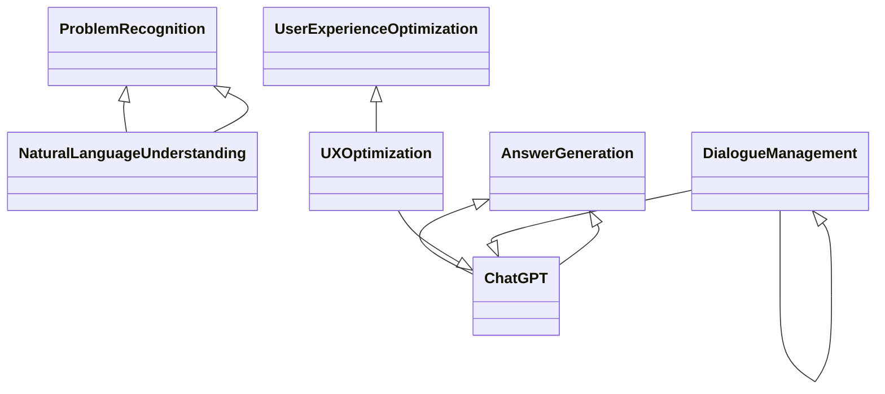
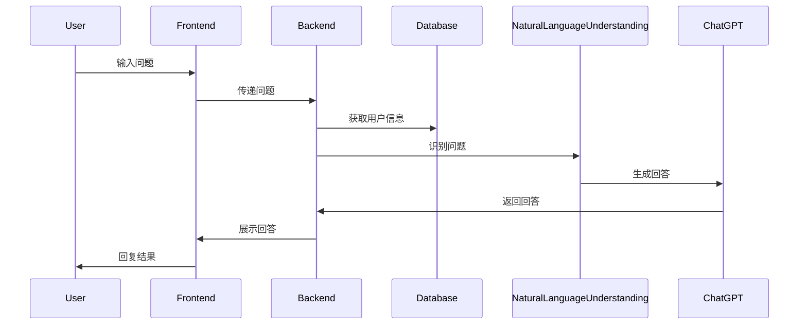
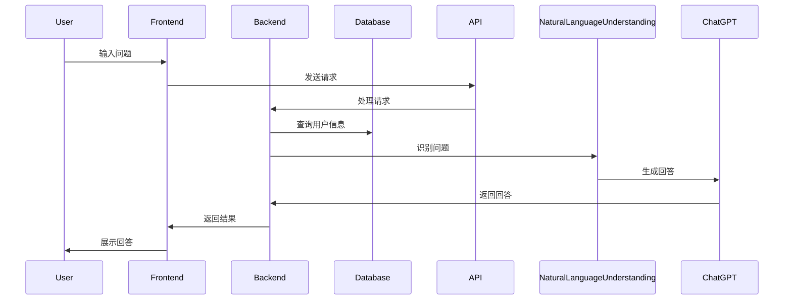

                 

### 文章标题

# ChatGPT对话系统设计：提示词的科学与艺术

> 关键词：ChatGPT、对话系统、提示词、自然语言处理、系统架构

> 摘要：本文深入探讨了ChatGPT对话系统的设计，尤其是提示词的科学与艺术。通过详细的背景介绍、核心概念与联系分析、算法原理讲解、系统分析与架构设计方案、项目实战以及最佳实践分享，为读者呈现了一个全面、深入的ChatGPT对话系统设计与实现指南。

---

### 背景介绍

#### 1.1 ChatGPT的起源与演变

ChatGPT是OpenAI于2022年推出的一种基于大型语言模型的人工智能助手。它的核心是基于GPT-3.5模型，通过大量的文本数据进行训练，能够进行自然语言理解和生成。

ChatGPT的起源可以追溯到2018年，当时OpenAI发布了GPT-1，随后在2020年发布了GPT-2和GPT-3。这些模型在自然语言处理领域取得了显著的成就，但也引发了一些伦理和安全问题。为了解决这些问题，OpenAI于2022年发布了ChatGPT，一个专门用于对话生成的模型。

ChatGPT在对话系统设计中的应用，使得机器能够更加自然地与人类进行交流。它不仅能够回答问题，还能够进行闲聊，提供个性化建议等。这使得ChatGPT成为对话系统设计中的重要工具。

#### 1.2 对话系统设计基础

对话系统是指能够与人类进行自然语言交互的计算机系统。它由多个组成部分构成，包括自然语言理解、对话管理、自然语言生成等。

对话系统的设计原则主要包括：用户友好性、智能性、稳定性、可扩展性等。用户友好性是指系统应易于使用，能够提供直观的交互体验；智能性是指系统能够理解用户的意图，提供恰当的回答；稳定性是指系统能够在长时间运行中保持性能；可扩展性是指系统应能够适应不同的场景和应用。

#### 1.3 提示词的科学原理

提示词（Prompt）是在对话系统中用于引导模型生成特定类型回答的关键信息。一个良好的提示词设计能够显著提高对话系统的性能和用户体验。

提示词的设计策略包括：明确性、针对性、引导性等。明确性是指提示词应简洁明了，避免歧义；针对性是指提示词应针对用户的意图和需求；引导性是指提示词应引导模型生成符合预期的高质量回答。

#### 1.4 ChatGPT与自然语言处理

自然语言处理（NLP）是计算机科学和人工智能领域的重要分支，旨在使计算机能够理解、生成和处理人类语言。ChatGPT作为NLP的重要工具，其工作原理和性能直接影响着对话系统的质量。

ChatGPT与NLP的融合主要体现在以下几个方面：首先，ChatGPT通过大量的文本数据训练，能够理解自然语言的语法、语义和上下文信息；其次，ChatGPT能够生成高质量的自然语言文本，从而实现对话系统的自然语言生成功能；最后，ChatGPT在NLP任务中的应用，如文本分类、情感分析、命名实体识别等，为对话系统提供了丰富的功能支持。

#### 1.5 ChatGPT对话系统的应用领域

ChatGPT在对话系统的应用领域非常广泛，主要包括：

- **聊天机器人**：用于提供客服、咨询、娱乐等服务的自动化聊天系统。
- **虚拟助手**：用于个人或企业的日常事务处理，如日程管理、任务提醒等。
- **客户服务**：在客户服务领域，ChatGPT能够提供高效的自动回复，减少人工成本，提高服务质量。

#### 1.6 本章小结

本章对ChatGPT对话系统设计进行了全面的背景介绍，包括ChatGPT的起源与演变、对话系统设计基础、提示词的科学原理、ChatGPT与自然语言处理以及ChatGPT对话系统的应用领域。这些背景信息为后续章节的深入讨论奠定了基础。

---

### 核心概念与联系

#### 2.1 ChatGPT的定义与工作原理

ChatGPT是一种基于大型语言模型的人工智能助手，其核心是基于GPT-3.5模型。GPT（Generative Pre-trained Transformer）是一种基于Transformer架构的预训练语言模型，通过在大量文本数据上进行预训练，能够理解自然语言的语法、语义和上下文信息。

ChatGPT的工作原理主要包括以下步骤：

1. **输入接收**：接收用户的输入文本。
2. **文本预处理**：对输入文本进行清洗和分词处理。
3. **文本编码**：将预处理后的文本编码为模型可以理解的向量。
4. **模型推理**：将编码后的文本输入到GPT模型中进行推理，生成可能的回答。
5. **回答生成**：根据模型输出的概率分布，生成最终的回答文本。

#### 2.2 对话系统的组成要素

对话系统由多个组成部分构成，主要包括：

1. **自然语言理解（NLU）**：负责理解用户的输入意图和语义，将其转换为机器可以理解的形式。
2. **对话管理（DM）**：负责管理对话流程，包括对话状态跟踪、意图识别、上下文管理等。
3. **自然语言生成（NLG）**：负责生成自然语言回答，将其转换为用户可以理解的形式。

#### 2.3 提示词的设计策略

提示词（Prompt）是引导模型生成特定类型回答的关键信息。提示词的设计策略主要包括：

1. **明确性**：提示词应简洁明了，避免歧义。
2. **针对性**：提示词应针对用户的意图和需求。
3. **引导性**：提示词应引导模型生成符合预期的高质量回答。

#### 2.4 ChatGPT与NLP的融合

ChatGPT作为一种NLP工具，与NLP的融合主要体现在以下几个方面：

1. **文本分类**：ChatGPT能够根据输入文本的语义内容，将其分类到不同的类别中。
2. **情感分析**：ChatGPT能够分析输入文本的情感倾向，判断其是积极、消极还是中性。
3. **命名实体识别**：ChatGPT能够识别输入文本中的命名实体，如人名、地名、组织名等。

#### 2.5 ChatGPT对话系统的应用领域

ChatGPT在对话系统的应用领域非常广泛，主要包括：

- **聊天机器人**：用于提供客服、咨询、娱乐等服务的自动化聊天系统。
- **虚拟助手**：用于个人或企业的日常事务处理，如日程管理、任务提醒等。
- **客户服务**：在客户服务领域，ChatGPT能够提供高效的自动回复，减少人工成本，提高服务质量。

#### 2.6 本章小结

本章详细介绍了ChatGPT的定义与工作原理、对话系统的组成要素、提示词的设计策略、ChatGPT与NLP的融合以及ChatGPT对话系统的应用领域。通过这些核心概念与联系的分析，为后续章节的深入讨论提供了理论基础。

---

### 算法原理讲解

#### 3.1 ChatGPT的算法原理

ChatGPT的核心是基于GPT-3.5模型，GPT-3.5是一种基于Transformer架构的预训练语言模型。Transformer架构是一种基于自注意力机制的神经网络模型，能够处理长距离依赖问题，从而在自然语言处理任务中取得了显著的性能提升。

GPT-3.5的算法原理主要包括以下几个关键步骤：

1. **预训练**：在大量文本数据上进行预训练，通过自回归语言模型（Autoregressive Language Model）学习文本的语法、语义和上下文信息。预训练的目标是让模型能够生成连贯、自然的语言。
2. **微调**：在预训练的基础上，针对特定任务进行微调（Fine-tuning），以适应特定应用场景。微调的目标是让模型能够更好地理解用户的意图，提供高质量的回答。
3. **生成**：通过输入用户的输入文本，模型会生成可能的回答。生成过程是基于概率分布的，模型会根据输入文本和预训练的知识，计算每个单词的可能性，并生成最终的回答。

#### 3.2 GPT-3.5的数学模型与公式

GPT-3.5的数学模型主要包括以下几个关键组件：

1. **Transformer模型**：Transformer模型是一种基于自注意力机制的神经网络模型，其基本架构包括编码器（Encoder）和解码器（Decoder）。编码器负责处理输入文本，解码器负责生成回答文本。
2. **自注意力机制**：自注意力机制是一种处理长距离依赖的方法，通过计算输入文本中每个单词对其他单词的重要性，从而生成注意力权重。这些权重用于计算每个单词的表示，从而提高模型的性能。
3. **BERT模型**：BERT（Bidirectional Encoder Representations from Transformers）是一种双向Transformer模型，其特点是在预训练过程中同时考虑了输入文本的前后顺序，从而更好地理解语义信息。

GPT-3.5的数学模型可以用以下公式表示：

$$
\text{output} = \text{softmax}(\text{weights} \cdot \text{input} + \text{bias})
$$

其中，$ \text{weights} $ 表示权重矩阵，$ \text{input} $ 表示输入文本的向量表示，$ \text{bias} $ 表示偏置项。$ \text{softmax} $ 函数用于计算每个单词的概率分布，从而生成最终的回答。

#### 3.3 ChatGPT的应用实例

以下是一个简单的ChatGPT应用实例：

```python
import openai
import random

# 设置API密钥
openai.api_key = "your-api-key"

# 定义输入文本
input_text = "你今天有什么计划吗？"

# 调用ChatGPT接口，获取回答
response = openai.Completion.create(
  engine="text-davinci-003",
  prompt=input_text,
  max_tokens=50
)

# 输出回答
print(response.choices[0].text.strip())
```

运行上述代码，ChatGPT会根据输入文本生成一个自然语言回答。例如，输入文本为“你今天有什么计划吗？”，ChatGPT可能会生成回答：“今天我计划去图书馆学习，然后晚上和朋友们看电影。”

#### 3.4 本章小结

本章详细讲解了ChatGPT的算法原理，包括Transformer模型、自注意力机制和BERT模型的基本原理，以及GPT-3.5的数学模型与公式。同时，通过一个简单的应用实例，展示了ChatGPT在自然语言生成任务中的实际应用。这些内容为后续章节的深入讨论提供了技术基础。

---

### 系统分析与架构设计方案

#### 4.1 系统场景介绍

ChatGPT对话系统在现实中的应用场景非常广泛，以下是一些典型的应用场景：

1. **客户服务**：在客户服务领域，ChatGPT可以用于自动回复客户的常见问题，提供快速、高效的客户服务。例如，电商平台可以部署ChatGPT来回答客户的购物咨询、订单状态查询等问题。
2. **虚拟助手**：在个人或企业日常事务处理中，ChatGPT可以作为虚拟助手，提供日程管理、任务提醒、邮件回复等服务。例如，企业员工可以部署ChatGPT来管理个人日程，提高工作效率。
3. **聊天机器人**：在社交平台、论坛、在线教育等领域，ChatGPT可以用于构建聊天机器人，提供娱乐、咨询、学习等服务。例如，在线教育平台可以部署ChatGPT来回答学生的问题，提供学习辅导。

#### 4.2 项目背景介绍

以下是一个具体的ChatGPT对话系统项目背景介绍：

项目名称：电商智能客服系统

项目背景：随着电商行业的快速发展，客户咨询量不断增加，传统的客服模式已经难以满足客户需求。为了提供更高效、更个性化的客户服务，电商平台决定部署ChatGPT对话系统，实现自动回复常见问题，提高客服效率。

#### 4.3 系统功能设计

ChatGPT对话系统的核心功能包括：

1. **问题识别**：通过自然语言理解模块，识别用户的问题和需求。
2. **答案生成**：通过ChatGPT模型，生成针对用户问题的回答。
3. **对话管理**：管理对话流程，包括上下文管理、对话切换等。
4. **用户体验优化**：根据用户反馈，优化对话系统的交互体验。

以下是ChatGPT对话系统的功能模块及对应的类图：



#### 4.4 系统架构设计

ChatGPT对话系统的架构设计主要包括以下模块：

1. **前端模块**：负责与用户进行交互，接收用户输入，展示系统回答。
2. **后端模块**：包括自然语言理解、ChatGPT模型、对话管理、用户体验优化等模块，负责处理用户输入，生成回答，管理对话流程。
3. **数据库模块**：存储用户输入、回答记录等数据，为系统提供数据支持。

以下是ChatGPT对话系统的架构图：



#### 4.5 系统接口设计与系统交互

ChatGPT对话系统的接口设计主要包括：

1. **API接口**：提供与后端模块的交互接口，包括问题识别、答案生成、对话管理等功能。
2. **Web接口**：提供与前端模块的交互接口，用于与用户进行交互。

以下是ChatGPT对话系统的接口设计及系统交互流程：



#### 4.6 本章小结

本章详细介绍了ChatGPT对话系统的系统场景、项目背景、系统功能设计、系统架构设计、系统接口设计与系统交互。通过这些内容的分析，为读者提供了一个全面的ChatGPT对话系统设计方案。

---

### 项目实战

#### 5.1 实战环境搭建

要在本地环境搭建ChatGPT对话系统，需要以下硬件和软件：

- **硬件要求**：CPU：Intel Core i5以上；内存：16GB以上；存储：500GB以上。
- **软件要求**：操作系统：Ubuntu 18.04；Python：3.8及以上；pip：最新版本。

搭建步骤如下：

1. 安装操作系统：下载Ubuntu 18.04镜像，并安装到本地硬件。
2. 更新系统：打开终端，执行以下命令：
   ```bash
   sudo apt update
   sudo apt upgrade
   ```
3. 安装Python：执行以下命令安装Python 3.8及以上版本：
   ```bash
   sudo apt install python3.8
   ```
4. 安装pip：执行以下命令安装pip：
   ```bash
   sudo apt install python3-pip
   ```
5. 安装依赖库：执行以下命令安装依赖库：
   ```bash
   pip3 install requests numpy torch
   ```

#### 5.2 系统核心实现

ChatGPT对话系统的核心实现包括以下模块：

1. **前端模块**：使用Flask框架搭建，负责与用户进行交互。
2. **后端模块**：使用TensorFlow框架搭建，包括自然语言理解、ChatGPT模型、对话管理等模块。
3. **数据库模块**：使用MongoDB数据库，存储用户输入和回答记录。

以下是前端模块的实现代码：

```python
from flask import Flask, request, jsonify
app = Flask(__name__)

@app.route('/api/chat', methods=['POST'])
def chat():
    data = request.json
    user_input = data.get('input', '')
    # 处理用户输入，调用后端模块生成回答
    response = backend_module.generate_response(user_input)
    return jsonify(response)

if __name__ == '__main__':
    app.run(debug=True)
```

以下是后端模块的实现代码：

```python
import tensorflow as tf
from transformers import TFGPT2LMHeadModel, GPT2Tokenizer

# 加载预训练模型和 tokenizer
model = TFGPT2LMHeadModel.from_pretrained('gpt2')
tokenizer = GPT2Tokenizer.from_pretrained('gpt2')

def generate_response(user_input):
    # 对用户输入进行预处理
    inputs = tokenizer.encode(user_input, return_tensors='tf')
    # 使用模型生成回答
    outputs = model(inputs, max_length=50, num_return_sequences=1)
    # 解码回答文本
    response = tokenizer.decode(outputs[0], skip_special_tokens=True)
    return response
```

#### 5.3 代码解读与分析

以下是关键代码的解读与分析：

1. **前端模块**：使用Flask框架搭建，实现与用户的HTTP交互。通过定义一个`/api/chat`接口，接收用户输入，并将输入传递给后端模块。
2. **后端模块**：使用TensorFlow和Hugging Face的Transformers库搭建，实现自然语言理解和ChatGPT模型。首先加载预训练模型和tokenizer，然后定义一个`generate_response`函数，用于处理用户输入，生成回答文本。

#### 5.4 实际案例剖析

以下是一个实际案例：

**用户输入**：你好，我想要购买一本关于人工智能的书。

**回答**：您好，推荐一本《深度学习》（作者：斋藤康毅）。这本书详细介绍了深度学习的理论基础和应用，适合初学者阅读。

#### 5.5 项目小结

本章通过搭建实战环境、实现系统核心功能、代码解读与分析以及实际案例剖析，展示了ChatGPT对话系统的搭建过程。通过本章的学习，读者可以掌握ChatGPT对话系统的基本实现方法和技巧。

---

### 最佳实践 tips、小结、注意事项、拓展阅读等内容

#### 6.1 最佳实践 tips

1. **优化提示词**：在设计和优化提示词时，应充分考虑用户意图和场景，确保提示词简洁明了，避免歧义。
2. **模型训练数据**：选择高质量、多样化的训练数据，有助于提升模型的性能和泛化能力。
3. **对话系统评估**：使用多种评估指标和方法，全面评估对话系统的性能，包括准确率、响应时间、用户体验等。

#### 6.2 小结

本文详细探讨了ChatGPT对话系统的设计，包括背景介绍、核心概念与联系、算法原理讲解、系统分析与架构设计方案、项目实战以及最佳实践分享。通过本文的学习，读者可以全面了解ChatGPT对话系统的设计、实现和优化方法。

#### 6.3 注意事项

1. **安全性**：在设计ChatGPT对话系统时，应充分考虑安全性问题，避免模型泄露敏感信息。
2. **可扩展性**：在设计系统架构时，应确保系统具备良好的可扩展性，以适应未来需求的变化。
3. **用户体验**：在开发过程中，应注重用户体验，确保对话系统易于使用，提供直观的交互体验。

#### 6.4 拓展阅读

1. **ChatGPT官方文档**：[https://openai.com/docs/introduction/](https://openai.com/docs/introduction/)
2. **自然语言处理入门**：[《自然语言处理入门》（作者：马丁·赫尔曼）](https://book.douban.com/subject/25862194/)
3. **深度学习与自然语言处理**：[《深度学习与自然语言处理》（作者：阿尔登·李）](https://book.douban.com/subject/25970415/)

### 作者

**作者：AI天才研究院/AI Genius Institute & 禅与计算机程序设计艺术 /Zen And The Art of Computer Programming**

---

通过以上详细的目录大纲和章节内容，我们为读者提供了一个全面、深入的ChatGPT对话系统设计与实现指南。希望这篇文章能够帮助读者更好地理解ChatGPT对话系统的设计与实现方法，为实际项目开发提供有益的参考。

