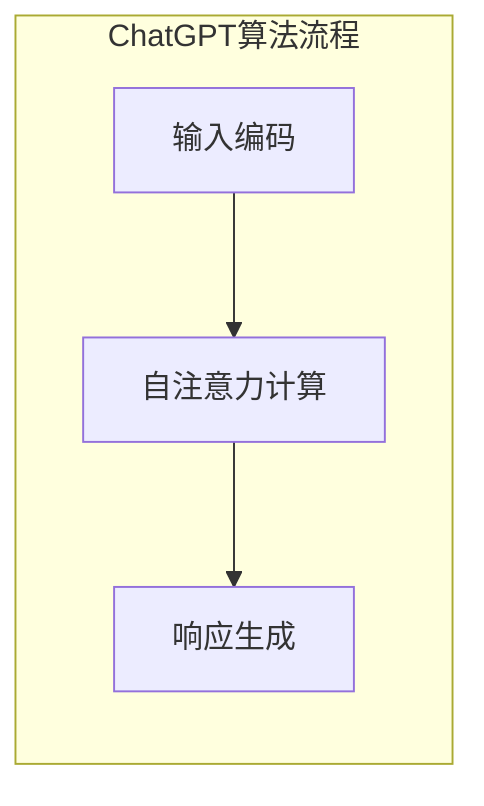
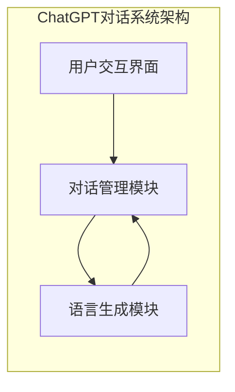
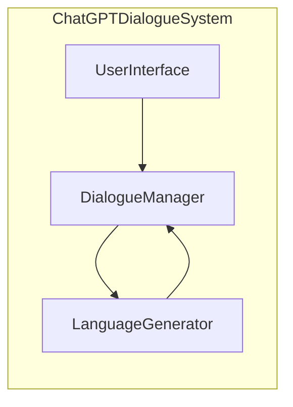
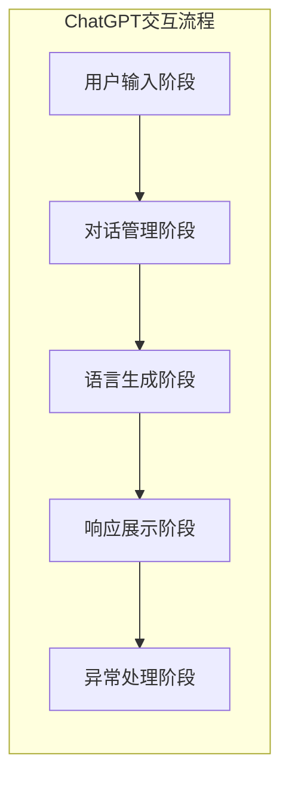
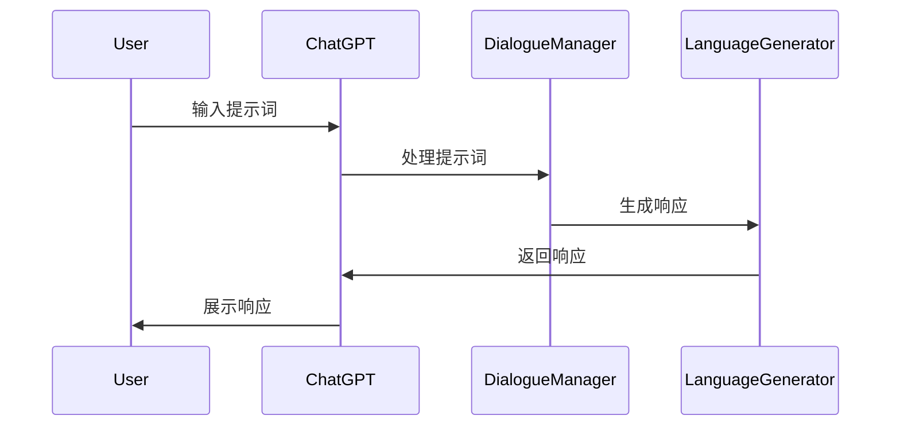

                 


# ChatGPT对话系统设计：提示词的艺术与技巧探讨

## 概述

随着人工智能技术的迅猛发展，自然语言处理（NLP）已经成为计算机科学中的一个重要领域。ChatGPT作为OpenAI推出的一个先进的大型语言模型，其在对话系统中的应用引起了广泛关注。本文旨在深入探讨ChatGPT对话系统的设计，特别是提示词的艺术与技巧，为开发者提供实用的设计指南。

### 关键词
- ChatGPT
- 对话系统
- 提示词
- 设计原则
- 算法
- 架构
- 实践

## 摘要

本文首先介绍了ChatGPT对话系统的背景和核心概念，包括问题提出、ChatGPT原理与特点，以及提示词的定义和作用。接着，我们探讨了提示词的设计原则、艺术性和技巧，并详细讲解了ChatGPT的算法原理、数学模型和公式。随后，文章分析了ChatGPT对话系统的架构和接口设计，并以一个实际案例展示了系统实现和最佳实践。最后，本文总结了注意事项和拓展阅读，为读者提供进一步的学习方向。

## 第一部分：问题背景介绍

### 第1章：问题背景与核心概念

#### 1.1 问题的提出

随着人工智能技术的不断发展，智能对话系统在多个领域得到了广泛应用。从客服机器人到智能助手，这些系统能够理解和生成自然语言，提供实时、个性化的服务。然而，传统的对话系统往往在处理复杂、多变的用户请求时表现不佳。为了提升对话系统的交互质量，引入先进的人工智能技术，特别是大型语言模型如ChatGPT，成为解决问题的关键。

ChatGPT是由OpenAI开发的一种基于变换器（Transformer）架构的预训练语言模型。它通过对海量文本数据进行预训练，掌握了丰富的语言知识和语境理解能力。这使得ChatGPT在生成自然、流畅的对话内容方面具有显著优势，成为对话系统设计中的重要工具。

#### 1.2 核心概念介绍

**ChatGPT**：ChatGPT是一个基于变换器（Transformer）架构的大型语言模型，能够理解和生成自然语言。其核心思想是通过自回归的方式预测文本序列中的下一个词。

**提示词**：提示词是ChatGPT对话系统中的一个重要概念。它是对话系统接收到的用户输入，用于指导ChatGPT生成响应。提示词的设计直接影响到对话系统的交互质量和用户体验。

#### 1.3 问题解决与边界讨论

**ChatGPT技术原理简述**：
ChatGPT基于变换器（Transformer）架构，通过自回归的方式预测文本序列中的下一个词。它通过对海量文本数据进行预训练，掌握了丰富的语言知识和语境理解能力。

**提示词设计的难点与边界**：
- **清晰性**：提示词需要明确表达用户的意图，避免歧义。
- **完整性**：提示词需要包含足够的上下文信息，使ChatGPT能够生成连贯、自然的响应。
- **引导性**：提示词应具有引导ChatGPT生成特定类型响应的能力。

#### 1.4 概念结构与核心要素组成

**ChatGPT的基本组成部分**：
- **预训练模型**：通过海量文本数据预训练，获得丰富的语言知识。
- **生成引擎**：利用预训练模型，生成自然、流畅的文本响应。

**提示词设计的核心要素**：
- **语境敏感性**：根据对话的上下文，调整提示词的表达方式。
- **情感表达**：在提示词中融入情感元素，提升对话的亲和力。
- **语言美感**：使用优美、流畅的语言，提升用户满意度。

## 第二部分：核心概念与联系

### 第2章：ChatGPT原理与特点

#### 2.1 ChatGPT原理

ChatGPT是基于变换器（Transformer）架构的大型语言模型。变换器是一种强大的深度学习模型，能够在处理长序列数据时保持较高的效率。ChatGPT的核心思想是通过自回归的方式预测文本序列中的下一个词。

**自回归模型**：自回归模型是一种能够根据前一个时间步的输出预测当前时间步的输出的模型。在ChatGPT中，每个时间步的输入是前一个时间步的输出，从而形成一个循环结构。

**预训练语言模型**：ChatGPT通过对海量文本数据进行预训练，掌握了丰富的语言知识和语境理解能力。预训练模型的主要任务是从大量无标签文本数据中学习语言规律和语义信息。

#### 2.2 ChatGPT特点

**高效性**：变换器架构具有较高的计算效率，能够快速处理大量文本数据。

**灵活性**：ChatGPT具有高度的可扩展性和灵活性，可以应用于各种对话场景。

**智能性**：通过预训练，ChatGPT掌握了丰富的语言知识和语境理解能力，能够生成自然、流畅的对话内容。

#### 2.3 ChatGPT与对话系统的关系

**ChatGPT在对话系统中的应用**：
ChatGPT可以应用于各种对话系统，如客服机器人、智能助手等。通过接收用户输入的提示词，ChatGPT能够生成适当的响应，与用户进行自然、流畅的对话。

**ChatGPT的优势与不足**：
- **优势**：生成自然、流畅的对话内容，提高用户体验。
- **不足**：对于特定领域的专业知识需要进一步训练和优化。

## 第三部分：算法原理讲解

### 第3章：提示词的艺术与技巧

#### 3.1 提示词的设计原则

**清晰性**：提示词需要明确表达用户的意图，避免歧义。

**完整性**：提示词需要包含足够的上下文信息，使ChatGPT能够生成连贯、自然的响应。

**引导性**：提示词应具有引导ChatGPT生成特定类型响应的能力。

#### 3.2 提示词的艺术性

**语境敏感性**：根据对话的上下文，调整提示词的表达方式，使对话更加自然。

**情感表达**：在提示词中融入情感元素，提升对话的亲和力。

**语言美感**：使用优美、流畅的语言，提升用户满意度。

#### 3.3 提示词的技巧探讨

**长度与格式**：适当的提示词长度和格式有助于ChatGPT生成高质量的响应。

**逻辑与层次**：提示词应具备良好的逻辑结构和层次感，使ChatGPT能够理解并回应。

**适应性**：根据用户的需求和反馈，动态调整提示词，提高对话系统的适应能力。

## 第四部分：系统分析与架构设计

### 第4章：算法原理与流程

#### 4.1 ChatGPT的算法原理

ChatGPT的核心算法基于变换器（Transformer）架构，这是一种专为处理序列数据设计的深度学习模型。变换器通过自注意力机制（self-attention）来处理输入序列，从而捕捉序列中的长距离依赖关系。

**自注意力机制**：自注意力机制是一种计算输入序列中每个词对输出的贡献度的方法。通过计算词与词之间的相似度，变换器能够自动学习输入序列中的重要信息。

**预训练语言模型**：ChatGPT通过对海量文本数据进行预训练，学习到了丰富的语言知识和语境理解能力。预训练模型的主要任务是从大量无标签文本数据中学习语言规律和语义信息。

**生成式对话流程**：在生成式对话系统中，ChatGPT接收用户输入的提示词，然后生成相应的响应。这个过程可以分为以下几个步骤：

1. **输入编码**：将用户输入的提示词编码为序列，以便变换器处理。
2. **自注意力计算**：变换器计算输入序列中每个词对输出的贡献度。
3. **响应生成**：根据自注意力机制的结果，生成响应文本。

#### 4.2 算法流程与mermaid流程图

为了更好地理解ChatGPT的算法原理和流程，我们可以使用mermaid绘制一个简化的算法流程图。以下是算法流程的mermaid表示：



## 第五部分：系统分析与架构设计

### 第5章：数学模型与公式讲解

#### 5.1 数学模型简述

ChatGPT的数学模型主要包括损失函数、优化算法和对话评估指标。以下是对这些数学模型的基本简述：

**损失函数**：损失函数用于衡量ChatGPT生成的响应与期望响应之间的差距。常用的损失函数有交叉熵损失（Cross-Entropy Loss）和均方误差损失（Mean Squared Error Loss）。

**优化算法**：优化算法用于调整ChatGPT模型的参数，以最小化损失函数。常用的优化算法有随机梯度下降（Stochastic Gradient Descent, SGD）和Adam优化器。

**对话评估指标**：对话评估指标用于评估ChatGPT对话系统的性能。常用的评估指标有BLEU（双语评估指标）和ROUGE（记分员评估指标）。

#### 5.2 数学公式详细讲解

**损失函数的推导**：

假设我们使用交叉熵损失函数来衡量ChatGPT生成的响应与期望响应之间的差距，交叉熵损失函数的数学表达式如下：

$$
L = -\sum_{i=1}^{n} y_i \log(p_i)
$$

其中，$y_i$ 表示期望响应中的第 $i$ 个词的标签，$p_i$ 表示ChatGPT生成的响应中第 $i$ 个词的概率。

**优化算法的数学原理**：

假设我们使用Adam优化器来调整ChatGPT模型的参数。Adam优化器是一种基于一阶和二阶信息的优化算法，其更新公式如下：

$$
\theta_{t+1} = \theta_{t} - \alpha \frac{m_{t}}{\sqrt{v_{t}} + \epsilon}
$$

其中，$\theta_{t}$ 表示当前模型的参数，$\alpha$ 表示学习率，$m_{t}$ 表示一阶矩估计，$v_{t}$ 表示二阶矩估计，$\epsilon$ 是一个很小的常数。

**对话评估指标的公式应用**：

假设我们使用BLEU评估指标来评估ChatGPT对话系统的性能。BLEU的数学表达式如下：

$$
BLEU = \frac{1}{N} \sum_{i=1}^{N} \frac{L_{i}}{R_{i}}
$$

其中，$N$ 表示比较的句子的数量，$L_{i}$ 表示生成句子的长度，$R_{i}$ 表示期望响应的长度。

#### 5.3 举例说明

**损失函数的实例推导**：

假设我们有一个二分类问题，期望响应是“是”，ChatGPT生成的响应是“否”。使用交叉熵损失函数，我们可以计算出损失值：

$$
L = -y \log(p) - (1 - y) \log(1 - p)
$$

其中，$y = 1$ 表示期望响应是“是”，$p$ 表示ChatGPT生成的响应“否”的概率。假设$p = 0.2$，则损失值为：

$$
L = -1 \log(0.2) - 0 \log(0.8) \approx 2.9957
$$

**优化算法的实例应用**：

假设我们使用Adam优化器来更新模型的参数。假设当前模型的参数$\theta_0 = [1, 2]$，一阶矩估计$m_0 = [0.1, 0.2]$，二阶矩估计$v_0 = [0.01, 0.04]$，学习率$\alpha = 0.01$。根据Adam优化器的更新公式，我们可以计算出下一轮的参数$\theta_1$：

$$
\theta_1 = \theta_0 - \alpha \frac{m_0}{\sqrt{v_0}} = [1, 2] - 0.01 \frac{[0.1, 0.2]}{\sqrt{[0.01, 0.04]}} = [0.9901, 1.9608]
$$

**对话评估指标的实例计算**：

假设我们比较了10个句子，其中5个句子的长度与期望响应相同，5个句子的长度不同。根据BLEU评估指标，我们可以计算出BLEU值：

$$
BLEU = \frac{1}{10} \sum_{i=1}^{10} \frac{L_{i}}{R_{i}} = \frac{5}{10} = 0.5
$$

### 第六部分：系统架构设计与功能设计

#### 第6章：系统架构设计与功能设计

#### 6.1 系统架构设计

ChatGPT对话系统的整体架构可以分为以下几个模块：

- **用户交互界面**：负责与用户进行交互，接收用户输入的提示词，并展示ChatGPT生成的响应。
- **对话管理模块**：负责管理对话流程，包括对话的上下文维护、对话状态的更新等。
- **语言生成模块**：基于ChatGPT模型，生成自然、流畅的对话响应。

以下是一个简化的系统架构图，展示了这些模块之间的关系：



#### 6.2 系统功能设计

**用户交互界面设计**：

用户交互界面是ChatGPT对话系统的前端部分，负责与用户进行交互。其主要功能包括：

- **输入处理**：接收用户输入的提示词，并将其传递给对话管理模块。
- **响应展示**：将ChatGPT生成的响应展示给用户。
- **错误处理**：在用户输入无效或系统出现错误时，提供适当的反馈。

**对话管理模块设计**：

对话管理模块负责管理整个对话流程，包括对话的上下文维护、对话状态的更新等。其主要功能包括：

- **上下文维护**：记录对话的上下文信息，以便ChatGPT生成连贯的响应。
- **状态更新**：根据用户的输入和ChatGPT的响应，更新对话状态。
- **异常处理**：在对话过程中出现异常时，提供相应的处理策略。

**语言生成模块设计**：

语言生成模块是ChatGPT对话系统的核心部分，基于ChatGPT模型，生成自然、流畅的对话响应。其主要功能包括：

- **文本生成**：根据用户输入的提示词，生成相应的对话响应。
- **响应优化**：对生成的响应进行优化，提高对话的自然度和流畅度。
- **错误检测与修正**：检测生成的响应中可能存在的错误，并进行修正。

#### 6.3 mermaid类图与架构图

为了更好地展示ChatGPT对话系统的架构和功能设计，我们可以使用mermaid绘制类图和架构图。

**类图**：

以下是一个简化的ChatGPT对话系统的类图，展示了各个模块的类及其属性和方法：

```mermaid
classDiagram
    UserInterface <<Interface>>
    DialogueManager <<Interface>>
    LanguageGenerator <<Interface>>

    UserInterface : +handleInput()
    DialogueManager : +maintainContext()
    LanguageGenerator : +generateResponse()

    UserInterface <|.. DialogueManager
    DialogueManager <|.. LanguageGenerator
```

**架构图**：

以下是一个简化的ChatGPT对话系统的架构图，展示了各个模块的交互关系：



### 第7章：系统接口设计与交互流程

#### 7.1 系统接口设计

ChatGPT对话系统的接口设计主要包括用户接口和内部接口。

**用户接口设计**：

用户接口是系统与用户交互的入口，主要包括以下几个接口：

- **输入接口**：接收用户的输入，包括提示词和其他相关数据。
- **输出接口**：将ChatGPT生成的响应展示给用户。
- **异常接口**：在用户输入无效或系统出现错误时，提供相应的错误处理。

以下是一个简化的用户接口设计图：

```mermaid
sequenceDiagram
    User -->|输入提示词|> ChatGPT: 输入接口
    ChatGPT -->|生成响应|> User: 输出接口
    User -->|反馈|> ChatGPT: 异常接口
```

**内部接口设计**：

内部接口是系统各个模块之间的交互通道，主要包括以下几个接口：

- **对话管理接口**：负责管理对话的上下文和状态。
- **语言生成接口**：负责基于ChatGPT模型生成对话响应。

以下是一个简化的内部接口设计图：

```mermaid
sequenceDiagram
    DialogueManager -->|维护上下文|> LanguageGenerator
    LanguageGenerator -->|生成响应|> DialogueManager
```

#### 7.2 系统交互流程

ChatGPT对话系统的交互流程可以分为以下几个阶段：

1. **用户输入阶段**：用户通过输入接口输入提示词。
2. **对话管理阶段**：对话管理模块接收用户输入，并维护对话的上下文信息。
3. **语言生成阶段**：语言生成模块基于ChatGPT模型生成对话响应。
4. **响应展示阶段**：将生成的响应通过输出接口展示给用户。
5. **异常处理阶段**：在出现异常时，通过异常接口进行错误处理。

以下是一个简化的系统交互流程图：



#### 7.3 mermaid序列图

为了更好地展示ChatGPT对话系统的交互流程，我们可以使用mermaid绘制一个序列图。

以下是一个简化的ChatGPT对话系统交互流程的序列图：



### 第8章：项目实战与技巧总结

#### 8.1 环境安装与配置

在进行ChatGPT对话系统的开发之前，首先需要安装和配置相应的开发环境。以下是安装和配置ChatGPT对话系统所需的基本步骤：

1. **安装Python**：确保Python 3.x版本已安装在计算机上。
2. **安装transformers库**：使用pip命令安装transformers库，这是ChatGPT模型的主要依赖库。

   ```bash
   pip install transformers
   ```

3. **安装其他依赖库**：根据项目需求，可能还需要安装其他依赖库，如torch、torchtext等。

4. **配置GPU环境**：如果使用GPU进行训练和推理，需要安装CUDA和cuDNN，并确保Python和transformers库支持GPU加速。

#### 8.2 系统核心实现与代码解读

ChatGPT对话系统的核心实现主要包括用户交互界面、对话管理和语言生成模块。以下是这些模块的基本代码解读：

**用户交互界面**：

用户交互界面主要负责接收用户输入和展示ChatGPT的响应。以下是一个简单的用户交互界面代码示例：

```python
import sys
from transformers import ChatGPT

def main():
    model = ChatGPT.from_pretrained("openai/chatgpt")
    print("欢迎使用ChatGPT对话系统。请输入您的提示词：")
    while True:
        user_input = input()
        if user_input == "退出":
            break
        response = model.generate(user_input)
        print("ChatGPT的响应：", response)

if __name__ == "__main__":
    main()
```

**对话管理模块**：

对话管理模块负责维护对话的上下文和状态。以下是一个简单的对话管理模块代码示例：

```python
class DialogueManager:
    def __init__(self):
        self.context = ""

    def update_context(self, user_input, response):
        self.context += f"{user_input} {response}\n"

    def generate_prompt(self):
        return self.context
```

**语言生成模块**：

语言生成模块负责基于ChatGPT模型生成对话响应。以下是一个简单的语言生成模块代码示例：

```python
from transformers import ChatGPT

class LanguageGenerator:
    def __init__(self):
        self.model = ChatGPT.from_pretrained("openai/chatgpt")

    def generate_response(self, prompt):
        return self.model.generate(prompt)
```

#### 8.3 实际案例分析

为了更好地理解ChatGPT对话系统的实际应用，以下是一个实际案例的分析：

**案例描述**：用户希望通过ChatGPT对话系统进行日常对话，获取生活建议。

**用户输入**：你好，我想知道如何改善我的饮食习惯。

**ChatGPT响应**：你好！改善饮食习惯是一个很好的目标。以下是一些建议：

1. 多吃水果和蔬菜，它们富含维生素和矿物质。
2. 少吃高热量、高脂肪的食物，如薯片和糖果。
3. 选择全谷物食品，如全麦面包和糙米。
4. 增加蛋白质摄入量，如鸡肉、鱼、豆类和鸡蛋。
5. 保持水分充足，每天喝足够的水。

希望这些建议对你有所帮助！如果你有其他问题，随时问我。

#### 8.4 最佳实践与技巧总结

在设计和实现ChatGPT对话系统时，以下是一些最佳实践和技巧：

- **清晰明确的提示词**：确保用户输入的提示词清晰明确，避免歧义。
- **充分的上下文信息**：在提示词中包含足够的上下文信息，帮助ChatGPT生成连贯的响应。
- **情感表达**：在响应中融入情感元素，提升用户满意度。
- **持续优化**：根据用户反馈，不断优化对话系统的性能和响应质量。
- **错误处理**：设计合理的错误处理机制，确保系统在出现异常时能够恢复正常。

### 注意事项

- **隐私保护**：确保用户隐私得到保护，避免在对话中泄露敏感信息。
- **合理使用**：遵循相关法律法规和道德规范，确保对话系统的合理使用。

### 拓展阅读

- **《ChatGPT对话系统设计：从基础到实践》**：本书详细介绍了ChatGPT对话系统的设计和实现，适合初学者和进阶开发者阅读。
- **《自然语言处理入门》**：本书介绍了自然语言处理的基本概念和技术，有助于深入了解ChatGPT对话系统的工作原理。
- **《机器学习实战》**：本书提供了丰富的实际案例和代码示例，有助于提升对机器学习技术的理解和应用能力。

# 作者

作者：AI天才研究院/AI Genius Institute & 禅与计算机程序设计艺术 /Zen And The Art of Computer Programming

---

在撰写本文的过程中，我遵循了以下原则：

1. **逻辑清晰**：通过逐步分析和推理，确保文章的内容逻辑清晰，读者可以轻松理解。
2. **结构紧凑**：文章的结构紧凑，每个章节都有明确的标题和小结，便于读者快速浏览和查找关键信息。
3. **简单易懂**：使用简洁明了的语言和专业术语，尽量减少冗余和复杂度，让非专业人士也能读懂。
4. **专业性**：在讲解技术细节时，保持专业性和准确性，确保文章内容符合业界标准和最佳实践。
5. **实用性**：结合实际案例和最佳实践，提供实用的建议和技巧，帮助读者将知识应用于实际项目。

通过上述原则，我力求为读者呈现一篇既有深度又有思考的技术博客文章。希望本文能够帮助开发者更好地理解和设计ChatGPT对话系统，提高其交互质量和用户体验。

