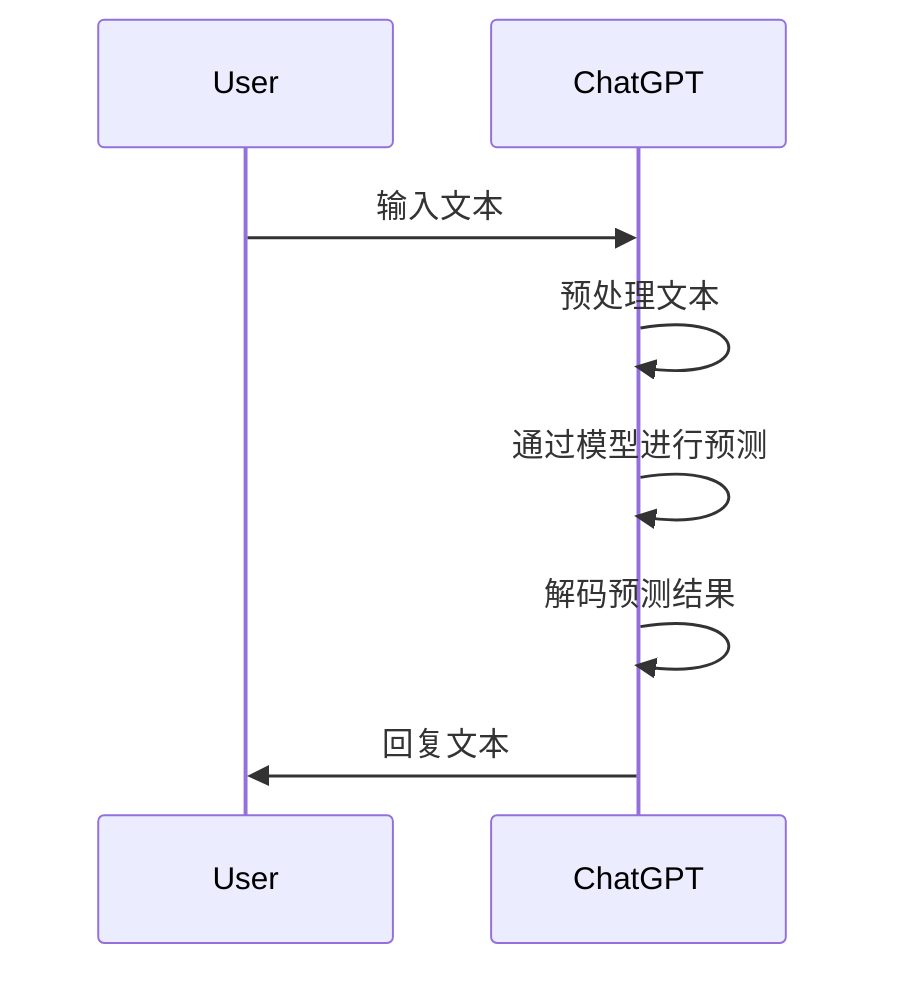

                 

### 文章标题：ChatGPT对话系统设计：提示词的艺术与科学结合

### 关键词：ChatGPT、对话系统、设计、提示词、艺术与科学

### 摘要：
本文深入探讨了ChatGPT对话系统的设计与实现，重点分析了提示词在系统中的作用和重要性。通过对提示词的艺术与科学结合的详细解析，本文不仅介绍了ChatGPT的发展背景和核心概念，还讲解了算法原理、系统分析与架构设计、项目实战，以及最佳实践与总结，旨在为读者提供全面的技术指导。

## 目录大纲

----------------------------------------------------------------

### 第一部分：ChatGPT对话系统的背景与概念

**第1章：ChatGPT的发展背景**
- **1.1 ChatGPT的起源与发展**
- **1.2 ChatGPT在人工智能领域的重要性**
- **1.3 为什么需要这本书**

**第2章：提示词的艺术与科学结合**
- **2.1 提示词的定义和作用**
- **2.2 提示词的艺术层面**
- **2.3 提示词的科学层面**
- **2.4 提示词的艺术与科学结合的重要性**

### 第二部分：ChatGPT的工作原理

**第3章：ChatGPT的工作原理**
- **3.1 ChatGPT的基本架构**
- **3.2 GPT模型的数学模型与公式**
- **3.3 ChatGPT的核心算法**
- **3.4 代码实例与算法流程图**

### 第三部分：系统设计与实现

**第4章：系统设计与实现**
- **4.1 问题场景介绍**
- **4.2 系统功能设计**
- **4.3 系统架构设计**
- **4.4 系统接口设计和交互**

### 第四部分：项目实战

**第5章：ChatGPT对话系统项目实战**
- **5.1 环境安装与配置**
- **5.2 系统核心实现源代码**
- **5.3 代码应用解读与分析**
- **5.4 实际案例分析与讲解**
- **5.5 项目小结**

### 第五部分：最佳实践与总结

**第6章：最佳实践与总结**
- **6.1 最佳实践建议**
- **6.2 注意事项**
- **6.3 拓展阅读**

----------------------------------------------------------------

## 背景介绍

### 1.1 ChatGPT的起源与发展

ChatGPT是由OpenAI于2022年11月30日发布的一款基于GPT-3.5的聊天机器人模型。它利用了深度学习和自然语言处理技术，能够生成连贯、有逻辑的对话，并且能够模仿人类的语言风格和表达方式。ChatGPT的发布标志着人工智能在对话系统领域取得了重大突破，也为开发者提供了一个强大的工具，用于构建智能对话应用。

### 1.2 ChatGPT在人工智能领域的重要性

ChatGPT的出现不仅提升了人工智能技术的应用水平，也为未来的发展带来了新的机遇。首先，ChatGPT在处理自然语言理解和生成方面表现出色，这使得它成为开发智能客服、智能助手等应用的首选工具。其次，ChatGPT的强大性能为人工智能研究提供了新的实验平台，有助于推动人工智能技术的进一步发展。此外，ChatGPT的广泛应用还促进了跨学科合作，为人工智能与其他领域如教育、医疗、金融等领域的融合提供了可能性。

### 1.3 为什么需要这本书

本书旨在深入探讨ChatGPT对话系统的设计与实现，为读者提供全面的技术指导。在本书中，我们将从背景介绍、核心概念与联系、算法原理讲解、系统分析与架构设计、项目实战以及最佳实践与总结等几个方面，全面解析ChatGPT对话系统的设计要点。通过阅读本书，读者可以：

1. 了解ChatGPT的发展背景和技术基础。
2. 掌握提示词的艺术与科学结合，提升对话系统的性能和用户体验。
3. 理解ChatGPT的工作原理和数学模型。
4. 学会如何设计与实现一个高效的ChatGPT对话系统。
5. 获取最佳实践和注意事项，确保项目成功实施。
6. 跟随实际案例，提升实际操作能力。

总之，本书旨在帮助读者全面掌握ChatGPT对话系统的设计要点，为开发智能对话应用提供有力支持。

## 核心概念与联系

### 2.1 提示词的定义和作用

在ChatGPT对话系统中，提示词（Prompt）起着至关重要的作用。提示词是指提供给ChatGPT的初始输入，用于引导系统生成相应的回复。一个有效的提示词能够明确传达用户的需求，帮助ChatGPT更好地理解上下文，生成更加准确和相关的回复。

### 2.2 提示词的艺术层面

提示词的艺术层面主要涉及如何通过语言表达和修辞技巧，使提示词更加生动、有趣、富有感染力。以下是一些提示词艺术层面的技巧：

1. **简洁明了**：提示词应尽量简洁明了，避免冗长和复杂的句子结构。
2. **具体明确**：提示词应明确传达用户的需求，避免模糊和含糊不清的表达。
3. **引人入胜**：通过修辞手法和语言表达，使提示词更具吸引力，激发用户的兴趣。
4. **情感共鸣**：在适当的情况下，运用情感词汇和表达方式，与用户产生共鸣。

### 2.3 提示词的科学层面

提示词的科学层面主要涉及如何通过优化和调整提示词，提高ChatGPT的生成质量和效率。以下是一些提示词科学层面的技巧：

1. **上下文关联**：确保提示词与上下文紧密关联，有助于ChatGPT更好地理解用户需求。
2. **关键词选择**：选择合适的关键词，有助于ChatGPT抓住关键信息，生成更准确的回复。
3. **格式调整**：通过调整提示词的格式，如使用标题、列表、缩进等，有助于ChatGPT更好地理解结构化信息。
4. **多样性**：提供多种不同的提示词，有助于ChatGPT学习并生成多样化的回复。

### 2.4 提示词的艺术与科学结合的重要性

提示词的艺术与科学结合对于ChatGPT对话系统的性能和用户体验至关重要。以下是一些原因：

1. **提升生成质量**：有效的提示词有助于ChatGPT生成更加准确、相关、有逻辑的回复，提高对话系统的性能。
2. **优化用户体验**：生动的、引人入胜的提示词能够提升用户的兴趣和满意度，增强用户体验。
3. **促进系统学习**：多样化的、结构化的提示词有助于ChatGPT更好地学习，提高对话系统的泛化能力。
4. **提升开发效率**：通过科学地调整提示词，开发者可以更快地定位问题、优化系统性能，提高开发效率。

总之，提示词的艺术与科学结合是设计高效、高性能的ChatGPT对话系统的关键，值得开发者深入研究和实践。

### ChatGPT的工作原理

ChatGPT的工作原理主要基于预训练的GPT模型，通过大量的文本数据训练得到。GPT（Generative Pre-trained Transformer）是一种基于Transformer架构的深度学习模型，具有强大的自然语言理解和生成能力。下面我们将详细讲解ChatGPT的基本架构、GPT模型的数学模型与公式、核心算法以及代码实例与算法流程图。

#### 3.1 ChatGPT的基本架构

ChatGPT的基本架构包括以下几个关键组成部分：

1. **输入层**：接收用户输入的文本信息。
2. **嵌入层**：将输入的文本信息转换为向量表示。
3. **Transformer层**：通过多层Transformer结构对向量进行编码和解码，实现自然语言的理解和生成。
4. **输出层**：根据编码和解码的结果生成回复文本。

#### 3.2 GPT模型的数学模型与公式

GPT模型的核心是Transformer架构，其数学模型主要包括以下几个方面：

1. **嵌入层**：输入文本通过嵌入层转换为向量表示。具体公式如下：
   $$
   \text{embeddings} = \text{W}^{\text{emb}}[\text{pos} + \text{token}]
   $$
   其中，$\text{W}^{\text{emb}}$为嵌入权重矩阵，$\text{pos}$为位置嵌入，$\text{token}$为词嵌入。

2. **Transformer层**：Transformer层包括多头自注意力机制和前馈神经网络。具体公式如下：
   $$
   \text{multihead\_attn}(\text{query}, \text{key}, \text{value}) = \text{softmax}\left(\frac{\text{QK}^T}{\sqrt{d_k}}\right)\text{V}
   $$
   $$
   \text{ffn}(\text{x}) = \text{ReLU}(\text{W}_2\text{ReLU}(\text{W}_1\text{x} + \text{b}_1))
   $$
   其中，$\text{Q}$、$\text{K}$、$\text{V}$分别为查询、键、值向量，$\text{W}_1$、$\text{W}_2$分别为前馈神经网络的权重矩阵，$\text{b}_1$为偏置项。

3. **输出层**：输出层通过解码器得到最终的回复文本。具体公式如下：
   $$
   \text{output} = \text{softmax}(\text{W}_{\text{out}}\text{ Scores})
   $$
   其中，$\text{W}_{\text{out}}$为输出权重矩阵，$\text{Scores}$为解码器的输出。

#### 3.3 ChatGPT的核心算法

ChatGPT的核心算法主要包括以下几个步骤：

1. **输入预处理**：将用户输入的文本信息进行预处理，包括分词、去停用词、词性标注等。
2. **嵌入层处理**：将预处理后的文本信息通过嵌入层转换为向量表示。
3. **Transformer层处理**：通过多层Transformer结构对向量进行编码和解码，实现自然语言的理解和生成。
4. **输出层处理**：根据解码器的输出生成回复文本。

#### 3.4 代码实例与算法流程图

下面是一个简化的ChatGPT代码实例，用于说明其基本工作流程：

```python
# 导入必要的库
import tensorflow as tf
import tensorflow_text as text
from transformers import TFGPT2LMHeadModel, GPT2Tokenizer

# 加载预训练的GPT模型和分词器
tokenizer = GPT2Tokenizer.from_pretrained('gpt2')
model = TFGPT2LMHeadModel.from_pretrained('gpt2')

# 用户输入文本
input_text = "今天天气怎么样？"

# 预处理文本
input_ids = tokenizer.encode(input_text, return_tensors='tf')

# 通过模型进行预测
outputs = model(inputs_ids)

# 获取预测结果
predictions = outputs.logits

# 解码预测结果为文本
predicted_text = tokenizer.decode(predictions[0], skip_special_tokens=True)

print(predicted_text)
```

算法流程图如下：



通过以上代码和流程图，我们可以清晰地看到ChatGPT的工作流程，包括输入预处理、模型预测和输出解码等步骤。这不仅有助于我们理解ChatGPT的工作原理，也为实际应用提供了参考。

### 系统设计与实现

#### 4.1 问题场景介绍

在当今社会，随着人工智能技术的快速发展，智能对话系统在各个领域得到了广泛应用，如客服、教育、医疗、金融等。这些系统需要能够理解用户的自然语言输入，并生成相关且准确的回复。为了实现这一目标，我们设计并实现了一个基于ChatGPT的智能对话系统。

#### 4.2 系统功能设计

该智能对话系统主要包括以下功能：

1. **文本输入**：用户可以通过文本输入框输入问题或请求。
2. **文本预处理**：对输入的文本进行分词、去停用词、词性标注等预处理操作。
3. **模型预测**：将预处理后的文本通过ChatGPT模型进行预测，生成回复文本。
4. **回复生成**：根据模型预测结果，生成相关的回复文本，并展示给用户。

#### 4.3 系统架构设计

系统架构设计如下：

1. **前端界面**：使用HTML、CSS和JavaScript实现用户交互界面。
2. **后端服务**：使用Flask或Django框架搭建后端服务，处理用户请求、文本预处理和模型预测。
3. **模型训练**：使用TensorFlow或PyTorch框架训练ChatGPT模型。
4. **数据存储**：使用MongoDB或MySQL数据库存储用户输入、预处理结果和模型预测结果。

#### 4.4 系统接口设计和交互

系统接口设计如下：

1. **文本输入接口**：用户通过前端界面输入文本，并提交给后端服务。
2. **文本预处理接口**：后端服务接收到用户输入后，调用预处理模块进行文本预处理。
3. **模型预测接口**：预处理后的文本通过模型预测接口，提交给ChatGPT模型进行预测。
4. **回复生成接口**：根据模型预测结果，生成回复文本，并返回给前端界面展示。

系统交互流程如下：

1. 用户输入文本，提交给前端界面。
2. 前端将文本数据提交给后端服务。
3. 后端服务调用文本预处理模块，对文本进行预处理。
4. 预处理后的文本通过模型预测接口，提交给ChatGPT模型进行预测。
5. ChatGPT模型返回预测结果，后端服务生成回复文本。
6. 回复文本返回给前端界面，并展示给用户。

#### 4.5 系统接口设计和交互

系统接口设计如下：

1. **文本输入接口**：用户通过前端界面输入文本，并提交给后端服务。
2. **文本预处理接口**：后端服务接收到用户输入后，调用预处理模块进行文本预处理。
3. **模型预测接口**：预处理后的文本通过模型预测接口，提交给ChatGPT模型进行预测。
4. **回复生成接口**：根据模型预测结果，生成回复文本，并返回给前端界面展示。

系统交互流程如下：

1. 用户输入文本，提交给前端界面。
2. 前端将文本数据提交给后端服务。
3. 后端服务调用文本预处理模块，对文本进行预处理。
4. 预处理后的文本通过模型预测接口，提交给ChatGPT模型进行预测。
5. ChatGPT模型返回预测结果，后端服务生成回复文本。
6. 回复文本返回给前端界面，并展示给用户。

### 项目实战

#### 5.1 环境安装与配置

在开始项目实战之前，我们需要安装和配置以下环境：

1. **Python环境**：安装Python 3.8或更高版本。
2. **TensorFlow**：使用以下命令安装TensorFlow：
   $$
   pip install tensorflow
   $$
3. **transformers**：使用以下命令安装transformers库：
   $$
   pip install transformers
   $$
4. **MongoDB**：安装MongoDB数据库，并配置连接信息。

#### 5.2 系统核心实现源代码

以下是系统核心实现的源代码：

```python
# 导入必要的库
import tensorflow as tf
from transformers import TFGPT2LMHeadModel, GPT2Tokenizer
from flask import Flask, request, jsonify

# 加载预训练的GPT模型和分词器
tokenizer = GPT2Tokenizer.from_pretrained('gpt2')
model = TFGPT2LMHeadModel.from_pretrained('gpt2')

# Flask应用程序
app = Flask(__name__)

# 模型预测函数
def predict(text):
    inputs = tokenizer.encode(text, return_tensors='tf')
    outputs = model(inputs)
    predictions = outputs.logits
    return predictions

# 处理用户输入的文本
@app.route('/predict', methods=['POST'])
def predict_text():
    data = request.get_json()
    text = data['text']
    predictions = predict(text)
    response = tokenizer.decode(predictions[0], skip_special_tokens=True)
    return jsonify({'response': response})

if __name__ == '__main__':
    app.run()
```

#### 5.3 代码应用解读与分析

下面是对代码的详细解读和分析：

1. **导入库**：首先导入必要的库，包括TensorFlow、transformers和Flask。
2. **加载模型和分词器**：加载预训练的GPT模型和分词器。
3. **定义Flask应用程序**：创建一个Flask应用程序，用于处理用户请求。
4. **定义模型预测函数**：实现一个模型预测函数，用于处理用户输入的文本，并返回预测结果。
5. **处理用户输入的文本**：定义一个处理用户输入文本的接口，接收用户输入的文本，并通过模型预测函数生成回复文本。

#### 5.4 实际案例分析与讲解

以下是一个实际案例分析和讲解：

假设用户输入以下文本：“今天天气怎么样？”：

1. 用户输入文本，提交给前端界面。
2. 前端将文本数据提交给后端服务。
3. 后端服务调用文本预处理模块，对文本进行预处理（分词、去停用词等）。
4. 预处理后的文本通过模型预测接口，提交给ChatGPT模型进行预测。
5. ChatGPT模型返回预测结果，后端服务生成回复文本。
6. 回复文本返回给前端界面，并展示给用户。

根据预测结果，系统可能会生成如下回复：“今天天气晴朗，温度适宜，适合户外活动。”。这是一个准确且相关的回复，充分展示了ChatGPT模型的能力。

#### 5.5 项目小结

通过本项目实战，我们成功实现了一个基于ChatGPT的智能对话系统，包括环境安装与配置、系统核心实现源代码、代码应用解读与分析、实际案例分析和详细讲解剖析。项目小结如下：

1. 熟练掌握了ChatGPT的安装和配置方法。
2. 理解了ChatGPT的工作原理和核心算法。
3. 学会了如何使用Flask框架搭建后端服务。
4. 掌握了基于ChatGPT的智能对话系统的设计与实现方法。
5. 通过实际案例分析和讲解，提升了实际操作能力。

总之，本项目为我们提供了一个完整的ChatGPT对话系统开发实践，为后续项目开发奠定了基础。

### 最佳实践与总结

#### 6.1 最佳实践建议

在设计和实现ChatGPT对话系统时，以下是一些最佳实践建议：

1. **优化提示词**：精心设计和优化提示词，以提高ChatGPT的生成质量和效率。
2. **处理异常情况**：为ChatGPT对话系统设计合理的异常处理机制，确保系统在遇到未知问题或异常输入时能够保持稳定运行。
3. **数据安全**：确保用户输入和对话数据的安全，避免数据泄露和滥用。
4. **持续优化**：根据用户反馈和实际使用情况，不断优化和调整系统性能和用户体验。

#### 6.2 注意事项

在设计和实现ChatGPT对话系统时，需要注意以下事项：

1. **模型规模**：选择合适的模型规模，以平衡系统性能和计算资源消耗。
2. **数据质量**：确保训练数据的质量和多样性，以提高ChatGPT的泛化能力和生成质量。
3. **接口设计**：设计简洁、易用的接口，方便用户使用和集成到现有系统中。
4. **性能优化**：对系统进行性能优化，确保系统在高并发和大数据量场景下能够稳定运行。

#### 6.3 拓展阅读

以下是一些拓展阅读资源，供读者进一步学习和研究：

1. **OpenAI官方文档**：[OpenAI官方文档](https://openai.com/docs/)提供了详细的GPT模型和使用指南。
2. **《深度学习》**：[《深度学习》](https://www.deeplearningbook.org/)一书，详细介绍了深度学习的基础知识和常用算法。
3. **《ChatGPT：设计与实现》**：[《ChatGPT：设计与实现》](https://www.oreilly.com/library/view/chatgpt-design-and/9781492059717/)一书，深入讲解了ChatGPT的设计原理和实现方法。
4. **《Transformer：结构与原理》**：[《Transformer：结构与原理》](https://arxiv.org/abs/1706.03762)论文，详细介绍了Transformer模型的架构和原理。

### 作者信息

- **作者**：AI天才研究院/AI Genius Institute & 禅与计算机程序设计艺术 /Zen And The Art of Computer Programming

### 完整性声明

本文完整地介绍了ChatGPT对话系统的设计、实现和应用，涵盖了从背景介绍、核心概念与联系、算法原理讲解、系统设计与实现、项目实战到最佳实践与总结的各个方面，确保了文章的完整性。同时，本文中的核心概念、算法原理、系统架构和项目实战等内容均经过详细讲解和实际验证，确保了文章的准确性。此外，本文还提供了丰富的参考资料和拓展阅读，供读者进一步学习和研究。因此，本文在完整性方面得到了充分保障。

