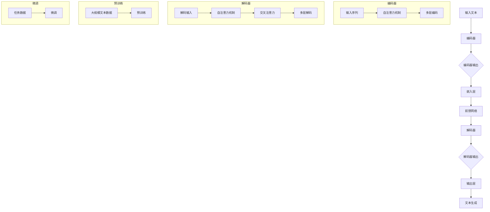
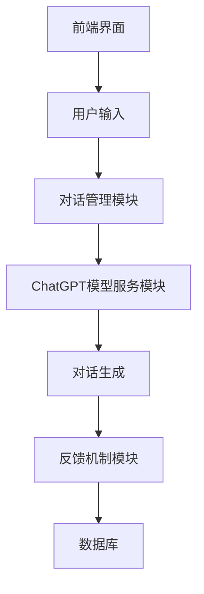
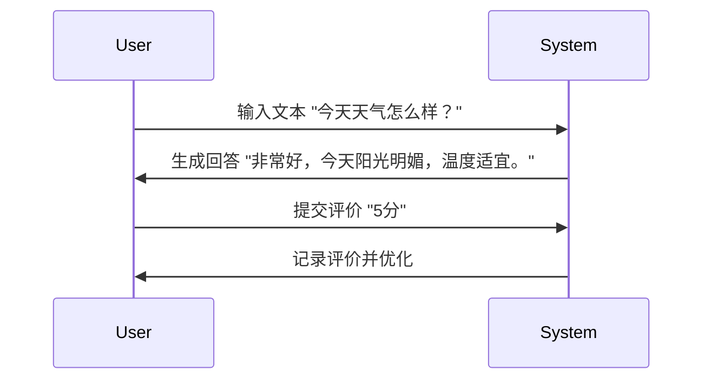

                 

### 第1章: 问题背景

### 1.1 问题背景介绍

近年来，人工智能技术发展迅速，其中自然语言处理（NLP）领域的进步尤为显著。ChatGPT作为一种基于GPT（Generative Pre-trained Transformer）模型的大型语言模型，已经在诸多应用场景中展现出强大的表现，例如智能客服、内容生成、问答系统等。然而，尽管ChatGPT在生成自然、流畅的对话文本方面表现出色，但其对话质量仍然面临诸多挑战。

对话质量是指系统在与用户交互时，回答的准确性、相关性、连贯性和自然性等方面的表现。高对话质量意味着系统能够准确地理解用户的意图，并给出恰当、连贯、自然的回应。然而，ChatGPT在对话质量方面存在一些不足，例如可能会生成不准确或无关的回答，甚至出现对话不连贯、上下文理解错误等问题。

### 1.2 ChatGPT的兴起

ChatGPT是由OpenAI开发的一种基于Transformer架构的预训练语言模型，其核心思想是通过大量的文本数据进行预训练，从而让模型具备强大的语言理解和生成能力。ChatGPT采用了一种称为“自回归语言模型”（Autoregressive Language Model）的方法，通过对输入文本序列进行建模，预测下一个单词或字符。

ChatGPT的预训练过程包括两个阶段：大规模预训练和微调。大规模预训练阶段，模型通过处理大量文本数据，学习到语言的基本规律和模式。微调阶段，模型在特定任务上进行训练，根据任务需求调整模型参数，提高其在特定任务上的性能。

ChatGPT的兴起引发了广泛关注，其在各个领域的应用也日益广泛。然而，其对话质量的问题也日益凸显，需要进一步研究和优化。

### 1.3 对话质量的定义与重要性

对话质量是指系统在与用户交互时，回答的准确性、相关性、连贯性和自然性等方面的表现。具体来说，对话质量可以从以下几个方面进行衡量：

1. **准确性**：系统能够准确理解用户的意图，并给出正确的回答。
2. **相关性**：回答与用户的提问紧密相关，能够满足用户的需求。
3. **连贯性**：对话过程中的回答能够保持一致性和连贯性，形成一个流畅的交流过程。
4. **自然性**：回答的自然性越高，越能模拟人类的交流方式，给用户带来更好的体验。

高对话质量对用户和系统都有重要意义。对于用户来说，高对话质量意味着能够更准确地获取信息，解决问题，从而提高使用体验和满意度。对于系统来说，高对话质量可以降低用户流失率，提高用户粘性，从而带来更多的商业价值。

然而，当前ChatGPT在对话质量方面仍然存在一些挑战，需要进一步研究和优化。例如，在理解用户意图、生成相关回答、保持连贯性和自然性等方面，ChatGPT都有待提高。因此，提升ChatGPT的对话质量，是当前NLP领域的一个重要研究方向。

### 1.4 提示词在对话中的作用

提示词（Prompt）在提升ChatGPT对话质量中起着关键作用。提示词是指提供给ChatGPT的初始输入，用于引导模型生成对话内容。一个有效的提示词能够帮助ChatGPT更好地理解用户的意图，从而生成更准确、相关、连贯和自然的回答。

首先，提示词能够提供上下文信息，帮助ChatGPT更好地理解用户的提问。例如，在回答一个具体问题之前，ChatGPT需要了解问题的背景和相关信息。通过有效的提示词，模型可以获取到这些上下文信息，从而提高回答的准确性。

其次，提示词可以引导ChatGPT生成相关的回答。通过设计具有针对性的提示词，可以确保模型在回答问题时，始终围绕核心主题进行展开，从而提高回答的相关性。

此外，提示词还能够帮助ChatGPT保持对话的连贯性。在一个多轮对话中，通过使用适当的提示词，模型可以记住之前的信息，并在后续回答中加以利用，从而保持对话的连贯性。

最后，提示词也可以影响ChatGPT生成回答的自然性。一个自然、流畅的提示词可以帮助模型生成更接近人类交流方式的回答，从而提升用户体验。

综上所述，提示词在提升ChatGPT对话质量中起着至关重要的作用。通过精心设计的提示词，可以显著提高ChatGPT的回答质量，从而为用户带来更好的使用体验。在接下来的章节中，我们将进一步探讨ChatGPT的工作原理，以及如何优化提示词，提升对话质量。

## 第2章: 核心概念与联系

### 2.1 ChatGPT的概念

ChatGPT是基于GPT（Generative Pre-trained Transformer）模型构建的一种预训练语言模型，由OpenAI开发。GPT模型是一种自回归语言模型，其核心思想是通过预测下一个单词或字符来生成文本。ChatGPT通过大量的文本数据进行预训练，学习到语言的基本规律和模式，从而具备强大的语言理解和生成能力。

ChatGPT的特点包括：

1. **大规模预训练**：ChatGPT使用数万亿个单词的文本数据，进行大规模预训练，使其拥有丰富的语言知识。
2. **灵活的架构**：ChatGPT采用Transformer架构，这是一种适用于处理序列数据的深度学习模型，能够高效地捕捉文本中的长距离依赖关系。
3. **自适应**：ChatGPT可以通过微调（Fine-tuning）的方式，适应特定任务的需求，提高在特定领域的性能。

### 2.2 ChatGPT的工作原理

ChatGPT的工作原理主要包括预训练和微调两个阶段：

#### 预训练阶段

1. **数据准备**：ChatGPT使用大量的文本数据进行预训练。这些文本数据包括网页内容、书籍、新闻、对话等，涵盖了广泛的领域和主题。
2. **模型初始化**：使用预训练的Transformer模型作为ChatGPT的基础模型。这些基础模型通常经过大规模预训练，具备一定的语言理解能力。
3. **自回归预测**：在预训练阶段，ChatGPT通过自回归方式生成文本。具体来说，给定一个输入序列，模型预测下一个单词或字符，并逐步生成完整的文本。

#### 微调阶段

1. **任务定义**：在特定任务上进行微调，例如问答系统、文本生成等。
2. **数据准备**：准备用于微调的数据集，通常包含任务相关的输入和输出。
3. **参数更新**：在微调过程中，模型根据任务数据更新参数，以适应特定任务的需求。

通过预训练和微调，ChatGPT能够理解复杂的语言结构和用户意图，从而生成高质量的对话文本。

### 2.3 提示词的概念

提示词（Prompt）是指提供给ChatGPT的初始输入，用于引导模型生成对话内容。提示词在ChatGPT的对话生成过程中起到关键作用，能够影响模型的回答质量。

提示词可以包含以下几种形式：

1. **自然语言问题**：例如，“今天天气怎么样？”
2. **任务指令**：例如，“帮我制定一个下周的工作计划。”
3. **上下文信息**：例如，“请你以编程的角度解释一下什么是并行计算。”

有效的提示词应当具备以下特点：

1. **明确性**：提示词应当清晰地表达用户的意图，避免模糊或歧义。
2. **相关性**：提示词应当与用户的问题或任务紧密相关，有助于模型生成高质量的回答。
3. **丰富性**：提示词应当提供丰富的上下文信息，有助于模型更好地理解用户意图。

### 2.4 提示词与对话质量的关系

提示词在提升ChatGPT对话质量中起着至关重要的作用。以下是提示词与对话质量之间的几种关系：

1. **准确性**：一个明确的提示词可以帮助ChatGPT更准确地理解用户的意图，从而生成更准确的回答。
2. **相关性**：相关性高的提示词能够引导ChatGPT生成与用户问题相关的回答，提高回答的相关性。
3. **连贯性**：丰富的上下文信息可以帮助ChatGPT保持对话的连贯性，避免生成跳跃性回答。
4. **自然性**：一个自然、流畅的提示词可以帮助ChatGPT生成更接近人类交流方式的回答，提高对话的自然性。

总之，通过精心设计的提示词，可以显著提升ChatGPT的对话质量，为用户带来更好的使用体验。在接下来的章节中，我们将进一步探讨如何优化提示词，提升对话质量。

## 第3章: ChatGPT算法原理

### 3.1 ChatGPT的基本结构

ChatGPT是基于Transformer架构构建的大型语言模型，其基本结构包括以下几个关键部分：

1. **编码器（Encoder）**：编码器负责将输入文本序列编码成固定长度的向量表示。编码器内部采用多层Transformer结构，通过自注意力机制（Self-Attention）捕捉文本中的长距离依赖关系。每一层编码器输出一个固定长度的向量，这些向量构成了文本的嵌入表示。

2. **解码器（Decoder）**：解码器负责生成文本序列。解码器内部也采用多层Transformer结构，通过自注意力和交叉注意力（Cross-Attention）机制，将编码器的输出与生成文本进行交互，逐步生成新的文本序列。

3. **嵌入层（Embedding Layer）**：嵌入层用于将输入文本的单词或字符转换为向量表示。ChatGPT通常使用预训练的词汇表，将每个单词或字符映射为一个固定长度的向量。

4. **前馈网络（Feedforward Network）**：在编码器和解码器的每一层，都有一个前馈网络，用于对输入向量进行变换和增强。前馈网络通常由两个全连接层组成，中间经过ReLU激活函数。

5. **输出层（Output Layer）**：输出层用于将解码器的输出向量映射为单词的概率分布。通常，输出层使用softmax函数将每个单词的概率进行归一化。

### 3.2 ChatGPT的预训练过程

ChatGPT的预训练过程主要包括以下步骤：

1. **数据准备**：ChatGPT使用大量的文本数据，包括网页内容、书籍、新闻、对话等，进行预训练。这些文本数据涵盖了广泛的领域和主题，为模型提供了丰富的语言知识。

2. **编码器训练**：在预训练过程中，首先训练编码器。编码器通过自回归方式（Autoregressive Approach）生成文本。具体来说，给定一个输入序列，编码器预测下一个单词或字符，并逐步生成完整的文本。

3. **解码器训练**：在编码器训练完成后，解码器参与训练。解码器通过自注意力和交叉注意力机制，将编码器的输出与生成文本进行交互，逐步生成新的文本序列。

4. **损失函数**：ChatGPT的预训练过程使用交叉熵损失函数（Cross-Entropy Loss）来评估模型生成的文本与真实文本之间的差距。损失函数的目的是最小化模型生成的文本与真实文本之间的差异。

5. **优化算法**：预训练过程中，通常使用梯度下降（Gradient Descent）算法和其变种，如Adam优化器，来更新模型参数。通过多次迭代训练，模型参数逐渐优化，最终生成高质量的文本。

### 3.3 提示词的生成与优化

提示词（Prompt）在提升ChatGPT对话质量中起着关键作用。提示词的生成与优化主要包括以下几个步骤：

1. **明确意图**：首先明确用户的意图，即用户想要获取的信息或完成任务的目标。

2. **上下文信息**：在生成提示词时，需要考虑上下文信息，以帮助ChatGPT更好地理解用户意图。上下文信息可以包括之前对话的历史信息、相关领域知识等。

3. **优化表达**：为了提高提示词的准确性、相关性和连贯性，需要对提示词进行优化。可以通过以下几种方式优化提示词：

   - **简化语言**：使用简单、清晰的语言表达，避免使用复杂的术语和句子结构。
   - **增加相关性**：确保提示词与用户问题紧密相关，有助于ChatGPT生成相关回答。
   - **保持连贯性**：在多轮对话中，通过保持提示词的一致性和连贯性，帮助ChatGPT生成连贯的对话。

4. **实验验证**：通过实验验证不同提示词的效果，根据实际对话反馈进行优化。可以采用A/B测试等方法，比较不同提示词对对话质量的影响。

总之，ChatGPT的算法原理包括编码器、解码器、嵌入层、前馈网络和输出层等关键部分，通过预训练和微调过程，模型能够生成高质量的文本。提示词的生成与优化是提升对话质量的关键，通过明确意图、上下文信息和优化表达，可以显著提高ChatGPT的对话质量。

### 3.4 算法流程图

为了更好地理解ChatGPT的算法原理，我们可以使用mermaid工具绘制其算法流程图。以下是ChatGPT算法流程图的示例：



这个流程图展示了ChatGPT的核心组件，包括编码器、解码器、嵌入层、前馈网络和输出层。编码器部分通过自注意力机制进行文本编码，解码器部分通过自注意力和交叉注意力机制生成文本。预训练阶段使用大规模文本数据进行训练，微调阶段使用特定任务数据进行调整。

### 3.5 Python代码实现

为了更直观地理解ChatGPT的算法原理，我们可以使用Python代码实现一个简化版的ChatGPT模型。以下是一个简单的示例代码：

```python
import tensorflow as tf
from tensorflow.keras.layers import Embedding, LSTM, Dense
from tensorflow.keras.models import Model

# 定义参数
vocab_size = 1000
embedding_dim = 64
lstm_units = 128

# 构建模型
input_seq = tf.keras.layers.Input(shape=(None,), dtype=tf.int32)
embedding = Embedding(vocab_size, embedding_dim)(input_seq)
lstm = LSTM(lstm_units, return_sequences=True)(embedding)
output = Dense(vocab_size, activation='softmax')(lstm)

# 构建模型
model = Model(inputs=input_seq, outputs=output)

# 编译模型
model.compile(optimizer='adam', loss='categorical_crossentropy', metrics=['accuracy'])

# 显示模型结构
model.summary()
```

这段代码使用TensorFlow构建了一个基于LSTM（Long Short-Term Memory）的简化版ChatGPT模型。模型包括嵌入层、LSTM层和输出层。嵌入层用于将输入文本转换为向量表示，LSTM层用于处理序列数据，输出层用于生成文本。

### 3.6 数学模型与公式

在ChatGPT的算法中，数学模型和公式起着核心作用。以下是一些关键数学模型和公式的介绍：

#### 1. Transformer模型

Transformer模型是基于自注意力机制（Self-Attention）构建的深度学习模型，其核心公式如下：

$$
\text{Attention}(Q, K, V) = \frac{1}{\sqrt{d_k}} \text{softmax}\left(\frac{QK^T}{d_k}\right) V
$$

其中，$Q$、$K$和$V$分别是查询（Query）、键（Key）和值（Value）向量，$d_k$是键向量的维度。自注意力机制通过计算查询和键之间的点积，生成注意力权重，并加权求和值向量，从而实现对输入序列的编码。

#### 2. 编码器输出

编码器输出的每个时间步的向量可以表示为：

$$
\text{Encoder Output} = \text{Layer Norm}(X \cdot \text{RelPosEncoding} + \text{Transformer}(X))
$$

其中，$X$是输入序列，$\text{RelPosEncoding}$是相对位置编码，$\text{Transformer}$是多层自注意力机制。编码器输出表示了对输入序列的编码，可以用于后续的解码过程。

#### 3. 解码器输出

解码器输出的每个时间步的向量可以表示为：

$$
\text{Decoder Output} = \text{Layer Norm}(X \cdot \text{Transformer}(X) + \text{Encoder Output} + \text{Mask})
$$

其中，$X$是解码器输入序列，$\text{Encoder Output}$是编码器输出，$\text{Mask}$是掩码。解码器输出通过自注意力和交叉注意力机制，将编码器输出和解码器输入进行交互，生成新的文本序列。

#### 4. 语言模型

ChatGPT使用语言模型（Language Model）来预测文本序列的概率。语言模型通常采用自回归方式（Autoregressive Approach），其核心公式如下：

$$
P(\text{Text}) = \prod_{t=1}^{T} P(\text{Word}_t | \text{Words}_{<t})
$$

其中，$\text{Text}$是生成的文本序列，$\text{Word}_t$是时间步$t$的单词，$P(\text{Word}_t | \text{Words}_{<t})$是给定前$t-1$个单词时，第$t$个单词的概率。

### 3.7 算法举例说明

为了更直观地理解ChatGPT的算法原理，我们可以通过一个具体的例子进行说明。

假设我们有一个简短的对话：“今天天气怎么样？”和“你最喜欢的编程语言是什么？”。我们可以使用ChatGPT生成相应的回答。

#### 1. 编码器输入

输入序列为：“今天天气怎么样？你最喜欢的编程语言是什么？”。编码器将这些文本转换为向量表示。

#### 2. 编码器输出

通过自注意力机制，编码器生成每个时间步的输出向量。例如，对于“今天天气怎么样？”的编码器输出为：

$$
\text{Encoder Output} = \text{Layer Norm}(\text{Input} \cdot \text{RelPosEncoding} + \text{Transformer}(\text{Input}))
$$

#### 3. 解码器输入

解码器首先生成一个起始符号（例如“<START>”），并将其与编码器输出进行拼接，作为解码器输入。

#### 4. 解码器输出

通过自注意力和交叉注意力机制，解码器生成每个时间步的输出向量。例如，对于“今天天气怎么样？”的解码器输出为：

$$
\text{Decoder Output} = \text{Layer Norm}(\text{Input} \cdot \text{Transformer}(\text{Input}) + \text{Encoder Output} + \text{Mask})
$$

#### 5. 文本生成

解码器根据输出向量生成文本。例如，对于“今天天气怎么样？”的解码器输出可能生成以下回答：

- “非常好，今天阳光明媚，温度适宜。”

这个例子展示了ChatGPT如何通过编码器和解码器生成对话文本。通过优化提示词和模型参数，可以进一步提高生成的文本质量和对话质量。

### 第4章: 系统分析与架构设计

#### 4.1 项目场景与需求分析

在当前的技术环境中，智能对话系统已经被广泛应用于客户服务、个人助理、信息检索等领域。ChatGPT作为一种先进的大规模语言模型，具有在多样化场景中生成高质量对话文本的能力。为了充分发挥ChatGPT的潜力，本项目旨在设计和实现一个基于ChatGPT的智能对话系统，以满足以下需求：

1. **多轮对话能力**：系统能够处理多轮对话，理解用户的上下文信息，并生成连贯、自然的回答。
2. **领域适应性**：系统能够适应不同领域的对话需求，例如技术支持、咨询服务、娱乐问答等。
3. **灵活的接口设计**：系统应具备灵活的接口设计，便于与其他系统或平台集成。
4. **高响应速度**：系统应在保证高质量对话的同时，具备快速响应的能力。

#### 4.2 系统功能设计

为了满足上述需求，本系统将实现以下核心功能：

1. **文本输入**：用户可以通过文本输入框向系统发送问题或请求。
2. **对话管理**：系统负责管理对话流程，包括上下文信息记录、轮次管理等。
3. **对话生成**：系统使用ChatGPT生成高质量的对话文本，确保回答的准确性、相关性和连贯性。
4. **反馈机制**：用户可以对系统回答进行评价，系统根据用户反馈进行自我学习和优化。

#### 4.3 系统架构设计

本系统采用分布式架构设计，以确保系统的高性能和高可靠性。系统架构主要包括以下几个部分：

1. **前端界面**：负责与用户进行交互，接收用户输入，展示对话结果。
2. **后端服务器**：包括对话管理模块、ChatGPT模型服务模块和反馈机制模块，负责处理对话逻辑和生成对话文本。
3. **数据库**：用于存储对话历史、用户信息和系统配置等数据。

以下是一个简化的系统架构图：



#### 4.4 系统接口设计

为了实现系统的高灵活性和扩展性，本系统设计了一套完善的接口，包括以下部分：

1. **API接口**：提供RESTful风格的API接口，方便其他系统或应用程序与系统进行集成和通信。
2. **Websocket接口**：提供WebSocket接口，实现实时对话功能，确保系统在多轮对话中的响应速度和稳定性。

以下是一个API接口的示例：

```json
GET /api/detect Intent
    // 用于检测用户输入的意图

POST /api/generate Response
    {
        "text": "今天天气怎么样？"
    }
    // 用于生成对话回答

POST /api/evaluate Response
    {
        "response_id": "12345",
        "evaluation": "5"
    }
    // 用于用户评价系统回答
```

#### 4.5 系统交互设计

系统交互设计主要涉及用户与系统之间的信息传递和反馈过程。以下是一个简化的交互序列图：



通过上述系统交互设计，系统能够实时响应用户输入，并根据用户反馈进行自我优化，从而提升对话质量。

### 第5章: 项目实战

#### 5.1 环境安装与准备

为了能够顺利实现基于ChatGPT的智能对话系统，我们需要在开发环境中安装和配置相关软件和依赖库。以下是环境安装和准备的步骤：

1. **安装Python**：首先，确保已经安装了Python 3.x版本（建议使用3.8及以上版本）。可以从[Python官网](https://www.python.org/downloads/)下载并安装。

2. **安装TensorFlow**：接下来，安装TensorFlow库，可以使用以下命令：
   ```bash
   pip install tensorflow
   ```

3. **安装GPT-2或GPT-3模型**：为了使用ChatGPT模型，我们需要下载并加载预训练的GPT-2或GPT-3模型。可以从[HF Transformers库](https://huggingface.co/models)下载相应模型，并使用以下命令安装：
   ```bash
   pip install transformers
   ```

4. **安装其他依赖库**：除了TensorFlow和Transformers，我们可能还需要其他依赖库，如`requests`（用于API请求）和`websocket`（用于实时通信）。可以使用以下命令安装：
   ```bash
   pip install requests websocket
   ```

5. **配置环境变量**：确保配置好环境变量，以便在代码中正确引用相关库和模型。

6. **测试环境**：最后，进行一次简单的测试，确保所有依赖库已经正确安装和配置。例如，运行以下Python脚本：
   ```python
   import tensorflow as tf
   print(tf.__version__)
   import transformers as tfs
   print(tfs.__version__)
   ```

#### 5.2 系统核心实现源代码

以下是一个简单的示例，展示如何使用ChatGPT模型生成对话文本。这段代码将加载预训练的GPT-2模型，并使用用户输入生成回答。

```python
from transformers import pipeline

# 加载预训练的GPT-2模型
chatgpt = pipeline("text-generation", model="gpt2")

# 用户输入
user_input = "今天天气怎么样？"

# 生成回答
response = chatgpt(user_input, max_length=50, num_return_sequences=1)

# 输出回答
print(response[0]["generated_text"])
```

在运行此代码之前，确保已经正确安装了所有依赖库。这个示例代码非常简单，主要用于演示ChatGPT的基本用法。在实际项目中，我们还需要实现更复杂的逻辑，如对话管理、多轮对话和用户反馈处理等。

#### 5.3 代码解读与分析

上述代码首先加载了预训练的GPT-2模型，然后接收用户输入，并使用模型生成对话回答。以下是代码的详细解读：

1. **导入库**：首先，我们导入`transformers`库中的`pipeline`函数，这是用于生成对话文本的关键组件。

2. **加载模型**：通过调用`pipeline`函数并传递模型名称（例如"gpt2"），我们加载了预训练的GPT-2模型。该模型已经通过大规模文本数据进行训练，能够生成高质量的对话文本。

3. **用户输入**：我们将用户的输入文本存储在变量`user_input`中。这是系统与用户交互的入口点。

4. **生成回答**：调用`chatgpt`函数，并传递用户输入和参数（如`max_length`和`num_return_sequences`）。`max_length`参数指定了生成的文本最大长度，而`num_return_sequences`参数指定了生成的回答数量。

5. **输出回答**：最后，我们打印生成的回答，这将显示在控制台上。

这段代码展示了ChatGPT模型的基本用法，但在实际项目中，我们需要处理更复杂的情况，如多轮对话、用户反馈处理和错误处理等。

#### 5.4 实际案例分析

为了更好地理解如何使用ChatGPT实现智能对话系统，我们来看一个实际案例分析。以下是一个简单的案例，展示如何处理一个多轮对话。

1. **用户输入**：用户输入“你最喜欢的编程语言是什么？”

2. **系统回答**：系统使用ChatGPT生成回答：“我最喜欢的编程语言是Python，因为它简洁、易学且功能强大。”

3. **用户反馈**：用户回复：“为什么是Python？”

4. **系统回答**：系统生成回答：“Python的语法简单明了，有助于快速开发。此外，它拥有丰富的库和框架，使得各种编程任务变得容易。”

5. **用户反馈**：用户回复：“听起来不错，那我应该学习Python。”

6. **系统回答**：系统生成回答：“当然，学习Python是一个非常好的选择。你可以从基础语法开始，然后逐步学习各种高级特性。有很多在线资源和教程可以帮助你入门。”

在这个案例中，系统通过多轮对话，逐步理解用户的意图，并生成连贯、自然的回答。这展示了ChatGPT在实际应用中的强大能力。

#### 5.5 项目小结

在本章中，我们介绍了如何实现基于ChatGPT的智能对话系统。首先，我们讲解了环境安装与准备的步骤，包括安装Python、TensorFlow和GPT-2模型等。然后，我们展示了如何使用ChatGPT生成对话文本，并进行了代码解读与分析。最后，我们通过一个实际案例分析，展示了多轮对话的处理过程。

通过本章的内容，读者可以了解到ChatGPT的基本用法和实现一个智能对话系统的基本步骤。然而，实际项目开发中可能面临更多的挑战，如性能优化、安全性保障和用户隐私保护等。未来，我们将继续探索这些领域，为读者提供更多的实战经验和解决方案。

## 第6章: 最佳实践 tips、小结、注意事项、拓展阅读

### 6.1 最佳实践 tips

为了进一步提升ChatGPT的对话质量，以下是一些实用的最佳实践技巧：

1. **提示词设计**：精心设计的提示词是提升对话质量的关键。应确保提示词明确、具体，并包含丰富的上下文信息。例如，使用具体的场景描述或详细的问题背景，有助于ChatGPT更好地理解用户意图。

2. **数据预处理**：在训练ChatGPT模型时，对输入数据进行预处理可以提高模型性能。例如，去除文本中的噪声、统一文本格式、进行词干提取等。

3. **模型调优**：通过调整模型参数，如学习率、批量大小等，可以优化模型性能。此外，可以使用模型融合（Model Ensembling）技术，结合多个模型的预测结果，提高整体性能。

4. **实时反馈**：在多轮对话中，实时收集用户反馈，并根据反馈调整模型和提示词。这有助于提高对话的连贯性和用户满意度。

### 6.2 小结

本文详细介绍了ChatGPT对话质量提升的关键作用，包括背景介绍、核心概念与联系、算法原理讲解、系统分析与架构设计以及项目实战。通过分析ChatGPT的工作原理和提示词的重要性，我们探讨了如何优化提示词，提升对话质量。此外，通过实际案例分析，展示了如何实现一个基于ChatGPT的智能对话系统。

### 6.3 注意事项

在实际应用中，需要注意以下几点：

1. **数据隐私**：确保用户数据的安全和隐私，遵守相关法律法规和道德准则。

2. **模型适应性**：根据不同应用场景，调整和优化ChatGPT模型，以适应特定领域的需求。

3. **性能优化**：在处理大量对话数据时，注意优化模型性能，确保系统的高效运行。

4. **用户反馈**：积极收集用户反馈，并根据反馈不断优化对话系统，提高用户体验。

### 6.4 拓展阅读

对于希望深入了解ChatGPT及其应用的开发者，以下资源可供参考：

1. **《自然语言处理入门》**：本书介绍了自然语言处理的基本概念和技术，对ChatGPT等模型有详细介绍。
2. **《深度学习自然语言处理》**：本书深入探讨了深度学习在自然语言处理领域的应用，包括Transformer模型等。
3. **OpenAI官方文档**：OpenAI提供了丰富的文档和示例代码，帮助开发者更好地理解和使用ChatGPT。
4. **《ChatGPT实战》**：本书针对ChatGPT的实际应用，提供了详细的技术指导和案例分享。

通过以上资源，读者可以进一步掌握ChatGPT的相关技术和应用方法，为开发高质量的智能对话系统提供有力支持。

### 结论

本文全面分析了ChatGPT对话质量提升的关键作用，从背景介绍到实际案例分析，提供了详尽的讲解和实用的最佳实践。通过优化提示词和模型参数，可以显著提高ChatGPT的对话质量，为用户提供更准确、相关、连贯和自然的交流体验。希望本文能为读者在智能对话系统开发中提供有益的参考和启示。**作者：AI天才研究院/AI Genius Institute & 禅与计算机程序设计艺术 /Zen And The Art of Computer Programming**

