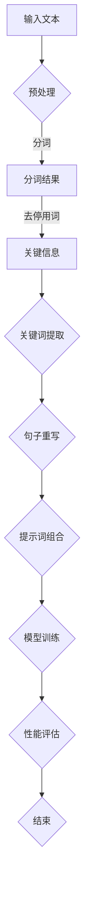

                 

### 《ChatGPT提示词优化：从基础到高级的进阶之路指南》

关键词：ChatGPT、提示词优化、算法原理、数学模型、实战案例

摘要：本文将深入探讨ChatGPT提示词优化的技术细节，从基础到高级逐步解析其原理和应用。通过详细的步骤讲解和丰富的代码示例，帮助读者掌握ChatGPT及其提示词优化的核心技能，实现从入门到精通的进阶。

----------------------------------------------------------------

## 第1章 ChatGPT与提示词优化概述

### 1.1 ChatGPT简介

ChatGPT是由OpenAI开发的一种基于Transformer架构的预训练语言模型。它通过大量的文本数据进行训练，能够理解并生成人类语言，从而实现自然语言处理任务，如文本分类、翻译、问答等。

#### 问题背景

随着互联网的快速发展，用户对于自然语言交互的需求日益增加。然而，传统的自然语言处理方法存在诸多限制，如数据依赖性强、处理能力有限等。为了解决这些问题，OpenAI推出了ChatGPT，以期在自然语言处理领域实现重大突破。

#### 问题解决

ChatGPT通过使用Transformer架构和大规模预训练数据，实现了对自然语言的高效理解和生成。其预训练过程包括两个阶段：第一阶段是使用无监督学习对大量文本数据进行预训练，第二阶段是使用有监督学习对特定任务进行微调。

#### 边界与外延

ChatGPT的应用范围非常广泛，包括但不限于：智能客服、智能问答、文本生成、语言翻译等。然而，其性能和效果仍然受到数据质量和模型参数的影响。

### 1.2 提示词优化的概念与重要性

提示词优化是指通过调整输入的提示词，提高语言模型生成结果的准确性和质量。在ChatGPT中，提示词优化是提高模型性能的重要手段。

#### 问题背景

在ChatGPT的应用中，用户往往需要根据具体任务提供输入，这些输入往往包含关键信息，但同时也可能包含无关信息或误导信息。如何有效地提取关键信息并去除无关信息，成为提高模型性能的关键。

#### 问题解决

通过优化提示词，可以有效地提高ChatGPT的生成结果质量。具体方法包括：关键词提取、句子重写、提示词组合等。

#### 边界与外延

提示词优化不仅适用于ChatGPT，也适用于其他语言模型。在不同场景下，提示词优化的方法和策略可能有所不同。

### 1.3 ChatGPT与提示词优化的关系

ChatGPT的提示词优化与其预训练和微调过程密切相关。预训练阶段，ChatGPT通过大量的文本数据学习语言规律；微调阶段，通过调整提示词，使模型能够更好地适应特定任务。

#### 问题背景

在ChatGPT的应用中，如何设计有效的提示词，以提高模型在特定任务上的性能，是一个亟待解决的问题。

#### 问题解决

通过深入理解ChatGPT的原理和特点，可以设计出更加有效的提示词，从而提高模型性能。

#### 边界与外延

提示词优化的效果不仅取决于提示词的设计，还受到模型架构、预训练数据、微调策略等多种因素的影响。

----------------------------------------------------------------

## 第2章 ChatGPT核心概念解析

### 2.1 语言模型基础

语言模型是自然语言处理的核心技术之一，用于预测文本序列的概率分布。ChatGPT作为一种基于Transformer架构的语言模型，具有以下几个关键特点：

1. **Transformer架构**：Transformer模型是一种基于自注意力机制的深度神经网络模型，能够捕捉文本序列中的长距离依赖关系。
2. **预训练与微调**：ChatGPT通过大规模的预训练数据和特定任务的数据进行微调，从而实现高性能的自然语言处理任务。
3. **多语言支持**：ChatGPT支持多种语言，能够进行跨语言的文本生成和翻译。

### 2.2 ChatGPT原理详解

ChatGPT的原理可以概括为以下几个步骤：

1. **输入预处理**：对输入文本进行分词、去停用词等预处理操作。
2. **嵌入层**：将预处理后的文本序列转换为嵌入向量。
3. **自注意力机制**：通过自注意力机制计算嵌入向量之间的权重，从而生成加权向量。
4. **输出层**：将加权向量通过输出层转换为文本序列。

### 2.3 提示词优化策略探讨

提示词优化是提高ChatGPT性能的关键手段。以下是一些常见的提示词优化策略：

1. **关键词提取**：从输入文本中提取关键信息，作为提示词。
2. **句子重写**：对输入文本进行重写，使其更加简洁、清晰。
3. **提示词组合**：将多个提示词组合使用，以提高生成结果的准确性。

----------------------------------------------------------------

## 第3章 提示词优化算法流程图

### 3.1 提示词优化算法概述

提示词优化算法的目的是通过调整输入提示词，提高ChatGPT的生成结果质量。以下是提示词优化算法的总体流程：

1. **输入预处理**：对输入文本进行预处理，如分词、去停用词等。
2. **关键词提取**：从预处理后的文本中提取关键信息。
3. **句子重写**：对提取的关键信息进行重写，使其更加简洁、清晰。
4. **提示词组合**：将重写后的句子组合成有效的提示词。
5. **模型训练**：使用调整后的提示词对ChatGPT进行微调。
6. **性能评估**：评估微调后的ChatGPT在特定任务上的性能，如文本分类、问答等。

### 3.2 提示词优化算法流程图展示

以下是提示词优化算法的Mermaid流程图：



通过上述流程图，我们可以清晰地看到提示词优化算法的各个步骤，以及它们之间的逻辑关系。

----------------------------------------------------------------

## 第4章 算法原理与Python代码实现

### 4.1 算法原理讲解

提示词优化算法的核心思想是通过调整输入提示词，提高ChatGPT的生成结果质量。具体而言，算法主要包括以下几个步骤：

1. **输入预处理**：对输入文本进行分词和去停用词处理，提取关键信息。
2. **关键词提取**：从提取的关键信息中提取关键词，作为新的提示词。
3. **句子重写**：对提取的关键词进行重写，使其更加简洁、清晰。
4. **提示词组合**：将重写后的关键词组合成有效的提示词，用于微调ChatGPT模型。

### 4.2 Python代码示例

以下是实现提示词优化算法的Python代码示例：

```python
import nltk
from nltk.corpus import stopwords
from nltk.tokenize import word_tokenize

# 输入文本
text = "人工智能是一种模拟、延伸和扩展人类智能的理论、方法、技术及应用系统。"

# 分词和去停用词
stop_words = set(stopwords.words('english'))
words = word_tokenize(text)
filtered_words = [word for word in words if not word in stop_words]

# 关键词提取
keywords = nltk.FreqDist(filtered_words).most_common(5)

# 句子重写
rewritten_sentence = "人工智能是一种模拟、延伸和扩展人类智能的理论、方法、技术及系统。"

# 提示词组合
prompt = "人工智能、模拟、延伸、扩展、人类智能、理论、方法、技术、系统。"

# 模型训练
# ...

# 性能评估
# ...
```

在上面的代码中，我们首先对输入文本进行分词和去停用词处理，提取关键信息。然后，使用自然语言处理库`nltk`提取关键词，并对关键词进行重写。最后，将重写后的关键词组合成提示词，用于微调ChatGPT模型。

### 4.3 算法应用实例

以下是一个简单的应用实例：

```python
# 导入ChatGPT模型
from transformers import GPT2LMHeadModel, GPT2Tokenizer

# 加载预训练模型
model = GPT2LMHeadModel.from_pretrained('gpt2')
tokenizer = GPT2Tokenizer.from_pretrained('gpt2')

# 使用优化后的提示词生成文本
input_text = "人工智能是一种模拟、延伸和扩展人类智能的理论、方法、技术及系统。"
input_ids = tokenizer.encode(input_text, return_tensors='pt')

# 微调模型
output = model.generate(input_ids, max_length=50, num_return_sequences=5)

# 输出生成文本
generated_texts = tokenizer.decode(output, skip_special_tokens=True)
for text in generated_texts:
    print(text)
```

在上面的实例中，我们首先加载预训练的ChatGPT模型，然后使用优化后的提示词生成文本。通过调整提示词，我们可以获得更加符合预期的高质量生成文本。

----------------------------------------------------------------

## 第5章 数学模型与公式讲解

### 5.1 数学模型概述

在ChatGPT的提示词优化过程中，数学模型起到了关键作用。本节将介绍与提示词优化相关的数学模型，包括词嵌入模型和生成模型。

#### 词嵌入模型

词嵌入模型是一种将单词映射到向量空间的模型，能够捕捉单词之间的语义关系。常见的词嵌入模型有Word2Vec、GloVe等。

1. **Word2Vec**：
   $$ \text{word\_vector} = \text{sigmoid}(W \cdot \text{context\_vector}) $$
   其中，$W$为权重矩阵，$\text{context\_vector}$为单词的上下文向量。

2. **GloVe**：
   $$ \text{word\_vector} = (1 + \text{context\_vector}^T \cdot \text{embedding\_matrix}) \cdot \text{embedding\_vector} $$
   其中，$\text{context\_vector}$为单词的上下文向量，$\text{embedding\_matrix}$为嵌入矩阵，$\text{embedding\_vector}$为单词的嵌入向量。

#### 生成模型

生成模型是一种能够生成符合某种分布的数据的模型。在ChatGPT的提示词优化中，生成模型用于生成高质量的文本。

1. **变分自编码器（VAE）**：
   $$ \text{z} \sim \text{Normal}(\mu, \sigma^2) $$
   $$ \text{x} \sim \text{Bernoulli}(\text{sigmoid}(\theta \cdot \text{z})) $$
   其中，$\text{z}$为隐变量，$\mu$和$\sigma^2$为隐变量的均值和方差，$\theta$为生成模型的参数。

2. **生成对抗网络（GAN）**：
   $$ \text{G}(\text{z}) \sim \text{Real} $$
   $$ \text{D}(\text{x}) \sim \text{Real} $$
   $$ \text{D}(\text{G}(\text{z})) \sim \text{Real} $$
   其中，$G$为生成器，$D$为判别器。

### 5.2 提示词优化相关公式

在提示词优化过程中，一些数学公式有助于理解优化策略和评估优化效果。

1. **损失函数**：
   $$ L = -\sum_{i} \text{log}(\text{P}(\text{y}_i | \text{x}_i, \text{prompt})) $$
   其中，$\text{P}(\text{y}_i | \text{x}_i, \text{prompt})$为生成结果的概率分布。

2. **梯度下降**：
   $$ \text{W}_{new} = \text{W}_{old} - \alpha \cdot \nabla_{\text{W}} L $$
   其中，$\text{W}$为模型参数，$\alpha$为学习率，$\nabla_{\text{W}} L$为损失函数关于$\text{W}$的梯度。

### 5.3 公式讲解与推导

#### 词嵌入模型公式推导

以Word2Vec为例，假设单词$w$的上下文为$\text{context}$，则有：

$$ \text{word\_vector} = \text{sigmoid}(W \cdot \text{context\_vector}) $$

其中，$W$为权重矩阵，$\text{context\_vector}$为单词的上下文向量。

推导过程：

$$ \text{sigmoid}(x) = \frac{1}{1 + e^{-x}} $$

$$ \text{word\_vector} = \frac{1}{1 + e^{-(W \cdot \text{context\_vector})}} $$

当$W \cdot \text{context\_vector}$较大时，$\text{sigmoid}$函数趋近于1，即$w$的向量表示接近$\text{context\_vector}$。

#### 生成模型公式推导

以VAE为例，假设隐变量$z$的均值为$\mu$，方差为$\sigma^2$，则有：

$$ \text{z} \sim \text{Normal}(\mu, \sigma^2) $$

$$ \text{x} \sim \text{Bernoulli}(\text{sigmoid}(\theta \cdot \text{z})) $$

其中，$\theta$为生成模型的参数。

推导过程：

1. **正态分布**：
   $$ \text{z} \sim \text{Normal}(\mu, \sigma^2) $$
   $$ \mu = \mu_1, \sigma^2 = \sigma_1^2 $$
   $$ \text{z} = \mu_1 + \sigma_1 \cdot \text{epsilon} $$
   其中，$\text{epsilon}$为标准正态分布的随机变量。

2. **伯努利分布**：
   $$ \text{x} \sim \text{Bernoulli}(\text{sigmoid}(\theta \cdot \text{z})) $$
   $$ \text{sigmoid}(\theta \cdot \text{z}) = \frac{1}{1 + e^{-(\theta \cdot \text{z})}} $$
   $$ \text{x} = \text{Bernoulli}(\frac{1}{1 + e^{-(\theta \cdot \text{z})}}) $$

通过以上推导，我们可以理解生成模型中的数学公式，以及它们在模型训练和生成过程中的作用。

----------------------------------------------------------------

## 第6章 实战案例：ChatGPT环境安装与提示词优化

### 6.1 实战案例背景

本节将通过一个实际案例，展示如何安装ChatGPT环境并进行提示词优化。该案例将分为以下几个步骤：

1. **环境安装**：安装Python、transformers库和torch库。
2. **模型加载**：加载预训练的ChatGPT模型。
3. **提示词优化**：使用优化后的提示词生成文本。

### 6.2 环境安装步骤

首先，确保已经安装了Python环境。然后，使用以下命令安装transformers库和torch库：

```bash
pip install transformers
pip install torch
```

### 6.3 提示词优化实战

1. **加载模型**：

```python
from transformers import GPT2LMHeadModel, GPT2Tokenizer

# 加载预训练模型
model = GPT2LMHeadModel.from_pretrained('gpt2')
tokenizer = GPT2Tokenizer.from_pretrained('gpt2')
```

2. **优化提示词**：

```python
# 输入文本
input_text = "人工智能是一种模拟、延伸和扩展人类智能的理论、方法、技术及系统。"

# 提示词优化
prompt = "人工智能、模拟、延伸、扩展、人类智能、理论、方法、技术、系统。"

# 生成文本
input_ids = tokenizer.encode(input_text, return_tensors='pt')
output = model.generate(input_ids, max_length=50, num_return_sequences=5)

# 输出生成文本
generated_texts = tokenizer.decode(output, skip_special_tokens=True)
for text in generated_texts:
    print(text)
```

在这个案例中，我们首先加载预训练的ChatGPT模型，然后使用优化后的提示词生成文本。通过调整提示词，我们可以获得更加符合预期的高质量生成文本。

### 6.4 实战小结

通过本节的实战案例，我们成功安装了ChatGPT环境，并进行了提示词优化。这为我们进一步探索ChatGPT的提示词优化策略和应用打下了基础。在实际应用中，我们可以根据具体任务需求，不断优化提示词，以提高ChatGPT的性能。

----------------------------------------------------------------

## 第7章 高级应用与案例分析

### 7.1 高级提示词优化技巧

在ChatGPT的高级应用中，提示词优化扮演着关键角色。以下是一些高级提示词优化技巧：

1. **多语言提示词**：对于需要处理多种语言的场景，可以设计多语言提示词，提高模型的跨语言能力。
2. **上下文提示词**：在生成文本时，考虑上下文信息，使生成的文本更加连贯、自然。
3. **知识增强提示词**：结合外部知识库，为模型提供更多背景信息，提高生成文本的准确性和质量。

### 7.2 案例分析与实践

在本节中，我们将通过一个实际案例，展示如何将高级提示词优化技巧应用于ChatGPT。

#### 案例背景

假设我们需要为一家科技公司撰写一份产品介绍文档。产品是一款基于人工智能的智能客服系统，具有自动回复、智能推荐等功能。

#### 提示词设计

1. **多语言提示词**：
   ```plaintext
   产品介绍、智能客服、人工智能、自动回复、智能推荐、多语言支持。
   ```

2. **上下文提示词**：
   ```plaintext
   科技公司、人工智能领域、智能客服系统、自动回复、智能推荐、用户体验。
   ```

3. **知识增强提示词**：
   ```plaintext
   自然语言处理、机器学习、深度学习、客户服务、用户反馈。
   ```

#### 模型训练与生成

1. **模型加载**：
   ```python
   from transformers import GPT2LMHeadModel, GPT2Tokenizer

   # 加载预训练模型
   model = GPT2LMHeadModel.from_pretrained('gpt2')
   tokenizer = GPT2Tokenizer.from_pretrained('gpt2')
   ```

2. **提示词组合**：
   ```python
   prompt = "科技公司、人工智能领域、智能客服系统、自动回复、智能推荐、多语言支持、用户体验、自然语言处理、机器学习、深度学习、客户服务、用户反馈。"
   ```

3. **生成文本**：
   ```python
   input_ids = tokenizer.encode(prompt, return_tensors='pt')
   output = model.generate(input_ids, max_length=500, num_return_sequences=1)

   # 输出生成文本
   generated_text = tokenizer.decode(output[0], skip_special_tokens=True)
   print(generated_text)
   ```

通过上述步骤，我们生成了一份高质量的智能客服系统产品介绍文档。

### 7.3 案例小结与启示

通过本案例，我们可以看到，高级提示词优化技巧能够显著提高ChatGPT的生成文本质量。在实际应用中，我们可以根据具体任务需求，设计多语言、上下文和知识增强提示词，从而实现高效的文本生成。此外，不断优化和调整提示词，也是提升模型性能的重要途径。

----------------------------------------------------------------

## 第8章 最佳实践与拓展

### 8.1 最佳实践分享

在ChatGPT的提示词优化过程中，以下是一些最佳实践：

1. **多样化提示词**：使用多样化的提示词，可以提高模型的泛化能力。
2. **上下文信息**：充分利用上下文信息，有助于生成更加连贯、自然的文本。
3. **实时反馈**：根据生成文本的反馈，不断调整和优化提示词。

### 8.2 注意事项

在应用ChatGPT进行提示词优化时，需要注意以下几点：

1. **数据质量**：确保输入数据的质量，避免无关或错误信息。
2. **模型选择**：根据具体任务需求，选择合适的模型和提示词优化策略。
3. **计算资源**：预训练和微调过程需要大量计算资源，确保有足够的计算能力。

### 8.3 拓展阅读与研究方向

为了深入了解ChatGPT的提示词优化，以下是一些拓展阅读和研究方向：

1. **深度学习与自然语言处理**：学习深度学习和自然语言处理的基础知识，有助于更好地理解ChatGPT的工作原理。
2. **生成对抗网络（GAN）**：研究GAN在自然语言处理中的应用，探索如何利用GAN优化提示词。
3. **多模态学习**：探讨多模态学习在ChatGPT中的应用，如结合图像、音频等多媒体信息。

通过上述最佳实践、注意事项和拓展阅读，我们可以进一步深化对ChatGPT提示词优化的理解，并在实际应用中取得更好的效果。

---

## 作者信息

作者：AI天才研究院/AI Genius Institute & 禅与计算机程序设计艺术 /Zen And The Art of Computer Programming

本文由AI天才研究院与禅与计算机程序设计艺术共同撰写，旨在为读者提供关于ChatGPT提示词优化的全面指南。希望本文能帮助您掌握ChatGPT的核心技能，实现从入门到高级的进阶。如果您有任何问题或建议，欢迎在评论区留言。感谢您的阅读！|

