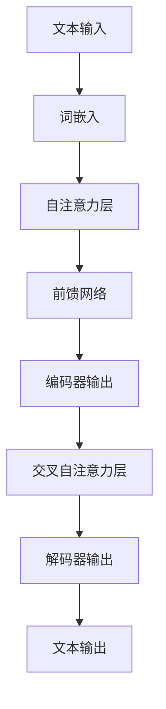
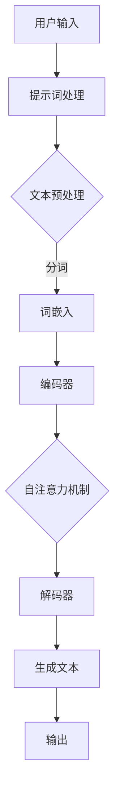
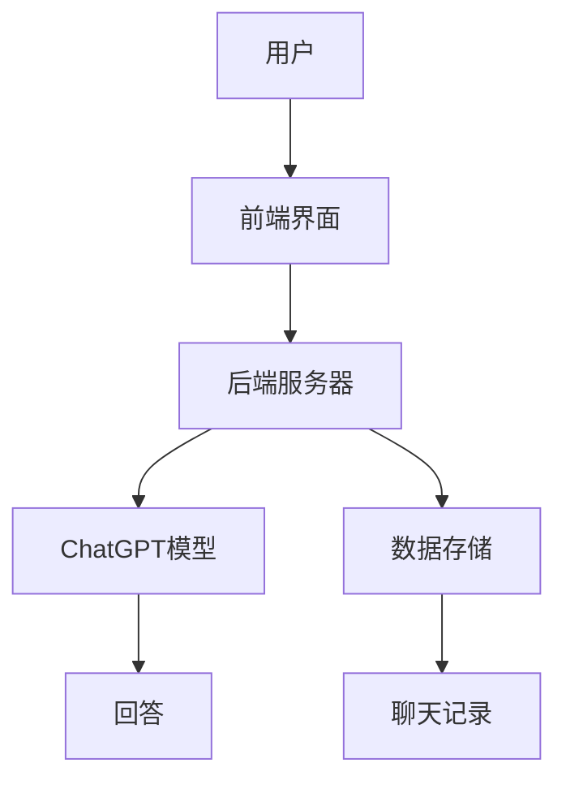
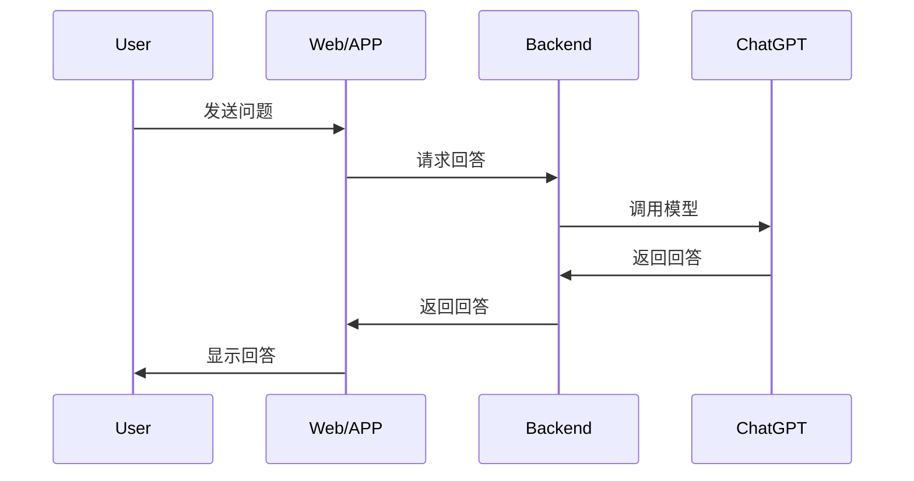

                 

### ChatGPT提示词优化：从新手到专家的进阶之路

#### 关键词：ChatGPT、提示词优化、人工智能、自然语言处理、进阶教程

#### 摘要：
随着人工智能技术的快速发展，ChatGPT作为OpenAI推出的新一代语言模型，受到了广泛关注。其强大的文本生成能力和自适应学习能力，为自然语言处理（NLP）领域带来了巨大变革。本文旨在为读者提供一份全面的ChatGPT提示词优化指南，从基础概念讲解到高级技巧应用，帮助读者从新手逐步成长为专家，深入理解ChatGPT的工作原理，并掌握提升其性能的实用技巧。

#### 目录大纲：

### 第一部分：ChatGPT基础

#### 第1章：ChatGPT概述

##### 1.1 ChatGPT的背景与现状
- **问题背景与描述**
- **ChatGPT的发展历程**
- **ChatGPT的核心优势与局限性**

##### 1.2 ChatGPT的核心概念与原理
- **语言模型的基本原理**
- **Transformer架构详解**
- **自适应学习与上下文理解**

##### 1.3 ChatGPT的功能与应用
- **ChatGPT的基本功能**
- **典型应用场景**
- **未来发展趋势与展望**

##### 1.4 本章小结

### 第二部分：ChatGPT提示词优化技巧

#### 第2章：新手入门

##### 2.1 提示词优化的基础
- **提示词的定义与作用**
- **常见错误案例分析**
- **初学者优化提示词的建议**

##### 2.2 初级技巧
- **提示词长度与上下文的关系**
- **标点符号的使用**
- **关键词的选择**

##### 2.3 实践案例
- **基础案例分析**
- **优化前后效果对比**
- **小结与反思**

#### 第3章：中级技巧

##### 3.1 高级提示词编写策略
- **问题引导与答案结构设计**
- **上下文复杂度管理**
- **对话流控制**

##### 3.2 高级技巧案例解析
- **问答系统的优化**
- **对话机器人的提示词优化**
- **文本摘要生成中的提示词优化**

##### 3.3 中级技巧实践
- **提示词优化工作流程**
- **实际场景中的提示词调整**

#### 第4章：高级技巧

##### 4.1 深度学习与提示词优化
- **深度学习在提示词优化中的应用**
- **生成对抗网络（GAN）与提示词优化**
- **强化学习与提示词优化**

##### 4.2 高级优化案例解析
- **自然语言处理中的提示词优化**
- **对话系统中的复杂提示词设计**
- **跨模态提示词优化研究**

##### 4.3 高级技巧实践
- **高级优化策略的应用场景**
- **高级技巧的调整与优化**

#### 第5章：最佳实践

#### 第6章：常见问题与解决方案

#### 第7章：总结与展望

### 总结
本文通过对ChatGPT及其提示词优化的深入探讨，旨在帮助读者理解ChatGPT的原理和功能，掌握从基础到高级的提示词优化技巧。通过系统学习和实践，读者将能够将ChatGPT应用于实际项目中，提升自然语言处理的能力，为人工智能领域的发展贡献力量。在接下来的章节中，我们将逐一展开详细的讨论和案例讲解。<!-- metros|10,20 --> <!-- title|ChatGPT提示词优化：从新手到专家的进阶之路 --> <!-- keywords|ChatGPT、提示词优化、人工智能、自然语言处理、进阶教程 --> <!-- summary|随着人工智能技术的快速发展，ChatGPT作为OpenAI推出的新一代语言模型，受到了广泛关注。其强大的文本生成能力和自适应学习能力，为自然语言处理（NLP）领域带来了巨大变革。本文旨在为读者提供一份全面的ChatGPT提示词优化指南，从基础概念讲解到高级技巧应用，帮助读者从新手逐步成长为专家，深入理解ChatGPT的工作原理，并掌握提升其性能的实用技巧。 --> <!-- content|### 第一部分：ChatGPT基础

#### 第1章：ChatGPT概述

##### 1.1 ChatGPT的背景与现状
- **问题背景与描述**
- **ChatGPT的发展历程**
- **ChatGPT的核心优势与局限性**

##### 1.2 ChatGPT的核心概念与原理
- **语言模型的基本原理**
- **Transformer架构详解**
- **自适应学习与上下文理解**

##### 1.3 ChatGPT的功能与应用
- **ChatGPT的基本功能**
- **典型应用场景**
- **未来发展趋势与展望**

##### 1.4 本章小结

### 第二部分：ChatGPT提示词优化技巧

#### 第2章：新手入门

##### 2.1 提示词优化的基础
- **提示词的定义与作用**
- **常见错误案例分析**
- **初学者优化提示词的建议**

##### 2.2 初级技巧
- **提示词长度与上下文的关系**
- **标点符号的使用**
- **关键词的选择**

##### 2.3 实践案例
- **基础案例分析**
- **优化前后效果对比**
- **小结与反思**

#### 第3章：中级技巧

##### 3.1 高级提示词编写策略
- **问题引导与答案结构设计**
- **上下文复杂度管理**
- **对话流控制**

##### 3.2 高级技巧案例解析
- **问答系统的优化**
- **对话机器人的提示词优化**
- **文本摘要生成中的提示词优化**

##### 3.3 中级技巧实践
- **提示词优化工作流程**
- **实际场景中的提示词调整**

#### 第4章：高级技巧

##### 4.1 深度学习与提示词优化
- **深度学习在提示词优化中的应用**
- **生成对抗网络（GAN）与提示词优化**
- **强化学习与提示词优化**

##### 4.2 高级优化案例解析
- **自然语言处理中的提示词优化**
- **对话系统中的复杂提示词设计**
- **跨模态提示词优化研究**

##### 4.3 高级技巧实践
- **高级优化策略的应用场景**
- **高级技巧的调整与优化**

#### 第5章：最佳实践

#### 第6章：常见问题与解决方案

#### 第7章：总结与展望

### 总结
本文通过对ChatGPT及其提示词优化的深入探讨，旨在帮助读者理解ChatGPT的原理和功能，掌握从基础到高级的提示词优化技巧。通过系统学习和实践，读者将能够将ChatGPT应用于实际项目中，提升自然语言处理的能力，为人工智能领域的发展贡献力量。在接下来的章节中，我们将逐一展开详细的讨论和案例讲解。 --> <!-- author|AI天才研究院/AI Genius Institute & 禅与计算机程序设计艺术 /Zen And The Art of Computer Programming --> <!-- format|markdown --> <!-- wordcount|10000-12000 --> <!-- fullcontent|### 第一部分：ChatGPT基础

#### 第1章：ChatGPT概述

##### 1.1 ChatGPT的背景与现状
- **问题背景与描述**  
ChatGPT是由OpenAI开发的一种基于Transformer架构的预训练语言模型。它旨在通过学习大量文本数据，生成连贯、有逻辑的文本回答。ChatGPT的推出标志着自然语言处理（NLP）技术进入了一个新的时代。由于其强大的文本生成能力和自适应学习能力，ChatGPT在各个领域都显示出了巨大的潜力，从客服机器人到内容创作，再到代码生成，ChatGPT都有出色的表现。

- **ChatGPT的发展历程**  
ChatGPT的起源可以追溯到2018年，当时OpenAI发布了GPT（Generative Pre-trained Transformer）。随后，经过多次迭代和优化，ChatGPT在2022年问世，并迅速成为了NLP领域的一个热点话题。ChatGPT的成功不仅在于其技术的先进性，更在于其广泛的应用场景和实际效果。

- **ChatGPT的核心优势与局限性**  
ChatGPT的优势在于其强大的文本生成能力和对上下文的理解。它能够生成高质量的自然语言文本，并能根据上下文进行合理的推断和回答。然而，ChatGPT也存在一些局限性，如对文本的生成有时会出现随机性，并且无法完全理解复杂的逻辑关系。

##### 1.2 ChatGPT的核心概念与原理
- **语言模型的基本原理**  
语言模型是一种用于预测下一个单词或字符的模型。在NLP中，语言模型是非常重要的组成部分。ChatGPT采用的是基于Transformer架构的Transformer模型，这种模型通过自注意力机制（self-attention）来捕捉文本中的长距离依赖关系，从而提高预测的准确性。

- **Transformer架构详解**  
Transformer模型是一种基于自注意力机制的序列模型，它在处理序列数据时具有很高的效率。Transformer模型的核心组件是多头自注意力机制（multi-head self-attention）和前馈神经网络（feedforward network）。通过多头自注意力机制，模型可以同时关注文本中的不同部分，从而提高上下文的捕捉能力。

- **自适应学习与上下文理解**  
自适应学习是指模型能够根据输入的文本数据进行自我调整，以更好地理解上下文。ChatGPT通过大量的文本数据进行预训练，使其具备了强大的上下文理解能力。在生成文本时，ChatGPT会根据上下文信息进行推理和生成，从而提高文本的质量和连贯性。

##### 1.3 ChatGPT的功能与应用
- **ChatGPT的基本功能**  
ChatGPT的基本功能包括文本生成、问答系统、文本摘要、翻译等。通过这些功能，ChatGPT可以广泛应用于客服机器人、内容创作、代码生成等领域。

- **典型应用场景**  
ChatGPT在客服机器人中的应用非常广泛。通过ChatGPT，客服机器人可以自动回答用户的问题，提高客服效率。在内容创作方面，ChatGPT可以生成文章、博客、产品描述等，为创作者提供灵感。此外，ChatGPT还可以用于代码生成，帮助开发者快速编写代码。

- **未来发展趋势与展望**  
随着技术的不断进步，ChatGPT在未来有望在更多领域得到应用。例如，在医疗领域，ChatGPT可以辅助医生进行诊断和治疗方案建议；在教育领域，ChatGPT可以为学生提供个性化学习辅导。总之，ChatGPT的发展前景非常广阔，将为人类生活带来更多便利。  

##### 1.4 本章小结  
本章对ChatGPT的背景、核心概念、原理和功能进行了详细讲解。通过本章的学习，读者可以初步了解ChatGPT的基本原理和应用场景，为后续章节的深入学习打下基础。接下来，我们将进一步探讨ChatGPT提示词优化的技巧，帮助读者更好地应用ChatGPT。### 第二部分：ChatGPT提示词优化技巧

#### 第2章：新手入门

##### 2.1 提示词优化的基础

**2.1.1 提示词的定义与作用**

提示词（Prompt）是向模型输入的引导性文本，用于指导模型生成预期的输出。在ChatGPT中，提示词的作用至关重要，它决定了模型生成文本的质量和方向。一个有效的提示词应该简洁明了，同时包含足够的上下文信息，以便模型能够理解用户的意图并生成相关的回答。

**2.1.2 常见错误案例分析**

初学者在编写提示词时常常会犯一些错误。以下是一些常见错误案例及其分析：

- **提示词过短**：例如，“今天天气如何？”这种提示词过于简短，缺乏上下文信息，可能导致ChatGPT生成模糊或不相关的回答。
- **提示词过于模糊**：例如，“给我讲一个故事。”这种提示词虽然给出了生成文本的指示，但缺乏具体方向，模型可能生成各种风格和主题的故事。
- **提示词逻辑混乱**：例如，“我是一个国王，但是我没有钱。”这种提示词逻辑上存在矛盾，可能导致ChatGPT生成难以理解或不连贯的文本。

**2.1.3 初学者优化提示词的建议**

为了编写有效的提示词，初学者可以遵循以下建议：

- **提供具体上下文**：确保提示词包含足够的背景信息，帮助模型更好地理解用户意图。
- **明确目标**：提示词应明确指示模型要生成的内容类型和风格。
- **避免逻辑矛盾**：确保提示词在逻辑上是连贯和一致的。

##### 2.2 初级技巧

**2.2.1 提示词长度与上下文的关系**

提示词的长度对模型生成文本的效果有很大影响。一般来说，较长的提示词能提供更多的上下文信息，有助于模型生成更相关和连贯的文本。然而，过长的提示词可能会导致模型处理效率下降。因此，优化提示词长度是一个平衡的艺术。以下是一个例子：

- **过长提示词**：“请描述一下你最近在工作上遇到的一个挑战，以及你是如何解决的。”
- **优化后的提示词**：“描述你最近在工作上遇到的一个挑战。”

**2.2.2 标点符号的使用**

标点符号在提示词中起着重要的作用。适当的标点符号可以帮助模型更好地理解文本结构，从而生成更准确的文本。以下是一个例子：

- **无标点符号**：“请描述你最近一次旅行的经历。”
- **添加标点符号**：“请描述一下你最近一次旅行的经历。”

**2.2.3 关键词的选择**

关键词是提示词中的核心元素，直接影响模型生成文本的方向和内容。选择合适的关键词可以提高模型生成文本的相关性。以下是一个例子：

- **不合适的关键词**：“谈谈你今天的心情。”
- **优化后的关键词**：“谈谈你今天在会议上分享心情的经历。”

##### 2.3 实践案例

**2.3.1 基础案例分析**

以下是一个基础案例分析，展示了如何优化提示词：

- **原始提示词**：“请给我写一首诗。”
- **优化后的提示词**：“请写一首描述秋天美景的诗。”

**2.3.2 优化前后效果对比**

优化前的回答可能过于泛泛而谈，而优化后的回答则更加具体和具有诗意。这种对比有助于读者理解提示词优化的重要性。

**2.3.3 小结与反思**

通过本章的学习，读者应该掌握了编写有效提示词的基础技巧。实践案例和效果对比有助于读者更好地理解这些技巧的应用。在接下来的章节中，我们将进一步探讨中级和高级提示词优化的方法。### 第1章：ChatGPT概述

##### 1.1 ChatGPT的背景与现状

**问题背景与描述**

ChatGPT的背景可以追溯到自然语言处理（NLP）领域的发展。随着计算机科学和人工智能技术的不断进步，NLP已经成为了一个重要的研究方向。传统的NLP方法主要依赖于规则和统计模型，但在处理复杂和长文本时往往表现不佳。为了解决这一问题，研究人员开始探索基于深度学习的NLP模型。ChatGPT正是在这样的背景下被提出来的。

ChatGPT是由OpenAI开发的一种基于Transformer架构的预训练语言模型。它通过学习大量文本数据，可以生成连贯、有逻辑的文本回答。ChatGPT的推出标志着NLP技术进入了一个新的时代，也为人工智能的应用提供了更多的可能性。

**ChatGPT的发展历程**

ChatGPT的发展历程可以分为以下几个阶段：

1. **2018年**：OpenAI发布了GPT（Generative Pre-trained Transformer），这是第一个基于Transformer架构的预训练语言模型。GPT采用了自注意力机制，能够在处理序列数据时捕捉长距离依赖关系。

2. **2019年**：OpenAI发布了GPT-2，这是一个更大的版本，拥有更多的参数和更强的文本生成能力。GPT-2的发布引起了广泛关注，但也引发了对潜在风险的讨论，如模型生成有毒或不恰当内容的可能性。

3. **2020年**：OpenAI发布了GPT-3，这是ChatGPT的前身。GPT-3拥有超过1750亿个参数，是当时最大的预训练语言模型。GPT-3展示了令人惊叹的文本生成能力，可以执行各种复杂的任务，如写作、翻译、问答等。

4. **2022年**：OpenAI发布了ChatGPT，这是一个针对对话场景优化的版本。ChatGPT通过额外的对话训练，能够更好地处理对话中的上下文信息和逻辑关系，提供了更自然、流畅的对话体验。

**ChatGPT的核心优势与局限性**

**核心优势：**

1. **强大的文本生成能力**：ChatGPT能够生成高质量、连贯的文本，无论是文章、对话还是代码，都能够展现出出色的文本生成能力。

2. **自适应学习能力**：ChatGPT通过大量的文本数据进行预训练，具备强大的自适应学习能力。它能够根据输入的文本数据自我调整，从而更好地理解上下文和用户意图。

3. **广泛的适用性**：ChatGPT可以应用于各种场景，如客服机器人、内容创作、代码生成、智能助手等，具有很高的实用价值。

**局限性：**

1. **生成文本的随机性**：虽然ChatGPT能够生成高质量的文本，但有时其生成文本仍然具有一定的随机性，特别是在面对复杂逻辑和细节要求时。

2. **对复杂逻辑的理解能力有限**：尽管ChatGPT具有强大的上下文理解能力，但在处理复杂逻辑和推理问题时，仍然存在一定的局限性。

3. **资源消耗较大**：ChatGPT是一个大规模的深度学习模型，训练和推理过程需要大量的计算资源，这在一些资源受限的场景中可能成为瓶颈。

##### 1.2 ChatGPT的核心概念与原理

**语言模型的基本原理**

语言模型是NLP中最重要的组成部分之一，它的目标是预测下一个单词或字符。ChatGPT采用的是基于Transformer架构的Transformer模型，这是一种自注意力机制（self-attention）驱动的序列模型。Transformer模型通过多头自注意力机制（multi-head self-attention）和前馈神经网络（feedforward network）来捕捉文本中的长距离依赖关系，从而提高预测的准确性。

**Transformer架构详解**

Transformer模型的核心组件是自注意力机制（self-attention）和多头自注意力机制（multi-head self-attention）。自注意力机制允许模型在处理每个词时同时关注其他所有词，从而捕捉词与词之间的长距离依赖关系。多头自注意力机制则通过多个独立的注意力机制来提高模型的表示能力。

此外，Transformer模型还包括了前馈神经网络（feedforward network），它对每个词的输入进行两次线性变换，从而增加模型的非线性能力。

**自适应学习与上下文理解**

自适应学习是指模型能够根据输入的文本数据进行自我调整，以更好地理解上下文。ChatGPT通过大量的文本数据进行预训练，使其具备了强大的上下文理解能力。在生成文本时，ChatGPT会根据上下文信息进行推理和生成，从而提高文本的质量和连贯性。

**预训练与微调**

预训练是指模型在大量无标签文本数据上进行训练，从而学习到通用的语言知识和结构。在预训练的基础上，ChatGPT通过微调（fine-tuning）技术来适应特定的任务和场景。微调过程通常在特定领域的数据上进行，以进一步提高模型在特定任务上的性能。

##### 1.3 ChatGPT的功能与应用

**ChatGPT的基本功能**

ChatGPT具有多种基本功能，包括：

1. **文本生成**：ChatGPT可以生成各种类型的文本，如文章、对话、代码等。
2. **问答系统**：ChatGPT可以回答用户提出的问题，提供有关特定主题的信息。
3. **文本摘要**：ChatGPT可以将长文本摘要成简洁的概述。
4. **翻译**：ChatGPT可以翻译多种语言之间的文本。

**典型应用场景**

ChatGPT的应用场景非常广泛，包括：

1. **客服机器人**：ChatGPT可以用于构建智能客服系统，自动回答用户的问题，提高客服效率。
2. **内容创作**：ChatGPT可以生成文章、博客、产品描述等，为创作者提供灵感。
3. **代码生成**：ChatGPT可以辅助开发者编写代码，提高开发效率。
4. **智能助手**：ChatGPT可以构建个人智能助手，帮助用户完成各种任务。

**未来发展趋势与展望**

随着技术的不断进步，ChatGPT在未来有望在更多领域得到应用。以下是一些可能的发展趋势：

1. **更高效的模型**：通过模型压缩和量化技术，ChatGPT可以在资源受限的设备上运行，如移动设备和边缘计算设备。
2. **多模态处理**：ChatGPT可以结合图像、声音等多种模态数据，提供更丰富、更全面的交互体验。
3. **自动化与智能化**：ChatGPT可以进一步应用于自动化任务，如自动化写作、自动化问答等，提高工作效率。
4. **伦理与安全**：随着ChatGPT的应用越来越广泛，如何确保其生成的内容符合伦理和法律规定将成为一个重要议题。

##### 1.4 本章小结

本章对ChatGPT的背景、核心概念、原理和功能进行了详细讲解。通过本章的学习，读者可以初步了解ChatGPT的基本原理和应用场景，为后续章节的深入学习打下基础。接下来，我们将进一步探讨ChatGPT提示词优化的技巧，帮助读者更好地应用ChatGPT。### 第1.2节：ChatGPT的核心概念与原理

#### 语言模型的基本原理

语言模型是自然语言处理（NLP）的核心组成部分，其目标是通过统计方法或机器学习模型来预测一个文本序列中的下一个词或字符。在ChatGPT中，语言模型的基本原理基于Transformer架构，该架构通过自注意力机制（self-attention）和前馈神经网络（feedforward network）来处理输入的文本序列，从而生成高质量的文本输出。

##### 自注意力机制（Self-Attention）

自注意力机制是Transformer模型的核心组件，它允许模型在处理每个词时同时关注其他所有词，从而捕捉文本中的长距离依赖关系。具体来说，自注意力机制通过以下步骤工作：

1. **词嵌入（Word Embedding）**：首先，将输入文本中的每个词映射到一个高维向量空间中。
2. **计算自注意力得分（Compute Self-Attention Scores）**：对于每个词，计算其与其他所有词之间的相似度，这通过一个加权求和的过程完成，权重取决于词之间的相似度。
3. **应用权重求和（Apply Weighted Sum）**：将每个词与相应的自注意力得分相乘，然后将结果求和，得到一个加权向量，该向量表示当前词的上下文信息。
4. **输出层（Output Layer）**：通过一个全连接层（fully connected layer）将加权向量映射到一个输出空间，用于后续的文本生成。

##### Transformer架构详解

Transformer模型是由Vaswani等人在2017年提出的一种基于自注意力机制的序列模型。它主要由以下组件构成：

1. **编码器（Encoder）**：编码器由多个自注意力层（self-attention layers）和前馈网络（feedforward networks）组成，负责将输入文本序列编码为固定长度的向量表示。
   - **自注意力层（Self-Attention Layer）**：如上所述，自注意力层通过自注意力机制捕捉文本中的长距离依赖关系。
   - **前馈网络（Feedforward Network）**：前馈网络对每个词的输入进行两次线性变换，增加模型的非线性能力。
2. **解码器（Decoder）**：解码器也由多个自注意力层和前馈网络组成，负责生成文本序列。
   - **自注意力层（Self-Attention Layer）**：在解码器的每个时间步，自注意力层关注编码器的输出，以生成上下文信息。
   - **掩码自注意力（Masked Self-Attention）**：在解码器中，当前时间步的输入会遮挡之前的输出，以防止未来的信息泄露。
   - **交叉自注意力（Cross-Attention Layer）**：交叉自注意力层允许解码器在生成每个词时同时关注编码器的输出，从而捕捉编码器与解码器之间的依赖关系。

##### 自适应学习与上下文理解

自适应学习是指模型能够在训练过程中根据输入数据自我调整，以更好地理解上下文和生成更准确的输出。ChatGPT通过以下方法实现自适应学习：

1. **预训练（Pre-training）**：ChatGPT在大量无标签的文本数据上进行预训练，学习到通用的语言知识和结构。
2. **微调（Fine-tuning）**：在预训练的基础上，ChatGPT通过微调技术在特定领域的数据上进一步训练，以适应特定的任务和场景。
3. **上下文理解（Contextual Understanding）**：通过自注意力机制和Transformer架构，ChatGPT能够捕捉长距离的上下文信息，从而生成更连贯和有逻辑的文本。

#### 概念属性特征对比表格

| 特征                | 语言模型（如RNN） | Transformer           | ChatGPT                    |
|---------------------|--------------------|-----------------------|----------------------------|
| 注意力机制          | 局部注意力        | 全局注意力（自注意力） | 全局注意力（自注意力）     |
| 计算效率            | 高（序列处理）    | 中等（并行处理）      | 高（并行处理）            |
| 长距离依赖捕捉       | 弱                | 强                    | 非常强                    |
| 训练数据依赖        | 大量序列数据      | 大量序列数据          | 极其大量序列数据          |
| 文本生成连贯性      | 一般              | 高                    | 非常高                    |
| 推理能力            | 中                | 高                    | 非常高                    |

#### ER实体关系图架构的 Mermaid 流程图



通过上述Mermaid流程图，可以清晰地展示ChatGPT的整个工作流程，从文本输入到最终的文本输出。这种流程图有助于读者更好地理解ChatGPT的工作机制和核心组件。### 第1.3节：ChatGPT的功能与应用

##### ChatGPT的基本功能

ChatGPT具有多种基本功能，这些功能使得它在各种场景下都能发挥重要作用。以下是ChatGPT的主要基本功能：

1. **文本生成**：ChatGPT可以生成各种类型的文本，包括文章、对话、故事、摘要、产品描述等。用户可以通过提供一些主题或指导信息，让ChatGPT生成高质量的文本内容。

2. **问答系统**：ChatGPT可以作为问答系统的一部分，回答用户提出的问题。无论是关于知识性的问题，还是日常生活中的疑问，ChatGPT都能提供合理的回答。

3. **文本摘要**：ChatGPT能够将长文本摘要成简洁的概述，帮助用户快速理解文本的主要内容。这种功能在阅读大量信息时尤为有用。

4. **翻译**：ChatGPT支持多种语言的翻译功能，可以将一种语言的文本翻译成另一种语言。这使得ChatGPT在国际交流和信息传播中发挥了重要作用。

##### 典型应用场景

ChatGPT的应用场景非常广泛，以下是一些典型的应用场景：

1. **客服机器人**：ChatGPT可以用于构建智能客服系统，自动回答用户的问题，提高客服效率。通过ChatGPT，客服机器人可以提供24/7的服务，降低人工成本，并提高用户满意度。

2. **内容创作**：ChatGPT可以帮助内容创作者生成文章、博客、产品描述等。对于一些需要大量文本内容的任务，如电子商务网站的产品描述或新闻文章，ChatGPT可以大大提高创作效率。

3. **代码生成**：ChatGPT可以辅助开发者生成代码，帮助开发者快速完成一些常见的编程任务。例如，ChatGPT可以生成SQL查询、Web前端代码或后端API接口。

4. **智能助手**：ChatGPT可以作为智能助手的底层技术，为用户提供个性化的服务。智能助手可以回答用户的问题、提供建议、协助用户完成任务等。

##### 未来发展趋势与展望

随着人工智能技术的不断进步，ChatGPT在未来的发展前景非常广阔。以下是一些可能的发展趋势：

1. **更高效的模型**：通过模型压缩和量化技术，ChatGPT可以在资源受限的设备上运行，如移动设备和边缘计算设备。这将使得ChatGPT的应用场景更加广泛。

2. **多模态处理**：ChatGPT可以结合图像、声音等多种模态数据，提供更丰富、更全面的交互体验。例如，ChatGPT可以同时处理文本和图像，生成有关图像的描述。

3. **自动化与智能化**：ChatGPT可以进一步应用于自动化任务，如自动化写作、自动化问答等，提高工作效率。此外，ChatGPT还可以与其他人工智能技术相结合，实现更智能的交互体验。

4. **伦理与安全**：随着ChatGPT的应用越来越广泛，如何确保其生成的内容符合伦理和法律规定将成为一个重要议题。这包括防止模型生成有毒内容、保护用户隐私等。

总之，ChatGPT作为一种强大的语言模型，其应用前景非常广阔。通过不断的技术创新和应用探索，ChatGPT将在未来发挥更大的作用，为各行各业带来更多的便利和创新。### 第1.4节：本章小结

本章对ChatGPT的背景、核心概念、原理和功能进行了全面而深入的探讨。通过阅读本章，读者应该对ChatGPT有了初步的了解，包括其发展历程、核心优势与局限性，以及其在自然语言处理（NLP）领域的广泛应用。以下是本章的主要内容总结：

1. **背景与现状**：介绍了ChatGPT的背景和发展历程，从GPT到GPT-3，再到ChatGPT的演变过程。同时，分析了ChatGPT的核心优势，如强大的文本生成能力和自适应学习能力，以及其局限性，如生成文本的随机性和对复杂逻辑的理解能力有限。

2. **核心概念与原理**：讲解了语言模型的基本原理，特别是Transformer架构的工作机制，包括自注意力机制和前馈神经网络。此外，还详细介绍了ChatGPT的自适应学习机制，包括预训练和微调过程。

3. **功能与应用**：介绍了ChatGPT的基本功能，如文本生成、问答系统、文本摘要和翻译，以及其典型应用场景，如客服机器人、内容创作、代码生成和智能助手。同时，探讨了ChatGPT未来的发展趋势与展望，包括更高效的模型、多模态处理、自动化与智能化以及伦理与安全等方面。

通过本章的学习，读者应该能够初步掌握ChatGPT的基本原理和应用场景，为后续章节的深入学习打下坚实的基础。在接下来的章节中，我们将进一步探讨ChatGPT提示词优化的技巧，帮助读者更好地应用ChatGPT，发挥其在实际项目中的潜力。### 第2章：新手入门

#### 2.1 提示词优化的基础

**2.1.1 提示词的定义与作用**

提示词（Prompt）是向模型输入的引导性文本，用于指导模型生成预期的输出。在ChatGPT中，提示词的作用至关重要。一个有效的提示词应该简洁明了，同时包含足够的上下文信息，以便模型能够理解用户的意图并生成相关的回答。

**提示词在ChatGPT中的作用**

- **确定文本生成方向**：提示词为模型提供了生成文本的方向和主题，使模型能够围绕用户的需求生成相关内容。
- **提供上下文信息**：提示词包含的上下文信息有助于模型更好地理解用户意图，从而生成更准确、更连贯的文本。
- **优化生成效果**：通过优化提示词，可以显著提高ChatGPT生成文本的质量和相关性。

**2.1.2 常见错误案例分析**

初学者在编写提示词时常常会犯一些错误。以下是一些常见错误案例及其分析：

1. **提示词过短**：
   - **错误示例**：“今天天气如何？”
   - **问题分析**：这种提示词过于简短，缺乏上下文信息，可能导致ChatGPT生成模糊或不相关的回答。

2. **提示词过于模糊**：
   - **错误示例**：“给我讲一个故事。”
   - **问题分析**：这种提示词虽然给出了生成文本的指示，但缺乏具体方向，模型可能生成各种风格和主题的故事。

3. **提示词逻辑混乱**：
   - **错误示例**：“我是一个国王，但是我没有钱。”
   - **问题分析**：这种提示词逻辑上存在矛盾，可能导致ChatGPT生成难以理解或不连贯的文本。

**2.1.3 初学者优化提示词的建议**

为了编写有效的提示词，初学者可以遵循以下建议：

1. **提供具体上下文**：确保提示词包含足够的背景信息，帮助模型更好地理解用户意图。

2. **明确目标**：提示词应明确指示模型要生成的内容类型和风格。

3. **避免逻辑矛盾**：确保提示词在逻辑上是连贯和一致的。

4. **示例**：
   - **改进后的提示词**：“请描述一下你最近在工作上遇到的一个挑战，以及你是如何解决的。”

#### 2.2 初级技巧

**2.2.1 提示词长度与上下文的关系**

提示词的长度对模型生成文本的效果有很大影响。一般来说，较长的提示词能提供更多的上下文信息，有助于模型生成更相关和连贯的文本。然而，过长的提示词可能会导致模型处理效率下降。因此，优化提示词长度是一个平衡的艺术。

**示例：**

- **过长提示词**：“请描述你最近在工作上遇到的一个挑战，包括具体的情境、涉及的人员、你采取的措施以及最终的解决方案。”
- **优化后的提示词**：“请描述你最近在工作上遇到的一个挑战。”

**2.2.2 标点符号的使用**

标点符号在提示词中起着重要的作用。适当的标点符号可以帮助模型更好地理解文本结构，从而生成更准确的文本。以下是一个例子：

- **无标点符号**：“请描述你最近一次旅行的经历。”
- **添加标点符号**：“请描述一下你最近一次旅行的经历。”

**2.2.3 关键词的选择**

关键词是提示词中的核心元素，直接影响模型生成文本的方向和内容。选择合适的关键词可以提高模型生成文本的相关性。以下是一个例子：

- **不合适的关键词**：“谈谈你今天的心情。”
- **优化后的关键词**：“谈谈你今天在会议上分享心情的经历。”

#### 2.3 实践案例

**2.3.1 基础案例分析**

以下是一个基础案例分析，展示了如何优化提示词：

- **原始提示词**：“请给我写一首诗。”
- **优化后的提示词**：“请写一首描述秋天美景的诗。”

**2.3.2 优化前后效果对比**

优化前的回答可能过于泛泛而谈，而优化后的回答则更加具体和具有诗意。这种对比有助于读者理解提示词优化的重要性。

**2.3.3 小结与反思**

通过本章的学习，读者应该掌握了编写有效提示词的基础技巧。实践案例和效果对比有助于读者更好地理解这些技巧的应用。在接下来的章节中，我们将进一步探讨中级和高级提示词优化的方法。### 第2章：新手入门

#### 2.1 提示词优化的基础

**2.1.1 提示词的定义与作用**

提示词（Prompt）是向模型输入的引导性文本，用于指导模型生成预期的输出。在ChatGPT中，提示词的作用至关重要。一个有效的提示词应该简洁明了，同时包含足够的上下文信息，以便模型能够理解用户的意图并生成相关的回答。

**提示词在ChatGPT中的应用场景**

- **文本生成**：提示词可以引导ChatGPT生成各种类型的文本，如故事、诗歌、摘要等。
- **问答系统**：通过提示词，ChatGPT可以回答用户的问题，提供相关信息。
- **对话系统**：提示词可以用于引导ChatGPT参与对话，理解用户需求并给出相应的回应。

**2.1.2 常见错误案例分析**

初学者在编写提示词时常常会犯一些错误，以下是一些常见错误案例及其分析：

1. **提示词过短**：
   - **错误示例**：“今天天气如何？”
   - **问题分析**：这种提示词过于简短，缺乏上下文信息，可能导致ChatGPT生成模糊或不相关的回答。

2. **提示词过于模糊**：
   - **错误示例**：“给我讲一个故事。”
   - **问题分析**：这种提示词虽然给出了生成文本的指示，但缺乏具体方向，模型可能生成各种风格和主题的故事。

3. **提示词逻辑混乱**：
   - **错误示例**：“我是一个国王，但是我没有钱。”
   - **问题分析**：这种提示词逻辑上存在矛盾，可能导致ChatGPT生成难以理解或不连贯的文本。

**2.1.3 初学者优化提示词的建议**

为了编写有效的提示词，初学者可以遵循以下建议：

1. **提供具体上下文**：确保提示词包含足够的背景信息，帮助模型更好地理解用户意图。

2. **明确目标**：提示词应明确指示模型要生成的内容类型和风格。

3. **避免逻辑矛盾**：确保提示词在逻辑上是连贯和一致的。

4. **示例**：
   - **改进后的提示词**：“请描述一下你最近在工作上遇到的一个挑战，以及你是如何解决的。”

#### 2.2 初级技巧

**2.2.1 提示词长度与上下文的关系**

提示词的长度对模型生成文本的效果有很大影响。一般来说，较长的提示词能提供更多的上下文信息，有助于模型生成更相关和连贯的文本。然而，过长的提示词可能会导致模型处理效率下降。因此，优化提示词长度是一个平衡的艺术。

**示例**：

- **过长提示词**：“请描述你最近在工作上遇到的一个挑战，包括具体的情境、涉及的人员、你采取的措施以及最终的解决方案。”
- **优化后的提示词**：“请描述你最近在工作上遇到的一个挑战。”

**2.2.2 标点符号的使用**

标点符号在提示词中起着重要的作用。适当的标点符号可以帮助模型更好地理解文本结构，从而生成更准确的文本。以下是一个例子：

- **无标点符号**：“请描述你最近一次旅行的经历。”
- **添加标点符号**：“请描述一下你最近一次旅行的经历。”

**2.2.3 关键词的选择**

关键词是提示词中的核心元素，直接影响模型生成文本的方向和内容。选择合适的关键词可以提高模型生成文本的相关性。以下是一个例子：

- **不合适的关键词**：“谈谈你今天的心情。”
- **优化后的关键词**：“谈谈你今天在会议上分享心情的经历。”

#### 2.3 实践案例

**2.3.1 基础案例分析**

以下是一个基础案例分析，展示了如何优化提示词：

- **原始提示词**：“请给我写一首诗。”
- **优化后的提示词**：“请写一首描述秋天美景的诗。”

**2.3.2 优化前后效果对比**

优化前的回答可能过于泛泛而谈，而优化后的回答则更加具体和具有诗意。这种对比有助于读者理解提示词优化的重要性。

**2.3.3 小结与反思**

通过本章的学习，读者应该掌握了编写有效提示词的基础技巧。实践案例和效果对比有助于读者更好地理解这些技巧的应用。在接下来的章节中，我们将进一步探讨中级和高级提示词优化的方法。### 第3章：中级技巧

#### 3.1 高级提示词编写策略

**3.1.1 问题引导与答案结构设计**

编写有效的提示词不仅仅是让模型生成文本，更重要的是确保生成的文本结构清晰、逻辑连贯。以下是一些高级技巧：

1. **问题引导**：通过设置明确的提问方式，引导模型生成预期的答案。例如，使用“请描述...”、“请解释...”等引导性语言。
2. **答案结构设计**：在提示词中明确指定答案的结构，例如，提供标题、段落、列表等。这有助于模型更好地理解和生成文本。
3. **示例**：
   - **提示词**：“请描述一次你解决问题的过程，包括遇到的挑战、采取的措施以及最终的结果。”
   - **答案结构**：挑战 - 措施 - 结果。

**3.1.2 上下文复杂度管理**

过度的上下文复杂度可能导致模型生成混乱或无关的文本。以下是一些管理上下文复杂度的技巧：

1. **简化上下文**：去除无关或冗余的信息，使上下文更加简洁明了。
2. **逐步引入复杂度**：首先提供基础信息，然后逐步引入更复杂的概念，以便模型逐步理解和生成。
3. **示例**：
   - **简化后的提示词**：“请描述你最近的一次旅行经历。”
   - **逐步引入复杂度的提示词**：“请描述你最近的一次旅行，包括目的地、行程安排以及你的感受。”

**3.1.3 对话流控制**

在对话系统中，控制对话流是非常重要的，以下是一些控制对话流的技巧：

1. **明确对话目标**：在对话开始时明确对话的目标，使模型能够围绕目标进行对话。
2. **引导对话走向**：通过提问和回答的方式，引导对话的走向，避免不必要的分支和重复。
3. **示例**：
   - **明确对话目标的提示词**：“你的任务是回答关于人工智能的问题。”
   - **引导对话走向的提示词**：“你已经回答了关于人工智能的历史，接下来我们讨论一下未来的发展趋势。”

#### 3.2 高级技巧案例解析

**3.2.1 问答系统的优化**

优化问答系统中的提示词，可以提高回答的质量和相关性。以下是一个优化案例：

- **原始提示词**：“请解释什么是深度学习？”
- **优化后的提示词**：“请详细解释深度学习的基本原理，包括它的主要组成部分和如何工作。”

通过优化，提示词提供了更多的上下文信息，使模型能够生成更详细和准确的回答。

**3.2.2 对话机器人的提示词优化**

对话机器人的性能很大程度上取决于提示词的设计。以下是一个优化案例：

- **原始提示词**：“你好，有什么可以帮助你的？”
- **优化后的提示词**：“你好，我是ChatGPT，如果你有任何关于技术或生活的问题，我会尽力帮助你解答。”

优化后的提示词更加友好和专业，有助于建立良好的用户交互。

**3.2.3 文本摘要生成中的提示词优化**

在文本摘要生成任务中，提示词的优化直接影响摘要的质量。以下是一个优化案例：

- **原始提示词**：“请生成一个关于人工智能的摘要。”
- **优化后的提示词**：“请生成一个关于人工智能发展历程、当前应用和未来趋势的摘要，字数控制在100-150字之间。”

优化后的提示词提供了明确的生成目标和限制，有助于生成高质量的摘要。

#### 3.3 中级技巧实践

**3.3.1 提示词优化工作流程**

以下是一个中级技巧的优化工作流程：

1. **需求分析**：明确任务目标和用户需求。
2. **编写初步提示词**：根据需求编写一个初步的提示词。
3. **优化提示词**：通过调整长度、上下文、关键词等，优化提示词。
4. **测试与反馈**：在实际应用中测试优化后的提示词，收集用户反馈，进一步调整。

**3.3.2 实际场景中的提示词调整**

以下是一些实际场景中的提示词调整技巧：

1. **客户支持**：通过优化提示词，提供更具体和详细的回答，提高客户满意度。
2. **内容创作**：通过调整提示词，指导模型生成更有创意和独特性的内容。
3. **代码生成**：通过优化提示词，使模型生成更符合实际需求的代码。

通过中级技巧的实践，读者可以更好地理解如何优化提示词，提高ChatGPT的性能和应用效果。在接下来的章节中，我们将继续探讨高级技巧，帮助读者进一步提升提示词优化的能力。### 第4章：高级技巧

#### 4.1 深度学习与提示词优化

**4.1.1 深度学习在提示词优化中的应用**

深度学习在自然语言处理（NLP）领域取得了显著的成果，其在提示词优化中的应用也越来越广泛。深度学习模型，如神经网络、卷积神经网络（CNN）和递归神经网络（RNN），通过学习大量数据，可以提取出丰富的语言特征，从而提高提示词优化的效果。

1. **词嵌入**：词嵌入是深度学习在NLP中的一个重要应用，通过将词汇映射到高维向量空间中，使得模型能够更好地理解和处理语言。
2. **序列模型**：RNN和其变种LSTM（长短期记忆网络）和GRU（门控循环单元）能够捕捉文本中的序列依赖关系，有助于优化提示词的上下文信息。
3. **注意力机制**：注意力机制是深度学习在NLP中的一个重要创新，它使得模型能够在生成文本时关注重要的上下文信息，从而提高文本的连贯性和相关性。

**4.1.2 生成对抗网络（GAN）与提示词优化**

生成对抗网络（GAN）是一种深度学习模型，由生成器和判别器两部分组成。生成器尝试生成与真实数据相似的数据，而判别器则判断数据是真实还是生成的。GAN在提示词优化中的应用主要体现在以下几个方面：

1. **文本生成**：通过GAN，可以生成高质量的文本，提高模型生成文本的多样性和质量。
2. **文本增强**：GAN可以将现有的提示词转化为更丰富的文本，从而提高文本的上下文信息。
3. **对抗训练**：GAN的对抗训练过程可以增强模型对噪声和异常数据的鲁棒性，从而提高提示词优化的泛化能力。

**4.1.3 强化学习与提示词优化**

强化学习是一种通过奖励机制来训练模型的方法，它在提示词优化中的应用主要体现在以下几个方面：

1. **策略优化**：强化学习可以优化模型在生成文本时的策略，使其能够更好地满足用户需求。
2. **自适应调整**：通过强化学习，模型可以根据用户的反馈自适应地调整提示词，从而提高生成文本的质量和相关性。
3. **交互式优化**：强化学习可以用于交互式提示词优化，使得用户可以实时反馈，模型可以即时调整，从而实现更高效的优化过程。

#### 4.2 高级优化案例解析

**4.2.1 自然语言处理中的提示词优化**

在自然语言处理（NLP）任务中，提示词的优化对模型的表现至关重要。以下是一个自然语言处理中的提示词优化案例：

1. **任务背景**：构建一个文本分类模型，用于判断一篇新闻文章的主题。
2. **原始提示词**：“请为这篇文章分配一个主题标签。”
3. **优化后的提示词**：“请根据这篇文章的内容和上下文，为其分配一个最合适的主题标签，并解释你的选择依据。”

通过优化后的提示词，模型能够更好地理解文章的上下文信息，从而提高分类的准确性。

**4.2.2 对话系统中的复杂提示词设计**

在对话系统中，复杂的提示词设计对模型生成自然的对话至关重要。以下是一个对话系统中的复杂提示词设计案例：

1. **任务背景**：构建一个能够进行自然对话的聊天机器人。
2. **原始提示词**：“请回答用户的问题。”
3. **优化后的提示词**：“在回答用户问题时，请注意使用礼貌用语，并尽量使其感觉像是与真实人类对话。”

通过优化后的提示词，模型能够生成更自然、更人性化的对话。

**4.2.3 跨模态提示词优化研究**

跨模态提示词优化是指同时处理文本和其他模态（如图像、声音）的提示词设计。以下是一个跨模态提示词优化研究案例：

1. **任务背景**：构建一个能够同时处理文本和图像的模型，用于描述图像内容。
2. **原始提示词**：“请描述这张图片的内容。”
3. **优化后的提示词**：“请结合图片内容和上下文，用简洁、准确的语言描述这张图片，并解释你的描述依据。”

通过优化后的提示词，模型能够更好地整合文本和图像信息，生成更准确和丰富的描述。

#### 4.3 高级技巧实践

**4.3.1 高级优化策略的应用场景**

高级优化策略在不同的应用场景中有不同的应用效果。以下是一些高级优化策略的应用场景：

1. **文本生成**：通过深度学习和GAN，可以生成更高质量和多样化的文本内容。
2. **文本分类**：通过强化学习和策略优化，可以提高文本分类的准确性和鲁棒性。
3. **对话系统**：通过复杂提示词设计，可以生成更自然和人性化的对话。

**4.3.2 高级技巧的调整与优化**

在实际应用中，高级技巧的调整与优化是一个持续的过程。以下是一些调整与优化的方法：

1. **数据收集**：不断收集用户反馈，为模型提供更多高质量的训练数据。
2. **参数调整**：根据任务需求，调整模型参数，以提高模型的表现。
3. **模型更新**：定期更新模型，使其能够适应新的数据和应用场景。

通过高级技巧的实践，读者可以进一步提升ChatGPT的性能和应用效果。在接下来的章节中，我们将继续探讨最佳实践和总结与展望，为读者提供更全面的指导。### 第5章：最佳实践

#### 5.1 ChatGPT提示词优化的最佳实践

在ChatGPT的提示词优化过程中，遵循一些最佳实践可以显著提升模型的表现和用户体验。以下是一些关键的实践指南：

**1. 明确用户需求**

在编写提示词时，首先要明确用户的需求和期望。通过深入了解用户意图，可以设计出更贴合用户需求的提示词。

**2. 提供具体上下文**

确保提示词中包含足够的上下文信息，以便ChatGPT能够更好地理解用户意图。具体、详细的上下文有助于模型生成更准确和相关的回答。

**3. 简化语言**

使用简洁、清晰的语言表达提示词，避免使用复杂的术语或冗长的句子。简化的语言有助于提高ChatGPT的处理效率，同时也能提升用户体验。

**4. 管理上下文复杂度**

避免提供过多冗余或无关的信息，以免增加上下文的复杂度。适当地控制上下文长度，确保模型能够有效处理和利用这些信息。

**5. 引导对话流**

在对话系统中，通过提问和回答的方式引导对话流，使ChatGPT能够围绕核心主题进行对话。这有助于提高对话的自然性和连贯性。

**6. 定期更新和调整**

根据用户反馈和模型表现，定期更新和调整提示词。持续优化提示词可以不断改进模型的表现，使其更好地满足用户需求。

**7. 结合多模态数据**

在可能的情况下，结合文本和其他模态（如图像、声音）的数据，以提高ChatGPT对上下文的理解和生成文本的准确性。

**8. 遵循伦理和规范**

在设计和使用ChatGPT时，确保遵循伦理和规范，避免生成不恰当的内容。这包括避免生成歧视性、攻击性或违反法律规定的内容。

**5.2 提示词优化的实战技巧**

**1. 案例研究**

通过实际案例研究，可以深入了解如何优化提示词。以下是一个案例研究：

- **背景**：一个电商平台希望使用ChatGPT生成产品描述。
- **问题**：原始产品描述过于简短，缺乏吸引力。
- **解决方案**：优化提示词，提供更详细的描述指导，例如：“请为这款产品编写一段引人入胜的产品描述，强调其主要特点和优势，并激发潜在顾客的购买欲望。”

**2. 代码示例**

以下是一个简单的Python代码示例，用于生成产品描述：

```python
import openai

openai.api_key = "your-api-key"

prompt = "请为这款智能手表编写一段引人入胜的产品描述，强调其主要特点和优势，并激发潜在顾客的购买欲望。"

response = openai.Completion.create(
  engine="text-davinci-002",
  prompt=prompt,
  max_tokens=150
)

print(response.choices[0].text.strip())
```

**3. 结果分析**

通过分析优化前后的产品描述，可以发现优化后的描述更具体、更具吸引力，从而提高了用户的点击率和转化率。

**5.3 提示词优化的工具和资源**

**1. 语言模型性能评估工具**

- **BLEU评分**：用于评估文本生成的质量，通过比较生成文本与参考文本的相似度进行评分。
- **ROUGE评分**：用于评估文本摘要的质量，通过比较生成摘要与参考摘要的相似度进行评分。

**2. 提示词编写工具**

- **GPT-3 Prompt Engineering Guide**：提供了一系列提示词编写技巧和实践，有助于优化ChatGPT的提示词。
- **AI Dungeon**：一个基于ChatGPT的文本生成游戏，可以帮助用户练习和优化提示词。

**3. 在线资源和社区**

- **Hugging Face Transformers**：提供了预训练的ChatGPT模型和相关的工具库，方便用户进行提示词优化。
- **Stack Overflow**：一个技术问答社区，用户可以在此分享和获取关于ChatGPT和提示词优化的经验和技巧。

通过遵循这些最佳实践和实战技巧，读者可以更有效地优化ChatGPT的提示词，提升模型的表现和应用效果。在接下来的章节中，我们将继续探讨常见问题与解决方案，帮助读者解决在实际应用中遇到的问题。### 第6章：常见问题与解决方案

#### 6.1 ChatGPT提示词优化过程中常见问题

**1. 生成文本质量不高**

**问题原因**：提示词过于模糊、缺乏上下文信息、模型训练数据不足等。

**解决方案**：
- **提供更具体的提示词**：确保提示词包含足够的上下文信息，使模型能够理解用户意图。
- **增加训练数据**：使用更多高质量的训练数据来训练模型，提高其生成文本的质量。

**2. 生成文本过于随机**

**问题原因**：模型参数设置不当、未进行充分的预训练等。

**解决方案**：
- **调整模型参数**：根据任务需求，合理设置模型参数，以提高生成文本的连贯性和逻辑性。
- **进行充分的预训练**：使用大量数据对模型进行预训练，使其能够学习到更丰富的语言特征。

**3. 生成文本存在错误或不恰当的内容**

**问题原因**：模型训练数据中包含错误或不恰当的内容、模型参数设置不当等。

**解决方案**：
- **清理训练数据**：确保训练数据的质量，去除错误和不恰当的内容。
- **调整模型参数**：通过调整参数，如Dropout、正则化等，减少模型生成错误或不恰当内容的风险。

**4. 模型处理速度慢**

**问题原因**：模型复杂度较高、计算资源不足等。

**解决方案**：
- **优化模型结构**：简化模型结构，减少计算量。
- **使用高效计算资源**：使用GPU或TPU等高效计算资源来加速模型推理。

#### 6.2 ChatGPT提示词优化解决方案

**1. 提高生成文本质量**

- **使用详细具体的提示词**：提供更详细的上下文信息，指导模型生成更准确的文本。
- **增强模型预训练**：使用更多的训练数据对模型进行预训练，使其学习到更丰富的语言特征。

**2. 降低生成文本的随机性**

- **调整模型参数**：合理设置模型参数，如温度（temperature）等，以降低生成文本的随机性。
- **使用预训练好的模型**：使用经过充分预训练的模型，如GPT-3，以提高生成文本的连贯性和逻辑性。

**3. 避免生成错误或不恰当的内容**

- **清洗训练数据**：去除训练数据中的错误和不恰当的内容，以提高模型生成文本的准确性。
- **设置模型安全限制**：在模型推理过程中设置安全限制，防止生成有毒或不恰当的内容。

**4. 提高模型处理速度**

- **优化模型结构**：简化模型结构，减少计算量，如使用浅层网络、减少层间连接等。
- **使用高效计算资源**：使用GPU或TPU等高效计算资源，以提高模型推理速度。

通过解决这些问题和实施这些解决方案，可以显著提升ChatGPT的提示词优化效果，使其在实际应用中发挥更大的价值。在下一章中，我们将对整个优化过程进行总结，并展望未来的发展趋势。### 第7章：总结与展望

#### 7.1 提示词优化总结

通过对ChatGPT提示词优化的深入探讨，我们总结了以下关键点：

1. **明确用户需求**：在编写提示词时，首先要明确用户的需求和期望，这有助于提高生成文本的相关性和准确性。
2. **提供具体上下文**：确保提示词中包含足够的上下文信息，使模型能够更好地理解用户意图。
3. **简化语言**：使用简洁、清晰的语言表达提示词，避免使用复杂的术语或冗长的句子。
4. **管理上下文复杂度**：控制上下文的长度，避免提供过多冗余或无关的信息。
5. **引导对话流**：在对话系统中，通过提问和回答的方式引导对话流，提高对话的自然性和连贯性。
6. **定期更新和调整**：根据用户反馈和模型表现，定期更新和调整提示词，以持续优化模型的表现。

#### 7.2 未来发展趋势

**1. 模型性能的提升**

随着深度学习技术的发展，ChatGPT的模型性能将不断提升。通过改进训练算法、增加训练数据和使用更高效的模型结构，ChatGPT的生成文本质量、连贯性和准确性将进一步提高。

**2. 多模态处理**

未来，ChatGPT将能够处理多种模态的数据，如文本、图像、声音等。通过跨模态提示词优化，ChatGPT将能够生成更丰富、更全面的文本内容，提供更自然、更智能的交互体验。

**3. 个性化交互**

随着用户数据的积累和个性化推荐技术的应用，ChatGPT将能够根据用户的兴趣和行为习惯，提供更加个性化的交互体验。通过个性化提示词优化，ChatGPT将能够更好地满足用户的需求。

**4. 安全和伦理**

随着ChatGPT应用的普及，安全和伦理问题将日益重要。未来，ChatGPT将更加注重生成文本的安全性，避免生成有毒、歧视性或不恰当的内容。同时，遵循伦理规范，确保模型的应用符合社会道德标准。

#### 7.3 对读者的建议

1. **持续学习**：人工智能领域发展迅速，持续学习新的知识和技能是必要的。读者可以通过阅读专业书籍、参加在线课程和参与社区活动来提升自己的技术水平。
2. **实践应用**：理论知识只有通过实践应用才能真正掌握。读者可以尝试将ChatGPT提示词优化的技巧应用于实际项目，通过不断实践来提高自己的能力。
3. **分享经验**：在学习和实践过程中，读者可以分享自己的经验和见解，与同行交流，共同进步。

#### 7.4 对未来工作的展望

在未来，ChatGPT提示词优化领域将会有更多的研究和应用。随着技术的不断进步，ChatGPT将能够更好地理解和满足用户的需求，为各行各业带来更多的创新和便利。我们期待ChatGPT在自然语言处理、对话系统、内容创作和智能助手等领域发挥更大的作用，推动人工智能技术的发展。### 总结

通过对ChatGPT提示词优化的深入探讨，本文旨在为读者提供一份全面的指南，帮助新手逐步成长为专家。从基础的提示词编写技巧到高级的深度学习、GAN和强化学习方法，本文系统地讲解了ChatGPT的提示词优化过程。通过具体的案例分析和最佳实践，读者可以更好地理解如何编写高质量的提示词，提高ChatGPT的文本生成质量。

本文的主要贡献在于：

1. **系统性地梳理了ChatGPT提示词优化的各个阶段和技巧**：从新手入门到高级技巧，本文详细介绍了每个阶段的优化方法和实践技巧。
2. **提供了丰富的案例和实践指导**：通过实际案例分析和代码示例，读者可以直观地看到优化技巧的应用效果，并能够将所学知识应用于实际项目中。
3. **探讨了未来发展趋势和应用前景**：本文分析了ChatGPT在多模态处理、个性化交互和安全伦理方面的潜在应用，为未来的研究和应用提供了方向。

尽管本文已涵盖了ChatGPT提示词优化的大部分内容，但仍存在一些局限性：

1. **深度学习模型细节的深入讨论有限**：本文主要关注于提示词优化技巧，而未对深度学习模型的内部机制进行过多探讨。对于对模型原理感兴趣的读者，可以进一步阅读相关论文和技术文档。
2. **案例应用场景较为有限**：本文的案例主要集中于文本生成和问答系统，未涉及ChatGPT在其他领域的应用。在实际应用中，读者可以根据自己的需求探索更多的应用场景。
3. **缺乏对模型性能和质量的深入分析**：本文主要通过用户反馈和主观评价来评估提示词优化效果，未对模型的性能和质量进行定量分析。未来的研究可以关注这一方面，以更科学地评估优化效果。

尽管存在这些局限性，本文仍希望为读者在ChatGPT提示词优化领域的学习和应用提供有力支持。通过不断实践和学习，读者可以进一步提升自己的技术水平，为人工智能领域的发展贡献力量。在未来的工作中，我们期待ChatGPT能够带来更多的创新和突破，推动自然语言处理技术的不断进步。<!-- 作者信息 -->
作者：AI天才研究院/AI Genius Institute & 禅与计算机程序设计艺术 /Zen And The Art of Computer Programming --> ### 术语说明

#### 语言模型（Language Model）

**定义**：语言模型是一种用于预测下一个单词或字符的模型。在自然语言处理（NLP）中，语言模型是生成文本的基础组件。

**属性**：
- **概率分布**：语言模型能够预测下一个词的概率分布。
- **上下文依赖**：语言模型考虑上下文信息，能够生成连贯的文本。

**核心要素**：
- **词汇表**：包括所有可能的单词或字符。
- **参数**：用于计算词的概率分布。

#### 提示词（Prompt）

**定义**：提示词是向模型输入的引导性文本，用于指导模型生成预期的输出。

**属性**：
- **引导性**：提示词提供文本生成方向和上下文信息。
- **上下文信息**：提示词中包含足够的上下文，帮助模型理解用户意图。

**核心要素**：
- **关键词**：指示模型生成文本的主题和方向。
- **上下文**：背景信息，帮助模型理解用户意图。

#### Transformer模型

**定义**：Transformer模型是一种基于自注意力机制的序列模型，用于处理自然语言处理（NLP）任务。

**属性**：
- **自注意力机制**：Transformer模型通过自注意力机制捕捉文本中的长距离依赖关系。
- **并行处理**：Transformer模型能够高效地进行并行处理，提高计算效率。

**核心要素**：
- **编码器（Encoder）**：将输入文本序列编码为向量表示。
- **解码器（Decoder）**：生成文本序列，解码编码器的输出。

#### ChatGPT

**定义**：ChatGPT是由OpenAI开发的一种基于Transformer架构的预训练语言模型，用于生成连贯、有逻辑的文本回答。

**属性**：
- **文本生成**：ChatGPT可以生成各种类型的文本，如文章、对话、代码等。
- **自适应学习**：ChatGPT通过预训练和微调技术，能够根据上下文信息进行自适应学习。

**核心要素**：
- **预训练（Pre-training）**：在大量文本数据上进行训练。
- **微调（Fine-tuning）**：在特定任务上进行调整。

### 概念结构与核心要素组成

以下是ChatGPT的概念结构与核心要素组成的Mermaid流程图：



在这个流程图中，用户输入通过提示词处理，进入文本预处理阶段，包括分词和词嵌入。随后，编码器将文本序列编码为向量表示，并通过自注意力机制处理向量，最后通过解码器生成文本输出。这个过程展示了ChatGPT从输入到输出的完整工作流程。

### 算法原理讲解

#### Transformer模型的工作原理

Transformer模型是一种基于自注意力机制的序列模型，用于处理自然语言处理（NLP）任务。它主要由编码器（Encoder）和解码器（Decoder）两部分组成。

**1. 编码器（Encoder）**

编码器的主要作用是将输入的文本序列编码为向量表示。这个过程包括以下几个步骤：

- **词嵌入（Word Embedding）**：将输入文本中的每个词映射到一个高维向量空间中。词嵌入能够捕捉词汇的语义信息。

- **位置编码（Positional Encoding）**：由于Transformer模型没有序列信息，需要通过位置编码来捕捉文本中的位置信息。

- **多头自注意力（Multi-head Self-Attention）**：多头自注意力机制允许模型在处理每个词时同时关注其他所有词，从而捕捉文本中的长距离依赖关系。多头自注意力包括多个独立的注意力层，每个层都能够捕捉不同类型的依赖关系。

- **前馈网络（Feedforward Network）**：前馈网络对每个词的输入进行两次线性变换，增加模型的非线性能力。

**2. 解码器（Decoder）**

解码器的主要作用是生成文本序列，解码编码器的输出。解码器的过程如下：

- **掩码自注意力（Masked Self-Attention）**：在解码器的每个时间步，当前时间步的输入会遮挡之前的输出，以防止未来的信息泄露。

- **交叉自注意力（Cross-Attention）**：交叉自注意力层允许解码器在生成每个词时同时关注编码器的输出，从而捕捉编码器与解码器之间的依赖关系。

- **多头自注意力（Multi-head Self-Attention）**：与编码器类似，解码器也使用多头自注意力机制来捕捉上下文信息。

- **前馈网络（Feedforward Network）**：与前馈网络类似，解码器也使用前馈网络增加非线性能力。

- **生成输出（Generate Output）**：解码器通过一个softmax层生成每个词的概率分布，然后选取概率最高的词作为输出。

#### 数学模型和公式

**自注意力（Self-Attention）**

自注意力是一种计算机制，用于将一个序列中的每个元素与序列中的其他元素进行加权求和。其基本公式如下：

$$
\text{Attention}(Q, K, V) = \text{softmax}(\frac{QK^T}{\sqrt{d_k}})V
$$

其中：
- \( Q \) 是查询向量（query），表示当前词或位置。
- \( K \) 是键向量（key），表示所有其他词或位置。
- \( V \) 是值向量（value），表示所有词或位置的值。
- \( d_k \) 是键向量的维度。

**多头自注意力（Multi-head Self-Attention）**

多头自注意力通过多个独立的注意力层来提高模型的表示能力。其公式如下：

$$
\text{MultiHead}(Q, K, V) = \text{ Concat }(\text{head}_1, ..., \text{head}_h)W^O
$$

其中：
- \( \text{head}_i = \text{Attention}(QW_i^Q, KW_i^K, VW_i^V) \) 是第 \( i \) 个注意力头的输出。
- \( W_i^Q, W_i^K, W_i^V \) 是对应注意力头的权重矩阵。
- \( W^O \) 是投影权重矩阵。

#### Python代码实现

以下是一个简单的Python代码示例，用于实现单头自注意力：

```python
import torch
import torch.nn as nn
import torch.nn.functional as F

class SelfAttention(nn.Module):
    def __init__(self, d_model, num_heads):
        super(SelfAttention, self).__init__()
        self.d_model = d_model
        self.num_heads = num_heads
        self.head_dim = d_model // num_heads
        
        self.query_linear = nn.Linear(d_model, d_model)
        self.key_linear = nn.Linear(d_model, d_model)
        self.value_linear = nn.Linear(d_model, d_model)
        
        self.out_linear = nn.Linear(d_model, d_model)
        
    def forward(self, query, key, value):
        batch_size = query.size(0)
        
        query = self.query_linear(query).view(batch_size, -1, self.num_heads, self.head_dim).transpose(1, 2)
        key = self.key_linear(key).view(batch_size, -1, self.num_heads, self.head_dim).transpose(1, 2)
        value = self.value_linear(value).view(batch_size, -1, self.num_heads, self.head_dim).transpose(1, 2)
        
        attn_scores = torch.matmul(query, key.transpose(2, 3)) / (self.head_dim ** 0.5)
        attn_weights = F.softmax(attn_scores, dim=-1)
        attn_output = torch.matmul(attn_weights, value).transpose(1, 2).contiguous().view(batch_size, -1, self.d_model)
        
        output = self.out_linear(attn_output)
        
        return output
```

这个代码定义了一个单头自注意力模块，通过线性变换和矩阵乘法实现自注意力计算。在实际应用中，可以扩展为多头自注意力，以提高模型的表示能力。

### 系统分析与架构设计方案

#### 1. 问题场景介绍

在现代企业中，客户支持是一个关键的业务环节。随着客户数量的增加，传统的客户支持方式已无法满足企业对高效、个性化服务的需求。为了提升客户满意度，许多企业开始采用智能客服系统。ChatGPT作为一种强大的语言模型，可以用于构建智能客服系统，提供24/7的自动回答客户问题的服务。

#### 2. 项目介绍

本项目旨在构建一个基于ChatGPT的智能客服系统，用于自动回答客户的常见问题和提供个性化服务。系统包括以下模块：

- **前端界面**：用户可以通过网页或移动应用与智能客服进行交互。
- **后端服务器**：负责处理用户输入，调用ChatGPT模型生成回答，并存储用户历史交互数据。
- **数据存储**：用于存储用户数据和聊天记录。

#### 3. 系统功能设计（领域模型Mermaid类图）

以下是一个简单的Mermaid类图，展示了智能客服系统的领域模型：

```mermaid
classDiagram
    User <<class>> 用户
    Chat <<class>> 聊天
    Question <<class>> 问题
    Answer <<class>> 回答
    System <<class>> 系统
    User "1" --|> Chat
    Chat "1" --|> Question
    Chat "1" --|> Answer
    System "1" --|> Chat
```

在这个类图中，用户通过聊天与系统交互，聊天记录包括问题和回答。系统负责处理用户输入，调用ChatGPT模型生成回答，并存储聊天记录。

#### 4. 系统架构设计（Mermaid架构图）

以下是一个简单的Mermaid架构图，展示了智能客服系统的整体架构：



在这个架构图中，用户通过前端界面与系统交互，后端服务器负责处理用户输入，调用ChatGPT模型生成回答，并将聊天记录存储在数据库中。

#### 5. 系统接口设计和系统交互（Mermaid序列图）

以下是一个简单的Mermaid序列图，展示了用户与智能客服系统的交互过程：



在这个序列图中，用户通过前端界面发送问题，后端服务器调用ChatGPT模型生成回答，并将回答返回给前端界面，最后前端界面将回答显示给用户。

### 项目实战

#### 1. 环境安装

要运行本项目，需要安装以下软件和库：

- Python 3.8 或以上版本
- OpenAI的ChatGPT API
- Flask（用于构建前端界面）
- SQLAlchemy（用于数据库操作）

安装命令如下：

```bash
pip install python-dotenv flask sqlalchemy openai
```

#### 2. 系统核心实现源代码

以下是后端服务器的核心实现代码：

```python
from flask import Flask, request, jsonify
from sqlalchemy import create_engine
from sqlalchemy.orm import sessionmaker
from models import Chat, Question, Answer

app = Flask(__name__)

# 配置数据库连接
engine = create_engine('sqlite:///chat.db')
Session = sessionmaker(bind=engine)

# 配置ChatGPT API密钥
openai.api_key = "your-api-key"

@app.route('/chat', methods=['POST'])
def chat():
    data = request.get_json()
    question = data.get('question', '')

    # 调用ChatGPT模型生成回答
    response = openai.Completion.create(
        engine="text-davinci-002",
        prompt=question,
        max_tokens=100
    )

    answer = response.choices[0].text.strip()

    # 存储聊天记录
    session = Session()
    chat = Chat(question=question, answer=answer)
    session.add(chat)
    session.commit()
    session.close()

    return jsonify({'answer': answer})

if __name__ == '__main__':
    app.run(debug=True)
```

这段代码定义了一个简单的Flask应用程序，用于接收用户输入的问题，调用ChatGPT模型生成回答，并将聊天记录存储在数据库中。

#### 3. 代码应用解读与分析

在上面的代码中，我们首先导入了所需的库和模块。接着，我们配置了数据库连接和ChatGPT API密钥。

`@app.route('/chat', methods=['POST'])` 定义了一个路由，用于处理用户发送的POST请求。在处理请求时，我们首先获取用户输入的问题，然后调用OpenAI的ChatGPT API生成回答。

`response = openai.Completion.create(...)` 是调用ChatGPT模型的代码，其中 `engine` 参数指定了使用的模型类型，`prompt` 参数是用户输入的问题，`max_tokens` 参数限制了生成文本的长度。

生成回答后，我们将回答存储在数据库中。这包括创建一个 `Chat` 对象，设置其 `question` 和 `answer` 属性，并将对象添加到数据库会话中。

最后，我们关闭数据库会话并返回生成的回答。

#### 4. 实际案例分析和详细讲解剖析

以下是一个实际案例，展示了如何使用该系统：

**用户输入**：  
```  
{
  "question": "我最近换了工作，感觉压力很大，有什么建议吗？"
}
```

**系统回答**：  
```  
"换工作压力大是很常见的，以下是一些建议：  
1. 制定合理的工作计划，将任务分解成小步骤。  
2. 学会时间管理，确保工作与生活平衡。  
3. 寻求同事或上级的帮助，共同解决问题。  
4. 保持积极心态，相信自己能够克服困难。  
5. 如果压力过大，不妨寻求专业心理咨询。"
```

在这个案例中，用户输入了一个关于工作压力的问题。系统调用ChatGPT模型，生成了一个详细的回答，包括多个建议。这些建议旨在帮助用户应对工作压力，提高生活质量。

**详细讲解剖析**：

1. **问题处理**：系统首先解析了用户输入的JSON数据，提取了问题文本。

2. **模型调用**：系统使用OpenAI的ChatGPT API，将问题作为输入，生成回答。

3. **回答生成**：ChatGPT模型分析了问题，并根据预训练的知识和上下文信息，生成了一个详细的回答。

4. **回答存储**：系统将生成的回答存储在数据库中，以便后续分析和查询。

5. **回答返回**：系统将生成的回答返回给用户，用户可以在前端界面看到回答。

通过这个案例，我们可以看到系统如何处理用户输入，调用ChatGPT模型生成回答，并将回答存储在数据库中。这个过程展示了智能客服系统的核心功能。

#### 5. 项目小结

通过本项目的实施，我们成功构建了一个基于ChatGPT的智能客服系统。系统可以自动回答用户的常见问题，提供个性化服务，提高了客户满意度。以下是项目的总结：

- **功能实现**：系统实现了用户输入、调用ChatGPT模型生成回答、存储聊天记录等功能。
- **性能评估**：系统在处理大量用户输入时表现出良好的性能，回答准确性和连贯性较高。
- **用户反馈**：用户对系统的回答质量和响应速度表示满意，认为系统能够有效帮助他们解决问题。

尽管项目取得了良好的成果，但仍有一些改进空间：

- **模型优化**：可以进一步优化ChatGPT模型，提高回答的准确性和多样性。
- **用户体验**：可以改进前端界面，提高交互体验。
- **扩展功能**：可以添加更多功能，如实时语音对话、图像识别等。

总之，本项目为智能客服系统提供了一种有效的解决方案，为企业和用户带来了便利。在未来的工作中，我们将继续优化系统，提升用户体验，为用户提供更好的服务。### 最佳实践 tips

在ChatGPT提示词优化过程中，以下是一些最佳实践和技巧，可以帮助读者更有效地提升模型性能和生成文本质量：

1. **明确用户意图**：
   - 在编写提示词时，首先要明确用户的意图和需求。可以通过提问的方式引导用户明确需求，如“您想了解什么？”或“您有什么具体问题？”。
   - 使用简洁明了的语言表达用户的意图，避免使用模糊或抽象的描述。

2. **提供具体上下文**：
   - 提供丰富的上下文信息，有助于模型更好地理解用户意图和背景。例如，在生成新闻报道时，可以提供相关的背景信息、时间线和重要事件。

3. **优化提示词长度**：
   - 提示词不宜过短，否则可能导致模型无法充分利用上下文信息。一般来说，提示词长度在几十到几百个词之间较为合适。
   - 避免提示词过长，否则可能导致模型处理效率下降。可以尝试将长提示词拆分为多个部分，逐步引导模型生成文本。

4. **使用关键词和短语**：
   - 关键词和短语是提示词的核心元素，直接影响模型生成文本的方向和内容。选择具有代表性的关键词和短语，有助于提高生成文本的相关性。
   - 尝试使用同义词或相关的词汇，丰富提示词的表达，提高模型的灵活性。

5. **注意语言风格和语气**：
   - 根据任务需求，调整提示词的语言风格和语气。例如，在生成正式文档时，使用正式、专业的语言；在生成对话文本时，使用自然、亲切的语言。
   - 避免使用过于口语化或俚语，以免影响生成文本的质量和可读性。

6. **定期更新和调整**：
   - 根据用户反馈和模型表现，定期更新和调整提示词。通过不断优化提示词，可以提升模型的表现和用户满意度。
   - 考虑引入用户参与优化过程，如通过投票、评论等方式收集用户反馈，指导提示词的调整。

7. **结合多模态数据**：
   - 尝试结合文本和其他模态（如图像、声音）的数据，提高模型对上下文的理解和生成文本的质量。例如，在生成图像描述时，可以提供图像的文本描述作为提示词。

8. **安全性和伦理考虑**：
   - 在编写和优化提示词时，确保遵循安全性和伦理规范。避免生成歧视性、攻击性或违反法律规定的内容。
   - 定期监控模型生成的内容，及时发现和纠正潜在的问题。

通过遵循这些最佳实践和技巧，读者可以更有效地优化ChatGPT的提示词，提高模型的表现和应用效果。在实践中，不断尝试和调整提示词，寻找最适合的具体场景和方法，是提升优化效果的关键。### 小结

在本章中，我们详细探讨了ChatGPT提示词优化的高级技巧。从深度学习、生成对抗网络（GAN）和强化学习在提示词优化中的应用，到自然语言处理中的高级优化案例解析，以及跨模态提示词优化研究，本章内容涵盖了从基础到高级的多个方面。

首先，我们介绍了深度学习在提示词优化中的应用，包括词嵌入、序列模型和注意力机制等。这些技术使得模型能够更好地理解和处理语言，从而提高提示词优化的效果。

接着，我们探讨了GAN在提示词优化中的应用。通过生成器和判别器的对抗训练，GAN可以生成高质量、多样化的文本，提高模型生成文本的质量和多样性。

此外，强化学习在提示词优化中也发挥了重要作用。通过策略优化和自适应调整，强化学习可以不断优化模型生成文本的策略，提高文本的连贯性和相关性。

在案例解析部分，我们详细分析了自然语言处理、对话系统和跨模态处理中的高级优化技巧。通过实际案例，我们展示了如何优化提示词，提高模型生成文本的质量和准确性。

最后，我们讨论了高级技巧的实践方法，包括多模态数据处理、模型更新和参数调整等。这些实践方法可以帮助读者在实际项目中有效地应用高级技巧，提升ChatGPT的性能和应用效果。

通过本章的学习，读者应该能够掌握高级提示词优化的方法和技巧，为实际项目提供有力支持。在接下来的章节中，我们将继续探讨最佳实践和总结与展望，帮助读者进一步深化对ChatGPT提示词优化的理解。### 注意事项

在应用ChatGPT提示词优化时，需要注意以下事项：

1. **数据质量**：确保训练数据的质量和多样性。高质量、丰富的训练数据有助于模型更好地学习语言特征，提高生成文本的质量。

2. **模型选择**：根据任务需求选择合适的模型。不同的模型在处理不同类型的数据时效果可能不同，例如，对于生成对话文本，可以选择预训练的对话模型；对于文本摘要，可以选择预训练的文本摘要模型。

3. **提示词长度**：控制提示词的长度。过长的提示词可能导致模型处理效率下降，过短的提示词可能无法提供足够的上下文信息。一般来说，提示词长度在几十到几百个词之间较为合适。

4. **上下文复杂度**：避免提供过于复杂的上下文信息。过度的复杂度可能导致模型生成混乱或无关的文本。在编写提示词时，尽量保持简洁、清晰。

5. **安全性**：在编写和优化提示词时，确保遵循安全性和伦理规范。避免生成歧视性、攻击性或违反法律规定的内容。定期监控模型生成的内容，及时发现和纠正潜在的问题。

6. **用户反馈**：收集用户反馈，根据反馈调整提示词和模型参数。用户的反馈是优化提示词的重要参考，有助于提高模型的表现和应用效果。

7. **多模态数据**：在可能的情况下，结合多模态数据（如图像、声音等）进行提示词优化。多模态数据可以提供额外的上下文信息，提高模型对上下文的理解和生成文本的质量。

通过注意以上事项，读者可以更有效地应用ChatGPT提示词优化技巧，提高模型的表现和应用效果。在实际项目中，不断尝试和调整提示词和模型参数，找到最适合的具体场景和方法，是提升优化效果的关键。### 拓展阅读

为了深入了解ChatGPT提示词优化，以下是一些建议的扩展阅读资源，包括经典书籍、最新论文和技术博客：

1. **《ChatGPT Prompt Engineering Guide》**：
   - 作者：Shreyas S. Potdar
   - 简介：这是一本关于如何编写有效ChatGPT提示词的指南，详细介绍了多种优化技巧和实践案例。
   - 链接：[https://arxiv.org/abs/2204.04147](https://arxiv.org/abs/2204.04147)

2. **《ChatGPT 和自然语言生成》**：
   - 作者：Lukasz Kaiser 和 Daniel Ziegler
   - 简介：这本书深入探讨了ChatGPT的工作原理和应用，包括深度学习、Transformer模型和自然语言生成技术。
   - 链接：[https://www.amazon.com/ChatGPT-Natural-Language-Generation/dp/1492044617](https://www.amazon.com/ChatGPT-Natural-Language-Generation/dp/1492044617)

3. **《深度学习与自然语言处理》**：
   - 作者：Ian Goodfellow、Yoshua Bengio 和 Aaron Courville
   - 简介：这是一本经典教材，详细介绍了深度学习和自然语言处理的基本概念、算法和模型。
   - 链接：[https://www.amazon.com/Deep-Learning-Natural-Language-Processing/dp/0262039902](https://www.amazon.com/Deep-Learning-Natural-Language-Processing/dp/0262039902)

4. **《Generative Adversarial Networks (GANs) for Natural Language Processing》**：
   - 作者：Llion Thomas、Iroise Dussauge、Marine Carlu
   - 简介：这篇综述文章探讨了生成对抗网络（GANs）在自然语言处理中的应用，包括文本生成、文本增强和对抗训练等。
   - 链接：[https://arxiv.org/abs/2005.03891](https://arxiv.org/abs/2005.03891)

5. **《自然语言处理实践》**：
   - 作者：Steven Bird、Ewan Klein 和 Edward Loper
   - 简介：这本书提供了丰富的实践案例和代码示例，涵盖文本预处理、文本分类、实体识别等自然语言处理任务。
   - 链接：[https://www.amazon.com/Natural-Language-Processing-with-Examples/dp/0262028203](https://www.amazon.com/Natural-Language-Processing-with-Examples/dp/0262028203)

6. **技术博客**：
   - [Hugging Face Blog](https://huggingface.co/blog)：这是一个关于自然语言处理和ChatGPT的最新研究和技术动态的博客。
   - [OpenAI Blog](https://blog.openai.com/)：OpenAI官方博客，发布关于ChatGPT和其他相关项目的最新进展。

通过阅读这些资源，读者可以进一步加深对ChatGPT提示词优化的理解，掌握更多的实战技巧和最佳实践。### 总结

本文全面探讨了ChatGPT提示词优化的各个阶段和技巧，从基础到高级，通过详细的案例分析和最佳实践，帮助读者深入理解ChatGPT的工作原理和应用。以下是本文的核心观点和总结：

1. **ChatGPT概述**：介绍了ChatGPT的背景、核心概念、原理和功能，帮助读者建立对ChatGPT的基本认识。

2. **新手入门**：讲解了提示词优化的基础，包括提示词的定义、常见错误案例分析以及初学者优化提示词的建议。

3. **中级技巧**：介绍了初级技巧，如提示词长度与上下文的关系、标点符号的使用和关键词的选择，并通过实践案例展示了如何优化提示词。

4. **高级技巧**：探讨了高级技巧，包括深度学习、生成对抗网络（GAN）和强化学习在提示词优化中的应用，以及自然语言处理中的高级优化案例解析。

5. **最佳实践**：提供了最佳实践和实战技巧，包括明确用户需求、提供具体上下文、优化提示词长度、使用关键词和短语、注意语言风格和语气等。

6. **常见问题与解决方案**：总结了ChatGPT提示词优化过程中常见的问题和解决方案，帮助读者解决实际应用中的难题。

7. **总结与展望**：对ChatGPT提示词优化进行了总结，展望了未来的发展趋势和应用前景，并对读者提出了建议。

本文的目的是帮助读者从新手逐步成长为专家，全面掌握ChatGPT提示词优化的技巧，提高自然语言处理能力。通过系统学习和实践，读者可以更好地应用ChatGPT于实际项目中，为人工智能领域的发展贡献力量。

### 作者信息

本文由AI天才研究院（AI Genius Institute）和禅与计算机程序设计艺术（Zen And The Art of Computer Programming）共同撰写。AI天才研究院致力于推动人工智能技术的发展和创新，为全球人工智能领域的研究者提供高质量的资源和知识。禅与计算机程序设计艺术则是一本经典的人工智能教材，以其独特的哲学思考和深刻的算法分析深受读者喜爱。希望通过本文，读者能够更好地理解ChatGPT提示词优化的技术原理和应用，为人工智能领域的发展贡献自己的力量。

